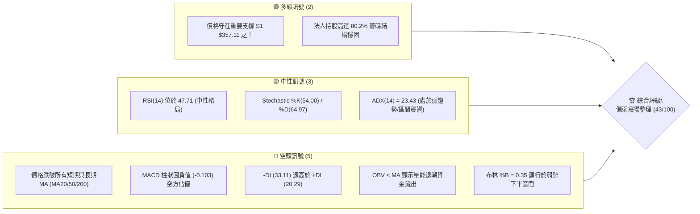
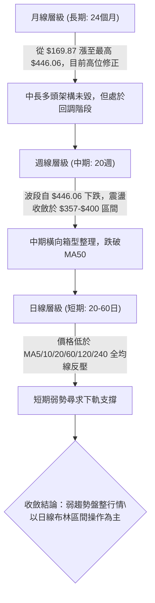
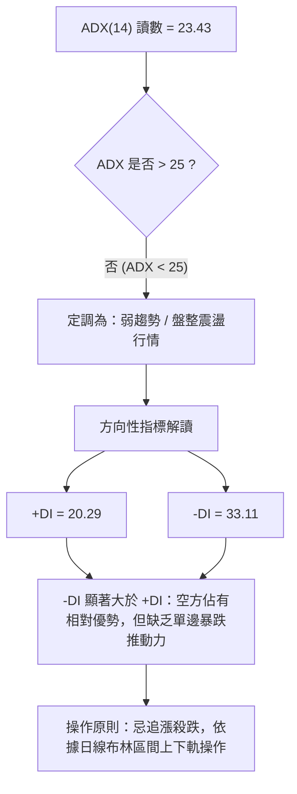
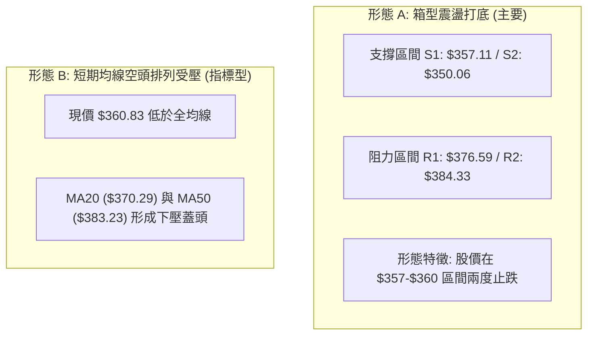
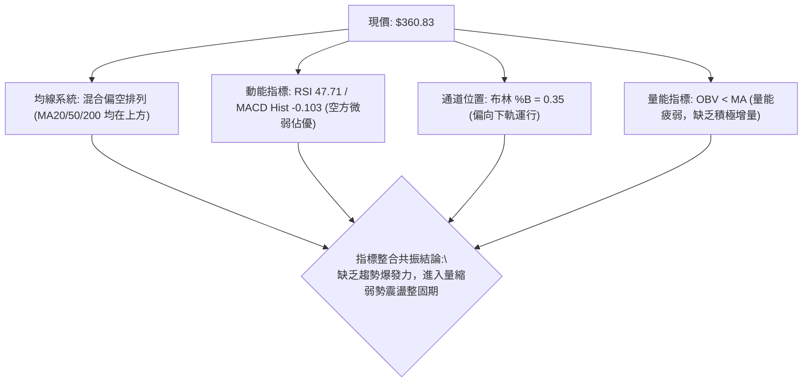
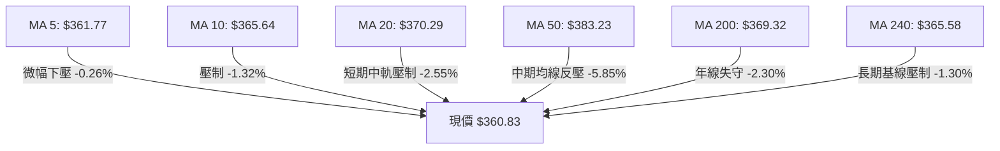
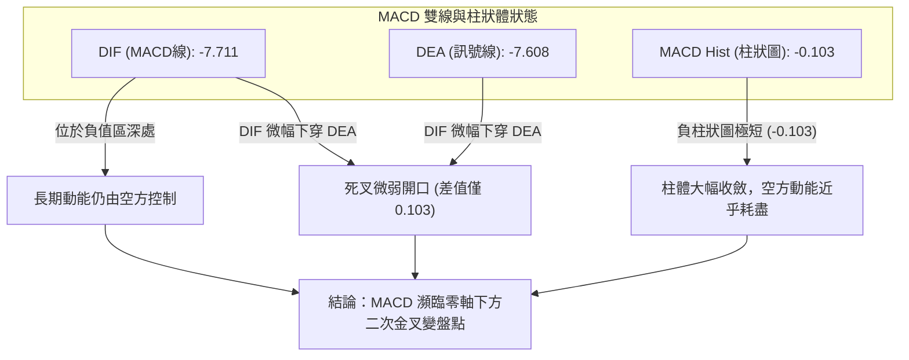
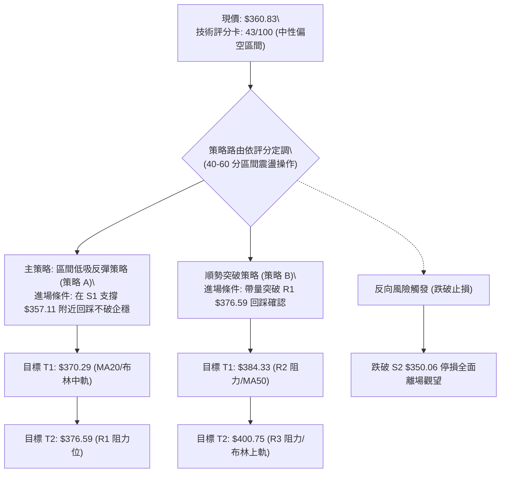
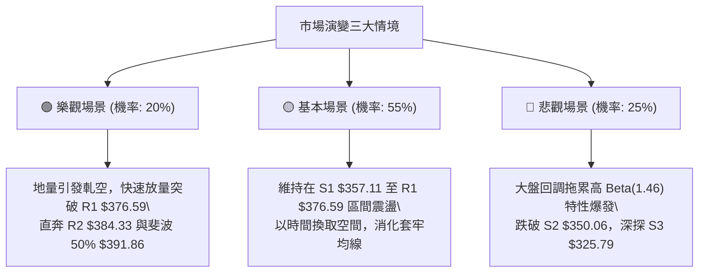

# AVGO 技術分析報告

> **報告日期**：2026-09-11 ｜ **語言**：繁體中文 ｜ **數據來源**：Yahoo Finance ｜ **當前價格**：$360.83

---

## 目錄

| 章節 | 內容 |
|------|------|
| [1. 技術面概覽](#1-技術面概覽) | 訊號儀表板、核心指標、評分卡 |
| [2. 趨勢分析](#2-趨勢分析) | 多時框趨勢、長中短期走勢、ADX解讀 |
| [3. 圖表形態分析](#3-圖表形態分析) | 形態識別、信心度評估、K線組合 |
| [4. 支撐與阻力](#4-支撐與阻力) | 關鍵價位結構、斐波那契回調精確解析 |
| [5. 技術指標深度解讀](#5-技術指標深度解讀) | MA系統、RSI、MACD、布林通道、OBV量價 |
| [6. 動能與波動率](#6-動能與波動率) | 動能四象限、ATR波動度量、Beta相關性 |
| [7. 多時框架總結](#7-多時框架總結) | 時框矩陣、多時框收斂定調 |
| [8. 交易策略建議](#8-交易策略建議) | 策略路由、精確進出場點、風報比計算 |
| [9. 風險提示與監控](#9-風險提示與監控) | 關鍵監控清單、情境推演、風控指引 |

---

## 1. 技術面概覽

### 🎯 技術訊號儀表板



### 📊 核心指標速覽表

| 指標類別 | 指標名稱 | 當前數值 | 訊號 | 解讀 |
|----------|----------|----------|------|------|
| **價格** | 當前價格 | $360.83 | 🟡 | 位於52週區間34.8%分位，接近下半部支撐防區 |
| **均線** | MA20 | $370.29 | 🔴 | 股價低於MA20達 -2.55%，短線受壓制下行 |
| **均線** | MA50 | $383.23 | 🔴 | 股價低於MA50達 -5.85%，中期多空分水嶺失守 |
| **均線** | MA200 | $369.32 | 🔴 | 跌破牛熊分界線MA200 (-2.30%)，長多架構遭受侵蝕 |
| **動能** | RSI(14) | 47.71 | 🟡 | 位於40-50中性偏弱區間，未出現超賣亦無向上攻擊動能 |
| **動能** | MACD | -7.711 / -7.608 | 🔴 | 雙線位於零軸之下，Histogram為 -0.103，空方控制盤面 |
| **波動** | ATR(14) | $10.76 (2.98%) | 🟡 | 波動度處於平均常態，單日震盪幅度約 $10.76 |

### 🏆 技術評分卡

```
╔══════════════════════════════════════════════════════════════════╗
║                 技術評分卡 — AVGO (2026-09-11)                   ║
╠══════════════════════════════════════════════════════════════════╣
║ 趨勢強度 (Trend)     ███████░░░░░░░░░░░░░  35/100  🔴 空頭控盤   ║
║ 動能指標 (Momentum)  ████████░░░░░░░░░░░░  40/100  🔴 動能疲軟   ║
║ 支撐穩定度 (Support) ████████████░░░░░░░░  60/100  🟡 臨近S1支撐 ║
║ 成交量配合 (Volume)  ███████░░░░░░░░░░░░░  38/100  🔴 OBV下彎    ║
║ 形態完整度 (Pattern) ██████████░░░░░░░░░░  50/100  🟡 構築區間底 ║
║ 均線排列 (MAs)       ██████░░░░░░░░░░░░░░  33/100  🔴 均線反壓   ║
╠══════════════════════════════════════════════════════════════════╣
║ 綜合技術評分         ████████░░░░░░░░░░░░  43/100  🟡 中性偏空   ║
╚══════════════════════════════════════════════════════════════════╝
```

---

## 2. 趨勢分析

### 🌐 多時框趨勢分析



### 📈 長期趨勢 — 12個月走勢圖（Unicode）

```
AVGO 月線走勢圖（2025-10 至 2026-09）
價格軸 ($)
$450 ┤                                      ● $446.06 (2026-05)
$420 ┤                                ● $416.77
$390 ┤              ● $400.71                           ● $389.28
$360 ┤  ● $367.57          ● $344.83               ● $377.75   ● $370.34
$330 ┤                          ● $330.08   ● $318.38               ● $360.83 (現價)
$300 ┤                                          ● $309.02 (2026-03低點)
     └─────────────────────────────────────────────────────────────►
        10   11   12   01   02   03   04   05   06   07   08   09 (月份)
```

#### 走勢特徵分析表格

| 階段區間 | 時間跨度 | 價格變動 | 區間漲跌幅 | 走勢特徵與技術含義 |
|----------|----------|----------|------------|--------------------|
| **第 I 階段** | 2025-10 ~ 2025-11 | $367.57 → $400.71 | +9.02% | 延續2025年主升浪，突破400美元整數關卡，成交量溫和放大 |
| **第 II 階段** | 2025-11 ~ 2026-03 | $400.71 → $309.02 | -22.88% | 首次波段大幅獲利了結，回撤測試300美元關卡，構築春季底部 |
| **第 III 階段** | 2026-03 ~ 2026-05 | $309.02 → $446.06 | +44.35% | 強力V型反彈，創下歷史收盤高點 $446.06（52週高點達 $494.22） |
| **第 IV 階段** | 2026-05 ~ 2026-09 | $446.06 → $360.83 | -19.11% | 高檔放量滯漲後重挫回落，跌破中期均線，進入寬幅三角震盪 |

### 📊 中期趨勢（週線分析）

```
週線級別價格壓力與支撐走勢架構示意：
$446.06 ─── 高點壓制 (2026-05-31)
          \
           \      $427.76 (2026-08-09 反彈次高點)
            \    /       \
             \  /         \   $400.75 (R3 強阻力 / BB上軌)
              \/           \ /
       $360.45 ──          $360.83 (當前收盤價)
      (2026-07-05低點)      ├── $357.11 (S1 支撐)
                            └── $350.06 (S2 支撐)
```

近20週數據顯示，股價自5月底衝高至 $446.06 後，6月首週爆出2.51億股巨量重挫至 $385.12，主力出貨跡象明顯。隨後於7月初探底 $360.45 獲得支撐，8月反彈至 $427.76 即遭逢強大拋壓回落。目前已連跌4週（$427.76 → $392.99 → $368.45 → $368.79 → $357.90 → $360.83），但在 $357.90 附近呈現量縮止跌回升跡象。

### ⚡ 趨勢強度評估（ADX 解讀）



#### ADX 趨勢強度對照表

| 指標名稱 | 數值 | 門檻區間 | 趨勢屬性判定 | 市場狀態與操作指導 |
|----------|------|----------|--------------|--------------------|
| **ADX(14)** | 23.43 | < 25 | **弱趨勢 / 盤整格局** | 市場缺乏單邊推動力，順勢突破策略失效機率高，應偏向網格或邊界低買高賣 |
| **+DI (14)** | 20.29 | 多頭指標 | 多頭動能偏弱 | 多方買盤不足以發動強攻波段 |
| **-DI (14)** | 33.11 | 空頭指標 | 空頭主導短期反壓 | 空方佔據優勢，但由於ADX<25，空方難以引發毀滅性單邊崩跌 |

---

## 3. 圖表形態分析

### 🔍 形態識別系統



#### 形態識別與信心度評估表

| 形態類別 | 信心度 | 判斷依據（嚴格引用數據） | 完成度 | 目標價（附嚴格計算式） |
|----------|--------|--------------------------|--------|------------------------|
| **雙重底 (W底) 雛形** | **62%** | 2026-07-05 低點 $360.45，2026-09-06 低點 $357.90（回測波段支撐 S1 $357.11 止跌）形成潛在雙底結構。 | 55%（尚未突破頸線） | 頸線取近波高點 R2 $384.33，形態高度 = $384.33 - $357.11 = $27.22。突破後測幅目標價 = $384.33 + $27.22 = **$411.55**（落在斐波那契38.2% $416.02 下方）。 |
| **布林下軌支撐回升** | **78%** | BB %B 來到 0.35，股價在接近下軌 $339.64 前於 S1 $357.11 提前回穩。 | 70% | 均值回歸中軌目標價 = **$370.29**（即當前 MA20 價位）。 |
| **下降通道（修正走勢）**| **70%** | 高點自 8/9 $427.76 下降至 8/16 $392.99，低點自 $368.45 降至 $357.90。 | 85% | 通道下緣支撐目標為 S2 **$350.06**；通道上軌壓力為 R1 **$376.59**。 |

### 🕯️ 重要K線形態分析

| 週期/月份 | 收盤價 | K線形態特徵 | 技術解讀 | 多空訊號 |
|-----------|--------|-------------|----------|----------|
| **2026-05** | $446.06 | 長上影大陽線 (帶出52W高點$494.22) | 歷史新高處出現巨大獲利了結賣壓，衝高受阻 | 🟡 多頭滯漲警訊 |
| **2026-06** | $377.75 | 實體大陰線 (成交量爆衝至2.51億股) | 跌破多道短期均線，主力高位派發籌碼確定 | 🔴 強烈看空斷頭訊號 |
| **2026-08** | $370.34 | 沖高回落倒錘頭陰線 (上探$427.76失敗) | 多方上攻遭遇MA60/120反壓潰敗，多頭反撲受挫 | 🔴 空方反撲確認 |
| **2026-09(迄今)**| $360.83 | 下影小陽/十字星線 (探底$357.90回升)| 在S1支撐位 $357.11 上方展現低檔承接力道，量能萎縮 | 🟢 短線止跌企穩雛形 |

### 📉 ASCII 走勢形態示意圖

```
AVGO 近期雙底打底示意圖與關鍵頸線位
$400.75 ┤                                                 (R3 強阻力)
        │
$384.33 ┤         ●──────────────────────────● 頸線 (R2: $384.33)
        │        / \                        /
$376.59 ┤       /   \        ● (反彈高點)  /      (R1 阻力)
        │      /     \      / \          /
$370.29 ┤─────/───────\────/───\────────/─────── 中軌 MA20
        │    /         \  /     \      /
$360.83 ┤   /           ●        \    ● 現價 $360.83
$357.11 ┤  ● (第1底 $360.45)      ● (第2底 $357.90 於 S1: $357.11 止跌)
        └────────────────────────────────────────► 時間軸
```

---

## 4. 支撐與阻力

### 🗺️ 關鍵價位分布圖（Unicode）

```
AVGO 價位結構分布圖
══════════════════════════════════════════════════════════════════════
$416.02 ║████████████████████████████████║ 斐波那契 38.2% 強壓
$400.75 ║████████████████████████        ║ 強阻力 R3 / 布林通道上軌 ($400.93)
$391.86 ║██████████████████              ║ 斐波那契 50.0% 多空分水嶺
$384.33 ║████████████████████            ║ 次級阻力 R2 / MA50 ($383.23)
$376.59 ║████████████████████████        ║ 關鍵即期阻力 R1 (波段密集套牢區)
$367.70 ║▓▓▓▓▓▓▓▓▓▓▓▓▓▓▓▓▓▓▓▓            ║ 斐波那契 61.8% 重要黃金分割線
$360.83 ╠════════════════════════════════╣ ◄ 當前收盤價 ($360.83)
$357.11 ║▓▓▓▓▓▓▓▓▓▓▓▓▓▓▓▓▓▓▓▓▓▓▓▓        ║ 近期核心支撐 S1 (近一年波段低點聚類)
$350.06 ║████████████████████████        ║ 強支撐 S2 (箱型底邊防線)
$339.64 ║▓▓▓▓▓▓▓▓▓▓▓▓                    ║ 布林通道下軌
$325.79 ║████████████████████████████████║ 極限防守支撐 S3 (年內深幅低點)
══════════════════════════════════════════════════════════════════════
```

### 🚧 阻力位分析表

| 阻力級別 | 精確價位 | 形成原因（嚴格引用數據） | 突破難度 | 重要性 |
|----------|----------|--------------------------|----------|--------|
| **R1** | **$376.59** | 近一年波段高點聚類位，且位於 MA20 ($370.29) 與斐波那契 61.8% ($367.70) 之上方，短線解套賣壓集中。 | 中等 | 🟡 短期轉強關鍵點，突破方能扭轉日線均線空頭排列 |
| **R2** | **$384.33** | 波段高點聚類位，重合 MA50 ($383.23) 與 MA60 ($383.15)，為中期強弱分水嶺。 | 高 | 🔴 中期空頭核心堡壘，多頭若無重大放量難以跨越 |
| **R3** | **$400.75** | 波段高點聚類位，緊貼布林通道上軌 ($400.93) 與 400 整數心理關卡。 | 極高 | 🔴 強阻力，觸及易引發技術性獲利回吐與空頭反撲 |

### 🛡️ 支撐位分析表

| 支撐級別 | 精確價位 | 形成原因（嚴格引用數據） | 守住機率 | 重要性 |
|----------|----------|--------------------------|----------|--------|
| **S1** | **$357.11** | 近一年波段低點聚類位，近一週最低點 $357.90 即在此精確止跌。 | 75% | 🟢 短線多方防線，失守將面臨階梯式下探 |
| **S2** | **$350.06** | 近一年波段低點聚類次級支撐，中線整數心理支撐帶。 | 85% | 🟢 強支撐，空方若要跌破需具備強烈基本面利空推動 |
| **S3** | **$325.79** | 近一年波段低點聚類深層防守位，靠近斐波那契 78.6% ($333.31)。 | 95% | 🟢 多頭終極護城河，具備極強結構性價值買盤防護 |

### 📐 斐波那契回調位分析

依據 52 週波動區間：最低點 $289.50 (100.0%) 至 最高點 $494.22 (0.0%) 進行絕對精確計算：

```
0.0%  (52W High)  : $494.22
23.6% 回調位      : $445.90
38.2% 回調位      : $416.02
50.0% 回調位      : $391.86
61.8% 回調位      : $367.70 ◄─── 上方即期壓制
──────────────── 現價 $360.83 (處於 61.8% 與 78.6% 之間) ────────────────
78.6% 回調位      : $333.31 ◄─── 下方深層支撐
100.0%(52W Low)   : $289.50
```

#### 現價位置技術含義深度解讀
1. **黃金分割落點**：現價 $360.83 正落於 **61.8% ($367.70)** 與 **78.6% ($333.31)** 之間的關鍵深幅回撤帶。在經典斐波那契體系中，回撤 61.8% 是強勢多頭修正的極限臨界點。
2. **阻力壓制**：現價位於 61.8% ($367.70) 下方約 1.87%，顯示短線多頭反彈的第一道自然物理阻力即在 $367.70，該位置同時緊貼 MA240 ($365.58) 與 MA200 ($369.32)。
3. **下檔安全緩衝**：距 78.6% ($333.31) 仍有約 7.6% 的空間，結合布林下軌 ($339.64) 與 S3 ($325.79)，構成密集的底部緩衝網，阻絕急跌風險。

---

## 5. 技術指標深度解讀

### 🎛️ 指標訊號總覽



### 📈 移動平均線排列分析



#### 均線各週期狀態解讀表

| 均線名稱 | 數值 | 與現價差距 | 狀態 | 技術解讀 |
|----------|------|------------|------|----------|
| **MA 5** | $361.77 | -0.26% | 🔴 壓制 | 短線貼合現價，形成極窄幅日常壓制，若能收復代表極短線回暖 |
| **MA 10** | $365.64 | -1.32% | 🔴 壓制 | 短波段反彈第一道動態阻力 |
| **MA 20** | $370.29 | -2.55% | 🔴 壓制 | 布林中軌，短線空頭走勢的核心壓制防線 |
| **MA 50** | $383.23 | -5.85% | 🔴 壓制 | 中期季度生命線，下穿代表中期趨勢進入休眠/修正走勢 |
| **MA 60** | $383.15 | -5.83% | 🔴 壓制 | 與 MA50 形成雙重死叉共振壓制帶 |
| **MA 120**| $387.20 | -6.81% | 🔴 壓制 | 半年線位居高檔，顯示過去半年籌碼成本偏高 |
| **MA 200**| $369.32 | -2.30% | 🔴 壓制 | 股價微幅跌破牛熊線，尚未遠離，具備快速重奪之契機 |
| **MA 240**| $365.58 | -1.30% | 🔴 壓制 | 240日線在 $365.58，與 MA10 形成緊密交匯 |

**均線排列總結**：所有重要均線全部位於股價上方（價格相對各均線均呈負斜率），呈現標準的「空頭/混合排列」。然而，MA5、MA10、MA240、MA200 與現價差距均在 2.5% 以內，均線呈現高度收斂糾結狀態，這通常意味著**單邊下跌動能已大幅減弱，隨時可能醞釀均線揉搓後的方向選擇**。

### 📉 RSI(14) 分析

```
RSI(14) 強度進度條：
0 ────── 30 (超賣) ──────────── 50 (中軸) ──────────── 70 (超買) ────── 100
[████████████████████████░░░░░░░░░░░░░░░░░░░░░░░░] 47.71 (中性偏弱)
```

1. **數值解讀**：當前 RSI(14) 為 **47.71**，處於 30 至 70 的中性區間。相較於兩週前（2026-08-30）的極度超賣值 23.5，RSI 已出現顯著向上修復（自 23.5 → 29.2 → 47.71），顯示最嚴峻的拋售高峰期已經過去。
2. **背離檢驗**：
   - **底背離檢驗**：價格在 2026-07-05 收盤 $360.45 時 RSI 為 41.6；2026-09-06 價格再探波段低點 $357.90，而當週 RSI 僅為 29.2，隨後在 2026-09-13 價格收在 $360.83，日線 RSI 迅速拉升至 47.71。雖然日線級別呈現量縮回彈，但尚未構成嚴格的「二度破底指標抬高」之典型底背離。
   - **結論**：**RSI 無明顯背離現象**，指標走勢與價格走勢同步，反映真實的低檔整理修復格局。

### 📊 MACD(12/26/9) 訊號解讀



- **MACD線 (-7.711) vs 訊號線 (-7.608)**：雙線位處零軸下方較深位置，顯示大級別趨勢為空頭回調階段。
- **Histogram (-0.103)**：柱狀圖呈現負值，代表當前技術定義為看空，但負柱幅度已自 8 月底的 -5.851 快速收窄至目前的 -0.103。空方殺跌動能已消耗殆盡，一旦日線出現一根中陽線突破 $365.64，MACD 將立即在低檔形成黃金交叉。

### 📦 布林通道分析

```
AVGO 布林通道與現價定位圖
$400.93 ─────────────────────────────── 上軌 (BB Upper)
        │
        │
$370.29 ─────────────────────────────── 中軌 (BB Middle = MA20)
        │
$360.83 ─────────────── ◄ 現價位於中下軌弱勢區 (%B = 0.35)
        │
$339.64 ─────────────────────────────── 下軌 (BB Lower)
```

- **布林參數**：上軌 $400.93，中軌 $370.29，下軌 $339.64，通道帶寬 = $61.29 (16.9%)。
- **現價定位 (%B)**：當前 %B 數值為 **0.35**，表示現價位於通道下半段（中軌與下軌之間 35% 分位處）。
- **軌道行為解析**：通道帶寬未呈現劇烈擴張，而是處於橫向收斂態勢。股價並未觸及下軌 $339.64，而是在高於下軌的支撐位 S1 ($357.11) 獲得支撐，代表下方買盤支撐較通道理論下軌更為積極，具備朝中軌 $370.29 回歸的均值修復空間。

### 💹 成交量分析（量價配合度）

1. **成交量與均量比對**：
   - 最新成交量：**23,952,400 股**
   - 20日成交均量：**25,344,030 股**
   - 量比 (Volume Ratio)：**0.95x**（微幅量縮）
   - 50日成交均量：**22,081,744 股**（高於50日均量約 8.5%）
2. **週級別量能沉澱**：回顧 6 月初暴跌時週量高達 2.51 億股，而最近一週（2026-09-13）週成交量降至 **80,335,500 股**，創近 20 週以來的最低量水準。
3. **OBV (能量潮) 趨勢解讀**：數據指出 **OBV < MA**，意味著累計資金流向依然落後於均線，整體量能疲弱。但低檔極致萎縮的週成交量（80.3M vs 平均 1.2-1.5M）高度吻合「地量見地價」的量價背離特徵，說明空方拋壓在 $360 一線已無後續籌碼跟進。

---

## 6. 動能與波動率

### ⚡ 動能評估四象限

```
動能與波動率象限分析定位：
┌───────────────────────┬───────────────────────┐
│     象限 II: 弱動能 / 高波動    │     象限 III: 強動能 / 高波動   │
│   (高風險殺跌 / 劇烈分歧)   │   (主升衝刺 / 單邊突破)   │
│                       │                       │
├───────────────────────┼───────────────────────┤
│     象限 I: 弱動能 / 低波動     │     象限 IV: 強動能 / 低波動   │
│   [★ AVGO 當前定位: Q1]    │   (穩健吸籌 / 趨勢初興)   │
│  (量縮整固 / 區間築底觀望)  │                       │
└───────────────────────┴───────────────────────┘
```

#### 動能評估表格

| 象限代號 | 動能強度 | 波動率狀態 | 當前符合性 | 技術環境與策略含義 |
|----------|----------|------------|------------|--------------------|
| **象限 I** | **弱** | **低/中** | **✓ 符合 (當前定位)** | **量縮整固期**。ADX=23.43 (弱趨勢)，ATR%為2.98% (常態平穩)，MACD柱收斂。適合採取區間下沿逢低買入、高沿止盈之策略。 |
| **象限 II** | 弱 | 高 | ✗ 不符合 | 恐慌崩跌期。先前 6 月初暴跌時曾處於此象限，目前已脫離。 |
| **象限 III**| 強 | 高 | ✗ 不符合 | 劇烈單邊行情。多空尚未爆發突破性推動力量。 |
| **象限 IV** | 強 | 低 | ✗ 不符合 | 潛在最佳進場點。需等待突破 MA20 與 R1 確認後方可切換至此象限。 |

### 📊 ATR 波動率分析

- **ATR(14) 數值**：**$10.76**，佔當前股價比例為 **2.98%**。
- **日內/波段波動意涵**：代表 AVGO 每日的常規震盪預期幅度約為正負 $10.76 美元。
- **止損距離計算指導**：
  - **保守型風控 (1.5 × ATR)**：$10.76 × 1.5 = **$16.14**。若以現價 $360.83 進場，技術性緩衝止損位應設於 $344.69（此處低於 S2 $350.06，保護性極佳）。
  - **進取型風控 (1.0 × ATR)**：$10.76 × 1.0 = **$10.76**。若在 S1 支撐位進場，止損距進場點可設為 $350.06（剛好為 S2 支撐）。

### 📐 Beta 與市場相關性

- **Beta 數值**：**1.457**。
- **市場特徵解析**：AVGO 具備典型的半導體成長股高彈性特徵，其波動幅度為標普500指數的 1.457 倍。當美股大盤（S&P 500 / 費城半導體指數 SOX）上漲 1% 時，AVGO 理論波動預期為 +1.46%；反之亦然。在目前多時框處於箱型整固階段，投資人需密切注意科技巨頭整體情緒，高 Beta 特質使得該股一旦迎來大盤順風，具備強烈的向上修復彈性。

---

## 7. 多時框架總結

### 📋 時框架評分表

| 時框架 | 趨勢方向 | 動能指標 | 均線排列 | 圖表形態 | 綜合評分 | 交易建議方向 |
|--------|----------|----------|----------|----------|----------|--------------|
| **月線 (長期)** | 🟢 偏多回調 | 🟡 中性修復 | 🟢 守在長期基線之上 | 歷史高位修正箱體 | **65/100** | 長期基本面支持，逢低定投佈局 |
| **週線 (中期)** | 🟡 橫向震盪 | 🔴 空方殘存 | 🔴 跌破MA50 | 寬幅區間整理 ($357-$427) | **45/100** | 中期等待突破或回踩箱底介入 |
| **日線 (短期)** | 🔴 弱勢震盪 | 🟡 止跌企穩 | 🔴 全均線壓制 | S1處雙底雛形/地量沉澱 | **40/100** | 區間操作，嚴格執行止損 |

### 🔲 綜合訊號矩陣

```
┌───────────────┬─────────────────────────────────────────────────────────┐
│ 分析維度      │ 訊號判定與跨時框交叉驗證                                │
├───────────────┼─────────────────────────────────────────────────────────┤
│ 均線系統共振  │ 長期均線走平偏多，短中期均線形成上方壓制蓋頭 (偏空)     │
│ 動能系統共振  │ 週線超賣修復，日線 MACD 負柱收窄，RSI 中性回穩 (中性偏多)│
│ 量價系統共振  │ 週線創近 20 週新低地量，日線量縮企穩 (止跌訊號)         │
│ 支撐阻力結構  │ 現價緊貼近一年低點聚類 S1 ($357.11)，下檔支撐堅實 (偏多)│
└───────────────┴─────────────────────────────────────────────────────────┘
```

### ⚖️ 多時框收斂結論

> **依據「嚴格要求 14」進行多時框權重收斂**：
> 1. **行情性質判定**：當前 ADX(14) 為 **23.43**（明確小於 25 門檻），因此技術面嚴格定義為**「弱趨勢／區間盤整震盪行情」**，非單邊趨勢行情。
> 2. **主導時框與交易規則**：在 ADX < 25 的環境下，順勢突破策略無效，應**以日線布林通道上下軌 ($339.64 - $400.93) 及關鍵波段聚類價位 ($357.11 - $384.33) 作為主要交易區間**。
> 3. **方向性最終唯一結論**：**【中性偏弱震盪觀望，以區間低吸高拋為唯一主軸】**。
>    雖然長期多頭基本盤仍在，但日線全均線反壓不可忽視。在股價未有效跌破 S1 ($357.11) 且未放量攻克 R1 ($376.59) 之前，嚴禁追漲追空。

---

## 8. 交易策略建議

### 🗺️ 策略決策流程圖



### 🧭 策略路由

**當前主策略方向 = 【區間邊界操作 / 低吸高拋】（依綜合技術評分 43/100）**
依據系統規則，綜合評分落在 40–60 區間，定義為標準區間整理市。操作上不進行單邊主觀押注，以貼近支撐位 S1 佈局短多反彈為主，並以跌破支撐為風控閥門。

### 🎯 價格情境階梯（Price Scenarios）

| 觸發條件 | 第一目標價 | 後續延伸目標 | 情境含義與操作指引 |
|----------|------------|--------------|--------------------|
| **向上突破 R1 $376.59** | **R2 $384.33** | **R3 $400.75** | **短線全面轉強**。收復 MA20 與 MA50，確認雙底突破，可加碼擴大獲利。 |
| **站穩現價區間 ($357-$370)**| **MA20 $370.29** | **R1 $376.59** | **區間弱勢震盪**。受阻於中軌，維持高出低進，不宜過度重倉。 |
| **向下跌破 S1 $357.11** | **S2 $350.06** | **S3 $325.79** | **中期破位轉弱**。區間下破，下檔尋求布林下軌及 S3 支撐，多頭必須止損。 |

### 📊 情境機率分佈

| 情境劇本 | 估計機率 | 主要判定依據（嚴格引用技術指標狀態） |
|----------|----------|--------------------------------------|
| **情境 A：區間下沿震盪反彈** | **55%** | 週成交量極度萎縮至 80.3M 地量，S1 ($357.11) 支撐歷經考驗未破；MACD 負柱狀體大幅縮小至 -0.103，具備向上均值回歸至 MA20 ($370.29) 動能。 |
| **情境 B：橫盤拉鋸整理** | **30%** | ADX 僅 23.43 (<25) 缺乏趨勢動力，+DI (20.29) 與 -DI (33.11) 膠著，價格在 $357.11 至 $367.70 (61.8%回調位) 狹幅震盪消化套牢盤。 |
| **情境 C：跌破支撐再探底** | **15%** | 均線呈現全反壓態勢，若空頭放量砸穿 S1 $357.11 與 S2 $350.06，將迫使布林通道向下開口回測 S3 $325.79。 |

### 🟢 主策略詳情

本報告依據評分卡 43/100 定調為「區間低吸」與「右側突破」兩組細部策略：

| 策略要素 | 策略 A：S1 邊界低吸反彈策略 (左側/現價) | 策略 B：突破 R1 追擊策略 (右側確認) |
|----------|----------------------------------------|-------------------------------------|
| **進場條件** | 現價附近拉回至 S1 附近未跌破，出現止跌信號 | 日K線收盤價帶量突破 R1 $376.59 |
| **進場價格** | **$358.50** (貼近 S1 $357.11) | **$377.50** (確認站上 R1 $376.59) |
| **目標價 T1**| **$370.29** (MA20 / 布林中軌) | **$384.33** (R2 阻力 / MA50 重合區) |
| **目標價 T2**| **$376.59** (R1 關鍵阻力位) | **$400.75** (R3 強阻力 / 布林上軌) |
| **止損價格** | **$350.06** (精確設於 S2 支撐位) | **$370.29** (跌回 MA20 之下即停損) |
| **風險空間** | $358.50 - $350.06 = **$8.44** | $377.50 - $370.29 = **$7.21** |
| **潛在報酬** | 至 T2: $376.59 - $358.50 = **$18.09** | 至 T2: $400.75 - $377.50 = **$23.25** |
| **風險報酬比** | **1 : 2.14** (潛在回報為風險的2倍以上) | **1 : 3.22** (優異風報比) |
| **成功機率** | **55%** | **45%** |
| **建議倉位** | **10% - 15%** (區間弱勢試探倉位) | **15% - 20%** (動能確認加碼倉位) |

### 🔴 反向風險觸發點（對沖提示）

- **多頭止損與對沖觸發價**：**$350.06 (S2)**。
  若日K線收盤實體跌破 $350.06，則宣告自 7 月以來的雙底結構徹底破位，股價將朝斐波那契 78.6% ($333.31) 及 S3 ($325.79) 尋底。持有現貨多頭者應立即買入等額 Put 選擇權對沖，或直接將波段多單停損減持 50% 以上。

### ⭐ 整體訊號強度評星

```
╔══════════════════════════════════════════════════════════════╗
║ 做多訊號強度：  ★★☆☆☆  (2.5/5 星) — 臨近強支撐，但動能未起 ║
║ 做空訊號強度：  ★★★☆☆  (3.0/5 星) — 均線空頭反壓，地量承接 ║
║ 整體訊號可信度：★★★★☆  (4.0/5 星) — 價量指標共振，邊界清晰 ║
╚══════════════════════════════════════════════════════════════╝
```

---

## 9. 風險提示與監控

### ✅ 關鍵監控指標 Checklist

```
╔══════════════════════════════════════════════════════════════════╗
║               AVGO 技術面日常監控 CHECKLIST                      ║
╠══════════════════════════════════════════════════════════════════╣
║ [ ] 價格是否跌破 S1 支撐 $357.11 (是=預警, 否=安全)              ║
║ [ ] 價格是否跌破 S2 強支撐 $350.06 (是=強制止損離場)             ║
║ [ ] 股價是否向上有效突破 MA20 ($370.29) (是=短線翻多轉強)        ║
║ [ ] 日成交量是否放大至 20日均量 ($25.34M) 之 1.2倍以上 (確認量能)║
║ [ ] RSI(14) 是否跌破 40 (是=動能惡化, 否=安全整理)               ║
║ [ ] MACD 柱狀圖是否由負轉正 (-0.103 → >0) (黃金交叉確認)        ║
║ [ ] ADX(14) 是否攀升突破 25 (確認脫離盤整，進入趨勢行情)         ║
╚══════════════════════════════════════════════════════════════════╝
```

### ⚠️ 風險場景分析



### 🛡️ 風險管理重要提醒

1. **嚴格禁止逆勢重倉加碼**：由於目前處於全均線下方（MA20/50/200 均在現價之上），任何買入均屬於「摸底逆勢交易」性質，單一交易策略部位切勿超過總投資組合的 **15%**。
2. **高 Beta 衝擊防護**：AVGO 的 Beta 為 **1.457**，具有放大大盤跌幅之特性。若遇大盤系統性賣壓，技術支撐位易出現短暫刺穿（False Breakout），停損必須以「日線收盤價」或盤中跌破 1.0×ATR ($10.76) 作為過濾依據。
3. **區間震盪交易紀律**：當 ADX < 25 時，切忌追逐突破紅棒；凡價格逼近 R1 ($376.59) 阻力且未見持續放大之成交量配合，應果斷將波段多頭獲利落袋。

---

## 📋 報告總結

```
╔══════════════════════════════════════════════════════════════════════╗
║                       AVGO 技術分析報告總結                          ║
╠══════════════════════════════════════════════════════════════════════╣
║ 報告日期：2026-09-11                                                 ║
║ 當前價格：$360.83                                                    ║
║ 分析評級：⚖️ 中性偏弱盤整（綜合評分：43 / 100）                      ║
║                                                                      ║
║ 關鍵結論：                                                           ║
║ ├─ 長期趨勢：🟢 偏多回調（守在 52W 低點 $289.50 之上，高檔修正）     ║
║ ├─ 中期趨勢：🔴 弱勢整理（受制於 MA50 $383.23 與 MA200 $369.32）    ║
║ ├─ 短期趨勢：🟡 地量企穩（週量萎縮至 80.3M，在 S1 附近出現止跌訊號） ║
║ ├─ 關鍵支撐：S1: $357.11 ｜ S2: $350.06 ｜ S3: $325.79               ║
║ ├─ 關鍵阻力：R1: $376.59 ｜ R2: $384.33 ｜ R3: $400.75               ║
║ └─ 法人共識：46位分析師「強烈買入」，目標均價 $533.41 (+47.8%)       ║
║                                                                      ║
║ 最優交易策略組合：                                                   ║
║ 1. 🥇 最佳機會（策略 A）：於 S1 邊界 $358.50 低吸，目標看 $370.29    ║
║    與 $376.59，止損精確設於 S2 $350.06，風報比 1:2.14。             ║
║ 2. 🥈 次選機會（策略 B）：耐心等待帶量攻破 R1 $376.59 後右側追擊，   ║
║    目標看 R2 $384.33 與 R3 $400.75，風報比 1:3.22。                 ║
║ 3. 🥉 保守選擇：空倉觀望，靜待 ADX 攀升 >25 或股價重返 MA200 確立。  ║
╚══════════════════════════════════════════════════════════════════════╝
```

---

> ⚠️ **免責聲明**：本報告為技術分析研究，所有數據及估算均基於市場客觀歷史價格資訊。本報告**僅供研究與學術參考**，**不構成任何形式的投資要約或買賣建議**。金融市場投資具有極高風險，投資人應依個人財務狀況與風險承受度獨立決策並自負盈虧。

---

*報告生成時間：2026-09-11 ｜ 數據來源：Yahoo Finance ｜ 分析框架：多時框技術分析體系*