# AVGO 技術分析報告

> **報告日期**：2026-09-12 ｜ **語言**：繁體中文 ｜ **數據來源**：Yahoo Finance ｜ **當前價格**：$361.99

---

## 目錄

| 章節 | 內容 |
|------|------|
| [1. 技術面概覽](#1-技術面概覽) | 訊號儀表板、核心指標、評分卡 |
| [2. 趨勢分析](#2-趨勢分析) | 多時框趨勢、長中短期走勢、ADX 深度解讀 |
| [3. 圖表形態分析](#3-圖表形態分析) | 形態識別、信心度評估、K線組合、形態目標價 |
| [4. 支撐與阻力](#4-支撐與阻力) | 關鍵價位分布圖、阻力支撐表、斐波那契回調結構 |
| [5. 技術指標深度解讀](#5-技術指標深度解讀) | 均線系統、RSI、MACD、布林通道、量價配合度 |
| [6. 動能與波動率](#6-動能與波動率) | 動能四象限、ATR 波動度、Beta 系統風險 |
| [7. 多時框架總結](#7-多時框架總結) | 時框評分矩陣、收斂規則應用、綜合方向定調 |
| [8. 交易策略建議](#8-交易策略建議) | 策略路由分流、價格情境階梯、主策略詳情與風控 |
| [9. 風險提示與監控](#9-風險提示與監控) | 監控清單、風險場景拓撲、倉位管理準則 |

---

## 1. 技術面概覽

### 🎯 技術訊號儀表板

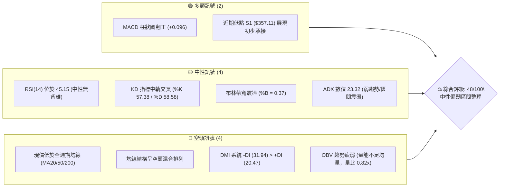

### 📊 核心指標速覽表

| 指標類別 | 指標名稱 | 當前數值 | 訊號 | 解讀 |
| :--- | :--- | :--- | :---: | :--- |
| **價格** | 當前收盤價 | $361.99 | 🟡 | 位於52週區間 35.4%，高位回檔後尋求築底 |
| **均線** | 短期 MA20 | $367.49 | 🔴 | 價格低於 MA20 (-1.50%)，短線面臨下壓 |
| **均線** | 中期 MA50 | $383.09 | 🔴 | 價格顯著低於 MA50 (-5.51%)，中期偏空 |
| **均線** | 長期 MA200 | $369.44 | 🔴 | 跌破年線關鍵位 (-2.02%)，長多架構受到考驗 |
| **動能** | RSI(14) | 45.15 | 🟡 | 處於 30–70 中性區間，無頂底背離跡象 |
| **動能** | MACD(12,26,9)| -7.488 / +0.096 | 🟢 | 雙線仍在零軸下，但柱狀圖微幅轉正，跌勢減緩 |
| **趨勢** | ADX(14) | 23.32 | 🟡 | ADX < 25 表明處於無明確方向的盤整行情 |
| **方向** | DMI (+/-DI) | 20.47 / 31.94 | 🔴 | -DI 大幅高於 +DI，空頭控制局部盤面節奏 |
| **通道** | 布林通道 %B | 0.37 | 🟡 | 價格運行於下軌 ($346.39) 與中軌 ($367.49) 之間 |
| **量能** | OBV 與量比 | 21.14M / 0.82x | 🔴 | OBV 低於均線，量能未達20日均量，缺乏買盤推力 |
| **波動** | ATR(14) | $10.39 (2.87%) | 🟡 | 每日平均波動約 10.39 美元，波動度維持常態 |

### 🏆 技術評分卡

```
╔══════════════════════════════════════════════════════════════╗
║              技術評分卡 — AVGO (2026-09-12)                  ║
╠══════════════════════════════════════════════════════════════╣
║ 趨勢強度 (Trend)     ███████░░░░░░░░░░░░░  35/100 🔴 偏空弱勢 ║
║ 動能指標 (Momentum)  ██████████░░░░░░░░░░  50/100 🟡 中性修復 ║
║ 支撐穩定度 (Support) ████████████░░░░░░░░  60/100 🟡 支撐有效 ║
║ 成交量配合 (Volume)  ████████░░░░░░░░░░░░  40/100 🔴 縮量觀望 ║
║ 形態完整度 (Pattern) ███████████░░░░░░░░░  55/100 🟡 區間箱體 ║
║ 均線排列 (MA System) ███████░░░░░░░░░░░░░  35/100 🔴 空頭壓制 ║
╠══════════════════════════════════════════════════════════════╣
║ 綜合技術評分         ██████████░░░░░░░░░░  46/100 ⚖️ 區間震盪 ║
╚══════════════════════════════════════════════════════════════╝
```

---

## 2. 趨勢分析

### 🌐 多時框趨勢分析

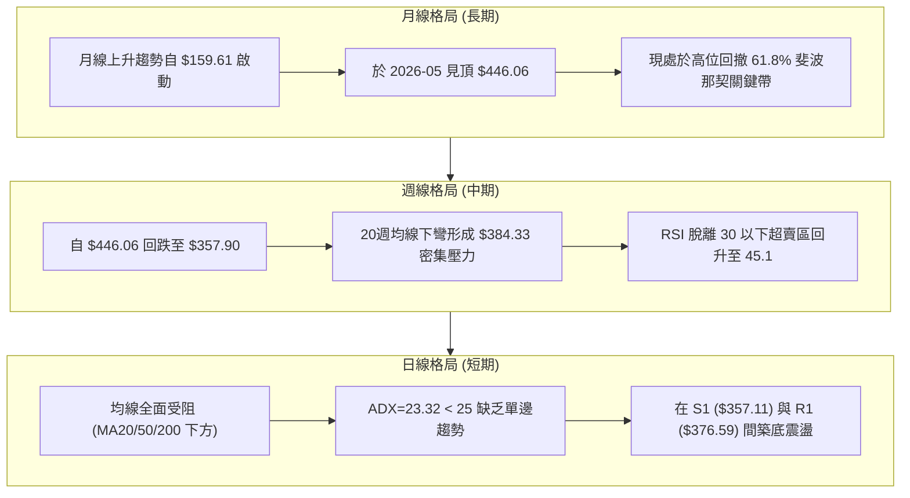

### 📈 長期趨勢 — 12個月走勢圖（Unicode）

```
AVGO 月線走勢圖（過去12個月：2025-10 至 2026-09）
價格軸 ($)
$450 ┤                                      ● (2026-05 $446.06)
$420 ┤                                  ●   │
$390 ┤              ●                   │   │       ●
$360 ┤      ●       │                   │   │   ●   │   ●   ● (現價 $361.99)
$330 ┤  ●   │   ●   │   ●               │   │   │   │   │
$300 ┤  │   │   │   │   │   ●   ●   ●   │   │   │   │   │
     └──┴───┴───┴───┴───┴───┴───┴───┴───┴───┴───┴───┴───┴───┴───
       09  10  11  12  01  02  03  04  05  06  07  08  09 (月份)
      '25 '25 '25 '25 '26 '26 '26 '26 '26 '26 '26 '26 '26
```

#### 走勢特徵分析表格

| 階段 | 涵蓋月份 | 起訖價格區間 | 累計漲跌幅 | 核心形態與技術意義 |
| :--- | :--- | :--- | :---: | :--- |
| **第一波衝頂** | 2025-09 ～ 2025-11 | $328.07 → $400.71 | +22.14% | 連續放量陽線，突破歷史整數大關，動能充沛 |
| **中期回調** | 2025-12 ～ 2026-03 | $400.71 → $309.02 | -22.88% | 縮量震盪回踩年線，於 $309.02 構築階段性黃金底 |
| **主升浪突破** | 2026-04 ～ 2026-05 | $309.02 → $446.06 | +44.35% | 業績驅動爆發性跳空上漲，創下歷史最高點 $494.22 (52W) |
| **寬幅退潮期** | 2026-06 ～ 2026-09 | $446.06 → $361.99 | -18.85% | 獲利了結盤湧出，跌破 MA50 與 MA200，進入築底盤整期 |

### 📊 中期趨勢（週線分析）

從近20週數據觀察，AVGO 在 2026 年 5 月底觸及 $446.06 後，成交量於 2026-06-07 異常放大至 2.51 億股並伴隨單週大跌，確認波段頭部形成。隨後股價呈現「震盪式階梯下行」：
- **波段次高點**：2026-08-09 反彈至 $427.76，但隨後三週縮量陰跌直接貫穿前低。
- **波段次低點**：2026-09-06 探底至 $357.90 後，本週（2026-09-13 當週）小幅回升至 $361.99。週線 MACD 柱狀圖自 -1.394 收斂轉正至 +0.096，週線 RSI 亦由超賣低點 23.5 回升至 45.1，表明中級修正波的空頭動能已顯著衰退。

### ⚡ 趨勢強度評估（ADX 解讀）

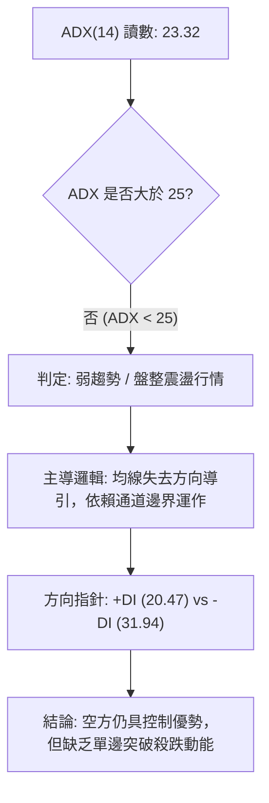

#### ADX 趨勢強度對照表

| 指標變數 | 當前數值 | 參考閾值 | 市場狀態評估 | 交易指引 |
| :--- | :---: | :---: | :--- | :--- |
| **ADX(14)** | **23.32** | 25.00 | **無趨勢 / 區間盤整** | 忌追漲殺跌，應採用高拋低吸之震盪區間策略 |
| **+DI** | **20.47** | 20.00 | 多頭進攻意願低迷 | 多方僅為防守反擊，缺乏連續推升能量 |
| **-DI** | **31.94** | 30.00 | 空頭主導局部壓力 | 空方具備結構優勢，反彈遇阻力位易受阻回落 |
| **DI 差值** | **-11.47** | 0.00 | 偏空擴散 | 尚未出現多頭逆轉訊號，需等待 +DI 金叉 -DI |

---

## 3. 圖表形態分析

### 🔍 形態識別系統

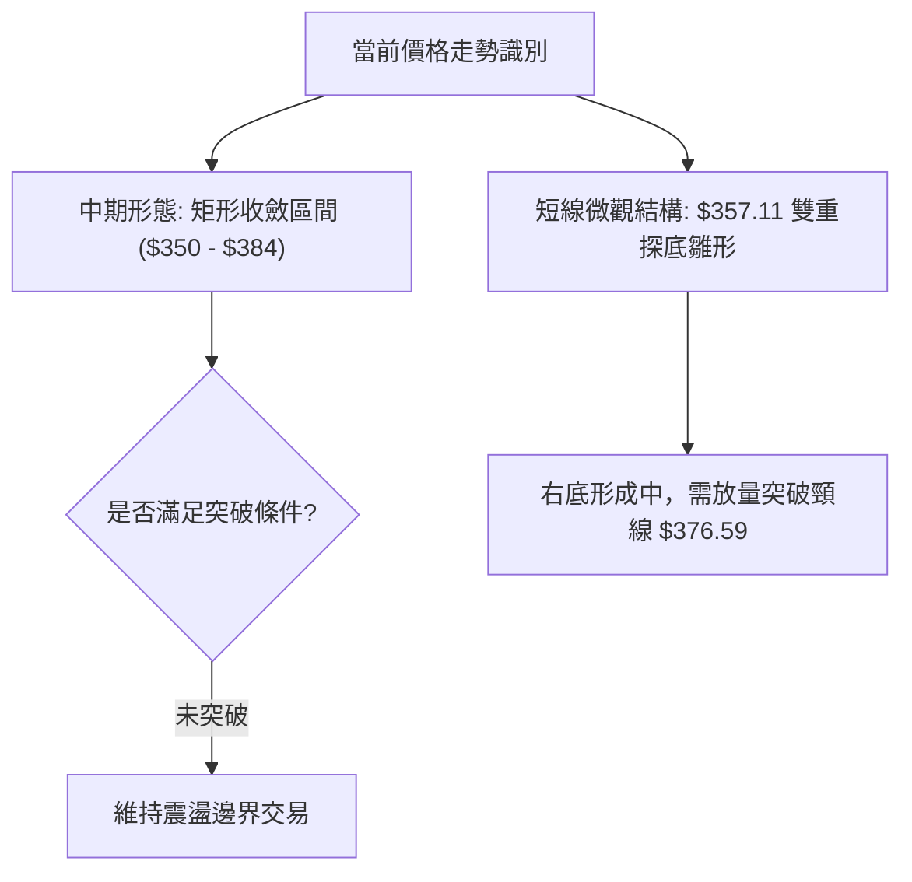

#### 形態信心度評估表

| 識別形態 | 信心度 (%) | 判斷依據（數據引用） | 形態完成度 (%) | 目標價計算式與推算值 |
| :--- | :---: | :--- | :---: | :--- |
| **矩形箱體震盪** | **75%** | 價格受制於 R2 ($384.33) 與支撐 S2 ($350.06)，ADX=23.32 證實無趨勢 | 85% | 上軌 $384.33，下軌 $350.06，中軌 $367.49 |
| **日線雙重底 (W底)** | **55%** | 2026-09-06 低點 $357.90 與 S1 ($357.11) 呼應形成左底與右底 | 50% | 頸線 R1 ($376.59) 突破後：$376.59 + ($376.59 - $357.11) = **$396.07** |
| **下降通道延續** | **40%** | 高點逐步降低 ($446.06 → $427.76)，但近兩週低點於 $357 獲得止跌 | 30% | 訊號不足（信心度 < 50%），僅視為中期回檔背景，不作擴展空頭預測 |

### 🕯️ 重要K線形態分析

| 週/月份週期 | 收盤價 ($) | K線形態特徵 | 市場心理與技術解讀 | 多空訊號 |
| :--- | :---: | :--- | :--- | :---: |
| **2026-05 (月線)** | $446.06 | 長上影大陽線 (影線至 $494.22) | 歷史新高處多空巨量博弈，主力資金逢高減碼 | 🔴 頂部力竭 |
| **2026-06 (月線)** | $377.75 | 實體大陰線吞噬 | 跌破多道短期均線，獲利盤踩踏湧出 | 🔴 破位下殺 |
| **2026-08-30 (週線)**| $368.79 | 縮量中陰線 (RSI=23.5) | 動能指標進入極度超賣區，空頭動能呈現枯竭 | 🟡 止跌前兆 |
| **2026-09-06 (週線)**| $357.90 | 長下影錘頭線 (Hammer) | 下探至 52 週 61.8% 回調位下方後迅速收回，低檔買盤介入 | 🟢 築底訊號 |
| **2026-09-13 (週線)**| $361.99 | 孕線小陽線 (Inside Bar) | 波動率收縮，多空進入膠著平衡，孕育方向性變盤 | 🟡 變盤醞釀 |

### 📉 ASCII 走勢形態示意圖

```
AVGO 近期箱體築底與微型雙底形態示意圖：
價格 ($)
$385 ┤-------------------------------------- 強阻力線 R2 ($384.33)
     │       ▲
$377 ┤───────┼────────────────────────────── 頸線 / 阻力 R1 ($376.59)
     │      ╱ ╲        ▲
$369 ┤─────╱───╲──────╱─╲────────────────── 斐波那契 61.8% / MA20 ($367.49)
     │    ╱     ╲    ╱   ● ◄── 現價 $361.99
$361 ┤   ╱       ╲  ╱
     │  ╱         ▼╱
$357 ┤─●──────────●───────────────────────── 雙底支撐帶 S1 ($357.11)
     │ (左底 357.90) (右底 357.11)
$350 ┤-------------------------------------- 箱體底部強支撐 S2 ($350.06)
     └──────────────────────────────────────
      8月下旬     9月第一週    9月第二週
```

### 🎯 形態目標價計算

依據確立度最高的「微型雙底構築形態」進行測算（以數據源支撐位與阻力位嚴格推算）：
1. **形態底部基準（雙底支撐）**：$357.11 (S1)
2. **形態頸線位（短線轉折）**：$376.59 (R1)
3. **形態垂直高度 ($H$)**：$$\text{頸線} - \text{底部} = \$376.59 - \$357.11 = \$19.48$$
4. **最小量度目標價 (T1)**：$$\text{頸線} + 1.0 \times H = \$376.59 + \$19.48 = \mathbf{\$396.07}$$ *(位於 R2 $384.33 與 R3 $400.75 之間)*
5. **延伸量度目標價 (T2)**：若向上突破箱體上限 R2 ($384.33)，按箱體高度 ($384.33 - 350.06 = \$34.27$) 投射：$$\$384.33 + \$34.27 = \mathbf{\$418.60}$$ *(貼近斐波那契 38.2% 回調位 $416.02)*

---

## 4. 支撐與阻力

### 🗺️ 關鍵價位分布圖（Unicode）

```
AVGO 價位結構分布圖 (由 OHLCV 與斐波那契精確聚類計算)
══════════════════════════════════════════════════════════════════
$400.75 ║████████████████████████████████║ 強波段阻力 R3 (+10.71%)
$391.86 ║▒▒▒▒▒▒▒▒▒▒▒▒▒▒▒▒▒▒▒▒▒▒▒▒▒▒▒▒    ║ 斐波那契 50.0% 分水嶺
$384.33 ║████████████████████████        ║ 中期波段阻力 R2 (+6.17%) / MA50 ($383.09)
$376.59 ║████████████████                ║ 短線關鍵阻力 R1 (+4.03%)
$367.70 ║▓▓▓▓▓▓▓▓▓▓▓▓▓▓▓▓▓▓▓▓▓▓▓▓        ║ 斐波那契 61.8% 關鍵回調位 / MA20 ($367.49)
$361.99 ╠════════════════════════════════╣ ◄── 當前收盤價 ($361.99)
$357.11 ║▓▓▓▓▓▓▓▓▓▓▓▓▓▓▓▓                ║ 近期波段支撐 S1 (-1.35%)
$350.06 ║████████████████████████        ║ 箱體底層強支撐 S2 (-3.30%)
$346.39 ║▒▒▒▒▒▒▒▒▒▒▒▒▒▒▒▒▒▒▒▒▒▒▒▒        ║ 日線布林下軌支撐
$342.33 ║████████████████████████████████║ 極限防守支撐 S3 (-5.43%)
══════════════════════════════════════════════════════════════════
```

### 🚧 阻力位分析表

| 阻力級別 | 準確價位 | 形成技術原因（數據確認） | 突破難度 | 戰略重要性 |
| :--- | :---: | :--- | :---: | :--- |
| **R1** | **$376.59** | 近一年波段高點聚類位，向下跳空破位之缺口下沿 | 中等 | 短線轉強第一道門檻，突破方可確認走出底部 |
| **R2** | **$384.33** | 密集套牢成交量聚類區，與 MA50 ($383.09) 高度重疊 | 極高 | 中期趨勢多空分水嶺，決定是否能終結日線級別空頭排列 |
| **R3** | **$400.75** | 近期主要波段頂點聚類位，兼具 $400.00 心理整數大關 | 極高 | 長多波段重啟訊號，需機構量能全面配合方能攻克 |

### 🛡️ 支撐位分析表

| 支撐級別 | 準確價位 | 形成技術原因（數據確認） | 守住機率 | 戰略重要性 |
| :--- | :---: | :--- | :---: | :--- |
| **S1** | **$357.11** | 近一年波段低點聚類，2026-09-06 探底 $357.90 所處之防線 | 70% | 極短線防守核心，守穩則維持低位震盪，跌破則下測 S2 |
| **S2** | **$350.06** | 歷史密集成交低點聚類，鄰近日線布林下軌 ($346.39) | 85% | 箱體震盪生命線，具備極強結構性買盤支撐 |
| **S3** | **$342.33** | 近一年深次回檔波段低點聚類，空頭極限回撤緩衝位 | 95% | 中長期多頭防守底線，此處失守將威脅 52W 低點 $289.50 |

### 📐 斐波那契回調位分析

依據 52 週波動區間：**起點低點 $289.50 → 終點高點 $494.22**，絕對落差為 **$204.72**：

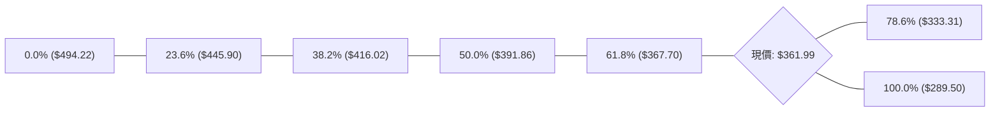

| 斐波那契水平 | 精確點位 ($) | 當前相對位置 | 技術意涵與結構解讀 |
| :--- | :---: | :---: | :--- |
| **0.0% (52W High)** | $494.22 | +36.53% | 歷史峰值，長線終極解套目標區 |
| **23.6%** | $445.90 | +23.18% | 第一級別回調支撐轉阻力，2026-05 收盤高位附近 |
| **38.2%** | $416.02 | +14.93% | 強勢回調防守線，失守後行情確認由強轉弱 |
| **50.0%** | $391.86 | +8.25% | 心理均衡多空平衡軸，介於 R2 與 R3 之間 |
| **61.8% (黃金分割)**| **$367.70** | **+1.58%** | **關鍵生命線！** 現價 ($361.99) 剛跌破此處，面臨「假破位」或「加速探底」之抉擇 |
| **78.6%** | $333.31 | -7.92% | 極端弱勢回調支撐位，若 S3 ($342.33) 失守後的終極緩衝 |
| **100.0% (52W Low)**| $289.50 | -20.03% | 52 週基準起漲點，中長線牛熊分界底線 |

> **深度解讀**：現價 $361.99 緊貼黃金分割 61.8% ($367.70) 下方。在技術統計中，強勢牛市拉回 61.8% 處通常具備強烈均值回歸拉力；當前價格與 $367.70 僅差 1.58%，表明空方並未引發崩跌式滑落，目前呈現沿 61.8% 邊界磨底特徵。

---

## 5. 技術指標深度解讀

### 🎛️ 指標訊號總覽

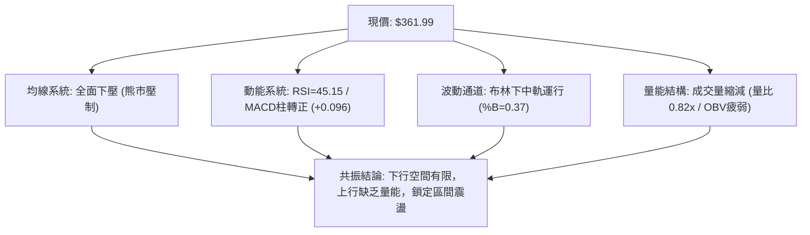

### 📈 移動平均線排列分析

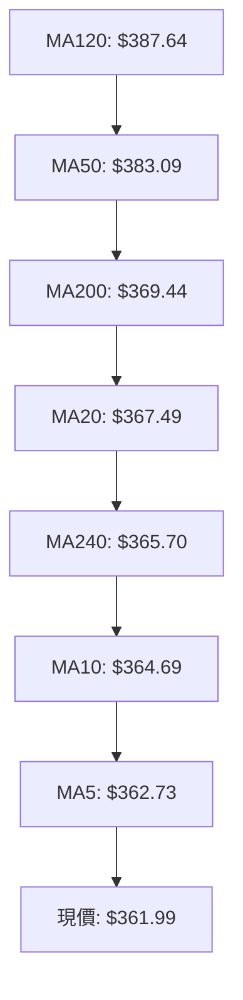

#### 移動平均線數據對比表

| 均線名稱 | 數值 ($) | 價格相對距離 | 趨勢斜率 | 技術意涵 |
| :--- | :---: | :---: | :---: | :--- |
| **MA5** | $362.73 | -0.20% | 下彎走平 | 超短線壓制，但與現價貼合，隨時可突破 |
| **MA10** | $364.69 | -0.74% | 持續向下 | 短線第一動態壓力，壓制短波段反彈 |
| **MA20** | $367.49 | -1.50% | 穩步下行 | 布林中軌所在，短線多空分水嶺 |
| **MA50** | $383.09 | -5.51% | 加速向下 | 中期趨勢下壓主力，與 R2 ($384.33) 形成阻力共振 |
| **MA120** | $387.64 | -6.62% | 拐頭向下 | 半年線下行，限制中期反彈高度 |
| **MA200** | $369.44 | -2.02% | 緩步走平 | 長線生命線，現價貼近但位於其下，長線偏弱警告 |
| **MA240** | $365.70 | -1.02% | 向上延伸 | 長週期年線仍具備微幅上翹慣性，提供深層支撐 |

### 📉 RSI(14) 分析

```
RSI(14) 當前數值: 45.15
[0] ────────── [30 超賣] ───────●─────── [70 超買] ────────── [100]
                             45.15 (中性弱勢區間)
進度條: █████████░░░░░░░░░░░ 45.15%
```
- **狀態判定**：數值 45.15 處於 30 至 70 之中性區域，擺脫了 2026-08-30 當週 23.5 的極度超賣狀態。
- **背離分析**：
  - **頂背離**：無。目前未處於高位推升格局。
  - **底背離**：無明顯背離。2026-09-06 價格觸及低點 $357.90 時，RSI 由 23.5 回升至 29.2，呈現技術性同步超賣回升，而非標準的價格創新低而指標不破新低之經典底背離。
- **結論**：動能中立，多空未引爆單向動能衝擊。

### 📊 MACD(12,26,9) 訊號解讀

```
MACD 指標數值快照：
DIF 快線:   -7.488  ──────┐ (負向零軸深處)
DEA 慢線:   -7.584  ──────┴──► DIF > DEA (微幅金叉)
柱狀圖:     +0.096  ██ (🟢 看多修復)
```

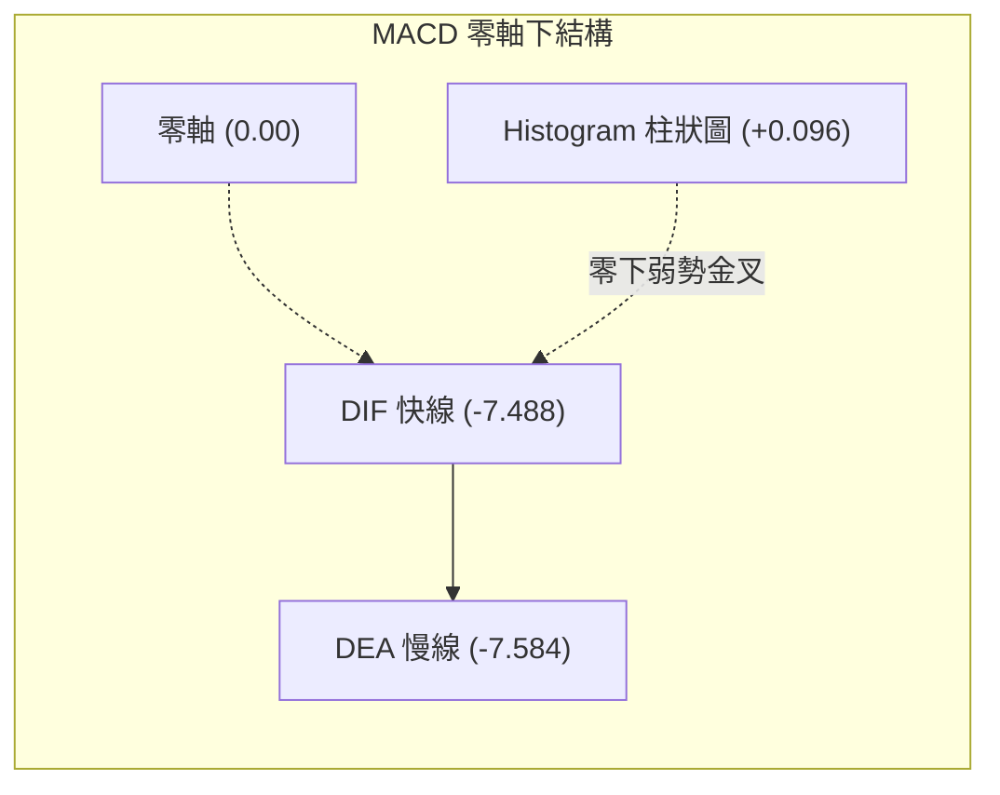
- **訊號解析**：MACD 快慢線處於零軸之下較深位置 (-7.488)，表明中長期市場仍由空頭主導環境；但柱狀圖經過多週負值收斂，現已微幅翻正至 **+0.096**，發出日線級別「零下弱勢金叉」雛形。
- **指標確認度**：此類在零軸深處出現的金叉，通常先以「超跌反彈修復」視之，若無後續成交量暴增帶動快線衝破零軸，容易在觸及零軸前再次受阻回落。

### 📦 布林通道分析

```
AVGO 布林通道 (20, 2) 結構圖
價格 ($)
$388.60 ┤======================================= BB 上軌
        │
$378.00 ┤───────────────────────────────────────
        │
$367.49 ┤--------------------------------------- BB 中軌 (MA20)
        │                 ● 現價 $361.99 (%B = 0.37)
$356.00 ┤───────────────────────────────────────
        │
$346.39 ┤======================================= BB 下軌
        └───────────────────────────────────────
```
- **通道參數**：上軌 $388.60 ｜ 中軌 $367.49 ｜ 下軌 $346.39 ｜ 帶寬 $42.21 (11.66%)。
- **現價位置 (%B)**：當前 %B 數值為 **0.37**，顯示價格落在中軌與下軌之間偏下區域。
- **收斂狀態**：通道開口未顯著擴大，維持平行橫盤態勢。現價未觸及下軌（離下軌尚有 $15.60 空間），亦未站上中軌，屬於標準的通道內橫向拉鋸。中軌 $367.49 與斐波那契 61.8% ($367.70) 形成雙重短期動態反壓。

### 💹 成交量分析（量價配合度）

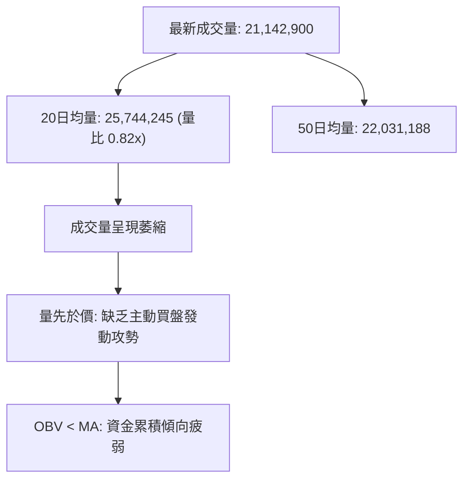
- **量比檢驗**：最新量比為 **0.82x**，成交量萎縮至 20 日均量之下。在股價試圖築底反彈階段，「無量反彈」表明市場追價意願薄弱，機構資金主要採取限價掛單防守，而非市價掃貨。
- **OBV 能量潮解讀**：數據明確提示「OBV 趨勢：OBV < MA → 量能疲弱」。OBV 處於均線下方，說明過去數週資金呈現淨流出特徵，在量能未出現連續大於 2,570 萬股的攻擊量之前，難以發動突破性單邊行情。

---

## 6. 動能與波動率

### ⚡ 動能評估四象限

| 象限代號 | 動能強度 (RSI/MACD) | 波動率水準 (ATR) | AVGO 當前狀態 | 交易環境與戰術解讀 |
| :---: | :---: | :---: | :---: | :--- |
| **Q1** | 強 (Bullish) | 低 (Low Volatility) | — | 穩定上行趨勢，適合趨勢追隨與加碼 |
| **Q2** | **弱 (Bearish/Neutral)** | **低/中 (Moderate Vol)** | **✓ (當前所處區間)** | **謹慎觀望 / 區間收斂，適宜嚴設邊界的低吸高拋** |
| **Q3** | 強 (Bullish) | 高 (High Volatility) | — | 爆發性多頭突破，高風險高收益 |
| **Q4** | 弱 (Bearish) | 高 (High Volatility) | — | 恐慌崩跌與踩踏，嚴禁做多，觀望為上 |

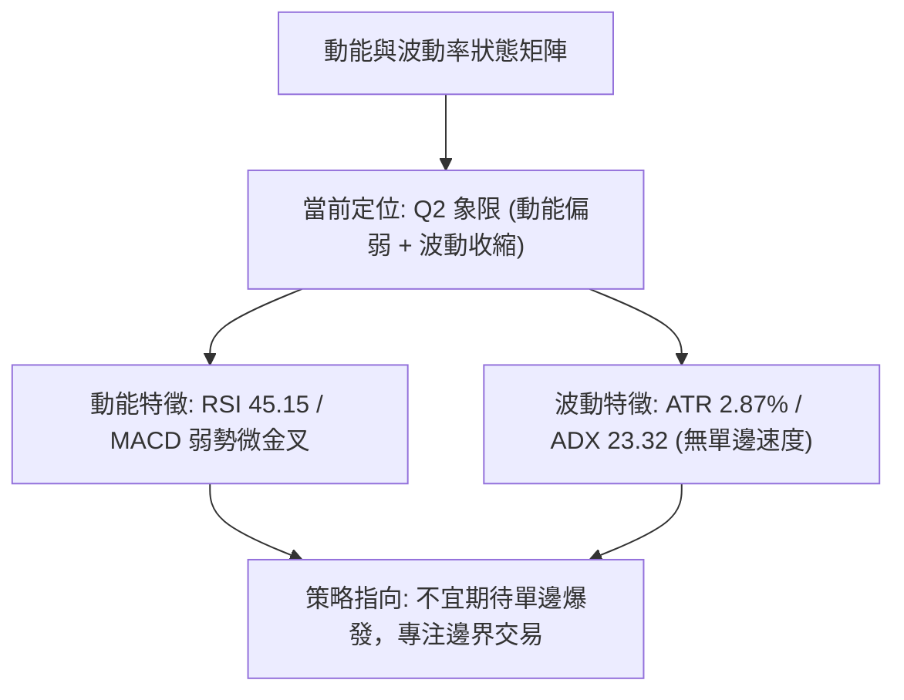

### 📊 ATR 波動率分析

- **ATR(14) 當前數值**：**$10.39**
- **波動率佔比 (ATR / 價格)**：**2.87%**
- **市場波動性質**：處於正常偏低水平，未出現極端恐慌擴散（如 6 月初回跌時的劇烈波動），亦無單邊噴發態勢。
- **止損距離動態測算依據**：
  - **超短線日內緩衝 (1.0 × ATR)**：$$\$10.39$$
  - **常規波段防守空間 (1.5 × ATR)**：$$1.5 \times \$10.39 = \mathbf{\$15.59}$$
  - **極限波段過濾雜訊 (2.0 × ATR)**：$$2.0 \times \$10.39 = \mathbf{\$20.78}$$

### 📐 Beta 與市場相關性

- **Beta 數值**：**1.457**
- **系統性風險特徵**：AVGO 之 Beta 顯著大於 1.0，表明其對納斯達克 100 指數與費城半導體指數 (SOX) 具備高敏感度。大盤若變動 1.0%，AVGO 理論波動幅度約為 1.457%。
- **市場情緒共振**：在高 Beta 背景下，目前 AVGO 的低波動 (ATR 2.87%) 屬於「暴風雨前的收斂平靜期」，一旦大盤方向確立，AVGO 將隨之放大波動，投資者不可因當前震盪而忽視其潛在的破位或衝刺速度。

---

## 7. 多時框架總結

### 📋 時框架評分表

| 時框架 | 趨勢方向 | 動能狀態 | 均線排列 | 形態結構 | 綜合評分 | 操作指導方針 |
| :--- | :---: | :---: | :---: | :---: | :---: | :--- |
| **月線 (長期)** | 🟡 中性偏多 | 🟡 高位回調 | 🟢 處於 MA240 上方 | 歷史高位收斂 | **65/100** | 守住 61.8% 仍具牛市根基，長期無虞 |
| **週線 (中期)** | 🔴 弱勢空頭 | 🟢 超跌反彈 | 🔴 均線反壓密集 | 階梯式震盪下行 | **42/100** | 關注 R2 ($384.33) 能否化解套牢盤 |
| **日線 (短期)** | 🟡 盤整磨底 | 🟡 中性微多 | 🔴 混合偏空下壓 | 底部箱體拉鋸 | **46/100** | 依布林上下軌進行高拋低吸 |

### 🔲 綜合訊號矩陣

```
時框訊號共振矩陣：
┌───────────┬──────────────┬──────────────┬──────────────┐
│  分析維度 │  長期 (月線) │  中期 (週線) │  短期 (日線) │
├───────────┼──────────────┼──────────────┼──────────────┤
│ 趨勢方向  │ 🟢 多頭回撤  │ 🔴 震盪偏空  │ 🟡 區間無趨勢│
│ 均線系統  │ 🟢 守住年線  │ 🔴 跌破MA20  │ 🔴 壓制於MA20│
│ 動能指標  │ 🟡 自高位衰退│ 🟢 柱狀圖翻正│ 🟡 RSI 45.15 │
│ 成交量能  │ 🔴 縮量整理  │ 🔴 量能未放大│ 🔴 量比 0.82 │
│ 支撐強度  │ 🟢 斐波61.8% │ 🟡 S1 $357.11│ 🟢 S2 $350.06│
└───────────┴──────────────┴──────────────┴──────────────┘
```

### ⚖️ 多時框收斂結論

依據技術分析規範中的「多時框收斂規則」進行最終結論裁決：
1. **行情性質判定**：當前 ADX(14) 讀數為 **23.32 (< 25)**，嚴格界定為**「盤整震盪行情」**，而非單邊趨勢行情。
2. **主導規則應用**：
   - 規則要求：「盤整行情（ADX < 25）：以日線布林通道上下軌為主要交易區間，均線系統方向暫時退居次席。」
   - 日線布林下軌為 **$346.39**，布林上軌為 **$388.60**，包容了近一年波段低點聚類 S2 ($350.06) 與阻力 R2 ($384.33)。
3. **終極方向定調**：
   - 儘管週線均線偏空，但在日線 ADX < 25 且 MACD 柱狀圖已轉正情況下，市場並不具備向下恐慌穿透的能力。
   - **收斂方向唯一結論**：**【中性觀望 / 區間箱體交易】**。當前價格 $361.99 處於箱體下半區（接近支撐 S1 $357.11），下檔防禦性強，上檔受制於 R1 ($376.59) 及布林中軌 ($367.49)。

---

## 8. 交易策略建議

### 🗺️ 策略決策流程圖

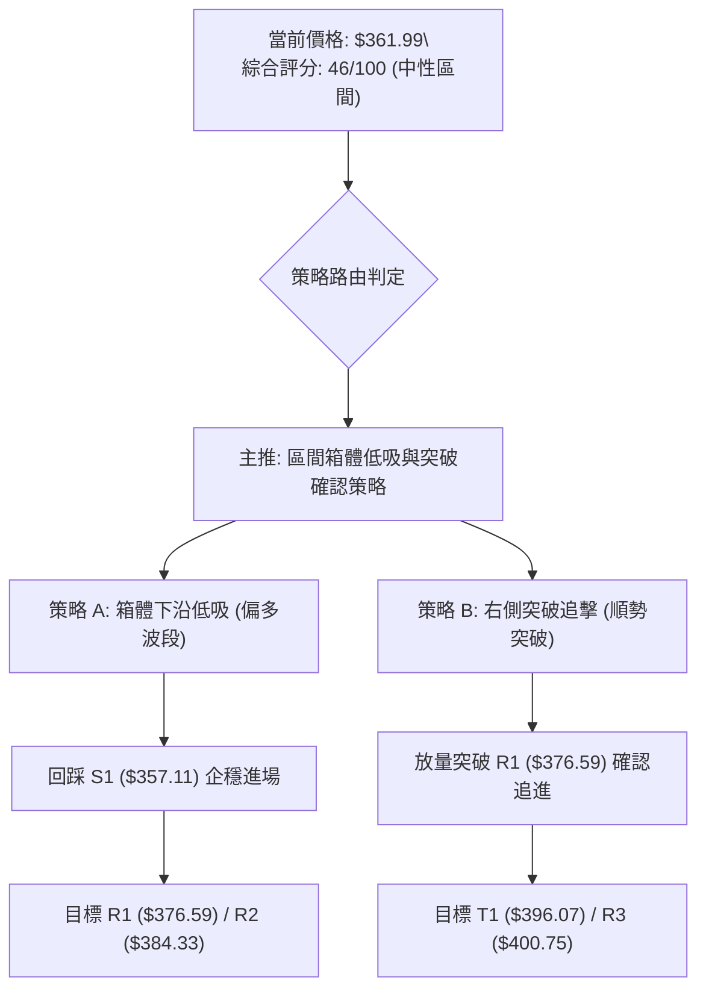

### 🧭 策略路由（依評分卡分流）

> **當前主策略方向 = 【中性震盪區間操作：以布林通道與 S1/R1 為邊界，等待突破確認】（依綜合評分 46/100 定調）**

由於技術評分卡綜合得分為 **46/100**，處於 **40–60 分之中性區間**，依規則本報告**主推區間震盪低吸高拋策略**，不盲目看單邊大暴漲或大暴跌，並將所有進出場價位與防守止損位嚴格錨定於數據源已驗證之關鍵價位。

### 🎯 價格情境階梯（Price Scenarios）

| 觸發條件 | 下一目標點位 | 後續延伸目標 | 情境技術含義與因應措施 |
| :--- | :---: | :---: | :--- |
| **強勢突破 R1 $376.59** | **R2 $384.33** | **R3 $400.75** | **短線由弱轉強**：突破頸線，雙底形成，空單全數停損，多頭加碼 |
| **站穩現價 $361.99** | **MA20 / 61.8% ($367.70)**| **R1 $376.59** | **區間震盪常態**：在 S1 與 R1 之間拉鋸，適合網格與波段低吸持股 |
| **有效跌破 S1 $357.11** | **S2 $350.06** | **S3 $342.33** | **防線後移轉弱**：跌破近期平台，多單第一道止損觸發，退守 S2 觀察 |
| **崩跌失守 S2 $350.06** | **布林下軌 $346.39**| **S3 $342.33** | **破位下行警告**：箱體破裂，轉入深度回撤，全面啟動避險對沖 |

### 📊 情境機率分佈

| 情境劃分 | 機率估計 | 主要技術依據與指標支撐 |
| :--- | :---: | :--- |
| **區間震盪磨底 (維持在 S1～R1 間)** | **55%** | ADX=23.32 證明趨勢動能匱乏；量比 0.82x 顯示縮量特徵；布林通道水平收斂 |
| **向上反彈突破 (衝擊 R1～R2)** | **25%** | MACD 柱狀圖翻正 (+0.096)；週線 RSI 自超賣區回升；分析師共識高達 $531.85 |
| **回落再測低點 (下探 S2～S3)** | **20%** | 均線系統呈空頭混合排列；-DI (31.94) 壓制 +DI；OBV 能量潮持續疲弱 |

### 🟢 主策略詳情（方向依上方路由）

本報告規劃兩套基於區間操作框架的具體交易計畫：**策略 A（左側支撐低吸）** 與 **策略 B（右側突破確認）**。

| 策略要素 | 策略 A：箱體支撐位低吸策略 | 策略 B：突破頸線順勢追擊策略 |
| :--- | :--- | :--- |
| **適用時機** | 價格回測 S1 附近獲得微觀支撐時 | 價格帶量強勢突破短線頸線 R1 時 |
| **進場條件** | 跌至 S1 附近不破，K線出現小陽線止跌 | 突破 R1 並伴隨成交量大於 2,500 萬股 |
| **進場價格** | **$358.50** *(錨定 S1 $357.11 上方)* | **$377.00** *(錨定突破 R1 $376.59)* |
| **目標價 T1** | **$376.59** *(波段阻力 R1)* | **$384.33** *(關鍵阻力 R2 / MA50)* |
| **目標價 T2** | **$384.33** *(波段阻力 R2)* | **$396.07** *(雙底形態推算目標)* |
| **止損價格** | **$349.50** *(嚴格跌破 S2 $350.06 止損)* | **$367.00** *(跌回布林中軌 MA20 下方)* |
| **風險空間 ($)** | $\$358.50 - \$349.50 = \$9.00$ | $\$377.00 - \$367.00 = \$10.00$ |
| **報酬空間 (T1)**| $\$376.59 - \$358.50 = \$18.09$ | $\$384.33 - \$377.00 = \$7.33$ |
| **報酬空間 (T2)**| $\$384.33 - \$358.50 = \$25.83$ | $\$396.07 - \$377.00 = \$19.07$ |
| **風險報酬比** | **1 : 2.01** (至T1) ／ **1 : 2.87** (至T2) | **1 : 0.73** (至T1) ／ **1 : 1.91** (至T2) |
| **估計成功機率** | **60%** | **50%** |
| **建議配置倉位** | **10% - 15% (底倉建置)** | **10% (突破加碼)** |

### 🔴 反向風險觸發點（對沖提示）

若發生下列技術破位事件，主推之震盪築底多頭策略即刻失效，應切換至防禦對沖姿態：
- **關鍵反轉觸發位**：日線收盤價**實質跌破 S2 ($350.06)**。
- **對沖執行條件**：若跌破 $350.06，且伴隨成交量突破 2,500 萬股與 -DI 衝破 35.00，應立即將手頭多倉全數止損或建立認沽期權（Put Option）保護，下行目標將無阻礙直測 S3 ($342.33) 及極限支撐 $333.31（斐波那契 78.6%）。

### ⭐ 整體訊號強度評星

```
做多訊號強度：★★☆☆☆  (2.5/5星 — 處於支撐位且MACD翻正，但均線壓制強烈)
做空訊號強度：★★☆☆☆  (2.5/5星 — 均線偏空但跌勢趨緩，超賣修復中，空單盈虧比不佳)
整體可信度：  ★★★☆☆  (3.0/5星 — ADX<25 震盪市特徵明顯，各指標相互收斂確認)
```

---

## 9. 風險提示與監控

### ✅ 關鍵監控指標 Checklist

```
╔══════════════════════════════════════════════════════════════╗
║              AVGO 每日交易監控清單 (Checklist)               ║
╠══════════════════════════════════════════════════════════════╣
║ [ ] 價格防線監控：現價 $361.99 是否守穩 S1 ($357.11)？       ║
║ [ ] 關鍵反壓挑戰：是否帶量突破 MA20 ($367.49) 與 61.8%？     ║
║ [ ] 趨勢轉變信號：ADX(14) 是否由 23.32 上升並衝破 25 大關？ ║
║ [ ] 動能連續性：MACD 柱狀圖是否持續擴大正值 (維持 > 0)？     ║
║ [ ] 量能驗證：單日成交量能否超過 20日均量 (2,574 萬股)？      ║
║ [ ] 外部市場共振：SOX 半導體指數與大盤 Beta 波動溢出效應？   ║
╚══════════════════════════════════════════════════════════════╝
```

### ⚠️ 風險場景分析

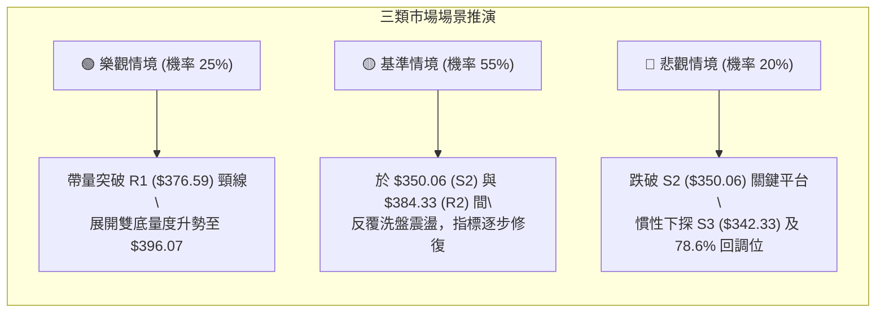

### 🛡️ 風險管理重要提醒

1. **嚴禁單邊重倉**：當前 ADX 為 23.32，震盪市場最大的風險是「頻繁追漲殺跌導致本金磨損」。總持倉部位建議控制在總資金的 **20%～30%** 以內。
2. **止損紀律剛性執行**：本報告依據 OHLCV 計算出的 S2 ($350.06) 為多頭最後技術紅線，容忍空間為 $349.50。跌破該價位即宣告形態破敗，嚴禁逆勢攤平。
3. **ATR 波動防護**：當前 ATR 為 $10.39，日內雜訊波動可達 ±$10 以上。設定止損時必須預留至少 1.5 倍 ATR ($15.59) 的緩衝帶，避免因日內洗盤被震盪出局。

---

## 📋 報告總結

```
╔══════════════════════════════════════════════════════════════════╗
║                    AVGO 技術分析報告總結                         ║
╠══════════════════════════════════════════════════════════════════╣
║ 報告日期：2026-09-12           當前價格：$361.99                 ║
║ 分析評級：⚖️ 中性觀望 / 區間震盪 (綜合評分: 46/100)              ║
╠══════════════════════════════════════════════════════════════════╣
║ 關鍵結論：                                                       ║
║ ├─ 長期趨勢：🟢 偏多回調 (自低點起漲維持多頭格局，貼近61.8%防線) ║
║ ├─ 中期趨勢：🔴 弱勢整理 (週線均線下彎，需化解 $384.33 密集套牢)║
║ ├─ 短期趨勢：🟡 區間築底 (ADX=23.32 < 25，微型雙底構築中)        ║
║ ├─ 關鍵支撐：S1 $357.11 ｜ 強支撐 S2 $350.06 ｜ 極限 S3 $342.33  ║
║ ├─ 關鍵阻力：R1 $376.59 ｜ 強阻力 R2 $384.33 ｜ 目標 R3 $400.75  ║
║ └─ 華爾街共識：Strong Buy ｜ 分析師平均目標價：$531.85          ║
╠══════════════════════════════════════════════════════════════════╣
║ 最優策略組合：                                                   ║
║ 1. 🥇 最佳機會：策略 A (回踩 S1 $357.11 附近輕倉低吸，止損設S2)   ║
║ 2. 🥈 次選機會：策略 B (帶量突破頸線 R1 $376.59 後順勢追多)      ║
║ 3. 🥉 保守選擇：空倉觀望，等待日線站穩 MA20 ($367.49) 再行定奪  ║
╚══════════════════════════════════════════════════════════════════╝
```

---

> ⚠️ **免責聲明**：本報告為技術分析研究成果，報告內所有數據、支撐阻力點位及斐波那契水平均依據客觀歷史交易數據演算得出。本報告**僅供學術研究與投資策略討論參考**，**不構成任何要約、招攬或具體投資買賣建議**。金融市場瞬息萬變，投資人應獨立評估風險，自負盈虧。

---

*報告生成時間：2026-09-12 ｜ 數據來源：Yahoo Finance ｜ 分析框架：多時框技術分析模型*