# AVGO 技術分析報告

> **報告日期**：2026-09-13 ｜ **語言**：繁體中文 ｜ **數據來源**：Yahoo Finance ｜ **當前價格**：$361.99

---

## 目錄

| 章節 | 內容 |
|------|------|
| [1. 技術面概覽](#1-技術面概覽) | 訊號儀表板、核心指標、評分卡 |
| [2. 趨勢分析](#2-趨勢分析) | 多時框趨勢、長中短期走勢 |
| [3. 圖表形態分析](#3-圖表形態分析) | 形態識別、K線組合、目標價 |
| [4. 支撐與阻力](#4-支撐與阻力) | 關鍵價位、斐波那契回調 |
| [5. 技術指標深度解讀](#5-技術指標深度解讀) | MA/RSI/MACD/布林/成交量 |
| [6. 動能與波動率](#6-動能與波動率) | 動能評估、ATR、Beta |
| [7. 多時框架總結](#7-多時框架總結) | 時框架評分矩陣 |
| [8. 交易策略建議](#8-交易策略建議) | 多空策略、風險報酬比 |
| [9. 風險提示與監控](#9-風險提示與監控) | 監控指標、風險場景 |
| [報告總結](#-報告總結) | 核心結論與交易指引 |

---

## 1. 技術面概覽

### 🎯 技術訊號儀表板

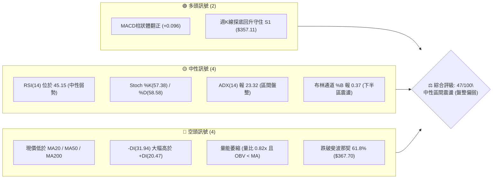

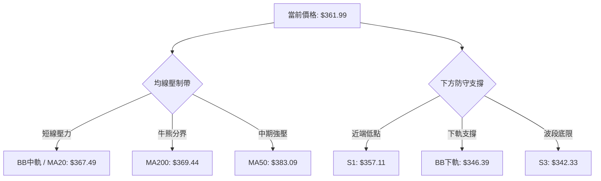

### 📊 核心指標速覽表

| 指標類別 | 指標名稱 | 當前數值 | 訊號 | 解讀 |
|:---|:---|:---:|:---:|:---|
| **價格** | 當前收盤價 | $361.99 | 🟡 | 位於 52 週區間 35.4% 位置，處於歷史高位回檔後的沉澱區 |
| **均線** | MA20 | $367.49 | 🔴 | 價格低於 20 日線 1.50%，短線受制於布林中軌壓制 |
| **均線** | MA50 | $383.09 | 🔴 | 價格低於 50 日線 5.51%，中期空方控盤 |
| **均線** | MA200 | $369.44 | 🔴 | 價格跌破年線 2.02%，多空長期分水嶺面臨考驗 |
| **動能** | RSI(14) | 45.15 | 🟡 | 處於 30–70 常態中性區間，脫離超賣但缺乏上攻動能 |
| **動能** | MACD (12,26,9) | -7.488 / -7.584 | 🟢 | 快慢線處於零軸下方，但柱狀體翻正至 +0.096，呈現超跌微弱金叉 |
| **趨勢** | ADX (14) | 23.32 | 🟡 | ADX < 25，單邊下跌動能衰竭，市場轉入橫盤區間築底 |
| **方向** | +DI / -DI | 20.47 / 31.94 | 🔴 | 空方動能 (-DI) 仍佔據主導優勢，多頭反彈尚未奪回發言權 |
| **通道** | Bollinger Bands | $346.39 – $388.60 | 🟡 | %B 為 0.37，價格在通道中下軌運行，未觸及下軌極限 |
| **波動** | ATR(14) | $10.39 | 🟡 | 波動率佔股價 2.87%，單日波動正常，利於設定精確止損 |
| **成交量** | 最新量 / 20MA量 | 21.14M / 25.74M | 🔴 | 量比 0.82x，量能疲弱，OBV 小於均線，資金追價意願保守 |

### 🏆 技術評分卡

```
╔════════════════════════════════════════════════════════════════╗
║                  技術評分卡 — AVGO (2026-09-13)                ║
╠════════════════════════════════════════════════════════════════╣
║ 趨勢強度 (Trend)     ███████░░░░░░░░░░░░░  36/100  🔴 空頭控盤 ║
║ 動能指標 (Momentum)  ██████████░░░░░░░░░░  52/100  🟡 弱勢修復 ║
║ 支撐穩定度 (Support) ████████████░░░░░░░░  60/100  🟢 低檔有守 ║
║ 成交量配合 (Volume)  ███████░░░░░░░░░░░░░  38/100  🔴 量能萎縮 ║
║ 形態完整度 (Pattern) ██████████░░░░░░░░░░  50/100  🟡 區間箱體 ║
║ 均線排列 (Moving Avg)████████░░░░░░░░░░░░  44/100  🔴 混合空頭 ║
╠════════════════════════════════════════════════════════════════╣
║ 綜合技術評分         █████████░░░░░░░░░░░  47/100  🟡 區間震盪 ║
╚════════════════════════════════════════════════════════════════╝
```

---

## 2. 趨勢分析

### 🌐 多時框趨勢分析

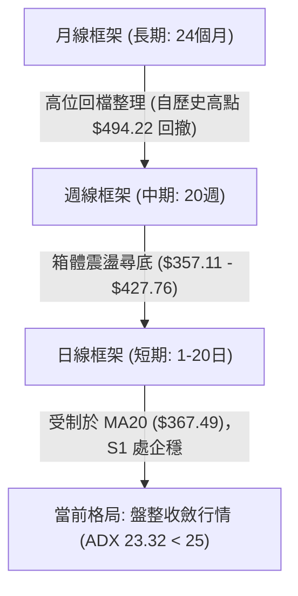

### 📈 長期趨勢 — 12個月走勢圖（Unicode）

以下為 AVGO 過去 12 個月（2025-10 至 2026-09）之月線收盤價格軌跡與關鍵轉折點標注：

```
AVGO 月線走勢圖（過去12個月收盤價）
價格軸 ($)
$450 ┤                                  ● 2026-05 ($446.06 波段次高)
$425 ┤                             ● 2026-04 ($416.77)
$400 ┤              ● 2025-11 ($400.71)
$375 ┤        ● 2025-10 ($367.57)             ● 2026-07 ($389.28)
$360 ┤● 2025-09 ($328.07)                          ● 2026-08 ($370.34)
$350 ┤                    ● 2025-12 ($344.83)            ●←現價 $361.99 (2026-09)
$325 ┤                         ● 2026-01 ($330.08)  ● 2026-06 ($377.75)
$300 ┤                              ● 2026-02 ($318.38)
$290 ┤                                   ● 2026-03 ($309.02 波段底部)
     └─────────────────────────────────────────────────────────────
       09   10   11   12   01   02   03   04   05   06   07   08   09 (月份)
      '25  '25  '25  '25  '26  '26  '26  '26  '26  '26  '26  '26  '26
```

#### 過去 12 個月走勢特徵分析表格

| 階段與週期 | 起訖月份 | 起訖收盤價 | 漲跌幅 | 走勢特徵與量價結構分析 |
|:---|:---:|:---:|:---:|:---|
| **第一波拉升** | 2025-09 → 2025-11 | $328.07 → $400.71 | +22.14% | AI 客製化晶片與網通需求放量，月線連續大陽線突破 $400 關卡 |
| **中級回檔修正**| 2025-11 → 2026-03 | $400.71 → $309.02 | -22.88% | 連續 4 個月陰跌回撤，回踩 52 週低點附近（波段低點聚類於此）完成清洗浮額 |
| **主升浪突破** | 2026-03 → 2026-05 | $309.02 → $446.06 | +44.35% | 強勢爆發，刷新階段高點，期間盤中更創下 52 週歷史天價 $494.22 |
| **高位箱體沉澱**| 2026-05 → 2026-09 | $446.06 → $361.99 | -18.85% | 獲利了結盤湧現，目前回撤至 61.8% 斐波那契回調位附近反覆震盪打底 |

### 📊 中期趨勢（週線分析）

從近 20 週的收盤紀錄可清晰觀察到多空換手的軌跡：
- **頂部巨量分歧**：2026-06-07 該週暴跌至收盤 $385.12，成交量暴增至 251,144,600 股，顯示天價 $494.22 見頂後機構籌碼快速換手。
- **波段反彈受挫**：2026-08-09 週收盤彈升至 $427.76，週 RSI 衝高至 73.6，但後續成交量無法維持在 1 億股之上，引發二次回落。
- **近期縮量築底**：2026-08-30 週 RSI 觸及超賣邊界 23.5，9 月第一週於 $357.90 獲得強力買盤支撐，成交量放大至 173,217,400 股；本週（2026-09-13）收盤回升至 $361.99，週 MACD 柱狀體收斂至 +0.096，具備構築底部跡象。

```
中期壓力與支撐位示意圖（週線視角）
$427.76 ────── 週線反彈高點壓力區（2026-08-09）
$400.75 ────── 關鍵心理阻力 R3
$384.33 ────── 中期均線反壓 R2
$376.59 ────── 短線反彈頸線 R1
══════════════════════════════════════════ 現價 $361.99
$357.11 ────── 近期波段回踩支撐 S1 (2026-09-06 低點聚類)
$350.06 ────── 結構性強支撐 S2
$342.33 ────── 箱體底部極限支撐 S3
```

### ⚡ 趨勢強度評估（ADX 解讀）

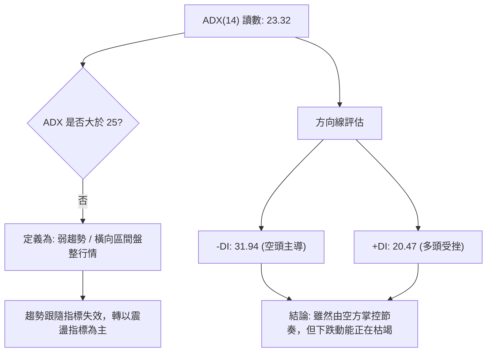

| 指標項目 | 數值 | 臨界標準 | 當前屬性 | 交易指導原則 |
|:---|:---:|:---:|:---:|:---|
| **ADX (14)** | 23.32 | 25.00 | 弱趨勢 / 盤整 | 嚴禁追漲殺跌，趨勢突破策略失敗率高，宜採取支撐阻力高拋低吸 |
| **+DI (14)** | 20.47 | — | 弱勢反彈方 | 多頭買盤力道偏弱，缺乏拉抬整體波段的攻擊量 |
| **-DI (14)** | 31.94 | — | 暫時主導方 | 雖高於 +DI，但若未能配合 ADX 向上突破 25，則空頭難以發動主跌浪 |

---

## 3. 圖表形態分析

### 🔍 形態識別系統

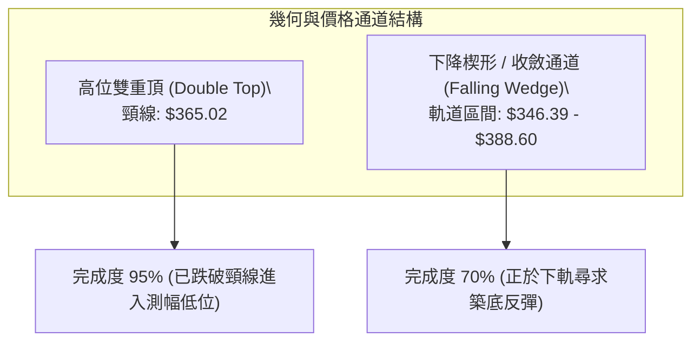

#### 形態識別信心度評估表

| 形態名稱 | 信心度 | 判斷依據（引用真實數據） | 完成度 | 形態量化與目標價推算 |
|:---|:---:|:---|:---:|:---|
| **雙重頂 (M頭)** | 75% | 左頂 2026-05 收盤 $446.06（盤中 $494.22），右頂 2026-08-09 週收盤 $427.76，頸線聚類於 2026-06-28 收盤 $365.02。 | 95% | 形態高度 = $446.06 - $365.02 = $81.04。<br>理論量度跌幅 = $365.02 - $81.04 = $283.98（此為極限熊市預期，目前在 S3 $342.33 與 52W 低點 $289.50 前具備極強緩衝）。 |
| **矩形箱體震盪** | 80% | 價格在 S1 $357.11 與 R2 $384.33 之間形成多次觸頂與回踩，ADX 23.32 佐證無單邊趨勢。 | 85% | 箱體高度 = $384.33 - $357.11 = $27.22。<br>箱體向上突破目標 = $384.33 + $27.22 = $411.55（逼近 38.2% 斐波那契 $416.02）。 |
| **布林通道下軌背馳** | 65% | 價格下探 S1 $357.11 後未破布林下軌 $346.39，隨後連續兩日收於其上，收盤 $361.99。 | 70% | 指標型形態：由 BB 下軌向中軌反彈目標 = BB 中軌 $367.49（與 MA20 共振）。 |

### 🕯️ 重要 K 線形態分析

| 週期/月份 | 收盤價 | K 線形態特徵 | 技術面解讀 | 訊號 |
|:---|:---:|:---|:---|:---:|
| **2026-08-09 週** | $427.76 | 長上影流星線 | 上攻 $430 阻力未果，短線買盤衰竭，形成次高點假突破 | 🔴 |
| **2026-08-23 週** | $368.45 | 長黑實體大陰線 | 跌破 MA20 與 61.8% 斐波那契位，開啟日線級別主跌修正 | 🔴 |
| **2026-08-30 週** | $368.79 | 縮量十字星 | RSI 降至 23.5 極度超賣區，空方下殺動力出現衰竭停頓 | 🟡 |
| **2026-09-06 週** | $357.90 | 帶長下影線之槌子線 | 測試波段低點 S1 $357.11，下檔低接買盤湧入（週量 173M） | 🟢 |
| **2026-09-13 週** | $361.99 | 低檔溫和紅棒 | 確認 $357.11 支撐有效，MACD 柱狀體翻紅 (+0.096) | 🟢 |

### 📉 ASCII 走勢形態示意圖

```
AVGO 近期雙重頂確認與箱體築底示意圖
$446.06 ────── 頂部 1 (2026-05)
                   \                  $427.76 ────── 頂部 2 (2026-08)
                    \                /       \
                     \              /         \
$384.33 ──────────────\────────────/───────────\────── R2 阻力線
                       \          /             \
$367.49 ────────────────\────────/───────────────\──── MA20 / BB中軌
$365.02 ─────────────────▼──────/─────────────────▼── 雙頂頸線位置
$361.99 ───────────────────● 現價 (試圖築底)
$357.11 ────────────────────────────────────────────── S1 支撐位 (雙底胚胎)
$346.39 ────────────────────────────────────────────── BB下軌
```

### 🎯 形態目標價計算

依據矩形箱體震盪理論，若 AVGO 於 S1 $357.11 確立打底完成：
- **震盪區間**：下限支撐 S1 = $357.11，上限阻力 R2 = $384.33
- **箱體垂直幅度**：$384.33 - $357.11 = $27.22
- **箱體中軸**：($384.33 + $357.11) / 2 = $370.72（與 MA200 $369.44 高度吻合）
- **第一反彈目標 (T1)**：測試箱體中軸兼 R1 = **$376.59**
- **第二突破目標 (T2)**：完整箱體翻揚目標 = $384.33 + $27.22 = **$411.55**（對應 38.2% 斐波那契回調位 $416.02 之防守區）

---

## 4. 支撐與阻力

### 🗺️ 關鍵價位分布圖（Unicode）

```
AVGO 價位結構分布圖
═══════════════════════════════════════════════════════════════
$416.02 ║██████████████████████████████║ 斐波那契 38.2% 回調位
$400.75 ║████████████████████████      ║ 強阻力 R3 (心理大關 / 週線反壓)
$391.86 ║██████████████████            ║ 斐波那契 50.0% 回調位
$384.33 ║██████████████████████        ║ 阻力 R2 (MA50: $383.09 共振)
$376.59 ║████████████████              ║ 關鍵阻力 R1 (短線波段高點)
$369.44 ║████████████                  ║ 長期牛熊分界 (MA200: $369.44)
$367.49 ║████████                      ║ BB中軌 / MA20
$361.99 ╠══════════════════════════════╣ ◄ 現價 ($361.99)
$357.11 ║▓▓▓▓▓▓▓▓▓▓▓▓▓▓▓▓              ║ 近期支撐 S1 (週K低點聚類)
$350.06 ║████████████████████          ║ 強支撐 S2 (波段結構性底)
$346.39 ║████████████                  ║ 布林通道下軌支撐
$342.33 ║████████████████████████      ║ 極限防守支撐 S3
$333.31 ║██████████████████████████████║ 斐波那契 78.6% 回調位
═══════════════════════════════════════════════════════════════
```

### 🚧 阻力位分析表

| 阻力級別 | 價位 | 形成原因與指標重合 | 突破難度 | 戰略重要性 |
|:---:|:---:|:---|:---:|:---|
| **R1** | **$376.59** | 近一年波段高點聚類位，且鄰近 61.8% 斐波那契回調位 $367.70 與 MA200 $369.44。 | 🟡 中等 | **極高**。多頭短線必須收復之灘頭堡，突破後方能扭轉均線下彎趨勢。 |
| **R2** | **$384.33** | 波段高點聚類，與 50 日均線 MA50 ($383.09) 及 60 日均線 MA60 ($382.92) 密集共振。 | 🔴 高度 | **關鍵反壓**。中期空方堡壘，未伴隨放大成交量突破前，均屬空頭防禦射程。 |
| **R3** | **$400.75** | 近一年波段核心高點聚類，整數心理心理關卡，週線級別重度套牢成交密集區。 | 🔴 極高 | **波段分水嶺**。唯有站穩此處，方可確認中期重返歷史高點多頭軌道。 |

### 🛡️ 支撐位分析表

| 支撐級別 | 價位 | 形成原因與指標重合 | 守住機率 | 戰略重要性 |
|:---:|:---:|:---|:---:|:---|
| **S1** | **$357.11** | 近一年波段低點聚類，9 月 6 日週線回踩低點 ($357.90) 所構築的雙底防線。 | 70% | **生命線**。短線震盪操作的多頭防守底限，跌破將引發向下測底。 |
| **S2** | **$350.06** | 密集波段低點聚類，整數支撐心理關口，鄰近布林通道下軌 ($346.39)。 | 80% | **強支撐**。極具性價比的逢低承接防線，機構買盤進駐區域。 |
| **S3** | **$342.33** | 過去一年深幅回調的歷史波段底部聚類，跌破將挑戰 78.6% 斐波那契位 $333.31。 | 90% | **最後堡壘**。中長期多頭多頭結構的底線，失守將面臨更長週期的週線熊市。 |

### 📐 斐波那契回調位分析

依據 AVGO 過去 52 週完整波動區間（最低點 **$289.50** → 最高點 **$494.22**，總落差 $204.72）計算所得之回調位如下：

```
斐波那契回調位階梯圖 (52週波動區間)
0.0%  (52W High)  $494.22 ─────────────────────────────────────
23.6%             $445.90 ─────────────────────────────────────
38.2%             $416.02 ─────────────────────────────────────
50.0%             $391.86 ─────────────────────────────────────
61.8% (黃金分割)  $367.70 ─────────────────────────────────────
                         ▲
                         │ 現價: $361.99 (處於 61.8% 與 78.6% 之間)
                         ▼
78.6%             $333.31 ─────────────────────────────────────
100.0% (52W Low)  $289.50 ─────────────────────────────────────
```

#### 斐波那契價位解讀
1. **黃金分割考驗（61.8% / $367.70）**：現價 $361.99 略低於 61.8% 回調位（差距僅 -1.55%），屬於「假跌破或邊緣爭奪狀態」。在經典技術理論中，強勢成長股在中級回檔中，61.8% 往往是空頭能量耗竭的轉折臨界點。
2. **區間定位**：目前股價運行於 **$333.31 (78.6%) 至 $367.70 (61.8%)** 之緩衝區間。若多頭能夠放量重返 $367.70 之上，將形成標準的斐波那契深幅回踩確認，上檔將依序解鎖 50% ($391.86) 及 38.2% ($416.02) 的修復空間。

---

## 5. 技術指標深度解讀

### 🎛️ 指標訊號總覽

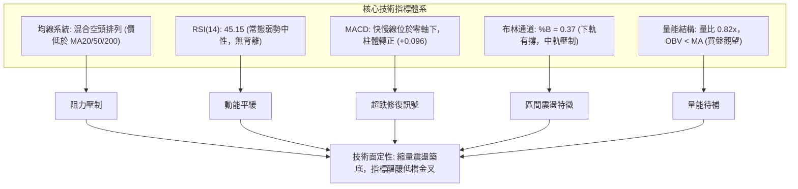

### 📈 移動平均線排列分析

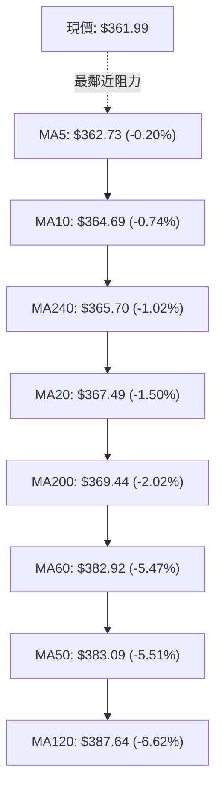

#### 均線數據與排列深度診斷

| 均線名稱 | 數值 | 價差與百分比 | 均線斜率與歷史微形趨勢 | 訊號 | 技術意涵解讀 |
|:---|:---:|:---:|:---:|:---:|:---|
| **MA 5** | $362.73 | -$0.74 (-0.20%) | ▁▁▁▁▁▁ (低位走平) | 🟡 | 超短期均線，價格緊貼其下方，短線空頭下殺斜率已趨平 |
| **MA 10** | $364.69 | -$2.70 (-0.74%) | ▁▁▁▁▁▁ (低位企穩) | 🟡 | 5日線與10日線距離收窄，短線醞釀交叉 |
| **MA 20** | $367.49 | -$5.50 (-1.50%) | ▅▄▃▂▂▁▁ (持續下彎) | 🔴 | 月線為短線多空樞紐，下彎對價格形成動態蓋頭壓制 |
| **MA 50** | $383.09 | -$21.10 (-5.51%) | ▇▇▆▆▅▅ (加速下滑) | 🔴 | 中期生命線，顯示過去兩個月持股成本均處於浮虧狀態 |
| **MA 60** | $382.92 | -$20.93 (-5.47%) | ▇▆▆▅▄▃ (下彎) | 🔴 | 與 MA50 形成雙重高壓區間 ($382.92 - $383.09) |
| **MA 120**| $387.64 | -$25.65 (-6.62%) | ▇▇▇▇████ (高檔鈍化) | 🔴 | 半年線位於高檔，中期上升趨勢遭到破壞 |
| **MA 200**| $369.44 | -$7.45 (-2.02%) | ▆▆▆▇▇██ (長期多頭走平) | 🔴 | **牛熊分界線**，跌破但未遠離，處於爭奪關鍵期 |
| **MA 240**| $365.70 | -$3.71 (-1.02%) | ▇▇▇▇████ (堅挺向上) | 🟢 | 長期年線依然維持向上延伸，長期牛市基底尚未瓦解 |

### 📉 RSI(14) 分析

- **RSI(14) 數值**：**45.15**
- **強度進度條**：`█████████░░░░░░░░░░░  45.15%`（中性偏弱）

```
RSI(14) 區間定位圖
0 ──────────── 30 ────────────────── 50 ──────── 70 ────────── 100
[   極度超賣   ]   [    空頭控盤區    ]   [ 多頭強勢 ] [  極度超買  ]
                      ▲
                      │ RSI: 45.15 (自超賣區 23.5 回升至中軸下方)
```

- **超買超賣與背離深入分析**：
  1. **脫離極端超賣**：2026-08-30 週 RSI 曾下探至 23.5 的極端恐慌水準，隨後伴隨價格在 S1 $357.11 止跌，RSI 迅速拉升回 45.15，表明空方超賣籌碼已被市場吸收。
  2. **背離判斷**：
     - **日線/週線背離**：數據明確標注「RSI 背離：無明顯背離」。
     - **客觀定性**：在近 3 週的築底過程中，價格自 $368.79 探底至 $357.90（小幅創新低），而週 RSI 則由 23.5 回升至 29.2 並於本週抵達 45.1，呈現微弱的「指標右肩抬高」，但尚未構成標準的宏觀底背離形態，定性為**跌勢趨緩後的動能中性修復**。

### 📊 MACD(12/26/9) 訊號解讀

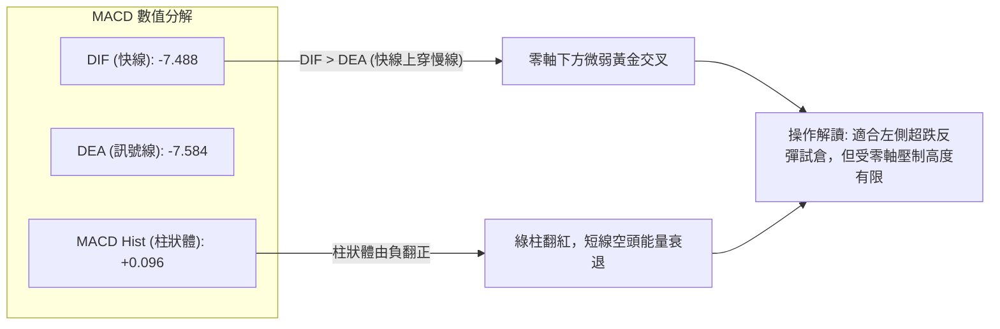

- **指標對話分析**：
  - DIF (-7.488) 與 DEA (-7.584) 目前均深處零軸下方（低於 0 水準達 -7.5 之多），這證明市場中期仍籠罩在空頭結構之下。
  - 然而，柱狀體（MACD Hist）報 **+0.096**，正式由負轉正，結束了自 2026-08-23 週以來的連續綠柱殺跌週期。這種在深水區的黃金交叉，通常代表短線超賣引發的技術性抽頭反彈，第一波通常以測試上方下彎均線為目標。

### 📦 布林通道分析

```
布林通道 (Bollinger Bands 20, 2) 結構圖
$388.60 ────────────────────────────────────────────── BB 上軌 (波動極限壓力)
                  ↑
                  │ 帶寬 (Bandwidth): $42.21
                  ↓
$367.49 ────────────────────────────────────────────── BB 中軌 (MA20 動態反壓)
             ● 現價: $361.99 (%B = 0.37)
$346.39 ────────────────────────────────────────────── BB 下軌 (波動極限支撐)
```

- **帶寬與位置解讀**：
  - **通道上軌**：$388.60
  - **通道中軌 (MA20)**：$367.49
  - **通道下軌**：$346.39
  - **帶寬**：$388.60 - $346.39 = $42.21（佔股價約 11.66%），顯示帶寬正處於收斂後期的橫盤狀態。
  - **%B 指標 (0.37)**：低於 0.50，表示股價位於中軌與下軌之間的弱勢震盪區，但距離下軌 $346.39 尚有 $15.60 (4.3%) 的安全緩衝垫，並未引發下軌張嘴的單邊下行風險。

### 💹 成交量分析（量價配合度）

```
成交量結構比較 (Volume Analysis)
最新成交量  █████████████████░░░  21.14M
20日均量    ████████████████████  25.74M  (量比: 0.82x)
50日均量    █████████████████░░░  22.03M
```

- **量能萎縮與 OBV 疲態**：
  - 當前成交量 21,142,900 股低於 20 日均量（25,744,245 股），量比僅為 **0.82x**，呈現典型的「跌後反彈無量」特徵。
  - **OBV 能量潮分析**：系統顯示「OBV < MA → 量能疲弱」。這表明主力資金在現階段並未大舉發動主動性進攻買盤，當前的止跌反彈主要是由空頭回補（Short Covering）與場內惜售情緒所驅動，而非新多頭資金的積極建倉。後續若要攻克 R1 $376.59，日成交量必須有效放大至 20 日均量 2,574 萬股以上。

---

## 6. 動能與波動率

### ⚡ 動能評估四象限

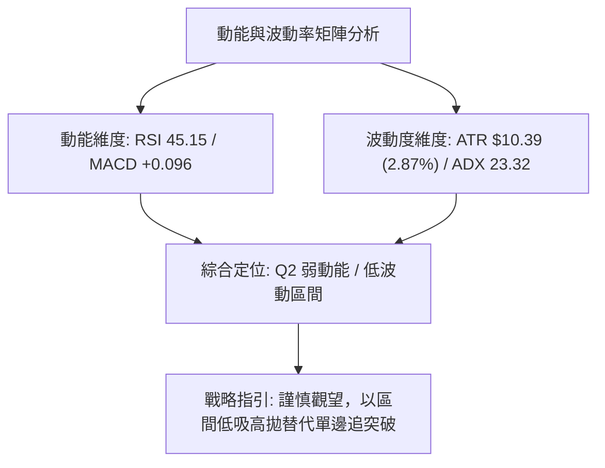

| 象限 | 動能維度 | 波動維度 | 當前狀態 | 技術評估與操作導向 |
|:---:|:---:|:---:|:---:|:---|
| **Q1** | 強動能 (RSI>60, ADX>25) | 低波動 (ATR% < 2%) | — | **最佳單邊趨勢**：持股加碼，穩健獲利區。 |
| **Q2** | **弱動能 (RSI 45.15, ADX 23.32)** | **低-中波動 (ATR% 2.87%)** | **✓ AVGO 當前** | **謹慎觀望/區間沉澱**：缺乏單邊動能，行情以反覆磨底、清洗浮額為特徵。 |
| **Q3** | 強動能 (爆量單邊突破) | 高波動 (ATR% > 4%) | — | **高風險投機**：趨勢劇烈分歧，適合日內突破交易。 |
| **Q4** | 弱動能 (無主導買盤) | 高波動 (恐慌性暴跌) | — | **高風險迴避**：多殺多無序下殺，嚴禁摸底。 |

### 📊 ATR 波動率分析

- **當前 ATR(14)**：**$10.39**
- **波動佔比**：佔當前股價 $361.99 的 **2.87%**。
- **交易風控意涵與止損距離精算**：
  - 單日合理震盪噪聲區間為 $\pm 1.0 \times \text{ATR} = \pm \$10.39$。
  - **波段保護止損**：應設定於關鍵支撐位下方至少 $1.5 \times \text{ATR}$（約 $\$15.58$）至 $2.0 \times \text{ATR}$（約 $\$20.78$）。
  - 若在當前價位 $361.99 或 S1 $357.11 附近進場，緊湊型止損距離為 $0.5 \times \text{ATR} = \$5.20$，完美契合 S1 下方防守點。

### 📐 Beta 與市場相關性

- **Beta 係數**：**1.457**
- **大盤相關性解讀**：
  - AVGO 的 Beta 高達 1.457，屬於典型的**高彈性成長型半導體龍頭**。當費城半導體指數（SOX）或那斯達克 100 指數（NDX）上漲 1% 時，AVGO 期望波動為 1.457%；反之在大盤修正時亦承受 1.457 倍的下行放大壓力。
  - 當前股價回調至年線與箱體下沿，其高 Beta 屬性意味著一旦科技大盤企穩回升，AVGO 具備迅速跑贏大盤的彈性潛能。

---

## 7. 多時框架總結

### 📋 時框架評分表

| 時框架 | 趨勢方向 | 動能狀態 | 均線排列狀況 | 形態特徵 | 綜合評分 | 戰術建議 |
|:---:|:---:|:---:|:---:|:---:|:---:|:---|
| **月線 (長期)** | 🟢 偏多 (牛市回調) | 🟡 中性減速 | 多頭排列 (MA240 向上) | 52W 高點深幅回撤洗盤 | **62/100** | 核心長期底倉續抱，戰略型逢低分批吸納 |
| **週線 (中期)** | 🔴 偏空 (弱勢盤整) | 🟡 止跌鈍化 | 均線高檔死叉 (MA50壓制) | 雙頂成型後測試箱體下沿 | **42/100** | 暫不開展大級別多頭進攻，等待突破 R2 |
| **日線 (短期)** | 🟡 中性震盪 | 🟢 柱體翻紅 | 混合排列 (受制於 MA20) | S1 支撐處收出止跌紅K | **47/100** | 嚴格依據布林通道與 S1-R1 區間高拋低吸 |

### 🔲 綜合訊號矩陣

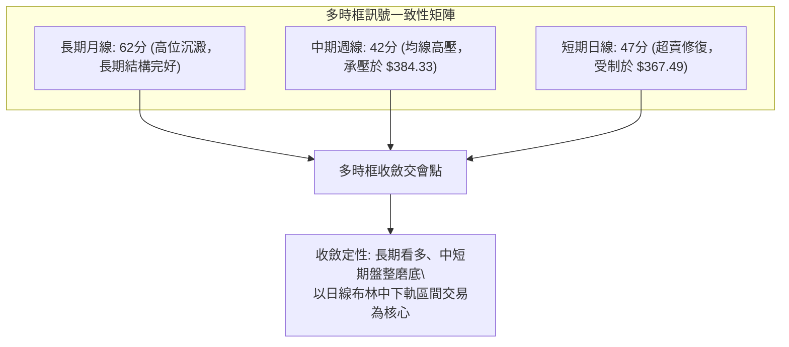

### ⚖️ 多時框收斂結論

依據多時框收斂規則第 14 條：
1. **行情性質判定**：當前日線 ADX(14) 讀數為 **23.32 (< 25)**，嚴格定義為**「無趨勢之橫向盤整行情」**。
2. **主導維度取捨**：在盤整行情中，趨勢指標（週線 MA50/MA200 死叉壓制）暫時鈍化，交易節奏回歸至**日線布林通道上下軌 ($346.39 – $388.60) 與關鍵水平聚類價位**。日線級別在 S1 $357.11 展現止跌買盤，為短期操作的主要依據。
3. **唯一收斂方向**：**【中性觀望，區間震盪操作】**。此結論與第 1 章評分卡（47/100）及第 8 章之區間策略保持絕對一致。

---

## 8. 交易策略建議

### 🗺️ 策略決策流程圖

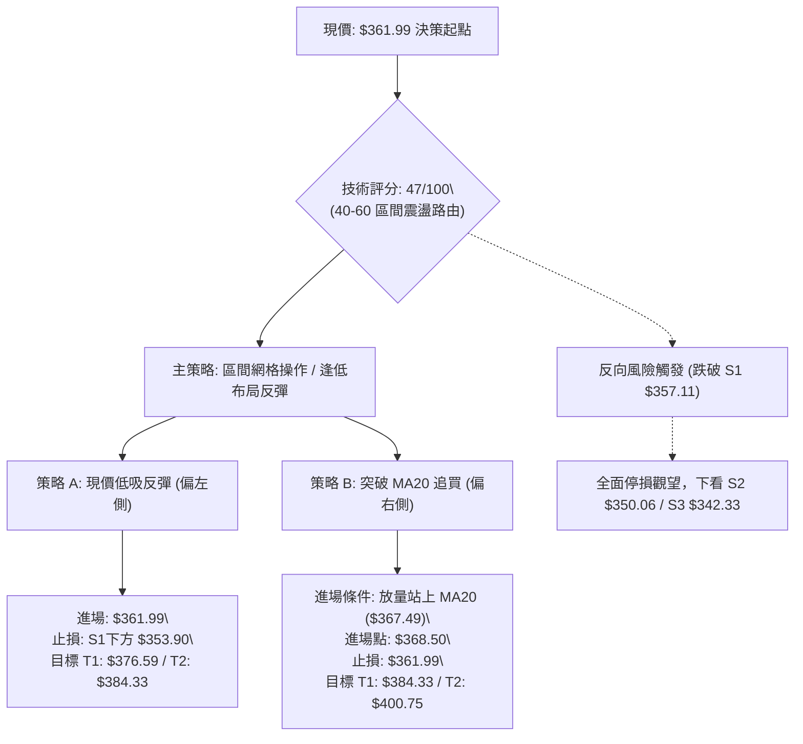

### 🧭 策略路由（依評分卡分流）

> **當前主策略方向 = 【中性區間操作，以布林下半區至中軌波段反彈為主】（依綜合技術評分：47/100）**

綜合評分處於 40–60 區間，ADX < 25 且均線混合排列，市場無單邊趨勢。策略定位以**「支撐位防守低吸，阻力位停利減碼」**為核心，不盲目追高，亦不在此位置過度看空。

### 🎯 價格情境階梯（Price Scenarios）

所有觸發點與目標價均嚴格引用第 4 章關鍵價位：

| 觸發條件 | 第一目標 | 第二目標 | 後續延伸 | 情境含義與操作指引 |
|:---|:---:|:---:|:---:|:---|
| **放量突破 R1 ($376.59)** | R2: **$384.33** | R3: **$400.75** | 斐波那契 38.2%: **$416.02** | 短線徹底轉強，收復 MA200 牛熊線，全面開啟中期波段反彈行情 |
| **受阻於 MA20 ($367.49)** | 現價: **$361.99** | S1: **$357.11** | BB中下軌震盪 | 弱勢震盪整理，受制於布林中軌壓制，維持區間高拋低吸 |
| **放量跌破 S1 ($357.11)** | S2: **$350.06** | S3: **$342.33** | 斐波那契 78.6%: **$333.31** | 中期築底失敗，向下尋求 52 週低點區間支撐，必須嚴格止損 |

### 📊 情境機率分佈

```
情境機率分佈 (Probability Distribution)
區間反彈向上  ████████████████████████████░░  55%
維持窄幅震盪  ███████████████░░░░░░░░░░░░░░░  30%
向下破位探底  ███████░░░░░░░░░░░░░░░░░░░░░░░  15%
```

| 未來情境劇本 | 估計機率 | 主要技術佐證 |
|:---|:---:|:---|
| **區間反彈向上 (測試 R1/R2)** | **55%** | MACD 柱狀體翻正 (+0.096)；週 K 在 S1 $357.11 留長下影線獲得支撐；9/3-9/10 多家投行上調評級帶來基本面護航。 |
| **維持窄幅震盪 (S1 - MA20 之間)** | **30%** | ADX 23.32 處於無趨勢狀態；成交量比僅 0.82x 顯示市場參與度不足；布林通道帶寬收窄。 |
| **向下破位探底 (跌破 S1 測 S2/S3)** | **15%** | -DI 高達 31.94 仍佔優勢；現價跌破 MA200；大盤若受宏觀因素系統性回調可能拖累高 Beta (1.457) 個股。 |

### 🟢 主策略詳情

本報告依據風險偏好提供「策略 A（現價低吸反彈）」與「策略 B（右側突破加碼）」：

| 策略要素 | 策略 A：支撐位逢低反彈 (激進/左側) | 策略 B：突破 MA20 追隨 (穩健/右側) |
|:---|:---:|:---:|
| **策略邏輯** | 依託 S1 $357.11 強支撐，博弈超賣反彈 | 等待價格放量收復 MA20，確認短線轉強 |
| **進場條件** | 週一開盤現價或回測守穩 $361.00 附近 | 日K收盤站穩 MA20 ($367.49) 上方且量能放大 |
| **進場價格** | **$361.99** (現價直接進場) | **$368.50** (突破追買) |
| **第一目標 (T1)** | **$376.59** (關鍵阻力 R1) | **$384.33** (強阻力 R2 / MA50) |
| **第二目標 (T2)** | **$384.33** (強阻力 R2) | **$400.75** (核心高點 R3) |
| **止損價格** | **$353.90** (S1 $357.11 下方約 0.3 ATR) | **$361.99** (跌破前波平台/現價) |
| **風險空間** | $361.99 - $353.90 = **$8.09** | $368.50 - $361.99 = **$6.51** |
| **報酬空間 (至T1)**| $376.59 - $361.99 = **$14.60** | $384.33 - $368.50 = **$15.83** |
| **風險報酬比 (R:R)**| **1 : 1.80** (至 T2 則為 1 : 2.76) | **1 : 2.43** (至 T2 則為 1 : 4.95) |
| **預估勝率** | 58% | 65% |
| **建議倉位** | 10% - 15% 總資金 | 15% - 20% 總資金 |

### 🔴 反向風險觸發點（對沖提示）

若出現以下情境，宣告主策略失效，投資人應立即執行風控或反手避險：
1. **反轉破位訊號**：日K線收盤價**跌破 S1 ($357.11)**，且成交量放大至 2,500 萬股以上。
2. **對沖應對措施**：
   - 多頭部位無條件停損出場。
   - 激進交易者可小倉位（5%）建立空頭或買入看跌期權（Put Option），下檔回補目標設為 **S2 ($350.06)** 與 **S3 ($342.33)**。

### ⭐ 整體訊號強度評星

```
做多訊號強度：★★★☆☆  (3.0 / 5.0 星) — 依託 S1 支撐與 MACD 紅柱，具備反彈勝率
做空訊號強度：★★☆☆☆  (2.0 / 5.0 星) — 價格接近下軌且 ADX<25，追空盈虧比差
整體可信度：  ★★★☆☆  (3.5 / 5.0 星) — 數據量價收斂，指標共振明確指向盤整
```

---

## 9. 風險提示與監控

### ✅ 關鍵監控指標 Checklist

```
╔════════════════════════════════════════════════════════════════╗
║                   AVGO 每日交易監控 Checklist                  ║
╠════════════════════════════════════════════════════════════════╣
║ [ ] 價格是否成功收復 MA20 ($367.49) 與 MA200 ($369.44)         ║
║ [ ] 日成交量能否突破 20 日均量 (25.74M 股)，化解量能萎縮困局   ║
║ [ ] RSI(14) 能否突破 50 中軸多空線，確認多頭動能回歸           ║
║ [ ] MACD 快線 DIF 能否持續向上靠攏零軸 (突破 -7.00 水準)       ║
║ [ ] S1 支撐位 ($357.11) 在盤中回踩時是否具備強勁承接下影線     ║
║ [ ] ADX(14) 讀數是否突破 25，警惕單邊破位行情無預警發動       ║
║ [ ] 費城半導體指數 (SOX) 走勢是否共振企穩 (因高 Beta 1.457)   ║
╚════════════════════════════════════════════════════════════════╝
```

### ⚠️ 風險場景分析

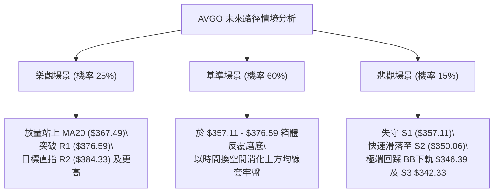

### 🛡️ 風險管理重要提醒

1. **嚴格執行價格紀律**：
   - 當前處於年線爭奪戰關鍵期，切忌在 $367.49 - $369.44 均線重疊密集區追價。
   - 所有多單進場必須同時掛入預埋止損單，將停損點鎖定在 **$353.90**（嚴防下破 S1 $357.11）。
2. **波動率與部位控管**：
   - 考量 AVGO 單日 ATR 為 **$10.39** 且 Beta 為 **1.457**，屬於波動劇烈資產。單筆交易承受風險資金應嚴格限制於總帳戶資產的 **1.0% - 1.5%** 以內。
   - 資金部位建議採分批建倉原則（如 3-3-4 梯次），首筆單進場後唯有確認突破 R1 $376.59 方可進行盈利加碼。
3. **宏觀環境聯動風險**：
   - 半導體族群對美國公債殖利率與 AI 資本支出展望極度敏感，需緊密追蹤大型 CSP 廠商最新動向及費半指數表現。

---

## 📋 報告總結

```
╔══════════════════════════════════════════════════════════════════════════╗
║                     AVGO 技術分析報告總結 (2026-09-13)                   ║
╠══════════════════════════════════════════════════════════════════════════╣
║ 當前價格：$361.99              52W 區間：$289.50 – $494.22 (位階 35.4%)   ║
║ 分析評級：⚖️ 中性區間震盪 (47/100) — 縮量打底，等待方向突破               ║
╠══════════════════════════════════════════════════════════════════════════╣
║ 關鍵趨勢結論：                                                          ║
║ ├─ 長期趨勢：🟢 偏多維持 (自 2024 年底大漲後進入高檔中級回調，基底未毀)   ║
║ ├─ 中期趨勢：🔴 弱勢整理 (承壓於 MA50 $383.09，雙頂成型後正尋求下沿支撐)  ║
║ ├─ 短期趨勢：🟡 區間築底 (MACD 柱狀體翻正，於 S1 $357.11 上方醞釀反彈)    ║
║ ├─ 關鍵支撐：S1: $357.11 │ S2: $350.06 │ S3: $342.33                   ║
║ ├─ 關鍵阻力：R1: $376.59 │ R2: $384.33 │ R3: $400.75                   ║
║ └─ 外資共識：🟢 Strong Buy (47位分析師平均目標價 $531.85，潛在空間大)   ║
╠══════════════════════════════════════════════════════════════════════════╣
║ 最優策略組合：                                                          ║
║ 1. 🥇 最佳機會：策略 A (現價 $361.99 左側博弈反彈，止損 $353.90，         ║
║                 目標 $376.59 / $384.33，風險報酬比 1:1.80 至 1:2.76)   ║
║ 2. 🥈 次選機會：策略 B (等待放量收復 MA20 於 $368.50 右側跟進，           ║
║                 目標 $384.33 / $400.75，勝率較高達 65%)                ║
║ 3. 🥉 保守選擇：場外完全觀望，靜待 ADX 重新升破 25 且明確突破 R2 再行進場 ║
╚══════════════════════════════════════════════════════════════════════════╝
```

---

> ⚠️ **免責聲明**：本報告為 AI 自動生成之技術分析研究成果，所有技術價位均基於歷史 OHLCV 演算法精確推算。本報告**僅供學術研究與投資思考參考**，**絕不構成任何具體的買賣邀約或投資建議**。金融市場瞬息萬變，投資人應獨立思考，審慎評估個人風險承受度並自負盈虧。

---
*報告生成時間：2026-09-13 ｜ 數據來源：Yahoo Finance ｜ 分析框架：多時框技術分析體系*