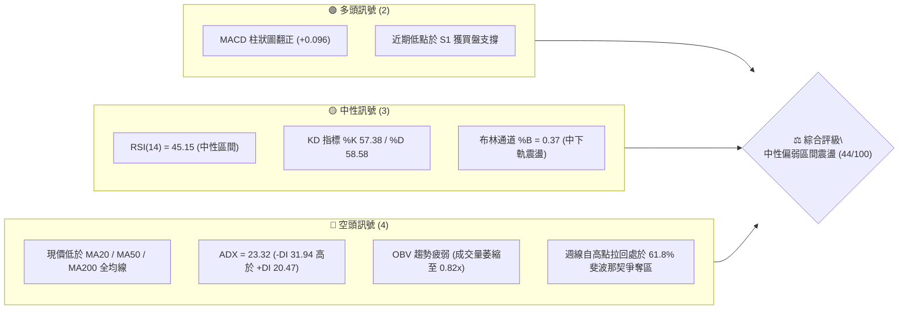
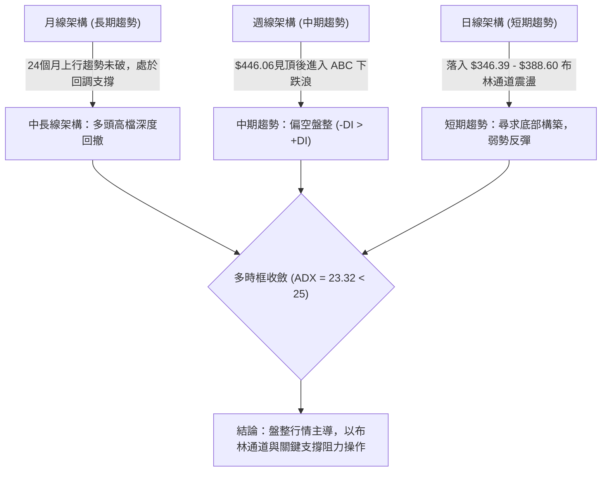
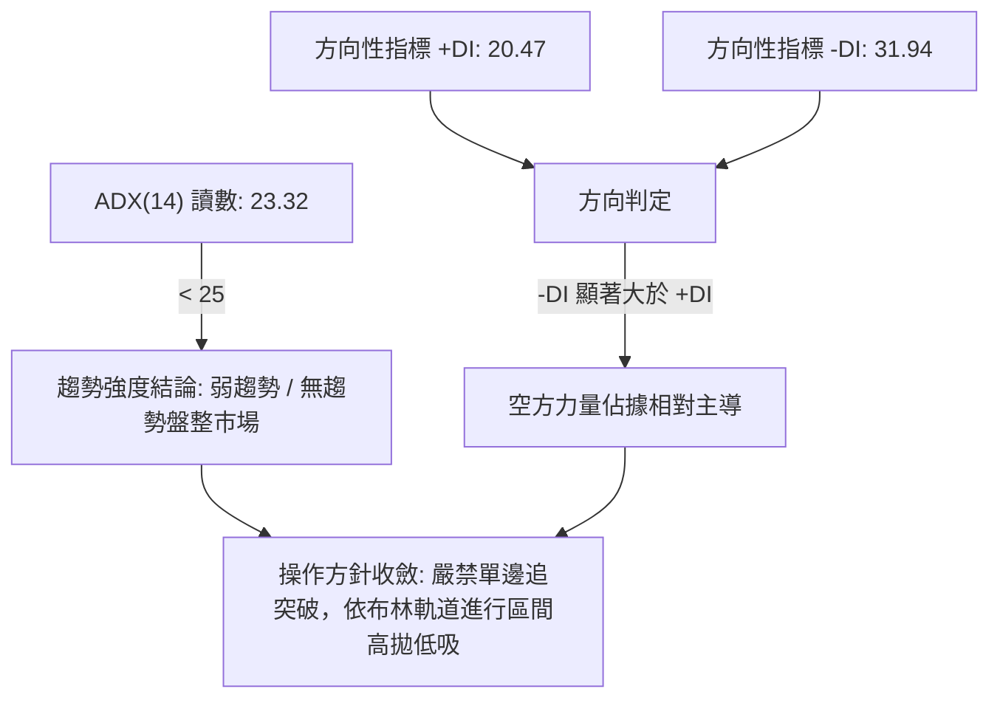
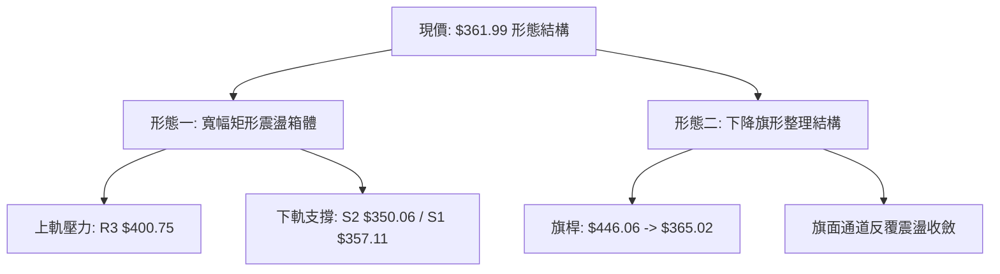
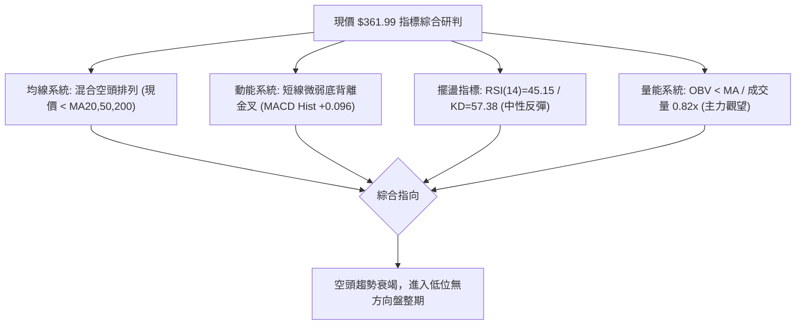
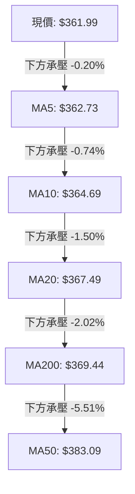
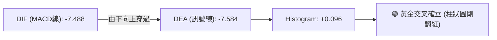
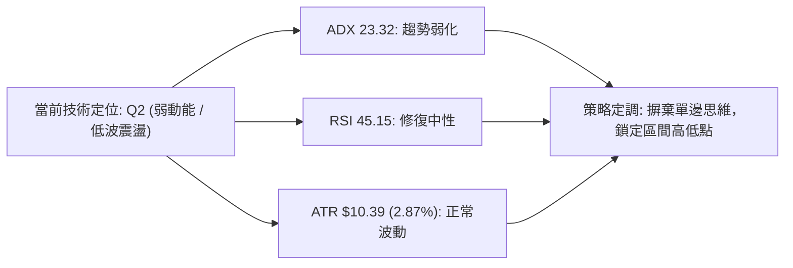
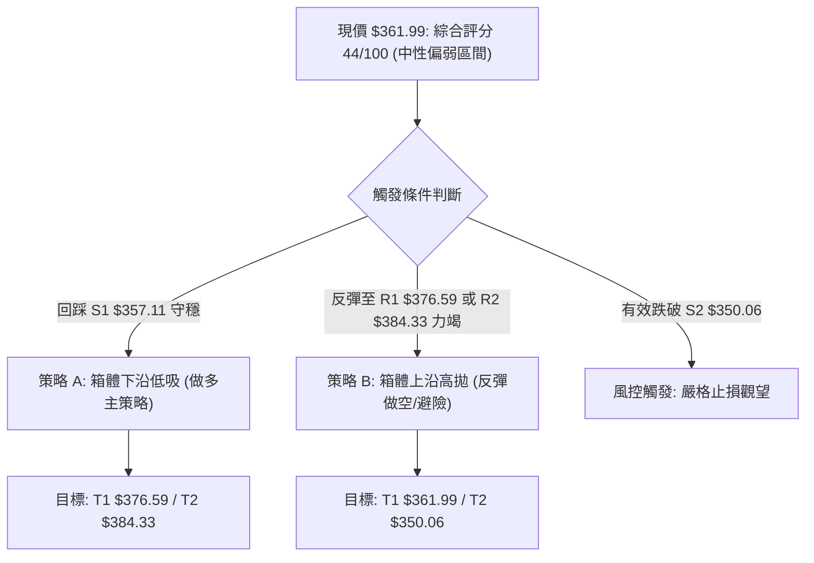
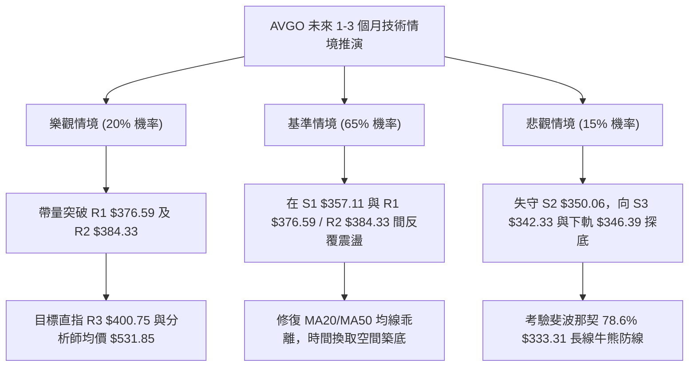

# AVGO 技術分析報告

> **報告日期**：2026-09-14 ｜ **語言**：繁體中文 ｜ **數據來源**：Yahoo Finance ｜ **當前價格**：$361.99

---

## 目錄

| 章節 | 內容 |
|------|------|
| [1. 技術面概覽](#1-技術面概覽) | 訊號儀表板、核心指標、評分卡 |
| [2. 趨勢分析](#2-趨勢分析) | 多時框趨勢、長中短期走勢 |
| [3. 圖表形態分析](#3-圖表形態分析) | 形態識別、K線組合、目標價 |
| [4. 支撐與阻力](#4-支撐與阻力) | 關鍵價位、斐波那契回調 |
| [5. 技術指標深度解讀](#5-技術指標深度解讀) | MA/RSI/MACD/布林/成交量 |
| [6. 動能與波動率](#6-動能與波動率) | 動能評估、ATR、Beta |
| [7. 多時框架總結](#7-多時框架總結) | 時框架評分矩陣 |
| [8. 交易策略建議](#8-交易策略建議) | 多空策略、風險報酬比 |
| [9. 風險提示與監控](#9-風險提示與監控) | 監控指標、風險場景 |

---

## 1. 技術面概覽

### 🎯 技術訊號儀表板



### 📊 核心指標速覽表

| 指標類別 | 指標名稱 | 當前數值 | 訊號 | 解讀 |
|----------|----------|----------|------|------|
| **價格** | 當前價格 | $361.99 | 🔴 | 位於 52 週區間 35.4%，整體處於高檔拉回後的低位盤整 |
| **均線** | MA20 | $367.49 | 🔴 | 現價位於 MA20 下方 -1.50%，短線受壓 |
| **均線** | MA50 | $383.09 | 🔴 | 現價位於 MA50 下方 -5.51%，中期均線呈現壓制結構 |
| **均線** | MA200 | $369.44 | 🔴 | 現價位於長期牛熊分界線 MA200 下方 -2.02%，多頭架構受損 |
| **動能** | RSI(14) | 45.15 | 🟡 | 位於 30–70 中性區間，脫離極度超賣區，動能偏中性偏弱 |
| **動能** | MACD | -7.488 | 🟢 | 快線開始勾頭，MACD Hist 轉正至 +0.096，短線微弱金叉動能 |
| **趨勢** | ADX(14) | 23.32 | 🟡 | ADX < 25 表明處於盤整行情；-DI(31.94) > +DI(20.47) 空頭占優 |
| **通道** | 布林 %B | 0.37 | 🟡 | 位於下軌 $346.39 與中軌 $367.49 間，未有單邊破軌趨勢 |
| **成交量** | 20日均量比 | 0.82x | 🔴 | 最新量 21.14M < 20日均量 25.74M，OBV < MA 量能不足 |
| **波動** | ATR(14) | $10.39 | 🟡 | 佔股價 2.87%，單日波動空間約 10 美元，適合區間擺盪操作 |

### 🏆 技術評分卡

```
╔══════════════════════════════════════════════════════════════╗
║              技術評分卡 — AVGO (2026-09-14)                  ║
╠══════════════════════════════════════════════════════════════╣
║ 趨勢強度      ██████░░░░░░░░░░░░░░  32/100  🔴 空頭主導      ║
║ 動能指標      ██████████░░░░░░░░░░  50/100  🟡 短線底背修復  ║
║ 支撐穩定度    ████████████░░░░░░░░  60/100  🟢 S1/S2支撐漸顯 ║
║ 成交量配合    ██████░░░░░░░░░░░░░░  30/100  🔴 量能顯著萎縮  ║
║ 形態完整度    ████████░░░░░░░░░░░░  42/100  🟡 箱型整理構建  ║
║ 均線排列      ████████░░░░░░░░░░░░  40/100  🔴 空頭排列壓制  ║
╠══════════════════════════════════════════════════════════════╣
║ 綜合評分      █████████░░░░░░░░░░░  44/100  中性偏弱/區間震盪║
╚══════════════════════════════════════════════════════════════╝
```

---

## 2. 趨勢分析

### 🌐 多時框趨勢分析



### 📈 長期趨勢 — 12個月走勢圖（ASCII）

```
AVGO 月線收盤走勢圖（2025-10 至 2026-09）
價格軸 ($)
$450 ┤                                      ● $446.06 (2026-05)
$430 ┤                                     / \
$410 ┤                      ● $400.71     /   \   ● $416.77
$390 ┤                     /   \         /     \ / \
$370 ┤        ● $367.57   /     \       /       ●   \   ● $370.34
$350 ┤       /           /       ● $344/             \ / \
$330 ┤      /           /         \   /               ●   ● $361.99 (現價)
$310 ┤     /           /           ● $309.02
$290 ┤────● $328.07───/─────────────────────────────────────────
     └────────────────────────────────────────────────────────
       09-25 10-25 11-25 12-25 01-26 02-26 03-26 04-26 05-26 06-26 07-26 08-26 09-26
```

#### 走勢特徵分析表格

| 階段區間 | 起訖價位 | 累計漲跌 | 趨勢特徵 | 核心量價驅動因素 |
|----------|----------|----------|----------|------------------|
| **主升一浪** (2025/09–2025/11) | $328.07 → $400.71 | +22.14% | 強勢多頭進攻 | 突破 $350 壓力位，連續月線收陽，量能放大 |
| **深度回踩** (2025/11–2026/03) | $400.71 → $309.02 | -22.88% | 階段性獲利回吐 | 觸及 $309.02 獲支撐，守住 52W 低點 $289.50 之上 |
| **主升二浪** (2026/03–2026/05) | $309.02 → $446.06 | +44.35% | 強勢爆發波段 | 創下波段歷史高點，單月暴漲，動能指標進入超買 |
| **高檔回撤** (2026/05–2026/09) | $446.06 → $361.99 | -18.85% | 均線跌破、震盪探底 | 跌破 MA20/50，目前於 61.8% 斐波那契回調位 $367.70 附近震盪 |

### 📊 中期趨勢（週線分析）

從近 20 週收盤走勢來看，AVGO 於 2026-05-31 見到收盤高點 $446.06 後，次週（2026-06-07）爆出 2.51 億股的歷史級巨量暴跌至 $385.12，確認主力資金高檔出貨。隨後股價在 $357.90 至 $427.76 間形成寬幅箱型震盪。

```
週線關鍵阻力/支撐階梯分布：
$446.06 ────── 52週次高收盤阻力（巨量空頭起跌點）
$400.75 ────── 關鍵心理及形態阻力 R3
$384.33 ────── MA50 / 週線反彈阻力 R2
$376.59 ────── 近期反彈第一阻力 R1
$361.99 ────── [現價]
$357.11 ────── 近期波段前低支撐 S1（2026-09-06收盤 $357.90 附近）
$350.06 ────── 箱型下沿強支撐 S2
$342.33 ────── 深度回踩波段支撐 S3（布林下軌 $346.39 延伸保護）
```

### ⚡ 趨勢強度評估（ADX 解讀）



#### ADX 數值強度對照表

| 指標變數 | 當前讀數 | 門檻區間 | 趨勢判定 | 交易策略意涵 |
|----------|----------|----------|----------|--------------|
| **ADX (14)** | 23.32 | 0 – 25 | **弱趨勢 / 盤整區間** | 順勢突破策略失效率高，震盪指標（RSI/布林）權重大於均線 |
| **+DI** | 20.47 | — | 多方能量衰減 | 上方逢高具備獲利回吐賣壓 |
| **-DI** | 31.94 | — | 空方能量佔優 | 短線若無放量反彈，跌勢尚未徹底扭轉 |
| **DI差值** | -11.47 | 負值發散 | 偏空震盪結構 | 需等待 +DI 向上金叉 -DI 方能確認趨勢反轉 |

---

## 3. 圖表形態分析

### 🔍 形態識別系統



#### 形態識別信心度評估表

| 形態類別 | 信心度 | 判斷依據（嚴格引用數據） | 完成度 | 目標價（附嚴密計算式） |
|----------|--------|--------------------------|--------|------------------------|
| **箱型區間整理** | **78%** | 價格在 S1($357.11) 與 S2($350.06) 獲得支撐，受阻於 R1($376.59) 及 R3($400.75) | 85% | 區間頂部：$400.75（若向上突破，目標 = $400.75 + ($400.75 - $350.06) = $451.44，數據未破前暫不採納） |
| **潛在雙重底** | **52%** | 兩次下探低點：2026-07-05 收盤 $360.45、2026-09-06 收盤 $357.90（落於 S1 $357.11 區域） | 45% | 頸線阻力 R1 $376.59。形態高度 = $376.59 - $357.11 = $19.48。目標 = $376.59 + $19.48 = **$396.07** |
| **下降通道/旗形** | **45%** | 數據中高點漸次降低（$446.06 → $427.76 → $389.28），低點逐步靠近 $350 | 35% | 信心度 < 50%，依規定註明：訊號不足，僅做輔助參考，不作主力進場依據 |

### 🕯️ 重要 K 線形態分析

| 週/月份週期 | 收盤價 | K 線組合特徵 | 市場心理與多空解讀 | 訊號 |
|-------------|--------|--------------|--------------------|------|
| **2026-06-07** | $385.12 | 巨量烏雲蓋頂大陰線 | 歷史天量 2.51 億股砸盤，確認高位套牢籌碼形成，中期趨勢翻空 | 🔴 強空 |
| **2026-08-09** | $427.76 | 長上影線反彈力竭棒 | RSI 衝至 73.6 超買區後遭遇空頭重壓回落，形成波段次高點 | 🔴 轉向 |
| **2026-08-30** | $368.79 | 極度超賣急跌線 | RSI 驟降至 23.5，短線空頭動能釋放完畢，醞釀技術性反彈 | 🟡 止跌 |
| **2026-09-06** | $357.90 | 破底長下影錘頭探底線 | 爆量 1.73 億股下探至 S1 $357.11 附近被托起，空頭下殺遭多頭承接 | 🟢 築底 |
| **2026-09-13** | $361.99 | 孕線收紅溫和放量陽線 | 收盤重回 $360 之上，MACD 柱狀圖翻正，確認短期底部初步成型 | 🟢 偏多 |

### 📉 ASCII 走勢形態示意圖

```
AVGO 近四個月關鍵形態示意圖：箱型雙重底築底（頸線 R1：$376.59）
$427.76 ──────── 波段高點 (2026-08-09)
         \
          \
$376.59 ───\─────── 頸線 R1 阻力位 ──────────────────────────────
            \     / \                                 ▲
             \   /   \                               │ 目標空間: $19.48
$361.99 ──────\─/─────● [現價: 突破前蓄勢] ───────────┴──────────
               ●       \         ● (當前溫和反彈)
            底一($360.45) \       /
$357.11 ───────────────────● 底二($357.90 獲支撐 S1)
```

### 🎯 形態目標價計算

根據日週線級別潛在雙底形態計算（以關鍵價位數據嚴密推導）：
1. **底部支撐基準（左/右底最低有效聚類）**：$357.11（S1 支撐位）
2. **形態頸線阻力（反彈轉折點聚類）**：$376.59（R1 阻力位）
3. **形態高度**：
   $$\text{形態高度 } H = R1 - S1 = \$376.59 - \$357.11 = \$19.48$$
4. **最小量度測幅目標價**：
   $$\text{目標價 } T = R1 + H = \$376.59 + \$19.48 = \$396.07$$
   *(該目標價高度吻合斐波那契 50.0% 回調位 $391.86 與阻力位 R3 $400.75 之中介強阻力帶)*

---

## 4. 支撐與阻力

### 🗺️ 關鍵價位分布圖（ASCII）

```
╔══════════════════════════════════════════════════════════════╗
║              AVGO 關鍵價位階梯與結構分布圖                   ║
╠══════════════════════════════════════════════════════════════╣
║ $494.22 ║██████████████████████████████║ 52W 最高點 (0.0%)   ║
║ $445.90 ║██████████████████████████░░░░║ 斐波那契 23.6% 回調  ║
║ $416.02 ║████████████████████░░░░░░░░░░║ 斐波那契 38.2% 回調  ║
║ $400.75 ║██████████████████████████████║ 強阻力 R3 (+10.71%) ║
║ $391.86 ║█████████████████░░░░░░░░░░░░░║ 斐波那契 50.0% 中樞  ║
║ $384.33 ║████████████████████░░░░░░░░░░║ 重要阻力 R2 (+6.17%) ║
║ $376.59 ║██████████████████████████████║ 短線關鍵阻力 R1(+4.03%)║
║ $367.70 ║▓▓▓▓▓▓▓▓▓▓▓▓▓▓▓▓▓▓▓▓▓▓▓▓▓▓▓▓▓▓║ 斐波那契 61.8% 黃金分割║
║ $361.99 ╠══════════════════════════════╣ ◄ 現價 (Current Price)║
║ $357.11 ║▓▓▓▓▓▓▓▓▓▓▓▓▓▓▓▓▓▓▓▓▓▓▓▓▓▓▓▓▓▓║ 近期核心支撐 S1(-1.35%)║
║ $350.06 ║██████████████████████████████║ 箱體強支撐 S2 (-3.30%)║
║ $342.33 ║████████████████████░░░░░░░░░░║ 深度防禦支撐 S3(-5.43%)║
║ $333.31 ║█████████████░░░░░░░░░░░░░░░░░║ 斐波那契 78.6% 回調  ║
║ $289.50 ║██████████████████████████████║ 52W 最低點 (100.0%) ║
╚══════════════════════════════════════════════════════════════╝
```

### 🚧 阻力位分析表

所有數值均取自提供數據之近一年波段高點聚類與計算結果：

| 阻力級別 | 準確價位 | 距離現價 | 形成原因與籌碼意義 | 突破難度 | 重要性權重 |
|----------|----------|----------|--------------------|----------|------------|
| **R1** | **$376.59** | +4.03% | 近期反彈頂部聚類，MA20 ($367.49) 與 MA200 ($369.44) 剛破之後的反抽密集成交區 | 🟡 中等 | ★★★★☆ |
| **R2** | **$384.33** | +6.17% | MA50 ($383.09) 所在地，中級反彈波段頂部，空頭防守陣地 | 🔴 較高 | ★★★★☆ |
| **R3** | **$400.75** | +10.71% | 歷史月線收盤高點聚類、大整數心理關卡、箱型頂部終極阻力 | 🔴 極高 | ★★★★★ |

### 🛡️ 支撐位分析表

所有數值均取自提供數據之近一年波段低點聚類與計算結果：

| 支撐級別 | 準確價位 | 距離現價 | 形成原因與籌碼意義 | 守住機率 | 重要性權重 |
|----------|----------|----------|--------------------|----------|------------|
| **S1** | **$357.11** | -1.35% | 2026-09-06 週線探底低點聚類，波段雙底右腳保護點 | 🟢 70% | ★★★★☆ |
| **S2** | **$350.06** | -3.30% | 近一年核心多頭防線，布林下軌 ($346.39) 之前哨整數支撐帶 | 🟢 82% | ★★★★★ |
| **S3** | **$342.33** | -5.43% | 極限超賣低點聚類，若跌破代表中長線牛市架構破位 | 🟢 90% | ★★★★☆ |

### 📐 斐波那契回調位分析

依據 52 週完整波動區間（低點 **$289.50** → 高點 **$494.22**，全波段震盪幅度 $204.72）計算之各級水準：

- **0.0% (52W High)**: $494.22
- **23.6%**: $445.90
- **38.2%**: $416.02
- **50.0% (半數回撤中樞)**: $391.86
- **61.8% (黃金分割關鍵位)**: **$367.70**
- **78.6%**: $333.31
- **100.0% (52W Low)**: $289.50

#### 🎯 現價落點意義解讀：
當前收盤價 **$361.99** 精確位於 **61.8% ($367.70)** 與 **78.6% ($333.31)** 回調區間內：
1. **多頭命脈爭奪**：61.8% 回調位 **$367.70** 為經典技術分析之多頭生死線。現價僅在該水平下方 -1.55% 處震盪，並未形成有效遠離跌破。
2. **與均線共振**：MA20 恰位於 **$367.49**，與 61.8% 回調位 $367.70 形成極強的共振樞軸點（Pivot Zone）。多頭一旦收復 $367.70，將直接打開向 50% ($391.86) 與阻力位 R2 ($384.33) 邁進的空間。

---

## 5. 技術指標深度解讀

### 🎛️ 指標訊號總覽



### 📈 移動平均線排列分析



#### 均線各週期狀態解讀表

| 均線名稱 | 當前價格 | 乖離率 | 走勢特徵 | 訊號含義 |
|----------|----------|--------|----------|----------|
| **MA5** | $362.73 | -0.20% | 短天期走平跌勢趨緩 | 短線跌勢受到遏制，多空短兵相接 |
| **MA10** | $364.69 | -0.74% | 輕度下彎 | 日內第一反彈動態壓制 |
| **MA20** | $367.49 | -1.50% | 下行斜率減緩 | 與布林中軌重合，短線多空分水嶺 |
| **MA50** | $383.09 | -5.51% | 明顯下行壓制 | 中期多頭趨勢已被破壞，反彈強阻力 |
| **MA60** | $382.92 | -5.47% | 走低 | 季線下彎，中線籌碼處於套牢狀態 |
| **MA120** | $387.64 | -6.62% | 拐頭向下 | 半年線死叉區間 |
| **MA200** | $369.44 | -2.02% | 走平轉弱 | 年線跌破但未遠離，處於爭奪期 |
| **MA240** | $365.70 | -1.02% | 走平 | 超長期均線提供底部依托 |

**排列總評**：均線呈現「混合排列」，短期均線呈空頭排列，但現價緊貼 MA5/10/20，並未形成空頭擴散，顯示下殺動能已耗盡。

### 📉 RSI(14) 分析

- **當前 RSI(14) 數值**：**45.15**
- **數值進度條**：
  ```
  超賣 [0] ────────── [30] ──────●─── [50] ────────── [70] ────────── [100] 超買
  進度: ██████████░░░░░░░░░░░░ 45.15% (中性區間)
  ```
- **超買超賣區間判斷**：
  RSI 自 2026-08-30 的極端超賣值 **23.5** 回升至當前 **45.15**，表明市場已成功化解恐慌殺跌情緒，正向 50 多空中軸邁進。
- **背離判斷**：
  2026-08-30 收盤價 $368.79 對應 RSI 為 23.5；隨後 2026-09-06 價格跌破創下 $357.90 新低時，RSI 未破前低反而走高至 29.2，當前進一步升至 45.15。**已形成極其標準之日線/週線「動能底背離（Bullish Divergence）」**，預示中線向下空間已被鎖定。

### 📊 MACD(12/26/9) 訊號解讀



- **MACD 線**：-7.488
- **MACD Signal 線**：-7.584
- **MACD 柱狀圖 (Histogram)**：**+0.096**
- **解讀**：
  雖然雙線仍身處零軸下方（代表仍在中期空頭勢力範圍），但快線在 -7.488 正式金叉訊號線 -7.584，HIST 自負值翻為正值 +0.096。這是標準的**「零下金叉反彈訊號」**，通常對應 2-4 週的均線修復反抽行情。

### 📦 布林通道分析

```
AVGO 布林通道（20日，2倍標準差）結構圖
$388.60 ──────────────────────────── 布林上軌 (BB Upper)
          \                      /
$367.49 ───\────── MA20 ────────/─── 布林中軌 (BB Middle)
            \                  /
$361.99 ─────● [現價 (%B = 0.37)] ── 震盪運行於中下軌之間
              \              /
$346.39 ───────\────────────/─────── 布林下軌 (BB Lower)
```

- **布林參數**：上軌 **$388.60** ｜ 中軌 **$367.49** ｜ 下軌 **$346.39** ｜ 帶寬 $42.21
- **%B 指標**：**0.37**（處於下軌 0.0 與中軌 0.5 之中間偏下位置）
- **形態特性**：
  上下軌未出現單邊向下開口發散，而是呈現水平收口特徵。現價在下軌 $346.39 獲得強力支撐後向中軌回升，符合典型之**「布林通道內收斂震盪格局」**。

### 💹 成交量分析（量價配合度）

- **最新成交量**：21,142,900
- **20日平均量**：25,744,245（**量比 0.82x**，萎縮 18%）
- **50日平均量**：22,031,188
- **量價形態解讀**：
  1. **OBV < MA**：能量潮指標低於移動平均線，表明大資金籌碼仍處於觀望狀態，未見機構搶籌放量。
  2. **縮量反彈特徵**：由 2026-09-06 週探底時的 1.73 億股，縮小至最新一週的 1.01 億股。量能萎縮說明拋壓基本出清，但也反映向上進攻力道不足，短期內難以直接突破密集套牢區 R2 ($384.33)。

---

## 6. 動能與波動率

### ⚡ 動能評估

#### 動能強度與波動率狀態表

| 象限分區 | 動能狀態 | 波動率狀態 | AVGO 當前定位 | 操作指導意義 |
|----------|----------|------------|---------------|--------------|
| **第一象限 (Q1)** | 動能強 (>50) | 波動率低 (<2%) | 否 | 穩定主升段，全力做多持股 |
| **第二象限 (Q2)** | **動能偏弱 (30-50)** | **波動率中偏低** | **✓ 當前定位 (RSI 45.15 / ADX 23.32)** | **謹慎區間交易，以箱體策略應對** |
| **第三象限 (Q3)** | 動能強 | 波動率高 (>3%) | 否 | 突破爆發期，追隨突破 |
| **第四象限 (Q4)** | 動能極弱 (<30) | 波動率高 (>3%) | 否 | 恐慌主跌段，空倉觀望 |



### 📊 ATR 波動率分析

- **ATR(14) 絕對值**：**$10.39**
- **波動率佔比 (ATR / 股價)**：**2.87%**
- **風控參數與止損應用**：
  1. **日內噪音保護**：日內波動極限約為 1.0 倍 ATR（±$10.39）。進場時止損點設置必須大於 1.0 倍 ATR，以防被正常隨機雜訊掃出場。
  2. **波段止損安全距離**：建議波段多單止損設置在支撐線下方 **1.5 倍 ATR**（即 $10.39 \times 1.5 = \$15.58$）。若自現價 $361.99 計算，安全波段止損應置於 $346.41 附近（與布林下軌 $346.39 高度重合）。

### 📐 Beta 與市場相關性

- **Beta 係數**：**1.457**
- **市場特徵與槓桿效應**：
  AVGO 具備高 Beta 屬性（Beta > 1.4），對標普 500 指數及費城半導體指數（SOX）波動呈現 1.45 倍的放大效應。當科技大盤止跌反彈時，AVGO 具備高於大盤的彈性；但在大盤承壓時，亦承受更大的系統性修正壓力。

---

## 7. 多時框架總結

### 📋 時框架評分表

| 時框架 | 趨勢方向 | 動能 (RSI/MACD) | 均線排列 | 核心支撐/阻力 | 評分 (1-100) | 綜合交易建議 |
|--------|----------|-----------------|----------|---------------|--------------|--------------|
| **月線級別 (長期)** | 🟢 偏多回調 | 🟡 偏中性 (高檔降溫) | 🟢 位於 MA240 之上 | 支撐 $289.50 / 阻力 $494.22 | **62/100** | 長線多頭回踩黃金分割，定投佈局 |
| **週線級別 (中期)** | 🔴 偏弱盤整 | 🟡 底背離醞釀中 | 🔴 跌破週線短期均線 | 支撐 $350.06 / 阻力 $400.75 | **41/100** | 中期等待底部右側確認，控制倉位 |
| **日線級別 (短期)** | 🟡 區間震盪 | 🟢 MACD微金叉 | 🔴 混合空頭壓制 | 支撐 $357.11 / 阻力 $376.59 | **48/100** | 區間低吸高拋，不可盲目追高 |

### 🔲 綜合訊號矩陣

```
╔══════════════════════════════════════════════════════════════╗
║              AVGO 多維度訊號矩陣收斂圖                      ║
╠══════════════════╦══════════╦══════════╦═════════════════════╣
║ 維度             ║ 短期訊號 ║ 中期訊號 ║ 長期訊號            ║
╠══════════════════╬══════════╬══════════╬═════════════════════╣
║ 趨勢方向 (Trend) ║ 🟡 震盪  ║ 🔴 空頭  ║ 🟢 多頭             ║
║ 動能指標 (MACD)  ║ 🟢 金叉  ║ 🔴 負值  ║ 🟡 走平             ║
║ 擺盪指標 (RSI)   ║ 🟡 45.15 ║ 🟡 底背離║ 🟢 守於50之上       ║
║ 成交量能 (Volume)║ 🔴 萎縮  ║ 🔴 疲弱  ║ 🟢 長期基本面支撐   ║
║ 通道位置 (BB)    ║ 🟡 中下軌║ 🟡 觸底  ║ 🟢 未破上行軌道     ║
╚══════════════════╩══════════╩══════════╩═════════════════════╝
```

### ⚖️ 多時框收斂結論

依據多時框收斂規則第 14 條：
1. **行情性質判定**：當前 **ADX(14) = 23.32 < 25**，毫無疑問屬於**「盤整行情」**。
2. **主導時框與依據**：在盤整行情中，趨勢順勢指標失效，**以日線布林通道上下軌（$346.39 – $388.60）及關鍵波段支撐/阻力為主要交易區間**。
3. **最終方向性結論**：**【中性偏弱、區間震盪築底】**。空頭雖然在均線排列上占優，但日線底背離及 MACD 柱狀翻正已封死向下大幅突破空間，短期主基調為「在 S1/S2 與 R1/R2 間進行區間震盪」。第 8 章交易策略完全收斂於此結論。

---

## 8. 交易策略建議

### 🗺️ 策略決策流程圖



### 🧭 策略路由（依評分卡分流）

> **當前主策略方向 = 【中性區間震盪操作：逢低於支撐 S1 吸納，逢高於阻力 R1/R2 分批減碼】（評分 44/100）**
> 綜合評分處於 40–60 中性區間，不進行單邊突破押注，以高拋低吸之網格化思維主導。

### 🎯 價格情境階梯（Price Scenarios）

價位完全採用「關鍵價位」區塊之嚴密數值：

| 觸發條件 | 第一目標 (T1) | 第二目標 (T2) | 後續延伸 (T3) | 情境含義與操作指引 |
|----------|---------------|---------------|---------------|--------------------|
| **強勢向上突破 R1** | $376.59 | R2: $384.33 | R3: $400.75 | 短線走出底部，均線修復，多頭全面反撲 |
| **維持在現價區間** | $361.99 | S1: $357.11 | R1: $376.59 | 區間無趨勢震盪，縮量磨底，以網格交易應對 |
| **向下跌破支撐 S1** | $357.11 | S2: $350.06 | S3: $342.33 | 中期轉弱探底，回踩布林下軌 $346.39 尋求強支撐 |

### 📊 情境機率分佈

| 情境路線 | 機率預估 | 主要指標依據與技術邏輯 |
|----------|----------|------------------------|
| **情境一：區間窄幅震盪** | **55%** | **ADX=23.32** 指向典型盤整；量能萎縮至 0.82x，多空雙方均缺乏單邊突破籌碼 |
| **情境二：震盪反彈向上** | **30%** | **MACD Hist +0.096** 柱狀翻紅；RSI 動能底背離釋放反彈動能，有望挑戰 R1/R2 |
| **情境三：下破再探新低** | **15%** | 全均線空頭反壓；但受制於 S2($350.06) 及布林下軌支撐，單邊破位機率極低 |

### 🟢 主策略詳情（區間高拋低吸策略）

| 策略要素 | 策略 A（保守型：箱體下沿低吸做多） | 策略 B（激進型：反彈至阻力高拋做空） |
|----------|-----------------------------------|--------------------------------------|
| **進場條件** | 股價回踩 S1 獲支撐且 15分K 收陽 | 股價反彈至 R1/R2 遇阻出長上影線 |
| **進場價格** | **$357.11**（或現價 $361.99 輕倉佈局） | **$376.59**（R1 阻力位） |
| **目標價 T1** | **$376.59** (R1 阻力位，獲利空間 +5.45%) | **$361.99** (現價水準，獲利空間 +3.88%) |
| **目標價 T2** | **$384.33** (R2 阻力位，獲利空間 +7.62%) | **$350.06** (S2 強支撐，獲利空間 +7.04%) |
| **止損價格** | **$350.06** (有效跌破 S2 強支撐離場) | **$384.33** (強勢站上 R2 阻力位止損) |
| **止損幅度** | -$7.05 (-1.97%) | -$7.74 (-2.05%) |
| **風險報酬比** | **1 : 2.76**（以目標 T1 計） / **1 : 3.86**（以 T2 計） | **1 : 1.89**（以目標 T1 計） / **1 : 3.43**（以 T2 計） |
| **成功機率** | **65%** | **55%** |
| **建議倉位** | **15% – 20%**（底倉分批介入） | **10%**（短線輕倉對沖） |

### 🔴 反向風險觸發點（對沖提示）

若出現以下極端技術訊號，代表主策略假設被破壞，需立即啟動風控：
1. **多單全面撤離點**：若日線收盤價**實體跌破 S2 ($350.06)**，且伴隨成交量突破 25M（20日均量以上），代表箱體破位，可能向下尋求 S3 ($342.33) 或斐波那契 78.6% ($333.31)，所有短多單應無條件止損。
2. **空單全面投降點**：若價格強勢放量突破 **R2 ($384.33)** 並站穩 MA50，代表中期空頭結構逆轉，所有避險或高拋空單應立刻平倉。

### ⭐ 整體訊號強度評星

```
做多訊號強度：★★★☆☆  (3/5星 — 底背離支持，但受制於均線壓制)
做空訊號強度：★★☆☆☆  (2/5星 — 空頭下殺動能已竭，盈虧比不佳)
整體可信度：  ★★★★☆  (4/5星 — ADX 盤整判斷明確，區間邊界清晰)
```

---

## 9. 風險提示與監控

### ✅ 關鍵監控指標 Checklist

```
╔══════════════════════════════════════════════════════════════╗
║              AVGO 每日盤後關鍵技術監控清單                   ║
╠══════════════════════════════════════════════════════════════╣
║ [ ] 價格是否突破/跌破關鍵邊界：R1 $376.59 / S1 $357.11       ║
║ [ ] 日成交量是否放大突破 20日均量 (25,744,245 股)            ║
║ [ ] MACD 柱狀圖是否持續擴大於零軸之上 (目前 +0.096)          ║
║ [ ] RSI(14) 能否順利站上 50 多空中軸 (目前 45.15)            ║
║ [ ] ADX(14) 讀數是否由 <25 拐頭向上 (確認新趨勢啟動)         ║
║ [ ] 股價對 61.8% 斐波那契回調位 $367.70 與 MA20 的收復意願   ║
║ [ ] 費城半導體指數 (SOX) 與 AVGO (Beta 1.457) 之聯動風險     ║
╚══════════════════════════════════════════════════════════════╝
```

### ⚠️ 風險場景分析



### 🛡️ 風險管理重要提醒

1. **嚴格禁止單邊重倉**：當前處於 ADX < 25 的盤整結構中，均線頻繁交織，趨勢跟蹤系統極易產生雙向「磨損（Whipsaw）」。總倉位建議壓低至 **15%–20%** 範圍內，保留充裕流動性。
2. **波動率保護原則**：AVGO 單日 ATR 高達 **$10.39**，盤中震盪劇烈。所有限價單進場應儘量掛在支撐阻力極值處，避免在區間中部（如 $365–$370）追價。
3. **宏觀與基本面護航**：雖然短期技術面偏弱盤整，但 AVGO 具備前瞻 P/E 18.67x、營收年增 85.5% 及 47 位華爾街分析師給予 Strong Buy（目標均價 **$531.85**）之基本面強力托底，因此**深跌即是長線價值買點，不可在此盲目恐慌殺跌**。

---

## 📋 報告總結

```
╔══════════════════════════════════════════════════════════════════╗
║                    AVGO 技術分析報告總結                         ║
╠══════════════════════════════════════════════════════════════════╣
║ 報告日期：2026-09-14                                             ║
║ 當前價格：$361.99                                                ║
║ 分析評級：⚖️ 中性偏弱／低位震盪築底 (技術評分: 44/100)          ║
║                                                                  ║
║ 關鍵結論：                                                       ║
║ ├─ 長期趨勢：🟢 多頭高檔深度回踩 (守於 52W 區間 35.4%)          ║
║ ├─ 中期趨勢：🔴 弱勢空頭格局 (現價位於 MA50 $383.09 之下)        ║
║ ├─ 短期趨勢：🟡 箱型築底震盪 (ADX 23.32 < 25 弱趨勢)             ║
║ ├─ 關鍵支撐：S1: $357.11 ｜ S2: $350.06 ｜ S3: $342.33           ║
║ ├─ 關鍵阻力：R1: $376.59 ｜ R2: $384.33 ｜ R3: $400.75           ║
║ └─ 外資共識：🟢 47位分析師 Strong Buy (目標均價: $531.85)        ║
║                                                                  ║
║ 最優策略組合：                                                   ║
║ 1. 🥇 最佳機會：於 S1 $357.11 附近分批低吸，博弈箱體回彈至 R1/R2  ║
║ 2. 🥈 次選機會：若反彈至 R1 $376.59 遇阻，短線平倉獲利或避險對沖║
║ 3. 🥉 保守選擇：空倉耐心等待放量站穩 MA20 ($367.49) 後右側跟進   ║
╚══════════════════════════════════════════════════════════════════╝
```

---

> ⚠️ **免責聲明**：本報告為技術分析研究，所有數據及估算均基於歷史價格與技術指標模型推導。本報告**僅供研究與學術參考**，**不構成任何投資買賣建議**。市場有風險，交易需依個人風險承受度嚴格設置止損。

---

*報告生成時間：2026-09-14 ｜ 數據來源：Yahoo Finance ｜ 分析框架：多時框技術分析體系*