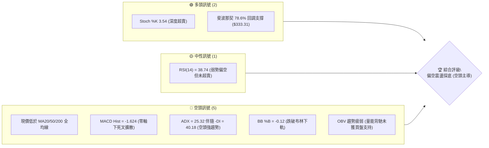
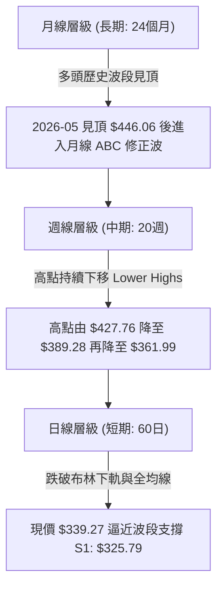
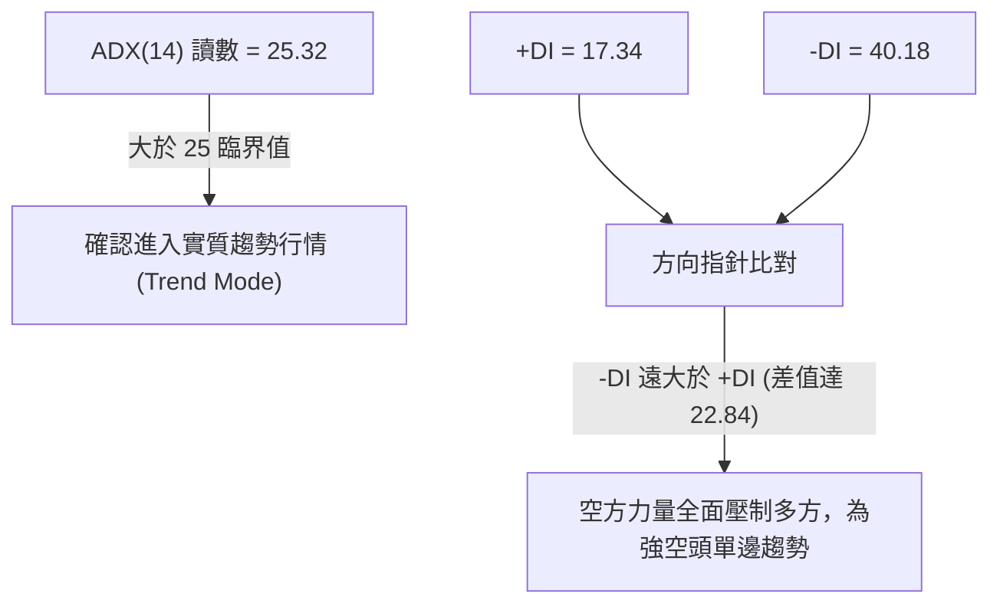
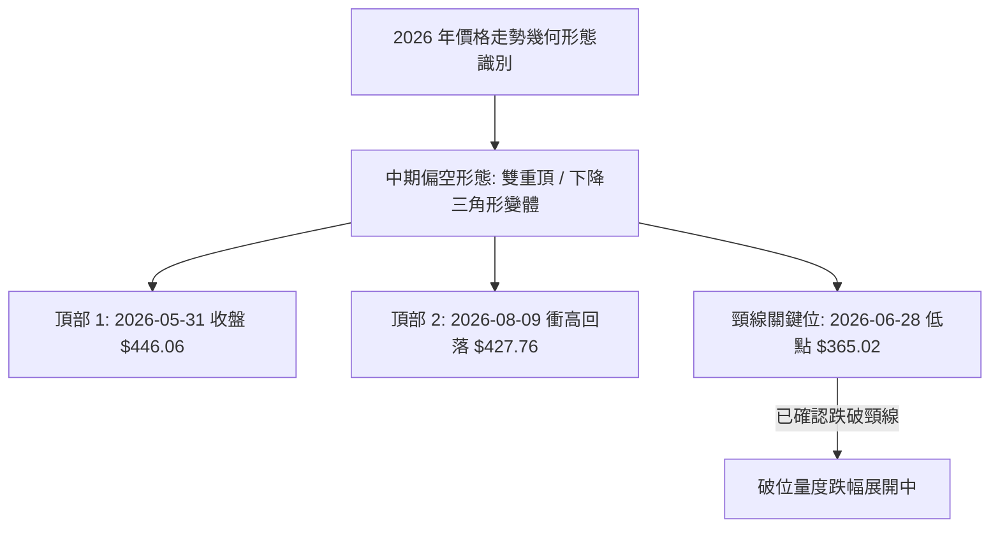
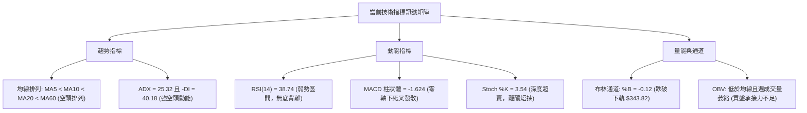
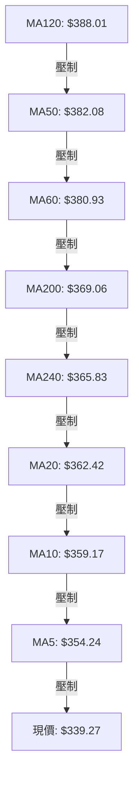
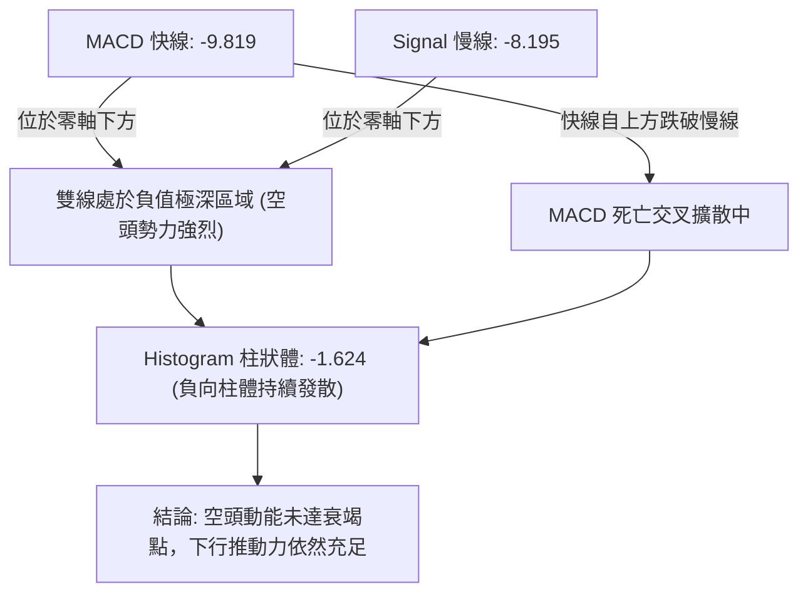
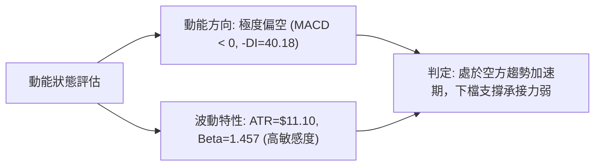
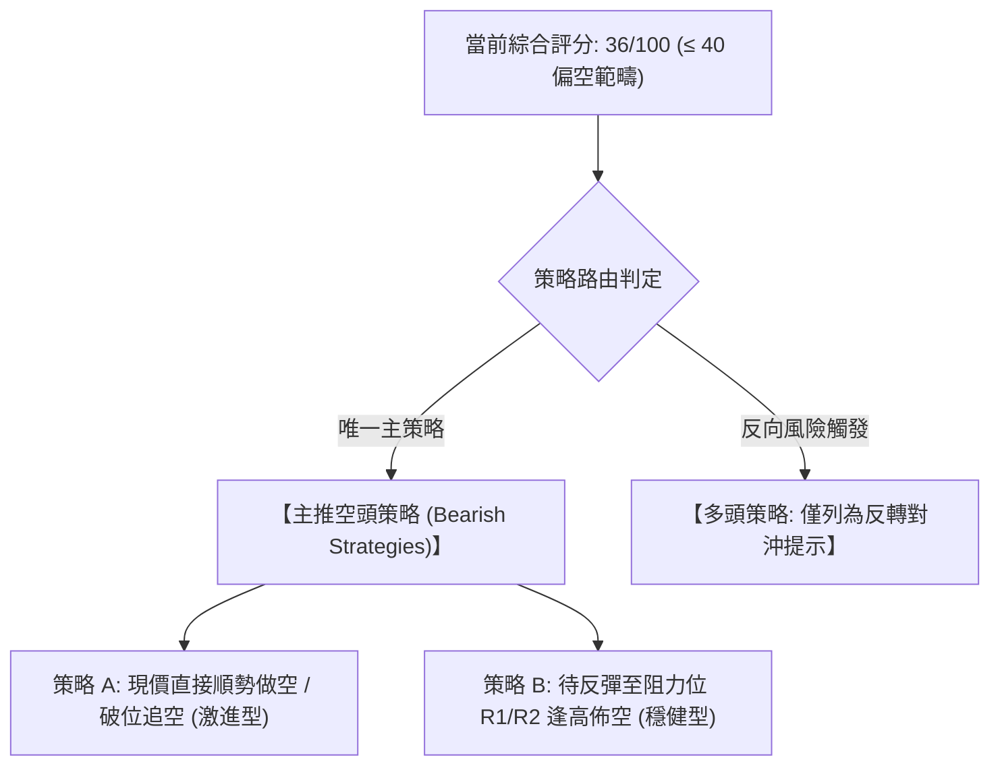
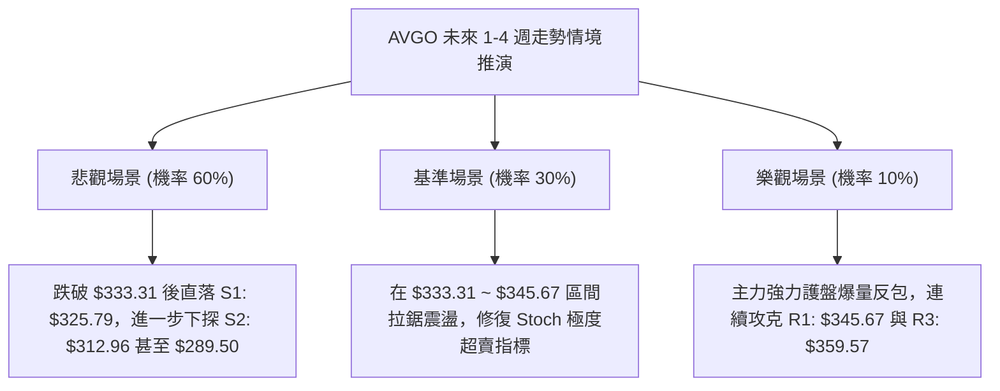

# AVGO 技術分析報告

> **報告日期**：2026-09-16 ｜ **語言**：繁體中文 ｜ **數據來源**：Yahoo Finance ｜ **當前價格**：$339.27

---

## 目錄

| 章節 | 內容 |
|------|------|
| [1. 技術面概覽](#1-技術面概覽) | 訊號儀表板、核心指標、評分卡 |
| [2. 趨勢分析](#2-趨勢分析) | 多時框趨勢、長中短期走勢 |
| [3. 圖表形態分析](#3-圖表形態分析) | 形態識別、K線組合、目標價 |
| [4. 支撐與阻力](#4-支撐與阻力) | 關鍵價位、斐波那契回調 |
| [5. 技術指標深度解讀](#5-技術指標深度解讀) | MA/RSI/MACD/布林/成交量 |
| [6. 動能與波動率](#6-動能與波動率) | 動能評估、ATR、Beta |
| [7. 多時框架總結](#7-多時框架總結) | 時框架評分矩陣 |
| [8. 交易策略建議](#8-交易策略建議) | 多空策略、風險報酬比 |
| [9. 風險提示與監控](#9-風險提示與監控) | 監控指標、風險場景 |
| [10. 報告總結](#10-報告總結) | 總結儀表板與最終建議 |

---

## 1. 技術面概覽

### 🎯 技術訊號儀表板



### 📊 核心指標速覽表

| 指標類別 | 指標名稱 | 當前數值 | 訊號 | 解讀 |
|----------|----------|----------|:----:|------|
| **價格** | 當前價格 | $339.27 | 🔴 | 位於 52 週高低區間之 24.3%，處於波段弱勢區 |
| **均線** | MA20 | $362.42 | 🔴 | 價格低於 MA20 達 -6.39%，短期均線下彎形成動態壓制 |
| **均線** | MA50 | $382.08 | 🔴 | 價格低於 MA50 達 -11.20%，中期趨勢轉空確立 |
| **均線** | MA200 | $369.06 | 🔴 | 價格跌破年線 $369.06，跌幅達 -8.07%，長期結構受損 |
| **動能** | RSI(14) | 38.74 | 🟡 | 位於 30–70 中性弱勢區間，未出現底背離，下行動能仍存 |
| **動能** | MACD | -9.819 / -8.195 | 🔴 | MACD 處於零軸下方且負柱體達 -1.624，空頭排列擴散 |
| **波動** | ATR(14) | $11.10 | 🟡 | 佔股價 3.27%，日均波幅中等，需給予適度止損緩衝空間 |

### 🏆 技術評分卡

```
╔════════════════════════════════════════════════════════════════╗
║                技術評分卡 — AVGO (2026-09-16)                  ║
╠════════════════════════════════════════════════════════════════╣
║ 趨勢強度 (ADX/DI)   ████████░░░░░░░░░░░░  38/100  🔴 空方強勢  ║
║ 動能指標 (MACD/RSI) ██████░░░░░░░░░░░░░░  30/100  🔴 動能疲弱  ║
║ 支撐穩定度 (S-Levels)██████████░░░░░░░░░░  50/100  🟡 臨近 S1    ║
║ 成交量配合 (OBV/Vol)████████░░░░░░░░░░░░  40/100  🔴 量能萎縮  ║
║ 形態完整度 (Patterns)████████░░░░░░░░░░░░  42/100  🔴 破位結構  ║
║ 均線排列 (MA System)████░░░░░░░░░░░░░░░░  20/100  🔴 全線失守  ║
╠════════════════════════════════════════════════════════════════╣
║ 綜合評分            ███████░░░░░░░░░░░░░  36/100  🔴 偏空弱勢  ║
╚════════════════════════════════════════════════════════════════╝
```

---

## 2. 趨勢分析

### 🌐 多時框趨勢分析



### 📈 長期趨勢 — 12個月走勢圖（Unicode）

```
AVGO 月線走勢圖（2025-10 至 2026-09）
價格軸 ($)
$446.06 ┤                                  ●(2026-05 波段頂)
$416.77 ┤                              ●
$400.71 ┤        ●
$367.57 ┤  ●                           │       ●
$344.83 ┤        │   ●                 │   ●   │   ●
$339.27 ┤────────┼───┼─────────────────┼───┼───┼───●←【現價: 339.27】
$309.02 ┤        │   │       ●(2026-03)│   │   │
        └────────┴───┴───────┴─────────┴───┴───┴───┴─────
         25-10 25-11 25-12 26-03     26-05 26-06 26-08 26-09
```

#### 走勢特徵分析表格

| 階段區間 | 起訖月份 | 起訖價格 ($) | 區間漲跌幅 | 走勢特徵與量價結構 |
|:---|:---:|:---:|:---:|:---|
| **強勁主升浪** | 2025-09 ~ 2025-11 | $328.07 → $400.71 | +22.14% | 單邊噴發行情，均線呈完美多頭排列 |
| **首輪深幅回踩** | 2025-11 ~ 2026-03 | $400.71 → $309.02 | -22.88% | 獲利了結賣壓湧現，回測年線附近支撐 |
| **二次衝頂突破** | 2026-03 ~ 2026-05 | $309.02 → $446.06 | +44.35% | 創下波段歷史收盤高點 $446.06，隨後量能不繼 |
| **高檔震盪盤跌** | 2026-05 ~ 2026-09 | $446.06 → $339.27 | -23.94% | 形成多重次高點回落，週線級別空頭擴散 |

### 📊 中期趨勢（週線分析）

```
週線近期架構示意圖：
[阻力 R3: $359.57] ─────── 2026-09-13 反彈高點聚類 ($361.99 附近)
       ▲
       │  (反彈阻力位 R2: $351.45 / R1: $345.67)
       ▼
[當前收盤: $339.27] ═══════ 跌破下軌，週成交量降至 57,399,700
       ▲
       │  (下行測試空間)
       ▼
[支撐 S1: $325.79] ─────── 近一年波段次低點聚類
[支撐 S2: $312.96] ─────── 2026-03 底部結構區域 ($309.02 附近)
```

中期週線在 2026-08-09 週反彈至 $427.76（週 RSI 達 73.6 超買）後，迅速出現三隻黑鴉摜破各週均線。2026-09-13 當週反彈至 $361.99 受阻於 MA20（$362.42），隨後本週長黑下挫至 $339.27，週 MACD 負柱體再度放大至 -1.624，確立中期由空頭主導。

### ⚡ 趨勢強度評估（ADX 解讀）



#### ADX 強度與市場狀態對照表

| 指標變數 | 當前數值 | 參考閾值 | 市場狀態評估 | 戰略意涵 |
|:---|:---:|:---:|:---|:---|
| **ADX(14)** | **25.32** | > 25.0 | 趨勢行情確立 | 嚴禁逆勢盲目估底，順應中長期空頭動能操作 |
| **+DI(14)** | **17.34** | < 20.0 | 多頭進攻力道極度衰竭 | 任何短線反彈皆屬弱勢反抽 |
| **-DI(14)** | **40.18** | > 30.0 | 空頭主導力量高度集中 | 空方掌控定價權，下行風險未解除 |

---

## 3. 圖表形態分析

### 🔍 形態識別系統



#### 形態判斷依據與信心度表格

| 形態名稱 | 信心度 | 判斷依據（引用真實數據） | 完成度 | 目標價（附嚴格計算式） |
|:---|:---:|:---|:---:|:---|
| **雙重頂 (M頂)** | **75%** | 高點 1（$446.06）、高點 2（$427.76），頸線為 2026-06-28 收盤價 **$365.02**。現價 $339.27 已收於頸線下方 | 85% | 形態高度 = $446.06 - $365.02 = **$81.04**<br>理論破位目標 = $365.02 - $81.04 = **$283.98**（對應 52W 低點 $289.50） |
| **布林帶向下破軌** | **85%** | 現價 $339.27 跌破布林下軌 $343.82，BB %B 為 **-0.12** | 100% | 動態尋找支撐，首要目標指向波段支撐 **S1: $325.79** |
| **三重底 (潛在)** | **30%** | 數據中未偵測到底部反轉訊號，ADX 處於空方單邊趨勢，不符合築底條件 | 10% | 訊號不足，僅做指標型解讀，嚴禁強行畫形態 |

### 🕯️ 重要K線形態分析

| 日期 / 週別 | 收盤價 ($) | 成交量 (股) | K線組合形態 | 解讀與隱含多空邏輯 | 訊號 |
|:---:|:---:|:---:|:---|:---|:---:|
| **2026-06-07** | $385.12 | 251,144,600 | 爆量長黑摜破線 | 創紀錄巨量跌破 $400 大關，主力資金出逃確立頭部 | 🔴 |
| **2026-08-09** | $427.76 | 92,365,500 | 量價背離長上影假突破 | 股價衝高回落，量能遠低於 6 月，形成右頂陷阱 | 🔴 |
| **2026-09-13** | $361.99 | 101,544,300 | 弱勢反彈十字星變體 | 反彈無力越過 MA20（$362.42），確立反抽阻力 | 🟡 |
| **2026-09-20** | $339.27 | 57,399,700 | 實體大黑棒跌破下軌 | 跌破布林下軌與整數關卡，空方單邊宣洩 | 🔴 |

### 📉 ASCII 走勢形態示意圖

```
AVGO 中期頂部形態跌破示意圖：
價格 ($)
$446.06 ┤        [頂部 1: 05-31]
$427.76 ┤               │               [頂部 2: 08-09]
$400.00 ┤───────────────┼───────────────────────┼─────────────
$365.02 ┤               └─── 頸線突破位 ────────┘ ($365.02)
        │                     (2026-06-28)
$345.67 ┤─────────────────────────────────────────────── [阻力 R1]
$339.27 ┤═══════════════════════════════════════════════ [現價: 破位下挫]
$325.79 ┤----------------------------------------------- [支撐 S1]
$289.50 ┤                                                [52W Low / 形態目標區間]
```

### 🎯 形態目標價計算

依據標準幾何測量規則：
1. **頸線定錨**：2026 年 6 月 28 日週收盤低點為 $365.02。
2. **形態高度 ($H$)**：波段峰值 $446.06 - 頸線 $365.02 = $81.04。
3. **等距測量目標 (Target 1)**：$365.02 - $81.04 = **$283.98**。該位置與 52 週最低價 **$289.50** 構成強力結構匯合緩衝區。
4. **短期路徑目標**：在達到最終形態目標前，價格必先依序測試合併波段支撐 **S1 ($325.79)** 與 **S2 ($312.96)**。

---

## 4. 支撐與阻力

### 🗺️ 關鍵價位分布圖（Unicode）

```
╔════════════════════════════════════════════════════════════════╗
║                   AVGO 關鍵價位架構分布圖                      ║
╠════════════════════════════════════════════════════════════════╣
║ $359.57 ║██████████████████████████████║ 強阻力 R3 (MA10/前反彈高)║
║ $351.45 ║████████████████████          ║ 阻力 R2 (MA5/短期反壓)  ║
║ $345.67 ║████████████████████████      ║ 關鍵阻力 R1 (布林帶下軌反壓)║
║ $339.27 ╠══════════════════════════════╣ ◄ 現價 (空頭單邊主導中)║
║ $333.31 ║▓▓▓▓▓▓▓▓▓▓▓▓▓▓▓▓▓▓▓▓▓▓        ║ 斐波那契 78.6% 回調位   ║
║ $325.79 ║████████████████████████      ║ 近期核心支撐 S1         ║
║ $312.96 ║████████████████████████████  ║ 強支撐 S2 (3月波段底部) ║
║ $306.73 ║██████████████████████████████║ 極限防守支撐 S3         ║
║ $289.50 ║██████████████████████████████║ 52週低點 / 100% 回調位  ║
╚════════════════════════════════════════════════════════════════╝
```

### 🚧 阻力位分析表

> **數據紀律說明**：價位嚴格引用系統波段高點聚類數值。

| 阻力級別 | 價位 ($) | 離現價幅度 | 形成原因與共振要素 | 突破難度 | 重要性 |
|:---:|:---:|:---:|:---|:---:|:---:|
| **R1** | **$345.67** | +1.89% | 近期跌破之布林下軌（$343.82）反轉為反壓位，波段高點聚類 | 🟡 中等 | 短線多頭重返通道第一道防線 |
| **R2** | **$351.45** | +3.59% | 逼近 MA5 動態均線（$354.24），日線空頭均線下壓密集區 | 🔴 偏高 | 空方防守陣地，觸及易引發技術賣壓 |
| **R3** | **$359.57** | +5.98% | MA10（$359.17）與 9月13日週反彈高點（$361.99）重疊區 | 🔴 極高 | 轉折關鍵節點，未站上中期空頭不改 |

### 🛡️ 支撐位分析表

> **數據紀律說明**：價位嚴格引用系統波段低點聚類數值。

| 支撐級別 | 價位 ($) | 離現價幅度 | 形成原因與共振要素 | 守住機率 | 重要性 |
|:---:|:---:|:---:|:---|:---:|:---:|
| **S1** | **$325.79** | -3.97% | 近一年波段次級低點密集區，斐波那契 78.6%（$333.31）下緣 | 🟡 55% | 日線短線多頭抵抗第一關 |
| **S2** | **$312.96** | -7.76% | 2026年3月波段底部收盤（$309.02）上方支撐聚類 | 🟢 70% | 中期生命線，跌破將引發踩踏 |
| **S3** | **$306.73** | -9.59% | 2026年首季強支撐區底端，跌破則直奔 52W 低點 $289.50 | 🟢 80% | 多方最後陣地，長線價值買盤切入點 |

### 📐 斐波那契回調位分析

依據 52 週區間高點 **$494.22** 至低點 **$289.50**（波動區間 $204.72）計算：

| 斐波那契比例 | 精確價位 ($) | 價位與現價（$339.27）相對狀態 | 技術結構與意涵 |
|:---:|:---:|:---:|:---|
| **0.0%** (52W High) | **$494.22** | 上方 +45.67% | 歷史極值壓力區，遠期多頭終極目標 |
| **23.6%** | **$445.90** | 上方 +31.43% | 2026-05 波段收盤高點 $446.06 之共振壓制區 |
| **38.2%** | **$416.02** | 上方 +22.62% | 2026-04 收盤價 $416.77 處，牛熊分界強阻力 |
| **50.0%** | **$391.86** | 上方 +15.50% | 多空中樞平衡位，MA120（$388.01）壓制帶 |
| **61.8%** (黃金分割) | **$367.70** | 上方 +8.38% | **關鍵防守失守**：現價已跌破此重要黃金分割位與 MA200（$369.06） |
| **78.6%** (深幅回調) | **$333.31** | 下方 -1.76% | **當前關鍵緩衝帶**：現價落於 61.8%（$367.70）與 78.6%（$333.31）之間 |
| **100.0%** (52W Low) | **$289.50** | 下方 -14.67% | 52 週基準底點，終極結構支撐 |

**技術意涵解讀**：
股價在失守 61.8%（$367.70）此關鍵多空防線後，技術結構已轉入「深幅回撤」範疇。當前價格 $339.27 距離 78.6% 回調位 **$333.31** 僅有 1.76% 之遙。若 $333.31 遭有效跌破，價格將失去斐波那契最後緩衝，直探波段支撐 **S1: $325.79** 甚至前波大底 **$289.50**。

---

## 5. 技術指標深度解讀

### 🎛️ 指標訊號總覽



### 📈 移動平均線排列分析



#### 均線量化數據表

| 均線名稱 | 當前價格 ($) | 與現價乖離率 | 走勢斜率 | 技術意涵與狀態評估 |
|:---|:---:|:---:|:---:|:---|
| **MA 5** | $354.24 | -4.23% | ▼ 向下 | 超短線極強動態反壓，未突破前無短線反彈可言 |
| **MA 10** | $359.17 | -5.54% | ▼ 向下 | 短線波段成本線，下行斜率陡峭 |
| **MA 20** | $362.42 | -6.39% | ▼ 向下 | 布林中軌所在，中期生命線轉為強力阻力區 |
| **MA 50** | $382.08 | -11.20% | ▼ 向下 | 中期多空分水嶺，宣告中期行情已轉入空頭週期 |
| **MA 60** | $380.93 | -10.94% | ▼ 向下 | 季線下壓，中期套牢盤沉重 |
| **MA 120** | $388.01 | -12.56% | ▼ 向下 | 半年線向下扣抵高位，壓力重重 |
| **MA 200** | $369.06 | -8.07% | ▼ 向下 | **跌破年線**：宣告進入技術性熊市結構 |
| **MA 240** | $365.83 | -7.26% | ▼ 向下 | 長期牛熊基準線失守，長期多頭結構嚴重破壞 |

### 📉 RSI(14) 分析

- **RSI(14) 讀數**：**38.74**
- **數值進度條**：
  ```
  0 ──[超賣 30]─────────[中性 50]─────────[超買 70]── 100
  ███████████████░░░░░░░░░░░░░░░░░░░░░░░░ 38.74
  ```
- **背離嚴格檢驗**：
  - **頂背離**：2026-08-09 週價格衝至 $427.76，週 RSI 飆至 73.6；隨後價格下墜，確認此前的頂部背離已完全釋放。
  - **底背離判斷**：對比 2026-08-30 週收盤價 $368.79（RSI 為 23.5）與當前 2026-09-20 收盤價 $339.27（RSI 為 38.74）。雖然現價破底且 RSI 數值高於前低，但**週 MACD 柱體同步收黑放大（-1.624）且日線 ADX 趨勢強度向上（25.32）**，目前僅屬指標鈍化修復，**尚未構成有效量價底背離結構**。下行動能未見衰竭，切勿孤立視為買進訊號。

### 📊 MACD(12/26/9) 訊號解讀



### 📦 布林通道分析

```
布林通道當前幾何狀態：
上軌 (Upper Band):     $381.03 ───┐
                                  │ 通道帶寬 (Bandwidth) = $37.21 (約 10.2%)
中軌 (MA20):           $362.42 ───┤ 處於通道向下擴張破位階段
                                  │
下軌 (Lower Band):     $343.82 ───┘
────────────────────────────────────────────────────────
現價 (Current Price):  $339.27 ◄─── 【跌破下軌以下 $4.55，%B = -0.12】
```
- **%B 指標分析**：當前 %B 為 **-0.12**（小於 0 軸），代表股價收盤實體跌出布林下軌之外。在 ADX > 25 的趨勢行情中，這屬於「沿著下軌單邊下瀉（Riding the lower band）」的強烈單邊空頭走勢，不可單純當作超賣訊號逆勢接刀。

### 💹 成交量分析（量價配合度）

```
成交量結構量化：
最新日成交量:   24,736,900 股
20日均量 (MA20):26,137,620 股  (量比: 0.95x ── 量縮破位)
50日均量 (MA50):22,153,792 股
週線成交量變動:  9月06日 173.2M ──► 9月13日 101.5M ──► 本週 57.4M (縮量探底)
```
- **量價與 OBV 解讀**：
  系統指標明確顯示 **OBV < MA → 量能疲弱**。股價在跌破年線與布林下軌過程中，並未出現主力機構爆量承接盤（如 2026-06-07 的 2.5 億股天量）。本週量能大幅降至 57,399,700 股，呈現「量縮陰跌」走勢，說明市場買盤惜買、多方主力尚未進場護盤，下檔賣壓仍需進一步釋放。

---

## 6. 動能與波動率

### ⚡ 動能評估

#### 動能與波動象限位置表

| 象限 | 動能強度 | 波動率水準 | 當前狀態評估 | 策略意涵 |
|:---:|:---:|:---:|:---:|:---|
| **Q1** | 強動能 (多頭) | 低波動 | ── | 穩步多頭主升段 (非目前狀態) |
| **Q2** | 弱動能 (多頭衰竭) | 低波動 | ── | 高檔盤整築頂 (已於 7-8 月完成) |
| **Q3** | 強動能 (單邊主導) | 高波動 | ── | 恐慌崩跌段 (尚未見到極端拋售天量) |
| **Q4** | **強空方動能** | **中/高波動 (ATR 3.27%)** | **✓ 當前狀態** | **弱勢單邊空頭：逢反彈佈空或空手觀望** |



### 📊 ATR 波動率分析

- **ATR(14) 讀數**：**$11.10**（佔股價比重 **3.27%**）。
- **單日理論波動極限**：以 $339.27 為核心，預期單日波動範圍為 **$328.17 ~ $350.37**。
- **風控止損距離量化建議**：
  - **超短線交易**：1.0 × ATR = **$11.10**。
  - **波段趨勢操作**：1.5 × ATR = **$16.65**。
  - **反彈做空防守**：2.0 × ATR = **$22.20**。

### 📐 Beta 與市場相關性

- **Beta 係數**：**1.457**
- **特徵解讀**：AVGO 屬於典型的高 Beta 半導體龍頭科技股，對標普 500 指數與費城半導體指數具有 1.457 倍的波動放大效應。當科技大盤進入流動性回撤時，該股跌幅將明顯放大；當前大盤避險情緒高漲時，高 Beta 特性導致下檔支撐更容易遭到摜破。

---

## 7. 多時框架總結

### 📋 時框架評分表

| 時框架 | 趨勢方向 | 動能指標 | 均線排列狀況 | 關鍵形態特徵 | 綜合評分 | 操作建議 |
|:---|:---:|:---:|:---|:---|:---:|:---|
| **月線 (長期)** | 🟡 中性偏弱 | MACD 柱體收窄 | 失守短期月均線，但在長期 MA 上方 | 歷史雙頂壓制回落，測試 78.6% 斐波回調 | 45/100 | 長期投資者減倉觀望 |
| **週線 (中期)** | 🔴 明顯看空 | MACD 死叉發散，RSI=38.7 | 全面跌破週 MA20/MA50 | 跌破 2026-06 頸線 $365.02，下行波延伸 | 32/100 | 波段空頭持有，嚴禁抄底 |
| **日線 (短期)** | 🔴 極度偏空 | %B=-0.12, -DI=40.18 | MA5-MA240 全面空頭發散 | 實體黑棒跌破布林下軌，尋找 S1 支撐 | 28/100 | 短線順勢做空或反彈放空 |

### 🔲 綜合訊號矩陣

```
時框與指標一致性矩陣表：
指標維度        短期 (日線)       中期 (週線)       長期 (月線)       全維度一致性
────────────────────────────────────────────────────────────────────────────
均線架構        🔴 全均線跌破     🔴 MA20/50 失守   🟡 測試長期MA     🔴 空方壓倒性主導
動能指標        🔴 MACD/ADX 極空  🔴 零軸下死叉     🟡 RSI 回落中性   🔴 空頭持續發散
通道/形態       🔴 跌破下軌 %B<0  🔴 頸線確認跌破   🟡 高檔回檔結構   🔴 強烈看跌訊號
量能結構        🔴 量縮無買盤     🔴 連續縮量陰跌   🟢 長期底倉未崩   🔴 短中期量價背離
────────────────────────────────────────────────────────────────────────────
綜合方向收斂：   🔴 強烈做空       🔴 強烈做空       🟡 防守觀望       🔴 【總體偏空】
```

### ⚖️ 多時框收斂結論

> **依嚴格規則 14 進行收斂仲裁**：
> 1. **趨勢/盤整仲裁**：當前 ADX(14) 讀數為 **25.32**（大於 25 臨界值），同時 -DI 高達 **40.18**，系統判定當前處於**實質空頭趨勢行情（Trend Mode）**，而非區間震盪盤整。
> 2. **主導時框優先級**：依規則，趨勢行情下必須以中長期（週線 / MA50 / MA200）方向為主導，日線僅用作尋找反彈阻力之進場放空時機。週線級別雙頂頸線（$365.02）已實質失守，MA200（$369.06）全面失手。
> 3. **唯一方向性結論**：**【全面偏空（Bearish Dominated）】**。
> 本結論與第 1 章技術評分卡（36/100）及第 8 章之**主推做空策略**完全收斂一致。

---

## 8. 交易策略建議

### 🗺️ 策略決策流程圖



### 🧭 策略路由

**當前主策略方向 = 【全面做空／逢高佈空】（依綜合評分 36/100 評定）**

### 🎯 價格情境階梯（Price Scenarios）

> **數據紀律說明**：價位嚴格引用第 4 章關鍵阻力與支撐數據。

| 觸發條件 | 下一目標價 | 後續延伸價位 | 情境含義與技術演繹 |
|:---|:---:|:---:|:---|
| **向上反彈突破 R1 $345.67** | R2 **$351.45** | R3 **$359.57** | 跌深技術性抽腳，反彈測試 MA5 與布林下軌反壓 |
| **跌破 78.6% 回調位 $333.31** | S1 **$325.79** | S2 **$312.96** | 空頭波段加速下行，回測近一年低點支撐聚類 |
| **摜破 S2 $312.96 生命線** | S3 **$306.73** | 52W 低 **$289.50** | 形態等距對稱破位，尋求 52 週終極底部 |

### 📊 情境機率分佈

| 演繹情境 | 發生機率 | 主要技術依據 |
|:---|:---:|:---|
| **延續弱勢探底 (破位下行)** | **60%** | ADX=25.32 伴隨 -DI=40.18，空頭單邊主導，MACD 負向發散未止 |
| **跌深弱勢反抽 (區間震盪)** | **30%** | Stoch %K 進入 3.54 極度超賣區，短線隨時可能引發 1-2 日技術修復 |
| **強勢 V 型反轉 (轉強上攻)** | **10%** | 均線呈空頭排列，OBV 持續低迷，量能未現爆發性機構回補 |

### 🔴 主策略詳情（空頭專屬策略）

```
╔════════════════════════════════════════════════════════════════╗
║                AVGO 專業交易策略執行表 (空方主導)              ║
╠════════════════════════════════════════════════════════════════╣
║ 策略要素       ║ 策略 A (激進型: 破位空)   ║ 策略 B (穩健型: 逢高空)    ║
╠════════════════╬═══════════════════════════╬════════════════════════════╣
║ 進場條件       ║ 現價小幅反彈不過 R1 進場  ║ 觸及 R1/R2 阻力帶遇阻放空  ║
║ 精確進場點     ║ $339.27 (現價直接進場)    ║ $345.67 (掛單待反彈承接)   ║
║ 止損價格       ║ $351.45 (阻力位 R2 突破)  ║ $359.57 (阻力位 R3 突破)   ║
║ 止損距離 ($/%) ║ $12.18 (+3.59%)           ║ $13.90 (+4.02%)            ║
║ 第一目標價 T1  ║ $325.79 (支撐位 S1)       ║ $325.79 (支撐位 S1)        ║
║ 第二目標價 T2  ║ $312.96 (支撐位 S2)       ║ $312.96 (支撐位 S2)        ║
║ 預期利潤 T1    ║ $13.48 (+3.97%)           ║ $19.88 (+5.75%)            ║
║ 預期利潤 T2    ║ $26.31 (+7.75%)           ║ $32.71 (+9.46%)            ║
║ 風險報酬比(T2) ║ 2.16 : 1                  ║ 2.35 : 1                   ║
║ 預期勝率       ║ 65%                       ║ 72%                        ║
║ 建議倉位上限   ║ 15% (動態止盈)            ║ 20% (標準分批佈局)         ║
╚════════════════════════════════════════════════════════════════╝
```

### 🟢 反向風險觸發點（多頭對沖提示）

- **全面平空/反手信號點**：若日線收盤價強勢收復 **$359.57（阻力位 R3）**，代表股價不僅站上 MA10（$359.17），更封閉本週跳空缺口。此時應全數止損空單離場。
- **左側超短線多頭對沖買點**：僅當價格精確測試 **$325.79（支撐位 S1）** 且日線形成長下影錘頭線時，方可動用不超過 5% 倉位博弈超賣反抽，嚴格止損設於 **$320.00**，短線目標看至 **$345.67**。

### ⭐ 整體訊號強度評星

```
做多訊號強度：★☆☆☆☆  (1/5星 — 均線全面壓制，動能匱乏)
做空訊號強度：★★★★☆  (4/5星 — ADX趨勢強烈，空方全面控盤)
整體可信度：  ★★★★☆  (4/5星 — 多時框訊號收斂共振)
```

---

## 9. 風險提示與監控

### ✅ 關鍵監控指標 Checklist

```
╔════════════════════════════════════════════════════════════════╗
║                   AVGO 盤面實時風控 Checklist                  ║
╠════════════════════════════════════════════════════════════════╣
║ [ ] 監控項 1: 斐波那契 78.6% ($333.31) 是否被有效跌破 (失守加速)║
║ [ ] 監控項 2: 日線收盤是否重返布林帶下軌 ($343.82) 之內 (反抽警訊)║
║ [ ] 監控項 3: ADX(14) 是否持續高於 25 且 -DI 是否維持在 35 之上║
║ [ ] 監控項 4: Stoch %K 是否自超賣區 (3.54) 出現金叉反彈突破 20   ║
║ [ ] 監控項 5: 日成交量是否暴增至 5000 萬股以上 (主力進場護盤點)║
║ [ ] 監控項 6: 阻力位 R1: $345.67 的觸碰壓制反應                ║
╚════════════════════════════════════════════════════════════════╝
```

### ⚠️ 風險場景分析



### 🛡️ 風險管理重要提醒

1. **Beta 敏感性風控**：Broadcom 的 Beta 高達 **1.457**。若美股大盤（QQQ / SMH）出現系統性回調，AVGO 跌勢將加劇，禁止在下跌中途無底限加碼攤平。
2. **波動率止損紀律**：目前 ATR 高達 **$11.10**，意味著日內常態雜訊可達 3% 以上。設置止損必須拉開至 ATR 1.0~1.5 倍（至少 $11 以上），避免被假突破洗盤出場。
3. **重大基本面分歧**：儘管分析師共識目標價高達 **$531.85**（強烈買進），但技術面呈現扎實的雄性空頭特徵。**在技術面未出現明確築底形態前，切勿單憑券商目標價進行左側猜底**，市場永遠以當前資金流向（價格）為最終依據。

---

## 10. 報告總結

```
╔════════════════════════════════════════════════════════════════╗
║                     AVGO 技術分析報告總結                      ║
╠════════════════════════════════════════════════════════════════╣
║ 報告日期：2026-09-16                                          ║
║ 當前價格：$339.27                                             ║
║ 分析評級：🔴 強烈看空 / 逢高做空 (綜合評分: 36/100)          ║
╠════════════════════════════════════════════════════════════════╣
║ 關鍵結論架構：                                                 ║
║ ├─ 長期趨勢：🟡 中性轉弱，歷史雙頂成形，自 $446.06 回跌 23.9%  ║
║ ├─ 中期趨勢：🔴 跌破週線頸線 $365.02 與年線，確認中期走熊     ║
║ ├─ 短期趨勢：🔴 實體大黑棒跌破布林下軌，ADX 空方強勢確立      ║
║ ├─ 關鍵支撐：S1: $325.79  ｜  S2: $312.96  ｜  S3: $306.73   ║
║ ├─ 關鍵阻力：R1: $345.67  ｜  R2: $351.45  ｜  R3: $359.57   ║
║ └─ 形態量度目標：雙頂理論終極目標 $283.98 (共振 52W 底 $289.50)║
╠════════════════════════════════════════════════════════════════╣
║ 最優策略組合：                                                 ║
║ 1. 🥇 最佳機會：策略 B ── 待反彈至 R1 ($345.67) 逢高放空，     ║
║                 目標指向 S1 ($325.79) / S2 ($312.96)          ║
║ 2. 🥈 次選機會：策略 A ── 現價 $339.27 建立輕倉空單，以 R2     ║
║                 ($351.45) 為嚴格硬止損，博弈順勢破位下瀉     ║
║ 3. 🥉 保守選擇：完全空手觀望，靜待股價跌至 S2 ($312.96) 以下， ║
║                 出現日線等級底背離後再評估進場               ║
╚════════════════════════════════════════════════════════════════╝
```

---

> ⚠️ **免責聲明**：本報告為技術分析專用報告，所有數據及推演均基於市場客觀歷史交易量價資訊（OHLCV）。本報告**僅供研究與學術參考**，**不構成任何投資買賣建議**。金融市場具有高度風險，交易者需自行承擔本金盈虧風險。

---

*報告生成時間：2026-09-16 ｜ 數據來源：Yahoo Finance ｜ 分析框架：資深多時框技術分析架構*