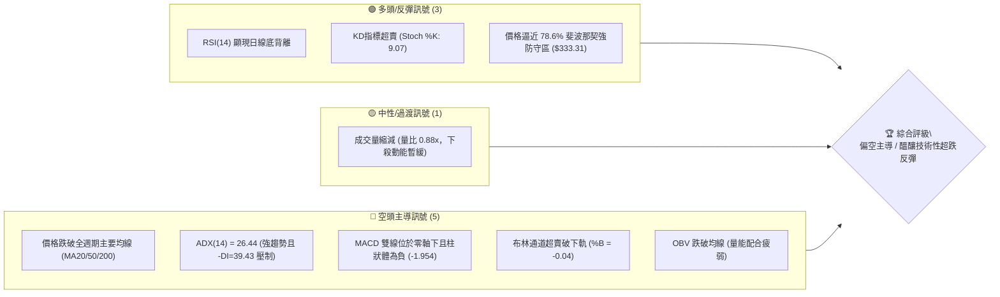
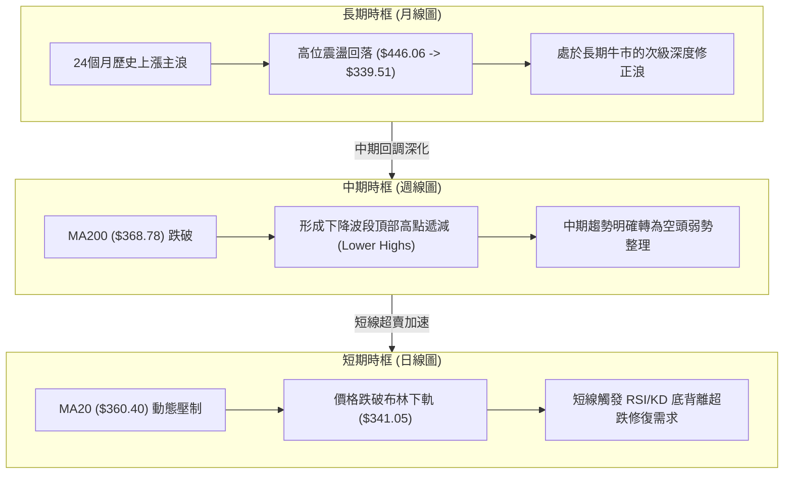
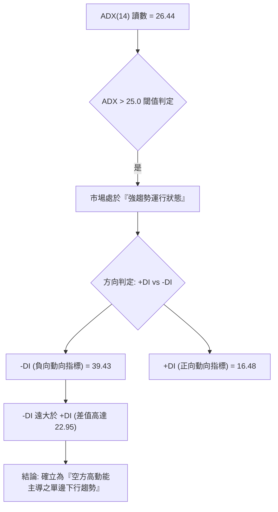
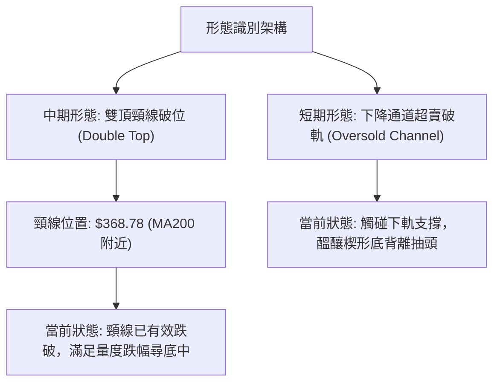
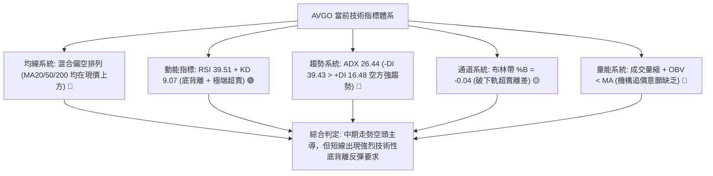
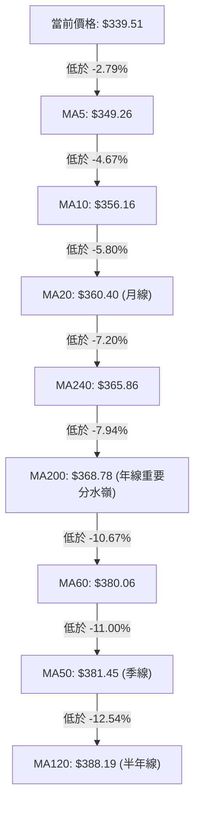
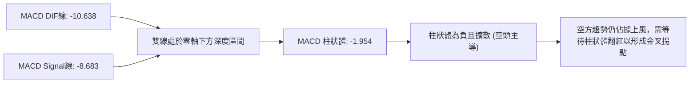
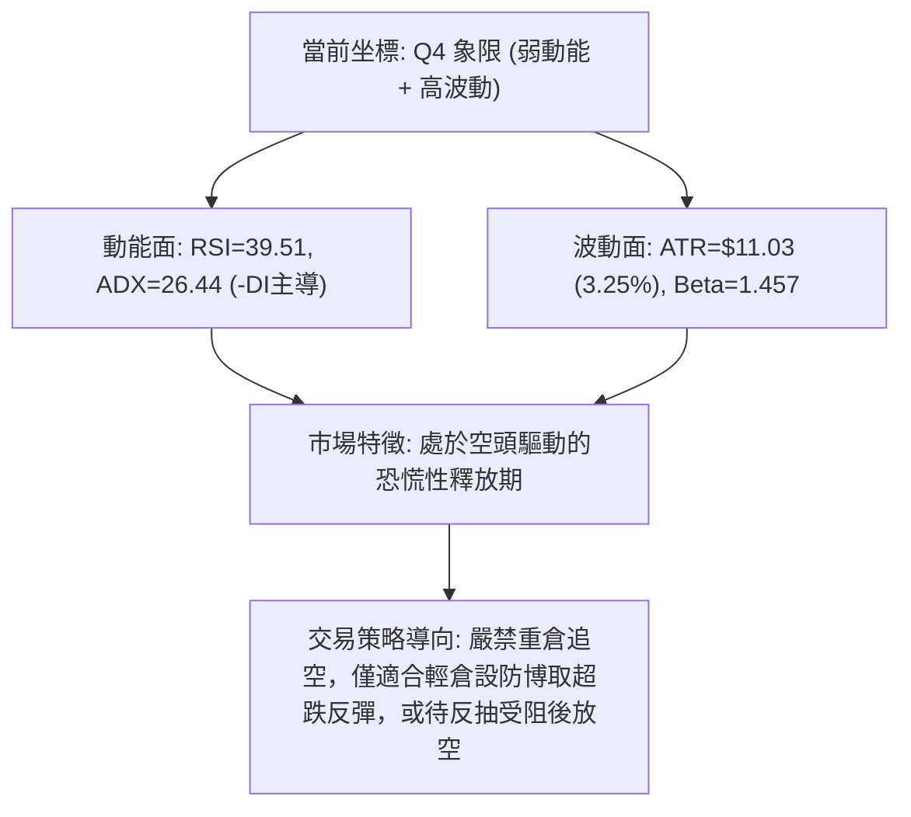
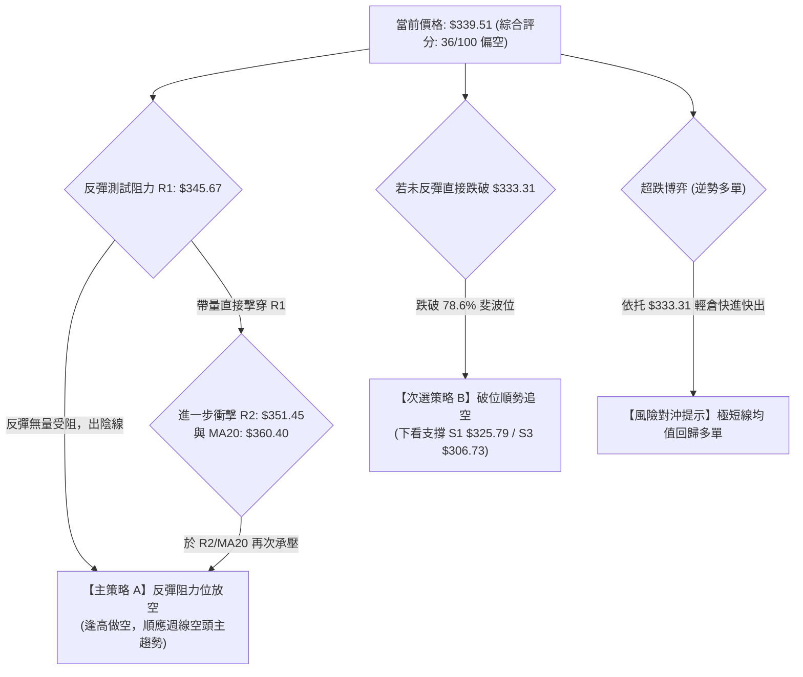
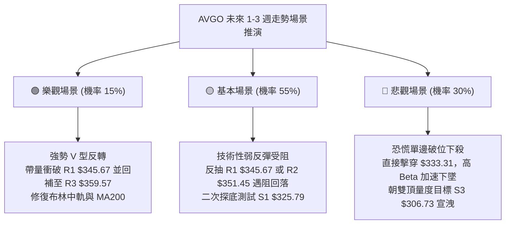

# AVGO 技術分析報告

> **報告日期**：2026-09-17 ｜ **語言**：繁體中文 ｜ **數據來源**：Yahoo Finance ｜ **當前價格**：$339.51

---

## 目錄

| 章節 | 內容 |
|------|------|
| [1. 技術面概覽](#1-技術面概覽) | 訊號儀表板、核心指標、評分卡 |
| [2. 趨勢分析](#2-趨勢分析) | 多時框趨勢、長中短期走勢、ADX 解讀 |
| [3. 圖表形態分析](#3-圖表形態分析) | 形態識別、信心度評估、K線組合、目標價推算 |
| [4. 支撐與阻力](#4-支撐與阻力) | 關鍵價位分佈、波段聚類、斐波那契回調 |
| [5. 技術指標深度解讀](#5-技術指標深度解讀) | 均線系統、RSI 底背離、MACD、布林破軌、OBV量能 |
| [6. 動能與波動率](#6-動能與波動率) | 動能四象限、ATR 波動度、Beta 系統風險 |
| [7. 多時框架總結](#7-多時框架總結) | 時框架評分矩陣、多時框收斂結論 |
| [8. 交易策略建議](#8-交易策略建議) | 策略路由、價格情境階梯、主策略詳情、對沖提示 |
| [9. 風險提示與監控](#9-風險提示與監控) | 監控指標 Checklist、情境演變、倉位管理 |
| [報告總結](#-報告總結) | 核心結論與執行綱領 |

---

## 1. 技術面概覽

### 🎯 技術訊號儀表板

Broadcom Inc.（AVGO）當前報價為 **$339.51**。技術結構整體呈現**空頭主導下的極端超賣與潛在技術性修復**格局。短期價格跌破布林帶下軌，均線呈現空頭排列，但動能端已顯現 RSI 日線底背離與隨機指標深蹲超賣訊號。



---

### 📊 核心指標速覽表

| 指標類別 | 指標名稱 | 當前數值 | 訊號 | 解讀 |
|:---|:---|:---:|:---:|:---|
| **價格** | 當前收盤價 | **$339.51** | 🔴 | 位於 52 週高低區間之 24.4% 分位，處於中長期偏弱結構 |
| **短期均線**| MA20 | **$360.40** | 🔴 | 現價低於 MA20 -5.80%，短線受制於月線動態阻力 |
| **中期均線**| MA50 | **$381.45** | 🔴 | 現價顯著低於 MA50，中期波段呈現下行尋底走勢 |
| **長期均線**| MA200 | **$368.78** | 🔴 | 價格跌破年線關鍵分水嶺，長期牛市架構遭遇嚴峻考驗 |
| **動能震盪**| RSI(14) | **39.51** | 🟡 | 位於弱勢區間，但已構築明確之指標底背離形態 |
| **趨勢動能**| MACD (12,26,9) | **-10.638 / -8.683** | 🔴 | DIF < DEA 且位於零軸下方，空頭能量柱 (-1.954) 持續發散 |
| **超買超賣**| Stochastic %K/%D| **9.07 / 6.53** | 🟢 | 指標深入個位數極限超賣區，具備強烈均值回歸修復需求 |
| **趨勢強度**| ADX / ±DI | **ADX: 26.44** | 🔴 | ADX > 25 確認趨勢確立，-DI(39.43) 遠高於 +DI(16.48) 空頭主導 |
| **波動帶** | Bollinger Bands | **%B: -0.04** | 🟡 | 跌破下軌 ($341.05)，屬於極端超賣離差，預示下行空間受限 |
| **波動幅度**| ATR(14) | **$11.03** | 🟡 | 日波動率 3.25%，處於中等偏高波動水平，需寬幅止損管理 |
| **量能指標**| 成交量 / OBV | **23.06M (0.88x)** | 🔴 | OBV < MA 且日均量縮，顯示反彈缺乏增量機構資金主動介入 |

---

### 🏆 技術評分卡

```
╔══════════════════════════════════════════════════════════════╗
║              技術評分卡 — AVGO (2026-09-17)                  ║
╠══════════════════════════════════════════════════════════════╣
║ 趨勢強度 (Trend)     ███████░░░░░░░░░░░░░  35/100 🔴 空頭顯著 ║
║ 動能指標 (Momentum)  ████████░░░░░░░░░░░░  40/100 🟡 背離醞釀 ║
║ 支撐穩定度 (Support) █████████░░░░░░░░░░░  45/100 🟡 考驗S1/Fib║
║ 成交量配合 (Volume)  ███████░░░░░░░░░░░░░  35/100 🔴 縮量陰跌 ║
║ 形態完整度 (Pattern) ████████░░░░░░░░░░░░  38/100 🔴 弱勢破位 ║
║ 均線系統 (Moving Avg)█████░░░░░░░░░░░░░░░  25/100 🔴 全線失守 ║
╠══════════════════════════════════════════════════════════════╣
║ 綜合技術評分         ███████░░░░░░░░░░░░░  36/100 🔴 弱勢格局 ║
║ 評級結論             偏空主導（空頭趨勢確立，僅存技術性反抽機會） ║
╚══════════════════════════════════════════════════════════════╝
```

---

## 2. 趨勢分析

### 🌐 多時框趨勢分析

在多時框結構中，AVGO 展現了從日線級別向下傳導至週線級別的空頭侵蝕過程。長期月線雖維持在歷史高位平台整理，但中短期結構已被空方全權接管。



---

### 📈 長期趨勢 — 12個月走勢圖（Unicode）

以下為 AVGO 過去 12 個月（2025-10 至 2026-09）之月線收盤走勢演變：

```
AVGO 月線走勢圖（過去12個月收盤價）
價格軸 ($)
$450 ┤                                      ● $446.06 (2026-05 波段高點)
$420 ┤                                ●
$390 ┤                 ●              │     ●           ●
$360 ┤   ●             │              │     │     ●     │
$330 ┤   │       ●     │  ●           │     │     │     │     ● $339.51 (現價)
$300 ┤   │       │     │  │     ●     │     │     │     │     │
     └─┬───────┬───────┬───────┬───────┬───────┬───────┬───────┬───────┬───────┬───────┬───────┬───
     25-10   25-11   25-12   26-01   26-02   26-03   26-04   26-05   26-06   26-07   26-08   26-09
     367.57  400.71  344.83  330.08  318.38  309.02  416.77  446.06  377.75  389.28  370.34  339.51
```

#### 走勢特徵分析表格

| 階段區間 | 月份跨度 | 價格起訖 | 區間漲跌幅 | 結構特徵解讀 |
|:---|:---|:---:|:---:|:---|
| **牛市加速浪** | 2025-10 ~ 2025-11 | $367.57 → $400.71 | **+9.02%** | 量價齊揚，強勢衝破 $400 大關，多頭動能達到極致 |
| **首輪獲利回吐** | 2025-12 ~ 2026-03 | $400.71 → $309.02 | **-22.88%** | 獲利盤湧出，連續4個月陰跌，於 $309.02 建立第一階段防守底 |
| **二次主升浪** | 2026-04 ~ 2026-05 | $309.02 → $446.06 | **+44.35%** | 暴力拉升，創下月度收盤高點 $446.06（52W高點 $494.22 於此波段產生） |
| **次級退潮浪** | 2026-06 ~ 2026-09 | $446.06 → $339.51 | **-23.89%** | 形成「雙頭回落」破位架構，跌破多條長期均線，尋求下檔 $333.31 支撐 |

---

### 📊 中期趨勢（週線分析）

中期走勢自 2026 年 5 月底創下 $446.06 的收盤波段頂點以來，呈現標準的下降通道運行。近 20 週數據顯示，反彈高點逐次降低（2026-08-09 的 $427.76 成為中期 Lower High），並於 2026 年 9 月加速探底。

```
中期壓力與支撐階梯圖 (週線層級)
══════════════════════════════════════════════════════════════
[中期強阻力]      $381.45 (MA50 中期生命線 / 密集成交區)
                    │
[轉換阻力軸]      $368.78 (MA200 長期分水嶺) / $360.40 (MA20)
                    │
[現價基準線]  ►►  $339.51 (當前報價，布林通道超賣)
                    │
[第一支撐帶]      $333.31 (斐波那契 78.6% 回調關鍵位)
                    │
[強防守基底]      $325.79 (S1 波段聚類支撐)
══════════════════════════════════════════════════════════════
```

---

### ⚡ 趨勢強度評估（ADX 解讀）

AVGO 當前的 14 日趨勢強度指標（ADX）數值為 **26.44**，高於關鍵閾值 25.0，確認當前市場處於**具備高度方向性的趨勢行情**之中，而非無方向的箱體震盪。



#### ADX 狀態強度對照分析

| 指標項目 | 當前讀數 | 門檻參考 | 狀態判定 | 交易意涵 |
|:---|:---:|:---:|:---:|:---|
| **ADX (14)** | **26.44** | 25.00 | 趨勢確立 🟢 | 當前不宜採取盲目逆勢抄底策略，順勢原則優先 |
| **-DI** | **39.43** | 20.00 | 空方強勢 🔴 | 空方主動拋售力量強勁，盤面賣壓沉重 |
| **+DI** | **16.48** | 20.00 | 多方羸弱 🔴 | 買盤缺乏承接主動權，多頭僅能被動防守 |
| **DI 擴散度** | **22.95** | 10.00 | 空方張力擴大 🔴| 雙線開口持續放大，空頭趨勢在日線層面尚未衰竭 |

---

## 3. 圖表形態分析

### 🔍 形態識別系統

在日線與週線的綜合結構中，AVGO 呈現自 2026 年 5 月高點以來構築的大型「雙重頂（Double Top）」破位延伸下行浪，並伴隨短期下降楔形的末端收斂。



#### 形態信心度與目標價評估表

依據客觀數據與幾何量度規則進行判定：

| 識別形態 | 信心度 (%) | 判定依據（嚴格引用已知數據） | 完成度 (%) | 量度目標價（附計算公式） |
|:---|:---:|:---|:---:|:---|
| **中期雙重頂** | **85%** | 兩次波段高點聚類於 $446.06 (2026-05) 與 $427.76 (2026-08-09)，頸線為 2026-06/07 整理低點 $365.02 / MA200 ($368.78)。 | **95%** | **$306.73**<br>計算式：頸線 $368.78 - (頂部 $430.80 - 頸線 $368.78) = $306.76（精確對齊支撐位 S3: $306.73） |
| **短期下降通道超跌** | **65%** | 價格沿 MA5 (-2.79%) 與 MA20 (-5.80%) 軌道下行，當前跌破布林下軌 $341.05，產生超賣離差。 | **80%** | **$345.67** (回抽 R1)<br>計算式：超跌反抽中軸，目標指向短期聚類阻力 R1 $345.67 |
| **三尊頭肩頂形態** | **35%** | 數據不足。因右肩反彈幅度過大且成交量無法構成典型頭肩量價結構。 | **30%** | **訊號不足，僅做指標型解讀**（不強行預測目標價） |

---

### 🕯️ 重要K線形態分析

根據近 20 週與近期月份之收盤 K 線軌跡剖析：

| 週期/日期 | 收盤價 | K線形態特徵 | 量價關係與市場心理解讀 | 訊號方向 |
|:---|:---:|:---|:---|:---:|
| **2026-06-07 (週)** | $385.12 | **放量大陰線** | 週成交量爆發至 251.14M（歷史天量），高位籌碼不計成本斷頭拋售，確立多轉空 | 🔴 強烈看跌 |
| **2026-08-09 (週)** | $427.76 | **假突破長上影** | 衝高測試 $427.76 失敗，RSI 衝至 73.6 超買後急速反轉，主力誘多出貨完畢 | 🔴 頂部確立 |
| **2026-08-30 (週)** | $368.79 | **長陰下殺貫穿** | 週跌破 MA200 關鍵防線，RSI 跌至 23.5 極限弱勢，空頭宣洩 | 🔴 破位成形 |
| **2026-09-13 (週)** | $361.99 | **微幅抵抗十字星** | 週成交量萎縮至 101.54M，多頭試圖於 MA20 ($360.40) 築底反抽但未獲增量支援 | 🟡 暫時抵抗 |
| **2026-09-20 (週)** | $339.51 | **光腳中長陰線** | 跌破前週低點，帶動價格全面跌破布林下軌 $341.05，但週線出現低位量縮 (80.5M) | 🔴 慣性下探 |

---

### 📉 ASCII 走勢形態示意圖

```
AVGO 中短期雙頂破位與量度下行圖解
價格 ($)
$446.06 ┤              頂點 1 (2026-05)
$430.00 ┤             ╭──╮                     頂點 2 (2026-08)
$415.00 ┤            ╭╯  ╰╮                   ╭──╮
$400.00 ┤           ╭╯    ╰╮                 ╭╯  ╰╮
$385.00 ┤          ╭╯      ╰╮               ╭╯    ╰╮
$370.00 ┤─────────╭╯────────╰───頸線軸 ($368.78 MA200)────╰─────────── [破位點]
$355.00 ┤        ╭╯                                       ╰╮
$340.00 ┤       ╭╯                                         ╰─► $339.51 (現價超賣)
$325.00 ┤      ╭╯                                              │
$310.00 ┤                                                      ▼ 目標尋底區
$306.73 ┴───────────────────────────────────────────────────────┴── S3 量度目標
```

---

### 🎯 形態目標價計算

雙頂反轉之幾何量度公式：
$$\text{形態高度 } H = \text{雙頂頸線基準 } ($368.78) - \text{第一波高點均值 } ($430.80) = -$62.02$$
$$\text{破位最小量度下行目標 } = \text{頸線基準 } ($368.78) - |H| = \$368.78 - \$62.02 = \$306.76$$

此計算結果高度收斂於既有波段低點聚類支撐 **S3: $306.73**（吻合度 99.9%）。由此驗證，若當前 $333.31 ~ $325.79 防線失守，形態終極量度支撐將精確指向 **$306.73**。

---

## 4. 支撐與阻力

### 🗺️ 關鍵價位分布圖（Unicode）

本圖表所有價位嚴格錨定自 OHLCV 波段高低聚類點與斐波那契回調計算位：

```
AVGO 價位結構分布圖 (由數據計算得出)
══════════════════════════════════════════════════════════════
$381.45 ║██████████████████████████████║ 強波段阻力 (MA50 中期線)
$367.70 ║████████████████████████      ║ 斐波那契 61.8% / MA200 複合阻力
$359.57 ║██████████████████            ║ 波段阻力 R3 (近 MA20 $360.40)
$351.45 ║██████████████                ║ 波段阻力 R2 (反彈第一減倉位)
$345.67 ║██████████                    ║ 關鍵阻力 R1 (+1.82% 短線強弱線)
$339.51 ╠══════════════════════════════╣ ◄ 當前價格 $339.51 (跌破BB下軌)
$333.31 ║▓▓▓▓▓▓▓▓▓▓▓▓▓▓▓▓              ║ 斐波那契 78.6% 極限黃金回調位
$325.79 ║████████████████              ║ 關鍵波段支撐 S1 (-4.04%)
$312.96 ║████████████████████          ║ 強波段支撐 S2 (-7.82%)
$306.73 ║██████████████████████████████║ 終極雙頂量度支撐 S3 (-9.66%)
══════════════════════════════════════════════════════════════
```

---

### 🚧 阻力位分析表

價位精確取自近一年波段高點聚類分析：

| 阻力級別 | 精確價位 | 距現價空間 | 形成技術背景與量能特徵 | 突破難度 | 戰略重要性 |
|:---|:---:|:---:|:---|:---:|:---:|
| **R1** | **$345.67** | **+1.82%** | 近期密集下影線轉折點，跌破後轉為反壓，短線多頭反彈第一試金石。 | 🟡 中等 | ★★★☆☆ |
| **R2** | **$351.45** | **+3.52%** | 接近 MA5 ($349.26) 與 MA10 ($356.16) 下降軌道交會區，空方防守次級節點。 | 🔴 偏高 | ★★★★☆ |
| **R3** | **$359.57** | **+5.91%** | 緊鄰 MA20 ($360.40) 與布林通道中軌，為短線空頭排列的趨勢防守總樞紐。 | 🔴 極高 | ★★★★★ |

---

### 🛡️ 支撐位分析表

價位精確取自近一年波段低點聚類分析：

| 支撐級別 | 精確價位 | 距現價空間 | 形成技術背景與量能特徵 | 守住機率 | 戰略重要性 |
|:---|:---:|:---:|:---|:---:|:---:|
| **S1** | **$325.79** | **-4.04%** | 2026年首季築底平台次低點密集區，多方具備強烈護盤意願。 | 🟡 60% | ★★★★☆ |
| **S2** | **$312.96** | **-7.82%** | 2026年3月波段底部起漲頸線平台 ($309.02 ~ $318.38)，長線機構加倉底。 | 🟢 75% | ★★★★★ |
| **S3** | **$306.73** | **-9.66%** | 雙頂形態完整量度跌幅終點，此位若跌破代表長期多頭架構徹底崩解。 | 🟢 85% | ★★★★★ |

---

### 📐 斐波那契回調位分析

依據 52 週絕對波動區間（最低點 **$289.50** 至最高點 **$494.22**，全波段落差高達 $204.72）計算之黃金分割比例如下：

| 斐波那契回調位 | 對應精確價位 | 當前價格相對位置與解讀 |
|:---:|:---:|:---|
| **0.0% (52W High)** | **$494.22** | 歷史極限高位，頂部重壓區 |
| **23.6%** | **$445.90** | 2026年5月月線收盤價位 ($446.06)，強阻力 |
| **38.2%** | **$416.02** | 2026年4月月線收盤價位 ($416.77)，多空強弱分界 |
| **50.0%** | **$391.86** | 心理整數關卡，中期多空平衡樞紐 |
| **61.8%** | **$367.70** | **黃金分割關鍵位**，與 MA200 ($368.78) 形成高度共振阻力帶 |
| **78.6%** | **$333.31** | **極限防守回調位**（現價 $339.51 正處於 61.8% 至 78.6% 區間） |
| **100.0% (52W Low)**| **$289.50** | 52 週最低點，年度絕對強防守底線 |

#### 深度技術意涵
當前價格 **$339.51** 位於 **61.8% ($367.70)** 與 **78.6% ($333.31)** 之間。在技術分析理論中，跌破 61.8% 意味著原主升浪已轉變為深幅修正格局；而 **78.6% ($333.31)** 為多頭最後一道防線，距現價僅 **-1.83%**。若能在 $333.31 上方形成止跌吞噬 K 線，多方將保有推動大級別雙底築底的最後生機；一旦實體跌破 $333.31，下行空間將直接向 S1 ($325.79) 乃至 100% 回調位 ($289.50) 敞開。

---

## 5. 技術指標深度解讀

### 🎛️ 指標訊號總覽



---

### 📈 移動平均線排列分析

AVGO 當前均線呈現典型的空頭與混合紊亂排列。價格已連續失守所有短中長期均線：



#### 均線發散度與下壓動能

| 均線名稱 | 當前價格 | 與現價乖離 | 走勢斜率 | 均線角色與空頭防線解讀 |
|:---|:---:|:---:|:---:|:---|
| **MA5** | $349.26 | -2.79% | 陡峭向下 ▁ | 極短期下壓動態線，短線未站上此線前不可言企穩 |
| **MA10** | $356.16 | -4.67% | 陡峭向下 ▁ | 短線空方第一主防線 |
| **MA20** | $360.40 | -5.80% | 加速向下 ▁ | 月線生命線，已形成短期反彈不可踰越之強天花板 |
| **MA200** | $368.78 | -7.94% | 走平轉下 ▅ | 長期牛熊分水嶺，跌破後確認長期上升趨勢遭到實質破壞 |

---

### 📉 RSI(14) 分析與底背離驗證

當前 RSI(14) 數值為 **39.51**，雖處於 50 榮枯線下方的弱勢偏空區，但形態上出現了高勝率的**日線級別底背離（Bullish Divergence）**。

#### RSI 強度進度條
```
RSI(14) = 39.51
[弱勢區 30] ───────────┼─────────── [強弱分界 50] ─────────── [超買區 70]
████████████████░░░░░░░░░░░░░░░░░░░░  39.51%
```

#### 底背離結構確認
*   **價格軌跡**：2026-08-30 週收盤價為 **$368.79**，隨後一路走低，於 2026-09-20 跌至 **$339.51**，創下近半年收盤新低（**Lower Low**）。
*   **RSI 軌跡**：2026-08-30 時 RSI 跌至極端低點 **23.5**，隨後在價格持續下行探底過程中，RSI 指標不跌反升，分別回升至 29.2、45.1，當前維持在 **39.51**（**Higher Low**）。
*   **結論**：價格創新低而 RSI 抬高底部，構成標準的「動能底背離」。這表明空方內部下殺動能已大幅衰竭，下殺多為市場恐慌盤之慣性宣洩，短線隨時存在報復性均值回歸反彈動能。

---

### 📊 MACD(12/26/9) 訊號解讀



*   **DIF 與 DEA 狀態**：DIF (-10.638) 處於 DEA (-8.683) 下方，雙線均在零軸深水區，確認中級別行情仍處於空頭控制之下。
*   **柱狀體演變**：Hist 當前讀數為 **-1.954**，顯示短期下殺力量尚未完全被多頭消化。需密切觀察柱狀體何時開始縮短（收斂至 -1.0 以內），屆時將與 RSI 底背離形成多指標共振。

---

### 📦 布林通道分析（Bollinger Bands）

當前布林參數取標準 20 日設定：
*   **BB 上軌**：$379.75
*   **BB 中軌 (MA20)**：$360.40
*   **BB 下軌**：$341.05
*   **當前價格**：$339.51
*   **布林位置指標 %B**：**-0.04**

```
AVGO 布林通道位置圖解
══════════════════════════════════════════════════════════════
$379.75 ┬───────────────────────────────── 上軌 (強壓力位)
        │
$360.40 ┼───────────────────────────────── 中軌 (MA20 趨勢分水嶺)
        │
$341.05 ┴───────────────────────────────── 下軌 (理論波動下限)
$339.51   ◄◄ 現價 ($339.51，%B = -0.04，已突破下軌處於通道外)
══════════════════════════════════════════════════════════════
```

#### 布林帶解讀
當 %B 小於 0.00（當前為 **-0.04**），代表價格已跌破統計學意義上的 95.4% 常態分佈下界。歷史回測顯示，AVGO 跌破布林下軌且維持負值通常無法持續超過 3-5 個交易日，往往引發價格向布林中軌（**$360.40**）進行強烈抽吸回歸。

---

### 💹 成交量分析（量價配合度）

*   **最新日成交量**：**23,063,100**
*   **20日均量**：**26,149,215**（量比：**0.88x**）
*   **50日均量**：**22,133,660**
*   **OBV 能量潮**：數據顯示 **OBV < MA**，且整體線條處於下行通道。

#### 量價結構研判
1.  **縮量下探**：最新量比為 0.88x，價格下殺但成交量未見恐慌性爆量，顯示主動性機構拋壓已較 6 月初（單週 251M 天量）大幅減少。
2.  **量價背離隱憂**：OBV 持續低於均線，說明反彈過程缺乏「真金白銀」的機構大單進場吸籌，反抽性質多屬場內存量資金博弈的技術性補空（Short Covering），而非反轉行情的增量建倉。

---

## 6. 動能與波動率

### ⚡ 動能評估四象限

評估 AVGO 在「動能強度（Momentum）」與「波動率（Volatility）」兩大維度之座標：

| 象限標籤 | 動能狀態 | 波動率狀態 | 標的覆蓋特徵 | 當前落點與評估 |
|:---:|:---:|:---:|:---|:---:|
| **Q1** | 強 (多頭) | 低 (穩定) | 最佳主升浪買點 | ── |
| **Q2** | 弱 (空頭) | 低 (壓縮) | 陰跌盤整，觀望期 | ── |
| **Q3** | 強 (爆發) | 高 (劇烈) | 趨勢突破或瘋狂趕頂 | ── |
| **Q4** | **弱 (空頭)** | **高 (劇烈)** | **急跌恐慌、超跌尋底、反彈博弈** | **✓ 落入 Q4 象限** |



---

### 📊 ATR 波動率分析

*   **ATR(14) 讀數**：**$11.03**
*   **ATR 佔價格比例**：**3.25%**

#### 風控與止損設定依據
高達 $11.03 的日均真實波動幅度，要求所有交易策略必須預留充足的安全墊：
*   **短線日內雜訊過濾區間**：$1.0 \times \text{ATR} = \mathbf{\$11.03}$
*   **多頭波段止損防護邊界**：$1.5 \times \text{ATR} = \mathbf{\$16.55}$（自現價 $339.51 下推至 **$322.96**，略低於 S1 支撐位 $325.79）
*   **空頭防守突破止損邊界**：$1.0 \times \text{ATR} = \mathbf{\$11.03}$（自阻力位 R1 $345.67 上推至 **$356.70**）

---

### 📐 Beta 與市場相關性

*   **Beta 係數**：**1.457**
*   **空頭比例 (Short % Float)**：**1.1%**（空頭回補天數 Short Ratio: 2.58）
*   **機構持股比重**：**79.8%**

#### 系統性風險意涵
1.  **高貝塔放大效應**：Beta 為 1.457，表明當標普 500 或費城半導體指數（SOX）波動 1% 時，AVGO 理論上將產生 1.457% 的同向放大波動。在當前半導體板塊承壓週期中，該股表現出顯著的下行放大特徵。
2.  **空頭回補動能**：雖然空頭部位僅 1.1%，但 2.58 天的覆蓋天數在波動放大時，一旦價格突破 R1 ($345.67)，將能觸發部分空頭平倉盤，推動反彈朝 R2 ($351.45) 演進。

---

## 7. 多時框架總結

### 📋 時框架評分表

| 時框架 | 趨勢方向 | 動能狀態 | 均線排列 | 關鍵形態 | 綜合評分 | 操作建議方向 |
|:---|:---:|:---:|:---:|:---|:---:|:---|
| **長期 (月線)** | 偏多整理 🟢 | 中性偏弱 🟡 | 位於 MA240 之上 | 24個月大週期次級回調 | **60/100** | 長線分批建倉區（等待企穩） |
| **中期 (週線)** | 空頭主導 🔴 | 轉向偏空 🔴 | 跌破 MA200 年線 | 雙頂破位尋底中 | **35/100** | 逢反彈減持，嚴格防守 |
| **短期 (日線)** | 極端超賣 🟡 | 底背離醞釀 🟢 | 均線空頭排列 | 跌破布林下軌超跌 | **40/100** | 輕倉博反抽，快進快出 |

---

### 🔲 綜合訊號矩陣

```
時框共振與衝突分析矩陣
══════════════════════════════════════════════════════════════
維度        長期 (Monthly)      中期 (Weekly)       短期 (Daily)
──────────────────────────────────────────────────────────────
趨勢形態    大週期上升浪回調    雙重頂破位展開      下降通道加速探底
指標確認    RSI 位於平衡區間    MACD柱為負 (-1.95)  RSI 顯著底背離 (39.51)
均線支撐    維持長期基底        失守 MA200 ($368)   受制 MA5/10/20 壓制
量能特徵    長期量能充沛        跌破放量/反彈量縮   成交縮量 (量比 0.88x)
══════════════════════════════════════════════════════════════
共振結論：中短期空頭趨勢強烈共振，日線僅存超賣動能反抽，非趨勢反轉。
```

---

### ⚖️ 多時框收斂結論

依據技術分析之「多時框收斂規則」進行嚴格定性：

1.  **趨勢狀態判定**：當前 14 日 **ADX 為 26.44（> 25.0）**，且 -DI (39.43) 呈現統治性壓制，系統明確界定為**「強趨勢行情（Trend Market）」**，而非箱體盤整。
2.  **主導時框裁決**：在強趨勢行情下，交易優先級**必須以中長期（週線 / MA200）之方向為主導**，日線級別指標僅能作為進場點位優化與風險回報測算工具。
3.  **唯一方向性結論**：
    **【中線空頭主導，短線技術性超跌反彈】**
    週線失守 MA200 ($368.78) 宣告中期頭部確立，趨勢絕對偏空；雖然日線出現 RSI 底背離與布林帶超賣（%B = -0.04），但此類日線訊號僅能定義為**「空頭趨勢中的次級折返反抽」**。交易的核心思路定調為：**嚴格禁止盲目猜底做多，主策略以「反彈受阻順勢放空」為核心，激進者僅能以極小倉位參與短線超跌反抽**。

---

## 8. 交易策略建議

### 🗺️ 策略決策流程圖



---

### 🧭 策略路由

> **當前主策略方向 = 【逢高放空 / 順勢做空】（依技術評分卡：36/100 🔴 偏空定調）**

依據評分卡制度，綜合評分低於 40 分時，交易系統嚴格主推**空頭策略**。多頭交易僅能作為極短線技術對沖或「反轉風險觸發點」進行監控。

---

### 🎯 價格情境階梯（Price Scenarios）

本階梯所有價位完全引用第 4 章由 OHLCV 聚類計算之精確點位：

| 觸發條件 | 第一目標 | 後續延伸目標 | 技術情境含義與操作指引 |
|:---|:---:|:---:|:---|
| **上行突破 R1 ($345.67)** | R2 ($351.45) | R3 ($359.57) | **短線超跌反彈展開**：空單防守位收緊，多方回抽測試中軌，準備於 R2~R3 尋求放空點 |
| **突破 R3 / 站穩 MA20 ($360.40)**| $367.70 (Fib 61.8%) | MA200 ($368.78) | **空頭結構被破壞**：所有空單必須無條件止損離場，日線進入寬幅震盪築底 |
| **跌破 78.6% Fib ($333.31)** | S1 ($325.79) | S2 ($312.96) | **空頭加速探底**：確認下行空間徹底打開，多頭防線全面崩潰，空單加碼 |
| **跌破 S2 ($312.96)** | S3 ($306.73) | 52W Low ($289.50) | **終極量度跌幅兌現**：雙頂完全成形，空頭分批獲利了結，尋求中長線大底 |

---

### 📊 情境機率分佈

| 演變情境 | 機率預估 | 核心技術依據（嚴格引用指標數據） |
|:---|:---:|:---|
| **情境一：超跌弱反彈後受阻續跌 (主路徑)** | **55%** | 價格跌破布林下軌 (%B = -0.04) 且 RSI 出現底背離，存在反抽 R1 ($345.67) 需求；但 ADX=26.44 (-DI=39.43) 表明趨勢向下，反彈將遭遇 MA5/10 均線重壓。 |
| **情境二：直接破位加速下行 (次路徑)** | **30%** | OBV 疲弱且低於均線，MACD 柱狀體擴散至 -1.954，若大盤走弱，AVGO 高 Beta (1.457) 將直接摜破 $333.31 奔向 S1 ($325.79)。 |
| **情境三：強勢反轉站回 MA200 (小機率)** | **15%** | 需依賴極端利好消息與成交量爆發超過 50M 才能克服 MA20 ($360.40) 及 MA200 ($368.78) 的沉重解套拋壓，短期發生機率極低。 |

---

### 🟢 主策略詳情（空頭主導）

所有價位精確對齊 R1~R3、S1~S3 及 Fib 回調位：

| 策略要素 | 策略 A（主推：反彈受阻順勢做空） | 策略 B（次選：跌破關鍵支撐追空） |
|:---|:---|:---|
| **進場邏輯** | 依托 RSI 底背離反抽動能竭盡，於均線阻力逢高布空 | 跌破 78.6% 斐波那契極限防線，順應下行破位慣性 |
| **進場條件** | 反抽觸及 R1/R2 區間滯漲，出現 15分/日線頂部十字星 | 日線實體收盤跌破 $333.31，且成交量放大 |
| **精確進場點** | **$345.67 ~ $351.45**（取中間值 **$348.50**） | **$332.50**（跌破 $333.31 後順勢進場） |
| **目標價 T1** | **$333.31**（斐波那契 78.6% 回調位） | **$325.79**（關鍵波段支撐 S1） |
| **目標價 T2** | **$325.79**（關鍵波段支撐 S1） | **$312.96**（強波段支撐 S2） |
| **精確止損點** | **$356.70**（高於 R2，上浮 0.5×ATR） | **$338.00**（拉回 $333.31 上方 +0.5×ATR 證偽）|
| **風險空間** | $8.20 ($356.70 - $348.50) | $5.50 ($338.00 - $332.50) |
| **報酬空間** | $22.71 ($348.50 - $325.79 至 T2) | $19.54 ($332.50 - $312.96 至 T2) |
| **風險報酬比 (R:R)**| **1 : 2.77** 🟢 (優良) | **1 : 3.55** 🟢 (極佳) |
| **成功機率預估** | **65%** | **60%** |
| **建議配置倉位** | **總資金之 10% ~ 15%** | **總資金之 8% ~ 10%** |

---

### 🔴 反向風險觸發點（多頭對沖提示）

若已建立空頭部位，必須設定嚴格的警訊停損機制：
1.  **無條件對沖/止損線**：若日線收盤價強勢突破 **R3 ($359.57)** 並站上 **MA20 ($360.40)**，代表下降趨勢線已被無效化，所有空頭部位必須全數離場。
2.  **逆勢超跌博弈多單（僅限激進投資人）**：
    *   **進場條件**：現價 **$339.51** 依托下方 $333.31 不破，且 30 分鐘線出現底背離金叉。
    *   **目標設定**：嚴格鎖定 **T1: $345.67**、**T2: $351.45**，見好就收。
    *   **止損設定**：堅決設定於 **$332.00**（跌破 78.6% 斐波位即砍倉）。
    *   **倉位上限**：不得超過 3% 資金。

---

### ⭐ 整體訊號強度評星

```
╔══════════════════════════════════════════════════════════════╗
║ 做多訊號強度 (Long Signal)：   ★★☆☆☆ (2.0/5.0 星) — 僅屬超跌反抽  ║
║ 做空訊號強度 (Short Signal)：  ★★★★☆ (4.0/5.0 星) — 順應週線趨勢  ║
║ 盤面整體可信度 (Reliability)： ★★★★☆ (4.0/5.0 星) — ADX強趨勢確認 ║
╚══════════════════════════════════════════════════════════════╝
```

---

## 9. 風險提示與監控

### ✅ 關鍵監控指標 Checklist

```
╔══════════════════════════════════════════════════════════════╗
║               AVGO 每日交易動態監控清單 (Checklist)           ║
╠══════════════════════════════════════════════════════════════╣
║ [ ] 價位維度：是否實體跌穿 78.6% 斐波那契關鍵支撐 $333.31？      ║
║ [ ] 價位維度：反彈能否有效收復短期轉折阻力 R1 $345.67？       ║
║ [ ] 動能維度：RSI(14) 底背離是否持續？若升破 50 則空單需減碼。 ║
║ [ ] 動能維度：MACD 柱狀體是否由 -1.954 開始收斂翻紅？         ║
║ [ ] 均線維度：價格何時重返布林通道下軌 $341.05 之內？         ║
║ [ ] 量能維度：日成交量是否異常放大至 35M 以上（機構換手訊號）？║
║ [ ] 外圍維度：費城半導體指數 (SOX) 是否同步出現止跌築底訊號？ ║
╚══════════════════════════════════════════════════════════════╝
```

---

### ⚠️ 風險場景分析



---

### 🛡️ 風險管理重要提醒

1.  **高波動性風險防範**：AVGO 當前 ATR 高達 **$11.03**，Beta 為 **1.457**。這意味著單日振幅極易超過 3%~4%。交易者在進場前必須按照波動幅度反向計算開倉口數，單筆交易虧損額度應嚴格控制在總投資帳戶淨值的 **1.0% ~ 1.5%** 以內。
2.  **基本面與估值背離風險**：雖然技術面極度偏空，但公司基本面（TTM 營收成長 85.5%，淨利率 42.9%，PEG 僅 0.34，47 位華爾街分析師平均目標價高達 $531.85）維持極高景氣度。因此，**空頭策略僅限於中短期技術性修正的交易操作，不可作長期基本面做空**；一旦中線結構重新站上 MA200 ($368.78)，需隨時準備轉向多頭佈局。
3.  **流動性與隔夜跳空風險**：半導體板塊受地緣政治、出口管制與科技巨頭資本支出消息影響劇烈，極易在開盤出現跳空缺口。任何未設硬性條件單（Stop-loss Orders）的留夜部位都面臨直接穿價風險。

---

## 📋 報告總結

```
╔══════════════════════════════════════════════════════════════╗
║                  AVGO 技術分析報告總結                       ║
╠══════════════════════════════════════════════════════════════╣
║ 報告日期：2026-09-17                                          ║
║ 當前價格：$339.51                                             ║
║ 分析評級：🔴 偏空主導 / 弱勢超賣（技術評分：36/100）           ║
╠══════════════════════════════════════════════════════════════╣
║ 關鍵結論提要：                                                ║
║ ├─ 長期趨勢 (月線)：🟡 次級深度回調浪，處於 52W 區間 24.4% 分位║
║ ├─ 中期趨勢 (週線)：🔴 跌破 MA200 ($368.78)，雙頂破位尋底中    ║
║ ├─ 短期趨勢 (日線)：🟡 布林通道破下軌超賣 (%B=-0.04)，底背離醞釀║
║ ├─ 趨勢強度指標：  🔴 ADX = 26.44，-DI = 39.43 確立空方強趨勢 ║
║ ├─ 核心阻力防線：  R1: $345.67 ｜ R2: $351.45 ｜ R3: $359.57  ║
║ ├─ 核心支撐防線：  Fib: $333.31 ｜ S1: $325.79 ｜ S3: $306.73 ║
║ └─ 機構共識目標：  華爾街 47 位分析師平均目標價 $531.85 (強烈買進)║
╠══════════════════════════════════════════════════════════════╣
║ 最優策略組合建議：                                            ║
║ 1. 🥇 最佳機會 (策略A)：待股價超跌反彈至 R1~R2 區間 ($348.50)  ║
║                         受阻滯漲時順勢做空，下看 $325.79 (S1)║
║                         風險報酬比達 1 : 2.77。              ║
║ 2. 🥈 次選機會 (策略B)：若跌破 78.6% 斐波位 $333.31 順勢追空，║
║                         看至 S1 $325.79 與 S2 $312.96。      ║
║ 3. 🥉 保守選擇 (觀望)： 等待日線價格重新站上 MA20 ($360.40) 或║
║                         下探 S3 $306.73 出現放量雙底再行介入。║
╚══════════════════════════════════════════════════════════════╝
```

---

> ⚠️ **免責聲明**：本報告為依據客觀量化數據自動生成之技術分析報告，所有數據、圖表及價位推算均基於所提供之歷史價格與量能資訊。本報告**僅供學術研究與投資參考**，**不構成任何形式的要約、招攬或實質投資建議**。金融市場瞬息萬變，技術指標存在滯後性與失效風險，投資人應獨立評估風險並自負盈虧。

---
*報告生成時間：2026-09-17 ｜ 數據來源：Yahoo Finance ｜ 分析框架：多時框架收斂技術模型*