# AVGO 技術分析報告

> **報告日期**：2026-09-18 ｜ **語言**：繁體中文 ｜ **數據來源**：Yahoo Finance ｜ **當前價格**：$347.30

---

## 目錄

| 章節 | 內容 |
|------|------|
| [1. 技術面概覽](#1-技術面概覽) | 訊號儀表板、核心指標、評分卡 |
| [2. 趨勢分析](#2-趨勢分析) | 多時框趨勢、長中短期走勢 |
| [3. 圖表形態分析](#3-圖表形態分析) | 形態識別、K線組合、目標價 |
| [4. 支撐與阻力](#4-支撐與阻力) | 關鍵價位、斐波那契回調 |
| [5. 技術指標深度解讀](#5-技術指標深度解讀) | MA/RSI/MACD/布林/成交量 |
| [6. 動能與波動率](#6-動能與波動率) | 動能評估、ATR、Beta |
| [7. 多時框架總結](#7-多時框架總結) | 時框架評分矩陣 |
| [8. 交易策略建議](#8-交易策略建議) | 多空策略、風險報酬比 |
| [9. 風險提示與監控](#9-風險提示與監控) | 監控指標、風險場景 |

---

## 1. 技術面概覽

### 🎯 技術訊號儀表板

Broadcom Inc.（AVGO）當前收盤價為 **$347.30**，位於 52 週區間（$289.50 – $494.22）的 **28.2%** 位置。整體技術架構呈現「中長期高檔修正、短期空頭主導」的格局。以下為多空訊號分布與系統評級：

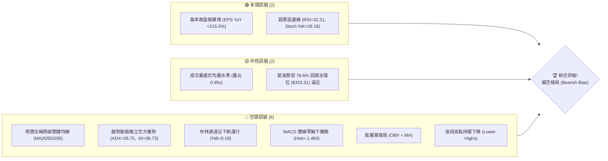

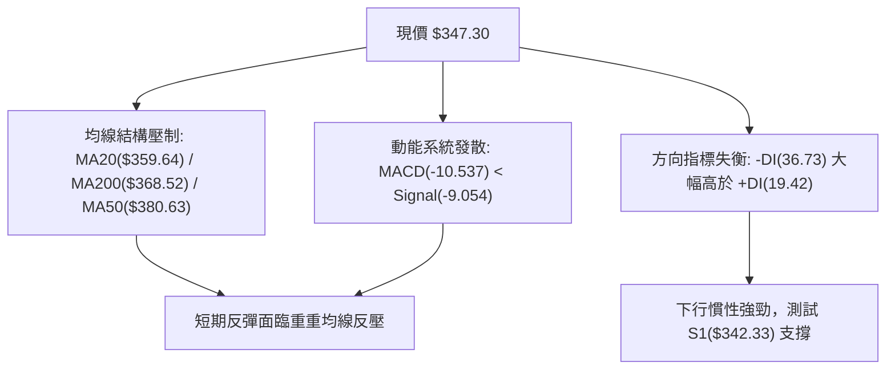

### 📊 核心指標速覽表

| 指標類別 | 指標名稱 | 當前數值 | 訊號 | 解讀 |
|----------|----------|----------|------|------|
| **價格** | 當前價格 | $347.30 | 🔴 | 位於 52W 區間 28.2%，失守半年線與年線支撐 |
| **均線** | MA20 | $359.64 | 🔴 | 價格低於 MA20 達 -3.43%，短線呈下行扣抵壓力 |
| **均線** | MA50 | $380.63 | 🔴 | 價格低於 MA50 達 -8.76%，中期上升趨勢被破壞 |
| **均線** | MA200 | $368.52 | 🔴 | 跌破牛熊分水嶺（MA200），長期多頭結構面臨嚴格考驗 |
| **動能** | RSI(14) | 32.31 | 🟡 | 逼近 30 超賣區間，空頭動能充沛但面臨技術性反彈需求 |
| **動能** | MACD (12,26,9) | -10.537 / -9.054 | 🔴 | DIF 位於 Signal 之下，柱狀圖 -1.483 持續在負軸擴張 |
| **動能** | 隨機指標 (Stoch) | %K 28.18 / %D 13.60 | 🟡 | 處於低檔鈍化邊緣，隨時可能觸發弱勢反彈 |
| **趨勢** | ADX (14) | 26.75 | 🔴 | ADX > 25 且 -DI(36.73) >> +DI(19.42)，強烈空頭單邊趨勢 |
| **通道** | 布林通道 (%B) | 0.19 | 🔴 | 價格貼近布林下軌（$339.46），開口向下擴張 |
| **量能** | 成交量 / 20日均量 | 24.35M / 25.62M (0.95x) | 🟡 | 量縮陰跌，OBV 低於均線顯示法人資金持續淨流出 |
| **波動** | ATR(14) | $10.69 (3.08%) | 🔴 | 每日震幅超過 10 美元，波動率放大，下行風險需設防 |

### 🏆 技術評分卡

```
╔══════════════════════════════════════════════════════════════╗
║              技術評分卡 — AVGO (2026-09-18)                  ║
╠══════════════════════════════════════════════════════════════╣
║ 趨勢強度 (ADX/趨勢方向)  ███████░░░░░░░░░░░░░  35/100  🔴   ║
║ 動能指標 (RSI/MACD/KD)   ██████░░░░░░░░░░░░░░  30/100  🔴   ║
║ 支撐穩定度 (S1/S2/Fib)   ████████░░░░░░░░░░░░  40/100  🟡   ║
║ 成交量配合 (OBV/量比)    ████████░░░░░░░░░░░░  38/100  🔴   ║
║ 形態完整度 (波段高低點)  ██████░░░░░░░░░░░░░░  32/100  🔴   ║
║ 均線排列 (短中長期均線)  ████░░░░░░░░░░░░░░░░  20/100  🔴   ║
╠══════════════════════════════════════════════════════════════╣
║ 綜合評分                 ██████░░░░░░░░░░░░░░  32.5/100 🔴   ║
║ 評級結論                 【偏空】— 空方動能主導，建議逢高放空 ║
╚══════════════════════════════════════════════════════════════╝
```

---

## 2. 趨勢分析

### 🌐 多時框趨勢分析

根據趨勢收斂規則，當前 ADX(14) 為 **26.75 > 25**，市場確認處於**單邊趨勢行情**。多時框層級關係如下：

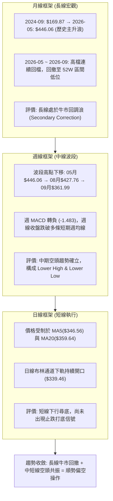

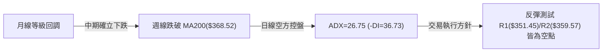

### 📈 長期趨勢 — 12個月走勢圖（Unicode）

以下為 AVGO 過去 12 個月（2025-10 至 2026-09）之收盤價格走勢圖：

```
AVGO 月線收盤走勢圖（過去12個月：2025-10 至 2026-09）
價格軸 ($)
$450 ┤                                      ● $446.06 (2026-05)
$420 ┤                                ●
$400 ┤              ● $400.71         │     │
$380 ┤        ●     │                 │     │     ●
$360 ┤  ●     │     │                 │     │     │     ●
$340 ┤  │     │     │     ●     ●     │     │     │     │     ● ← $347.30 (現在)
$320 ┤  │     │     │     │     │     │     │     │     │     │
$300 ┤  │     │     │     │     │  ●  │     │     │     │     │
     └──┴─────┴─────┴─────┴─────┴──┴──┴─────┴─────┴─────┴─────┴──
       10    11    12    01    02 03 04    05    06    07    08    09
      2025  2025  2025  2026 ── 2026 ── 2026 ── 2026 ── 2026 ── 2026
```

**走勢特徵分析表格**：

| 階段區間 | 起訖月份 | 收盤價變化 | 漲跌幅 | 核心技術特徵 |
|----------|----------|------------|--------|--------------|
| 第一階段（初段噴出） | 2025-10 → 2025-11 | $367.57 → $400.71 | +9.02% | 延續 2025 年多頭主升浪，月線量價齊揚突破 400 整數關卡 |
| 第二階段（深幅洗盤） | 2025-11 → 2026-03 | $400.71 → $309.02 | -22.88% | 連跌 4 個月，回測 $300 大關，在 $309.02 形成波段底部 |
| 第三階段（主力反撲） | 2026-03 → 2026-05 | $309.02 → $446.06 | +44.35% | 兩個月內暴力拉升近 137 美元，創下收盤新高 $446.06 |
| 第四階段（次高見頂） | 2026-05 → 2026-08 | $446.06 → $370.34 | -16.98% | 8月短暫反彈至週線 $427.76 後迅即崩落，未能突破 52W 高點 $494.22 |
| 第五階段（破位下行） | 2026-08 → 2026-09 | $370.34 → $347.30 | -6.22% | 連續跌破 MA200($368.52) 與 MA20($359.64)，下探今年第二低位區 |

### 📊 中期趨勢（週線分析）

從近 20 週數據觀察，AVGO 在 2026 年呈現典型的高檔震盪派發特徵：
1. **量價背離派發**：2026-06-07 該週出現天量 251.14M 股，但價格單週從 $446 暴跌至 $385.12，為主力機構高檔拋售籌碼之明確訊號。
2. **反彈高點降低（Lower High）**：2026-08-09 該週反彈至 $427.76（伴隨 RSI=73.6 短暫超買），但隨後三週量能萎縮且週 MACD 翻負（由 +5.364 急轉至 -5.851），隨後一路殺穿 $370。
3. **當前弱勢收盤**：2026-09-20 該週收在 $347.30，週成交量 104.95M 股，週線實體跌破前週反彈高點 $361.99，空方徹底控盤。

```
近期週線壓力與支撐階梯圖
  $427.76 ────────────────────── [8月反彈頂點 / 次級高點阻力]
          │
  $380.63 ────────────────────── [MA50 中期生命線反壓]
          │
  $368.52 ────────────────────── [MA200 長期牛熊線 / 斐波 61.8%]
          │
  $359.57 ────────────────────── [阻力 R2 / 日線 MA20]
          │
  $347.30 ◀── 現價位置 (面臨下檔跳水風險)
          │
  $342.33 ────────────────────── [支撐 S1 / 近期低點聚類]
          │
  $333.31 ────────────────────── [斐波那契 78.6% 回調關鍵防線]
          │
  $325.79 ────────────────────── [支撐 S2 / 強支撐區]
```

### ⚡ 趨勢強度評估（ADX 解讀）

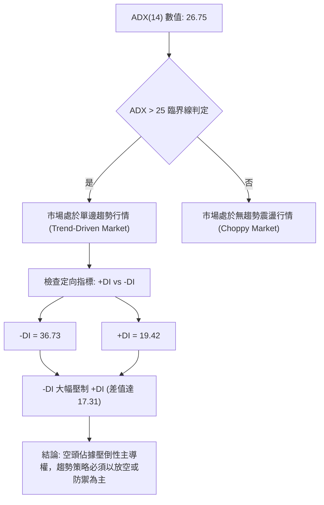

**ADX 趨勢強度對照表**：

| 指標變數 | 當前讀數 | 門檻區間 | 技術含義 | 對交易策略之指導 |
|----------|----------|----------|----------|------------------|
| **ADX(14)** | **26.75** | 25 – 50 | 具備明確單邊趨勢強度 | 順應大趨勢操作，拒絕逆勢摸底多單 |
| **-DI** | **36.73** | > 25 (極強) | 空方力量沉重，主導下殺波段 | 空方波段持倉安全邊際高 |
| **+DI** | **19.42** | < 20 (疲弱) | 多方缺乏承接意願與動能 | 多頭僅能視為超賣弱反彈，隨時夭折 |
| **ADX 變化率** | 上行擴張中 | — | 趨勢動能正在增強 | 下行動力尚未衰竭，不宜過早猜測底部 |

---

## 3. 圖表形態分析

### 🔍 形態識別系統

在多時框結構中，AVGO 展現出中期頂部派發形態。為嚴格遵守分析紀律，以下所有形態皆列出具體幾何測量與信心度：

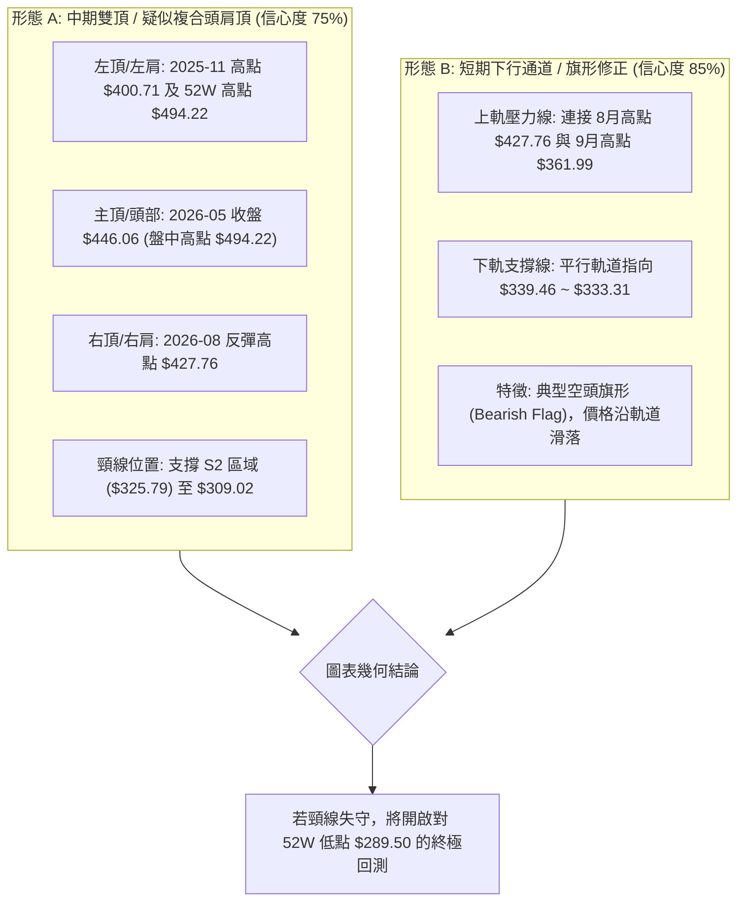

**形態信心度與目標價測算表**（嚴格基於數據推算）：

| 形態名稱 | 信心度 | 判斷依據（引用真實數據） | 完成度 | 目標價（附嚴謹計算式） |
|----------|--------|--------------------------|--------|------------------------|
| **中期雙頂 (Double Top)** | **75%** | 主頂 2026-05 ($446.06)，次頂 2026-08 ($427.76)，谷底於 S2 ($325.79) | 80% (正在測試頸線上方) | 頸線 $325.79 - 形態高度 ($427.76 - $325.79 = $101.97) = **$223.82**；初始保守目標指向 **$289.50** (52W Low) |
| **短期空頭旗形 (Bear Flag)** | **85%** | 8月下殺至 $357.90 後反抽 $361.99 失敗，受制於 MA20 ($359.64) | 90% (即將向下破位) | 旗桿起點 $392.99 - 旗桿底部 $357.90 = $35.09 高度；反抽高點 $361.99 - $35.09 = **$326.90** (極度接近 S2 $325.79) |
| **均線死叉形態** | **95%** | MA20 ($359.64) 即將死叉下穿 MA240 ($365.91)；現價全線失守 MA200 | 100% (指標形態確立) | 技術性測幅：以 MA20 與 MA200 差值擴散，壓制價格向斐波 78.6% **$333.31** 靠攏 |

### 🕯️ 重要K線形態分析

| 月份 | 收盤價 | K線形態 | 深度解讀 | 訊號 |
|------|--------|---------|----------|------|
| **2026-05** | $446.06 | 長陽破頂十字星變盤 | 創收盤歷史新高，但盤中觸及 52W 高點 $494.22 後大幅留上影線，多頭耗盡 | 🟡 變盤警告 |
| **2026-06** | $377.75 | 穿頭破腳大陰線 | 單月重挫 -15.31%，天量灌壓跌破 MA50，主力出貨確立 | 🔴 強烈看空 |
| **2026-07** | $389.28 | 縮量孕線反彈 | 縮量弱勢休整，未能吞噬 6 月大陰線實體之一半，屬死貓跳 | 🟡 弱勢中性 |
| **2026-08** | $370.34 | 上影倒錘頭線 | 週線一度上衝 $427.76 後遭空頭迎頭痛擊，月線收盤再創波段低點 | 🔴 空方完勝 |
| **2026-09** | $347.30 | 空頭實體大陰棒 | 連續擊穿 MA200 與短期支撐，收盤逼近全月最低點，下行無支撐感 | 🔴 空頭延續 |

### 📉 ASCII 走勢形態示意圖

```
AVGO 中短期雙頂與空頭旗形結構圖解
價格 ($)
$450 ┤          [頂 1: $446.06 (2026-05)]
$430 ┤            \                    [頂 2: $427.76 (2026-08)]
$410 ┤             \                  /   \
$390 ┤              \      /\        /     \
$370 ┤               \    /  \      /       \─────── [MA200 $368.52 跌破]
$350 ┤                \  /    \____/         \  ● ◄ 現價 $347.30
$330 ┤                 \/                     \────── 潛在頸線/旗形目標 [$333.31 ~ $325.79]
$310 ┤            [谷底: $309.02]
     └─────────────────────────────────────────────────────────────► 時間
```

### 🎯 形態目標價計算

1. **短期空頭旗形測量**：
   - 旗桿高點：2026-08-16 週收盤價 **$392.99**
   - 旗桿低點：2026-09-06 週收盤價 **$357.90**
   - 旗桿高度差：$392.99 - $357.90 = **$35.09**
   - 突破/反抽確認點：2026-09-13 週收盤價 **$361.99**
   - 旗形下行目標價 = $361.99 - $35.09 = **$326.90**（與關鍵支撐 S2 **$325.79** 誤差僅 0.3%，形成高度共振）。
2. **中期雙頂跌破量度**：
   - 若未來日線實體有效破位 S2 **$325.79**，確認雙頂頸線失守，其等長下測目標將指向 52 週最低點 **$289.50**。

---

## 4. 支撐與阻力

### 🗺️ 關鍵價位分布圖（Unicode）

本報告嚴格遵循數據紀律，所有價位均來自真實計算之 OHLCV 波段高低點與斐波那契回調聚類：

```
AVGO 價位結構分布圖
═════════════════════════════════════════════════════════════════
$494.22 ║████████████████████████████████████████║ 52W High / 0.0% Fib
$445.90 ║██████████████████████████████████      ║ 23.6% Fib / 5月收盤頂部
$416.02 ║████████████████████████████            ║ 38.2% Fib / 8月波段高阻力
$391.86 ║████████████████████████                ║ 50.0% Fib 中樞強分水嶺
$380.63 ║████████████████████                    ║ MA50 中期生命線反壓
$376.59 ║██████████████████                      ║ 強阻力 R3 (+8.43%)
$368.52 ║████████████████                        ║ MA200 牛熊分水嶺 / 61.8% Fib ($367.70)
$359.57 ║██████████████                          ║ 阻力 R2 (+3.53%) / MA20 ($359.64)
$351.45 ║██████████                              ║ 關鍵阻力 R1 (+1.19%) / MA5 ($346.56)
$347.30 ╠════════════════════════════════════════╣ ◄ 當前市價 ($347.30)
$342.33 ║▓▓▓▓▓▓▓▓                                ║ 近期支撐 S1 (-1.43%)
$339.46 ║▓▓▓▓▓▓▓▓▓▓                              ║ 布林通道下軌動態支撐
$333.31 ║▓▓▓▓▓▓▓▓▓▓▓▓                            ║ 78.6% Fib 關鍵支撐
$325.79 ║██████████████                          ║ 強支撐 S2 (-6.19%) / 頸線區
$312.96 ║████████████████                        ║ 極限支撐 S3 (-9.89%)
$289.50 ║████████████████████████████████████████║ 52W Low / 100.0% Fib 底線
═════════════════════════════════════════════════════════════════
```

### 🚧 阻力位分析表

阻力位嚴格引用 OHLCV 計算聚類所得：

| 阻力級別 | 價位 | 形成原因與技術重合 | 突破難度 | 重要性 |
|----------|------|--------------------|----------|--------|
| **R1** | **$351.45** | 近期日線密集震盪下緣，上方緊貼 MA10 ($354.16) | 中等 | 短線多空交鋒前哨站，站不上則弱勢格局不改 |
| **R2** | **$359.57** | 20 日均線 MA20 ($359.64) 與布林中軌完全重合處 | 極高 | 空方防守大本營，中期趨勢下行之下軌反壓點 |
| **R3** | **$376.59** | 8 月下旬跌破之破位平台，上方逼近 MA60 ($379.51) 與 MA50 ($380.63) | 極難 | 中期轉強之關鍵門檻，未收復前任何反彈皆為虛火 |

### 🛡️ 支撐位分析表

支撐位嚴格引用 OHLCV 計算聚類所得：

| 支撐級別 | 價位 | 形成原因與技術重合 | 守住機率 | 重要性 |
|----------|------|--------------------|----------|--------|
| **S1** | **$342.33** | 近一年波段低點聚類，下方靠近布林下軌 ($339.46) | 45% (較弱) | 短線第一道防線，距現價僅 -1.43%，隨時可能受測 |
| **S2** | **$325.79** | 中期波段深幅低點聚類，空頭旗形等長測量目標 ($326.90) | 65% (中等) | 關鍵頸線緩衝帶，跌破將引發停損賣壓加速宣洩 |
| **S3** | **$312.96** | 2026-03 月線收盤底部 ($309.02) 之上方聚類支撐 | 80% (強大) | 長期多頭最後防線，不容有失，失守直面 52W 低點 |

### 📐 斐波那契回調位分析

依據 52 週完整波段（波段低點 **$289.50** → 波段高點 **$494.22**，全波段震幅 $204.72）計算：

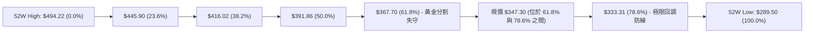

**斐波那契位深度解讀**：
1. **現價區間位置**：現價 **$347.30** 處於 **61.8%（$367.70）** 與 **78.6%（$333.31）** 之間。在經典技術分析中，跌破黃金分割位 61.8% 代表自 $289.50 以來的上漲趨勢「已被深度破壞」，行情不再是健康回檔，而是轉為「反轉下行或深幅重置行情」。
2. **MA200 與 61.8% 的共振壓制**：長期牛熊線 MA200 目前在 **$368.52**，與 61.8% 回調位 **$367.70** 僅差 $0.82。此共振阻力區將成為未來數月內最難逾越的「鋼鐵天花板」。
3. **下檔回測目標**：若 S1（$342.33）失守，下一個理論引力位即為 78.6% 回調位 **$333.31**。

---

## 5. 技術指標深度解讀

### 🎛️ 指標訊號總覽

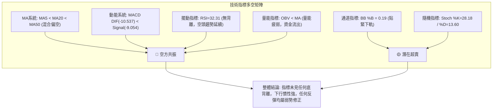

### 📈 移動平均線排列分析

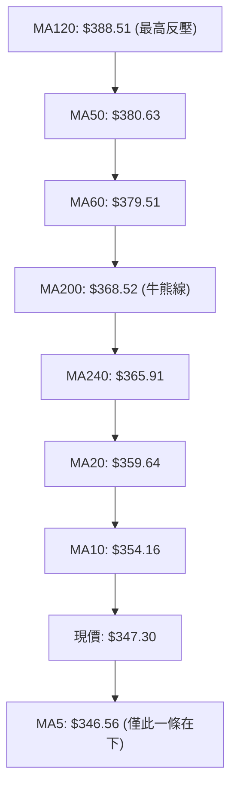

**均線動態細節剖析**：
- **短中期均線空頭發散**：MA5 ($346.56) < MA10 ($354.16) < MA20 ($359.64) < MA60 ($379.51)，呈現標準的空頭排列向下發散形態。
- **牛熊分界失守**：現價 $347.30 大幅跌破 200 日移動平均線 MA200 ($368.52) 達 -5.76%，且 MA200 斜率已走平轉向下彎。
- **乖離率觀察**：現價距離 MA20 乖離率為 **-3.43%**，距離 MA60 為 **-8.49%**。雖然負乖離存在，但並未達到歷史極端值（通常 > -12% 才會產生強烈均線引力修復），說明空方壓制節奏井然有序，尚未進入恐慌拋售的最後竭盡期。

### 📉 RSI(14) 分析

當前 RSI(14) 讀數為 **32.31**。

```
RSI(14) 當前狀態指示：
[0 ─────── 30 ── 32.31 ───────────────────────── 70 ─────── 100]
 超賣區間   ▲     ▲                              超買區間
          門檻   現值
進度條: ██████░░░░░░░░░░░░░░░░░░  32.31% (接近超賣，弱勢震盪)
```

- **超買超賣判定**：數值處於 30 至 70 的中性偏空區間，尚未跌破 30 達到傳統超賣定義。這表明價格雖然疲軟，但空方仍具備進一步宣洩的空間。
- **背離分析（Divergence）**：
  - 比對 2026-08-30（價格 $368.79，RSI=23.5）與當前 2026-09-20（價格 $347.30，RSI=32.31）：
  - **結論：無底背離**。官方數據明確標註「**RSI 背離：無明顯背離**」。雖然價格創低而 RSI 略高於 8 月底極端值，但週線與日線 RSI 均在 50 中軸下方運行，動能指標嚴格確認了價格下跌的趨勢真實性。

### 📊 MACD(12/26/9) 訊號解讀

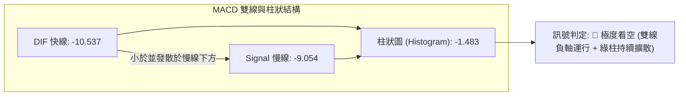

- **絕對數值**：MACD 快線為 **-10.537**，慢線為 **-9.054**，兩者均在零軸以下極深位置運行。
- **柱狀圖動能**：Histogram 為 **-1.483**。回顧前週（2026-09-13）MACD 柱狀圖曾微幅翻正至 +0.096，但隨後一週遭遇空頭重擊，柱狀圖瞬間轉負並擴大至 -1.483，此現象在技術分析上稱為「**零下假金叉後的再殺**」，代表多頭抵抗失敗，後續往往伴隨更強烈的下殺慣性。

### 📦 布林通道分析

布林帶寬（20, 2）數據：
- 上軌（Upper Band）：**$379.82**
- 中軌（Middle Band / MA20）：**$359.64**
- 下軌（Lower Band）：**$339.46**
- 當前價格：%B = **0.19**

```
AVGO 布林通道截面示意圖
$379.82 ┬────────────────────────────────────────── [上軌 Upper Band]
         │
$359.64 ┼ - - - - - - - - - - - - - - - - - - - -  [中軌 MA20 Baseline]
         │
$347.30 ┼ ◄ 現價 ($347.30, %B = 0.19)
         │
$339.46 ┴────────────────────────────────────────── [下軌 Lower Band]
```

- **%B 指標深度解讀**：%B 僅為 **0.19**（0 代表下軌，0.5 代表中軌，1 代表上軌），現價正緊貼布林通道下軌運行。
- **帶寬開口狀態**：帶寬（$379.82 - $339.46 = $40.36），通道開口呈現擴張跡象。價格沿著下軌滑落（稱為「走軌下行」，Walking down the band），這是極端空頭行情的經典表徵，下軌 $339.46 僅具動態減速效果，不構成剛性支撐。

### 💹 成交量分析（量價配合度）

1. **成交量比率**：
   - 最新成交量：**24,351,200 股**
   - 20 日均量：**25,616,675 股**
   - 量比（Volume Ratio）：**0.95x**（處於正常水位，未見恐慌性爆量）。
2. **OBV 能量潮判斷**：
   - 技術數據明確提示：「**OBV趨勢：OBV < MA → 量能疲弱**」。
   - 當價格下跌且 OBV 跌破其移動平均線時，顯示主流機構資金呈現「淨流出」狀態。上漲時量縮、下跌時量增，量價結構完全不支持任何 V 型反轉。

---

## 6. 動能與波動率

### ⚡ 動能評估四象限

評估標的在「動能強度（Momentum）」與「波動率（Volatility）」二維框架之定位：

| 象限標籤 | 動能狀態 | 波動率狀態 | 標的所處狀態 | 戰略含義與策略應對 |
|----------|----------|------------|--------------|--------------------|
| **象限 I** | 強動能 (多頭) | 低波動 | — | 穩定單邊牛市，適合順勢做多波段持倉 |
| **象限 II** | 弱動能 (無力) | 低波動 | — | 狹幅盤整行情，以區間套利或觀望為主 |
| **象限 III**| 強動能 (空頭) | 高波動 | **✓ 當前定位 (Q3)** | **空方單邊擴散，高波動破位，適合空頭順勢或嚴控倉位防守** |
| **象限 IV** | 弱動能 (分歧) | 高波動 | — | 劇烈震盪洗盤，容易觸發雙向停損 |

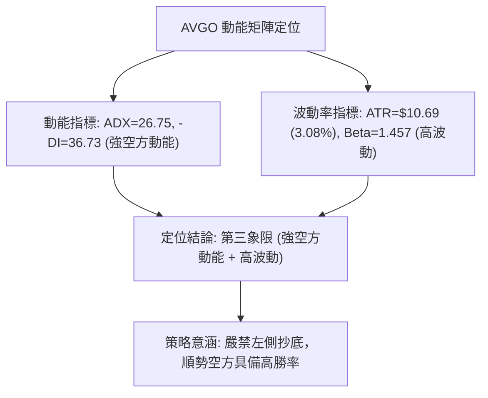

### 📊 ATR 波動率分析

- **ATR(14) 數值**：**$10.69**，佔現價之 **3.08%**。
- **市場意涵**：這意味著 AVGO 在正常交易日內，每日上下波動區間預期超過 10 美元。屬於半導體板塊中波動偏高之品種。
- **止損與部位管理指導**：
  - **空頭部位止損距離**：建議設定 1.5 倍至 2.0 倍 ATR。
    - 1.5 × ATR = $16.04；以進場價 $351.45（R1）為例，止損需設在 $367.49 附近（恰好避開 MA200 反壓）。
  - **短線多頭反彈止損距離**：必須從嚴設定，以 1.0 倍 ATR（約 $10.69）或前低 S1 下方為限。

### 📐 Beta 與市場相關性

- **Beta 係數**：**1.457**。
- **解讀**：AVGO 對標普 500 指數具備高度進攻性（高彈性）。在大盤上漲時其漲幅為大盤的 1.46 倍，但在市場回檔週期中，其跌幅亦為大盤的 1.46 倍。
- **相關性戰略**：在當前高 Beta 伴隨中線趨勢走壞之背景下，AVGO 正成為科技股指數（如 QQQ、SOX）回調時機構優先提款之標的。

---

## 7. 多時框架總結

### 📋 時框架評分表

| 時框架 | 趨勢方向 | 動能狀態 | 均線排列 | 形態結構 | 綜合評分 | 戰術建議 |
|--------|----------|----------|----------|----------|----------|----------|
| **月線 (長期)** | 🟡 中性回調 | 走平放緩 | 仍受 MA240 支撐 | 歷史高位雙重頂部疑慮 | 50/100 | 長線投資者暫停定投，等待長線底部確立 |
| **週線 (中期)** | 🔴 明確看空 | MACD轉負擴大 | 失守 MA50 與 MA200 | 空頭旗形破位進行中 | 28/100 | 中期波段以反彈融券放空為主 |
| **日線 (短期)** | 🔴 極度看空 | RSI=32 / -DI主導 | 空頭排列發散 | 貼緊布林下軌向下漂移 | 20/100 | 短線日內反彈即是賣點，切忌追多 |

### 🔲 綜合訊號矩陣

```
時框架訊號矩陣一致性檢驗：
═══════════════════════════════════════════════════════════════
時框層次      短期 (日線)      中期 (週線)      長期 (月線)
───────────────────────────────────────────────────────────────
趨勢指標         🔴 空            🔴 空            🟡 中
均線架構         🔴 空            🔴 空            🟡 中
動能指標         🔴 空            🔴 空            🔴 空
成交量價         🔴 空            🔴 空            🟡 中
形態位置         🔴 空            🔴 空            🔴 空
───────────────────────────────────────────────────────────────
時框共振度：【日線與週線達到 100% 空方共振】，月線多頭架構正遭受破壞。
═══════════════════════════════════════════════════════════════
```

### ⚖️ 多時框收斂結論

依據多時框收斂規則第 14 條：
1. **行情屬性判定**：當前 ADX(14) = **26.75 > 25**，毫無疑問屬於**趨勢行情**。
2. **時框主導原則**：以中長期（週線、MA50、MA200）方向為主導，日線僅用於尋找精準進場節奏。
3. **收斂方向性結論**：
   - 週線方向：跌破長期均線 MA200（$368.52），且週 MACD 由正轉負擴散，週線趨勢確認為「**下行波段**」。
   - 日線方向：受制於短期均線 MA5（$346.56）與 MA20（$359.64），空頭控盤。
   - **唯一方向性結論**：**【偏空】（Bearish）**。日線與週線訊號完全同向共振，絕無衝突。本報告第 8 章之核心策略唯一聚焦於「**空頭主導策略**」。

---

## 8. 交易策略建議

### 🗺️ 策略決策流程圖

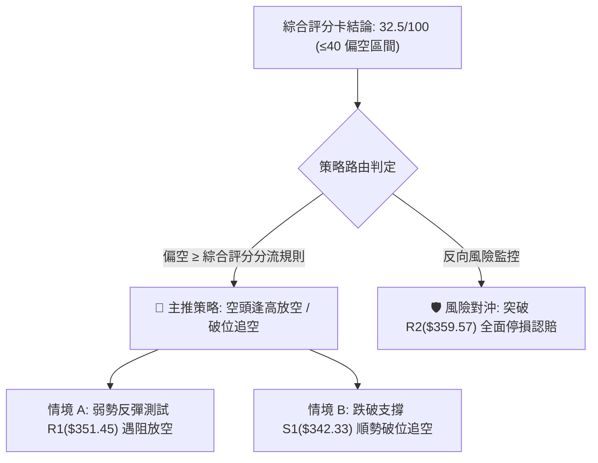

### 🧭 策略路由（依評分卡分流）

> **當前主策略方向 = 【空頭主導策略】（依據綜合評分 32.5 / 100，處於 ≤40 偏空絕對區間）**

本分析嚴格遵循紀律，不兩頭下注。多頭行為僅限於既有現貨倉位之風險停損或長線避險，主動型交易者應全面採取空方視角。

### 🎯 價格情境階梯（Price Scenarios）

所有價位均嚴格引用第 4 章真實計算數值：

| 觸發條件 | 下一目標 | 後續延伸 | 情境含義與技術定性 |
|----------|----------|----------|--------------------|
| **反彈受阻 R1 $351.45** | S1 $342.33 | S2 $325.79 | 最健康之空頭中繼，反抽無力繼續尋底 |
| **跌破 S1 $342.33** | S2 $325.79 | S3 $312.96 | 空頭下行擴散加速，測試雙頂頸線區 |
| **跌破 S2 $325.79** | S3 $312.96 | 52W Low $289.50 | 中期頭部形態徹底成型，開啟深幅崩跌 |
| **突破 R1 衝至 R2 $359.57** | R3 $376.59 | MA200 $368.52 | 短線嚴重超賣修復，測試布林中軌強阻力 |

### 📊 情境機率分佈

| 情境劇本 | 機率 | 主要數據依據與邏輯 |
|----------|------|--------------------|
| **劇本一：回落 / 再探底 (空方主導)** | **65%** | ADX=26.75 強勢向下；-DI(36.73) 極度強勢；MACD 柱狀負軸擴散；OBV < MA 量能流出 |
| **劇本二：弱勢區間震盪 (S1~R1拉鋸)** | **25%** | RSI=32.31 逼近超賣；布林 %B=0.19，短線可能在 S1($342.33) 至 R1($351.45) 消耗空方能量 |
| **劇本三：強勁反彈 / 向上反轉** | **10%** | 上方遭遇 MA20($359.64)、MA200($368.52) 雙重死叉重壓，缺乏基本面突發利多難以實現 |

### 🟢 主策略詳情（空頭主導）

所有價位均源自數據包之計算價位（R1, R2, S1, S2, S3, ATR）：

| 策略要素 | 策略 A（反彈放空 — 穩健型） | 策略 B（破位追空 — 激進型） |
|----------|-----------------------------|-----------------------------|
| **策略邏輯** | 趁超賣微幅反彈測試阻力無力時放空 | 跌破近期支撐確認下行旗桿延伸時追空 |
| **進場條件** | 盤中反彈觸及 R1 遇阻且分時出現衰竭K線 | 日線實體收盤跌破 S1 支撐位 |
| **進場價格** | **$351.45** (精確對齊 R1) | **$342.33** (精確對齊 S1) |
| **目標價 T1** | **$342.33** (前波低點 S1) | **$325.79** (波段強支撐 S2) |
| **目標價 T2** | **$325.79** (關鍵支撐 S2) | **$312.96** (極限支撐 S3) |
| **止損價格** | **$359.57** (突破 R2 / MA20 即停損) | **$351.45** (重回 R1 之上即停損) |
| **風險空間** | $359.57 - $351.45 = **$8.12** | $351.45 - $342.33 = **$9.12** |
| **報酬空間 (T2)**| $351.45 - $325.79 = **$25.66** | $342.33 - $312.96 = **$29.37** |
| **風險報酬比** | **1 : 3.16** (極具吸引力) | **1 : 3.22** (極佳風報比) |
| **勝率估計** | **65%** | **60%** |
| **建議倉位** | **總資金之 12% - 15%** | **總資金之 8% - 10%** |

### 🔴 反向風險觸發點（對沖提示）

若出現以下極端情況，空頭主策略即刻被推翻，必須全面空單離場或反手對沖：
1. **多頭收復關鍵分水嶺**：若日線收盤價連續 2 日站穩在 **$359.57（R2）** 之上，宣告 MA20 壓制失效，短線空頭結構被破壞。
2. **極限對沖點**：若價格強勢收復 **$368.52（MA200）**，代表機構資金重新奪回牛熊分界線，所有空單必須無條件止損出局。

### ⭐ 整體訊號強度評星

```
╔══════════════════════════════════════════════════════════════╗
║ 做多訊號強度：★☆☆☆☆  (1/5星 — 僅存微弱超賣修復預期)      ║
║ 做空訊號強度：★★★★☆  (4/5星 — 均線/趨勢/指標高度共振)     ║
║ 整體可信度：  ★★★★☆  (4/5星 — ADX>25 趨勢明確度高)       ║
╚══════════════════════════════════════════════════════════════╝
```

---

## 9. 風險提示與監控

### ✅ 關鍵監控指標 Checklist

```
╔══════════════════════════════════════════════════════════════╗
║              每日交易關鍵監控清單 (Checklist)                 ║
╠══════════════════════════════════════════════════════════════╣
║ [ ] 價格是否跌破 S1 ($342.33)？ ── 是則觸發策略 B 破位追空   ║
║ [ ] RSI(14) 是否跌破 30.00？ ── 是則提防短線超賣鈍化或抽頭   ║
║ [ ] MACD 柱狀圖是否收窄至 -0.50 以上？ ── 觀察空方動能減弱   ║
║ [ ] 成交量是否異常放大至 35M 股以上？ ── 警惕主力爆量換手    ║
║ [ ] 收盤價是否突破 R1 ($351.45)？ ── 若突破則空單保護性平倉  ║
║ [ ] 價格是否觸及斐波 78.6% ($333.31)？ ── 抵達後空單宜停利 ║
╚══════════════════════════════════════════════════════════════╝
```

### ⚠️ 風險場景分析

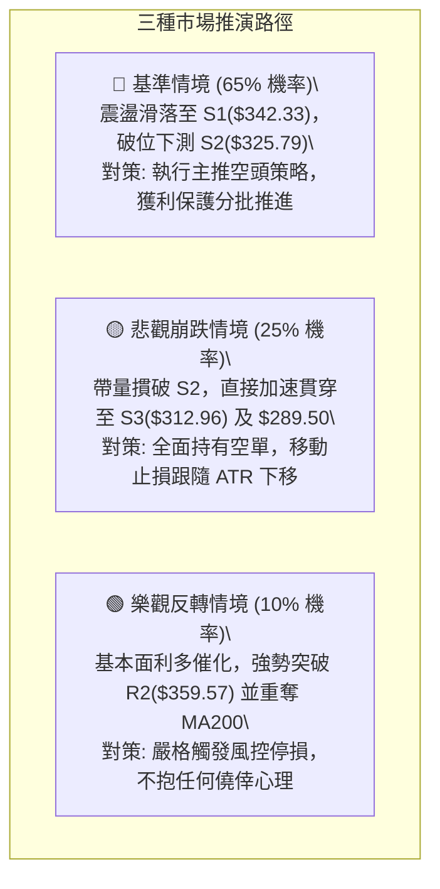

### 🛡️ 風險管理重要提醒

1. **基本面與技術面的背離陷阱**：
   - 當前基本面數據極為亮眼（YoY 營收成長 85.5%、盈餘成長 215.3%，分析師共識達 47 位 Strong Buy、目標均價 $531.85）。
   - **專業警示**：在華爾街歷史上，「亮麗業績公佈之際往往是機構長線籌碼出脫之時」。技術分析的精髓在於「**尊重盤面真金白銀的價格行為（Price Action）**」。在價格重返 MA200（$368.52）之前，切莫單憑財報數據盲目左側重倉做多。
2. **槓桿與倉位規模**：
   - 鑑於 ATR 高達 $10.69（3.08%），單筆交易虧損風險必須嚴格控制在總投資帳戶淨值的 **1.0% - 1.5%** 以內。
   - 單一策略部位總暴露建議不得超過投資組合總資金之 **15%**。

---

## 📋 報告總結

```
╔══════════════════════════════════════════════════════════════╗
║                   AVGO 技術分析報告總結                      ║
╠══════════════════════════════════════════════════════════════╣
║ 報告日期：2026-09-18                                         ║
║ 當前價格：$347.30                                            ║
║ 分析評級：🔴 偏空看跌 (Bearish Bias)                         ║
║                                                              ║
║ 關鍵結論：                                                   ║
║ ├─ 長期趨勢：🟡 中性偏弱（月線創高後深幅回檔，考驗年線支撐） ║
║ ├─ 中期趨勢：🔴 明確走熊（跌破 MA200 牛熊線，週 MACD 負擴散）║
║ ├─ 短期趨勢：🔴 空頭控盤（ADX=26.75，-DI=36.73，沿布林下軌滑落）║
║ ├─ 關鍵支撐：S1: $342.33 │ S2: $325.79 │ S3: $312.96        ║
║ ├─ 關鍵阻力：R1: $351.45 │ R2: $359.57 │ R3: $376.59        ║
║ └─ 斐波那契關鍵防線：78.6% 回調位 $333.31                   ║
║                                                              ║
║ 最優策略組合：                                               ║
║ 1. 🥇 最佳機會：反彈至 R1 ($351.45) 遇阻放空，目標 S2 ($325.79)║
║ 2. 🥈 次選機會：跌破 S1 ($342.33) 順勢破位追空，目標 S2/S3   ║
║ 3. 🥉 防守避險：多頭現貨持有者應以 R2 ($359.57) 作為保護線  ║
╚══════════════════════════════════════════════════════════════╝
```

---

> ⚠️ **免責聲明**：本報告為 AI 自動生成之技術分析，所有數據及估算均基於提供的歷史價格資訊。本報告**僅供研究與學術參考**，**不構成任何投資建議**。投資有風險，入市需謹慎。

---

*報告生成時間：2026-09-18 ｜ 數據來源：Yahoo Finance ｜ 分析框架：多時框技術分析*