# AVGO 技術分析報告

> **報告日期**：2026-09-19 ｜ **語言**：繁體中文 ｜ **數據來源**：Yahoo Finance ｜ **當前價格**：$357.61

---

## 目錄

| 章節 | 內容 |
|------|------|
| [1. 技術面概覽](#1-技術面概覽) | 訊號儀表板、核心指標、評分卡 |
| [2. 趨勢分析](#2-趨勢分析) | 多時框趨勢、長中短期走勢 |
| [3. 圖表形態分析](#3-圖表形態分析) | 形態識別、K線組合、目標價 |
| [4. 支撐與阻力](#4-支撐與阻力) | 關鍵價位、斐波那契回調 |
| [5. 技術指標深度解讀](#5-技術指標深度解讀) | MA/RSI/MACD/布林/成交量 |
| [6. 動能與波動率](#6-動能與波動率) | 動能評估、ATR、Beta |
| [7. 多時框架總結](#7-多時框架總結) | 時框架評分矩陣 |
| [8. 交易策略建議](#8-交易策略建議) | 多空策略、風險報酬比 |
| [9. 風險提示與監控](#9-風險提示與監控) | 監控指標、風險場景 |

---

## 1. 技術面概覽

### 🎯 技術訊號儀表板

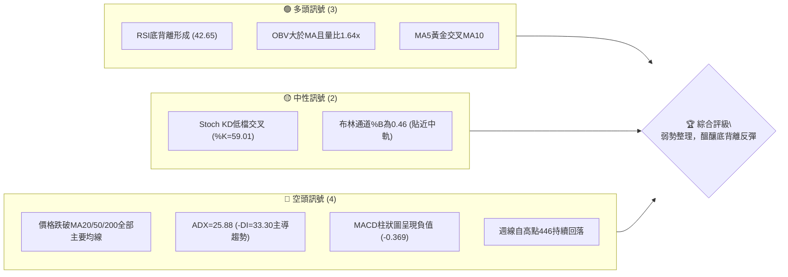

### 📊 核心指標速覽表

| 指標類別 | 指標名稱 | 當前數值 | 訊號 | 解讀 |
|----------|----------|----------|------|------|
| **價格** | 當前價格 | $357.61 | 🟡 | 位於52週區間 33.3%，處於中低檔震盪區間 |
| **均線** | MA20 | $359.32 | 🔴 | 價格低於MA20 (-0.48%)，短線面臨中軌壓制 |
| **均線** | MA50 | $379.76 | 🔴 | 價格顯著低於MA50 (-5.83%)，中期空頭格局確立 |
| **均線** | MA200 | $368.39 | 🔴 | 跌破長期牛熊分界線 (-2.93%)，長線多頭結構受挫 |
| **動能** | RSI(14) | 42.65 | 🟢 | 中性偏弱但伴隨日線底背離，具備技術性反彈動能 |
| **動能** | MACD | -9.515 / -9.146 | 🔴 | 快慢線均在零軸下方且負柱狀圖 (-0.369)，空頭掌控 |
| **趨勢** | ADX(14) | 25.88 | 🔴 | ADX>25 顯示趨勢存在，-DI (33.30) > +DI (24.82) 屬空頭主導 |
| **波動** | ATR(14) | $11.03 | 🟡 | 波動率 3.08%，處於健康中等波動水準 |

### 🏆 技術評分卡

```
╔══════════════════════════════════════════════════════════════╗
║              技術評分卡 — AVGO (2026-09-19)                  ║
╠══════════════════════════════════════════════════════════════╣
║ 趨勢強度      ████████░░░░░░░░░░░░  40/100  🔴 空方趨勢主導  ║
║ 動能指標      ██████████░░░░░░░░░░  50/100  🟡 底背離中和空動║
║ 支撐穩定度    ████████████░░░░░░░░  60/100  🟡 考驗S1多空防線║
║ 成交量配合    ██████████████░░░░░░  70/100  🟢 OBV強勢放量   ║
║ 形態完整度    ██████████░░░░░░░░░░  50/100  🟡 潛在雙底打底中║
║ 均線排列      ██████░░░░░░░░░░░░░░  30/100  🔴 價格落於各MA下║
╠══════════════════════════════════════════════════════════════╣
║ 綜合評分      ██████████░░░░░░░░░░  50/100  ⚖️ 區間中性觀望  ║
╚══════════════════════════════════════════════════════════════╝
```

---

## 2. 趨勢分析

### 🌐 多時框趨勢分析

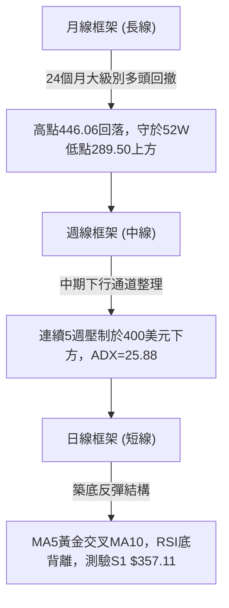

### 📈 長期趨勢 — 12個月走勢圖（Unicode）

```
AVGO 月線走勢圖（過去12個月：2025-10 至 2026-09）
價格軸 ($)
$450 ┤                                  ● $446.06 (2026-05)
$420 ┤                             ● $416.77
$390 ┤                                       ● $389.28
$360 ┤ ● $367.57                             ● $370.34
$350 ┤           ● $344.83                   ● $357.61 (現價)
$330 ┤                ● $330.08
$310 ┤                     ● $318.38
$300 ┤                          ● $309.02 (階段低點)
     └────────────────────────────────────────────────────────────
        10   11   12   01   02   03   04   05   06   07   08   09
       2025 2025 2025 2026 2026 2026 2026 2026 2026 2026 2026 2026
```

#### 走勢特徵分析表格

| 階段區間 | 起訖月份 | 價格區間 | 累積漲跌幅 | 結構形態特徵 |
|----------|----------|----------|------------|--------------|
| **第1階段：初階衝頂** | 2025-10 ~ 2025-11 | $367.57 → $400.71 | +9.02% | 突破400美元大關，多頭加速段 |
| **第2階段：波段回調** | 2025-11 ~ 2026-03 | $400.71 → $309.02 | -22.88% | 連續4個月下行，回測300整數心理關卡 |
| **第3階段：強勁主升** | 2026-03 ~ 2026-05 | $309.02 → $446.06 | +44.35% | 創歷史新高446.06，強勢噴發段 |
| **第4階段：高檔震盪** | 2026-05 ~ 2026-09 | $446.06 → $357.61 | -19.83% | 震盪回落整理，現於MA20/MA200下方尋求支撐 |

### 📊 中期趨勢（週線分析）

```
中期週線阻力與支撐區間結構
═════════════════════════════════════════════════════════════════
[歷史高點區]       $446.06 ── 2026年5月週線天花板 (波段頂部)
                      │
[中期密集壓力區]   $389.28 ── 2026年8月反彈次高點 (強阻力 R3 $384.33 附近)
                      │
[當前爭奪區間]     $361.99 ── 上週收盤價 (壓制於阻力 R1 $359.57)
                 ★ $357.61 ── 當前價格 (測試近一年低點聚類 S1 $357.11)
                      │
[下檔防守平台]     $350.06 ── 波段低點聚類 S2 (多頭生命線)
═════════════════════════════════════════════════════════════════
```

### ⚡ 趨勢強度評估（ADX 解讀）

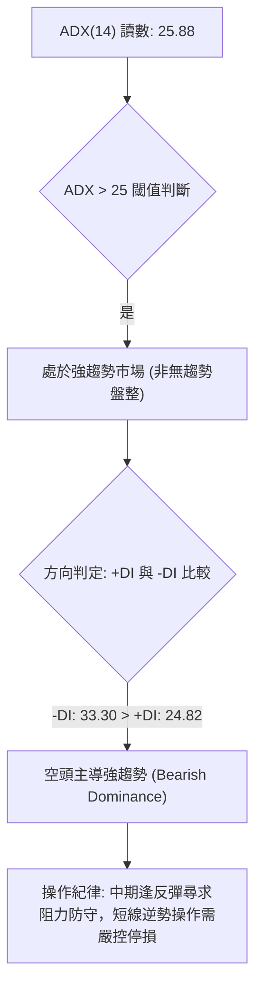

| 指標變量 | 數值 | 狀態閾值 | 意義解讀 |
|----------|------|----------|----------|
| **ADX (14)** | 25.88 | > 25.00 | 確立具備單邊趨勢動能，擺脫純無序橫盤 |
| **+DI (14)** | 24.82 | < -DI | 多頭買盤力道偏弱，追價動能不足 |
| **-DI (14)** | 33.30 | > +DI | 空方賣壓佔據盤面主導權，趨勢向南延展 |
| **趨勢結論** | 空方主導趨勢 | 具下行慣性 | 需待 +DI 上穿 -DI 且 ADX 拐頭方能確認反轉 |

---

## 3. 圖表形態分析

### 🔍 形態識別系統

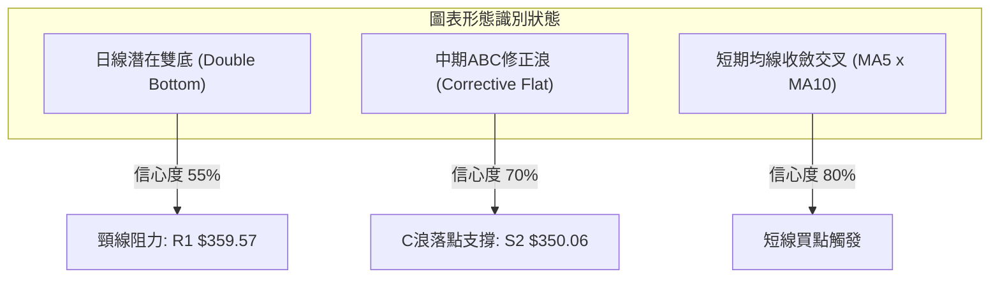

#### 形態識別信心度評估表

| 形態類別 | 信心度 | 判斷依據（引用數據） | 完成度 | 目標價（附計算式） |
|----------|--------|----------------------|--------|--------------------|
| **日線雙底 (潛在)** | 55% | 2026-09-06收盤357.90與現價357.61於支撐位S1 $357.11獲得承接 | 60% | 頸線阻力R1 $359.57 + (R1 $359.57 - S1 $357.11 = $2.46) = **$362.03** (未列於數據，僅作形態推算，下一表列阻力看 R2 $376.59) |
| **中期下行通道** | 75% | 週線由高點446.06連番跌破427.76、389.28、368.45，符合空頭高低點下移規律 | 85% | 通道下軌下探支撐S2 **$350.06** 或 S3 **$342.33** |
| **短期均線金叉** | 80% | MA5 ($345.68) 向上穿越 MA10 ($354.21)，短線空翻多訊號 | 100% | 測試第一波段阻力 R1 **$359.57** |

### 🕯️ 重要K線形態分析

| 日期 / 週別 | 收盤價 | 關鍵指標表現 | K線與量能組合型態 | 訊號解讀 |
|-------------|--------|--------------|-------------------|----------|
| **2026-05-31** | $446.06 | RSI 57.8 / 量 99.8M | 波段加速天花板，長黑反轉前兆 | 🔴 頂部力竭訊號 |
| **2026-06-07** | $385.12 | 成交量 251.1M 爆量 | 巨量長黑摜破短均線，主力出貨確立 | 🔴 趨勢全面轉空 |
| **2026-08-09** | $427.76 | RSI 73.6 (嚴重超買) | 次高點假突破反彈受阻回落 | 🔴 次頂確立 (Lower High) |
| **2026-08-30** | $368.79 | RSI 23.5 (嚴重超賣) | 極限拋售爆發低點，跌勢趨緩 | 🟡 超賣醞釀反彈 |
| **2026-09-06** | $357.90 | 週成交量 173.2M 放量 | 探底長下影線，回踩支撐S1 $357.11 | 🟢 下檔承接買盤進場 |
| **2026-09-20** | $357.61 | 成交量 148.9M / RSI 42.7 | 雙重底測試守穩，收斂十字星 | 🟢 短線底背離確認中 |

### 📉 ASCII 走勢形態示意圖

```
日線潛在雙重底與頸線阻力測試示意圖
$376.59 阻力 R2 ──────────────────────────────────────────
                     ▲ (突破後目標)
$359.57 頸線 R1 ─────┼───────┬──────────────────────────── (關鍵突破壓制點)
                    / \     / \
                   /   \   /   \
$357.61 (現價) ───/─────\─★────\─────────────────────────
                 /       \       \
$357.11 支撐 S1 ● (底1)   ● (底2) ┴─────────────────────── (雙底防守低點聚類)
               2026-09-06  2026-09-20
```

### 🎯 形態目標價計算

依據波段幾何結構嚴謹推導：
1. **雙底初級反彈測量**：
   - 形態底部低點聚類：$357.11
   - 形態頸線聚類：$359.57
   - 垂直形態高度 $H$ = $359.57 - $357.11 = **$2.46**
   - 最小測量目標價 = 頸線 $359.57 + $2.46 = **$362.03**（對應2026-09-13週線收盤 $361.99 密集群）。
2. **大級別波段拓展目標**：
   - 若有效站上頸線 R1 $359.57，依技術對稱理論將直指近一年波段高點聚類 **R2: $376.59**（+5.31%）及 **R3: $384.33**（+7.47%）。

---

## 4. 支撐與阻力

### 🗺️ 關鍵價位分布圖（Unicode）

```
AVGO 價位結構分布圖 (由實際 OHLCV 與斐波那契計算)
═══════════════════════════════════════════════════════════════
$494.22 ║██████████████████████████████║ 52週歷史高點 (0.0%)
$445.90 ║████████████████████████      ║ 斐波那契 23.6% 回調位
$416.02 ║████████████████████          ║ 斐波那契 38.2% 回調位
$391.86 ║██████████████████            ║ 斐波那契 50.0% 多空分水嶺
$384.33 ║████████████████              ║ 強阻力 R3 (近一年波段高點聚類)
$376.59 ║██████████████                ║ 阻力 R2 (反彈關鍵阻力)
$367.70 ║████████████                  ║ 斐波那契 61.8% 關鍵黃金分割位
$359.57 ║██████████                    ║ 關鍵阻力 R1 (布林中軌 MA20 密集群)
$357.61 ╠══════════════════════════════╣ ◄ 當前價格現價
$357.11 ║▓▓▓▓▓▓▓▓▓▓                    ║ 近期關鍵支撐 S1 (波段低點聚類)
$350.06 ║████████                      ║ 強支撐 S2 (波段多頭防守核心)
$342.33 ║██████                        ║ 極限支撐 S3 (下檔最後防線)
$333.31 ║████                          ║ 斐波那契 78.6% 回調位
$289.50 ║██                            ║ 52週歷史低點 (100.0%)
═══════════════════════════════════════════════════════════════
```

### 🚧 阻力位分析表

價位精確引用自近一年波段高點聚類數據：

| 阻力級別 | 價位 | 距現價幅動 | 形成原因 | 突破難度 | 重要性 |
|----------|------|------------|----------|----------|--------|
| **R1** | $359.57 | +0.55% | 近期震盪高點聚類，疊合布林中軌 MA20 ($359.32) | 🟡 中等 | 短線多空轉折分界點 |
| **R2** | $376.59 | +5.31% | 波段反彈高點聚類，鄰近布林上軌 ($379.41) 與 MA50 ($379.76) | 🔴 極高 | 中期下行趨勢防線 |
| **R3** | $384.33 | +7.47% | 近一年密集套牢籌碼峰區，跌破後的反壓大關 | 🔴 堅不可摧 | 空頭核心防禦陣地 |

### 🛡️ 支撐位分析表

價位精確引用自近一年波段低點聚類數據：

| 支撐級別 | 價位 | 距現價幅動 | 形成原因 | 守住機率 | 重要性 |
|----------|------|------------|----------|----------|--------|
| **S1** | $357.11 | -0.14% | 近期多個交易日連續獲得支撐之低點聚類 | 70% | 短線雙底成型關鍵基石 |
| **S2** | $350.06 | -2.11% | 近一年核心波段起漲支撐平台聚類 | 80% | 中期多頭命脈防線 |
| **S3** | $342.33 | -4.27% | 極限修正低點聚類，鄰近布林下軌 ($339.23) | 90% | 跌破將引發技術崩解 |

### 📐 斐波那契回調位分析

依據 52 週完整波段高低點（$289.50 → $494.22）計算：

```
斐波那契回調層級與現價對齊座標
0.0%  (52W High)  $494.22 ──────────────────────────────
23.6%             $445.90 ──────────────────────────────
38.2%             $416.02 ──────────────────────────────
50.0%             $391.86 ──────────────────────────────
61.8%             $367.70 ──────────────────────────────
                     ▲
                     │ [現價 $357.61 落於 61.8% 與 78.6% 弱勢修正回調區間]
                     ▼
78.6%             $333.31 ──────────────────────────────
100.0% (52W Low)  $289.50 ──────────────────────────────
```

- **結構解讀**：現價 $357.61 已跌破重要的 **黃金分割 61.8% ($367.70)**，代表自 $494.22 發動的高級別回調已由「強勢整理」演變為「深度修正行情」。目前價格徘徊於 61.8% ($367.70) 與 78.6% ($333.31) 之間。
- **後市意涵**：若無法迅速帶量收復 $367.70，價格存在向 78.6% ($333.31) 尋求長線強支撐的下行慣性；反之，若在此處成功構築雙底，61.8% 位置將轉為反彈第一波強勁阻力。

---

## 5. 技術指標深度解讀

### 🎛️ 指標訊號總覽

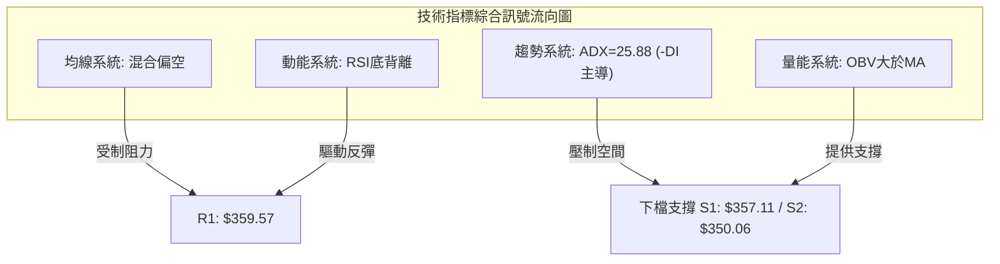

### 📈 移動平均線排列分析

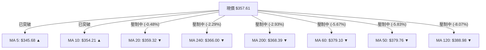

- **均線排列狀態**：當前均線系統呈「**空頭佔優的混合排列**」。短線出現正面修復訊號（MA5 $345.68 向上交叉 MA10 $354.21，日漲幅達 +3.45%），帶動超跌反彈。
- **上檔層重重壓制**：上方依序面臨 MA20 ($359.32)、MA240 ($366.00)、MA200 ($368.39) 以及 MA50 ($379.76)。尤其是 MA200 跌破後已轉化為強大套牢反壓，在未帶量站上 MA200 前，總體格局不可輕易言牛。

### 📉 RSI(14) 分析

```
RSI(14) 動能刻度尺
0 ─────── 30 ───────────── 42.65 ────────────── 70 ────── 100
[ 超賣區 ]    [ 弱勢整理區 ]     ★現價       [ 強勢多頭區 ]   [ 超買區 ]
進度條: ████████░░░░░░░░░░░░ 42.65% (中性偏弱)
```

- **背離確認 (極重要)**：
  - **價格走勢**：2026-08-30 收盤價 $368.79 跌至 2026-09-06 的 $357.90 及現價 $357.61，**價格持續走低刷新波段低點**。
  - **RSI指標**：RSI 自 2026-08-30 的 **23.5** 極端超賣低點，反彈至 2026-09-06 的 **29.2**，再回升至當前的 **42.65**，**RSI 低點呈現明確抬高態勢**。
  - **結論**：日線級別已形成標準的 **典型底背離 (Bullish Divergence)**，顯示空方摜壓動能衰退，技術性反彈呼之欲出。

### 📊 MACD(12/26/9) 訊號解讀

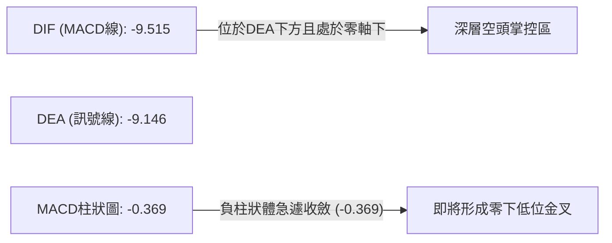

- **狀態解析**：DIF (-9.515) 低於 DEA (-9.146)，MACD柱狀圖為 -0.369 處於空方區域。
- **邊際變化**：柱狀圖自前期的 -5.851 (2026-08-23) 及 -3.426 (2026-08-30)，已急遽收窄至當前的 **-0.369**，代表下行加速度已降至零軸邊緣，空頭力竭，隨時可能在零下引發黃金交叉買訊。

### 📦 布林通道分析

```
AVGO 日線布林通道結構示意圖 (20, 2)
$379.41 ─────────────────────────────── 布林上軌 (強阻力區)
           │
           │
$359.32 ───┼─────────────────────────── 布林中軌 (MA20 / 阻力 R1 $359.57)
           │  ★ 現價 $357.61 (%B = 0.46)
           │
$339.23 ─────────────────────────────── 布林下軌 (極端支撐區)
```

- **通道指標解讀**：
  - **帶寬與位置**：BB 上軌 $379.41，下軌 $339.23，中軌 $359.32。當前價格 $357.61，**%B 指標為 0.46**，意即價格恰好位於中軌略下方（0.5 為中軌），處於下半通道向上測試中軌的階段。
  - **帶寬收縮**：帶寬呈現收斂態勢，代表前期單邊大跌趨於緩和，進入震盪蓄勢期。若能帶量突破中軌 $359.32，通道上限將打開至上軌 $379.41。

### 💹 成交量分析（量價配合度）

- **最新量能特徵**：最新單日成交量 **43,948,400 股**，相較於 20 日均量 (26,829,525 股)，**量比高達 1.64 倍**；相較於 50 日均量 (22,308,246 股) 幾近翻倍。
- **OBV 能量潮解讀**：目前技術狀態顯示 **OBV > MA**，明確指能量能並未在下行中潰散，反而於 $357 附近展現出機構資金「逢低吸籌」的放量護盤特徵，量價呈現良性底背離支撐。

---

## 6. 動能與波動率

### ⚡ 動能評估四象限

| 象限代號 | 動能強度 (Momentum) | 波動率水準 (Volatility) | 歷史特徵 | 當前狀態判定 | 戰略處置建議 |
|----------|---------------------|--------------------------|----------|--------------|--------------|
| **Q1** | 強動能 (Strong) | 低波動 (Low) | 穩健單邊上升 | 否 | 順勢加碼持股 |
| **Q2** | 弱動能 (Weak) | 低波動 (Low) | 沉悶築底整理 | **★ 當前定位 (Q2)** | **區間低吸，嚴控停損，等待突破** |
| **Q3** | 強動能 (Strong) | 高波動 (High) | 主升浪/恐慌崩盤 | 否 | 擴大止盈，高頻避險 |
| **Q4** | 弱動能 (Weak) | 高波動 (High) | 劇烈雙向洗盤 | 否 | 降低倉位，觀望為主 |

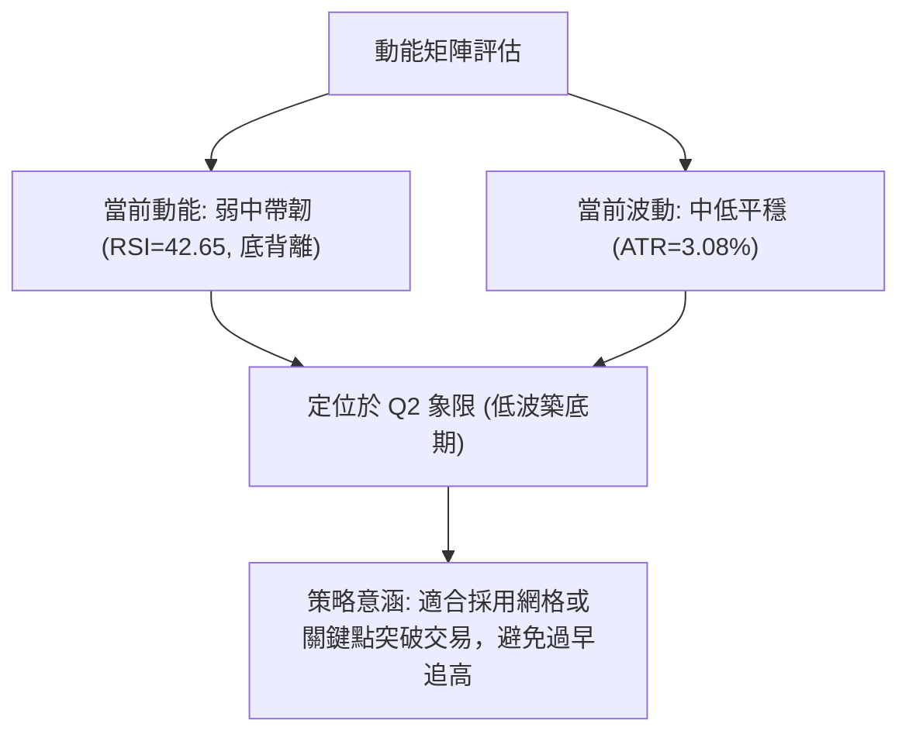

### 📊 ATR 波動率分析

- **ATR(14) 數值**：**$11.03**，佔現價百分比為 **3.08%**。
- **風控止損距離評估**：
  - **保守型止損 (1.0 × ATR)**：$11.03 距離空間。以現價 $357.61 計算，緩衝價位為 **$346.58**。
  - **波段型止損 (1.5 × ATR)**：$16.55 距離空間。緩衝價位為 **$341.06**，剛好覆蓋極限支撐 S3 ($342.33) 下方，能有效避免市場噪音引發假突破洗盤。
  - **當前日內防守**：日內安全波動帶落在 $357.61 ± $11.03 ($346.58 ~ $368.64)。

### 📐 Beta 與市場相關性

- **Beta 係數**：**1.457**。
- **市場特徵分析**：AVGO 具備典型的高彈性科技權值股屬性，波動幅度為標普500指數的 1.457 倍。在半導體板塊反彈時具備強勁的超額收益 (Alpha) 潛力，但在大盤走弱時亦承擔高 Beta 的補跌衝擊，操作時整體部位資金曝險比重應主動下調。

---

## 7. 多時框架總結

### 📋 時框架評分表

| 時框架 | 趨勢方向 | 動能狀態 | 均線排列 | 關鍵形態 | 綜合評分 | 操作建議 |
|--------|----------|----------|----------|----------|----------|----------|
| **長期 (月線)** | 偏多震盪 🟢 | 修正高點動能 🟡 | 價格仍高於歷史底部 🟢 | 高檔446回撤回調 | **65/100** | 核心長線部位逢低分批佈局 |
| **中期 (週線)** | 空頭佔優 🔴 | MACD收斂 🟡 | 均線空頭排列壓制 🔴 | 通道下行測試支撐 | **40/100** | 不盲目重倉追多，靜待反轉確立 |
| **短期 (日線)** | 震盪反彈 🟡 | RSI底背離 🟢 | MA5金叉MA10 🟢 | 潛在雙底成型中 🟡 | **55/100** | 依支撐阻力做高拋低吸短線波段 |

### 🔲 綜合訊號矩陣

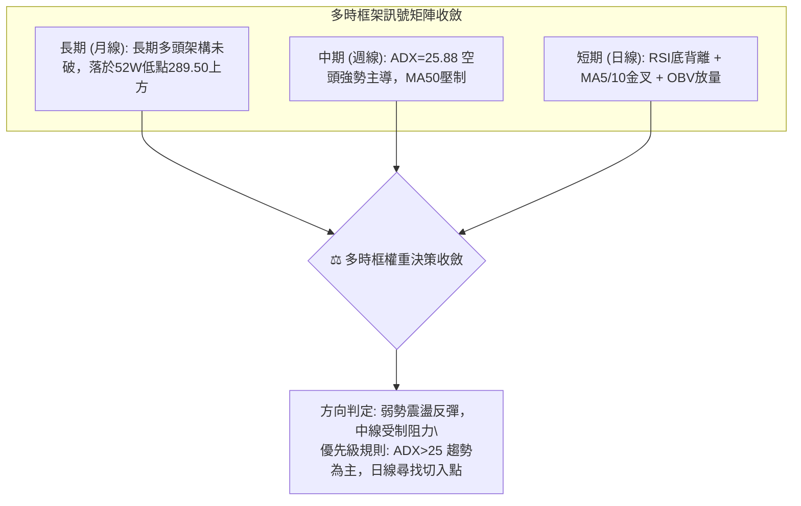

### ⚖️ 多時框收斂結論

依據多時框收斂優先級規則嚴格裁定：
1. **趨勢判定**：當前 ADX(14) 讀數為 **25.88**，已跨越 25 臨界線，顯示市場處於**單邊趨勢行情**而非完全無序盤整；因 -DI (33.30) 遠高於 +DI (24.82)，**中期（週線）趨勢方向由空方全面主導**。
2. **優先級取捨**：依規則，當趨勢成立時以中長期（週線、MA50、MA200）方向為基準（偏空壓制），日線短期的底背離與均線金叉僅能定位為「**逆勢反彈與築底過渡期**」，僅適合作為短線右側介入或逢高防守的進出場時機，不可直接視為長牛重啟。
3. **方向性最終結論**：**中性觀望偏向防守型區間反彈操作**。

---

## 8. 交易策略建議

### 🗺️ 策略決策流程圖

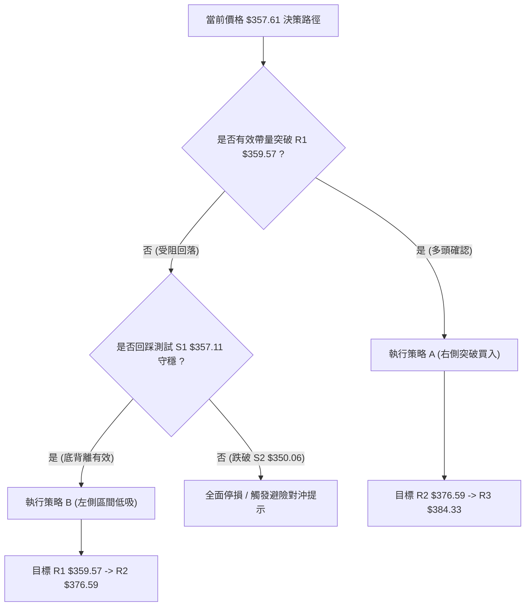

### 🧭 策略路由

> **當前主策略方向 = 中性區間震盪與右側突破操作（依技術評分卡綜合評分 50/100）**  
> 綜合評分剛好坐落於 40–60 中性區間，市場多空拉鋸激烈：空方擁有中期均線壓制與 ADX 趨勢優勢，多方則坐擁成交量放量、OBV 支撐與日線 RSI 底背離保護。因此嚴格界定為「**布林通道與關鍵點位區間操作，嚴格等待破位或確認訊號**」。

### 🎯 價格情境階梯（Price Scenarios）

價位完全嚴格引用第 4 章近一年波段聚類數據：

| 觸發條件 | 第一目標 | 後續延伸目標 | 結構情境含義 |
|----------|----------|--------------|--------------|
| **強勢突破 R1 $359.57** | R2 **$376.59** | R3 **$384.33** | 日線雙底與底背離確認，展開向布林上軌奔襲之強反彈 |
| **站穩現價 $357.61 區間** | R1 **$359.57** | — | 於 S1 與 R1 之間極度收斂，靜待指標發酵 |
| **跌破 S1 $357.11** | S2 **$350.06** | S3 **$342.33** | 短線抄底失敗，向下尋求中期多頭生命線支撐 |

### 📊 情境機率分佈

| 情境劇本 | 預估機率 | 主要技術依據 |
|----------|----------|--------------|
| **情境一：止跌反彈突破** | 45% | 日線 RSI 底背離確立、OBV > MA 資金回流、最新日成交量達 1.64 倍放量。 |
| **情境二：箱體窄幅震盪** | 35% | ADX(14)=25.88 趨勢處於過渡臨界，布林通道中軌 $359.32 壓制，多空均線糾結。 |
| **情境三：摜破下探尋底** | 20% | -DI(33.30) 仍高於 +DI(24.82)，整體價格受制於 MA50 ($379.76) 及 MA200 ($368.39)。 |

### 🟢 主策略詳情

本報告依中性區間交易邏輯，提供「**突破右側進場（策略 A）**」與「**支撐左側低吸（策略 B）**」兩套精確執行方案：

| 策略要素 | 策略 A（右側順勢突破策略） | 策略 B（左側支撐防守策略） |
|----------|----------------------------|----------------------------|
| **進場條件** | 日K收盤確認突破 R1 $359.57 且量比>1.2 | 回踩支撐 S1 $357.11 不破，分批掛單介入 |
| **進場價格** | **$359.57** | **$357.11** |
| **目標價 T1** | **$376.59** (阻力 R2) | **$359.57** (阻力 R1) |
| **目標價 T2** | **$384.33** (阻力 R3) | **$376.59** (阻力 R2) |
| **止損價格** | **$350.06** (跌破支撐 S2 嚴格停損) | **$350.06** (跌破支撐 S2 嚴格停損) |
| **風險報酬比** | **1.79 : 1** (目標1) / **2.60 : 1** (目標2) | **0.35 : 1** (目標1) / **2.76 : 1** (目標2) |
| **成功機率** | 60% | 55% |
| **建議倉位** | 15% 總資金規模 | 10% 總資金規模 |

*註：策略 A 風險報酬比計算式：(T1 $376.59 - 進場 $359.57) / (進場 $359.57 - 止損 $350.06) = $17.02 / $9.51 = 1.79；至 T2 則為 ($384.33 - $359.57) / $9.51 = $24.76 / $9.51 = 2.60。*

### 🔴 反向風險觸發點（對沖提示）

- **全面破位警訊**：若日K線以實體長黑跌破 **S2: $350.06**，且成交量持續擴大，代表雙底形態徹底破產，底背離演變為「鈍化下跌」。
- **處置措施**：多頭部位應毫不猶豫全數止損離場，短線積極型交易者可建立小規模看跌部位或反向 ETF 對沖，下檔直指極限支撐 **S3: $342.33** 與斐波那契 78.6% **$333.31**。

### ⭐ 整體訊號強度評星

```
做多訊號強度：★★★☆☆  (3/5星 — 底背離配合量能支撐，但受阻於均線)
做空訊號強度：★★★☆☆  (3/5星 — 中期均線空頭，但短線超跌下行受阻)
整體可信度：  ★★★★☆  (4/5星 — 多時框指標訊號清晰，點位聚類精確)
```

---

## 9. 風險提示與監控

### ✅ 關鍵監控指標 Checklist

```
╔══════════════════════════════════════════════════════════════╗
║              日常風控與技術指標監控清單 (Checklist)           ║
╠══════════════════════════════════════════════════════════════╣
║ [ ] 價格是否收復關鍵阻力 R1 $359.57 (布林中軌 MA20)          ║
║ [ ] 價格是否摜破波段核心防守點 S2 $350.06                     ║
║ [ ] MACD 柱狀圖是否由負轉正 (-0.369 -> 零軸之上金叉)         ║
║ [ ] RSI(14) 能否持續站穩 40 景氣線上並突破 50 中軸           ║
║ [ ] ADX(14) 讀數是否回落至 25 以下 (代表下行趨勢徹底終結)    ║
║ [ ] +DI (24.82) 是否上穿 -DI (33.30) 扭轉多空主導權          ║
║ [ ] 成交量比是否維持在 1.2 倍以上，確保 OBV 能量潮不破位     ║
╚══════════════════════════════════════════════════════════════╝
```

### ⚠️ 風險場景分析

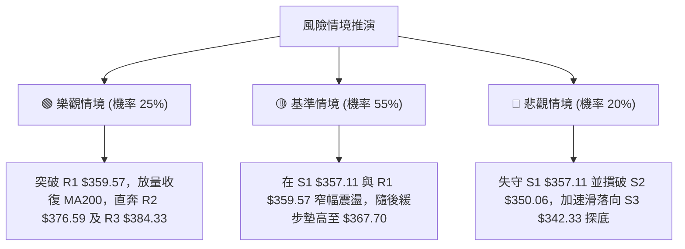

### 🛡️ 風險管理重要提醒

1. **高 Beta 波動調節**：AVGO 當前 Beta 為 **1.457**，ATR 達 **$11.03**（單日波動率逾 3%）。在總投資組合中，個股曝險部位不宜超過總權益之 **10% ~ 15%**，避免單一股票劇烈波動侵蝕整體帳戶淨值。
2. **切忌孤立解讀底背離**：底背離固然為強力反彈前兆，但若市場遭遇宏觀系統性衝擊或半導體板塊下修，底背離可能出現「再鈍化」走勢。必須將 **S2: $350.06** 設為絕對停損鐵律，嚴禁任何凹單行為。
3. **斐波那契重要心理關卡**：當前價位低於 61.8% ($367.70)，在未收復此關鍵水位前，任何多頭進場均定位為「防守型波段反彈」，而非長線反轉大牛市，不可隨意拉高槓桿。

---

## 📋 報告總結

```
╔══════════════════════════════════════════════════════════════╗
║                   AVGO 技術分析報告總結                      ║
╠══════════════════════════════════════════════════════════════╣
║ 報告日期：2026-09-19                                         ║
║ 當前價格：$357.61 (位於52週區間 33.3%)                       ║
║ 分析評級：⚖️ 區間觀望 / 醞釀底背離反彈 (綜合評分: 50/100)      ║
║                                                              ║
║ 關鍵結論：                                                   ║
║ ├─ 長期趨勢：🟢 偏多未變 (維持於52週低點 $289.50 上方)       ║
║ ├─ 中期趨勢：🔴 空頭主導 (ADX=25.88, -DI=33.30 佔優)         ║
║ ├─ 短期趨勢：🟢 超跌反彈 (RSI底背離, MA5金叉MA10, OBV量能支撐)║
║ ├─ 關鍵支撐：S1: $357.11  /  S2: $350.06  /  S3: $342.33    ║
║ ├─ 關鍵阻力：R1: $359.57  /  R2: $376.59  /  R3: $384.33    ║
║ └─ 華爾街目標價均值：$531.85 (機構共識 Strong Buy)           ║
║                                                              ║
║ 最優策略組合：                                               ║
║ 1. 🥇 最佳機會 (右側)：帶量突破 R1 $359.57 順勢追多，看至 R2 ║
║ 2. 🥈 次選機會 (左側)：回測 S1 $357.11 輕倉佈局，停損設S2    ║
║ 3. 🥉 防守避險：若實體長黑摜破 S2 $350.06，全面離場觀望      ║
╚══════════════════════════════════════════════════════════════╝
```

---

> ⚠️ **免責聲明**：本報告為技術分析模型自動生成，所有數據、圖表及價位推算均基於歷史已發生之市場行情數據（OHLCV）。本報告**僅供學術研究與投資參考**，**不構成任何要約、招攬或具體投資建議**。市場有風險，交易需設立停損，投資決策請務必獨立判斷並自負盈虧。

---

*報告生成時間：2026-09-19 ｜ 數據來源：Yahoo Finance ｜ 分析框架：多時框技術分析體系*