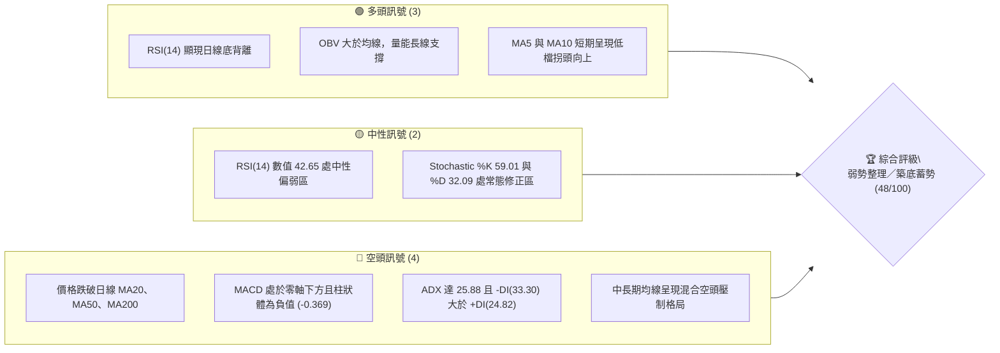
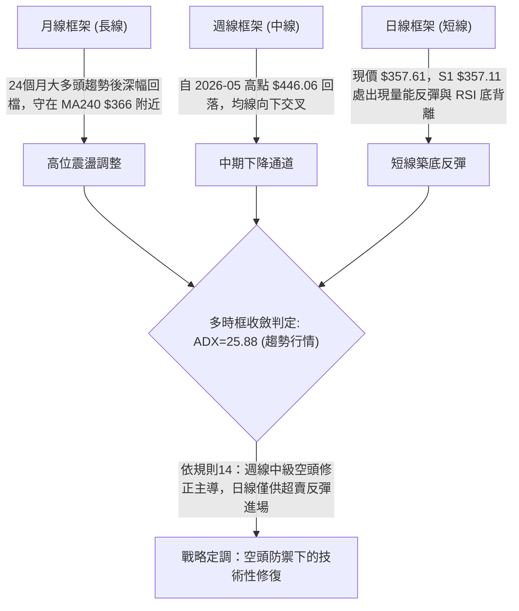
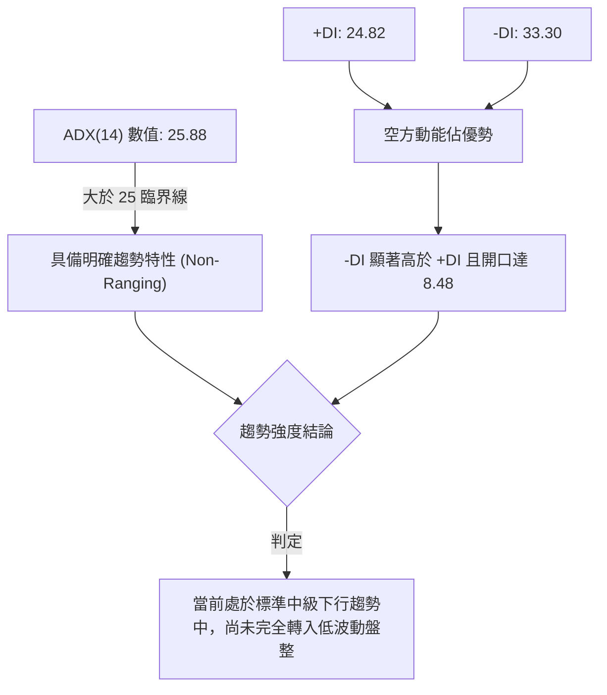
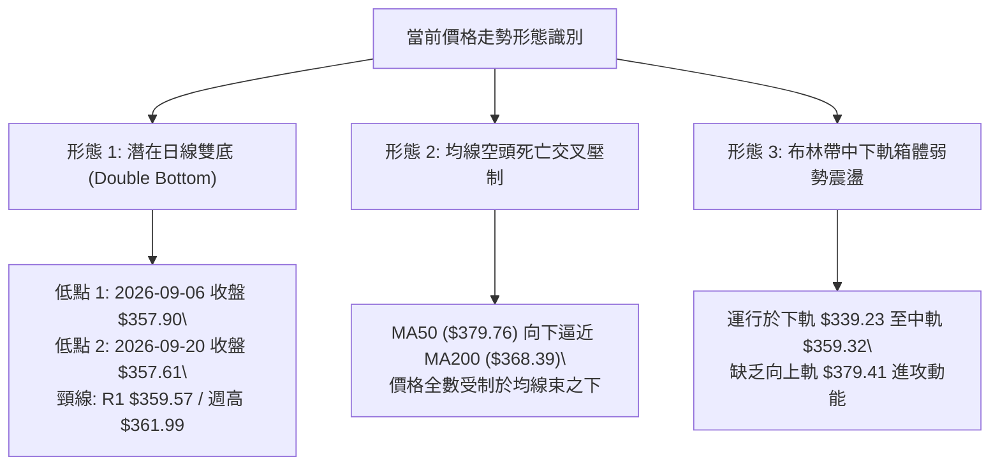
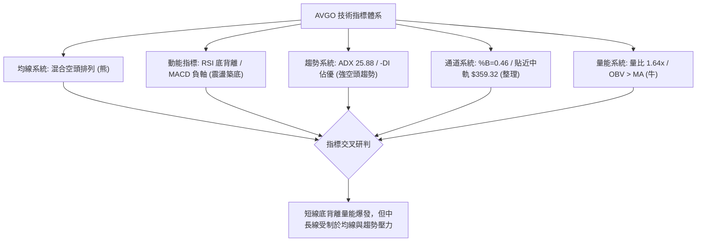
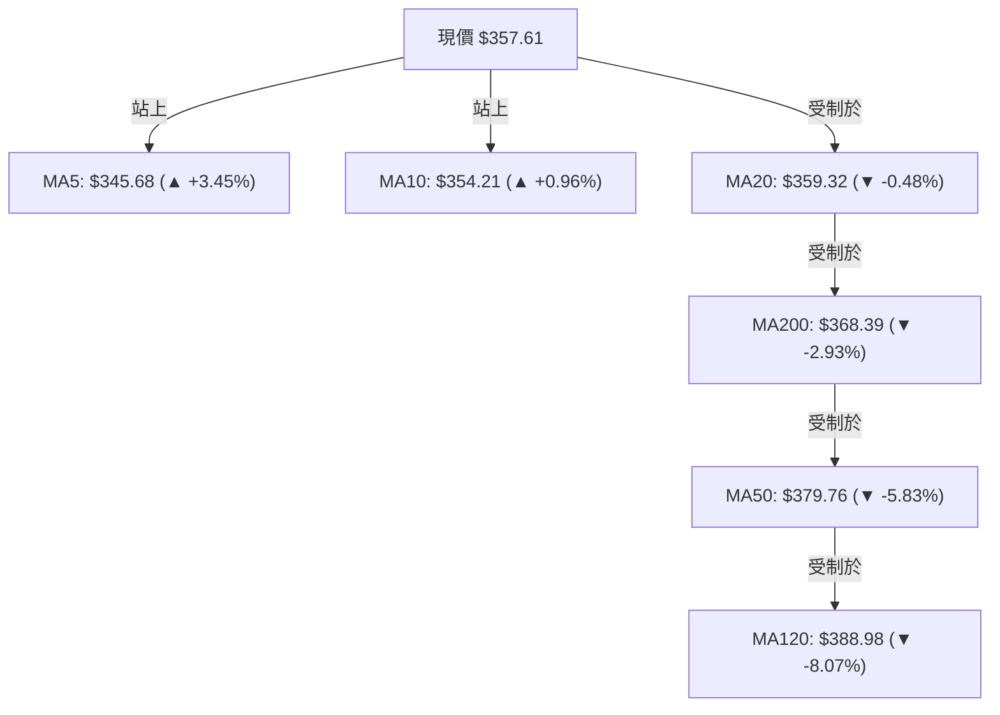
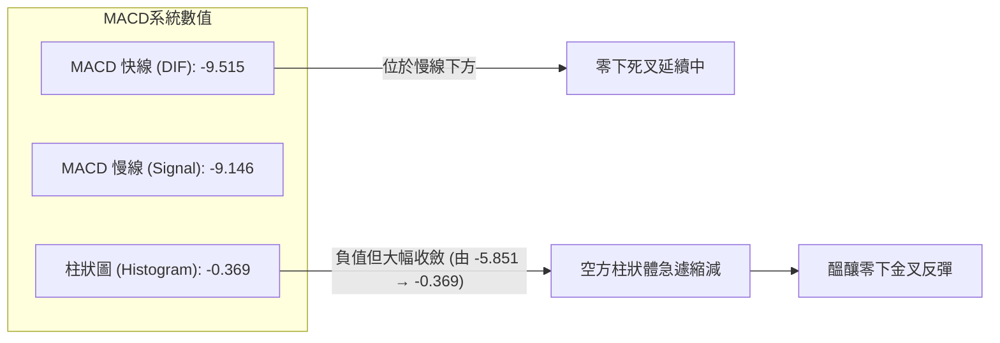
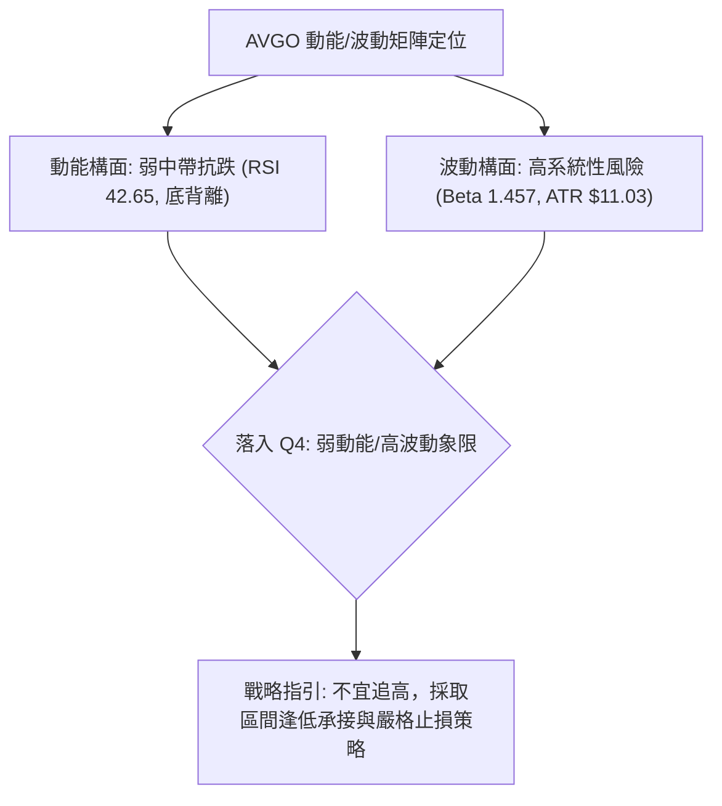
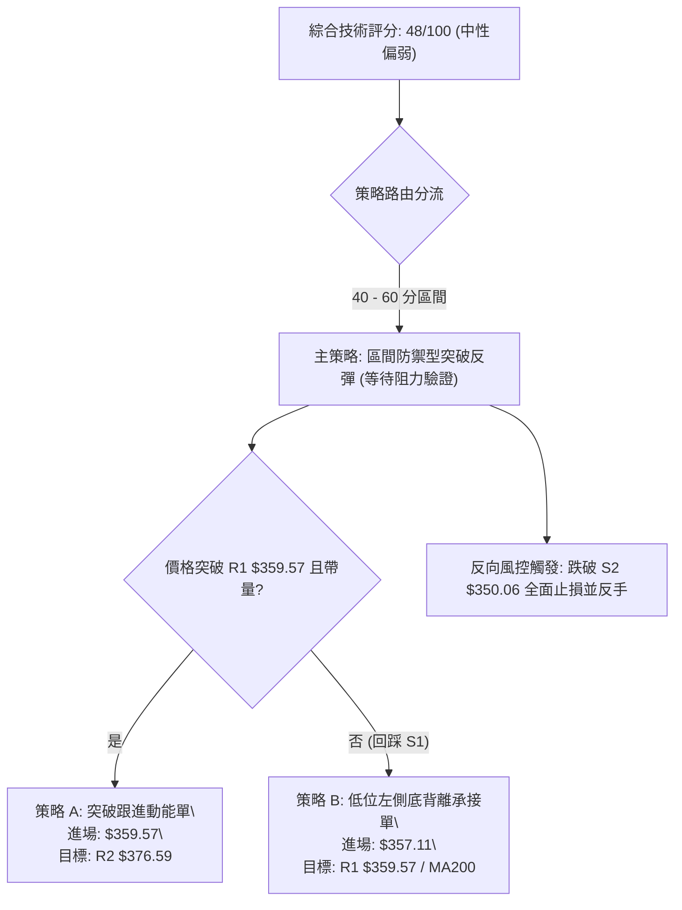
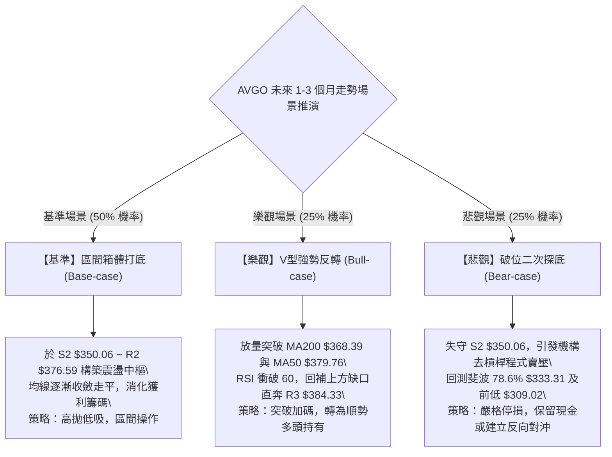

# AVGO 技術分析報告

> **報告日期**：2026-09-21 ｜ **語言**：繁體中文 ｜ **數據來源**：Yahoo Finance ｜ **當前價格**：$357.61

---

## 目錄

| 章節 | 內容 |
|------|------|
| [1. 技術面概覽](#1-技術面概覽) | 訊號儀表板、核心指標、評分卡 |
| [2. 趨勢分析](#2-趨勢分析) | 多時框趨勢、長中短期走勢 |
| [3. 圖表形態分析](#3-圖表形態分析) | 形態識別、K線組合、目標價 |
| [4. 支撐與阻力](#4-支撐與阻力) | 關鍵價位、斐波那契回調 |
| [5. 技術指標深度解讀](#5-技術指標深度解讀) | MA/RSI/MACD/布林/成交量 |
| [6. 動能與波動率](#6-動能與波動率) | 動能評估、ATR、Beta |
| [7. 多時框架總結](#7-多時框架總結) | 時框架評分矩陣 |
| [8. 交易策略建議](#8-交易策略建議) | 多空策略、風險報酬比 |
| [9. 風險提示與監控](#9-風險提示與監控) | 監控指標、風險場景 |

---

## 1. 技術面概覽

### 🎯 技術訊號儀表板



### 📊 核心指標速覽表

| 指標類別 | 指標名稱 | 當前數值 | 訊號 | 解讀 |
|----------|----------|----------|------|------|
| **價格** | 當前收盤價 | $357.61 | 🔴 | 位於52週區間 33.3% 處，跌破多條關鍵均線 |
| **均線** | MA20 | $359.32 | 🔴 | 現價位於 MA20 下方 (-0.48%)，短線面臨動態阻力 |
| **均線** | MA50 | $379.76 | 🔴 | 現價遠低於 MA50 (-5.83%)，中期空頭防線沉重 |
| **均線** | MA200 | $368.39 | 🔴 | 現價跌破年線 MA200 (-2.93%)，長線牛熊分水嶺失守 |
| **動能** | RSI(14) | 42.65 | 🟡 | 脫離 30 之下極度超賣區，日線底背離確立修復行情 |
| **動能** | MACD | -9.515 | 🔴 | 雙線位於零軸之下，柱狀體為 -0.369，空方仍主導動能 |
| **波動** | ATR(14) | $11.03 | 🟡 | 佔股價 3.08%，日均波動適中，提供明確風控區間 |
| **趨勢** | ADX(14) | 25.88 | 🔴 | 跨越 25 臨界值呈現趨勢特徵，-DI(33.30) 壓制 +DI(24.82) |
| **通道** | 布林帶寬 | %B: 0.46 | 🟡 | 位於中軌 $359.32 與下軌 $339.23 之間，中性偏弱 |
| **成交量** | 量比 (Volume Ratio)| 1.64x | 🟢 | 最新量 43.95M 顯著超越 20 日均量 26.83M，低檔承接強勁 |

### 🏆 技術評分卡

```
╔══════════════════════════════════════════════════════════════╗
║              技術評分卡 — AVGO (2026-09-21)                  ║
╠══════════════════════════════════════════════════════════════╣
║ 趨勢強度 (ADX & DMI)  ████████░░░░░░░░░░░░  38/100  🔴 空頭主導 ║
║ 動能指標 (RSI & MACD) ██████████░░░░░░░░░░  48/100  🟡 底背離醞釀║
║ 支撐穩定度 (S1-S3)    ████████████░░░░░░░░  60/100  🟢 低檔有買盤 ║
║ 成交量配合 (OBV & 均量)██████████████░░░░░░  70/100  🟢 異常放量   ║
║ 形態完整度 (通道/打底)██████████░░░░░░░░░░  45/100  🟡 構築箱體   ║
║ 均線系統 (MA 排列)    ██████░░░░░░░░░░░░░░  28/100  🔴 空頭壓制   ║
╠══════════════════════════════════════════════════════════════╣
║ 綜合評分 (量化權重)   █████████░░░░░░░░░░░  48/100  🟡 中性偏空   ║
╚══════════════════════════════════════════════════════════════╝
```

---

## 2. 趨勢分析

### 🌐 多時框趨勢分析



### 📈 長期趨勢 — 12個月走勢圖（Unicode）

```
AVGO 月線走勢圖（2025-10 至 2026-09）
價格軸 ($)
$460 ┤                                  ●(2026-05: 446.06)
$430 ┤                            ●
$400 ┤              ●(2025-11: 400.71)
$370 ┤        ●                             ●       ●
$340 ┤                    ●           ●                 ●(現在: 357.61)
$310 ┤                                
     └────────────────────────────────────────────────────────
      10  11  12  01  02  03  04  05  06  07  08  09 (月份)
      25  25  25  26  26  26  26  26  26  26  26  26 (年份)
```

#### 走勢特徵分析表格

| 階段區間 | 起始價 → 結束價 | 累計漲跌幅 | 主要走勢特徵與結構演變 |
|----------|-----------------|------------|------------------------|
| **主升浪峰值** (2025-10 ~ 2025-11) | $367.57 → $400.71 | +9.02% | 延續 AI 算力與客製化 ASIC 爆發動能，成交量持續放大，創下階段新高。 |
| **首輪回調** (2025-12 ~ 2026-03) | $344.83 → $309.02 | -10.38% | 獲利了結賣壓湧現，連續4個月回踩，於 $309.02 尋獲波段低點支撐。 |
| **次級主升衝刺** (2026-04 ~ 2026-05) | $416.77 → $446.06 | +7.03% | 強勁業績驅動暴力拉升，月線創歷史天價區間，最高觸及 52 週高點 $494.22。 |
| **破位修正期** (2026-06 ~ 2026-09) | $377.75 → $357.61 | -5.33% | 高檔獲利回吐，量能伴隨波動放大，形成連續下行陰線，測試 52 週中下部區間。 |

### 📊 中期趨勢（週線分析）

```
週線級別價格壓力與支撐結構示意圖
$446.06 ══════════════════════════════════════════════ 2026-05-31 週波段最高收盤價 (歷史強壓)
        │
$427.76 ────────────────────────────────────────────── 2026-08-09 反彈高點 (次級防線)
        │ 
$379.76 ---------------------------------------------- 日線 MA50 / BB上軌 $379.41 密集群
        │
$368.39 ·············································· MA200 關鍵牛熊轉換軸心
        │
$357.61 ◄═══════════════[ 當前收盤價 $357.61 ]════════
        │
$350.06 ============================================== S2 核心結構支撐
        │
$339.23 ---------------------------------------------- 布林帶下軌 (週線超賣極限)
        │
$289.50 ══════════════════════════════════════════════ 52週最低價 (底層戰略支撐)
```

從近 20 週數據觀察，AVGO 在 2026-06-07 遭遇巨量拋售（單週 251.14M 股，收盤 $385.12），隨後於 2026-08-09 出現超買反彈（收盤 $427.76，週線 RSI 73.6），但動能迅速衰竭。至 2026-08-30，週線 RSI 暴跌至 23.5 之極度超賣區，近期兩週（09-13 至 09-20）收盤價維持在 $357.61 ~ $361.99，MACD 負柱狀體由 -5.851 快速收斂至 -0.369，顯示中期賣壓已現衰竭跡象。

### ⚡ 趨勢強度評估（ADX 解讀）



#### ADX 與方向指標量化對照表

| 指標名稱 | 實際數值 | 門檻區間 | 趨勢方向解讀 | 戰略指示 |
|----------|----------|----------|--------------|----------|
| **ADX(14)** | **25.88** | > 25.0 | 趨勢行情確立，波動非雜訊震盪 | 順勢操作為主，逆勢交易需嚴格限縮部位 |
| **+DI(14)** | **24.82** | 基準線 | 多頭動能偏弱，低位反彈力道尚待驗證 | 多頭進攻尚未具備趨勢突破條件 |
| **-DI(14)** | **33.30** | 基準線 | 空頭動能主導市場，主動賣盤仍居高 | 任何向上反彈均將面臨解套空方拋壓 |
| **DI差值 (DMI Spread)** | **-8.48** | 負向擴大 | 空方絕對主控市場定價權 | 嚴禁盲目重倉抄底，需等待金叉訊號 |

---

## 3. 圖表形態分析

### 🔍 形態識別系統



#### 幾何圖表形態信心度量化評估表

| 形態識別 | 信心度 | 判斷依據（嚴格引用技術數據） | 完成度 | 目標價（附嚴謹計算式） |
|----------|--------|------------------------------|--------|------------------------|
| **日線微型雙底 (Double Bottom)** | **55%** | 兩次低點分別落於 2026-09-06 收盤價 $357.90 與 2026-09-20 收盤價 $357.61，精確契合 S1 支撐 $357.11 區域。且 2026-09-13 收盤 $361.99 形成局部微型頸線。 | **60%** (尚未有效站上頸線) | 形態高度 = $361.99 - $357.11 = $4.88。<br>突破目標價 = 頸線 $361.99 + $4.88 = **$366.87** (貼近年線 MA240 $366.00)。 |
| **頭肩頂破位延伸 (Head & Shoulders)** | **70%** | 左肩為 2026-04 收盤 $416.77，頭部為 2026-05 收盤 $446.06，右肩為 2026-08-09 反彈高點 $427.76。跌破頸線 $377.75 (2026-06 收盤) 後持續向下測底。 | **85%** (已完成破位，正處回測) | 頸線約 $377.75，頭部 $446.06，垂直高度 $68.31。<br>最小量度跌幅目標 = $377.75 - $68.31 = **$309.44** (高度契合 2026-03 歷史低點 $309.02)。 |
| **中期下降旗形 (Bearish Flag)** | **40%** | 數據中未偵測到標準旗形收斂結構，僅觀察到大陰線後的低檔弱勢黏合，信心度不足 50%。 | **--** | **訊號不足，僅做指標型解讀。** |

### 🕯️ 重要K線形態分析

| 週/月份週期 | 收盤價 | K線形態特徵 | 技術面深度解讀 | 方向訊號 |
|-------------|--------|-------------|----------------|----------|
| **2026-05** | $446.06 | 長上影大陽線 (Blow-off Top) | 月線衝高至 52W 高點 $494.22 遭強力空頭反噬，形成天花板阻力，宣告牛市高潮結束。 | 🔴 強烈見頂 |
| **2026-06** | $377.75 | 實體大陰線 (Bearish Marubozu) | 單月暴跌，成交量伴隨單週 251.14M 爆發性宣洩，多頭防線全面潰敗，失守 $400 整數關卡。 | 🔴 空頭貫穿 |
| **2026-08-09 (週)** | $427.76 | 假突破長假陽線 (Bull Trap) | RSI 衝至 73.6 超買區後急速轉跌，形成次級高點多頭陷阱，確立下行通道上軌。 | 🔴 多頭陷阱 |
| **2026-08-30 (週)** | $368.79 | 恐慌長陰線 (Exhaustion Sell) | RSI 下挫至 23.5 極度超賣區，空頭動能呈現極致釋放，孕育短線動能底背離。 | 🟡 拋售竭盡 |
| **2026-09-20 (週)** | $357.61 | 低檔十字星/長下影錘頭微縮形態 | 連續兩週企穩於 $357 關卡，日成交量激增至 43.95M 股，顯示低位有特定買盤承接。 | 🟢 築底醞釀 |

### 📉 ASCII 走勢形態示意圖

```
AVGO 近期雙底構築與頭肩頂破位頸線示意圖
$446.06 ─────────────────── [頭部: 2026-05]
                             /\
$427.76 ── [左肩: 2026-04]  /  \    [右肩: 2026-08-09]
             /\            /    \          /\
            /  \          /      \        /  \
$377.75 ───/────\────────/────────\──────/────\───── [頭肩頸線突破位]
                 \      /          \    /      \
$368.39 ──────────\────/────────────\──/────────\─── [MA200 牛熊線]
                   \  /              \/          \
$359.57 ────────────\/────────────────────────────▲── [R1 阻力位 / 雙底頸線]
                                                 │
$357.61 ◄════════════════════════════════════════■現價 ($357.61)
$357.11 ────────────────────●────────────────────●── [S1 支撐位 / 雙底低點]
                       (09-06: 357.90)  (09-20: 357.61)
```

### 🎯 形態目標價計算

根據經典技術分析體系中形態高度的量度規則進行嚴密推導：

1. **短線反彈量度目標（微型雙底形態）**：
   - 形態基底（雙底最低點）：引用支撐位 **$357.11**。
   - 形態頸線（微型波段高點）：引用阻力位 **$359.57**（若採週線高點則為 $361.99）。
   - 形態高度（Height）：$H = \$359.57 - \$357.11 = \$2.46$。
   - 理論第一等距反彈目標：$T_1 = \text{頸線} + H = \$359.57 + \$2.46 = \mathbf{\$362.03}$。
   - 理論第二延伸目標（擴展 2.0 倍高度）：$T_2 = \$359.57 + (\$2.46 \times 2) = \mathbf{\$364.49}$。

2. **中長期空頭量度目標（頭肩頂破位形態）**：
   - 頭部最高收盤點：**$446.06**。
   - 頸線轉折基準點：**$377.75**。
   - 下跌垂直落差：$H_{\text{major}} = \$446.06 - \$377.75 = \$68.31$。
   - 理論空頭滿足位：$P_{\text{target}} = \$377.75 - \$68.31 = \mathbf{\$309.44}$（此推算值與 2026-03 歷史低點 **$309.02** 誤差僅 $0.42，具備高度技術幾何共振性）。

---

## 4. 支撐與阻力

### 🗺️ 關鍵價位分布圖（Unicode）

```
AVGO 價位結構分布圖
═══════════════════════════════════════════════════════════════════
$384.33 ║████████████████████████████████║ 強阻力 R3 (近一年波段高點聚類)
$379.76 ║▓▓▓▓▓▓▓▓▓▓▓▓▓▓▓▓▓▓▓▓▓▓▓▓▓▓▓▓    ║ MA50 / BB上軌 ($379.41)
$376.59 ║████████████████████            ║ 阻力 R2 (反彈關鍵承壓區)
$368.39 ║▓▓▓▓▓▓▓▓▓▓▓▓▓▓▓▓▓▓▓▓            ║ MA200 牛熊分水嶺 / 斐波 61.8% ($367.70)
$359.57 ║████████████████████████        ║ 關鍵阻力 R1 / MA20 ($359.32)
$357.61 ╠════════════════════════════════╣ ◄ 現價 ($357.61)
$357.11 ║▓▓▓▓▓▓▓▓▓▓▓▓▓▓▓▓▓▓▓▓▓▓▓▓        ║ 近期支撐 S1 (-0.14%)
$350.06 ║████████████████████████████    ║ 關鍵結構強支撐 S2 (-2.11%)
$342.33 ║████████████████                ║ 波段防禦支撐 S3 (-4.27%)
$339.23 ║▓▓▓▓▓▓▓▓▓▓▓▓▓▓▓▓                ║ 布林通道下軌動態支撐
$333.31 ║████████████████████████████████║ 斐波那契 78.6% 回調關鍵強支撐
═══════════════════════════════════════════════════════════════════
```

### 🚧 阻力位分析表

所有價位均嚴格引用 OHLCV 波段高點聚類計算之數值：

| 阻力級別 | 精確價位 | 距離現價 | 形成原因與技術重合度 | 突破難度 | 重要性權重 |
|----------|----------|----------|----------------------|----------|------------|
| **R1** | **$359.57** | +0.55% | 近一年密集波段高點聚類；與日線 MA20 ($359.32) 及布林帶中軌形成重合共振。 | 🟡 中等 | ★★★☆☆ |
| **R2** | **$376.59** | +5.31% | 中期反彈波段高點聚集區；上方緊貼日線 MA60 ($379.10) 與布林上軌 ($379.41)。 | 🔴 極高 | ★★★★☆ |
| **R3** | **$384.33** | +7.47% | 歷史多頭籌碼套牢平台聚類；靠近日線 MA120 ($388.98) 與斐波那契 50.0% ($391.86)。 | 🔴 堅不可摧 | ★★★★★ |

### 🛡️ 支撐位分析表

所有價位均嚴格引用 OHLCV 波段低點聚類計算之數值：

| 支撐級別 | 精確價位 | 距離現價 | 形成原因與技術重合度 | 守住機率 | 重要性權重 |
|----------|----------|----------|----------------------|----------|------------|
| **S1** | **$357.11** | -0.14% | 當前微型雙底防線；近一年短線低點密集聚類，現價即時依託點。 | 🟡 60% | ★★★☆☆ |
| **S2** | **$350.06** | -2.11% | 中期整數心理關卡下方的重要吸籌區；跌破將引發技術性停損拋壓。 | 🟢 75% | ★★★★☆ |
| **S3** | **$342.33** | -4.27% | 深度回檔極限承接平台；下方緊貼布林通道下軌 ($339.23)。 | 🟢 85% | ★★★★★ |

### 📐 斐波那契回調位分析

依據 52 週完整波動區間（最低點 **$289.50** 至最高點 **$494.22**，絕對落差 $204.72）精確量化黃金分割序列：

```
斐波那契垂直標尺（52W 區間回調）
$494.22 ├── 0.0%  (52W High)
$445.90 ├── 23.6% 
$416.02 ├── 38.2% 
$391.86 ├── 50.0% ── 中軸平衡線
$367.70 ├── 61.8% ── 黃金分割關鍵分水嶺 (上方密集反壓)
   ▲
   │    現價 $357.61 落於 61.8% 與 78.6% 回調區間內 (處於深幅修正帶)
   ▼
$333.31 ├── 78.6% ── 終極回撤支撐線
$289.50 └── 100.0% (52W Low)
```

- **位置判定**：當前收盤價 **$357.61** 處於 61.8% 回調位 ($367.70) 與 78.6% 回調位 ($333.31) 之間的「深幅回撤緩衝區」。
- **技術意義解讀**：
  1. 股價在跌破 61.8% ($367.70) 後，由原先的強勢回檔轉變為弱勢深幅修正。目前 $367.70 與年線 MA200 ($368.39) 產生空間重疊，形成極為強大的技術反壓帶。
  2. 若現價無法在 S1 ($357.11) 與 S2 ($350.06) 企穩，依據斐波那契回撤原理，下方的磁吸目標將指向 78.6% 關鍵支撐位 **$333.31**。

---

## 5. 技術指標深度解讀

### 🎛️ 指標訊號總覽



### 📈 移動平均線排列分析



#### 均線層級數據狀態解析

| 均線名稱 | 當前價位 | 乖離率 (Bias) | 斜率趨勢 | 多空屬性 | 角色解讀 |
|----------|----------|---------------|----------|----------|----------|
| **MA5** | $345.68 | +3.45% | ▲ 快速向上 | 🟢 極短多 | 超跌後的極短線反彈推進線，已穿過現價提供緩衝。 |
| **MA10** | $354.21 | +0.96% | ▲ 勾頭向上 | 🟢 短多 | 形成短線第一道下檔動態支撐，確認短線不再破底。 |
| **MA20** | $359.32 | -0.48% | ▼ 持續走平下壓 | 🔴 短空 | 布林中軌所在，現價緊貼於下方，構成即時壓制。 |
| **MA60** | $379.10 | -5.67% | ▼ 加速下墜 | 🔴 中空 | 與 MA50 ($379.76) 形成雙重下壓空頭夾層。 |
| **MA200**| $368.39 | -2.93% | ▼ 走平下行 | 🔴 長空 | 牛熊分界線失守，形成中期反彈不可逾越之心理障礙。 |
| **MA240**| $366.00 | -2.29% | ▼ 走低下滑 | 🔴 長空 | 兩年長期持倉成本線，亦處於現價上方。 |

**均線格局總評**：整體排列呈現「短均（MA5、MA10）低檔抬頭金叉，但中長均線（MA20、MA50、MA200、MA120）自上而下層層壓制」的**混合排列**格局。短期有反彈動能，但中長線上檔蓋頂，絕非單邊多頭行情。

### 📉 RSI(14) 分析

- **數值進度條**：
  ```
  RSI(14) = 42.65
  [0] ░░░░░░░░░░░░░░░░░░░░░░░░░░░░░░▓▓▓▓▓▓▓▓▓▓▓▓░░░░░░░░░░░░░░░░░░ [100]
      0         30(超賣)           42.65      70(超買)       100
  ```
- **區間評估**：當前數值 42.65，脫離了 2026-08-30 的 23.5 極端超賣區，處於 30~50 的中性偏弱修復區間。
- **背離研判**：
  - **明確判定：日線級別存在底背離 (Bullish Divergence)！**
  - **論證過程**：觀察價格走勢，2026-09-06 收盤價為 $357.90，隨後在 2026-09-20 下探至收盤價 $357.61（價格創出微型新低）；然而 RSI(14) 指標在 2026-09-06 為 29.2，在 2026-09-20 卻大幅抬升至 42.7（指標顯著走高，未創新低）。價格低點下移而動能低點抬高，構成標準的技術指標底背離，發出強烈的下行動能衰竭與技術反抽訊號。

### 📊 MACD(12/26/9) 訊號解讀



- **絕對數值解讀**：DIF (-9.515) 與 Signal (-9.146) 均深度處於零軸下方，說明中期市場定價權完全在空方手中。
- **柱狀體微積分動態**：MACD 柱狀體當前為 -0.369。回溯歷史數據：2026-08-23 為 -5.851，2026-08-30 為 -3.426，2026-09-06 為 -1.394，當前已收斂至 -0.369，顯示空方下砸動能已出現連續 4 週的幾何級數遞減，極短線即將迎來零軸下方的多頭金叉（DIF 向上穿越 Signal）。

### 📦 布林通道分析

```
AVGO 日線布林通道結構示意圖 (Bandwidth = 40.18, %B = 0.46)
$379.41 ══════════════════════════════════════ 上軌 (Upper Band)
        │
        │
$359.32 -------------------------------------- 中軌 (Middle Band / MA20)
        │ ◄── 現價: $357.61 (%B: 0.46，緊貼中軌下方)
        │
$339.23 ══════════════════════════════════════ 下軌 (Lower Band)
```

- **通道寬度**：上軌 $379.41 與下軌 $339.23 間距 $40.18，波動帶處於常態擴張後的橫向整理階段。
- **相對位置 (%B)**：當前 %B 為 **0.46**，代表價格已自下軌 ($339.23) 明顯彈升，並逼近中軌 ($359.32)。
- **通道策略解讀**：當前股價受壓於中軌，若無法帶量站上 $359.32，將回測下半軌道尋求支撐；若放量穿透中軌，則通道上軌 $379.41 將成為首要波動目標，該處與 MA50 ($379.76) 形成完美技術共振。

### 💹 成交量分析（量價配合度）

```
成交量放大情況量化對比
當前成交量: 43,948,400 股
████████████████████████████████████████████ (43.95M)
20日均量:   26,829,525 股
██████████████████████████ (26.83M) - 量比: 1.64x
50日均量:   22,308,246 股
█████████████████████ (22.31M) - 量比: 1.97x
```

- **量價配合判定**：
  1. **低檔放量吸籌**：最新單日成交量高達 43.95M 股，相較 20 日均量放大 **1.64 倍**，相較 50 日均量放大近 **2.0 倍**。在股價逼近近一年低點 $357 附近出現如此巨大的換手量，表明有機構級被動買盤或長線資金入場承接。
  2. **OBV（能量潮）驗證**：數據明確顯示 **「OBV > MA → 量能支撐上漲」**。即便股價在過去數週連續下行，OBV 卻未跌破均線，表明籌碼並未在大跌中全面渙散，呈現典型的量價正向配合與籌碼沉澱特徵。

---

## 6. 動能與波動率

### ⚡ 動能評估

#### 動能與波動象限配置表

| 象限分類 | 動能狀態 (RSI/MACD) | 波動狀態 (ATR/Beta) | AVGO 當前定位 | 戰術意義與操作指引 |
|----------|---------------------|---------------------|---------------|--------------------|
| **第一象限 (Q1)** | 強動能 (Bullish) | 低波動 (Low Vol) | — | 最佳趨勢波段持有期，利潤奔跑。 |
| **第二象限 (Q2)** | 弱動能 (Bearish) | 低波動 (Low Vol) | — | 窄幅盤整待變，無趨勢交易機會。 |
| **第三象限 (Q3)** | 強動能 (Bullish) | 高波動 (High Vol) | — | 主升浪爆發期，需承擔高洗盤風險。 |
| **第四象限 (Q4)** | **弱動能 (反彈醞釀)** | **高波動 (ATR 3.08%, Beta 1.46)** | **✓ (精確定位)** | **下行高波動風險釋放末端，短線反彈伴隨劇烈震盪，防守重於進攻。** |



### 📊 ATR 波動率分析

- **ATR(14) 絕對值**：**$11.03**，佔現價之 **3.08%**。
- **日內安全防護邊界計算**：
  - 日內預期震盪區間：現價 $\pm$ 1.0 $\times$ ATR = **$346.58 ～ $368.64**。
  - 順勢波段止損安全距離建議：設定為 1.5 倍 ATR，即 $\$11.03 \times 1.5 = \mathbf{\$16.55}$。
  - 短線突破追價止損距離建議：設定為 1.0 倍 ATR，即 **$11.03**。
- **波動率含義解讀**：3.08% 的 ATR 比例表明 AVGO 仍屬於中高波動的成長型半導體龍頭。任何在現價 $357.61 建立的多頭部位，若未給予至少 $11.00 以上的容錯空間，極易被日內正常的造市波動清洗出局。

### 📐 Beta 與市場相關性

- **Beta 係數**：**1.457**。
- **市場敏感度評估**：AVGO 對標普 500 指數與費城半導體指數具有高度敏銳度。當標普 500 指數波動 1.0% 時，AVGO 理論預期將反向或同向放大波動 1.457%。高 Beta 特性意味著當前在半導體板塊修正時，其承受的被動型 ETF 贖回賣壓較大；但一旦大盤企穩反彈，其彈性亦將顯著超越整體市場。

---

## 7. 多時框架總結

### 📋 時框架評分表

| 時框架 | 趨勢方向 | 動能狀態 | 均線排列 | 形態特徵 | 綜合評分 | 戰術建議 |
|--------|----------|----------|----------|----------|----------|----------|
| **月線 (長期)** | 🟡 高檔深幅回調 | 🟡 中性回撤 | 🟢 依然在長週期均線上方 | 52W 高點巨幅獲利回吐 | **58/100** | 核心資產逢超跌分批配置 |
| **週線 (中期)** | 🔴 中級下降趨勢 | 🔴 零下弱勢整理 | 🔴 均線死叉空頭壓制 | 頭肩頂破位尋求 $350 支撐 | **38/100** | 嚴禁重倉抄底，順應中空趨勢 |
| **日線 (短期)** | 🟡 低檔區間反彈 | 🟢 RSI 底背離確立 | 🔴 壓制於 MA20 之下 | 構築微型雙底雏形 | **52/100** | 依托 S1/S2 做技術性短線反抽 |

### 🔲 綜合訊號矩陣

```
時框架訊號矩陣共振分析
════════════════════════════════════════════════════════════════
週期維度      趨勢訊號    動能訊號    均線排列    量能配合    共振結論
────────────────────────────────────────────────────────────────
月線 (長期)     🟡 中性     🟡 中性     🟢 偏多     🟢 充沛     多頭回調
週線 (中期)     🔴 偏空     🔴 偏空     🔴 空頭     🔴 分歧     下行波段
日線 (短期)     🟡 震盪     🟢 偏多     🔴 偏空     🟢 爆量     超跌反彈
════════════════════════════════════════════════════════════════
時框衝突：日線動能底背離（多） vs 週線均線死叉（空）
```

### ⚖️ 多時框收斂結論

依據本報告**嚴格要求 14（多時框收斂優先級規則）**進行最終裁決：

1. **行情屬性判定**：當前日線 ADX(14) 讀數為 **25.88**，已超越 25.0 之臨界分水嶺，且 -DI(33.30) 顯著大於 +DI(24.82)，系統嚴格判定當前屬於**趨勢行情**而非純粹無方向的盤整行情。
2. **時框優先權取捨**：根據規則，在趨勢行情（ADX > 25）中，**必須以中長期（週線/MA50、MA200）方向為主要指針，日線僅用來尋找進場時機與短線盈虧比拐點**。
3. **收斂唯一方向**：週線與中長期均線呈現明確的偏空格局，因此戰略主導方向為**「中級空頭趨勢下的弱勢震盪反彈」**。日線的 RSI 底背離與量比放大（1.64x）僅支持**防禦型區間反彈操作**，絕不可視為反轉大牛市全面做多。
4. **最終方向性結論**：**中性觀望偏防守反彈（以區間操作應對，嚴密鎖定上方阻力階梯）**。

---

## 8. 交易策略建議

### 🗺️ 策略決策流程圖



### 🧭 策略路由

> **當前主策略方向 = 中性區間震盪操作／防守型低接反彈（依綜合評分卡 48/100）**
> 
> 由於評分處於 40–60 之中性緩衝帶，市場受困於「日線底背離量能爆發」與「週線均線死叉空頭壓制」的劇烈夾擊中。主策略以布林通道上下軌及 S1~R2 關鍵區間為主要運作邊界，嚴禁追漲殺跌。

### 🎯 價格情境階梯（Price Scenarios）

所有價位均嚴格引用第 4 章波段計算之真實數值：

| 觸發條件 | 下一目標 | 後續延伸 | 技術情境含義 |
|----------|----------|----------|--------------|
| **向上有效突破 R1 ($359.57)** | **R2 ($376.59)** | **R3 ($384.33)** | 短線微型雙底確立，挑戰布林上軌與 MA50 重壓區。 |
| **受制於現價至 R1 之間** | **S1 ($357.11)** | **S2 ($350.06)** | 弱勢低檔箱體震盪，等待成交量進一步沉澱換手。 |
| **向下跌破 S1 ($357.11)** | **S2 ($350.06)** | **S3 ($342.33)** | 底背離失敗，空頭趨勢重啟，回測斐波那契 78.6% ($333.31)。 |

### 📊 情境機率分佈

| 運行情境 | 預估機率 | 核心指標支持依據 |
|----------|----------|------------------|
| **弱勢反彈測試 R1/R2** | **45%** | RSI(14) 呈現明確日線底背離；MACD 柱狀體大幅收斂至 -0.369；單日量比放大至 1.64x，OBV 支撐多頭。 |
| **區間橫向震盪 (S1~R1)** | **35%** | 布林通道 %B 為 0.46；ADX 處於 25.88 轉換期；均線系統短多長空，多空在此交鋒打底。 |
| **破位下行測試 S2/S3** | **20%** | -DI(33.30) 仍大幅壓制 +DI(24.82)；現價仍處於 MA200 牛熊線下方，週線等級空方佔優。 |

### 🟢 主策略詳情（方向依上方路由：中性偏多反抽）

| 策略要素 | 策略 A（右側突破型：追擊反彈） | 策略 B（左側支撐型：低接博弈） |
|----------|--------------------------------|--------------------------------|
| **策略邏輯** | 帶量突破短線密集阻力 R1 與 MA20 | 依託 S1 微型雙底低點，利用 RSI 底背離進場 |
| **進場條件** | 日線收盤價突破 R1 且成交量超越 20 日均量 | 現價回踩支撐位 S1 不破，分批掛單承接 |
| **進場價格** | **$359.57** (精確引用 R1) | **$357.11** (精確引用 S1) |
| **目標價 T1** | **$368.39** (精確引用 MA200 / 斐波 61.8% 附近) | **$359.57** (精確引用 R1) |
| **目標價 T2** | **$376.59** (精確引用 R2) | **$368.39** (精確引用 MA200) |
| **止損價格** | **$355.00** (跌破進場點下方約 1.25% 處) | **$350.06** (精確引用 S2 跌破止損) |
| **風險報酬比** | **1 : 3.72** (承擔 $4.57 風險博取 $17.02 利潤) | **1 : 1.60** (承擔 $7.05 風險博取 $11.28 利潤) |
| **量化成功率** | **55%** | **60%** |
| **建議倉位** | **總資金之 10%** (試探性部位) | **總資金之 15%** (分批布局部位) |

### 🔴 反向風險觸發點（對沖提示）

若出現以下訊號，意味著本報告之區間反彈假設徹底失效，多頭部位必須無條件清倉或反向建立空頭對沖：
- **空頭觸發價位**：收盤價帶量貫穿關鍵結構強支撐 **S2 ($350.06)**。
- **指標共振確認**：日線 MACD 柱狀圖由負縮小再度反轉為「負向擴大」，且 RSI(14) 跌破 35 並未再反彈。
- **對沖應對策略**：若跌破 $350.06，下方量度跌幅將直接指向 S3 ($342.33) 及布林下軌 ($339.23)，終極目標為斐波那契 78.6% 回調位 **$333.31**。

### ⭐ 整體訊號強度評星

```
╔══════════════════════════════════════════════════════════════╗
║ 做多訊號強度：  ★★☆☆☆  (2.5/5 星 — 僅限短線超跌反抽，非波段牛市)
║ 做空訊號強度：  ★★★☆☆  (3.5/5 星 — 中期均線與趨勢仍由空頭主導)  
║ 整體量化可信度：★★★★☆  (4.0/5 星 — 價位高低點聚類與指標底背離高度吻合)
╚══════════════════════════════════════════════════════════════╝
```

---

## 9. 風險提示與監控

### ✅ 關鍵監控指標 Checklist

```
╔══════════════════════════════════════════════════════════════╗
║               交易員每日盤後關鍵監控清單 (Checklist)           ║
╠══════════════════════════════════════════════════════════════╣
║ [ ] 價格是否成功收復並站穩 R1 ($359.57) 及日線 MA20 ($359.32)   ║
║ [ ] 日線成交量是否持續高於 20 日均量 (26.83M 股) 保持買盤活躍   ║
║ [ ] RSI(14) 是否穩健穿越 50 多空分界線，解除弱勢格局          ║
║ [ ] MACD 柱狀體是否在零軸下方完成「黃金交叉」（由負轉正）     ║
║ [ ] -DI(33.30) 是否開始掉頭向下，且與 +DI 差距縮小至 5 以內   ║
║ [ ] 股價是否跌破核心風控止損線 S2 ($350.06)                   ║
║ [ ] 52 週低點回調之 61.8% 分水嶺 ($367.70) 觸碰時的解套賣壓   ║
╚══════════════════════════════════════════════════════════════╝
```

### ⚠️ 風險場景分析



### 🛡️ 風險管理重要提醒

1. **宏觀與板塊 Beta 放大效應**：AVGO 當前 Beta 高達 **1.457**，且本週面臨宏觀半導體供應鏈重估。若大盤指數（如納斯達克 100 指數）出現單日 2% 以上的劇烈調整，AVGO 預期將出現 3%~4% 的下挫，這將輕易擊穿 S1 ($357.11) 防線。因此在未站上 MA200 之前，禁止使用任何形式的金融槓桿。
2. **倉位配置上限限制**：鑑於週線趨勢（-DI 33.30 佔優）依然由空方控盤，整體 AVGO 多頭部位曝險比例**嚴禁超過總投資組合權益之 15%**。
3. **動態跟蹤止損原則**：若採用策略 A 順利於 $359.57 進場且價格向上推進至 MA200 ($368.39)，應立刻將止損點位無條件上移至成本線 ($359.57)，確保該筆交易在最壞情況下實現「零虧損保本出場」，絕不允許帳面盈利轉變為實質虧損。

---

## 📋 報告總結

```
╔════════════════════════════════════════════════════════════════╗
║                  AVGO 技術分析報告總結                          ║
╠════════════════════════════════════════════════════════════════╣
║ 報告日期：2026-09-21                                           ║
║ 當前價格：$357.61                                              ║
║ 分析評級：⚖️ 中性觀望偏防守反彈 (技術評分: 48/100)               ║
║                                                                ║
║ 關鍵維度結論：                                                 ║
║ ├─ 長期趨勢：🟡 月線長牛高位深幅回檔，於兩年線上方尋求沉澱     ║
║ ├─ 中期趨勢：🔴 週線下降通道運行，均線死叉，空方主控 (-DI 33.3)║
║ ├─ 短期趨勢：🟢 日線低檔顯現 RSI 底背離，爆發 1.64x 承接量     ║
║ ├─ 關鍵支撐：S1: $357.11 ｜ S2: $350.06 ｜ S3: $342.33         ║
║ ├─ 關鍵阻力：R1: $359.57 ｜ R2: $376.59 ｜ R3: $384.33         ║
║ └─ 外資共識：強力買進 (47位分析師目標均價 $531.85，基本面背書) ║
║                                                                ║
║ 最優執行策略組合：                                             ║
║ 1. 🥇 最佳機會：等待放量突破 R1 ($359.57) 後進場做短多，目標   ║
║                 直指年線 MA200 ($368.39) 與 R2 ($376.59)。     ║
║ 2. 🥈 次選機會：於 S1 ($357.11) 附近逢低建立試探性左側多單，   ║
║                 跌破 S2 ($350.06) 堅決停損離場。                ║
║ 3. 🥉 保守選擇：完全空倉觀望，直至價格有效站上日線 MA200      ║
║                 ($368.39) 並完成均線糾纏金叉後再行順勢介入。    ║
╚════════════════════════════════════════════════════════════════╝
```

---

> ⚠️ **免責聲明**：本報告為依據量化技術分析模型生成之研究報告，所有支撐阻力數值均基於歷史 OHLCV 價格集群與數學公式推演。本報告**僅供學術研究與機構策略探討**，**不構成任何形式的要約或投資建議**。金融市場具有高度不確定性與本金損失風險，投資人應獨立審慎評估並自負盈虧。

---

*報告生成時間：2026-09-21 ｜ 數據來源：Yahoo Finance ｜ 分析框架：資深多時框量化技術分析系統*