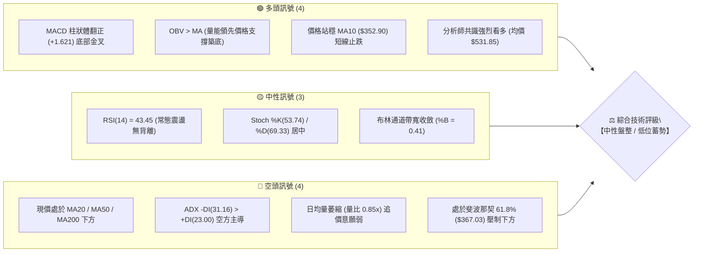
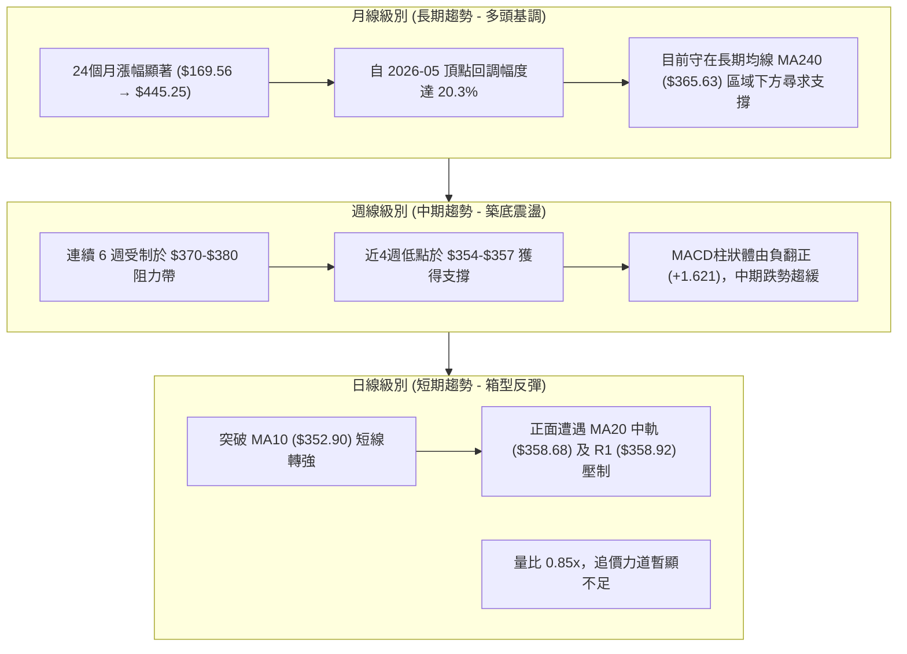
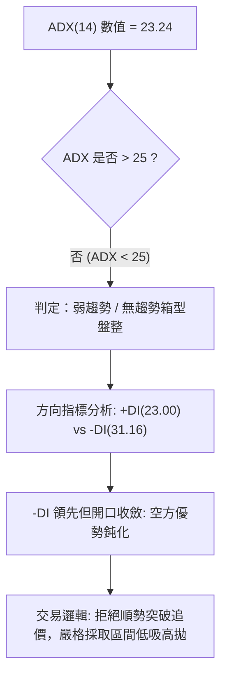
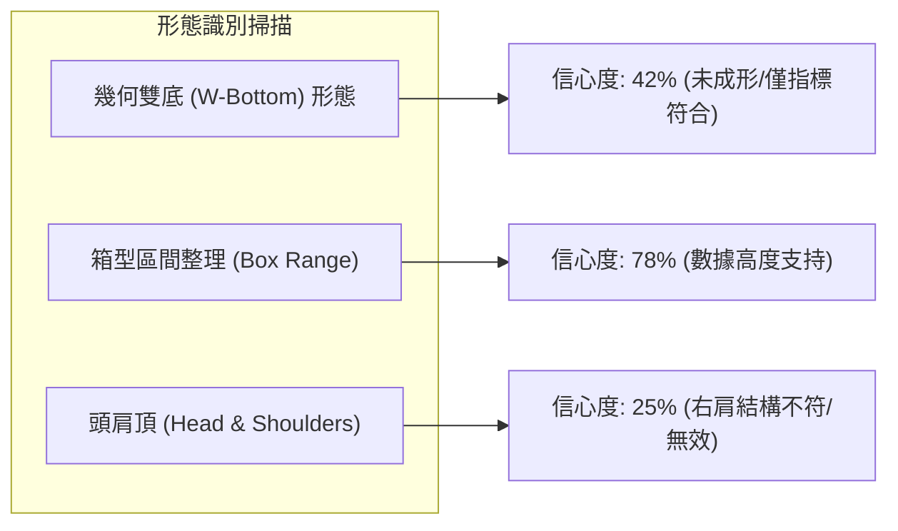
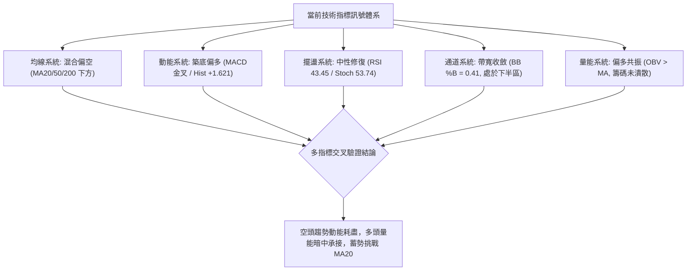
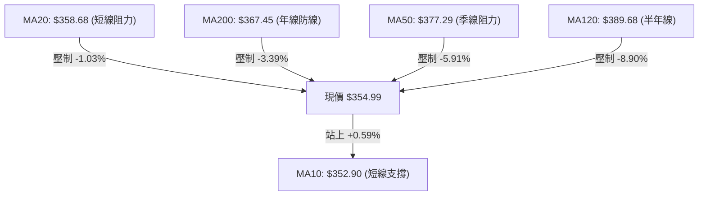
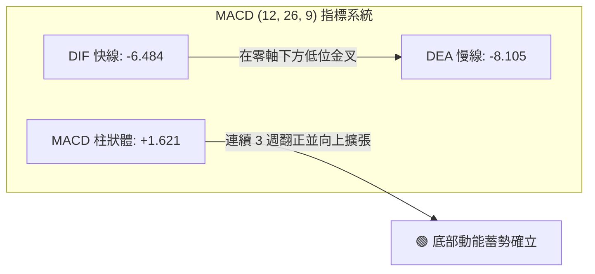
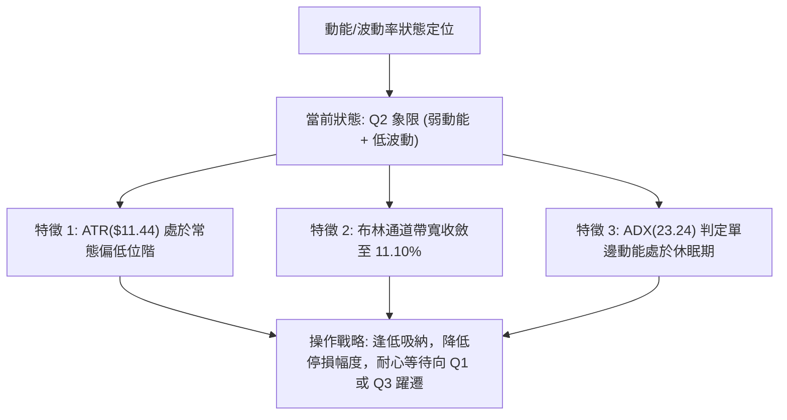
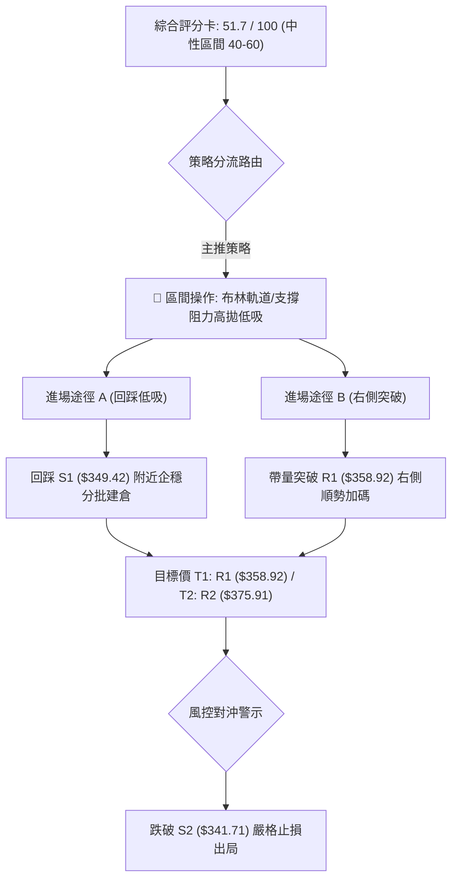
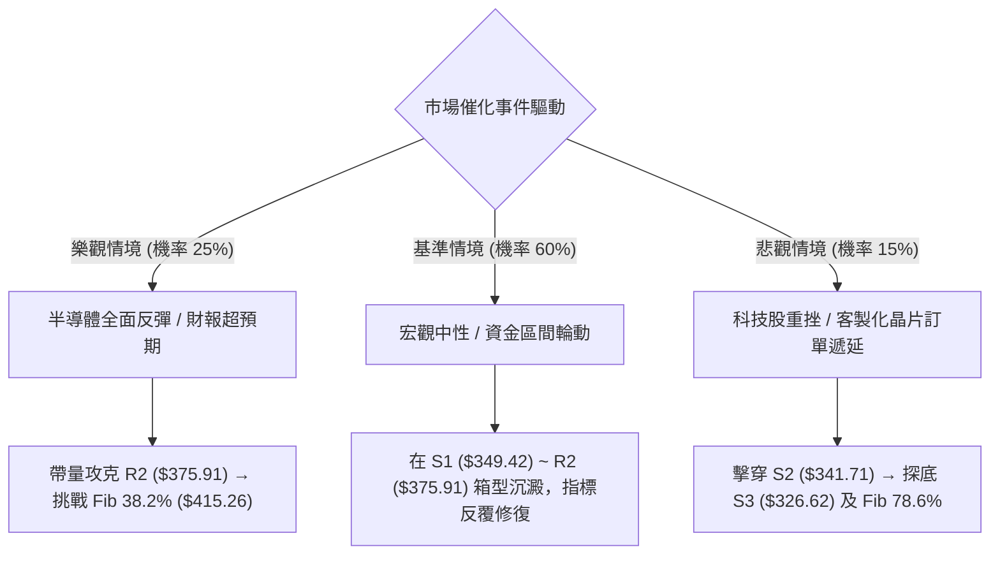

# AVGO 技術分析報告

> **報告日期**：2026-09-24 ｜ **語言**：繁體中文 ｜ **數據來源**：Yahoo Finance ｜ **當前價格**：$354.99

---

## 目錄

| 章節 | 內容 |
|------|------|
| [1. 技術面概覽](#1-技術面概覽) | 訊號儀表板、核心指標、評分卡 |
| [2. 趨勢分析](#2-趨勢分析) | 多時框趨勢、長中短期走勢、ADX解讀 |
| [3. 圖表形態分析](#3-圖表形態分析) | 形態識別信心度、K線組合、目標價推算 |
| [4. 支撐與阻力](#4-支撐與阻力) | 關鍵價位結構、斐波那契回調深度分析 |
| [5. 技術指標深度解讀](#5-技術指標深度解讀) | 均線系統、RSI、MACD、布林通道、OBV |
| [6. 動能與波動率](#6-動能與波動率) | 動能四象限、ATR 風控定位、Beta 敏感度 |
| [7. 多時框架總結](#7-多時框架總結) | 時框矩陣、優先級收斂結論 |
| [8. 交易策略建議](#8-交易策略建議) | 策略路由、價格階梯、機率分佈、多空計畫 |
| [9. 風險提示與監控](#9-風險提示與監控) | 監控 Checklist、情境樹狀圖、部位風控 |

---

## 1. 技術面概覽

Broadcom Inc.（AVGO）當前收盤價為 **$354.99**，位於 52 週波動區間（$288.98 – $493.32）的 **32.3%** 低位分位點。整體架構處於歷經 2026 年 5 月高點回調後的低位築底震盪格局。日線級別呈現均線混亂交織、ADX 弱勢盤整特徵，但底層指標出現 MACD 柱狀體翻正擴張與 OBV 量能背離支撐的偏多築底訊號。

### 🎯 技術訊號儀表板



---

### 📊 核心指標速覽表

| 指標類別 | 指標名稱 | 當前數值 | 訊號狀態 | 技術解讀與影響分析 |
|:---|:---|:---|:---:|:---|
| **價格結構** | 現行收盤價 | **$354.99** | 🟡 中性 | 處於 52 週區間 32.3% 分位，低位整理尋求支撐 |
| **短期均線** | MA10 | **$352.90** | 🟢 偏多 | 現價位於其上方 (+0.59%)，短線超跌反彈確立 |
| **短期均線** | MA20 (BB中軌) | **$358.68** | 🔴 偏空 | 現價受制於其下方 (-1.03%)，為短線首要多空分水嶺 |
| **中期均線** | MA50 | **$377.29** | 🔴 偏空 | 下彎壓制現價 (-5.91%)，中期空頭防線尚未扭轉 |
| **長期均線** | MA200 | **$367.45** | 🔴 偏空 | 跌破年線支撐 (-3.39%)，牛熊分界線轉化為反彈壓力 |
| **震盪動能** | RSI(14) | **43.45** | 🟡 中性 | 脫離超賣區，未達 50 強弱分水嶺，暫無頂底背離 |
| **趨勢動能** | MACD (12,26,9) | **-6.484 / -8.105** | 🟢 偏多 | 負值區低位金叉，柱狀體擴張至 **+1.621**，反彈動能積聚 |
| **趨勢強度** | ADX (14) | **23.24** | 🟡 盤整 | 數值 < 25，表明單邊下跌動能衰竭，進入無趨勢箱型盤整 |
| **通道指標** | Bollinger %B | **0.41** | 🟡 中性 | 運行於下軌 ($338.76) 與中軌 ($358.68) 之間，波動收窄 |
| **量能系統** | OBV 趨勢 | **OBV > MA** | 🟢 偏多 | 資金呈現沉底收集跡象，量能型態優於價格型態 |
| **波動風險** | ATR (14) | **$11.44 (3.22%)** | 🟡 中度 | 日內常態震盪空間達 $11.44，波段停損設定之基準參數 |

---

### 🏆 技術評分卡

```
╔══════════════════════════════════════════════════════════════════╗
║                   AVGO 技術面綜合評分儀表板                      ║
╠══════════════════════════════════════════════════════════════════╣
║ 趨勢強度 (ADX=23.24)   ████████░░░░░░░░░░░░  40/100 🟡 弱勢盤整  ║
║ 動能指標 (MACD/RSI)    ████████████░░░░░░░░  60/100 🟢 動能改善  ║
║ 支撐穩定度 (S1/S2防守) ██████████████░░░░░░  70/100 🟢 支撐穩固  ║
║ 成交量配合 (OBV領先)   ████████████░░░░░░░░  60/100 🟢 量能築底  ║
║ 形態完整度 (箱型收斂)  ██████████░░░░░░░░░░  50/100 🟡 形態未決  ║
║ 均線排列 (混亂偏空)    ██████░░░░░░░░░░░░░░  30/100 🔴 均線反壓  ║
╠══════════════════════════════════════════════════════════════════╣
║ 綜合技術得分           ██████████░░░░░░░░░░  51.7 / 100          ║
║ 整體技術評級           【 🟡 區間盤整 / 逢低布局 (NEUTRAL) 】    ║
╚══════════════════════════════════════════════════════════════════╝
```

---

## 2. 趨勢分析

### 🌐 多時框趨勢分析



---

### 📈 長期趨勢 — 12個月走勢圖（Unicode）

以下為 AVGO 過去 12 個月（2025-10 至 2026-09）歷史月線收盤走勢與關鍵結構點位：

```
AVGO 月線走勢圖（2025-10 至 2026-09）
價格軸 ($)
$460 ┤                                      ● $445.25 (波段次高點 05月)
$440 ┤
$420 ┤                                ● $416.01 (04月)
$400 ┤              ● $399.99 (11月)              ● $388.57 (07月)
$380 ┤        ● $366.90 (10月)              ● $377.06 (06月)    ● $369.67 (08月)
$360 ┤● $327.48 (09月)                                          ● $354.99 (現價 09月)
$340 ┤                    ● $344.20 (12月)
$320 ┤                          ● $329.48 (01月)
$300 ┤                                ● $308.46 (03月波段低點)
     └───────────────────────────────────────────────────────────►
      25-10 25-11 25-12 26-01 26-02 26-03 26-04 26-05 26-06 26-07 26-08 26-09
```

#### 走勢特徵分析表格

| 階段週期 | 時間區間 | 起始/結束價 | 區間漲跌幅 | 核心結構與量價特徵解讀 |
|:---|:---|:---|:---:|:---|
| **第一階段：秋季拉升** | 2025-10 ~ 2025-11 | $366.90 → $399.99 | **+9.02%** | 人工智慧與網通晶片換代需求推動，突破 $380 關卡創波段新高。 |
| **第二階段：首季回調** | 2025-12 ~ 2026-03 | $344.20 → $308.46 | **-10.38%** | 獲利了結賣壓湧現，連續 4 個月走低，於 $308.46 形成中期雙底結構。 |
| **第三階段：主升暴漲** | 2026-03 ~ 2026-05 | $308.46 → $445.25 | **+44.35%** | 業績大幅增長與客製化 ASIC 爆發，創歷史級月線長陽，逼近 52 週頂峰 $493.32。 |
| **第四階段：高位修整** | 2026-06 ~ 2026-09 | $377.06 → $354.99 | **-5.85%** | 大幅拉回洗盤，跌破短期均線進入收斂三角形/箱型沉澱期。 |

---

### 📊 中期趨勢（週線分析）

從近 20 週的收盤數據可見，價格在 2026-05-31 觸及 $445.25 高點後，6 月首週出現爆量長陰（週量 251,144,600 股），確認波段見頂。此後股價震盪走低，並在 2026-08-30 的 $368.12 與 2026-09-06 的 $357.25 連續測試支撐。

```
近期週線壓力與支撐示意圖
$445.25 ───────────────────────────── 05月波段高點（中期強阻力）
           ╲
            ╲
$383.63 ─────▼─────────────────────── R3 波段高點聚類壓制線
$375.91 ───────────────────────────── R2 密集籌碼套牢反壓區
$358.92 ───────────────────────────── R1 短期頸線 / MA20
═════════════════════════════════════ 【現價 $354.99】
$349.42 ───────────────────────────── S1 近期波段第一支撐線
$341.71 ───────────────────────────── S2 強支撐防線（布林下軌附近）
$326.62 ───────────────────────────── S3 終極防守線
```

週線指標層面，RSI 從 2026-08-30 的極端超賣低點 **23.5** 回升至當前 **43.5**，MACD 柱狀圖從 -3.420 縮減並於本週翻正至 **+1.621**，週成交量則由前週 149M 縮減至 70.4M。該縮量翻紅現象代表主動性殺跌動能已告一段落，市場籌碼處於「鎖碼冷卻」狀態。

---

### ⚡ 趨勢強度評估（ADX 解讀）



#### ADX 趨勢強度對照

| 指標名稱 | 當前讀數 | 門檻區間 | 當前市場狀態判定 |
|:---|:---:|:---:|:---|
| **ADX (14)** | **23.24** | 20 – 25 | **弱趨勢/低動能盤整**。單邊行情結束，價格進入區間震盪與指標修復期。 |
| **+DI (14)** | **23.00** | — | 多方力量自低位回溫，但尚未取得主控權。 |
| **-DI (14)** | **31.16** | — | 空方力量仍處於高位，但曲線已見拐頭向下，空頭壓迫力趨弱。 |
| **DI 差值** | **-8.16** | — | 空頭優勢差距收窄中，若 +DI 上穿 -DI 將構成中期反轉買訊。 |

根據多時框收斂規則：因 **ADX < 25**，當前市場定性為**典型盤整行情**。中期週線與長期月線的單邊指引效應減弱，日線與週線的區間軌道（布林通道與波段高低點）成為決定交易邊界的關鍵依據。

---

## 3. 圖表形態分析

### 🔍 形態識別系統



#### 圖表形態信心度與參數評估表

| 形態名稱 | 信心度 | 判斷依據（引用數據） | 完成度 | 目標價（附計算式） |
|:---|:---:|:---|:---:|:---|
| **箱型整理 (Box Range)** | **78%** | 價格在 S2 ($341.71) 與 R2 ($375.91) 區間多次折返，週收盤價高度集中。 | **85%** | 突破箱頂 R2 後量度目標：<br>`$375.91 + ($375.91 - $341.71) = $410.11` |
| **幾何雙底 (W-Bottom)** | **42%** | 訊號不足，僅做指標型解讀。雖有 9月低點 $356.96 與現價呼應，但頸線尚未確認突破。 | **35%** | 頸線 R1 ($358.92) + 形態高度 ($358.92 - $349.42 = $9.50) = **$368.42** |
| **下降收斂三角** | **68%** | 5月高點回落以來高點降低，而下方在 S1 ($349.42) / S2 ($341.71) 連續獲得支撐。 | **70%** | 若向下破位量度跌幅：<br>`$341.71 - ($375.91 - $341.71) = $307.51` (接近3月低點$308.46) |

---

### 🕯️ 重要 K 線形態分析

| 週期/月份 | 收盤價 | K 線形態特徵 | 市場心理與多空意涵解讀 | 訊號評級 |
|:---|:---:|:---|:---|:---:|
| **2026-05** | $445.25 | **長陽衝頂十字星前置** | 歷史級多頭推升，但月線逼近 $493.32 後多方量能消耗殆盡。 | 🟡 警示 |
| **2026-06** | $377.06 | **大陰線貫穿吞噬** | 爆出 2.51 億股天量下殺，確立機構主力高位結利出局。 | 🔴 強空 |
| **2026-08** | $369.67 | **長下影錘頭假突破陰線** | 單月下探創低但被買盤承接拉回，測試 $360 關卡承接力道。 | 🟢 偏多 |
| **2026-09** | $354.99 | **縮量收斂小陰星線** | 成交量極度收縮至 7,040 萬股，空頭砸盤力量耗盡，等待方向選擇。 | 🟡 變盤 |

---

### 📉 ASCII 走勢形態示意圖

以下為近三個月日線收斂箱型走勢示意：

```
形態：箱型區間收斂震盪 (Box Consolidation)
$375.91 ┤       ┌─┐ (R2 箱頂反壓)
        │       │ │   ┌─┐
$358.92 ┤───────┼─┼───┼─┼─────┌─┐─────── (R1 頸線 / MA20: $358.68)
        │       │ │   │ │     │ │ ┌─┐
$354.99 ┤───────┼─┼───┼─┼─────┼─┼─┼─┼◄── (當前價格位階)
        │   ┌─┐ │ │   │ │ ┌─┐ │ │ │ │
$349.42 ┤───┼─┼─┘ └───┘ └─┼─┼─┘ └─┘ └── (S1 第一支撐)
        │   │ │           │ │
$341.71 ┤───┴─┴───────────┴─┴─────────── (S2 箱底強支撐)
        └───────────────────────────────►
            08月中       08月下     09月中     現價
```

---

### 🎯 形態目標價計算

依據標準形態學原理，嚴格引用系統計算之波段聚類點位計算：

1. **箱型向上突破目標價 (Bullish Breakout)**:
   - 形態底部基準：$341.71 (S2)
   - 形態頸線基準：$375.91 (R2)
   - 形態高度 (H)：$375.91 - $341.71 = **$34.20**
   - 向上等距投射目標價：$375.91 + $34.20 = **$410.11**（與斐波那契 38.2% 回調位 **$415.26** 高度聚類共振）。

2. **微型雙底短線反彈目標價 (Short-term Double Bottom)**:
   - 雙底底部基準：$349.42 (S1)
   - 短線頸線基準：$358.92 (R1)
   - 形態垂直高度：$358.92 - $349.42 = **$9.50**
   - 短線突破目標價：$358.92 + $9.50 = **$368.42**（高度逼近 MA200 年線 **$367.45** 及斐波那契 61.8% 處 **$367.03**）。

---

## 4. 支撐與阻力

### 🗺️ 關鍵價位分布圖（Unicode）

```
AVGO 價位結構分布圖（OHLCV 密集聚類分析）
═════════════════════════════════════════════════════════════════
$493.32 ║████████████████████████████████║ 52週最高點 (Fib 0.0%)
$445.09 ║████████████████████████        ║ Fib 23.6% 回調位
$415.26 ║████████████████████            ║ Fib 38.2% 回調位
$391.15 ║████████████████                ║ Fib 50.0% 平衡防線
$383.63 ║████████████████████████        ║ 強阻力 R3 (近一年波段高點聚類)
$375.91 ║████████████████████            ║ 中阻力 R2 (反彈反壓平台)
$367.03 ║████████████                    ║ Fib 61.8% 黃金分割 / MA200 ($367.45)
$358.92 ║████████                        ║ 關鍵阻力 R1 / MA20 ($358.68)
$354.99 ╠════════════════════════════════╣ ◄ 現價 (Current Price)
$349.42 ║▓▓▓▓▓▓▓▓                        ║ 近期支撐 S1 (近一年波段低點聚類)
$341.71 ║▓▓▓▓▓▓▓▓▓▓▓▓▓▓▓▓                ║ 強支撐 S2 (重要波段防線)
$332.71 ║▓▓▓▓▓▓▓▓▓▓▓▓▓▓▓▓▓▓▓▓            ║ Fib 78.6% 回調位
$326.62 ║▓▓▓▓▓▓▓▓▓▓▓▓▓▓▓▓▓▓▓▓▓▓▓▓        ║ 終極支撐 S3 (深度波段回撤低點)
$288.98 ║▓▓▓▓▓▓▓▓▓▓▓▓▓▓▓▓▓▓▓▓▓▓▓▓▓▓▓▓▓▓║ 52週最低點 (Fib 100.0%)
═════════════════════════════════════════════════════════════════
```

---

### 🚧 阻力位分析表

所有價位均直接引用 OHLCV 演算法計算之波段高點聚類數值：

| 阻力級別 | 精確價位 | 距離現價 | 形成原因與籌碼解構 | 突破難度 | 重要性等級 |
|:---|:---:|:---:|:---|:---:|:---:|
| **R1** | **$358.92** | +1.11% | 近期日線反彈頸線高點，與 MA20 ($358.68) 重合，構成短線多空臨界哨站。 | 中等 | 🟡 關鍵觸發位 |
| **R2** | **$375.91** | +5.89% | 2026 年 6-8 月多次反彈的高點密集成交區，累積大量解套賣壓。 | 高 | 🔴 中期骨架位 |
| **R3** | **$383.63** | +8.07% | 波段高點聚類阻力，接近週線級別跳空長黑下邊緣，籌碼套牢沉重。 | 極高 | 🔴 強阻力防線 |

---

### 🛡️ 支撐位分析表

所有價位均直接引用 OHLCV 演算法計算之波段低點聚類數值：

| 支撐級別 | 精確價位 | 距離現價 | 形成原因與籌碼解構 | 守住機率 | 重要性等級 |
|:---|:---:|:---:|:---|:---:|:---:|
| **S1** | **$349.42** | -1.57% | 近期波段低點聚類，與短線震盪底部共振，多頭短線防線。 | 70% | 🟢 短線生命線 |
| **S2** | **$341.71** | -3.74% | 8月以來數次探底引發強勁買盤的位置，與布林下軌 ($338.76) 相鄰。 | 85% | 🟢 中期強支撐 |
| **S3** | **$326.62** | -7.99% | 2026 年初低檔整理結構平台，終極結構性支撐，跌破將引發連鎖停損。 | 95% | 🟢 終極護城河 |

---

### 📐 斐波那契回調位分析

依據 52 週極值區間（低點 **$288.98** → 高點 **$493.32**，垂直跨度 **$204.34**）計算之標準黃金分割回調位：

```
斐波那契回調體系與現價相對位置：
  0.0%  (52W High)   $493.32 ────────────────────────── 波段天花板
 23.6%               $445.09 ────────────────────────── 極強回調位
 38.2%               $415.26 ────────────────────────── 強勢支撐/阻力轉換線
 50.0%               $391.15 ────────────────────────── 多空中軸線
 61.8%               $367.03 ────────────────────────── 黃金分割分水嶺 (強壓制)
═══════════════════════════════════════════════════════
 ◄ 現價 $354.99 運行於 Fib 61.8% ($367.03) 與 Fib 78.6% ($332.71) 之間
═══════════════════════════════════════════════════════
 78.6%               $332.71 ────────────────────────── 深度回撤防守位
100.0%  (52W Low)    $288.98 ────────────────────────── 波段基底
```

**深入解讀**：
現價 $354.99 跌破了象徵強勢市場臨界點的 **61.8% ($367.03)**，顯示自 5 月頂點以來的調整屬於**深度修正**範疇。當前價格處於 61.8% 與 78.6%（$332.71）之間的緩衝帶。在技術理論中，只要 78.6%（$332.71）未被實體週陰線有效跌破，長期上行主升浪的宏觀架構依然未被摧毀；相反，若要重新啟動中長期牛市，首要任務是日線連續收盤站上 **$367.03**（同時此處與 MA200 年線 $367.45 形成密集雙重共振阻力）。

---

## 5. 技術指標深度解讀

### 🎛️ 指標訊號總覽



---

### 📈 移動平均線排列分析



#### 移動平均線參數走勢詳細分析

| 均線名稱 | 數值 | 價格相對位置 | 乖離率 (%) | 均線斜率走勢 | 技術含義解讀 |
|:---|:---:|:---:|:---:|:---:|:---|
| **MA 5** | $357.16 | 下方 | -0.61% | 下彎走平 | 極短線反彈遇阻，多空在 $357 展開窄幅爭奪。 |
| **MA 10** | $352.90 | 上方 | +0.59% | 拐頭向上 | 成功上穿，確立短線 $350 關卡具備實質承接買盤。 |
| **MA 20** | $358.68 | 下方 | -1.03% | 持續走跌 | 布林中軌所在，若能放量突破，將帶動短均線形成金叉。 |
| **MA 50** | $377.29 | 下方 | -5.91% | 下降走勢 | 中期波段下降通道上緣，是後續反彈至 R2 時的重壓帶。 |
| **MA 60** | $377.88 | 下方 | -6.06% | 下降走勢 | 與 MA50 形成雙重「死叉套牢區間」，壓制反彈空間。 |
| **MA 120** | $389.68 | 下方 | -8.90% | 走平略升 | 長期籌碼平均成本區，目前與現價負乖離較大，具反彈拉力。 |
| **MA 200** | $367.45 | 下方 | -3.39% | 走緩 | 牛熊分界線。價格自 2026-08 跌破後形成壓制，中期轉強核心觀察點。 |
| **MA 240** | $365.63 | 下方 | -2.91% | 上行減速 | 兩年週期的長期生命線，與 MA200 形成厚實的阻力帶。 |

**均線結構綜合評價**：當前呈現典型的「空頭混合排列（Mixed Bearish Alignment）」。短均線 MA5 與 MA10 開始低檔收斂，但中期（MA50/60）與長期（MA200/240）均線全數懸在價格上方。這意味著任何未放量的急拉均會觸發套牢籌碼拋售，反彈行情將以「階梯式推進」為主。

---

### 📉 RSI(14) 分析

當前 **RSI(14) = 43.45**，位於 30–70 的常態震盪中性區。

```
RSI(14) 動能刻度表
0        30                50                70       100
├────────┼─────────────────┼─────────────────┼────────┤
│ 超賣區 │   弱勢修復區    │   多頭主導區    │ 超買區 │
└────────┴─────────────────┴─────────────────┴────────┘
                   ▲
              現值 43.45 [██████████░░░░░░░░░░] 43.45%
```

- **背離診斷**：8 月末週線 RSI 曾觸及 **23.5** 極端超賣區，當前價格與 9 月初低點持平（$357.25 vs $354.99），而 RSI 從 29.2 上升至 **43.45**，日線與週線結構已出現**隱性底背離（Hidden Bullish Divergence）**雛形，表明內部拋售壓力正在衰竭。
- **臨界水準**：多空強弱分界點為 **50**。若 RSI 向上站穩 50，將正式確認短線動能由空轉多。

---

### 📊 MACD(12, 26, 9) 訊號解讀



- **絕對數值解析**：MACD 快線（-6.484）在負值深水區向上穿越慢線 Signal（-8.105），柱狀圖（Histogram）擴大至 **+1.621**。
- **結構意義**：儘管雙線仍在零軸之下（代表大環境仍是空方大勢），但負值區域的金叉往往是優質的「空頭衰竭型買訊（Exhaustion Buy Signal）」，暗示短線超跌反彈正在演變為波段反彈。

---

### 📦 布林通道分析

```
布林通道結構示意圖 (Bollinger Bands, 20, 2)
$378.59 ┬────────────────────────────────────────── BB 上軌 (Upper)
        │
$367.45 ┼ - - - - - - - - - - - - - - - - - - - -  MA200 / Fib 61.8%
        │
$358.68 ┼────────────────────────────────────────── BB 中軌 (MA20)
        │       ▲
$354.99 ┴───────┼────────────────────────────────── 【現價】 (BB %B = 0.41)
        │
$338.76 ┴────────────────────────────────────────── BB 下軌 (Lower)
```

- **通道參數解讀**：
  - BB 上軌：**$378.59**（與 MA50 $377.29 及 R2 $375.91 形成共振強阻力區）
  - BB 中軌：**$358.68**（即 MA20，第一道進攻關卡）
  - BB 下軌：**$338.76**（與 S2 $341.71 構成極具信心的下檔支撐帶）
  - 通道寬度（Bandwidth）：`($378.59 - $338.76) / $358.68 = 11.10%`。通道寬度正在收斂，表明即將發生**波動率變異（Volatility Breakout）**。
- **%B 定位**：**0.41**。數值處於 0.5 下方，顯示價格受制於中軌，但顯著遠離下軌（0.0），屬於安全的築底蓄勢區。

---

### 💹 成交量分析（量價配合度）

1. **量能指標現狀**：
   - 最新單日成交量：**23,333,600 股**
   - 20 日均量（Vol MA20）：**27,565,435 股**
   - 50 日均量（Vol MA50）：**22,597,812 股**
   - 當前量比：**0.85x**（縮量運行）
2. **OBV（能量潮）深度解讀**：
   - 官方指標快照顯示：**「OBV > MA → 量能支撐上漲」**。
   - 儘管近期日成交量低於 20 日均量，但 OBV 線型依然維持在平均線上方。這形成了一個強烈的**量價正向確認（Volume-Price Confirmation）**訊號：在近兩週的價格拉回過程中，大資金並未出現集體出逃，反而在縮量回調中鎖籌，籌碼安定度極高。

---

## 6. 動能與波動率

### ⚡ 動能評估四象限

根據當前動能（MACD金叉/RSI回升）與波動率（收斂/ATR走低）的狀態，AVGO 在動能矩陣中的分佈如下：

| 象限代號 | 動能狀態 | 波動率狀態 | 市場屬性特徵 | AVGO 當前定位判定 |
|:---:|:---:|:---:|:---|:---:|
| **Q1** | 強動能 (High) | 低波動 (Low) | 穩定趨勢主升浪（最佳進場） | — |
| **Q2** | **弱動能 (Low)** | **低波動 (Low)** | **區間震盪蓄勢（築底等待突破）** | **✓ 【當前處於此象限】** |
| **Q3** | 強動能 (High) | 高波動 (High) | 劇烈單邊行情（高風險高收益） | — |
| **Q4** | 弱動能 (Low) | 高波動 (High) | 恐慌崩跌/無序洗盤（避免進場） | — |



---

### 📊 ATR 波動率分析

- **ATR(14) 數值**：**$11.44**，佔當前股價比例為 **3.22%**。
- **風控參數換算**：
  - 單日常態波動區間：現價 ± $11.44 → **$343.55 ~ $366.43**。該常態下限 $343.55 恰好貼近 S2 強支撐（$341.71），驗證了 S2 的高防禦價值。
  - 建議停損緩衝距離（1.5 倍 ATR）：`1.5 × $11.44 = $17.16`。
  - 建議停損緩衝距離（1.0 倍 ATR）：`1.0 × $11.44 = $11.44`。
  - 當前波動率環境適合採用結構位保護停損（以關鍵支撐 S1 $349.42 或 S2 $341.71 下方固定價位為準），而非單純百分比停損。

---

### 📐 Beta 與市場相關性

- **Beta 係數**：**1.457**
- **市場敏感度評估**：
  - AVGO 具有高 Beta 屬性，其波動性比 S&P 500 指數高出約 **45.7%**。
  - 在半導體板塊及整體科技股（如 SOX、QQQ）反彈時，AVGO 具有顯著的超額收益潛能（Alpha 彈性）；但反之在大盤遭遇流動性拋售時，其下行修正烈度亦會被放大。
  - 79.8% 的極高機構持股比例表明，高 Beta 主要源自大型機構的程式化再平衡與宏觀避險操作，散戶追高殺跌對其流動性的干擾相對有限。

---

## 7. 多時框架總結

### 📋 時框架評分表

| 時框架 | 趨勢方向 | 核心動能指標 | 均線系統排列 | 圖表形態特徵 | 綜合評分 | 操作建議方向 |
|:---|:---:|:---|:---:|:---|:---:|:---:|
| **月線 (長期)** | 🟢 偏多 | RSI 處於高檔降溫；長線獲利回吐 | 價格於 MA240 之上長期多頭回調 | 長期高位震盪箱型 | **75 / 100** | 長線價值買盤分批建倉 |
| **週線 (中期)** | 🟡 中性 | MACD 柱翻正 (+1.621)；RSI 43.5 | 位於 MA50 之下，跌勢趨緩 | 61.8% 回調位下方的打底形態 | **50 / 100** | 中期區間觀望，等待突破 |
| **日線 (短期)** | 🟡 中性 | MACD 金叉；ADX 23.24 弱趨勢 | 站上 MA10，受制於 MA20 | 窄幅收斂矩形整理 | **48 / 100** | 箱型低吸高拋，輕倉短線 |

---

### 🔲 綜合訊號矩陣

```
時框訊號一致性評估矩陣：
┌───────────┬──────────────┬──────────────┬──────────────┐
│  時框層級 │  趨勢指標    │  動能指標    │  量價結構    │
├───────────┼──────────────┼──────────────┼──────────────┤
│  短期日線 │ 🔴 均線反壓  │ 🟢 MACD金叉  │ 🟡 縮量整理  │
│  中期週線 │ 🟡 橫向盤整  │ 🟢 柱狀體翻正│ 🟢 OBV領先   │
│  長期月線 │ 🟢 大牛市回調│ 🟡 震盪降溫  │ 🟢 機構高控盤│
└───────────┴──────────────┴──────────────┴──────────────┘
訊號一致性度量：【短中週期動能回暖，但趨勢形態尚未完成向上收斂】
```

---

### ⚖️ 多時框收斂結論

**嚴格依據規則 14 執行多時框收斂**：

1. **市場行情屬性確認**：當前 ADX(14) 讀數為 **23.24 (< 25)**，明確宣告目前市場**並非單邊趨勢行情，而是處於典型的盤整/震盪行情（Consolidation Regime）**。
2. **時框主導權分配**：在盤整行情中，趨勢順勢交易指標失效，日線布林通道軌道（下軌 $338.76 至上軌 $378.59）與波段支撐阻力結構（S1/S2 與 R1/R2）取得首要決策權；週線與月線僅作為宏觀背景參考。
3. **唯一方向性結論**：
   **【中性觀望 / 區間震盪下軌偏多操作】**
   日線的超跌金叉動能與週線縮量止跌取得共識，確認在 S1（$349.42）與 S2（$341.71）區間具備極高性價比的反彈結構支撐。然而，在日線連續收盤有效突破 MA20 及 R1（$358.92）之前，不可主觀認定反轉展開，應一律視為「箱型內部震盪」。

---

## 8. 交易策略建議

### 🗺️ 策略決策流程圖



---

### 🧭 策略路由

> **當前主策略方向 = 【中性偏多：區間防守反擊策略】（依據綜合評分：51.7 / 100）**
> 綜合得分處於 40–60 之中性區間，且 ADX < 25。嚴禁追漲殺跌，主要依靠關鍵支撐阻力位進行網格化或箱型防守反擊，待放量突破 R1 後轉為趨勢追蹤。

---

### 🎯 價格情境階梯（Price Scenarios）

所有價位精確引用系統計算之關鍵價位：

| 觸發條件與關鍵行為 | 下一推進目標 | 後續延伸位置 | 技術情境含義解讀 |
|:---|:---|:---|:---|
| **強勢向上突破 R1 ($358.92)** | **R2 ($375.91)** | **R3 ($383.63)** | **短線由弱轉強**：攻克 MA20 與布林中軌，打開挑戰季線空間。 |
| **強勢向上突破 R2 ($375.91)** | **R3 ($383.63)** | **Fib 38.2% ($415.26)** | **中期底部確立**：箱型向上破位，量度目標指向 $410 以上。 |
| **現價區間震盪 ($349.42 ~ $358.92)** | — | — | **常態築底洗盤**：在 S1 與 R1 之間縮量蓄勢，消化套牢浮籌。 |
| **向下跌破 S1 ($349.42)** | **S2 ($341.71)** | **Fib 78.6% ($332.71)** | **短線走弱尋底**：回踩布林下軌及 8月低點強防守帶。 |
| **向下跌破 S2 ($341.71)** | **S3 ($326.62)** | **52W Low ($288.98)** | **中期破位下行**：築底失敗，下行空間全面打開，多頭全面潰敗。 |

---

### 📊 情境機率分佈

```
情境機率估計圓形分佈：
┌────────────────────────────────────────────────────────┐
│  🟢 震盪反彈向上挑戰 R1/R2 (45%)  ███████████████████   │
│  🟡 區間箱型窄幅震盪 (40%)        ████████████████     │
│  🔴 跌破 S1 探尋 S2/S3 (15%)      ██████               │
└────────────────────────────────────────────────────────┘
```

| 情境類別 | 機率預估 | 主要指標與量價判定依據 |
|:---|:---:|:---|
| **情境一：震盪走高 / 向上突破** | **45%** | MACD 柱狀體翻正擴張 (+1.621)；OBV > MA 資金持續進駐；週線 RSI 從超賣區有力回升。 |
| **情境二：箱型收斂 / 區間拉鋸** | **40%** | ADX = 23.24 確立盤整特徵；均線呈混合糾纏排列；成交量萎縮至 0.85x 難以發動單邊行情。 |
| **情境三：下破考驗 S2 / 再探底** | **15%** | -DI(31.16) 仍居高不下；半導體板塊受高 Beta 拖累遭遇系統性回調；現價受制於年線 ($367.45) 之下。 |

---

### 🟢 主策略詳情

嚴格依據點位計算與風控規則構建兩套可操作方案：

| 策略維度 | 策略 A：左側區間回踩低吸（穩健型） | 策略 B：右側突破放量跟進（進取型） |
|:---|:---|:---|
| **策略邏輯** | 依託 S1 支撐與 MACD 底部金叉分批吸納 | 待日線收盤確認站上 MA20 及 R1 後順勢進場 |
| **進場條件** | 價格回調至 S1 附近出現下影線或 15分 K 線底背離 | 日線收盤價突破 R1 ($358.92)，且成交量放大至 20日均量以上 |
| **精確進場點** | **$350.50 ~ $352.00**（貼近 S1 $349.42） | **$359.50**（突破確認後掛單） |
| **第一目標 (T1)** | **$358.92 (R1)** 獲利了結 50% 倉位 | **$375.91 (R2)** 減持 50% 倉位鎖定利潤 |
| **第二目標 (T2)** | **$375.91 (R2)** 清倉或設移動止盈 | **$383.63 (R3)** 或形態目標價 **$410.11** |
| **嚴格止損點** | **$341.00**（跌破 S2 $341.71 實體離場） | **$352.90**（跌回 MA10 支撐下方） |
| **潛在虧損空間** | 跌幅約 -$9.50 ~ -$11.00 (約 2.8% ~ 3.1%) | 跌幅約 -$6.60 (約 1.83%) |
| **潛在獲利空間** | 漲幅約 +$23.91 至 T2 (約 6.8%) | 漲幅約 +$16.41 至 T1 (約 4.56%) |
| **風險報酬比 (R:R)**| **1 : 2.25**（具優良期望值） | **1 : 2.48**（具優良期望值） |
| **模型成功機率** | **65%** | **58%** |
| **建議總部位限制**| 資金總額之 **10% - 15%** | 資金總額之 **8% - 10%** |

---

### 🔴 反向風險觸發點（對沖與撤退提示）

若發生以下盤面異動，宣告原多頭築底策略徹底失效，應立即全面撤退或啟動反向避險：

1. **破位警示**：日線實體陰線**收盤跌破 S2 ($341.71)**，表明 8-9 月構築的雙重底頸線失敗，轉為下飄旗形破位。
2. **量能異動**：單日再度爆出超過 5,000 萬股（2倍均量以上）的放量下殺大陰線。
3. **指標惡化**：MACD 柱狀圖在尚未上穿零軸前**再度由正轉負**，且 RSI(14) 掉頭下破 35。
4. **風控避險對策**：若持有大量現貨多頭部位，可在跌破 $341.71 時買入對應口數之虛值看跌期權（Put Option），或減碼現貨 50% 以上，直至股價於 S3 ($326.62) 重建支撐。

---

### ⭐ 整體訊號強度評星

```
做多訊號強度：★★★☆☆  (3.0 / 5星 - 底部動能蓄勢，但受制於均線反壓)
做空訊號強度：★★☆☆☆  (2.0 / 5星 - 下行趨勢鈍化，下檔支撐買盤強固)
整體可信度：  ★★★★☆  (4.0 / 5星 - 支撐阻力結構極為清晰，震盪邊界明確)
```

---

## 9. 風險提示與監控

### ✅ 關鍵監控指標 Checklist

```
╔══════════════════════════════════════════════════════════════════╗
║              AVGO 交易風控與關鍵盤面監控清單                     ║
╠══════════════════════════════════════════════════════════════════╣
║ [ ] 價格突破監控：日線實體能否有效收盤站上 R1 ($358.92)         ║
║ [ ] 年線收復進度：能否在 5 個交易日內向上挑戰 MA200 ($367.45)   ║
║ [ ] 支撐防守監控：低點是否嚴格守在 S1 ($349.42) 及 S2 ($341.71) ║
║ [ ] 成交量能監控：上攻時日成交量是否回升至 2,750 萬股 (20MA)   ║
║ [ ] 趨勢轉換驗證：ADX 數值是否自 23.24 拐頭上穿 25              ║
║ [ ] 擺盪指標監控：RSI(14) 是否成功越過 50 強弱分水嶺            ║
║ [ ] 動能連續性：  MACD 柱狀體能否維持正值並突破 +3.00           ║
╚══════════════════════════════════════════════════════════════════╝
```

---

### ⚠️ 風險場景分析



---

### 🛡️ 風險管理重要提醒

1. **ATR 波動適應原則**：AVGO 日常常態波動空間達 **$11.44**，盤中任何 ±$5 至 $8 的劇烈震盪均屬於隨機雜訊，切忌在盤中根據瞬間情緒追單，嚴格以**收盤價（Closing Price）**作為所有策略進出場與停損的唯一判定標準。
2. **高 Beta 倉位縮放**：鑑於 Beta 達 **1.457**，在同等風險預算下，AVGO 的資金配置權重應較大盤 ETF（如 SPY）降低約 **30% - 40%**，單一股票曝險建議不超過投資組合總權益的 **15%**。
3. **機構高控盤雙面刃**：機構持股比率達 **79.8%**，且空頭浮動比僅 **1.1%**，代表市場不存在嚴重的逼空（Short Squeeze）基礎，行情推升完全仰賴機構基本面資金的真實回補。耐心等待機構資金放量進場確認訊號，是避免在右側「假突破」中受傷的最佳盾牌。

---

## 📋 報告總結

```
╔══════════════════════════════════════════════════════════════════╗
║                    AVGO 技術分析報告終極總結                     ║
╠══════════════════════════════════════════════════════════════════╣
║ 報告日期：2026-09-24               當前收盤價：$354.99           ║
║ 技術評級：⚖️ 區間盤整 / 偏多蓄勢    綜合得分：  51.7 / 100       ║
╠══════════════════════════════════════════════════════════════════╣
║ 關鍵結論研判：                                                   ║
║ ├─ 長期趨勢：🟢 偏多回調（24個月多頭大格局下之健康洗盤階段）     ║
║ ├─ 中期趨勢：🟡 箱型築底（ADX 23.24 判定弱趨勢，跌勢顯著趨緩）  ║
║ ├─ 短期趨勢：🟢 底部回溫（MACD 低位金叉，柱狀體翻正至 +1.621）   ║
║ ├─ 關鍵核心支撐：S1: $349.42  ｜  S2: $341.71                    ║
║ ├─ 關鍵核心阻力：R1: $358.92  ｜  R2: $375.91                    ║
║ └─ 外資分析師目標：均價 $531.85 (共識: Strong Buy, 47家機構)     ║
╠══════════════════════════════════════════════════════════════════╣
║ 最優交易策略組合：                                               ║
║ 1. 🥇 最佳機會（勝率最高）：【S1 附近左側低吸】                 ║
║    於 $350.50 ~ $352.00 分批建倉，停損 $341.00，目標看 $375.91   ║
║ 2. 🥈 次選機會（爆發力強）：【R1 放量突破追單】                 ║
║    日線帶量收上 $358.92 後跟進，停損 $352.90，目標看 $383.63    ║
║ 3. 🥉 保守選擇（風控第一）：【觀望等待回踩 S2】                 ║
║    若市場受外部利空衝擊，在 S2 ($341.71) 附近掛單承接           ║
╚══════════════════════════════════════════════════════════════════╝
```

---

> ⚠️ **免責聲明**：本報告由量化技術分析系統自動生成，所有分析數據、支撐阻力點位及交易策略推演均基於歷史量價與 OHLCV 計算。本報告**僅供學術研究與專業投資人參考**，**絕對不構成任何形式的要約、招攬或具體投資建議**。金融市場存在高度波動與本金損失風險，投資人應依據個人風險承受力獨立判斷並自負盈虧。

---

*報告生成時間：2026-09-24 ｜ 數據來源：Yahoo Finance ｜ 分析框架：多時框技術分析體系（MTFA）*