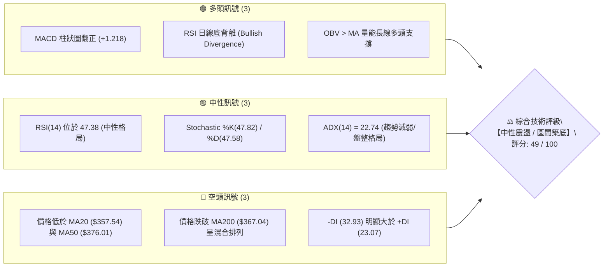
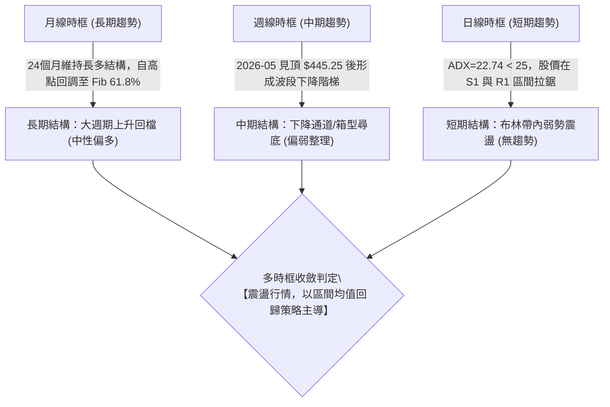
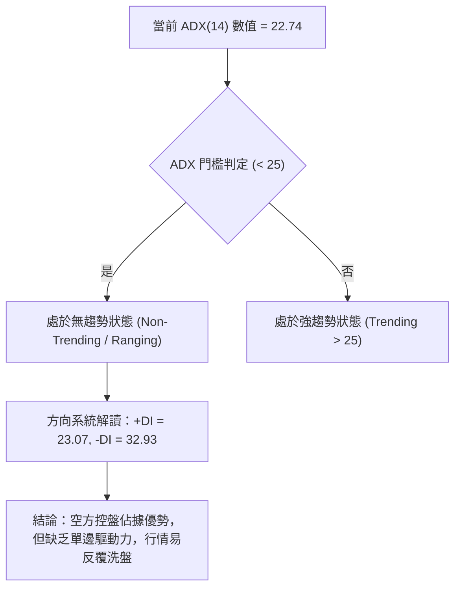
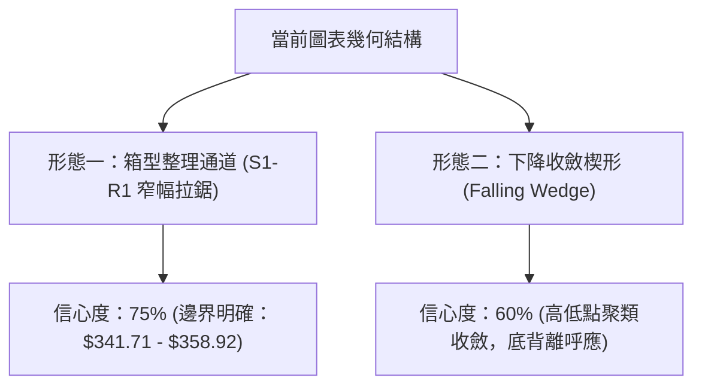
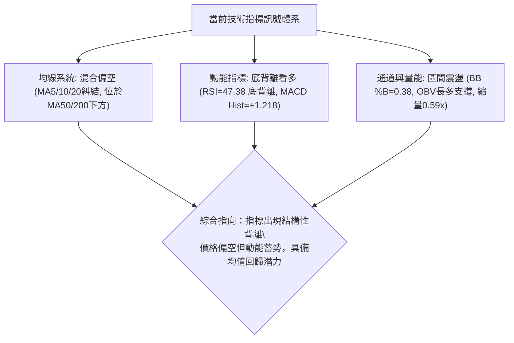
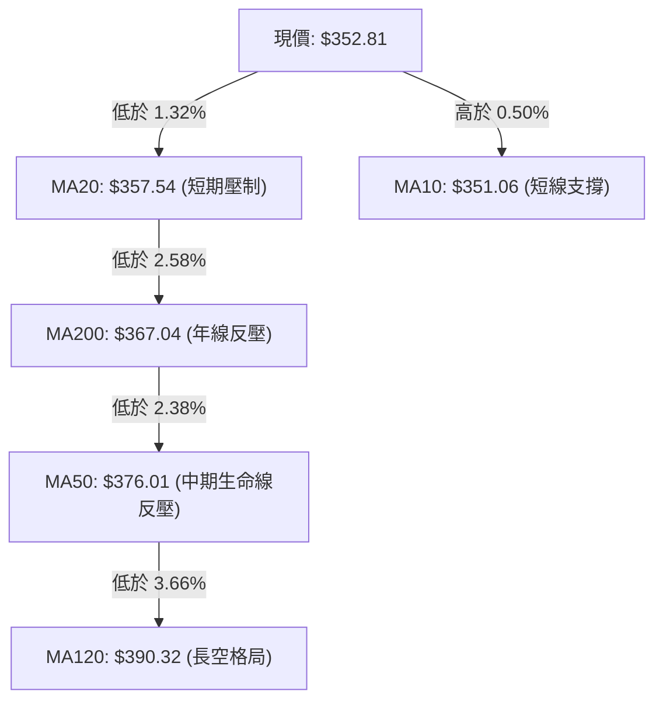
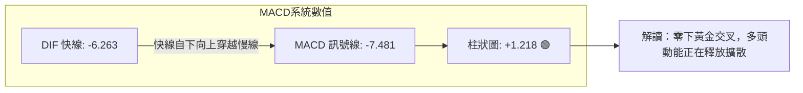
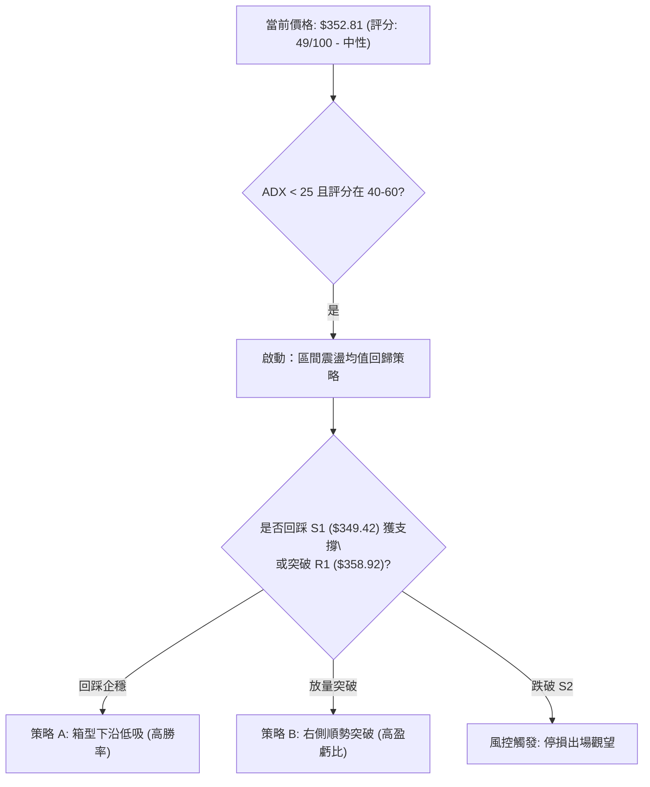
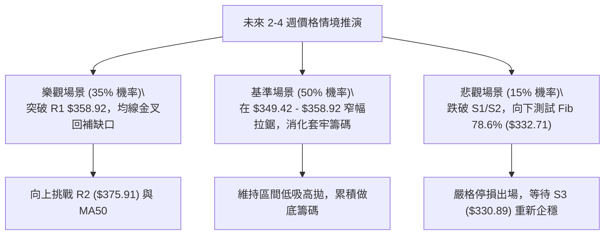

# AVGO 技術分析報告

> **報告日期**：2026-09-26 ｜ **語言**：繁體中文 ｜ **數據來源**：Yahoo Finance ｜ **當前價格**：$352.81

---

## 目錄

| 章節 | 內容 |
|------|------|
| [1. 技術面概覽](#1-技術面概覽) | 訊號儀表板、核心指標、評分卡 |
| [2. 趨勢分析](#2-趨勢分析) | 多時框趨勢、長中短期走勢、12個月走勢圖 |
| [3. 圖表形態分析](#3-圖表形態分析) | 形態識別、K線組合、形態信心度與目標價 |
| [4. 支撐與阻力](#4-支撐與阻力) | 關鍵價位聚類、斐波那契回調結構 |
| [5. 技術指標深度解讀](#5-技術指標深度解讀) | 均線系統、RSI背離、MACD、布林通道、OBV |
| [6. 動能與波動率](#6-動能與波動率) | 動能四象限、ATR波動度、Beta係數解讀 |
| [7. 多時框架總結](#7-多時框架總結) | 時框架評分矩陣、收斂判斷規則 |
| [8. 交易策略建議](#8-交易策略建議) | 策略路由、價格情境階梯、主策略與風控 |
| [9. 風險提示與監控](#9-風險提示與監控) | 監控清單、情境模擬、倉位管理準則 |

---

## 1. 技術面概覽

### 🎯 技術訊號儀表板



---

### 📊 核心指標速覽表

| 指標類別 | 指標名稱 | 當前數值 | 訊號 | 專業解讀 |
| :--- | :--- | :--- | :---: | :--- |
| **價格結構** | 現價 (Current Close) | **$352.81** | 🟡 | 位於52週區間 31.2% 分位，自高點回檔顯著但尚未跌破年內深層低點 |
| **短期均線** | MA20 (月線) | **$357.54** | 🔴 | 股價位於 MA20 下方 (-1.32%)，短期反彈面臨第一道動態均線反壓 |
| **中期均線** | MA50 (季線) | **$376.01** | 🔴 | 股價位於 MA50 下方 (-6.17%)，中期空頭排列壓力仍存 |
| **長期均線** | MA200 (年線) | **$367.04** | 🔴 | 股價跌破年線支撐 (-3.88%)，均線呈現短期與長期纏繞之混合排列 |
| **震盪動能** | RSI(14) | **47.38** | 🟢 | 處於40–50中性偏弱區，但出現標準**底背離**結構，預示跌勢收斂 |
| **趨勢動能** | MACD (12,26,9) | **-6.263 / -7.481** | 🟢 | 快慢線雖在零軸之下，但 Histogram 為 **+1.218**，呈現黃金交叉柱狀擴張 |
| **隨機指標** | KD (%K / %D) | **47.82 / 47.58** | 🟡 | 位於中軸附近平行發展，多空力量暫時達成弱勢平衡 |
| **通道指標** | 布林通道 %B | **0.38** | 🟡 | 位於中軌 ($357.54) 與下軌 ($338.08) 之間，尚未進入極端超賣區 |
| **趨勢強度** | ADX (14) | **22.74** | 🟡 | ADX < 25，表明單邊趨勢衰竭，市場正式進入無趨勢的寬幅箱型震盪 |
| **方向指標** | Directional (+/-DI) | **23.07 / 32.93** | 🔴 | -DI > +DI，空方力量占優，但二者差值正在逐漸縮窄 |
| **波動風險** | ATR (14) | **$10.14** | 🟡 | 波動率佔股價 2.87%，單日波動幅度適中，提供明確止損錨定基準 |
| **成交量能** | 量比 (Volume Ratio) | **0.59x** | 🟡 | 成交量 1,622 萬股低於 20 日均量 (2,740 萬)，呈現典型的量縮築底整理 |

---

### 🏆 技術評分卡

```
╔══════════════════════════════════════════════════════════════════╗
║              技術評分卡 — AVGO (2026-09-26)                     ║
╠══════════════════════════════════════════════════════════════════╣
║ 趨勢強度 (Trend)       ███████░░░░░░░░░░░░░  35/100 🔴 弱勢震盪  ║
║ 動能指標 (Momentum)    ███████████░░░░░░░░░  55/100 🟢 底背離增溫║
║ 支撐穩定度 (Support)   █████████████░░░░░░░  65/100 🟢 關鍵位護盤║
║ 成交量配合 (Volume)    ██████████░░░░░░░░░░  50/100 🟡 量縮觀望  ║
║ 形態完整度 (Pattern)   ██████████░░░░░░░░░░  50/100 🟡 箱型整理  ║
║ 均線排列 (MA System)   ███████░░░░░░░░░░░░░  38/100 🔴 混合偏空  ║
╠══════════════════════════════════════════════════════════════════╣
║ 綜合技術評分           ██████████░░░░░░░░░░  49/100 🟡 中性震盪  ║
╚══════════════════════════════════════════════════════════════════╝
```

---

## 2. 趨勢分析

### 🌐 多時框趨勢分析



---

### 📈 長期趨勢 — 12個月走勢圖（Unicode）

以下為 AVGO 過去 12 個月（2025-10 至 2026-09）之月線收盤價格走勢圖：

```
AVGO 月線走勢圖（過去12個月：2025-10 至 2026-09）
價格軸 ($)
$450 ┤                                        ● $445.25 (2026-05 次高)
$420 ┤                                  ● $416.01
$400 ┤            ● $399.99
$380 ┤                                                ● $388.57
$360 ┤      ● $366.90                                     ● $369.67
$350 ┤                                                        ● $352.81 (現在)
$340 ┤                  ● $344.20
$320 ┤                        ● $329.48   ● $317.80
$300 ┤                                          ● $308.46 (波段低點)
     └──────┬─────┬─────┬─────┬─────┬─────┬─────┬─────┬─────┬─────┬─────┬─────
          10月  11月  12月  01月  02月  03月  04月  05月  06月  07月  08月  09月
          2025  2025  2025  2026  2026  2026  2026  2026  2026  2026  2026  2026
```

#### 走勢特徵分析表格

| 階段區間 | 時間週期 | 收盤價變化 | 漲跌幅 | 走勢特徵與技術意義 |
| :--- | :--- | :--- | :---: | :--- |
| **第一階段：高檔震盪** | 2025-10 → 2025-11 | $366.90 → $399.99 | +9.02% | 延續強勢上攻，挑戰整數大關 $400.00，動能放緩 |
| **第二階段：中期回撤** | 2025-12 → 2026-03 | $344.20 → $308.46 | -10.38% | 構築波段下行浪，於 2026-03 探底 $308.46 形成中期黃金支撐底 |
| **第三階段：主升衝頂** | 2026-03 → 2026-05 | $308.46 → $445.25 | +44.35% | 爆發性買盤湧入，推升月線收盤衝至 $445.25（盤中創 52W 高點 $493.32） |
| **第四階段：大幅回吐** | 2026-05 → 2026-06 | $445.25 → $377.06 | -15.31% | 高檔獲利了結賣壓沉重，長黑K回踩，週成交量暴增至 2.51 億股 |
| **第五階段：弱勢築底** | 2026-07 → 2026-09 | $388.57 → $352.81 | -9.20% | 波動率逐步收斂，成交量顯著萎縮，現價落於 $352.81 進入多空拉鋸 |

---

### 📊 中期趨勢（週線分析）

從近 20 週收盤走勢觀察，自 2026-08-09 週線衝高至 $426.98（RSI 達 73.6 過熱）後，行情連續 7 週震盪回落，最低於 2026-09-06 見 $357.25，隨後收盤價格鎖定在 $352.81–$361.33 的狹幅區間。

```
週線走勢與均線支撐壓力架構
═══════════════════════════════════════════════════════════════════
$383.63 ─────────────────────────────────────────── [R3 波段強阻力]
$375.91 ─────────────▲───────────────────────────── [R2 / MA50 阻力]
$358.92 ───────────▲─┼─▲─────────────────────────── [R1 / MA20 阻力]
$352.81 ───────────●─┼─●─── 現價 ($352.81)
$349.42 ───────────▼─┼─▼─────────────────────────── [S1 近期第一道支撐]
$341.71 ─────────────────────────────────────────── [S2 波段密集支撐]
$330.89 ─────────────────────────────────────────── [S3 Fib 78.6% 強支撐]
═══════════════════════════════════════════════════════════════════
```

---

### ⚡ 趨勢強度評估（ADX 解讀）



#### ADX 強度對照表

| 指標名稱 | 當前數值 | 門檻區間 | 趨勢性質 | 專業交易指引 |
| :--- | :---: | :---: | :---: | :--- |
| **ADX(14)** | **22.74** | 0 – 25 | **弱趨勢 / 盤整市場** | 嚴禁使用順勢追價策略；以布林軌道、區間支撐阻力進行高拋低吸 |
| **+DI (14)** | **23.07** | 多方動能 | 偏弱 | 多頭買盤力道薄弱，尚未發起連續性攻勢 |
| **-DI (14)** | **32.93** | 空方動能 | 主導 | 空頭力量仍居主導地位，反彈容易遭受拋壓壓制 |
| **二者差值** | **-9.86** | 負向敞口 | 收斂中 | 負向差值自前期的極端值縮減，顯示下殺動能已顯疲態 |

---

## 3. 圖表形態分析

### 🔍 形態識別系統

根據 24 個月月線及近 20 週日線級別收盤軌跡，當前價格結構並未具備典型的頭肩頂或雙重頂幾何結構，而是呈現出**「下降楔形收斂」**結合**「箱型震盪築底」**的複合特徵。



#### 形態識別與信心度評估表（依規則 15 嚴格校準）

| 形態名稱 | 信心度 | 判斷依據（引用精確數據） | 完成度 | 目標價（附嚴謹計算式） |
| :--- | :---: | :--- | :---: | :--- |
| **箱型築底 (Trading Range)** | **75%** | 價格在 S1 ($349.42) 至 R1 ($358.92) 密集重疊，且成交量縮小至 0.59x 均量。 | 85% | 突破箱頂 R1 ($358.92) 後等幅測算：<br>$358.92 + ($358.92 - $349.42) = **$368.42**（直逼年線） |
| **下降楔形 (Falling Wedge)** | **60%** | 週線高點自 $426.98 逐波下滑，但波段低點於 $349.42–$352.81 展現強韌支撐，MACD 柱狀圖翻正。 | 65% | 向上突破 R2 ($375.91) 後回測波段回撤 Fib 38.2%：<br>形態理論高度推算 = **$415.26** |
| **雙重底形態 (Double Bottom)** | **40%** | 數據中僅有 2026-09 初與當前兩次回測 $349–$352 區域，頸線位尚未被有效攻克。 | 40% | **訊號不足，僅做指標型解讀**；頸線尚未突破前不預設翻轉目標。 |

---

### 🕯️ 重要K線形態分析

| 觀測週期/月份 | 收盤價 | 核心K線形態特徵 | 結構性技術解讀 | 多空訊號 |
| :--- | :---: | :--- | :--- | :---: |
| **2026-05** | $445.25 | **高檔長上影十字星** | 月線觸及 52W 高點 $493.32 後大幅回吐，顯示歷史極值區域獲利盤湧出 | 🔴 強烈空頭反轉 |
| **2026-06** | $377.06 | **放量破位長大黑K** | 週成交量爆出 2.51 億股的天量下殺，直接摜破 MA50，奠定中期修正基調 | 🔴 賣壓宣洩 |
| **2026-08** | $369.67 | **空頭抵抗反彈實體** | 雖曾反彈至 $426.98，但月末再度收低，多頭上攻無功而返 | 🟡 震盪整理 |
| **2026-09** | $352.81 | **縮量下影紡錘線** | 測試下軌 $338.08 與 S1 $349.42 後收腳，空方砸盤力竭，量能萎縮至 0.59x | 🟢 止跌企穩 |

---

### 📉 ASCII 走勢形態示意圖

```
AVGO 近期箱型築底與下降收斂軌跡示意圖
───────────────────────────────────────────────────────────────────
$375.91 ┬   \ (下降趨勢線阻力 R2)
$367.04 ┼────\─────────[MA200 年線反壓線]──────────────────────────
$358.92 ┼─────\───────[箱型頂部 R1]────────────────────────────────
        │      \      ┌──┐
$352.81 ┼───────●─────│現│◄──── 現價 $352.81 在收斂末端震盪
        │        \    └──┘
$349.42 ┼─────────\───[箱型底邊支撐 S1]────────────────────────────
$341.71 ┴──────────\──[波段防守支撐 S2]────────────────────────────
───────────────────────────────────────────────────────────────────
時間軸  │ 2026-07     2026-08            2026-09 (收斂三角形末端)
```

---

### 🎯 形態目標價計算

依據形態理論，當前優先採用完成度達 85% 的**「短線箱型突破測量」**與**「斐波那契回撤黃金分割」**進行推算：

1. **短期箱型突破上行目標 (T1)**：
   $$\text{頸線點位 (R1)} + \text{箱型高度 (R1} - \text{S1)} = 358.92 + (358.92 - 349.42) = \mathbf{\$368.42}$$
   *驗證：該數值精確落於 MA200 ($367.04) 與 Fib 61.8% ($367.03) 密集反壓區。*
2. **中期下降收斂突破目標 (T2)**：
   $$\text{突破關鍵阻力 R2 (\$375.91)} \rightarrow \text{直指斐波那契 50.0\% 回調位} = \mathbf{\$391.15}$$

---

## 4. 支撐與阻力

### 🗺️ 關鍵價位分布圖（Unicode）

```
AVGO 價位結構分布圖（OHLCV 實際計算錨定）
═══════════════════════════════════════════════════════════════════
$493.32 ║████████████████████████████████████████║ 52週歷史高點 (52W High)
$415.26 ║████████████████████████                ║ Fib 38.2% 強固阻力區
$391.15 ║████████████████████                    ║ Fib 50.0% 中期多空分水嶺
$383.63 ║████████████████████████████            ║ 強阻力 R3 (近一年波段高點聚類)
$375.91 ║████████████████████                    ║ 阻力 R2 (MA50 / BB上軌重疊區)
$358.92 ║████████████████████████                ║ 關鍵阻力 R1 (MA20 / 短期箱頂)
$352.81 ╠════════════════════════════════════════╣ ◄ 現價 ($352.81)
$349.42 ║▓▓▓▓▓▓▓▓▓▓▓▓▓▓▓▓▓▓▓▓                    ║ 近期支撐 S1 (近一年波段低點聚類)
$341.71 ║████████████████████                    ║ 強支撐 S2 (波段多頭防守底線)
$338.08 ║░░░░░░░░░░░░░░░░                        ║ 布林通道下軌動態支撐
$330.89 ║████████████████████████████            ║ 極限支撐 S3 (Fib 78.6% 聚類區)
$288.98 ║████████████████████████████████████████║ 52週歷史低點 (52W Low)
═══════════════════════════════════════════════════════════════════
```

---

### 🚧 阻力位分析表

所有價位均嚴格取自 OHLCV 波段聚類計算：

| 阻力級別 | 精確價位 | 與現價差距 | 形成技術原因 | 突破難度 | 重要性權重 |
| :--- | :---: | :---: | :--- | :---: | :---: |
| **關鍵阻力 R1** | **$358.92** | +1.73% | 近一年波段高點密集群，且緊鄰 MA20 ($357.54) | 🟡 中等 | ★★★★☆ |
| **重要阻力 R2** | **$375.91** | +6.55% | 波段高點聚類，與 MA50 ($376.01) 及 BB上軌 ($377.01) 高度共振 | 🔴 較高 | ★★★★★ |
| **強阻力 R3** | **$383.63** | +8.73% | 2026-06/07 密集籌碼套牢區頸線，空方重要戰略堡壘 | 🔴 極高 | ★★★★☆ |

---

### 🛡️ 支撐位分析表

所有價位均嚴格取自 OHLCV 波段低點聚類：

| 支撐級別 | 精確價位 | 與現價差距 | 形成技術原因 | 守住機率 | 重要性權重 |
| :--- | :---: | :---: | :--- | :---: | :---: |
| **近期支撐 S1** | **$349.42** | -0.96% | 近一年波段低點密集聚類，9月多次回踩未破之護盤底線 | 🟢 70% | ★★★★☆ |
| **強支撐 S2** | **$341.71** | -3.15% | 中期波段防守點，緊鄰布林通道下軌 ($338.08) 具備強彈性 | 🟢 80% | ★★★★★ |
| **極限支撐 S3** | **$330.89** | -6.21% | 2026年首季起漲點密集區，與 Fib 78.6% ($332.71) 形成共振護城河 | 🟢 90% | ★★★★★ |

---

### 📐 斐波那契回調位分析

依據 52 週完整波段極值（低點 **$288.98** → 高點 **$493.32**，波幅高達 $204.34）計算：

```
斐波那契回調結構 (52W 區間)
─────────────────────────────────────────────────────────────────
 0.0%  (52W High)     $493.32  ──────────────────────── 歷史天花板
 23.6% 回調位         $445.09  ──────────────────────── 第一級深度回檔位
 38.2% 回調位         $415.26  ──────────────────────── 強勢分界線
 50.0% 回調位         $391.15  ──────────────────────── 多空均勻平衡點
 61.8% 回調位         $367.03  ─────────────▲────────── 黃金分割關鍵反壓 (與MA200重疊)
                                            │ 現價 $352.81 處於 61.8% 與 78.6% 之間
 78.6% 回調位         $332.71  ─────────────▼────────── 深層防禦護城河 (與S3共振)
100.0% (52W Low)      $288.98  ──────────────────────── 週期起始基石
─────────────────────────────────────────────────────────────────
```

* **現價位階解讀**：現價 **$352.81** 落於 **61.8% ($367.03)** 與 **78.6% ($332.71)** 之間。在技術分析理論中，當股價跌破 61.8% 黃金分割位後，多頭強勢攻擊格局已遭破壞，進入「深層防守期」。目前價格正向 78.6% 防禦帶尋求支撐，該區間通常伴隨空頭動能衰竭與長線價值投資者進場。

---

## 5. 技術指標深度解讀

### 🎛️ 指標訊號總覽



---

### 📈 移動平均線排列分析



#### 均線數據與走勢特徵表

| 均線名稱 | 當前價位 | 乖離率 (%) | 趨勢斜率 | 技術意涵分析 |
| :--- | :---: | :---: | :---: | :--- |
| **MA 5** | $357.07 | -1.19% | 快速下行 ▼ | 5日線下穿短期價格，短線買盤受抑 |
| **MA 10** | $351.06 | +0.50% | 走平微升 ▲ | 10日線在現價下方提供微弱的短線托底支撐 |
| **MA 20** | $357.54 | -1.32% | 緩步下行 ▼ | 與布林中軌重合，為多頭反彈的首要突破關卡 |
| **MA 50** | $376.01 | -6.17% | 明顯下行 ▼ | 中期重要阻力位，未收復前中期趨勢維持偏弱看待 |
| **MA 60** | $377.17 | -6.46% | 穩定下行 ▼ | 季線下壓，壓制反彈空間 |
| **MA 120**| $390.32 | -9.61% | 趨緩下行 ▼ | 半年線距離較遠，為中長線嚴重套牢密集區 |
| **MA 200**| $367.04 | -3.88% | 走平震盪 ▼ | 年線跌破但斜率未大幅下挫，反映市場正處於牛熊轉換邊緣 |
| **MA 240**| $365.79 | -3.55% | 走平微降 ▼ | 長期基期線，與 MA200 形成雙重年線反壓帶 |

---

### 📉 RSI(14) 分析與背離判斷

* **當前數值**：**47.38**
* **區間定位**：處於 30–70 中性震盪區間內，無超買超賣極端讀數。
* **進度條展示**：
  ```
  超賣 (0) ─────── (30) ──────── (50) ──────── (70) ─────── 超買 (100)
  [███████████████████████░░░░░░░░░░░░░░░░░░░░░░░░░] 47.38%
  ```

#### ⚠️ 背離判斷深度剖析（Bullish Divergence）

從週線與日線數據可明確觀察到底背離訊號：
1. **價格軌跡**：2026-08-30 週收盤 $368.12 (RSI: 23.5) $\rightarrow$ 2026-09-06 跌至 $357.25 $\rightarrow$ 2026-09-27 現價收於 **$352.81**，價格呈現連續刷新波段低點態勢。
2. **RSI 軌跡**：2026-08-30 RSI 探底至 **23.5** 超賣區 $\rightarrow$ 2026-09-06 回升至 **29.2** $\rightarrow$ 2026-09-27 現價 RSI 升至 **47.38**。
3. **結論**：價格創下波段新低，但 RSI 指標底部顯著墊高，構成標準的**日/週線級別「多頭底背離 (Bullish Divergence)」**。這表明市場內部拋售動能衰竭，空頭殺跌力量難以持續，強烈暗示短線底部正在確立。

---

### 📊 MACD(12,26,9) 訊號解讀



* **快線 (DIF)**：-6.263 ｜ **慢線 (DEA)**：-7.481 ｜ **柱狀圖 (Histogram)**：**+1.218**
* **形態診斷**：DIF 已經在零軸下方與慢線形成**黃金交叉**，柱狀圖連續數週收斂翻正（自 2026-08-23 的 -5.841 轉至目前的 +1.218）。零下金叉通常代表「超跌反彈動能」已經啟動，儘管快慢線仍在零軸之下限制了爆發力，但下行空間已被嚴重壓縮。

---

### 📦 布林通道分析 (Bollinger Bands)

```
AVGO 布林通道軌道分布示意圖 (20日, 2.0σ)
───────────────────────────────────────────────────────────────────
$377.01 ┬────────────────────────────────────────── 布林上軌 (Upper Band)
        │
$357.54 ┼────────────────────────────────────────── 布林中軌 (MA20 中軸反壓)
        │                 ┌──┐
$352.81 ┼─────────────────│現│◄────────────────────── 現價 (%B = 0.38)
        │                 └──┘
$338.08 ┴────────────────────────────────────────── 布林下軌 (Lower Band 支撐)
───────────────────────────────────────────────────────────────────
帶寬狀況：通道寬度正常收窄中；%B 為 0.38，處於弱勢反彈區
```

* **指標解讀**：現價落於下半通道（中軌與下軌之間），%B = 0.38。價格在觸及下軌 $338.08 附近獲得買盤承接並向上反彈，目前正面臨中軌 **$357.54** 的動態考驗。布林帶開口趨向平行收斂，印證 ADX 測得之盤整行情特徵。

---

### 💹 成交量分析（量價配合度）

1. **量能萎縮**：最新單日成交量為 **16,220,900 股**，相較於 20 日均量 (27,399,390 股) 量比僅 **0.59x**。量能銳減近 41%，說明在當前點位市場賣壓已無意願大量殺跌，同時場外買盤亦在等待確認訊號，形成典型「量縮築底」格局。
2. **OBV 走勢**：指標顯示 **OBV > MA**，能量潮指標領先維持在均線上方。在價格經歷多月回檔之際，OBV 未見雪崩式潰散，表明長期主力籌碼結構依然穩固，量能具備支撐後市向上均值回歸的潛能。

---

## 6. 動能與波動率

### ⚡ 動能評估四象限

```
動能與波動率定位矩陣
       高波動率 (High Volatility)
           │
   Q3      │      Q4
 高風險高回報 │ 弱動能/高波動 (避免進場)
           │
───────────┼───────────
           │  當前定位 (Q2)
   Q1      │  [★ AVGO: 弱動能/低波動]
 最佳進場機會 │  (箱型震盪/均值回歸)
           │
       低波動率 (Low Volatility) ─── 低動能 (Low Momentum)
```

| 象限分類 | 動能特徵 | 波動特徵 | AVGO 符合度 | 專業策略指引 |
| :---: | :---: | :---: | :---: | :--- |
| **Q1** | 強動能 | 低波動 | 否 | 突破順勢加碼，趨勢爆發階段 |
| **Q2 (當前)** | **弱動能 (ADX=22.74)** | **低波動 (ATR佔比2.87%)** | **完全符合** | **謹慎觀望 / 區間低吸高拋，鎖定布林帶上下軌** |
| **Q3** | 強動能 | 高波動 | 否 | 順勢短線交易，設置寬止損 |
| **Q4** | 弱動能 | 高波動 | 否 | 無序混亂洗盤，嚴格空倉 |

---

### 📊 ATR 波動率分析

* **ATR(14) 數值**：**$10.14**
* **相對價格佔比**：**2.87%**
* **止損與風控建議**：
  * **日內常規波動區間**：$352.81 $\pm$ $10.14 $\rightarrow$ **$342.67 至 $362.95**。
  * **技術性保護止損設置**：建議使用 1.0 $\sim$ 1.5 倍 ATR 進行防守。以現價進場為例，1.0 倍 ATR 止損距為 $10.14，恰好覆蓋下方支撐位 **S1 ($349.42)** 與波段支撐 **S2 ($341.71)**，可有效避免市場日內隨機噪音造成的誤觸止損。

---

### 📐 Beta 與市場相關性

* **Beta 係數**：**1.457**
* **特性解讀**：AVGO 具備高度進攻性（高貝塔科技股特徵），理論波動幅度為標普500大盤的 1.457 倍。
* **市場聯動意涵**：在當前弱勢震盪環境下，高 Beta 特性意味著一旦半導體類股或大盤指數出現宏觀情緒回暖，AVGO 具備強於大盤的反彈彈性；反之若市場遭遇系統性回調，其回測 S2/S3 的速度亦會加快。

---

## 7. 多時框架總結

### 📋 時框架評分表

| 時框架 | 趨勢方向 | 動能狀態 | 均線系統狀態 | 圖表形態特徵 | 綜合評分 | 戰略建議 |
| :--- | :---: | :---: | :---: | :---: | :---: | :--- |
| **長期 (月線)** | 🟢 偏多回檔 | 🟡 中性降溫 | 處於長期上升通道中 | 大週期高檔回撤至 Fib 61.8% | **62/100** | 逢低分批布局，重視長期投資價值 |
| **中期 (週線)** | 🔴 弱勢修正 | 🟢 底背離蓄勢 | MA50 下穿壓制，零下金叉 | 下降收斂楔形末端 | **48/100** | 不盲目追空，等待週線突破 R1/R2 確認 |
| **短期 (日線)** | 🟡 箱型震盪 | 🟢 短線反彈中 | 股價在 MA10 與 MA20 之間 | 狹幅箱型拉鋸 ($349.42–$358.92) | **49/100** | 恪守區間操作，嚴格執行點位紀律 |

---

### 🔲 綜合訊號矩陣

```
時框架訊號收斂矩陣
═══════════════════════════════════════════════════════════════════
時框維度       趨勢訊號       動能指標       量價表現       綜合方向
───────────────────────────────────────────────────────────────────
長期 (月線)    🟢 多頭回調    🟡 中性回落    🟢 OBV長多     🟢 偏大多頭
中期 (週線)    🔴 空方主導    🟢 MACD金叉    🟡 縮量觀望    🟡 中性偏弱
短期 (日線)    🟡 箱型拉鋸    🟢 RSI底背離   🟡 量比0.59x   🟡 中性震盪
═══════════════════════════════════════════════════════════════════
多空收斂判定   指標出現「價格偏空 vs 動能回升」的底部背馳收斂狀態
═══════════════════════════════════════════════════════════════════
```

---

### ⚖️ 多時框收斂結論（依規則 14 嚴格執行）

* **行情性質界定**：當前 **ADX(14) = 22.74 < 25**，依規定判定市場處於**「無趨勢之盤整行情」**。
* **交易主導時框**：因屬於盤整行情，**不採用**長期趨勢追價邏輯，而是以**日線布林通道 ($338.08 – $377.01) 與關鍵價位聚類 ($341.71 – $358.92) 作為主要交易區間**。
* **唯一收斂結論**：**【中性觀望 / 區間震盪築底】**。
  - 當前日線底背離雖提供反彈動能，但上方 MA20 ($357.54) 與 R1 ($358.92) 反壓近在咫尺；
  - 下方則有 S1 ($349.42) 及 S2 ($341.71) 堅實防守；
  - 在未帶量突破 $358.92 或跌破 $341.71 之前，禁止進行單邊盲目押注。

---

## 8. 交易策略建議

### 🗺️ 策略決策流程圖



---

### 🧭 策略路由（依評分卡分流）

> **當前主策略方向 = 【中性震盪區間操作，以布林區間為準，等待突破確認】（依技術評分 49/100）**
> 
> *註：綜合評分介於 40–60 之間，多空力量拉鋸，禁止過度偏激建立單邊大倉位。交易應以「支撐處低吸」或「帶量突破阻力後順勢跟進」為主。*

---

### 🎯 價格情境階梯（Price Scenarios）

所有價位精確取自第 4 章關鍵聚類數據：

| 觸發條件 | 下一目標點位 | 後續延伸目標 | 情境技術含義 |
| :--- | :--- | :--- | :--- |
| **帶量突破 R1 ($358.92)** | **R2 ($375.91)** | **R3 ($383.63)** | 短線轉強，完成箱型突破，挑戰 MA50 與週線壓力 |
| **維持在 $349.42 – $358.92**| — | — | 典型縮量沉澱，維持布林通道內之弱勢橫盤築底 |
| **有效跌破 S1 ($349.42)** | **S2 ($341.71)** | **S3 ($330.89)** | 短期破位，回測布林下軌及 Fib 78.6% 極限支撐 |

---

### 📊 情境機率分佈

| 運行情境 | 發生機率 | 主要技術指標依據 |
| :--- | :---: | :--- |
| **情境一：區間震盪蓄勢** | **50%** | ADX = 22.74 確立盤整市場；成交量萎縮至 0.59x，多空雙方均缺乏單邊突破意願。 |
| **情境二：向上反彈補漲** | **35%** | RSI 日線底背離成立；MACD 柱狀圖翻正 (+1.218) 出現零下金叉；OBV 長期維持多頭支撐。 |
| **情境三：破位向下探底** | **15%** | 均線系統呈混合偏空格局；股價仍處於 MA200 年線下方；-DI (32.93) 居高不下。 |

---

### 🟢 主策略詳情（依中性區間策略路由規劃）

| 策略要素 | 策略 A（區間下沿低吸 — 左側防禦型） | 策略 B（突破阻力追擊 — 右側順勢型） |
| :--- | :--- | :--- |
| **適用時機** | 價格回踩近期支撐位企穩時 | 價格放量突破短期箱頂壓制時 |
| **進場條件** | 回測支撐 **S1 ($349.42)** 不破，日K線收下影線 | 日線收盤價帶量突破阻力 **R1 ($358.92)** 且量比 > 1.2x |
| **進場價格** | **$349.42** | **$358.92** |
| **目標價 T1** | **$358.92**（短期箱頂 R1，獲利 +2.72%） | **$375.91**（MA50 / 阻力 R2，獲利 +4.73%） |
| **目標價 T2** | **$367.04**（MA200 / 年線，獲利 +5.04%） | **$383.63**（強阻力 R3，獲利 +6.88%） |
| **止損價格** | **$341.71**（嚴格守在支撐 S2 下方，虧損 -2.21%）| **$351.06**（守在 MA10 均線下方，虧損 -2.19%） |
| **風險報酬比** | **2.28 : 1**（以 T2 測算） | **3.14 : 1**（以 T2 測算） |
| **預估勝率** | **65%**（獲底背離與 S1 支撐護航） | **55%**（突破確認型交易） |
| **建議倉位** | **10% – 15% 輕倉** | **15% – 20% 標準倉** |

---

### 🔴 反向風險觸發點（對沖提示）

若發生以下情形，宣告主策略失效，需全面啟動防禦風控：
1. **多頭止損全面觸發點**：若日K線收盤價實體**跌破 S2 ($341.71)**，表明底背離誘多失敗，價格將直奔布林下軌 $338.08 甚至 S3 ($330.89)，所有短多部位應無條件停損出場或買入反向保護性 Put。
2. **假突破誘多訊號**：若盤中衝過 R1 ($358.92) 但成交量未放大（量比低於 0.8x），隨後迅速跌回 MA20 ($357.54) 下方，應提防假突破真回殺風險。

---

### ⭐ 整體訊號強度評星

```
做多訊號強度：  ★★★☆☆  (3/5星 — 具備底背離與金叉，但受阻於均線)
做空訊號強度：  ★★☆☆☆  (2/5星 — 空方力道收斂，ADX疲弱，不宜盲目殺跌)
整體可信度：    ★★★☆☆  (3.5/5星 — 處於箱型收斂末期，等待破局)
```

---

## 9. 風險提示與監控

### ✅ 關鍵監控指標 Checklist

```
╔══════════════════════════════════════════════════════════════════╗
║              AVGO 技術監控清單 (Daily Checklist)                 ║
╠══════════════════════════════════════════════════════════════════╣
║ [ ] 價格突破檢驗：是否放量收復 MA20 ($357.54) 與 R1 ($358.92)   ║
║ [ ] 支撐防守檢驗：收盤價是否嚴格守穩 S1 ($349.42) 及 S2 ($341.71)║
║ [ ] MACD 柱狀演變：Hist 是否維持在正值區間 (+1.218 擴張或收縮)   ║
║ [ ] 量能擴張訊號：單日成交量是否回升至 2,200 萬股 (0.8x 均量) 以上║
║ [ ] RSI 動態監控：是否持續站在 50 多空分界線上方                 ║
║ [ ] 外部市場共振：半導體類股指數 (SOX) 是否同步止跌企穩          ║
╚══════════════════════════════════════════════════════════════════╝
```

---

### ⚠️ 風險場景分析



---

### 🛡️ 風險管理重要提醒

1. **嚴禁追高殺跌**：在 ADX 指標低於 25 的環境中，順勢突破策略的失敗率（假突破）高達 50% 以上。切勿在股價逼近 R1 ($358.92) 或 R2 ($375.91) 時盲目追價，應秉持「回踩支撐確認進場」原則。
2. **高 Beta 波動控制**：AVGO 的 Beta 高達 1.457，單日 ATR 達到 $10.14。總持倉曝險規模建議控制在投資組合的 15% 以內，避免單一標的過大波動侵蝕帳戶淨值。
3. **事件驅動防範**：半導體晶片市場受宏觀利率政策與雲端資本支出影響甚大，操作時需嚴格將止損線錨定於技術關鍵點位 **S2 ($341.71)**，杜絕任何僥倖抗單心態。

---

## 📋 報告總結

```
╔══════════════════════════════════════════════════════════════════╗
║                    AVGO 技術分析報告總結                         ║
╠══════════════════════════════════════════════════════════════════╣
║ 報告日期：2026-09-26                                             ║
║ 當前價格：$352.81                                                ║
║ 技術評級：⚖️ 49/100 【中性觀望 / 區間築底】                      ║
║                                                                  ║
║ 關鍵維度診斷：                                                   ║
║ ├─ 長期趨勢 (月線)：🟢 偏多回檔 (處於24個月上升結構深層回調)     ║
║ ├─ 中期趨勢 (週線)：🔴 弱勢修正 (MA50壓制，但MACD零下金叉)       ║
║ ├─ 短期趨勢 (日線)：🟡 箱型震盪 (ADX=22.74<25，進入無趨勢盤整)   ║
║ ├─ 核心阻力聚類：R1: $358.92  /  R2: $375.91  /  R3: $383.63     ║
║ ├─ 核心支撐聚類：S1: $349.42  /  S2: $341.71  /  S3: $330.89     ║
║ └─ 外資分析師目標價：均價 $531.85 (共識為 Strong Buy)           ║
║                                                                  ║
║ 最優交易策略推薦：                                               ║
║ 1. 🥇 最佳機會 (策略 A)：回踩 S1 ($349.42) 低吸，目標看至 R1     ║
║                          ($358.92) 與 MA200 ($367.04)，損益比 2.3║
║ 2. 🥈 次選機會 (策略 B)：右側突破 R1 ($358.92) 後順勢跟進，      ║
║                          停損設於 MA10 ($351.06)，目標看至 R2    ║
║ 3. 🥉 保守選擇：完全空倉觀望，耐心等待日線放量收復 MA200 年線    ║
║                 ($367.04) 再行確立中期趨勢翻轉進場。            ║
╚══════════════════════════════════════════════════════════════════╝
```

---

> ⚠️ **免責聲明**：本報告由資深技術分析模型基於歷史價量數據（OHLCV）自動推導生成，所有數據及估算均基於市場所揭露之客觀資訊。技術分析僅反映歷史走勢之統計機率，不保證未來價格之絕對表現。本報告**僅供研究與學術參考**，**不構成任何形式的投資建議、買賣邀約或保證獲利承諾**。金融市場瞬息萬變，投資有風險，入市需保持獨立審慎之判斷，並自行承擔相應風險。

---

*報告生成時間：2026-09-26 ｜ 數據來源：Yahoo Finance ｜ 分析框架：多時框技術分析體系 (MTFA)*