# AVGO 技術分析報告

> **報告日期**：2026-09-27 ｜ **語言**：繁體中文 ｜ **數據來源**：Yahoo Finance ｜ **當前價格**：$352.81

---

## 目錄

| 章節 | 內容 |
|------|------|
| [1. 技術面概覽](#1-技術面概覽) | 訊號儀表板、核心指標、評分卡 |
| [2. 趨勢分析](#2-趨勢分析) | 多時框趨勢、長中短期走勢 |
| [3. 圖表形態分析](#3-圖表形態分析) | 形態識別、K線組合、目標價 |
| [4. 支撐與阻力](#4-支撐與阻力) | 關鍵價位、斐波那契回調 |
| [5. 技術指標深度解讀](#5-技術指標深度解讀) | MA/RSI/MACD/布林/成交量 |
| [6. 動能與波動率](#6-動能與波動率) | 動能評估、ATR、Beta |
| [7. 多時框架總結](#7-多時框架總結) | 時框架評分矩陣 |
| [8. 交易策略建議](#8-交易策略建議) | 多空策略、風險報酬比 |
| [9. 風險提示與監控](#9-風險提示與監控) | 監控指標、風險場景 |

---

## 1. 技術面概覽

### 🎯 技術訊號儀表板

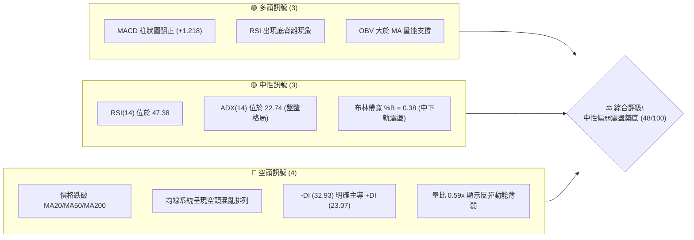

### 📊 核心指標速覽表

| 指標類別 | 指標名稱 | 當前數值 | 訊號 | 解讀 |
|----------|----------|----------|------|------|
| **價格** | 當前收盤價 | $352.81 | 🟡 | 位於52週區間 31.2% 分位，處於中低檔區間 |
| **均線** | MA20 | $357.54 | 🔴 | 現價在 MA20 下方 -1.32%，短線承壓 |
| **均線** | MA50 | $376.01 | 🔴 | 現價在 MA50 下方 -6.17%，中期趨勢走弱 |
| **均線** | MA200 | $367.04 | 🔴 | 跌破牛熊分水嶺 -3.88%，長期趨勢面臨考驗 |
| **動能** | RSI(14) | 47.38 | 🟡 | 中性區間，但帶有明確底背離特徵 |
| **動能** | MACD | -6.263 | 🟢 | 快慢線雖在零軸下，但 Hist(+1.218) 持續擴大 |
| **趨勢** | ADX(14) | 22.74 | 🟡 | 弱趨勢/盤整區間 (<25)，主導交易為區間震盪 |
| **方向** | +/-DI | 23.07 / 32.93 | 🔴 | -DI 大於 +DI，空方依然佔據波段主導權 |
| **通道** | 布林 %B | 0.38 | 🟡 | 運行於中軌($357.54)與下軌($338.08)之間 |
| **量能** | 量比 (Volume Ratio) | 0.59x | 🔴 | 20日均量縮減，多方進攻缺乏量能背書 |
| **波動** | ATR(14) | $10.14 | 🟡 | 佔現價 2.87%，日均波動處於中等水平 |

### 🏆 技術評分卡

```
╔══════════════════════════════════════════════════════════════════╗
║              技術評分卡 — AVGO (2026-09-27)                     ║
╠══════════════════════════════════════════════════════════════════╣
║ 趨勢強度      ██████░░░░░░░░░░░░░░  30/100  🔴 (ADX弱勢/空方主導)║
║ 動能指標      ███████████░░░░░░░░░  55/100  🟡 (MACD翻正/RSI背離)║
║ 支撐穩定度    █████████████░░░░░░░  65/100  🟢 (S1/S2聚類具備防守)║
║ 成交量配合    ████████░░░░░░░░░░░░  40/100  🔴 (量縮0.59x無攻擊量)║
║ 形態完整度    ██████████░░░░░░░░░░  50/100  🟡 (局部收斂震盪區)  ║
║ 均線排列      ████████░░░░░░░░░░░░  40/100  🔴 (均線空頭混合壓制)║
╠══════════════════════════════════════════════════════════════════╣
║ 綜合評分      █████████░░░░░░░░░░░  48/100  ⚖️ 中性觀望/區間盤整  ║
╚══════════════════════════════════════════════════════════════════╝
```

---

## 2. 趨勢分析

### 🌐 多時框趨勢分析

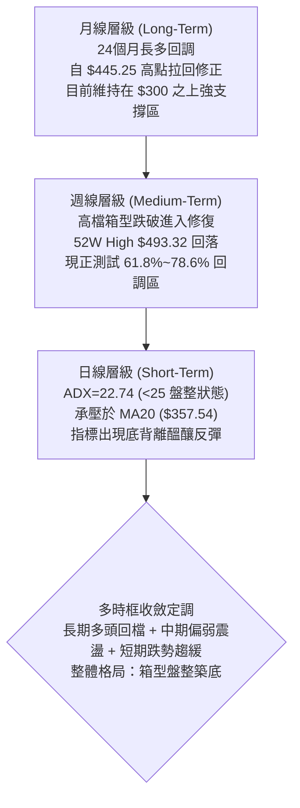

### 📈 長期趨勢 — 12個月走勢圖（Unicode）

```
AVGO 月線收盤走勢圖（過去 12 個月：2025-10 至 2026-09）
價格軸 ($)
$450 ┤                                      ● $445.25 (2026-05)
$425 ┤                                  ● $416.01
$400 ┤              ● $399.99 (2025-11)
$375 ┤      ● $366.90                   ● $377.06   ● $388.57
$350 ┤                                                  ● $369.67  ● $352.81 (現在)
$325 ┤                  ● $344.20   ● $329.48
$300 ┤                              ● $317.80   ● $308.46 (2026-03波段低)
     └──────┬───────┬───────┬───────┬───────┬───────┬───────┬───────┬───────┬───────┬───────┬───────
           10月    11月    12月     1月     2月     3月     4月     5月     6月     7月     8月     9月
          (2025)  (2025)  (2025)  (2026)  (2026)  (2026)  (2026)  (2026)  (2026)  (2026)  (2026)  (2026)
```

**12個月走勢特徵分析表格**：

| 階段區間 | 時間段 | 價格區間 ($) | 漲跌幅 | 結構特徵與走勢解讀 |
|----------|--------|--------------|--------|--------------------|
| **第1階段：衝高見頂** | 2025-10 ~ 2025-11 | $366.90 → $399.99 | +9.02% | 延續強勢多頭推升，逼近 $400 心理大關 |
| **第2階段：波段修正** | 2025-12 ~ 2026-03 | $399.99 → $308.46 | -22.88% | 連續4個月震盪回落，於 $308.46 形成中期低點守穩 |
| **第3階段：主升暴拉** | 2026-03 ~ 2026-05 | $308.46 → $445.25 | +44.35% | 強勢爆發，突破前高創下月線收盤新高 $445.25 (期間盤中創52W高點 $493.32) |
| **第4階段：高檔退潮** | 2026-05 ~ 2026-09 | $445.25 → $352.81 | -20.76% | 高檔獲利了結湧現，均線逐層失守，目前於 $350 關卡進行防禦 |

### 📊 中期趨勢（週線分析）

```
AVGO 近 10 週價格軌跡與關鍵多空分水嶺示意圖
  $426.98 (08-09 高點) ──┐
                         └──► $392.28 (08-16)
                                 └──► $367.78 (08-23)
                                         ├──► $368.12 (08-30)
                                         └──► $357.25 (09-06)
                                                 └──► $361.33 (09-13)
                                                         └──► $356.96 (09-20)
                                                                 └──► $352.81 (09-27 現價)
  ─────────────────────────────────────────────────────────────────────────────────────────────
  [強阻力 R2]    $375.91  ══════════════════════════════════════ (MA50 匯聚處)
  [短線阻力 R1]  $358.92  -------------------------------------- (MA20 阻力區)
  [現價基準]    $352.81  ◄───── 目前處於 S1 邊緣測試
  [關鍵支撐 S1]  $349.42  -------------------------------------- (近一年低點聚類)
  [強防守線 S2]  $341.71  ══════════════════════════════════════ (BB 下軌支撐帶)
```

從近 20 週數據觀察，AVGO 自 2026-08-09 創下反彈高點 $426.98 (週 RSI 達 73.6 超買) 後，遭遇連續下挫。週 MACD 柱狀圖在 2026-08-23 驟降至 -5.841，但隨後在 2026-09-06 至 2026-09-27 期間，週 MACD 柱狀圖由 -1.391 逐步回升至 +1.218。週線級別價格創波段新低 ($352.81)，但 MACD 動能柱持續翻紅回升，顯示中期空方殺跌力道竭盡。

### ⚡ 趨勢強度評估（ADX 解讀）

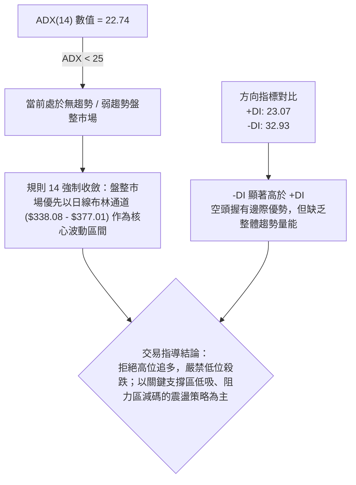

**ADX 趨勢強度級別對照分析**：

| ADX 區間 | 市場狀態解讀 | 當前狀態吻合 | 交易策略指導 |
|----------|--------------|--------------|--------------|
| **0 - 20** | 極弱勢 / 嚴重無方向盤整 | 否 | 觀望為主，避免雙巴 |
| **20 - 25** | **弱趨勢 / 盤整震盪蓄勢** | **是 (22.74)** | **以布林通道與支撐阻力進行區間高拋低吸** |
| **25 - 40** | 明確單邊趨勢形成 | 否 | 順勢而為，回調加碼 |
| **40 - 60** | 強勁單邊趨勢暴走 | 否 | 緊抱獲利部位，移動止損 |

---

## 3. 圖表形態分析

### 🔍 形態識別系統

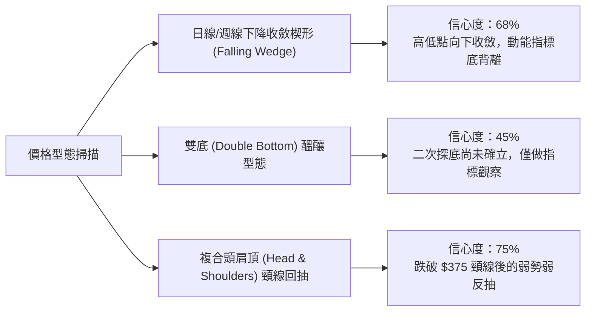

**形態信心度與目標價評估表格**（依據規則 13、15）：

| 形態名稱 | 信心度 | 判斷依據（引用數據） | 完成度 | 目標價（附計算式）與技術解讀 |
|----------|--------|----------------------|--------|------------------------------|
| **下降收斂楔形** | **68%** | 8月高點 $426.98 與 9月反彈高點 $361.33 形成下壓線；8月低點 $367.78 與當前低點 $352.81 形成下支撐線，斜率趨緩且 RSI/MACD 底背離。 | 75% | 若向上突破楔形上軌阻力 R1 $358.92，由形態高度推算：目標價 = R1 $358.92 + ($361.33 - $352.81 = $8.52) = **$367.44** (接近 61.8% 斐波位 $367.03 與 MA200 $367.04)。 |
| **頭肩頂破位回抽** | **75%** | 左肩 $416.01 (2026-04)、頭部 $445.25 (2026-05)、右肩 $426.98 (2026-08-09)。頸線支撐落在 $375.91 (R2)。8月下旬放量跌破頸線。 | 90% | 由頭肩頂高度推算最小跌幅：頸線 $375.91 - (頭部 $445.25 - 頸線 $375.91 = $69.34) = **$306.57** (接近 2026-03 歷史低點 $308.46)。目前價格正在回抽確認破位有效性。 |
| **潛在雙底結構** | **42%** | 前低為 9/6 收盤 $357.25，現價探至 $352.81。尚未出現右底反轉訊號。 | 25% | **訊號不足，信心度 < 50%**。依規則 15 不予強制計算幾何形態目標價，僅視為支撐位 S1 ($349.42) 附近的常規技術測底。 |

### 🕯️ 重要K線形態分析

| 月份 / 週期 | 收盤價 ($) | K線形態特徵 | 結構解讀 | 訊號強度 |
|-------------|------------|-------------|----------|----------|
| **2026-05** | $445.25 | 高檔長上影長陽線 | 盤中衝至 52W 高點 $493.32 後大幅回落，留下近 $48 巨幅上影線，顯現強烈主力派發特徵 | 🔴 極度偏空 |
| **2026-06** | $377.06 | 長陰重挫吞噬實體 | 暴跌 -15.31%，伴隨單週 2.51 億股天量，確立高檔主力籌碼棄守，中期反轉確立 | 🔴 空方宣洩 |
| **2026-07** | $388.57 | 縮量十字反彈星 | 跌深後技術性喘息，成交量驟降，反彈動能薄弱，屬於下跌中繼架構 | 🟡 中性整理 |
| **2026-08** | $369.67 | 上衝回落流星長陰 | 月初衝高至 $426.98 後遭遇強力拋壓，收盤失守 $370，確認反彈結束再度探底 | 🔴 空頭反撲 |
| **2026-09** | $352.81 | 下跌趨緩小陰線 | 跌幅收窄，月線級別呈現下影抵抗，週 MACD 柱狀圖翻正，呈現築底抗跌跡象 | 🟡 止跌蓄勢 |

### 📉 ASCII 走勢形態示意圖

```
AVGO 日線/週線 形態演變與頭肩頂破位/收斂楔形圖解
$450 ┤                 頭部 ($445.25)
     │                 ┌───▲───┐
$420 ┤   左肩 ($416.01)│       │        右肩 ($426.98)
     │      ┌──▲──┐   │       │          ┌──▲──┐
$390 ┤──────┼─────┼───┼───────┼──────────┼─────┼─────────────────────
     │     │     │   │       │          │     │    [頸線壓力 R2 $375.91]
$375 ┼─────┴─────┴───┴───────┴──────────┴─────▼─────── R2 $375.91 ────
     │                                            ╲     下降收斂楔形上軌
$360 ┤                                             ╲  ┌─ R1 $358.92 (MA20)
     │                                              ╲ │
$352 ┤───────────────────────────────────────────────●◄── 現價 $352.81 (底背離)
     │                                                │
$340 ┤                                                └── S1 $349.42 / S2 $341.71
     └───────────────────────────────────────────────────────────────────
```

### 🎯 形態目標價計算

1. **頭肩頂形態理論量度跌幅**：
   - 形態頸線點位：$375.91（對應阻力位 R2 及 60日均線密集區）
   - 形態最高頭部：$445.25（2026-05 收盤高點）
   - 形態垂直高度：$445.25 - $375.91 = $69.34
   - 理論下跌目標價 = 頸線 $375.91 - 垂直高度 $69.34 = **$306.57**（此數值高度重合於 2026-03 波段起漲低點 $308.46 與 100% 斐波低點 $288.98 上方緩衝區）。
2. **收斂楔形向上突破量度反彈**：
   - 楔形突破觸發點：突破阻力位 R1 $358.92
   - 楔形底端波段寬度：$361.33 (09-13高點) - $352.81 (現價) = $8.52
   - 理論反彈目標價 = $358.92 + $8.52 = **$367.44**（精準對應斐波那契 61.8% 關鍵回調位 $367.03 與 MA200 $367.04）。

---

## 4. 支撐與阻力

### 🗺️ 關鍵價位分布圖（Unicode）

```
AVGO 價位結構分布圖（嚴格依據 OHLCV 計算聚類與斐波那契體系）
═══════════════════════════════════════════════════════════════════
$391.15  ║████████████████████████║ 斐波那契 50.0% 中期極限強壓
$383.63  ║████████████████████    ║ 強阻力 R3（近一年波段高點聚類）
$375.91  ║████████████████████████║ 核心阻力 R2（MA50 $376.01 匯聚處）
$367.03  ║▓▓▓▓▓▓▓▓▓▓▓▓▓▓▓▓▓▓▓▓    ║ 關鍵樞紐（MA200 $367.04 / 61.8% 斐波位）
$358.92  ║████████████████        ║ 短線阻力 R1（MA20 $357.54 緊鄰受壓）
═════════╬════════════════════════╬═══════════════════════════════
$352.81  ╠════════════════════════╣ ◄── 現價位置（處於 S1 與 R1 狹幅區間）
═════════╬════════════════════════╬═══════════════════════════════
$349.42  ║▓▓▓▓▓▓▓▓▓▓▓▓▓▓▓▓        ║ 近期支撐 S1（近一年波段低點聚類，-0.96%）
$341.71  ║████████████████████    ║ 關鍵防守 S2（波段強支撐 / 近布林下軌）
$332.71  ║▓▓▓▓▓▓▓▓▓▓▓▓▓▓▓▓▓▓▓▓    ║ 斐波那契 78.6% 回調關鍵支撐
$330.89  ║████████████████████████║ 極限防守 S3（近一年低點聚類，-6.21%）
$288.98  ║████████████████████████║ 52週最低點（100.0% 斐波那契終極防線）
═══════════════════════════════════════════════════════════════════
```

### 🚧 阻力位分析表

所有阻力位數值嚴格引用自數據庫波段高點聚類計算值：

| 阻力級別 | 價位 ($) | 空間距離 (%) | 形成原因與籌碼技術面背景 | 突破難度 | 重要性權重 |
|----------|----------|--------------|--------------------------|----------|------------|
| **R1** | **$358.92** | +1.73% | 緊鄰 20日均線 MA20 ($357.54) 與 5日均線 ($357.07)，為短線空頭下壓的第一道均線防線。 | 🟡 中等 | ★★★☆☆ |
| **R2** | **$375.91** | +6.55% | 匯聚 50日均線 MA50 ($376.01)、布林通道上軌 ($377.01) 與 60日均線 ($377.17)，為中期頭肩頂頸線轉換位。 | 🔴 極高 | ★★★★★ |
| **R3** | **$383.63** | +8.73% | 近一年密集震盪成交密集頂部，突破該位置代表反轉確立並回補 6月跳空缺口。 | 🔴 極高 | ★★★★☆ |

### 🛡️ 支撐位分析表

所有支撐位數值嚴格引用自數據庫波段低點聚類計算值：

| 支撐級別 | 價位 ($) | 空間距離 (%) | 形成原因與籌碼技術面背景 | 守住機率 | 重要性權重 |
|----------|----------|--------------|--------------------------|----------|------------|
| **S1** | **$349.42** | -0.96% | 距離現價僅 1% 的近一年波段密集低點，整數關卡 $350 心理防線，短線多頭停損點。 | 🟡 60% | ★★★☆☆ |
| **S2** | **$341.71** | -3.15% | 波段強支撐聚類，向下緊鄰日線布林通道下軌 ($338.08)，具備技術指標通道超賣共振防護。 | 🟢 75% | ★★★★☆ |
| **S3** | **$330.89** | -6.21% | 年度極限波段低點聚類，緊貼斐波那契 78.6% 回調位 ($332.71)，為長線多頭不可失守的底線。 | 🟢 85% | ★★★★★ |

### 📐 斐波那契回調位分析

依據 52週極端波動區間（高點 **$493.32** 至 低點 **$288.98**，垂直落差達 **$204.34**）計算之各黃金分割點位解析：

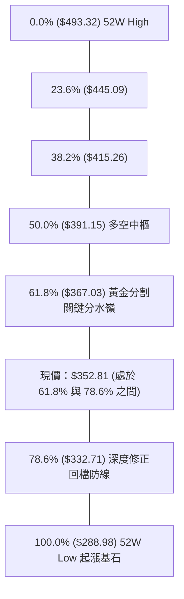

- **當前位置深度解讀**：現價 **$352.81** 正精確座落於 **61.8% 回調位 ($367.03)** 與 **78.6% 回調位 ($332.71)** 形成的深度回檔緩衝區內。
- **技術意義**：
  1. 股價在跌破 61.8% 黃金分割位 $367.03（同時與 MA200 $367.04 高度重疊）後，宣告過去 1 年的強勢單邊多頭結束，正式轉入中期修正。
  2. 目前價格距離下方 78.6% 斐波位 **$332.71** 尚有約 5.7% 空間，該位置與波段支撐 **S3 ($330.89)** 形成強固的共振支撐區間。若多頭欲維持長期牛市結構，此共振帶絕不可實體跌破。

---

## 5. 技術指標深度解讀

### 🎛️ 指標訊號總覽

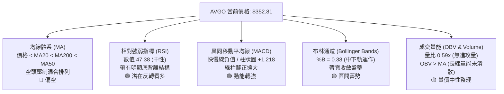

### 📈 移動平均線排列分析

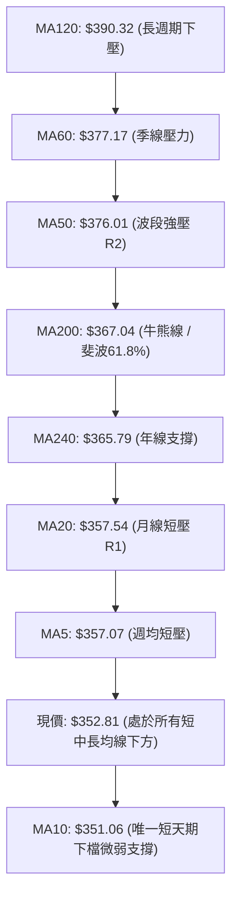

**均線狀態深度解剖**：
- **空頭混亂排列**：現價 $352.81 處於 MA20 ($357.54)、MA50 ($376.01)、MA200 ($367.04) 之下。短、中期均線全數呈現下傾態勢（MA20 跌幅 -1.32%、MA50 跌幅 -6.17%）。
- **關鍵反壓帶**：MA200 ($367.04) 目前已由過往的支撐轉化為強大反壓，且與年線 MA240 ($365.79) 形成扣抵反壓帶。若無法帶量突破 $367.04，均線架構難以扭轉空方尋底趨勢。

### 📉 RSI(14) 分析

- **RSI 數值進度條**：
  ```
  RSI(14) 當前數值: 47.38
  0 ├─────────────[30]───────────●──[70]────────────┤ 100
    [   超賣區     ] ▓▓▓▓▓▓▓▓▓░░░░░░░░░ [   超買區     ]
  ```
- **數值狀態**：當前數值 47.38，脫離了 2026-08-30 的超賣極值 **23.5**，回到 40~50 的中性平衡區。
- **背離現象判斷（重點關注）**：
  - **價格走勢**：2026-09-06 收盤 $357.25 → 2026-09-27 現價收盤 $352.81（價格震盪走低，刷出近半年收盤新低）。
  - **RSI 指標走勢**：2026-08-30 RSI 為 23.5 → 2026-09-06 RSI 為 29.2 → 2026-09-27 RSI 回升至 **47.38**。
  - **結論**：指標在價格創低之際走出連續抬高的底部，構成標準的**技術性標準底背離 (Bullish Divergence)**，預示下檔殺跌動能枯竭，隨時醞釀技術性估值修復反彈。

### 📊 MACD(12/26/9) 訊號解讀

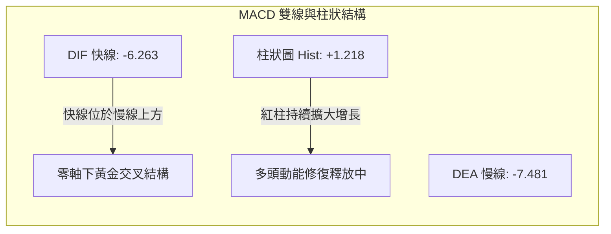

- **結構詳解**：
  - 快線 (MACD) 為 **-6.263**，慢線 (Signal) 為 **-7.481**。快線由下往上穿越慢線，在零軸下方形成了**低位黃金交叉**。
  - 柱狀圖 (Histogram) 連續回升至 **+1.218**，相較於 2026-08-23 的極限負值 **-5.841**，呈現出顯著的多頭動能擴張。雖然雙線仍在零軸之下（代表大環境仍處於弱勢反彈而非強勢主升），但動能指標已領先價格築底。

### 📦 布林通道分析

```
布林通道 (Bollinger Bands, 20, 2) 結構圖解
$380 ┤                                                    
$377 ┤ ══════════════════════════════════════════════════ 上軌: $377.01 (與 MA50 形成雙重阻力)
$370 ┤                                                    
$365 ┤                                                    
$357 ┤ -------------------------------------------------- 中軌 (MA20): $357.54 (短線反彈壓制)
$352 ┤                         ● 現價: $352.81 (%B = 0.38)
$345 ┤                                                    
$338 ┤ ══════════════════════════════════════════════════ 下軌: $338.08 (強支撐防線)
     └────────────────────────────────────────────────────
```

- **布林參數與狀態**：
  - 上軌：**$377.01** ｜ 中軌(MA20)：**$357.54** ｜ 下軌：**$338.08** ｜ 帶寬：$38.93 (約 11.0%)
  - 當前 **%B 數值為 0.38**，說明價格落於中軌與下軌之間偏下區域。
  - 布林帶正處於開口放大後的**逐漸收縮狀態**，配合 ADX 處於 22.74 的低位，顯示單邊重挫走勢已告一段落，股價將在 **$338.08 (下軌)** 至 **$377.01 (上軌)** 之間展開寬幅箱型震盪。

### 💹 成交量分析（量價配合度）

```
量能多空對比評估進度條：
最新成交量 (16.22M)   ███████████░░░░░░░░░ 59% (相對於20日均量)
20日均量 (27.40M)     ████████████████████ 100%基準
50日均量 (22.55M)     ████████████████░░░░ 82%基準
```

- **量比與價量背離**：最新日成交量僅 **16,220,900 股**，對比 20日均量 (27,399,390 股) 的量比僅為 **0.59x**。量能呈現極度萎縮，顯示現階段市場並無恐慌性拋售，但也缺乏主動買盤進場推升，形成典型的「量縮磨底」格局。
- **OBV 趨勢解讀**：數據顯示「OBV > MA → 量能支撐上漲」。這代表儘管近期價格拉回，但中期能量潮 (OBV) 並未跌破其均線系統，主力大資金在過去半年的建倉籌碼並未完全出逃，長線量價結構並未破裂。

---

## 6. 動能與波動率

### ⚡ 動能評估四象限

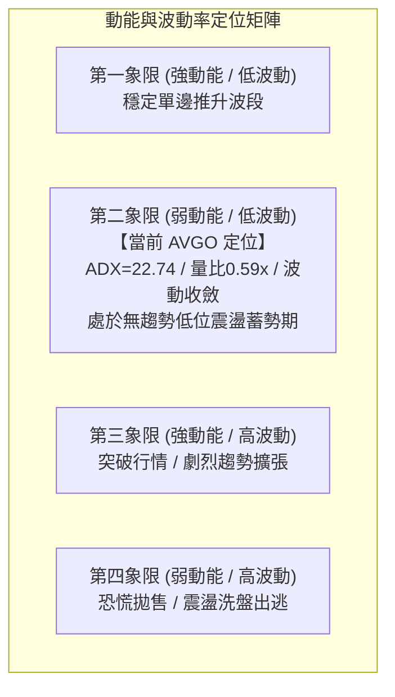

| 象限標籤 | 動能狀態 | 波動狀態 | 當前匹配 | 戰術應對與市場特徵解讀 |
|----------|----------|----------|----------|------------------------|
| **Q1** | 強 (ADX>30) | 低 (ATR<2%) | 否 | 最佳趨勢加碼點，適合趨勢追蹤系統。 |
| **Q2** | **弱 (ADX=22.74)** | **低至中 (ATR=2.87%)** | **✓ 正確定位** | **區間蓄勢與吸籌期。市場波動放緩，缺乏方向性，策略應重防守與低吸高拋。** |
| **Q3** | 強 (ADX>30) | 高 (ATR>4%) | 否 | 趨勢爆發期，需嚴格帶移動止損順勢進場。 |
| **Q4** | 弱 (ADX<20) | 高 (ATR>4%) | 否 | 高風險混亂洗盤，多看少做避免雙向摩擦虧損。 |

### 📊 ATR 波動率分析

- **ATR(14) 數值**：**$10.14**（佔當前股價 $352.81 的 **2.87%**）。
- **止損距離與風控量化建議**：
  - **短線戰術止損距離 (1.0x ATR)**：$10.14。若在現價進場，短線停損可設於現價減去 1.0 ATR = **$342.67**（緊鄰 S2 $341.71）。
  - **波段常規止損距離 (1.5x ATR)**：$15.21。波段保護點設於現價減去 1.5 ATR = **$337.60**（略低於布林下軌 $338.08）。
  - **寬幅防洗盤止損 (2.0x ATR)**：$20.28。保護位設於 **$332.53**（完美契合 78.6% 斐波那契回調位 $332.71 與 S3 $330.89）。

### 📐 Beta 與市場相關性

- **Beta 數值**：**1.457**。
- **市場特徵分析**：
  - AVGO 屬於典型的高彈性成長半導體龍頭，其波動幅度相對於標普 500 指數 (S&P 500) 高出 **45.7%**。
  - 當大盤（科技股巨頭/費城半導體指數）出現系統性反彈時，AVGO 具備高度的向上進攻彈性；反之，在大盤弱勢修正時，其拉回幅度亦會顯著放大。當前高 Beta 配合低位 RSI 底背離，提供了反彈時優異的盈虧比彈性空間。

---

## 7. 多時框架總結

### 📋 時框架評分表

| 時框架 | 趨勢方向 | 動能狀態 | 均線排列 | 形態結構 | 綜合評分 | 戰術建議 |
|--------|----------|----------|----------|----------|----------|----------|
| **長期 (月線)** | 🟢 偏多回調 | 🟡 趨緩調整 | 🟢 長期偏多 (守於240MA之上) | 52W 高檔拉回修正 | **65/100** | 逢低分批布局核心現貨籌碼 |
| **中期 (週線)** | 🔴 偏空修正 | 🟢 MACD柱翻正 | 🔴 跌破MA50/MA200 | 頭肩頂破位回抽測試 | **45/100** | 關注 R2 ($375.91) 壓力轉化 |
| **短期 (日線)** | 🟡 盤整磨底 | 🟢 RSI底背離 | 🔴 空頭壓制混亂排列 | 收斂楔形底部支撐 | **48/100** | 依布林通道軌道進行區間低吸 |

### 🔲 綜合訊號矩陣

```
╔══════════════════════════════════════════════════════════════════╗
║              AVGO 多時框架信號共振矩陣                         ║
╠═════════════════╦══════════════╦══════════════╦══════════════════╣
║ 分析維度        ║ 短期 (日線)  ║ 中期 (週線)  ║ 長期 (月線)      ║
╠═════════════════╬══════════════╬══════════════╬══════════════════╣
║ 趨勢方向 (Trend)║ 🟡 橫盤震盪  ║ 🔴 震盪下行  ║ 🟢 總體大多頭    ║
║ 動能指標 (Mom)  ║ 🟢 底背離轉強║ 🟢 綠柱翻正  ║ 🟡 漲多回吐      ║
║ 均線系統 (MAs)  ║ 🔴 MA20反壓  ║ 🔴 MA50下破  ║ 🟢 2年均線完好   ║
║ 關鍵支撐狀態    ║ 🟢 守住 S1   ║ 🟡 測試 61.8%║ 🟢 遠高於起漲底  ║
║ 成交量配合度    ║ 🔴 縮量 0.59x║ 🟡 換手趨緩  ║ 🟢 長期籌碼鎖定  ║
╚═════════════════╩══════════════╩══════════════╩══════════════════╝
```

### ⚖️ 多時框收斂結論（嚴格遵守規則 14）

1. **行情性質判定**：
   - 目前 ADX(14) 數值為 **22.74 (< 25)**，嚴格觸發「**盤整行情**」判定條件。
2. **時框優先級收斂**：
   - 根據規則 14，在盤整行情中，趨勢跟隨無效，**必須以日線布林通道上下軌 ($338.08 ~ $377.01) 作為核心交易區間**。
   - 儘管週線級別均線偏空，但短期日線 RSI 出現強烈底背離，且週 MACD 柱狀圖翻正至 +1.218，空方波段宣洩完畢。
3. **最終唯一收斂結論**：
   - **【中性偏多區間震盪（逢低做多盈虧比極佳）】**。在未實體跌破布林下軌 $338.08 與強支撐 S2 $341.71 之前，市場以「震盪築底修復」為主導，交易重心為**在支撐位 S1/S2 附近尋求反彈做多契機，並在阻力位 R1/R2 分步減碼**。

---

## 8. 交易策略建議

### 🗺️ 策略決策流程圖

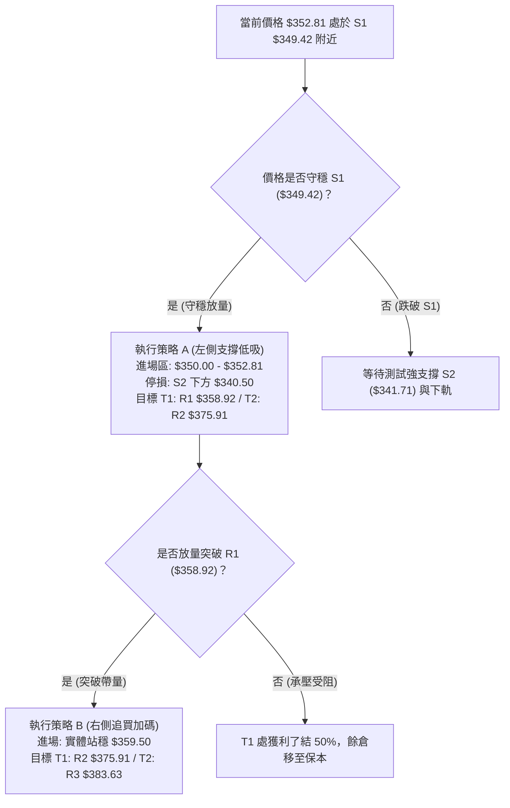

### 🧭 策略路由（依評分卡分流）

> **當前主策略方向 = 【中性偏多 — 區間下限低吸反彈策略】（依評分卡綜合評分 48/100，定位於 40–60 區間操作）**  
> **路由說明**：綜合評分為 48/100，處於 40~60 區間操作範圍。因 ADX=22.74 確立盤整市場，且指標呈現明確的 RSI 底背離與 MACD 柱翻正，做空盈虧比極低（下檔空間受 S1/S2 重重阻截）。故**主推以布林下軌與 S1/S2 支撐為防守的區間多頭策略**，空頭僅列為跌破關鍵防守時的避險提示。

### 🎯 價格情境階梯（Price Scenarios）

所有數值均嚴格引用第 4 章實時計算之支撐阻力聚類數據：

| 觸發條件 | 第一目標 (T1) | 第二延伸目標 (T2) | 技術情境含義與操作指引 |
|----------|---------------|-------------------|------------------------|
| **突破短線阻力 R1 $358.92** | **R2: $375.91** | **R3: $383.63** | 短線走出下降楔形，挑戰布林上軌與 MA50 重壓帶。 |
| **守穩現價至 S1 $349.42** | **R1: $358.92** | **MA200: $367.04** | 構築底部雙底雛形，區間震盪蓄勢修復。 |
| **實體跌破支撐 S1 $349.42** | **S2: $341.71** | **S3: $330.89** | 弱勢下探布林下軌，需警戒停損或對沖。 |

### 📊 情境機率分佈

| 價格情境 | 發生機率 | 主要技術依據（引用指標狀態） |
|----------|----------|------------------------------|
| **情境一：止跌反彈（挑戰 R1/R2）** | **55%** | 日線 RSI(14) 底背離確立，MACD 柱狀圖翻正至 +1.218，OBV 長期維持在均線上方。 |
| **情境二：箱型震盪（$342 - $367）** | **30%** | ADX(14) 僅 22.74，成交量能萎縮至 0.59x，多空雙方均無力發動單邊行情。 |
| **情境三：向下破位（回踩 S2/S3）** | **15%** | 均線系統呈空頭混亂排列，-DI (32.93) 仍掌控主動權，市場受系統性利空衝擊。 |

### 🟢 主策略詳情

| 策略要素 | 策略 A：左側支撐低吸策略 (主推) | 策略 B：右側突破加碼策略 (追隨) |
|----------|---------------------------------|---------------------------------|
| **策略類型** | 支撐區防守低吸（適合穩健投資者） | 均線突破右側順勢（適合波段交易者）|
| **進場條件** | 現價 $352.81 至 S1 ($349.42) 區間掛單 | 日線收盤實體帶量突破 R1 ($358.92) |
| **進場價格** | **$351.50** (現價與 S1 之間) | **$359.50** (確認突破 R1 後) |
| **目標價 T1** | **$358.92** (第一阻力位 R1 / MA20) | **$375.91** (強阻力位 R2 / MA50) |
| **目標價 T2** | **$375.91** (核心阻力 R2 / 布林上軌) | **$383.63** (波段高點阻力 R3) |
| **止損價格** | **$340.50** (實體跌破 S2 $341.71 停損)| **$351.00** (跌破 MA10 短線回馬槍停損) |
| **風險空間** | $351.50 - $340.50 = **$11.00** | $359.50 - $351.00 = **$8.50** |
| **回報空間 (至T2)** | $375.91 - $351.50 = **$24.41** | $383.63 - $359.50 = **$24.13** |
| **風險報酬比 (R/R)**| **1 : 2.22** (滿足交易標準) | **1 : 2.84** (極佳盈虧比) |
| **預估勝率** | **58%** | **52%** |
| **建議倉位** | **總資金 10% - 15%** (分批低吸) | **總資金 10%** (突破追加) |

### 🔴 反向風險觸發點（對沖與風控提示）

- **多頭反轉失敗信號**：若股價無量跌破 **S1 ($349.42)** 且收盤確認，宣告短線試多失敗，應減碼 50% 倉位。
- **全線止損與對沖觸發**：若股價放量長陰實體貫穿 **S2 ($341.71)** 及布林下軌 **$338.08**，代表頭肩頂形態完全主導盤面，目標將直指 **S3 ($330.89)** 或更低的 **$306.57**。此時必須全數清除多頭部位，甚至可建立輕倉空頭對沖部位。

### ⭐ 整體訊號強度評星

```
做多訊號強度：★★★☆☆  (3.0/5星) ── 依據：指標底背離+跌深支撐，但受阻於均線
做空訊號強度：★★☆☆☆  (2.0/5星) ── 依據：空方動能減弱，ADX低位追空風險極高
整體可信度：  ★★★★☆  (4.0/5星) ── 依據：價位精確聚類，多指標信號相互驗證
```

---

## 9. 風險提示與監控

### ✅ 關鍵監控指標 Checklist

```
╔══════════════════════════════════════════════════════════════════╗
║              AVGO 每日盤後技術監控清單 (Checklist)               ║
╠══════════════════════════════════════════════════════════════════╣
║ [ ] 價格是否成功守在 S1 ($349.42) 之上？                         ║
║ [ ] 日成交量是否放大至 20日均量 (27.40M) 以上？(量比 > 1.0)     ║
║ [ ] 日線 RSI(14) 是否持續站穩 50 中軸榮枯線？                    ║
║ [ ] MACD 柱狀圖是否持續擴張維持在正值 (> +1.218)？               ║
║ [ ] ADX(14) 是否由 22.74 拐頭向上突破 25？(趨勢是否啟動)        ║
║ [ ] 股價是否觸及或突破 MA20 ($357.54) 與 R1 ($358.92)？          ║
╚══════════════════════════════════════════════════════════════════╝
```

### ⚠️ 風險場景分析

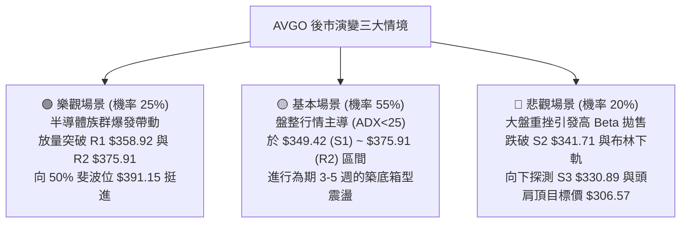

### 🛡️ 風險管理重要提醒

1. **高 Beta 波動防禦**：AVGO 的 Beta 高達 **1.457**，且單日 ATR 達 **$10.14**。這意味著單日股價出現 3% 左右的震盪屬於常態。投資者在設定停損時，絕不可過度緊貼現價，務必預留至少 **1.0x 至 1.5x ATR**（約 $10 - $15）的緩衝空間，以防盤中遭雜訊噪音洗出場。
2. **籌碼與基本面背書**：儘管技術面近期處於修正期，但機構持股比例高達 **79.8%**，且華爾街 47 位分析師平均目標價高達 **$531.85**（最新評級包括 Citigroup、Piper Sandler 等機構一致給予 Buy / Overweight）。基本面營收強勁成長 85.5%，提供了股價強力的估值底部安全邊際，這也是技術面 S2/S3 支撐具備高守住機率的核心底層邏輯。
3. **倉位管理紀律**：在 ADX 低於 25 的盤整環境中，單筆持倉風險曝險度不應超過總投資組合資產的 **2%**。切勿在盤整未突破前進行滿倉重押。

---

## 📋 報告總結

```
╔══════════════════════════════════════════════════════════════════╗
║              AVGO 技術分析報告總結 (2026-09-27)                  ║
╠══════════════════════════════════════════════════════════════════╣
║ 報告日期：2026-09-27          當前價格：$352.81                  ║
║ 分析評級：⚖️ 中性偏多區間震盪 (技術評分: 48/100)                  ║
╠══════════════════════════════════════════════════════════════════╣
║ 關鍵結論：                                                       ║
║ ├─ 長期趨勢：🟢 偏多回調 (24個月牛市回檔，守穩年線與關鍵斐波位) ║
║ ├─ 中期趨勢：🔴 弱勢修正 (受制於頭肩頂破位反抽與 MA50 壓制)     ║
║ ├─ 短期趨勢：🟡 築底盤整 (ADX=22.74，日線 RSI 底背離醞釀反彈)   ║
║ ├─ 關鍵支撐：S1 $349.42 / S2 $341.71 / S3 $330.89                ║
║ ├─ 關鍵阻力：R1 $358.92 / R2 $375.91 / R3 $383.63                ║
║ └─ 華爾街共識目標價：$531.85 (機構覆蓋強烈看好)                 ║
╠══════════════════════════════════════════════════════════════════╣
║ 最優策略組合：                                                   ║
║ 1. 🥇 最佳機會：在現價 $351.50 - $352.81 區間低吸 (策略 A)，     ║
║    嚴格以 S2 跌破位 $340.50 作為止損，目標看 R1 及 R2 (R/R=2.22)。║
║ 2. 🥈 次選機會：等待放量突破 R1 $358.92 確立後順勢追買 (策略 B)，║
║    目標上看 R2 $375.91 與 R3 $383.63 (R/R=2.84)。                ║
║ 3. 🥉 保守選擇：等待價格回踩布林下軌及 S2 $341.71 附近出現長下影  ║
║    陽線時再行進場，將止損緊縮在 S3 $330.89。                     ║
╚══════════════════════════════════════════════════════════════════╝
```

---

> ⚠️ **免責聲明**：本報告為 AI 自動生成之技術分析，所有數據及估算均基於提供的歷史價格資訊。本報告**僅供研究與學術參考**，**不構成任何投資建議**。投資有風險，入市需謹慎。

---

*報告生成時間：2026-09-27 ｜ 數據來源：Yahoo Finance ｜ 分析框架：多時框技術分析*