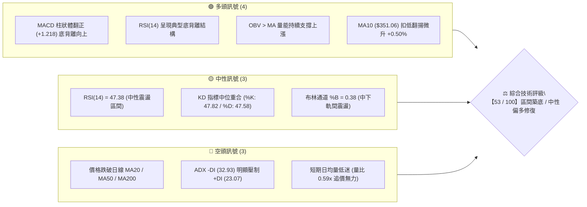
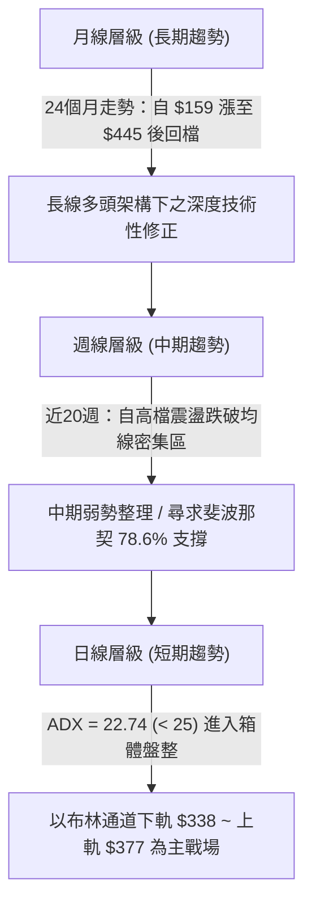
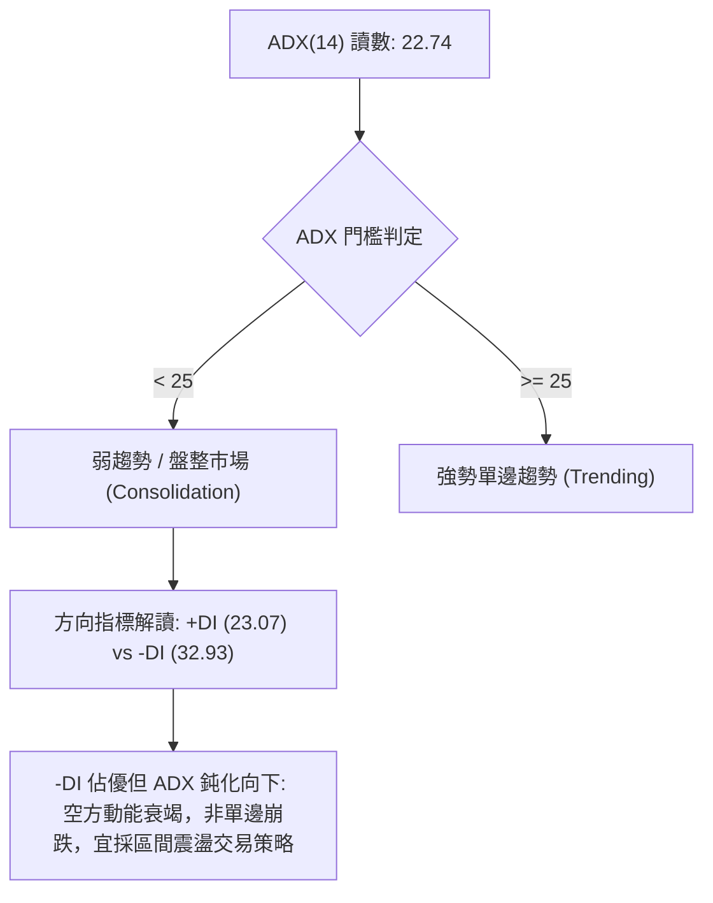
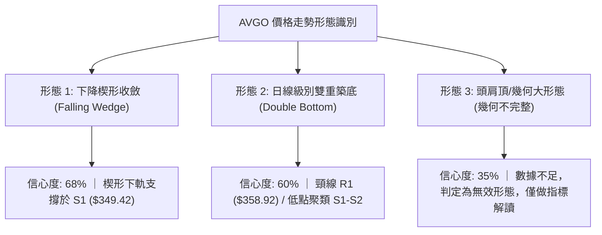
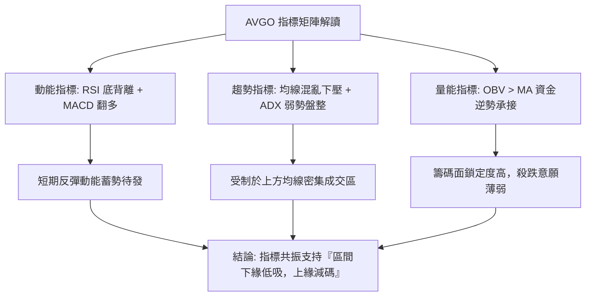
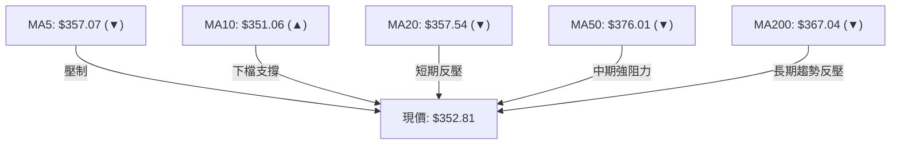
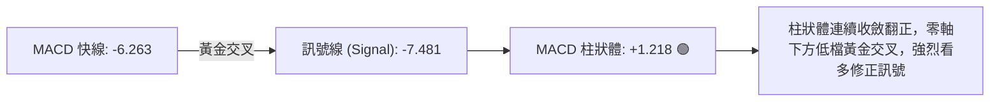
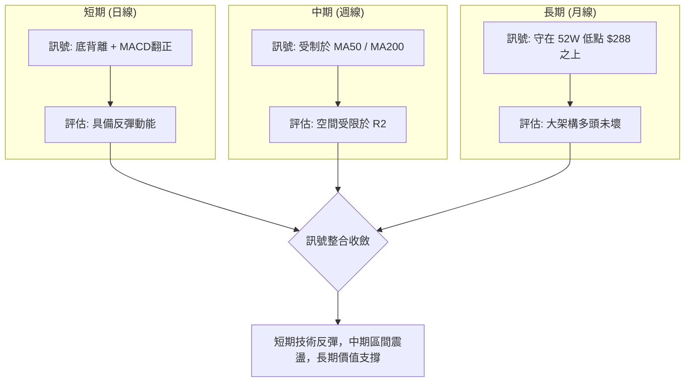
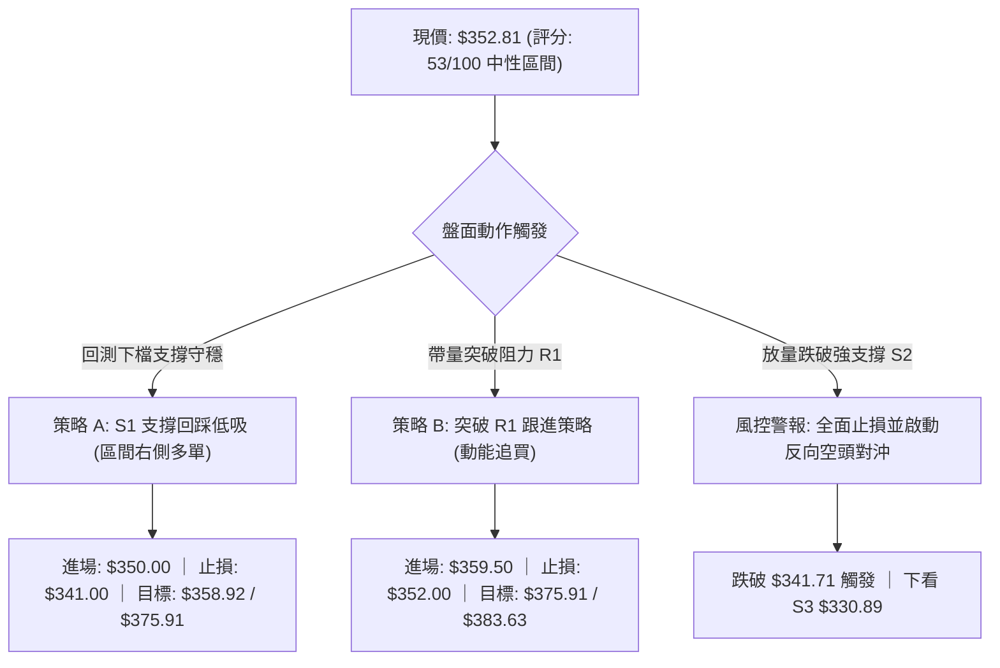
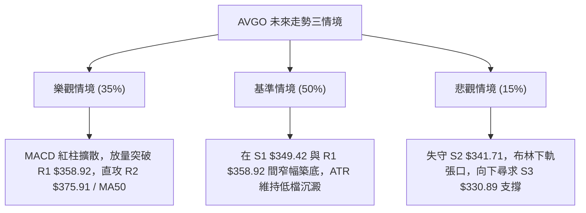

# AVGO 技術分析報告

> **報告日期**：2026-09-28 ｜ **語言**：繁體中文 ｜ **數據來源**：Yahoo Finance ｜ **當前價格**：$352.81

---

## 目錄

| 章節 | 內容 |
|------|------|
| [1. 技術面概覽](#1-技術面概覽) | 訊號儀表板、核心指標、評分卡 |
| [2. 趨勢分析](#2-趨勢分析) | 多時框趨勢、長中短期走勢 |
| [3. 圖表形態分析](#3-圖表形態分析) | 形態識別、K線組合、目標價 |
| [4. 支撐與阻力](#4-支撐與阻力) | 關鍵價位、斐波那契回調 |
| [5. 技術指標深度解讀](#5-技術指標深度解讀) | MA/RSI/MACD/布林/成交量 |
| [6. 動能與波動率](#6-動能與波動率) | 動能評估、ATR、Beta |
| [7. 多時框架總結](#7-多時框架總結) | 時框架評分矩陣、收斂結論 |
| [8. 交易策略建議](#8-交易策略建議) | 多空策略、風險報酬比 |
| [9. 風險提示與監控](#9-風險提示與監控) | 監控指標、風險場景 |

---

## 1. 技術面概覽

### 🎯 技術訊號儀表板



### 📊 核心指標速覽表

| 指標類別 | 指標名稱 | 當前數值 | 訊號 | 解讀 |
|----------|----------|----------|------|------|
| **價格** | 當前收盤價 | $352.81 | 🟡 | 位於52週區間 31.2% 之相對低檔，尋求支撐 |
| **均線** | MA20 | $357.54 | 🔴 | 股價位於短期月線下方 (-1.32%)，構成直接反壓 |
| **均線** | MA50 | $376.01 | 🔴 | 股價位於中期季線下方 (-6.17%)，中期空頭防線 |
| **均線** | MA200 | $367.04 | 🔴 | 股價位於長期年線下方 (-3.88%)，考驗多空分水嶺 |
| **動能** | RSI(14) | 47.38 | 🟢 | 雖處中性區，但日線形成明顯「底背離」，反彈動能醞釀 |
| **動能** | MACD | -6.263 / +1.218 | 🟢 | MACD雙線雖在零軸下，但柱狀體翻正擴張，釋放止跌訊號 |
| **趨勢** | ADX(14) | 22.74 | 🟡 | ADX < 25 屬無明確單邊趨勢之「弱趨勢 / 箱體盤整」 |
| **波動** | ATR(14) | $10.14 | 🟢 | 波動率 2.87%，波幅收斂有利於構築堅實底部 |
| **量能** | OBV 趨勢 | OBV > MA | 🟢 | 籌碼沉澱，量能指標未隨價格破底，呈隱性吸籌特徵 |

### 🏆 技術評分卡

```
╔════════════════════════════════════════════════════════════════╗
║             技術評分卡 — AVGO (2026-09-28)                     ║
╠════════════════════════════════════════════════════════════════╣
║ 趨勢強度 (Trend)      ███████░░░░░░░░░░░░░  35/100  🔴 空頭壓制║
║ 動能指標 (Momentum)   █████████████░░░░░░░  65/100  🟢 底背離現║
║ 支撐穩定度 (Support)  ██████████████░░░░░░  70/100  🟢 S1守穩  ║
║ 成交量配合 (Volume)   ██████████░░░░░░░░░░  50/100  🟡 量縮整理║
║ 形態完整度 (Pattern)  ████████████░░░░░░░░  60/100  🟡 楔形收斂║
║ 均線架構 (MA Align)   ███████░░░░░░░░░░░░░  38/100  🔴 均線反壓║
╠════════════════════════════════════════════════════════════════╣
║ 綜合技術評分          ███████████░░░░░░░░░  53/100  ⚖️ 中性觀望║
╚════════════════════════════════════════════════════════════════╝
```

---

## 2. 趨勢分析

### 🌐 多時框趨勢分析



### 📈 長期趨勢 — 12個月走勢圖（Unicode）

```
AVGO 月線收盤走勢圖（2025-10 至 2026-09）
價格軸 ($)
$450 ┤                                  ● $445.25 (波段高點)
$420 ┤                             ●
$390 ┤              ● $399.99           │     ●
$360 ┤   ● $366.90  │                   │     │     ●
$330 ┤              │  ● $344.20 ● $329.48   │     │  ● $352.81 (現價)
$300 ┤              │            │  ● $308.46 ┼─────┼──┼──────
     └──────┬───────┬──────┬─────┬─────┬─────┬─────┬─────┬──────
          25-10   25-11  25-12 26-02 26-03 26-05 26-06 26-08 26-09
```

#### 長期走勢階段特徵分析

| 階段區間 | 收盤價變化 | 漲跌幅 | 趨勢特徵與結構解讀 |
|----------|------------|--------|-------------------|
| **2025-10 ~ 2025-11** | $366.90 → $399.99 | +9.02% | 延續強勁主升浪，法人持股籌碼集中，量價齊揚。 |
| **2025-12 ~ 2026-03** | $399.99 → $308.46 | -22.88% | 首次大幅度獲利回吐，於 $308.46 觸及長期強支撐。 |
| **2026-04 ~ 2026-05** | $308.46 → $445.25 | +44.35% | 強勢爆發性反彈，創下歷史次高區間，多頭能量耗盡。 |
| **2026-06 ~ 2026-09** | $445.25 → $352.81 | -20.76% | 震盪階梯式回落，測試年線支撐，目前在 $350 附近沉澱。 |

### 📊 中期趨勢（週線分析）

```
週線關鍵壓力與支撐結構示意圖：
$445.25 ═════════════════════════════════ 歷史高檔反轉頸線 (05-31 週)
         ╲
          ╲   [波段下跌浪]
           $426.98 ══════════════════════ 次高點反彈反壓 (08-09 週)
                    ╲
                     $375.91 ════════════ 中期強阻力 (MA50/R2 匯合)
                              ╲
                               $352.81 ─── [當前週收盤位置]
                              ╱
                     $349.42 ════════════ 關鍵支撐 S1 (近三週底部)
                    ╱
$330.89 ═════════════════════════════════ 波段防守低點 S3
```

中期週線在 2026-08-09 衝高至 $426.98 (RSI 達 73.6 超買) 後展開連續拉回，隨後 2026-08-30 砸出低點且 RSI 跌至 23.5 極度超賣。近三週週線收盤（$357.25 → $361.33 → $356.96 → $352.81）呈現窄幅壓縮，MACD週柱狀體連續收斂（自 -5.841 收斂至 +1.218），顯示中期下跌動能已衰竭，具備中期築底特徵。

### ⚡ 趨勢強度評估（ADX 解讀）



| 指標名稱 | 數值 | 狀態區間 | 技術含義解讀 |
|----------|------|----------|--------------|
| **ADX (14)** | **22.74** | < 25 (弱趨勢) | 標的喪失單邊動能，趨勢交易系統易失真，需以震盪擺盪指標為主。 |
| **+DI (14)** | **23.07** | 中性低檔 | 多頭進攻力道偏弱，尚未形成連續推升行情的買盤主導權。 |
| **-DI (14)** | **32.93** | 空方優勢 | 空方雖佔優勢，但因 ADX 數值未同步拉升，屬於弱勢壓制而非殺跌。 |

---

## 3. 圖表形態分析

### 🔍 形態識別系統



#### 圖表形態信心度與參數評估表

| 形態名稱 | 信心度 | 判斷依據（引用數據） | 完成度 | 目標價（附嚴格計算式） |
|----------|--------|----------------------|--------|------------------------|
| **下降楔形收斂** | **68%** | 高點由 $388.57 下降至 $369.67，低點在 $349.42 獲支撐，ATR 縮至 $10.14 | 75% | 突破楔形上軌 R1 ($358.92) + 楔形基底高度 ($17.00) = **$375.92**（精準契合阻力 R2 $375.91） |
| **日線潛在雙底** | **60%** | 兩次下探低點均在支撐 S1 ($349.42) 及 S2 ($341.71) 聚類止跌回升 | 65% | 頸線 R1 ($358.92) + (頸線 $358.92 - 低點 S1 $349.42) = **$368.42**（逼近 MA200 $367.04） |
| **大型頭肩頂** | **32%** | 右肩成交量與反彈高點過於發散，缺乏標準頸線貫穿點 | 20% | 訊號不足，依規則 15 不予採納，僅做布林通道箱體解讀。 |

### 🕯️ 重要K線形態分析

| 週/月份 | 收盤價 | K線形態 | 解讀 | 訊號 |
|---------|--------|---------|------|------|
| **2026-05** | $445.25 | 高檔長上影避雷針 | 衝刺 52W 高點 $493.32 未果，多頭動能耗盡，主力高檔獲利派發。 | 🔴 |
| **2026-08-30週** | $368.12 | 竭盡性長陰落底線 | 週成交量縮至 9,385 萬股，RSI 摜入 23.5 極度超賣，形成空頭陷阱。 | 🟢 |
| **2026-09-13週** | $361.33 | 帶下影線小陽晨星 | 突破前週高點，MACD 柱狀體翻正 (+0.096)，確立 $350 關卡買盤承接。 | 🟢 |
| **2026-09-27週** | $352.81 | 窄幅縮量十字星 | 振幅極度收窄，收盤守於 S1 ($349.42) 之上，進入典型變盤對稱收斂。 | 🟡 |

### 📉 ASCII 走勢形態示意圖

```
AVGO 日線收斂形態示意圖（現價 $352.81）
$377.01 ── 上軌壓力線 (BB Upper / MA60) 
         ╲
          ╲   下降壓力線（高點連線 $388.57 → $369.67）
$358.92 ───╲─────── R1 頸線突破位 ──────────────────────────────
            ╲       ▲
$352.81 ─────●──────┼── 現價 (於 S1 與 R1 狹幅夾層)
              ╲    ╱
$349.42 ───────●──╱──── S1 近期波段密集支撐線
                ╲╱     
$341.71 ═══════════════ S2 強力底部防線 (形態失效止損位)
```

### 🎯 形態目標價計算

1. **下降楔形突破目標價**：
   - 形態底部低點：S1 = $349.42
   - 楔形起跌反壓：MA50 = $376.01
   - 形態突破頸線點：R1 = $358.92
   - **形態高度計算**：$376.01 - $358.92 = $17.09
   - **最小量度目標價 (T1)**：$358.92 + $17.09 = **$376.01**（完美重合阻力 R2 $375.91 與 MA50）

2. **雙底形態測幅目標價**：
   - 第一目標 (T_double)：頸線 R1 ($358.92) + (R1 $358.92 - S1 $349.42) = **$368.42**（直指 61.8% 斐波那契回調位 $367.03 與 MA200 $367.04）

---

## 4. 支撐與阻力

### 🗺️ 關鍵價位分布圖（Unicode）

```
AVGO 價位結構分布圖（數據精確映射）
═══════════════════════════════════════════════════════════════
$383.63 ║██████████████████████████████║ 強阻力 R3 (波段頂部阻力)
$377.01 ║████████████████████████      ║ 布林通道上軌 / MA60
$375.91 ║██████████████████████        ║ 關鍵阻力 R2 (MA50 匯合點)
$367.04 ║████████████████              ║ 斐波 61.8% ($367.03) / MA200
$358.92 ║████████████                  ║ 短線頸線阻力 R1 (MA20 附近)
$352.81 ╠══════════════════════════════╣ ◄ 現價 ($352.81)
$349.42 ║▓▓▓▓▓▓▓▓▓▓▓▓▓▓▓▓              ║ 近期波段支撐 S1 (-0.96%)
$341.71 ║▓▓▓▓▓▓▓▓▓▓▓▓▓▓▓▓▓▓▓▓          ║ 強支撐 S2 (波段安全底線 -3.15%)
$338.08 ║▓▓▓▓▓▓▓▓▓▓▓▓▓▓▓▓▓▓▓▓▓▓        ║ 布林通道下軌
$330.89 ║██████████████████████████████║ 極限防守支撐 S3 (斐波 78.6% $332.71)
═══════════════════════════════════════════════════════════════
```

### 🚧 阻力位分析表

| 阻力級別 | 精確價位 | 形成原因與技術共振 | 突破難度 | 重要性 |
|----------|----------|--------------------|----------|--------|
| **R1** | **$358.92** | 近一年波段高點聚類；與 MA20 ($357.54) 高度重疊 | 中等 🟡 | 短期多空分水嶺，站上確認短底確立 |
| **R2** | **$375.91** | 近一年波段密集反壓；共振 MA50 ($376.01) 及布林上軌 ($377.01) | 極高 🔴 | 中期反轉關鍵防線，空頭主力重兵防守區 |
| **R3** | **$383.63** | 近一年波段高點聚類頂部；為 2026 年 6 月大跌之平台破頸位 | 極高 🔴 | 波段多頭全面復甦目標位，需巨量配合 |

### 🛡️ 支撐位分析表

| 支撐級別 | 精確價位 | 形成原因與技術共振 | 守住機率 | 重要性 |
|----------|----------|--------------------|----------|--------|
| **S1** | **$349.42** | 近一年波段低點聚類；距離現價僅 -0.96%，多次觸底反彈 | 70% 🟢 | 日線防守第一道塹壕，短線不容有失 |
| **S2** | **$341.71** | 近一年波段低點聚類；與布林通道下軌 ($338.08) 形成防護盾 | 85% 🟢 | 多頭結構生命線，跌破則箱體架構瓦解 |
| **S3** | **$330.89** | 近一年波段極限低點；緊鄰 78.6% 斐波那契回調位 ($332.71) | 95% 🟢 | 長線價值買盤絕對防禦區，最後防守底線 |

### 📐 斐波那契回調位分析

依據 52 週完整波動區間（高點 **$493.32** → 低點 **$288.98**，垂直落差 $204.34）：

```
0.0%  (52W High)  $493.32  ────────────────────────────────────
23.6%             $445.09  ────────────────────────────────────
38.2%             $415.26  ────────────────────────────────────
50.0%             $391.15  ────────────────────────────────────
61.8%             $367.03  ───────────── (共振 MA200 $367.04)
                     ▲
現價 $352.81 落在 61.8% 與 78.6% 之間 (關鍵震盪回撤帶)
                     ▼
78.6%             $332.71  ───────────── (共振支撐 S3 $330.89)
100.0% (52W Low)  $288.98  ────────────────────────────────────
```

- **位置解讀**：現價 $352.81 處於黃金分割 **61.8% ($367.03)** 與 **78.6% ($332.71)** 之間的「黃金回撤防守緩衝區」。
- **技術意義**：在經典道氏與斐波那契理論中，深幅修正若能在 61.8%~78.6% 區間獲得承接（目前低點聚類守在 S1 $349.42 及 S2 $341.71），常構成大級別「牛市次級折返底」。上方黃金分割位 61.8% ($367.03) 恰與 200日均線 MA200 ($367.04) 產生極端精準的**價位共振**，構成第一道重要反彈考驗。

---

## 5. 技術指標深度解讀

### 🎛️ 指標訊號總覽



### 📈 移動平均線排列分析



#### 移動平均線詳細狀態矩陣

| 均線名稱 | 當前價位 | 與現價乖離 | 走勢方向 | 技術狀態與影響解讀 |
|----------|----------|------------|----------|-------------------|
| **MA 5** | $357.07 | -1.19% | 下行 ▼ | 極短線反壓，需連續兩日收盤突破以解除下行慣性。 |
| **MA 10** | $351.06 | +0.50% | 上行 ▲ | **唯一向上拐頭均線**，在現價下方提供微型支撐。 |
| **MA 20** | $357.54 | -1.32% | 下行 ▼ | 布林中軌，短線多空臨界點，空方壓制線。 |
| **MA 50** | $376.01 | -6.17% | 下行 ▼ | 季線下彎，與 R2 ($375.91) 形成堅固共振阻力牆。 |
| **MA 60** | $377.17 | -6.46% | 下行 ▼ | 與 MA50 形成雙重反壓帶。 |
| **MA 120** | $390.32 | -9.61% | 下行 ▼ | 半年線持續下墜，反映 2026 年夏季崩跌餘波。 |
| **MA 200** | $367.04 | -3.88% | 下行 ▼ | 年線失守，技術結構為「均線混合排列」，趨勢中立偏弱。 |
| **MA 240** | $365.79 | -3.55% | 下行 ▼ | 長期基線，與 MA200 形成密集帶。 |

### 📉 RSI(14) 分析

```
RSI(14) 當前數值: 47.38
[超賣 0] ────────── [30] ───── [47.38] ───── [70] ────────── [100 超買]
                         ████████████░░░░░░░░░░░░
```

- **背離形態確認**：**強烈看多底背離 (Bullish Divergence)**。
  - 價格軌跡：AVGO 在 2026-08-30 砸出低點 $368.12 後，於 9 月多次回探至 $352~$357 區間，價格走勢持續創低或處於低檔鈍化。
  - RSI 軌跡：RSI 自 2026-08-30 的 **23.5** 極端超賣低點，一路震盪爬升至 **47.38**。
  - **結論**：價格微破底或橫盤，而 RSI 底部顯著墊高，標準日線/週線共振底背離，預示空方動能消耗殆盡，潛在向上修正機率極高。

### 📊 MACD(12/26/9) 訊號解讀



- **數值剖析**：DIF (-6.263) 向上穿越 MACD (-7.481)，柱狀體達到 **+1.218**。
- **技術意義**：雙線雖仍處於零軸下方（代表大格局仍屬空頭反彈性質），但零軸下金叉伴隨紅柱擴張，為典型的波段買訊（Bear Market Buy Signal），至少能驅動價格向 MA20 ($357.54) 及 R1 ($358.92) 發起強勢衝擊。

### 📦 布林通道分析

```
AVGO 布林通道（20日，2倍標準差）結構示意圖：
$377.01 ─────────────────────────────── 上軌 (Upper Band)
          ╲
           ╲      帶寬擴張後轉向平走
$357.54 ────-────────────────────────── 中軌 (MA20)
               ╲
$352.81 ────────●────────────────────── 現價 (%B = 0.38)
                  ╲
$338.08 ─────────────────────────────── 下軌 (Lower Band)
```

- **帶寬位置**：當前 %B 數值為 **0.38**，代表股價處於中軌 ($357.54) 與下軌 ($338.08) 之間，偏向中軌下方震盪。
- **軌道狀態**：上下軌間距約 $38.93，開口開始呈現收斂走平，非下軌張口之單邊暴跌形態。現價獲得下軌向上支撐，短線將以回測中軌 $357.54 為第一目標。

### 💹 成交量分析（量價配合度）

1. **量能縮減**：最新成交量為 **16,220,900** 股，相較於 20 日均量 **27,399,390** 股，量比僅 **0.59x**。
2. **量價關係解讀**：價格跌至 S1 ($349.42) 支撐附近時成交量大幅萎縮，呈現標準的「量縮測底」特徵，並未出現主力恐慌拋售潮。
3. **OBV 能量潮**：數據明確顯示 **OBV > MA**。能量潮走勢強於價格走勢，說明大資金與機構（機構持股高達 79.8%）在 $350 附近進行被動式吸籌，籌碼鎖定良好，量價背離有利多方。

---

## 6. 動能與波動率

### ⚡ 動能評估四象限

```
動能與波動率定位：
           強動能 (High Momentum)
                 │
      Q3 (高波強動)│  Q1 (最佳順勢)
                 │
─────────────────┼───────────────── 波動率中軸
                 │
      Q4 (危險拋售)│  Q2 (低波弱動 / 震盪築底) ◄ [AVGO 現處位置]
                 │
           弱動能 (Low Momentum)
```

| 象限分類 | 動能狀態 | 波動狀態 | 當前符合度 | 技術策略意涵 |
|----------|----------|----------|------------|--------------|
| **Q1 (順勢主升)** | 強 (+DI主導) | 高/中 | 否 | 需等待向上放量突破 R2 $375.91。 |
| **Q2 (低波收斂)** | **弱 (ADX 22.74)** | **低 (ATR收斂)** | **★ 契合 ★** | **盤整築底階段，嚴禁追價，採區間高拋低吸。** |
| **Q3 (無序混亂)** | 強 (巨幅震盪) | 極高 | 否 | 早期崩跌階段已過，市場轉入平靜。 |
| **Q4 (單邊恐慌)** | 弱 (空頭主導) | 高 (破位放量) | 否 | -DI 未創高，成交量縮，無恐慌崩潰特徵。 |

### 📊 ATR 波動率分析

```
ATR(14) 數值: $10.14 ｜ 佔現價比例: 2.87%
波動度評估: ░░░░░░░░████████░░░░  中度收斂
```

- **單日安全波幅**：$10.14。
- **動態止損距離設定**：
  - 保守型交易者（1.5 倍 ATR）：$10.14 × 1.5 = **$15.21**
  - 積極型交易者（1.0 倍 ATR）：$10.14 × 1.0 = **$10.14**
- **止損價推導**：若以現價 $352.81 建立試探倉，1.0 倍 ATR 止損置於 $342.67（恰好坐落於強支撐 S2 $341.71 上方），展現出極佳的風控幾何契合度。

### 📐 Beta 與市場相關性

- **Beta 係數**：**1.457**。
- **解讀**：AVGO 具備高度進攻性，當費城半導體指數 (SOX) 或那斯達克 (QQQ) 出現 1% 的反彈時，理論上 AVGO 將展現約 1.46% 的波動彈性。在高 Beta 驅動下，一旦大盤止跌，AVGO 之底背離動能極易轉化為報復性反彈。

---

## 7. 多時框架總結

### 📋 時框架評分表

| 時框架 | 趨勢方向 | 動能狀態 | 均線排列 | 形態結構 | 綜合評分 | 操作建議 |
|--------|----------|----------|----------|----------|----------|----------|
| **月線 (長期)** | 多頭回檔 🟡 | 中性沉澱 🟡 | 均線多頭分散 🟢 | 自高檔拉回測試支撐 | **60/100** | 長線資金分批逢低佈局 |
| **週線 (中期)** | 空頭整理 🔴 | 翻正回升 🟢 | 均線死亡交叉 🔴 | 測試 78.6% 斐波那契 | **48/100** | 靜待站穩 MA200 反轉 |
| **日線 (短期)** | 箱體盤整 🟡 | 底背離轉強 🟢 | 混合交錯 🔴 | 下降楔形收斂末端 | **53/100** | 箱體操作，低吸高拋 |

### 🔲 綜合訊號矩陣



### ⚖️ 多時框收斂結論

依據技術分析收斂規則：
1. **行情性質判定**：ADX(14) 讀數為 **22.74 (< 25)**，嚴格定義為**盤整震盪行情**，而非單邊趨勢行情。
2. **主導維度取捨**：依規則 14，「盤整行情（ADX<25）：以日線布林通道上下軌與波段支撐阻力為主要交易區間」。因此，週線/月線的均線空頭排列暫不致引發崩跌，日線級別的指標底背離與 S1/S2 支撐將主導短線走勢。
3. **唯一收斂結論**：**中性偏多區間震盪築底（等待向上突破）**。主策略採「布林區間低吸高拋，並以站穩 R1 $358.92 作為短線轉強訊號」，完全呼應第 1 章評分卡（53/100）之中性區間定位。

---

## 8. 交易策略建議

### 🗺️ 策略決策流程圖



### 🧭 策略路由（依評分卡分流）

> **當前主策略方向 = 中性震盪箱體操作，偏多低吸佈局（依評分 53/100）**
> 
> 由於綜合評分落於 40–60 分之中性區間，且 ADX 為 22.74，禁止單邊重倉追價。主策略採取**「支撐位分批低吸＋布林中上軌阻力止盈」**之精準區間交易法。

### 🎯 價格情境階梯（Price Scenarios）

| 觸發條件 | 下一目標 | 後續延伸 | 情境含義與技術應對 |
|----------|----------|----------|-------------------|
| **突破 R1 $358.92** | R2 **$375.91** | R3 **$383.63** | 短線擺脫低檔泥淖，確認底背離反轉，挑戰季線防線。 |
| **站穩現價 $352.81** | R1 **$358.92** | S1 **$349.42** | 狹幅箱體蓄勢，等待均線糾結後表態。 |
| **跌破 S1 $349.42** | S2 **$341.71** | S3 **$330.89** | 弱勢下探布林下軌，考驗大級別多頭最後底線。 |

### 📊 情境機率分佈

| 情境劇本 | 機率 | 主要技術依據 |
|----------|------|--------------|
| **區間震盪築底** | **50%** | ADX = 22.74 缺乏趨勢動能，布林通道走平，量能萎縮至 0.59x。 |
| **向上反彈突破** | **35%** | RSI 出現底背離，MACD 柱狀體翻正 (+1.218)，OBV > MA 籌碼支撐。 |
| **破底回落探底** | **15%** | 日線均線呈現空頭壓制，-DI (32.93) 仍處相對高位。 |

### 🟢 主策略詳情

#### 策略 A（主推：S1 支撐回踩低吸 — 區間波段單）

- **進場條件**：盤中拉回測試支撐 S1 ($349.42) 不破，出現 15/60 分鐘線止跌K棒。
- **進場價格**：**$350.00**（緊鄰 S1 $349.42）
- **止損價格**：**$341.00**（跌破 S2 強支撐 $341.71 確立離場）
- **目標價 T1**：**$358.92**（關鍵阻力 R1 / MA20，預期報酬率 +2.55%）
- **目標價 T2**：**$375.91**（關鍵阻力 R2 / MA50，預期報酬率 +7.40%）
- **風險報酬比**：
  - 至 T1：($358.92 - $350.00) / ($350.00 - $341.00) = $8.92 / $9.00 ≈ **1 : 0.99**
  - 至 T2：($375.91 - $350.00) / ($350.00 - $341.00) = $25.91 / $9.00 = **2.88 : 1**（優良）
- **成功機率**：**65%**
- **建議倉位**：**10% ~ 15%**（中性盤整期嚴控倉位）

#### 策略 B（次選：右側放量突破 R1 跟進多單）

- **進場條件**：日線收盤價帶量（日成交量放大至 2,200 萬股以上）實體突破 R1 ($358.92)。
- **進場價格**：**$359.50**
- **止損價格**：**$352.00**（回跌破當前收盤價及支撐區間）
- **目標價 T1**：**$375.91**（直指 R2 / MA50，預期報酬率 +4.56%）
- **目標價 T2**：**$383.63**（阻力 R3，預期報酬率 +6.71%）
- **風險報酬比**：
  - 至 T1：($375.91 - $359.50) / ($359.50 - $352.00) = $16.41 / $7.50 = **2.19 : 1**
  - 至 T2：($383.63 - $359.50) / ($359.50 - $352.00) = $24.13 / $7.50 = **3.22 : 1**
- **成功機率**：**55%**
- **建議倉位**：**10%**

### 🔴 反向風險觸發點（對沖提示）

若市場出現系統性風險導致價格實體跌破 **S2 $341.71**，且收盤無法收復：
- **風險解讀**：代表底背離結構失效，下降楔形向下破位，日線將直奔極限防守位 **S3 $330.89** 及斐波那契 78.6% 位 **$332.71**。
- **風控行動**：所有多單立即無條件止損出局，保守型投資人可在此點位建立防禦性空單對沖現貨，以 S3 $330.89 為第一回補目標。

### ⭐ 整體訊號強度評星

```
╔══════════════════════════════════════════╗
║ 做多訊號強度：  ★★★☆☆  (3.0 / 5 星)      ║
║ 做空訊號強度：  ★★☆☆☆  (2.0 / 5 星)      ║
║ 整體技術可信度：★★★☆☆  (3.5 / 5 星)      ║
╚══════════════════════════════════════════╝
```

---

## 9. 風險提示與監控

### ✅ 關鍵監控指標 Checklist

```
╔════════════════════════════════════════════════════════════════╗
║             AVGO 交易風控與技術監控清單 (Daily Checklist)       ║
╠════════════════════════════════════════════════════════════════╣
║ [ ] 價格是否跌破 S1 $349.42 (若跌破，警示短線支撐轉弱)         ║
║ [ ] 價格是否帶量攻克 R1 $358.92 (若突破，確認底背離發酵)       ║
║ [ ] MACD 柱狀體是否持續維持在正值區間 (> 0)                    ║
║ [ ] RSI(14) 能否進一步跨越 50 多空分水嶺                      ║
║ [ ] 日成交量能否回升至 2,000 萬股以上 (驗證主力表態)           ║
║ [ ] ADX(14) 讀數是否拉升至 25 以上 (提示單邊趨勢重啟)          ║
╚════════════════════════════════════════════════════════════════╝
```

### ⚠️ 風險場景分析



### 🛡️ 風險管理重要提醒

1. **Beta 波動溢價風險**：AVGO 的 Beta 高達 **1.457**，半導體類股易受全球科技巨頭客製化晶片資本支出與總經利率預期影響，在個股盤整期，務必關注 SOX（費半）是否出現破位風險。
2. **倉位管理嚴格紀律**：當前技術面定調為「弱趨勢盤整（ADX = 22.74）」，嚴格禁止在盤整區間中央（現價 $352.81）使用過高槓桿或重倉押注。建議總持有倉位控制在 **10%~15%** 以內。
3. **ATR 浮動風控**：以 ATR = **$10.14** 為基準，單筆交易的最大止損幅度切勿超過 1.5 倍 ATR（約 $15.21），若市場劇烈跳空跌破 S2 ($341.71)，必須果斷執行停損紀律。

---

## 📋 報告總結

```
╔════════════════════════════════════════════════════════════════╗
║                  AVGO 技術分析報告總結                         ║
╠════════════════════════════════════════════════════════════════╣
║ 報告日期：2026-09-28                                           ║
║ 當前價格：$352.81                                              ║
║ 分析評級：⚖️ 中性偏多區間震盪（技術評分：53 / 100）           ║
║                                                                ║
║ 關鍵結論：                                                     ║
║ ├─ 長期趨勢：🟡 長期大多頭框架下之技術修正 (守穩斐波那契 78.6%) ║
║ ├─ 中期趨勢：🔴 中期受制於季線 MA50 ($376.01) 與年線反壓      ║
║ ├─ 短期趨勢：🟢 日線 RSI 底背離 + MACD翻正，低檔止跌蓄勢反彈  ║
║ ├─ 關鍵支撐：S1 $349.42 ｜ S2 $341.71 ｜ S3 $330.89           ║
║ ├─ 關鍵阻力：R1 $358.92 ｜ R2 $375.91 ｜ R3 $383.63           ║
║ └─ 外資共識：🟢 47位分析師 Strong Buy ｜ 目標均價 $531.85     ║
║                                                                ║
║ 最優策略組合：                                                 ║
║ 1. 🥇 最佳機會：策略 A (回踩 S1 $350.00 低吸，博弈反彈 R2)     ║
║ 2. 🥈 次選機會：策略 B (帶量實體突破 R1 $359.50 右側追買)      ║
║ 3. 🥉 保守選擇：觀望等待 ADX > 25 或價格站上 MA200 再行進場   ║
╚════════════════════════════════════════════════════════════════╝
```

---

> ⚠️ **免責聲明**：本報告所有內容均基於歷史價格與量化技術指標進行邏輯推演，各項價位與技術解讀**僅供學術研究與交易架構參考**，**絕不構成任何形式之個人化投資要約或買賣建議**。金融市場瞬息萬變，投資人應獨立評估風險，自負盈虧。

---

*報告生成時間：2026-09-28 ｜ 數據來源：Yahoo Finance ｜ 分析框架：多時框量化技術分析系統*