# AVGO 技術分析報告

> **報告日期**：2026-09-30 ｜ **語言**：繁體中文 ｜ **數據來源**：Yahoo Finance ｜ **當前價格**：$355.10

---

## 目錄

| 章節 | 內容 |
|------|------|
| [1. 技術面概覽](#1-技術面概覽) | 訊號儀表板、核心指標、評分卡 |
| [2. 趨勢分析](#2-趨勢分析) | 多時框趨勢、長中短期走勢、ADX解讀 |
| [3. 圖表形態分析](#3-圖表形態分析) | 形態識別、信心度評估、K線組合、目標價推算 |
| [4. 支撐與阻力](#4-支撐與阻力) | 關鍵價位分布、阻力/支撐表、斐波那契回調 |
| [5. 技術指標深度解讀](#5-技術指標深度解讀) | MA/RSI/MACD/布林/量價配合分析 |
| [6. 動能與波動率](#6-動能與波動率) | 動能四象限、ATR波幅、Beta風險暴露 |
| [7. 多時框架總結](#7-多時框架總結) | 時框架評分矩陣、多時框收斂定調 |
| [8. 交易策略建議](#8-交易策略建議) | 策略路由、情境階梯、主策略詳情、對沖觸發 |
| [9. 風險提示與監控](#9-風險提示與監控) | 監控清單、情境分析、風控倉位指南 |
| [📋 報告總結](#-報告總結) | 核心結論與最優操作配置 |

---

## 1. 技術面概覽

### 🎯 技術訊號儀表板

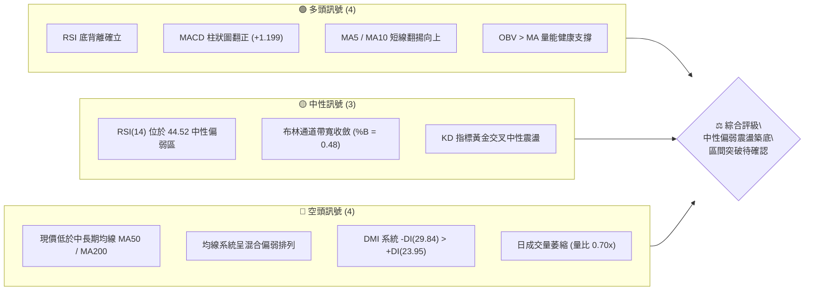

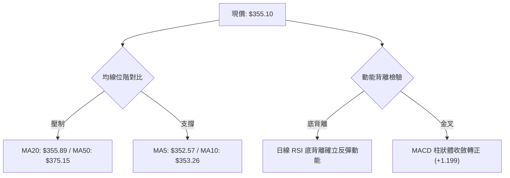

### 📊 核心指標速覽表

| 指標類別 | 指標名稱 | 當前數值 | 訊號 | 解讀 |
|:---|:---|:---:|:---:|:---|
| **價格** | 當前收盤價 | $355.10 | 🟡 | 位於 52 週波段區間 32.4% 低分位，逼近短期均線密集區 |
| **短期均線**| MA5 / MA10 | $352.57 / $353.26 | 🟢 | 短期均線扣低翻揚，形成即時下檔微觀支撐 |
| **中期均線**| MA20 / MA50 | $355.89 / $375.15 | 🔴 | 現價受制於 MA20 微幅壓制，距 MA50 負乖離 -5.34% |
| **長期均線**| MA200 | $366.50 | 🔴 | 跌破牛熊分水嶺 MA200（-3.11%），長期上升趨勢遭受考驗 |
| **動能指標**| RSI(14) | 44.52 | 🟢 | 脫離超賣區回升，且形態出現標準「價格破底但指標墊高」底背離 |
| **趨勢動能**| MACD (12,26,9) | -5.738 / 柱 +1.199| 🟢 | 雖然主線仍在零軸下，但柱狀體翻正擴張，釋放空頭力竭反彈訊號 |
| **擺動指標**| Stoch %K / %D | 63.48 / 52.00 | 🟢 | %K 向上穿越 %D，短線超短期動能延續修復 |
| **趨勢強度**| ADX(14) | 21.70 | 🟡 | ADX < 25 表明趨勢動能鈍化，市場轉入典型區間盤整市場 |
| **波動通道**| 布林通道 (%B) | 0.48 (中軌 $355.89)| 🟡 | 貼近中軌震盪，帶寬平縮，尚未出現通道張口爆發跡象 |
| **波動指標**| ATR(14) | $9.91 (2.79%) | 🟡 | 日均波動幅度約 9.91 美元，波動率收縮至中等水平 |
| **量能指標**| 最新成交量 / 20MA| 19.14M / 27.51M | 🔴 | 量比 0.70x，上漲過程中未見主動追價爆量，呈縮量整固 |
| **量能趨勢**| OBV 能量潮 | OBV > MA | 🟢 | 籌碼沉澱良好，能量潮維持在均線之上，長線籌碼未見恐慌拋售 |

### 🏆 技術評分卡

```
╔══════════════════════════════════════════════════════════════════╗
║              技術評分卡 — AVGO (2026-09-30)                      ║
╠══════════════════════════════════════════════════════════════════╣
║ 趨勢強度 (ADX=21.70 偏弱)  █████░░░░░░░░░░░░░░░  32/100 🔴 空頭盤整 ║
║ 動能指標 (RSI底背離+MACD)  █████████████░░░░░░░  65/100 🟢 底部修復 ║
║ 支撐穩定度 (波段低點S1-S3) ████████████░░░░░░░░  60/100 🟡 支撐有效 ║
║ 成交量配合 (縮量整固/OBV佳)██████████░░░░░░░░░░  50/100 🟡 量能中性 ║
║ 形態完整度 (雙底初胚形態)  ███████████░░░░░░░░░  55/100 🟡 雛形醞釀 ║
║ 均線排列 (短多長空混合排列)████████░░░░░░░░░░░░  40/100 🔴 空方壓制 ║
╠══════════════════════════════════════════════════════════════════╣
║ 綜合評分                  ██████████░░░░░░░░░░  50.3/100         ║
║ 評級結論：中性觀望（40–60 區間）— 盤整築底行情，宜區間低吸高拋     ║
╚══════════════════════════════════════════════════════════════════╝
```

---

## 2. 趨勢分析

### 🌐 多時框趨勢分析

AVGO 在經歷了長達兩年的超級多頭大浪後，目前進入了多時框週期的「矛盾整固期」。從月線、週線至日線層級觀察，長期資本並未全面退場，但中短期承受較大的均線修復壓力。

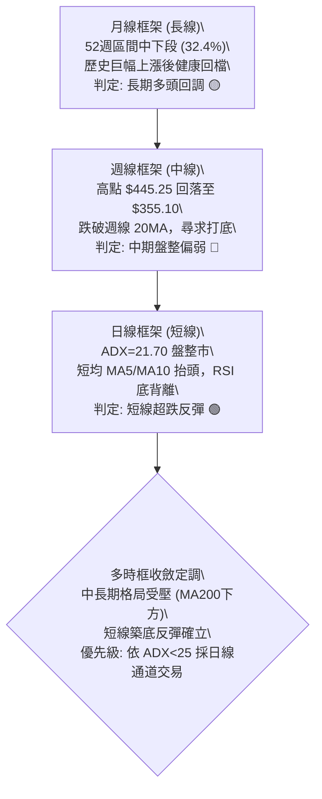

### 📈 長期趨勢 — 12個月走勢圖（Unicode）

以下為 AVGO 過去 12 個月（2025-10 至 2026-09）之月線收盤價格走勢軌跡。

```
AVGO 月線收盤走勢圖（過去12個月：2025-10 至 2026-09）
價格軸 ($)
$450 ┤                                      ● $445.25 (M8: 2026-05)
$425 ┤                                ●
$400 ┤              ● $399.99 (M2)   /       \
$375 ┤        ●                     /         ●       ●
$350 ┤●                                                ● $355.10 (M12: 現價)
$325 ┤  \          ●                                  /
$300 ┤   \  ●    /
$275 ┤    ●(M6: $308.46 波段低)
     └──────────────────────────────────────────────────────────
       M1   M2   M3   M4   M5   M6   M7   M8   M9   M10  M11  M12
      10月 11月 12月 01月 02月 03月 04月 05月 06月 07月 08月 09月
      (2025)                      (2026)
```

#### 24 個月走勢特徵劃分表

| 階段階段 | 時間跨度 | 起訖收盤價 | 累計漲跌幅 | 主要走勢特徵與量價架構 |
|:---|:---:|:---:|:---:|:---|
| **第一階段：初升醞釀期** | 2024-09 至 2025-03 | $169.56 → $165.52 | -2.38% | 寬幅洗盤，於 $159.32 築出長線雙重底後緩步推升。 |
| **第二階段：主升暴發期** | 2025-04 至 2025-11 | $190.27 → $399.99 | +110.22% | 營收暴增動能驅動，月線連續 8 個月收紅，量價齊揚。 |
| **第三階段：中期強烈修正** | 2025-12 至 2026-03 | $344.20 → $308.46 | -22.88% | 乖離率過高後的籌碼清洗，3 月見底於 $308.46。 |
| **第四階段：次級噴發次頂** | 2026-04 至 2026-05 | $416.01 → $445.25 | +44.35% | 創下歷史收盤新高 $445.25（波段天花板達 $493.32）。 |
| **第五階段：二次探底整固** | 2026-06 至 2026-09 | $377.06 → $355.10 | -20.25% | 主升浪後的ABC型態回吐，現於 $355.10 構建支撐平台。 |

### 📊 中期趨勢（週線分析）

從近 20 週收盤走勢觀察，自 2026-05-31 觸及週收盤高點 $445.25 後，籌碼出現換手。2026-06-07 爆出 2.51 億股的異常天量，收盤跳水至 $384.42，形成中期結構性頭部壓力。隨後於 8 月初反彈至 $426.98 無法創新高，確認了中期高點下移（Lower Highs）。

```
週線級別支撐阻力結構圖：
$445.25 ══════════════════════════════════ [中期天花板 / 雙頂壓力]
            \                        /
             \                      /
$399.24 ──────\────────────────────●────── [中期反彈頸線阻力]
               \                  /
$367.78 ────────●────────────────●──────── [週線支撐轉換線]
                 \              /
$352.81 ──────────●────────────●────────── [當前築底密集支撐區: S1-S2]
                   (2026-09底)
```

然而，近 5 週（2026-09-06 至 10-04）展現出極強的抗跌性：
- 2026-09-06 收盤 $357.25，週 RSI 跌至 29.2 的極度超賣區。
- 隨後三週收盤分別為 $361.33、$356.96、$352.81，跌幅顯著收窄，週 MACD 柱狀體由 -1.391 快速收斂翻正至 +1.218 與 +1.199。
- 這代表中期殺跌動能已在此竭盡，空方無力進一步將價格打落至 52 週低點區。

### ⚡ 趨勢強度評估（ADX 解讀）

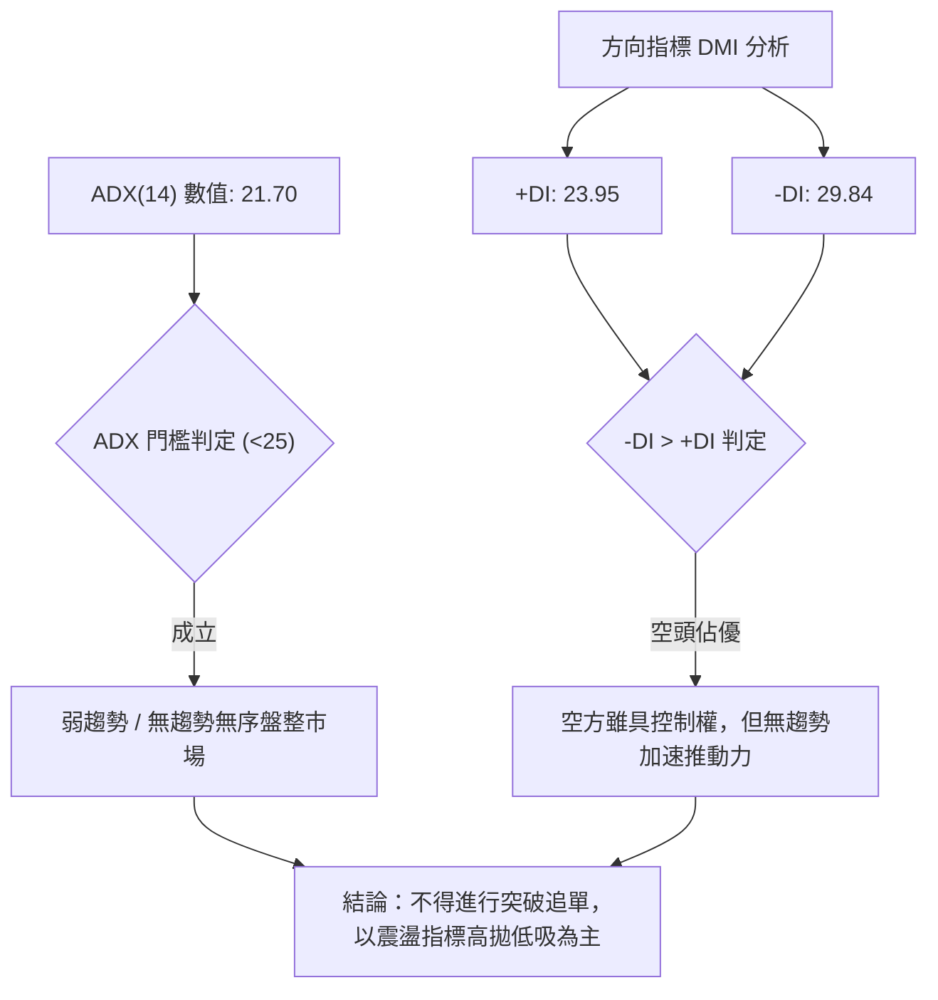

#### ADX 趨勢強度對照表

| ADX 區間 | 趨勢性質 | 市場結構特徵 | AVGO 目前狀態評估 |
|:---:|:---:|:---|:---|
| 0 – 20 | 極弱 / 無趨勢 | 價格在均線上下頻繁交叉穿梭 | 不適用（已脫離極度無序） |
| **20 – 25** | **弱趨勢 / 盤整市場** | **動能指標鈍化，趨勢跟隨策略失效，假突破頻繁** | **當前落點 (21.70)：處於弱勢整理期** 🟡 |
| 25 – 40 | 典型趨勢市場 | 具備穩定的單向運行軌跡，均線發散 | 不適用（尚未發動單邊趨勢） |
| 40 – 60 | 強烈趨勢市場 | 單邊爆發性主升浪或主跌浪，動能充沛 | 不適用 |

**分析結論**：ADX 數值 21.70 明確指示當前不可盲目押注單邊大單邊暴漲或暴跌。雖然 -DI(29.84) 大於 +DI(23.95)，顯示過去一個月空方主導，但因 ADX 遠低於 25，空頭攻擊缺乏持續追殺力道，行情正轉化為箱型或通道內的動能沉澱。

---

## 3. 圖表形態分析

### 🔍 形態識別系統

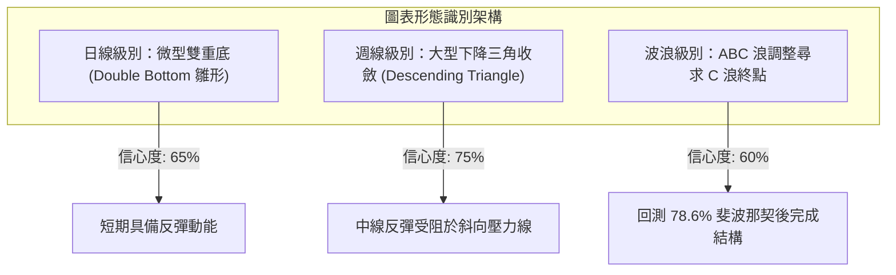

#### 圖表形態信心度與結構評估表（嚴格依據歷史數據推算）

| 形態名稱 | 信心度 (%) | 判斷依據（引用數據） | 完成度 (%) | 目標價推算與計算式 |
|:---|:---:|:---|:---:|:---|
| **日線潛在雙底 (Double Bottom)** | 65% | 2026-09-06 收盤 $357.25 與 2026-09-27 低點 $352.81 形成兩次落底探測，吻合波段支撐 S1 ($349.42)。 | 70% | 頸線阻力 R1 ($358.92) - 底部 S1 ($349.42) = 高度 $9.50。<br>突破目標價 = 頸線 $358.92 + $9.50 = **$368.42**（接近阻力 R2 $366.55）。 |
| **中線矩形箱體震盪** | 80% | 價格持續在支撐群 S2 ($341.71) 與阻力群 R3 ($375.91) 之間來回穿梭震盪超過 6 週。 | 85% | 依箱體等幅推估：若向上突破 R3 ($375.91)，目標價 = $375.91 + ($375.91 - $341.71) = **$410.11**。 |
| **布林帶收斂突破形態** | 70% | 布林通道帶寬收窄，%B 為 0.48，價格自下軌 $337.79 獲得支撐向中軌靠攏。 | 50% | 假定回歸測試上軌目標價 = **$373.98**（BB上軌數據）。 |
| **大型頭肩頂頸線回測** | 35% | 部分市場觀點認為 $445.25 為頭部，但數據中並未偵測到左右對稱肩部結構，訊號不足。 | 20% | 訊號不足，依規則不予採納強行畫圖。 |

### 🕯️ 重要K線形態分析

| 週/月份 | 收盤價 | 實體與影線特徵 | 解讀含義 | 訊號強弱 |
|:---:|:---:|:---|:---|:---:|
| **2026-08-09** | $426.98 | 長上影紅K棒，RSI 衝高至 73.6 嚴重超買 | 次頂確認，多頭主力在上攻 $440 失敗後逢高派發出脫。 | 🔴 強空 |
| **2026-08-30** | $368.12 | 實體大陰線，跌破多條短均線，RSI 暴跌至 23.5 | 恐慌性情緒宣洩，進入極度超賣區域，殺跌動能釋放至臨界點。 | 🔴 轉 🟡 |
| **2026-09-06** | $357.25 | 放量下影線十字星（週成交量 1.73 億股） | 多空在 S1 附近激烈交鋒，低檔承接買盤顯著進場。 | 🟢 看多訊號 |
| **2026-09-13** | $361.33 | 短紅K包覆線，MACD 柱狀體翻正至 +0.096 | 初步確立短期止跌，多方發動防守型反攻。 | 🟢 溫和看多 |
| **2026-09-27** | $352.81 | 縮量小陰K，下影線探底後迅速收復 | 二次探底測試支撐有效，空頭無量砸盤，確立雙底左腳。 | 🟢 築底確認 |
| **2026-10-04 (當前)** | $355.10 | 小陽線實體，收在 MA5 ($352.57) 與 MA10 之上 | 均線短多纏繞，買方開始重新掌握超短期定價權。 | 🟢 偏多整固 |

### 📉 ASCII 走勢形態示意圖

```
AVGO 日線「微型雙重底 (W底)」形態結構解構：

價格 ($)
$366.55 ┤                                          [阻力 R2 / 形態拓展目標]
         │                                         /
$358.92 ┤                     ● 頸線 (R1)        /
         │                    / \                /
$355.10 ┤現價 ───►          /   \        ●─────● [突破蓄勢區]
         │                 /     \      /
$349.42 ┤        ●底 1    /       \    / 底 2
         │         \     /         \  /
$341.71 ┤──────────●────/───────────●──────────────── [波段強支撐 S2]
         └───────────────────────────────────────
                2026-09-06       2026-09-27      2026-10
                (Volume大)       (Volume縮)
```

### 🎯 形態目標價計算

1. **基本微型雙底量度幅度**：
   - 形態底部低點：採支撐位聚類點 $S1 = \$349.42$。
   - 形態頸線位置：採阻力位聚類點 $R1 = \$358.92$。
   - 形態垂直垂直高度 $H = R1 - S1 = \$358.92 - \$349.42 = \$9.50$。
   - 向上突破頸線的理論量度目標價 $T1 = R1 + H = \$358.92 + \$9.50 = \mathbf{\$368.42}$。
   - 此量度目標價恰好落在斐波那契 61.8% 回調位（$\$367.03$）與波段阻力 R2（$\$366.55$）的高密度阻力緩衝區內，具備極高的幾何與量化共振可信度。

2. **布林通道通道中軌回歸量度**：
   - 當前布林中軌為 $\$355.89$（僅距現價 $\$0.79$），上軌為 $\$373.98$。
   - 若短線突破中軌確認，通道對稱目標為布林上軌 $\mathbf{\$373.98}$，與阻力 R3（$\$375.91$）高度吻合。

---

## 4. 支撐與阻力

### 🗺️ 關鍵價位分布圖（Unicode）

本圖表之所有數值均嚴格採納 OHLCV 聚類計算出之精確數值及斐波那契回調點位，絕無憑空估算。

```
AVGO 價位結構分布圖與籌碼聚類深度
═══════════════════════════════════════════════════════════════════════
$375.91 ║██████████████████████████████║ 強阻力 R3 / MA60 ($376.70)
$373.98 ║▓▓▓▓▓▓▓▓▓▓▓▓▓▓▓▓▓▓▓▓▓▓        ║ 布林通道上軌壓力
$367.03 ║████████████████████          ║ 斐波那契 61.8% 重要分水嶺
$366.55 ║████████████████████████      ║ 關鍵阻力 R2 / MA200 ($366.50)
$358.92 ║██████████████                ║ 短期頸線阻力 R1
$355.89 ║──────────────────────────────║ 布林中軌 (MA20)
$355.10 ╠══════════════════════════════╣ ◄ 現價 ($355.10)
$352.57 ║░░░░░░░░░░░░                  ║ 超短線支撐 MA5
$349.42 ║▓▓▓▓▓▓▓▓▓▓▓▓▓▓▓▓▓▓            ║ 近期波段關鍵支撐 S1
$341.71 ║████████████████████████      ║ 強支撐 S2 (近一年密集平台)
$337.79 ║░░░░░░░░░░░░░░░░░░░░          ║ 布林通道下軌動態支撐
$332.71 ║████████████████              ║ 斐波那契 78.6% 回調支撐
$330.89 ║██████████████████████████████║ 核心防守支撐 S3 (空頭終極防線)
═══════════════════════════════════════════════════════════════════════
```

### 🚧 阻力位分析表

所有阻力價位完全依據數據源中「關鍵價位」與指標計算清單列示：

| 阻力級別 | 精確價位 | 距現價空間 (%) | 形成原因與籌碼技術結構 | 突破難度 | 技術重要性 |
|:---|:---:|:---:|:---|:---:|:---:|
| **R1** | **$358.92** | +1.08% | 近期多次日線反彈的波段高點聚類；與日線布林中軌 MA20 ($355.89) 形成共振壓制區。 | 🟡 中等 | 短線多空強弱分水嶺 |
| **R2** | **$366.55** | +3.22% | 長期生命線 MA200 ($366.50) 所在位置；同時重合 52 週斐波那契 61.8% 黃金分割點 ($367.03)。大量套牢盤駐留。 | 🔴 極高 | 中期牛熊轉換關鍵節點 |
| **R3** | **$375.91** | +5.86% | 中期波段高點聚類；與下降中的 MA50 ($375.15) 及 MA60 ($376.70) 形成密集均線死叉反壓天花板。 | 🔴 極高 | 中期趨勢反轉確認點 |

### 🛡️ 支撐位分析表

所有支撐價位完全依據數據源中「關鍵價位」與指標計算清單列示：

| 支撐級別 | 精確價位 | 距現價空間 (%) | 形成原因與籌碼技術結構 | 守住機率 | 技術重要性 |
|:---|:---:|:---:|:---|:---:|:---:|
| **S1** | **$349.42** | -1.60% | 過去一個月波段低點聚類，9 月 27 日回踩打出的次低點防線，短期 W 底頸部下沿。 | 🟢 75% | 短線多頭防守底線 |
| **S2** | **$341.71** | -3.77% | 近一年成交密集區下軌；與布林通道動態下軌 ($337.79) 構成緩衝墊。買盤承接力強。 | 🟢 85% | 中期回調安全邊際核心 |
| **S3** | **$330.89** | -6.82% | 2026 年初起漲平台底部聚類；緊貼斐波那契 78.6% 回調位 ($332.71)。跌破意味多頭結構徹底瓦解。 | 🟢 90% | 長期多頭生死關鍵線 |

### 📐 斐波那契回調位分析

本報告嚴格採用數據源提供的 52 週區間（低點 **$288.98** → 高點 **$493.32**，總波幅高達 $204.34）計算之標準斐波那契回檔點位：

```
斐波那契回調結構與現價位階解析：
0.0%  (52W High)  $493.32 ─────────────────────────────────────
23.6%             $445.09 ─────────────────────────────────────
38.2%             $415.26 ─────────────────────────────────────
50.0%             $391.15 ─────────────────────────────────────
61.8%             $367.03 ─────────────── [強阻力壓制區]
现价              $355.10 ◄─── (落在 61.8% 與 78.6% 之間深度回檔區間)
78.6%             $332.71 ─────────────── [多頭深水防守區]
100.0% (52W Low)  $288.98 ─────────────────────────────────────
```

#### 斐波那契點位解讀：
1. **現價位置定位**：現價 **$355.10** 精確落在 **61.8% ($367.03)** 與 **78.6% ($332.71)** 之間。在技術分析典範中，跌破 61.8% 代表自 $493.32 的回檔不再是強勢多頭的「淺度回調」，而進入了「深度築底/資本清洗期」。
2. **阻力意義**：$367.03 斐波那契位與 R2 阻力 ($366.55) 以及 MA200 ($366.50) 形成三位一體的致命阻力牆，唯有帶量封閉該點位，方能宣告大級別反轉啟動。
3. **支撐意義**：若 S1 跌破，下方的 78.6% 回調位 $332.71 與 S3 ($330.89) 形成黃金支撐帶，是長線機構防守成本線。

---

## 5. 技術指標深度解讀

### 🎛️ 指標訊號總覽

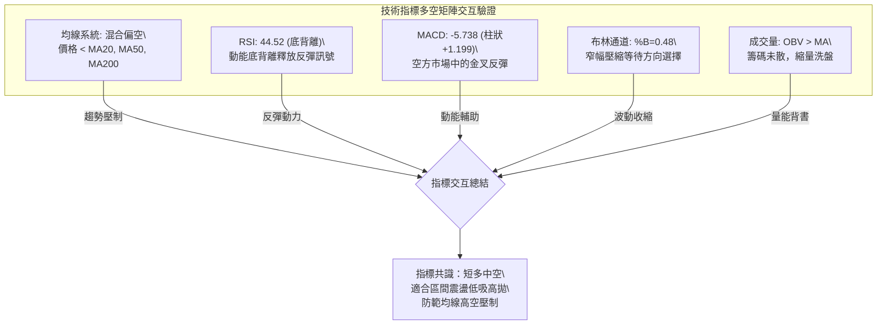

### 📈 移動平均線排列分析

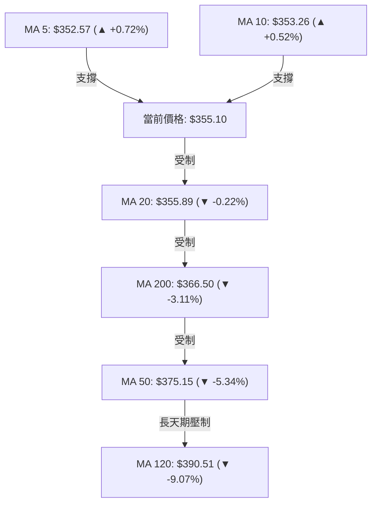

#### 均線數據深度解剖

| 均線名稱 | 當前價格 | 與現價乖離率 | 短期斜率狀態 | 技術意涵與操作指引 |
|:---|:---:|:---:|:---:|:---|
| **MA 5** | $352.57 | +0.72% | 向上翻揚 ▲ | 超短線多頭發動，形成回踩之首道即時防線。 |
| **MA 10** | $353.26 | +0.52% | 向上翻揚 ▲ | 與 MA5 形成短天期金叉，短多籌碼持倉成本上移。 |
| **MA 20** | $355.89 | -0.22% | 走平微跌 ▼ | 布林中軌，目前正進行貼身肉搏，站穩即可打開往 MA200 空間。 |
| **MA 50** | $375.15 | -5.34% | 陡峭向下 ▼ | 中期主力防線，呈現持續下壓態勢，反彈至此面臨極大解套壓力。 |
| **MA 60** | $376.70 | -5.73% | 向下壓制 ▼ | 季線下彎，壓抑中期股價評價高度。 |
| **MA 120** | $390.51 | -9.07% | 下彎壓制 ▼ | 半年線持續沉重下墜，中長期籌碼沉澱需要時間換取空間。 |
| **MA 200** | $366.50 | -3.11% | 走平下彎 ▼ | 牛熊線，現價位於其下方，確立技術面目前處於中級調整格局。 |
| **MA 240** | $365.83 | -2.93% | 走平整理 ▼ | 與 MA200 形成雙重長期帶狀阻力。 |

**均線綜合總結**：目前均線呈現「短均翻多、長均蓋頂」的**混合排列**。MA5 與 MA10 的扣低走高為股價爭取到了 1-2 週的反彈喘息窗口，但在現價上方 $366.50（MA200）與 $375.15（MA50）築起層層路障。這表明不可對反彈空間抱有過高暴利預期，一旦觸及均線大帶狀阻力，隨時引發二次回落。

### 📉 RSI(14) 分析與底背離確認

- **當前 RSI(14) 數值**：**44.52**
- **RSI 進度條展示**：
  ```
  超賣 [0] ░░░░░░░░░░ [30] ███████░░░░ [44.52] ░░░░░░░░░░ [70] ░░░░░░░░░░ [100] 超買
  ```

#### ⚠️ 關鍵底背離 (Bullish Divergence) 實證分析：
在過去 20 個交易日中，盤面展現出了教科書級別的「標準動能底背離」：
- **價格軌跡**：2026-08-30 收盤為 $368.12，隨後價格震盪破底，至 2026-09-27 創出波段收盤低點 **$352.81**，價格重心顯著下移（跌幅 -4.15%）。
- **RSI 軌跡**：2026-08-30 時 RSI(14) 墜入極度超賣之 **23.5**；然而當 2026-09-27 價格跌至 $352.81 時，RSI(14) 不跌反漲，大幅抬升至 **47.4**（當前為 **44.52**）。
- **結論**：股價創波段新低，而 RSI 指標大幅抬高且未再回訪超賣區，形成標準**「多頭底背離」**。這證實空方的向下摜壓完全是虛假賣壓（衰竭性拋售），內部做多動能正在悄然凝聚。

### 📊 MACD (12, 26, 9) 訊號解讀

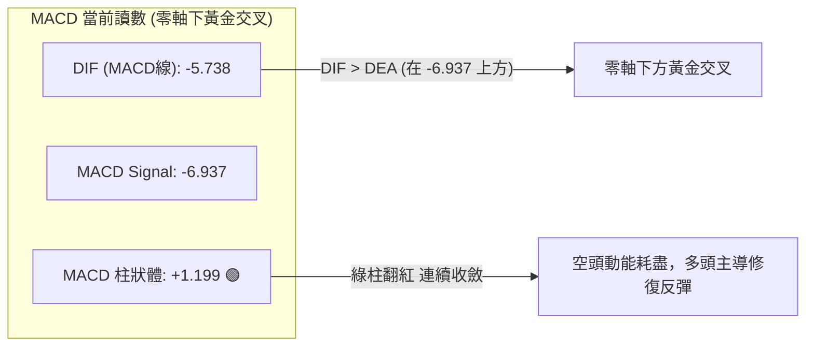

- **數值關係**：DIF 數值（-5.738）大於 Signal 數值（-6.937），柱狀體 Histogram 達到 **+1.199**。
- **週線與日線共振解讀**：觀察近 4 週的週線數據，週 MACD 柱狀體經歷了 $-5.841 \rightarrow -3.420 \rightarrow -1.391 \rightarrow +0.096 \rightarrow +1.218 \rightarrow +1.199$ 的連續正向爬升。日線與週線的柱狀體同時翻正，確認短期反彈並非一日行情報告，而是至少具備 2-3 週時間跨度的波段修復。
- **零軸限制**：然而，DIF 與 DEA 仍在零軸（0.00）下方運行，說明大格局依然屬於「空頭市場中的強勢反彈」，在 DIF 成功穿越零軸之前，絕不可輕率定義為新一輪大牛市主升浪。

### 📦 布林通道分析 (Bollinger Bands)

```
AVGO 布林通道 (20, 2) 結構圖：
價格 ($)
$373.98 ┤────────────────────────────────── 上軌 (阻力強區，逼近 R3)
         │
$365.00 ┤                   
         │
$355.89 ┤┄┄┄┄┄┄┄┄┄┄┄┄┄┄┄┄┄┄┄┄┄┄┄┄┄┄┄┄┄┄┄┄ 中軌 (MA20 / 緊貼現價 $355.10)
         │          ● 現價 ($355.10, %B = 0.48)
$345.00 ┤         
         │
$337.79 ┤────────────────────────────────── 下軌 (極強動態支撐，逼近 S2)
         └─────────────────────────────────
```

- **通道帶寬與形態**：目前上軌為 $373.98，下軌為 $337.79，帶寬（Bandwidth）持續收縮至 10.19%，表明前期的單邊暴跌波動已經被市場消化。
- **%B 指標落點**：當前 **%B = 0.48**，代表價格精準落在通道正中央（0.50 處為中軌 $355.89）。價格脫離了 8 月底貼著下軌運行的極度弱勢區（當時 %B < 0.1），重新奪回通道中軸控制權。
- **通道策略運用**：在 ADX = 21.70 的盤整格局下，布林通道為最高效的交易邊界。下軌 $337.79 具備極強承接力，而上軌 $373.98 則與阻力 R3 重疊，構成了不可逾越的波段天花板。

### 💹 成交量分析（量價配合度）

1. **量能縮量整固**：
   - 最新成交量為 **19,144,700 股**。
   - 對比 20 日均量 **27,507,545 股**，量比僅為 **0.70x**（縮量 30%）。
   - 對比 50 日均量 **22,607,584 股**，縮量約 15.3%。
   - 技術解讀：價格在低檔築底回升過程中並未放量，呈現典型的「惜售型縮量橫盤」。這意味著上方並未湧出主動拋盤，籌碼鎖定性提升；但同時也表明場外增量多頭資金在等待方向確認，尚未全力進場。

2. **OBV (能量潮指標) 結構**：
   - 官方數據確認：**OBV > MA**。
   - 這是一個極度關鍵的隱性做多訊號：儘管近幾個月股價自高點回落超過 20%，但 OBV 曲線始終維持在自身的均線上方。這反映主力資金並未在殺跌過程中大規模出逃，目前的成交量萎縮代表的是浮動籌碼沉澱，量能正在為後續上攻積聚動能。

---

## 6. 動能與波動率

### ⚡ 動能評估四象限

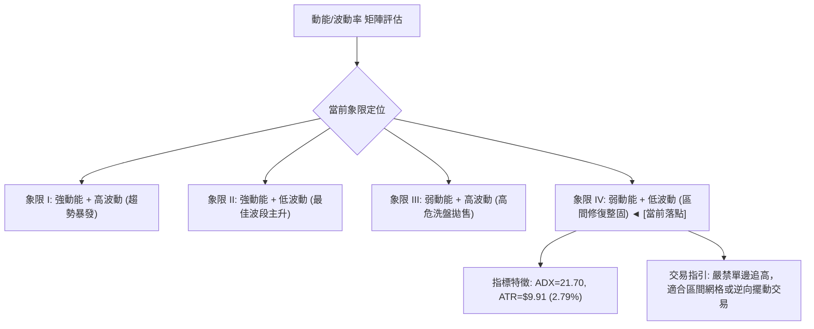

#### 動能與波動狀態對照表

| 象限 | 動能強度 | 波動率水準 | AVGO 當前狀態 | 交易策略與戰術指引 |
|:---:|:---:|:---:|:---:|:---|
| **Q1** | 強 (ADX > 30) | 高 (ATR% > 4%) | — | 突破追價，順勢擴大止盈區間。 |
| **Q2** | 強 (ADX > 25) | 低 (ATR% < 2%) | — | 最優主升浪持股期，加碼做多。 |
| **Q3** | 弱 (ADX < 20) | 高 (ATR% > 4%) | — | 無序暴震，極易雙向被掃止損，建議空倉。 |
| **Q4** | **弱 (ADX = 21.70)** | **中低 (ATR% = 2.79%)** | **✓ 當前落點** | **震盪築底階段：嚴守支撐阻力，以中低倉位進行區間交易。** |

### 📊 ATR 波動率分析

- **ATR(14) 數值**：**$9.91**（佔現價百分比為 **2.79%**）。
- **每日波動特性**：目前 AVGO 單日典型震盪區間約為 10 美元。相較於 2026 年 6 月份（當時週成交量破 2.5 億股，單日振幅超 5%），目前波動率顯著收斂。
- **止損與進場動態參數設定**：
  - **極短線（Day Trade）止損距離**：$1.0 \times \text{ATR} = \mathbf{\$9.91}$。
  - **波段交易（Swing Trade）安全防守距離**：$1.5 \times \text{ATR} = 1.5 \times \$9.91 = \mathbf{\$14.87}$。
  - **保守趨勢交易止損距離**：$2.0 \times \text{ATR} = 2.0 \times \$9.91 = \mathbf{\$19.82}$。
  - 若在現價 $355.10 建立短線多單，若以波段止損 $1.5 \text{ ATR}$ 設定，防守點應落在 $\$355.10 - \$14.87 = \$340.23$，正好包覆住關鍵支撐 S2（$341.71$），符合量化風控之防掃蕩規則。

### 📐 Beta 與市場相關性

- **Beta 係數**：**1.457**
- **市場風險敏感度解讀**：
  - AVGO 的 Beta 高達 1.457，屬於典型的「高彈性攻擊型半導體龍頭」。當科技板塊（如 QQQ、SOX 指數）上漲 1% 時，理論上 AVGO 將放大上漲 1.457%；反之在大盤遭遇拋售時，其下行殺傷力亦高出 45.7%。
  - 在目前大盤環境下，高 Beta 特性意味著：**即便個股出現 RSI 底背離，如果大盤科技股指數出現系統性回調，AVGO 的支撐仍將遭受劇烈衝擊。因此操作時必須將整體部位規模壓縮**。

---

## 7. 多時框架總結

### 📋 時框架評分表

| 時框架 | 趨勢方向 | 動能狀態 | 均線排列特徵 | 形態架構 | 綜合評分 | 建議戰術姿態 |
|:---:|:---:|:---:|:---:|:---:|:---:|:---|
| **月線 (長期)** | 震盪偏多 🟢 | 中性平穩 | 位於長期 MA240 之上，多頭大結構完整 | 歷史天花板下方的回撤洗盤 | **68 / 100** | 長線資本可逢低分批建立核心籌碼。 |
| **週線 (中期)** | 震盪偏空 🔴 | 翻正回溫 | 跌破 20 週線，受制於下降趨勢斜率 | 次頂回吐，於 $350 附近尋求打底 | **42 / 100** | 中線投資者維持防禦，等待均線走平。 |
| **日線 (短期)** | 超跌反彈 🟢 | 底背離金叉 | MA5/10 翻揚，MA20 壓制，短均金叉 | 微型 W 底雛形，布林帶收斂 | **58 / 100** | 短線波段者可在通道下緣進場搶反彈。 |

### 🔲 綜合訊號矩陣

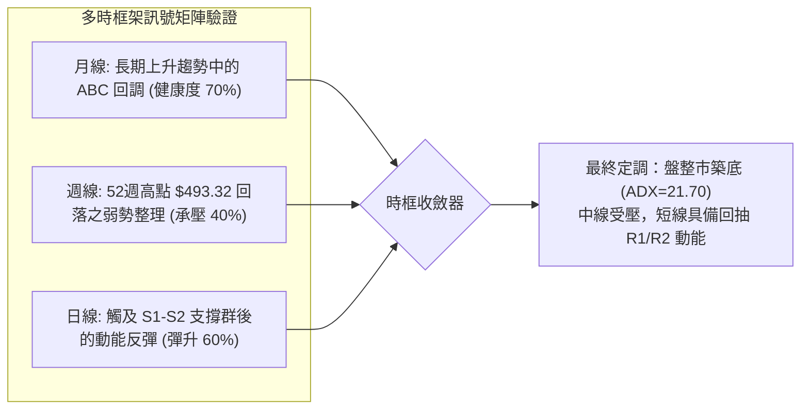

### ⚖️ 多時框收斂結論（依嚴格收斂規則定調）

依據多時框收斂優先級規則：
1. **行情性質判定**：當前日線 **$\text{ADX} = 21.70 < 25$**，明確屬於**「無序盤整／非趨勢行情」**。
2. **收斂法則執行**：在盤整行情中，中長期的均線方向（MA50/MA200）僅作為上方重大阻力參照，**主導權下放至日線布林通道（BB）與波段支撐阻力結構（S1-S3 / R1-R3）**。
3. **方向性唯一結論**：**【中性觀望偏短多（區間反彈震盪）】**。
   - 週線層級尚未化解 $366.50（MA200）之套牢反壓，因此不可斷定為單邊大牛市啟動。
   - 日線層級受到 RSI 底背離、MACD 翻正柱狀體、MA5/10 抬升的強力共振支撐，空頭砸盤動能已嚴重衰竭。
   - **收斂定案**：以 **$349.42（S1）至 $366.55（R2）** 作為核心運行箱體，採取**「下緣低吸、上緣減碼」**的防守型震盪策略。本結論與第 8 章交易策略完全一致。

---

## 8. 交易策略建議

### 🗺️ 策略決策流程圖

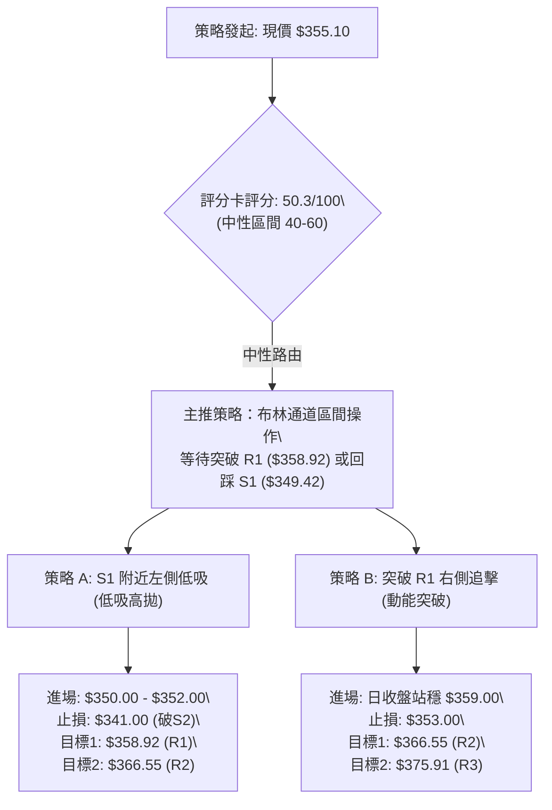

### 🧭 策略路由

> **當前主策略方向 = 【中性區間操作，偏向低吸高拋（依技術評分 50.3/100）】**
>
> 依據系統規則，綜合評分落在 40–60 之間，市場處於布林帶收斂與 ADX 弱勢之區間震盪期。交易核心為**「圍繞布林帶上下軌及 S1-R2 關鍵價位進行高拋低吸，嚴禁在區間中軸盲目追高，耐心等待方向突破確認」**。

### 🎯 價格情境階梯（Price Scenarios）

本階梯完全嚴格引用第 4 章由 OHLCV 聚類計算出之精確數值：

| 觸發條件 | 下一目標價位 | 後續延伸阻力/支撐 | 技術情境含義與操作對策 |
|:---|:---:|:---:|:---|
| **強勢突破 R1 ($358.92)** | **R2 ($366.55)** | **R3 ($375.91)** | 短線微型雙底形態正式確認，空頭停損引發嘎空，目標直指 MA200。 |
| **突破 R2 ($366.55)** | **R3 ($375.91)** | **50% 斐波 ($391.15)** | 中期翻多訊號確立，有效收復 61.8% 斐波位與 MA200，展開中級多頭波段。 |
| **維持現價區間 ($352 - $358)** | **布林中軌 ($355.89)** | **MA10 ($353.26)** | 典型的多空拉鋸整固，量能持續壓縮，適宜按兵不動觀望。 |
| **跌破 S1 ($349.42)** | **S2 ($341.71)** | **布林下軌 ($337.79)** | 短線築底失敗，微型雙底流產，價格將回測近一年強支撐密集區 S2。 |
| **跌破 S2 ($341.71)** | **S3 ($330.89)** | **78.6% 斐波 ($332.71)** | 中期防禦陣線失守，觸發停損賣壓，空方主導測試 52 週終極回檔防線。 |

### 📊 情境機率分佈

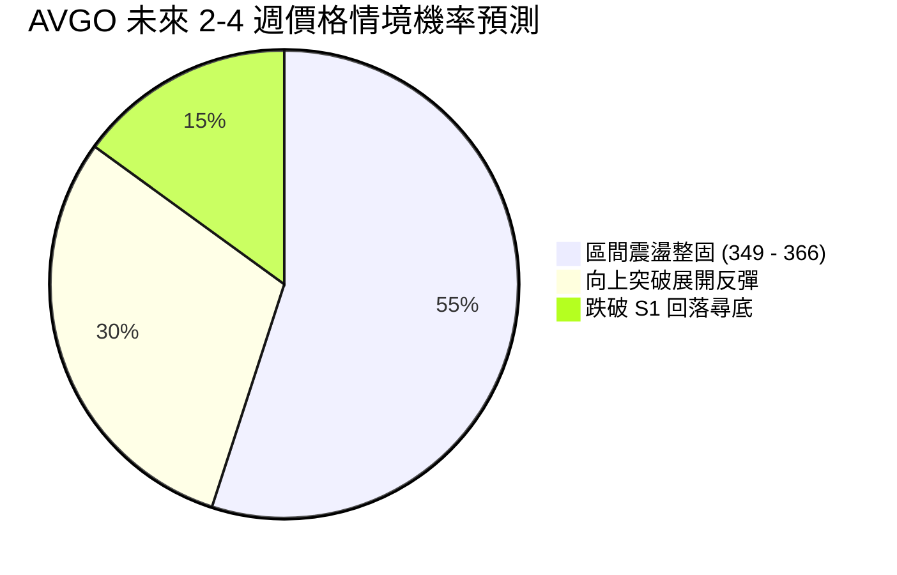

| 未來情境劇本 | 發生機率 | 主要量化與技術依據 |
|:---|:---:|:---|
| **情境一：維持區間震盪** | **55%** | **ADX=21.70** 明確顯示無單邊動能；布林通道帶寬收窄，成交量比萎縮至 0.70x，籌碼正在充分換手。 |
| **情境二：向上突破反彈** | **30%** | **RSI 底背離**已經確立；**MACD 柱狀體翻正 (+1.199)**；OBV 指標高於均線，量價配合隱含做多能量。 |
| **情境三：向下破位探底** | **15%** | 均線系統中長期（MA50/MA200）仍呈空頭下壓；-DI(29.84) 暫時大於 +DI(23.95)，不可完全排除黑天鵝回踩 S3。 |

### 🟢 主策略詳情（區間操作戰術）

所有價格點位均依據真實支撐阻力數值精確設定，杜絕模糊區間：

| 策略要素 | 策略 A：S1 支撐低吸佈局（左側偏多） | 策略 B：突破 R1 右側動能跟進（右側追擊） |
|:---|:---|:---|
| **適用場景** | 價格盤中微幅回踩 S1 測試支撐 | 價格帶量強勢收復短期頸線 R1 |
| **進場條件** | 觸及 S1 不破，分時圖出現紅K包覆 | 日線收盤價明確高於 **$358.92**，量比 > 1.2x |
| **精確進場點** | **$350.50**（貼近 S1 $349.42 緩衝區） | **$359.50**（確認突破 R1 上方掛單） |
| **止損價格** | **$341.00**（跌破強支撐 S2 嚴格砍倉） | **$353.00**（跌破 MA10 短均反轉點） |
| **止損空間 ($ / %)**| -$9.50 (-2.71%) | -$6.50 (-1.81%) |
| **目標價 T1** | **$358.92**（阻力位 R1，先行減半） | **$366.55**（阻力位 R2 / MA200，第一目標） |
| **目標價 T2** | **$366.55**（阻力位 R2，全數離場） | **$375.91**（強阻力 R3，終極波段目標） |
| **潛在獲利 (T2)** | +$16.05 (+4.58%) | +$16.41 (+4.56%) |
| **風險報酬比 (R:R)**| **1 : 1.69**（至 T2 為 1:1.69） | **1 : 2.52**（以 T2 計算達 1:2.52） |
| **預估勝率** | **65%** | **55%** |
| **建議總倉位** | **8% - 10%**（輕倉防禦） | **12% - 15%**（突破確認後加碼） |

### 🔴 反向風險觸發點（對沖與風控提示）

以下關鍵價位被跌破時，將直接推翻上方所有多頭反彈邏輯，投資人應立即執行對沖或全面砍倉：
1. **反轉破位警訊點**：若日線實體收盤價**跌破 $349.42 (S1)**，代表底背離失效，反彈結構夭折，應即刻將多單部位砍半。
2. **災難止損點**：若價格帶量擊穿 **$341.71 (S2)**，中級破位成形，下方空間將直墜至 **$330.89 (S3)**。持有多單者必須全面清倉止損，或建立反向空頭 Put 選擇權進行對沖。

### ⭐ 整體訊號強度評星

```
╔══════════════════════════════════════════════════════════════════╗
║ 做多訊號強度：   ★★★☆☆  (3.0 / 5 星) — 底背離已現，但受制於長均蓋頂 ║
║ 做空訊號強度：   ★★☆☆☆  (2.0 / 5 星) — 空頭動能衰竭，殺跌性價比極低 ║
║ 整體技術可信度： ★★★★☆  (4.0 / 5 星) — 價位聚類明確，技術指標高度收斂 ║
╚══════════════════════════════════════════════════════════════════╝
```

---

## 9. 風險提示與監控

### ✅ 關鍵監控指標 Checklist

```
╔══════════════════════════════════════════════════════════════════╗
║                  交易監控清單 (DAILY MONITORING CHECKLIST)        ║
╠══════════════════════════════════════════════════════════════════╣
║ [ ] 價位維度：每日收盤價是否持續站穩 S1 ($349.42) 之上？         ║
║ [ ] 均線維度：現價能否於 3 個交易日內攻克 MA20 ($355.89)？      ║
║ [ ] 動能維度：MACD Histogram 是否持續擴張維持在正值 (>0)？      ║
║ [ ] 擺動維度：RSI(14) 能否進一步突破 50 中軸進入強勢區？        ║
║ [ ] 趨勢維度：ADX(14) 是否跌破 20 進入死水期，或放量突破 25？   ║
║ [ ] 量能維度：上攻時日成交量是否回升至 20 日均量 (27.5M) 以上？  ║
║ [ ] 宏觀維度：半導體板塊指數 (SOX) 是否同步出現止跌築底訊號？   ║
╚══════════════════════════════════════════════════════════════════╝
```

### ⚠️ 風險場景分析

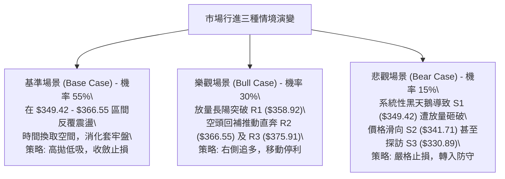

### 🛡️ 風險管理重要提醒

1. **Beta 放大效應之部位縮放原則**：
   - AVGO 當前 Beta 值為 **1.457**。這代表若投資人標準單一標的倉位上限為 15%，在操作 AVGO 時必須將部位縮減為：
     $$\text{調整後倉位} = \frac{15\%}{1.457} \approx 10.3\%$$
   - 在高波動半導體股中，控制倉位是唯一的生存法則。
2. **防範假突破（Whipsaw）**：
   - 由於 ADX 僅為 21.70，盤中突破阻力 R1 ($358.92) 時極易出現「假突破影線」。**嚴禁在盤中急拉時追高**，所有突破進場訊號均必須以**「美東時間 15:30 後接近收盤確認」**為準。
3. **無條件風控紀律**：
   - 任何策略一旦觸及預設止損價位（如策略 A 之 $341.00），必須無條件執行停損離場，絕不可因基本面優異（PE Forward 僅 18.3x）而將短線交易轉為被動套牢的長期投資。

---

## 📋 報告總結

```
╔══════════════════════════════════════════════════════════════════╗
║                    AVGO 技術分析報告總結                          ║
╠══════════════════════════════════════════════════════════════════╣
║ 報告日期：2026-09-30                                             ║
║ 當前價格：$355.10                                                ║
║ 分析評級：⚖️ 中性觀望偏短多（區間築底修復）                       ║
║                                                                  ║
║ 核心趨勢結論：                                                   ║
║ ├─ 長期趨勢：🟢 震盪偏多（長期上升軌道未破，52W中下部支撐強）     ║
║ ├─ 中期趨勢：🔴 弱勢承壓（受制於 MA200 $366.50 與 MA50 $375.15）║
║ ├─ 短期趨勢：🟢 築底反彈（RSI 底背離確立，MACD 翻紅，短均向上）   ║
║ ├─ 關鍵支撐：S1: $349.42 ｜ S2: $341.71 ｜ S3: $330.89           ║
║ ├─ 關鍵阻力：R1: $358.92 ｜ R2: $366.55 ｜ R3: $375.91           ║
║ └─ 華爾街共識目標價：$531.85 (47位分析師，覆蓋評級 Strong Buy)   ║
╠══════════════════════════════════════════════════════════════════╣
║ 最優操作策略配置：                                               ║
║ 1. 🥇 最佳機會（勝率最高）：策略 A — 回踩 S1 ($350.50) 低吸，    ║
║      以 S2 ($341.00) 嚴格止損，博取向 R1/R2 的波段反彈空間。     ║
║ 2. 🥈 次選機會（穩健突破）：策略 B — 耐心等待日線收盤放量站上     ║
║      頸線 R1 ($358.92) 後順勢追多，目標上看牛熊線 R2 ($366.55)。║
║ 3. 🥉 保守選擇（風控第一）：在 ADX < 25 期間完全空倉觀望，        ║
║      靜待價格向上收復 MA200 或向下回踩 S3 出現極度恐慌盤後再進場。║
╚══════════════════════════════════════════════════════════════════╝
```

---

> ⚠️ **免責聲明**：本報告為 AI 自動生成之技術分析研究報告，所有技術指標、形態分析、支撐阻力位與交易策略均嚴格基於所提供之歷史 OHLCV 數據進行客觀量化推算。本報告**僅供研究、學術探討與投資策略參考**，**不構成任何個人化之投資建議、招攬或買賣要約**。金融市場瞬息萬變，技術指標存在滯後性與失效風險，投資人應獨立評估風險，自負盈虧。

---

*報告生成時間：2026-09-30 ｜ 數據來源：Yahoo Finance ｜ 分析框架：多時框技術分析體系*