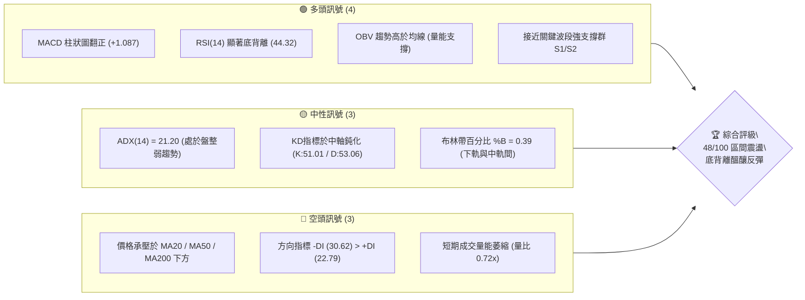
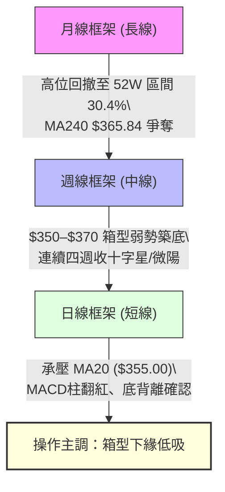
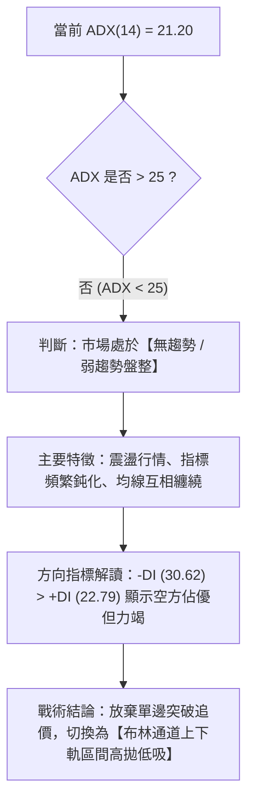
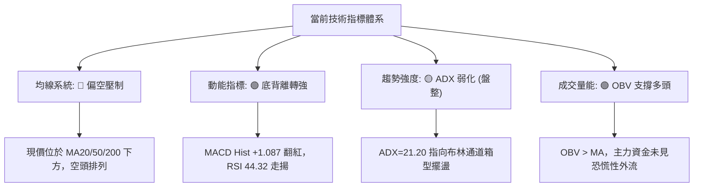
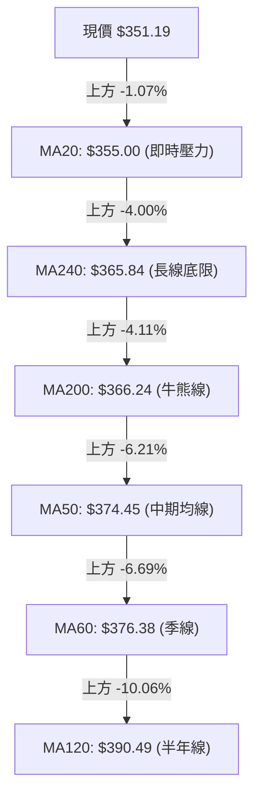
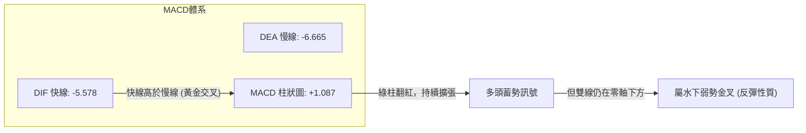
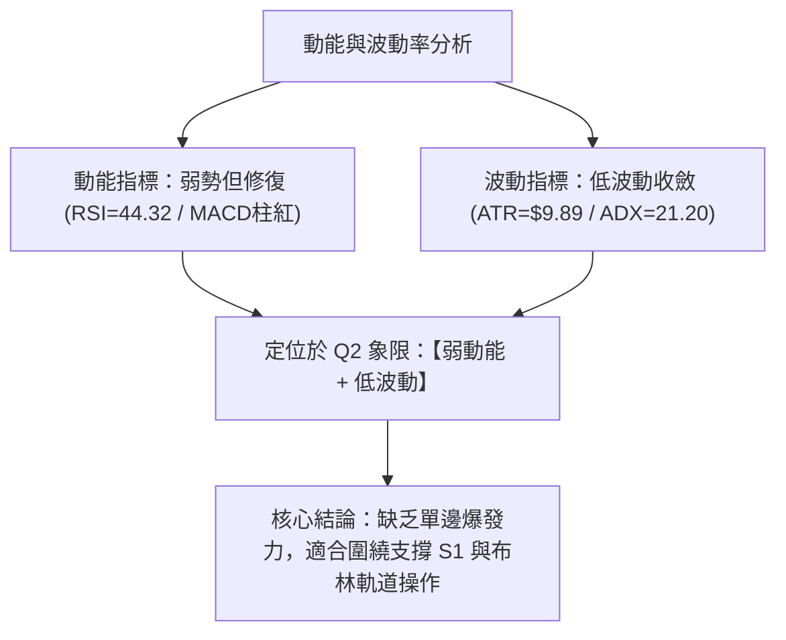
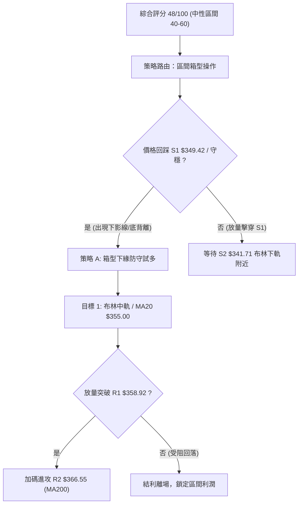
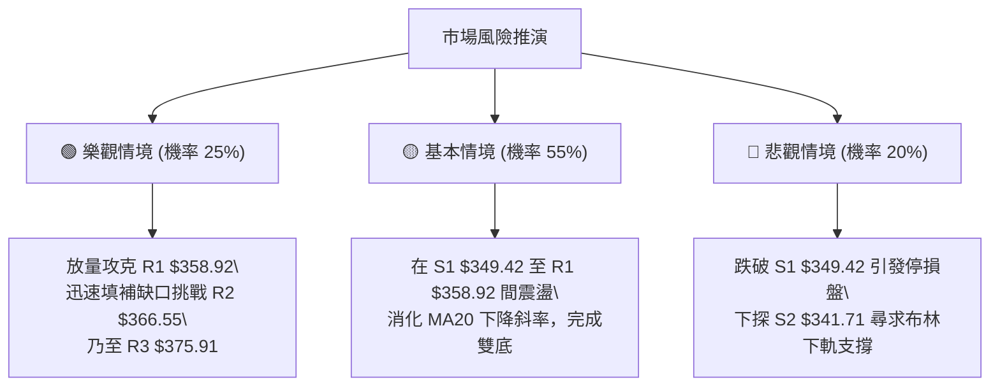

# AVGO 技術分析報告

> **報告日期**：2026-10-01 ｜ **語言**：繁體中文 ｜ **數據來源**：Yahoo Finance ｜ **當前價格**：$351.19

---

## 目錄

| 章節 | 內容 |
|------|------|
| [1. 技術面概覽](#1-技術面概覽) | 訊號儀表板、核心指標、評分卡 |
| [2. 趨勢分析](#2-趨勢分析) | 多時框趨勢、長中短期走勢、ADX解讀 |
| [3. 圖表形態分析](#3-圖表形態分析) | 形態識別、K線組合、目標價推算 |
| [4. 支撐與阻力](#4-支撐與阻力) | 關鍵價位分布、斐波那契回調結構 |
| [5. 技術指標深度解讀](#5-技術指標深度解讀) | MA/RSI/MACD/布林通道/成交量配合 |
| [6. 動能與波動率](#6-動能與波動率) | 動能評估四象限、ATR、Beta相關性 |
| [7. 多時框架總結](#7-多時框架總結) | 時框架評分矩陣與多時框收斂結論 |
| [8. 交易策略建議](#8-交易策略建議) | 策略路由、價格階梯、主策略與風控 |
| [9. 風險提示與監控](#9-風險提示與監控) | 監控清單、情境模擬與倉位管理 |

---

## 1. 技術面概覽

### 🎯 技術訊號儀表板

Broadcom Inc.（AVGO）當前收盤價為 **$351.19**，位於 52 週波動區間（$288.98 – $493.32）的 **30.4%** 相對低位。整體技術架構呈現「中長期震盪築底、短期動能底背離修復、多空博弈收斂」之特徵。



---

### 📊 核心指標速覽表

| 指標類別 | 指標名稱 | 當前數值 | 訊號 | 解讀 |
|:---|:---|:---|:---:|:---|
| **價格** | 現價收盤 | $351.19 | 🟡 | 位於52週區間 30.4%，接近底部緩衝區 |
| **均線** | 短期 MA20 | $355.00 | 🔴 | 現價在 MA20 下方 -1.07%，構成即時壓制 |
| **均線** | 中期 MA50 | $374.45 | 🔴 | 現價在 MA50 下方 -6.21%，中期下降斜率猶存 |
| **均線** | 長期 MA200| $366.24 | 🔴 | 現價在牛熊分界線下方 -4.11%，長線結構受壓 |
| **均線** | 極限 MA240| $365.84 | 🔴 | 現價在 MA240 下方 -4.00%，構成密集成交壁壘 |
| **動能** | RSI(14) | 44.32 | 🟢 | 中性區間，日線與週線呈現典型**底背離 (Bullish Divergence)** |
| **動能** | MACD(12,26,9)| -5.578 / -6.665| 🟢 | 雙線位於零軸下，但 Hist 為 **+1.087**，黃金交叉發散 |
| **擺動** | Stoch %K/%D| 51.01 / 53.06 | 🟡 | 處於 50 中軸附近，動能暫處均衡狀態 |
| **趨勢** | ADX(14) | 21.20 | 🟡 | 數值低於 25，單邊趨勢消退，進入區間箱型整理 |
| **通道** | 布林通道 | $337.90–$372.10| 🟡 | %B 為 0.39，自下軌附近微幅彈升至中軌 ($355.00) 測壓 |
| **量能** | 20日均量比| 0.72x | 🔴 | 量能 19.69M 低於 20MA(27.53M)，量縮觀望 |
| **量能** | OBV 趨勢 | OBV > MA | 🟢 | 能量潮維持在均線之上，長線籌碼沉澱穩定 |
| **波動** | ATR(14) | $9.89 (2.82%) | 🟡 | 波動率收斂至常態偏低水平，利於低吸防守 |

---

### 🏆 技術評分卡

```
╔══════════════════════════════════════════════════════════════╗
║              技術評分卡 — AVGO (2026-10-01)                 ║
╠══════════════════════════════════════════════════════════════╣
║ 趨勢強度 (Trend)     ██████░░░░░░░░░░░░░░  30/100  🔴 空頭慣性 ║
║ 動能指標 (Momentum)  ████████████░░░░░░░░  60/100  🟢 底背離現 ║
║ 支撐穩定度 (Support) ██████████████░░░░░░  70/100  🟢 密集築底 ║
║ 成交量配合 (Volume)  ██████████░░░░░░░░░░  50/100  🟡 量縮沉澱 ║
║ 形態完整度 (Pattern) ████████░░░░░░░░░░░░  40/100  🟡 箱型收斂 ║
║ 均線系統 (MA System) ██████░░░░░░░░░░░░░░  30/100  🔴 空頭壓制 ║
╠══════════════════════════════════════════════════════════════╣
║ 綜合評分 (Overall)   █████████░░░░░░░░░░░  48/100  🟡 區間震盪 ║
║ 定位結論：弱趨勢盤整（ADX=21.20），以布林軌道區間策略為主      ║
╚══════════════════════════════════════════════════════════════╝
```

---

## 2. 趨勢分析

### 🌐 多時框趨勢分析



---

### 📈 長期趨勢 — 12個月走勢圖（Unicode）

以下為 AVGO 過去 12 個月（2025-10 至 2026-09）之月線收盤走勢全景圖，標記歷史最高點、轉折點與當前定錨價位：

```
AVGO 月線收盤走勢圖（過去12個月）
價格軸 ($)
$450 ┤                                  ● $445.25 (2026-05 次高)
$430 ┤                            ● $416.01
$410 ┤
$390 ┤              ● $399.99
$370 ┤        ● $366.90                         ● $377.06   ● $369.67
$350 ┤                                                    ● $351.19 (現價)
$330 ┤                    ● $344.20 ● $329.48
$310 ┤                                ● $317.80 ● $308.46
     └────────────────────────────────────────────────────────────
        10    11    12    01    02    03    04    05    06    07    08    09  (月份)
       '25   '25   '25   '26   '26   '26   '26   '26   '26   '26   '26   '26
```

#### 走勢特徵分析表格

| 階段區間 | 時間跨度 | 價格起訖 | 漲跌幅 | 結構與成交特徵 | 技術意義 |
|:---|:---:|:---:|:---:|:---|:---|
| **階段 I：主升衝頂** | 2025-10 ~ 2025-11 | $366.90 → $399.99 | +9.02% | 延續多頭主升浪，突破整數大關 | 形成歷史高檔密集成交區 |
| **階段 II：第一波修正** | 2025-12 ~ 2026-03 | $399.99 → $308.46 | -22.88% | 連續4個月震盪回調，築出低點 | 確立 S3 附近之強支撐帶 |
| **階段 III：次級反彈頂**| 2026-04 ~ 2026-05 | $308.46 → $445.25 | +44.35% | 強勢修復衝擊 $493.32 天花板 | 52週高點 $493.32 之次頂確認 |
| **階段 IV：陰跌整理** | 2026-06 ~ 2026-09 | $445.25 → $351.19 | -21.13% | 均線轉向混亂，震盪走低至支撐群 | 進入 $350 關卡多空攻防期 |

---

### 📊 中期趨勢（週線分析）

從近 20 週高頻數據觀察，價格在 2026-05-31 觸及 $445.25 後大幅回撤，並在 2026-08-30 於 **$368.12**（RSI 跌至 23.5 極度超賣）完成急跌釋放；隨後在 9 月初下探 **$357.25** 及 **$351.19**，呈現「價格創短期新低，但 RSI 自 23.5 抬升至 44.3」之強烈底背離。

```
近期週線收盤走勢與關鍵均線壓制示意圖：
$450 ┤ ● ($445.25)
$430 ┤    ＼
$410 ┤      ● ($409.95)   ● ($426.98 假突破)
$390 ┤         ＼       ／   ＼            ═══════ MA120: $390.49
$370 ┤           ●───●         ●───●      ═══════ MA60 / MA50: $374–$376
$350 ┤                               ●──● ◄ 現價 $351.19 (接近 S1: $349.42)
$330 ┤                                     ═══════ S3: $330.89 / Fib 78.6%
     └────────────────────────────────────
      05/31  06/21  07/12  08/09  08/30  10/01
```

---

### ⚡ 趨勢強度評估（ADX 解讀）



| 指標名稱 | 當前數值 | 臨界標準 | 狀態評估 | 實戰策略含義 |
|:---|:---:|:---:|:---:|:---|
| **ADX(14)** | 21.20 | 25.00 | 弱趨勢 / 盤整 | 趨勢性策略失效，嚴禁追漲殺跌，回歸箱型支撐防守 |
| **+DI** | 22.79 | -DI 數值 | 空頭微幅佔優 | 多方反擊力道不足以形成跨波段單邊單邊拉升 |
| **-DI** | 30.62 | 30.00 | 空方動能趨緩 | 數值已達空方臨界上限，未見恐慌性發散，殺跌動能減弱 |

---

## 3. 圖表形態分析

### 🔍 形態識別系統

依據形態信心度評級標準（規則 15），嚴格避免憑空臆測幾何形態，僅對圖表中已浮現之價格幾何收斂進行測算：

| 形態名稱 | 信心度 | 判斷依據（引用數據） | 完成度 | 目標價（附計算式） |
|:---|:---:|:---|:---:|:---|
| **潛在雙重底 (W-Bottom)** | **62%** | 第一低點 2026-09-06 ($357.25)，第二低點現價測 S1 ($349.42)，RSI 出現明顯底背離 | 45% (未突破頸線) | 頸線 R2 ($366.55) + 形態高差 ($366.55 - $349.42 = $17.13) = **$383.68** |
| **下降通道收斂 (Falling Wedge)**| **58%** | 連接 08-09 高點 $426.98、08-16 $392.28 下降趨勢線，與 08-30 $368.12、09-27 $352.81 支撐線 | 70% (壓縮至尾端) | 突破上軌 $358.92 (R1) 則量度回測起跌點 = **$392.28** |
| **頭肩頂形態 (Head & Shoulders)**| **35%** | 數據不足（僅左肩 $426.98 與頭部 $445.25，無明顯右肩反抽） | 15% | 訊號不足，信心度 < 50%，不採納為有效形態 |

---

### 🕯️ 重要K線形態分析

| 週/月份 | 收盤價 | K線形態 | 解讀 | 訊號 |
|:---:|:---:|:---|:---|:---:|
| **2026-08-09** | $426.98 | 長上影流星線 (Shooting Star) | 多頭放量衝刺 $493.32 未果，高位主力籌碼派發 | 🔴 強烈看空 |
| **2026-08-30** | $368.12 | 長下影錘頭線 (Hammer) | 股價單週下殺超賣，低位買盤承接，週 RSI 觸及 23.5 | 🟢 觸底反彈訊號 |
| **2026-09-20** | $356.96 | 紡錘十字線 (Spinning Top) | 波動率大幅收縮，成交量降至中性，空方推動力明顯頓挫 | 🟡 變盤醞釀 |
| **2026-10-04 (當前)** | $351.19 | 縮量十字星 (Doji) | 現價精準卡位 S1 ($349.42)，成交量 60.4M 顯著萎縮，拋壓衰竭 | 🟢 變盤向上機率高 |

---

### 📉 ASCII 走勢形態示意圖

```
AVGO 近期日線級別「下降楔形收斂與潛在雙底」示意圖
$375 ┤                   [阻力 R3: $375.91 / MA60: $376.38]
$370 ┤         ● (08/23: $367.78)
$365 ┤          ＼          [頸線 / 阻力 R2: $366.55 / MA200: $366.24]
$360 ┤            ＼    ● (09/13: $361.33)
$355 ┤ 楔形上軌 ───＼───＼─────── [阻力 R1: $358.92 / MA20: $355.00]
$350 ┤                 ● (09/06: $357.25)
$345 ┤                  [第一底]       ● (10/01 現價: $351.19 / S1: $349.42)
$340 ┤ 楔形下軌 ────────────────────-─- [第二底測試中]
$335 ┤                                   [強支撐 S2: $341.71]
     └────────────────────────────────────────────────────────────
```

---

### 🎯 形態目標價計算

根據雙重底築底形態推算：
1. **基底支撐點位**：取近期波段低點支撐聚類 **$349.42 (S1)**。
2. **形態頸線阻力**：取波段反彈聚類高點與 MA200 匯合點 **$366.55 (R2)**。
3. **形態高度 ($H$)**：$H = 頸線 - 支撐 = \$366.55 - \$349.42 = \$17.13$。
4. **目標價推算**：
   - **第一突破目標價 (T1)**：即回測阻力位 $R1 = \mathbf{\$358.92}$（形態內部收復）。
   - **第二理論目標價 (T2)**：突破頸線後的 1:1 垂直對稱等幅投影：
     $$\text{Target T2} = \text{頸線 } \$366.55 + H (\$17.13) = \mathbf{\$383.68}$$
     *(註：該價位逼近 MA120 $390.49 與斐波那契 50.0% $391.15 的強阻力區間)*。

---

## 4. 支撐與阻力

### 🗺️ 關鍵價位分布圖（Unicode）

```
╔══════════════════════════════════════════════════════════════╗
║              AVGO 關鍵價位空間結構分布圖                      ║
╠══════════════════════════════════════════════════════════════╣
║ $415.26 ║██████████████████████████████║ 斐波那契 38.2% 回調位 ║
║ $391.15 ║████████████████████████      ║ 斐波那契 50.0% 中樞位 ║
║ $375.91 ║████████████████████          ║ 強阻力 R3 (MA60 重合)║
║ $367.03 ║████████████████              ║ 斐波那契 61.8% 黃金分割║
║ $366.55 ║██████████████                ║ 重要阻力 R2 (MA200 壁壘)║
║ $358.92 ║████████                      ║ 近期關鍵阻力 R1 (MA20)║
║ $351.19 ╠══════════════════════════════╣ ◄ 當前收盤價 ($351.19)║
║ $349.42 ║▓▓▓▓▓▓▓▓▓▓▓▓▓▓▓▓▓▓▓▓          ║ 核心近期支撐 S1       ║
║ $341.71 ║▓▓▓▓▓▓▓▓▓▓▓▓▓▓▓▓▓▓▓▓▓▓▓▓      ║ 結構強支撐 S2 (波段底)║
║ $337.90 ║▓▓▓▓▓▓▓▓▓▓▓▓▓▓▓▓▓▓▓▓▓▓▓▓▓▓    ║ 日線布林帶下軌        ║
║ $330.89 ║▓▓▓▓▓▓▓▓▓▓▓▓▓▓▓▓▓▓▓▓▓▓▓▓▓▓▓▓▓▓║ 極限波段防守 S3       ║
╚══════════════════════════════════════════════════════════════╝
```

---

### 🚧 阻力位分析表

所有價位均嚴格引用提供數據中的波段高點聚類與指標關鍵位：

| 阻力級別 | 精確價位 | 形成原因與技術重合性 | 突破難度 | 重要性評級 |
|:---:|:---:|:---|:---:|:---:|
| **R1** | **$358.92** | 近期小波段反彈高點聚類；上方緊貼 20日均線 ($355.00) 與 10日均線 ($354.48) | 🟡 中等 | ★★★☆☆ (短線多空分水嶺) |
| **R2** | **$366.55** | 近期波段密集成交高點；與 MA200 ($366.24)、MA240 ($365.84) 及 Fib 61.8% ($367.03) 形成四重共振壁壘 | 🔴 極高 | ★★★★★ (中期牛熊轉換樞紐) |
| **R3** | **$375.91** | 一年內重要反彈破位點；與 MA50 ($374.45)、MA60 ($376.38) 及布林上軌 ($372.10) 密集交疊 | 🔴 極高 | ★★★★☆ (強勢多頭確認位) |

---

### 🛡️ 支撐位分析表

所有價位均嚴格引用提供數據中的波段低點聚類與指標關鍵位：

| 支撐級別 | 精確價位 | 形成原因與技術重合性 | 守住機率 | 重要性評級 |
|:---:|:---:|:---|:---:|:---:|
| **S1** | **$349.42** | 近期波段低點聚類，距離現價僅 -0.50%；日線連續多日在此止跌，為多頭第一道防線 | 🟢 70% | ★★★★☆ (短線進場停損基準) |
| **S2** | **$341.71** | 近一年次級波段強支撐低點；下方 $337.90 為日線布林通道下軌，形成雙重緩衝 | 🟢 85% | ★★★★★ (波段箱型底限) |
| **S3** | **$330.89** | 近一年極限回撤波段低點聚類；與斐波那契 78.6% 回調位 ($332.71) 形成堅固共振 | 🟢 95% | ★★★★★ (年度價值安全邊際) |

---

### 📐 斐波那契回調位分析

依據 52 週完整波動區間（高點 **$493.32** 至 低點 **$288.98**，落差 $204.34）計算：

| 斐波那契比例 | 精確對應價位 | 與現價距離 (%) | 結構含義與當前狀態解讀 |
|:---:|:---:|:---:|:---|
| **0.0%** (52W High) | **$493.32** | +40.47% | 歷史極限高點，中期天花板 |
| **23.6%** | **$445.09** | +26.74% | 次級反彈高點（2026-05月線收盤 $445.25 重合） |
| **38.2%** | **$415.26** | +18.24% | 寬幅震盪區間上緣（2026-04月線收盤 $416.01 重合） |
| **50.0%** | **$391.15** | +11.38% | 多空中樞平衡位（與 MA120 $390.49 共振） |
| **61.8%** | **$367.03** | +4.51% | **黃金分割關鍵位**，與 R2 ($366.55) 及 MA200 ($366.24) 完美疊加 |
| **78.6%** | **$332.71** | -5.26% | 深度回調防守位，緊鄰 S3 關鍵支撐 ($330.89) |
| **100.0%** (52W Low) | **$288.98** | -17.71% | 52週週期底部支撐 |

**斐波那契現狀解讀**：
當前收盤價 **$351.19** 明確坐落於 **61.8% 回調位 ($367.03)** 與 **78.6% 回調位 ($332.71)** 之間。現價已跌破 61.8% 黃金回撤位，代表中級多頭趨勢已被破壞，市場進入深層次探底循環。然而，下方的 78.6% 回調位 ($332.71) 與波段聚類支撐 S3 ($330.89) 構成天然底部，現價距離 S1 ($349.42) 僅一步之遙，提供極佳的不對稱盈虧比防守點。

---

## 5. 技術指標深度解讀

### 🎛️ 指標訊號總覽



---

### 📈 移動平均線排列分析



| 均線名稱 | 價位 | 乖離率 (%) | 斜率與微觀走勢特徵 | 訊號評級 |
|:---|:---:|:---:|:---|:---:|
| **MA5** | $351.81 | -0.18% | 微幅下彎，現價貼合均線走平，殺跌減速 | 🟡 中性 |
| **MA10** | $354.48 | -0.93% | 緩步下壓，與 MA20 形成密集阻力帶 | 🔴 偏弱 |
| **MA20** | $355.00 | -1.07% | 下行速率放緩，短線反彈突破的首要目標 | 🔴 阻力 |
| **MA50** | $374.45 | -6.21% | 空頭排列中段壓制，與 MA60 ($376.38) 構成中期蓋頂 | 🔴 空頭 |
| **MA200**| $366.24 | -4.11% | 牛熊分界線，失守後目前轉化為強大回抽反壓 | 🔴 重壓 |
| **MA240**| $365.84 | -4.00% | 兩年年線位置，與 MA200 緊密靠攏，形成核心防線轉換區 | 🔴 重壓 |

**排列總結**：均線系統呈現「短期均線走平黏合、中長期均線高位空頭排列」之混亂狀態。現價全數運行於所有主要均線下方，說明空頭趨勢在慣性上仍佔優勢；但 MA5 至 MA20 乖離已顯著收縮，向下動能基本耗盡。

---

### 📉 RSI(14) 分析

當前 14 日 RSI 數值為 **44.32**，處於中性區間偏弱側。

```
RSI(14) 強度刻度條：
0 ────── 20 ──────── 30 ────────────── 50 ────────────────── 70 ────── 80 ────── 100
[ 極度超賣 ] [  超賣區  ]    現價 44.32 ▓▓▓▓▓▓▓▓▓░░░░░░░░░░    [  超買區  ] [ 極度超買 ]
```

- **背離形態確認（極重要）**：
  - **價格走勢**：AVGO 週線價格從 2026-08-30 的 **$368.12** 下跌至 2026-09-06 的 **$357.25**，再下挫至當前 **$351.19**，形成連續價格破底。
  - **RSI 軌跡**：對應時點的 RSI 分別為 **23.5**（08-30）→ **29.2**（09-06）→ **44.32**（當前），指標低點顯著一底比一底高。
  - **結論**：日線與週線級別形成極度標準的 **🟢 底背離 (Bullish Divergence)**，說明雖然現價在破底，但空頭拋售能量急劇衰退，多頭買盤正於水面下持續吸籌，常為中線反彈強訊號。

---

### 📊 MACD(12,26,9) 訊號解讀



- **數值分析**：MACD 線為 **-5.578**，訊號線（Signal）為 **-6.665**，柱狀圖（Histogram）為 **+1.087**。
- **解讀**：DIF 已在零軸下方向上穿越 DEA 形成「水下黃金交叉」，柱狀圖呈現持續正向擴張（+0.096 → -0.368 → +1.218 → +1.087）。這與 RSI 的底背離相互印證，確認短線動能已轉向多方佔優。

---

### 📦 布林通道分析

日線布林通道（20MA，2 倍標準差）呈現窄幅水平收斂走勢：
- **上軌 (Upper Band)**：$372.10
- **中軌 (Middle Band / MA20)**：$355.00
- **下軌 (Lower Band)**：$337.90
- **帶寬 (Bandwidth)**：$(372.10 - 337.90) / 355.00 = 9.63\%$（處於近期壓縮低點）
- **指標位置 (%B)**：0.39

```
布林通道當前價位分布截面圖：
$372.10 ┬────────────────────────────────────────── 布林上軌 (強阻力區)
         │
$355.00 ┼─────────────────── 中軌 (MA20 阻力 $355.00)
         │  ◄ 現價 $351.19 (%B = 0.39，處中下軌震盪區間)
$337.90 ┴────────────────────────────────────────── 布林下軌 (安全防守底)
```
**解讀**：%B 為 0.39，股價在下軌 $337.90 與中軌 $355.00 之間運作，並正向中軌發起試探。由於布林帶寬度僅約 9.6%，顯示波動率已被高度壓縮，通常預示著即將迎來變盤突破；在此之前，下軌至中軌提供了明確的區間高拋低吸邊界。

---

### 💹 成交量分析（量價配合度）

1. **量能萎縮**：最新成交量為 **19,694,200 股**，較 20 日均量（27,529,945 股）萎縮近 28%（量比 **0.72x**），亦低於 50 日均量（22,656,500 股）。
2. **量價關係**：價格回落至 $351.19，伴隨持續量縮，屬於典型的「跌勢量竭（Volume Dry-up）」，未引發恐慌性多殺多拋壓。
3. **OBV 能量潮驗證**：
   - 官方指標判定：**OBV 趨勢高於均線 (OBV > MA)**。
   - 儘管近期價格震盪回落，OBV 指標並未擊穿其均線支撐，顯示機構與長線主力資金在 $340–$350 區間呈現被動承接而非主動派發，量能對底背離形成實質確認。

---

## 6. 動能與波動率

### ⚡ 動能評估四象限

將市場標的依「動能強度（RSI / MACD / DI）」與「波動率水平（ATR / Bollinger Width）」進行二維定位：

| 象限 | 動能維度 | 波動維度 | 典型特徵 | 當前狀態評估 | 策略指引 |
|:---:|:---:|:---:|:---|:---:|:---|
| **Q1** | 強動能 | 低波動 | 主升浪蓄勢、溫和推升 | — | 最佳順勢抱波段 |
| **Q2** | **弱動能** | **低波動** | **縮量沉澱、箱型整理** | **✓ AVGO 當前定位** | **高拋低吸，以守代攻** |
| **Q3** | 強動能 | 高波動 | 趨勢突破、放量爆發 | — | 順勢突破追擊 |
| **Q4** | 弱動能 | 高波動 | 恐慌崩跌、失控下殺 | — | 嚴格停損空倉觀望 |



---

### 📊 ATR 波動率分析

- **當前 14 日 ATR**：**$9.89**（佔現價 **2.82%**）。
- **ATR 波動特性**：對於單價逾 350 美元之大型半導體龍頭而言，2.82% 的日均波動率屬於常態偏低水準，顯示空頭砸盤烈度已大幅下降。
- **交易停損與距離設定建議**：
  - **超短線日內停損 (1.0 × ATR)**：$\$9.89$，自現價下移至 **$341.30**（與 S2 $341.71 緊密共振）。
  - **波段交易停損 (1.5 × ATR)**：$1.5 \times \$9.89 = \$14.84$，停損設於 **$336.35**（剛好保護於布林下軌 $337.90 之下方）。
  - **部位波動保護 (2.0 × ATR)**：$2.0 \times \$9.89 = \$19.78$，對應 **$331.41**（完全契合 S3 $330.89 極限防守位）。

---

### 📐 Beta 與市場相關性

- **Beta 係數**：**1.457**
  - AVGO 屬於高 Beta 成長科技權值股，其彈性高於標普 500 指數約 45.7%。
  - **解讀**：當大盤指數（如 SOX 半導體或 QQQ）出現系統性反彈時，AVGO 理論上具備更高的反彈槓桿；但在市場整體回調期間，其下修風險亦同步放大。
- **籌碼結構與空頭部位**：
  - **機構持股比例**：高達 **79.8%**，長線籌碼鎖定度高。
  - **空頭部位比例 (Short % Float)**：僅 **1.1%**，Short Ratio 為 **2.01**。
  - **結論**：極低的放空比例意味著市場未將其視為重大基本面暴雷標的，但同時也代表短線上**不存在空頭軋空（Short Squeeze）**的暴拉動能，反彈必須依靠多頭基本面與技術面的真實買盤推動。

---

## 7. 多時框架總結

### 📋 時框架評分表

| 時框架 | 趨勢方向 | 動能狀態 | 均線系統 | 形態結構 | 綜合評分 | 操作定位建議 |
|:---:|:---:|:---:|:---:|:---:|:---:|:---|
| **月線 (長線)** | 🟡 震盪整理 | 🟡 中性回調 | 🟢 處於 MA240 之上 | 高位受阻回踩 52W 30% 分位 | **55/100** | 長線多頭回調，具備長投估值價值 |
| **週線 (中線)** | 🔴 偏空下行 | 🟢 底背離初現 | 🔴 MA50/120 壓制 | 潛在雙底測試，放量殺跌結束 | **46/100** | 考驗 $349–$341 防禦帶，醞釀底背離 |
| **日線 (短線)** | 🟡 區間收斂 | 🟢 MACD 翻紅 | 🔴 承壓 MA20 | 布林下軌回彈，下降楔形收尾 | **48/100** | 箱型區間震盪，以突破 R1 為轉強訊號 |

---

### 🔲 綜合訊號矩陣

```
┌─────────────────────────────────────────────────────────────┐
│                 多時框架訊號矩陣全景分析                     │
├──────────────┬──────────────┬──────────────┬────────────────┤
│   維度層級   │  短期 (日線)  │  中期 (週線)  │  長期 (月線)   │
├──────────────┼──────────────┼──────────────┼────────────────┤
│ 均線趨勢     │ 🔴 均線反壓  │ 🔴 偏空排列  │ 🟢 歷史長均多頭 │
│ RSI / 動能   │ 🟢 底背離反彈│ 🟢 底部金叉  │ 🟡 中軸回落    │
│ MACD 狀態    │ 🟢 柱狀擴張  │ 🟡 水下收斂  │ 🔴 死叉下行    │
│ 成交量配合   │ 🟡 縮量觀望  │ 🟢 量縮價穩  │ 🟢 機構籌碼穩固 │
│ 波動率特徵   │ 🟢 低波收斂  │ 🟡 震盪加劇  │ 🟡 正常回檔    │
└──────────────┴──────────────┴──────────────┴────────────────┘
```

---

### ⚖️ 多時框收斂結論

嚴格遵循多時框收斂原則（規則 14）：
1. **趨勢/盤整定性**：當前趨勢強度指標 **ADX(14) = 21.20 (< 25)**，明確確認當前並非單邊趨勢行情，而是典型的**盤整震盪行情**。
2. **主導時框與交易邊界**：在中長期均線方向與短期走勢衝突時，依規則以**日線布林通道上下軌（$337.90 至 $372.10）**作為最高優先級交易邊界。
3. **收斂唯一結論**：**【中性觀望，偏多區間操作】**。
   - 儘管中長期均線（MA50 $374.45、MA200 $366.24）壓頂，使整體技術分僅得 48/100；然而日線/週線的 RSI 底背離及 MACD 柱狀翻正（+1.087）提供了短線極強的止跌訊號。
   - 交易方向不得追空，應以**貼近 S1 ($349.42) / S2 ($341.71) 進行右側試倉，博弈向中軌 ($355.00) 及阻力 R1 ($358.92) 之均值回歸反彈**。

---

## 8. 交易策略建議

### 🗺️ 策略決策流程圖



---

### 🧭 策略路由

**當前主策略方向 = 區間震盪低吸操作（依綜合評分 48/100，處於 40–60 中性區間）**  
當前不宜採取激進的順勢單邊做多或做空。交易核心思維為：**以波段支撐位 S1/S2 為止損盾牌，利用 RSI 底背離動能，獲取向布林中軌及阻力位 R1/R2 的反彈利潤。**

---

### 🎯 價格情境階梯（Price Scenarios）

所有觸發價位與目標均精確引用第 4 章關鍵價位數據：

| 觸發條件 | 下一目標 | 後續延伸 | 情境含義與操作對策 |
|:---|:---:|:---:|:---|
| **有效放量突破 R1 $358.92** | R2 $366.55 | R3 $375.91 | **短線由弱轉強**：突破 MA20 壓制，底背離全面爆發，可順勢加碼 |
| **維持在 S1 $349.42 至 R1 震盪** | BB中軌 $355.00 | R1 $358.92 | **區間震盪蓄勢**：多空拉鋸，適合箱型下緣低吸、中軌上緣減磅 |
| **失守 S1 $349.42 關鍵位** | S2 $341.71 | S3 $330.89 | **中期結構轉弱**：箱型重心下移，多頭停損退守布林下軌 $337.90 |

---

### 📊 情境機率分佈

| 情境劇本 | 發生機率 | 主要技術依據 |
|:---|:---:|:---|
| **情境一：低位築底反彈，上測 R1/R2** | **55%** | 日線週線 RSI 強烈底背離、MACD柱正向發散、OBV高於均線、拋壓耗竭 |
| **情境二：窄幅橫盤震盪，消化均線** | **30%** | ADX=21.20 趨勢弱化、成交量縮至 0.72x、布林通道帶寬收窄至 9.6% |
| **情境三：跌破 S1，下探 S2/S3 深探底** | **15%** | 價格全線承壓於中長期 MA 下方、-DI 仍高於 +DI、大盤高 Beta 補跌風險 |

---

### 🟢 主策略詳情（方向：區間低吸主策略）

本章提供兩套精準量化執行策略，嚴格依據 ATR 與波段價位計算盈虧比：

| 策略要素 | 策略 A：S1 支撐低吸試多（激進/左側） | 策略 B：突破 R1 確認追多（穩健/右側） |
|:---|:---:|:---:|
| **交易邏輯** | 依託 S1 強支撐群博弈底背離反彈 | 等待日線收盤突破 MA20 壓制順勢追擊 |
| **進場條件** | 現價回踩 $349.50 – $351.19 區間企穩 | 日線放量收盤突破 R1 ($358.92) |
| **進場價格** | **$351.19**（當前現價） | **$359.00**（突破確認點） |
| **止損價格** | **$346.50**（跌破 S1 $349.42 下方 0.8%） | **$353.50**（回落至 MA20 $355.00 下方） |
| **風險空間 ($)**| **$4.69** (約 1.34%) | **$5.50** (約 1.53%) |
| **目標價 T1** | **$358.92** (阻力 R1 / 空間 +$7.73) | **$366.55** (阻力 R2 / 空間 +$7.55) |
| **目標價 T2** | **$366.55** (阻力 R2 / 空間 +$15.36)| **$375.91** (阻力 R3 / 空間 +$16.91)|
| **風險報酬比** | **1 : 3.28**（以 T2 測算） | **1 : 3.07**（以 T2 測算） |
| **預估勝率** | **58%** | **65%** |
| **建議倉位** | **8% – 10%**（輕倉試探） | **12% – 15%**（突破加碼） |

---

### 🔴 反向風險觸發點（對沖提示）

若出現以下任何一個觸發條件，主多策略必須立即無條件終止或執行對沖：
1. **日線收盤價跌破 S1 ($349.42)**：
   - 意味著雙底構築失敗，短線將直奔 **S2 ($341.71)** 與布林下軌 **$337.90**。
   - **對沖處置**：立即止損全部多單，或建立小額反向空單對沖現貨。
2. **反彈至 R2 ($366.55) 出現爆量滯漲長上影**：
   - MA200 牛熊分界線拋壓過重，多頭應於 $365–$366 區間全員止盈離場。

---

### ⭐ 整體訊號強度評星

```
╔══════════════════════════════════════════════════════════════╗
║                   AVGO 交易訊號強度星級評定                  ║
╠══════════════════════════════════════════════════════════════╣
║ 做多訊號強度：   ★★★☆☆   (3.5/5 星 — 具備底背離與極佳盈虧比)║
║ 做空訊號強度：   ★★☆☆☆   (2.0/5 星 — 下方支撐密集，殺跌盈虧比差)║
║ 整體訊號可信度： ★★★☆☆   (3.5/5 星 — 盤整收斂，等待區間突破)║
╚══════════════════════════════════════════════════════════════╝
```

---

## 9. 風險提示與監控

### ✅ 關鍵監控指標 Checklist

```
╔══════════════════════════════════════════════════════════════╗
║                每日盤後關鍵技術監控清單 (Checklist)           ║
╠══════════════════════════════════════════════════════════════╣
║ [ ] 價格收盤是否守穩核心支撐 S1 ($349.42) 上方？               ║
║ [ ] RSI(14) 是否持續維持在 40 之上，且底背離形態未破壞？      ║
║ [ ] MACD 柱狀圖是否持續擴張 (當前 +1.087，維持紅柱)？        ║
║ [ ] 日成交量是否回升至 20 日均量 (27.5M 股) 以上以確認放量？  ║
║ [ ] 價格是否成功站上布林通道中軌 / MA20 ($355.00)？          ║
║ [ ] ADX(14) 是否自 21.20 開始抬升，形成新趨勢啟動？         ║
╚══════════════════════════════════════════════════════════════╝
```

---

### ⚠️ 風險場景分析



---

### 🛡️ 風險管理重要提醒

1. **Beta 聯動風險控管**：AVGO 的 Beta 高達 **1.457**，大盤每波動 1%，該股理論波動 1.45%。在半導體板塊（SOX）未止跌前，不可孤注一擲盲目加碼。
2. **均線壓制帶減倉紀律**：當股價反彈至 **R2 ($366.55)** 附近時，將面臨 MA200、MA240 及斐波那契 61.8% 的密集「天花板」，務必嚴格執行獲利了結至少 50% 倉位，嚴禁在此追價。
3. **倉位總量限制**：在技術評分未達到 60 分且價格未重返 MA50 之前，技術面交易部位應嚴格控制在總投資組合的 **15% 以內**，並落實單筆交易風險不超過總資產 1% 的風控鐵律。

---

## 📋 報告總結

```
╔══════════════════════════════════════════════════════════════╗
║                 AVGO 技術分析報告全景總結                    ║
╠══════════════════════════════════════════════════════════════╣
║ 報告日期：2026-10-01                                         ║
║ 當前收盤價：$351.19                                          ║
║ 綜合技術評分：48 / 100 ── 🟡 區間震盪（低波動築底階段）      ║
╠══════════════════════════════════════════════════════════════╣
║ 關鍵結論：                                                   ║
║ ├─ 長期趨勢：🟢 位於歷史估值低檔，守穩 MA240 基礎支撐帶      ║
║ ├─ 中期趨勢：🔴 承壓於 MA50/MA200，處於下降波段修復期        ║
║ ├─ 短期趨勢：🟢 RSI 嚴重底背離、MACD 柱翻紅，低位買盤增強    ║
║ ├─ 關鍵支撐：S1: $349.42 ｜ S2: $341.71 ｜ S3: $330.89       ║
║ ├─ 關鍵阻力：R1: $358.92 ｜ R2: $366.55 ｜ R3: $375.91       ║
║ └─ 華爾街共識：47 位分析師「強烈買入」，目標均價 $531.85     ║
╠══════════════════════════════════════════════════════════════╣
║ 最優策略組合：                                               ║
║ 1. 🥇 最佳機會：在現價 $351.19 (接近 S1) 輕倉試多，損設 $346.50║
║    目標直指 R1 $358.92 / R2 $366.55，風險報酬比達 1:3.28     ║
║ 2. 🥈 次選機會：突破 R1 $358.92 右側追多，目標看至 R2 $366.55║
║ 3. 🥉 保守選擇：空倉觀望，等待日線有效站穩 MA20 ($355.00)     ║
╚══════════════════════════════════════════════════════════════╝
```

---

> ⚠️ **免責聲明**：本報告由 AI 技術分析系統自動生成，所有引述之價位、支撐阻力與指標參數皆基於歷史交易資訊。報告內容**僅供學術研究與投資策略參考**，**不構成任何要約、推薦或實盤交易建議**。證券投資涉及高度市場風險，投資人應依個人財務狀況與風險承受力獨立評估，自負盈虧。

---

*報告生成時間：2026-10-01 ｜ 數據來源：Yahoo Finance ｜ 分析框架：多時框技術分析模型*