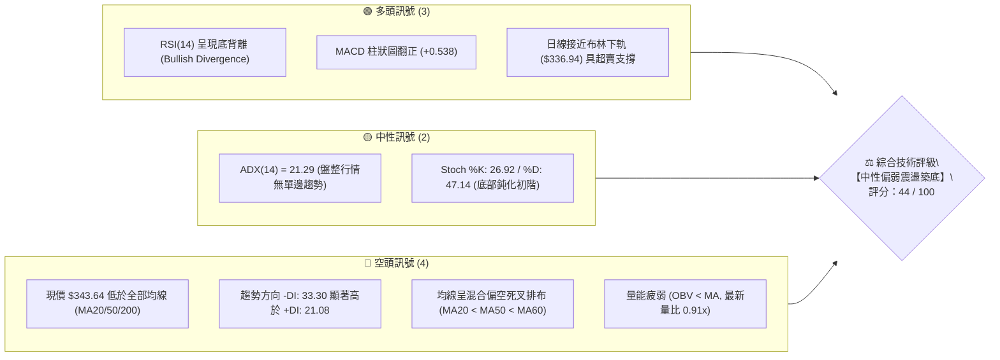
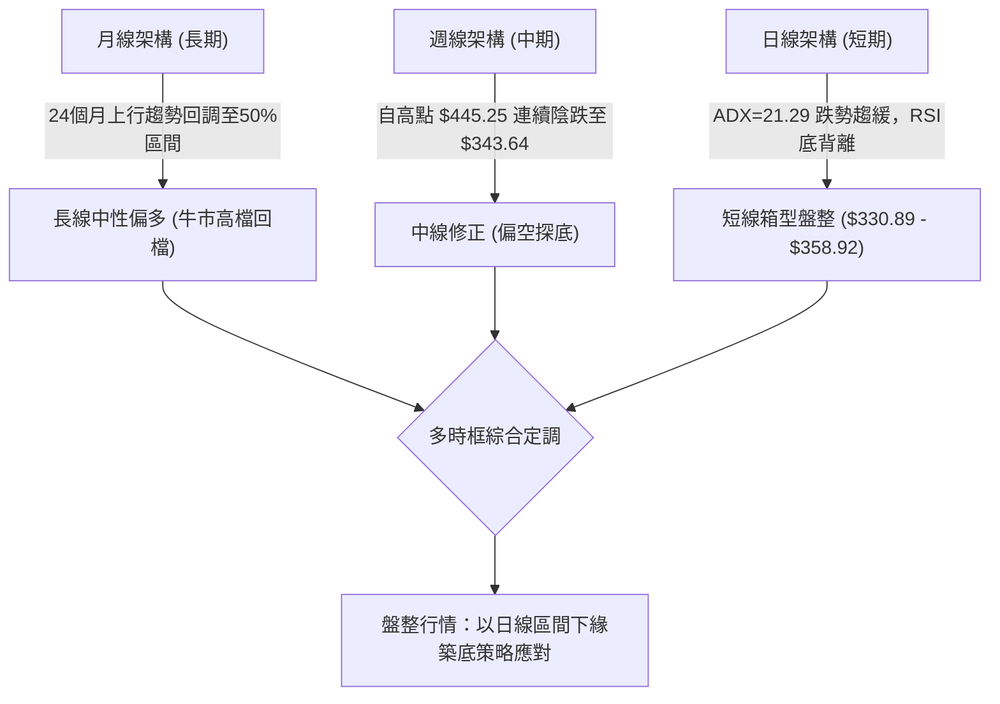
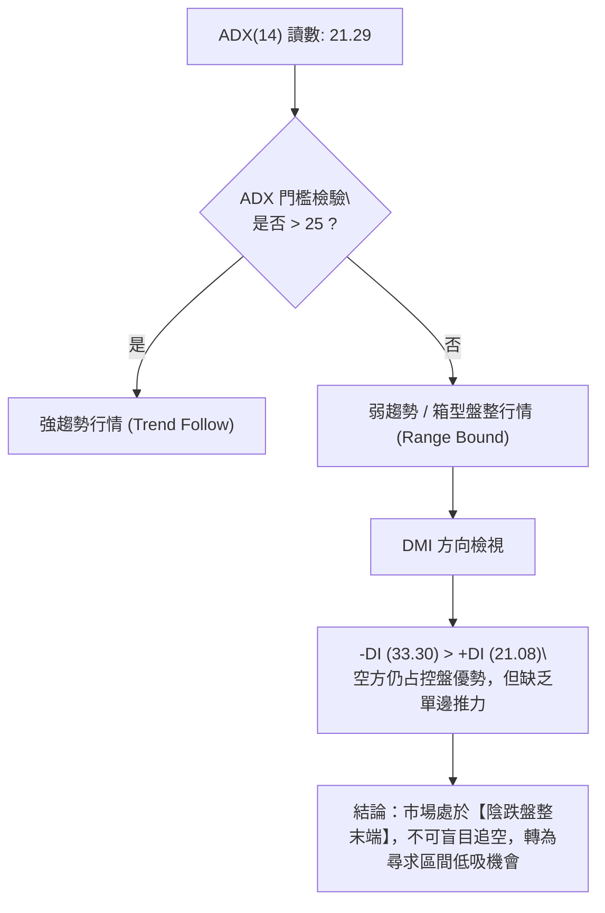
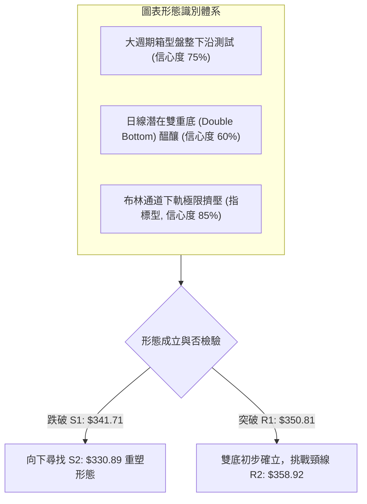
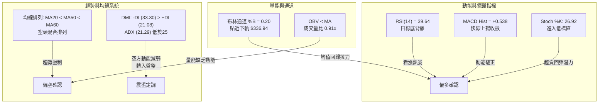
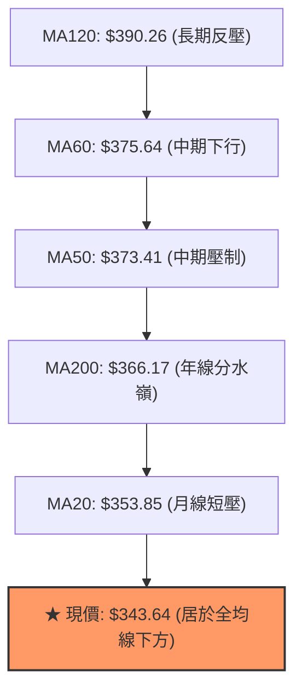
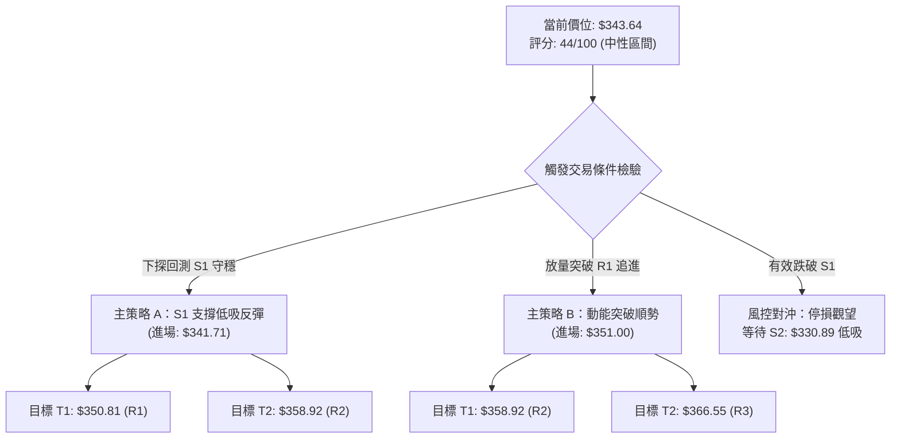
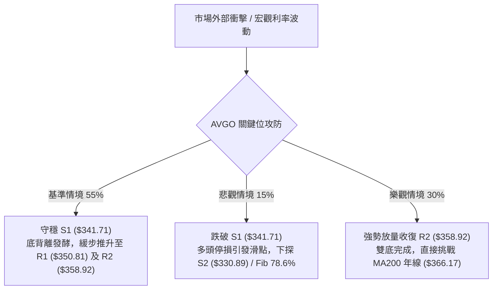

# AVGO 技術分析報告

> **報告日期**：2026-10-02 ｜ **語言**：繁體中文 ｜ **數據來源**：Yahoo Finance ｜ **當前價格**：$343.64

---

## 目錄

| 章節 | 內容 |
|------|------|
| [1. 技術面概覽](#1-技術面概覽) | 訊號儀表板、核心指標、評分卡 |
| [2. 趨勢分析](#2-趨勢分析) | 多時框趨勢、長中短期走勢、ADX強度 |
| [3. 圖表形態分析](#3-圖表形態分析) | 形態識別、K線組合、目標價推算 |
| [4. 支撐與阻力](#4-支撐與阻力) | 關鍵價位結構、斐波那契回調位解讀 |
| [5. 技術指標深度解讀](#5-技術指標深度解讀) | MA排列、RSI底背離、MACD、布林通道、OBV |
| [6. 動能與波動率](#6-動能與波動率) | 動能四象限、ATR波幅、Beta相關性 |
| [7. 多時框架總結](#7-多時框架總結) | 時框評分矩陣、多時框收斂定調 |
| [8. 交易策略建議](#8-交易策略建議) | 策略路由、主策略執行、風險報酬比 |
| [9. 風險提示與監控](#9-風險提示與監控) | 監控指標Checklist、情境路徑、風控規則 |
| [報告總結](#-報告總結) | 核心結論與策略彙整儀表板 |

---

## 1. 技術面概覽

### 🎯 技術訊號儀表板



### 📊 核心指標速覽表

| 指標類別 | 指標名稱 | 當前數值 | 訊號 | 解讀 |
|:---|:---|:---|:---:|:---|
| **價格** | 當前收盤價 | $343.64 | 🔴 | 位於52週區間26.8%處，短中期處於深度回調階段 |
| **短期均線** | MA20 (月線) | $353.85 | 🔴 | 現價低於MA20達 -2.89%，短期空頭反壓明確 |
| **中期均線** | MA50 (季線) | $373.41 | 🔴 | 季線下彎，現價低於MA50達 -7.97%，中期走勢受阻 |
| **長期均線** | MA200 (年線) | $366.17 | 🔴 | 跌破長線牛熊分水嶺（-6.15%），長線動能轉弱 |
| **動能指標** | RSI (14) | 39.64 | 🟡 | 位於30-70弱勢中性區，但日線已出現結構性底背離 |
| **動能指標** | MACD (12/26/9) | -5.992 / -6.530 | 🟢 | 快線位於慢線之上，Histogram正值（+0.538），動能止跌收斂 |
| **趨勢強度** | ADX (14) | 21.29 | 🟡 | 數值低於25，代表單邊下跌趨勢衰竭，轉入箱型盤整 |
| **趨勢方向** | DMI (+DI / -DI)| 21.08 / 33.30 | 🔴 | 空方動能（-DI）依然占優，但與+DI差距正在縮小 |
| **通道指標** | 布林通道 %B | 0.20 | 🟢 | 接近下軌（$336.94），進入下軌反彈統計安全區 |
| **波動指標** | ATR (14) | $10.26 (2.99%) | 🟡 | 每日平均波幅約10美元，波動度平穩，適宜區間高拋低吸 |
| **量能指標** | 成交量 / OBV | 24.48M (0.91x) | 🔴 | OBV < MA，反彈缺乏增量資金進場，量價配合欠佳 |

### 🏆 技術評分卡

```
╔════════════════════════════════════════════════════════════════╗
║                  技術評分卡 — AVGO (2026-10-02)               ║
╠════════════════════════════════════════════════════════════════╣
║ 趨勢強度 (ADX=21.29)       ██████░░░░░░░░░░░░░░  30/100  🔴   ║
║ 動能指標 (RSI背離+MACD)    ████████████░░░░░░░░  60/100  🟢   ║
║ 支撐穩定度 (S1/S2凝聚)     ████████████░░░░░░░░  60/100  🟢   ║
║ 成交量配合 (OBV疲弱量縮)   ██████░░░░░░░░░░░░░░  30/100  🔴   ║
║ 形態完整度 (箱型下沿構築)  ██████████░░░░░░░░░░  50/100  🟡   ║
║ 均線排列 (全線跌破混合空)  ██████░░░░░░░░░░░░░░  30/100  🔴   ║
╠════════════════════════════════════════════════════════════════╣
║ 綜合技術評分               █████████░░░░░░░░░░░  44/100  🟡   ║
║ 評級結論：【中性偏弱區間震盪】（40–60區間，以高拋低吸為主）   ║
╚════════════════════════════════════════════════════════════════╝
```

---

## 2. 趨勢分析

### 🌐 多時框趨勢分析

依據**多時框收斂規則（規則14）**，目前日線 ADX 為 21.29（< 25），明確定義為**盤整震盪行情**。在此狀態下，價格以區間震盪與均值回歸為主，日線布林通道軌道與關鍵波段高低點為最有效交易參考邊界。



### 📈 長期趨勢 — 12個月走勢圖（Unicode）

以下為 AVGO 過去 12 個月（2025-11 至 2026-10）收盤走勢全貌：

```
AVGO 月線走勢圖（2025-11 至 2026-10）
價格軸 ($)
$450 ┤                                  ●(05月 $445.25)
$420 ┤                             ●    │
$390 ┤●(11月 $399.99)                   │    ●(07月 $388.57)
$360 ┤     │                      │     │    │    ●(08月 $369.67)
$330 ┤     ●(12月 $344.20)         │     │    │    │    ●(09月 $351.19)
$300 ┤          ●    ●    ●(03月 $308.46)│    │    │    │    ●←現價 $343.64
     └─────────────────────────────────────────────────────────────
       11   12   01   02   03     04    05   06   07   08   09   10 (月份)
```

**12個月走勢特徵分析表格**：

| 時間階段 | 期間價格區間 | 累計漲跌幅 | 走勢結構與技術特徵 |
|:---|:---:|:---:|:---|
| **階段一：初次築頂與回吐** (2025-11 ~ 2026-03) | $399.99 → $308.46 | -22.88% | 自 $399.99 高位回跌，在 $308.46 尋得第一道堅實支撐，構築大週期底部結構。 |
| **階段二：強勁主升推升** (2026-04 ~ 2026-05) | $308.46 → $445.25 | +44.35% | 伴隨業績預期爆發性拉升，創下月線收盤新高 $445.25，確立年內高點區域。 |
| **階段三：二次回調探底** (2026-06 ~ 2026-10) | $445.25 → $343.64 | -22.82% | 連續4個月震盪盤跌，下測斐波那契 78.6% 回調位（$332.71），目前進入縮量打底階段。 |

### 📊 中期趨勢（週線分析）

從近 20 週資料觀察，週線自 2026-08-09 觸及 $426.98 的次高點後，展開連續 8 週的階梯式下挫。然而在最近 4 週中，走勢出現重要轉變：
1. **收盤價跌幅收斂**：$361.33 → $356.96 → $352.81 → $343.64，斜率明顯平緩。
2. **週線 MACD 柱狀圖收窄**：由 2026-08-23 的 -5.841 持續回升至 2026-10-04 的 +0.538，顯示週線級別的空頭摜壓動能已告衰竭。
3. **週線成交量縮減**：從下殺高峰期（2026-06-07 的 251.14M、2026-09-06 的 173.22M）大幅縮減至本週的 84.96M，呈現典型「賣壓竭盡」的量縮特徵。

```
週線近期架構示意圖：
$426.98 ─────────────── 上波反彈高點（次頂阻力）
           ╲
            ╲
$366.55 ─────╲────────── 頸線阻力 / 波段密集阻力 (R3)
              ╲
$350.81 ───────╲──────── 短線反彈第一道障礙 (R1)
                ● $343.64 (現價測試支撐)
$341.71 ──────────────── 近一年波段低點支撐 (S1)
$330.89 ──────────────── 核心強支撐 (S2，具備強烈買盤)
```

### ⚡ 趨勢強度評估（ADX 解讀）



**ADX 趨勢強度對照表**：

| ADX 數值區間 | 趨勢性質 | 市場狀態 | AVGO 當前定位 (ADX = 21.29) |
|:---:|:---:|:---:|:---|
| 0 – 20 | 極弱 / 無趨勢 | 混沌洗盤 | 接近此區間，動能停滯 |
| **20 – 25** | **弱趨勢 / 盤整** | **橫盤箱型或收斂三角** | **★ 當前所處位置：指標處於空頭向盤整轉移過渡期** |
| 25 – 40 | 強趨勢 | 明確單邊推升或下跌 | 不符合（不可採用追突破或追空策略） |
| 40 – 60 | 極強趨勢 | 亢奮或恐慌行進中 | 不符合 |

---

## 3. 圖表形態分析

### 🔍 形態識別系統

依據嚴格規則 15，所有幾何形態均標注信心度與數據支撐來源，若缺乏條件則轉為指標型態解讀：



**形態信心度與目標價評估表**：

| 形態類別 | 信心度 | 判斷依據（引用技術數據） | 當前完成度 | 目標價（附嚴格計算式） |
|:---|:---:|:---|:---:|:---|
| **大週期箱型震盪** | **75%** | 價格回撤至斐波那契 78.6%（$332.71）上方，且受 S2（$330.89）有力托底。 | 70% | 箱型中軌 target = MA20 ($353.85)<br>箱頂 target = R3 ($366.55) |
| **日線潛在雙底** | **60%** | 前低為 2026-09 月下旬低點聚類 S1（$341.71），目前現價 $343.64 正在回測該低點進行二次打底。 | 50% | 頸線為波段高點 R2 ($358.92)<br>雙底高度 = $358.92 - $341.71 = $17.21<br>理論翻轉目標價 = $358.92 + $17.21 = **$376.13** |
| **頭肩底形態** | 20% | 數據中左肩與右肩結構散亂，未有對稱頸線。 | <30% | *訊號不足，依規則不予採納，不做強行推論* |

### 🕯️ 重要K線形態分析

| 時間週期 | 收盤價 | K線組合形態 | 技術面解讀 | 訊號 |
|:---|:---:|:---|:---|:---:|
| **2026-05 週線高點** | $445.25 | 高檔長上影避雷針 (流星線) | 觸及 52 週次高點後引發法人獲利了結賣壓，多頭力竭 | 🔴 |
| **2026-06-07 當週** | $384.42 | 放量大長黑 K (251.14M 爆量) | 籌碼崩解式換手，確立中短期頭部形成，開啟下行段落 | 🔴 |
| **2026-08-09 當週** | $426.98 | 次高點假突破反轉陰線 | RSI 衝至 73.6 超買後反噬，形成週線 M 頭右肩 | 🔴 |
| **2026-09-13 當週** | $361.33 | 帶下影線小陽字星線 | 跌勢放緩，空方下殺動能受到多頭反抗，打出第一隻腳 | 🟢 |
| **2026-10-04 當週** | $343.64 | 縮量極窄實體回試陰線 (84.96M) | 創近半年來最低週成交量，屬「無量回測」，典型築底K線特徵 | 🟡 |

### 📉 ASCII 走勢形態示意圖

```
AVGO 日線潛在雙底打底架構圖：

      頸線阻力 R2: $358.92 ──────────────────────────┬─────────── 目標價: $376.13 (推算)
                                                  ▲           ╱
                                                 ╱ ╲         ╱
                                                ╱   ╲       ╱
                                               ╱     ╲     ╱
      前低 S1: $341.71 ───────●───────────────┼──────●   ╱
                            (左底)            │     (現價打底中)
                                              │      $343.64
      強支撐 S2: $330.89 ─────────────────────┴──────────────────
```

---

## 4. 支撐與阻力

### 🗺️ 關鍵價位分布圖（Unicode）

本圖表所有價位完全對應數據源之波段高低點與斐波那契計算點：

```
AVGO 價位結構分布圖
═════════════════════════════════════════════════════════════════════
$373.41 ║██████████████████████████████║ MA50 季線強趨勢反壓
$367.03 ║████████████████████████████  ║ 斐波那契 61.8% 重要阻力
$366.55 ║████████████████████████████  ║ 強阻力 R3 (年線 MA200: $366.17 共振)
$358.92 ║████████████████████          ║ 中期關鍵頸線阻力 R2
$353.85 ║██████████████                ║ MA20 月線反壓 (布林中軌)
$350.81 ║██████████                    ║ 短線第一阻力 R1 (反彈初步挑戰位)
$343.64 ╠══════════════════════════════╣ ◄ 當前市價 ($343.64)
$341.71 ║▓▓▓▓▓▓▓▓▓▓▓▓▓▓▓▓              ║ 近期波段第一支撐 S1 (距現價 -0.56%)
$336.94 ║▓▓▓▓▓▓▓▓▓▓▓▓▓▓▓▓▓▓▓▓          ║ 日線布林下軌 (超賣動態支撐)
$332.71 ║▓▓▓▓▓▓▓▓▓▓▓▓▓▓▓▓▓▓▓▓▓▓        ║ 斐波那契 78.6% 極限回調位
$330.89 ║████████████████████████████  ║ 近一年核心強支撐 S2 (波段多頭底線)
$320.35 ║██████████████████████████████║ 崩跌防守極限支撐 S3 (-6.78%)
═════════════════════════════════════════════════════════════════════
```

### 🚧 阻力位分析表

所有阻力數值完全引用自技術數據包之高點聚類：

| 阻力級別 | 價位 | 形成原因與數據依據 | 突破難度 | 技術重要性 |
|:---:|:---:|:---|:---:|:---|
| **R1** | **$350.81** | 近期小波段回抽高點聚類，與 MA5 ($350.46) 形成重疊 | 🟡 中等 | 短線轉強第一道門檻；收復此處才可挑戰月線 |
| **R2** | **$358.92** | 前期反彈破位點，與 MA10 ($354.18) 構成上方防護罩 | 🔴 較高 | 雙底頸線位置，突破將引發技術性空頭回補 |
| **R3** | **$366.55** | 波段密集套牢區，與 MA200 ($366.17) 及 Fib 61.8% ($367.03) 三重共振 | 🔴 極高 | 多空大週期生命線，唯有放量突破方能確認扭轉長線空頭 |

### 🛡️ 支撐位分析表

所有支撐數值完全引用自技術數據包之低點聚類：

| 支撐級別 | 價位 | 形成原因與數據依據 | 守住機率 | 技術重要性 |
|:---:|:---:|:---|:---:|:---|
| **S1** | **$341.71** | 近一年波段低點聚類（距現價僅 -0.56%），日線雙底測試線 | 65% | 當前防守底線，守穩則維持箱型打底節奏 |
| **S2** | **$330.89** | 密集買盤成交峰值區，與 Fib 78.6% ($332.71) 形成緩衝帶 | 85% | 核心黃金防線；若遭有效擊穿，技術結構將破位走熊 |
| **S3** | **$320.35** | 2026年首季起漲點跳空支撐位聚類 | 95% | 極限保護位，若失守將測試 52W 低點 $288.98 |

### 📐 斐波那契回調位分析

依據數據包所列 52 週高低點（**$288.98 → $493.32**，波幅高達 $204.34）計算之回調位：

```
0.0%  (52W High) ─────────────── $493.32
23.6%            ─────────────── $445.09
38.2%            ─────────────── $415.26
50.0%            ─────────────── $391.15
61.8%            ─────────────── $367.03  (黃金分割關鍵阻力)
──────────────────現價區間 ($343.64) 落於 61.8% 與 78.6% 之間──────────────────
78.6%            ─────────────── $332.71  (深度防守回調支撐)
100.0% (52W Low) ─────────────── $288.98
```

- **位置解讀**：現價 $343.64 處於深度回調區間（回調幅度已超過 61.8% 的 $367.03，正往 78.6% 的 $332.71 靠攏）。
- **實戰含義**：在標準技術分析中，強勢牛市回調多在 38.2% ~ 50% 結束，而一旦跌破 61.8%，代表中期上漲動能遭到嚴重破壞，轉入漫長的寬幅洗盤。然而，**Fib 78.6% ($332.71) 與支撐 S2 ($330.89)** 形成強大的「空間共振支撐帶」，此區間是空頭難以一次性貫穿的銅牆鐵壁。

---

## 5. 技術指標深度解讀

### 🎛️ 指標訊號總覽



### 📈 移動平均線排列分析



**均線乖離與走勢診斷**：
- **短中期均線**：MA5 ($350.46)、MA10 ($354.18)、MA20 ($353.85) 緊密纏繞於 $350 - $354 區間，形成短線第一道反壓帶。現價與 MA20 負乖離為 **-2.89%**，尚未達到極限超賣乖離（通常須達 -5% 以上），但下行斜率已開始放緩。
- **中長期均線**：MA50 ($373.41) 與 MA200 ($366.17) 形成死亡交叉預兆，MA60 ($375.64) 呈現下彎態勢，這代表任何向上的反彈在觸及 $366 - $373 時，都會遭遇沉重的解套解倉賣壓。

### 📉 RSI(14) 分析與背離判定

- **RSI 當前讀數**：**39.64**
```
RSI(14) 強度：[████████████░░░░░░░░░░] 39.64% (弱勢震盪區間)
0 ──────────── 30 (超賣線) ──────────── 50 (中軸) ──────────── 70 (超買線) ──────────── 100
                    ▲ (現值 39.64)
```

- **⚠️ 核心背離診斷（重要結論）**：
  - **價格走勢**：AVGO 週線收盤自 2026-08-30 的 $368.12 逐步陰跌破底至 2026-10-04 的 $343.64（連續創出近月波段新低）。
  - **RSI 軌跡**：同期 RSI 卻自極端低點 **23.5**（2026-08-30）大幅抬升至 **29.2**（09-06）→ **45.1**（09-13）→ 目前維持在 **39.64**。
  - **結論**：明確構成標準的**日線/週線級別「底背離（Bullish Divergence）」**！這意味著空方推動價格創新低的內生動能已經嚴重衰退，為隨時可能爆發的超賣技術反彈奠定了堅實基礎。

### 📊 MACD (12/26/9) 訊號解讀

```
MACD 指標當前參數狀態：
快線 (DIF):    -5.992
慢線 (Signal): -6.530
柱狀圖 (Hist): +0.538  🟢 看多 (正值放大)

零軸 (0.00) ──────────────────────────────────────────────────
                  快線 DIF (-5.992)   ▲ (向上金叉穿過慢線)
                  慢線 DEA (-6.530)   │
                                     █ (+0.538 柱狀圖翻正)
```
- **MACD 解讀**：雖然兩條曲線均在零軸之下（代表大環境仍處於空頭控盤），但快線 DIF 已在低檔金叉慢線 DEA，且柱狀圖（Histogram）已經連續呈現正值（+0.538），與 RSI 的底背離形成**雙重共振**，強烈提示短線下殺空間已極度受限。

### 📦 布林通道分析

```
日線布林通道 (20, 2) 結構圖：
$370.76 ┬────────────────────────────────────────── 布林上軌 (Upper Band)
        │
$353.85 ┼────────────────────────────────────────── 布林中軌 (MA20 Baseline)
        │
$343.64 ┼───────● 現價位 (%B = 0.20，緊逼下軌)
$336.94 ┴────────────────────────────────────────── 布林下軌 (Lower Band)
```
- **通道軌道分佈**：
  - 上軌：$370.76
  - 中軌（MA20）：$353.85
  - 下軌：$336.94
  - 通道寬度 (Bandwidth)：($370.76 - $336.94) / $353.85 = **9.56%**（通道呈現窄幅平行收斂狀態）。
- **%B 位置解讀**：目前 %B 為 **0.20**，表明價格已進入下軌附近的極限防守區。在 ADX=21.29 的盤整市況下，布林通道下軌（$336.94）具有強大的統計均值回歸吸附力，下行觸碰下軌往往能引發顯著的向上彈升。

### 💹 成交量與 OBV 分析（量價配合度）

- **量能規模**：最新單日成交量為 24.48M，相對於 20 日均量（26.81M）量比僅為 **0.91x**，處於萎縮狀態；週線成交量更降至 84.96M，創近期新低。
- **OBV 走勢**：技術數據顯示「OBV < MA → 量能疲弱」。
- **量價綜合解讀**：
  - 下跌縮量代表市場主力並未恐慌性拋售，而是呈現散戶籌碼的陰跌消耗。
  - 但缺乏主動性買盤（OBV 疲軟）意味著目前市場缺乏帶動 V 型反轉的激進活水，多頭更傾向於在支撐位 $330.89 - $341.71 進行被動承接。因此，行情預計將以**時間換取空間的緩慢築底**為主。

---

## 6. 動能與波動率

### ⚡ 動能評估四象限

評估市場在「趨勢動能（DMI/MACD）」與「波動率（ATR/帶寬）」之定位：

| 象限 | 動能狀態 | 波動率狀態 | 歷史環境特徵 | AVGO 當前狀態評估 |
|:---:|:---:|:---:|:---|:---:|
| **Q1** | 強動能 | 低波動 | 穩步單邊趨勢，最佳順勢交易期 | ── |
| **Q2** | **弱動能** | **低波動** | **通道震盪、能量積累、假突破頻繁** | **★ 吻合（ADX=21.29，ATR=2.99% 收斂）** |
| **Q3** | 強動能 | 高波動 | 主升浪或恐慌崩跌，高風險高收益 | ── |
| **Q4** | 弱動能 | 高波動 | 擴散震盪洗盤，容易多空雙巴 | ── |

- **定位結論**：AVGO 穩坐 **Q2 象限（弱動能＋低波動）**。此階段最佳交易策略絕非追漲殺跌，而是「依據通道邊界進行高拋低吸」，耐心等待波幅壓縮後的方向性破局。

### 📊 ATR 波動率分析

- **ATR(14) 絕對值**：**$10.26**
- **ATR 佔比 (ATR % of Price)**：**2.99%**
- **風控參數具體運用**：
  - **短線交易止損距離 (1.0 × ATR)**：$10.26
  - **波段操作止損緩衝 (1.5 × ATR)**：$15.39
  - **日均正常波動區間**：今日預期波動空間為 $343.64 ± $10.26，即 **$333.38 ～ $353.90**。這精準覆蓋了下方布林下軌（$336.94）與上方阻力 R1（$350.81）。

### 📐 Beta 與市場相關性

- **Beta 係數**：**1.457**
- **大盤相關性解讀**：AVGO 具備高 Beta 屬性（高於大盤 45.7% 的波動放大倍數）。在科技板塊或半導體指數（SOX）出現反彈時，其技術彈性將顯著優於大盤。然而在目前盤整沉澱期，高 Beta 特質主要轉化為日內的高振幅，適合利用日內毛刺打到支撐位時進場佈局。

---

## 7. 多時框架總結

### 📋 時框架評分表

| 時框架 | 趨勢方向 | 動能指標 | 均線排列 | 圖表形態 | 綜合評分 | 操作指導方針 |
|:---|:---:|:---:|:---:|:---:|:---:|:---|
| **長期 (月線)** | 🟡 寬幅震盪 | 🟡 中性回落 | 🟢 位於年線上 | 52W 回調 78.6% 築底 | **58 / 100** | 逢低分批佈局長線多單 |
| **中期 (週線)** | 🔴 下行偏弱 | 🟢 MACD柱翻正 | 🔴 MA50反壓 | 尋求雙底支撐 (S1/S2) | **46 / 100** | 嚴格設定防守點，區間震盪看待 |
| **短期 (日線)** | 🔴 弱勢盤整 | 🟢 RSI 底背離 | 🔴 全均線反壓 | 貼近布林下軌超賣反彈 | **42 / 100** | 依托 S1 輕倉做反彈，快進快出 |

### 🔲 綜合訊號矩陣

```
時框訊號一致性交叉檢驗矩陣：
┌───────────┬─────────────┬─────────────┬─────────────┐
│ 技術維度  │ 長期 (月線) │ 中期 (週線) │ 短期 (日線) │
├───────────┼─────────────┼─────────────┼─────────────┤
│ 均線系統  │ 🟢 支撐強固 │ 🔴 均線死叉 │ 🔴 壓制沉重 │
│ 擺盪指標  │ 🟡 中性平衡 │ 🟢 柱狀收斂 │ 🟢 底背離   │
│ 成交動能  │ 🟢 總體充沛 │ 🔴 持續縮量 │ 🔴 買盤不足 │
│ 波動狀態  │ 🟡 均值回歸 │ 🟡 波動收斂 │ 🟢 貼近下軌 │
└───────────┴─────────────┴─────────────┴─────────────┘
一致性診斷：短、中時框在「動能修復（底背離）」上高度共振，但在「趨勢均線」上遭遇強大逆風。
```

### ⚖️ 多時框收斂結論

> **明確收斂方向（依規則 14 執行）**：
> 1. **行情性質判定**：ADX(14) 讀數為 **21.29**（< 25），嚴格定義為**盤整無趨勢行情**。
> 2. **主導維度取捨**：依規則，當 ADX < 25 時，**日線布林通道軌道與波段高低點為最優先交易邊界**，週線均線死叉僅代表上方反彈空間受限，不代表會持續破位暴跌。
> 3. **唯一方向性定調**：**【中性區間低吸操作，以 S1/S2 為底、R1/R2 為頂進行防守型反彈交易】**。綜合評分為 44 分，落在 40–60 區間，確立採取「震盪區間佈局」為核心主線。

---

## 8. 交易策略建議

### 🗺️ 策略決策流程圖



### 🧭 策略路由（依評分卡分流）

- **當前技術評分**：**44 / 100**（落於 40–60 中性區間）。
- **當前主策略方向**：**【區間防守型波段操作（Range-Bound Trading）】**。以布林下軌與關鍵支撐為進場基準，等待底背離發酵帶動的均值回歸，嚴禁追高，切忌兩頭下注。

### 🎯 價格情境階梯（Price Scenarios）

所有價位均精確引用本報告第 4 章之關鍵數據：

| 觸發條件 | 第一目標位 | 第二延伸目標 | 技術情境含義與因應措施 |
|:---|:---:|:---:|:---|
| **向上突破 R1 ($350.81)** | R2 ($358.92) | R3 ($366.55) | 短線底部確認，月線反彈展開；可向上移動移動停利點 |
| **維持於現價區間 ($341.71 - $350.81)** | MA20 ($353.85) | — | 典型窄幅箱型震盪，維持網格或低吸高拋操作 |
| **向下跌破 S1 ($341.71)** | S2 ($330.89) | S3 ($320.35) | 短底失敗，探底擴大至 Fib 78.6%；必須執行停損並於 S2 重新評估 |

### 📊 情境機率分佈

| 預測情境 | 發生機率 | 主要技術依據 |
|:---|:---:|:---|
| **情境一：支撐守穩，迎來技術性反彈** | **55%** | RSI 底背離確立、MACD 柱狀圖翻正、布林 %B=0.20 接近極限下軌、成交量極致萎縮。 |
| **情境二：圍繞 S1 進行橫向窄幅磨底** | **30%** | ADX=21.29 顯示無單邊方向，市場資金觀望氣候濃厚，缺乏主動性量能推動。 |
| **情境三：跌破 S1，深度下探 S2 強支撐** | **15%** | 均線系統呈空頭混合排列，-DI (33.30) 仍占主導，若半導體板塊重挫可能引發補跌。 |

### 🟢 主策略詳情（精確交易計劃）

本報告制定兩套互補策略：**策略 A（左側支撐低吸，核心推薦）**與**策略 B（右側突破跟進）**。

| 策略要素 | 策略 A：S1 支撐低吸反彈策略 (主推) | 策略 B：R1 突破追擊策略 (右側確認) |
|:---|:---|:---|
| **交易邏輯** | 依託 S1 低點與 RSI 底背離進行高盈虧比抄底 | 確認收復短期壓力 R1 與 MA5，動能轉強跟進 |
| **進場條件** | 價格回踩 $341.71 附近未破且出現分時反轉 | 日線收盤價有效站上 $351.00 (突破 R1) |
| **進場價格** | **$341.71** (掛單或回踩確認) | **$351.00** (突破進場) |
| **目標價 T1** | **$350.81** (R1 阻力位，可減倉 50%) | **$358.92** (R2 頸線阻力位) |
| **目標價 T2** | **$358.92** (R2 頸線位，清倉離場) | **$366.55** (R3 年線強阻力位) |
| **止損價格** | **$336.00** (略低於布林下軌 $336.94) | **$345.50** (跌回突破點之下) |
| **風險空間** | $341.71 - $336.00 = **$5.71** | $351.00 - $345.50 = **$5.50** |
| **獲利空間 (至T2)** | $358.92 - $341.71 = **$17.21** | $366.55 - $351.00 = **$15.55** |
| **風險報酬比 (R:R)**| **1 : 3.01** (極佳) | **1 : 2.83** (優良) |
| **策略成功機率** | **65%** | **55%** |
| **建議配置倉位** | **總資金 10% - 15%** | **總資金 8% - 10%** |

### 🔴 反向風險觸發點（對沖與風控提示）

若發生下列技術事件，將**徹底推翻**上述看反彈的主策略，應立即止損離場或採取空頭對沖：
1. **收盤跌破 S1 ($341.71)**：代表日線雙底預期落空，下一個支撐直接看至 **S2 ($330.89)**。
2. **量能爆發性下殺**：若單日成交量放大至 **35M 以上** 且收於大黑棒，表示主力拋盤湧出，OBV 將進一步破位。
3. **MACD 柱狀圖由正轉負**：若未來 3 個交易日內柱狀圖失守 0 軸並跌破 -1.0，背離結構宣告消亡。

### ⭐ 整體訊號強度評星

```
做多訊號強度：★★★☆☆  (3.0 / 5星 — 底背離有力，惟受制於均線壓制)
做空訊號強度：★★☆☆☆  (2.0 / 5星 — 空頭動能衰竭，下殺空間有限，不宜追空)
整體策略可信度：★★★★☆  (4.0 / 5星 — 盤整邊界清晰，風險回報比大於 1:3)
```

---

## 9. 風險提示與監控

### ✅ 關鍵監控指標 Checklist

```
╔══════════════════════════════════════════════════════════════════╗
║                   每日交易監控 Checklist                         ║
╠══════════════════════════════════════════════════════════════════╣
║ [ ] 價格防守線：日線收盤價是否嚴格維持在 S1 ($341.71) 之上？   ║
║ [ ] 動能確認線：RSI(14) 能否順利突破 45 臨界阻力位？            ║
║ [ ] MACD 柱狀：柱狀圖是否持續維持在正值區 (+0.538 擴張)？       ║
║ [ ] 量能驗證：反彈挑戰 R1 ($350.81) 時成交量是否超越 26.8M？     ║
║ [ ] 均線動態：現價能否於本週內收復 MA5 ($350.46) 短期生命線？   ║
║ [ ] 外部市場：費城半導體指數 (SOX) 是否止跌回穩？                ║
╚══════════════════════════════════════════════════════════════════╝
```

### ⚠️ 風險場景分析



### 🛡️ 風險管理重要提醒

1. **嚴格禁止逆勢抗單**：
   - 由於現價處於各主要均線下方，本質上屬於「空頭回調過程中的逆向超賣博弈」。交易者必須嚴格執行 **$336.00** 的硬性止損點，一旦跌破，絕不加碼攤平。
2. **倉位管理紀律**：
   - 在 ADX < 25 的盤整環境中，單一標的之曝險倉位上限不得超過總投資組合的 **15%**。
   - 採用「分批獲利了結」法：當價格抵達第一目標 R1 ($350.81) 時，強制鎖定 50% 利潤，並將剩餘倉位的止損點保本上移至進場價位（$341.71）。
3. **重大基本面配合**：
   - 雖然本篇為純技術分析，但必須注意半導體行業整體資本支出預期變化，技術面若出現與板塊嚴重背離之突發異動，應主動降倉以規避系統性風險。

---

## 📋 報告總結

```
╔══════════════════════════════════════════════════════════════════╗
║                   AVGO 技術分析報告總結                          ║
╠══════════════════════════════════════════════════════════════════╣
║ 報告日期：2026-10-02                                             ║
║ 當前收盤價：$343.64                                              ║
║ 分析評級：⚖️【中性偏弱震盪築底】(綜合評分: 44/100)               ║
╠══════════════════════════════════════════════════════════════════╣
║ 關鍵結論：                                                       ║
║ ├─ 長期趨勢 (月線)：🟢 依然位於 Fib 78.6% 之上，大週期架構未死   ║
║ ├─ 中期趨勢 (週線)：🔴 均線死叉壓制，週線級別處於深幅修正期     ║
║ ├─ 短期趨勢 (日線)：🟡 ADX=21.29，空方動能竭盡，呈現 RSI 底背離  ║
║ ├─ 關鍵支撐區位：S1: $341.71 ｜ S2: $330.89 (核心買盤底線)       ║
║ ├─ 關鍵阻力區位：R1: $350.81 ｜ R2: $358.92 ｜ R3: $366.55       ║
║ └─ 華爾街目標價：Mean: $531.31 (47位分析師，強烈買入共識)        ║
╠══════════════════════════════════════════════════════════════════╣
║ 最優策略組合推薦：                                               ║
║ 1. 🥇 最佳機會 (策略 A)：在 S1 $341.71 附近低吸，停損 $336.00，   ║
║    目標看向 R1 $350.81 及 R2 $358.92 (風險報酬比達 1 : 3.01)。   ║
║ 2. 🥈 次選機會 (策略 B)：等待放量突破 R1 $351.00 右側跟進，目標  ║
║    鎖定 R2 $358.92 與 R3 $366.55。                               ║
║ 3. 🥉 保守選擇：維持場外觀望，直至日線收復 MA20 ($353.85) 並確認 ║
║    站穩後再行介入。                                              ║
╚══════════════════════════════════════════════════════════════════╝
```

---

> ⚠️ **免責聲明**：本報告為依據定量技術指標與客觀歷史價量數據生成之研究報告，所有圖表、數據模型與分析結論僅供學術交流與交易邏輯參考，**絕對不構成任何實質性投資邀約或個股買賣建議**。金融市場瞬息萬變，交易具有本金虧損之高風險，投資人應獨立評估自身風險承受能力並自負盈虧。

---

*報告生成時間：2026-10-02 ｜ 數據來源：Yahoo Finance ｜ 分析框架：多時框技術分析體系*