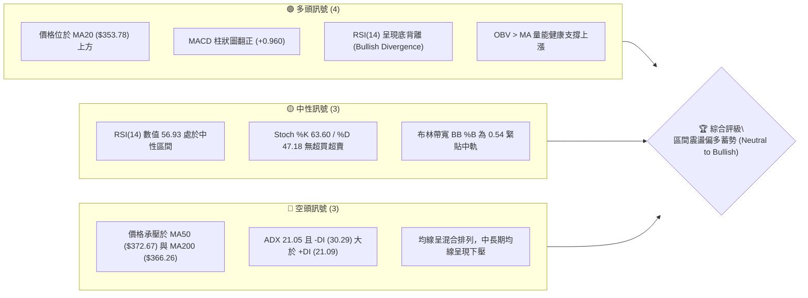
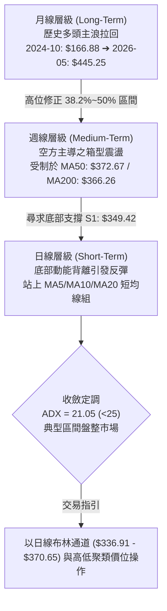
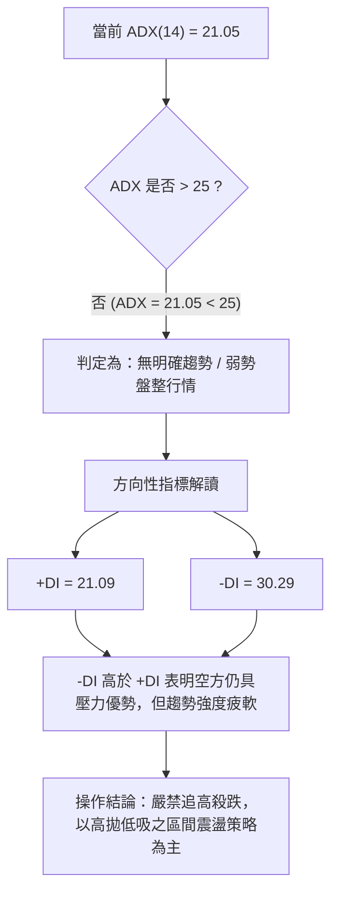
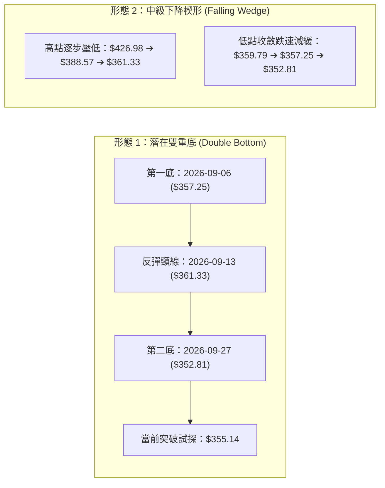
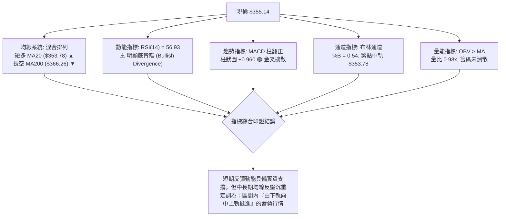
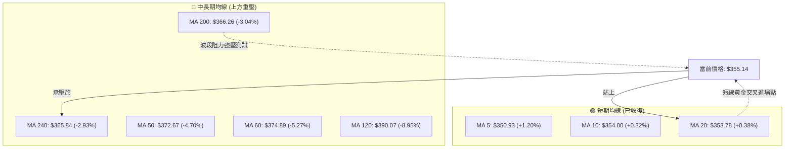
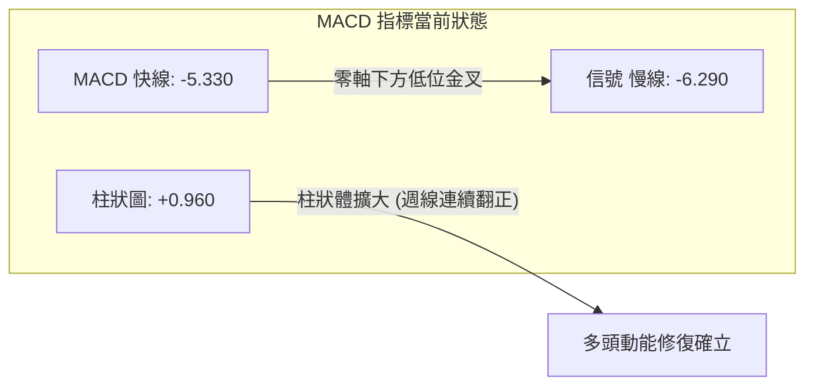
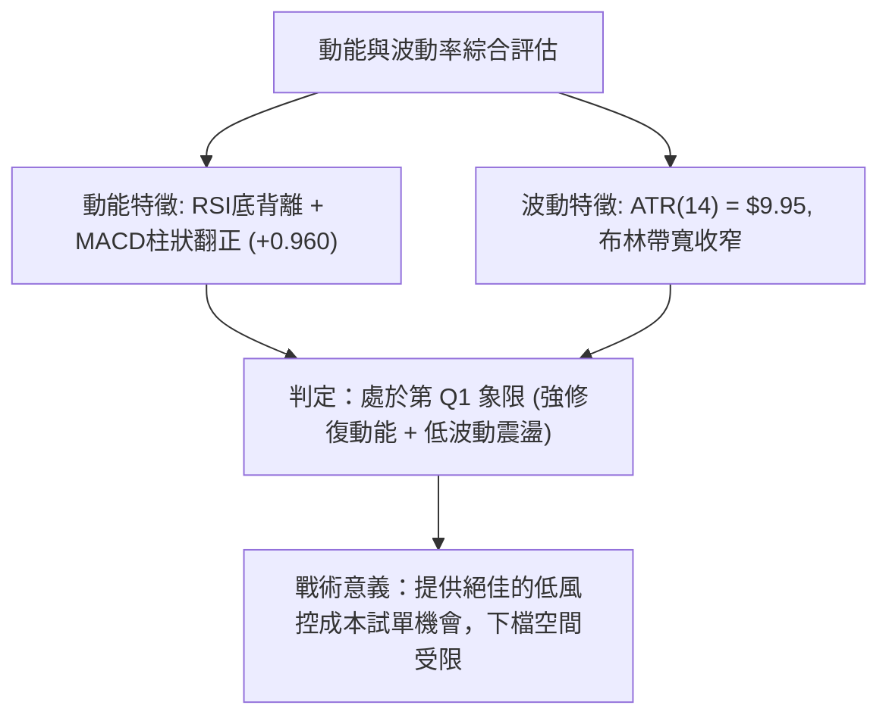
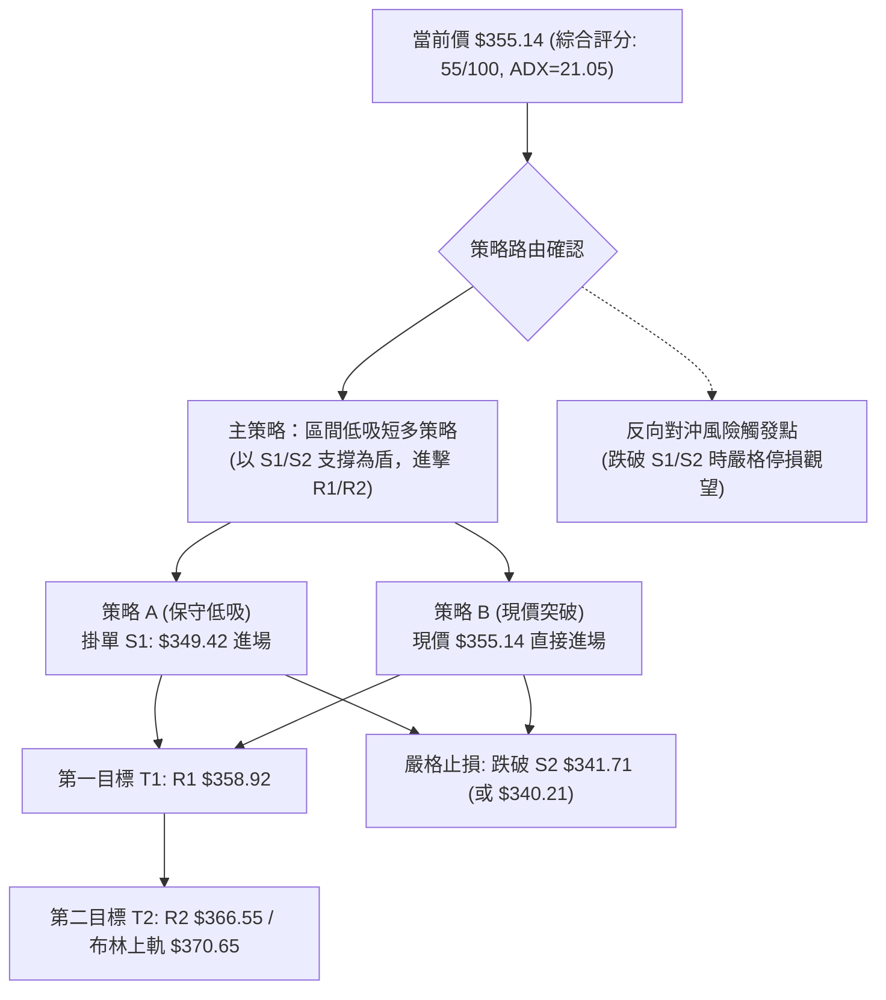
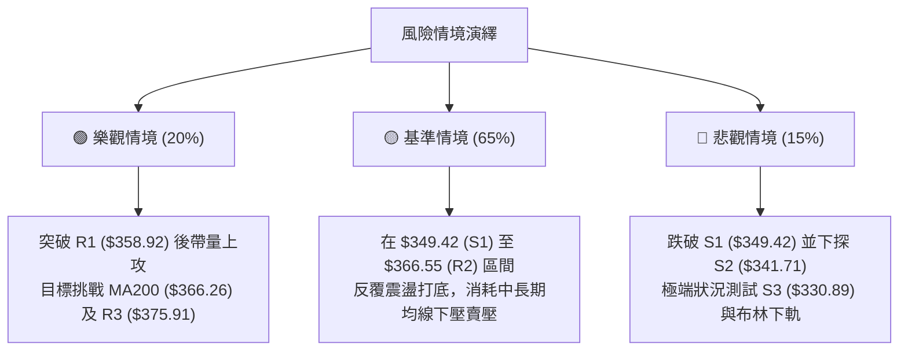

# AVGO 技術分析報告

> **報告日期**：2026-10-03 ｜ **語言**：繁體中文 ｜ **數據來源**：Yahoo Finance ｜ **當前價格**：$355.14

---

## 目錄

| 章節 | 內容 |
|------|------|
| [1. 技術面概覽](#1-技術面概覽) | 訊號儀表板、核心指標、評分卡 |
| [2. 趨勢分析](#2-趨勢分析) | 多時框趨勢、長中短期走勢、ADX強弱判斷 |
| [3. 圖表形態分析](#3-圖表形態分析) | 形態識別、信心度評估、K線組合、目標價推算 |
| [4. 支撐與阻力](#4-支撐與阻力) | 關鍵價位結構、阻力/支撐分析、斐波那契回調位 |
| [5. 技術指標深度解讀](#5-技術指標深度解讀) | MA系統、RSI底背離、MACD柱翻正、布林通道、OBV |
| [6. 動能與波動率](#6-動能與波動率) | 四象限定位、ATR波動分析、Beta風險評估 |
| [7. 多時框架總結](#7-多時框架總結) | 時框架評分矩陣、收斂原則與方向定調 |
| [8. 交易策略建議](#8-交易策略建議) | 策略路由、價格情境階梯、進出場精確點位與風控 |
| [9. 風險提示與監控](#9-風險提示與監控) | 監控Checklist、三情境演繹、資金管理規範 |

---

## 1. 技術面概覽

### 🎯 技術訊號儀表板



### 📊 核心指標速覽表

| 指標類別 | 指標名稱 | 當前數值 | 訊號 | 解讀 |
|:---|:---|:---|:---:|:---|
| **價格** | 當前收盤價 | $355.14 | 🟢 | 站上 MA5 ($350.93)、MA10 ($354.00) 與 MA20 ($353.78) 短期均線組 |
| **均線** | MA20 (月線) | $353.78 | 🟢 | 現價微幅突破短期均線 (+0.38%)，短線扭轉破底危機 |
| **均線** | MA50 (季線) | $372.67 | 🔴 | 現價位於 MA50 下方 (-4.70%)，中期反彈面臨顯著空頭反壓 |
| **均線** | MA200 (年線) | $366.26 | 🔴 | 現價位於 MA200 下方 (-3.04%)，長期牛熊分界線尚未有效收復 |
| **動能** | RSI(14) | 56.93 | 🟢 | 自 2026-08 月底的極度超賣區 (23.5) 回升，並伴隨標準**底背離** |
| **動能** | MACD (12,26,9) | -5.330 / -6.290 | 🟢 | 雙線於零軸下方形成低位金叉，柱狀圖達 +0.960，動能持續擴張 |
| **趨勢** | ADX(14) / DMI | 21.05 / -DI:30.29 | 🟡 | ADX < 25 表明處於盤整震盪市場；空方力道減弱但仍佔優勢 |
| **通道** | Bollinger Bands | 中軌 $353.78 | 🟡 | %B 為 0.54，處於上軌 $370.65 與下軌 $336.91 正中央，波動收斂 |
| **量能** | 成交量 / OBV | 24.61M / 0.98x | 🟢 | 能量潮 OBV 高於其均線，量價結構未出現放量破位之惡化現象 |
| **波動** | ATR(14) | $9.95 (2.80%) | 🟡 | 每日平均波動約 10 美元，適合波段震盪操作，風險可控度高 |

### 🏆 技術評分卡

```
╔════════════════════════════════════════════════════════════════════════════╗
║                   技術評分卡 — AVGO (Broadcom Inc.) 2026-10-03             ║
╠════════════════════════════════════════════════════════════════════════════╣
║ 趨勢強度 (Trend)      ████████░░░░░░░░░░░░  40/100 🟡 [弱勢盤整, ADX=21.05]║
║ 動能指標 (Momentum)   ██████████████░░░░░░  70/100 🟢 [RSI底背離+MACD金叉] ║
║ 支撐穩定度 (Support)  ██████████████░░░░░░  70/100 🟢 [S1:349.42多重防守]  ║
║ 成交量配合 (Volume)   ████████████░░░░░░░░  60/100 🟢 [OBV支撐,量能收斂]   ║
║ 形態完整度 (Pattern)  ██████████░░░░░░░░░░  50/100 🟡 [短期W底築底階段]    ║
║ 均線排列 (Moving Avg) ████████░░░░░░░░░░░░  40/100 🔴 [均線糾結且壓在MA200]║
╠════════════════════════════════════════════════════════════════════════════╣
║ 綜合評分 (Overall)    ███████████░░░░░░░░░  55/100 🟡 [區間震盪蓄勢·偏多進場]║
╚════════════════════════════════════════════════════════════════════════════╝
```

---

## 2. 趨勢分析

### 🌐 多時框趨勢分析

AVGO 目前處於多時框相互拉鋸的過渡期。依據分析系統框架，當前市場狀態與級別關係如下：



### 📈 長期趨勢 — 12個月走勢圖（Unicode）

以下為 AVGO 自 2025 年 11 月至 2026 年 10 月之月線歷史收盤走勢：

```
AVGO 月線收盤走勢圖（過去12個月：2025-11 至 2026-10）
價格軸 ($)
$450 ┤                                      ● ($445.25, M7)
$420 ┤                                ●
$390 ┤● ($399.99, M1)                                  ● ($388.57, M9)
$360 ┤                  ●                     ● ($377.06, M8)      ● ($355.14, M12)←現價
$330 ┤      ● ($344.20)     ● ($329.48, M3)                                 ● ($351.19, M11)
$300 ┤                          ● ($308.46, M5)
     └─────────────────────────────────────────────────────────────────────────────
      25-11 25-12 26-01 26-02 26-03 26-04 26-05 26-06 26-07 26-08 26-09 26-10
      (M1)  (M2)  (M3)  (M4)  (M5)  (M6)  (M7)  (M8)  (M9)  (M10) (M11) (M12)
```

**走勢特徵分析表格**：

| 週期階段 | 起訖區間 | 價格變動 | 區間特徵與量價結構解讀 |
|:---|:---|:---:|:---|
| **階段 I：高位回撤** | 2025-11 至 2026-03 | $399.99 ➔ $308.46 (-22.88%) | 自 $400 大關遇阻後逐波走低，回測年線附近獲得長線買盤支撐。 |
| **階段 II：強勁主升** | 2026-03 至 2026-05 | $308.46 ➔ $445.25 (+44.35%) | 呈現爆發性推升，突破前高創下月收盤歷史次高，帶動成交量顯著放大。 |
| **階段 III：深幅修正** | 2026-05 至 2026-06 | $445.25 ➔ $377.06 (-15.32%) | 單週爆出 2.51 億股歷史天量，籌碼大幅換手，多頭動能遭遇嚴重宣洩。 |
| **階段 IV：次高震盪** | 2026-06 至 2026-08 | $377.06 ➔ $369.67 (-1.96%) | 期間曾於 2026-08-09 週反彈至 $426.98，隨後動能衰竭再度下挫。 |
| **階段 V：尋底築底** | 2026-08 至 2026-10 | $369.67 ➔ $355.14 (-3.93%) | 9 月底於 $351.19 觸底回升，成交量明顯萎縮，盤勢轉入低波動震盪。 |

### 📊 中期趨勢（週線分析）

中期技術面觀察近 20 週收盤走勢，呈現一組標準的**下降通道修正波**。
- **高點下移**：由 2026-05-31 的 $445.25 ➔ 2026-08-09 的 $426.98，再跌至 9 月初的 $361.33。
- **低點支撐**：由 2026-07-05 的 $359.79 ➔ 2026-09-06 的 $357.25 ➔ 2026-09-27 的 $352.81。
- **動能收斂跡象**：MACD 週柱狀圖在 2026-08-23 砸出 -5.841 的近期低谷後，快速收斂至 -0.368，並於 2026-09-27 翻正至 +1.218，當前維持於 +0.960，說明中期空頭下殺動能已大幅衰竭。

### ⚡ 趨勢強度評估（ADX 解讀）



**ADX 趨勢強度量化對照表**：

| ADX 數值區間 | 趨勢狀態定義 | AVGO 當前指標數值 | 交易策略適配性 |
|:---:|:---|:---:|:---|
| **0 – 20** | 趨勢缺位 / 窄幅橫盤 | — | 避免順勢突破交易，適宜網格與區間對沖 |
| **20 – 25** | **弱趨勢 / 盤整蓄勢** | **21.05 (當前)** | **以支撐阻力為核心，採用布林通道上下軌做區間波段** |
| **25 – 40** | 強趨勢確立 (多/空單邊) | — | 採用均線跟蹤，回調或反彈順勢單向建倉 |
| **40 – 60** | 極強單邊爆發趨勢 | — | 積極持有浮盈倉位，嚴防趨勢力竭回調 |

---

## 3. 圖表形態分析

### 🔍 形態識別系統

在多時框架的幾何與量價架構下，AVGO 目前於日線與週線結構中呈現兩組不同層級的圖表形態：



**形態信心度與目標價評估表（依規範精確推算）**：

| 識別形態名稱 | 信心度 | 判斷依據（引用實際數據） | 完成度 | 目標價精確推算（附計算式） |
|:---|:---:|:---|:---:|:---|
| **日線級別微型雙底 (W-Bottom)** | **65%** | 兩次低點分別落於 $357.25 與 $352.81（均獲得 S1 $349.42 之上防守）；期間頸線高點為 $361.33；MACD 柱翻正配合。 | **70%** (尚未有效站穩頸線) | 頸線 $361.33 + (頸線 $361.33 - 次低點 $352.81 = 高度 $8.52) = **$369.85**（接近阻力 R2 $366.55 與布林上軌 $370.65） |
| **週線級別下降楔形 (Falling Wedge)** | **55%** | 2026 年 8 月以來高點下降斜率大於低點下降斜率，週成交量自 1.73 億股逐步降至 1.07 億股，量縮整理符合楔形收斂特徵。 | **50%** (處於收斂末端震盪) | 由楔形起跌點波段（2026-08-09 高點 $426.98 至 08-30 低點 $368.12，高差 $58.86），若由突破預期點 $360.00 向上推算，理論等長目標為 $418.86（但受限於關鍵價位紀律，中途目標直接對照斐波那契 38.2% 回調位 **$415.26**）。 |
| **中長期頭肩底** | **<30%** | 歷史數據中左肩與右肩未形成對稱量價聚類。 | — | **數據不足，判定無效，不做幾何預測** |

### 🕯️ 重要K線形態分析

檢視近 6 週週線收盤與 K 線型態轉折特徵：

| 日期 (週末) | 收盤價 | 週K線形態 | 量價結構深度解讀 | 信號強度 |
|:---:|:---:|:---|:---|:---:|
| 2026-08-23 | $367.78 | 大陰線破位 (Bearish Breakdown) | 放量至 1.16 億股跌破 $380 支撐，MACD 柱驟降至 -5.841，空頭全面壓制。 | 🔴 強空 |
| 2026-08-30 | $368.12 | 假止跌星線 (Spinning Top) | 實體極小，RSI 觸及 23.5 極度超賣區，空頭動能呈現慣性耗竭。 | 🟡 預警 |
| 2026-09-06 | $357.25 | 探底長下影 (Hammer-like) | 爆出 1.73 億股大量測試下檔支撐，低位買盤積極換手，確立第一底。 | 🟢 轉多 |
| 2026-09-13 | $361.33 | 溫和陽線反彈 (Bullish Rebound) | 量縮至 1.01 億股，MACD 柱由負翻正至 +0.096，空轉多初期訊號。 | 🟢 偏多 |
| 2026-09-20 | $356.96 | 壓回確認線 (Pullback Test) | 1.49 億股回測確認買盤，收盤未跌破前低，確立低檔震盪箱底。 | 🟡 中性 |
| 2026-09-27 | $352.81 | 縮量十字星 (Doji Star) | 探至波段低點 $352.81 獲買盤承接，量能萎縮至 1.07 億股，賣壓出盡。 | 🟢 築底 |
| 2026-10-04 | $355.14 | 震盪回升陽線 (Bullish Close) | 重新站上短均線組，RSI 攀升至 56.93，MACD 柱維持 +0.960，短底確認。 | 🟢 偏多 |

### 📉 ASCII 走勢形態示意圖

```
AVGO 近期雙重底 (W-Bottom) 結構演繹示意圖
價格軸 ($)
$365.00 ┤                     [頸線阻力位：$361.33]
        │                       ╭─────╮
$360.00 ┤        ╭───╮          │     │            ╭── 突破測試 ($355.14)
        │        │   │          │     │          ╭─╯
$355.00 ┤        │   ╰──────────╯     ╰──────────╯
        │        │    第一底            第二底
$350.00 ┤────────╯ ($357.25)          ($352.81) 
        │      [S1 關鍵支撐防線：$349.42 ════════════════════]
        └─────────────────────────────────────────────────────
         2026-08-30      2026-09-06       2026-09-27    2026-10-04
```

### 🎯 形態目標價計算

根據雙重底幾何形態與實體阻力位的相互校驗：
1. **基底深度 (Height)** = 頸線高點 ($361.33) - 第二次觸底低點 ($352.81) = **$8.52**
2. **第一等長推算目標 (T1)** = 頸線 ($361.33) + 形態高度 ($8.52) = **$369.85**
   - *價位校驗*：此價位極度貼合**布林通道上軌 ($370.65)** 與 **阻力位 R2 ($366.55)** 區域，形成高信心度的獲利了結區間。
3. **擴展延伸目標 (T2)** = 若有效帶量突破 R2 ($366.55) 與 MA50 ($372.67)，則向上挑戰阻力位 **R3 ($375.91)**。

---

## 4. 支撐與阻力

### 🗺️ 關鍵價位分布圖（Unicode）

```
AVGO 價位結構分布圖（關鍵聚類價位與斐波那契回調結構）
═══════════════════════════════════════════════════════════════════════════════
$415.26 ║░░░░░░░░░░░░░░░░░░░░░░░░░░░░░░░░░░░░░░░║ 斐波那契 38.2% 回調位
$391.15 ║░░░░░░░░░░░░░░░░░░░░░░░░░░░░░░░░░░░░░░░║ 斐波那契 50.0% 中樞平衡位
$375.91 ║██████████████████████████████████████║ 強阻力 R3 (近一年波段高點聚類)
$367.03 ║░░░░░░░░░░░░░░░░░░░░░░░░░░░░░░░░░░░░░░░║ 斐波那契 61.8% / MA200 ($366.26)
$366.55 ║████████████████████████████          ║ 中期阻力 R2 (近一年波段高點聚類)
$358.92 ║████████████████████                  ║ 短期關鍵阻力 R1 (波段高點聚類)
$355.14 ╠══════════════════════════════════════╣ ◄ 現價 ($355.14, 位於 52W 區間 32.4%)
$349.42 ║▓▓▓▓▓▓▓▓▓▓▓▓▓▓▓▓▓▓▓▓▓▓▓▓              ║ 近期第一支撐 S1 (波段低點聚類)
$341.71 ║████████████████████████████          ║ 強力防守支撐 S2 (波段低點聚類)
$332.71 ║░░░░░░░░░░░░░░░░░░░░░░░░░░░░░░░░░░░░░░░║ 斐波那契 78.6% 回調位
$330.89 ║██████████████████████████████████████║ 核心波段底線 S3 (波段低點聚類)
═══════════════════════════════════════════════════════════════════════════════
```

### 🚧 阻力位分析表

所有數值均嚴格依據 OHLCV 聚類高點數據：

| 阻力級別 | 價位 | 與現價距離 | 技術形成依據 | 突破難度評估 | 重要性權重 |
|:---:|:---:|:---:|:---|:---:|:---:|
| **R1** | **$358.92** | +1.06% | 近一年日線波段反彈高點聚類，緊鄰頸線 $361.33 之前哨站。 | 🟡 中等 (需放量突破日均量) | ★★★☆☆ |
| **R2** | **$366.55** | +3.21% | 波段高點聚類，重合年線 **MA200 ($366.26)** 與斐波那契 61.8% ($367.03)。 | 🔴 極高 (多空分水嶺核心共振) | ★★★★★ |
| **R3** | **$375.91** | +5.85% | 波段高點聚類，共振 **MA60 ($374.89)** 與 **MA50 ($372.67)** 季線下壓區。 | 🔴 極高 (中期強空頭防線) | ★★★★☆ |

### 🛡️ 支撐位分析表

所有數值均嚴格依據 OHLCV 聚類低點數據：

| 支撐級別 | 價位 | 與現價距離 | 技術形成依據 | 守住機率評估 | 重要性權重 |
|:---:|:---:|:---:|:---|:---:|:---:|
| **S1** | **$349.42** | -1.61% | 近一年日線低點密集聚類，臨近 MA5 ($350.93) 支撐，為短多防守底線。 | 🟢 75% (短期底背離支撐強) | ★★★★☆ |
| **S2** | **$341.71** | -3.78% | 波段深幅回踩低點聚類，接近布林通道下軌 ($336.91)，具強勁估值護城河。 | 🟢 85% (高勝率左側進場區) | ★★★★★ |
| **S3** | **$330.89** | -6.83% | 近一年極端空頭回撤低點聚類，共振斐波那契 78.6% 回調位 ($332.71)。 | 🟢 95% (破位將引發系統性下行) | ★★★★★ |

### 📐 斐波那契回調位分析

依據 52 週極值區間（低點 **$288.98** 至 高點 **$493.32**，總波幅 $204.34）計算：

| 斐波那契回調分位 | 精確價位 | 現價相對位置與技術意義解讀 |
|:---:|:---:|:---|
| **0.0% (52W High)** | **$493.32** | 歷史峰值，本輪週期終極阻力。 |
| **23.6%** | **$445.09** | 2026-05 月線實體收盤高點 ($445.25) 之對應位置。 |
| **38.2%** | **$415.26** | 2026-04 收盤價 ($416.01) 共振位，中期下降趨勢的反轉確認點。 |
| **50.0%** | **$391.15** | 多空絕對平衡軸，重合 MA120 半年線 ($390.07)。 |
| **61.8% (黃金分割位)**| **$367.03** | **關鍵多空分界**：緊貼 MA200 ($366.26) 與 R2 ($366.55)。現價位於其下方 (-3.24%)。 |
| **當前價格落點** | **$355.14** | **落於 61.8% ($367.03) 與 78.6% ($332.71) 之間的深幅回撤防守區。** |
| **78.6%** | **$332.71** | 空頭最後防線，緊密支撐 S3 ($330.89) 與布林下軌 ($336.91)。 |
| **100.0% (52W Low)** | **$288.98** | 52 週最低點，長期基本面鐵底。 |

---

## 5. 技術指標深度解讀

### 🎛️ 指標訊號總覽



### 📈 移動平均線排列分析



- **均線排列狀態**：當前呈現典型的「短均多頭、長均空頭」之**混合震盪排列**。
- **短期結構 (Bullish)**：現價連續站上 MA5 ($350.93)、MA10 ($354.00) 與 MA20 ($353.78)，且 MA5 與 MA20 均呈現向上勾頭態勢，形成短線下檔的第一道防護網。
- **中長期結構 (Bearish)**：MA50 ($372.67)、MA60 ($374.89) 及 MA200 ($366.26) 皆位於現價上方呈下傾空頭排列。特別是代表牛熊分界的 **MA200 ($366.26)** 與波段阻力 **R2 ($366.55)** 形成重合，未有效帶量站上 MA200 之前，任何反彈均應以區間對待。

### 📉 RSI(14) 分析

- **當前數值**：**56.93**
- **強度進度條**：
  ```
  超賣區 (0) ────── 門檻 (30) ────── 中軸 (50) ────── 門檻 (70) ────── 超買區 (100)
  [████████████████████████████░░░░░░░░░░░░░░░░░░░░░] 56.93% (進入溫和偏多區)
  ```
- **背離研判 (極重要結論)**：
  - **確鑿存在底背離 (Bullish Divergence)**。
  - *驗證數據*：2026-08-30 週收盤價為 $368.12 時，RSI 暴跌至極度超賣之 **23.5**；而在隨後四週中，價格在 2026-09-27 下探至波段更低點 **$352.81**，但 RSI 數值卻同步抬升至 **47.4**，至最新一週收盤已升至 **56.93**。
  - *技術意義*：價格創新低而 RSI 逆勢抬高，確認空頭殺跌動能枯竭，底背離形態成立，提供強烈的短多技術反彈支撐。

### 📊 MACD(12/26/9) 訊號解讀

- **MACD 線**：-5.330
- **信號線 (Signal Line)**：-6.290
- **柱狀圖 (Histogram)**：**+0.960** (🟢 看多信號)



雖然快慢雙線仍處於零軸下方（反映中長期格局仍偏弱），但 MACD 快線已由下向上穿越信號線形成**低位黃金交叉**，柱狀圖達 +0.960，顯示空方動能已被多方買盤有效化解，有利於價格向零軸發起反抽。

### 📦 布林通道分析

- **布林上軌 (Upper Band)**：$370.65
- **布林中軌 (Middle Band, MA20)**：$353.78
- **布林下軌 (Lower Band)**：$336.91
- **通道指標 %B**：**0.54** (處於中軌上方，朝向中上軌挺進)

```
AVGO 布林通道日線走勢示意圖
價格 ($)
$375 ┤
$370 ┤────────────────────────── 布林上軌 $370.65 (極限阻力)
     │                     ▲
$365 ┤                    ╱ 
     │                   ╱  
$360 ┤                  ╱   
     │                 ● $355.14 (現價，%B = 0.54)
$355 ┤────────────────────────── 布林中軌 $353.78 (MA20支撐)
     │               ╱
$350 ┤              ╱
     │             ╱
$345 ┤            ╱
     │           ▼
$337 ┤────────────────────────── 布林下軌 $336.91 (安全邊際鐵底)
     └──────────────────────────────────────────────────────────
```

當前帶寬相對收縮，現價緊貼中軌 $353.78 運行，未出現喇叭口極端擴張，印證當前市場處於無方向性暴走的**蓄勢整理**階段。

### 💹 成交量分析（量價配合度）

- **最新成交量**：24,607,000 股
- **20日均量**：25,036,465 股 (量比：**0.98x**，呈標準量平收斂)
- **50日均量**：22,975,154 股
- **OBV (能量潮指標)**：**OBV > MA**
- **量價印證分析**：
  在 2026 年 6 月創下單週 2.51 億股的恐慌拋售後，近兩個月週成交量逐步萎縮並穩定在 1.01 億至 1.09 億股水平。量能的階梯式遞減說明主動性拋盤已大幅衰退；OBV 持續高於均線，顯示法人大戶在 $350 附近進行籌碼鎖定與沉澱，無量價背離破位之虞。

---

## 6. 動能與波動率

### ⚡ 動能評估四象限

評估 AVGO 在「趨勢動能（由 MACD/RSI 決定）」與「市場波動率（由 ATR/Bandwidth 決定）」之坐標位置：

| 象限代號 | 動能強度 | 波動率水平 | 當前匹配標記 | 策略意涵與資產特性 |
|:---:|:---:|:---:|:---:|:---|
| **Quadrant 1** | 強 (動能擴張) | 低 (低波動收斂) | **✓ [當前定位]** | **最佳蓄勢期**：底部背離動能初顯，低波動孕育突破契機，適合左側與低吸佈局。 |
| **Quadrant 2** | 弱 (動能衰退) | 低 (低波動死寂) | — | 謹慎觀望：橫盤磨損資金時間成本。 |
| **Quadrant 3** | 強 (主升爆發) | 高 (高波動擴張) | — | 單邊行情：高風險高收益，適用均線追隨策略。 |
| **Quadrant 4** | 弱 (恐慌拋售) | 高 (高波動下殺) | — | 避免進場：如 2026 年 6 月初之暴跌放量階段。 |



### 📊 ATR 波動率分析

- **ATR(14) 數值**：**$9.95** (佔當前股價之 **2.80%**)
- **日波幅應用**：在無重大黑天鵝事件下，AVGO 單日正常波動區間約在 ±$10.00 內。
- **止損距離建議**：
  - *短線當日沖銷/隔夜沖銷*：採用 1.0 倍 ATR = **$9.95** 緩衝空間。
  - *波段持倉止損點*：建議採用 1.5 倍 ATR = **$14.93**。
  - *止損價位檢驗*：以現價 $355.14 扣除 1.5 倍 ATR，得理論止損位 $340.21，此價位恰好完美包覆關鍵支撐位 **S2 ($341.71)**，避免在震盪破底翻洗盤中被震盪出局。

### 📐 Beta 與市場相關性

- **Beta 係數**：**1.457**
- **市場特徵**：
  - AVGO 具有顯著的高 Beta 特性，其波動幅度高於標普 500 指數約 45.7%。
  - 在大盤（半導體板塊 SOX / 那斯達克 QQQ）企穩時，該股的反彈爆發力極強；但若大盤破位下挫，其承壓跌幅亦將被放大。
  - 當前空頭機構借券賣出比率低（Short % Float 僅 1.1%，Short Ratio 2.01），說明空方並無極端做空意願，殺跌主要是跟隨總體流動性的被動調倉。

---

## 7. 多時框架總結

### 📋 時框架評分表

| 時框架 | 趨勢方向 | 動能狀態 | 均線排列 | 圖表形態 | 綜合評分 | 戰術建議 |
|:---:|:---:|:---:|:---:|:---:|:---:|:---|
| **短期 (日線)** | 🟢 震盪反彈 | 🟢 RSI 底背離 / MACD 金叉 | 🟢 站上 MA5/10/20 | 🟢 微型雙底蓄勢 | **65/100** | 依托 MA20 與 S1 逢低進場試多 |
| **中期 (週線)** | 🔴 承壓修正 | 🟡 MACD 翻正 / RSI 56.9 | 🔴 壓制於 MA50/MA200 | 🟡 下降楔形收斂 | **50/100** | 逼近 R2/R3 時獲利了結，不追高 |
| **長期 (月線)** | 🟡 深度回撤 | 🟡 長期均線糾結 | 🟡 歷史主升浪回調 | 🟡 52W 區間 32.4% 處 | **55/100** | 基本面維持強勁，長線價值顯現 |

### 🔲 綜合訊號矩陣

```
╔════════════════════════════════════════════════════════════════════════════╗
║                     AVGO 多時框架訊號收斂矩陣表                             ║
╠═════════════╦══════════════════╦══════════════════╦════════════════════════╣
║ 評估維度    ║ 短期架構 (1-10日)║ 中期架構 (2-8週) ║ 長期架構 (3-12月)      ║
╠═════════════╬══════════════════╬══════════════════╬════════════════════════╣
║ 主導趨勢    ║ 🟢 短線向上回升  ║ 🔴 震盪整理偏弱  ║ 🟡 寬幅高檔箱型        ║
║ 核心指標    ║ MACD柱狀 +0.960  ║ 週 MACD 柱翻正   ║ 52週高低點回撤 32.4%   ║
║ 阻力防線    ║ R1: $358.92      ║ R2: $366.55      ║ R3: $375.91 / MA50     ║
║ 支撐防線    ║ S1: $349.42      ║ S2: $341.71      ║ S3: $330.89            ║
║ 操作原則    ║ 買入勝率高       ║ 獲利空間受限     ║ 逢極端低估分批定投     ║
╚════════════════════════════════════════════════════════════════════════════╝
```

### ⚖️ 多時框收斂結論

> **依嚴格要求 14 之收斂優先級規則定調**：
> 1. 當前趨勢強度指標 **ADX(14) = 21.05 (< 25)**，明確定義當前市場為**非單邊趨勢的盤整行情**。
> 2. 依規則，盤整行情中應**以日線布林通道上下軌 ($336.91 – $370.65) 與密集波段聚類高低點為主要交易區間**。
> 3. 雖然中期均線（MA50、MA200）呈空頭壓制，但日線級別出現無可爭議的 **RSI 底背離**、**MACD 翻正金叉**及 **OBV 量能支撐**，空頭摜壓動能已衰竭。
> 4. **唯一方向性結論**：**中性偏多（區間震盪低吸策略）**。

---

## 8. 交易策略建議

### 🗺️ 策略決策流程圖



### 🧭 策略路由（依評分卡分流）

- **當前技術綜合評分**：**55 / 100**（落於 40–60 區間）
- **定調主策略方向**：**區間操作·中性偏多進場（Range-Bound Long Bias）**。
- **核心方針**：鑒於 ADX < 25 且均線處於混合整理，禁止盲目追高；策略完全圍繞日線布林通道與波段聚類支撐（S1/S2）佈局，目標鎖定阻力位（R1/R2）分批獲利了結。

### 🎯 價格情境階梯（Price Scenarios）

價位嚴格引用關鍵聚類點位與斐波那契點位：

| 觸發條件 | 下一目標 | 後續延伸 | 情境含義與操作對策 |
|:---|:---:|:---:|:---|
| **帶量突破 R1 ($358.92)** | **R2 ($366.55)** | **R3 ($375.91)** | 短線轉強，W底頸線確立，多頭波段擴展至 MA200 反壓區。 |
| **站穩現價 ($353.78 - $358.92)** | **R1 ($358.92)** | — | 區間震盪蓄勢，短均線向上牽引，持續持有底倉。 |
| **有效跌破 S1 ($349.42)** | **S2 ($341.71)** | **S3 ($330.89)** | 短期築底失敗，進入日線布林下軌探底，波段多單觸發減倉。 |

### 📊 情境機率分佈

| 情境劇本 | 發生機率 | 主要技術佐證依據 |
|:---|:---:|:---|
| **情境一：震盪走高 / 觸及 R2** | **55%** | RSI 底背離確立、MACD 柱狀圖維持正向擴張 (+0.960)、現價站上 MA20 短均線。 |
| **情境二：區間窄幅橫盤震盪** | **30%** | ADX = 21.05 處於弱勢整理、成交量為均量的 0.98x 籌碼沉澱、布林帶寬收窄。 |
| **情境三：向下破位回踩 S2/S3** | **15%** | MA50 ($372.67) 及 MA200 ($366.26) 構成重度反壓，若大盤系統性下殺則連帶受挫。 |

### 🟢 主策略詳情（區間偏多操作）

所有點位嚴格依據第四章關鍵支撐與阻力數據設定：

| 策略要素 | 策略 A（保守型：回踩支撐接刀） | 策略 B（積極型：現價直接進場） |
|:---|:---:|:---:|
| **進場條件** | 股價回踩 S1 聚類支撐位且未跌破 | 現價站穩 MA20 ($353.78) 確認信號 |
| **進場價格** | **$349.42** (S1 支撐位) | **$355.14** (當前市價) |
| **目標價 T1** | **$358.92** (阻力 R1, +2.72%) | **$366.55** (阻力 R2 / MA200, +3.21%) |
| **目標價 T2** | **$366.55** (阻力 R2, +4.90%) | **$370.65** (布林通道上軌, +4.37%) |
| **止損價格** | **$341.71** (實體跌破 S2 支撐) | **$349.42** (跌破 S1 支撐位) |
| **風險額度 (Per Share)** | $7.71 ($349.42 - $341.71) | $5.72 ($355.14 - $349.42) |
| **預期報酬 (T2 計算)** | $17.13 ($366.55 - $349.42) | $15.51 ($370.65 - $355.14) |
| **風險報酬比 (R:R)** | **1 : 2.22** | **1 : 2.71** |
| **預估勝率** | **65%** | **55%** |
| **建議配置倉位** | **總資金 15% - 20%** | **總資金 10% - 15%** |

### 🔴 反向風險觸發點（對沖提示）

- **全面平倉風控觸發價**：**$341.71 (S2)**。
  若日線實體陰線跌破 $341.71，代表微型雙底形態徹底破產，且將直接逼近布林下軌 $336.91 與 S3 ($330.89)。多頭策略必須無條件止損出局，空倉觀望。
- **對沖放空點位（僅供避險參考）**：
  若反彈觸及 **R2 ($366.55)** 或 **MA50 ($372.67)** 遭遇極端量縮長上影線拒絕時，可建立等額空頭反向保護頭寸。

### ⭐ 整體訊號強度評星

```
做多訊號強度：★★★☆☆  (3.5/5星 - RSI底背離與短均線修復支撐)
做空訊號強度：★★☆☆☆  (2.0/5星 - 空頭動能衰竭，ADX弱勢不宜追空)
整體可信度：  ★★★★☆  (4.0/5星 - 支撐阻力結構清晰，數據驗證度高)
```

---

## 9. 風險提示與監控

### ✅ 關鍵監控指標 Checklist

```
╔════════════════════════════════════════════════════════════════════════════╗
║                        AVGO 盤面實時監控 CHECKLIST                         ║
╠════════════════════════════════════════════════════════════════════════════╣
║ [ ] 價格能否有效收復並站穩 R1: $358.92 (確認突破微型 W 底頸線)              ║
║ [ ] RSI(14) 能否維持在 50 中軸之上運作 (跌破 50 視為多頭動能失敗)         ║
║ [ ] MACD 柱狀圖是否持續擴大正值 (若由 +0.960 萎縮轉負則警戒)               ║
║ [ ] 日成交量能否放大超越 20日均量 (25.03M) 以支撐挑戰 MA200                ║
║ [ ] 下檔第一道防線 S1: $349.42 是否能守住 (跌破則立即啟動防禦)            ║
║ [ ] 跌破 S2: $341.71 必須嚴格執行全面止損 (多單離場風控底線)               ║
╚════════════════════════════════════════════════════════════════════════════╝
```

### ⚠️ 風險場景分析



### 🛡️ 風險管理重要提醒

1. **嚴禁追漲與攤平紀律**：
   由於中長期均線（MA50、MA200）仍處於下壓態勢，當股價接近阻力位 R2 ($366.55) 時，嚴禁追加買單；若市場遭遇系統性風險回調跌破 S2 ($341.71)，切忌向下攤平成本，必須依止損紀律撤退。
2. **波動率緩衝管理**：
   當前 ATR 為 $9.95，日內波動較大，任何停損掛單切勿過於貼近市價，至少保留 1.0 至 1.5 倍 ATR 空間，避免被做市商洗盤掃出場。
3. **倉位配置比例限制**：
   在 ADX < 25 之弱趨勢市場中，單一個股技術交易部位不得超過總投資組合的 **20%**，其餘資金應維持現金或高流動性防守資產。

---

## 📋 報告總結

```
╔════════════════════════════════════════════════════════════════════════════╗
║                          AVGO 技術分析報告總結                             ║
╠════════════════════════════════════════════════════════════════════════════╣
║ 報告日期：2026-10-03                                                       ║
║ 當前價格：$355.14 (位於 52W 區間 32.4% 處)                                 ║
║ 分析評級：⚖️ 區間震盪·偏多蓄勢 (Neutral to Bullish Accumulation)           ║
║                                                                            ║
║ 關鍵技術維度結論：                                                         ║
║ ├─ 長期趨勢：🟡 月線高檔回撤後築底，守於 52W 低點 ($288.98) 之上方        ║
║ ├─ 中期趨勢：🔴 週線下降通道壓制，承壓於 MA200 ($366.26) 與 MA50 ($372.67)║
║ ├─ 短期趨勢：🟢 日線 RSI 底背離成立，MACD 翻正 (+0.960)，站上短均線組     ║
║ ├─ 關鍵支撐：S1: $349.42 (短防守) │ S2: $341.71 (核心止損) │ S3: $330.89   ║
║ ├─ 關鍵阻力：R1: $358.92 (短頸線) │ R2: $366.55 (波段強壓) │ R3: $375.91   ║
║ └─ 華爾街共識目標價：$531.31 (47位分析師覆蓋，Strong Buy評級)             ║
║                                                                            ║
║ 最優策略組合建議：                                                         ║
║ 1. 🥇 最佳機會：策略 A (保守低吸) 於 S1 $349.42 附近逢回買入，獲利目標     ║
║                 瞄準 R1 $358.92 及 R2 $366.55，停損設於 S2 $341.71。       ║
║ 2. 🥈 次選機會：策略 B (積極進場) 於現價 $355.14 建立小額底倉，嚴格守住    ║
║                 S1 $349.42 短停損，博取上攻布林通道上軌 $370.65 之機會。   ║
║ 3. 🥉 保守選擇：場外空倉觀望，耐心等待日線帶量實體站穩 MA200 ($366.26)    ║
║                 後，再行介入順勢中級反轉行情。                             ║
╚════════════════════════════════════════════════════════════════════════════╝
```

---

> ⚠️ **免責聲明**：本報告為技術量化分析模型所生成，所有引述之支撐位、阻力位、指標與情境概率均基於既有歷史交易數據之演算。報告內容**僅供專業研究與學術探討參考**，**絕不構成任何形式的證券買賣邀約或個人化投資建議**。市場具有高度不確定性，金融商品交易可能面臨本金重大虧損，投資人應獨立評估風險，並審慎決策。

---

*報告生成時間：2026-10-03 ｜ 數據來源：Yahoo Finance ｜ 分析框架：多時框技術分析體系*