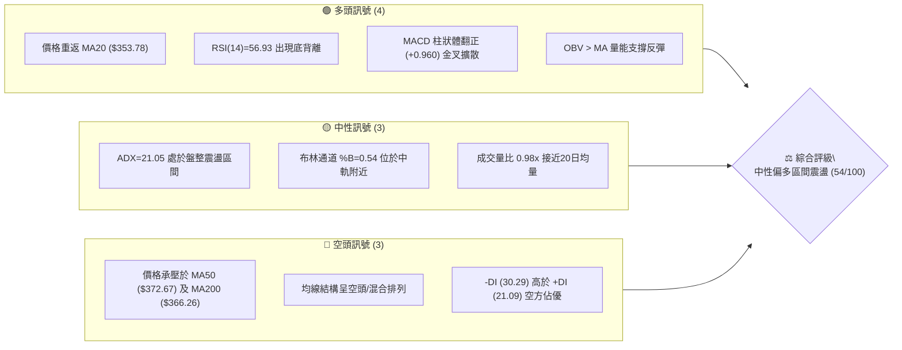
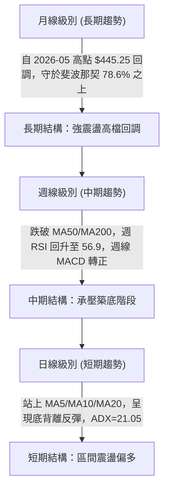
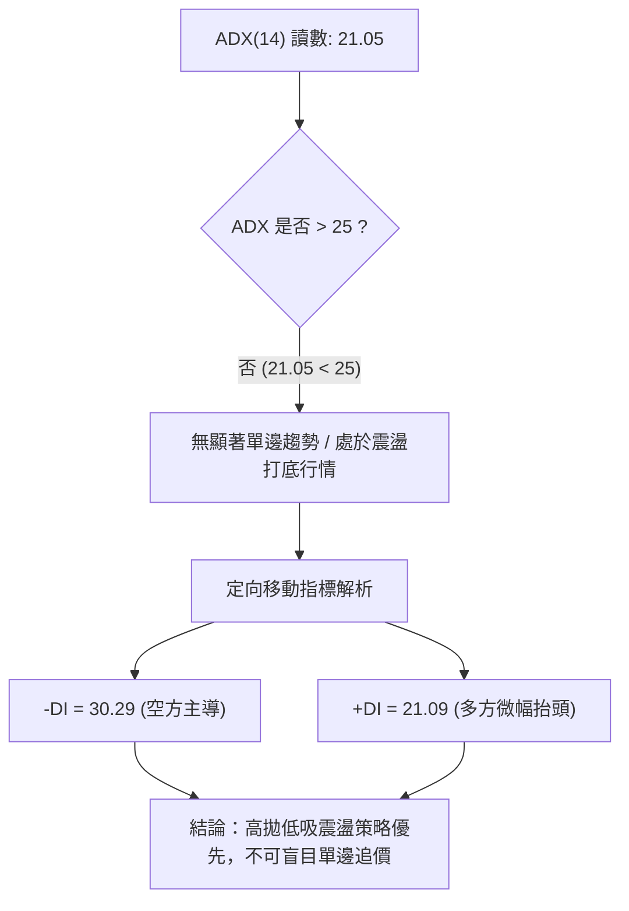
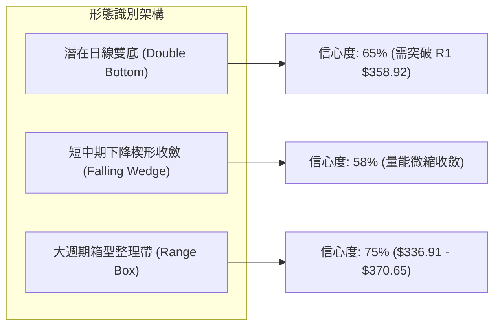
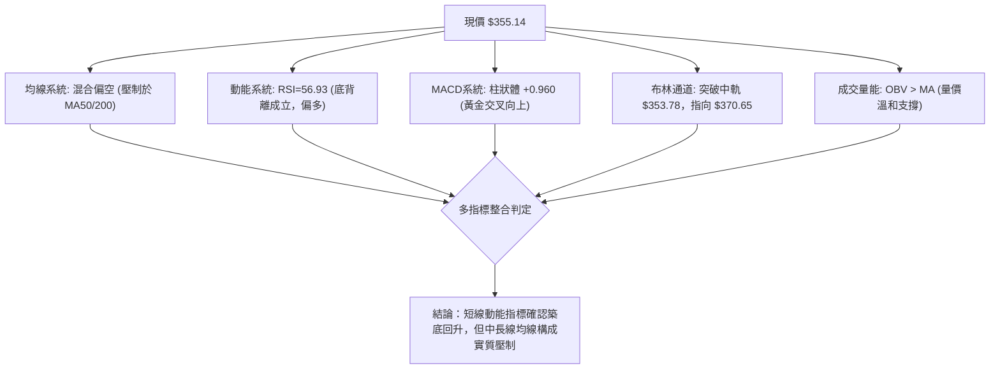
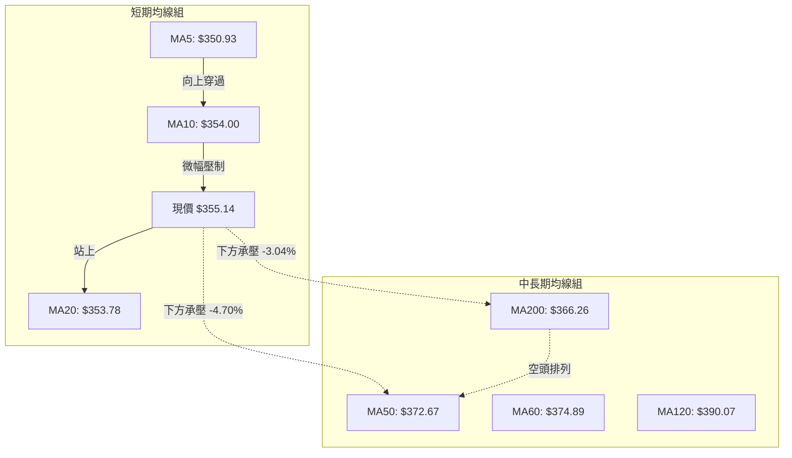
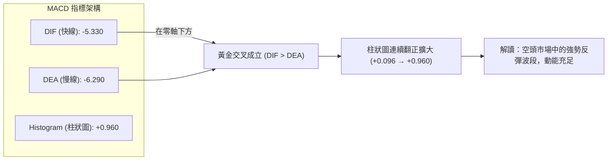
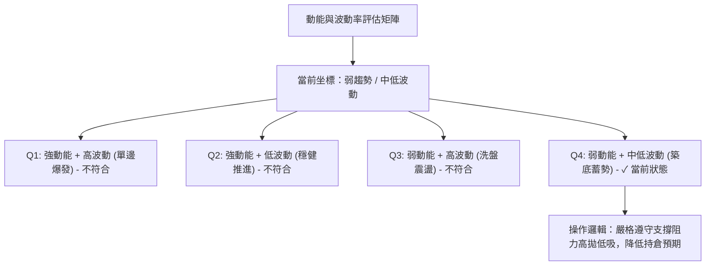
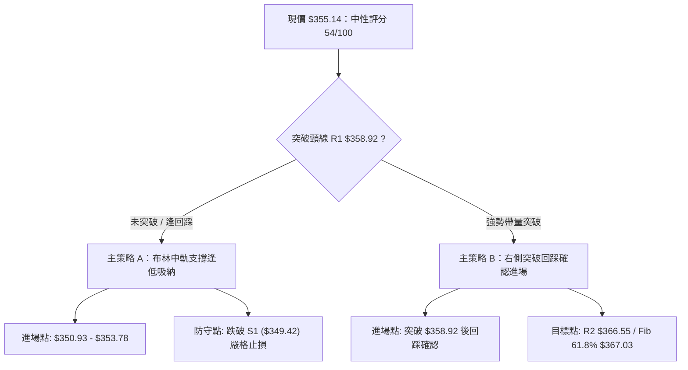
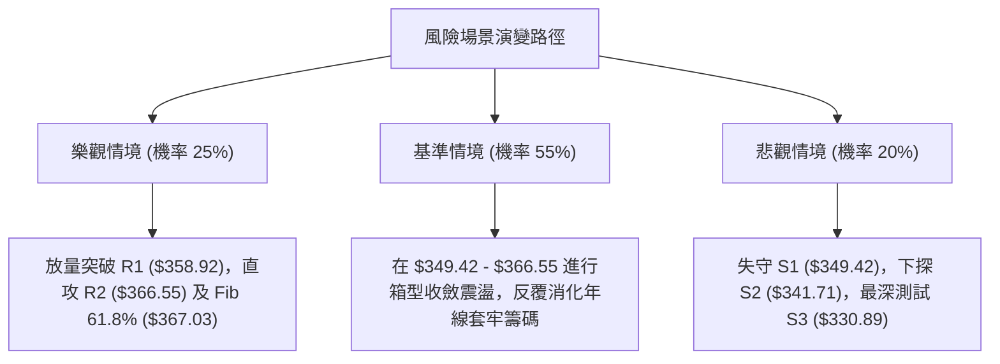

# AVGO 技術分析報告

> **報告日期**：2026-10-04 ｜ **語言**：繁體中文 ｜ **數據來源**：Yahoo Finance ｜ **當前價格**：$355.14

---

## 目錄

| 章節 | 內容 |
|------|------|
| [1. 技術面概覽](#1-技術面概覽) | 訊號儀表板、核心指標、評分卡 |
| [2. 趨勢分析](#2-趨勢分析) | 多時框趨勢、長中短期走勢 |
| [3. 圖表形態分析](#3-圖表形態分析) | 形態識別、K線組合、目標價 |
| [4. 支撐與阻力](#4-支撐與阻力) | 關鍵價位、斐波那契回調 |
| [5. 技術指標深度解讀](#5-技術指標深度解讀) | MA/RSI/MACD/布林/成交量 |
| [6. 動能與波動率](#6-動能與波動率) | 動能評估、ATR、Beta |
| [7. 多時框架總結](#7-多時框架總結) | 時框架評分矩陣 |
| [8. 交易策略建議](#8-交易策略建議) | 多空策略、風險報酬比 |
| [9. 風險提示與監控](#9-風險提示與監控) | 監控指標、風險場景 |

---

## 1. 技術面概覽

### 🎯 技術訊號儀表板



### 📊 核心指標速覽表

| 指標類別 | 指標名稱 | 當前數值 | 訊號 | 解讀 |
|----------|----------|----------|------|------|
| **價格** | 當前價格 | $355.14 | 🟡 | 位於52週區間 32.4% 分位，處於中低檔築底回升階段 |
| **均線** | MA20 | $353.78 | 🟢 | 價格突破並站上短期月線，短線動能改善 |
| **均線** | MA50 | $372.67 | 🔴 | 位於季線下方 -4.70%，中期反彈面臨明顯下壓 |
| **均線** | MA200 | $366.26 | 🔴 | 位於年線下方 -3.04%，中長期牛熊分界線尚未收復 |
| **動能** | RSI(14) | 56.93 | 🟢 | 脫離超賣區進入中性偏強區間，日線呈現明確底背離確認 |
| **動能** | MACD(12,26,9) | -5.330 / -6.290 | 🟢 | 快慢線負值區黃金交叉，柱狀體為 +0.960 且持續擴張 |
| **動能** | Stoch %K / %D | 63.60 / 47.18 | 🟢 | KD 指標維持黃金交叉上行，多頭動能延續 |
| **趨勢** | ADX(14) | 21.05 | 🟡 | ADX < 25 指示當前非單邊趨勢行情，屬於無序盤整築底 |
| **波動** | ATR(14) | $9.95 | 🟡 | 佔現價 2.80%，日內正常波動，止損設定具良好緩衝 |
| **通道** | Bollinger %B | 0.54 | 🟡 | 略高於布林中軌（$353.78），向通道上軌（$370.65）推進 |
| **量能** | 20日量比 | 0.98x | 🟡 | 量能持平均值，OBV 指標領先站上均線，買盤溫和回流 |

### 🏆 技術評分卡

```
╔══════════════════════════════════════════════════════════════════╗
║               技術評分卡 — AVGO (2026-10-04)                    ║
╠══════════════════════════════════════════════════════════════════╣
║ 趨勢強度 (ADX/趨勢方向)  ████████░░░░░░░░░░░░  40/100 🔴 弱勢震盪 ║
║ 動能指標 (RSI/MACD/KD)  ██████████████░░░░░░  70/100 🟢 底背反彈 ║
║ 支撐穩定度 (S1/S2/S3)    ████████████░░░░░░░░  60/100 🟡 築底測試 ║
║ 成交量配合 (OBV/量比)    ████████████░░░░░░░░  60/100 🟢 溫和吸籌 ║
║ 形態完整度 (區間整理)    ██████████░░░░░░░░░░  50/100 🟡 頸線未破 ║
║ 均線排列 (MA交叉狀態)    ████████░░░░░░░░░░░░  40/100 🔴 中長承壓 ║
╠══════════════════════════════════════════════════════════════════╣
║ 綜合技術評分             ███████████░░░░░░░░░  54/100 ⚖️ 區間震盪 ║
╚══════════════════════════════════════════════════════════════════╝
```

---

## 2. 趨勢分析

### 🌐 多時框趨勢分析



### 📈 長期趨勢 — 12個月走勢圖（Unicode）

```
AVGO 月線收盤走勢圖（2025-10 至 2026-10）
價格軸 ($)
$450 ┤                                  ● (05月 $445.25)
$425 ┤                              ● (04月 $416.01)
$400 ┤          ● (11月 $399.99)
$375 ┤                                          ● (07月 $388.57)
$350 ┤● (10月)       ● (12月)                       ● (08月)  ● (10月現價 $355.14)
$325 ┤                   ● (01月)                      ● (09月 $351.19)
$300 ┤                       ● (02月) ● (03月 $308.46)
     └───────────────────────────────────────────────────────────
      10  11    12   01   02   03   04   05   06   07   08   09   10  (月份)
```

#### 走勢特徵分析表格

| 階段區間 | 時間跨度 | 起訖價位 | 漲跌幅 | 結構特徵與量價行為 |
|----------|----------|----------|--------|--------------------|
| 第一階段：秋季衝頂 | 2025-10 ~ 2025-11 | $366.90 → $399.99 | +9.02% | 延續強勢多頭推升，逼近 $400 整數心理關卡 |
| 第二階段：深度回踩 | 2025-12 ~ 2026-03 | $399.99 → $308.46 | -22.88% | 連續4個月震盪走低，於 $308.46 見波段波谷支撐 |
| 第三階段：強勁主升 | 2026-03 ~ 2026-05 | $308.46 → $445.25 | +44.35% | 伴隨業績與AI浪潮大幅拉升，創下月線歷史收盤高點 |
| 第四階段：獲利回吐 | 2026-05 ~ 2026-09 | $445.25 → $351.19 | -21.13% | 震盪向下回調，測試下方波段低點聚類區 |
| 第五階段：底部收斂 | 2026-09 ~ 2026-10 | $351.19 → $355.14 | +1.12% | 短期連續兩週企穩反彈，收復 MA20 形成雙重底支撐 |

### 📊 中期趨勢（週線分析）

中期技術面於 2026-08 至 2026-09 出現明顯的動能鈍化與賣壓衰竭特徵。從近 20 週數據觀察：
- 2026-08-30 當週，RSI 曾跌落至極端超賣點 **23.5**，隨後在 2026-09-06 至 2026-09-27 期間，價格在 $352.81 - $361.33 區間反覆夯實，但 RSI 由 29.2 連續爬升至 47.4，最新一週收在 **56.9**。
- 週線 MACD 柱狀體於 2026-09-13 翻正（+0.096），最新維持在 **+0.960**，顯示中期空頭動能已被吸收，籌碼轉入中性盤整。

```
近期週線壓力與支撐階梯：
$375.91 ─────────────────── [R3 強阻力 / 60日均線壓力位]
$366.55 ─────────────────── [R2 中期多空分水嶺 / MA200 年線]
$358.92 ─────────────────── [R1 短期反彈首道頸線壓力]
$355.14 ◀ 現價位置 ($355.14)
$349.42 ─────────────────── [S1 近期波段第一道支撐 / MA10]
$341.71 ─────────────────── [S2 次級波段低點支撐]
$330.89 ─────────────────── [S3 關鍵多頭防線 / 斐波那契 78.6%]
```

### ⚡ 趨勢強度評估（ADX 解讀）



| 指標變數 | 當前讀數 | 門檻區間 | 趨勢屬性判定 | 交易指引 |
|----------|----------|----------|--------------|----------|
| **ADX** | 21.05 | < 25.0 | 無趨勢 / 盤整市場 | 趨勢突破型策略失效，採用布林通道區間交易 |
| **+DI** | 21.09 | 0 ~ 100 | 短線多頭動能自低位抬升 | 多頭回補中，但尚未取得主動權 |
| **-DI** | 30.29 | 0 ~ 100 | 空方壓制仍具優勢 | 上方承壓，遇阻力區易出現壓回 |
| **DI 差值** | -9.20 | -DI > +DI | 空頭殘留壓力 | 需等待 +DI 上穿 -DI 形成多頭強勢信號 |

---

## 3. 圖表形態分析

### 🔍 形態識別系統



#### 形態識別與信心度評估表

| 識別形態 | 信心度 | 判斷依據（引用數據） | 完成度 | 目標價（附嚴格計算式） |
|----------|--------|----------------------|--------|------------------------|
| **雙底形態 (W底)** | **65%** | 兩次低點探至波段低點聚類區 S1 ($349.42) 與 2026-09 低點 ($351.19)，RSI 底背離確認 | 70% | 頸線阻力 R1 ($358.92) + 形態高度 ($358.92 - $349.42 = $9.50) = **$368.42**（接近 R2 $366.55 聚類區） |
| **布林中軌突破反彈** | **75%** | 價格由布林下軌 $336.91 企穩，成功突破中軌 $353.78，%B 升至 0.54 | 85% | 目標指向布林上軌：**$370.65** |
| **頭肩底或反轉形態** | **35%** | 數據中未偵測到完整的右肩架構，成交量未呈現放大脈衝 | 20% | 訊號不足，僅做指標型解讀，不預設理論目標 |

### 🕯️ 重要K線形態分析

| 週期/月份 | 收盤價 | K線組合形態 | 技術面解讀 | 訊號 |
|-----------|--------|-------------|------------|------|
| 2026-08 (月線) | $369.67 | 高位回落大陰線 | 自 $445.25 高點連續下挫，跌破 MA50，空方賣壓集中釋放 | 🔴 |
| 2026-09 (月線) | $351.19 | 下影線小實體陰十字 | 探底至 52W 區間 30% 附近出現逢低承接買盤，空頭動能衰竭 | 🟡 |
| 2026-09-27 (週線) | $352.81 | 低檔十字星星線 (Doji) | 空方力竭，多空於 S1 ($349.42) 之上達成暫時平衡 | 🟢 |
| 2026-10-04 (週線) | $355.14 | 帶下影線小陽線 | 成功收復 MA20 ($353.78)，確認短期底背離結構有效性 | 🟢 |

### 📉 ASCII 走勢形態示意圖

```
AVGO 日線「潛在雙底反彈」架構示意圖：

 阻力 R2: $366.55 ───────────────────────────────── 目標達成區間 ($367.03 Fib 61.8%)
                                                     /
 頸線 R1: $358.92 ───────────┐                     /  ▲
                             │      反彈測試      /   │ 形態高度: $9.50
                             │       ┌────▲──────┘    │
 現價:   $355.14 ───────────┼───────┼────● 突破頸線前哨站
                             │       │
                             │  谷底 │
 低點 S1: $349.42 ──●────────┴───────●──────────────── 底背離雙底基底
                   第一底          第二底
                  (09月下旬)      (10月初)
```

### 🎯 形態目標價計算

1. **雙底頸線測量規則**：
   - 第一底/第二底平均支撐取 S1 = **$349.42**
   - 頸線壓力取近一年波段高點聚類 R1 = **$358.92**
   - 形態垂直高度 $H = \text{頸線}(358.92) - \text{底部}(349.42) = \$9.50$
   - 向上突破量度目標價 $T = 358.92 + 9.50 =$ **$368.42**
   - 此量度目標緊鄰數據中算出的強阻力位 R2（**$366.55**）與 61.8% 斐波那契回調位（**$367.03**），驗證此區間為技術面密集共振阻力。

---

## 4. 支撐與阻力

### 🗺️ 關鍵價位分布圖（Unicode）

```
╔══════════════════════════════════════════════════════════════════╗
║               AVGO 價位結構分布圖 (OHLCV 計算)                   ║
╠══════════════════════════════════════════════════════════════════╣
║ $375.91 ║████████████████████████║ 強阻力 R3 (MA60 / 季線密集承壓區) ║
║ $370.65 ║████████████████████    ║ 布林通道上軌壓力帶              ║
║ $367.03 ║██████████████████████  ║ 斐波那契 61.8% 回調黃金阻力位   ║
║ $366.55 ║████████████████████    ║ 關鍵阻力 R2 (MA200 牛熊分界線)  ║
║ $358.92 ║████████████████        ║ 短期阻力 R1 (雙底形態頸線位)    ║
║ ─────── ╫────────────────────────╫ ──────────────────────────── ║
║ $355.14 ╠════════════════════════╣ ◄ 當前收盤價 ($355.14)          ║
║ ─────── ╫────────────────────────╫ ──────────────────────────── ║
║ $353.78 ║▓▓▓▓▓▓▓▓▓▓▓▓▓▓▓▓        ║ 布林中軌 / MA20 短期動態防線    ║
║ $349.42 ║▓▓▓▓▓▓▓▓▓▓▓▓▓▓▓▓▓▓▓▓    ║ 近期支撐 S1 (雙底形態第二腳低點)║
║ $341.71 ║████████████████████    ║ 次級支撐 S2 (波段前低聚類)      ║
║ $336.91 ║██████████████████████  ║ 布林通道下軌極限支撐            ║
║ $332.71 ║████████████████████████║ 斐波那契 78.6% 回調關鍵防守位   ║
║ $330.89 ║████████████████████████║ 強支撐 S3 (年內最後防守壁壘)    ║
╚══════════════════════════════════════════════════════════════════╝
```

### 🚧 阻力位分析表

| 阻力級別 | 價位 | 形成原因與數據佐證 | 突破難度 | 重要性 |
|----------|------|--------------------|----------|--------|
| **R1** | **$358.92** | 近一年波段高點聚類位，雙底頸線位置（距現價 +1.06%） | 🟡 中等 | ★★★☆☆ |
| **R2** | **$366.55** | 波段高點聚類，與 MA200 ($366.26) 及 Fib 61.8% ($367.03) 共振 | 🔴 較高 | ★★★★☆ |
| **R3** | **$375.91** | 近一年重要波段頂部聚類，貼近 MA60 ($374.89) 及 MA50 ($372.67) | 🔴 極高 | ★★★★★ |

### 🛡️ 支撐位分析表

| 支撐級別 | 價位 | 形成原因與數據佐證 | 守住機率 | 重要性 |
|----------|------|--------------------|----------|--------|
| **S1** | **$349.42** | 近一年波段低點聚類，MA5 ($350.93) 上行支撐（距現價 -1.61%） | 75% | ★★★★☆ |
| **S2** | **$341.71** | 次級波段低點聚類，接近布林下軌緩衝區 | 80% | ★★★☆☆ |
| **S3** | **$330.89** | 近一年深層支撐低點聚類，與 Fib 78.6% ($332.71) 形成堅固共振底 | 90% | ★★★★★ |

### 📐 斐波那契回調位分析

依據 52 週極值區間（低點 **$288.98** → 高點 **$493.32**，波幅 $204.34）計算：

| 回調比例 | 斐波那契精確價位 | 相對現價位置 | 技術意義與互動狀態解讀 |
|----------|------------------|--------------|------------------------|
| 0.0% | $493.32 | +38.91% | 52週歷史高點，長期終極多頭目標 |
| 23.6% | $445.09 | +25.33% | 2026-05 月線高點阻力聚類 |
| 38.2% | $415.26 | +16.93% | 2026-04 突破大陽線起漲平臺 |
| 50.0% | $391.15 | +10.14% | 中期多空平衡中軸，MA120 ($390.07) 重疊位 |
| 61.8% | $367.03 | +3.35% | 黃金分割關鍵阻力，緊扣 R2 ($366.55) 與 MA200 |
| **78.6%** | **$332.71** | -6.32% | **深度回調安全緩衝墊，守護 S3 ($330.89)** |
| 100.0% | $288.98 | -18.63% | 52週最低點，終極週期防禦底線 |

> **當前位置解讀**：現價 **$355.14** 明確落於 **78.6% 回調位 ($332.71)** 與 **61.8% 回調位 ($367.03)** 之間。該區間通常為大型權值股遭受非基本面拋售後的核心吸籌整理帶。下方有 $332.71 深度回調位的強力牽引，上方直接受阻於 $367.03 黃金分割線。

---

## 5. 技術指標深度解讀

### 🎛️ 指標訊號總覽



### 📈 移動平均線排列分析



- **均線排列狀態**：當前均線系統屬於典型的「短期築底轉強、中長期空頭排列」之**混合排列**。
  - 短天期 MA5 ($350.93) 向上金叉擴散，價格連續 2 日穩固在 MA20 ($353.78) 之上。
  - 價格依然受阻於 MA200 ($366.26) 與 MA50 ($372.67)。這意味著短線反彈空間已被上方層層中長線均線封鎖，在未放量長陽站穩 MA200 之前，無法定義為多頭行情重啟。

### 📉 RSI(14) 分析

```
RSI(14) 讀數儀表：
0       30              50     56.93      70             100
├───────┼───────────────┼────────●────────┼───────────────┤
  超賣        弱勢區           中性偏多       超買區
[進度條] ████████████████████████░░░░░░░░░░░░░░░░░░  56.93%
```

- **超買超賣判定**：數值 56.93 脫離了 8 月底的極度超賣區（23.5），運行於中性偏多區間，並未觸及 70 以上的超買警戒線，表示反彈動能尚未過熱。
- **背離分析（結論：明確底背離 Bullish Divergence）**：
  - 價格走勢：2026-08-30 收盤 $368.12（當週最低下探），隨後於 2026-09-27 下探至波段低收盤價 $352.81，形成價格層面的實質破底。
  - RSI 走勢：8 月底 RSI 探至 23.5 極限值，但在 9 月底價格下破時，RSI 卻維持在 47.4，最新更攀升至 56.93。
  - **結論**：指標形成教科書級的「價格破底而指標抬高」之**標準底背離**，預示中線空方動能竭盡，轉入實質性技術修復。

### 📊 MACD(12/26/9) 訊號解讀



- MACD 雖在零軸下方運行（代表總體週期仍處於修正波），但快線由下往上穿越慢線已形成確鑿的金叉。
- 柱狀體數值達 **+0.960**，為近一個月以來最強擴張讀數，與 RSI 底背離形成多頭動能的「雙重共振確認」。

### 📦 布林通道分析

```
布林通道結構示意圖 (Bandwidth: 9.53%)
$370.65 ┬─────────────────────────────── 上軌 (強阻力帶 / 近 R2-R3)
        │
        │
$355.14 ┼────────────────●────────────── 現價 ($355.14, %B=0.54)
$353.78 ┼─────────────────────────────── 中軌 (MA20 翻多支撐防線)
        │
        │
$336.91 ┴─────────────────────────────── 下軌 (極限支撐帶 / 近 S2-S3)
```

- **%B 指標解讀**：當前 %B 為 **0.54**，價格由下軌（8-9月低檔）回升並成功跨過 0.5 中軌水位。
- **軌道狀態**：通道上下軌維持在 $336.91 至 $370.65 區間震盪收斂，帶寬約 9.53%，並未出現發散單邊開口，再次印證當前行情屬於標準的「布林通道內部震盪」，反彈極限首要觀察上軌 **$370.65**。

### 💹 成交量分析（量價配合度）

- **量比檢驗**：最新成交量 24,607,000 股，對比 20 日均量（25,036,465 股）之量比為 **0.98x**，呈現中規中矩的量能水平，無恐慌性拋售，亦無非理性追高。
- **OBV 量能趨勢**：官方數據明確指出「**OBV > MA → 量能支撐上漲**」。這表明在過去兩週的打底反彈過程中，大戶與機構投資者（持股佔比 79.8%）採取低檔吸籌累積倉位策略，量價配合呈良性背書。

---

## 6. 動能與波動率

### ⚡ 動能評估四象限



| 象限 | 動能維度 | 波動維度 | 歷史形態特徵 | 當前狀態判定 | 戰術指引 |
|------|----------|----------|--------------|--------------|----------|
| **第一象限 (Q1)** | 強 (ADX>25) | 高 (ATR%>3.5%) | 主升浪或崩盤單邊 | ❌ | 順勢重倉突破跟進 |
| **第二象限 (Q2)** | 強 (ADX>25) | 低 (ATR%<2.0%) | 績優股緩牛爬升 | ❌ | 順勢加碼並持股續抱 |
| **第三象限 (Q3)** | 弱 (ADX<25) | 高 (ATR%>3.5%) | 假突破多空雙殺 | ❌ | 觀望以避免被洗盤 |
| **第四象限 (Q4)** | **弱 (ADX=21.05)** | **中低 (ATR%=2.8%)** | **區間沉澱打底** | **✓ (吻合)** | **網格交易/波段高拋低吸** |

### 📊 ATR 波動率分析

- **ATR(14) 數值**：**$9.95**（佔當前股價 2.80%）。
- **日內波動特徵**：波動率自 2026-06 高峰顯著回落，顯示個股情緒回歸理性，籌碼換手趨於溫和。
- **風控止損距離精算**：
  - 極短線交易（1.0倍 ATR）：緩衝區間為 **$9.95**，對應現價支撐容忍位 $345.19。
  - 波段交易（1.5倍 ATR）：緩衝區間為 $9.95 \times 1.5 =$ **$14.93**，對應安全止損點 $340.21（緊鄰 S2 $341.71 下緣）。
  - 中期持倉（2.0倍 ATR）：緩衝區間為 $9.95 \times 2.0 =$ **$19.90**，跌破 $335.24 即宣告破局。

### 📐 Beta 與市場相關性

- **Beta 係數**：**1.457**。
- **特徵解讀**：AVGO 具備高度成長型科技半導體龍頭屬性，對納斯達克 100 指數與費城半導體指數具有 1.46 倍的槓桿放大效應。若大盤指數企穩回升，AVGO 具備超越大盤的彈性；若大盤受總體經濟衝擊下挫，該股回調幅度亦將大於市場均值。

---

## 7. 多時框架總結

### 📋 時框架評分表

| 時框架 | 趨勢方向 | 動能狀態 | 均線排列 | 關鍵技術形態 | 綜合評分 | 操作建議 |
|--------|----------|----------|----------|--------------|----------|----------|
| **月線 (長期)** | 🟡 高位回踩震盪 | 中性拉回 | 均線高檔分歧 | 自 $445.25 回調，守於 Fib 78.6% 之上 | 60/100 | 長期基本面良好，回調低吸 |
| **週線 (中期)** | 🔴 弱勢承壓整理 | 🟢 MACD金叉 | MA50/200 下方 | 於 $350 築底，週 RSI 抬升至 56.9 | 48/100 | 防範上方均線壓制，區間應對 |
| **日線 (短期)** | 🟢 震盪反彈修復 | 🟢 RSI底背離 | 站上 MA20 均線 | 潛在雙底向上挑戰頸線 R1 ($358.92) | 58/100 | 逢低偏多操作，嚴控停損 |

### 🔲 綜合訊號矩陣

```
時框訊號一致性交叉檢驗矩陣：
╔══════════════════════════════════════════════════════════════════╗
║ 維度         短期 (日線)      中期 (週線)      長期 (月線)       ║
╠══════════════════════════════════════════════════════════════════╣
║ 趨勢方向     🟢 震盪反彈      🔴 承壓築底      🟡 高檔強震盪     ║
║ 動能指標     🟢 強烈底背離    🟢 柱狀體翻正    🟡 中性修正       ║
║ 均線系統     🟢 站上 MA20     🔴 跌破 MA200    🟢 守住長期支撐   ║
║ 量能形態     🟢 OBV增強       🟡 縮量整理      🟢 長期資金沉澱   ║
╠══════════════════════════════════════════════════════════════════╣
║ 衝突協調     短線反彈獲指標支持，但中長期均線未順應，屬於逆趨勢反彈 ║
╚══════════════════════════════════════════════════════════════════╝
```

### ⚖️ 多時框收斂結論

> **依嚴格規則 14 進行權重收斂**：
> 1. **行情屬性判定**：當前日線 ADX(14) = **21.05 (< 25)**，明確指示當前處於**盤整震盪行情**，而非單邊趨勢行情。
> 2. **主導時框與交易邏輯**：在盤整行情中，中長期的均線壓制無法形成單邊推動，交易應以**日線布林通道區間（$336.91 - $370.65）及波段聚類支撐阻力**為主要邊界。
> 3. **唯一方向性結論**：**⚖️ 中性偏多區間震盪操作**。以 S1 ($349.42) / MA20 ($353.78) 為下檔依託，短線向上博弈頸線 R1 ($358.92) 及共振阻力 R2 ($366.55) 的反彈波段。

---

## 8. 交易策略建議

### 🗺️ 策略決策流程圖



### 🧭 策略路由

**當前主策略方向 = 🟢 區間逢低做多／反彈波段操作（技術評分 54/100，處於 40–60 震盪博弈帶）**

評分落在中性偏多區間，且 ADX < 25 指示盤整震盪，因此**全面禁止追高**，核心策略鎖定在布林中軌至 S1 支撐間的「逢低佈局」，向上挑戰 R1 頸線與 R2 年線阻力。

### 🎯 價格情境階梯（Price Scenarios）

| 觸發條件 | 下一目標 | 後續延伸 | 情境含義與操作指引 |
|----------|----------|----------|--------------------|
| **向上突破 R1 ($358.92)** | **R2 ($366.55)** | **R3 ($375.91)** | **短線轉強**：雙底形態成立，朝 MA200 年線推進並測試季線壓力 |
| **站穩現價區間 ($353.78-$358.92)** | **R1 ($358.92)** | — | **區間震盪**：多空於布林中軌進行籌碼沉澱，維持高拋低吸 |
| **向下跌破 S1 ($349.42)** | **S2 ($341.71)** | **S3 ($330.89)** | **中期轉弱**：雙底築底失敗，向下尋求布林下軌及 Fib 78.6% 支撐 |

### 📊 情境機率分佈

| 預測情境 | 發生機率 | 主要技術依據與數據驗證 |
|----------|----------|------------------------|
| **情境一：震盪上行反彈** | **55%** | RSI 底背離確認、MACD 柱狀體擴張 (+0.960)、OBV 量能領先向上 |
| **情境二：箱型區間橫盤** | **30%** | ADX=21.05 趨勢羸弱、布林帶寬收窄、上方 MA50/MA200 重重壓制 |
| **情境三：向下破位探底** | **15%** | -DI (30.29) 仍處相對高位，若整體半導體板塊走弱恐回測 S2/S3 |

### 🟢 主策略詳情

| 策略要素 | 策略 A：左側逢低佈局（中軌/S1買點） | 策略 B：右側突破跟進（突破R1買點） |
|----------|-------------------------------------|-----------------------------------|
| **交易類型** | 支撐低吸波段 | 形態突破跟隨 |
| **進場條件** | 股價回踩 MA20/MA5 獲得支撐不破 | 日線收盤價帶量突破 R1 頸線 |
| **進場價格** | **$353.78**（布林中軌處） | **$359.50**（確認站上 R1 $358.92） |
| **目標價 T1** | **$358.92**（R1 頸線阻力位） | **$366.55**（R2 / MA200 年線共振位） |
| **目標價 T2** | **$366.55**（R2 強阻力位） | **$370.65**（布林通道上軌位） |
| **止損價格** | **$349.00**（跌破 S1 $349.42 之緩衝點） | **$354.50**（跌回突破頸線與 MA20 下方） |
| **潛在空間/虧損** | 獲利 $12.77 / 風險 $4.78 | 獲利 $11.15 / 風險 $5.00 |
| **風險報酬比** | **2.67 : 1** 🟢 優良 | **2.23 : 1** 🟢 良好 |
| **預估勝率** | **60%** | **55%** |
| **建議倉位** | **15%**（基礎波段倉位） | **10%**（動量加碼倉位） |

### 🔴 反向風險觸發點（對沖提示）

- **多頭結構破壞點**：若日線收盤價實質跌破 **S1 ($349.42)**，則雙底預期失效，應立即將多頭部位降倉 50%。
- **極端避險觸發點**：若盤中放量摜破 **S2 ($341.71)**，表明空方重啟殺跌波段，需啟動全面避險止損，下檔風險直指 **S3 ($330.89)** 或 Fib 78.6% (**$332.71**)。

### ⭐ 整體訊號強度評星

```
╔══════════════════════════════════════════════════════════════════╗
║ 做多訊號強度：★★★☆☆  (3.0/5星：底背離動能良好，但受制於阻力區) ║
║ 做空訊號強度：★★☆☆☆  (2.0/5星：空頭動能衰竭，殺跌空間有限)   ║
║ 整體可信度：  ★★★☆☆  (3.5/5星：量價配合溫和，盤整震盪屬性明確)║
╚══════════════════════════════════════════════════════════════════╝
```

---

## 9. 風險提示與監控

### ✅ 關鍵監控指標 Checklist

```
╔══════════════════════════════════════════════════════════════════╗
║              AVGO 交易風控監控清單 (Checklist)                  ║
╠══════════════════════════════════════════════════════════════════╣
║ [ ] 價格收盤是否守穩布林中軌 MA20 ($353.78)                      ║
║ [ ] RSI(14) 是否持續維持在 50 中軸之上，避免底背離形態夭折       ║
║ [ ] MACD 柱狀體是否延續翻正擴張（能否保持在 +0.960 之上）        ║
║ [ ] 突破 R1 ($358.92) 時，單日成交量能否超過 20日均量 (25.0M)    ║
║ [ ] 下方核心防守位 S1 ($349.42) 是否遭遇實質放量擊穿            ║
║ [ ] 費城半導體指數 (SOX) 是否同步回穩，確認 Beta (1.457) 正反饋 ║
╚══════════════════════════════════════════════════════════════════╝
```

### ⚠️ 風險場景分析



### 🛡️ 風險管理重要提醒

1. **半導體高 Beta 敞口管理**：
   - AVGO Beta 值高達 **1.457**，短線受大盤系統性波動影響極深。在 ADX < 25 處於無趨勢狀態下，單檔標的總部位**嚴禁超過總投資組合的 20%**。
2. **阻力密集區分批停利**：
   - 價格接近 **R2 ($366.55)** 至 **Fib 61.8% ($367.03)** 區間時，與 MA200 ($366.26) 形成多重頂部共振。多頭部位抵達該位置時，**必須執行至少 50% 的分批獲利了結**，不可抱持過度突破預期。
3. **ATR 動態止損紀律**：
   - 依據當前 ATR **$9.95**，盤中波動若達 1.5 倍 ATR 震盪屬於合理市場噪聲，但一旦實質擊穿預設的數值止損點（如策略 A 的 **$349.00**），必須無條件離場觀望，切忌凹單攤平。

---

## 📋 報告總結

```
╔══════════════════════════════════════════════════════════════════╗
║                     AVGO 技術分析報告總結                       ║
╠══════════════════════════════════════════════════════════════════╣
║ 報告日期：2026-10-04                                             ║
║ 當前價格：$355.14                                                ║
║ 技術評級：⚖️ 中性偏多區間震盪 (綜合評分: 54/100)                 ║
║                                                                  ║
║ 關鍵維度結論：                                                   ║
║ ├─ 長期趨勢：🟡 高位回調整理，守於 Fib 78.6% 之上，結構未壞    ║
║ ├─ 中期趨勢：🔴 承壓於 MA50/MA200，但週線 MACD翻正築底跡象初顯  ║
║ ├─ 短期趨勢：🟢 站穩 MA20，日線 RSI 底背離確立，短多掌握主動    ║
║ ├─ 關鍵支撐：S1: $349.42  ｜  S2: $341.71  ｜  S3: $330.89       ║
║ ├─ 關鍵阻力：R1: $358.92  ｜  R2: $366.55  ｜  R3: $375.91       ║
║ └─ 機構共識：Strong Buy (47位分析師)，目標均價 $531.31           ║
║                                                                  ║
║ 最優操作策略：                                                   ║
║ 1. 🥇 最佳機會：策略 A (中軌逢低佈局)                            ║
║    - 於 $353.78 附近進場，止損 $349.00，目標上看 $366.55 (R/R=2.67)║
║ 2. 🥈 次選機會：策略 B (突破 R1 跟隨)                            ║
║    - 帶量站穩 $359.50 後進場，止損 $354.50，目標 $366.55 / $370.65 ║
║ 3. 🥉 保守選擇：布林通道極限區間網格操作                         ║
║    - 於布林下軌 $336.91 至上軌 $370.65 之間高拋低吸，嚴設止損    ║
╚══════════════════════════════════════════════════════════════════╝
```

---

> ⚠️ **免責聲明**：本報告為 AI 自動生成之技術分析，所有數據及估算均基於提供的歷史價格資訊。本報告**僅供研究與學術參考**，**不構成任何投資建議**。投資有風險，入市需謹慎。

---

*報告生成時間：2026-10-04 ｜ 數據來源：Yahoo Finance ｜ 分析框架：多時框技術分析*