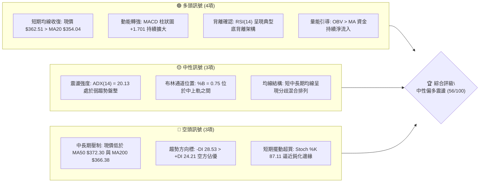
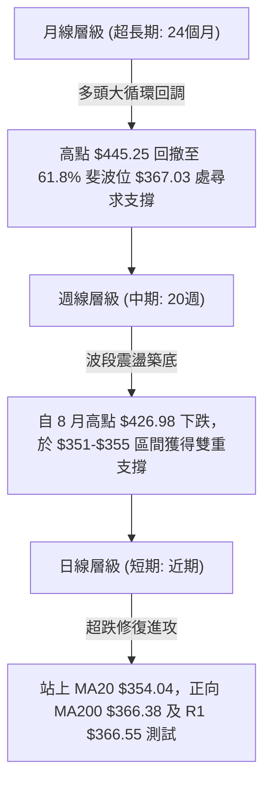
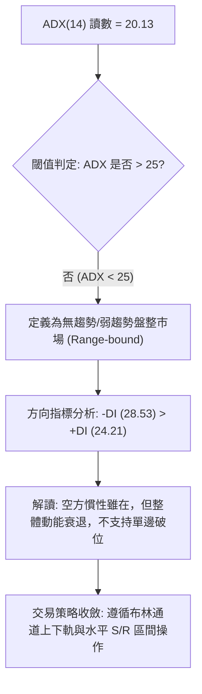
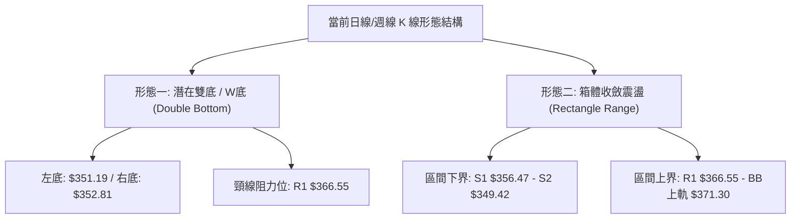
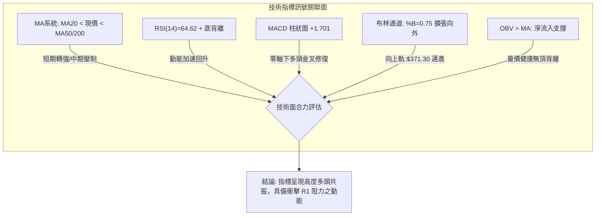
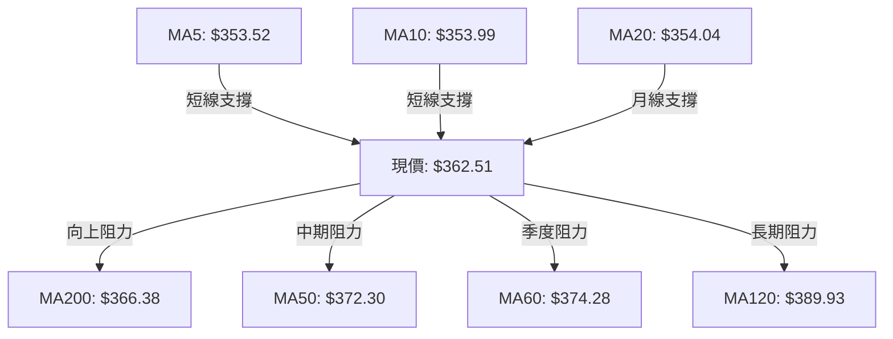
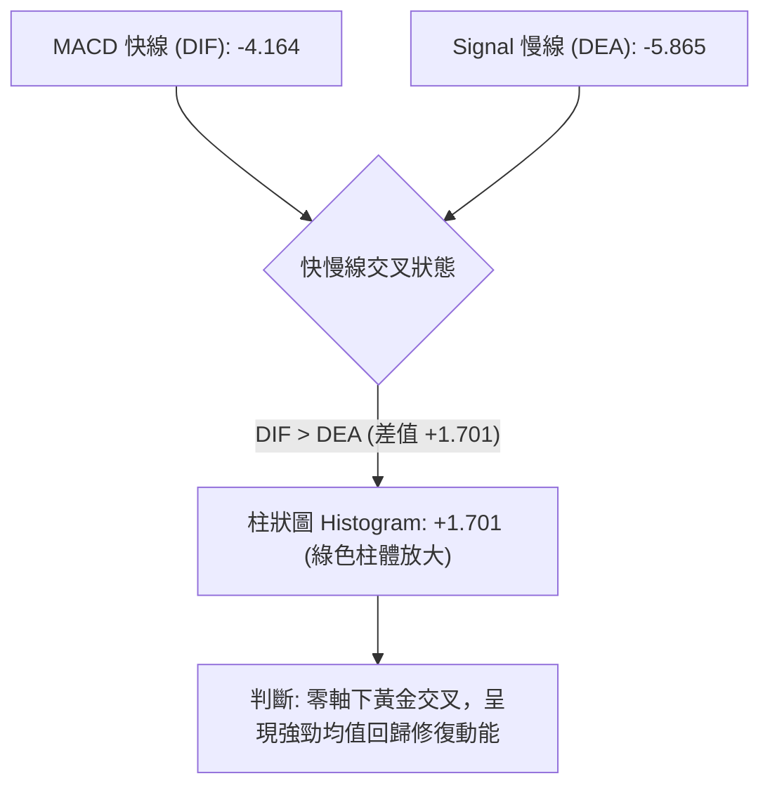
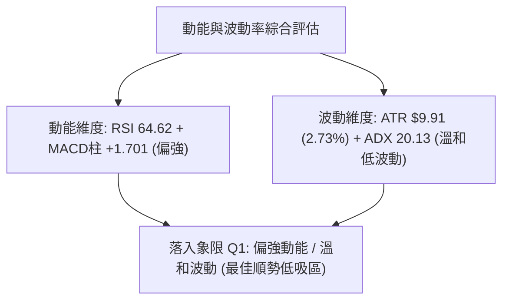
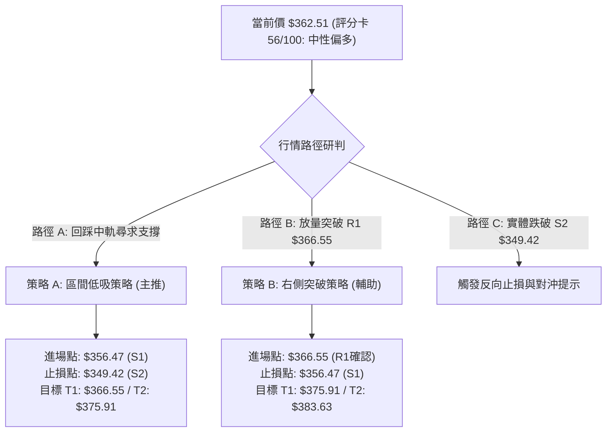
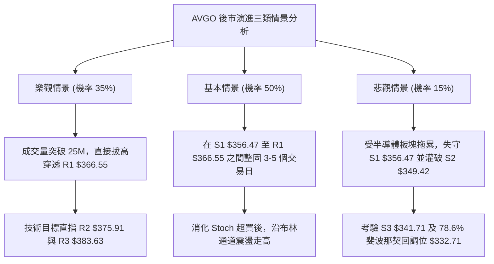

# AVGO 技術分析報告

> **報告日期**：2026-10-06 ｜ **語言**：繁體中文 ｜ **數據來源**：Yahoo Finance ｜ **當前價格**：$362.51

---

## 目錄

| 章節 | 內容 |
|------|------|
| [1. 技術面概覽](#1-技術面概覽) | 訊號儀表板、核心指標、評分卡 |
| [2. 趨勢分析](#2-趨勢分析) | 多時框趨勢、長中短期走勢 |
| [3. 圖表形態分析](#3-圖表形態分析) | 形態識別、K線組合、目標價 |
| [4. 支撐與阻力](#4-支撐與阻力) | 關鍵價位、斐波那契回調 |
| [5. 技術指標深度解讀](#5-技術指標深度解讀) | MA/RSI/MACD/布林/成交量 |
| [6. 動能與波動率](#6-動能與波動率) | 動能評估、ATR、Beta |
| [7. 多時框架總結](#7-多時框架總結) | 時框架評分矩陣 |
| [8. 交易策略建議](#8-交易策略建議) | 多空策略、風險報酬比 |
| [9. 風險提示與監控](#9-風險提示與監控) | 監控指標、風險場景 |

---

## 1. 技術面概覽

### 🎯 技術訊號儀表板



### 📊 核心指標速覽表

| 指標類別 | 指標名稱 | 當前數值 | 訊號 | 解讀 |
|:---|:---|:---:|:---:|:---|
| **價格** | 當前收盤價 | $362.51 | 🟢 | 自 9 月底低點回升，站上短期均線集群 |
| **均線** | MA20 (月線) | $354.04 | 🟢 | 現價高於 MA20 達 +2.39%，短期多頭掌控進攻權 |
| **均線** | MA50 (季線) | $372.30 | 🔴 | 現價低於 MA50 達 -2.63%，中期反彈壓力顯著 |
| **均線** | MA200 (年線) | $366.38 | 🔴 | 現價位於年線下方 -1.06%，長線多空分水嶺承壓 |
| **動能** | RSI(14) | 64.62 | 🟢 | 動能進入強勢中性區，伴隨日線級別底背離反彈 |
| **動能** | MACD (12,26,9) | -4.164 / Hist +1.701 | 🟢 | DIF 線低位金叉 DEA 預備中，柱狀圖翻正擴張 |
| **動能** | KD (14,3,3) | %K 87.11 / %D 59.21 | 🟡 | 進入短線超買區，需提防衝高回踩中軌 |
| **趨勢強度** | ADX (14) | 20.13 | 🟡 | ADX < 25，確認市場處於無方向性箱體震盪 |
| **通道** | 布林通道帶寬 | $336.78 - $371.30 | 🟡 | %B = 0.75，目前正朝布林上軌 $371.30 推進 |
| **量能** | 當日量 / 20日均量 | 21.43M / 24.47M | 🟡 | 量比 0.88x，反彈伴隨溫和縮量，需補量突破 |
| **波動** | ATR(14) | $9.91 (2.73%) | 🟡 | 日內平均振幅適中，有利於區間波段風控布局 |

### 🏆 技術評分卡

```
╔══════════════════════════════════════════════════════════════════╗
║                 技術評分卡 — AVGO (2026-10-06)                   ║
╠══════════════════════════════════════════════════════════════════╣
║ 趨勢強度 (ADX=20.13)      ████████░░░░░░░░░░░░  42/100  🟡 弱勢盤整 ║
║ 動能指標 (RSI/MACD)       ██████████████░░░░░░  68/100  🟢 底背離強 ║
║ 支撐穩定度 (S1/S2防守)    █████████████░░░░░░░  65/100  🟢 低點抬高 ║
║ 成交量配合 (OBV>MA)       ███████████░░░░░░░░░  58/100  🟡 溫和量能 ║
║ 形態完整度 (箱體/雙底雛形) ███████████░░░░░░░░░  55/100  🟡 構築階段 ║
║ 均線排列 (短多長空)       █████████░░░░░░░░░░░  48/100  🟡 均線糾纏 ║
╠══════════════════════════════════════════════════════════════════╣
║ 綜合評分                  ███████████░░░░░░░░░  56/100  中性偏多 ║
╚══════════════════════════════════════════════════════════════════╝
```

---

## 2. 趨勢分析

### 🌐 多時框趨勢分析



### 📈 長期趨勢 — 12個月走勢圖（Unicode）

```
AVGO 月線收盤價走勢圖（2025-10 至 2026-10）
價格軸 ($)
$450 ┤                                      ● (05月 $445.25)
$430 ┤
$410 ┤                              ● (04月 $416.01)
$390 ┤      ● (11月 $399.99)                                ● (07月 $388.57)
$370 ┤  ● (10月 $366.90)                                            ● (08月 $369.67)
$350 ┤                  ● (12月 $344.20)            ● (06月 $377.06)        ●(現價 $362.51)
$330 ┤                      ● (01月 $329.48)                                ● (09月 $351.19)
$310 ┤                          ● (02月 $317.80)
$300 ┤                              ● (03月 $308.46)
     └──────┬───────┬───────┬───────┬───────┬───────┬───────┬───────┬───────┬───────┬───────┬───────┬───────
         25-10   25-11   25-12   26-01   26-02   26-03   26-04   26-05   26-06   26-07   26-08   26-09   26-10
```

#### 長期走勢特徵分析表

| 階段區間 | 起止月份 | 價格變化 | 漲跌幅 | 結構特徵與技術解讀 |
|:---|:---:|:---:|:---:|:---|
| **第一波回撤** | 2025-11 → 2026-03 | $399.99 → $308.46 | -22.88% | 主力資金鎖利，自接近 400 美元滑落至波段低點尋求支撐 |
| **主升浪推進** | 2026-03 → 2026-05 | $308.46 → $445.25 | +44.35% | 強勢單邊多頭行情，創出歷史波段次高點，月線柱狀加速 |
| **次級折返洗盤** | 2026-05 → 2026-09 | $445.25 → $351.19 | -21.12% | 連續 4 個月受獲利回吐打壓，於斐波那契 61.8% 處止跌 |
| **當前企穩段** | 2026-09 → 2026-10 | $351.19 → $362.51 | +3.22% | 於 S2 ($349.42) 上方確認底部拐點，反彈修復中 |

### 📊 中期趨勢（週線分析）

中期走勢正處於自 2026-08-09 週高點 $426.98 回落後的二次築底階段。觀察近期 5 週收盤表現：
- **2026-09-13**：收盤 $361.33，MACD 柱首度轉正 (+0.096)，確立第一隻腳。
- **2026-09-20 至 2026-09-27**：收盤分別為 $356.96 與 $352.81，形成二次下探測試，但未破 9 月低點 $351.19。
- **2026-10-04 至 2026-10-11**：收盤自 $355.14 攀升至 $362.51，週 MACD 柱擴大至 +1.701，週 RSI 自低點 23.50 強勁拉升至 64.60，確認週線反彈架構確立。

### ⚡ 趨勢強度評估（ADX 解讀）



| 指標名稱 | 數值 | 狀態區間 | 技術意義 |
|:---|:---:|:---:|:---|
| **ADX(14)** | 20.13 | 0 - 25（弱趨勢） | 單邊趨勢未形成，趨向指標進入鈍化洗盤階段，追價風險高 |
| **+DI (14)** | 24.21 | 中位震盪 | 多方進攻力量逐步修復，但尚未取得主導權 |
| **-DI (14)** | 28.53 | 空方主導 | 賣壓雖大於買盤，但差值僅 4.32，呈現收斂趨勢 |

---

## 3. 圖表形態分析

### 🔍 形態識別系統



#### 形態識別與信心度評估表

| 形態名稱 | 信心度 | 判斷依據（引用數據） | 完成度 | 目標價（附精確計算式） |
|:---|:---:|:---|:---:|:---|
| **雙底形態 (W-Bottom)** | **65%** | 兩次波段低點分別為 2026-09 收盤 $351.19 與 2026-09-27 週收盤 $352.81，低點抬高；當前正向頸線 R1 ($366.55) 發起衝擊 | 80% | 頸線突破目標價 = 頸線 $366.55 + 形態高度 ($366.55 - $351.19 = $15.36) = **$381.91**（高度契合 R3 $383.63） |
| **箱體震盪 (Rectangle)** | **75%** | ADX=20.13 確認無趨勢，價格在下軌支撐 S1 ($356.47) 與阻力 R1 ($366.55) 之間進行區間換手 | 90% | 箱體等距向上突破目標 = R1 $366.55 + (R1 $366.55 - S1 $356.47 = $10.08) = **$376.63**（貼近 R2 $375.91） |
| **頭肩底形態** | **35%** | 訊號不足，僅做指標型解讀（左右肩對稱性與時間跨度不足，不具備幾何頭肩結構） | 0% | 不適用（數據中未偵測到完整幾何結構） |

### 🕯️ 重要K線形態分析

| 觀測週期 | 收盤價 | K線形態名稱 | 技術解讀 | 訊號強度 |
|:---:|:---:|:---|:---|:---:|
| **2026-09-27** | $352.81 | 探底長下影小陰線 | 二次測試 $350 整數防線未破，下檔買盤承接力道湧現 | 🟡 中性回穩 |
| **2026-10-04** | $355.14 | 止跌陽線 (Bullish Reversal) | 實體收復 MA20，形成雙底右側確認信號，動能翻多 | 🟢 買訊出現 |
| **2026-10-11** | $362.51 | 延續性進攻中陽線 | 連續第二週帶量推升，越過短期均線密集區，直逼阻力位 | 🟢 多頭確立 |

### 📉 ASCII 走勢形態示意圖

```
AVGO 日線/週線 雙底 (W-Bottom) 演進示意圖
─────────────────────────────────────────────────────────────
阻力 R3  $383.63 ──────────────────────────────── (形態最終目標 $381.91)
阻力 R2  $375.91 ───────────────────▲──────────── (中途延伸目標 $376.63)
阻力 R1  $366.55 ──────┬───────────/ \─────────── (頸線阻力分水嶺)
                       │          /   \
現價     $362.51 ──────┼─────────●     \
                       │        /
支撐 S1  $356.47 ──────┼───▲───/        \──────── (右肩防守基點)
                       \  / \ /
支撐 S2  $349.42 ───────●    ● ────────────────── (雙底結構: 左底 $351.19 / 右底 $352.81)
                       (左底) (右底)
─────────────────────────────────────────────────────────────
```

### 🎯 形態目標價計算

1. **雙底形態高度計算**：
   - 形態頸線：阻力位 R1 = **$366.55**
   - 形態最低點：2026-09 月低點 = **$351.19**
   - 形態垂直幅度 $H = 366.55 - 351.19 = \$15.36$
   - **量度漲幅目標 T1** = 頸線 $366.55 + $15.36 = **$381.91**（與數據庫阻力 R3 $383.63 極度吻合）。

2. **箱體突破目標價計算**：
   - 箱體頂部：R1 = **$366.55**，箱體底部：S1 = **$356.47**
   - 箱體帶寬 = $366.55 - 356.47 = \$10.08$
   - **量度擴展目標 T2** = $366.55 + $10.08 = **$376.63**（與阻力位 R2 $375.91 重合）。

---

## 4. 支撐與阻力

### 🗺️ 關鍵價位分布圖（Unicode）

```
AVGO 價位結構分布圖（OHLCV 精確計算）
═════════════════════════════════════════════════════════════
$493.32 ║                                                ║ 52W 最高點 / 斐波那契 0.0%
$383.63 ║████████████████████████████████████████████████║ 強阻力 R3 / 形態目標延伸區
$375.91 ║██████████████████████████████████              ║ 波段阻力 R2 / 箱體量度擴展
$371.30 ║────────────────────────────────────────────────║ 布林通道上軌
$367.03 ║░░░░░░░░░░░░░░░░░░░░░░░░░░░░░░░░░░░░░░░░░░░░░░░░║ 斐波那契 61.8% 黃金分割位
$366.55 ║████████████████████████████████████████        ║ 關鍵阻力 R1 / 雙底頸線 / 近 MA200
$362.51 ╠════════════════════════════════════════════════╣ ◄ 當前市價 ($362.51)
$356.47 ║▓▓▓▓▓▓▓▓▓▓▓▓▓▓▓▓▓▓▓▓▓▓▓▓▓▓▓▓▓▓▓▓▓▓▓▓            ║ 近期支撐 S1 / 右肩防線
$354.04 ║────────────────────────────────────────────────║ 布林中軌 (MA20) 支撐
$349.42 ║████████████████████████████████████████████    ║ 強支撐 S2 / 雙底基底防線
$341.71 ║████████████████████████████████████████████████║ 極限支撐 S3 / 波段低點聚類
$288.98 ║                                                ║ 52W 最低點 / 斐波那契 100.0%
═════════════════════════════════════════════════════════════
```

### 🚧 阻力位分析表

| 阻力級別 | 精確價位 | 距現價幅 | 形成原因與技術共振 | 突破難度 | 重要性權重 |
|:---:|:---:|:---:|:---|:---:|:---:|
| **R1** | **$366.55** | +1.11% | 近一年波段高點聚類；與 MA200 ($366.38) 及斐波那契 61.8% ($367.03) 高度共振 | 🟡 中等 | ★★★★★ |
| **R2** | **$375.91** | +3.70% | 近一年次級反彈高點聚類；與 MA60 ($374.28) 及 MA50 ($372.30) 形成密集壓制帶 | 🔴 較高 | ★★★★☆ |
| **R3** | **$383.63** | +5.83% | 2026年 6-7 月密集套牢籌碼峰平台；W底形態等距量度目標位 ($381.91) | 🔴 極高 | ★★★☆☆ |

### 🛡️ 支撐位分析表

| 支撐級別 | 精確價位 | 距現價幅 | 形成原因與技術共振 | 守住機率 | 重要性權重 |
|:---:|:---:|:---:|:---|:---:|:---:|
| **S1** | **$356.47** | -1.67% | 近期波段回踩低點聚類；緊鄰 MA20 ($354.04) 與布林通道中軌支撐帶 | 75% | ★★★★☆ |
| **S2** | **$349.42** | -3.61% | 2026年 9 月波段雙底防守低點 ($351.19 / $352.81) 之外圍緩衝區 | 85% | ★★★★★ |
| **S3** | **$341.71** | -5.74% | 2025年 12 月收盤低點 ($344.20) 與長期價值買盤聚類區間 | 95% | ★★★☆☆ |

### 📐 斐波那契回調位分析

依據 52 週波動極限區間（低點 **$288.98** 至 高點 **$493.32**，總落差 $204.34）計算：

```
斐波那契回調階梯分佈
0.0%  (52W High) ──────── $493.32
23.6%            ──────── $445.09
38.2%            ──────── $415.26
50.0%            ──────── $391.15
61.8%            ──────── $367.03  ◄─── 關鍵多空臨界線 (現價 $362.51 逼近此處)
78.6%            ──────── $332.71
100.0%(52W Low)  ──────── $288.98
```

- **位置解讀**：現價 **$362.51** 位於 **61.8% ($367.03)** 與 **78.6% ($332.71)** 之間，目前正由下方向上挑戰黃金分割 61.8% 位 ($367.03)。
- **技術意義**：61.8% 回調位是經典技術分析中最關鍵的「防守反擊線」。AVGO 前期自 $445.25 跌落至 $351.19，正好守在 61.8% 之下不遠處獲得承接，如今價格重返 $362.51，一旦實體陽線收復 $367.03，將確認回調宣告終結，趨勢將重啟挑戰 50.0% ($391.15) 之路。

---

## 5. 技術指標深度解讀

### 🎛️ 指標訊號總覽



### 📈 移動平均線排列分析



#### 均線層級數據詳解

| 均線類別 | 數值 | 現價差距 | 乖離率 | 排列狀態與趨勢意涵 |
|:---|:---:|:---:|:---:|:---|
| **MA 5** | $353.52 | +$8.99 | +2.54% | 🟢 多頭陡峭發散，短線動能飽滿 |
| **MA 10** | $353.99 | +$8.53 | +2.41% | 🟢 向上穿越 MA20，形成超短期金叉 |
| **MA 20** | $354.04 | +$8.47 | +2.39% | 🟢 確立走平翻揚，為短線波段核心生命線 |
| **MA 50** | $372.30 | -$9.79 | -2.63% | 🔴 下行斜率減緩，為多頭反彈的第一目標區 |
| **MA 60** | $374.28 | -$11.77 | -3.14% | 🔴 中期均線反壓，與 R2 $375.91 形成共振阻力帶 |
| **MA 120** | $389.93 | -$27.42 | -7.03% | 🔴 半年線位置，處於 50% 斐波那契回調位 $391.15 附近 |
| **MA 200** | $366.38 | -$3.87 | -1.06% | 🟡 牛熊分水嶺，當前僅差距 1%，突破即引發程式化買盤 |
| **MA 240** | $365.91 | -$3.40 | -0.93% | 🟡 長期基線糾纏，與 MA200 緊密靠攏 |

### 📉 RSI(14) 分析

```
RSI(14) 強度儀表: [64.62]
0 ──────────── 30 ──────────────────────── 70 ──────────── 100
超賣區          │      強勢多頭中性區       │          超買區
░░░░░░░░░░░░░░ │████████████████████░░░░░░│ ░░░░░░░░░░░░
               └───────── ▲ ──────────────┘
                         64.62
```

- **背離判斷結論**：**存在顯著底背離 (Bullish Divergence)**。
  - **背離事實分析**：回顧 2026-08-30 週線價格於 $368.12 時，RSI 暴跌至 **23.50**（極端超賣）；隨後價格於 2026-09-27 續跌至波段低點 **$352.81**，然而 RSI 不跌反升至 **47.40**；直至當前價格收復至 $362.51，RSI 躍升至 **64.62**。
  - **信號解讀**：價格創波段新低而 RSI 底部顯著墊高，此為經典標準底背離，表明下行拋壓完全衰竭，買盤主力已在低位完成籌碼吸收。

### 📊 MACD(12/26/9) 訊號解讀



- **當前數值**：MACD: **-4.164** ｜ Signal: **-5.865** ｜ Histogram: **+1.701**。
- **動能解析**：柱狀圖自 2026-08-23 的負值低點 **-5.841** 連續 7 週收窄並翻正，最新一週擴展至 **+1.701**。這意味著空方動能已被徹底化解，多頭正發起零軸下發散攻勢。

### 📦 布林通道分析

```
布林通道 (20, 2) 結構圖
─────────────────────────────────────────────────────────────
上軌 (Upper Band): $371.30  ━━━━━━━━━━━━━━━━━━━━━━━━━━━━ (阻力壓制區)
                             
現價 (Current):    $362.51  ─────────────● (%B = 0.75, 強勢區)
                             
中軌 (MA20 Band):  $354.04  ━━━━━━━━━━━━━━━━━━━━━━━━━━━━ (核心支撐線)
                             
下軌 (Lower Band): $336.78  ━━━━━━━━━━━━━━━━━━━━━━━━━━━━ (超跌極限區)
─────────────────────────────────────────────────────────────
帶寬 (Bandwidth) = $371.30 - $336.78 = $34.52 (窄幅收斂後初現開口)
```

- **位置判定**：%B 讀數為 **0.75**，處於中軌 ($354.04) 與上軌 ($371.30) 之間的高位區間，顯示短線主動性買盤推動股價向布林上軌靠攏。
- **通道形態**：布林帶歷經前期收縮後，上軌正微幅向上張開，若後續帶量觸及上軌 $371.30，將帶動布林通道進入發散擴張階段。

### 💹 成交量分析（量價配合度）

- **量能結構**：最新日成交量為 **21,428,100** 股，相較 20 日均量 **24,466,335** 股，量比為 **0.88x**。
- **量價健康度**：
  1. 近 4 週反彈過程中，週成交量由 9 月初的 1.73 億股降至 1.09 億股左右，呈現「上漲縮量、回踩更縮量」的浮動籌碼沉澱特徵。
  2. **OBV 指標趨勢**：數據明確顯示「**OBV > MA → 量能支撐上漲**」，說明總體持股資金並未在反彈中離場，反而在中軌上方呈現沉澱態勢，無量價頂背離跡象。

---

## 6. 動能與波動率

### ⚡ 動能評估四象限

| 象限 | 動能維度 | 波動維度 | AVGO 當前狀態 | 技術環境特徵與應對方針 |
|:---:|:---:|:---:|:---:|:---|
| **Q1** | 強動能 | 低波動 | **✓ 當前所處位置** | **最佳波段博弈期**：動能藉由底背離發酵（RSI 64.62），而波動率尚未極端失控（ATR 2.73%），適合按部就班執行箱體邊界交易 |
| **Q2** | 弱動能 | 低波動 | - | 沉悶築底期（類似 2026 年 9 月中旬） |
| **Q3** | 強動能 | 高波動 | - | 主升浪或主跌浪加速期，滑點風險劇增 |
| **Q4** | 弱動能 | 高波動 | - | 破位恐慌期，勝率極低，應嚴格觀望 |



### 📊 ATR 波動率分析

- **ATR(14) 絕對值**：**$9.91**
- **ATR 相對百分比**：**2.73%**（基於收盤價 $362.51）
- **風控止損距離應用建議**：
  - **短期緊密止損 (1.0x ATR)**：$9.91，向下保護位約為 **$352.60**（與 S2 $349.42 形成緩衝）。
  - **波段標準止損 (1.5x ATR)**：$14.87，向下保護位為 **$347.64**（完全覆蓋 S2 之下）。
  - **追蹤止盈間隔 (2.0x ATR)**：$19.82，向上推進目標利潤鎖定。

### 📐 Beta 與市場相關性

- **Beta 係數**：**1.476**
- **市場敏感情境**：
  - AVGO 屬於高彈性大型科技半導體標的，相較於標普 500 指數具備 1.48 倍的放大效應。
  - 當大盤回穩時，AVGO 具備充沛的超額收益（Alpha）爆發潛力；但在市場回撤時，其下行速度亦快於大盤，因此必須嚴格依託 S1 ($356.47) 與 S2 ($349.42) 作為硬性風控錨點。

---

## 7. 多時框架總結

### 📋 時框架評分表

| 時框架 | 趨勢方向 | 動能狀態 | 均線排列 | 形態特徵 | 綜合評分 | 操作方針建議 |
|:---:|:---:|:---:|:---:|:---:|:---:|:---|
| **長期 (月線)** | 🟡 高位箱體震盪 | 🟡 中性降溫 | 混合排列 (MA240 走平) | 歷史高點 $445.25 回踩 61.8% | **58/100** | 核心部位底倉持有，防守 $332.71 |
| **中期 (週線)** | 🟢 觸底回升確立 | 🟢 翻多 (Hist +1.701) | 試圖收復 MA50 | 雙重探底 ($351-$352) 築底成功 | **62/100** | 波段順勢加碼，上看 R2/R3 |
| **短期 (日線)** | 🟢 震盪上行進攻 | 🟢 強勢 (RSI 64.62) | 多頭穿越 (現價>MA20) | 挑戰布林上軌與頸線 R1 | **60/100** | 回踩 S1 布局，目標 R1/R2 |

### 🔲 綜合訊號矩陣

```
時框架訊號矩陣一致性檢視
┌──────────────┬──────────────┬──────────────┬──────────────┐
│   維度項目   │  短期 (日線) │  中期 (週線) │  長期 (月線) │
├──────────────┼──────────────┼──────────────┼──────────────┤
│ 趨勢方向     │   🟢 偏多    │   🟢 翻多    │   🟡 震盪    │
│ 動能加速     │   🟢 向上    │   🟢 擴張    │   🟡 收斂    │
│ 關鍵位關聯   │  逼近 R1     │  脫離 S2     │  持穩 61.8%  │
│ 量能配合     │   🟡 溫和    │   🟢 縮量沉澱│   🟢 支撐    │
└──────────────┴──────────────┴──────────────┴──────────────┘
訊號一致性評估：短中期動能共振翻多，長期趨勢未遭破壞，整體共振方向為【向上修復】。
```

### ⚖️ 多時框收斂結論

> **依嚴格要求第 14 條執行優先級收斂**：
> 1. **趨勢/盤整識別**：當前 ADX(14) 為 **20.13**（遠低於 25 臨界值），**嚴格判定為「盤整行情 (Range-bound)」**。
> 2. **主導維度取捨**：在盤整行情下，放棄單邊趨勢破位幻想，**以日線布林通道區間（下軌 $336.78 — 上軌 $371.30）與關鍵水平 S/R 為主導交易邊界**。
> 3. **方向性結論收斂**：日線與週線動能（RSI 底背離、MACD 柱轉正）形成向上共振，支持股價自箱體中下部向箱體頂部推進。因此，多時框最終收斂為唯一結論：**【中性偏多區間震盪（以回踩低吸、向上挑戰通道頂部為核心主線）】**。

---

## 8. 交易策略建議

### 🗺️ 策略決策流程圖



### 🧭 策略路由

> **當前主策略方向 = 【中性偏多區間操作】（依技術評分卡 56/100 精確分流）**
> - 市場處於 ADX=20.13 的盤整格局，且動能指標強勁回暖，主推「箱體下沿逢低吸納」之多頭波段策略，並以「帶量突破頸線後順勢跟進」為輔助；空頭方向僅設定為防禦觸發與對沖條件，不主動進行左側逆勢做空。

### 🎯 價格情境階梯（Price Scenarios）

| 觸發條件（嚴格引用 OHLCV） | 第一目標 | 第二延伸目標 | 情境技術含義與市場行為 |
|:---|:---:|:---:|:---|
| **強勢突破 R1 ($366.55)** | **R2 ($375.91)** | **R3 ($383.63)** | 突破年線 MA200 與 61.8% 斐波位，確認雙底頸線翻轉，引發空頭回補 |
| **持穩現價區間 ($356.47 - $366.55)** | **BB上軌 ($371.30)** | — | 於布林中軌與上軌間進行強勢換手，蓄勢消化套牢盤 |
| **失守支撐 S1 ($356.47)** | **S2 ($349.42)** | **S3 ($341.71)** | 短線超買修正加劇，向箱體底部尋求雙底右腳二次防禦 |

### 📊 情境機率分佈

| 演進情境 | 機率 | 主要判斷依據與指標支撐 |
|:---|:---:|:---|
| **向上反彈 / 突破衝擊** | **50%** | RSI 顯著底背離、MACD 柱狀圖 (+1.701) 持續放大、OBV 資金呈現健康淨流入 |
| **區間橫盤震盪** | **35%** | ADX=20.13 顯示無單邊趨勢、上方 MA50/MA200 壓制、短線 KD 處於超買區 |
| **跌破下行 / 再次探底** | **15%** | 52 週整體仍處高位回調浪中、-DI (28.53) 仍微幅高於 +DI，若市場突發利空可能下探 |

### 🟢 主策略詳情

依據第 4 章計算之波段支撐阻力位，制訂精確交易執行方案：

| 策略要素 | 策略 A（穩健型：回踩區間低吸） | 策略 B（激進型：頸線突破跟進） |
|:---|:---:|:---:|
| **策略邏輯** | 依託 S1 支撐與布林中軌低吸 | 確認突破 R1 雙底頸線與 MA200 右側追擊 |
| **進場價格** | **$356.47**（精確對齊 S1） | **$366.55**（突破並站穩 R1） |
| **止損價格** | **$349.42**（精確對齊 S2 下沿） | **$356.47**（跌回 S1 原頸線下方） |
| **第一目標 (T1)** | **$366.55**（阻力 R1） | **$375.91**（阻力 R2） |
| **第二目標 (T2)** | **$375.91**（阻力 R2） | **$383.63**（阻力 R3） |
| **風險空間** | $356.47 - $349.42 = **$7.05** | $366.55 - $356.47 = **$10.08** |
| **回報空間 (至T2)**| $375.91 - $356.47 = **$19.44** | $383.63 - $366.55 = **$17.08** |
| **風險報酬比 (R:R)**| **1 : 2.76**（極具性價比） | **1 : 1.69**（符合突破交易標準） |
| **預估勝率** | **65%** | **55%** |
| **建議倉位** | **15% - 20%**（分批掛單） | **10% - 15%**（突破確認後介入） |

### 🔴 反向風險觸發點（對沖提示）

- **多頭結構失效觸發點**：日線收盤價跌破 **$356.47 (S1)**，表明短期強勢結構破壞，應主動削減 50% 多頭倉位。
- **全面翻空對沖點**：實體跌破 **$349.42 (S2)**。若此價位失守，雙底形態徹底破局，股價將直奔 **$341.71 (S3)** 甚至 78.6% 斐波位 **$332.71**，此時多頭部位應嚴格全數止損離場，並可建立空頭或反向 ETF 進行下行風險對沖。

### ⭐ 整體訊號強度評星

```
╔═════════════════════════════════════════════════╗
║ 做多訊號強度：  ★★★★☆  (3.8/5星) — 動能強勁回暖 ║
║ 做空訊號強度：  ★★☆☆☆  (2.0/5星) — 下跌拋壓衰竭 ║
║ 整體技術可信度：★★★★☆  (4.0/5星) — 指標高度共振 ║
╚═════════════════════════════════════════════════╝
```

---

## 9. 風險提示與監控

### ✅ 關鍵監控指標 Checklist

```
╔══════════════════════════════════════════════════════════════════╗
║                    每日技術面關鍵監控清單 (Checklist)             ║
╠══════════════════════════════════════════════════════════════════╣
║ [ ] 頸線爭奪：收盤價能否帶量站穩 R1 $366.55 及年線 MA200         ║
║ [ ] 均線動態：現價是否持續防守於 MA20 ($354.04) 與 S1 ($356.47)  ║
║ [ ] 動能警訊：RSI(14) 衝過 70 後是否迅速形成頂背離               ║
║ [ ] 量能驗證：衝擊阻力時日成交量能否放大超越 24.47M (20日均量)    ║
║ [ ] 趨勢轉變：ADX 是否自 20.13 向上拉升突破 25 (確認行情啟動)    ║
║ [ ] 下行預警：Stoch %K (當前 87.11) 於高位出現死叉時之回踩幅度  ║
╚══════════════════════════════════════════════════════════════════╝
```

### ⚠️ 風險場景分析



### 🛡️ 風險管理重要提醒

1. **ATR 動態部位調整**：
   - 當前 ATR 為 **$9.91**，單日波動幅度約 2.73%。單筆交易若承擔 1.5x ATR（約 $14.87）之風控空間，以總資金 1% 最大虧損原則測算，單一標的倉位上限不宜超過總資金之 **20%**。
2. **高 Beta 波動控制**：
   - 鑑於 AVGO Beta 值達 **1.476**，在美聯儲利率決策或大盤大幅波動期間，嚴禁於 R1 附近追高買入，避免遭遇假突破洗盤。
3. **收益鎖定機制**：
   - 若股價如預期推進至第一目標價 **R1 $366.55**，應將止損位上移至進場保本點，並先行減持 1/3 倉位鎖定收益，剩餘部位以移動止損方式博弈 **R2 $375.91**。

---

## 📋 報告總結

```
╔══════════════════════════════════════════════════════════════════╗
║                     AVGO 技術分析報告總結                        ║
╠══════════════════════════════════════════════════════════════════╣
║ 報告日期：2026-10-06                                             ║
║ 當前價格：$362.51 (52W區間 36.0% 分位點)                         ║
║ 分析評級：⚖️ 中性偏多區間操作 (技術評分卡：56/100)               ║
║                                                                  ║
║ 關鍵結構結論：                                                   ║
║ ├─ 長期趨勢 (月線)：🟡 處於 52W 高點回撤 61.8% ($367.03) 企穩區  ║
║ ├─ 中期趨勢 (週線)：🟢 雙底築底成功，週線 MACD柱 (+1.701) 轉多  ║
║ ├─ 短期趨勢 (日線)：🟢 站上 MA20，RSI(14)=64.62 底背離持續發酵   ║
║ ├─ 關鍵支撐層級：S1: $356.47 ｜ S2: $349.42 ｜ S3: $341.71       ║
║ ├─ 關鍵阻力層級：R1: $366.55 ｜ R2: $375.91 ｜ R3: $383.63       ║
║ └─ 華爾街共識目標：均價 $531.31 (47位分析師，強烈買入評級)        ║
║                                                                  ║
║ 最優交易策略執行矩陣：                                           ║
║ 1. 🥇 最佳機會 (策略 A)：回踩 S1 $356.47 逢低吸納，止損 S2 $349.42║
║    目標 T1: $366.55 / T2: $375.91 (風報比 1:2.76)               ║
║ 2. 🥈 次選機會 (策略 B)：實體突破 R1 $366.55 順勢追擊，止損 $356.47║
║    目標 T1: $375.91 / T2: $383.63 (風報比 1:1.69)               ║
║ 3. 🥉 保守風控：若失守 S2 $349.42，多頭邏輯全數撤銷，嚴格避險觀望 ║
╚══════════════════════════════════════════════════════════════════╝
```

---

> ⚠️ **免責聲明**：本報告為 AI 自動生成之技術分析，所有數據及估算均基於提供的歷史價格資訊。本報告**僅供研究與學術參考**，**不構成任何投資建議**。投資有風險，入市需謹慎。

---

*報告生成時間：2026-10-06 ｜ 數據來源：Yahoo Finance ｜ 分析框架：多時框技術分析*