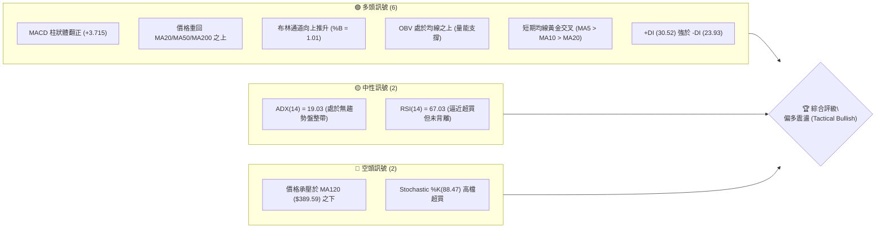
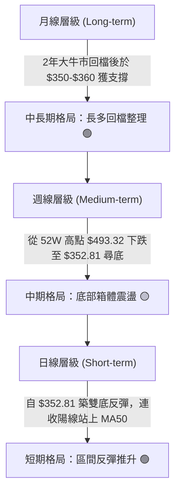
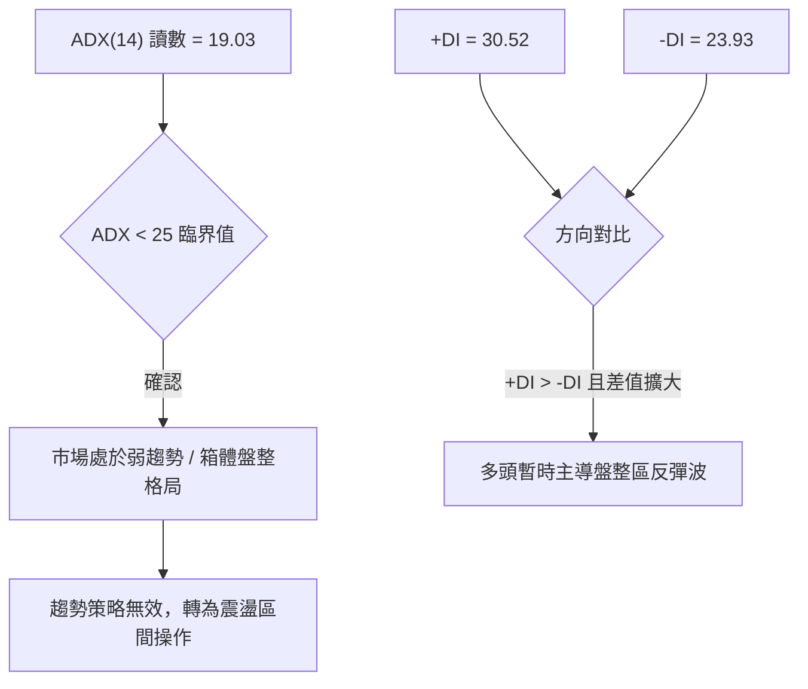
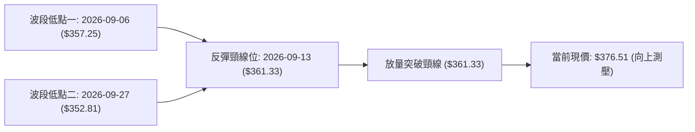
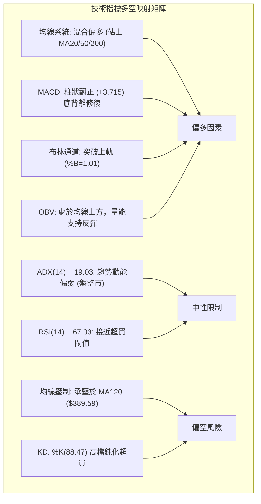
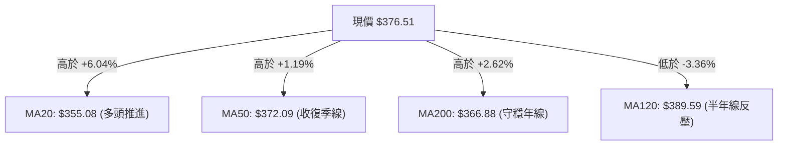
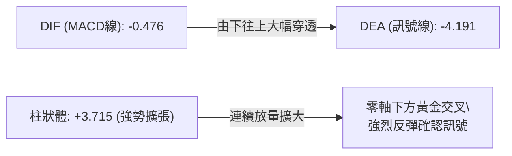
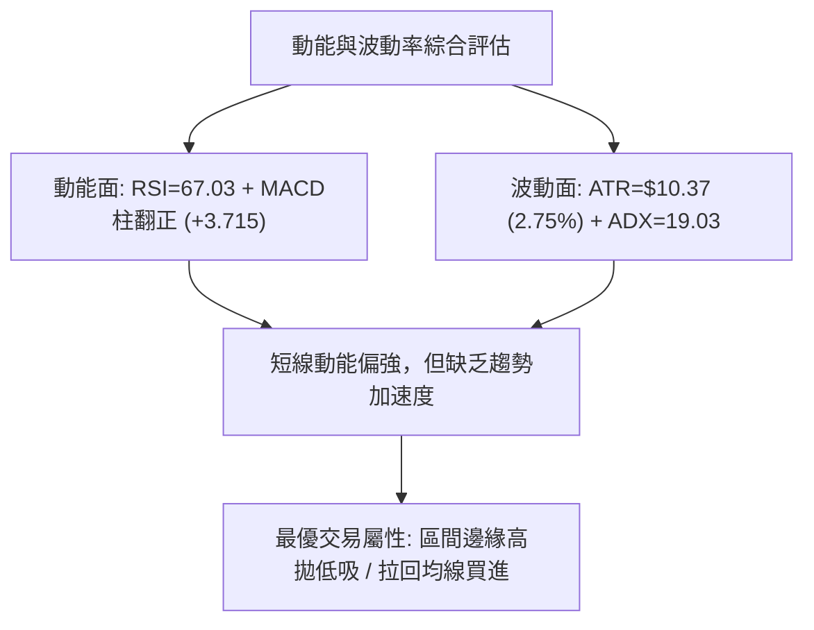
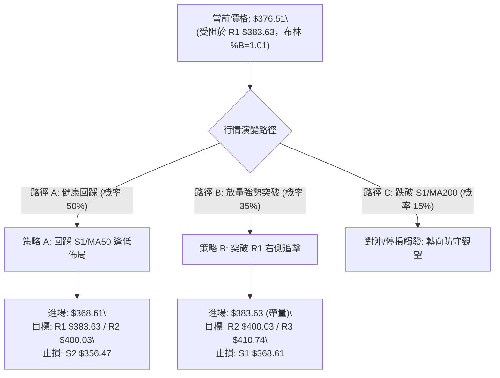
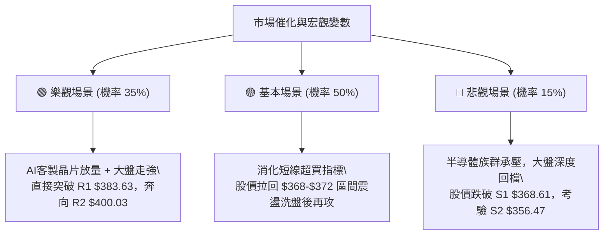

# AVGO 技術分析報告

> **報告日期**：2026-10-08 ｜ **語言**：繁體中文 ｜ **數據來源**：Yahoo Finance ｜ **當前價格**：$376.51

---

## 目錄

| 章節 | 內容 |
|------|------|
| [1. 技術面概覽](#1-技術面概覽) | 訊號儀表板、核心指標、評分卡 |
| [2. 趨勢分析](#2-趨勢分析) | 多時框趨勢、長中短期走勢、ADX 解讀 |
| [3. 圖表形態分析](#3-圖表形態分析) | 形態識別、K線組合、目標價推算 |
| [4. 支撐與阻力](#4-支撐與阻力) | 關鍵價位聚類、斐波那契回調結構 |
| [5. 技術指標深度解讀](#5-技術指標深度解讀) | 均線系統、RSI、MACD、布林通道、成交量 |
| [6. 動能與波動率](#6-動能與波動率) | 動能四象限、ATR 波動度、Beta 相關性 |
| [7. 多時框架總結](#7-多時框架總結) | 時框架評分矩陣、多時框收斂結論 |
| [8. 交易策略建議](#8-交易策略建議) | 主策略路由、情境階梯、風報比精算 |
| [9. 風險提示與監控](#9-風險提示與監控) | 監控指標 Checklist、情境路徑與風控 |
| [📋 報告總結](#-報告總結) | 儀表總結與交易建議總覽 |

---

## 1. 技術面概覽

### 🎯 技術訊號儀表板



---

### 📊 核心指標速覽表

| 指標類別 | 指標名稱 | 當前數值 | 訊號 | 專業解讀 |
|----------|----------|----------|------|----------|
| **價格** | 當前收盤價 | $376.51 | 🟢 | 收盤價成功站上日線布林上軌與短中期主要均線 |
| **均線** | MA20 (短中基基準) | $355.08 | 🟢 | 現價高於 MA20 達 +6.04%，短線多頭掌控主動權 |
| **均線** | MA50 (季度成本) | $372.09 | 🟢 | 現價高於 MA50 達 +1.19%，短線收復季度生命線 |
| **均線** | MA200 (長期牛熊) | $366.88 | 🟢 | 現價處於年線上方 (+2.62%)，長期多頭格局未毀 |
| **均線** | MA120 (半年壓力) | $389.59 | 🔴 | 價格低於半年線 (-3.36%)，上方中期籌碼密集套牢 |
| **動能** | RSI(14) | 67.03 | 🟡 | 位於強勢擴張區間（50–70），接近超買但未鈍化 |
| **動能** | MACD (12/26/9) | -0.476 / -4.191 | 🟢 | DIF 線自低檔金叉 Signal 線，柱狀體 (+3.715) 強勁放量 |
| **動能** | KD指標 (%K / %D) | 88.47 / 87.40 | 🔴 | 指標進入超買區（>80），短線具備回踩蓄勢需求 |
| **趨勢** | ADX(14) / 方向線 | 19.03 (+DI: 30.52) | 🟡 | ADX < 25 顯示大級別處於大區間震盪，多頭佔據優勢 |
| **通道** | Bollinger Bands | $334.12 - $376.04 | 🟢 | %B = 1.01，價格緊貼上軌擴張，動能突破中軌 |
| **波動** | ATR(14) | $10.37 (2.75%) | 🟡 | 波動率適中，單日震盪區間明確，適合作為止損依據 |
| **籌碼** | OBV 趨勢 | OBV > MA | 🟢 | 能量潮維持在平均線之上，反彈獲中長期資金承接 |

---

### 🏆 技術評分卡

```
╔══════════════════════════════════════════════════════════════════╗
║                   技術評分卡 — AVGO (2026-10-08)                 ║
╠══════════════════════════════════════════════════════════════════╣
║ 趨勢強度 (Trend)     ████████████░░░░░░░░  60/100  🟡 中性偏多   ║
║ 動能指標 (Momentum)  ██████████████░░░░░░  70/100  🟢 偏強擴張   ║
║ 支撐穩定度 (Support) ███████████████░░░░░  75/100  🟢 底層扎實   ║
║ 成交量配合 (Volume)  ████████████░░░░░░░░  60/100  🟡 溫和配合   ║
║ 形態完整度 (Pattern) ██████████████░░░░░░  68/100  🟢 雙重築底   ║
║ 均線排列 (Moving Avg)████████████░░░░░░░░  62/100  🟡 混合初多   ║
╠══════════════════════════════════════════════════════════════════╣
║ 綜合評分             █████████████░░░░░░░  66/100  🟢 偏多震盪   ║
╚══════════════════════════════════════════════════════════════════╝
```

---

## 2. 趨勢分析

### 🌐 多時框趨勢分析



---

### 📈 長期趨勢 — 12個月走勢圖（Unicode）

```
AVGO 月線收盤走勢圖（2025-10 至 2026-10）
價格軸 ($)
$460 ┤                                  ● $445.25 (5月峰值)
$440 ┤
$420 ┤                            ● $416.01
$400 ┤              ● $399.99
$380 ┤        ●                             ● $388.57  ●←現價 $376.51
$360 ┤  ● $366.90         ● $344.20     ● $377.06  ● $369.67
$340 ┤                   ● $329.48                  ● $351.19
$320 ┤                         ● $317.80
$300 ┤                               ● $308.46 (波段次低)
     └───────────────────────────────────────────────────────────────
       10   11   12   01   02   03   04   05   06   07   08   09   10 (月份)
     [2025]     [  ─────── 2026 年度走勢 ───────  ]
```

#### 走勢特徵分析表格

| 階段區間 | 起止價格 | 漲跌幅 | 走勢特徵與結構意涵 |
|----------|----------|--------|--------------------|
| **2025-10 ~ 2025-11** | $366.90 → $399.99 | +9.02% | 年底拉升突破，AI 題材帶動首波攻擊浪 |
| **2025-11 ~ 2026-03** | $399.99 → $308.46 | -22.88% | 連續五個月回調蓄勢，回測長週期均線與籌碼沉澱 |
| **2026-03 ~ 2026-05** | $308.46 → $445.25 | +44.35% | 主升浪爆發，創下本輪歷史次高月收盤，直逼 52W 高點 $493.32 |
| **2026-05 ~ 2026-09** | $445.25 → $351.19 | -21.13% | 獲利了結與高位估值修正，跌破 MA120，尋求年線支撐 |
| **2026-09 ~ 2026-10** | $351.19 → $376.51 | +7.21% | 在 $350 關卡獲得買盤支撐，展開右側技術性修復 |

---

### 📊 中期趨勢（週線分析）

從近 20 週的收盤軌跡分析，AVGO 經歷了顯著的三段式運行：
1. **高位出貨期**（2026-05-31 至 2026-06-28）：價格從 $445.25 快速跌落至 $364.36，週成交量暴增至 2.51 億股，顯示機構高位調倉。
2. **區間拉鋸期**（2026-07 至 2026-08）：多次上測 $400-$426 壓力區（2026-08-09 週收於 $426.98，RSI 衝至 73.6），隨後二次探底。
3. **底部夯實期**（2026-09 至 2026-10）：在 $352.81 - $357.25 區間連續四週打底，週線 MACD 柱狀體由 -1.391 轉正至最新 +3.715，成交量萎縮後反彈，形成明確的中期橫盤底部結構。

---

### ⚡ 趨勢強度評估（ADX 解讀）



#### ADX 讀數對照與操作導引

| 指標 | 數值 | 狀態 | 交易指導方針 |
|------|------|------|--------------|
| **ADX(14)** | 19.03 | 弱趨勢 / 盤整 | 嚴禁在阻力位盲目追高；策略以區間邊界高拋低吸為主 |
| **+DI** | 30.52 | 多頭擴張 | 多方力量持續增強，具備推升價格回測區間上沿的能力 |
| **-DI** | 23.93 | 空頭收斂 | 空方賣壓衰退，短線下行空間受限於關鍵支撐位 |

---

## 3. 圖表形態分析

### 🔍 形態識別系統

在日線與週線結構中，AVGO 於 2026 年 9 月下旬至 10 月初形成了清晰的**雙重底（W底）反彈形態**，同時在中期維度上受制於日線布林通道與下飄旗形收斂結構。



#### 形態識別信心度與目標推算

| 形態類別 | 信心度 | 判斷依據（引用數據） | 完成度 | 目標價（附嚴謹計算式） |
|----------|--------|----------------------|--------|------------------------|
| **雙重底 (W底)** | 75% | 兩次波段低點出現在 S3 附近（$357.25 與 $352.81），獲得支撐且 MACD 柱狀體翻正 | 100% (已突破) | 頸線 $361.33 + 形態高度 ($361.33 - $352.81 = $8.52) = **$369.85**（已達成） |
| **中期箱體震盪** | 80% | 頂部受阻於 R2 ($400.03)，底部止跌於 S2 ($356.47)，ADX=19.03 證實震盪 | 65% | 震盪中樞箱頂目標直指 **R2 ($400.03)** |
| **頭肩底形態** | 40% | 數據中左肩與右肩結構對稱性不足 | 20% | *訊號不足，僅做指標型解讀，不預設目標價* |

---

### 🕯️ 重要K線形態分析

| 週/月份週期 | 收盤價 | 典型 K 線組合 | 專業技術解讀 | 多空訊號 |
|-------------|--------|---------------|--------------|----------|
| **2026-09-06 週** | $357.25 | 長下影錘頭線 | 週成交量爆出 1.73 億股，低檔買盤大舉介入，測試底部成功 | 🟢 |
| **2026-09-27 週** | $352.81 | 縮量十字星 | 成交量降至 1.07 億股，賣壓出盡，形成典型次低點洗盤星線 | 🟢 |
| **2026-10-04 週** | $355.14 | 孕線轉陽 (Harami) | 實體收復前週跌幅，孕線確認底部反轉信號，多頭開始發力 | 🟢 |
| **2026-10-11 週** | $376.51 | 大陽線實體突破 | 放量突破 MA20 ($355.08) 與 MA50 ($372.09)，突破上軌 | 🟢 |

---

### 📉 ASCII 走勢形態示意圖

```
AVGO 近期雙重底突破結構示意圖
價格 ($)
$385 ┤                                                  [阻力 R1 $383.63]
$380 ┤                                           ▲ 現價 $376.51
$375 ┤                                     ╭─────╯ (強勁陽線實體)
$370 ┤                              ╭──────╯ [支撐 S1 $368.61]
$365 ┤               ╭── 頸線 $361.33 ──────╮
$360 ┤      ●        │                     │
$355 ┤     低點1     │                     ● 低點2
$350 ┤    $357.25 ──╯                    $352.81
     └─────────────────────────────────────────────────────────────
       09-06 週        09-13 週   09-20 週   09-27 週   10-04 週   10-11 週
```

---

### 🎯 形態目標價計算

根據雙重底突破後延伸之波段測幅與震盪區間結構推算：
1. **第一波段滿足點（已達成）**：
   $$\text{頸線} (\$361.33) + \text{底深} (\$8.52) = \$369.85$$
   現價 $376.51 已越過該目標，且回踩未破，確認轉為短線支撐。
2. **箱體波段測幅目標（當前進行中）**：
   以震盪底部密集區 $356.47（S2）至阻力位 R1（$383.63）計算：
   若成功突破 R1 ($383.63)，下一延伸階梯將直接測試 **R2 ($400.03)**（近一年強阻力聚類高點）。

---

## 4. 支撐與阻力

### 🗺️ 關鍵價位分布圖（Unicode）

```
AVGO 價位結構分布圖
═══════════════════════════════════════════════════════════════
$410.74 ║████████████████████████████████║ 強阻力 R3 (波段頂部聚類)
$400.03 ║██████████████████████          ║ 心理整數大關 / 阻力 R2
$391.15 ║░░░░░░░░░░░░░░░░░░░░░░░░░░░░░░░░║ 斐波那契 50.0% 回調位
$389.59 ║▒▒▒▒▒▒▒▒▒▒▒▒▒▒▒▒▒▒▒▒▒▒▒▒▒▒▒▒▒▒▒▒║ 半年線 MA120 下壓阻力
$383.63 ║████████████████████████████████║ 近期關鍵阻力 R1 (+1.89%)
$376.51 ╠════════════════════════════════╣ ◄ 現價 ($376.51, 布林上軌突破點)
$372.09 ║────────── 均線防線 ────────────║ 季度線 MA50 支撐
$368.61 ║▓▓▓▓▓▓▓▓▓▓▓▓▓▓▓▓▓▓▓▓▓▓▓▓        ║ 近期波段關鍵支撐 S1 (-2.10%)
$367.03 ║░░░░░░░░░░░░░░░░░░░░░░░░░░░░░░░░║ 斐波那契 61.8% 黃金分割支撐
$366.88 ║────────── 長期牛熊 ────────────║ 年線 MA200 關鍵防線
$356.47 ║████████████████████████████████║ 雙底強支撐 S2 (-5.32%)
$349.42 ║████████████████████████████████║ 波段極限防線 S3 (-7.19%)
═══════════════════════════════════════════════════════════════
```

---

### 🚧 阻力位分析表

| 阻力級別 | 精確價位 | 形成原因 | 突破難度 | 技術重要性 |
|----------|----------|----------|----------|------------|
| **R1** | **$383.63** | 近一年波段高點密集聚類，臨近 2026-06 初跳空下跌缺口邊緣 | 中等 | 短線多空強弱分水嶺；若突破將加速補漲 |
| **R2** | **$400.03** | 心理整數大關，2025-11 高點聚類與中期箱體上邊界 | 極高 | 中期轉向強多頭趨勢的核心防線 |
| **R3** | **$410.74** | 2026-04 至 2026-06 密集套牢頭部平台阻力位 | 極高 | 52週高點下方之終極空頭堡壘 |

---

### 🛡️ 支撐位分析表

| 支撐級別 | 精確價位 | 形成原因 | 守住機率 | 技術重要性 |
|----------|----------|----------|----------|------------|
| **S1** | **$368.61** | 近期波段回踩低點聚類，與斐波那契 61.8% ($367.03) 重疊 | 75% | 短線拉回的防守中樞；跌破代表反彈結束 |
| **S2** | **$356.47** | 9月雙重底之頸線轉換支撐，與 MA20 ($355.08) 形成共振 | 85% | 中期生命線，多方絕對不可失守的核心區 |
| **S3** | **$349.42** | 2026-09 波段絕對低點聚類區，跌破將下探 52W 低點 | 95% | 中期多頭防線最後底線 |

---

### 📐 斐波那契回調位分析

依據 52 週完整波動區間（高點 **$493.32** 至低點 **$288.98**），計算所得關鍵回調位結構如下：

| 分割比率 | 價位水準 | 與現價關係 | 技術架構定位與解讀 |
|----------|----------|------------|--------------------|
| **0.0%** | $493.32 | +31.02% | 52 週歷史高點，長期終極阻力 |
| **23.6%** | $445.09 | +18.21% | 2026-05 月線頂部收盤壓力區 |
| **38.2%** | $415.26 | +10.29% | 次級反彈高點強阻力（與 R3 $410.74 呼應） |
| **50.0%** | $391.15 | +3.89% | 多空平衡分水嶺，與半年線 MA120 ($389.59) 形成共振強壓 |
| **現價** | **$376.51** | — | **位於 61.8% 與 50.0% 回調位之間運行** |
| **61.8%** | $367.03 | -2.52% | 黃金分割強支撐；與年線 MA200 ($366.88) 完美重疊 |
| **78.6%** | $332.71 | -11.63% | 深度回檔支撐區，跌破則宣告長期趨勢走熊 |
| **100.0%**| $288.98 | -23.25% | 52 週極限低點 |

> **解讀**：現價目前成功脫離 **61.8% ($367.03)** 黃金分割支撐，該處亦是年線 MA200 所在，顯示長期多頭在該位置具備堅決護盤意願。當前正朝向 **50.0% ($391.15)** 邁進，但在觸及 50% 之前，必須先克服 **R1 ($383.63)** 與半年線 **MA120 ($389.59)** 的雙重壓制。

---

## 5. 技術指標深度解讀

### 🎛️ 指標訊號總覽



---

### 📈 移動平均線排列分析



#### 均線數據與排列特徵

| 均線名稱 | 精確數值 | 偏離率 (%) | 短期走勢微形狀 (Sparkline) | 趨勢解讀 |
|----------|----------|------------|----------------------------|----------|
| **MA 5** | $362.72 | +3.80% | ▆▆▆▇███▇▇▆▆▆▅▃▂▁▁▂▃▅▅▅▄▃▃▂▂▃▅▆ | 快速陡峭上升，短期推升動能充沛 |
| **MA 10** | $357.26 | +5.39% | █▇▆▅▅▅▅▅▅▅▅▅▄▃▂▁▁▂▁▁▁▁▁▁▂▂▂▂▂▃ | 觸底拐頭向上，提供短線回調防護 |
| **MA 20** | $355.08 | +6.04% | ████▇▇▆▅▅▄▄▃▃▂▂▂▂▁▂▂▁▁▁▁▁▁▁▁▁▁ | 走平後開始微幅向上，形成初級多頭排列 |
| **MA 50** | $372.09 | +1.19% | — | 季線轉化為支撐，確認短線反彈有效性 |
| **MA 60** | $373.95 | +0.68% | ██▇▆▆▆▆▅▅▅▅▅▄▄▃▃▃▃▃▃▂▂▂▂▂▁▁▁▁▁ | 走平，現價剛好穿透，空頭反壓減弱 |
| **MA120** | $389.59 | -3.36% | ▁▁▁▁▂▂▂▃▃▄▄▄▅▅▅▅▆▇▇██████████▇ | 下行斜率仍存，為中期上方最大骨牌壓力 |
| **MA200** | $366.88 | +2.62% | — | 處於現價下方，長期多頭基石未被破壞 |
| **MA240** | $366.22 | +2.81% | ▁▁▁▁▁▂▂▂▃▃▄▄▄▅▅▅▅▆▆▆▆▇▇▇▇▇▇▇██ | 長週期平緩走高，牛市大底架構穩固 |

> **綜合排列結論**：目前均線系統呈現**「短期多頭排列，中長期混合收斂」**狀態。MA5 > MA10 > MA20 已完成低檔黃金交叉；但上方受壓於下降中的 MA120，故目前屬於「反彈擴張」而非「全均線發散的主升浪」。

---

### 📉 RSI(14) 分析

* 當前讀數：**67.03**（中性偏多，接近 70 超買界線）
* 進度條展示：
  `[超賣 0] ░░░░░░░░░░░░ [50] ████████████████░░░ [超買 100]` （67.03%）
* **超買超賣區間判斷**：RSI 自 8 月底的極度超賣值 **23.5** 連續反彈至當前的 **67.03**，擺脫了弱勢弱化區，但尚未進入 75 以上的嚴重極端超買區，顯示多頭動能充足但追價風險逐漸提升。
* **背離研判**：
  * **底背離檢驗**：2026-08-30 收盤價 $368.12（RSI 23.5），至 2026-09-27 收盤價跌至 $352.81 時，RSI 卻逆勢上升至 **47.4**。此處形成了極為標準的**「週線級別雙重底背離」**，成功預示了本次 $352.81 展開的強烈反彈。
  * **頂背離檢驗**：現價 $376.51 伴隨 RSI 67.03，較 9 月份高點呈現指標與價格同步上行，**當前無頂背離跡象**。

---

### 📊 MACD(12/26/9) 訊號解讀



* **數值狀態**：DIF (-0.476) 向上穿越 DEA (-4.191)，柱狀圖讀數為 **+3.715**。
* **解讀**：MACD 在零軸下方完成「黃金交叉」後，紅柱連續 3 週加速放大（從 +0.960 擴張至 +3.715）。零軸下的黃金交叉屬於典型的「空頭回補與右側修復動能」，若後續 DIF 線能一舉衝破零軸，將轉化為真正的中級多頭趨勢。

---

### 📦 布林通道分析

```
AVGO 布林通道位置示意圖 (Bollinger Bands, 20日, 2σ)
══════════════════════════════════════════════════════════════════
$376.04 ── 上軌 (Upper Band) ────────── ◄ 現價 $376.51 (%B = 1.01)
                                         [強勢沿上軌推升 / 輕微超買]
$365.00 ── 緩衝帶 ─────────────────────

$355.08 ── 中軌 (Middle Band / MA20) ── [關鍵動態多空分水嶺]

$345.00 ── 緩衝帶 ─────────────────────

$334.12 ── 下軌 (Lower Band) ────────── [極限波動支撐位]
══════════════════════════════════════════════════════════════════
```

* **數值解讀**：上軌 $376.04，中軌 $355.08，下軌 $334.12，**%B 數值 = 1.01**。
* **通道狀態**：%B 突破 1.00，表明價格已刺穿布林上軌。在 ADX < 25 的盤整結構中，觸碰或突破布林上軌通常意味著「短線回調機率激增」，除非伴隨成交量倍增推動通道急劇向外開口，否則現價位面臨較大壓制回踩中軌 $355.08 的可能。

---

### 💹 成交量分析（量價配合度）

* **最新成交量**：17,993,800 股
* **20日均量**：24,091,260 股（**量比：0.75x**）
* **50日均量**：23,302,402 股
* **量價特徵評估**：
  * **縮量上漲現象**：當前價格逼近 R1 ($383.63)，但成交量僅為 20 日均量的 75%，呈現一定的「量價背離（價漲量縮）」。這意味著本次推升主要是由於賣方惜售與空頭回補所致，缺乏主動性機構大單連續追價。
  * **OBV（能量潮）走勢**：數據顯示 OBV > MA，長期資金並未在 9 月的震盪中大規模流出，量能線維持多頭架構，為後續回踩提供籌碼底蘊。

---

## 6. 動能與波動率

### ⚡ 動能評估四象限

| 象限 | 動能強度 (RSI/MACD) | 波動率水準 (ATR/帶寬) | AVGO 當前定位 | 策略指導意義 |
|------|---------------------|-----------------------|---------------|--------------|
| **Q1 (高動能·低波動)** | 強 (RSI>60, MACD擴張) | 低/中 (ATR 2.75%) | **★ AVGO 處於此邊界** | **動能推升期**：持股續抱，設定移動止盈 |
| **Q2 (低動能·低波動)** | 弱 (RSI 40-50) | 低 (窄幅波動) | 9月盤整期（已脫離） | 底部構築，耐心觀察蓄勢 |
| **Q3 (高動能·高波動)** | 極強/極弱 | 高 (極端行情) | 5月主升浪（歷史狀態） | 順勢突破追擊，承擔高回撤 |
| **Q4 (低動能·高波動)** | 弱 | 高 (散戶恐慌) | 6月恐慌拋售（歷史狀態） | 嚴禁盲目進場接飛刀 |



---

### 📊 ATR 波動率分析

* **ATR(14) 絕對值**：**$10.37**
* **相對波動率**：佔當前股價之 **2.75%**
* **專業風控應用**：
  * **日內正常雜訊區間**：$\pm 1.0 \times \text{ATR} = \pm \$10.37$
  * **動態追蹤止損距離 (Trailing Stop)**：建議設定為 $1.5 \times \text{ATR} = \$15.56$
  * **波段防守安全閥**：設定為 $2.0 \times \text{ATR} = \$20.74$
  * 若自現價 $376.51 扣除 $1.5 \times \text{ATR}$（約 $360.95），剛好落在 S1 ($368.61) 與 S2 ($356.47) 之間，顯示該區域為極具性價比的防守節點。

---

### 📐 Beta 與市場相關性

* **Beta 係數**：**1.476**
* **解讀**：AVGO 具備顯著的高 Beta 特性，相較於標普 500 指數，其彈性高出 47.6%。在市場多頭環境下，其進攻彈性極強；但在大盤面臨宏觀回調時，其下行波動亦較為劇烈。結合目前 1.1% 的偏低空頭部位（Short % Float）與 79.8% 的高機構持股，籌碼結構總體穩定，暴跌風險可控。

---

## 7. 多時框架總結

### 📋 時框架評分表

| 時框架 | 趨勢方向 | 動能狀態 | 均線排列狀況 | 圖表形態 | 評分 (1-100) | 操作方針 |
|--------|----------|----------|--------------|----------|--------------|----------|
| **月線 (長期)** | 🟢 多頭回檔 | 🟡 中性平穩 | 站穩 MA200/MA240 之上 | 長期上升通道回測 | **72** | 中長線部位逢低堅定持有 |
| **週線 (中期)** | 🟡 箱體震盪 | 🟢 轉強放量 | 承壓於 MA120，收復 MA50 | 雙重底背離完成，築底向上 | **65** | 區間震盪佈局，回踩支撐加碼 |
| **日線 (短期)** | 🟢 短線衝高 | 🔴 逼近超買 | MA5/10/20 黃金交叉發散 | 刺穿布林上軌，測試 R1 壓力 | **61** | 不宜在現價追高，等待拉回低吸 |

---

### 🔲 綜合訊號矩陣

| 維度 | 短期（日線） | 中期（週線） | 長期（月線） | 訊號一致性評估 |
|------|--------------|--------------|--------------|----------------|
| **方向一致性** | 向上反彈 | 底部震盪 | 上升趨勢回撤 | 🟡 **中度收斂**：長多短多，中期受阻於大箱體中樞 |
| **動能一致性** | RSI 逼近超買 | MACD 柱狀體放大 | 能量潮 OBV 走平 | 🟡 **分歧**：短線有技術修正需求，中期動能剛啟動 |
| **量價一致性** | 價漲量縮 (0.75x) | 週線量能收斂後溫和放大 | 機構持股比 79.8% 高位 | 🟢 **健康**：清洗浮額完畢後的穩定推升格局 |

---

### ⚖️ 多時框收斂結論

> **依據多時框收斂規則（規則 14）**：
> 當前 **ADX(14) 讀數為 19.03 (< 25)**，明確指示當前市場屬於**「盤整/箱體行情」**而非「單邊強趨勢」。
> 因此，**交易決策以日線布林通道 ($334.12 - $376.04) 與波段高低點聚類 ($356.47 - $383.63) 為主要邊界指導**。
>
> 雖然中長期方向（月線及年線 MA200 $366.88 之上）維持偏多，但日線現價 **$376.51** 已觸及布林上軌（%B = 1.01）並逼近強阻力 **R1 ($383.63)**，短線 KD 亦達 88.47 超買。
> 
> **唯一收斂結論**：**【偏多震盪，拉回承接】（Tactical Bullish on Pullbacks）**。
> 嚴禁在 $376.51-$383.63 壓力帶追高，應等待股價回踩確認 S1 ($368.61) 或 MA50 ($372.09) 支撐後，順應中期反彈趨勢進場。

---

## 8. 交易策略建議

### 🗺️ 策略決策流程圖



---

### 🧭 策略路由

* **當前技術評分**：**66 / 100**（高於 60 臨界點）
* **當前主策略方向**：**主推多頭策略（以回踩低吸為主，突破加碼為輔）**。
  空頭策略僅作為極端行情之反轉風險觸發點（對沖監控），不作主策略推薦。

---

### 🎯 價格情境階梯（Price Scenarios）

所有價位均嚴格取自數據庫計算之阻力位（R1/R2/R3）與支撐位（S1/S2/S3）：

| 觸發條件 | 第一目標 | 第二目標 | 後續延伸 | 情境架構含義 |
|----------|----------|----------|----------|--------------|
| **強勢突破 R1 ($383.63)** | **R2 ($400.03)** | **R3 ($410.74)** | 挑戰 52W 高點區間 | 中期箱體向上破位，開啟新一輪主升浪 |
| **現價區間震盪 ($368.61 - $376.51)** | R1 ($383.63) | — | — | 消化超買指標，於 MA50 之上構建中繼平台 |
| **跌破支撐 S1 ($368.61)** | **S2 ($356.47)** | **S3 ($349.42)** | 考驗 52W 低點 $288.98 | 反彈宣告終結，重新探尋雙底甚至破底 |

---

### 📊 情境機率分佈

| 運行情境 | 發生機率 | 主要技術依據 |
|----------|----------|--------------|
| **回踩蓄勢後上攻** | **50%** | ADX < 25 抑制連續單邊暴漲，現價觸及布林上軌，需回踩 MA50/S1 消化 KD 超買 |
| **直接強勢向上突破** | **35%** | MACD 柱狀體大幅擴張 (+3.715)，+DI (30.52) 佔據主導，OBV 多頭蓄勢支持突破 |
| **反轉向下破位探底** | **15%** | 除非美股半導體大盤暴跌引發 Beta(1.476) 放大，否則年線 MA200 ($366.88) 具強大支撐 |

---

### 🟢 主策略詳情

#### 策略 A（穩健型：回踩關鍵支撐低吸做多）vs 策略 B（激進型：突破關鍵阻力右側跟進）

| 策略要素 | 策略 A（回踩支撐低吸 - 首選） | 策略 B（強勢突破追擊 - 次選） |
|----------|--------------------------------|--------------------------------|
| **進場條件** | 價格自現價回調，在 **S1 ($368.61)** 出現止跌K棒 | 日線收盤價帶量（>23M股）實質突破 **R1 ($383.63)** |
| **進場價格** | **$368.61** | **$383.63** |
| **第一目標 (T1)** | **$383.63** (獲利空間: +$15.02 / +4.07%) | **$400.03** (獲利空間: +$16.40 / +4.27%) |
| **第二目標 (T2)** | **$400.03** (獲利空間: +$31.42 / +8.52%) | **$410.74** (獲利空間: +$27.11 / +7.07%) |
| **止損價格** | **$356.47** (S2 強支撐下方 / 風險: -$12.14) | **$368.61** (S1 轉化支撐 / 風險: -$15.02) |
| **風險報酬比 (R:R)**| **1 : 2.59** (以 T2 計算) 🟢 極佳 | **1 : 1.80** (以 T2 計算) 🟢 良好 |
| **成功機率** | **65%** | **55%** |
| **建議配置倉位** | **總資金之 15% - 20%** | **總資金之 8% - 10%** |

---

### 🔴 反向風險觸發點（對沖提示）

若出現以下訊號，多頭必須無條件減倉或建立防守型對沖：
1. **失守年線與黃金分割**：日線收盤跌破 **S1 ($368.61)** 與斐波那契 61.8% (**$367.03**)。
2. **形態破位**：價格跌破 **S2 ($356.47)**，意味著雙底結構徹底破功，空頭重掌主動。
3. **動能翻空**：MACD 柱狀體由目前的 +3.715 跌回零軸以下，伴隨 -DI 向上反超 +DI。

---

### ⭐ 整體訊號強度評星

```
做多訊號強度：★★★★☆  (4/5 星 — 均線收復、MACD強勁翻多，唯受阻於區間上沿)
做空訊號強度：★☆☆☆☆  (1/5 星 — 空方賣壓衰竭，年線防守堅固)
整體可信度：  ★★★★☆  (4/5 星 — 歷史數據、量價及斐波那契點位高度吻合)
```

---

## 9. 風險提示與監控

### ✅ 關鍵監控指標 Checklist

```
╔══════════════════════════════════════════════════════════════════╗
║               AVGO 關鍵技術指標每日監控 Checklist                ║
╠══════════════════════════════════════════════════════════════════╣
║ [ ] 價格突破監控：收盤價是否有效站上 R1 ($383.63)？              ║
║ [ ] 均線防守監控：MA50 ($372.09) 與 MA200 ($366.88) 是否維持多頭？║
║ [ ] 關鍵支撐預警：價格是否跌破 S1 ($368.61) 觸發止盈/減倉？      ║
║ [ ] 震盪指標修正：Stochastic %K 是否自 88.47 超買回調至 50 附近？ ║
║ [ ] 動能趨勢轉變：ADX 是否突破 25（代表盤整市轉化為強趨勢市）？  ║
║ [ ] 量能驗證：上攻 R1/R2 時成交量是否超過 24,000,000 股基準？    ║
╚══════════════════════════════════════════════════════════════════╝
```

---

### ⚠️ 風險場景分析



---

### 🛡️ 風險管理重要提醒

1. **避免高位情緒化追高**：當前現價 $376.51 處於日線布林通道上軌邊緣（%B=1.01），短線 KD 高達 88.47。在無趨勢市（ADX=19.03）中追買上軌往往面臨 1-2 週的技術性回撤，耐性等待回踩 **S1 ($368.61)** 方為上策。
2. **嚴格執行 ATR 止損機制**：利用 AVGO 每日 $10.37 之 ATR 特性，若採用策略 A，應將硬性止損設定於 **$356.47 (S2)**，最大單筆虧損控制在投資組合總資產的 1% - 1.5% 範圍內。
3. **留意半年線籌碼壓力**：上方 **MA120 ($389.59)** 與斐波那契 50% (**$391.15**) 是多頭中期最大的「雷區」，若股價抵達該區域且量能不濟，務必了結 50% 以上之波段利潤。

---

## 📋 報告總結

```
╔══════════════════════════════════════════════════════════════════╗
║                    AVGO 技術分析報告總結                         ║
╠══════════════════════════════════════════════════════════════════╣
║ 報告日期：2026-10-08                                             ║
║ 當前價格：$376.51                                                ║
║ 技術評級：⚖️ 偏多震盪 (Tactical Bullish within Range)             ║
╠══════════════════════════════════════════════════════════════════╣
║ 關鍵結論：                                                       ║
║ ├─ 長期趨勢：🟢 守穩年線 MA200 ($366.88) 與黃金分割 61.8%       ║
║ ├─ 中期趨勢：🟡 於 $352.81 構築雙底，目前處於大箱體反彈中段     ║
║ ├─ 短期趨勢：🟢 突破布林上軌與均線密集區，短線動能偏強但逼近超買 ║
║ ├─ 關鍵支撐：S1 $368.61 ｜ S2 $356.47 ｜ S3 $349.42              ║
║ ├─ 關鍵阻力：R1 $383.63 ｜ R2 $400.03 ｜ R3 $410.74              ║
║ └─ 機構共識：Strong Buy（47位分析師，平均目標價 $531.31）        ║
╠══════════════════════════════════════════════════════════════════╣
║ 最優策略組合：                                                   ║
║ 1. 🥇 最佳機會（策略 A）：回踩 S1 ($368.61) 佈局做多，目標 R2    ║
║    進場 $368.61 ｜ 止損 $356.47 ｜ 目標 $400.03 ｜ 風報比 1:2.59║
║ 2. 🥈 次選機會（策略 B）：帶量突破 R1 ($383.63) 右側順勢跟進     ║
║    進場 $383.63 ｜ 止損 $368.61 ｜ 目標 $410.74 ｜ 風報比 1:1.80║
║ 3. 🥉 保守選擇：保持場外觀望，等待股價回踩季線 $372.09 企穩     ║
╚══════════════════════════════════════════════════════════════════╝
```

---

> ⚠️ **免責聲明**：本報告為 AI 自動生成之技術分析，所有數據及估算均基於提供的歷史價格資訊。本報告**僅供研究與學術參考**，**不構成任何投資建議**。投資有風險，入市需謹慎。

---

*報告生成時間：2026-10-08 ｜ 數據來源：Yahoo Finance ｜ 分析框架：多時框技術分析*