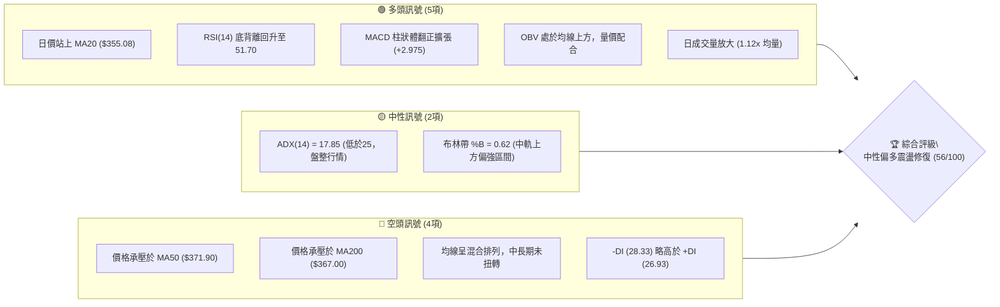
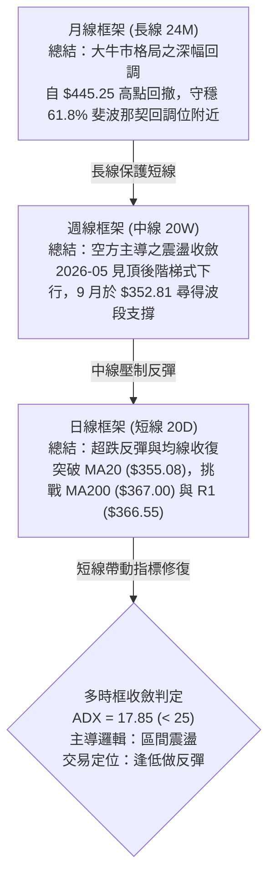
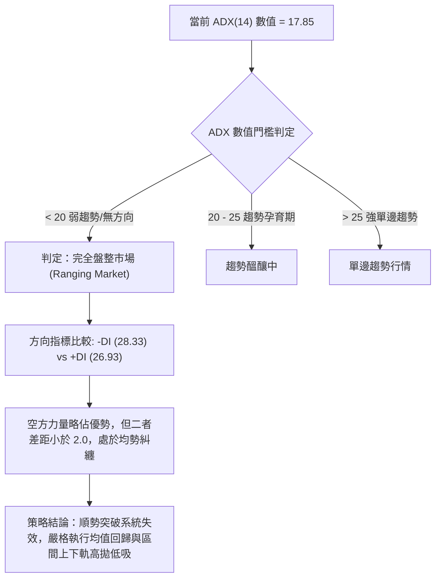
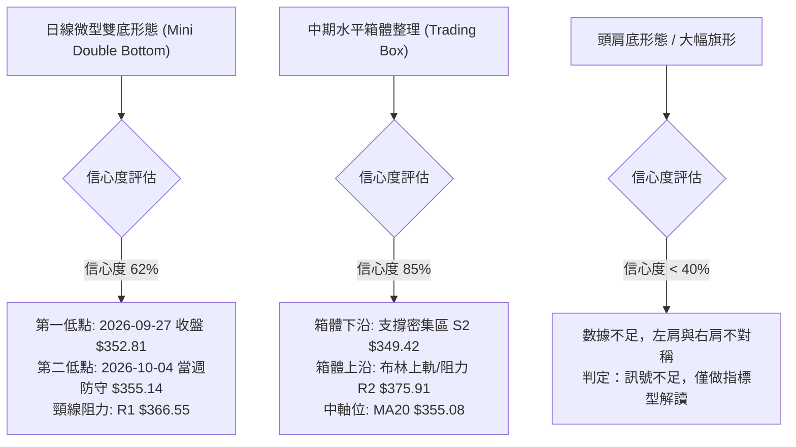
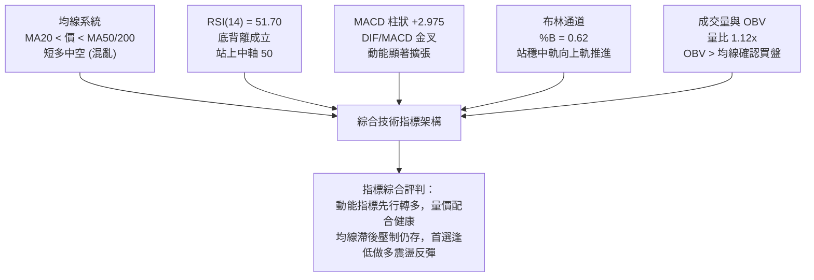
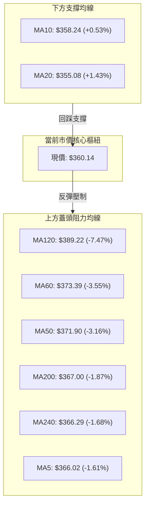
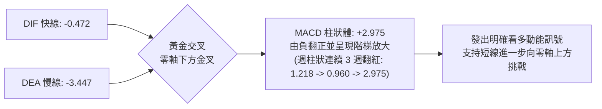
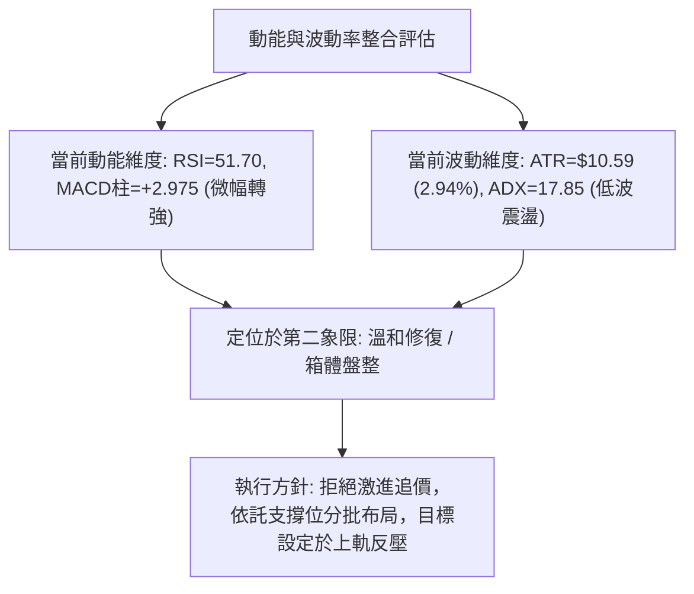
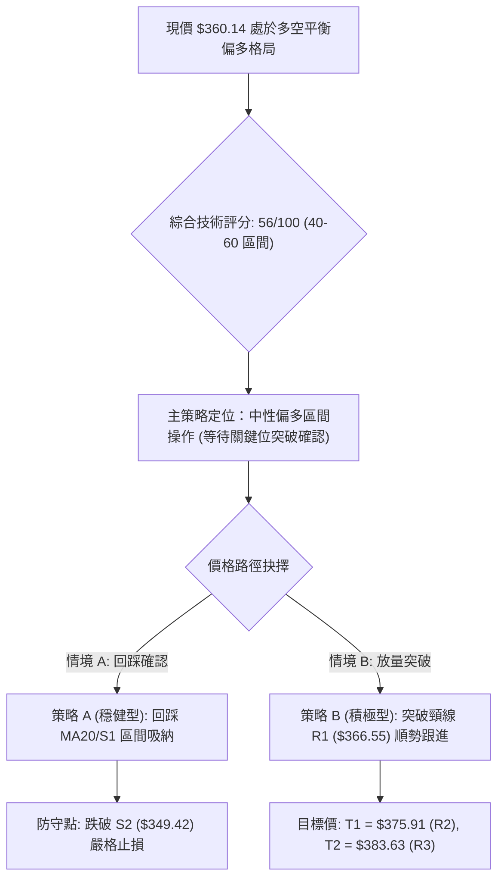
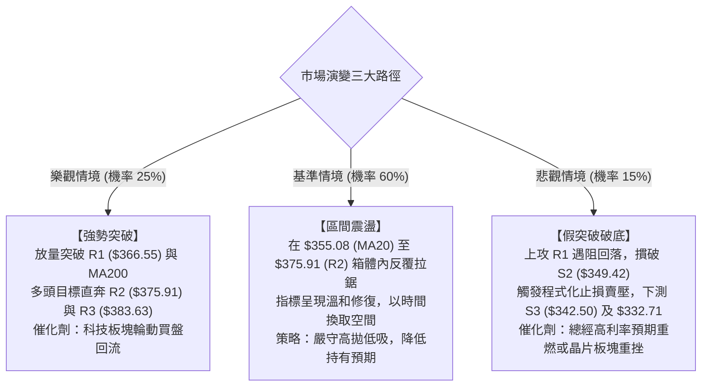

# AVGO 技術分析報告

> **報告日期**：2026-10-09 ｜ **語言**：繁體中文 ｜ **數據來源**：Yahoo Finance ｜ **當前價格**：$360.14

---

## 目錄

| 章節 | 內容 |
|------|------|
| [1. 技術面概覽](#1-技術面概覽) | 訊號儀表板、核心指標、評分卡 |
| [2. 趨勢分析](#2-趨勢分析) | 多時框趨勢、長中短期走勢 |
| [3. 圖表形態分析](#3-圖表形態分析) | 形態識別、K線組合、目標價 |
| [4. 支撐與阻力](#4-支撐與阻力) | 關鍵價位、斐波那契回調 |
| [5. 技術指標深度解讀](#5-技術指標深度解讀) | MA/RSI/MACD/布林/成交量 |
| [6. 動能與波動率](#6-動能與波動率) | 動能評估、ATR、Beta |
| [7. 多時框架總結](#7-多時框架總結) | 時框架評分矩陣 |
| [8. 交易策略建議](#8-交易策略建議) | 多空策略、風險報酬比 |
| [9. 風險提示與監控](#9-風險提示與監控) | 監控指標、風險場景 |

---

## 1. 技術面概覽

### 🎯 技術訊號儀表板

Broadcom Inc.（AVGO）當前報價為 **$360.14**。整體技術架構呈現「**中長期弱勢盤整修復、短期指標底部背離轉強**」的交錯特徵。日線級別站上 20 日均線（$355.08），MACD 柱狀體翻正且擴張至 +2.975，RSI 呈現明確底背離結構；然而，MA50（$371.90）與 MA200（$367.00）於上方形成蓋頭壓制，且趨勢指標 ADX 僅為 17.85（< 25），明確指示當前市場處於**無明確單邊趨勢的區間震盪整理結構**。



---

### 📊 核心指標速覽表

| 指標類別 | 指標名稱 | 當前數值 | 訊號 | 專業解讀 |
|:---|:---|:---:|:---:|:---|
| **價格結構** | 收盤價 | $360.14 | 🟡 中性 | 位於 52 週高低區間之 34.8%，處於築底修復階段 |
| **短期均線** | MA20 | $355.08 | 🟢 看多 | 股價位於 MA20 之上 (+1.43%)，短天期多方掌握發球權 |
| **中期均線** | MA50 | $371.90 | 🔴 看空 | 股價承壓於 MA50 之下 (-3.16%)，中期空方下行壓力仍在 |
| **長期均線** | MA200 | $367.00 | 🔴 看空 | 股價略低於牛熊分界線 (-1.87%)，構成上方第一道密集反壓 |
| **動能震盪** | RSI(14) | 51.70 | 🟢 看多 | 重返 50 多空分水嶺之上，並伴隨顯著日線級「底背離」 |
| **趨勢動能** | MACD(12,26,9) | -0.472 / -3.447 | 🟢 看多 | DIF 線上穿 MACD 信號線，柱狀體為 +2.975，多頭動能擴散 |
| **趨勢強度** | ADX(14) | 17.85 | 🟡 盤整 | 遠低於 25 臨界值，代表當前非單邊趨勢，屬於箱體震盪 |
| **通道位置** | Bollinger Bands | $334.12 - $376.04 | 🟢 看多 | %B 為 0.62，突破中軌（$355.08），朝上軌（$376.04）運行 |
| **量能狀態** | 成交量比 | 1.12x (27.04M) | 🟢 看多 | 最新成交量超越 20 日均量 (24.25M)，OBV 指標高於均線 |
| **波動風險** | ATR(14) | $10.59 | 🟡 中性 | 佔股價 2.94%，每日正常波動區間約 ±$10 至 $11 |

---

### 🏆 技術評分卡

依據 6 大技術維度量化打分（各項權重均等，滿分 100 分），AVGO 當前綜合得分為 **56 / 100**，技術面處於「**中性區間、偏向技術反彈**」格局。

```
╔══════════════════════════════════════════════════════════════════╗
║               技術評分卡 — AVGO (2026-10-09)                    ║
╠══════════════════════════════════════════════════════════════════╣
║ 趨勢強度 (ADX=17.85)     ████████░░░░░░░░░░░░  40/100 🟡 盤整弱勢 ║
║ 動能指標 (RSI/MACD)      ██████████████░░░░░░  70/100 🟢 底背離強 ║
║ 支撐穩定度 (S1/S2防守)   ██████████████░░░░░░  70/100 🟢 低檔有撐 ║
║ 成交量配合 (OBV/量比)    ████████████░░░░░░░░  60/100 🟢 量能回升 ║
║ 形態完整度 (箱體/雙底)   ██████████░░░░░░░░░░  50/100 🟡 未破頸線 ║
║ 均線排列 (混合受壓)      ████████░░░░░░░░░░░░  44/100 🔴 均線反壓 ║
╠══════════════════════════════════════════════════════════════════╣
║ 綜合技術評分             ███████████░░░░░░░░░  56/100 🟡 中性偏多 ║
║ 判定結果：區間震盪築底修復，建議以布林通道與關鍵支撐阻力操作    ║
╚══════════════════════════════════════════════════════════════════╝
```

---

## 2. 趨勢分析

### 🌐 多時框趨勢分析

多時框架（MTFA）分析展現出時框間的顯著衝突與收斂需求：月線處於歷史牛市拉回的中長線高檔修正；週線呈現連續 5 個月的下降通道整理；日線則在連續測試 $350 附近支撐後出現微型反轉雛形。



---

### 📈 長期趨勢 — 12個月走勢圖（Unicode）

過去 12 個月（2025-10 至 2026-10），AVGO 歷經由 $366.90 起漲、於 2026 年 5 月創下歷史收盤高點 $445.25，隨後因獲利回吐與半導體週期拉回至 2026 年 9 月低點 $351.19，最新月線收在 $360.14。

```
AVGO 月線走勢圖（過去12個月：2025-10 至 2026-10）
價格軸 ($)
$450 ┤                                  ● $445.25 (2026-05 波段頂)
$430 ┤                              ●
$410 ┤                             / \
$390 ┤         ● $399.99          /   \     ● $388.57
$370 ┤   ●      \                /     ●     \
$350 ┤  /        ●              /             ● $351.19  ● $360.14 (現在)
$330 ┤ /          \     ●      /
$310 ┤             ●───/ \────● $308.46 (2026-03 底部)
     └─────────────────────────────────────────────────────────────
       10   11   12   01   02   03   04   05   06   07   08   09   10
      25年                               26年
```

#### 走勢特徵分析表格

| 階段 | 時間區間 | 起訖價位 | 漲跌幅 | 結構特徵與成因分析 |
|:---|:---:|:---:|:---:|:---|
| **第 I 階段：秋季推升** | 2025-10 ~ 2025-11 | $366.90 → $399.99 | +9.02% | 企業 AI 交換晶片需求激增，多頭強勢上攻逼近 $400 大關 |
| **第 II 階段：首度回調** | 2025-11 ~ 2026-03 | $399.99 → $308.46 | -22.88% | 資金輪動與評價修正，連續 4 個月階梯式下挫，於 $308.46 獲支撐 |
| **第 III 階段：爆發主升** | 2026-03 ~ 2026-05 | $308.46 → $445.25 | +44.35% | 財報強勁與超大規模雲端客戶訂單催化，月線噴出並刷歷史新高 |
| **第 IV 階段：深幅回撤** | 2026-05 ~ 2026-09 | $445.25 → $351.19 | -21.13% | 伴隨巨量回吐（6 月單週巨量 2.51 億股），回測斐波那契 61.8% |
| **第 V 階段：築底震盪** | 2026-09 ~ 2026-10 | $351.19 → $360.14 | +2.55% | 跌勢趨緩，日線站上 MA20，於 S1-S2 區間形成橫盤支撐陣列 |

---

### 📊 中期趨勢（週線分析）

從近 20 週收盤數據觀察，自 2026 年 8 月初反彈高點 $426.98 以後，週線呈現持續一季的下行修正。9 月份在 $352.81 - $357.25 區間連續 4 週收斂未再破底，週成交量由 6 月峰值的 2.51 億股顯著萎縮至 9,700 萬股至 1.09 億股左右，展現典型的「**量縮測底**」特徵。

```
週線級別價格壓力與支撐層級分佈：
$426.98 ────────────────────────────────────── [8月高點反壓]
        │
$388.57 ────────────────────────────────────── [中期反轉阻力線]
        │
$375.91 ══════════════════════════════════════ [R2 / BB上軌反壓帶]
$366.55 -------------------------------------- [R1 / MA200 關鍵反壓]
$360.14 ▲▲▲ 現價 ($360.14) 穿梭於中軌上方
$356.47 -------------------------------------- [S1 / 近期震盪下緣]
$349.42 ══════════════════════════════════════ [S2 / 強力多方防守線]
        │
$332.71 ────────────────────────────────────── [78.6% 斐波那契終極防線]
```

---

### ⚡ 趨勢強度評估（ADX 解讀）



#### ADX 趨勢強度對照表

| 指標變數 | 當前讀數 | 歷史/標準參考區間 | 趨勢狀態定義 | 對交易決策的指導意涵 |
|:---|:---:|:---:|:---:|:---|
| **ADX(14)** | **17.85** | 0.00 ~ 20.00 | **無趨勢 / 弱盤整** | 禁止追高殺跌；突破交易極易形成假突破；側重反轉指標 |
| **+DI (多方動向)** | **26.93** | 0.00 ~ 100.00 | 弱勢反彈動能 | 較上月低檔顯著回升，多方動能正在匯聚 |
| **-DI (空方動向)** | **28.33** | 0.00 ~ 100.00 | 空方動能衰退 | 由 9 月高位鈍化向下，空方主導權正在削弱 |
| **DI 差值 (+DI - -DI)**| **-1.40** | 絕對值 < 5 為均衡 | **多空均勢拉鋸** | 雙方未形成碾壓性主導，等待基本面或量能突破刺激 |

---

## 3. 圖表形態分析

### 🔍 形態識別系統

在多時框架構中，針對 AVGO 目前在日線與週線層面的走勢特徵進行幾何與結構化審視。根據數據紀律與規則 15，僅在具備高度幾何支持度時認定形態，否則僅作指標型箱體解讀。



#### 形態識別與信心度明細表

| 識別形態名稱 | 信心度 | 判斷依據（嚴格引用數據） | 當前完成度 | 形態目標價（附精確計算式） |
|:---|:---:|:---|:---:|:---|
| **中期水平震盪箱體** | **85%** | 價格受制於布林下軌 $334.12 與上軌 $376.04，且在 S2 ($349.42) 至 R2 ($375.91) 區間來回震盪 | **75%** | 箱頂突破目標 = R2 ($375.91)；若箱體被向下擊穿則看至 78.6% 斐波位 $332.71 |
| **日線微型雙底 (W底)**| **62%** | 9月27日週收盤 $352.81，隨後未再破底，10月11日週回升至 $360.14，RSI 呈現對應抬升底背離 | **50% (未破頸線)** | 頸線為 R1 ($366.55)，低點基準取 S1 ($356.47)<br/>形態高度 = $366.55 - $356.47 = $10.08<br/>**突破目標價** = $366.55 + $10.08 = **$376.63** (高度吻合 R2 $375.91) |
| **頭肩底 / 旗形** | **35%** | 僅有單側回撤，無標準右肩對稱成交量配合，數據不完備 | 未成形 | **訊號不足，僅做指標型解讀，不預設幾何目標** |

---

### 🕯️ 重要K線形態分析

| 週期/月份 | 收盤價 | K線形態 | 專業解讀 | 訊號 |
|:---:|:---:|:---|:---|:---:|
| **2026-05** | $445.25 | **高檔長上影長陽線** | 創下 52 週高點 $493.32 後巨量回吐，月線實體留長上影線，顯露多頭動能衰竭 | 🔴 頂部力竭 |
| **2026-06** | $377.06 | **大陰線貫穿回落** | 單月暴跌 $68.19，跌破 MA5 與 MA20，週成交量飆升至 2.51 億股，機構籌碼派發 | 🔴 空方宣洩 |
| **2026-07** | $388.57 | **跌勢中長下影小陽** | 下測 $359.79 後獲得承接，買盤逢低進場，多空在 $380 展開拉鋸戰 | 🟡 止跌回穩 |
| **2026-08** | $369.67 | **高開低走陰十字星** | 上衝 $426.98 失敗後快速墜落，上方解套賣壓沈重，中線多頭再遭挫敗 | 🔴 假突破拉回 |
| **2026-09** | $351.19 | **縮量下影錘頭線** | 測試波段新低，但收盤脫離最低點，成交量萎縮，空方動能減弱 | 🟢 築底醞釀 |
| **2026-10 (至今)**| $360.14 | **溫和放量紅K線** | 月內回彈 +$8.95，收復短期均線，日線 MACD 金叉柱狀擴大，多方收復失地 | 🟢 短線轉強 |

---

### 📉 ASCII 走勢形態示意圖

```
AVGO 日線/週線微型雙底與頸線壓制示意圖：
$376.04 ----------------------------------------------- [布林上軌 / 形態理論目標位]
$375.91 ----------------------------------------------- [阻力 R2]
                                   頸線阻力 R1: $366.55
$366.55 ---------------------------┌──────┐-----------
                                  /        \
$360.14 ─────────────────────────/── 現價 ──\──────────
                                /            \
$356.47 -----------------------/              \-------- [支撐 S1]
                 低點1        /                \  低點2 (較高)
$352.81 ─────────●───────────┘                  └──● ($355.14)
                 (2026-09-27)                      (2026-10-04)
```

---

### 🎯 形態目標價計算

根據雙底頸線測量規則（Measurement Objective Rule）：
1. **基底價位 (Base Level)**：取微型雙底第二底部的有效收盤防守點 $356.47（支撐位 S1）。
2. **頸線阻力位 (Neckline Resistance)**：由近一年波段高點聚類定義之關鍵阻力 **R1 = $366.55**。
3. **垂直形態高度 (Pattern Height, H)**：
   $$\text{H} = \text{頸線價位} - \text{基底價位} = \$366.55 - \$356.47 = \$10.08$$
4. **最小量度測幅目標價 (Minimum Target Price, T)**：
   $$\text{T} = \text{頸線價位} + \text{H} = \$366.55 + \$10.08 = \$376.63$$
   *(該推算值 \$376.63 與數據中計算之阻力位 **R2 = \$375.91** 及布林通道上軌 **\$376.04** 完全重合，三者形成強大的共振目標反壓區)*。

---

## 4. 支撐與阻力

### 🗺️ 關鍵價位分布圖（Unicode）

```
AVGO 關鍵價位結構分布圖（單位：美元）
═══════════════════════════════════════════════════════════════════════
$493.32 ║██████████████████████████████║ 52週歷史高點 (0.0% Fib)
$445.09 ║██████████████████████        ║ 23.6% 斐波那契回調位
$415.26 ║██████████████████            ║ 38.2% 斐波那契回調位
$391.15 ║████████████████              ║ 50.0% 斐波那契多空分水嶺
$383.63 ║██████████████████████████████║ 強阻力 R3 (波段高點聚類)
$375.91 ║██████████████████████        ║ 阻力 R2 (布林上軌共振區 $376.04)
$367.03 ║████████████████              ║ 61.8% 斐波那契回調位 / MA200 ($367.00)
$366.55 ║██████████████████████████████║ 關鍵阻力 R1 (頸線 / MA5 $366.02)
$360.14 ╠══════════════════════════════╣ ◄ 當前市價 ($360.14)
$356.47 ║▓▓▓▓▓▓▓▓▓▓▓▓▓▓▓▓▓▓▓▓▓▓        ║ 近期支撐 S1 (波段低點聚類)
$349.42 ║██████████████████████████████║ 強支撐 S2 (波段結構防守底線)
$342.50 ║██████████████████████████████║ 終極支撐 S3 (深幅防守聚類)
$332.71 ║████████████████              ║ 78.6% 斐波那契回調位 (深幅極限)
$288.98 ║██████████████████████████████║ 52週歷史低點 (100.0% Fib)
═══════════════════════════════════════════════════════════════════════
```

---

### 🚧 阻力位分析表

阻力位嚴格引用技術數據中由 OHLCV 歷史聚類計算之數值：

| 阻力級別 | 價位 | 與現價差距 | 形成原因與共振要素 | 突破難度 | 重要性評級 |
|:---:|:---:|:---:|:---|:---:|:---:|
| **R1** | **$366.55** | +1.78% | 近一年波段高點聚類、MA5 ($366.02) 重疊、微型雙底頸線位 | 🟡 中等 | ★★★★☆ |
| **R2** | **$375.91** | +4.38% | 近期波段密集成交高點、布林通道上軌 ($376.04) 共振 | 🔴 較高 | ★★★★★ |
| **R3** | **$383.63** | +6.52% | 7月反彈次高點套牢區、向 MA120 ($389.22) 推進的前哨防線 | 🔴 極高 | ★★★☆☆ |

---

### 🛡️ 支撐位分析表

支撐位嚴格引用技術數據中由 OHLCV 歷史聚類計算之數值：

| 支撐級別 | 價位 | 與現價差距 | 形成原因與共振要素 | 守住機率 | 重要性評級 |
|:---:|:---:|:---:|:---|:---:|:---:|
| **S1** | **$356.47** | -1.02% | 近一年波段低點聚類、貼近 MA20 ($355.08) 與日線布林中軌 | 🟢 75% | ★★★★☆ |
| **S2** | **$349.42** | -2.98% | 9月下旬多重測試低點聚類、多頭防守底線 ($350 整數防區) | 🟢 85% | ★★★★★ |
| **S3** | **$342.50** | -4.90% | 結構性深幅低點聚類、布林下軌 ($334.12) 上方緩衝區 | 🟢 90% | ★★★☆☆ |

---

### 📐 斐波那契回調位分析

依據 52 週極值區間（低點 **$288.98** 至 高點 **$493.32**，垂直跨度 **$204.34**）計算之精確斐波那契回調水準：

| 回調比率 | 價位 | 技術意涵與當前價格空間關係 |
|:---:|:---:|:---|
| **0.0% (52W High)** | **$493.32** | 歷史峰值，長期牛市極限擴展目標 |
| **23.6%** | **$445.09** | 2026 年 5 月月線收盤位 ($445.25)，強勢多頭回撤容忍線 |
| **38.2%** | **$415.26** | 4月突破口與7月反彈平台，中長期趨勢分水嶺 |
| **50.0%** | **$391.15** | 總波段等距中軸，MA120 ($389.22) 位於此處形成結構壓制 |
| **61.8% (黃金分割)** | **$367.03** | **關鍵樞紐！**現價 ($360.14) 位於其下方僅 -1.88%。MA200 ($367.00) 與 R1 ($366.55) 在此形成黃金共振，此處為多空由空翻多的生死決戰線 |
| **78.6%** | **$332.71** | 深度回撤容忍極限，布林通道下軌 ($334.12) 即落於此關鍵支撐 |
| **100.0% (52W Low)**| **$288.98** | 本輪週期的起漲基石，跌破則意味長期牛市徹底終結 |

> **回調位深度結論**：現價 $360.14 處於 **61.8% 回調位 ($367.03)** 與 **78.6% 回調位 ($332.71)** 之間。在技術分析理論中，61.8% 回調位往往是強勢回撤的極限支撐點。當前股價短暫跌穿後於下方獲得 S1/S2 托底並快速回抽，一旦日線收盤確認收復 $367.03，將正式宣告本輪深幅回調告一段落。

---

## 5. 技術指標深度解讀

### 🎛️ 指標訊號總覽



---

### 📈 移動平均線排列分析



#### 均線階梯分析表

| 均線名稱 | 數值 | 價格相對關係 | 乖離率 (Bias) | 排列特徵與走勢研判 |
|:---|:---:|:---:|:---:|:---|
| **MA5** | $366.02 | 價格在下方 | -1.61% | 極短線反彈遭遇首道拋壓，與 R1 ($366.55) 重疊 |
| **MA10** | $358.24 | 價格在上方 | +0.53% | 短線扣抵走平向上，提供第一線動態支撐 |
| **MA20** | $355.08 | 價格在上方 | +1.43% | **月線扭轉！**股價已重回 MA20 之上，確立短期低檔築底 |
| **MA50** | $371.90 | 價格在下方 | -3.16% | 中期生命線持續向下傾斜，未突破前中期趨勢不可言反轉 |
| **MA60** | $373.39 | 價格在下方 | -3.55% | 季線下彎，與 MA50 形成緊密的空頭防禦陣列 |
| **MA120** | $389.22 | 價格在下方 | -7.47% | 半年線反壓沉重，對應斐波那契 50% 壓力帶 ($391.15) |
| **MA200** | $367.00 | 價格在下方 | -1.87% | 長期牛熊分界線，與 61.8% 斐波那契回調位 ($367.03) 構成強烈反壓 |
| **MA240** | $366.29 | 價格在下方 | -1.68% | 年線位置，目前各長期均線糾結於 $366-$367 區間 |

> **均線系統總結**：目前均線為典型的「**混合排列 (Mixed Alignment)**」。超短期（MA10/MA20）形成黃金交叉支撐，但中長天期均線（MA50/MA60/MA200/MA240）全面群聚在 $366.00 ~ $373.39 區間。這意味著股價向上推進每走一步都將面臨解套賣壓，屬於難度較高的「爬坡行情」。

---

### 📉 RSI(14) 分析

* 當前數值：**51.70**
* 強度進度條：`██████████░░░░░░░░░░` (51.70% — 🟡 脫離弱勢，步入中性偏強)

```
RSI(14) 區間分佈狀態：
0 ────── 超賣(30) ──────── 均衡線(50) ──────── 超買(70) ────── 100
[░░░░░░░░░░░░░░░░░░░░░░░░░░░░│███▓░░░░░░░░░░░░░░░░░░░░░░░░░░░░]
                             50  ▲ 51.70
```

#### 背離現象深度剖析 (Bullish Divergence)

* **價格軌跡**：2026-08-30 當週價格為 $368.12（RSI = 23.5），其後於 2026-09-27 週收盤破底跌至 $352.81。
* **RSI 軌跡**：在價格創下 $352.81 波段新低時，RSI 卻由 23.5 明顯抬升至 47.4，目前更攀升至 51.70。
* **背離結論**：此為標準的 **日/週線級別「底背離 (Bullish Divergence)」**。這表明市場雖然在 9 月下旬刷新了價格低點，但內在的下行殺跌動能已然枯竭，主力洗盤誘空特徵顯著，為後續均值回歸行情提供了強有力的技術底氣。

---

### 📊 MACD(12/26/9) 訊號解讀

* **DIF 線**：`-0.472`
* **DEA 信號線**：`-3.447`
* **MACD 柱狀體 (Histogram)**：`+2.975`（🟢 明確看多）



MACD 指標在經歷了 6 月至 8 月的連續負值消耗後，目前 DIF 正以極大角度向上收斂信號線，柱狀體加速拉長至 +2.975。這在零軸下方的低位金叉通常代表空頭動能衰竭後的**強烈超跌反彈動能**。

---

### 📦 布林通道分析

* **BB 上軌**：`$376.04`
* **BB 中軌 (MA20)**：`$355.08`
* **BB 下軌**：`$334.12`
* **帶寬 (Bandwidth)**：`$41.92` (約佔價格 11.6%)
* **%B 指標**：`0.62`

```
布林通道當前結構分布 (ASCII)：
$376.04 ┬────────────────────────────────────────── BB 上軌 (阻力 R2 $375.91 共振)
        │
$360.14 ┼──────────────────────── ● 現價 ($360.14, %B = 0.62)
        │
$355.08 ┼────────────────────────────────────────── BB 中軌 (MA20，關鍵支撐防線)
        │
$334.12 ┴────────────────────────────────────────── BB 下軌 (78.6% Fib $332.71 共振)
```

**布林通道解讀**：%B 讀數為 0.62，顯示股價已成功由布林通道下半部（< 0.5）跨入上半部（> 0.5）。在中軌 $355.08 有效守穩的前提下，通道敞口穩定，上行阻力最小的路徑直指布林上軌 **$376.04**。

---

### 💹 成交量分析（量價配合度）

1. **量能增長確認**：最新成交量為 **27,042,200 股**，超越 20 日平均成交量（24,246,270 股）達 **1.12 倍**，且高於 50 日均量（23,416,804 股）。呈現出健康的「價漲量增」良性配合。
2. **OBV (能量潮指標) 走勢**：數據顯示「**OBV > MA**」。能量潮曲線已領先價格突破其均線，表明在過去數週的橫盤整理中，主力資金正在進行低位換手吸籌，量能對股價上漲具備實質支撐，而非虛張聲勢的無量反彈。
3. **沉澱度觀察**：週線級別成交量由 6 月份的 2.51 億股天量回落至當前 9,700 萬至 1.09 億股水平，反映浮額清洗充分，空方拋售意願大幅降低。

---

## 6. 動能與波動率

### ⚡ 動能評估四象限

透過將「動能強度（以 RSI、MACD 與 OBV 衡量）」與「波動率（以 ATR 與布林帶寬衡量）」進行交叉矩陣劃分：

| 象限 | 動能狀態 | 波動率狀態 | AVGO 當前定位 | 交易戰略意涵 |
|:---:|:---:|:---:|:---:|:---|
| **第一象限 (Q1)** | 強動能 (>60) | 低波動 (<2.5%) | — | 絕佳單邊趨勢加碼期 |
| **第二象限 (Q2)** | **修復中 (50-55)** | **低/中波動 (2.9%)** | **✓ 當前狀態** | **防守型震盪反彈、適合高拋低吸** |
| **第三象限 (Q3)** | 強動能 (>60) | 高波動 (>4.0%) | — | 高風險高報酬突破行情 |
| **第四象限 (Q4)** | 極弱動能 (<40) | 高波動 (>4.0%) | — | 劇烈單邊殺跌，嚴禁進場 |



---

### 📊 ATR 波動率分析

* **當前 ATR(14)**：`$10.59`
* **波動佔比**：`2.94%` of Current Price

#### 交易止損與風險距離精確測算

根據專業 CMT 風險管理模型，日內噪聲通常在 1.0x ATR 範圍內，波段止損應設定於 1.5x 至 2.0x ATR 以外，以防止假跌破掃損：
* **1.0x ATR (日內預期波動空間)**：$\pm \$10.59 \rightarrow \text{今日合理波動區間} \ [\$349.55, \$370.73]$。
* **1.5x ATR (保守型波段止損緩衝)**：$1.5 \times \$10.59 = \$15.89$。若由進場點 $360.14 下推，止損位於 $344.25。
* **技術支撐結合**：因關鍵結構支撐 **S2 = $349.42** 距離現價僅 $10.72（約 1.01x ATR），若於 $360.14 進場，最佳止損應置於 S2 下方緩衝區（如 **$346.50**，約 1.28x ATR），既尊重關鍵結構，又規避日內雜訊。

---

### 📐 Beta 與市場相關性

* **Beta 係數**：`1.476`
* **機構持股比例**：`79.8%`
* **放空比率 (Short % Float)**：`1.1%` (Short Ratio: 2.01)

**特徵分析**：
1. **高貝塔進攻屬性**：Beta 高達 1.476，意味著標普500指數或費城半導體指數每波動 1.0%，AVGO 理論上將產生約 1.48% 的同向波動。在當前大盤回穩的環境下，其反彈彈性將顯著強於防守型個股。
2. **籌碼高度鎖定**：機構持股近 80%，空頭比例極低（1.1%），表明並無大規模對沖基金進行實質性做空，當前的弱勢主要來自機構多頭內部的高低調節，而非惡性崩跌。

---

## 7. 多時框架總結

### 📋 時框架評分表

| 時框架 | 趨勢方向 | 動能指標 | 均線排列特徵 | 圖表形態識別 | 綜合評分 | 戰術建議 |
|:---:|:---:|:---:|:---:|:---:|:---:|:---|
| **長期 (月線)** | 🟡 高檔整理 | 🟡 RSI 回落中軸 | MA60/120 仍多頭發散 | 自高點回撤至 61.8% | **58/100** | 核心長線部位續抱，未破 $332 前多頭架構完好 |
| **中期 (週線)** | 🔴 下行通道 | 🟢 MACD 柱翻紅 | 承壓於週 MA20/MA50 | 縮量測試 9月底底座 | **48/100** | 觀察週線能否封閉 $366.55 阻力，中線等待確認 |
| **短期 (日線)** | 🟢 震盪築底 | 🟢 RSI 底背離強 | 站上 MA20，迎向 MA200 | 微型雙底蓄勢衝刺 | **62/100** | 偏多操作，利用回踩 MA20 尋找進場反彈契機 |

---

### 🔲 綜合訊號矩陣

| 維度 | 短期 (1-5日) | 中期 (2-6週) | 長期 (3-6月) | 訊號一致性評析 |
|:---|:---:|:---:|:---:|:---|
| **趨勢方向** | 🟢 看多反彈 | 🟡 橫向盤整 | 🟢 偏多回調 | 短期領先反彈，中長期未扭轉，呈現修復節奏 |
| **動能狀態** | 🟢 動能充沛 | 🟡 中性格局 | 🟡 消化估值 | 短期 MACD 柱狀與 RSI 共振看多，提供推力 |
| **阻力強度** | 🔴 面臨 R1 | 🔴 面臨 R2 | 🔴 面臨 $415 | 上方阻力階梯分佈緊密，單邊暴漲機率低 |
| **量能狀態** | 🟢 溫和放大 | 🟡 量能萎縮 | 🟢 總體結構健康 | 量縮測底後迎來溫和放量，有利於短期反彈 |

---

### ⚖️ 多時框收斂結論

> **依據規則 14 嚴格收斂判定**：
> 1. **行情體質檢驗**：當前趨勢指標 **ADX(14) 讀數為 17.85（遠小於 25）**，根據技術分析公理，當前市場**絕非單邊趨勢行情**，而是典型的**「盤整行情（Ranging Market）」**。
> 2. **主導維度確立**：在盤整行情中，日線級別的**布林通道上下軌（$334.12 至 $376.04）**以及局部支撐阻力結構（S1/S2 與 R1/R2）構成絕對主導的交易區間。中長期均線的空頭反壓限制了上漲的狂熱空間，但日線 RSI 底背離與 MACD 金叉則徹底封殺了短線連續破底的風險。
> 3. **唯一方向性結論**：**【中性偏多，區間逢低做反彈】**。操作重心以日線 MA20 與 S1 為安全護城河，向上博弈布林上軌與 R2 阻力區。

---

## 8. 交易策略建議

### 🗺️ 策略決策流程圖



---

### 🧭 策略路由（依評分卡分流）

* **當前綜合評分**：`56 / 100`（落於 40–60 區間）
* **當前主策略方向**：**【中性偏多區間震盪操作 — 以布林中軌為依託、以布林上軌與阻力聚類為目標，耐心等待向上突破確認】**。

---

### 🎯 價格情境階梯（Price Scenarios）

價位嚴格引用第 4 章「關鍵價位」區塊之數據計算：

| 觸發條件 | 下一目標價 | 後續延伸目標 | 情境技術含義 |
|:---|:---:|:---:|:---|
| **向上放量突破 R1 ($366.55)** | **R2 ($375.91)** | **R3 ($383.63)** | 短線轉強，微型雙底形態正式確認，挑戰布林上軌 |
| **站穩現價區間 ($356.47 ~ $366.55)** | **R1 ($366.55)** | **—** | 日線於布林中軌上方健康蓄勢，指標底背離持續發酵 |
| **向下失守 S1 ($356.47)** | **S2 ($349.42)** | **S3 ($342.50)** | 短線破位回撤，考驗橫盤整理箱體底邊之實質支撐力 |

---

### 📊 情境機率分佈

| 演繹情境 | 評估機率 | 核心指標支持依據 |
|:---|:---:|:---|
| **情境一：震盪走高 / 向上反彈** | **55%** | MACD 柱狀體擴張至 +2.975、RSI 底背離成立、OBV 高於均線展現主力買盤回流 |
| **情境二：箱體震盪 / 窄幅拉鋸** | **30%** | ADX 僅 17.85 缺乏單邊推進動能、MA50/MA200 壓制重疊、帶寬限制 |
| **情境三：回落破底 / 再度探底** | **15%** | 中長期均線混合下彎，若大盤系統性風險引發跌破 S2 ($349.42) 則引發停損賣壓 |

---

### 🟢 主策略詳情

本策略組合嚴格依據 40–60 區間操作規則，由精確點位與風控參數構成：

| 策略要素 | 策略 A：穩健逢低吸納（回踩買入） | 策略 B：突破跟進（動能買入） |
|:---|:---|:---|
| **適用情境** | 價格回測 S1 支撐與 MA20 獲得承接 | 日線放量突破微型雙底頸線 R1 |
| **進場條件** | 盤中拉回不破 S1，日K收下影線企穩 | 日K收盤確認站上 $366.55，且成交量 > 25M |
| **精確進場價格** | **$356.50**（貼近 S1 $356.47） | **$367.00**（突破 R1 $366.55 / 站上 MA200） |
| **目標價 T1** | **$366.55**（阻力 R1 / 獲利 +2.82%） | **$375.91**（阻力 R2 / 獲利 +2.43%） |
| **目標價 T2** | **$375.91**（阻力 R2 / 獲利 +5.44%） | **$383.63**（阻力 R3 / 獲利 +4.53%） |
| **精確止損價格** | **$349.00**（有效跌穿 S2 $349.42 / 虧損 -2.10%）| **$362.00**（假突破回落跌穿 MA5 / 虧損 -1.36%）|
| **風險報酬比 (R:R)**| **1 : 2.59** (以 T2 計算) | **1 : 3.33** (以 T2 計算) |
| **預估勝率** | **60%** | **52%** |
| **建議配置倉位** | **15% 總資金** | **10% 總資金** |

---

### 🔴 反向風險觸發點（對沖提示）

若市場演化偏離預期，出現以下訊號，多頭必須立即停損或啟動反向空頭對沖：
1. **結構性破位點**：日線收盤價**跌破 S2 ($349.42)**。一旦失守此一波段低點聚類，意味著雙底形態徹底破局，空頭將直接摜壓至 **S3 ($342.50)** 乃至 78.6% 斐波那契回調位 **$332.71**。
2. **量價異化訊號**：反彈至 **R1 ($366.55)** 附近爆出超過 3,500 萬股巨量卻收長上影線陰線，顯示主力趁反彈出逃，應立即結清多單。
3. **動能翻空訊號**：日線 MACD 柱狀體連續 2 日縮短並迅速翻綠，且 RSI 再次跌破 45。

---

### ⭐ 整體訊號強度評星

```
做多訊號強度：★★★☆☆  (3.0/5星 — 底背離明確，量能配合，但上方均線層層受壓)
做空訊號強度：★★☆☆☆  (2.0/5星 — -DI 仍微幅佔優，但殺跌動能枯竭，低位做空盈虧比差)
整體趨勢可信度：★★★☆☆  (3.0/5星 — 處於 ADX<20 的盤整市，指標僅具區間指導意義)
```

---

## 9. 風險提示與監控

### ✅ 關鍵監控指標 Checklist

```
╔══════════════════════════════════════════════════════════════════════╗
║                     AVGO 每日交易監控清單 (Checklist)                 ║
╠══════════════════════════════════════════════════════════════════════╣
║ [ ] 價格是否成功收復並站穩 MA200 ($367.00) 與 61.8% 斐波位 ($367.03) ║
║ [ ] 日線成交量是否維持在 20日均量 (24.25M) 之上，無量反彈嚴禁追高    ║
║ [ ] RSI(14) 是否穩居 50 中軸之上，警惕再度跌落 45 之下形成背離破局    ║
║ [ ] MACD 柱狀體是否持續維持正值擴張 (當前 +2.975)，若收縮需提防回調  ║
║ [ ] 下方核心防線 S1 ($356.47) 與 MA20 ($355.08) 是否發揮動態支撐     ║
║ [ ] 終極空頭防線 S2 ($349.42) 是否絕對未破，破則多單無條件離場      ║
╚══════════════════════════════════════════════════════════════════════╝
```

---

### ⚠️ 風險場景分析



---

### 🛡️ 風險管理重要提醒

1. **ATR 動態倉位控制**：鑑於 AVGO 日均波動 ATR 高達 **$10.59 (2.94%)**，單筆交易虧損金額應嚴格限制於總投資組合淨值的 **1.0%** 以內。若以總資金 $100,000 計算，單筆最大允許虧損為 $1,000。若依據策略 A 在 $356.50 進場、止損設於 $349.00（每股風險 $7.50），則最大建倉股數不得超過 $1,000 / $7.50 = **133 股**（持倉市值約 $47,400，即總倉位上限控制在 47% 以下，分批建倉首筆以 15% 即可）。
2. **謹防假突破風險**：在 ADX = 17.85 的弱趨勢環境中，向上突破 R1 或向下回測 S1 時極易出現「假突破/假跌破」誘餌。交易者應嚴格採用「收盤確認法」，避免在盤中突破瞬間盲目追單。

---

## 📋 報告總結

```
╔══════════════════════════════════════════════════════════════════════╗
║                    AVGO 技術分析報告總結                             ║
╠══════════════════════════════════════════════════════════════════════╣
║ 報告日期：2026-10-09                                                ║
║ 當前價格：$360.14                                                    ║
║ 分析評級：⚖️ 中性偏多區間操作 (技術評分: 56/100)                     ║
║                                                                      ║
║ 關鍵結論：                                                           ║
║ ├─ 長期趨勢：🟡 月線高檔回撤，於 61.8% 斐波那契處尋求長線中軸承接     ║
║ ├─ 中期趨勢：🔴 週線處於下行修正通道，但在 $352-$357 呈現縮量築底   ║
║ ├─ 短期趨勢：🟢 日線站上 MA20，伴隨 RSI 底背離與 MACD 金叉強烈反彈   ║
║ ├─ 關鍵支撐：S1: $356.47 ｜ S2: $349.42 ｜ S3: $342.50               ║
║ ├─ 關鍵阻力：R1: $366.55 ｜ R2: $375.91 ｜ R3: $383.63               ║
║ └─ 分析師共識目標價：$531.31 (47位分析師覆蓋，Strong Buy 評級)       ║
║                                                                      ║
║ 最優策略組合：                                                       ║
║ 1. 🥇 最佳機會：策略 A (回踩吸納) — 於 $356.50 佈局，博弈反彈至 R2   ║
║ 2. 🥈 次選機會：策略 B (動能突破) — 放量破 $366.55 追進，停損 $362.00 ║
║ 3. 🥉 保守選擇：場外觀望，靜待日線收盤確認收復 MA200 ($367.00) 再進  ║
╚══════════════════════════════════════════════════════════════════════╝
```

---

> ⚠️ **免責聲明**：本報告為 AI 自動生成之技術分析，所有數據及估算均基於提供的歷史價格資訊。本報告**僅供研究與學術參考**，**不構成任何投資建議**。投資有風險，入市需謹慎。

---

*報告生成時間：2026-10-09 ｜ 數據來源：Yahoo Finance ｜ 分析框架：多時框技術分析*