# AVGO 技術分析報告

> **報告日期**：2026-10-10 ｜ **語言**：繁體中文 ｜ **數據來源**：Yahoo Finance ｜ **當前價格**：$361.54

---

## 目錄

| 章節 | 內容 |
|------|------|
| [1. 技術面概覽](#1-技術面概覽) | 訊號儀表板、核心指標、評分卡 |
| [2. 趨勢分析](#2-趨勢分析) | 多時框趨勢、長中短期走勢、ADX 解讀 |
| [3. 圖表形態分析](#3-圖表形態分析) | 形態識別、信心度、K線組合、目標價計算 |
| [4. 支撐與阻力](#4-支撐與阻力) | 關鍵價位、斐波那契回調結構 |
| [5. 技術指標深度解讀](#5-技術指標深度解讀) | 均線系統、RSI、MACD、布林通道、成交量/OBV |
| [6. 動能與波動率](#6-動能與波動率) | 動能四象限、ATR 波動度、Beta 敏感度 |
| [7. 多時框架總結](#7-多時框架總結) | 時框架矩陣、ADX 收斂法則、多時框一致性 |
| [8. 交易策略建議](#8-交易策略建議) | 策略路由、價格情境階梯、主策略詳情、風報比 |
| [9. 風險提示與監控](#9-風險提示與監控) | 監控指標清單、場景推演、風控規則 |
| [📋 報告總結](#-報告總結) | 核心要點與最優決策彙整 |

---

## 1. 技術面概覽

### 🎯 技術訊號儀表板

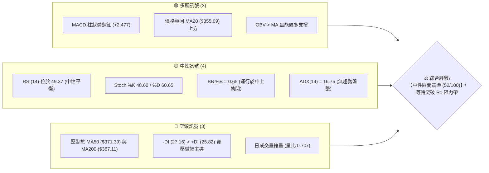

### 📊 核心指標速覽表

| 指標類別 | 指標名稱 | 當前數值 | 訊號 | 專業解讀 |
|:---|:---|:---|:---:|:---|
| **價格** | 當前收盤價 | $361.54 | 🟡 | 位於 52 週區間 35.5% 分位，處於波段修復階段 |
| **短期均線**| MA20 | $355.09 | 🟢 | 現價高於 MA20 (+1.82%)，短線底部逐步抬高 |
| **中期均線**| MA50 | $371.39 | 🔴 | 現價低於 MA50 (-2.65%)，中期下行壓力尚未完全扭轉 |
| **長期均線**| MA200 | $367.11 | 🔴 | 現價低於 MA200 (-1.52%)，長線牛熊分水嶺形成動態反壓 |
| **擺動動能**| RSI(14) | 49.37 | 🟡 | 位於 50 多空分界線附近，無超買超賣，多空拉鋸平衡 |
| **趨勢動能**| MACD 柱狀體 | +2.477 | 🟢 | DIF (-0.352) 穿越 DEA (-2.828)，柱狀體持續走擴，低檔黃金交叉 |
| **波動指標**| ATR(14) | $10.31 | 🟡 | 波動率佔股價 2.85%，波幅收窄進入蓄勢盤整結構 |

### 🏆 技術評分卡

```
╔══════════════════════════════════════════════════════════════════════╗
║                    技術評分卡 — AVGO (2026-10-10)                   ║
╠══════════════════════════════════════════════════════════════════════╣
║ 趨勢強度 (Trend)     ██████░░░░░░░░░░░░░░  30/100  🔴 弱趨勢無主導     ║
║ 動能指標 (Momentum)  ████████████░░░░░░░░  60/100  🟢 MACD翻紅改善     ║
║ 支撐穩定度 (Support) ██████████████░░░░░░  70/100  🟢 S1/S2支撐防守強  ║
║ 成交量配合 (Volume)  ████████░░░░░░░░░░░░  40/100  🟡 縮量量比0.70x   ║
║ 形態完整度 (Pattern) ██████████░░░░░░░░░░  50/100  🟡 箱型橫盤構築中   ║
║ 均線排列 (Moving Avg)████████░░░░░░░░░░░░  40/100  🔴 糾纏壓制於MA200  ║
╠══════════════════════════════════════════════════════════════════════╣
║ 綜合技術評分         ██████████░░░░░░░░░░  52/100  ⚖️ 級別：中性觀望  ║
╚══════════════════════════════════════════════════════════════════════╝
```

---

## 2. 趨勢分析

### 🌐 多時框趨勢分析

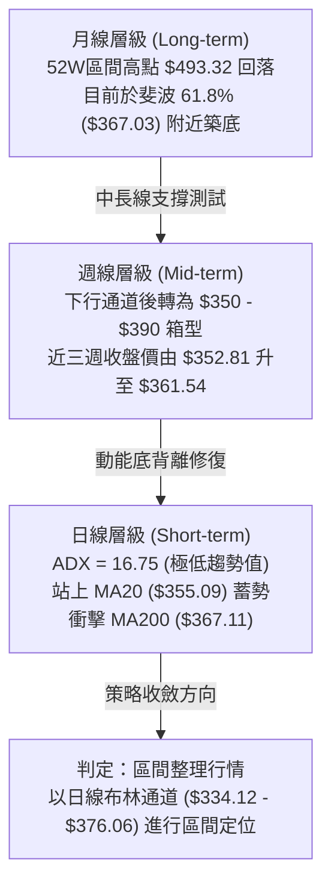

### 📈 長期趨勢 — 12個月走勢圖（Unicode）

```
AVGO 月線收盤走勢圖（2025-10 至 2026-10）
價格軸 ($)
$445.25 ┤                                  ●(05月波段頂峰)
$416.01 ┤                              ●   │
$399.99 ┤      ●(25-11頂部)             │   │
$388.57 ┤      │                       │   │       ●(07月)
$366.90 ┤  ●   │                       │   │   ●   │       ●←目前收盤 $361.54
$351.19 ┤  │   │   ●                   │   │   │   │   ●   │
$329.48 ┤  │   │   │   ●               │   │   │   │   │   │
$308.46 ┤  │   │   │   │   ●(03月低點) │   │   │   │   │   │
        └─────────────────────────────────────────────────────
          10  11  12  01  02  03  04  05  06  07  08  09  10 (月份)
```

**走勢特徵分析表格**：

| 階段區間 | 起止價格 | 漲跌幅 | 結構性特徵與量價行為 |
|:---|:---|:---:|:---|
| **2025-10 ~ 2025-11** | $366.90 → $399.99 | +9.02% | 創下階段性高點，多頭推升力道強勁，形成首道中期頭部壓力。 |
| **2025-12 ~ 2026-03** | $344.20 → $308.46 | -10.38% | 持續走跌探底，3 月份觸及 $308.46 逼近 52 週低點 $288.98 完成洗盤。 |
| **2026-04 ~ 2026-05** | $416.01 → $445.25 | +44.35% | 主升浪爆發，5 月收盤衝至 $445.25，逼近 52 週最高價 $493.32。 |
| **2026-06 ~ 2026-09** | $377.06 → $351.19 | -21.13% | 獲利了結賣壓湧現，9 月收盤回落至 $351.19 測試關鍵支撐帶。 |
| **2026-10 (當前)** | $351.19 → $361.54 | +2.95% | 於 S1 ($356.47) 及 S2 ($349.42) 上方啟動技術性修復反彈。 |

### 📊 中期趨勢（週線分析）

中期技術面正由空方主導的修正段過渡至箱型橫盤整理。過去 6 週（2026-08-30 至 2026-10-11）的週線表現展現出鮮明的「低檔承接」特徵：
- 2026-08-30 收盤價 $368.12，RSI 跌至 23.5 極度超賣。
- 2026-09-06 至 2026-09-27 收盤區間壓縮於 $352.81 ~ $361.33。
- 近三週收盤價由 $352.81 → $355.14 → $361.54，週線 MACD 柱狀體由負翻正並增強至 +2.477。

```
週線支撐阻力結構示意圖：
[阻力 R2] ═══════════════════════════════════════ $375.91 (近一年波段高點聚類)
[阻力 R1] ─────────────────────────────────────── $366.55 (MA200 / 斐波61.8% 匯聚區)
[當前價]  ▲▲▲ $361.54 (重回 MA20 上方，低檔反彈第 3 週)
[支撐 S1] ─────────────────────────────────────── $356.47 (近一年波段低點聚類)
[支撐 S2] ═══════════════════════════════════════ $349.42 (箱型底界強防守點)
```

### ⚡ 趨勢強度評估（ADX 解讀）

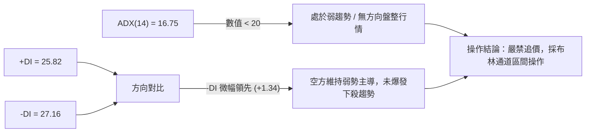

**ADX 趨勢強度對照解讀表**：

| 指標變數 | 當前讀數 | 門檻區間 | 趨勢判定 | 交易策略意涵 |
|:---|:---:|:---:|:---:|:---|
| **ADX(14)** | **16.75** | < 20 | **極弱趨勢 / 盤整** | 趨勢跟隨指標失效，均線常現雜訊；以擺動指標及通道策略為主。 |
| **+DI** | **25.82** | 20 - 30 | 多方修復中 | 多頭動能自低位回溫，但尚未超越空頭勢力。 |
| **-DI** | **27.16** | 20 - 30 | 空方防守中 | 空方優勢大幅縮小（差值僅 1.34），下行動能處於衰竭週期。 |

---

## 3. 圖表形態分析

### 🔍 形態識別系統

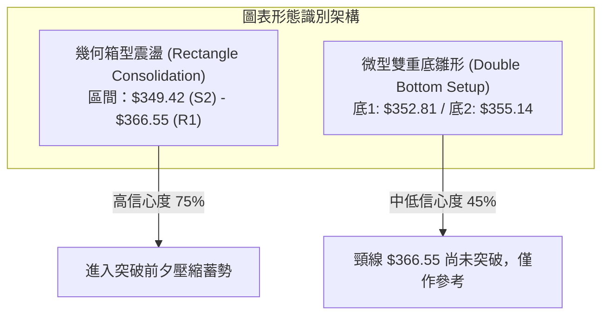

**圖表形態信心度評估表**：

| 形態名稱 | 信心度 | 判斷依據（引用數據） | 完成度 | 目標價（附嚴謹計算式） |
|:---|:---:|:---|:---:|:---|
| **幾何箱型震盪區間** | **75%** | 價格受制於近一年高點聚類 R1 ($366.55) 與低點聚類 S2 ($349.42)，近 5 週皆於此帶收斂。 | 85% | 向上突破測算目標 = 箱頂 $366.55 + 箱體高度 ($366.55 - $349.42 = $17.13) = **$383.68**（與阻力位 R3 **$383.63** 高度吻合）。 |
| **微型雙底雛形** | **45%** | 兩次週收盤低點分別為 2026-09-27 ($352.81) 與 2026-10-04 ($355.14)。 | 40% | *信心度 < 50%，依紀律不採納為幾何買訊，僅作為指標型超跌反彈解讀。* |

### 🕯️ 重要 K 線形態分析

| 觀測週期/月份 | 收盤價 | K 線結構形態 | 專業解讀 | 訊號意涵 |
|:---|:---:|:---|:---|:---:|
| **2026-08 (月線)** | $369.67 | 長上影十字陰線 | 衝高 $426.98 後大幅回吐，獲利盤集中了結，中期轉入修正。 | 🔴 強烈空頭 |
| **2026-09 (月線)** | $351.19 | 下影線小實體陰線 | 測試波段底部，低檔買盤於 S2 ($349.42) 附近發揮防守功能。 | 🟡 止跌訊號 |
| **2026-10-04 (週線)**| $355.14 | 探底回升陽線 (Hammer) | 連續收盤站穩 S1 ($356.47 附近)，形成短線反彈跳板。 | 🟢 短線看多 |
| **2026-10-11 (週線)**| $361.54 | 連續推升實體陽線 | 收復 MA20 ($355.09)，確認下檔買盤支撐有效性。 | 🟢 多頭續航 |

### 📉 ASCII 走勢形態示意圖

```
箱型震盪與潛在測量目標示意圖：
阻力 R3 ── $383.63 ─────────────────────────────────────── [箱型等幅測量目標位]
                                                            ▲
阻力 R2 ── $375.91 ─────────────────────────┐               │ +$17.13
                                            │               │ (等幅高度)
阻力 R1 ── $366.55 ───────┬─────────┬───────┴───────────────┴ [箱型頂部頸線]
                         │  現價   │
                         │ $361.54 │  ◄ 當前價格正處箱體中上部
支撐 S1 ── $356.47 ───────┴─────────┴─────────────────────── [箱體內部中軸支撐]
支撐 S2 ── $349.42 ───────────────────────────────────────── [箱型底部底界線]
```

### 🎯 形態目標價計算

1. **箱體高度計算式**：
   $$\text{形態高度} = \text{箱頂 R1} - \text{箱底 S2} = \$366.55 - \$349.42 = \$17.13$$
2. **向上突破等幅測量目標**：
   $$\text{理論目標價} = \text{箱頂 R1} + \text{形態高度} = \$366.55 + \$17.13 = \$383.68$$
   *(該計算值與實際高點聚類阻力 R3 \$383.63 之偏差僅 \$0.05，呈現技術結構的高度共振)*。
3. **向下跌破下限測量目標**：
   $$\text{理論下行目標} = \text{箱底 S2} - \text{形態高度} = \$349.42 - \$17.13 = \$332.29$$
   *(該數值與斐波那契 78.6% 回調位 \$332.71 形成共振)*。

---

## 4. 支撐與阻力

### 🗺️ 關鍵價位分布圖（Unicode）

```
AVGO 價位結構分布圖
═══════════════════════════════════════════════════════════════
$383.63 ║████████████████████████████████║ 強阻力 R3 (箱型等幅目標位)
$375.91 ║████████████████████████        ║ 阻力 R2 (布林上軌 $376.06 匯聚)
$367.03 ║████████████████████████████    ║ 關鍵反壓 (斐波 61.8% / MA200 帶)
$366.55 ║██████████████████████████████  ║ 關鍵阻力 R1 (波段高點聚類)
$361.54 ╠════════════════════════════════╣ ◄ 當前收盤價
$356.47 ║▓▓▓▓▓▓▓▓▓▓▓▓▓▓▓▓▓▓▓▓▓▓▓▓        ║ 近期支撐 S1 (波段低點聚類 / MA20)
$349.42 ║▓▓▓▓▓▓▓▓▓▓▓▓▓▓▓▓▓▓▓▓▓▓▓▓▓▓▓▓    ║ 強支撐 S2 (波段箱底強防守)
$342.50 ║▓▓▓▓▓▓▓▓▓▓▓▓▓▓▓▓▓▓▓▓▓▓▓▓████████║ 核心防守 S3 (波段極端低點)
═══════════════════════════════════════════════════════════════
```

### 🚧 阻力位分析表

| 阻力級別 | 精確價位 | 距現價幅標 | 形成原因與技術匯聚點 | 突破難度 | 重要性權重 |
|:---|:---:|:---:|:---|:---:|:---:|
| **R1** | **$366.55** | +1.39% | 近一年波段高點聚類；與 MA200 ($367.11) 及斐波那契 61.8% ($367.03) 構成三重共振壓制帶。 | 🟡 中等 | ★★★★☆ |
| **R2** | **$375.91** | +3.97% | 近一年密集震盪高點；與日線布林通道上軌 ($376.06) 及 MA60 ($373.19) 形成共振反壓。 | 🔴 偏高 | ★★★★☆ |
| **R3** | **$383.63** | +6.11% | 中期反彈高點聚類；同時為幾何箱型向上突破之等幅測算理論目標位 ($383.68)。 | 🔴 極高 | ★★★★★ |

### 🛡️ 支撐位分析表

| 支撐級別 | 精確價位 | 距現價幅標 | 形成原因與技術匯聚點 | 守住機率 | 重要性權重 |
|:---|:---:|:---:|:---|:---:|:---:|
| **S1** | **$356.47** | -1.40% | 近一年波段低點聚類；與日線 MA20 ($355.09) 緊密貼合，構成短線多頭第一防線。 | 75% | ★★★★☆ |
| **S2** | **$349.42** | -3.35% | 波段箱型下緣低點聚類；多次週線下影線密集回踩區域，具備強大籌碼沉澱。 | 85% | ★★★★★ |
| **S3** | **$342.50** | -5.27% | 深度回調極值低點；布林通道下軌 ($334.12) 與其構成下檔緩衝阻尼區間。 | 90% | ★★★☆☆ |

### 📐 斐波那契回調位分析

依據 52 週完整波段（低點 **$288.98** 至 高點 **$493.32**，波幅 **$204.34**）推算：

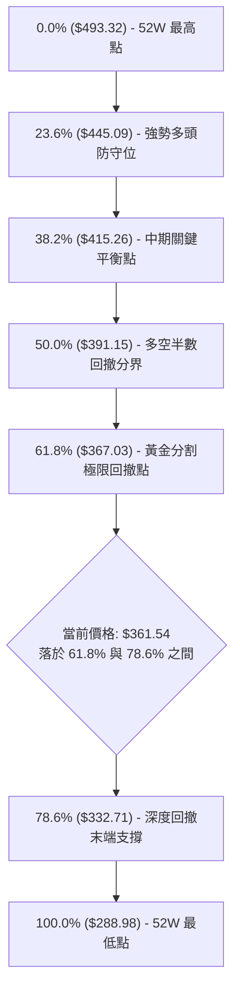

- **位置解讀**：現價 $361.54 處於 **61.8% ($367.03)** 與 **78.6% ($332.71)** 之間。
- **技術意涵**：傳統技術分析中，61.8% 回撤位是判定長期多頭趨勢是否存續的底線。當前股價在 61.8% 回調位 ($367.03) 下方微幅受挫，且此處與阻力位 R1 ($366.55) 以及 MA200 ($367.11) 高度重疊。若能日線實體站穩 $367.03 之上，則確認 52 週大級別回撤宣告結束；反之若跌破 S2 ($349.42)，下行目標將直接指向 78.6% ($332.71)。

---

## 5. 技術指標深度解讀

### 🎛️ 指標訊號總覽

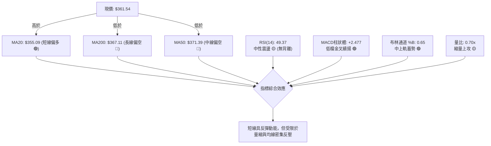

### 📈 移動平均線排列分析

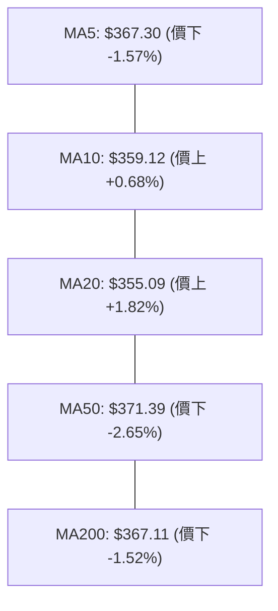

**均線狀態明細表**：

| 均線週期 | 數值 | 與現價關係 | 斜率與形態特徵 | 訊號意涵 |
|:---|:---:|:---:|:---|:---:|
| **MA5** | $367.30 | 現價在其下方 (-1.57%) | 短線走平，壓制於上頭 | 🔴 超短線反壓 |
| **MA10** | $359.12 | 現價在其上方 (+0.68%) | 微幅上翹，提供支撐 | 🟢 極短線防守 |
| **MA20** | $355.09 | 現價在其上方 (+1.82%) | 底部翻揚向上 | 🟢 短期趨勢轉佳 |
| **MA50** | $371.39 | 現價在其下方 (-2.65%) | 持續下行壓制 | 🔴 中期空頭阻力 |
| **MA200** | $367.11 | 現價在其下方 (-1.52%) | 走平微下彎，牛熊交界點 | 🔴 長期反轉考驗 |

*結論：當前呈現典型「短期均線向上交叉 (MA10 > MA20)，但受制於中長期均線 (MA50 & MA200)」之混亂排列，屬震盪築底結構。*

### 📉 RSI(14) 分析

```
RSI(14) 讀數：49.37
超賣區 (0-30)          中性區 (30-70)          超買區 (70-100)
├──────────────┼──────────────┼──────────────┤
0             30             70            100
[████████████████████████░░░░░░░░░░░░░░░░░░░░] 49.37
```

- **超買超賣判定**：49.37 處於中性平衡區間，多空動能無任何極端耗竭跡象。
- **背離判斷**：
  - 日線層級：無背離現象。
  - 週線層級：2026-08-30 收盤價 $368.12 時 RSI 為 23.5（超賣）；至 2026-09-27 收盤破底至 $352.81 時，週線 RSI 卻抬升至 47.4。此為標準**週線級別普通底背離 (Bullish Divergence)**，這正是近兩週價格自 $352.81 穩步回升至 $361.54 的核心驅動力。

### 📊 MACD(12/26/9) 訊號解讀

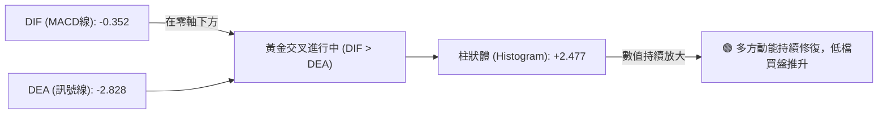

- **數值狀態**：DIF (-0.352) 顯著高於 DEA (-2.828)，柱狀體讀數為 **+2.477**，呈現連續三週擴張態勢（由 -0.368 → +1.218 → +0.960 → +2.477）。
- **結構分析**：雖然雙線仍在零軸下方（屬弱勢區金叉），但柱體翻紅且加速上行，顯示空方動能已全面退潮，正進入技術性多頭修復循環。

### 📦 布林通道分析

```
布林通道 (20, 2) 結構示意圖：
$376.06 ┬─────────────────────────────────────────── BB 上軌
        │                                             
$361.54 ┼───────────────────────────● 現價 (位處中上軌之間, %B = 0.65)
        │                                             
$355.09 ┴─────────────────────────────────────────── BB 中軌 (MA20)
        │
$334.12 ┴─────────────────────────────────────────── BB 下軌
```

- **通道帶寬與位置**：帶寬 (\$376.06 - \$334.12 = \$41.94) 呈現收口後走平。
- **%B 指標解析**：當前 %B 為 **0.65**，意味著股價由下軌反彈並已有效穿越中軌 ($355.09)，現階段正向布林上軌 ($376.06) 推進，中軌已由阻力轉化為短線回踩支撐。

### 💹 成交量分析（量價配合度）

```
成交量對比：
今日成交量: 16.83M [██████████████░░░░░░] 0.70x
20日均量:   24.03M [████████████████████] 1.00x
```

- **量價行為解讀**：股價自低位回升至 $361.54，但成交量僅 16.83M，量比為 0.70x，呈現**「價漲量縮」**的量價背離隱憂。這意味著上漲主要來自「空方拋壓竭盡」而非「大資金主動追價激增」。
- **OBV 趨勢驗證**：數據顯示 **OBV > MA**，代表在累計成交量維度上，資金並未實質出逃，量能整體維持多頭底層支撐。若後續欲有效攻克 R1 ($366.55)，日成交量必須放大至 20 日均量 (24.03M) 之上。

---

## 6. 動能與波動率

### ⚡ 動能評估四象限

| 象限分區 | 動能維度 | 波動率維度 | 當前技術指標匹配 | 市場狀態與評估 |
|:---:|:---:|:---:|:---|:---|
| **Q1 (最佳機會)** | 強 (MACD/RSI偏多) | 低 (通道壓縮中) | - | 突破前夕之最佳佈局點。 |
| **Q2 (謹慎觀望)** | **弱 / 中性** | **低 (收縮)** | **✓ (ADX 16.75 / ATR $10.31)** | **當前所在狀態：動能溫和修復但未爆發，波動率壓縮，適合區間操作。** |
| **Q3 (高風險高益)** | 強 (爆發) | 高 (擴張) | - | 單邊主升浪或強勢洗盤。 |
| **Q4 (避免進場)** | 弱 (空頭衰退) | 高 (恐慌) | - | 主跌浪恐慌釋放階段。 |

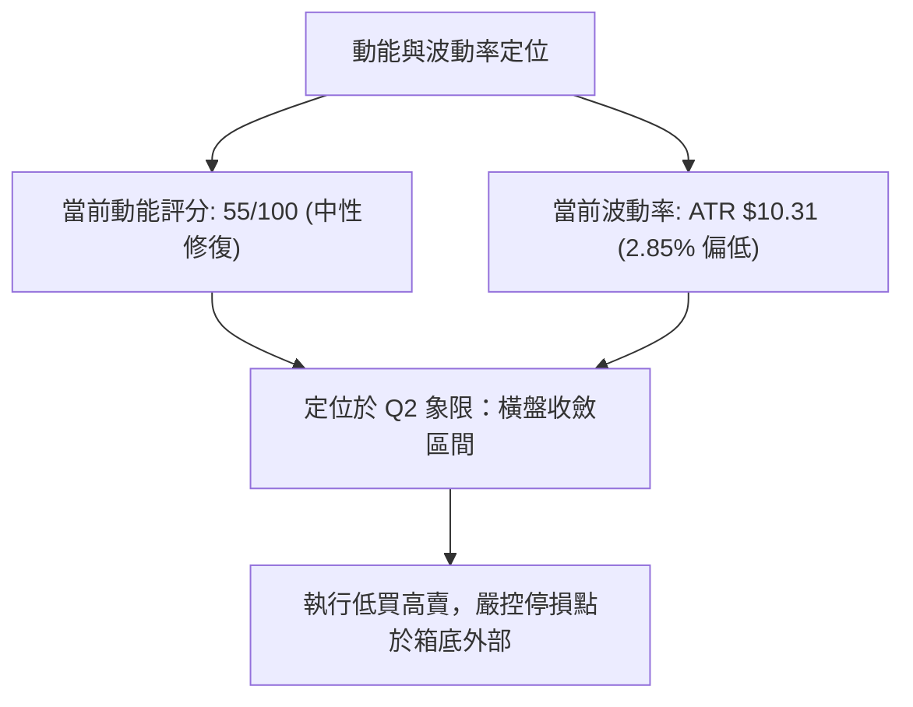

### 📊 ATR 波動率分析

- **ATR(14) 絕對值**：**$10.31**（佔現價 2.85%），顯示單日正常波動幅度約為 $10 左右。
- **交易風控距離建議**：
  - **超短線日內止損 (1.0x ATR)**：距離現價 $10.31 $\rightarrow$ 止損設於 **$351.23**。
  - **波段交易安全止損 (1.5x ATR)**：距離現價 $15.47 $\rightarrow$ 止損設於 **$346.07**（此處已完全跌破 S2 強支撐 $349.42，有效過濾市場雜訊）。
  - **寬鬆趨勢防守 (2.0x ATR)**：距離現價 $20.62 $\rightarrow$ 止損設於 **$340.92**（低於 S3 $342.50）。

### 📐 Beta 與市場相關性

- **Beta 數值**：**1.476**（高貝塔科技股特徵）。
- **市場敏感度分析**：AVGO 波動幅度平均為標普 500 指數的 1.48 倍。當大盤處於震盪時，AVGO 傾向於放大區間波幅；這解釋了為何在 ADX 僅 16.75 的盤整市中，ATR 仍維持在 $10.31 的絕對水平。進行交易配置時，倉位應較一般大盤股調降 25%~30% 以匹配同等風險敞口。

---

## 7. 多時框架總結

### 📋 時框架評分表

| 時框架 | 趨勢方向 | 擺動動能 | 均線系統 | 形態結構 | 綜合評分 | 戰術建議 |
|:---|:---:|:---:|:---:|:---:|:---:|:---|
| **日線 (短線)** | 震盪偏多 🟢 | MACD翻紅 🟢 | 站上MA20 🟢 | 布林中軌反彈 🟢 | **60/100** | 區間下限逢低分批佈局 |
| **週線 (中線)** | 箱型盤整 🟡 | RSI底背離 🟢 | 受制MA50 🔴 | 箱體築底 🟡 | **50/100** | 關注 R1 ($366.55) 能否帶量收復 |
| **月線 (長線)** | 深度回調 🔴 | 零軸修正 🟡 | 逼近MA200 🔴 | 斐波61.8%震盪 🟡 | **45/100** | 長線資金採定投或等待破位信號 |

### 🔲 綜合訊號矩陣

```
訊號維度對照表：
┌─────────────┬───────────┬───────────┬───────────┐
│ 分析維度    │ 短期 (日) │ 中期 (週) │ 長期 (月) │
├─────────────┼───────────┼───────────┼───────────┤
│ 趨勢一致性  │    🟢     │    🟡     │    🔴     │  (多時框分歧)
│ 動能方向    │    🟢     │    🟢     │    🟡     │  (動能先行回溫)
│ 籌碼/量能   │    🟡     │    🟡     │    🟢     │  (OBV維持長期健康)
│ 結構穩定度  │    🟢     │    🟡     │    🟡     │  (S1/S2支撐獲得確認)
└─────────────┴───────────┴───────────┴───────────┘
```

### ⚖️ 多時框收斂結論

> **依多時框收斂規則（規則 14）判定**：
> 當前日線與週線之 **ADX(14) 數值僅為 16.75 (< 25)**，嚴格判定當前市場處於**「無方向盤整行情」**！
> 
> **收斂取捨法則**：在弱趨勢盤整市場中，順勢跟隨邏輯失效，禁止依據中長期下行趨勢無腦做空，亦禁止過早押注突破大牛市；**必須以日線布林通道上下軌 ($334.12 - $376.06) 與技術高低點聚類 ($349.42 - $366.55) 作為核心收斂邊界**。
> 
> **唯一收斂結論**：**【中性區間震盪（偏多修復）】**。短線動能支持股價挑戰 R1 ($366.55) 與布林上軌 ($376.06)，但在成交量未放大且未突破 R1 之前，本質仍屬箱型震盪，策略嚴格錨定區間操作。

---

## 8. 交易策略建議

### 🗺️ 策略決策流程圖

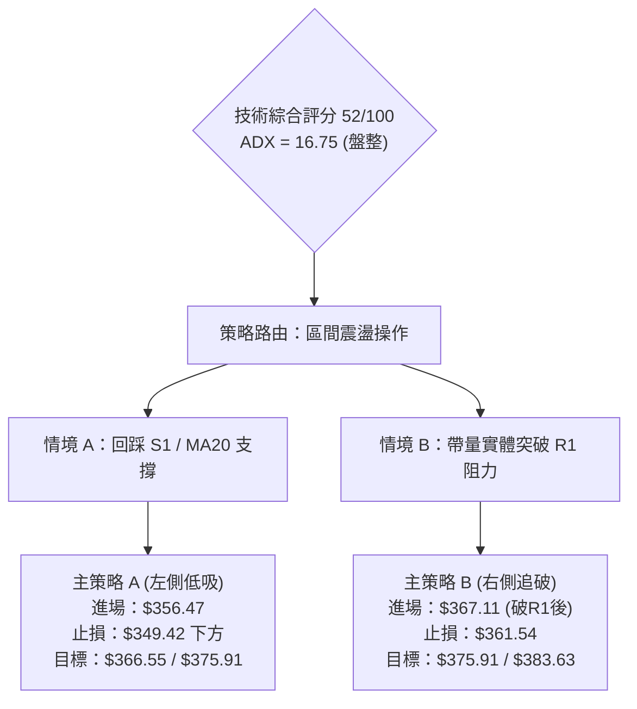

### 🧭 策略路由（依評分卡分流）

- **當前主策略方向**：**【區間操作 / 箱型震盪策略】（依評分 52/100，落於 40–60 中性區間）**
- **操作核心方針**：不盲目押注單邊趨勢，於支撐密集區逢低吸納，於強阻力位減倉止盈，靜待帶量突破確認。

### 🎯 價格情境階梯（Price Scenarios）

價位嚴格引用自「關鍵價位」分析模組：

| 觸發條件 | 第一目標 (T1) | 第二目標 (T2) | 市場結構含義 |
|:---|:---:|:---:|:---|
| **向上突破 R1 ($366.55)** | **R2 ($375.91)** | **R3 ($383.63)** | 站穩 MA200，破箱轉強，確立波段反轉上升段。 |
| **維持於現價 ($361.54) 震盪** | **R1 ($366.55)** | **S1 ($356.47)** | 處於箱體內部平衡區，多空博弈，動能持續積累。 |
| **跌破 S1 ($356.47)** | **S2 ($349.42)** | **S3 ($342.50)** | 短期修復失敗，重回空頭測試箱型底部極限支撐。 |

### 📊 情境機率分佈

| 運行情境 | 發生機率 | 主要技術依據 |
|:---|:---:|:---|
| **區間震盪（維持 S1 - R1 內）** | **50%** | ADX = 16.75 確認弱趨勢，量比 0.70x 顯示追價意願不足，布林通道帶寬收斂。 |
| **向上突破（攻克 R1 挑戰 R2）** | **35%** | MACD 柱狀體擴大至 +2.477，週線 RSI 底背離修復，OBV > MA 量能底層支持。 |
| **回落下破（跌破 S1 探 S2）** | **15%** | 均線系統中 MA50/MA200 仍呈壓制狀態，且 +DI 尚未能大幅壓制 -DI。 |

### 🟢 主策略詳情（方向依上方路由）

以下提供兩套針對當前盤整格局的具體執行方案，嚴禁憑空推估價位：

| 交易策略要素 | 策略 A：箱底支撐低吸策略（左側） | 策略 B：阻力突破確認策略（右側） |
|:---|:---|:---|
| **進場條件** | 回踩 S1 獲得確認且未破 MA20 | 日線實體收盤帶量突破 R1 ($366.55) |
| **進場價格** | **$356.47** (精準引用 S1) | **$367.11** (站上 MA200 與 R1 臨界點) |
| **目標價 T1** | **$366.55** (引用阻力 R1) | **$375.91** (引用阻力 R2) |
| **目標價 T2** | **$375.91** (引用阻力 R2) | **$383.63** (引用阻力 R3) |
| **止損價格** | **$349.42** (精準引用 S2 箱底) | **$361.54** (跌破當前箱體樞紐收盤價) |
| **風險空間** | $7.05 ($356.47 - $349.42) | $5.57 ($367.11 - $361.54) |
| **報酬空間 (T1)**| $10.08 ($366.55 - $356.47) | $8.80 ($375.91 - $367.11) |
| **風險報酬比 (T1)**| **1 : 1.43** (至 T2 則為 1 : 2.76) | **1 : 1.58** (至 T2 則為 1 : 2.97) |
| **預估成功率** | 65% | 55% (需成交量放大確認) |
| **建議配置倉位** | 10% - 15% (基礎波段倉) | 10% (突破加碼倉) |

### 🔴 反向風險觸發點（對沖提示）

- **多頭結構破壞點**：若日線收盤價跌破 **$349.42 (S2)**，代表箱型震盪下軌徹底失守，微型雙底形態瓦解。
- **對沖處置建議**：多頭部位應即刻無條件停損出場，並可建立空頭對沖部位，下行目標直接看向 S3 ($342.50) 或斐波那契 78.6% 回調位 ($332.71)。

### ⭐ 整體訊號強度評星

```
做多訊號強度：★★★☆☆  (3.0/5星 — 短線動能反彈，但受阻於中長線均線)
做空訊號強度：★★☆☆☆  (2.0/5星 — 賣壓逐步衰竭，下方支撐強固)
整體交易可信度：★★★☆☆  (3.5/5星 — 處於 ADX 盤整期，區間交易勝率高)
```

---

## 9. 風險提示與監控

### ✅ 關鍵監控指標 Checklist

```
╔══════════════════════════════════════════════════════════════════════╗
║                   AVGO 關鍵技術監控清單 (Checklist)                  ║
╠══════════════════════════════════════════════════════════════════════╣
║ [ ] 關鍵阻力破位：日線實體收盤是否站穩 R1 ($366.55) 與 MA200        ║
║ [ ] 量能擴張檢驗：單日成交量是否回升突破 20 日均量 (24.03M)          ║
║ [ ] 關鍵支撐防守：回踩時 S1 ($356.47) 與 MA20 ($355.09) 是否收下影  ║
║ [ ] 動能延續監控：MACD 柱狀體是否持續大於 +2.0 (不可快速衰退歸零)     ║
║ [ ] 趨勢甦醒信號：ADX(14) 是否由 16.75 抬升至 25 以上確認單邊趨勢   ║
╚══════════════════════════════════════════════════════════════════════╝
```

### ⚠️ 風險場景分析

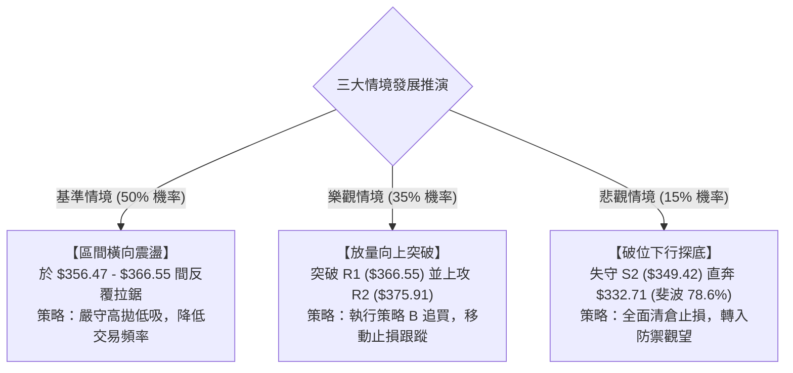

### 🛡️ 風險管理重要提醒

1. **Beta 槓桿效應控制**：由於 AVGO 之 Beta 達 1.476，科技板塊或半導體 ETF (如 SOXX) 的輕微波動均會在此股放大。嚴禁在突破確認前過度使用融資槓桿。
2. **ATR 浮動追蹤防守**：由於 ATR 達 $10.31，盤中可能出現 $5~$8 的隨機雜訊波動。止損切勿設置過密（嚴格保持在支撐價位之外 0.5x ATR 以上），以防被虛假下影線洗盤出場。
3. **倉位總量上限**：在 ADX 低於 25 的環境中，單一標的總持倉比例不宜超過投資組合總資金的 15%。

---

## 📋 報告總結

```
╔══════════════════════════════════════════════════════════════════════╗
║                    AVGO 技術分析報告總結 (2026-10-10)                ║
╠══════════════════════════════════════════════════════════════════════╣
║ 當前價格：$361.54               52W 區間：$288.98 - $493.32 (35.5%) ║
║ 綜合技術評級：52/100 (中性觀望)  趨勢狀態：無方向盤整 (ADX = 16.75)   ║
╠══════════════════════════════════════════════════════════════════════╣
║ 關鍵結論：                                                           ║
║ ├─ 長期趨勢：🔴 弱勢修正，處於 52W 回撤斐波 61.8% ($367.03) 關鍵防線  ║
║ ├─ 中期趨勢：🟡 箱型築底，週線 RSI 呈現底背離，下檔買盤支撐增強      ║
║ ├─ 短期趨勢：🟢 震盪偏多，站上 MA20 ($355.09)，MACD 柱狀體紅柱走擴    ║
║ ├─ 核心阻力：R1: $366.55 │ R2: $375.91 │ R3: $383.63               ║
║ ├─ 核心支撐：S1: $356.47 │ S2: $349.42 │ S3: $342.50               ║
║ └─ 法人共識目標：$531.31 (47 位分析師，強烈推薦買入評級)             ║
╠══════════════════════════════════════════════════════════════════════╣
║ 最優策略組合：                                                       ║
║ 1. 🥇 最佳機會：於 S1 ($356.47) 附近佈局低吸，停損設於 S2 ($349.42)  ║
║ 2. 🥈 次選機會：靜待帶量突破 R1 ($366.55) 後追進，目標直指 R2/R3    ║
║ 3. 🥉 保守選擇：在 ADX 未升破 25 且量比 < 1.0 前，維持空倉等待方向確認║
╚══════════════════════════════════════════════════════════════════════╝
```

---

> ⚠️ **免責聲明**：本報告由資深技術分析模型基於歷史 OHLCV 與各類技術指標演算法自動生成，所有分析、點位推算及策略配置僅供量化研究與學術探討參考，**絕不構成任何形式的要約、招攬或實質投資建議**。金融市場瞬息萬變，技術指標存在滯後性與失效風險，投資人應獨立評估財務狀況並自負投資盈虧。

---

*報告生成時間：2026-10-10 ｜ 數據來源：Yahoo Finance ｜ 分析框架：多時框技術分析架構 (MTFA)*