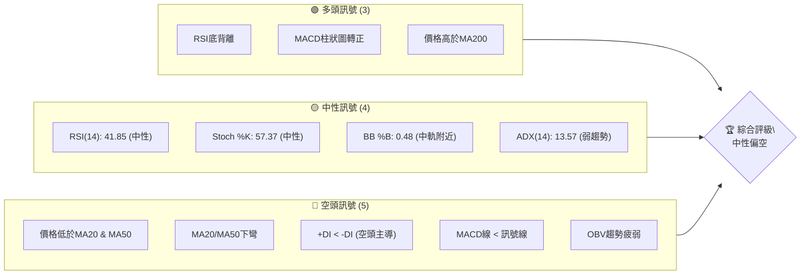
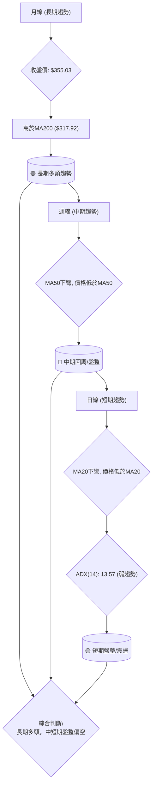
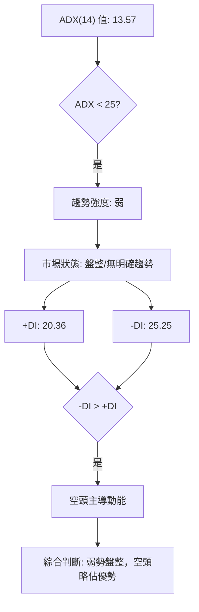
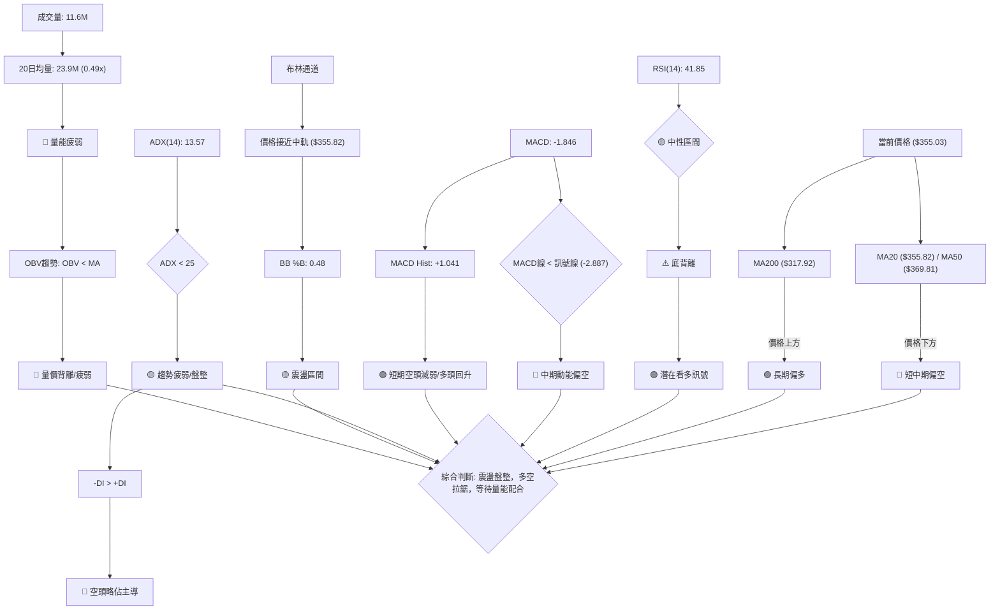
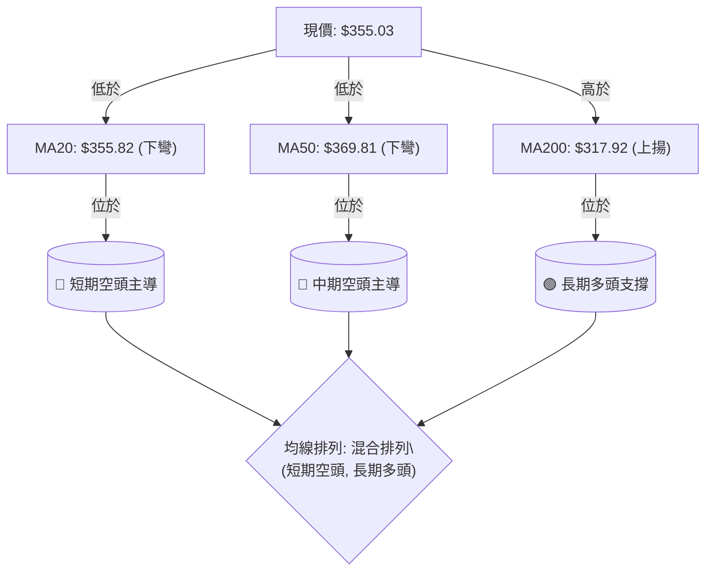
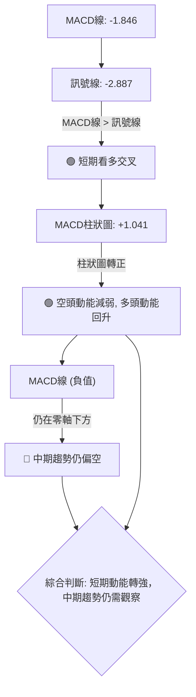
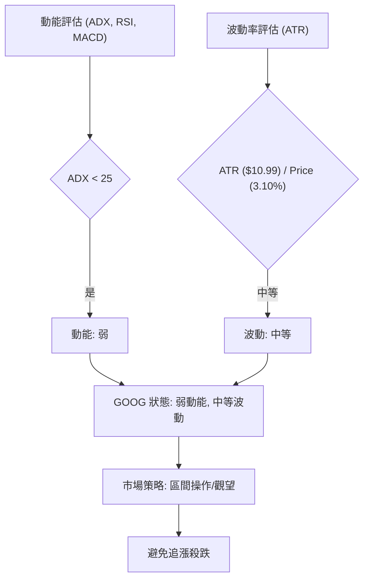
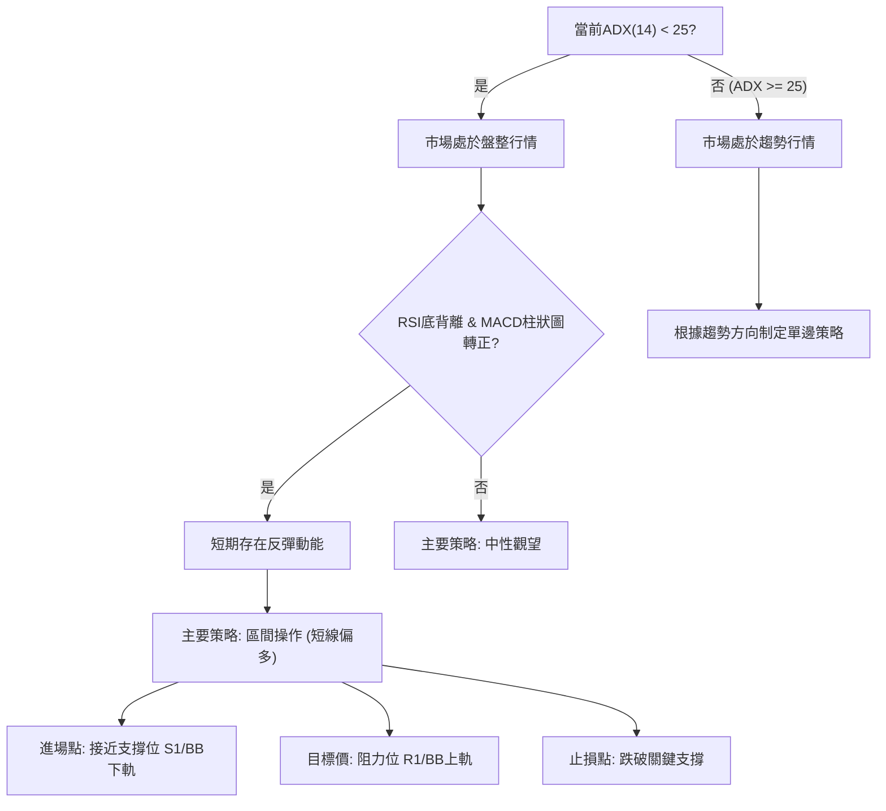
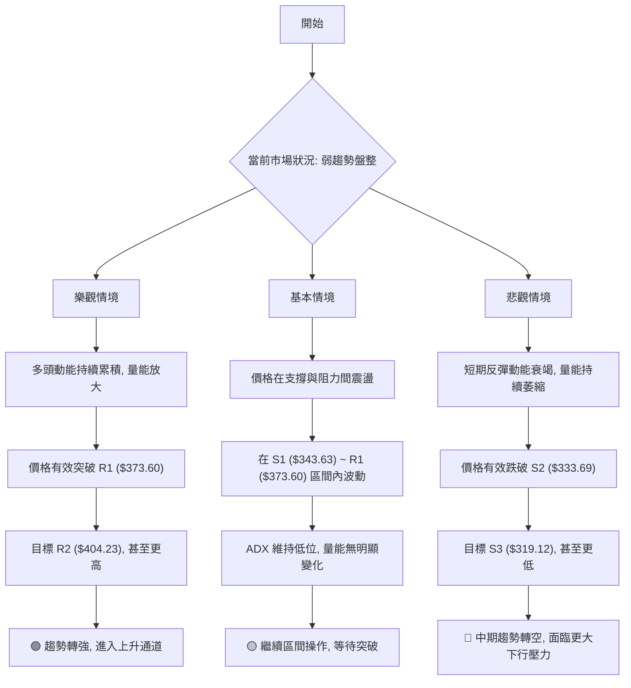

<details>
<summary>📊 靜態圖表 (點擊展開)</summary>

</details>

<html>
<head><meta charset="utf-8" /></head>
<body>
    <div style="height:500px; width:100%;">                        <script>window.PlotlyConfig = {MathJaxConfig: 'local'};</script>
        <script charset="utf-8" src="https://cdn.plot.ly/plotly-3.7.0.min.js" integrity="sha256-jvTGqxNp8AGWEcvNLVuKr+8j5dGe9Yw51LQkmDH+IYA=" crossorigin="anonymous"></script>                <div id="candlestick-chart" class="plotly-graph-div" style="height:100%; width:100%;"></div>            <script>                window.PLOTLYENV=window.PLOTLYENV || {};                                if (document.getElementById("candlestick-chart")) {                    Plotly.newPlot(                        "candlestick-chart",                        [{"close":{"dtype":"f8","bdata":"AAAAYBV7b0AAAADgC+tuQAAAAEDOwm5AAAAAgEnWbkAAAABAOXxuQAAAAMBaYm5AAAAA4OihbkAAAACAVb5uQAAAAAD5vm5AAAAAYJNgb0AAAACgsNRuQAAAAMBan25AAAAA4I43bkAAAABA0KBtQAAAAIAqhW5AAAAAYKu2bkAAAACg9mZvQAAAAIBkbG9AAAAAoGSpb0AAAACARghwQAAAAIAlW29AAAAA4CaBb0AAAAAgeqdvQAAAAIABQHBAAAAAYG7WcEAAAABger5wQAAAAIAbKnFAAAAAoJOVcUAAAADATJRxQAAAAAAHuXFAAAAA4EFYcUAAAABgFsNxQAAAAGCCzHFAAAAAIHJycUAAAABgWCByQAAAAGC1MnJAAAAAIOLtcUAAAAAAL2lxQAAAAOACR3FAAAAAQKnQcUAAAADgcMZxQAAAAGCrRnJAAAAAwJoWckAAAABgBbFyQAAAAGCN3XNAAAAAQBwwdEAAAACgdPpzQAAAAGDm93NAAAAAoA6oc0AAAADAbbZzQAAAAIDi\u002f3NAAAAAQEbcc0AAAADAWxd0QAAAAGCioHNAAAAAgF3Vc0AAAAAgTAl0QAAAAGCmlHNAAAAAANZhc0AAAABAqU5zQAAAACBBNXNAAAAAgLyackAAAABgqPVyQAAAAOBQQ3NAAAAAYMduc0AAAADgSbRzQAAAAAAhtHNAAAAAgMioc0AAAAAArZ9zQAAAAGA7onNAAAAAYD+Wc0AAAABAia5zQAAAAIB+znNAAAAAYDuic0AAAADAJSB0QAAAAEBaWXRAAAAAIF6LdEAAAACAu8R0QAAAAODa\u002f3RAAAAAAPD9dEAAAACAmst0QAAAAOCKnnRAAAAAQNUbdEAAAABAOX90QAAAACCIpnRAAAAAwAWAdEAAAACAedJ0QAAAAEAB6XRAAAAAYHX9dEAAAAAgfSN1QAAAAGBpIXVAAAAAwDKHdUAAAAAgFkR1QAAAAMB6znRAAAAAgFyudEAAAACg2ip0QAAAAGCgP3RAAAAAYG3jc0AAAABgx25zQAAAAMB1T3NAAAAAIO4Zc0AAAAAAzOZyQAAAAKCx+HJAAAAAAJ\u002fyckAAAAAg06dzQAAAACCIdHNAAAAAYDpoc0AAAACg8YlzQAAAAKD8K3NAAAAAgGBwc0AAAADgXB9zQAAAAACf8nJAAAAAQN3wckAAAADgRshyQAAAAECSnnJAAAAAIDcdc0AAAAAg7StzQAAAAIDAQ3NAAAAAIHHwckAAAACAddRyQAAAAGDKA3NAAAAAIJVTc0AAAAAg2iFzQAAAAOC8GHNAAAAAwMOpckAAAABAca1yQAAAAMBqEHJAAAAAIKcWckAAAABgI4lxQAAAAICGGXFAAAAAoJwPcUAAAADA\u002f+pxQAAAAOCPa3JAAAAAoIZkckAAAAAAspdyQAAAAID0+3JAAAAAoM+oc0AAAAAg4MJzQAAAAEB7uHNAAAAAwEnwc0AAAABAGaZ0QAAAACBN5HRAAAAAAB7JdEAAAABAIjN1QAAAACAs83RAAAAAAFekdEAAAAAgbhh1QAAAAOC\u002fGHVAAAAAYNNhdUAAAABA98R1QAAAAOCntHVAAAAAIJ6xdUAAAABAXdt3QAAAAADV73dAAAAAQJa2d0AAAAAgnwB4QAAAAABwrnhAAAAA4P6weEAAAACg+sx4QAAAAACZKHhAAAAAIG35d0AAAADAzOx4QAAAAODlznhAAAAAwFWReEAAAAAA+o14QAAAACCyCnhAAAAAILIKeEAAAABg1PN3QAAAAOBtsndAAAAAgLwJeEAAAACAkwl4QAAAAEA0HnhAAAAA4EGDd0AAAADAsUV3QAAAAIDKYnZAAAAAAHU3dkAAAAAgxBB3QAAAAOCj2HZAAAAAYLiSdkAAAADgo6R2QAAAAMAeFXZAAAAAwPVIdkAAAABgj2J2QAAAAIDC8XZAAAAAoJkxd0AAAACgmaF2QAAAACBc93ZAAAAA4HrMdUAAAACgR6F1QAAAAOCjkHVAAAAAQApjdUAAAABACut0QAAAAOB69HVAAAAAoEcVdkAAAACAPV52QAAAAEDhQnZAAAAAYGbOdkAAAACA67l2QAAAACBca3ZAAAAAANdDdkAAAADgejB2QA=="},"high":{"dtype":"f8","bdata":"n83SDrHIb0CSJIqq4o5vQIc0wk+Z2m5AeWMd4y40b0A6pK+1+2RvQAWqM79YZm5AMGAuM1TVbkADv6aQ0eRuQE0Zl4tO1G5ABhdM0Zx2b0Ayhd1q2mFvQF4yfWfX2G5Au\u002fc6ZWOibkAwsZ+WjYtuQIHEICRYkG5A7aNDOEbxbkC2JG1Mf4hvQLVs17M3EXBAYM1RiDTMb0BZ9u47AhZwQGTfKIIs3G9AF2O9jdQKcEAb9Or9gOtvQFBQR3nxX3BA5W1q51LkcECQ9bX8le1wQDFPAtfhNnFAHRo6Ir41ckCrQbyZmdtxQIPc0SoX1nFAdiIEA4aUcUDzGAUAOuJxQP6jcrLrA3JAJaAjahi\u002fcUCKYYvnPC5yQP+cPDFKPHJAmrox35s8ckBbF\u002f9SSa9xQOo4Cb2paXFAqZ1KBxpfckBpxdWk5g1yQPY+DCd6+nJAfqiKo6Ikc0C\u002f8iGX2PVyQPL661fK8nNA93kh0m6AdEAWTdcCq0V0QIXf+zTZY3RAzN8nfRPwc0DTgtbToN9zQFZaO3+PFnRASQBdhHgndECI9sDOJDN0QGZjBQL5DHRAM8epf7Dkc0CwY3r5Mhd0QDAwp88dGXRAueZUlaO7c0D1MI6uq4RzQI7yvyACd3NAUjSa+qlMc0BHVLhNyQ1zQEGt\u002f1djSXNA\u002fdqgBbF0c0CDiZ0PMr5zQNirli8JvnNAFHF3klnCc0B+OlqG8ahzQNEUfQmR1HNAAL4voKevc0C3lUeo4Sd0QJ5w4W5V7XNAq2x25z4SdEAHSneOn2B0QPbUtOi8oXRAIDTqPcKwdEA\u002fkPF7DuB0QE6lhGATTHVAYoy2RnEJdUDh5u4OBRt1QCAe7Q7X7HRAoXcGzZZ6dEBQ0XImp8R0QNUQ6ENc7HRAiLk3cYHZdECmgz2\u002fk\u002f50QLcfbbBgHHVArIasyAcTdUDYAa84fl11QHvYqveIPXVA8ENZ1W6LdUA\u002fAc+8Ftt1QAc3Lc7PfHVA\u002fMbSuVvDdED0aawyVqN0QCSZmSX\u002fdHRApNrsVl0TdEB49jQxBAp0QJ0DPV4SwXNA9vu1aMpHc0CN+kGv3wdzQCGHTDgsGHNADzDJ6xYac0A0yrzOi8VzQB6YHP6b8HNAjobNv2V\u002fc0AF1uXBApRzQFdJKPt2iXNA\u002fEGEZsN6c0AU2CdczjtzQCns9Xex+HJABZ+aYfsQc0DD6KjZle9yQHNIKUYCv3JA9A766gwlc0AA++\u002fHbE9zQPo4ODkcbnNAj3NUH0VHc0DPXEoWNDFzQP6usOotFnNAl2Fh7NBdc0C3XV5pAmlzQJdJ0qjtJ3NAx1+uoP0Cc0A1vK4oAPNyQDpzbqm9jnJAIbskYrlnckD9hdSle+VxQGMBJ\u002f7AbnFAO0pfcIBBcUDicCmICe5xQMz9ZGbknHJA+Tq7U417ckCazX997aNyQJMBx3Ss\u002fnJAMIliqyrzc0CRIIJD09NzQKp+0c\u002fs9HNAFDRBVc7zc0AZsiT6Dqd0QCZZvbHG7HRAtyxTRNUSdUAF2xDvfDx1QB\u002f6v9xLL3VAN7aIvnkPdUB7d88iOh11QGF3+U9JP3VAUtjuf7t3dUC6iPTiBet1QPVYU1YI23VA5dYvv\u002f8SdkB6x83MZeZ3QHTdxfSM8ndA6ZHQ0C7\u002fd0AQGOjRnUt4QOY17\u002fFDwnhAxYbqL9vReEApNYkfFuJ4QHsA6B98oXhAEW+JK1IjeEDFwKzuB\u002ft4QFtbOrzS7XhA0LhtMUW6eEAtlzGjoEN5QJWnecYFknhAEcL+tXBneECB1QmqI0d4QFQ0n1k3CnhAVPcZBYgSeEBE5pxw2Vd4QOSk8DA\u002fXHhAZ3zVI7rWd0COagfG\u002fmV3QDYhqckUGXdA2kHD8oKkdkAquORLMxp3QFVYXKalD3dAAAAAgBS2dkAAAABgEht3QAAAAMD15HZAAAAAAClgdkAAAABAXsx2QAAAAGBmKndAAAAAoJlZd0AAAABgZiJ3QAAAAAAAEHdAAAAAQDNjdkAAAAAghct1QAAAAKBHDXZAAAAAQApzdUAAAACA64F1QAAAACCF\u002f3VAAAAAgD02dkAAAADA9Xh2QAAAAADXj3ZAAAAAQOHadkAAAACAPS53QAAAACCuz3ZAAAAAIK5LdkAAAABA4Tp2QA=="},"hovertemplate":"\u003cb\u003e%{x|%Y-%m-%d}\u003c\u002fb\u003e\u003cbr\u003e\u958b: $%{open:.2f}\u003cbr\u003e\u9ad8: $%{high:.2f}\u003cbr\u003e\u4f4e: $%{low:.2f}\u003cbr\u003e\u6536: $%{close:.2f}\u003cextra\u003e\u003c\u002fextra\u003e","low":{"dtype":"f8","bdata":"EBYpaClTb0D9VHuGkNduQA0CsFesJW5AHzk8hwrFbkDhac4WLVduQPJsaING421AqGcDOW3XbUDSvlNoJFRuQOFtl6fcP25Astg+RLOmbkB2M9ZAeMpuQK3o+o2Jk25AIh5bi8HmbUC6noyGGodtQEwvafbtCG5A8Y\u002fmUJkWbkByY1m41MluQJ0sFYS\u002fRW9ACkyMlFEDb0APyb9HQ8NvQLdQLsMfhm5AtlcKEcE+b0ByXXLqwIhvQJk7BO0q829APJ\u002fBW7+GcEDqr5CYW6pwQE4\u002fmmF6vnBArLA8Hmx+cUCGWq2trk9xQCUW9gslfXFAUDYcsyxFcUCxqSPsYVVxQAoNWA4bkXFAqKLmmjUzcUC8n0wcxK9xQC6tzM0R9XFA\u002fadi0C29cUD262J5TFdxQBP57cAQ7nBAQtsjusi6cUAPRKVsbWdxQNHwiGC38XFAqxpnfasJckC1ihzji1xyQMgpd0y3THNAeYqWyhvTc0BIOq+tRclzQFiEN5sexXNAuzFQYtqVc0C4Fihsr5lzQLORw6ykmnNAHTu8z4+vc0Bi1zcoqvVzQOtV1RMMeHNApZQCbGSDc0DyUS5v0K9zQKqEdAucV3NAO7OkR\u002fMoc0DP4yejdBVzQH9PE3nv9nJA67i3Qv2QckC+iF2NzcNyQNtC5YMg33JAFZmRtgkjc0AztxH6gmVzQF5mye+TjnNAvFreIPiUc0CRe1Ev43dzQAol6ZJ1jXNAT29tba58c0AJ04HW6WNzQFsiGrJmrXNA5DgqEOt+c0DqhXjjbqFzQKNbY70dGXRAYvy8EjBddEBrBUr4XFF0QCbRVV6e3nRAM0HfYlOrdEDEBPL+uK10QD3AXjnee3RA18vuKYoHdEAlelng9\u002fFzQLd0I3o2h3RAUjJuFax4dEAnRip7AHF0QKwxke4H1XRApXzILiW7dEC97sGysmR0QAQ+o3tLw3RAAxY75ST5dEB4J0\u002fHXiJ1QIc4wtgKj3RAIBjKu08oc0BJxaEkt\u002ftzQLgVJxCR1HNAIkxieP2jc0DryiWqmltzQAxjhSX3O3NAfyL29A34ckCG4VtFM4hyQKgCAfpf2XJASLT2EnHEckDUauYkXQBzQOjfW\u002fZdWXNARjmJcQwbc0CRHxHeTE9zQPd19PU+4HJAHGVB5x3zckBlr6h0rMpyQMgLUQ39hHJAw\u002f826oTGckCdOlpu5ZpyQEP8lc3VbXJA4NyHIg1cckCX5KmdBRJzQCWNRxt\u002fGnNADm68dovKckDAbXdjmLlyQPQdKC4O2nJAO\u002fEx16sCc0Am7ymcxxVzQMjMV2cazXJAnSSk5iSJckCOjFWwnJ1yQFwYmHnmCnJAeF0+eCfzcUBIGdhJHW5xQPxnm1AMFXFAFZ8zdPL1cEBGtz4if0lxQFXXhQC8FHJAxbTLOVr2cUBkDe8I0FlyQAJY3fP0c3JA+qloQ0WIc0BZOYK\u002filRzQIiTQ+icpXNAWS04eQWYc0CYaAQ7Tw90QMTaQbBlh3RApxpqQjW3dEBD\u002f1vNbtF0QGDzlyXc5nRABbPBceiWdEC2xD\u002fgJ8x0QFn9n0C87XRAo+D3v5XddEBi6Jwerkl1QGI62q4qgXVA7mmzpZVjdUDyRgQR8q12QKFOWXyMcHdAihgDsrGId0D\u002fl2yI8MF3QIWP2+7fLXhA9t0jKzRheEC3npWT7pZ4QPd6kJT2H3hA3Z3smd23d0CuaUaEm9V3QPDxllHeh3hAapJDxWhYeEBTqNlRo2p4QLXmTW5Q7HdAa6te0le8d0AmjIA0B7R3QMY5WSKFoHdAotj\u002fapeud0Bm6u3YUtx3QO+Gbr9U0HdAbJ5bnzJhd0CgAQdSzRd3QImzMFqVLHZAiBfgc6sidkBM6yCmYil2QJRs1IyZlnZAAAAAgD1edkAAAAAghSt2QAAAAMD1DHZAAAAAgBR6dUAAAACgcBV2QAAAAGBmynZAAAAAwB7VdkAAAAAgroN2QAAAAGC6SXZAAAAAQApPdUAAAACgcDt1QAAAAAAAWHVAAAAAYGb+dEAAAABACtt0QAAAAMD1LHVAAAAAgMLBdUAAAAAgrhN2QAAAAMAe5XVAAAAAQAojdkAAAABguKZ2QAAAAEAzK3ZAAAAAYI\u002fKdUAAAABAM+t1QA=="},"name":"\u50f9\u683c","open":{"dtype":"f8","bdata":"+kYqzRSlb0C2dI4FBHVvQK2lIrmNi25AiUYKDpzpbkCpYhsjQvluQG0BMXq0Um5Ab2JWnqkWbkDVydWIGqVuQKFT80wCmG5ATCsKE5OpbkBZNYNHLQ5vQLg7KuT8tm5A3E3xU5SSbkBz0U4J9jVuQEUCvTnfEW5ALejP8QYpbkB14o63MPNuQCXXDmATf29A+FnXWXdbb0D320YPYtdvQN3FfpcF2G9A3CXcQVvQb0Bq+BDbhKZvQGu46fi+DHBA2VtDPnSNcEC3kDMxvtpwQBqSYzBawXBAL2n3sGMyckBjGDyHaqpxQIQh\u002fH7hnXFA+SrcWF5IcUALNUDnVW1xQJzBzxXR0nFAxCUD3Xa6cUCsUB\u002fqT8txQGBVYv0t+nFArMhIszc4ckCle\u002fMH56ZxQMmtJl7P9XBAur0Pl2\u002fdcUCzyIEBu\u002f5xQMaFzKH08XFAF06AXU0Cc0Aad3bGoIRyQNw3\u002fQVtZnNA3FoNLpJidEDmu2WecAJ0QGShGZrBLHRArYJy4anNc0BjZOwye8RzQEprHqeWtnNAneQa05smdEAr8Tbf+\u002fVzQJp4udPGCXRAVBIn+w+Lc0Baz7MJT8NzQLBBizHlCnRAaZ7ipSWmc0D7JDXVeINzQO\u002fdeD+cGXNAbdbBN7VJc0Dy\u002fjDQoepyQLSJScv87XJAZdOp7xltc0D1cTvrqWtzQA3YL2\u002fMu3NAGkBBnh+4c0AWrmGkloZzQL729RcEkHNA5VdobGCPc0BQrrf9ztJzQLDC03581HNA0dYvn1XOc0DnEqxDjaJzQPdkiFldjXRAsuDqcQBxdEA8uIatLmF0QPtesqV67XRA8xo31cPodEAg6ZQ10hl1QJr7RXD353RArxMByyENdEBM8ozQ0Ap0QEToDbFC3XRAlc2zyojDdEAqrJTvWHx0QFcS3mES83RAiqpzPLsCdUCodWRXfj51QAiTP2Fg4HRAJmxQwsUBdUC8\u002fhWa9sB1QN3SjfPmdHVAglnvCamMc0Bdk4now250QIPMGeQhDXRAoxMlENwHdEAfEoMWs+hzQIeH+vETf3NAvc0iP1Q5c0Dx\u002fkBn9sNyQL4Ege+Y4HJAPlBCrwDickDJkPB8bwZzQPB7IY2T63NAVJIo\u002f8Bjc0CLDEEdZ3tzQHXF\u002fkVZhnNAJAyribH4ckD7es0lHelyQGzFGhp9oHJA98fS1qPkckDGPkWC3uxyQNwzx0j4enJAd207YVRfckC2Dld5DhtzQBzWJhnaIXNAcNbsu2kgc0DsSNVzhydzQJdPL6Wt9nJAWitgzckHc0CMaLdLhDtzQD9kcRVx8HJA5XTinTH+ckBpmLeHlsVyQOi5xFqCgHJAaZ1OkZY\u002fckDBvs4ySeBxQDO4G+i6U3FAXraCtWM0cUAd+UgW+FVxQOQ+4L7jHHJA+3sn+g4NckAn5PYqXWhyQPA3OxZav3JAMhU+ozjac0BOnnm1BpBzQBzFAJSJ4HNAiQ0tVq+zc0Bnw\u002ffZ8B10QGpr92HHpXRAPklXKV76dEByBmleqeN0QLPMJLezJXVAuA4nZiH2dECHvjgC8Op0QAv476DuNXVA1dZCFUUYdUCiAGROxXp1QKgPzK1hq3VADNEgAluUdUBlSDXTgTB3QKKj2egKnHdAmI7V5XDhd0BpWrupPtp3QCPOacywVXhAfXP6iSPNeECbjjWZhqB4QA5VpbdHZ3hAV5zDd0sMeEDiD0n3zdp3QAnJxrPZmHhAKco64qePeEAC7jvtOX54QBdvOM4DkXhAUsKxR+8MeEA\u002ffNLYe9x3QAs8\u002ftB48HdAQ3AO2UDMd0B1VGt2juh3QImOWtEQ+ndAidPdb+7Pd0BHHyNjnUV3QKZ8ap8Qr3ZAdxuMVelhdkDJz3mSnjN2QIzzFj2VsnZAAAAAgMKndkAAAAAAKc52QAAAAMDMkHZAAAAAwMwQdkAAAACgmZF2QAAAAADX33ZAAAAAoHD3dkAAAADAzPB2QAAAAIA9vnZAAAAAAClSdkAAAAAgrkF1QAAAACCFy3VAAAAAYLgOdUAAAAAgrk91QAAAAEAzP3VAAAAAIFzvdUAAAAAA1yl2QAAAAGBmQnZAAAAAwB5jdkAAAACAwvN2QAAAACBco3ZAAAAAIFzxdUAAAACgQy92QA=="},"x":["2025-09-23T00:00:00-04:00","2025-09-24T00:00:00-04:00","2025-09-25T00:00:00-04:00","2025-09-26T00:00:00-04:00","2025-09-29T00:00:00-04:00","2025-09-30T00:00:00-04:00","2025-10-01T00:00:00-04:00","2025-10-02T00:00:00-04:00","2025-10-03T00:00:00-04:00","2025-10-06T00:00:00-04:00","2025-10-07T00:00:00-04:00","2025-10-08T00:00:00-04:00","2025-10-09T00:00:00-04:00","2025-10-10T00:00:00-04:00","2025-10-13T00:00:00-04:00","2025-10-14T00:00:00-04:00","2025-10-15T00:00:00-04:00","2025-10-16T00:00:00-04:00","2025-10-17T00:00:00-04:00","2025-10-20T00:00:00-04:00","2025-10-21T00:00:00-04:00","2025-10-22T00:00:00-04:00","2025-10-23T00:00:00-04:00","2025-10-24T00:00:00-04:00","2025-10-27T00:00:00-04:00","2025-10-28T00:00:00-04:00","2025-10-29T00:00:00-04:00","2025-10-30T00:00:00-04:00","2025-10-31T00:00:00-04:00","2025-11-03T00:00:00-05:00","2025-11-04T00:00:00-05:00","2025-11-05T00:00:00-05:00","2025-11-06T00:00:00-05:00","2025-11-07T00:00:00-05:00","2025-11-10T00:00:00-05:00","2025-11-11T00:00:00-05:00","2025-11-12T00:00:00-05:00","2025-11-13T00:00:00-05:00","2025-11-14T00:00:00-05:00","2025-11-17T00:00:00-05:00","2025-11-18T00:00:00-05:00","2025-11-19T00:00:00-05:00","2025-11-20T00:00:00-05:00","2025-11-21T00:00:00-05:00","2025-11-24T00:00:00-05:00","2025-11-25T00:00:00-05:00","2025-11-26T00:00:00-05:00","2025-11-28T00:00:00-05:00","2025-12-01T00:00:00-05:00","2025-12-02T00:00:00-05:00","2025-12-03T00:00:00-05:00","2025-12-04T00:00:00-05:00","2025-12-05T00:00:00-05:00","2025-12-08T00:00:00-05:00","2025-12-09T00:00:00-05:00","2025-12-10T00:00:00-05:00","2025-12-11T00:00:00-05:00","2025-12-12T00:00:00-05:00","2025-12-15T00:00:00-05:00","2025-12-16T00:00:00-05:00","2025-12-17T00:00:00-05:00","2025-12-18T00:00:00-05:00","2025-12-19T00:00:00-05:00","2025-12-22T00:00:00-05:00","2025-12-23T00:00:00-05:00","2025-12-24T00:00:00-05:00","2025-12-26T00:00:00-05:00","2025-12-29T00:00:00-05:00","2025-12-30T00:00:00-05:00","2025-12-31T00:00:00-05:00","2026-01-02T00:00:00-05:00","2026-01-05T00:00:00-05:00","2026-01-06T00:00:00-05:00","2026-01-07T00:00:00-05:00","2026-01-08T00:00:00-05:00","2026-01-09T00:00:00-05:00","2026-01-12T00:00:00-05:00","2026-01-13T00:00:00-05:00","2026-01-14T00:00:00-05:00","2026-01-15T00:00:00-05:00","2026-01-16T00:00:00-05:00","2026-01-20T00:00:00-05:00","2026-01-21T00:00:00-05:00","2026-01-22T00:00:00-05:00","2026-01-23T00:00:00-05:00","2026-01-26T00:00:00-05:00","2026-01-27T00:00:00-05:00","2026-01-28T00:00:00-05:00","2026-01-29T00:00:00-05:00","2026-01-30T00:00:00-05:00","2026-02-02T00:00:00-05:00","2026-02-03T00:00:00-05:00","2026-02-04T00:00:00-05:00","2026-02-05T00:00:00-05:00","2026-02-06T00:00:00-05:00","2026-02-09T00:00:00-05:00","2026-02-10T00:00:00-05:00","2026-02-11T00:00:00-05:00","2026-02-12T00:00:00-05:00","2026-02-13T00:00:00-05:00","2026-02-17T00:00:00-05:00","2026-02-18T00:00:00-05:00","2026-02-19T00:00:00-05:00","2026-02-20T00:00:00-05:00","2026-02-23T00:00:00-05:00","2026-02-24T00:00:00-05:00","2026-02-25T00:00:00-05:00","2026-02-26T00:00:00-05:00","2026-02-27T00:00:00-05:00","2026-03-02T00:00:00-05:00","2026-03-03T00:00:00-05:00","2026-03-04T00:00:00-05:00","2026-03-05T00:00:00-05:00","2026-03-06T00:00:00-05:00","2026-03-09T00:00:00-04:00","2026-03-10T00:00:00-04:00","2026-03-11T00:00:00-04:00","2026-03-12T00:00:00-04:00","2026-03-13T00:00:00-04:00","2026-03-16T00:00:00-04:00","2026-03-17T00:00:00-04:00","2026-03-18T00:00:00-04:00","2026-03-19T00:00:00-04:00","2026-03-20T00:00:00-04:00","2026-03-23T00:00:00-04:00","2026-03-24T00:00:00-04:00","2026-03-25T00:00:00-04:00","2026-03-26T00:00:00-04:00","2026-03-27T00:00:00-04:00","2026-03-30T00:00:00-04:00","2026-03-31T00:00:00-04:00","2026-04-01T00:00:00-04:00","2026-04-02T00:00:00-04:00","2026-04-06T00:00:00-04:00","2026-04-07T00:00:00-04:00","2026-04-08T00:00:00-04:00","2026-04-09T00:00:00-04:00","2026-04-10T00:00:00-04:00","2026-04-13T00:00:00-04:00","2026-04-14T00:00:00-04:00","2026-04-15T00:00:00-04:00","2026-04-16T00:00:00-04:00","2026-04-17T00:00:00-04:00","2026-04-20T00:00:00-04:00","2026-04-21T00:00:00-04:00","2026-04-22T00:00:00-04:00","2026-04-23T00:00:00-04:00","2026-04-24T00:00:00-04:00","2026-04-27T00:00:00-04:00","2026-04-28T00:00:00-04:00","2026-04-29T00:00:00-04:00","2026-04-30T00:00:00-04:00","2026-05-01T00:00:00-04:00","2026-05-04T00:00:00-04:00","2026-05-05T00:00:00-04:00","2026-05-06T00:00:00-04:00","2026-05-07T00:00:00-04:00","2026-05-08T00:00:00-04:00","2026-05-11T00:00:00-04:00","2026-05-12T00:00:00-04:00","2026-05-13T00:00:00-04:00","2026-05-14T00:00:00-04:00","2026-05-15T00:00:00-04:00","2026-05-18T00:00:00-04:00","2026-05-19T00:00:00-04:00","2026-05-20T00:00:00-04:00","2026-05-21T00:00:00-04:00","2026-05-22T00:00:00-04:00","2026-05-26T00:00:00-04:00","2026-05-27T00:00:00-04:00","2026-05-28T00:00:00-04:00","2026-05-29T00:00:00-04:00","2026-06-01T00:00:00-04:00","2026-06-02T00:00:00-04:00","2026-06-03T00:00:00-04:00","2026-06-04T00:00:00-04:00","2026-06-05T00:00:00-04:00","2026-06-08T00:00:00-04:00","2026-06-09T00:00:00-04:00","2026-06-10T00:00:00-04:00","2026-06-11T00:00:00-04:00","2026-06-12T00:00:00-04:00","2026-06-15T00:00:00-04:00","2026-06-16T00:00:00-04:00","2026-06-17T00:00:00-04:00","2026-06-18T00:00:00-04:00","2026-06-22T00:00:00-04:00","2026-06-23T00:00:00-04:00","2026-06-24T00:00:00-04:00","2026-06-25T00:00:00-04:00","2026-06-26T00:00:00-04:00","2026-06-29T00:00:00-04:00","2026-06-30T00:00:00-04:00","2026-07-01T00:00:00-04:00","2026-07-02T00:00:00-04:00","2026-07-06T00:00:00-04:00","2026-07-07T00:00:00-04:00","2026-07-08T00:00:00-04:00","2026-07-09T00:00:00-04:00","2026-07-10T00:00:00-04:00"],"type":"candlestick"},{"hovertemplate":"MA30: $%{y:.2f}\u003cextra\u003e\u003c\u002fextra\u003e","line":{"color":"#2196F3","dash":"dash","width":2},"mode":"lines","name":"MA30","x":["2025-09-23T00:00:00-04:00","2025-09-24T00:00:00-04:00","2025-09-25T00:00:00-04:00","2025-09-26T00:00:00-04:00","2025-09-29T00:00:00-04:00","2025-09-30T00:00:00-04:00","2025-10-01T00:00:00-04:00","2025-10-02T00:00:00-04:00","2025-10-03T00:00:00-04:00","2025-10-06T00:00:00-04:00","2025-10-07T00:00:00-04:00","2025-10-08T00:00:00-04:00","2025-10-09T00:00:00-04:00","2025-10-10T00:00:00-04:00","2025-10-13T00:00:00-04:00","2025-10-14T00:00:00-04:00","2025-10-15T00:00:00-04:00","2025-10-16T00:00:00-04:00","2025-10-17T00:00:00-04:00","2025-10-20T00:00:00-04:00","2025-10-21T00:00:00-04:00","2025-10-22T00:00:00-04:00","2025-10-23T00:00:00-04:00","2025-10-24T00:00:00-04:00","2025-10-27T00:00:00-04:00","2025-10-28T00:00:00-04:00","2025-10-29T00:00:00-04:00","2025-10-30T00:00:00-04:00","2025-10-31T00:00:00-04:00","2025-11-03T00:00:00-05:00","2025-11-04T00:00:00-05:00","2025-11-05T00:00:00-05:00","2025-11-06T00:00:00-05:00","2025-11-07T00:00:00-05:00","2025-11-10T00:00:00-05:00","2025-11-11T00:00:00-05:00","2025-11-12T00:00:00-05:00","2025-11-13T00:00:00-05:00","2025-11-14T00:00:00-05:00","2025-11-17T00:00:00-05:00","2025-11-18T00:00:00-05:00","2025-11-19T00:00:00-05:00","2025-11-20T00:00:00-05:00","2025-11-21T00:00:00-05:00","2025-11-24T00:00:00-05:00","2025-11-25T00:00:00-05:00","2025-11-26T00:00:00-05:00","2025-11-28T00:00:00-05:00","2025-12-01T00:00:00-05:00","2025-12-02T00:00:00-05:00","2025-12-03T00:00:00-05:00","2025-12-04T00:00:00-05:00","2025-12-05T00:00:00-05:00","2025-12-08T00:00:00-05:00","2025-12-09T00:00:00-05:00","2025-12-10T00:00:00-05:00","2025-12-11T00:00:00-05:00","2025-12-12T00:00:00-05:00","2025-12-15T00:00:00-05:00","2025-12-16T00:00:00-05:00","2025-12-17T00:00:00-05:00","2025-12-18T00:00:00-05:00","2025-12-19T00:00:00-05:00","2025-12-22T00:00:00-05:00","2025-12-23T00:00:00-05:00","2025-12-24T00:00:00-05:00","2025-12-26T00:00:00-05:00","2025-12-29T00:00:00-05:00","2025-12-30T00:00:00-05:00","2025-12-31T00:00:00-05:00","2026-01-02T00:00:00-05:00","2026-01-05T00:00:00-05:00","2026-01-06T00:00:00-05:00","2026-01-07T00:00:00-05:00","2026-01-08T00:00:00-05:00","2026-01-09T00:00:00-05:00","2026-01-12T00:00:00-05:00","2026-01-13T00:00:00-05:00","2026-01-14T00:00:00-05:00","2026-01-15T00:00:00-05:00","2026-01-16T00:00:00-05:00","2026-01-20T00:00:00-05:00","2026-01-21T00:00:00-05:00","2026-01-22T00:00:00-05:00","2026-01-23T00:00:00-05:00","2026-01-26T00:00:00-05:00","2026-01-27T00:00:00-05:00","2026-01-28T00:00:00-05:00","2026-01-29T00:00:00-05:00","2026-01-30T00:00:00-05:00","2026-02-02T00:00:00-05:00","2026-02-03T00:00:00-05:00","2026-02-04T00:00:00-05:00","2026-02-05T00:00:00-05:00","2026-02-06T00:00:00-05:00","2026-02-09T00:00:00-05:00","2026-02-10T00:00:00-05:00","2026-02-11T00:00:00-05:00","2026-02-12T00:00:00-05:00","2026-02-13T00:00:00-05:00","2026-02-17T00:00:00-05:00","2026-02-18T00:00:00-05:00","2026-02-19T00:00:00-05:00","2026-02-20T00:00:00-05:00","2026-02-23T00:00:00-05:00","2026-02-24T00:00:00-05:00","2026-02-25T00:00:00-05:00","2026-02-26T00:00:00-05:00","2026-02-27T00:00:00-05:00","2026-03-02T00:00:00-05:00","2026-03-03T00:00:00-05:00","2026-03-04T00:00:00-05:00","2026-03-05T00:00:00-05:00","2026-03-06T00:00:00-05:00","2026-03-09T00:00:00-04:00","2026-03-10T00:00:00-04:00","2026-03-11T00:00:00-04:00","2026-03-12T00:00:00-04:00","2026-03-13T00:00:00-04:00","2026-03-16T00:00:00-04:00","2026-03-17T00:00:00-04:00","2026-03-18T00:00:00-04:00","2026-03-19T00:00:00-04:00","2026-03-20T00:00:00-04:00","2026-03-23T00:00:00-04:00","2026-03-24T00:00:00-04:00","2026-03-25T00:00:00-04:00","2026-03-26T00:00:00-04:00","2026-03-27T00:00:00-04:00","2026-03-30T00:00:00-04:00","2026-03-31T00:00:00-04:00","2026-04-01T00:00:00-04:00","2026-04-02T00:00:00-04:00","2026-04-06T00:00:00-04:00","2026-04-07T00:00:00-04:00","2026-04-08T00:00:00-04:00","2026-04-09T00:00:00-04:00","2026-04-10T00:00:00-04:00","2026-04-13T00:00:00-04:00","2026-04-14T00:00:00-04:00","2026-04-15T00:00:00-04:00","2026-04-16T00:00:00-04:00","2026-04-17T00:00:00-04:00","2026-04-20T00:00:00-04:00","2026-04-21T00:00:00-04:00","2026-04-22T00:00:00-04:00","2026-04-23T00:00:00-04:00","2026-04-24T00:00:00-04:00","2026-04-27T00:00:00-04:00","2026-04-28T00:00:00-04:00","2026-04-29T00:00:00-04:00","2026-04-30T00:00:00-04:00","2026-05-01T00:00:00-04:00","2026-05-04T00:00:00-04:00","2026-05-05T00:00:00-04:00","2026-05-06T00:00:00-04:00","2026-05-07T00:00:00-04:00","2026-05-08T00:00:00-04:00","2026-05-11T00:00:00-04:00","2026-05-12T00:00:00-04:00","2026-05-13T00:00:00-04:00","2026-05-14T00:00:00-04:00","2026-05-15T00:00:00-04:00","2026-05-18T00:00:00-04:00","2026-05-19T00:00:00-04:00","2026-05-20T00:00:00-04:00","2026-05-21T00:00:00-04:00","2026-05-22T00:00:00-04:00","2026-05-26T00:00:00-04:00","2026-05-27T00:00:00-04:00","2026-05-28T00:00:00-04:00","2026-05-29T00:00:00-04:00","2026-06-01T00:00:00-04:00","2026-06-02T00:00:00-04:00","2026-06-03T00:00:00-04:00","2026-06-04T00:00:00-04:00","2026-06-05T00:00:00-04:00","2026-06-08T00:00:00-04:00","2026-06-09T00:00:00-04:00","2026-06-10T00:00:00-04:00","2026-06-11T00:00:00-04:00","2026-06-12T00:00:00-04:00","2026-06-15T00:00:00-04:00","2026-06-16T00:00:00-04:00","2026-06-17T00:00:00-04:00","2026-06-18T00:00:00-04:00","2026-06-22T00:00:00-04:00","2026-06-23T00:00:00-04:00","2026-06-24T00:00:00-04:00","2026-06-25T00:00:00-04:00","2026-06-26T00:00:00-04:00","2026-06-29T00:00:00-04:00","2026-06-30T00:00:00-04:00","2026-07-01T00:00:00-04:00","2026-07-02T00:00:00-04:00","2026-07-06T00:00:00-04:00","2026-07-07T00:00:00-04:00","2026-07-08T00:00:00-04:00","2026-07-09T00:00:00-04:00","2026-07-10T00:00:00-04:00"],"y":{"dtype":"f8","bdata":"AAAAAAAA+H8AAAAAAAD4fwAAAAAAAPh\u002fAAAAAAAA+H8AAAAAAAD4fwAAAAAAAPh\u002fAAAAAAAA+H8AAAAAAAD4fwAAAAAAAPh\u002fAAAAAAAA+H8AAAAAAAD4fwAAAAAAAPh\u002fAAAAAAAA+H8AAAAAAAD4fwAAAAAAAPh\u002fAAAAAAAA+H8AAAAAAAD4fwAAAAAAAPh\u002fAAAAAAAA+H8AAAAAAAD4fwAAAAAAAPh\u002fAAAAAAAA+H8AAAAAAAD4fwAAAAAAAPh\u002fAAAAAAAA+H8AAAAAAAD4fwAAAAAAAPh\u002fAAAAAAAA+H8AAAAAAAD4f83MzPxsuW9AiYiIiM7Ub0De3d1tHPxvQJqZmUGxEnBAq6qqogAkcEAiIiI6nDxwQM3MzORCVnBAVVVVFY9scEAAAACg9X1wQGZmZtY1jnBAAAAAKFugcEC8u7sbfrRwQHd3d9fKzXBAERERSTjncEAAAACYTghxQJqZmSGbL3FAMzMz89RYcUAiIiK6VH1xQAAAAIinoXFA3t3dvUzCcUAzMzNztOFxQJqZmfmUBnJAAAAAeKMpckAAAACgBk5yQJqZmcnYanJAq6qqSmmEckCamZlZgaByQERERJQftXJAAAAAIHfEckARERHxNdNyQLy7u4vi33JA3t3dXaLqckDv7u5u2vRyQImIiMhYAXNA7+7ujkoSc0CrqqqKwR9zQGZmZnaaLHNAAAAA4F07c0ARERHxP05zQM3MzGxbYnNAd3d3B3pxc0C8u7sbv4FzQN7d3a3OjnNAMzMzs\u002f6bc0AzMzODO6hzQBEREfFbrHNAvLu7q2avc0BERETEJLZzQO\u002fu7i7xvnNAAAAAkFbKc0CamZnJk9NzQKuqqqrd2HNAiYiICPzac0CamZlZct5zQFVVVTUt53NAvLu7e93sc0AiIiIykvNzQO\u002fu7o7q\u002fnNAIiIiEqMMdEC8u7u7Qxx0QJqZmXmrLHRAmpmZWZ5FdEDNzMysTFl0QM3MzLx4ZnRAd3d31x9xdECamZmZE3V0QKuqqvq5eXRAiYiIaK57dEB3d3cnDXp0QFVVVdVKd3RA3t3d\u002fSVzdEDNzMyMfWx0QO\u002fu7h5dZXRAMzMzk4JfdEAiIiLSf1t0QHd3dzffU3RAMzMz0ypKdEARERGhrD90QHd3dycUMHRAMzMzo9MidEARERFRjRR0QImIiLhJBnRAVVVVhVL8c0B3d3fXsO1zQImIiNhb3HNAiYiIKIjQc0CamZlpcsJzQImIiLhntHNARERElOeic0AAAAAgNI9zQKuqqkomfXNAVVVVxVxqc0AiIiKSJ1hzQM3MzCyQSXNAIiIi4lc4c0C8u7sroStzQAAAAED9GHNA7+7uTqEJc0DNzMwscflyQN7d3d2T5nJAAAAAwCrVckAzMzMTxsxyQAAAAMARyHJARERENFXDckCJiIgIQ7pyQM3MzBw+tnJAiYiIOGW4ckCamZkJS7pyQM3MzOz5vnJA7+7ubj3DckBmZma2Q9ByQFVVVZXa4HJAmpmZeZjwckAzMzNjOQVzQCIiImIcGXNAq6qq+iUmc0De3d2tkDZzQKuqqsoyRnNAZmZmZgtbc0CrqqrKIHRzQLy7uxsXi3NAvLu7m0qfc0B3d3fHm8dzQCIiImLp8HNAd3d3dwEcdEDe3d3tcUl0QCIiIpLpgXRARERE1EG6dECJiIh4QPh0QCIiItJ8NHVAzczMPHtvdUBmZmZWRqt1QERERDTJ4XVAZmZmxnoWdkCrqqoKW0l2QO\u002fu7n6DdHZAmpmZ6eiZdkCamZnJrL12QGZmZkab33ZAERERkZYCd0CrqqoKgR93QO\u002fu7r4IO3dAVVVVNU5Sd0CJiIio\u002fWN3QLy7u6s+cHdAq6qqmq59d0BVVVVFfo53QFVVVUVsnXdAmpmZCZand0CamZm5Cq93QDMzM+NBsndAd3d3V023d0AiIiLyvap3QM3MzNxFondAq6qqCtedd0CJiIioI5J3QM3MzNyAg3dAvLu7y9Fqd0C8u7tLw093QGZmZoahOXdAmpmZKY0jd0AzMzMDXAF3QM3MzBwD6XZAERERcc\u002fTdkBmZmYGJ8F2QFVVVWX1sXZAZmZmVmqndkBERESk85x2QGZmZqYMknZAZmZmZuuCdkAAAABQJnN2QA=="},"type":"scatter"},{"hovertemplate":"MA60: $%{y:.2f}\u003cextra\u003e\u003c\u002fextra\u003e","line":{"color":"#9C27B0","dash":"dash","width":2},"mode":"lines","name":"MA60","x":["2025-09-23T00:00:00-04:00","2025-09-24T00:00:00-04:00","2025-09-25T00:00:00-04:00","2025-09-26T00:00:00-04:00","2025-09-29T00:00:00-04:00","2025-09-30T00:00:00-04:00","2025-10-01T00:00:00-04:00","2025-10-02T00:00:00-04:00","2025-10-03T00:00:00-04:00","2025-10-06T00:00:00-04:00","2025-10-07T00:00:00-04:00","2025-10-08T00:00:00-04:00","2025-10-09T00:00:00-04:00","2025-10-10T00:00:00-04:00","2025-10-13T00:00:00-04:00","2025-10-14T00:00:00-04:00","2025-10-15T00:00:00-04:00","2025-10-16T00:00:00-04:00","2025-10-17T00:00:00-04:00","2025-10-20T00:00:00-04:00","2025-10-21T00:00:00-04:00","2025-10-22T00:00:00-04:00","2025-10-23T00:00:00-04:00","2025-10-24T00:00:00-04:00","2025-10-27T00:00:00-04:00","2025-10-28T00:00:00-04:00","2025-10-29T00:00:00-04:00","2025-10-30T00:00:00-04:00","2025-10-31T00:00:00-04:00","2025-11-03T00:00:00-05:00","2025-11-04T00:00:00-05:00","2025-11-05T00:00:00-05:00","2025-11-06T00:00:00-05:00","2025-11-07T00:00:00-05:00","2025-11-10T00:00:00-05:00","2025-11-11T00:00:00-05:00","2025-11-12T00:00:00-05:00","2025-11-13T00:00:00-05:00","2025-11-14T00:00:00-05:00","2025-11-17T00:00:00-05:00","2025-11-18T00:00:00-05:00","2025-11-19T00:00:00-05:00","2025-11-20T00:00:00-05:00","2025-11-21T00:00:00-05:00","2025-11-24T00:00:00-05:00","2025-11-25T00:00:00-05:00","2025-11-26T00:00:00-05:00","2025-11-28T00:00:00-05:00","2025-12-01T00:00:00-05:00","2025-12-02T00:00:00-05:00","2025-12-03T00:00:00-05:00","2025-12-04T00:00:00-05:00","2025-12-05T00:00:00-05:00","2025-12-08T00:00:00-05:00","2025-12-09T00:00:00-05:00","2025-12-10T00:00:00-05:00","2025-12-11T00:00:00-05:00","2025-12-12T00:00:00-05:00","2025-12-15T00:00:00-05:00","2025-12-16T00:00:00-05:00","2025-12-17T00:00:00-05:00","2025-12-18T00:00:00-05:00","2025-12-19T00:00:00-05:00","2025-12-22T00:00:00-05:00","2025-12-23T00:00:00-05:00","2025-12-24T00:00:00-05:00","2025-12-26T00:00:00-05:00","2025-12-29T00:00:00-05:00","2025-12-30T00:00:00-05:00","2025-12-31T00:00:00-05:00","2026-01-02T00:00:00-05:00","2026-01-05T00:00:00-05:00","2026-01-06T00:00:00-05:00","2026-01-07T00:00:00-05:00","2026-01-08T00:00:00-05:00","2026-01-09T00:00:00-05:00","2026-01-12T00:00:00-05:00","2026-01-13T00:00:00-05:00","2026-01-14T00:00:00-05:00","2026-01-15T00:00:00-05:00","2026-01-16T00:00:00-05:00","2026-01-20T00:00:00-05:00","2026-01-21T00:00:00-05:00","2026-01-22T00:00:00-05:00","2026-01-23T00:00:00-05:00","2026-01-26T00:00:00-05:00","2026-01-27T00:00:00-05:00","2026-01-28T00:00:00-05:00","2026-01-29T00:00:00-05:00","2026-01-30T00:00:00-05:00","2026-02-02T00:00:00-05:00","2026-02-03T00:00:00-05:00","2026-02-04T00:00:00-05:00","2026-02-05T00:00:00-05:00","2026-02-06T00:00:00-05:00","2026-02-09T00:00:00-05:00","2026-02-10T00:00:00-05:00","2026-02-11T00:00:00-05:00","2026-02-12T00:00:00-05:00","2026-02-13T00:00:00-05:00","2026-02-17T00:00:00-05:00","2026-02-18T00:00:00-05:00","2026-02-19T00:00:00-05:00","2026-02-20T00:00:00-05:00","2026-02-23T00:00:00-05:00","2026-02-24T00:00:00-05:00","2026-02-25T00:00:00-05:00","2026-02-26T00:00:00-05:00","2026-02-27T00:00:00-05:00","2026-03-02T00:00:00-05:00","2026-03-03T00:00:00-05:00","2026-03-04T00:00:00-05:00","2026-03-05T00:00:00-05:00","2026-03-06T00:00:00-05:00","2026-03-09T00:00:00-04:00","2026-03-10T00:00:00-04:00","2026-03-11T00:00:00-04:00","2026-03-12T00:00:00-04:00","2026-03-13T00:00:00-04:00","2026-03-16T00:00:00-04:00","2026-03-17T00:00:00-04:00","2026-03-18T00:00:00-04:00","2026-03-19T00:00:00-04:00","2026-03-20T00:00:00-04:00","2026-03-23T00:00:00-04:00","2026-03-24T00:00:00-04:00","2026-03-25T00:00:00-04:00","2026-03-26T00:00:00-04:00","2026-03-27T00:00:00-04:00","2026-03-30T00:00:00-04:00","2026-03-31T00:00:00-04:00","2026-04-01T00:00:00-04:00","2026-04-02T00:00:00-04:00","2026-04-06T00:00:00-04:00","2026-04-07T00:00:00-04:00","2026-04-08T00:00:00-04:00","2026-04-09T00:00:00-04:00","2026-04-10T00:00:00-04:00","2026-04-13T00:00:00-04:00","2026-04-14T00:00:00-04:00","2026-04-15T00:00:00-04:00","2026-04-16T00:00:00-04:00","2026-04-17T00:00:00-04:00","2026-04-20T00:00:00-04:00","2026-04-21T00:00:00-04:00","2026-04-22T00:00:00-04:00","2026-04-23T00:00:00-04:00","2026-04-24T00:00:00-04:00","2026-04-27T00:00:00-04:00","2026-04-28T00:00:00-04:00","2026-04-29T00:00:00-04:00","2026-04-30T00:00:00-04:00","2026-05-01T00:00:00-04:00","2026-05-04T00:00:00-04:00","2026-05-05T00:00:00-04:00","2026-05-06T00:00:00-04:00","2026-05-07T00:00:00-04:00","2026-05-08T00:00:00-04:00","2026-05-11T00:00:00-04:00","2026-05-12T00:00:00-04:00","2026-05-13T00:00:00-04:00","2026-05-14T00:00:00-04:00","2026-05-15T00:00:00-04:00","2026-05-18T00:00:00-04:00","2026-05-19T00:00:00-04:00","2026-05-20T00:00:00-04:00","2026-05-21T00:00:00-04:00","2026-05-22T00:00:00-04:00","2026-05-26T00:00:00-04:00","2026-05-27T00:00:00-04:00","2026-05-28T00:00:00-04:00","2026-05-29T00:00:00-04:00","2026-06-01T00:00:00-04:00","2026-06-02T00:00:00-04:00","2026-06-03T00:00:00-04:00","2026-06-04T00:00:00-04:00","2026-06-05T00:00:00-04:00","2026-06-08T00:00:00-04:00","2026-06-09T00:00:00-04:00","2026-06-10T00:00:00-04:00","2026-06-11T00:00:00-04:00","2026-06-12T00:00:00-04:00","2026-06-15T00:00:00-04:00","2026-06-16T00:00:00-04:00","2026-06-17T00:00:00-04:00","2026-06-18T00:00:00-04:00","2026-06-22T00:00:00-04:00","2026-06-23T00:00:00-04:00","2026-06-24T00:00:00-04:00","2026-06-25T00:00:00-04:00","2026-06-26T00:00:00-04:00","2026-06-29T00:00:00-04:00","2026-06-30T00:00:00-04:00","2026-07-01T00:00:00-04:00","2026-07-02T00:00:00-04:00","2026-07-06T00:00:00-04:00","2026-07-07T00:00:00-04:00","2026-07-08T00:00:00-04:00","2026-07-09T00:00:00-04:00","2026-07-10T00:00:00-04:00"],"y":{"dtype":"f8","bdata":"AAAAAAAA+H8AAAAAAAD4fwAAAAAAAPh\u002fAAAAAAAA+H8AAAAAAAD4fwAAAAAAAPh\u002fAAAAAAAA+H8AAAAAAAD4fwAAAAAAAPh\u002fAAAAAAAA+H8AAAAAAAD4fwAAAAAAAPh\u002fAAAAAAAA+H8AAAAAAAD4fwAAAAAAAPh\u002fAAAAAAAA+H8AAAAAAAD4fwAAAAAAAPh\u002fAAAAAAAA+H8AAAAAAAD4fwAAAAAAAPh\u002fAAAAAAAA+H8AAAAAAAD4fwAAAAAAAPh\u002fAAAAAAAA+H8AAAAAAAD4fwAAAAAAAPh\u002fAAAAAAAA+H8AAAAAAAD4fwAAAAAAAPh\u002fAAAAAAAA+H8AAAAAAAD4fwAAAAAAAPh\u002fAAAAAAAA+H8AAAAAAAD4fwAAAAAAAPh\u002fAAAAAAAA+H8AAAAAAAD4fwAAAAAAAPh\u002fAAAAAAAA+H8AAAAAAAD4fwAAAAAAAPh\u002fAAAAAAAA+H8AAAAAAAD4fwAAAAAAAPh\u002fAAAAAAAA+H8AAAAAAAD4fwAAAAAAAPh\u002fAAAAAAAA+H8AAAAAAAD4fwAAAAAAAPh\u002fAAAAAAAA+H8AAAAAAAD4fwAAAAAAAPh\u002fAAAAAAAA+H8AAAAAAAD4fwAAAAAAAPh\u002fAAAAAAAA+H8AAAAAAAD4fxEREYVMXnFAERER0YRqcUDv7u5SdHlxQBEREQUFinFAzczMmCWbcUBmZmbiLq5xQJqZma1uwXFAq6qqevbTcUCJiIjIGuZxQJqZmaFI+HFAvLu7l+oIckC8u7ubHhtyQKuqqsJMLnJAIiIifptBckCamZkNRVhyQFVVVYn7bXJAd3d3zx2EckAzMzO\u002fvJlyQHd3d1tMsHJA7+7uplHGckBmZmYepNpyQCIiIlK573JAREREwE8Cc0DNzMx8PBZzQHd3d\u002f8CKXNAMzMzY6M4c0De3d3FCUpzQJqZmREFWnNAERERGY1oc0BmZmbWvHdzQKuqqgJHhnNAvLu7WyCYc0De3d2NE6dzQKuqqsLos3NAMzMzM7XBc0AiIiKSaspzQImIiDgq03NAREREJIbbc0BERESMJuRzQBERESHT7HNAq6qqAlDyc0BERERUHvdzQGZmZuYV+nNAMzMzo8D9c0Crqqqq3QF0QERERJQdAHRAd3d3v8j8c0Crqqqy6PpzQDMzM6uC93NAmpmZGZX2c0BVVVWNEPRzQJqZmbGT73NA7+7uRqfrc0CJiIiYEeZzQO\u002fu7obE4XNAIiIi0rLec0De3d1NAttzQLy7uyOp2XNAMzMzU8XXc0De3d3tu9VzQCIiIuLo1HNAd3d3j\u002f3Xc0B3d3cfuthzQM3MzHQE2HNAzczM3LvUc0CrqqpiWtBzQFVVVZ1byXNAvLu726fCc0AiIiIqv7lzQJqZmVnvrnNA7+7uXiikc0AAAADQoZxzQHd3d2+3lnNAvLu742uRc0BVVVVt4YpzQCIiIqoOhXNA3t3dBUiBc0BVVVXV+3xzQCIiIgqHd3NAERERiQhzc0C8u7uDaHJzQO\u002fu7iaSc3NAd3d3f3V2c0BVVVUddXlzQFVVVR28enNAmpmZEVd7c0C8u7uLgXxzQJqZmUFNfXNAVVVVffl+c0BVVVV1qoFzQDMzM7MehHNAiYiIsNOEc0DNzMys4Y9zQHd3d8c8nXNAzczMrCyqc0DNzMyMibpzQBEREWlzzXNAmpmZkfHhc0CrqqrS2PhzQAAAAFiIDXRAZmZm\u002flIidEDNzMw0Bjx0QCIiInrtVHRAVVVV\u002fedsdECamZkJz4F0QN7d3c1glXRAERERESepdECamZnp+7t0QJqZmZlKz3RAAAAAAOridECJiIhg4vd0QCIiIqrxDXVAd3d3V3MhdUDe3d2FmzR1QO\u002fu7oatRHVAq6qqSupRdUCamZl5h2J1QAAAAIjPcXVAAAAAuFCBdUAiIiLClZF1QHd3d3+snnVAmpmZ+UurdUDNzMzcLLl1QHd3d5+XyXVAERERQezcdUAzMzPLyu11QHd3dze1AnZAAAAA0IkSdkAiIiLiASR2QERERCwPN3ZAMzMzM4RJdkDNzMwsUVZ2QImIiChmZXZAvLu7GyV1dkCJiIgIQYV2QCIiInI8k3ZAAAAAoKmgdkDv7u42UK12QGZmZvbTuHZAvLu7+8DCdkBVVVWtU8l2QA=="},"type":"scatter"},{"hovertemplate":"MA200: $%{y:.2f}\u003cextra\u003e\u003c\u002fextra\u003e","line":{"color":"#FF6F00","dash":"solid","width":2},"mode":"lines","name":"MA200","x":["2025-09-23T00:00:00-04:00","2025-09-24T00:00:00-04:00","2025-09-25T00:00:00-04:00","2025-09-26T00:00:00-04:00","2025-09-29T00:00:00-04:00","2025-09-30T00:00:00-04:00","2025-10-01T00:00:00-04:00","2025-10-02T00:00:00-04:00","2025-10-03T00:00:00-04:00","2025-10-06T00:00:00-04:00","2025-10-07T00:00:00-04:00","2025-10-08T00:00:00-04:00","2025-10-09T00:00:00-04:00","2025-10-10T00:00:00-04:00","2025-10-13T00:00:00-04:00","2025-10-14T00:00:00-04:00","2025-10-15T00:00:00-04:00","2025-10-16T00:00:00-04:00","2025-10-17T00:00:00-04:00","2025-10-20T00:00:00-04:00","2025-10-21T00:00:00-04:00","2025-10-22T00:00:00-04:00","2025-10-23T00:00:00-04:00","2025-10-24T00:00:00-04:00","2025-10-27T00:00:00-04:00","2025-10-28T00:00:00-04:00","2025-10-29T00:00:00-04:00","2025-10-30T00:00:00-04:00","2025-10-31T00:00:00-04:00","2025-11-03T00:00:00-05:00","2025-11-04T00:00:00-05:00","2025-11-05T00:00:00-05:00","2025-11-06T00:00:00-05:00","2025-11-07T00:00:00-05:00","2025-11-10T00:00:00-05:00","2025-11-11T00:00:00-05:00","2025-11-12T00:00:00-05:00","2025-11-13T00:00:00-05:00","2025-11-14T00:00:00-05:00","2025-11-17T00:00:00-05:00","2025-11-18T00:00:00-05:00","2025-11-19T00:00:00-05:00","2025-11-20T00:00:00-05:00","2025-11-21T00:00:00-05:00","2025-11-24T00:00:00-05:00","2025-11-25T00:00:00-05:00","2025-11-26T00:00:00-05:00","2025-11-28T00:00:00-05:00","2025-12-01T00:00:00-05:00","2025-12-02T00:00:00-05:00","2025-12-03T00:00:00-05:00","2025-12-04T00:00:00-05:00","2025-12-05T00:00:00-05:00","2025-12-08T00:00:00-05:00","2025-12-09T00:00:00-05:00","2025-12-10T00:00:00-05:00","2025-12-11T00:00:00-05:00","2025-12-12T00:00:00-05:00","2025-12-15T00:00:00-05:00","2025-12-16T00:00:00-05:00","2025-12-17T00:00:00-05:00","2025-12-18T00:00:00-05:00","2025-12-19T00:00:00-05:00","2025-12-22T00:00:00-05:00","2025-12-23T00:00:00-05:00","2025-12-24T00:00:00-05:00","2025-12-26T00:00:00-05:00","2025-12-29T00:00:00-05:00","2025-12-30T00:00:00-05:00","2025-12-31T00:00:00-05:00","2026-01-02T00:00:00-05:00","2026-01-05T00:00:00-05:00","2026-01-06T00:00:00-05:00","2026-01-07T00:00:00-05:00","2026-01-08T00:00:00-05:00","2026-01-09T00:00:00-05:00","2026-01-12T00:00:00-05:00","2026-01-13T00:00:00-05:00","2026-01-14T00:00:00-05:00","2026-01-15T00:00:00-05:00","2026-01-16T00:00:00-05:00","2026-01-20T00:00:00-05:00","2026-01-21T00:00:00-05:00","2026-01-22T00:00:00-05:00","2026-01-23T00:00:00-05:00","2026-01-26T00:00:00-05:00","2026-01-27T00:00:00-05:00","2026-01-28T00:00:00-05:00","2026-01-29T00:00:00-05:00","2026-01-30T00:00:00-05:00","2026-02-02T00:00:00-05:00","2026-02-03T00:00:00-05:00","2026-02-04T00:00:00-05:00","2026-02-05T00:00:00-05:00","2026-02-06T00:00:00-05:00","2026-02-09T00:00:00-05:00","2026-02-10T00:00:00-05:00","2026-02-11T00:00:00-05:00","2026-02-12T00:00:00-05:00","2026-02-13T00:00:00-05:00","2026-02-17T00:00:00-05:00","2026-02-18T00:00:00-05:00","2026-02-19T00:00:00-05:00","2026-02-20T00:00:00-05:00","2026-02-23T00:00:00-05:00","2026-02-24T00:00:00-05:00","2026-02-25T00:00:00-05:00","2026-02-26T00:00:00-05:00","2026-02-27T00:00:00-05:00","2026-03-02T00:00:00-05:00","2026-03-03T00:00:00-05:00","2026-03-04T00:00:00-05:00","2026-03-05T00:00:00-05:00","2026-03-06T00:00:00-05:00","2026-03-09T00:00:00-04:00","2026-03-10T00:00:00-04:00","2026-03-11T00:00:00-04:00","2026-03-12T00:00:00-04:00","2026-03-13T00:00:00-04:00","2026-03-16T00:00:00-04:00","2026-03-17T00:00:00-04:00","2026-03-18T00:00:00-04:00","2026-03-19T00:00:00-04:00","2026-03-20T00:00:00-04:00","2026-03-23T00:00:00-04:00","2026-03-24T00:00:00-04:00","2026-03-25T00:00:00-04:00","2026-03-26T00:00:00-04:00","2026-03-27T00:00:00-04:00","2026-03-30T00:00:00-04:00","2026-03-31T00:00:00-04:00","2026-04-01T00:00:00-04:00","2026-04-02T00:00:00-04:00","2026-04-06T00:00:00-04:00","2026-04-07T00:00:00-04:00","2026-04-08T00:00:00-04:00","2026-04-09T00:00:00-04:00","2026-04-10T00:00:00-04:00","2026-04-13T00:00:00-04:00","2026-04-14T00:00:00-04:00","2026-04-15T00:00:00-04:00","2026-04-16T00:00:00-04:00","2026-04-17T00:00:00-04:00","2026-04-20T00:00:00-04:00","2026-04-21T00:00:00-04:00","2026-04-22T00:00:00-04:00","2026-04-23T00:00:00-04:00","2026-04-24T00:00:00-04:00","2026-04-27T00:00:00-04:00","2026-04-28T00:00:00-04:00","2026-04-29T00:00:00-04:00","2026-04-30T00:00:00-04:00","2026-05-01T00:00:00-04:00","2026-05-04T00:00:00-04:00","2026-05-05T00:00:00-04:00","2026-05-06T00:00:00-04:00","2026-05-07T00:00:00-04:00","2026-05-08T00:00:00-04:00","2026-05-11T00:00:00-04:00","2026-05-12T00:00:00-04:00","2026-05-13T00:00:00-04:00","2026-05-14T00:00:00-04:00","2026-05-15T00:00:00-04:00","2026-05-18T00:00:00-04:00","2026-05-19T00:00:00-04:00","2026-05-20T00:00:00-04:00","2026-05-21T00:00:00-04:00","2026-05-22T00:00:00-04:00","2026-05-26T00:00:00-04:00","2026-05-27T00:00:00-04:00","2026-05-28T00:00:00-04:00","2026-05-29T00:00:00-04:00","2026-06-01T00:00:00-04:00","2026-06-02T00:00:00-04:00","2026-06-03T00:00:00-04:00","2026-06-04T00:00:00-04:00","2026-06-05T00:00:00-04:00","2026-06-08T00:00:00-04:00","2026-06-09T00:00:00-04:00","2026-06-10T00:00:00-04:00","2026-06-11T00:00:00-04:00","2026-06-12T00:00:00-04:00","2026-06-15T00:00:00-04:00","2026-06-16T00:00:00-04:00","2026-06-17T00:00:00-04:00","2026-06-18T00:00:00-04:00","2026-06-22T00:00:00-04:00","2026-06-23T00:00:00-04:00","2026-06-24T00:00:00-04:00","2026-06-25T00:00:00-04:00","2026-06-26T00:00:00-04:00","2026-06-29T00:00:00-04:00","2026-06-30T00:00:00-04:00","2026-07-01T00:00:00-04:00","2026-07-02T00:00:00-04:00","2026-07-06T00:00:00-04:00","2026-07-07T00:00:00-04:00","2026-07-08T00:00:00-04:00","2026-07-09T00:00:00-04:00","2026-07-10T00:00:00-04:00"],"y":{"dtype":"f8","bdata":"AAAAAAAA+H8AAAAAAAD4fwAAAAAAAPh\u002fAAAAAAAA+H8AAAAAAAD4fwAAAAAAAPh\u002fAAAAAAAA+H8AAAAAAAD4fwAAAAAAAPh\u002fAAAAAAAA+H8AAAAAAAD4fwAAAAAAAPh\u002fAAAAAAAA+H8AAAAAAAD4fwAAAAAAAPh\u002fAAAAAAAA+H8AAAAAAAD4fwAAAAAAAPh\u002fAAAAAAAA+H8AAAAAAAD4fwAAAAAAAPh\u002fAAAAAAAA+H8AAAAAAAD4fwAAAAAAAPh\u002fAAAAAAAA+H8AAAAAAAD4fwAAAAAAAPh\u002fAAAAAAAA+H8AAAAAAAD4fwAAAAAAAPh\u002fAAAAAAAA+H8AAAAAAAD4fwAAAAAAAPh\u002fAAAAAAAA+H8AAAAAAAD4fwAAAAAAAPh\u002fAAAAAAAA+H8AAAAAAAD4fwAAAAAAAPh\u002fAAAAAAAA+H8AAAAAAAD4fwAAAAAAAPh\u002fAAAAAAAA+H8AAAAAAAD4fwAAAAAAAPh\u002fAAAAAAAA+H8AAAAAAAD4fwAAAAAAAPh\u002fAAAAAAAA+H8AAAAAAAD4fwAAAAAAAPh\u002fAAAAAAAA+H8AAAAAAAD4fwAAAAAAAPh\u002fAAAAAAAA+H8AAAAAAAD4fwAAAAAAAPh\u002fAAAAAAAA+H8AAAAAAAD4fwAAAAAAAPh\u002fAAAAAAAA+H8AAAAAAAD4fwAAAAAAAPh\u002fAAAAAAAA+H8AAAAAAAD4fwAAAAAAAPh\u002fAAAAAAAA+H8AAAAAAAD4fwAAAAAAAPh\u002fAAAAAAAA+H8AAAAAAAD4fwAAAAAAAPh\u002fAAAAAAAA+H8AAAAAAAD4fwAAAAAAAPh\u002fAAAAAAAA+H8AAAAAAAD4fwAAAAAAAPh\u002fAAAAAAAA+H8AAAAAAAD4fwAAAAAAAPh\u002fAAAAAAAA+H8AAAAAAAD4fwAAAAAAAPh\u002fAAAAAAAA+H8AAAAAAAD4fwAAAAAAAPh\u002fAAAAAAAA+H8AAAAAAAD4fwAAAAAAAPh\u002fAAAAAAAA+H8AAAAAAAD4fwAAAAAAAPh\u002fAAAAAAAA+H8AAAAAAAD4fwAAAAAAAPh\u002fAAAAAAAA+H8AAAAAAAD4fwAAAAAAAPh\u002fAAAAAAAA+H8AAAAAAAD4fwAAAAAAAPh\u002fAAAAAAAA+H8AAAAAAAD4fwAAAAAAAPh\u002fAAAAAAAA+H8AAAAAAAD4fwAAAAAAAPh\u002fAAAAAAAA+H8AAAAAAAD4fwAAAAAAAPh\u002fAAAAAAAA+H8AAAAAAAD4fwAAAAAAAPh\u002fAAAAAAAA+H8AAAAAAAD4fwAAAAAAAPh\u002fAAAAAAAA+H8AAAAAAAD4fwAAAAAAAPh\u002fAAAAAAAA+H8AAAAAAAD4fwAAAAAAAPh\u002fAAAAAAAA+H8AAAAAAAD4fwAAAAAAAPh\u002fAAAAAAAA+H8AAAAAAAD4fwAAAAAAAPh\u002fAAAAAAAA+H8AAAAAAAD4fwAAAAAAAPh\u002fAAAAAAAA+H8AAAAAAAD4fwAAAAAAAPh\u002fAAAAAAAA+H8AAAAAAAD4fwAAAAAAAPh\u002fAAAAAAAA+H8AAAAAAAD4fwAAAAAAAPh\u002fAAAAAAAA+H8AAAAAAAD4fwAAAAAAAPh\u002fAAAAAAAA+H8AAAAAAAD4fwAAAAAAAPh\u002fAAAAAAAA+H8AAAAAAAD4fwAAAAAAAPh\u002fAAAAAAAA+H8AAAAAAAD4fwAAAAAAAPh\u002fAAAAAAAA+H8AAAAAAAD4fwAAAAAAAPh\u002fAAAAAAAA+H8AAAAAAAD4fwAAAAAAAPh\u002fAAAAAAAA+H8AAAAAAAD4fwAAAAAAAPh\u002fAAAAAAAA+H8AAAAAAAD4fwAAAAAAAPh\u002fAAAAAAAA+H8AAAAAAAD4fwAAAAAAAPh\u002fAAAAAAAA+H8AAAAAAAD4fwAAAAAAAPh\u002fAAAAAAAA+H8AAAAAAAD4fwAAAAAAAPh\u002fAAAAAAAA+H8AAAAAAAD4fwAAAAAAAPh\u002fAAAAAAAA+H8AAAAAAAD4fwAAAAAAAPh\u002fAAAAAAAA+H8AAAAAAAD4fwAAAAAAAPh\u002fAAAAAAAA+H8AAAAAAAD4fwAAAAAAAPh\u002fAAAAAAAA+H8AAAAAAAD4fwAAAAAAAPh\u002fAAAAAAAA+H8AAAAAAAD4fwAAAAAAAPh\u002fAAAAAAAA+H8AAAAAAAD4fwAAAAAAAPh\u002fAAAAAAAA+H8AAAAAAAD4fwAAAAAAAPh\u002fAAAAAAAA+H8fhetDrt5zQA=="},"type":"scatter"}],                        {"template":{"data":{"barpolar":[{"marker":{"line":{"color":"rgb(17,17,17)","width":0.5},"pattern":{"fillmode":"overlay","size":10,"solidity":0.2}},"type":"barpolar"}],"bar":[{"error_x":{"color":"#f2f5fa"},"error_y":{"color":"#f2f5fa"},"marker":{"line":{"color":"rgb(17,17,17)","width":0.5},"pattern":{"fillmode":"overlay","size":10,"solidity":0.2}},"type":"bar"}],"carpet":[{"aaxis":{"endlinecolor":"#A2B1C6","gridcolor":"#506784","linecolor":"#506784","minorgridcolor":"#506784","startlinecolor":"#A2B1C6"},"baxis":{"endlinecolor":"#A2B1C6","gridcolor":"#506784","linecolor":"#506784","minorgridcolor":"#506784","startlinecolor":"#A2B1C6"},"type":"carpet"}],"choropleth":[{"colorbar":{"outlinewidth":0,"ticks":""},"type":"choropleth"}],"contourcarpet":[{"colorbar":{"outlinewidth":0,"ticks":""},"type":"contourcarpet"}],"contour":[{"colorbar":{"outlinewidth":0,"ticks":""},"colorscale":[[0.0,"#0d0887"],[0.1111111111111111,"#46039f"],[0.2222222222222222,"#7201a8"],[0.3333333333333333,"#9c179e"],[0.4444444444444444,"#bd3786"],[0.5555555555555556,"#d8576b"],[0.6666666666666666,"#ed7953"],[0.7777777777777778,"#fb9f3a"],[0.8888888888888888,"#fdca26"],[1.0,"#f0f921"]],"type":"contour"}],"heatmap":[{"colorbar":{"outlinewidth":0,"ticks":""},"colorscale":[[0.0,"#0d0887"],[0.1111111111111111,"#46039f"],[0.2222222222222222,"#7201a8"],[0.3333333333333333,"#9c179e"],[0.4444444444444444,"#bd3786"],[0.5555555555555556,"#d8576b"],[0.6666666666666666,"#ed7953"],[0.7777777777777778,"#fb9f3a"],[0.8888888888888888,"#fdca26"],[1.0,"#f0f921"]],"type":"heatmap"}],"histogram2dcontour":[{"colorbar":{"outlinewidth":0,"ticks":""},"colorscale":[[0.0,"#0d0887"],[0.1111111111111111,"#46039f"],[0.2222222222222222,"#7201a8"],[0.3333333333333333,"#9c179e"],[0.4444444444444444,"#bd3786"],[0.5555555555555556,"#d8576b"],[0.6666666666666666,"#ed7953"],[0.7777777777777778,"#fb9f3a"],[0.8888888888888888,"#fdca26"],[1.0,"#f0f921"]],"type":"histogram2dcontour"}],"histogram2d":[{"colorbar":{"outlinewidth":0,"ticks":""},"colorscale":[[0.0,"#0d0887"],[0.1111111111111111,"#46039f"],[0.2222222222222222,"#7201a8"],[0.3333333333333333,"#9c179e"],[0.4444444444444444,"#bd3786"],[0.5555555555555556,"#d8576b"],[0.6666666666666666,"#ed7953"],[0.7777777777777778,"#fb9f3a"],[0.8888888888888888,"#fdca26"],[1.0,"#f0f921"]],"type":"histogram2d"}],"histogram":[{"marker":{"pattern":{"fillmode":"overlay","size":10,"solidity":0.2}},"type":"histogram"}],"mesh3d":[{"colorbar":{"outlinewidth":0,"ticks":""},"type":"mesh3d"}],"parcoords":[{"line":{"colorbar":{"outlinewidth":0,"ticks":""}},"type":"parcoords"}],"pie":[{"automargin":true,"type":"pie"}],"scatter3d":[{"line":{"colorbar":{"outlinewidth":0,"ticks":""}},"marker":{"colorbar":{"outlinewidth":0,"ticks":""}},"type":"scatter3d"}],"scattercarpet":[{"marker":{"colorbar":{"outlinewidth":0,"ticks":""}},"type":"scattercarpet"}],"scattergeo":[{"marker":{"colorbar":{"outlinewidth":0,"ticks":""}},"type":"scattergeo"}],"scattergl":[{"marker":{"line":{"color":"#283442"}},"type":"scattergl"}],"scattermapbox":[{"marker":{"colorbar":{"outlinewidth":0,"ticks":""}},"type":"scattermapbox"}],"scattermap":[{"marker":{"colorbar":{"outlinewidth":0,"ticks":""}},"type":"scattermap"}],"scatterpolargl":[{"marker":{"colorbar":{"outlinewidth":0,"ticks":""}},"type":"scatterpolargl"}],"scatterpolar":[{"marker":{"colorbar":{"outlinewidth":0,"ticks":""}},"type":"scatterpolar"}],"scatter":[{"marker":{"line":{"color":"#283442"}},"type":"scatter"}],"scatterternary":[{"marker":{"colorbar":{"outlinewidth":0,"ticks":""}},"type":"scatterternary"}],"surface":[{"colorbar":{"outlinewidth":0,"ticks":""},"colorscale":[[0.0,"#0d0887"],[0.1111111111111111,"#46039f"],[0.2222222222222222,"#7201a8"],[0.3333333333333333,"#9c179e"],[0.4444444444444444,"#bd3786"],[0.5555555555555556,"#d8576b"],[0.6666666666666666,"#ed7953"],[0.7777777777777778,"#fb9f3a"],[0.8888888888888888,"#fdca26"],[1.0,"#f0f921"]],"type":"surface"}],"table":[{"cells":{"fill":{"color":"#506784"},"line":{"color":"rgb(17,17,17)"}},"header":{"fill":{"color":"#2a3f5f"},"line":{"color":"rgb(17,17,17)"}},"type":"table"}]},"layout":{"annotationdefaults":{"arrowcolor":"#f2f5fa","arrowhead":0,"arrowwidth":1},"autotypenumbers":"strict","coloraxis":{"colorbar":{"outlinewidth":0,"ticks":""}},"colorscale":{"diverging":[[0,"#8e0152"],[0.1,"#c51b7d"],[0.2,"#de77ae"],[0.3,"#f1b6da"],[0.4,"#fde0ef"],[0.5,"#f7f7f7"],[0.6,"#e6f5d0"],[0.7,"#b8e186"],[0.8,"#7fbc41"],[0.9,"#4d9221"],[1,"#276419"]],"sequential":[[0.0,"#0d0887"],[0.1111111111111111,"#46039f"],[0.2222222222222222,"#7201a8"],[0.3333333333333333,"#9c179e"],[0.4444444444444444,"#bd3786"],[0.5555555555555556,"#d8576b"],[0.6666666666666666,"#ed7953"],[0.7777777777777778,"#fb9f3a"],[0.8888888888888888,"#fdca26"],[1.0,"#f0f921"]],"sequentialminus":[[0.0,"#0d0887"],[0.1111111111111111,"#46039f"],[0.2222222222222222,"#7201a8"],[0.3333333333333333,"#9c179e"],[0.4444444444444444,"#bd3786"],[0.5555555555555556,"#d8576b"],[0.6666666666666666,"#ed7953"],[0.7777777777777778,"#fb9f3a"],[0.8888888888888888,"#fdca26"],[1.0,"#f0f921"]]},"colorway":["#636efa","#EF553B","#00cc96","#ab63fa","#FFA15A","#19d3f3","#FF6692","#B6E880","#FF97FF","#FECB52"],"font":{"color":"#f2f5fa"},"geo":{"bgcolor":"rgb(17,17,17)","lakecolor":"rgb(17,17,17)","landcolor":"rgb(17,17,17)","showlakes":true,"showland":true,"subunitcolor":"#506784"},"hoverlabel":{"align":"left"},"hovermode":"closest","mapbox":{"style":"dark"},"paper_bgcolor":"rgb(17,17,17)","plot_bgcolor":"rgb(17,17,17)","polar":{"angularaxis":{"gridcolor":"#506784","linecolor":"#506784","ticks":""},"bgcolor":"rgb(17,17,17)","radialaxis":{"gridcolor":"#506784","linecolor":"#506784","ticks":""}},"scene":{"xaxis":{"backgroundcolor":"rgb(17,17,17)","gridcolor":"#506784","gridwidth":2,"linecolor":"#506784","showbackground":true,"ticks":"","zerolinecolor":"#C8D4E3"},"yaxis":{"backgroundcolor":"rgb(17,17,17)","gridcolor":"#506784","gridwidth":2,"linecolor":"#506784","showbackground":true,"ticks":"","zerolinecolor":"#C8D4E3"},"zaxis":{"backgroundcolor":"rgb(17,17,17)","gridcolor":"#506784","gridwidth":2,"linecolor":"#506784","showbackground":true,"ticks":"","zerolinecolor":"#C8D4E3"}},"shapedefaults":{"line":{"color":"#f2f5fa"}},"sliderdefaults":{"bgcolor":"#C8D4E3","bordercolor":"rgb(17,17,17)","borderwidth":1,"tickwidth":0},"ternary":{"aaxis":{"gridcolor":"#506784","linecolor":"#506784","ticks":""},"baxis":{"gridcolor":"#506784","linecolor":"#506784","ticks":""},"bgcolor":"rgb(17,17,17)","caxis":{"gridcolor":"#506784","linecolor":"#506784","ticks":""}},"title":{"x":0.05},"updatemenudefaults":{"bgcolor":"#506784","borderwidth":0},"xaxis":{"automargin":true,"gridcolor":"#283442","linecolor":"#506784","ticks":"","title":{"standoff":15},"zerolinecolor":"#283442","zerolinewidth":2},"yaxis":{"automargin":true,"gridcolor":"#283442","linecolor":"#506784","ticks":"","title":{"standoff":15},"zerolinecolor":"#283442","zerolinewidth":2}}},"xaxis":{"rangeslider":{"visible":false},"title":{"text":"\u65e5\u671f"}},"font":{"size":11},"title":{"text":"GOOG  |  MA(30\u002f60\u002f200)  |  \u6700\u8fd1200\u4ea4\u6613\u65e5"},"yaxis":{"title":{"text":"\u80a1\u50f9 (USD)"}},"hovermode":"x unified","height":500},                        {"responsive": true}                    )                };            </script>        </div>
</body>
</html>

# GOOG 技術分析報告

> **報告日期**：2026-07-11 ｜ **語言**：繁體中文 ｜ **數據來源**：Yahoo Finance ｜ **當前價格**：$355.03

---

## 目錄

| 章節 | 內容 |
|------|------|
| [1. 技術面概覽](#1-技術面概覽) | 訊號儀表板、核心指標、評分卡 |
| [2. 趨勢分析](#2-趨勢分析) | 多時框趨勢、長中短期走勢 |
| [3. 圖表形態分析](#3-圖表形態分析) | 形態識別、K線組合、目標價 |
| [4. 支撐與阻力](#4-支撐與阻力) | 關鍵價位、斐波那契回調 |
| [5. 技術指標深度解讀](#5-技術指標深度解讀) | MA/RSI/MACD/布林/成交量 |
| [6. 動能與波動率](#6-動能與波動率) | 動能評估、ATR、Beta |
| [7. 多時框架總結](#7-多時框架總結) | 時框架評分矩陣 |
| [8. 交易策略建議](#8-交易策略建議) | 多空策略、風險報酬比 |
| [9. 風險提示與監控](#9-風險提示與監控) | 監控指標、風險場景 |

---

## 1. 技術面概覽

### 🎯 技術訊號儀表板

GOOG 目前的技術訊號呈現複雜局面，多空訊號交織，但短期內空頭力量稍占優勢，而多頭動能正在積蓄。ADX 指示趨勢不明顯，市場處於盤整或弱勢震盪狀態。



### 📊 核心指標速覽表

| 指標類別 | 指標名稱 | 當前數值 | 訊號 | 解讀 |
|----------|----------|----------|------|------|
| **價格** | 當前價格 | $355.03 | 🟡 | 位於52週區間78.5%，近期從高點回落後盤整。 |
| **均線** | MA20 | $355.82 | 🔴 | 價格位於MA20下方，短期趨勢偏弱。 |
| **均線** | MA50 | $369.81 | 🔴 | 價格位於MA50下方，中期趨勢偏弱。 |
| **均線** | MA200 | $317.92 | 🟢 | 價格位於MA200上方，長期趨勢仍為多頭。 |
| **動能** | RSI(14) | 41.85 | 🟡 | 處於中性區間，但存在底背離，潛在反彈動能。 |
| **動能** | MACD | -1.846 | 🔴 | MACD線仍為負值且低於訊號線，中期動能偏空。 |
| **動能** | MACD Hist | +1.041 | 🟢 | 柱狀圖轉正，顯示短期空頭力量減弱，多頭動能正在回升。 |
| **波動** | ATR | $10.99 | 🟡 | 每日波動約3.10%，屬於中等波動水平。 |
| **趨勢** | ADX(14) | 13.57 | 🟡 | 趨勢強度較弱，市場處於盤整或無明顯趨勢狀態。 |
| **成交量** | 量比 | 0.49x | 🔴 | 成交量遠低於20日均量，量能疲弱，不利於價格突破。 |

### 🏆 技術評分卡

GOOG 的技術評分顯示當前處於一個中性偏空的局面。儘管長期趨勢仍由MA200支撐，且動能指標出現底背離及MACD柱狀圖轉正的積極訊號，但短期和中期均線排列偏空，趨勢強度不足，且成交量萎縮，使得整體上攻動能受限。市場處於盤整狀態，需等待更明確的突破訊號。

```
技術評分卡 — GOOG (2026-07-11)
════════════════════════════════════════════════════
趨勢強度      ██████░░░░░░░░░░░░░░  30/100  🟡
動能指標      ████████░░░░░░░░░░░░  45/100  🟡
支撐穩定度    ████████████░░░░░░░░  65/100  🟢
成交量配合    ████░░░░░░░░░░░░░░░░  20/100  🔴
形態完整度    ██████░░░░░░░░░░░░░░  35/100  🟡
均線排列      ██████░░░░░░░░░░░░░░  30/100  🔴
════════════════════════════════════════════════════
綜合評分      ██████░░░░░░░░░░░░░░  40/100  ⚖️ 中性偏空
════════════════════════════════════════════════════
```

---

## 2. 趨勢分析

### 🌐 多時框趨勢分析

GOOG 的多時框趨勢分析顯示，長期而言仍處於上升通道，但中期和短期則面臨壓力，呈現盤整或回調格局。ADX 指標確認當前市場缺乏強勁的單一趨勢。



### 📈 長期趨勢 — 12個月走勢圖（Unicode）

GOOG 在過去12個月經歷了顯著的漲幅，從2025年7月的$192.31一路攀升至2026年4月的$381.71，隨後進入高位盤整和回調階段。目前價格位於前期高點下方，但仍遠高於去年同期水平。

```
GOOG 月線走勢圖（過去12個月）
價格軸 ($)
$400 ┤                                   ▲(2026-04 高點 $381.71)
$350 ┤                                 ● (2026-05 $376.20)
$300 ┤            ●(2025-11 $319.49) ● (2026-01 $338.09)
$250 ┤        ●(2025-09 $243.07)
$200 ┤●(2025-07 $192.31)
$150 ┤
     └────────────────────────────
      J25 A25 S25 O25 N25 D25 J26 F26 M26 A26 M26 J26 J26
                                      (現在 $355.03)
```

**走勢特徵分析表格**：

| 時間區間 | 起始價 | 結束價 | 漲跌幅 | 特徵 | 訊號 |
|----------|--------|--------|--------|------|------|
| 2025-07 ~ 2026-04 | $192.31 | $381.71 | +98.48% | 強勁上升趨勢，動能充沛，創下52週新高。 | 🟢 |
| 2026-04 ~ 2026-06 | $381.71 | $353.33 | -7.43% | 高位回調，漲勢暫歇，市場消化前期漲幅。 | 🔴 |
| 2026-06 ~ 2026-07 | $353.33 | $355.03 | +0.48% | 短期止跌企穩，進入窄幅震盪，等待方向選擇。 | 🟡 |

### 📊 中期趨勢（週線分析）

中期來看，GOOG 自2026年4月高點 $381.71 後開始回調，並在2026年6月底觸及 $334.69 的近期低點。目前價格在 $334.69 至 $376.20 之間形成一個區間震盪。週線MACD線仍為負值，RSI處於中性區間，顯示中期動能偏弱，但有築底跡象。

```
GOOG 週線壓力與支撐示意圖 (近20週)
價格軸 ($)
$400 ┤              R2 ($404.23)
$380 ┤              R1 ($373.60)
$360 ┤               ●←現價 $355.03
$340 ┤           S1 ($343.63)
$320 ┤           S2 ($333.69)
$300 ┤           S3 ($319.12)
$280 ┤●
     └────────────────────────────
      M26 A26 M26 J26 J26
```
圖示：近期走勢顯示股價在經歷4月至5月初的強勁反彈後，於6月開始回落，並在 $334.69 附近獲得支撐後小幅反彈。目前股價位於主要支撐 S1 ($343.63) 上方，但同時受到 R1 ($373.60) 的壓制。

### ⚡ 趨勢強度評估（ADX 解讀）

ADX (平均方向性指數) 用於衡量趨勢的強度，而非方向。
- ADX > 25：趨勢強勁
- ADX < 25：趨勢疲弱或盤整

目前 GOOG 的 ADX(14) 為 13.57，遠低於25，明確指示當前市場處於**弱趨勢或盤整行情**。這意味著市場缺乏明確的單一方向性，股價更容易在支撐和阻力之間來回震盪。



**ADX 強度對照表**：

| ADX 值 | 趨勢強度 | 市場狀態 |
|--------|----------|----------|
| 0-25   | 弱       | 盤整或無明顯趨勢 |
| 25-50  | 中等     | 趨勢形成或發展中 |
| 50-75  | 強       | 明顯趨勢 |
| 75-100 | 極強     | 趨勢非常強勁 |

當前 ADX 為 13.57，確認 GOOG 處於盤整區間，投資者應避免追漲殺跌，更適合區間操作。同時，-DI (25.25) 高於 +DI (20.36)，表明在當前弱勢趨勢中，空頭力量略佔主導。

---

## 3. 圖表形態分析

### 🔍 形態識別系統

根據提供的週線收盤價數據，無法識別出如頭肩頂/底、雙頂/底、旗形等複雜的幾何圖表形態，因為這些形態通常需要更詳細的日線或更短時間框架的OHLCV數據來確認其結構和交易量配合。然而，我們可以觀察到近期價格走勢呈現出一個從高位回落後的初步企穩跡象。

**觀察到的價格行為與潛在形態：**
由於數據限制，我們將重點分析近期價格波動所暗示的可能形態。
從2026年3月低點 $286.69 迅速反彈至2026年4月高點 $381.71，隨後回落至2026年6月底的 $334.69，並在當前 $355.03 附近盤整。這可以被視為一個較大的**震盪區間**。

| 形態 | 信心度 | 判斷依據（引用數據） | 完成度 | 目標價（附計算式） |
|------|--------|----------------------|--------|--------------------|
| 潛在震盪區間 | 60% | 近期高點 $381.71 (2026-04) 和低點 $334.69 (2026-06)。價格目前在區間中下部震盪。 | 90% | 上沿阻力 $373.60 (R1) / 下沿支撐 $343.63 (S1) |
| 潛在V形反彈後回調 | 55% | 從 $286.69 至 $381.71 的快速上漲，隨後回調至 $334.69，目前在尋找支撐。 | 70% | 若 $334.69 守穩，則目標為區間高點 $373.60 |
| **總結** | **訊號不足，僅做指標型解讀**：由於缺乏詳細的日線OHLCV數據，無法確認標準圖表形態。當前價格走勢更傾向於一個從高位回調後的震盪盤整。 | | | |

### 🕯️ 重要K線形態分析

根據近20週的收盤價和相關指標，我們觀察以下K線行為：

| 月份 | 收盤價 | K線形態 (週) | 解讀 | 訊號 |
|------|--------|--------------|------|------|
| 2026-03-29 | $273.60 | 長陰線 | 伴隨RSI 20.3，顯示極度超賣，短期賣壓沉重。 | 🔴 |
| 2026-04-05 | $294.28 | 中陽線 | 在超賣後出現反彈，RSI回升至44.8，顯示買盤介入。 | 🟢 |
| 2026-04-19 | $339.20 | 長陽線 | 配合RSI 95.3，顯示強勁上漲動能，進入超買區。 | 🟢 |
| 2026-05-31 | $376.20 | 長陰線 | 從高點回落，RSI降至34.0，顯示賣壓增加。 | 🔴 |
| 2026-06-07 | $365.54 | 中陰線 | 延續跌勢，RSI 29.8，接近超賣區。 | 🔴 |
| 2026-06-28 | $334.69 | 長陰線 | 伴隨巨量 (188.1M)，RSI 30.6，觸及近期低點，可能為恐慌性拋售或階段性築底。 | 🔴 |
| 2026-07-05 | $356.18 | 長陽線 | 在低點反彈，RSI回升至49.8，MACD柱狀圖轉正，顯示買盤力量回歸。 | 🟢 |
| 2026-07-12 | $355.03 | 小陰線/十字星 | 漲勢放緩，RSI 41.9，MACD柱狀圖續正，顯示多空拉鋸，但多頭動能仍在積蓄。 | 🟡 |

### 📉 ASCII 走勢形態示意圖

以下示意圖展示了 GOOG 近期的主要價格行為，從底部反彈後進入高位震盪。

```
GOOG 近期走勢形態示意圖 (週線)
價格軸 ($)
$400 ┤                     ●(高點 $396.81)
$380 ┤                    ╱
$360 ┤                  ／  ╲  ●←現價 $355.03
$340 ┤                ／      ╲
$320 ┤              ／          ●(低點 $334.69)
$300 ┤            ／
$280 ┤●(低點 $286.69)
     └────────────────────────────
      M26      A26      M26      J26      J26
      (底部反彈) (高位回落) (震盪企穩)
```
圖示：從2026年3月底的低點 $286.69 快速反彈至5月初的 $396.81，隨後經歷了一波回調至 $334.69。目前價格正在 $334.69 和 $373.60 之間進行橫向盤整，形成一個潛在的震盪區間。

### 🎯 形態目標價計算

由於未識別出具體的標準圖表形態，我們無法應用形態學的目標價計算方法。
但基於當前震盪區間的觀察，我們可以將區間的上下沿視為潛在的交易目標：
*   **區間下沿支撐**：約 $333.69 (S2)
*   **區間上沿阻力**：約 $373.60 (R1)

若價格能夠有效突破區間阻力 R1 ($373.60)，則可能向上測試更高的阻力 R2 ($404.23)。
若價格跌破區間支撐 S2 ($333.69)，則可能向下測試更深的支撐 S3 ($319.12)。

---

## 4. 支撐與阻力

### 🗺️ 關鍵價位分布圖（Unicode）

GOOG 當前價格 $355.03 位於斐波那契23.6%回調位 $350.19 上方，但同時受到近期阻力 R1 $373.60 和 MA20/MA50 的壓制。下方主要支撐位於 $343.63 和 $333.69。

```
GOOG 價位結構分布圖
═══════════════════════════════════════════════════
$404.23 ║████████████████████████║ 強阻力 R2 (52W High)
$373.60 ║████████████████████████║ 關鍵阻力 R1 (近期高點聚類)
$355.82 ║════════════════════════║ ◄ MA20中軌
$355.03 ╠════════════════════════╣ ◄ 現價
$350.19 ║▓▓▓▓▓▓▓▓▓▓▓▓▓▓▓▓▓▓▓▓▓▓▓▓║ 斐波那契 23.6%
$343.63 ║████████████████████████║ 近期支撐 S1 (波段低點聚類)
$337.36 ║════════════════════════║ ◄ BB下軌
$333.69 ║████████████████████████║ 強支撐 S2 (波段低點聚類)
$319.12 ║████████████████████████║ 關鍵支撐 S3 (波段低點聚類)
$316.75 ║▓▓▓▓▓▓▓▓▓▓▓▓▓▓▓▓▓▓▓▓▓▓▓▓║ 斐波那契 38.2%
═══════════════════════════════════════════════════
```

### 🚧 阻力位分析表

當前價格 $355.03 距離近期阻力位 R1 $373.60 尚有一定空間，但突破此阻力需要較大的買盤動能。

| 阻力級別 | 價位 | 形成原因 | 突破難度 | 重要性 |
|----------|------|----------|----------|--------|
| R1       | $373.60 | 近期波段高點聚類，也是布林通道上軌附近，以及MA50 ($369.81) 壓力。 | 中等 | 短期上漲目標，突破則打開上行空間。 |
| R2       | $404.23 | 52週高點，歷史成交密集區，心理關口。 | 高 | 突破則確認強勁的多頭趨勢，可能創歷史新高。 |

### 🛡️ 支撐位分析表

當前價格 $355.03 位於多個支撐位上方，其中斐波那契23.6%回調位 $350.19 提供了即時支撐。

| 支撐級別 | 價位 | 形成原因 | 守住機率 | 重要性 |
|----------|------|----------|----------|--------|
| S1       | $343.63 | 近期波段低點聚類，心理關口，也是MA200 ($317.92) 上方的關鍵緩衝。 | 中等 | 短期回調的關鍵支撐，跌破可能加速下跌。 |
| S2       | $333.69 | 較強波段低點聚類，布林通道下軌 ($337.36) 附近。 | 較高 | 中期回調的重要防線，跌破則趨勢轉弱。 |
| S3       | $319.12 | 歷史成交密集區，接近斐波那契38.2%回調位 $316.75。 | 高 | 長期趨勢的最後防線，跌破則長期趨勢可能逆轉。 |

### 📐 斐波那契回調位分析

斐波那契回調位是基於52週區間 ($175.24 至 $404.23) 計算得出，用於識別潛在的支撐和阻力區域。

| 回調位 | 價位 | 距離現價 ($355.03) | 意義 |
|--------|------|--------------------|------|
| 0.0%   | $404.23 | +13.86%            | 52週高點，主要阻力。 |
| 23.6%  | $350.19 | -1.36%             | 近期回調的第一道支撐，具有一定參考價值。 |
| 38.2%  | $316.75 | -10.78%            | 較強的支撐位，若跌破23.6%回調位，此處可能提供更堅實的支撐。 |
| 50.0%  | $289.73 | -18.40%            | 重要的心理和技術支撐，通常代表回調的一半。 |
| 61.8%  | $262.71 | -26.00%            | 關鍵的黃金分割位，若跌破此處，趨勢可能面臨逆轉風險。 |
| 78.6%  | $224.24 | -36.84%            | 較深的回調位，通常在極端市場情況下觸及。 |
| 100.0% | $175.24 | -50.64%            | 52週低點，極端支撐。 |

當前價格 $355.03 位於斐波那契23.6%回調位 $350.19 上方。這表明股價在經歷一波回調後，在第一個斐波那契支撐位附近獲得初步支持。若能守穩 $350.19，則有望反彈。若跌破，則 $316.75 (38.2%回調位) 將是下一個重要觀察點。

---

## 5. 技術指標深度解讀

### 🎛️ 指標訊號總覽

GOOG 的技術指標呈現多空交織的局面。長期均線MA200提供支撐，RSI出現底背離，MACD柱狀圖轉正，顯示多頭動能正在累積。然而，短期和中期均線排列偏空，ADX指示趨勢疲弱，且OBV顯示量能不足，這些都限制了上漲空間。



### 📈 移動平均線排列分析

GOOG 的均線系統呈現「混合排列」，顯示市場缺乏一致的趨勢方向。
*   **短期趨勢 (MA20)**：MA20 ($355.82) 位於當前價格 $355.03 上方，且MA20呈下彎趨勢，顯示短期賣壓較大。
*   **中期趨勢 (MA50)**：MA50 ($369.81) 位於當前價格上方，且MA50亦呈下彎趨勢，確認中期趨勢偏弱。
*   **長期趨勢 (MA200)**：MA200 ($317.92) 位於當前價格下方，且MA200呈上揚趨勢，表明長期上升趨勢仍然保持完好。


**均線排列解讀**：
這種混合排列通常發生在股價從一個強勁的上升趨勢進入調整或盤整階段。短期和中期均線的下彎對股價構成壓力，而長期均線的上揚則提供了堅實的底部支撐。這意味著在宏觀層面，GOOG 的成長故事並未被破壞，但短期內需要消化獲利賣壓並築底。

### 📉 RSI(14) 分析

*   **RSI 數值**：當前 RSI(14) 為 41.85。
    *   RSI 進度條：▓▓▓▓▓▓▓▓░░░░░░░░░░░░ 41.85%
*   **超買超賣區間分析**：RSI 41.85 位於 30-70 的中性區間，既不超買也不超賣。這與 ADX 所示的弱勢趨勢相符，表明市場缺乏強勁的單邊動能。
*   **背離判斷**：數據明確指出存在 **⚠️ 底背離 (Bullish Divergence)**。
    *   **判斷依據**：在價格創下新低（或接近低點）時，RSI 指標並未同步創下新低，反而出現上升。雖然數據中沒有直接提供每日價格和RSI的完整序列，但提供的「RSI 背離: ⚠️ 底背離」這一結論是關鍵。
    *   **解讀**：底背離是一個重要的看漲反轉訊號。它表明儘管股價可能繼續下跌或盤整，但下跌的動能正在減弱，買盤力量正在悄悄積聚。這通常預示著未來可能出現反彈或趨勢逆轉。結合當前股價在支撐位附近盤整，底背離增加了股價在短期內反彈的可能性。

### 📊 MACD(12/26/9) 訊號解讀

MACD 指標由 MACD 線、訊號線和柱狀圖組成，用於衡量動能和趨勢方向。
*   **MACD 線**：-1.846
*   **MACD 訊號線**：-2.887
*   **MACD 柱狀圖**：+1.041


**MACD 解讀**：
1.  **MACD 線 (-1.846) 高於訊號線 (-2.887)**：這是一個短期看漲的交叉訊號，表明短期動能正在超越中期動能，通常是買入訊號。
2.  **MACD 柱狀圖 (+1.041) 轉正**：柱狀圖從負值轉為正值，進一步確認了短期動能的轉強。這表示空頭的拋售壓力正在減輕，多頭力量開始佔據上風。
3.  **MACD 線仍為負值**：儘管 MACD 線已上穿訊號線且柱狀圖轉正，但 MACD 線本身仍處於零軸下方。這表明雖然短期內動能看漲，但從中期角度來看，市場的整體趨勢仍然偏空或處於調整中。

綜合來看，MACD 指標發出了短期多頭訊號，與 RSI 的底背離相互印證，預示著股價可能在近期獲得支撐並嘗試反彈。但由於 MACD 線仍處零軸下方，任何反彈都應被視為在更大調整趨勢中的修正性反彈，而非趨勢的徹底逆轉。

### 📦 布林通道分析

布林通道由三條線組成：上軌、中軌 (MA20) 和下軌，用於衡量價格波動範圍和超買超賣情況。
*   **BB上軌**：$374.28
*   **BB中軌 (MA20)**：$355.82
*   **BB下軌**：$337.36
*   **BB %B**：0.48 (0=下軌, 0.5=中軌, 1=上軌)

```
GOOG 布林通道示意圖
═══════════════════════════════════════════════════
$374.28 ║████████████████████████║ BB上軌
$360.00 ║                        ║
$355.82 ║════════════════════════║ BB中軌 (MA20)
$355.03 ╠════════════════════════╣ ◄ 現價
$350.00 ║                        ║
$337.36 ║████████████████████████║ BB下軌
═══════════════════════════════════════════════════
```
**布林通道解讀**：
當前價格 $355.03 位於布林通道中軌 $355.82 略下方，BB %B 為 0.48，非常接近中軌的 0.5。這表明股價正處於布林通道的中心區域，沒有明顯的超買或超賣狀態。
*   **通道寬度**： ATR 為 $10.99，約為價格的3.10%，顯示通道寬度適中，沒有劇烈收縮或擴張，符合 ADX 指示的弱勢盤整行情。
*   **交易區間**：在盤整行情下，布林通道的上下軌通常被視為潛在的阻力 (上軌 $374.28) 和支撐 (下軌 $337.36)。當前價格在中軌附近，意味著它可以在任一方向發展，但更可能在通道內震盪。

### 💹 成交量分析（量價配合度）

成交量是確認價格走勢強度的重要指標。
*   **最新成交量**：11,608,700
*   **20日均量**：23,908,625
*   **量比**：0.49x (遠低於1，顯示成交量萎縮)
*   **OBV趨勢**：OBV < MA → 量能疲弱

**成交量解讀**：
當前 GOOG 的成交量僅為20日均量的一半，顯示出顯著的萎縮。
1.  **量能疲弱**：成交量萎縮通常意味著市場參與度下降，投資者觀望情緒濃厚。這對於價格的突破或趨勢的延續是不利的，無論是上漲還是下跌，缺乏量能的配合都會使走勢缺乏持續性。
2.  **OBV 趨勢**：OBV (On-Balance Volume) 處於其移動平均線下方，進一步確認了量能的疲弱。OBV 是一種動量指標，它將成交量與價格變化聯繫起來。OBV < MA 表明儘管股價可能有所反彈，但並沒有得到成交量的確認，這是一種潛在的量價背離，暗示反彈可能不可靠或難以持續。
3.  **量價配合度**：當前 MACD 柱狀圖轉正，RSI 存在底背離，這些都是短期看漲訊號。然而，成交量的嚴重萎縮和 OBV 的疲弱，為這些看漲訊號的可靠性打上了問號。若要確認反彈或新的上漲趨勢，必須看到成交量顯著放大並配合價格上漲。

---

## 6. 動能與波動率

### ⚡ 動能評估四象限

GOOG 目前處於「弱動能，中等波動」的狀態。ADX 指示趨勢不強，RSI 和 MACD 雖有短期多頭訊號，但整體市場缺乏強勁的單邊動能。ATR 顯示每日波動適中。這意味著當前市場不適合追漲殺跌，更適合區間操作或等待明確的趨勢突破。

| 象限 | 動能 (RSI, MACD, ADX) | 波動 (ATR) | 當前狀態 | 評估 |
|------|-------------------------|------------|----------|------|
| Q1   | 強                      | 低         | -        | 最佳機會 (趨勢明確，風險較低) |
| Q2   | 弱                      | 低         | -        | 謹慎觀望 (趨勢不明，波動小，缺乏機會) |
| Q3   | 強                      | 高         | -        | 高風險高收益 (趨勢強勁，但波動大，風險高) |
| Q4   | 弱                      | 高         | ✓        | 避免進場 (趨勢不明，波動大，風險收益比差) |

**GOOG 當前評估**：
*   **動能**：ADX(14) 13.57 顯示趨勢疲弱。RSI(14) 41.85 處於中性區間。雖然 MACD 柱狀圖轉正，RSI 有底背離，但整體動能並非強勁。因此動能評估為**弱**。
*   **波動**：ATR(14) $10.99，佔股價的 3.10%。相較於歷史波動，這屬於中等偏高水平。因此波動評估為**中等**。
*   **綜合**：GOOG 處於弱動能、中等波動的象限。這是一個需要謹慎的時期，市場缺乏明確方向，但仍有一定波動性，增加了交易難度。



### 📊 ATR 波動率分析

ATR (Average True Range) 是衡量股價波動性的指標。
*   **ATR(14)**：$10.99
*   **佔股價百分比**：3.10% ($10.99 / $355.03)

**ATR 解讀**：
ATR 數值 $10.99 表示在過去14天中，GOOG 的平均每日波動範圍約為 $10.99。佔股價的 3.10%，這是一個中等水平的波動。
*   **止損距離建議**：在區間震盪行情中，ATR 可以作為設定止損點的參考。一般建議將止損設定在當前價格下方 1.5 到 2 倍 ATR 的距離，以避免被日常波動洗出。
    *   1.5 * ATR = 1.5 * $10.99 = $16.485
    *   2.0 * ATR = 2.0 * $10.99 = $21.98
    *   若進場點在 $355.03，則止損點可考慮設置在 $355.03 - $16.485 = $338.54 或 $355.03 - $21.98 = $333.05 附近。
*   **交易機會**：中等波動率意味著仍然存在一定的價格波動空間，但又不像極高波動率那樣難以控制風險。在盤整市場中，這有利於在布林通道上下軌之間進行區間交易。

### 📐 Beta 與市場相關性

*   **Beta**：1.247

**Beta 解讀**：
Beta 值衡量股票相對於整體市場（通常是標普500指數）的波動性。
*   **高於1**：GOOG 的 Beta 值為 1.247，高於 1。這表示 GOOG 的股價波動性比市場平均水平高出 24.7%。當市場上漲 1% 時，GOOG 理論上可能上漲 1.247%；當市場下跌 1% 時，GOOG 可能下跌 1.247%。
*   **風險與收益**：高 Beta 股票通常在牛市中表現優於大盤，但在熊市中也可能跌幅更大。對於風險承受能力較高的投資者來說，GOOG 提供了更高的潛在收益，但也伴隨著更高的市場風險。
*   **投資組合影響**：對於追求穩定性的投資者，需要注意 GOOG 在投資組合中可能帶來的較高波動風險。在當前弱勢盤整的市場環境下，高 Beta 股票的波動性可能使得其在區間操作中更容易觸及止損或快速轉向。

---

## 7. 多時框架總結

### 📋 時框架評分表

| 時框架 | 趨勢方向 | 動能 | 均線排列 | 形態 | 綜合評分 | 建議 |
|--------|----------|------|----------|------|----------|------|
| 月線   | 🟢 多頭   | 🟢 強勁 | 🟢 多頭排列 (MA200上揚) | N/A (歷史上漲) | 8/10     | 長期持有 |
| 週線   | 🟡 盤整   | 🟡 中性 | 🔴 混合排列 (MA50下彎) | 🟡 震盪區間 | 5/10     | 區間操作 |
| 日線   | 🔴 偏空   | 🟢 回升 | 🔴 空頭排列 (MA20下彎) | 🟡 企穩跡象 | 4/10     | 短線反彈/觀望 |

### 🔲 綜合訊號矩陣

| 指標/時框架 | 長期 (月線) | 中期 (週線) | 短期 (日線) | 一致性 |
|-------------|-------------|-------------|-------------|--------|
| **趨勢方向** | 🟢 (上揚)   | 🟡 (盤整)   | 🔴 (回調)   | 矛盾   |
| **均線排列** | 🟢 (上揚MA200) | 🔴 (MA50下彎) | 🔴 (MA20下彎) | 矛盾   |
| **動能指標** | 🟢 (強勁)   | 🟡 (中性)   | 🟢 (回升, 底背離) | 矛盾   |
| **成交量**   | 🟡 (正常)   | 🟡 (正常)   | 🔴 (萎縮)   | 矛盾   |
| **波動率**   | 🟡 (正常)   | 🟡 (中等)   | 🟡 (中等)   | 一致   |
| **ADX**      | 🟡 (中性)   | 🟡 (弱趨勢) | 🟡 (弱趨勢) | 一致   |

**一致性分析**：GOOG 的多時框架訊號存在明顯矛盾。長期趨勢仍由 MA200 支撐，維持多頭格局。然而，中期和短期趨勢均線呈現偏空排列，股價處於回調或盤整狀態。動能指標在短期內出現積極反轉訊號（RSI 底背離、MACD 柱狀圖轉正），但成交量萎縮和 ADX 顯示趨勢疲弱，限制了這些多頭訊號的可靠性。整體來看，市場處於一個多空拉鋸，等待方向性選擇的階段。

### ⚖️ 多時框收斂結論

根據「嚴格要求 14」的多時框收斂規則：

1.  **趨勢強度判斷**：ADX(14) 為 13.57，遠低於 25。這明確指示 GOOG 當前處於**盤整行情 (Ranging Market)**，而非強趨勢行情。

2.  **主導時框架與策略**：在盤整行情中，應以日線布林通道上下軌為主要交易區間。儘管長期趨勢仍為多頭，但中短期均線偏空，且 ADX 顯示趨勢不明，因此不宜追隨長期趨勢進行單邊操作。日線級別的指標將用於尋找區間內的交易機會。

3.  **訊號整合**：
    *   **多頭訊號**：日線 RSI 存在底背離，MACD 柱狀圖轉正，顯示短期空頭動能減弱，買盤力量正在積聚。價格位於斐波那契 23.6% 回調位 $350.19 上方，且接近布林通道中軌 $355.82。
    *   **空頭訊號**：價格位於 MA20 ($355.82) 和 MA50 ($369.81) 下方，且兩條均線均下彎。成交量萎縮，OBV 疲弱，MACD 線仍在零軸下方，且 -DI 略高於 +DI。
    *   **中性訊號**：ADX 低於 25，RSI 位於中性區間，布林通道 %B 接近 0.5。

4.  **最終結論**：綜合多時框架分析，GOOG 當前處於一個**弱勢震盪盤整**的階段，市場缺乏明確的方向性。儘管短期動能指標出現築底和反彈的積極訊號，但量能不足和中期趨勢壓力限制了上行空間。因此，在當前 ADX < 25 的情況下，我們將主要採用**區間操作策略**，並對潛在的多頭反彈保持謹慎樂觀的態度。

**唯一方向性結論**：**中性觀望，偏向區間內尋找低吸高拋機會，短期存在反彈潛力。**

---

## 8. 交易策略建議

### 🗺️ 策略決策流程圖



### 🧭 策略路由（依評分卡分流，不得兩頭下注）

當前技術評分卡綜合評分為 40/100，屬於中性偏空。但考量到 ADX < 25 且短期動能指標（RSI底背離、MACD柱狀圖轉正）出現積極訊號，主策略將定位於**區間操作，並在支撐位附近尋找短線反彈機會**。

**當前主策略方向 = ⚖️ 中性偏多區間操作（依評分 40/100）**

### 🎯 價格情境階梯（Price Scenarios）

| 觸發條件 | 下一目標 | 後續延伸 | 情境含義 |
|----------|----------|----------|----------|
| 突破 R1 $373.60 | R2 $404.23 | 52W High $404.23 | 短線轉強，有望挑戰前期高點，擺脫盤整區間。 |
| 站穩現價區間 ($350.19 ~ $373.60) | — | — | 區間震盪，等待明確方向，適合高拋低吸。 |
| 跌破 S1 $343.63 | S2 $333.69 | S3 $319.12 | 中期轉弱，可能進一步探底，考驗更深層支撐。 |

### 📊 情境機率分佈

| 情境 | 機率 | 主要依據 |
|------|------|----------|
| 繼續上行 / 反彈 | 40% | RSI底背離，MACD柱狀圖轉正，價格位於斐波那契23.6%回調位上方。 |
| 區間震盪 | 45% | ADX弱趨勢，價格在中軌附近，量能萎縮，均線混合排列。 |
| 回落 / 再探底 | 15% | 價格低於MA20和MA50，MACD線仍為負值，OBV疲弱，空頭-DI略高。 |

### 🟢 主策略詳情（方向依上方路由）

**策略類型**：區間反彈操作 (逢低買入)

| 策略要素 | 策略 A (積極反彈) | 策略 B (保守區間) |
|----------|--------------------|--------------------|
| 進場條件 | 價格在 S1 $343.63 附近企穩，並伴隨量能小幅放大。 | 價格接近 S2 $333.69 且未有效跌破，或在BB下軌 $337.36 附近企穩。 |
| 進場價格 | $345.00 - $348.00 | $335.00 - $338.00 |
| 目標價 T1 | $373.60 (R1) | $355.82 (MA20/BB中軌) |
| 目標價 T2 | $404.23 (R2) | $374.28 (BB上軌) |
| 止損價格 | $340.00 (跌破 S1 $343.63) | $329.00 (跌破 S2 $333.69) |
| 風險報酬比 | T1: (373.60-345)/(345-340) = 5.72:1 <br> T2: (404.23-345)/(345-340) = 11.84:1 | T1: (355.82-335)/(335-329) = 3.47:1 <br> T2: (374.28-335)/(335-329) = 6.55:1 |
| 成功機率 | 60% (基於底背離和MACD轉正) | 70% (基於強支撐和盤整特性) |
| 建議倉位 | 10-15% | 15-20% |

### 🔴 反向風險觸發點（對沖提示）

以下是可能推翻主策略的關鍵點位和訊號，供投資者進行風險管理或考慮對沖：
*   **價格跌破 S2 $333.69**：若股價有效跌破 S2 $333.69，將確認中期趨勢進一步轉弱，並可能加速下探 S3 $319.12 或斐波那契38.2%回調位 $316.75。此時應考慮止損或建立空頭對沖倉位。
*   **RSI 底背離失效**：若 RSI 未能從低位有效反彈，反而隨價格創新低，底背離失效，表明看漲動能未能形成。
*   **MACD 柱狀圖轉負**：若 MACD 柱狀圖再次轉為負值，MACD 線跌破訊號線，則短期反彈動能消失，空頭可能重新佔據主導。
*   **成交量持續萎縮**：若股價在反彈過程中成交量未能有效放大，則反彈難以持續，應警惕假突破或誘多。

### ⭐ 整體訊號強度評星

```
做多訊號強度：★★★☆☆  (3/5星) (短期反彈潛力，但中期壓力仍在)
做空訊號強度：★★☆☆☆  (2/5星) (中期趨勢偏空，但短期動能有所回升)
整體可信度：  ★★★☆☆  (3/5星) (盤整市場，區間操作策略相對可靠，但需嚴格止損)
```

---

## 9. 風險提示與監控

### ✅ 關鍵監控指標 Checklist

以下是交易 GOOG 時需要重點監控的技術指標和價位，以確保及時調整策略。

```
╔══════════════════════════════════════════════════════════════╗
║ GOOG 關鍵監控指標 Checklist                                  ║
╠══════════════════════════════════════════════════════════════╣
║ [ ] 價格是否站穩斐波那契 23.6% ($350.19)                       ║
║ [ ] 價格是否有效突破 MA20 ($355.82) 和 MA50 ($369.81)         ║
║ [ ] RSI(14) 是否持續回升並突破 50 中軸                         ║
║ [ ] MACD 柱狀圖是否持續為正，且 MACD 線與訊號線維持金叉      ║
║ [ ] 成交量是否在價格上漲時顯著放大，確認量價配合             ║
║ [ ] ADX(14) 是否有突破 25 的跡象，預示新趨勢形成             ║
║ [ ] 布林通道是否收窄或擴張，指示波動率變化                   ║
║ [ ] 關鍵支撐位 S1 ($343.63) / S2 ($333.69) 是否被有效跌破    ║
║ [ ] 關鍵阻力位 R1 ($373.60) / R2 ($404.23) 是否被有效突破    ║
╚══════════════════════════════════════════════════════════════╝
```

### ⚠️ 風險場景分析



### 🛡️ 風險管理重要提醒

1.  **嚴格止損**：由於 GOOG 目前處於盤整行情且 Beta 值較高 (1.247)，波動性較大，務必設定並嚴格執行止損點。在區間操作中，止損是保護資本的關鍵。建議止損點根據 ATR 波動率進行調整，並與關鍵支撐位結合。
2.  **倉位管理**：避免重倉單一股票，尤其是在趨勢不明朗的盤整階段。建議採用分批建倉策略，在確認訊號後逐步增加倉位。建議的倉位比例應控制在總投資組合的 10-20% 之間。
3.  **關注成交量**：成交量是確認價格走勢可靠性的重要指標。任何突破阻力或跌破支撐的行為，若無成交量配合，都應視為潛在的假突破或假跌破。若反彈過程中成交量未能有效放大，則應警惕反彈的持續性。
4.  **多時框確認**：雖然當前以日線布林通道區間操作為主，但仍需密切關注週線和月線的趨勢變化。若週線趨勢進一步惡化（例如週線MA50加速下彎，或跌破關鍵長期支撐），則應重新評估策略。
5.  **市場情緒**：GOOG 所在的科技板塊對市場情緒高度敏感。宏觀經濟數據、利率政策以及科技行業的監管新聞都可能對股價產生劇烈影響。需綜合考量基本面和市場情緒，避免純粹依賴技術指標。

---

## 📋 報告總結

```
GOOG 技術分析報告總結
════════════════════════════════════════════════════════
報告日期：2026-07-11
當前價格：$355.03
分析評級：⚖️ 中性偏多區間操作 (綜合評分 40/100)

關鍵結論：
├─ 長期趨勢：🟢 仍為多頭，MA200提供堅實支撐。
├─ 中期趨勢：🟡 盤整/回調，MA50下彎構成壓力。
├─ 短期趨勢：🔴 弱勢盤整，但短期動能指標顯示反彈潛力。
├─ 關鍵支撐：S1 $343.63, S2 $333.69, S3 $319.12。
├─ 關鍵阻力：R1 $373.60, R2 $404.23。
└─ 分析師目標：根據提供的分析師共識，均值目標價為 $428.54，遠高於當前價格，顯示長期潛力。

最優策略組合：
1. 🥇 最佳機會：在 S1 ($343.63) 或 S2 ($333.69) 附近企穩時，低吸建立多頭倉位，目標 R1 ($373.60) 或 BB上軌 ($374.28)。
2. 🥈 次選機會：若價格有效突破 R1 ($373.60) 並伴隨量能放大，可追高至 R2 ($404.23)。
3. 🥉 保守選擇：在 ADX 低於 25 且量能持續萎縮的情況下，保持觀望，等待更明確的趨勢訊號或在區間兩端進行操作。
════════════════════════════════════════════════════════
```

---

> ⚠️ **免責聲明**：本報告為 AI 自動生成之技術分析，所有數據及估算均基於提供的歷史價格資訊。本報告**僅供研究與學術參考**，**不構成任何投資建議**。投資有風險，入市需謹慎。

---

*報告生成時間：2026-07-11 ｜ 數據來源：Yahoo Finance ｜ 分析框架：多時框技術分析*