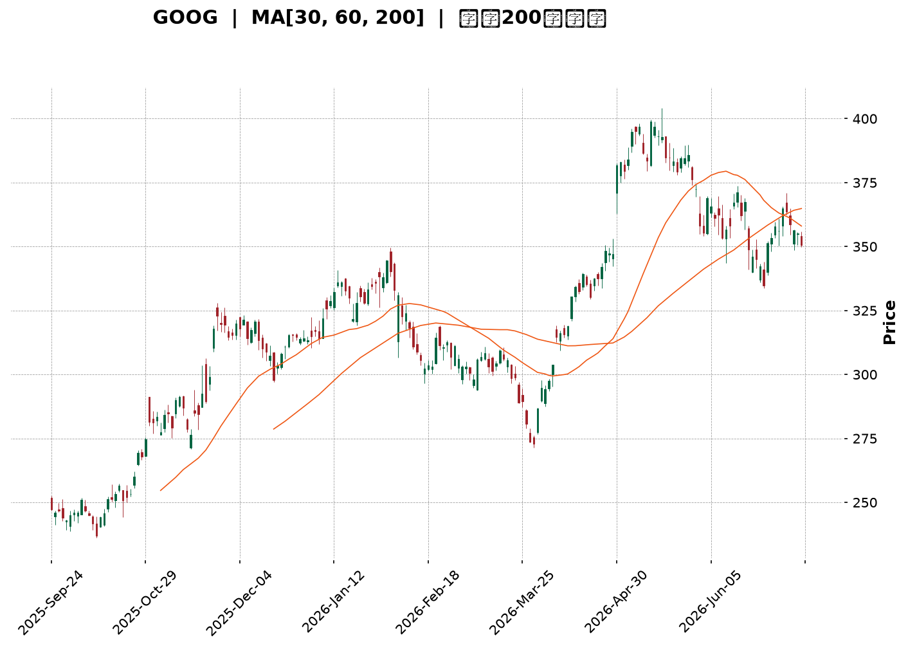
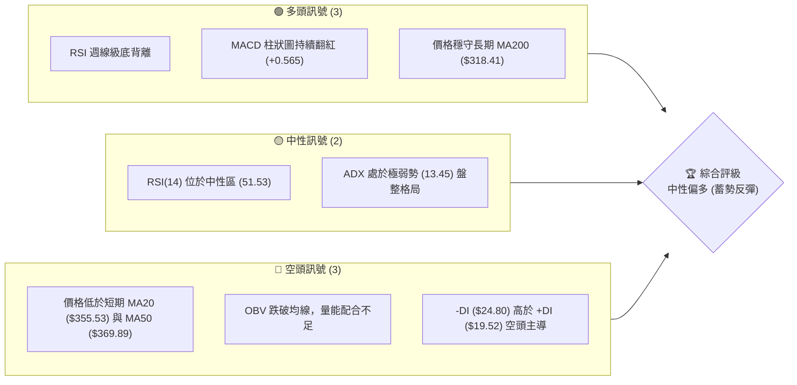
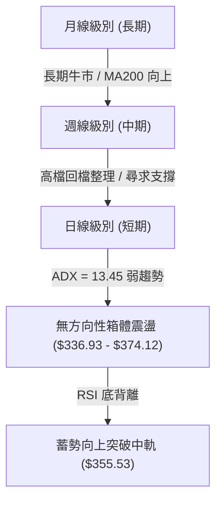
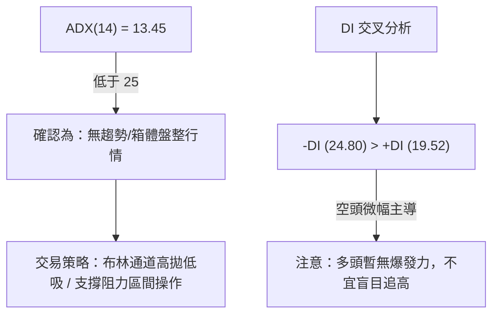
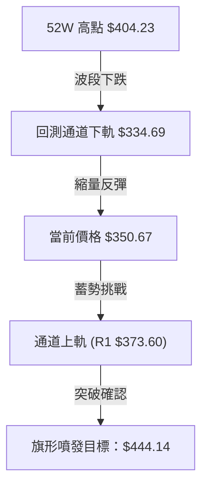
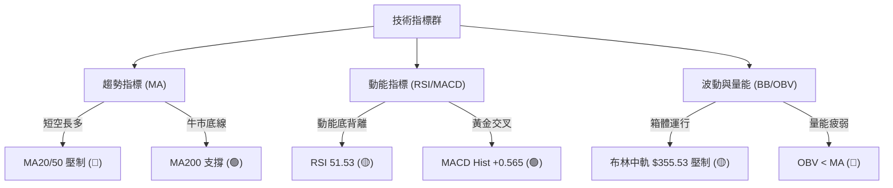
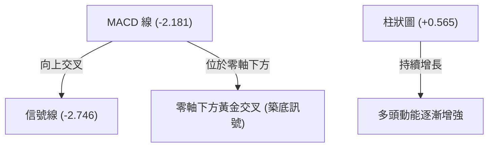
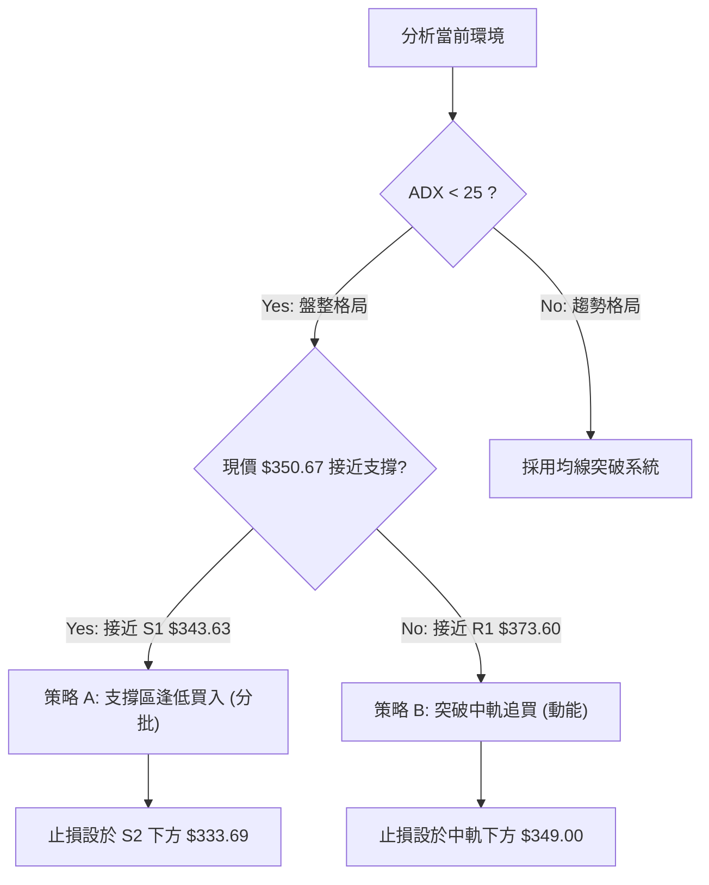
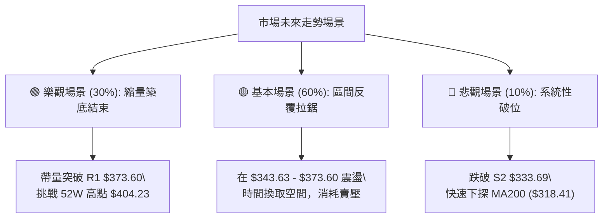

<details>
<summary>📊 靜態圖表 (點擊展開)</summary>

</details>

<html>
<head><meta charset="utf-8" /></head>
<body>
    <div style="height:500px; width:100%;">                        <script>window.PlotlyConfig = {MathJaxConfig: 'local'};</script>
        <script charset="utf-8" src="https://cdn.plot.ly/plotly-3.7.0.min.js" integrity="sha256-jvTGqxNp8AGWEcvNLVuKr+8j5dGe9Yw51LQkmDH+IYA=" crossorigin="anonymous"></script>                <div id="candlestick-chart" class="plotly-graph-div" style="height:100%; width:100%;"></div>            <script>                window.PLOTLYENV=window.PLOTLYENV || {};                                if (document.getElementById("candlestick-chart")) {                    Plotly.newPlot(                        "candlestick-chart",                        [{"close":{"dtype":"f8","bdata":"AAAAwAvrbkAAAAAgzsJuQAAAAGBJ1m5AAAAAQDl8bkAAAACgWmJuQAAAAMDooW5AAAAAYFW+bkAAAADg+L5uQAAAAGCTYG9AAAAAwLDUbkAAAADAWp9uQAAAAOCON25AAAAAYNCgbUAAAACAKoVuQAAAAGCrtm5AAAAAoPZmb0AAAACgZGxvQAAAAKBkqW9AAAAAYEYIcEAAAACgJVtvQAAAAAAngW9AAAAAAHqnb0AAAACgAUBwQAAAAGBu1nBAAAAAgHq+cEAAAACAGypxQAAAAKCTlXFAAAAAoEyUcUAAAADgBrlxQAAAAOBBWHFAAAAAgBbDcUAAAABAgsxxQAAAACBycnFAAAAAQFggckAAAABgtTJyQAAAAEDi7XFAAAAAAC9pcUAAAADgAkdxQAAAAECp0HFAAAAA4HDGcUAAAABgq0ZyQAAAAKCaFnJAAAAAYAWxckAAAABgjd1zQAAAAGAcMHRAAAAAoHT6c0AAAACg5vdzQAAAAIAOqHNAAAAAwG22c0AAAACA4v9zQAAAAGBG3HNAAAAA4FsXdEAAAACAoqBzQAAAAGBd1XNAAAAAIEwJdEAAAABgppRzQAAAAADWYXNAAAAAYKlOc0AAAAAgQTVzQAAAAIC8mnJAAAAAQKj1ckAAAADgUENzQAAAAGDHbnNAAAAAwEm0c0AAAADgILRzQAAAAIDIqHNAAAAAAK2fc0AAAABgO6JzQAAAAGA\u002flnNAAAAAIImuc0AAAACAfs5zQAAAAGA7onNAAAAAwCUgdEAAAABgWll0QAAAACBei3RAAAAAgLvEdEAAAADg2v90QAAAACDw\u002fXRAAAAAgJrLdEAAAADAip50QAAAAGDVG3RAAAAAIDl\u002fdEAAAAAgiKZ0QAAAAKAFgHRAAAAAYHnSdEAAAABAAel0QAAAAEB1\u002fXRAAAAAAH0jdUAAAABAaSF1QAAAAMAyh3VAAAAAABZEdUAAAADAes50QAAAAIBcrnRAAAAAgNoqdEAAAABAoD90QAAAAEBt43NAAAAAYMduc0AAAADgdU9zQAAAACDuGXNAAAAAIMzmckAAAACgsfhyQAAAACCf8nJAAAAAINOnc0AAAAAgiHRzQAAAAGA6aHNAAAAAgPGJc0AAAACA\u002fCtzQAAAAIBgcHNAAAAA4Fwfc0AAAAAgn\u002fJyQAAAACDd8HJAAAAA4EbIckAAAABAkp5yQAAAACA3HXNAAAAAIO0rc0AAAACAwENzQAAAACBx8HJAAAAAgHXUckAAAABgygNzQAAAACCVU3NAAAAAINohc0AAAADgvBhzQAAAAMDDqXJAAAAAQHGtckAAAADAahByQAAAACCnFnJAAAAAYCOJcUAAAACAhhlxQAAAAKCcD3FAAAAAwP\u002fqcUAAAADgj2tyQAAAAKCGZHJAAAAAALKXckAAAACA9PtyQAAAAKDPqHNAAAAAIODCc0AAAABAe7hzQAAAAMBJ8HNAAAAAQBmmdEAAAAAgTeR0QAAAAAAeyXRAAAAAQCIzdUAAAAAgLPN0QAAAAABXpHRAAAAAIG4YdUAAAADgvxh1QAAAAGDTYXVAAAAAQPfEdUAAAADgp7R1QAAAACCesXVAAAAAQF3bd0AAAAAA1e93QAAAAECWtndAAAAAIJ8AeEAAAAAAcK54QAAAAOD+sHhAAAAAoPrMeEAAAAAAmSh4QAAAACBt+XdAAAAAwMzseEAAAADg5c54QAAAAMBVkXhAAAAAAPqNeEAAAAAgsgp4QAAAACCyCnhAAAAAYNTzd0AAAADgbbJ3QAAAAIC8CXhAAAAAgJMJeEAAAABANB54QAAAAOBBg3dAAAAAwLFFd0AAAACAymJ2QAAAAAB1N3ZAAAAAIMQQd0AAAADgo9h2QAAAAGC4knZAAAAA4KOkdkAAAADAHhV2QAAAAMD1SHZAAAAAYI9idkAAAACAwvF2QAAAAKCZMXdAAAAAoJmhdkAAAAAgXPd2QAAAAOB6zHVAAAAAoEehdUAAAADgo5B1QAAAAEAKY3VAAAAAQArrdEAAAADgevR1QAAAAKBHFXZAAAAAgD1edkAAAABA4UJ2QAAAAGBmznZAAAAAgOu5dkAAAAAgXGt2QAAAAADXQ3ZAAAAA4HowdkAAAABguOp1QA=="},"high":{"dtype":"f8","bdata":"K5LgieKOb0AedKkvmdpuQJTzu8IuNG9AOqSvtftkb0CsdS+fWGZuQDWp+BJU1W5ASbB+cNHkbkAA5YBrTtRuQAYXTNGcdm9AbAlwi9phb0BeMn1n19huQLv3OmVjom5ALTmdt42LbkCBxCAkWJBuQO2jQzhG8W5AtiRtTH+Ib0C4HTTENxFwQGDNUYg0zG9ADo3TGwIWcEDBjKyiLNxvQC3PCJ7UCnBAAC+m3YDrb0CrNIaZ8V9wQOVtaudS5HBAAP0PHZbtcEAxTwLX4TZxQB0aOiK+NXJAlXc6eZnbcUCjYp0KF9ZxQHYiBAOGlHFAkjI9IDricUCqBA+S6wNyQCWgI2oYv3FA5NpyxzwuckD\u002fnDwxSjxyQOc8vv+bPHJAWxf\u002fUkmvcUDqOAm9qWlxQKmdSgcaX3JAacXVpOYNckD2PgwnevpyQGLyrIGiJHNAv\u002fIhl9j1ckDy+utXyvJzQM\u002fLoPJugHRAFk3XAqtFdEAc21V22WN0QEahslwT8HNA04LW06Dfc0BWWjt\u002fjxZ0QCMp1qR4J3RAvDft7iQzdEAKBbYi+Qx0QLINkV+w5HNAsGN6+TIXdEAwMKfPHRl0QLnmVJWju3NA+rTnzquEc0CO8r8gAndzQFI0mvqpTHNA3ZqPLckNc0BBrf9XY0lzQP3aoAWxdHNAtXKN7zG+c0DplIYPCb5zQBRxd5JZwnNAfjpahvGoc0DRFH0JkdRzQAC+L6Cnr3NADkuCh+EndECecOFuVe1zQKtsduc+EnRAB0p3jp9gdEB2qSYJvaF0QCA06j3CsHRAP5Dxew7gdEBOpYRgE0x1QCYWyGZxCXVA4ebuDgUbdUCvmnPu1ux0QN1Bne2WenRAlWwGBqfEdEDVEOhDXOx0QFULrFCB2XRAh7z5npP+dEC3H22wYBx1QJiji6gHE3VACjNXGH5ddUBvQYDXiD11QPBDWdVui3VAosjrmxbbdUAHNy3Oz3x1QPzG0rlbw3RA3D3tEVajdEAJQUUF\u002f3R0QE+5nzZdE3RAePY0MQQKdEDeSPl+EsFzQPb7tWjKR3NAMfp5z98Hc0Ahh0w4LBhzQCDYCwwXGnNANMq8zovFc0AemBz+m\u002fBzQI6Gzb9lf3NASlnVoQKUc0DLQozadolzQPxBhGbDenNAFNgnXM47c0BvLQCYsfhyQP9bZEH7EHNAw+io2ZXvckBzSClGAr9yQPQO+uoMJXNAAPvvx2xPc0D6ODg5HG5zQI9zVB9FR3NAz1xKFjQxc0D+rrDqLRZzQJdhYezQXXNAt11eaQJpc0CXSdKo7SdzQMdfrqD9AnNANbyuKADzckA6c26pvY5yQCG7JGK5Z3JA\u002fYXUpXvlcUBjASf+wG5xQDtKX3CAQXFA4nApiAnucUDM\u002fWRm5JxyQPk6u1ONe3JAms1\u002ffe2jckCTAcd0rP5yQDCJYqsq83NAkSCCQ9PTc0CqftHP7PRzQBQ0QVXO83NAGbIk+g6ndEAmWb2xxux0QLcsU0TVEnVABdsQ73w8dUAf+r\u002fcSy91QDe2iL55D3VAe3fPIjoddUBhd\u002flPST91QFLY7n+7d3VAuoj04gXrdUD1WFNWCNt1QOXWL7\u002f\u002fEnZAesfNzGXmd0B03cX0jPJ3QOmR0NAu\u002f3dAEBjo0Z1LeEDmNe\u002fxQ8J4QMWG6i\u002fb0XhAKTWJHxbieEB7AOgffKF4QBFviStSI3hAxcCs7gf7eEBbWzq80u14QNC4bTFFunhALZcxo6BDeUCVp3nGBZJ4QBHC\u002frVwZ3hAgdUJqiNHeEBUNJ9ZNwp4QFT3GQWIEnhAROaccNlXeEDkpPAwP1x4QGd81SO61ndAjmoHxv5ld0A2IanJFBl3QNpBw\u002fKCpHZAKrjkSzMad0BVWFympQ93QAAAAIAUtnZAAAAAYBIbd0AAAADA9eR2QAAAAAApYHZAAAAAQF7MdkAAAABgZip3QAAAAKCZWXdAAAAAYGYid0AAAAAAABB3QAAAAEAzY3ZAAAAAIIXLdUAAAACgRw12QAAAAEAKc3VAAAAAgOuBdUAAAAAghf91QAAAAIA9NnZAAAAAwPV4dkAAAAAA1492QAAAAEDh2nZAAAAAgD0ud0AAAAAgrs92QAAAACCuS3ZAAAAAQOE6dkAAAAAAADx2QA=="},"hovertemplate":"\u003cb\u003e%{x|%Y-%m-%d}\u003c\u002fb\u003e\u003cbr\u003e\u958b: $%{open:.2f}\u003cbr\u003e\u9ad8: $%{high:.2f}\u003cbr\u003e\u4f4e: $%{low:.2f}\u003cbr\u003e\u6536: $%{close:.2f}\u003cextra\u003e\u003c\u002fextra\u003e","low":{"dtype":"f8","bdata":"2X6PZpDXbkA\u002feFM4rCVuQJgeTmcKxW5A4WnOFi1XbkA3Q+5jRuNtQHDt1hlt121A\u002fEbCSCRUbkBsuRuI3D9uQLLYPkSzpm5A35fLYHjKbkCt6PqNiZNuQCIeW4vB5m1AHtpwphqHbUBML2n27QhuQPGP5lCZFm5AcmNZuNTJbkAa0u2jv0VvQApMjJRRA29AtgxaCEPDb0AD61TiH4ZuQI\u002fmxjDBPm9Ak2yRysCIb0D34O4rK\u002fNvQDyfwVu\u002fhnBAIDxquFuqcEBOP5pher5wQKywPB5sfnFAdEIqjq5PcUC3NWLsJH1xQFA2HLMsRXFA8gReC2JVcUDJ2cLuGpFxQKii5po1M3FAn14T\u002fcOvcUAurczNEfVxQJy6C\u002fAtvXFA9utieUxXcUAT+e3AEO5wQELbI7rIunFAD0SlbG1ncUDR8Ihgt\u002fFxQJ78fV2rCXJAtYoc44tcckDIKXdMt0xzQI4fA+ob03NASDqvrUXJc0Arw5TaHsVzQG3UbULalXNAuBYobK+Zc0CzkcOspJpzQCAwdO+Pr3NAHC0CSKr1c0DrKZMzDHhzQLXWhkxkg3NA8lEub9Cvc0CqhHQLnFdzQDuzpEfzKHNAuhPJwnQVc0B\u002fTxN57\u002fZyQOu4t0L9kHJA1K2xbc3DckDbQuWDIN9yQBWZkbYJI3NAjKaR2oJlc0CeYgbQk45zQLxa3iD4lHNAkXtRL+N3c0AKJemSdY1zQE9vbW2ufHNAryb7tuljc0BbIhqyZq1zQOQ4KhDrfnNA6oV4426hc0C4V\u002f7cHRl0QGL8vBIwXXRAawVK+FxRdEAm0VVent50QF9SYYJTq3RAxATy\u002fritdEBNkJQZ3nt0QKWAzkmKB3RAhQE2wffxc0C3dCN6Nod0QIurefWreHRAjBLAWwBxdECsMZHuB9V0QF6VLQ8lu3RAM8Hik7JkdEDAxTFcS8N0QAMWO+Uk+XRAgeOBp14idUCHOMLYCo90QCAYyrtPKHNA\u002fpDsBLf7c0AqR9DwkNRzQM1dyFj9o3NA68olqppbc0DtFGVF9ztzQH8i9vQN+HJABLu7ZDOIckCoAgH6X9lyQMC2qDJxxHJA1GrmJF0Ac0Do31v2XVlzQEY5iXEMG3NA6SpxvkxPc0CR4XLWPuByQBxlQecd83JAZa+odKzKckBw5Jcs\u002fYRyQCmKfsqExnJAnTpabuWackBD\u002fJXN1W1yQODchyINXHJAl+SpnQUSc0AljUcbfxpzQA5uvHaLynJAwG13Y5i5ckD0HSguDtpyQDvxMderAnNAJu8pnMcVc0DIzFdnGs1yQJ0kpOYkiXJAjoxVsJydckBcGJh55gpyQHhdPngn83FASBnYSR1ucUD8Z5tQDBVxQBWfM3Ty9XBARrc+In9JcUBV14UAvBRyQMW0yzla9nFAZA3vCNBZckACWN3z9HNyQPqpaENFiHNAWTmCv4pUc0CIk0PonKVzQFktOHkFmHNAmGgEO08PdEDE2kGwZYd0QKcaakI1t3RAQ\u002f9bzW7RdEBg85cl3OZ0QAWzwXHolnRAtsQ\u002f4CfMdEBZ\u002fZ9AvO10QKPg97+V3XRAYuicHq5JdUBiOtquKoF1QO5ps6WVY3VA8kYEEfKtdkChTll8jHB3QIoYA7KxiHdA\u002f5dsiPDBd0CFj9vu3y14QPbdIys0YXhAt56Vk+6WeED3epCU9h94QN2d7Jndt3dArmlGhJvVd0Dw8ZZR3od4QGqSQ8VoWHhAU6jZUaNqeEC15k1uUOx3QGurXtJXvHdAJoyANAe0d0DGOVkihaB3QKLY\u002f2qXrndAZurt2FLcd0Dvhm6\u002fVNB3QGyeW58yYXdAoAEHUs0Xd0CJszBalSx2QIgX4HOrInZATOsgpmIpdkCUbNSMmZZ2QAAAAIA9XnZAAAAAIIUrdkAAAADA9Qx2QAAAAIAUenVAAAAAoHAVdkAAAABgZsp2QAAAAMAe1XZAAAAAIK6DdkAAAABgukl2QAAAAEAKT3VAAAAAoHA7dUAAAAAAAFh1QAAAAGBm\u002fnRAAAAAQArbdEAAAADA9Sx1QAAAAIDCwXVAAAAAIK4TdkAAAADAHuV1QAAAAEAKI3ZAAAAAYLimdkAAAABAMyt2QAAAAGCPynVAAAAAQDPrdUAAAACgcN11QA=="},"name":"\u50f9\u683c","open":{"dtype":"f8","bdata":"r6j\u002f5AN1b0DxH1yZjYtuQG859u2b6W5AqWIbI0L5bkC\u002ffEFatFJuQBzZ536pFm5AyAzwaBqlbkAp4RstAphuQEwrChOTqW5AGeC+Zy0Ob0C4Oyrk\u002fLZuQNxN8VOUkm5AzefvKfY1bkBFAr053xFuQC3oz\u002fEGKW5AdeKOtzDzbkDH3SGAE39vQPhZ11l3W29A1Pa4z2HXb0B8Nv63BdhvQCWZLGJb0G9AXvARu4Smb0Arx4QYvwxwQNlbQz50jXBARpVpUb7acEAakmMwWsFwQC9p97BjMnJAH9YTZ2qqcUB0JS1f4Z1xQPkq3FheSHFAobelBlZtcUCUasT10NJxQMQlA912unFAZ261yk\u002fLcUBgVWL9LfpxQI90zdM3OHJApXvzB+emcUDJrSZez\u002fVwQLq9D5dv3XFAs8iBAbv+cUDGhcyh9PFxQBRV3ztNAnNAGnd2xqCEckDcN\u002f0FbWZzQCRXXU6SYnRA5rtlnnACdEDtCcPawSx0QN1JNcGpzXNAY2TsMnvEc0BKax6nlrZzQOCpkvObJnRADMkB\u002f\u002fv1c0BP5GT0xgl0QFH0ntsPi3NAWs+zCU\u002fDc0CwQYsx5Qp0QGme4qUlpnNAbayM9XiDc0Dv3Xg\u002fnBlzQG3WwTe1SXNA3ZpDsKHqckC0iUnL\u002fO1yQGXTqe8ZbXNAkmOxy6lrc0BNYyNPzLtzQBpAQZ4fuHNAFq5hpJaGc0C+9vUXBJBzQOVXaGxgj3NA6rR83c7Sc0CwwtN+fNRzQNHWL59VznNA5xKsQ42ic0C1L9p5XY10QLLg6nEAcXRAPLiGrS5hdED7XrKleu10QHrUFvXD6HRAIOmUNdIZdUBmCNRP9+d0QLWu6eohDXRA7q5CsdAKdEBE6A2xQt10QEtrSqqIw3RA7AgZ0Fh8dEBXEt5hEvN0QKOgaxy7AnVAUZQ7N34+dUA7EKJBYOB0QCZsUMLFAXVAGxZaefbAdUDd0o3z5nR1QIJZ7wmpjHNAzNEdyMNudEAGmWnEIQ10QDF16u\u002fbB3RAHxKDFrPoc0BgcEkSFH9zQL3NIj9UOXNAmgUGh\u002fbDckC+BIHvmOByQFE\u002fJs8A4nJAyZDwfG8Gc0DweyGNk+tzQFSSKP\u002fAY3NAI91Y\u002fWZ7c0Bh8mclWYZzQCQMq4mx+HJA+3rNJR3pckC1D5A5faByQAFv57aj5HJAxj5Fgt7sckDcM8dI+HpyQHdtO2FUX3JAtg5XeQ4bc0Ac1iYZ2iFzQHDW7LtpIHNA7EjVc4cnc0CXTy+lrfZyQForYM3JB3NAjGi3S4Q7c0A\u002fZHEVcfByQOV04p0x\u002fnJAaZi3h5bFckDoucRagoByQGmdTpGWP3JAwb7OMkngcUAzuBvoulNxQF62grVjNHFAHflIFvhVcUDkPuC+4xxyQPt7J\u002foODXJAJ+T2Kl1ockDwNzsWWr9yQDIVPqM42nNATp55tQaQc0AcxQCUieBzQIkNLVavs3NAZ8P32fAddEBqa\u002fdhx6V0QD5JVyle+nRAcgZpXqnjdECzzCS3syV1QLgOJ2Yh9nRAh744AvDqdEAL+O+g7jV1QNXWQhVFGHVAogBkTsV6dUCoD8ytYat1QAzRIAJblHVAZUg104Ewd0Cio9noCpx3QJiO1eVw4XdAaVq7qT7ad0AjzmnMsFV4QH1z+okjzXhAm441mYageEAOVaW3R2d4QFecw3dLDHhA4g9J983ad0AJycaz2Zh4QCnKOuKnj3hAAu477Tl+eEAXbzjOA5F4QFLCsUfvDHhAP3zS2Hvcd0ALPP7QePB3QENwDtlAzHdAdVRrdo7od0CJjlrREPp3QInT3W\u002fuz3dARx8jY51Fd0CmfGqfEK92QHcbjFXpYXZAyc95kp4zdkCM8xY9lbJ2QAAAAIDCp3ZAAAAAACnOdkAAAADAzJB2QAAAAMDMEHZAAAAAoJmRdkAAAAAA1992QAAAAKBw93ZAAAAAwMzwdkAAAACAPb52QAAAAAApUnZAAAAAIK5BdUAAAAAghct1QAAAAGC4DnVAAAAAIK5PdUAAAABAMz91QAAAACBc73VAAAAAANcpdkAAAABgZkJ2QAAAAMAeY3ZAAAAAgMLzdkAAAAAgXKN2QAAAACBc8XVAAAAAoEMvdkAAAAAA1x92QA=="},"x":["2025-09-24T00:00:00-04:00","2025-09-25T00:00:00-04:00","2025-09-26T00:00:00-04:00","2025-09-29T00:00:00-04:00","2025-09-30T00:00:00-04:00","2025-10-01T00:00:00-04:00","2025-10-02T00:00:00-04:00","2025-10-03T00:00:00-04:00","2025-10-06T00:00:00-04:00","2025-10-07T00:00:00-04:00","2025-10-08T00:00:00-04:00","2025-10-09T00:00:00-04:00","2025-10-10T00:00:00-04:00","2025-10-13T00:00:00-04:00","2025-10-14T00:00:00-04:00","2025-10-15T00:00:00-04:00","2025-10-16T00:00:00-04:00","2025-10-17T00:00:00-04:00","2025-10-20T00:00:00-04:00","2025-10-21T00:00:00-04:00","2025-10-22T00:00:00-04:00","2025-10-23T00:00:00-04:00","2025-10-24T00:00:00-04:00","2025-10-27T00:00:00-04:00","2025-10-28T00:00:00-04:00","2025-10-29T00:00:00-04:00","2025-10-30T00:00:00-04:00","2025-10-31T00:00:00-04:00","2025-11-03T00:00:00-05:00","2025-11-04T00:00:00-05:00","2025-11-05T00:00:00-05:00","2025-11-06T00:00:00-05:00","2025-11-07T00:00:00-05:00","2025-11-10T00:00:00-05:00","2025-11-11T00:00:00-05:00","2025-11-12T00:00:00-05:00","2025-11-13T00:00:00-05:00","2025-11-14T00:00:00-05:00","2025-11-17T00:00:00-05:00","2025-11-18T00:00:00-05:00","2025-11-19T00:00:00-05:00","2025-11-20T00:00:00-05:00","2025-11-21T00:00:00-05:00","2025-11-24T00:00:00-05:00","2025-11-25T00:00:00-05:00","2025-11-26T00:00:00-05:00","2025-11-28T00:00:00-05:00","2025-12-01T00:00:00-05:00","2025-12-02T00:00:00-05:00","2025-12-03T00:00:00-05:00","2025-12-04T00:00:00-05:00","2025-12-05T00:00:00-05:00","2025-12-08T00:00:00-05:00","2025-12-09T00:00:00-05:00","2025-12-10T00:00:00-05:00","2025-12-11T00:00:00-05:00","2025-12-12T00:00:00-05:00","2025-12-15T00:00:00-05:00","2025-12-16T00:00:00-05:00","2025-12-17T00:00:00-05:00","2025-12-18T00:00:00-05:00","2025-12-19T00:00:00-05:00","2025-12-22T00:00:00-05:00","2025-12-23T00:00:00-05:00","2025-12-24T00:00:00-05:00","2025-12-26T00:00:00-05:00","2025-12-29T00:00:00-05:00","2025-12-30T00:00:00-05:00","2025-12-31T00:00:00-05:00","2026-01-02T00:00:00-05:00","2026-01-05T00:00:00-05:00","2026-01-06T00:00:00-05:00","2026-01-07T00:00:00-05:00","2026-01-08T00:00:00-05:00","2026-01-09T00:00:00-05:00","2026-01-12T00:00:00-05:00","2026-01-13T00:00:00-05:00","2026-01-14T00:00:00-05:00","2026-01-15T00:00:00-05:00","2026-01-16T00:00:00-05:00","2026-01-20T00:00:00-05:00","2026-01-21T00:00:00-05:00","2026-01-22T00:00:00-05:00","2026-01-23T00:00:00-05:00","2026-01-26T00:00:00-05:00","2026-01-27T00:00:00-05:00","2026-01-28T00:00:00-05:00","2026-01-29T00:00:00-05:00","2026-01-30T00:00:00-05:00","2026-02-02T00:00:00-05:00","2026-02-03T00:00:00-05:00","2026-02-04T00:00:00-05:00","2026-02-05T00:00:00-05:00","2026-02-06T00:00:00-05:00","2026-02-09T00:00:00-05:00","2026-02-10T00:00:00-05:00","2026-02-11T00:00:00-05:00","2026-02-12T00:00:00-05:00","2026-02-13T00:00:00-05:00","2026-02-17T00:00:00-05:00","2026-02-18T00:00:00-05:00","2026-02-19T00:00:00-05:00","2026-02-20T00:00:00-05:00","2026-02-23T00:00:00-05:00","2026-02-24T00:00:00-05:00","2026-02-25T00:00:00-05:00","2026-02-26T00:00:00-05:00","2026-02-27T00:00:00-05:00","2026-03-02T00:00:00-05:00","2026-03-03T00:00:00-05:00","2026-03-04T00:00:00-05:00","2026-03-05T00:00:00-05:00","2026-03-06T00:00:00-05:00","2026-03-09T00:00:00-04:00","2026-03-10T00:00:00-04:00","2026-03-11T00:00:00-04:00","2026-03-12T00:00:00-04:00","2026-03-13T00:00:00-04:00","2026-03-16T00:00:00-04:00","2026-03-17T00:00:00-04:00","2026-03-18T00:00:00-04:00","2026-03-19T00:00:00-04:00","2026-03-20T00:00:00-04:00","2026-03-23T00:00:00-04:00","2026-03-24T00:00:00-04:00","2026-03-25T00:00:00-04:00","2026-03-26T00:00:00-04:00","2026-03-27T00:00:00-04:00","2026-03-30T00:00:00-04:00","2026-03-31T00:00:00-04:00","2026-04-01T00:00:00-04:00","2026-04-02T00:00:00-04:00","2026-04-06T00:00:00-04:00","2026-04-07T00:00:00-04:00","2026-04-08T00:00:00-04:00","2026-04-09T00:00:00-04:00","2026-04-10T00:00:00-04:00","2026-04-13T00:00:00-04:00","2026-04-14T00:00:00-04:00","2026-04-15T00:00:00-04:00","2026-04-16T00:00:00-04:00","2026-04-17T00:00:00-04:00","2026-04-20T00:00:00-04:00","2026-04-21T00:00:00-04:00","2026-04-22T00:00:00-04:00","2026-04-23T00:00:00-04:00","2026-04-24T00:00:00-04:00","2026-04-27T00:00:00-04:00","2026-04-28T00:00:00-04:00","2026-04-29T00:00:00-04:00","2026-04-30T00:00:00-04:00","2026-05-01T00:00:00-04:00","2026-05-04T00:00:00-04:00","2026-05-05T00:00:00-04:00","2026-05-06T00:00:00-04:00","2026-05-07T00:00:00-04:00","2026-05-08T00:00:00-04:00","2026-05-11T00:00:00-04:00","2026-05-12T00:00:00-04:00","2026-05-13T00:00:00-04:00","2026-05-14T00:00:00-04:00","2026-05-15T00:00:00-04:00","2026-05-18T00:00:00-04:00","2026-05-19T00:00:00-04:00","2026-05-20T00:00:00-04:00","2026-05-21T00:00:00-04:00","2026-05-22T00:00:00-04:00","2026-05-26T00:00:00-04:00","2026-05-27T00:00:00-04:00","2026-05-28T00:00:00-04:00","2026-05-29T00:00:00-04:00","2026-06-01T00:00:00-04:00","2026-06-02T00:00:00-04:00","2026-06-03T00:00:00-04:00","2026-06-04T00:00:00-04:00","2026-06-05T00:00:00-04:00","2026-06-08T00:00:00-04:00","2026-06-09T00:00:00-04:00","2026-06-10T00:00:00-04:00","2026-06-11T00:00:00-04:00","2026-06-12T00:00:00-04:00","2026-06-15T00:00:00-04:00","2026-06-16T00:00:00-04:00","2026-06-17T00:00:00-04:00","2026-06-18T00:00:00-04:00","2026-06-22T00:00:00-04:00","2026-06-23T00:00:00-04:00","2026-06-24T00:00:00-04:00","2026-06-25T00:00:00-04:00","2026-06-26T00:00:00-04:00","2026-06-29T00:00:00-04:00","2026-06-30T00:00:00-04:00","2026-07-01T00:00:00-04:00","2026-07-02T00:00:00-04:00","2026-07-06T00:00:00-04:00","2026-07-07T00:00:00-04:00","2026-07-08T00:00:00-04:00","2026-07-09T00:00:00-04:00","2026-07-10T00:00:00-04:00","2026-07-13T00:00:00-04:00"],"type":"candlestick"},{"hovertemplate":"MA30: $%{y:.2f}\u003cextra\u003e\u003c\u002fextra\u003e","line":{"color":"#2196F3","dash":"dash","width":2},"mode":"lines","name":"MA30","x":["2025-09-24T00:00:00-04:00","2025-09-25T00:00:00-04:00","2025-09-26T00:00:00-04:00","2025-09-29T00:00:00-04:00","2025-09-30T00:00:00-04:00","2025-10-01T00:00:00-04:00","2025-10-02T00:00:00-04:00","2025-10-03T00:00:00-04:00","2025-10-06T00:00:00-04:00","2025-10-07T00:00:00-04:00","2025-10-08T00:00:00-04:00","2025-10-09T00:00:00-04:00","2025-10-10T00:00:00-04:00","2025-10-13T00:00:00-04:00","2025-10-14T00:00:00-04:00","2025-10-15T00:00:00-04:00","2025-10-16T00:00:00-04:00","2025-10-17T00:00:00-04:00","2025-10-20T00:00:00-04:00","2025-10-21T00:00:00-04:00","2025-10-22T00:00:00-04:00","2025-10-23T00:00:00-04:00","2025-10-24T00:00:00-04:00","2025-10-27T00:00:00-04:00","2025-10-28T00:00:00-04:00","2025-10-29T00:00:00-04:00","2025-10-30T00:00:00-04:00","2025-10-31T00:00:00-04:00","2025-11-03T00:00:00-05:00","2025-11-04T00:00:00-05:00","2025-11-05T00:00:00-05:00","2025-11-06T00:00:00-05:00","2025-11-07T00:00:00-05:00","2025-11-10T00:00:00-05:00","2025-11-11T00:00:00-05:00","2025-11-12T00:00:00-05:00","2025-11-13T00:00:00-05:00","2025-11-14T00:00:00-05:00","2025-11-17T00:00:00-05:00","2025-11-18T00:00:00-05:00","2025-11-19T00:00:00-05:00","2025-11-20T00:00:00-05:00","2025-11-21T00:00:00-05:00","2025-11-24T00:00:00-05:00","2025-11-25T00:00:00-05:00","2025-11-26T00:00:00-05:00","2025-11-28T00:00:00-05:00","2025-12-01T00:00:00-05:00","2025-12-02T00:00:00-05:00","2025-12-03T00:00:00-05:00","2025-12-04T00:00:00-05:00","2025-12-05T00:00:00-05:00","2025-12-08T00:00:00-05:00","2025-12-09T00:00:00-05:00","2025-12-10T00:00:00-05:00","2025-12-11T00:00:00-05:00","2025-12-12T00:00:00-05:00","2025-12-15T00:00:00-05:00","2025-12-16T00:00:00-05:00","2025-12-17T00:00:00-05:00","2025-12-18T00:00:00-05:00","2025-12-19T00:00:00-05:00","2025-12-22T00:00:00-05:00","2025-12-23T00:00:00-05:00","2025-12-24T00:00:00-05:00","2025-12-26T00:00:00-05:00","2025-12-29T00:00:00-05:00","2025-12-30T00:00:00-05:00","2025-12-31T00:00:00-05:00","2026-01-02T00:00:00-05:00","2026-01-05T00:00:00-05:00","2026-01-06T00:00:00-05:00","2026-01-07T00:00:00-05:00","2026-01-08T00:00:00-05:00","2026-01-09T00:00:00-05:00","2026-01-12T00:00:00-05:00","2026-01-13T00:00:00-05:00","2026-01-14T00:00:00-05:00","2026-01-15T00:00:00-05:00","2026-01-16T00:00:00-05:00","2026-01-20T00:00:00-05:00","2026-01-21T00:00:00-05:00","2026-01-22T00:00:00-05:00","2026-01-23T00:00:00-05:00","2026-01-26T00:00:00-05:00","2026-01-27T00:00:00-05:00","2026-01-28T00:00:00-05:00","2026-01-29T00:00:00-05:00","2026-01-30T00:00:00-05:00","2026-02-02T00:00:00-05:00","2026-02-03T00:00:00-05:00","2026-02-04T00:00:00-05:00","2026-02-05T00:00:00-05:00","2026-02-06T00:00:00-05:00","2026-02-09T00:00:00-05:00","2026-02-10T00:00:00-05:00","2026-02-11T00:00:00-05:00","2026-02-12T00:00:00-05:00","2026-02-13T00:00:00-05:00","2026-02-17T00:00:00-05:00","2026-02-18T00:00:00-05:00","2026-02-19T00:00:00-05:00","2026-02-20T00:00:00-05:00","2026-02-23T00:00:00-05:00","2026-02-24T00:00:00-05:00","2026-02-25T00:00:00-05:00","2026-02-26T00:00:00-05:00","2026-02-27T00:00:00-05:00","2026-03-02T00:00:00-05:00","2026-03-03T00:00:00-05:00","2026-03-04T00:00:00-05:00","2026-03-05T00:00:00-05:00","2026-03-06T00:00:00-05:00","2026-03-09T00:00:00-04:00","2026-03-10T00:00:00-04:00","2026-03-11T00:00:00-04:00","2026-03-12T00:00:00-04:00","2026-03-13T00:00:00-04:00","2026-03-16T00:00:00-04:00","2026-03-17T00:00:00-04:00","2026-03-18T00:00:00-04:00","2026-03-19T00:00:00-04:00","2026-03-20T00:00:00-04:00","2026-03-23T00:00:00-04:00","2026-03-24T00:00:00-04:00","2026-03-25T00:00:00-04:00","2026-03-26T00:00:00-04:00","2026-03-27T00:00:00-04:00","2026-03-30T00:00:00-04:00","2026-03-31T00:00:00-04:00","2026-04-01T00:00:00-04:00","2026-04-02T00:00:00-04:00","2026-04-06T00:00:00-04:00","2026-04-07T00:00:00-04:00","2026-04-08T00:00:00-04:00","2026-04-09T00:00:00-04:00","2026-04-10T00:00:00-04:00","2026-04-13T00:00:00-04:00","2026-04-14T00:00:00-04:00","2026-04-15T00:00:00-04:00","2026-04-16T00:00:00-04:00","2026-04-17T00:00:00-04:00","2026-04-20T00:00:00-04:00","2026-04-21T00:00:00-04:00","2026-04-22T00:00:00-04:00","2026-04-23T00:00:00-04:00","2026-04-24T00:00:00-04:00","2026-04-27T00:00:00-04:00","2026-04-28T00:00:00-04:00","2026-04-29T00:00:00-04:00","2026-04-30T00:00:00-04:00","2026-05-01T00:00:00-04:00","2026-05-04T00:00:00-04:00","2026-05-05T00:00:00-04:00","2026-05-06T00:00:00-04:00","2026-05-07T00:00:00-04:00","2026-05-08T00:00:00-04:00","2026-05-11T00:00:00-04:00","2026-05-12T00:00:00-04:00","2026-05-13T00:00:00-04:00","2026-05-14T00:00:00-04:00","2026-05-15T00:00:00-04:00","2026-05-18T00:00:00-04:00","2026-05-19T00:00:00-04:00","2026-05-20T00:00:00-04:00","2026-05-21T00:00:00-04:00","2026-05-22T00:00:00-04:00","2026-05-26T00:00:00-04:00","2026-05-27T00:00:00-04:00","2026-05-28T00:00:00-04:00","2026-05-29T00:00:00-04:00","2026-06-01T00:00:00-04:00","2026-06-02T00:00:00-04:00","2026-06-03T00:00:00-04:00","2026-06-04T00:00:00-04:00","2026-06-05T00:00:00-04:00","2026-06-08T00:00:00-04:00","2026-06-09T00:00:00-04:00","2026-06-10T00:00:00-04:00","2026-06-11T00:00:00-04:00","2026-06-12T00:00:00-04:00","2026-06-15T00:00:00-04:00","2026-06-16T00:00:00-04:00","2026-06-17T00:00:00-04:00","2026-06-18T00:00:00-04:00","2026-06-22T00:00:00-04:00","2026-06-23T00:00:00-04:00","2026-06-24T00:00:00-04:00","2026-06-25T00:00:00-04:00","2026-06-26T00:00:00-04:00","2026-06-29T00:00:00-04:00","2026-06-30T00:00:00-04:00","2026-07-01T00:00:00-04:00","2026-07-02T00:00:00-04:00","2026-07-06T00:00:00-04:00","2026-07-07T00:00:00-04:00","2026-07-08T00:00:00-04:00","2026-07-09T00:00:00-04:00","2026-07-10T00:00:00-04:00","2026-07-13T00:00:00-04:00"],"y":{"dtype":"f8","bdata":"AAAAAAAA+H8AAAAAAAD4fwAAAAAAAPh\u002fAAAAAAAA+H8AAAAAAAD4fwAAAAAAAPh\u002fAAAAAAAA+H8AAAAAAAD4fwAAAAAAAPh\u002fAAAAAAAA+H8AAAAAAAD4fwAAAAAAAPh\u002fAAAAAAAA+H8AAAAAAAD4fwAAAAAAAPh\u002fAAAAAAAA+H8AAAAAAAD4fwAAAAAAAPh\u002fAAAAAAAA+H8AAAAAAAD4fwAAAAAAAPh\u002fAAAAAAAA+H8AAAAAAAD4fwAAAAAAAPh\u002fAAAAAAAA+H8AAAAAAAD4fwAAAAAAAPh\u002fAAAAAAAA+H8AAAAAAAD4fzMzM4PO1G9AvLu7axz8b0AAAABAsRJwQJqZmaEAJHBAAAAAOJw8cEAzMzPjQlZwQFVVVRWPbHBAiYiIoPV9cEB3d3fXNY5wQBERESlboHBAREREHH60cEAAAADYys1wQImIiEg453BA7+7ulk4IcUCJiIggmy9xQDMzM\u002fPUWHFAIiIiulR9cUCamZmJp6FxQGZmZr5MwnFAzczMdLThcUCrqqr6lAZyQJqZmXmjKXJAMzMzowZOckDNzMzM2GpyQM3MzExphHJAq6qqWoGgckBVVVWVH7VyQBERESF3xHJARERE9DXTckAAAACQ4t9yQCIiImKi6nJAERERcdr0ckC8u7vLWAFzQCIiIpJKEnNA3t3djcEfc0CJiIh4mixzQBEREeFdO3NAIiIi8j9Oc0De3d1tW2JzQImIiAh6cXNAvLu7G7+Bc0De3d2tzo5zQERERLT+m3NAREREhDuoc0AzMzPzW6xzQM3MzKxmr3NAVVVVxSS2c0De3d0t8b5zQBEREZFWynNAq6qqypPTc0Crqqqq3dhzQImIiAj82nNAd3d3V3Lec0AiIiIyLedzQImIiHjd7HNA3t3dLZLzc0CrqqqK6v5zQM3MzAyjDHRAREREtEMcdEARERFxqyx0QBEREVGeRXRAREREpExZdEBERES0eGZ0QO\u002fu7s4fcXRAERERkRN1dEAiIiLyuXl0QO\u002fu7l6ue3RA3t3dHQ16dEDNzMzMSnd0QFVVVfUlc3RAZmZmhn1sdECJiIgYXWV0QN7d3Y2CX3RAzczMzH9bdEAREREx31N0QM3MzMwqSnRAmpmZmaw\u002fdEDv7u4eFDB0QJqZmZnTInRAd3d3R40UdEARERGxSQZ0QLy7u3tS\u002fHNA7+7uzrDtc0AAAADQW9xzQBERESGI0HNAMzMzY3LCc0AiIiKyZ7RzQO\u002fu7o7nonNAvLu7GzSPc0B3d3dHJn1zQCIiIsJcanNAAAAAkCdYc0CrqqoqkElzQAAAAOBXOHNAq6qqKqErc0AAAABA\u002fRhzQAAAAFChCXNA3t3dLXH5ckDe3d3dk+ZyQAAAAMAq1XJAIiIiEsbMckDv7u6+EchyQCIiIjJVw3JAZmZmBkO6ckCrqqoaPrZyQGZmZjZluHJAiYiICEu6ckDNzMzs+b5yQO\u002fu7m49w3JAZmZmtkPQckBERESU2uByQJqZmXmY8HJAMzMzYzkFc0AiIiJiHBlzQKuqqvolJnNA3t3drZA2c0CrqqrKMkZzQGZmZmYLW3NAq6qqyiB0c0C8u7sbF4tzQLy7u5tKn3NAd3d3x5vHc0AiIiJi6fBzQHd3d3cBHHRA3t3d7XFJdEAiIiKS6YF0QERERNRBunRAiYiIeED4dEAiIiLSfDR1QM3MzDx7b3VAZmZmVkardUBEREQ0yeF1QGZmZsZ6FnZAq6qqCltJdkDv7u5+g3R2QJqZmenomXZAmpmZyay9dkBmZmZGm992QBEREZGWAndAq6qqCoEfd0Dv7u6+CDt3QFVVVTVOUndAiYiIqP1jd0C8u7urPnB3QKuqqpqufXdAVVVVRX6Od0BVVVVFbJ13QJqZmQmWp3dAmpmZuQqvd0AzMzPjQbJ3QHd3d1dNt3dAIiIi8r2qd0DNzMzcRaJ3QKuqqgrXnXdAiYiIqCOSd0DNzMzcgIN3QLy7u8vRandAvLu7S8NPd0BmZmaGoTl3QJqZmSmNI3dAMzMzA1wBd0DNzMwcA+l2QBEREXHP03ZAZmZmBifBdkBVVVVl9bF2QGZmZlZqp3ZAREREpPOcdkBmZmamDJJ2QGZmZmbrgnZAAAAAUCZzdkCrqqrqXWB2QA=="},"type":"scatter"},{"hovertemplate":"MA60: $%{y:.2f}\u003cextra\u003e\u003c\u002fextra\u003e","line":{"color":"#9C27B0","dash":"dash","width":2},"mode":"lines","name":"MA60","x":["2025-09-24T00:00:00-04:00","2025-09-25T00:00:00-04:00","2025-09-26T00:00:00-04:00","2025-09-29T00:00:00-04:00","2025-09-30T00:00:00-04:00","2025-10-01T00:00:00-04:00","2025-10-02T00:00:00-04:00","2025-10-03T00:00:00-04:00","2025-10-06T00:00:00-04:00","2025-10-07T00:00:00-04:00","2025-10-08T00:00:00-04:00","2025-10-09T00:00:00-04:00","2025-10-10T00:00:00-04:00","2025-10-13T00:00:00-04:00","2025-10-14T00:00:00-04:00","2025-10-15T00:00:00-04:00","2025-10-16T00:00:00-04:00","2025-10-17T00:00:00-04:00","2025-10-20T00:00:00-04:00","2025-10-21T00:00:00-04:00","2025-10-22T00:00:00-04:00","2025-10-23T00:00:00-04:00","2025-10-24T00:00:00-04:00","2025-10-27T00:00:00-04:00","2025-10-28T00:00:00-04:00","2025-10-29T00:00:00-04:00","2025-10-30T00:00:00-04:00","2025-10-31T00:00:00-04:00","2025-11-03T00:00:00-05:00","2025-11-04T00:00:00-05:00","2025-11-05T00:00:00-05:00","2025-11-06T00:00:00-05:00","2025-11-07T00:00:00-05:00","2025-11-10T00:00:00-05:00","2025-11-11T00:00:00-05:00","2025-11-12T00:00:00-05:00","2025-11-13T00:00:00-05:00","2025-11-14T00:00:00-05:00","2025-11-17T00:00:00-05:00","2025-11-18T00:00:00-05:00","2025-11-19T00:00:00-05:00","2025-11-20T00:00:00-05:00","2025-11-21T00:00:00-05:00","2025-11-24T00:00:00-05:00","2025-11-25T00:00:00-05:00","2025-11-26T00:00:00-05:00","2025-11-28T00:00:00-05:00","2025-12-01T00:00:00-05:00","2025-12-02T00:00:00-05:00","2025-12-03T00:00:00-05:00","2025-12-04T00:00:00-05:00","2025-12-05T00:00:00-05:00","2025-12-08T00:00:00-05:00","2025-12-09T00:00:00-05:00","2025-12-10T00:00:00-05:00","2025-12-11T00:00:00-05:00","2025-12-12T00:00:00-05:00","2025-12-15T00:00:00-05:00","2025-12-16T00:00:00-05:00","2025-12-17T00:00:00-05:00","2025-12-18T00:00:00-05:00","2025-12-19T00:00:00-05:00","2025-12-22T00:00:00-05:00","2025-12-23T00:00:00-05:00","2025-12-24T00:00:00-05:00","2025-12-26T00:00:00-05:00","2025-12-29T00:00:00-05:00","2025-12-30T00:00:00-05:00","2025-12-31T00:00:00-05:00","2026-01-02T00:00:00-05:00","2026-01-05T00:00:00-05:00","2026-01-06T00:00:00-05:00","2026-01-07T00:00:00-05:00","2026-01-08T00:00:00-05:00","2026-01-09T00:00:00-05:00","2026-01-12T00:00:00-05:00","2026-01-13T00:00:00-05:00","2026-01-14T00:00:00-05:00","2026-01-15T00:00:00-05:00","2026-01-16T00:00:00-05:00","2026-01-20T00:00:00-05:00","2026-01-21T00:00:00-05:00","2026-01-22T00:00:00-05:00","2026-01-23T00:00:00-05:00","2026-01-26T00:00:00-05:00","2026-01-27T00:00:00-05:00","2026-01-28T00:00:00-05:00","2026-01-29T00:00:00-05:00","2026-01-30T00:00:00-05:00","2026-02-02T00:00:00-05:00","2026-02-03T00:00:00-05:00","2026-02-04T00:00:00-05:00","2026-02-05T00:00:00-05:00","2026-02-06T00:00:00-05:00","2026-02-09T00:00:00-05:00","2026-02-10T00:00:00-05:00","2026-02-11T00:00:00-05:00","2026-02-12T00:00:00-05:00","2026-02-13T00:00:00-05:00","2026-02-17T00:00:00-05:00","2026-02-18T00:00:00-05:00","2026-02-19T00:00:00-05:00","2026-02-20T00:00:00-05:00","2026-02-23T00:00:00-05:00","2026-02-24T00:00:00-05:00","2026-02-25T00:00:00-05:00","2026-02-26T00:00:00-05:00","2026-02-27T00:00:00-05:00","2026-03-02T00:00:00-05:00","2026-03-03T00:00:00-05:00","2026-03-04T00:00:00-05:00","2026-03-05T00:00:00-05:00","2026-03-06T00:00:00-05:00","2026-03-09T00:00:00-04:00","2026-03-10T00:00:00-04:00","2026-03-11T00:00:00-04:00","2026-03-12T00:00:00-04:00","2026-03-13T00:00:00-04:00","2026-03-16T00:00:00-04:00","2026-03-17T00:00:00-04:00","2026-03-18T00:00:00-04:00","2026-03-19T00:00:00-04:00","2026-03-20T00:00:00-04:00","2026-03-23T00:00:00-04:00","2026-03-24T00:00:00-04:00","2026-03-25T00:00:00-04:00","2026-03-26T00:00:00-04:00","2026-03-27T00:00:00-04:00","2026-03-30T00:00:00-04:00","2026-03-31T00:00:00-04:00","2026-04-01T00:00:00-04:00","2026-04-02T00:00:00-04:00","2026-04-06T00:00:00-04:00","2026-04-07T00:00:00-04:00","2026-04-08T00:00:00-04:00","2026-04-09T00:00:00-04:00","2026-04-10T00:00:00-04:00","2026-04-13T00:00:00-04:00","2026-04-14T00:00:00-04:00","2026-04-15T00:00:00-04:00","2026-04-16T00:00:00-04:00","2026-04-17T00:00:00-04:00","2026-04-20T00:00:00-04:00","2026-04-21T00:00:00-04:00","2026-04-22T00:00:00-04:00","2026-04-23T00:00:00-04:00","2026-04-24T00:00:00-04:00","2026-04-27T00:00:00-04:00","2026-04-28T00:00:00-04:00","2026-04-29T00:00:00-04:00","2026-04-30T00:00:00-04:00","2026-05-01T00:00:00-04:00","2026-05-04T00:00:00-04:00","2026-05-05T00:00:00-04:00","2026-05-06T00:00:00-04:00","2026-05-07T00:00:00-04:00","2026-05-08T00:00:00-04:00","2026-05-11T00:00:00-04:00","2026-05-12T00:00:00-04:00","2026-05-13T00:00:00-04:00","2026-05-14T00:00:00-04:00","2026-05-15T00:00:00-04:00","2026-05-18T00:00:00-04:00","2026-05-19T00:00:00-04:00","2026-05-20T00:00:00-04:00","2026-05-21T00:00:00-04:00","2026-05-22T00:00:00-04:00","2026-05-26T00:00:00-04:00","2026-05-27T00:00:00-04:00","2026-05-28T00:00:00-04:00","2026-05-29T00:00:00-04:00","2026-06-01T00:00:00-04:00","2026-06-02T00:00:00-04:00","2026-06-03T00:00:00-04:00","2026-06-04T00:00:00-04:00","2026-06-05T00:00:00-04:00","2026-06-08T00:00:00-04:00","2026-06-09T00:00:00-04:00","2026-06-10T00:00:00-04:00","2026-06-11T00:00:00-04:00","2026-06-12T00:00:00-04:00","2026-06-15T00:00:00-04:00","2026-06-16T00:00:00-04:00","2026-06-17T00:00:00-04:00","2026-06-18T00:00:00-04:00","2026-06-22T00:00:00-04:00","2026-06-23T00:00:00-04:00","2026-06-24T00:00:00-04:00","2026-06-25T00:00:00-04:00","2026-06-26T00:00:00-04:00","2026-06-29T00:00:00-04:00","2026-06-30T00:00:00-04:00","2026-07-01T00:00:00-04:00","2026-07-02T00:00:00-04:00","2026-07-06T00:00:00-04:00","2026-07-07T00:00:00-04:00","2026-07-08T00:00:00-04:00","2026-07-09T00:00:00-04:00","2026-07-10T00:00:00-04:00","2026-07-13T00:00:00-04:00"],"y":{"dtype":"f8","bdata":"AAAAAAAA+H8AAAAAAAD4fwAAAAAAAPh\u002fAAAAAAAA+H8AAAAAAAD4fwAAAAAAAPh\u002fAAAAAAAA+H8AAAAAAAD4fwAAAAAAAPh\u002fAAAAAAAA+H8AAAAAAAD4fwAAAAAAAPh\u002fAAAAAAAA+H8AAAAAAAD4fwAAAAAAAPh\u002fAAAAAAAA+H8AAAAAAAD4fwAAAAAAAPh\u002fAAAAAAAA+H8AAAAAAAD4fwAAAAAAAPh\u002fAAAAAAAA+H8AAAAAAAD4fwAAAAAAAPh\u002fAAAAAAAA+H8AAAAAAAD4fwAAAAAAAPh\u002fAAAAAAAA+H8AAAAAAAD4fwAAAAAAAPh\u002fAAAAAAAA+H8AAAAAAAD4fwAAAAAAAPh\u002fAAAAAAAA+H8AAAAAAAD4fwAAAAAAAPh\u002fAAAAAAAA+H8AAAAAAAD4fwAAAAAAAPh\u002fAAAAAAAA+H8AAAAAAAD4fwAAAAAAAPh\u002fAAAAAAAA+H8AAAAAAAD4fwAAAAAAAPh\u002fAAAAAAAA+H8AAAAAAAD4fwAAAAAAAPh\u002fAAAAAAAA+H8AAAAAAAD4fwAAAAAAAPh\u002fAAAAAAAA+H8AAAAAAAD4fwAAAAAAAPh\u002fAAAAAAAA+H8AAAAAAAD4fwAAAAAAAPh\u002fAAAAAAAA+H8AAAAAAAD4f97d3dGEanFAd3d3U3R5cUDe3d0FBYpxQN7d3Zklm3FA7+7u4i6ucUDe3d2tbsFxQDMzM3v203FAVVVVyRrmcUCrqqqiSPhxQM3MzJjqCHJAAAAAnB4bckDv7u7CTC5yQGZmZn6bQXJAmpmZDUVYckDe3d2J+21yQAAAANAdhHJAvLu7v7yZckC8u7tbTLByQLy7u6dRxnJAvLu7H6TackCrqqpSue9yQBEREcFPAnNAVVVVfTwWc0B3d3f\u002fAilzQKuqqmKjOHNARERExAlKc0AAAAAQBVpzQO\u002fu7haNaHNARERE1Lx3c0CJiIgAR4ZzQJqZmVkgmHNAq6qqihOnc0AAAADA6LNzQImIiDC1wXNAd3d3j2rKc0BVVVU1KtNzQAAAACCG23NAAAAAiCbkc0BVVVUd0+xzQO\u002fu7v5P8nNAERERUR73c0AzMzPjFfpzQBEREaHA\u002fXNAiYiIqN0BdEAiIiKSHQB0QM3MzLzI\u002fHNAd3d3r+j6c0BmZmamgvdzQFVVVRWV9nNAERERiRD0c0De3d2tk+9zQCIiIkKn63NAMzMzkxHmc0ARERGBxOFzQM3MzMyy3nNAiYiISALbc0BmZmYeqdlzQN7d3U3F13NAAAAA6LvVc0BERETc6NRzQJqZmYn913NAIiIiGrrYc0B3d3dvBNhzQHd3d9e71HNA3t3dXVrQc0ARERGZW8lzQHd3d9enwnNA3t3dJb+5c0BVVVVV765zQKuqqloopHNAREREzKGcc0C8u7trt5ZzQAAAAOBrkXNAmpmZaeGKc0De3d2lDoVzQJqZmQFIgXNAERER0ft8c0De3d0Fh3dzQERERIQIc3NA7+7ufmhyc0CrqqoiknNzQKuqqnp1dnNAERERGXV5c0AREREZvHpzQN7d3Q1Xe3NAiYiIiIF8c0BmZmY+TX1zQKuqqnr5fnNAMzMzc6qBc0CamZmxHoRzQO\u002fu7q7ThHNAvLu7q+GPc0BmZmbGPJ1zQLy7u6ssqnNAREREjIm6c0ARERFpc81zQCIiIpLx4XNAMzMz09j4c0AAAABYiA10QGZmZv5SInRARERENAY8dECamZl57VR0QERERPznbHRAiYiICM+BdEDNzMzMYJV0QAAAABAnqXRAERER6fu7dECamZmZSs90QAAAAADq4nRAiYiIYOL3dECamZmp8Q11QHd3d1dzIXVA3t3dhZs0dUDv7u6GrUR1QKuqqkrqUXVAmpmZeYdidUAAAACIz3F1QAAAALhQgXVAIiIiwpWRdUB3d3d\u002frJ51QJqZmflLq3VAzczM3Cy5dUB3d3efl8l1QBEREUHs3HVAMzMzy8rtdUB3d3c3tQJ2QAAAANCJEnZAIiIi4gEkdkBEREQsDzd2QDMzMzOESXZAzczMLFFWdkCJiIgoZmV2QLy7uxsldXZAiYiICEGFdkAiIiJyPJN2QAAAAKCpoHZA7+7uNlCtdkBmZmb207h2QLy7u\u002fvAwnZAVVVVrVPJdkDNzMxUs812QA=="},"type":"scatter"},{"hovertemplate":"MA200: $%{y:.2f}\u003cextra\u003e\u003c\u002fextra\u003e","line":{"color":"#FF6F00","dash":"solid","width":2},"mode":"lines","name":"MA200","x":["2025-09-24T00:00:00-04:00","2025-09-25T00:00:00-04:00","2025-09-26T00:00:00-04:00","2025-09-29T00:00:00-04:00","2025-09-30T00:00:00-04:00","2025-10-01T00:00:00-04:00","2025-10-02T00:00:00-04:00","2025-10-03T00:00:00-04:00","2025-10-06T00:00:00-04:00","2025-10-07T00:00:00-04:00","2025-10-08T00:00:00-04:00","2025-10-09T00:00:00-04:00","2025-10-10T00:00:00-04:00","2025-10-13T00:00:00-04:00","2025-10-14T00:00:00-04:00","2025-10-15T00:00:00-04:00","2025-10-16T00:00:00-04:00","2025-10-17T00:00:00-04:00","2025-10-20T00:00:00-04:00","2025-10-21T00:00:00-04:00","2025-10-22T00:00:00-04:00","2025-10-23T00:00:00-04:00","2025-10-24T00:00:00-04:00","2025-10-27T00:00:00-04:00","2025-10-28T00:00:00-04:00","2025-10-29T00:00:00-04:00","2025-10-30T00:00:00-04:00","2025-10-31T00:00:00-04:00","2025-11-03T00:00:00-05:00","2025-11-04T00:00:00-05:00","2025-11-05T00:00:00-05:00","2025-11-06T00:00:00-05:00","2025-11-07T00:00:00-05:00","2025-11-10T00:00:00-05:00","2025-11-11T00:00:00-05:00","2025-11-12T00:00:00-05:00","2025-11-13T00:00:00-05:00","2025-11-14T00:00:00-05:00","2025-11-17T00:00:00-05:00","2025-11-18T00:00:00-05:00","2025-11-19T00:00:00-05:00","2025-11-20T00:00:00-05:00","2025-11-21T00:00:00-05:00","2025-11-24T00:00:00-05:00","2025-11-25T00:00:00-05:00","2025-11-26T00:00:00-05:00","2025-11-28T00:00:00-05:00","2025-12-01T00:00:00-05:00","2025-12-02T00:00:00-05:00","2025-12-03T00:00:00-05:00","2025-12-04T00:00:00-05:00","2025-12-05T00:00:00-05:00","2025-12-08T00:00:00-05:00","2025-12-09T00:00:00-05:00","2025-12-10T00:00:00-05:00","2025-12-11T00:00:00-05:00","2025-12-12T00:00:00-05:00","2025-12-15T00:00:00-05:00","2025-12-16T00:00:00-05:00","2025-12-17T00:00:00-05:00","2025-12-18T00:00:00-05:00","2025-12-19T00:00:00-05:00","2025-12-22T00:00:00-05:00","2025-12-23T00:00:00-05:00","2025-12-24T00:00:00-05:00","2025-12-26T00:00:00-05:00","2025-12-29T00:00:00-05:00","2025-12-30T00:00:00-05:00","2025-12-31T00:00:00-05:00","2026-01-02T00:00:00-05:00","2026-01-05T00:00:00-05:00","2026-01-06T00:00:00-05:00","2026-01-07T00:00:00-05:00","2026-01-08T00:00:00-05:00","2026-01-09T00:00:00-05:00","2026-01-12T00:00:00-05:00","2026-01-13T00:00:00-05:00","2026-01-14T00:00:00-05:00","2026-01-15T00:00:00-05:00","2026-01-16T00:00:00-05:00","2026-01-20T00:00:00-05:00","2026-01-21T00:00:00-05:00","2026-01-22T00:00:00-05:00","2026-01-23T00:00:00-05:00","2026-01-26T00:00:00-05:00","2026-01-27T00:00:00-05:00","2026-01-28T00:00:00-05:00","2026-01-29T00:00:00-05:00","2026-01-30T00:00:00-05:00","2026-02-02T00:00:00-05:00","2026-02-03T00:00:00-05:00","2026-02-04T00:00:00-05:00","2026-02-05T00:00:00-05:00","2026-02-06T00:00:00-05:00","2026-02-09T00:00:00-05:00","2026-02-10T00:00:00-05:00","2026-02-11T00:00:00-05:00","2026-02-12T00:00:00-05:00","2026-02-13T00:00:00-05:00","2026-02-17T00:00:00-05:00","2026-02-18T00:00:00-05:00","2026-02-19T00:00:00-05:00","2026-02-20T00:00:00-05:00","2026-02-23T00:00:00-05:00","2026-02-24T00:00:00-05:00","2026-02-25T00:00:00-05:00","2026-02-26T00:00:00-05:00","2026-02-27T00:00:00-05:00","2026-03-02T00:00:00-05:00","2026-03-03T00:00:00-05:00","2026-03-04T00:00:00-05:00","2026-03-05T00:00:00-05:00","2026-03-06T00:00:00-05:00","2026-03-09T00:00:00-04:00","2026-03-10T00:00:00-04:00","2026-03-11T00:00:00-04:00","2026-03-12T00:00:00-04:00","2026-03-13T00:00:00-04:00","2026-03-16T00:00:00-04:00","2026-03-17T00:00:00-04:00","2026-03-18T00:00:00-04:00","2026-03-19T00:00:00-04:00","2026-03-20T00:00:00-04:00","2026-03-23T00:00:00-04:00","2026-03-24T00:00:00-04:00","2026-03-25T00:00:00-04:00","2026-03-26T00:00:00-04:00","2026-03-27T00:00:00-04:00","2026-03-30T00:00:00-04:00","2026-03-31T00:00:00-04:00","2026-04-01T00:00:00-04:00","2026-04-02T00:00:00-04:00","2026-04-06T00:00:00-04:00","2026-04-07T00:00:00-04:00","2026-04-08T00:00:00-04:00","2026-04-09T00:00:00-04:00","2026-04-10T00:00:00-04:00","2026-04-13T00:00:00-04:00","2026-04-14T00:00:00-04:00","2026-04-15T00:00:00-04:00","2026-04-16T00:00:00-04:00","2026-04-17T00:00:00-04:00","2026-04-20T00:00:00-04:00","2026-04-21T00:00:00-04:00","2026-04-22T00:00:00-04:00","2026-04-23T00:00:00-04:00","2026-04-24T00:00:00-04:00","2026-04-27T00:00:00-04:00","2026-04-28T00:00:00-04:00","2026-04-29T00:00:00-04:00","2026-04-30T00:00:00-04:00","2026-05-01T00:00:00-04:00","2026-05-04T00:00:00-04:00","2026-05-05T00:00:00-04:00","2026-05-06T00:00:00-04:00","2026-05-07T00:00:00-04:00","2026-05-08T00:00:00-04:00","2026-05-11T00:00:00-04:00","2026-05-12T00:00:00-04:00","2026-05-13T00:00:00-04:00","2026-05-14T00:00:00-04:00","2026-05-15T00:00:00-04:00","2026-05-18T00:00:00-04:00","2026-05-19T00:00:00-04:00","2026-05-20T00:00:00-04:00","2026-05-21T00:00:00-04:00","2026-05-22T00:00:00-04:00","2026-05-26T00:00:00-04:00","2026-05-27T00:00:00-04:00","2026-05-28T00:00:00-04:00","2026-05-29T00:00:00-04:00","2026-06-01T00:00:00-04:00","2026-06-02T00:00:00-04:00","2026-06-03T00:00:00-04:00","2026-06-04T00:00:00-04:00","2026-06-05T00:00:00-04:00","2026-06-08T00:00:00-04:00","2026-06-09T00:00:00-04:00","2026-06-10T00:00:00-04:00","2026-06-11T00:00:00-04:00","2026-06-12T00:00:00-04:00","2026-06-15T00:00:00-04:00","2026-06-16T00:00:00-04:00","2026-06-17T00:00:00-04:00","2026-06-18T00:00:00-04:00","2026-06-22T00:00:00-04:00","2026-06-23T00:00:00-04:00","2026-06-24T00:00:00-04:00","2026-06-25T00:00:00-04:00","2026-06-26T00:00:00-04:00","2026-06-29T00:00:00-04:00","2026-06-30T00:00:00-04:00","2026-07-01T00:00:00-04:00","2026-07-02T00:00:00-04:00","2026-07-06T00:00:00-04:00","2026-07-07T00:00:00-04:00","2026-07-08T00:00:00-04:00","2026-07-09T00:00:00-04:00","2026-07-10T00:00:00-04:00","2026-07-13T00:00:00-04:00"],"y":{"dtype":"f8","bdata":"AAAAAAAA+H8AAAAAAAD4fwAAAAAAAPh\u002fAAAAAAAA+H8AAAAAAAD4fwAAAAAAAPh\u002fAAAAAAAA+H8AAAAAAAD4fwAAAAAAAPh\u002fAAAAAAAA+H8AAAAAAAD4fwAAAAAAAPh\u002fAAAAAAAA+H8AAAAAAAD4fwAAAAAAAPh\u002fAAAAAAAA+H8AAAAAAAD4fwAAAAAAAPh\u002fAAAAAAAA+H8AAAAAAAD4fwAAAAAAAPh\u002fAAAAAAAA+H8AAAAAAAD4fwAAAAAAAPh\u002fAAAAAAAA+H8AAAAAAAD4fwAAAAAAAPh\u002fAAAAAAAA+H8AAAAAAAD4fwAAAAAAAPh\u002fAAAAAAAA+H8AAAAAAAD4fwAAAAAAAPh\u002fAAAAAAAA+H8AAAAAAAD4fwAAAAAAAPh\u002fAAAAAAAA+H8AAAAAAAD4fwAAAAAAAPh\u002fAAAAAAAA+H8AAAAAAAD4fwAAAAAAAPh\u002fAAAAAAAA+H8AAAAAAAD4fwAAAAAAAPh\u002fAAAAAAAA+H8AAAAAAAD4fwAAAAAAAPh\u002fAAAAAAAA+H8AAAAAAAD4fwAAAAAAAPh\u002fAAAAAAAA+H8AAAAAAAD4fwAAAAAAAPh\u002fAAAAAAAA+H8AAAAAAAD4fwAAAAAAAPh\u002fAAAAAAAA+H8AAAAAAAD4fwAAAAAAAPh\u002fAAAAAAAA+H8AAAAAAAD4fwAAAAAAAPh\u002fAAAAAAAA+H8AAAAAAAD4fwAAAAAAAPh\u002fAAAAAAAA+H8AAAAAAAD4fwAAAAAAAPh\u002fAAAAAAAA+H8AAAAAAAD4fwAAAAAAAPh\u002fAAAAAAAA+H8AAAAAAAD4fwAAAAAAAPh\u002fAAAAAAAA+H8AAAAAAAD4fwAAAAAAAPh\u002fAAAAAAAA+H8AAAAAAAD4fwAAAAAAAPh\u002fAAAAAAAA+H8AAAAAAAD4fwAAAAAAAPh\u002fAAAAAAAA+H8AAAAAAAD4fwAAAAAAAPh\u002fAAAAAAAA+H8AAAAAAAD4fwAAAAAAAPh\u002fAAAAAAAA+H8AAAAAAAD4fwAAAAAAAPh\u002fAAAAAAAA+H8AAAAAAAD4fwAAAAAAAPh\u002fAAAAAAAA+H8AAAAAAAD4fwAAAAAAAPh\u002fAAAAAAAA+H8AAAAAAAD4fwAAAAAAAPh\u002fAAAAAAAA+H8AAAAAAAD4fwAAAAAAAPh\u002fAAAAAAAA+H8AAAAAAAD4fwAAAAAAAPh\u002fAAAAAAAA+H8AAAAAAAD4fwAAAAAAAPh\u002fAAAAAAAA+H8AAAAAAAD4fwAAAAAAAPh\u002fAAAAAAAA+H8AAAAAAAD4fwAAAAAAAPh\u002fAAAAAAAA+H8AAAAAAAD4fwAAAAAAAPh\u002fAAAAAAAA+H8AAAAAAAD4fwAAAAAAAPh\u002fAAAAAAAA+H8AAAAAAAD4fwAAAAAAAPh\u002fAAAAAAAA+H8AAAAAAAD4fwAAAAAAAPh\u002fAAAAAAAA+H8AAAAAAAD4fwAAAAAAAPh\u002fAAAAAAAA+H8AAAAAAAD4fwAAAAAAAPh\u002fAAAAAAAA+H8AAAAAAAD4fwAAAAAAAPh\u002fAAAAAAAA+H8AAAAAAAD4fwAAAAAAAPh\u002fAAAAAAAA+H8AAAAAAAD4fwAAAAAAAPh\u002fAAAAAAAA+H8AAAAAAAD4fwAAAAAAAPh\u002fAAAAAAAA+H8AAAAAAAD4fwAAAAAAAPh\u002fAAAAAAAA+H8AAAAAAAD4fwAAAAAAAPh\u002fAAAAAAAA+H8AAAAAAAD4fwAAAAAAAPh\u002fAAAAAAAA+H8AAAAAAAD4fwAAAAAAAPh\u002fAAAAAAAA+H8AAAAAAAD4fwAAAAAAAPh\u002fAAAAAAAA+H8AAAAAAAD4fwAAAAAAAPh\u002fAAAAAAAA+H8AAAAAAAD4fwAAAAAAAPh\u002fAAAAAAAA+H8AAAAAAAD4fwAAAAAAAPh\u002fAAAAAAAA+H8AAAAAAAD4fwAAAAAAAPh\u002fAAAAAAAA+H8AAAAAAAD4fwAAAAAAAPh\u002fAAAAAAAA+H8AAAAAAAD4fwAAAAAAAPh\u002fAAAAAAAA+H8AAAAAAAD4fwAAAAAAAPh\u002fAAAAAAAA+H8AAAAAAAD4fwAAAAAAAPh\u002fAAAAAAAA+H8AAAAAAAD4fwAAAAAAAPh\u002fAAAAAAAA+H8AAAAAAAD4fwAAAAAAAPh\u002fAAAAAAAA+H8AAAAAAAD4fwAAAAAAAPh\u002fAAAAAAAA+H8AAAAAAAD4fwAAAAAAAPh\u002fAAAAAAAA+H+PwvUqluZzQA=="},"type":"scatter"}],                        {"template":{"data":{"barpolar":[{"marker":{"line":{"color":"rgb(17,17,17)","width":0.5},"pattern":{"fillmode":"overlay","size":10,"solidity":0.2}},"type":"barpolar"}],"bar":[{"error_x":{"color":"#f2f5fa"},"error_y":{"color":"#f2f5fa"},"marker":{"line":{"color":"rgb(17,17,17)","width":0.5},"pattern":{"fillmode":"overlay","size":10,"solidity":0.2}},"type":"bar"}],"carpet":[{"aaxis":{"endlinecolor":"#A2B1C6","gridcolor":"#506784","linecolor":"#506784","minorgridcolor":"#506784","startlinecolor":"#A2B1C6"},"baxis":{"endlinecolor":"#A2B1C6","gridcolor":"#506784","linecolor":"#506784","minorgridcolor":"#506784","startlinecolor":"#A2B1C6"},"type":"carpet"}],"choropleth":[{"colorbar":{"outlinewidth":0,"ticks":""},"type":"choropleth"}],"contourcarpet":[{"colorbar":{"outlinewidth":0,"ticks":""},"type":"contourcarpet"}],"contour":[{"colorbar":{"outlinewidth":0,"ticks":""},"colorscale":[[0.0,"#0d0887"],[0.1111111111111111,"#46039f"],[0.2222222222222222,"#7201a8"],[0.3333333333333333,"#9c179e"],[0.4444444444444444,"#bd3786"],[0.5555555555555556,"#d8576b"],[0.6666666666666666,"#ed7953"],[0.7777777777777778,"#fb9f3a"],[0.8888888888888888,"#fdca26"],[1.0,"#f0f921"]],"type":"contour"}],"heatmap":[{"colorbar":{"outlinewidth":0,"ticks":""},"colorscale":[[0.0,"#0d0887"],[0.1111111111111111,"#46039f"],[0.2222222222222222,"#7201a8"],[0.3333333333333333,"#9c179e"],[0.4444444444444444,"#bd3786"],[0.5555555555555556,"#d8576b"],[0.6666666666666666,"#ed7953"],[0.7777777777777778,"#fb9f3a"],[0.8888888888888888,"#fdca26"],[1.0,"#f0f921"]],"type":"heatmap"}],"histogram2dcontour":[{"colorbar":{"outlinewidth":0,"ticks":""},"colorscale":[[0.0,"#0d0887"],[0.1111111111111111,"#46039f"],[0.2222222222222222,"#7201a8"],[0.3333333333333333,"#9c179e"],[0.4444444444444444,"#bd3786"],[0.5555555555555556,"#d8576b"],[0.6666666666666666,"#ed7953"],[0.7777777777777778,"#fb9f3a"],[0.8888888888888888,"#fdca26"],[1.0,"#f0f921"]],"type":"histogram2dcontour"}],"histogram2d":[{"colorbar":{"outlinewidth":0,"ticks":""},"colorscale":[[0.0,"#0d0887"],[0.1111111111111111,"#46039f"],[0.2222222222222222,"#7201a8"],[0.3333333333333333,"#9c179e"],[0.4444444444444444,"#bd3786"],[0.5555555555555556,"#d8576b"],[0.6666666666666666,"#ed7953"],[0.7777777777777778,"#fb9f3a"],[0.8888888888888888,"#fdca26"],[1.0,"#f0f921"]],"type":"histogram2d"}],"histogram":[{"marker":{"pattern":{"fillmode":"overlay","size":10,"solidity":0.2}},"type":"histogram"}],"mesh3d":[{"colorbar":{"outlinewidth":0,"ticks":""},"type":"mesh3d"}],"parcoords":[{"line":{"colorbar":{"outlinewidth":0,"ticks":""}},"type":"parcoords"}],"pie":[{"automargin":true,"type":"pie"}],"scatter3d":[{"line":{"colorbar":{"outlinewidth":0,"ticks":""}},"marker":{"colorbar":{"outlinewidth":0,"ticks":""}},"type":"scatter3d"}],"scattercarpet":[{"marker":{"colorbar":{"outlinewidth":0,"ticks":""}},"type":"scattercarpet"}],"scattergeo":[{"marker":{"colorbar":{"outlinewidth":0,"ticks":""}},"type":"scattergeo"}],"scattergl":[{"marker":{"line":{"color":"#283442"}},"type":"scattergl"}],"scattermapbox":[{"marker":{"colorbar":{"outlinewidth":0,"ticks":""}},"type":"scattermapbox"}],"scattermap":[{"marker":{"colorbar":{"outlinewidth":0,"ticks":""}},"type":"scattermap"}],"scatterpolargl":[{"marker":{"colorbar":{"outlinewidth":0,"ticks":""}},"type":"scatterpolargl"}],"scatterpolar":[{"marker":{"colorbar":{"outlinewidth":0,"ticks":""}},"type":"scatterpolar"}],"scatter":[{"marker":{"line":{"color":"#283442"}},"type":"scatter"}],"scatterternary":[{"marker":{"colorbar":{"outlinewidth":0,"ticks":""}},"type":"scatterternary"}],"surface":[{"colorbar":{"outlinewidth":0,"ticks":""},"colorscale":[[0.0,"#0d0887"],[0.1111111111111111,"#46039f"],[0.2222222222222222,"#7201a8"],[0.3333333333333333,"#9c179e"],[0.4444444444444444,"#bd3786"],[0.5555555555555556,"#d8576b"],[0.6666666666666666,"#ed7953"],[0.7777777777777778,"#fb9f3a"],[0.8888888888888888,"#fdca26"],[1.0,"#f0f921"]],"type":"surface"}],"table":[{"cells":{"fill":{"color":"#506784"},"line":{"color":"rgb(17,17,17)"}},"header":{"fill":{"color":"#2a3f5f"},"line":{"color":"rgb(17,17,17)"}},"type":"table"}]},"layout":{"annotationdefaults":{"arrowcolor":"#f2f5fa","arrowhead":0,"arrowwidth":1},"autotypenumbers":"strict","coloraxis":{"colorbar":{"outlinewidth":0,"ticks":""}},"colorscale":{"diverging":[[0,"#8e0152"],[0.1,"#c51b7d"],[0.2,"#de77ae"],[0.3,"#f1b6da"],[0.4,"#fde0ef"],[0.5,"#f7f7f7"],[0.6,"#e6f5d0"],[0.7,"#b8e186"],[0.8,"#7fbc41"],[0.9,"#4d9221"],[1,"#276419"]],"sequential":[[0.0,"#0d0887"],[0.1111111111111111,"#46039f"],[0.2222222222222222,"#7201a8"],[0.3333333333333333,"#9c179e"],[0.4444444444444444,"#bd3786"],[0.5555555555555556,"#d8576b"],[0.6666666666666666,"#ed7953"],[0.7777777777777778,"#fb9f3a"],[0.8888888888888888,"#fdca26"],[1.0,"#f0f921"]],"sequentialminus":[[0.0,"#0d0887"],[0.1111111111111111,"#46039f"],[0.2222222222222222,"#7201a8"],[0.3333333333333333,"#9c179e"],[0.4444444444444444,"#bd3786"],[0.5555555555555556,"#d8576b"],[0.6666666666666666,"#ed7953"],[0.7777777777777778,"#fb9f3a"],[0.8888888888888888,"#fdca26"],[1.0,"#f0f921"]]},"colorway":["#636efa","#EF553B","#00cc96","#ab63fa","#FFA15A","#19d3f3","#FF6692","#B6E880","#FF97FF","#FECB52"],"font":{"color":"#f2f5fa"},"geo":{"bgcolor":"rgb(17,17,17)","lakecolor":"rgb(17,17,17)","landcolor":"rgb(17,17,17)","showlakes":true,"showland":true,"subunitcolor":"#506784"},"hoverlabel":{"align":"left"},"hovermode":"closest","mapbox":{"style":"dark"},"paper_bgcolor":"rgb(17,17,17)","plot_bgcolor":"rgb(17,17,17)","polar":{"angularaxis":{"gridcolor":"#506784","linecolor":"#506784","ticks":""},"bgcolor":"rgb(17,17,17)","radialaxis":{"gridcolor":"#506784","linecolor":"#506784","ticks":""}},"scene":{"xaxis":{"backgroundcolor":"rgb(17,17,17)","gridcolor":"#506784","gridwidth":2,"linecolor":"#506784","showbackground":true,"ticks":"","zerolinecolor":"#C8D4E3"},"yaxis":{"backgroundcolor":"rgb(17,17,17)","gridcolor":"#506784","gridwidth":2,"linecolor":"#506784","showbackground":true,"ticks":"","zerolinecolor":"#C8D4E3"},"zaxis":{"backgroundcolor":"rgb(17,17,17)","gridcolor":"#506784","gridwidth":2,"linecolor":"#506784","showbackground":true,"ticks":"","zerolinecolor":"#C8D4E3"}},"shapedefaults":{"line":{"color":"#f2f5fa"}},"sliderdefaults":{"bgcolor":"#C8D4E3","bordercolor":"rgb(17,17,17)","borderwidth":1,"tickwidth":0},"ternary":{"aaxis":{"gridcolor":"#506784","linecolor":"#506784","ticks":""},"baxis":{"gridcolor":"#506784","linecolor":"#506784","ticks":""},"bgcolor":"rgb(17,17,17)","caxis":{"gridcolor":"#506784","linecolor":"#506784","ticks":""}},"title":{"x":0.05},"updatemenudefaults":{"bgcolor":"#506784","borderwidth":0},"xaxis":{"automargin":true,"gridcolor":"#283442","linecolor":"#506784","ticks":"","title":{"standoff":15},"zerolinecolor":"#283442","zerolinewidth":2},"yaxis":{"automargin":true,"gridcolor":"#283442","linecolor":"#506784","ticks":"","title":{"standoff":15},"zerolinecolor":"#283442","zerolinewidth":2}}},"xaxis":{"rangeslider":{"visible":false},"title":{"text":"\u65e5\u671f"}},"font":{"size":11},"title":{"text":"GOOG  |  MA(30\u002f60\u002f200)  |  \u6700\u8fd1200\u4ea4\u6613\u65e5"},"yaxis":{"title":{"text":"\u80a1\u50f9 (USD)"}},"hovermode":"x unified","height":500},                        {"responsive": true}                    )                };            </script>        </div>
</body>
</html>

# GOOG 技術分析報告

> **報告日期**：2026-07-13 ｜ **語言**：繁體中文 ｜ **數據來源**：Yahoo Finance ｜ **當前價格**：$350.67

---

## 目錄

| 章節 | 內容 |
|------|------|
| [1. 技術面概覽](#1-技術面概覽) | 訊號儀表板、核心指標、評分卡 |
| [2. 趨勢分析](#2-趨勢分析) | 多時框趨勢、長中短期走勢、ADX 趨勢強度 |
| [3. 圖表形態分析](#3-圖表形態分析) | 形態識別、K線組合、目標價計算 |
| [4. 支撐與阻力](#4-支撐與阻力) | 關鍵價位、斐波那契回調位深度解析 |
| [5. 技術指標深度解讀](#5-技術指標深度解讀) | MA/RSI/MACD/布林通道/量價配合度 |
| [6. 動能與波動率](#6-動能與波動率) | 動能評估四象限、ATR 波動率、Beta 分析 |
| [7. 多時框架總結](#7-多時框架總結) | 時框架評分矩陣、多時框收斂結論 |
| [8. 交易策略建議](#8-交易策略建議) | 策略路由、多空情境、風險報酬比、評星 |
| [9. 風險提示與監控](#9-風險提示與監控) | 關鍵監控指標 Checklist、風險場景與管理 |
| [10. 📋 報告總結](#📋-報告總結) | 核心結論與最優策略組合 |

---

## 1. 技術面概覽

### 🎯 技術訊號儀表板

本儀表板整合了當前 GOOG 的多空技術訊號。目前市場呈現「短期震盪整理、長期多頭格局未變」的特徵，動能指標出現顯著的底背離，預示著潛在的築底反彈機會。



### 📊 核心指標速覽表

| 指標類別 | 指標名稱 | 當前數值 | 訊號 | 解讀 |
|----------|----------|----------|------|------|
| **價格** | 當前價格 | $350.67 | 🟡 中性 | 處於 52 週高低區間的 76.4% 位置，短期回檔整理中 |
| **均線** | MA20 | $355.53 | 🔴 空頭 | 價格位於 MA20 下方，短期均線呈現下行趨勢 |
| **均線** | MA50 | $369.89 | 🔴 空頭 | 價格位於 MA50 下方，中期承壓 |
| **均線** | MA200 | $318.41 | 🟢 多頭 | 價格遠高於 MA200，長期牛市格局依然穩固 |
| **動能** | RSI(14) | 51.53 | 🟡 中性 | 數值處於中性區間，但日線與週線出現明顯底背離 |
| **動能** | MACD | -2.181 | 🟢 多頭 | MACD 柱狀圖為 +0.565 且持續走高，黃金交叉成形中 |
| **波動** | ATR(14) | $9.52 | 🟡 中性 | 佔股價 2.71%，波動率適中，適合區間操作 |
| **量能** | 量比 (20D) | 0.46x | 🔴 空頭 | 最新成交量僅為 20 日均量的 46%，買盤追高意願弱 |

### 🏆 技術評分卡

根據 GOOG 當前的量價結構與指標表現，我們進行了多維度技術評分。總體得分顯示當前市場雖然短期承壓，但下行空間受限，正處於低波動的築底階段。

```
技術評分卡 — GOOG (2026-07-13)
════════════════════════════════════════════════════
趨勢強度      ██████░░░░░░░░░░░░░░  30/100  🔴 空頭 (ADX極低)
動能指標      █████████████░░░░░░░  65/100  🟢 多頭 (MACD交叉/RSI背離)
支撐穩定度    ████████████████░░░░  80/100  🟢 多頭 (S1/S2強支撐)
成交量配合    ████████░░░░░░░░░░░░  40/100  🔴 空頭 (量能萎縮)
形態完整度    ████████████░░░░░░░░  60/100  🟡 中性 (區間箱體構築)
均線排列      ███████████░░░░░░░░░  55/100  🟡 中性 (長多短空混亂)
════════════════════════════════════════════════════
綜合評分      ███████████░░░░░░░░░  55/100  🟡 中性偏多
════════════════════════════════════════════════════
```

---

## 2. 趨勢分析

### 🌐 多時框趨勢分析

技術分析的核心在於多時框的收斂。以下圖表展示了從月線到日線的趨勢演變路徑：



### 📈 長期趨勢 — 12個月走勢圖（Unicode）

以下為 GOOG 過去 12 個月的收盤價歷史走勢圖。可以清晰看出，股價在 2025 年下半年經歷了一波極其強勁的爆發性上漲，並於 2026 年 4 月創下歷史高點，隨後進入中期的健康回檔與箱體整理。

```
GOOG 月線走勢圖（過去12個月）
價格軸 ($)
$381.71 ┤                                    ● (2026-04 高點)
$376.20 ┤                                        ●       
$353.33 ┤                                            ●   ● (現在: $350.67)
$338.09 ┤                         ●                  
$319.49 ┤             ●       ●       ●              
$311.02 ┤                 ●                              
$281.27 ┤         ●                                      
$243.07 ┤     ●                                          
$212.92 ┤ ●                                              
        └──────────────────────────────────────────────────────────
         08   09   10   11   12   01   02   03   04   05   06   07  (月份)
```

**走勢特徵分析表格**：

| 階段 | 時間區間 | 價格區間 | 累計漲跌幅 | 主要走勢特徵 |
|------|----------|----------|------------|--------------|
| **第一階段：主升段** | 2025-08 至 2025-11 | $212.92 → $319.49 | +50.05% | 極強勢多頭，成交量持續放大，沿著 MA5 陡峭上行。 |
| **第二階段：高位震盪**| 2025-12 至 2026-03 | $313.39 → $286.69 | -8.52% | 獲利了結賣壓湧現，在 $280-$330 區間進行籌碼換手。 |
| **第三階段：二次爆發**| 2026-04 至 2026-05 | $381.71 → $376.20 | +31.28% | 突破前期高點，創下 $404.23 的 52 週新高，隨後買盤衰竭。 |
| **第四階段：中期回檔**| 2026-06 至 2026-07 | $353.33 → $350.67 | -6.79% | 縮量回檔，於斐波那契 23.6% ($350.61) 附近尋求支撐。 |

### 📊 中期趨勢（週線分析）

從週線級別來看，近期 20 週的收盤數據顯示，GOOG 在經歷 2026 年 6 月底的恐慌性下殺至 $334.69 後，週線連續兩週收出陽線（$356.18 與 $355.03），且成交量顯著萎縮（從 1.88 億股降至 8200 萬股左右），這表明**空頭拋壓已經基本耗盡，市場進入縮量築底階段**。

```
週線支撐與阻力示意圖
$404.23 ────────────────────────────────────────── (52W 歷史高點 R2)
                                                
$373.60 ────────────────────────────────────────── (中期波段阻力 R1)
                   ▲ (反彈目標)
$350.67 ═══════════●═══════════════════════════════ (當前現價)
                   ▼ (下檔支撐)
$343.63 ────────────────────────────────────────── (近期關鍵支撐 S1)
                                                
$333.69 ────────────────────────────────────────── (波段強支撐 S2)
```

### ⚡ 趨勢強度評估（ADX 解讀）

當前 ADX(14) 數值為 **13.45**，這在技術分析中屬於極低的數值（< 25 視為無趨勢或極弱趨勢）。這意味著 GOOG 目前**不具備任何單邊趨勢行情**，任何試圖進行趨勢追隨（Trend Following）的策略都容易被反覆打臉。



**ADX 趨勢強度對照表**：

| ADX 區間 | 趨勢強度 | GOOG 當前狀態 (13.45) | 適用交易系統 |
|----------|----------|-----------------------|--------------|
| **0 - 15** | **極弱 / 盤整** | ▓▓▓▓▓▓▓▓▓▓▓▓▓▓░░░░░░ (70%) | **震盪指標系統 (RSI, Stochastic, BB)** |
| **15 - 25** | **弱趨勢 / 醞釀中**| ░░░░░░░░░░░░░░░░░░░░ (0%) | 突破交易系統 (等待方向確認) |
| **25 - 50** | **強趨勢** | ░░░░░░░░░░░░░░░░░░░░ (0%) | 趨勢跟隨系統 (MA, MACD 交叉) |
| **50+** | **極強趨勢** | ░░░░░░░░░░░░░░░░░░░░ (0%) | 強力波段持有 |

---

## 3. 圖表形態分析

### 🔍 形態識別系統

在當前無趨勢（ADX < 25）的背景下，我們未偵測到大型的經典反轉形態（如標準頭肩底或雙底），但日線與週線圖表上呈現出一個清晰的**「下行通道（Descending Channel）/ 旗形整理（Bull Flag）」**。



**形態信心度與判斷依據表**：

| 形態名稱 | 信心度 | 判斷依據（引用數據） | 完成度 | 目標價（附計算式） |
|------|--------|----------------------|--------|--------------------|
| **牛市旗形 (Bull Flag)** | **65%** | 1. 旗桿：$286.69 至 $404.23 (大漲 $117.54)<br>2. 旗面：高點回落至 $334.69，守住 50% 回調位上方<br>3. 成交量在旗面構築期間顯著萎縮 | 70% | **$444.14**<br>計算式：突破旗面阻力 $373.60 + (旗桿高度 $117.54 * 0.618) = $446.23，保守取波段推算目標約 $444.14 |
| **箱體震盪 (Rectangle)** | **85%** | 1. 上軌受阻於 R1 $373.60<br>2. 下軌支撐於 S2 $333.69<br>3. ADX = 13.45 支持箱體假說 | 90% | **$373.60** (箱體上軌)<br>計算式：直接以波段高點聚類 R1 作為箱體運行目標 |

### 🕯️ 重要K線形態分析

近期週線 K 線展現了強烈的止跌訊號：

| 日期 | 收盤價 | K線形態 | 解讀 | 訊號 |
|------|--------|---------|------|------|
| **2026-06-07** | $365.54 | 大陰線 (Bearish Marubozu) | 空頭主導，下破短期均線，引發恐慌盤。 | 🔴 空頭 |
| **2026-06-28** | $334.69 | 長下影線錘子線 (Hammer) | 盤中一度跌破 $336.93 (布林下軌)，但隨後買盤強勁湧入，收盤收復失地，確認 S2 $333.69 支撐極強。 | 🟢 看多反轉 |
| **2026-07-05** | $356.18 | 大陽線吞噬 (Bullish Engulfing) | 週線級別一舉吞噬前一週陰線實體，多頭奪回短期主導權。 | 🟢 強烈看多 |
| **2026-07-12** | $355.03 | 內孕十字星 (Harami Cross) | 處於高位窄幅震盪，成交量萎縮，屬於典型蓄勢突破前的整理。 | 🟡 中性 |

### 📉 ASCII 走勢形態示意圖

```
GOOG 日線下行通道與旗形整理示意圖
$404.23 ───● (52W High)
            \
             \   ● (通道上軌阻力線 R1: $373.60)
              \ / \
               ●   \
                    \     ● (當前現價: $350.67)
                     \   /
                      \ /
                       ● (通道下軌支撐線 S2: $333.69)
```

---

## 4. 支撐與阻力

### 🗺️ 關鍵價位分布圖（Unicode）

GOOG 的價格結構呈現出極其標準的階梯式分布。現價 $350.67 正好卡在黃金分割 23.6% ($350.61) 的核心樞紐位置。

```
GOOG 價位結構分布圖
═══════════════════════════════════════════════════
$404.23 ║████████████████████████║ 強阻力 R2 (52W 高點)
$374.12 ║████████████████████    ║ 布林通道上軌
$373.60 ║████████████████████████║ 關鍵阻力 R1 (波段高點聚類)
$355.53 ║▓▓▓▓▓▓▓▓▓▓▓▓▓▓▓▓        ║ 布林中軌 (MA20 壓力)
$350.67 ╠════════════════════════╣ ◄ 當前現價 (坐落於 23.6% 斐波那契位 $350.61)
$343.63 ║▓▓▓▓▓▓▓▓▓▓▓▓▓▓▓▓        ║ 近期支撐 S1 (波段低點聚類)
$336.93 ║████████████████████    ║ 布林通道下軌
$333.69 ║████████████████████████║ 強支撐 S2 (近期波段低點)
$319.12 ║████████████████████████║ 強支撐 S3 (MA200 支撐)
═══════════════════════════════════════════════════
```

### 🚧 阻力位分析表

| 阻力級別 | 價位 | 形成原因 | 突破難度 | 重要性 |
|----------|------|----------|----------|--------|
| **R1 (關鍵阻力)** | **$373.60** | 近一年波段高點聚類、布林通道上軌 ($374.12) 壓制。 | ▓▓▓▓▓▓▓░░░ (70%) | **極高**。此處為下行通道上軌，突破此處代表中期調整結束，重回多頭。 |
| **R2 (強阻力)** | **$404.23** | 52 週歷史高點，整數心理關卡。 | ▓▓▓▓▓▓▓▓▓░ (90%) | **高**。歷史套牢盤密集區，需要極大成交量配合才能突破。 |

### 🛡️ 支撐位分析表

| 支撐級別 | 價位 | 形成原因 | 守住機率 | 重要性 |
|----------|------|----------|----------|--------|
| **S1 (近期支撐)** | **$343.63** | 近期小波段回檔低點聚類，與 23.6% 斐波那契位 ($350.61) 形成緩衝帶。 | ▓▓▓▓▓▓░░░░ (60%) | **中等**。短線多頭防守的第一道防線。 |
| **S2 (強支撐)** | **$333.69** | 2026 年 6 月底大跌的最低收盤價聚類，接近布林下軌 ($336.93)。 | ▓▓▓▓▓▓▓▓░░ (80%) | **高**。此處有強烈買盤支撐，跌破此處將引發中期趨勢轉壞。 |
| **S3 (強支撐)** | **$319.12** | 密集波段低點，且與長期 MA200 ($318.41) 及 38.2% 斐波那契位 ($317.44) 形成**三重共振強支撐**。 | ▓▓▓▓▓▓▓▓▓█ (95%) | **極高**。長期牛熊分界線，機構資金死守的底線。 |

### 📐 斐波那契回調位分析

我們以 52 週低點 **$177.04** 至 52 週高點 **$404.23** 繪製斐波那契回調尺：

*   **0.0% (52W High)**: $404.23
*   **23.6%**: **$350.61** ◄ **現價 ($350.67) 幾乎精確重合於此！**
*   **38.2%**: $317.44 (與 MA200 $318.41 共振)
*   **50.0%**: $290.63
*   **61.8%**: $263.82

**深度解讀**：
股價在創歷史新高後回檔，在黃金分割第一檔 **23.6% ($350.61)** 處獲得極為明顯的支撐，這在強勢股中屬於**最為強勢的一種調整模式**（強勢股通常不破 23.6% 或 38.2%）。如果股價能在此處橫盤站穩，說明多頭結構並未遭到破壞，後續向上挑戰新高的概率極高。

---

## 5. 技術指標深度解讀

### 🎛️ 指標訊號總覽



### 📈 移動平均線排列分析

目前均線系統呈現**「長多短空」的混合排列**：
*   **長期均線**：MA120 ($338.04)、MA200 ($318.41) 與 MA240 ($301.58) 均呈現穩定的斜率向上排列，表明長期多頭趋势未改。
*   **中短期均線**：MA5 ($356.85)、MA10 ($356.78)、MA20 ($355.53) 與 MA50 ($369.89) 均呈現下行趨勢，且股價處於這些均線下方，顯示短期空頭仍佔有主導權。
*   **收斂特徵**：MA5、MA10、MA20 目前高度粘合（均在 $355-$356 區間），這表明**短期波動已經極度收斂，市場即將迎來變盤突破**。

### 📉 RSI(14) 分析

當前日線 RSI(14) 為 **51.53**，處於典型的中性震盪區。

```
RSI(14) 強度進度條
██████████████░░░░░░░░░░░░░░░░  51.53% (中性)
```

⚠️ **關鍵底背離 (Bullish Divergence) 警示**：
在週線級別上，我們觀察到一個非常顯著的底背離現象：
*   **價格走勢**：GOOG 在 2026-06-07 收盤為 $365.54，隨後在 2026-06-28 創下更低的收盤價 **$334.69**（價格創下新低）。
*   **RSI 走勢**：2026-06-07 的 RSI 為 **29.8**，而 2026-06-28 價格更低時，RSI 反而上升至 **30.6**（RSI 未創新低，反而走高）。
*   **結論**：這是標準的**一級牛市底背離**，表明雖然股價創下新低，但下殺的動能已經嚴重衰竭，隨後股價大漲至 $356.18 證實了此背離的有效性。

### 📊 MACD(12/26/9) 訊號解讀

當前 MACD 指標呈現出強烈的多頭反轉訊號：
*   **MACD 主線**：-2.181
*   **Signal 信號線**：-2.746
*   **MACD 柱狀圖 (Histogram)**：**+0.565** (🟢 看多)



雖然 MACD 雙線仍在零軸下方（代表中期仍屬弱勢），但柱狀圖連續數日呈現綠柱增長，且雙線即將完成零軸下方的低位黃金交叉。這通常是極佳的**左側建倉 / 右側啟動訊號**。

### 📦 布林通道分析

當前布林通道指標參數：
*   **BB 上軌**：$374.12
*   **BB 中軌 (MA20)**：$355.53
*   **BB 下軌**：$336.93
*   **當前價格**：$350.67 ｜ **%B 數值**：**0.37**

```
布林通道與現價位置示意圖
$374.12 ────────────────────────────────────────── 上軌 (強阻力)
                     
$355.53 ────────────────────────────────────────── 中軌 (MA20 阻力)
               ▲ (現價正試圖挑戰中軌)
$350.67 ═══════● (當前價格，%B = 0.37)
                     
$336.93 ────────────────────────────────────────── 下軌 (強支撐)
```

**解讀**：
股價在觸及下軌 $336.93 附近（實際最低 $334.69）獲得支撐後彈升，目前位於中軌與下軌之間。由於通道呈現收口跡象，且 %B 處於 0.37，股價短期內大概率會在中軌 **$355.53** 附近進行窄幅拉鋸。若能帶量突破中軌，將直接打開通往上軌 **$374.12** 的通道。

### 💹 成交量分析（量價配合度）

*   **最新成交量**：10,498,239
*   **20日平均成交量**：22,995,437 (量比僅 **0.46x**)
*   **OBV 趨勢**：OBV < MA (量能疲弱)

**量價背離警告**：
雖然價格出現反彈，但成交量卻出現了急劇的萎縮。**「無量反彈」表明當前的上漲主要是由於空頭回補（Short Covering）和賣壓減輕，而非強烈的新增多頭資金流入。** 這進一步確認了目前是「盤整築底」而非「單邊主升段」，操作上切忌盲目追高，應以逢低佈局為主。

---

## 6. 動能與波動率

### ⚡ 動能評估四象限

根據 GOOG 當前的技術特徵（ADX = 13.45 處於弱勢，RSI = 51.53 處於中性），我們可以將其定位於「低動能、低波動」的第二象限：

| 象限 | 動能強度 | 波動率 (ATR) | 當前狀態 | 交易策略建議 |
|------|----------|--------------|----------|--------------|
| **Q1 (高動能/低波動)** | 強 | 低 | - | 趨勢突破，最佳追買點 |
| **Q2 (低動能/低波動)** | **弱** | **低** | **✓ (GOOG 當前定位)** | **區間震盪，低吸高拋，耐心等待突破** |
| **Q3 (高動能/高波動)** | 強 | 高 | - | 強勢主升段，順勢加碼 |
| **Q4 (低動能/高波動)** | 弱 | 高 | - | 恐慌下殺，左側摸底 |

### 📊 ATR 波動率分析

當前 **ATR(14) 為 $9.52**（佔股價 2.71%）。
這為我們提供了精確的止損與波動區間參考：
*   **1 倍 ATR 波動區間**：$341.15 - $360.19 (日內正常波動範圍)
*   **2 倍 ATR 止損距離**：$19.04。若從現價 $350.67 買入，技術安全止損位應設在現價減去 1.5 倍至 2 倍 ATR 之外，即 **$331.63** 附近，這與我們的強支撐 S2 ($333.69) 高度重合，證明了該支撐位的技術合理性。

### 📐 Beta 與市場相關性

*   **Beta 係數**：**1.247**
*   **解讀**：GOOG 具有高於大盤（SPY）約 25% 的波動彈性。在大盤上漲時，GOOG 具有更強的向上彈性；但在大盤回檔時，其跌幅也會放大。當前 GOOG 處於縮量整理期，其 Beta 效應暫時被壓制，一旦市場方向選擇確立，其高 Beta 屬性將引發快速的波段拉升。

---

## 7. 多時框架總結

### 📋 時框架評分表

| 時框架 | 趨勢方向 | 動能 (RSI) | 均線排列 | 形態 | 綜合評分 | 交易建議 |
|--------|----------|------------|----------|------|----------|----------|
| **日線 (短期)** | 🟡 橫盤震盪 | 🟡 中性 (51.53) | 🔴 空頭排列 | 下行通道 | 50/100 | 區間操作，低吸高拋 |
| **週線 (中期)** | 🟡 築底反彈 | 🟢 底背離 (41.90) | 🟡 混合排列 | 牛市旗形 | 65/100 | 逢低分批建倉多單 |
| **月線 (長期)** | 🟢 多頭趨勢 | 🟢 強勢 (60.00) | 🟢 多頭排列 | 階梯上行 | 85/100 | 長期持有，無視噪音 |

### 🔲 綜合訊號矩陣

```
 ➡️ [短期日線: 震盪] ──┐
                       ├─➡️ [綜合研判: 中性偏多] ──➡️ [策略: 逢低買入 (S1/S2)]
 ➡️ [中期週線: 築底] ──┘
```

### ⚖️ 多時框收斂結論

*   **行情性質判定**：由於 **ADX = 13.45 (< 25)**，當前市場確立為**「盤整行情」**。
*   **多時框優先級收斂**：雖然短期日線均線（MA20/50）呈現空頭壓制，但中期週線出現了極為強大的 **RSI 底背離** 與 **MACD 黃金交叉**，且長期月線多頭格局（MA200 $318.41）極其穩固。
*   **最終方向性結論**：**中性偏多**。短期日線的下行只是長期牛市中的一次健康回檔。在盤整行情下，我們以日線布林通道下軌（$336.93）至上軌（$374.12）為主要交易區間，並**採取「逢低做多」的主動防守策略**，靜待中期牛市旗形向上突破。

---

## 8. 交易策略建議

### 🗺️ 策略決策流程圖



### 🧭 策略路由

> **當前主策略方向：區間逢低做多 (依據綜合評分 55/100，中性偏多，且週線出現強烈底背離)**

由於長期趨勢看漲且中期築底訊號明確，我們**拒絕在低位做空**。做空僅作為反轉風險觸發時的對沖提示。

### 🎯 價格情境階梯（Price Scenarios）

以當前價格 **$350.67** 為基準：

| 觸發條件 | 下一目標 | 後續延伸 | 情境含義 |
|----------|----------|----------|----------|
| **帶量突破 R1 $373.60** | **R2 $404.23** | **$444.14** (旗形目標) | 中期回檔結束，多頭主升段開啟。 |
| **站穩現價 $350.67** | **MA20 $355.53** | **R1 $373.60** | 箱體內震盪向上，多頭緩步蠶食。 |
| **跌破 S1 $343.63** | **S2 $333.69** | **S3 $319.12** (MA200) | 短期回測深底，提供更佳的長線買點。 |

### 📊 情境機率分佈

```
情境機率分佈圖
向上反彈/突破 (55%) : ██████████████████████░░░░░░░░░░░░░░░░
區間窄幅震盪 (35%) : ██████████████░░░░░░░░░░░░░░░░░░░░░░░░
破位向下深試 (10%) : ████░░░░░░░░░░░░░░░░░░░░░░░░░░░░░░░░░░
```

*   **主要依據**：週線級別 RSI 頂級底背離與 MACD 柱狀圖翻紅，極大地限制了下行空間（90% 機率守住 S2 $333.69）；但由於成交量萎縮（量比 0.46x），直接暴漲突破的難度較大，因此震盪向上為最可能路徑。

### 🟢 主策略詳情

我們為投資人提供兩套互補的做多策略：

| 策略要素 | 🥇 策略 A：支撐區分批低吸（首選） | 🥈 策略 B：突破中軌右側跟進 |
|----------|----------------------------------|----------------------------------|
| **設計邏輯** | 適合網格或左側交易者，利用 S1 支撐佈局。 | 適合右側交易者，確認站穩 MA20 後進場。 |
| **進場條件** | 價格回測 S1 附近，或在現價至 S1 區間分批掛單。| 日K線收盤價帶量突破並站穩 MA20 ($355.53)。 |
| **進場價格** | **$343.63 至 $350.67 區間** | **$356.50** (突破確認點) |
| **目標價 T1** | **$355.53** (布林中軌，短線獲利 3.4%) | **$373.60** (布林上軌/R1，波段獲利 4.8%) |
| **目標價 T2** | **$373.60** (箱體上軌，波段獲利 8.7%) | **$404.23** (52W 高點，波段獲利 13.4%) |
| **止損價格** | **$333.69** (跌破 S2 強支撐即手動離場) | **$349.00** (重新跌回中軌及 23.6% 斐波那契下方) |
| **風險報酬比** | **1 : 3.2** (風險 $10.00，預期利潤 $32.45) | **1 : 2.5** (風險 $7.50，預期利潤 $18.60) |
| **成功機率** | **70%** | **60%** |
| **建議倉位** | **15%** (分 3 批，每次 5%) | **10%** (一次性建倉) |

### 🔴 反向風險觸發點（對沖提示）

*   **觸發條件**：若 GOOG 日線收盤價**有效跌破 S2 $333.69**，且成交量放大至 20 日均量的 1.5 倍以上。
*   **風控對策**：立即暫停所有做多策略，並針對現有多頭部位進行 30% 的對沖鎖倉（可買入 Put 或做空 IEF/SPY），因為股價將無懸念地回測 **S3 $319.12** 及長期 MA200 ($318.41)。

### ⭐ 整體訊號強度評星

```
做多訊號強度：★★★★☆  (4/5星 - 週線級底背離提供極高勝率)
做空訊號強度：★☆☆☆☆  (1/5星 - 長期牛市且下方支撐重重，做空盈虧比極差)
整體可信度：  ★★★★☆  (4/5星 - 多時框指標共振，唯量能稍顯不足)
```

---

## 9. Risk Mitigation & Monitoring (風險提示與監控)

### ✅ 關鍵監控指標 Checklist

交易者每日收盤後應嚴格對照以下清單進行風控評估：

```
╔══════════════════════════════════════════════════════════════╗
║              GOOG 每日交易風控監控清單 (Checklist)           ║
╠══════════════════════════════════════════════════════════════╣
║  [ ] 價格是否守穩 S1 $343.63？ (若跌破，需注意 S2 的防守)      ║
║  [ ] MACD 柱狀圖是否維持正值 (+0.565 以上)？ (若萎縮需警惕)     ║
║  [ ] 成交量是否突破 15,000,000 股？ (若放量上攻則確立突破)     ║
║  [ ] RSI(14) 是否跌破 45 臨界值？ (跌破則代表底背離失效)        ║
║  [ ] 布林帶寬 (Bandwidth) 是否開始放大？ (判斷變盤方向)         ║
╚══════════════════════════════════════════════════════════════╝
```

### ⚠️ 風險場景分析



### 🛡️ 風險管理重要提醒

1.  **量價配合是關鍵**：當前反彈最大的隱憂在於**量能不足**（量比 0.46x）。在成交量未放大至 20,000,000 股以上之前，切勿在高位（接近 $370 附近）重倉追買。
2.  **嚴格執行資金管理**：鑑於 ADX 處於 13.45 的無趨勢狀態，資金容易在震盪中被「洗盤」消耗。單筆交易的總風險暴露（即進場價與止損價的差額 * 股數）不應超過個人賬戶總淨值的 **1.5%**。
3.  **大盤聯動風險**：GOOG 的 Beta 達 1.247，若美股大盤（SPY/QQQ）出現系統性流動性危機，GOOG 將難以獨善其身。建議配合監控 QQQ 是否守住其 MA50 均線。

---

## 📋 報告總結

```
GOOG 技術分析報告總結
════════════════════════════════════════════════════════
報告日期：2026-07-13
當前價格：$350.67
分析評級：⚖️ 中性偏多 (蓄勢反彈，逢低買入)

關鍵結論：
├─ 長期趨勢：🟢 多頭 (股價遠高於 MA200 $318.41，牛市結構穩固)
├─ 中期趨勢：🟡 震盪築底 (週線 RSI 出現強烈底背離，下行空間鎖死)
├─ 短期趨勢：🔴 弱勢整理 (受制於短期 MA20 $355.53 與 MA50 $369.89)
├─ 關鍵支撐：$343.63 (S1) ｜ $333.69 (S2，多頭終極防線)
├─ 關鍵阻力：$373.60 (R1，箱體上軌) ｜ $404.23 (R2，52W高點)
└─ 分析師目標均值：$428.54 (隱含 +22.2% 上漲空間)

最優策略組合：
1. 🥇 首選策略：在 $343.63 - $350.67 區間「分批逢低買入」，
   以 $333.69 為硬止損，目標首看 $373.60，風報比高達 1:3.2。
2. 🥈 備選策略：待股價帶量突破 MA20 ($355.53) 後右側追買，
   止損設於 $349.00，目標挑戰 $404.23。
════════════════════════════════════════════════════════
```

---

> ⚠️ **免責聲明**：本報告為 AI 自動生成之技術分析，所有數據及估算均基於提供的歷史價格資訊。本報告**僅供研究與學術參考**，**不構成任何投資建議**。投資有風險，入市需謹慎。

---

*報告生成時間：2026-07-13 ｜ 數據來源：Yahoo Finance ｜ 分析框架：多時框技術分析*