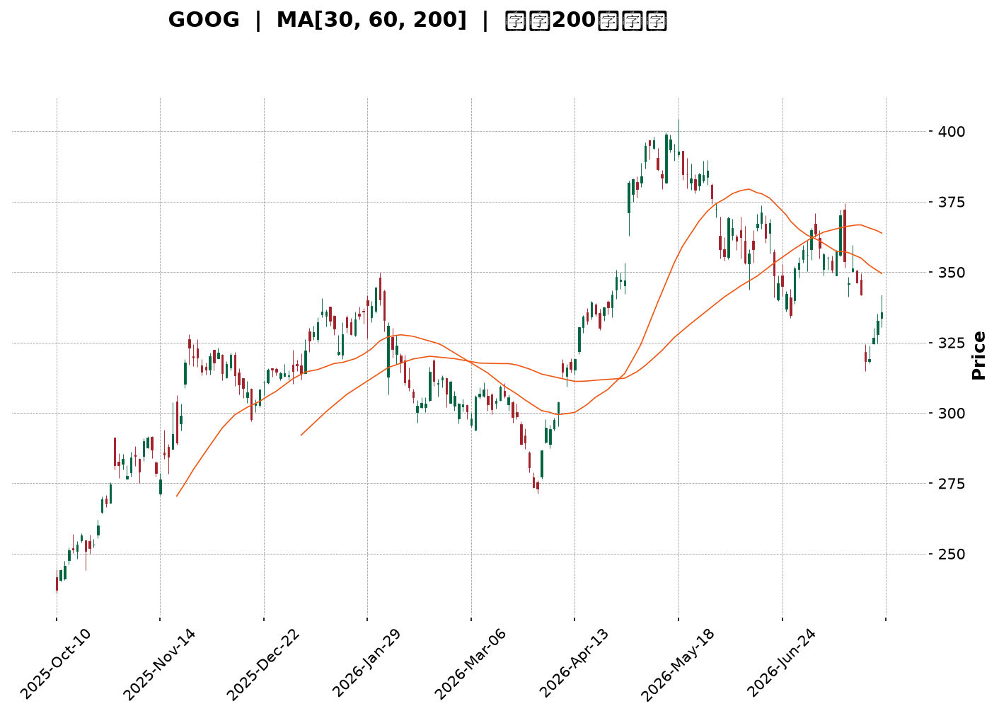
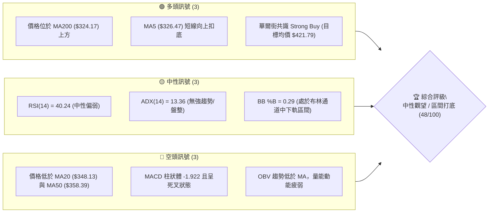
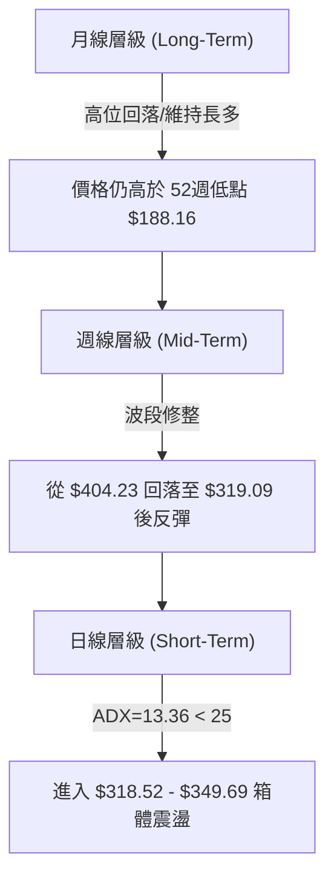
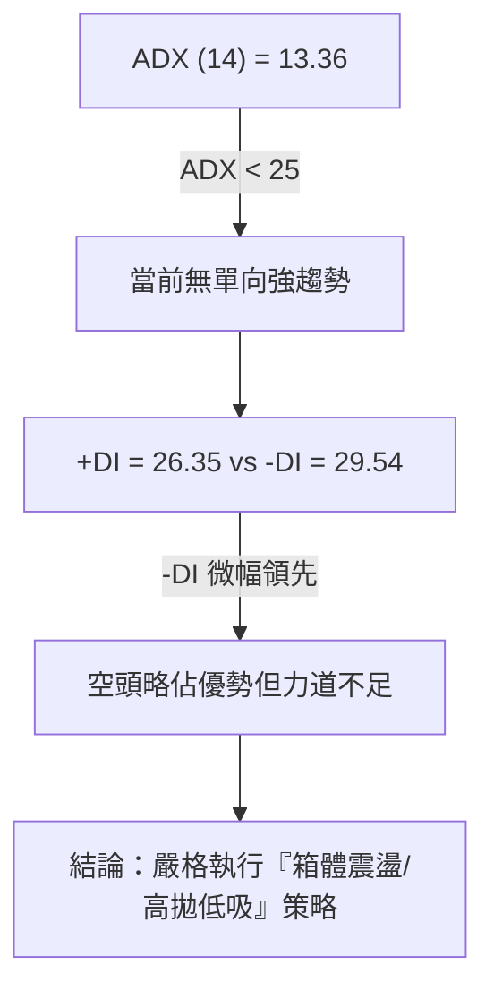
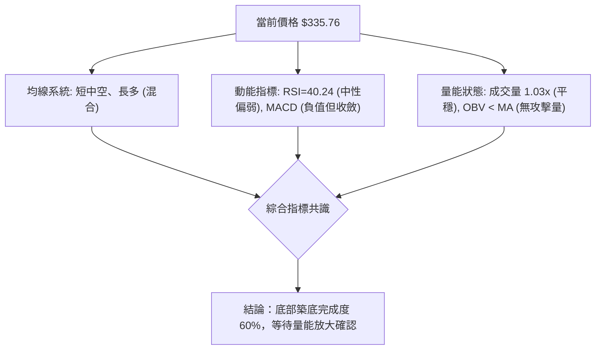
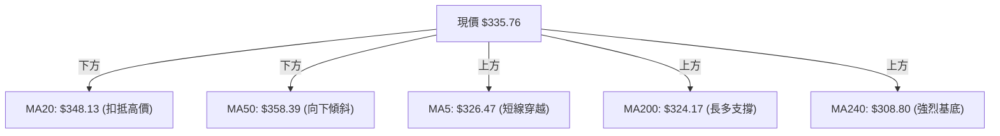
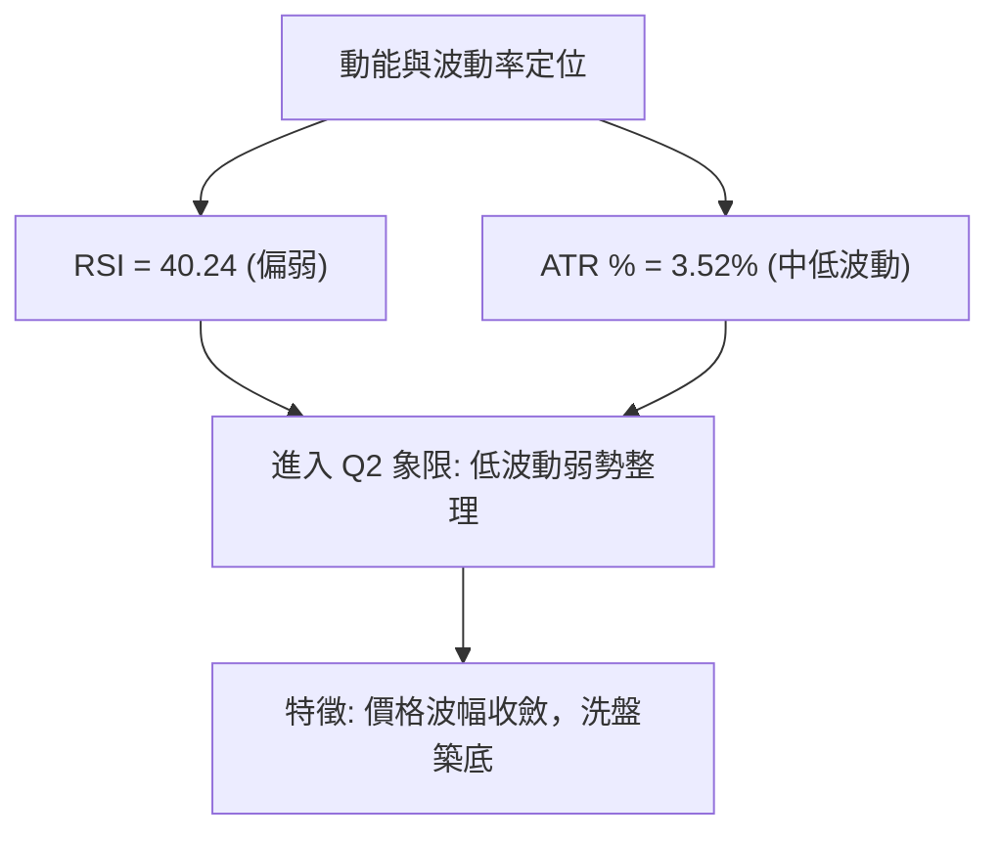
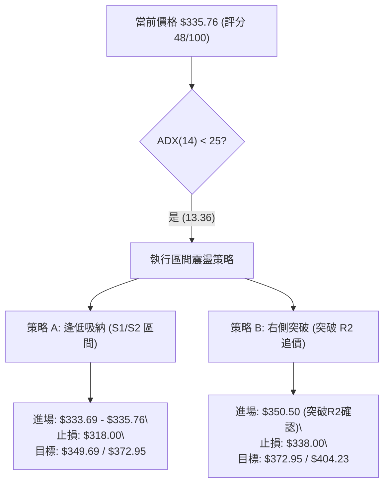
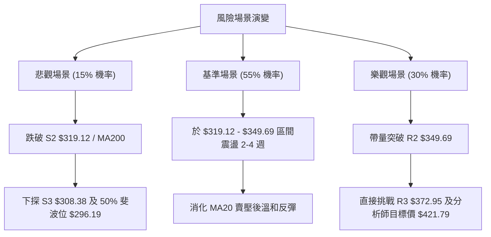

<details markdown="1">
<summary>📊 靜態圖表 (點擊展開)</summary>



</details>

<html>
<head><meta charset="utf-8" /></head>
<body>
    <div style="height:500px; width:100%;">                        <script>window.PlotlyConfig = {MathJaxConfig: 'local'};</script>
        <script charset="utf-8" src="https://cdn.plot.ly/plotly-3.7.0.min.js" integrity="sha256-jvTGqxNp8AGWEcvNLVuKr+8j5dGe9Yw51LQkmDH+IYA=" crossorigin="anonymous"></script>                <div id="candlestick-chart" class="plotly-graph-div" style="height:100%; width:100%;"></div>            <script>                window.PLOTLYENV=window.PLOTLYENV || {};                                if (document.getElementById("candlestick-chart")) {                    Plotly.newPlot(                        "candlestick-chart",                        [{"close":{"dtype":"f8","bdata":"AAAAQNCgbUAAAABgKoVuQAAAAECrtm5AAAAAoPZmb0AAAACgZGxvQAAAAKBkqW9AAAAAgEYIcEAAAACAJVtvQAAAAOAmgW9AAAAAAHqnb0AAAACgAUBwQAAAAGBu1nBAAAAAgHq+cEAAAACAGypxQAAAAKCTlXFAAAAAoEyUcUAAAAAAB7lxQAAAAMBBWHFAAAAAYBbDcUAAAABggsxxQAAAACBycnFAAAAAQFggckAAAABgtTJyQAAAAEDi7XFAAAAAAC9pcUAAAADAAkdxQAAAAECp0HFAAAAA4HDGcUAAAABgq0ZyQAAAAMCaFnJAAAAAYAWxckAAAABgjd1zQAAAAEAcMHRAAAAAgHT6c0AAAACA5vdzQAAAAIAOqHNAAAAAwG22c0AAAACA4v9zQAAAAGBG3HNAAAAA4FsXdEAAAABgoqBzQAAAAIBd1XNAAAAAIEwJdEAAAABgppRzQAAAAADWYXNAAAAAQKlOc0AAAAAgQTVzQAAAAIC8mnJAAAAAYKj1ckAAAADgUENzQAAAAGDHbnNAAAAA4Em0c0AAAAAAIbRzQAAAAIDIqHNAAAAAAK2fc0AAAABgO6JzQAAAAGA\u002flnNAAAAAQImuc0AAAACAfs5zQAAAAGA7onNAAAAAwCUgdEAAAABAWll0QAAAACBei3RAAAAAgLvEdEAAAADg2v90QAAAAADw\u002fXRAAAAAgJrLdEAAAADgip50QAAAAEDVG3RAAAAAQDl\u002fdEAAAAAgiKZ0QAAAAMAFgHRAAAAAgHnSdEAAAABAAel0QAAAAGB1\u002fXRAAAAAIH0jdUAAAABgaSF1QAAAAMAyh3VAAAAAIBZEdUAAAADAes50QAAAAIBcrnRAAAAAoNoqdEAAAABgoD90QAAAAGBt43NAAAAAYMduc0AAAADAdU9zQAAAACDuGXNAAAAAAMzmckAAAACgsfhyQAAAAACf8nJAAAAAINOnc0AAAAAgiHRzQAAAAGA6aHNAAAAAoPGJc0AAAACg\u002fCtzQAAAAIBgcHNAAAAA4Fwfc0AAAAAAn\u002fJyQAAAAEDd8HJAAAAA4EbIckAAAABAkp5yQAAAACA3HXNAAAAAIO0rc0AAAACAwENzQAAAACBx8HJAAAAAgHXUckAAAABgygNzQAAAACCVU3NAAAAAINohc0AAAADgvBhzQAAAAMDDqXJAAAAAQHGtckAAAADAahByQAAAACCnFnJAAAAAYCOJcUAAAACAhhlxQAAAAKCcD3FAAAAAwP\u002fqcUAAAADgj2tyQAAAAKCGZHJAAAAAALKXckAAAACA9PtyQAAAAKDPqHNAAAAAIODCc0AAAABAe7hzQAAAAMBJ8HNAAAAAQBmmdEAAAAAgTeR0QAAAAAAeyXRAAAAAQCIzdUAAAAAgLPN0QAAAAABXpHRAAAAAIG4YdUAAAADgvxh1QAAAAGDTYXVAAAAAQPfEdUAAAADgp7R1QAAAACCesXVAAAAAQF3bd0AAAAAA1e93QAAAAECWtndAAAAAIJ8AeEAAAAAAcK54QAAAAOD+sHhAAAAAoPrMeEAAAAAAmSh4QAAAACBt+XdAAAAAwMzseEAAAADg5c54QAAAAMBVkXhAAAAAAPqNeEAAAAAgsgp4QAAAACCyCnhAAAAAYNTzd0AAAADgbbJ3QAAAAIC8CXhAAAAAgJMJeEAAAABANB54QAAAAOBBg3dAAAAAwLFFd0AAAACAymJ2QAAAAAB1N3ZAAAAAIMQQd0AAAADgo9h2QAAAAGC4knZAAAAA4KOkdkAAAADAHhV2QAAAAMD1SHZAAAAAYI9idkAAAACAwvF2QAAAAKCZMXdAAAAAoJmhdkAAAAAgXPd2QAAAAOB6zHVAAAAAoEehdUAAAADgo5B1QAAAAEAKY3VAAAAAQArrdEAAAADgevR1QAAAAKBHFXZAAAAAgD1edkAAAABA4UJ2QAAAAGBmznZAAAAAgOu5dkAAAAAgXGt2QAAAAADXQ3ZAAAAA4HowdkAAAABguOp1QAAAAKBHVXZAAAAAIFwjd0AAAADA9Rx2QAAAAIDroXVAAAAAgOv1dUAAAABACqN1QAAAAGCPXnVAAAAAoHDlc0AAAACgcPFzQAAAAMAeaXRAAAAAoJnJdEAAAAAAKfx0QA=="},"high":{"dtype":"f8","bdata":"MLGflo2LbkAdDBUEWJBuQK+UBhhG8W5AtiRtTH+Ib0C4HTTENxFwQGDNUYg0zG9AWfbuOwIWcEBk3yiCLNxvQBdjvY3UCnBAAC+m3YDrb0CrNIaZ8V9wQOVtaudS5HBAAP0PHZbtcEAxTwLX4TZxQB0aOiK+NXJAlXc6eZnbcUCD3NEqF9ZxQIHylOKFlHFA8xgFADricUD+o3Ky6wNyQCWgI2oYv3FA5NpyxzwuckD\u002fnDwxSjxyQOc8vv+bPHJAWxf\u002fUkmvcUDnCsmcqWlxQKmdSgcaX3JAacXVpOYNckD2PgwnevpyQH6oiqOiJHNAv\u002fIhl9j1ckDy+utXyvJzQPd5IdJugHRAq9Re4qpFdEBR3ahV2WN0QEahslwT8HNA04LW06Dfc0BWWjt\u002fjxZ0QCMp1qR4J3RAvDft7iQzdEBmYwUC+Qx0QDPHqX+w5HNAsGN6+TIXdEAwMKfPHRl0QLnmVJWju3NA9TCOrquEc0CO8r8gAndzQFI0mvqpTHNAR1S4TckNc0BBrf9XY0lzQP3aoAWxdHNAg4mdDzK+c0DYq5YvCb5zQBRxd5JZwnNAfjpahvGoc0DRFH0JkdRzQAC+L6Cnr3NAt5VHqOEndECecOFuVe1zQKtsduc+EnRAB0p3jp9gdED21LTovKF0QCA06j3CsHRAP5Dxew7gdEBOpYRgE0x1QGKMtkZxCXVA4ebuDgUbdUAgHu0O1+x0QKF3Bs2WenRAUNFyJqfEdEDVEOhDXOx0QIi5N3GB2XRApoM9v5P+dEC3H22wYBx1QKyGrMgHE3VA2AGvOH5ddUB72Kr3iD11QPBDWdVui3VAPwHPvBbbdUAHNy3Oz3x1QPzG0rlbw3RA9GmsMlajdEAkmZkl\u002f3R0QKTa7FZdE3RAePY0MQQKdECdAz1eEsFzQPb7tWjKR3NAjfpBr98Hc0Ahh0w4LBhzQA8wyesWGnNANMq8zovFc0AemBz+m\u002fBzQI6Gzb9lf3NABdblwQKUc0BXSSj7dolzQPxBhGbDenNAFNgnXM47c0Ap7PV3sfhyQAWfmmH7EHNAw+io2ZXvckBzSClGAr9yQPQO+uoMJXNAAPvvx2xPc0D6ODg5HG5zQI9zVB9FR3NAz1xKFjQxc0D+rrDqLRZzQJdhYezQXXNAt11eaQJpc0CXSdKo7SdzQMdfrqD9AnNANbyuKADzckA6c26pvY5yQCG7JGK5Z3JA\u002fYXUpXvlcUBjASf+wG5xQDtKX3CAQXFA4nApiAnucUDM\u002fWRm5JxyQPk6u1ONe3JAms1\u002ffe2jckCTAcd0rP5yQDCJYqsq83NAkSCCQ9PTc0CqftHP7PRzQBQ0QVXO83NAGbIk+g6ndEAmWb2xxux0QLcsU0TVEnVABdsQ73w8dUAf+r\u002fcSy91QDe2iL55D3VAe3fPIjoddUBhd\u002flPST91QFLY7n+7d3VAuoj04gXrdUD1WFNWCNt1QOXWL7\u002f\u002fEnZAesfNzGXmd0B03cX0jPJ3QOmR0NAu\u002f3dAEBjo0Z1LeEDmNe\u002fxQ8J4QMWG6i\u002fb0XhAKTWJHxbieEB7AOgffKF4QBFviStSI3hAxcCs7gf7eEBbWzq80u14QNC4bTFFunhALZcxo6BDeUCVp3nGBZJ4QBHC\u002frVwZ3hAgdUJqiNHeEBUNJ9ZNwp4QFT3GQWIEnhAROaccNlXeEDkpPAwP1x4QGd81SO61ndAjmoHxv5ld0A2IanJFBl3QNpBw\u002fKCpHZAKrjkSzMad0BVWFympQ93QAAAAIAUtnZAAAAAYBIbd0AAAADA9eR2QAAAAAApYHZAAAAAQF7MdkAAAABgZip3QAAAAKCZWXdAAAAAYGYid0AAAAAAABB3QAAAAEAzY3ZAAAAAIIXLdUAAAACgRw12QAAAAEAKc3VAAAAAgOuBdUAAAAAghf91QAAAAIA9NnZAAAAAwPV4dkAAAAAA1492QAAAAEDh2nZAAAAAgD0ud0AAAAAgrs92QAAAACCuS3ZAAAAAQOE6dkAAAAAAADx2QAAAAIAUXnZAAAAAgD1Cd0AAAACgmWV3QAAAAGC4wnVAAAAAANd3dkAAAAAA1+t1QAAAAEAz13VAAAAAQDNHdEAAAAAgrj90QAAAAMCdoXRAAAAAIFzzdEAAAAAgrl91QA=="},"hovertemplate":"\u003cb\u003e%{x|%Y-%m-%d}\u003c\u002fb\u003e\u003cbr\u003e\u958b: $%{open:.2f}\u003cbr\u003e\u9ad8: $%{high:.2f}\u003cbr\u003e\u4f4e: $%{low:.2f}\u003cbr\u003e\u6536: $%{close:.2f}\u003cextra\u003e\u003c\u002fextra\u003e","low":{"dtype":"f8","bdata":"up6MhhqHbUDucevW7QhuQGFWjTGZFm5AcmNZuNTJbkAa0u2jv0VvQApMjJRRA29AD8m\u002fR0PDb0C3UC7DH4ZuQLZXChHBPm9Ak2yRysCIb0D34O4rK\u002fNvQDyfwVu\u002fhnBAIDxquFuqcEBOP5pher5wQKywPB5sfnFAdEIqjq5PcUAlFvYLJX1xQClrP5MsRXFAsakj7GFVcUAKDVgOG5FxQKii5po1M3FAn14T\u002fcOvcUAurczNEfVxQJy6C\u002fAtvXFA9utieUxXcUBXtpKhEO5wQELbI7rIunFAD0SlbG1ncUDR8Ihgt\u002fFxQKsaZ32rCXJAtYoc44tcckDIKXdMt0xzQHmKlsob03NAogH+jUXJc0DCI+a6HsVzQG3UbULalXNAuBYobK+Zc0CzkcOspJpzQCAwdO+Pr3NAHC0CSKr1c0DrVdUTDHhzQKWUAmxkg3NA8lEub9Cvc0CqhHQLnFdzQDuzpEfzKHNAz+Mno3QVc0B\u002fTxN57\u002fZyQOu4t0L9kHJAvohdjc3DckDbQuWDIN9yQBWZkbYJI3NAM7cR+oJlc0BeZsnvk45zQLxa3iD4lHNAkXtRL+N3c0AKJemSdY1zQE9vbW2ufHNACdOB1uljc0BbIhqyZq1zQOQ4KhDrfnNA6oV4426hc0CjW2O9HRl0QGL8vBIwXXRAawVK+FxRdEAm0VVent50QDNB32JTq3RAxATy\u002fritdEA9wF453nt0QNfL7imKB3RAJXpZ4Pfxc0C3dCN6Nod0QFIybhWseHRAJ0YqewBxdECsMZHuB9V0QKV8yC4lu3RAve7BsrJkdEAEPqN7S8N0QAMWO+Uk+XRAeCdPx14idUCHOMLYCo90QCAYyrtPKHNAScWhJLf7c0C4FScQkdRzQCJMYnj9o3NA68olqppbc0AMY4Ul9ztzQH8i9vQN+HJAhuFbRTOIckCoAgH6X9lyQEi09hJxxHJA1GrmJF0Ac0Do31v2XVlzQEY5iXEMG3NAkR8R3kxPc0D3dfT1PuByQBxlQecd83JAZa+odKzKckDIC1EN\u002fYRyQMP\u002fNuqExnJAnTpabuWackBD\u002fJXN1W1yQODchyINXHJAl+SpnQUSc0AljUcbfxpzQA5uvHaLynJAwG13Y5i5ckD0HSguDtpyQDvxMderAnNAJu8pnMcVc0DIzFdnGs1yQJ0kpOYkiXJAjoxVsJydckBcGJh55gpyQHhdPngn83FASBnYSR1ucUD8Z5tQDBVxQBWfM3Ty9XBARrc+In9JcUBV14UAvBRyQMW0yzla9nFAZA3vCNBZckACWN3z9HNyQPqpaENFiHNAWTmCv4pUc0CIk0PonKVzQFktOHkFmHNAmGgEO08PdEDE2kGwZYd0QKcaakI1t3RAQ\u002f9bzW7RdEBg85cl3OZ0QAWzwXHolnRAtsQ\u002f4CfMdEBZ\u002fZ9AvO10QKPg97+V3XRAYuicHq5JdUBiOtquKoF1QO5ps6WVY3VA8kYEEfKtdkChTll8jHB3QIoYA7KxiHdA\u002f5dsiPDBd0CFj9vu3y14QPbdIys0YXhAt56Vk+6WeED3epCU9h94QN2d7Jndt3dArmlGhJvVd0Dw8ZZR3od4QGqSQ8VoWHhAU6jZUaNqeEC15k1uUOx3QGurXtJXvHdAJoyANAe0d0DGOVkihaB3QKLY\u002f2qXrndAZurt2FLcd0Dvhm6\u002fVNB3QGyeW58yYXdAoAEHUs0Xd0CJszBalSx2QIgX4HOrInZATOsgpmIpdkCUbNSMmZZ2QAAAAIA9XnZAAAAAIIUrdkAAAADA9Qx2QAAAAIAUenVAAAAAoHAVdkAAAABgZsp2QAAAAMAe1XZAAAAAIK6DdkAAAABgukl2QAAAAEAKT3VAAAAAoHA7dUAAAAAAAFh1QAAAAGBm\u002fnRAAAAAQArbdEAAAADA9Sx1QAAAAIDCwXVAAAAAIK4TdkAAAADAHuV1QAAAAEAKI3ZAAAAAYLimdkAAAABAMyt2QAAAAGCPynVAAAAAQDPrdUAAAADAHt11QAAAAKBwzXVAAAAAYLg6dkAAAABguPp1QAAAAAAAUnVAAAAAgBTgdUAAAAAAKaB1QAAAAIA9WnVAAAAAgD2uc0AAAAAAANhzQAAAAGCPRnRAAAAA4KNIdEAAAADAhqZ0QA=="},"name":"\u50f9\u683c","open":{"dtype":"f8","bdata":"c9FOCfY1bkCk5DUa3xFuQGN7Y9IGKW5AdeKOtzDzbkDH3SGAE39vQPhZ11l3W29A99tGD2LXb0DdxX6XBdhvQNwl3EFb0G9AXvARu4Smb0Arx4QYvwxwQNlbQz50jXBARpVpUb7acEAakmMwWsFwQC9p97BjMnJAH9YTZ2qqcUCEIfx+4Z1xQE97+TheSHFACzVA51VtcUCcwc8V0dJxQMQlA912unFAZ261yk\u002fLcUBgVWL9LfpxQI90zdM3OHJApXvzB+emcUD9Er0+z\u002fVwQLq9D5dv3XFAs8iBAbv+cUDGhcyh9PFxQBdOgF1NAnNAGnd2xqCEckDcN\u002f0FbWZzQNxaDS6SYnRA9\u002fFYfnACdECpVW66wSx0QN1JNcGpzXNAY2TsMnvEc0BKax6nlrZzQOCpkvObJnRADMkB\u002f\u002fv1c0CaeLnTxgl0QFQSJ\u002fsPi3NAWs+zCU\u002fDc0CwQYsx5Qp0QGme4qUlpnNA+yQ11XiDc0Dv3Xg\u002fnBlzQG3WwTe1SXNA8v4w0KHqckC0iUnL\u002fO1yQGXTqe8ZbXNA9XE766lrc0AN2C9vzLtzQBpAQZ4fuHNAFq5hpJaGc0C+9vUXBJBzQOVXaGxgj3NAUK63\u002fc7Sc0CwwtN+fNRzQNHWL59VznNA5xKsQ42ic0D3ZIhZXY10QLLg6nEAcXRAPLiGrS5hdED7XrKleu10QPMaN9XD6HRAIOmUNdIZdUCa+0Vw9+d0QK8TAcshDXRATPKM0NAKdEBE6A2xQt10QJXNs8qIw3RAKqyU71h8dEBXEt5hEvN0QIqqczy7AnVAqHVkV34+dUAIkz9hYOB0QCZsUMLFAXVAvP4VmvbAdUDd0o3z5nR1QIJZ7wmpjHNAXZOJ6MNudECDzBnkIQ10QKMTJRDcB3RAHxKDFrPoc0CHh\u002frxE39zQL3NIj9UOXNA8f5AZ\u002fbDckC+BIHvmOByQD5QQq8A4nJAyZDwfG8Gc0DweyGNk+tzQFSSKP\u002fAY3NAiwxBHWd7c0B1xf5FWYZzQCQMq4mx+HJA+3rNJR3pckBsxRoafaByQPfH0taj5HJAxj5Fgt7sckDcM8dI+HpyQHdtO2FUX3JAtg5XeQ4bc0Ac1iYZ2iFzQHDW7LtpIHNA7EjVc4cnc0CXTy+lrfZyQForYM3JB3NAjGi3S4Q7c0A\u002fZHEVcfByQOV04p0x\u002fnJAaZi3h5bFckDoucRagoByQGmdTpGWP3JAwb7OMkngcUAzuBvoulNxQF62grVjNHFAHflIFvhVcUDkPuC+4xxyQPt7J\u002foODXJAJ+T2Kl1ockDwNzsWWr9yQDIVPqM42nNATp55tQaQc0AcxQCUieBzQIkNLVavs3NAZ8P32fAddEBqa\u002fdhx6V0QD5JVyle+nRAcgZpXqnjdECzzCS3syV1QLgOJ2Yh9nRAh744AvDqdEAL+O+g7jV1QNXWQhVFGHVAogBkTsV6dUCoD8ytYat1QAzRIAJblHVAZUg104Ewd0Cio9noCpx3QJiO1eVw4XdAaVq7qT7ad0AjzmnMsFV4QH1z+okjzXhAm441mYageEAOVaW3R2d4QFecw3dLDHhA4g9J983ad0AJycaz2Zh4QCnKOuKnj3hAAu477Tl+eEAXbzjOA5F4QFLCsUfvDHhAP3zS2Hvcd0ALPP7QePB3QENwDtlAzHdAdVRrdo7od0CJjlrREPp3QInT3W\u002fuz3dARx8jY51Fd0CmfGqfEK92QHcbjFXpYXZAyc95kp4zdkCM8xY9lbJ2QAAAAIDCp3ZAAAAAACnOdkAAAADAzJB2QAAAAMDMEHZAAAAAoJmRdkAAAAAA1992QAAAAKBw93ZAAAAAwMzwdkAAAACAPb52QAAAAAApUnZAAAAAIK5BdUAAAAAghct1QAAAAGC4DnVAAAAAIK5PdUAAAABAMz91QAAAACBc73VAAAAAANcpdkAAAABgZkJ2QAAAAMAeY3ZAAAAAgMLzdkAAAAAgXKN2QAAAACBc8XVAAAAAoEMvdkAAAAAA1x92QAAAAKBwzXVAAAAAAClAdkAAAABguEJ3QAAAAOBRnHVAAAAAYLjidUAAAADA9eh1QAAAAEDhsnVAAAAAgBQadEAAAADAzORzQAAAAADXS3RAAAAAwMx8dEAAAADgo9x0QA=="},"x":["2025-10-10T00:00:00-04:00","2025-10-13T00:00:00-04:00","2025-10-14T00:00:00-04:00","2025-10-15T00:00:00-04:00","2025-10-16T00:00:00-04:00","2025-10-17T00:00:00-04:00","2025-10-20T00:00:00-04:00","2025-10-21T00:00:00-04:00","2025-10-22T00:00:00-04:00","2025-10-23T00:00:00-04:00","2025-10-24T00:00:00-04:00","2025-10-27T00:00:00-04:00","2025-10-28T00:00:00-04:00","2025-10-29T00:00:00-04:00","2025-10-30T00:00:00-04:00","2025-10-31T00:00:00-04:00","2025-11-03T00:00:00-05:00","2025-11-04T00:00:00-05:00","2025-11-05T00:00:00-05:00","2025-11-06T00:00:00-05:00","2025-11-07T00:00:00-05:00","2025-11-10T00:00:00-05:00","2025-11-11T00:00:00-05:00","2025-11-12T00:00:00-05:00","2025-11-13T00:00:00-05:00","2025-11-14T00:00:00-05:00","2025-11-17T00:00:00-05:00","2025-11-18T00:00:00-05:00","2025-11-19T00:00:00-05:00","2025-11-20T00:00:00-05:00","2025-11-21T00:00:00-05:00","2025-11-24T00:00:00-05:00","2025-11-25T00:00:00-05:00","2025-11-26T00:00:00-05:00","2025-11-28T00:00:00-05:00","2025-12-01T00:00:00-05:00","2025-12-02T00:00:00-05:00","2025-12-03T00:00:00-05:00","2025-12-04T00:00:00-05:00","2025-12-05T00:00:00-05:00","2025-12-08T00:00:00-05:00","2025-12-09T00:00:00-05:00","2025-12-10T00:00:00-05:00","2025-12-11T00:00:00-05:00","2025-12-12T00:00:00-05:00","2025-12-15T00:00:00-05:00","2025-12-16T00:00:00-05:00","2025-12-17T00:00:00-05:00","2025-12-18T00:00:00-05:00","2025-12-19T00:00:00-05:00","2025-12-22T00:00:00-05:00","2025-12-23T00:00:00-05:00","2025-12-24T00:00:00-05:00","2025-12-26T00:00:00-05:00","2025-12-29T00:00:00-05:00","2025-12-30T00:00:00-05:00","2025-12-31T00:00:00-05:00","2026-01-02T00:00:00-05:00","2026-01-05T00:00:00-05:00","2026-01-06T00:00:00-05:00","2026-01-07T00:00:00-05:00","2026-01-08T00:00:00-05:00","2026-01-09T00:00:00-05:00","2026-01-12T00:00:00-05:00","2026-01-13T00:00:00-05:00","2026-01-14T00:00:00-05:00","2026-01-15T00:00:00-05:00","2026-01-16T00:00:00-05:00","2026-01-20T00:00:00-05:00","2026-01-21T00:00:00-05:00","2026-01-22T00:00:00-05:00","2026-01-23T00:00:00-05:00","2026-01-26T00:00:00-05:00","2026-01-27T00:00:00-05:00","2026-01-28T00:00:00-05:00","2026-01-29T00:00:00-05:00","2026-01-30T00:00:00-05:00","2026-02-02T00:00:00-05:00","2026-02-03T00:00:00-05:00","2026-02-04T00:00:00-05:00","2026-02-05T00:00:00-05:00","2026-02-06T00:00:00-05:00","2026-02-09T00:00:00-05:00","2026-02-10T00:00:00-05:00","2026-02-11T00:00:00-05:00","2026-02-12T00:00:00-05:00","2026-02-13T00:00:00-05:00","2026-02-17T00:00:00-05:00","2026-02-18T00:00:00-05:00","2026-02-19T00:00:00-05:00","2026-02-20T00:00:00-05:00","2026-02-23T00:00:00-05:00","2026-02-24T00:00:00-05:00","2026-02-25T00:00:00-05:00","2026-02-26T00:00:00-05:00","2026-02-27T00:00:00-05:00","2026-03-02T00:00:00-05:00","2026-03-03T00:00:00-05:00","2026-03-04T00:00:00-05:00","2026-03-05T00:00:00-05:00","2026-03-06T00:00:00-05:00","2026-03-09T00:00:00-04:00","2026-03-10T00:00:00-04:00","2026-03-11T00:00:00-04:00","2026-03-12T00:00:00-04:00","2026-03-13T00:00:00-04:00","2026-03-16T00:00:00-04:00","2026-03-17T00:00:00-04:00","2026-03-18T00:00:00-04:00","2026-03-19T00:00:00-04:00","2026-03-20T00:00:00-04:00","2026-03-23T00:00:00-04:00","2026-03-24T00:00:00-04:00","2026-03-25T00:00:00-04:00","2026-03-26T00:00:00-04:00","2026-03-27T00:00:00-04:00","2026-03-30T00:00:00-04:00","2026-03-31T00:00:00-04:00","2026-04-01T00:00:00-04:00","2026-04-02T00:00:00-04:00","2026-04-06T00:00:00-04:00","2026-04-07T00:00:00-04:00","2026-04-08T00:00:00-04:00","2026-04-09T00:00:00-04:00","2026-04-10T00:00:00-04:00","2026-04-13T00:00:00-04:00","2026-04-14T00:00:00-04:00","2026-04-15T00:00:00-04:00","2026-04-16T00:00:00-04:00","2026-04-17T00:00:00-04:00","2026-04-20T00:00:00-04:00","2026-04-21T00:00:00-04:00","2026-04-22T00:00:00-04:00","2026-04-23T00:00:00-04:00","2026-04-24T00:00:00-04:00","2026-04-27T00:00:00-04:00","2026-04-28T00:00:00-04:00","2026-04-29T00:00:00-04:00","2026-04-30T00:00:00-04:00","2026-05-01T00:00:00-04:00","2026-05-04T00:00:00-04:00","2026-05-05T00:00:00-04:00","2026-05-06T00:00:00-04:00","2026-05-07T00:00:00-04:00","2026-05-08T00:00:00-04:00","2026-05-11T00:00:00-04:00","2026-05-12T00:00:00-04:00","2026-05-13T00:00:00-04:00","2026-05-14T00:00:00-04:00","2026-05-15T00:00:00-04:00","2026-05-18T00:00:00-04:00","2026-05-19T00:00:00-04:00","2026-05-20T00:00:00-04:00","2026-05-21T00:00:00-04:00","2026-05-22T00:00:00-04:00","2026-05-26T00:00:00-04:00","2026-05-27T00:00:00-04:00","2026-05-28T00:00:00-04:00","2026-05-29T00:00:00-04:00","2026-06-01T00:00:00-04:00","2026-06-02T00:00:00-04:00","2026-06-03T00:00:00-04:00","2026-06-04T00:00:00-04:00","2026-06-05T00:00:00-04:00","2026-06-08T00:00:00-04:00","2026-06-09T00:00:00-04:00","2026-06-10T00:00:00-04:00","2026-06-11T00:00:00-04:00","2026-06-12T00:00:00-04:00","2026-06-15T00:00:00-04:00","2026-06-16T00:00:00-04:00","2026-06-17T00:00:00-04:00","2026-06-18T00:00:00-04:00","2026-06-22T00:00:00-04:00","2026-06-23T00:00:00-04:00","2026-06-24T00:00:00-04:00","2026-06-25T00:00:00-04:00","2026-06-26T00:00:00-04:00","2026-06-29T00:00:00-04:00","2026-06-30T00:00:00-04:00","2026-07-01T00:00:00-04:00","2026-07-02T00:00:00-04:00","2026-07-06T00:00:00-04:00","2026-07-07T00:00:00-04:00","2026-07-08T00:00:00-04:00","2026-07-09T00:00:00-04:00","2026-07-10T00:00:00-04:00","2026-07-13T00:00:00-04:00","2026-07-14T00:00:00-04:00","2026-07-15T00:00:00-04:00","2026-07-16T00:00:00-04:00","2026-07-17T00:00:00-04:00","2026-07-20T00:00:00-04:00","2026-07-21T00:00:00-04:00","2026-07-22T00:00:00-04:00","2026-07-23T00:00:00-04:00","2026-07-24T00:00:00-04:00","2026-07-27T00:00:00-04:00","2026-07-28T00:00:00-04:00","2026-07-29T00:00:00-04:00"],"type":"candlestick"},{"hovertemplate":"MA30: $%{y:.2f}\u003cextra\u003e\u003c\u002fextra\u003e","line":{"color":"#2196F3","dash":"dash","width":2},"mode":"lines","name":"MA30","x":["2025-10-10T00:00:00-04:00","2025-10-13T00:00:00-04:00","2025-10-14T00:00:00-04:00","2025-10-15T00:00:00-04:00","2025-10-16T00:00:00-04:00","2025-10-17T00:00:00-04:00","2025-10-20T00:00:00-04:00","2025-10-21T00:00:00-04:00","2025-10-22T00:00:00-04:00","2025-10-23T00:00:00-04:00","2025-10-24T00:00:00-04:00","2025-10-27T00:00:00-04:00","2025-10-28T00:00:00-04:00","2025-10-29T00:00:00-04:00","2025-10-30T00:00:00-04:00","2025-10-31T00:00:00-04:00","2025-11-03T00:00:00-05:00","2025-11-04T00:00:00-05:00","2025-11-05T00:00:00-05:00","2025-11-06T00:00:00-05:00","2025-11-07T00:00:00-05:00","2025-11-10T00:00:00-05:00","2025-11-11T00:00:00-05:00","2025-11-12T00:00:00-05:00","2025-11-13T00:00:00-05:00","2025-11-14T00:00:00-05:00","2025-11-17T00:00:00-05:00","2025-11-18T00:00:00-05:00","2025-11-19T00:00:00-05:00","2025-11-20T00:00:00-05:00","2025-11-21T00:00:00-05:00","2025-11-24T00:00:00-05:00","2025-11-25T00:00:00-05:00","2025-11-26T00:00:00-05:00","2025-11-28T00:00:00-05:00","2025-12-01T00:00:00-05:00","2025-12-02T00:00:00-05:00","2025-12-03T00:00:00-05:00","2025-12-04T00:00:00-05:00","2025-12-05T00:00:00-05:00","2025-12-08T00:00:00-05:00","2025-12-09T00:00:00-05:00","2025-12-10T00:00:00-05:00","2025-12-11T00:00:00-05:00","2025-12-12T00:00:00-05:00","2025-12-15T00:00:00-05:00","2025-12-16T00:00:00-05:00","2025-12-17T00:00:00-05:00","2025-12-18T00:00:00-05:00","2025-12-19T00:00:00-05:00","2025-12-22T00:00:00-05:00","2025-12-23T00:00:00-05:00","2025-12-24T00:00:00-05:00","2025-12-26T00:00:00-05:00","2025-12-29T00:00:00-05:00","2025-12-30T00:00:00-05:00","2025-12-31T00:00:00-05:00","2026-01-02T00:00:00-05:00","2026-01-05T00:00:00-05:00","2026-01-06T00:00:00-05:00","2026-01-07T00:00:00-05:00","2026-01-08T00:00:00-05:00","2026-01-09T00:00:00-05:00","2026-01-12T00:00:00-05:00","2026-01-13T00:00:00-05:00","2026-01-14T00:00:00-05:00","2026-01-15T00:00:00-05:00","2026-01-16T00:00:00-05:00","2026-01-20T00:00:00-05:00","2026-01-21T00:00:00-05:00","2026-01-22T00:00:00-05:00","2026-01-23T00:00:00-05:00","2026-01-26T00:00:00-05:00","2026-01-27T00:00:00-05:00","2026-01-28T00:00:00-05:00","2026-01-29T00:00:00-05:00","2026-01-30T00:00:00-05:00","2026-02-02T00:00:00-05:00","2026-02-03T00:00:00-05:00","2026-02-04T00:00:00-05:00","2026-02-05T00:00:00-05:00","2026-02-06T00:00:00-05:00","2026-02-09T00:00:00-05:00","2026-02-10T00:00:00-05:00","2026-02-11T00:00:00-05:00","2026-02-12T00:00:00-05:00","2026-02-13T00:00:00-05:00","2026-02-17T00:00:00-05:00","2026-02-18T00:00:00-05:00","2026-02-19T00:00:00-05:00","2026-02-20T00:00:00-05:00","2026-02-23T00:00:00-05:00","2026-02-24T00:00:00-05:00","2026-02-25T00:00:00-05:00","2026-02-26T00:00:00-05:00","2026-02-27T00:00:00-05:00","2026-03-02T00:00:00-05:00","2026-03-03T00:00:00-05:00","2026-03-04T00:00:00-05:00","2026-03-05T00:00:00-05:00","2026-03-06T00:00:00-05:00","2026-03-09T00:00:00-04:00","2026-03-10T00:00:00-04:00","2026-03-11T00:00:00-04:00","2026-03-12T00:00:00-04:00","2026-03-13T00:00:00-04:00","2026-03-16T00:00:00-04:00","2026-03-17T00:00:00-04:00","2026-03-18T00:00:00-04:00","2026-03-19T00:00:00-04:00","2026-03-20T00:00:00-04:00","2026-03-23T00:00:00-04:00","2026-03-24T00:00:00-04:00","2026-03-25T00:00:00-04:00","2026-03-26T00:00:00-04:00","2026-03-27T00:00:00-04:00","2026-03-30T00:00:00-04:00","2026-03-31T00:00:00-04:00","2026-04-01T00:00:00-04:00","2026-04-02T00:00:00-04:00","2026-04-06T00:00:00-04:00","2026-04-07T00:00:00-04:00","2026-04-08T00:00:00-04:00","2026-04-09T00:00:00-04:00","2026-04-10T00:00:00-04:00","2026-04-13T00:00:00-04:00","2026-04-14T00:00:00-04:00","2026-04-15T00:00:00-04:00","2026-04-16T00:00:00-04:00","2026-04-17T00:00:00-04:00","2026-04-20T00:00:00-04:00","2026-04-21T00:00:00-04:00","2026-04-22T00:00:00-04:00","2026-04-23T00:00:00-04:00","2026-04-24T00:00:00-04:00","2026-04-27T00:00:00-04:00","2026-04-28T00:00:00-04:00","2026-04-29T00:00:00-04:00","2026-04-30T00:00:00-04:00","2026-05-01T00:00:00-04:00","2026-05-04T00:00:00-04:00","2026-05-05T00:00:00-04:00","2026-05-06T00:00:00-04:00","2026-05-07T00:00:00-04:00","2026-05-08T00:00:00-04:00","2026-05-11T00:00:00-04:00","2026-05-12T00:00:00-04:00","2026-05-13T00:00:00-04:00","2026-05-14T00:00:00-04:00","2026-05-15T00:00:00-04:00","2026-05-18T00:00:00-04:00","2026-05-19T00:00:00-04:00","2026-05-20T00:00:00-04:00","2026-05-21T00:00:00-04:00","2026-05-22T00:00:00-04:00","2026-05-26T00:00:00-04:00","2026-05-27T00:00:00-04:00","2026-05-28T00:00:00-04:00","2026-05-29T00:00:00-04:00","2026-06-01T00:00:00-04:00","2026-06-02T00:00:00-04:00","2026-06-03T00:00:00-04:00","2026-06-04T00:00:00-04:00","2026-06-05T00:00:00-04:00","2026-06-08T00:00:00-04:00","2026-06-09T00:00:00-04:00","2026-06-10T00:00:00-04:00","2026-06-11T00:00:00-04:00","2026-06-12T00:00:00-04:00","2026-06-15T00:00:00-04:00","2026-06-16T00:00:00-04:00","2026-06-17T00:00:00-04:00","2026-06-18T00:00:00-04:00","2026-06-22T00:00:00-04:00","2026-06-23T00:00:00-04:00","2026-06-24T00:00:00-04:00","2026-06-25T00:00:00-04:00","2026-06-26T00:00:00-04:00","2026-06-29T00:00:00-04:00","2026-06-30T00:00:00-04:00","2026-07-01T00:00:00-04:00","2026-07-02T00:00:00-04:00","2026-07-06T00:00:00-04:00","2026-07-07T00:00:00-04:00","2026-07-08T00:00:00-04:00","2026-07-09T00:00:00-04:00","2026-07-10T00:00:00-04:00","2026-07-13T00:00:00-04:00","2026-07-14T00:00:00-04:00","2026-07-15T00:00:00-04:00","2026-07-16T00:00:00-04:00","2026-07-17T00:00:00-04:00","2026-07-20T00:00:00-04:00","2026-07-21T00:00:00-04:00","2026-07-22T00:00:00-04:00","2026-07-23T00:00:00-04:00","2026-07-24T00:00:00-04:00","2026-07-27T00:00:00-04:00","2026-07-28T00:00:00-04:00","2026-07-29T00:00:00-04:00"],"y":{"dtype":"f8","bdata":"AAAAAAAA+H8AAAAAAAD4fwAAAAAAAPh\u002fAAAAAAAA+H8AAAAAAAD4fwAAAAAAAPh\u002fAAAAAAAA+H8AAAAAAAD4fwAAAAAAAPh\u002fAAAAAAAA+H8AAAAAAAD4fwAAAAAAAPh\u002fAAAAAAAA+H8AAAAAAAD4fwAAAAAAAPh\u002fAAAAAAAA+H8AAAAAAAD4fwAAAAAAAPh\u002fAAAAAAAA+H8AAAAAAAD4fwAAAAAAAPh\u002fAAAAAAAA+H8AAAAAAAD4fwAAAAAAAPh\u002fAAAAAAAA+H8AAAAAAAD4fwAAAAAAAPh\u002fAAAAAAAA+H8AAAAAAAD4f+\u002fu7kY453BA3t3dlU4IcUAAAAAgmy9xQCIiIvLUWHFAAAAAuFR9cUBmZmaGp6FxQDMzM7tMwnFAiYiIcLThcUDv7u72lAZyQGZmZnajKXJAAAAAoAZOckCJiIjI2GpyQJqZmUlphHJAd3d3V4GgckAiIiKSH7VyQN7d3R13xHJAAAAA8DXTckCrqqqK4t9yQN7d3V2i6nJA7+7ubtr0ckCJiIjIWAFzQO\u002fu7o5KEnNAvLu7i8Efc0B3d3d3mixzQAAAAOBdO3NAERER8T9Oc0De3d1tW2JzQImIiAh6cXNAzczMHL+Bc0Dv7u6uzo5zQERERLT+m3NAREREhDuoc0AiIiLyW6xzQM3MzKxmr3NAZmZmxiS2c0AAAAAw8b5zQCIiIpJWynNAvLu7y5PTc0DNzMys3dhzQJqZmQn82nNAmpmZWXLec0BVVVU1LedzQLy7u3vd7HNAIiIiMpLzc0Dv7u6O6v5zQCIiIhKjDHRAvLu7u0McdECamZl5qyx0QJqZmVmeRXRAzczMrExZdEDNzMy8eGZ0QHd3d9cfcXRAmpmZmRN1dECrqqr6uXl0QImIiGiue3RAd3d3Jw16dEBVVVXVSnd0QN7d3f0lc3RAzczMjH1sdEDv7u4eXWV0QDMzM5OCX3RAIiIi0n9bdEB3d3c331N0QDMzM9MqSnRAERERoaw\u002fdEB3d3cnFDB0QDMzM6PTInRAERERUY0UdECJiIi4SQZ0QFVVVYVS\u002fHNAd3d317Dtc0CJiIjYW9xzQImIiCiI0HNAmpmZaXLCc0CJiIi4Z7RzQERERJTnonNAAAAAIDSPc0CrqqpKJn1zQFVVVcVcanNAIiIikidYc0DNzMwskElzQCIiIuJXOHNAvLu7K6Erc0AAAABA\u002fRhzQO\u002fu7k6hCXNAzczMLHH5ckDe3d3dk+ZyQAAAAMAq1XJAMzMzE8bMckAAAADAEchyQERERDRVw3JAiYiICEO6ckDNzMwcPrZyQImIiDhluHJAmpmZCUu6ckDNzMzs+b5yQO\u002fu7m49w3JAZmZmtkPQckBVVVWV2uByQJqZmXmY8HJAMzMzYzkFc0AiIiJiHBlzQKuqqvolJnNA3t3drZA2c0CrqqrKMkZzQGZmZmYLW3NAq6qqyiB0c0C8u7sbF4tzQLy7u5tKn3NAd3d3x5vHc0AiIiJi6fBzQHd3d3cBHHRA3t3d7XFJdEAiIiKS6YF0QERERNRBunRAiYiIeED4dEAiIiLSfDR1QM3MzDx7b3VAZmZmVkardUBEREQ0yeF1QGZmZsZ6FnZAq6qqCltJdkDv7u5+g3R2QJqZmenomXZAmpmZyay9dkBmZmZGm992QBEREZGWAndAq6qqCoEfd0Dv7u6+CDt3QFVVVTVOUndAiYiIqP1jd0C8u7urPnB3QKuqqpqufXdAVVVVRX6Od0BVVVVFbJ13QJqZmQmWp3dAmpmZuQqvd0AzMzPjQbJ3QHd3d1dNt3dAIiIi8r2qd0DNzMzcRaJ3QKuqqgrXnXdAiYiIqCOSd0DNzMzcgIN3QLy7u8vRandAvLu7S8NPd0BmZmaGoTl3QJqZmSmNI3dAMzMzA1wBd0DNzMwcA+l2QBEREXHP03ZAZmZmBifBdkBVVVVl9bF2QGZmZlZqp3ZAREREpPOcdkBmZmamDJJ2QGZmZmbrgnZAAAAAUCZzdkCrqqrqXWB2QKuqqgpNVnZA3t3dDShVdkCamZkp1FJ2QM3MzBzYTXZA3t3dfWpEdkAiIiKSGDp2QAAAAPDSL3ZAvLu7S2IYdkAiIiLCIAZ2QAAAACAi9nVAVVVVVYDodUBEREQEyNd1QA=="},"type":"scatter"},{"hovertemplate":"MA60: $%{y:.2f}\u003cextra\u003e\u003c\u002fextra\u003e","line":{"color":"#9C27B0","dash":"dash","width":2},"mode":"lines","name":"MA60","x":["2025-10-10T00:00:00-04:00","2025-10-13T00:00:00-04:00","2025-10-14T00:00:00-04:00","2025-10-15T00:00:00-04:00","2025-10-16T00:00:00-04:00","2025-10-17T00:00:00-04:00","2025-10-20T00:00:00-04:00","2025-10-21T00:00:00-04:00","2025-10-22T00:00:00-04:00","2025-10-23T00:00:00-04:00","2025-10-24T00:00:00-04:00","2025-10-27T00:00:00-04:00","2025-10-28T00:00:00-04:00","2025-10-29T00:00:00-04:00","2025-10-30T00:00:00-04:00","2025-10-31T00:00:00-04:00","2025-11-03T00:00:00-05:00","2025-11-04T00:00:00-05:00","2025-11-05T00:00:00-05:00","2025-11-06T00:00:00-05:00","2025-11-07T00:00:00-05:00","2025-11-10T00:00:00-05:00","2025-11-11T00:00:00-05:00","2025-11-12T00:00:00-05:00","2025-11-13T00:00:00-05:00","2025-11-14T00:00:00-05:00","2025-11-17T00:00:00-05:00","2025-11-18T00:00:00-05:00","2025-11-19T00:00:00-05:00","2025-11-20T00:00:00-05:00","2025-11-21T00:00:00-05:00","2025-11-24T00:00:00-05:00","2025-11-25T00:00:00-05:00","2025-11-26T00:00:00-05:00","2025-11-28T00:00:00-05:00","2025-12-01T00:00:00-05:00","2025-12-02T00:00:00-05:00","2025-12-03T00:00:00-05:00","2025-12-04T00:00:00-05:00","2025-12-05T00:00:00-05:00","2025-12-08T00:00:00-05:00","2025-12-09T00:00:00-05:00","2025-12-10T00:00:00-05:00","2025-12-11T00:00:00-05:00","2025-12-12T00:00:00-05:00","2025-12-15T00:00:00-05:00","2025-12-16T00:00:00-05:00","2025-12-17T00:00:00-05:00","2025-12-18T00:00:00-05:00","2025-12-19T00:00:00-05:00","2025-12-22T00:00:00-05:00","2025-12-23T00:00:00-05:00","2025-12-24T00:00:00-05:00","2025-12-26T00:00:00-05:00","2025-12-29T00:00:00-05:00","2025-12-30T00:00:00-05:00","2025-12-31T00:00:00-05:00","2026-01-02T00:00:00-05:00","2026-01-05T00:00:00-05:00","2026-01-06T00:00:00-05:00","2026-01-07T00:00:00-05:00","2026-01-08T00:00:00-05:00","2026-01-09T00:00:00-05:00","2026-01-12T00:00:00-05:00","2026-01-13T00:00:00-05:00","2026-01-14T00:00:00-05:00","2026-01-15T00:00:00-05:00","2026-01-16T00:00:00-05:00","2026-01-20T00:00:00-05:00","2026-01-21T00:00:00-05:00","2026-01-22T00:00:00-05:00","2026-01-23T00:00:00-05:00","2026-01-26T00:00:00-05:00","2026-01-27T00:00:00-05:00","2026-01-28T00:00:00-05:00","2026-01-29T00:00:00-05:00","2026-01-30T00:00:00-05:00","2026-02-02T00:00:00-05:00","2026-02-03T00:00:00-05:00","2026-02-04T00:00:00-05:00","2026-02-05T00:00:00-05:00","2026-02-06T00:00:00-05:00","2026-02-09T00:00:00-05:00","2026-02-10T00:00:00-05:00","2026-02-11T00:00:00-05:00","2026-02-12T00:00:00-05:00","2026-02-13T00:00:00-05:00","2026-02-17T00:00:00-05:00","2026-02-18T00:00:00-05:00","2026-02-19T00:00:00-05:00","2026-02-20T00:00:00-05:00","2026-02-23T00:00:00-05:00","2026-02-24T00:00:00-05:00","2026-02-25T00:00:00-05:00","2026-02-26T00:00:00-05:00","2026-02-27T00:00:00-05:00","2026-03-02T00:00:00-05:00","2026-03-03T00:00:00-05:00","2026-03-04T00:00:00-05:00","2026-03-05T00:00:00-05:00","2026-03-06T00:00:00-05:00","2026-03-09T00:00:00-04:00","2026-03-10T00:00:00-04:00","2026-03-11T00:00:00-04:00","2026-03-12T00:00:00-04:00","2026-03-13T00:00:00-04:00","2026-03-16T00:00:00-04:00","2026-03-17T00:00:00-04:00","2026-03-18T00:00:00-04:00","2026-03-19T00:00:00-04:00","2026-03-20T00:00:00-04:00","2026-03-23T00:00:00-04:00","2026-03-24T00:00:00-04:00","2026-03-25T00:00:00-04:00","2026-03-26T00:00:00-04:00","2026-03-27T00:00:00-04:00","2026-03-30T00:00:00-04:00","2026-03-31T00:00:00-04:00","2026-04-01T00:00:00-04:00","2026-04-02T00:00:00-04:00","2026-04-06T00:00:00-04:00","2026-04-07T00:00:00-04:00","2026-04-08T00:00:00-04:00","2026-04-09T00:00:00-04:00","2026-04-10T00:00:00-04:00","2026-04-13T00:00:00-04:00","2026-04-14T00:00:00-04:00","2026-04-15T00:00:00-04:00","2026-04-16T00:00:00-04:00","2026-04-17T00:00:00-04:00","2026-04-20T00:00:00-04:00","2026-04-21T00:00:00-04:00","2026-04-22T00:00:00-04:00","2026-04-23T00:00:00-04:00","2026-04-24T00:00:00-04:00","2026-04-27T00:00:00-04:00","2026-04-28T00:00:00-04:00","2026-04-29T00:00:00-04:00","2026-04-30T00:00:00-04:00","2026-05-01T00:00:00-04:00","2026-05-04T00:00:00-04:00","2026-05-05T00:00:00-04:00","2026-05-06T00:00:00-04:00","2026-05-07T00:00:00-04:00","2026-05-08T00:00:00-04:00","2026-05-11T00:00:00-04:00","2026-05-12T00:00:00-04:00","2026-05-13T00:00:00-04:00","2026-05-14T00:00:00-04:00","2026-05-15T00:00:00-04:00","2026-05-18T00:00:00-04:00","2026-05-19T00:00:00-04:00","2026-05-20T00:00:00-04:00","2026-05-21T00:00:00-04:00","2026-05-22T00:00:00-04:00","2026-05-26T00:00:00-04:00","2026-05-27T00:00:00-04:00","2026-05-28T00:00:00-04:00","2026-05-29T00:00:00-04:00","2026-06-01T00:00:00-04:00","2026-06-02T00:00:00-04:00","2026-06-03T00:00:00-04:00","2026-06-04T00:00:00-04:00","2026-06-05T00:00:00-04:00","2026-06-08T00:00:00-04:00","2026-06-09T00:00:00-04:00","2026-06-10T00:00:00-04:00","2026-06-11T00:00:00-04:00","2026-06-12T00:00:00-04:00","2026-06-15T00:00:00-04:00","2026-06-16T00:00:00-04:00","2026-06-17T00:00:00-04:00","2026-06-18T00:00:00-04:00","2026-06-22T00:00:00-04:00","2026-06-23T00:00:00-04:00","2026-06-24T00:00:00-04:00","2026-06-25T00:00:00-04:00","2026-06-26T00:00:00-04:00","2026-06-29T00:00:00-04:00","2026-06-30T00:00:00-04:00","2026-07-01T00:00:00-04:00","2026-07-02T00:00:00-04:00","2026-07-06T00:00:00-04:00","2026-07-07T00:00:00-04:00","2026-07-08T00:00:00-04:00","2026-07-09T00:00:00-04:00","2026-07-10T00:00:00-04:00","2026-07-13T00:00:00-04:00","2026-07-14T00:00:00-04:00","2026-07-15T00:00:00-04:00","2026-07-16T00:00:00-04:00","2026-07-17T00:00:00-04:00","2026-07-20T00:00:00-04:00","2026-07-21T00:00:00-04:00","2026-07-22T00:00:00-04:00","2026-07-23T00:00:00-04:00","2026-07-24T00:00:00-04:00","2026-07-27T00:00:00-04:00","2026-07-28T00:00:00-04:00","2026-07-29T00:00:00-04:00"],"y":{"dtype":"f8","bdata":"AAAAAAAA+H8AAAAAAAD4fwAAAAAAAPh\u002fAAAAAAAA+H8AAAAAAAD4fwAAAAAAAPh\u002fAAAAAAAA+H8AAAAAAAD4fwAAAAAAAPh\u002fAAAAAAAA+H8AAAAAAAD4fwAAAAAAAPh\u002fAAAAAAAA+H8AAAAAAAD4fwAAAAAAAPh\u002fAAAAAAAA+H8AAAAAAAD4fwAAAAAAAPh\u002fAAAAAAAA+H8AAAAAAAD4fwAAAAAAAPh\u002fAAAAAAAA+H8AAAAAAAD4fwAAAAAAAPh\u002fAAAAAAAA+H8AAAAAAAD4fwAAAAAAAPh\u002fAAAAAAAA+H8AAAAAAAD4fwAAAAAAAPh\u002fAAAAAAAA+H8AAAAAAAD4fwAAAAAAAPh\u002fAAAAAAAA+H8AAAAAAAD4fwAAAAAAAPh\u002fAAAAAAAA+H8AAAAAAAD4fwAAAAAAAPh\u002fAAAAAAAA+H8AAAAAAAD4fwAAAAAAAPh\u002fAAAAAAAA+H8AAAAAAAD4fwAAAAAAAPh\u002fAAAAAAAA+H8AAAAAAAD4fwAAAAAAAPh\u002fAAAAAAAA+H8AAAAAAAD4fwAAAAAAAPh\u002fAAAAAAAA+H8AAAAAAAD4fwAAAAAAAPh\u002fAAAAAAAA+H8AAAAAAAD4fwAAAAAAAPh\u002fAAAAAAAA+H8AAAAAAAD4f5qZmX2bQXJAERERDUVYckARERGJ+21yQHd3d88dhHJAMzMzv7yZckAzMzNbTLByQKuqqqZRxnJAIiIiHqTackDe3d1Rue9yQAAAAMBPAnNAzczMfDwWc0Dv7u7+AilzQKuqqmKjOHNAzczMxAlKc0CJiIgQBVpzQAAAABiNaHNA3t3d1bx3c0AiIiICR4ZzQLy7u1sgmHNA3t3djROnc0CrqqrC6LNzQDMzMzO1wXNAq6qqkmrKc0ARERE5KtNzQERERCSG23NAREREjCbkc0CamZkh0+xzQDMzMwNQ8nNAzczMVB73c0Dv7u7mFfpzQLy7u6PA\u002fXNAMzMzq90BdEDNzMyUHQB0QAAAAMDI\u002fHNAvLu7s+j6c0C8u7urgvdzQKuqqhqV9nNAZmZmjhD0c0Crqqqyk+9zQHd3d0en63NAiYiImBHmc0Dv7u6GxOFzQCIiItKy3nNA3t3dTQLbc0C8u7sjqdlzQDMzM1PF13NA3t3d7bvVc0AiIiLi6NRzQHd3d4\u002f913NAd3d3H7rYc0DNzMx0BNhzQM3MzNy71HNAq6qqYlrQc0BVVVWdW8lzQLy7u9unwnNAIiIiKr+5c0CamZlZ765zQO\u002fu7l4opHNAAAAA0KGcc0B3d3dvt5ZzQLy7u+NrkXNAVVVVbeGKc0AiIiKqDoVzQN7d3QVIgXNAVVVV1ft8c0AiIiIKh3dzQBEREYkIc3NAvLu7g2hyc0Dv7u4mknNzQHd3d391dnNAVVVVHXV5c0BVVVUdvHpzQJqZmRFXe3NAvLu7i4F8c0CamZlBTX1zQFVVVX35fnNAVVVVdaqBc0AzMzOzHoRzQImIiLDThHNAzczMrOGPc0B3d3fHPJ1zQM3MzKwsqnNAzczMjIm6c0ARERFpc81zQJqZmZHx4XNAq6qq0tj4c0AAAABYiA10QGZmZv5SInRAzczMNAY8dEAiIiJ67VR0QFVVVf3nbHRAmpmZCc+BdEDe3d3NYJV0QBEREREnqXRAmpmZ6fu7dECamZmZSs90QAAAAADq4nRAiYiIYOL3dEAiIiKq8Q11QHd3d1dzIXVA3t3dhZs0dUDv7u6GrUR1QKuqqkrqUXVAmpmZeYdidUAAAACIz3F1QAAAALhQgXVAIiIiwpWRdUB3d3d\u002frJ51QJqZmflLq3VAzczM3Cy5dUB3d3efl8l1QBEREUHs3HVAMzMzy8rtdUB3d3c3tQJ2QAAAANCJEnZAIiIi4gEkdkBEREQsDzd2QDMzMzOESXZAzczMLFFWdkCJiIgoZmV2QLy7uxsldXZAiYiICEGFdkAiIiJyPJN2QAAAAKCpoHZA7+7uNlCtdkBmZmb207h2QLy7u\u002fvAwnZAVVVVrVPJdkDNzMxUs812QAAAAKBN1HZAMzMz25LcdkCrqqpqieF2QLy7u1vD5XZAmpmZYXTpdkC8u7trwut2QM3MzHy063ZAq6qqgrbjdkCrqqpSMdx2QLy7u7u31nZAvLu7I5\u002fJdkCJiIjwBr12QA=="},"type":"scatter"},{"hovertemplate":"MA200: $%{y:.2f}\u003cextra\u003e\u003c\u002fextra\u003e","line":{"color":"#FF6F00","dash":"solid","width":2},"mode":"lines","name":"MA200","x":["2025-10-10T00:00:00-04:00","2025-10-13T00:00:00-04:00","2025-10-14T00:00:00-04:00","2025-10-15T00:00:00-04:00","2025-10-16T00:00:00-04:00","2025-10-17T00:00:00-04:00","2025-10-20T00:00:00-04:00","2025-10-21T00:00:00-04:00","2025-10-22T00:00:00-04:00","2025-10-23T00:00:00-04:00","2025-10-24T00:00:00-04:00","2025-10-27T00:00:00-04:00","2025-10-28T00:00:00-04:00","2025-10-29T00:00:00-04:00","2025-10-30T00:00:00-04:00","2025-10-31T00:00:00-04:00","2025-11-03T00:00:00-05:00","2025-11-04T00:00:00-05:00","2025-11-05T00:00:00-05:00","2025-11-06T00:00:00-05:00","2025-11-07T00:00:00-05:00","2025-11-10T00:00:00-05:00","2025-11-11T00:00:00-05:00","2025-11-12T00:00:00-05:00","2025-11-13T00:00:00-05:00","2025-11-14T00:00:00-05:00","2025-11-17T00:00:00-05:00","2025-11-18T00:00:00-05:00","2025-11-19T00:00:00-05:00","2025-11-20T00:00:00-05:00","2025-11-21T00:00:00-05:00","2025-11-24T00:00:00-05:00","2025-11-25T00:00:00-05:00","2025-11-26T00:00:00-05:00","2025-11-28T00:00:00-05:00","2025-12-01T00:00:00-05:00","2025-12-02T00:00:00-05:00","2025-12-03T00:00:00-05:00","2025-12-04T00:00:00-05:00","2025-12-05T00:00:00-05:00","2025-12-08T00:00:00-05:00","2025-12-09T00:00:00-05:00","2025-12-10T00:00:00-05:00","2025-12-11T00:00:00-05:00","2025-12-12T00:00:00-05:00","2025-12-15T00:00:00-05:00","2025-12-16T00:00:00-05:00","2025-12-17T00:00:00-05:00","2025-12-18T00:00:00-05:00","2025-12-19T00:00:00-05:00","2025-12-22T00:00:00-05:00","2025-12-23T00:00:00-05:00","2025-12-24T00:00:00-05:00","2025-12-26T00:00:00-05:00","2025-12-29T00:00:00-05:00","2025-12-30T00:00:00-05:00","2025-12-31T00:00:00-05:00","2026-01-02T00:00:00-05:00","2026-01-05T00:00:00-05:00","2026-01-06T00:00:00-05:00","2026-01-07T00:00:00-05:00","2026-01-08T00:00:00-05:00","2026-01-09T00:00:00-05:00","2026-01-12T00:00:00-05:00","2026-01-13T00:00:00-05:00","2026-01-14T00:00:00-05:00","2026-01-15T00:00:00-05:00","2026-01-16T00:00:00-05:00","2026-01-20T00:00:00-05:00","2026-01-21T00:00:00-05:00","2026-01-22T00:00:00-05:00","2026-01-23T00:00:00-05:00","2026-01-26T00:00:00-05:00","2026-01-27T00:00:00-05:00","2026-01-28T00:00:00-05:00","2026-01-29T00:00:00-05:00","2026-01-30T00:00:00-05:00","2026-02-02T00:00:00-05:00","2026-02-03T00:00:00-05:00","2026-02-04T00:00:00-05:00","2026-02-05T00:00:00-05:00","2026-02-06T00:00:00-05:00","2026-02-09T00:00:00-05:00","2026-02-10T00:00:00-05:00","2026-02-11T00:00:00-05:00","2026-02-12T00:00:00-05:00","2026-02-13T00:00:00-05:00","2026-02-17T00:00:00-05:00","2026-02-18T00:00:00-05:00","2026-02-19T00:00:00-05:00","2026-02-20T00:00:00-05:00","2026-02-23T00:00:00-05:00","2026-02-24T00:00:00-05:00","2026-02-25T00:00:00-05:00","2026-02-26T00:00:00-05:00","2026-02-27T00:00:00-05:00","2026-03-02T00:00:00-05:00","2026-03-03T00:00:00-05:00","2026-03-04T00:00:00-05:00","2026-03-05T00:00:00-05:00","2026-03-06T00:00:00-05:00","2026-03-09T00:00:00-04:00","2026-03-10T00:00:00-04:00","2026-03-11T00:00:00-04:00","2026-03-12T00:00:00-04:00","2026-03-13T00:00:00-04:00","2026-03-16T00:00:00-04:00","2026-03-17T00:00:00-04:00","2026-03-18T00:00:00-04:00","2026-03-19T00:00:00-04:00","2026-03-20T00:00:00-04:00","2026-03-23T00:00:00-04:00","2026-03-24T00:00:00-04:00","2026-03-25T00:00:00-04:00","2026-03-26T00:00:00-04:00","2026-03-27T00:00:00-04:00","2026-03-30T00:00:00-04:00","2026-03-31T00:00:00-04:00","2026-04-01T00:00:00-04:00","2026-04-02T00:00:00-04:00","2026-04-06T00:00:00-04:00","2026-04-07T00:00:00-04:00","2026-04-08T00:00:00-04:00","2026-04-09T00:00:00-04:00","2026-04-10T00:00:00-04:00","2026-04-13T00:00:00-04:00","2026-04-14T00:00:00-04:00","2026-04-15T00:00:00-04:00","2026-04-16T00:00:00-04:00","2026-04-17T00:00:00-04:00","2026-04-20T00:00:00-04:00","2026-04-21T00:00:00-04:00","2026-04-22T00:00:00-04:00","2026-04-23T00:00:00-04:00","2026-04-24T00:00:00-04:00","2026-04-27T00:00:00-04:00","2026-04-28T00:00:00-04:00","2026-04-29T00:00:00-04:00","2026-04-30T00:00:00-04:00","2026-05-01T00:00:00-04:00","2026-05-04T00:00:00-04:00","2026-05-05T00:00:00-04:00","2026-05-06T00:00:00-04:00","2026-05-07T00:00:00-04:00","2026-05-08T00:00:00-04:00","2026-05-11T00:00:00-04:00","2026-05-12T00:00:00-04:00","2026-05-13T00:00:00-04:00","2026-05-14T00:00:00-04:00","2026-05-15T00:00:00-04:00","2026-05-18T00:00:00-04:00","2026-05-19T00:00:00-04:00","2026-05-20T00:00:00-04:00","2026-05-21T00:00:00-04:00","2026-05-22T00:00:00-04:00","2026-05-26T00:00:00-04:00","2026-05-27T00:00:00-04:00","2026-05-28T00:00:00-04:00","2026-05-29T00:00:00-04:00","2026-06-01T00:00:00-04:00","2026-06-02T00:00:00-04:00","2026-06-03T00:00:00-04:00","2026-06-04T00:00:00-04:00","2026-06-05T00:00:00-04:00","2026-06-08T00:00:00-04:00","2026-06-09T00:00:00-04:00","2026-06-10T00:00:00-04:00","2026-06-11T00:00:00-04:00","2026-06-12T00:00:00-04:00","2026-06-15T00:00:00-04:00","2026-06-16T00:00:00-04:00","2026-06-17T00:00:00-04:00","2026-06-18T00:00:00-04:00","2026-06-22T00:00:00-04:00","2026-06-23T00:00:00-04:00","2026-06-24T00:00:00-04:00","2026-06-25T00:00:00-04:00","2026-06-26T00:00:00-04:00","2026-06-29T00:00:00-04:00","2026-06-30T00:00:00-04:00","2026-07-01T00:00:00-04:00","2026-07-02T00:00:00-04:00","2026-07-06T00:00:00-04:00","2026-07-07T00:00:00-04:00","2026-07-08T00:00:00-04:00","2026-07-09T00:00:00-04:00","2026-07-10T00:00:00-04:00","2026-07-13T00:00:00-04:00","2026-07-14T00:00:00-04:00","2026-07-15T00:00:00-04:00","2026-07-16T00:00:00-04:00","2026-07-17T00:00:00-04:00","2026-07-20T00:00:00-04:00","2026-07-21T00:00:00-04:00","2026-07-22T00:00:00-04:00","2026-07-23T00:00:00-04:00","2026-07-24T00:00:00-04:00","2026-07-27T00:00:00-04:00","2026-07-28T00:00:00-04:00","2026-07-29T00:00:00-04:00"],"y":{"dtype":"f8","bdata":"AAAAAAAA+H8AAAAAAAD4fwAAAAAAAPh\u002fAAAAAAAA+H8AAAAAAAD4fwAAAAAAAPh\u002fAAAAAAAA+H8AAAAAAAD4fwAAAAAAAPh\u002fAAAAAAAA+H8AAAAAAAD4fwAAAAAAAPh\u002fAAAAAAAA+H8AAAAAAAD4fwAAAAAAAPh\u002fAAAAAAAA+H8AAAAAAAD4fwAAAAAAAPh\u002fAAAAAAAA+H8AAAAAAAD4fwAAAAAAAPh\u002fAAAAAAAA+H8AAAAAAAD4fwAAAAAAAPh\u002fAAAAAAAA+H8AAAAAAAD4fwAAAAAAAPh\u002fAAAAAAAA+H8AAAAAAAD4fwAAAAAAAPh\u002fAAAAAAAA+H8AAAAAAAD4fwAAAAAAAPh\u002fAAAAAAAA+H8AAAAAAAD4fwAAAAAAAPh\u002fAAAAAAAA+H8AAAAAAAD4fwAAAAAAAPh\u002fAAAAAAAA+H8AAAAAAAD4fwAAAAAAAPh\u002fAAAAAAAA+H8AAAAAAAD4fwAAAAAAAPh\u002fAAAAAAAA+H8AAAAAAAD4fwAAAAAAAPh\u002fAAAAAAAA+H8AAAAAAAD4fwAAAAAAAPh\u002fAAAAAAAA+H8AAAAAAAD4fwAAAAAAAPh\u002fAAAAAAAA+H8AAAAAAAD4fwAAAAAAAPh\u002fAAAAAAAA+H8AAAAAAAD4fwAAAAAAAPh\u002fAAAAAAAA+H8AAAAAAAD4fwAAAAAAAPh\u002fAAAAAAAA+H8AAAAAAAD4fwAAAAAAAPh\u002fAAAAAAAA+H8AAAAAAAD4fwAAAAAAAPh\u002fAAAAAAAA+H8AAAAAAAD4fwAAAAAAAPh\u002fAAAAAAAA+H8AAAAAAAD4fwAAAAAAAPh\u002fAAAAAAAA+H8AAAAAAAD4fwAAAAAAAPh\u002fAAAAAAAA+H8AAAAAAAD4fwAAAAAAAPh\u002fAAAAAAAA+H8AAAAAAAD4fwAAAAAAAPh\u002fAAAAAAAA+H8AAAAAAAD4fwAAAAAAAPh\u002fAAAAAAAA+H8AAAAAAAD4fwAAAAAAAPh\u002fAAAAAAAA+H8AAAAAAAD4fwAAAAAAAPh\u002fAAAAAAAA+H8AAAAAAAD4fwAAAAAAAPh\u002fAAAAAAAA+H8AAAAAAAD4fwAAAAAAAPh\u002fAAAAAAAA+H8AAAAAAAD4fwAAAAAAAPh\u002fAAAAAAAA+H8AAAAAAAD4fwAAAAAAAPh\u002fAAAAAAAA+H8AAAAAAAD4fwAAAAAAAPh\u002fAAAAAAAA+H8AAAAAAAD4fwAAAAAAAPh\u002fAAAAAAAA+H8AAAAAAAD4fwAAAAAAAPh\u002fAAAAAAAA+H8AAAAAAAD4fwAAAAAAAPh\u002fAAAAAAAA+H8AAAAAAAD4fwAAAAAAAPh\u002fAAAAAAAA+H8AAAAAAAD4fwAAAAAAAPh\u002fAAAAAAAA+H8AAAAAAAD4fwAAAAAAAPh\u002fAAAAAAAA+H8AAAAAAAD4fwAAAAAAAPh\u002fAAAAAAAA+H8AAAAAAAD4fwAAAAAAAPh\u002fAAAAAAAA+H8AAAAAAAD4fwAAAAAAAPh\u002fAAAAAAAA+H8AAAAAAAD4fwAAAAAAAPh\u002fAAAAAAAA+H8AAAAAAAD4fwAAAAAAAPh\u002fAAAAAAAA+H8AAAAAAAD4fwAAAAAAAPh\u002fAAAAAAAA+H8AAAAAAAD4fwAAAAAAAPh\u002fAAAAAAAA+H8AAAAAAAD4fwAAAAAAAPh\u002fAAAAAAAA+H8AAAAAAAD4fwAAAAAAAPh\u002fAAAAAAAA+H8AAAAAAAD4fwAAAAAAAPh\u002fAAAAAAAA+H8AAAAAAAD4fwAAAAAAAPh\u002fAAAAAAAA+H8AAAAAAAD4fwAAAAAAAPh\u002fAAAAAAAA+H8AAAAAAAD4fwAAAAAAAPh\u002fAAAAAAAA+H8AAAAAAAD4fwAAAAAAAPh\u002fAAAAAAAA+H8AAAAAAAD4fwAAAAAAAPh\u002fAAAAAAAA+H8AAAAAAAD4fwAAAAAAAPh\u002fAAAAAAAA+H8AAAAAAAD4fwAAAAAAAPh\u002fAAAAAAAA+H8AAAAAAAD4fwAAAAAAAPh\u002fAAAAAAAA+H8AAAAAAAD4fwAAAAAAAPh\u002fAAAAAAAA+H8AAAAAAAD4fwAAAAAAAPh\u002fAAAAAAAA+H8AAAAAAAD4fwAAAAAAAPh\u002fAAAAAAAA+H8AAAAAAAD4fwAAAAAAAPh\u002fAAAAAAAA+H8AAAAAAAD4fwAAAAAAAPh\u002fAAAAAAAA+H8AAAAAAAD4fwAAAAAAAPh\u002fAAAAAAAA+H8fhevDp0J0QA=="},"type":"scatter"}],                        {"template":{"data":{"barpolar":[{"marker":{"line":{"color":"rgb(17,17,17)","width":0.5},"pattern":{"fillmode":"overlay","size":10,"solidity":0.2}},"type":"barpolar"}],"bar":[{"error_x":{"color":"#f2f5fa"},"error_y":{"color":"#f2f5fa"},"marker":{"line":{"color":"rgb(17,17,17)","width":0.5},"pattern":{"fillmode":"overlay","size":10,"solidity":0.2}},"type":"bar"}],"carpet":[{"aaxis":{"endlinecolor":"#A2B1C6","gridcolor":"#506784","linecolor":"#506784","minorgridcolor":"#506784","startlinecolor":"#A2B1C6"},"baxis":{"endlinecolor":"#A2B1C6","gridcolor":"#506784","linecolor":"#506784","minorgridcolor":"#506784","startlinecolor":"#A2B1C6"},"type":"carpet"}],"choropleth":[{"colorbar":{"outlinewidth":0,"ticks":""},"type":"choropleth"}],"contourcarpet":[{"colorbar":{"outlinewidth":0,"ticks":""},"type":"contourcarpet"}],"contour":[{"colorbar":{"outlinewidth":0,"ticks":""},"colorscale":[[0.0,"#0d0887"],[0.1111111111111111,"#46039f"],[0.2222222222222222,"#7201a8"],[0.3333333333333333,"#9c179e"],[0.4444444444444444,"#bd3786"],[0.5555555555555556,"#d8576b"],[0.6666666666666666,"#ed7953"],[0.7777777777777778,"#fb9f3a"],[0.8888888888888888,"#fdca26"],[1.0,"#f0f921"]],"type":"contour"}],"heatmap":[{"colorbar":{"outlinewidth":0,"ticks":""},"colorscale":[[0.0,"#0d0887"],[0.1111111111111111,"#46039f"],[0.2222222222222222,"#7201a8"],[0.3333333333333333,"#9c179e"],[0.4444444444444444,"#bd3786"],[0.5555555555555556,"#d8576b"],[0.6666666666666666,"#ed7953"],[0.7777777777777778,"#fb9f3a"],[0.8888888888888888,"#fdca26"],[1.0,"#f0f921"]],"type":"heatmap"}],"histogram2dcontour":[{"colorbar":{"outlinewidth":0,"ticks":""},"colorscale":[[0.0,"#0d0887"],[0.1111111111111111,"#46039f"],[0.2222222222222222,"#7201a8"],[0.3333333333333333,"#9c179e"],[0.4444444444444444,"#bd3786"],[0.5555555555555556,"#d8576b"],[0.6666666666666666,"#ed7953"],[0.7777777777777778,"#fb9f3a"],[0.8888888888888888,"#fdca26"],[1.0,"#f0f921"]],"type":"histogram2dcontour"}],"histogram2d":[{"colorbar":{"outlinewidth":0,"ticks":""},"colorscale":[[0.0,"#0d0887"],[0.1111111111111111,"#46039f"],[0.2222222222222222,"#7201a8"],[0.3333333333333333,"#9c179e"],[0.4444444444444444,"#bd3786"],[0.5555555555555556,"#d8576b"],[0.6666666666666666,"#ed7953"],[0.7777777777777778,"#fb9f3a"],[0.8888888888888888,"#fdca26"],[1.0,"#f0f921"]],"type":"histogram2d"}],"histogram":[{"marker":{"pattern":{"fillmode":"overlay","size":10,"solidity":0.2}},"type":"histogram"}],"mesh3d":[{"colorbar":{"outlinewidth":0,"ticks":""},"type":"mesh3d"}],"parcoords":[{"line":{"colorbar":{"outlinewidth":0,"ticks":""}},"type":"parcoords"}],"pie":[{"automargin":true,"type":"pie"}],"scatter3d":[{"line":{"colorbar":{"outlinewidth":0,"ticks":""}},"marker":{"colorbar":{"outlinewidth":0,"ticks":""}},"type":"scatter3d"}],"scattercarpet":[{"marker":{"colorbar":{"outlinewidth":0,"ticks":""}},"type":"scattercarpet"}],"scattergeo":[{"marker":{"colorbar":{"outlinewidth":0,"ticks":""}},"type":"scattergeo"}],"scattergl":[{"marker":{"line":{"color":"#283442"}},"type":"scattergl"}],"scattermapbox":[{"marker":{"colorbar":{"outlinewidth":0,"ticks":""}},"type":"scattermapbox"}],"scattermap":[{"marker":{"colorbar":{"outlinewidth":0,"ticks":""}},"type":"scattermap"}],"scatterpolargl":[{"marker":{"colorbar":{"outlinewidth":0,"ticks":""}},"type":"scatterpolargl"}],"scatterpolar":[{"marker":{"colorbar":{"outlinewidth":0,"ticks":""}},"type":"scatterpolar"}],"scatter":[{"marker":{"line":{"color":"#283442"}},"type":"scatter"}],"scatterternary":[{"marker":{"colorbar":{"outlinewidth":0,"ticks":""}},"type":"scatterternary"}],"surface":[{"colorbar":{"outlinewidth":0,"ticks":""},"colorscale":[[0.0,"#0d0887"],[0.1111111111111111,"#46039f"],[0.2222222222222222,"#7201a8"],[0.3333333333333333,"#9c179e"],[0.4444444444444444,"#bd3786"],[0.5555555555555556,"#d8576b"],[0.6666666666666666,"#ed7953"],[0.7777777777777778,"#fb9f3a"],[0.8888888888888888,"#fdca26"],[1.0,"#f0f921"]],"type":"surface"}],"table":[{"cells":{"fill":{"color":"#506784"},"line":{"color":"rgb(17,17,17)"}},"header":{"fill":{"color":"#2a3f5f"},"line":{"color":"rgb(17,17,17)"}},"type":"table"}]},"layout":{"annotationdefaults":{"arrowcolor":"#f2f5fa","arrowhead":0,"arrowwidth":1},"autotypenumbers":"strict","coloraxis":{"colorbar":{"outlinewidth":0,"ticks":""}},"colorscale":{"diverging":[[0,"#8e0152"],[0.1,"#c51b7d"],[0.2,"#de77ae"],[0.3,"#f1b6da"],[0.4,"#fde0ef"],[0.5,"#f7f7f7"],[0.6,"#e6f5d0"],[0.7,"#b8e186"],[0.8,"#7fbc41"],[0.9,"#4d9221"],[1,"#276419"]],"sequential":[[0.0,"#0d0887"],[0.1111111111111111,"#46039f"],[0.2222222222222222,"#7201a8"],[0.3333333333333333,"#9c179e"],[0.4444444444444444,"#bd3786"],[0.5555555555555556,"#d8576b"],[0.6666666666666666,"#ed7953"],[0.7777777777777778,"#fb9f3a"],[0.8888888888888888,"#fdca26"],[1.0,"#f0f921"]],"sequentialminus":[[0.0,"#0d0887"],[0.1111111111111111,"#46039f"],[0.2222222222222222,"#7201a8"],[0.3333333333333333,"#9c179e"],[0.4444444444444444,"#bd3786"],[0.5555555555555556,"#d8576b"],[0.6666666666666666,"#ed7953"],[0.7777777777777778,"#fb9f3a"],[0.8888888888888888,"#fdca26"],[1.0,"#f0f921"]]},"colorway":["#636efa","#EF553B","#00cc96","#ab63fa","#FFA15A","#19d3f3","#FF6692","#B6E880","#FF97FF","#FECB52"],"font":{"color":"#f2f5fa"},"geo":{"bgcolor":"rgb(17,17,17)","lakecolor":"rgb(17,17,17)","landcolor":"rgb(17,17,17)","showlakes":true,"showland":true,"subunitcolor":"#506784"},"hoverlabel":{"align":"left"},"hovermode":"closest","mapbox":{"style":"dark"},"paper_bgcolor":"rgb(17,17,17)","plot_bgcolor":"rgb(17,17,17)","polar":{"angularaxis":{"gridcolor":"#506784","linecolor":"#506784","ticks":""},"bgcolor":"rgb(17,17,17)","radialaxis":{"gridcolor":"#506784","linecolor":"#506784","ticks":""}},"scene":{"xaxis":{"backgroundcolor":"rgb(17,17,17)","gridcolor":"#506784","gridwidth":2,"linecolor":"#506784","showbackground":true,"ticks":"","zerolinecolor":"#C8D4E3"},"yaxis":{"backgroundcolor":"rgb(17,17,17)","gridcolor":"#506784","gridwidth":2,"linecolor":"#506784","showbackground":true,"ticks":"","zerolinecolor":"#C8D4E3"},"zaxis":{"backgroundcolor":"rgb(17,17,17)","gridcolor":"#506784","gridwidth":2,"linecolor":"#506784","showbackground":true,"ticks":"","zerolinecolor":"#C8D4E3"}},"shapedefaults":{"line":{"color":"#f2f5fa"}},"sliderdefaults":{"bgcolor":"#C8D4E3","bordercolor":"rgb(17,17,17)","borderwidth":1,"tickwidth":0},"ternary":{"aaxis":{"gridcolor":"#506784","linecolor":"#506784","ticks":""},"baxis":{"gridcolor":"#506784","linecolor":"#506784","ticks":""},"bgcolor":"rgb(17,17,17)","caxis":{"gridcolor":"#506784","linecolor":"#506784","ticks":""}},"title":{"x":0.05},"updatemenudefaults":{"bgcolor":"#506784","borderwidth":0},"xaxis":{"automargin":true,"gridcolor":"#283442","linecolor":"#506784","ticks":"","title":{"standoff":15},"zerolinecolor":"#283442","zerolinewidth":2},"yaxis":{"automargin":true,"gridcolor":"#283442","linecolor":"#506784","ticks":"","title":{"standoff":15},"zerolinecolor":"#283442","zerolinewidth":2}}},"xaxis":{"rangeslider":{"visible":false},"title":{"text":"\u65e5\u671f"}},"font":{"size":11},"title":{"text":"GOOG  |  MA(30\u002f60\u002f200)  |  \u6700\u8fd1200\u4ea4\u6613\u65e5"},"yaxis":{"title":{"text":"\u80a1\u50f9 (USD)"}},"hovermode":"x unified","height":500},                        {"responsive": true}                    )                };            </script>        </div>
</body>
</html>

# GOOG 技術分析報告

> **報告日期**：2026-07-29 ｜ **語言**：繁體中文 ｜ **數據來源**：Yahoo Finance ｜ **當前價格**：$335.76

---

## 目錄

| 章節 | 內容 |
|------|------|
| [1. 技術面概覽](#1-技術面概覽) | 訊號儀表板、核心指標、評分卡 |
| [2. 趨勢分析](#2-趨勢分析) | 多時框趨勢、長中短期走勢 |
| [3. 圖表形態分析](#3-圖表形態分析) | 形態識別、K線組合、目標價 |
| [4. 支撐與阻力](#4-支撐與阻力) | 關鍵價位、斐波那契回調 |
| [5. 技術指標深度解讀](#5-技術指標深度解讀) | MA/RSI/MACD/布林/成交量 |
| [6. 動能與波動率](#6-動能與波動率) | 動能評估、ATR、Beta |
| [7. 多時框架總結](#7-多時框架總結) | 時框架評分矩陣 |
| [8. 交易策略建議](#8-交易策略建議) | 多空策略、風險報酬比 |
| [9. 風險提示與監控](#9-風險提示與監控) | 監控指標、風險場景 |

---

## 1. 技術面概覽

### 🎯 技術訊號儀表板



### 📊 核心指標速覽表

| 指標類別 | 指標名稱 | 當前數值 | 訊號 | 解讀 |
|----------|----------|----------|------|------|
| **價格** | 當前價格 | $335.76 | 🟡 中性 | 處於 52 週區間之 68.3% 位置 |
| **均線** | MA20 | $348.13 | 🔴 空頭 | 價格位於 MA20 下方 (-3.55%)，短線承壓 |
| **均線** | MA50 | $358.39 | 🔴 空頭 | 價格位於 MA50 下方 (-6.31%)，中期偏空 |
| **均線** | MA200 | $324.17 | 🟢 多頭 | 價格位於 MA200 上方 (+3.57%)，長期牛市基底 |
| **動能** | RSI(14) | 40.24 | 🟡 中性 | 無超買超賣，處於弱勢整理區 |
| **動能** | MACD(12,26,9)| -7.828 | 🔴 空頭 | 柱狀體 -1.922，雙線於零軸下方 |
| **趨勢** | ADX(14) | 13.36 | 🟡 中性 | ADX < 25，屬於典型盤整/無趨勢行情 |
| **波動** | ATR(14) | $11.83 | 🟡 中性 | 日波幅約 3.52%，波動度處於中等水平 |
| **通道** | 布林 %B | 0.29 | 🟡 中性 | 介於下軌 $318.52 與中軌 $348.13 之間 |

### 🏆 技術評分卡

```
╔══════════════════════════════════════════════════════════════╗
║              技術評分卡 — GOOG (2026-07-29)                  ║
╠══════════════════════════════════════════════════════════════╣
║ 趨勢強度 (ADX)     ▓▓▓▓▓░░░░░░░░░░░░░░░  35/100  🔴 無明顯趨勢 ║
║ 動能指標 (RSI/MACD)▓▓▓▓▓▓░░░░░░░░░░░░░░  42/100  🟡 空頭佔優   ║
║ 支撐穩定度 (S1/MA) ▓▓▓▓▓▓▓▓▓▓▓▓▓░░░░░░░  68/100  🟢 MA200有守  ║
║ 成交量配合 (OBV)   ▓▓▓▓▓▓▓░░░░░░░░░░░░░  45/100  🟡 追高意願低 ║
║ 形態完整度 (通道)  ▓▓▓▓▓▓▓▓▓▓░░░░░░░░░░  55/100  🟡 箱體建構中 ║
║ 均線排列 (MA5-240) ▓▓▓▓▓▓▓░░░░░░░░░░░░░  48/100  🔴 短中空長多 ║
╠══════════════════════════════════════════════════════════════╣
║ 綜合評分          ▓▓▓▓▓▓▓▓▓░░░░░░░░░░░  48/100  🟡 中性觀望   ║
╚══════════════════════════════════════════════════════════════╝
```

---

## 2. 趨勢分析

### 🌐 多時框趨勢分析



### 📈 長期趨勢 — 24個月走勢圖（Unicode）

```
GOOG 月線歷史價格走勢圖（2024-07 至 2026-07）
價格軸 ($)
$400 ┤                                                ●(歷史高點 $404.23)
$360 ┤                                            ●   │   ●
$320 ┤                                    ●   ●   │   │   │   ●(現在 $335.76)
$280 ┤                            ●   ●   │   │   │   │   │   │
$240 ┤                    ●   ●   │   │   │   │   │   │   │   │
$200 ┤            ●       │   │   │   │   │   │   │   │   │   │
$160 ┤●   ●   ●   │   ●   │   │   │   │   │   │   │   │   │   │
$120 ┤│   │   │   │   │   │   │   │   │   │   │   │   │   │   │
     └┼───┼───┼───┼───┼───┼───┼───┼───┼───┼───┼───┼───┼───┼───┼───► 月份
     24/7 24/10 25/1 25/4 25/7 25/10 25/12 26/2 26/4 26/5 26/6 26/7
```

**走勢特徵分析表格**：

| 階段 | 時間區間 | 價格區間 | 漲跌幅 | 走勢特徵分析 |
|------|----------|----------|--------|--------------|
| **第一階段** | 2024-07 ~ 2025-03 | $171.83 → $155.60 | -9.4% | 低位盤整，打底蓄勢 |
| **第二階段** | 2025-04 ~ 2025-11 | $160.24 → $319.49 | +99.4% | 強勢主升段，成交量持續放大 |
| **第三階段** | 2025-12 ~ 2026-04 | $313.39 → $381.71 | +21.8% | 高位巨幅震盪，突破創 52週新高 $404.23 |
| **第四階段** | 2026-05 ~ 2026-07 | $376.20 → $335.76 | -10.7% | 高點拉回，回測 38.2% 斐波那契回調位與 MA200 |

### 📊 中期趨勢（週線分析）

從近 20 週收盤數據來看：
1. **衝高階段**：2026 年 5 月上旬衝至 $396.81，隨後觸及 52 週高點 $404.23。
2. **回落階段**：受到高位獲利了結賣壓影響，一路下探至 2026-07-26 當週低點 $319.09。
3. **止跌反彈**：2026-08-02 當週（即目前最新數據）收盤強勢回升至 $335.76，收復 S1 ($333.69) 與 MA200 ($324.17)，顯示下方買盤支撐顯著。

### ⚡ 趨勢強度評估（ADX 解讀）



| ADX 數值區間 | 市場狀態 | GOOG 當前狀態 | 交易對策 |
|--------------|----------|---------------|----------|
| **0 - 20** | **極弱/無趨勢 (盤整)** | **✓ (13.36)** | **布林通道高拋低吸，避免追漲殺跌** |
| 20 - 25 | 趨勢形成中 | - | 觀察突破方向 |
| 25 - 50 | 強趨勢行情 | - | 順勢單邊操作 |
| > 50 | 極端強趨勢 | - | 注意反轉/過熱風險 |

---

## 3. 圖表形態分析

### 🔍 形態識別系統

根據近一年 OHLCV 價格走勢，進行幾何與指標形態識別：

| 形態名稱 | 信心度 | 判斷依據（引用數據） | 完成度 | 目標價（附計算式） |
|----------|--------|----------------------|--------|--------------------|
| **矩形箱體盤整** | **78%** | 上界 R2 ($349.69)，下界 S2 ($319.12)，ADX=13.36 < 25 | 70% | 向上突破：$349.69 + ($349.69-$319.12) = **$380.26** |
| **雙底反彈型態 (日線)** | **58%** | 前低 $319.09 (7/26)，目前反彈至 $335.76，未破 S2 | 45% | 若突破頸線 R1 ($340.75)：$340.75 + ($340.75-$319.12) = **$362.38** |
| **頭肩頂形態** | 35% | 數據不足（右肩未明確形成），不強行畫出 | 10% | 訊號不足，僅做指標型解讀 |

### 🕯️ 重要K線形態分析

| 日期 / 時間 | 收盤價 | K線形態 | 解讀 | 訊號 |
|-------------|--------|---------|------|------|
| **2026-07-26 當週** | $319.09 | 長下影陰線 | 下探 38.2% 斐波位 $321.69 獲強支撐 | 🟡 止跌訊號 |
| **2026-07-29 當日** | $335.76 | 中陽線覆蓋 | 收復 S1 ($333.69)，站上 MA5 ($326.47) | 🟢 短線轉強 |

### 📉 ASCII 走勢形態示意圖

```
GOOG 短線日線箱體震盪形態示意圖
═══════════════════════════════════════════════════════════════
$349.69 ───────────────────────────────────────── 箱體頂部 (R2 / MA20)
            ▲               ▲
           ╱ ╲             ╱ ╲
          ╱   ╲           ╱   ╲
$335.76 ─┼─────●─────────┼─────┼───────────────── 當前價格 ($335.76)
        ╱       ╲       ╱       ╲
       ╱         ╲     ╱         ╲
$319.12 ──────────●───●───────────┴────────────── 箱體底部 (S2 / 下軌)
                  (7/26低點)
═══════════════════════════════════════════════════════════════
```

### 🎯 形態目標價計算

1. **箱體突破目標價**：
   $$\text{形態高度} = \text{R2} - \text{S2} = \$349.69 - \$319.12 = \$30.57$$
   $$\text{突破向上目標} = \text{R2} + \$30.57 = \$349.69 + \$30.57 = \mathbf{\$380.26}$$
   *(註：此目標價接近波段阻力 R3 \$372.95 及 MA60 \$363.81)*

---

## 4. 支撐與阻力

### 🗺️ 關鍵價位分布圖（Unicode）

```
GOOG 價位結構分布圖
═══════════════════════════════════════════════════════════════
$404.23 ║████████████████████████████████████████║ 52週高點 (0.0% Fib)
$372.95 ║████████████████████████████            ║ 強阻力 R3
$353.24 ║██████████████████                      ║ 23.6% 斐波那契回調位
$349.69 ║████████████████                        ║ 關鍵阻力 R2 / MA20
$340.75 ║████████████                            ║ 短線阻力 R1
$335.76 ╠════════════════════════════════════════╣ ◄ 當前價格 ($335.76)
$333.69 ║▓▓▓▓▓▓▓▓▓▓▓▓                            ║ 近期支撐 S1
$324.17 ║████████████████                        ║ 年線 MA200 支撐
$321.69 ║██████████████████                      ║ 38.2% 斐波那契回調位
$319.12 ║████████████████████                    ║ 強支撐 S2 / 布林下軌
$308.38 ║████████████████████████                ║ 波段強支撐 S3 / MA240
═══════════════════════════════════════════════════════════════
```

### 🚧 阻力位分析表

| 阻力級別 | 價位 | 形成原因 | 突破難度 | 重要性 |
|----------|------|----------|----------|--------|
| **R1** | **$340.75** | 近一年波段高點聚類、接近 MA10 ($337.18) | 🟡 中等 | 短線多空分水嶺 |
| **R2** | **$349.69** | 波段高點聚類、MA20 ($348.13) 重合區 | 🔴 偏高 | 箱體震盪上界，中期關鍵 |
| **R3** | **$372.95** | 波段高點聚類、接近 MA60 ($363.81) | 🔴 極高 | 多頭中長線強勁阻力 |

### 🛡️ 支撐位分析表

| 支撐級別 | 價位 | 形成原因 | 守住機率 | 重要性 |
|----------|------|----------|----------|--------|
| **S1** | **$333.69** | 近一年波段低點聚類，目前已獲得收復 | 🟢 70% | 短線防守第一道關卡 |
| **S2** | **$319.12** | 波段低點聚類、接近布林下軌 ($318.52) | 🟢 82% | 關鍵防守箱體下界 |
| **S3** | **$308.38** | 近一年波段低點聚類、MA240 ($308.80) 重合 | 🟢 90% | 長線多頭生死線 |

### 📐 斐波那契回調位分析

基於 52 週區間 **$188.16 (100.0%) → $404.23 (0.0%)** 計算：

*   **23.6% 回調位**：**$353.24**
*   **38.2% 回調位**：**$321.69**
*   **50.0% 回調位**：**$296.19**
*   **61.8% 回調位**：**$270.70**
*   **78.6% 回調位**：**$234.40**

**現價定位與解讀**：
當前價格 **$335.76** 介於 **38.2% ($321.69)** 與 **23.6% ($353.24)** 之間。
價格在觸及 38.2% 回調位 ($321.69) 與 S2 ($319.12) 附近後迅速獲得買盤支撐並反彈，說明 38.2% 黃金分割位具備極高之技術性支撐力道，多頭在此處建構了堅實的防禦陣線。

---

## 5. 技術指標深度解讀

### 🎛️ 指標訊號總覽



### 📈 移動平均線排列分析



*   **均線狀態解讀**：
    *   **短中期（MA20/MA50/MA60）**：呈現向下死亡交叉排列，對現價形成上方重重壓制（首要阻力為 MA20 $348.13）。
    *   **長期（MA200/MA240）**：MA200 ($324.17) 與 MA240 ($308.80) 保持上揚趨勢，價格穩居其上，確定長期牛市基本面未遭破壞。

### 📉 RSI(14) 分析

*   **當前數值**：**40.24**
*   **強度進度條**：`████████░░░░░░░░░░░░` 40.24% (弱勢區間)
*   **背離分析**：
    *   日線層級：價格於 7/26 創近期低點 $319.09，當時 RSI 處於約 26.4 超賣區；隨後價格反彈至 $335.76，RSI 上升至 40.24。**目前無明顯頂背離或底背離**，RSI 走勢與價格維持高度同向性。

### 📊 MACD(12/26/9) 訊號解讀

*   **DIF (MACD 線)**：-7.828
*   **DEA (Signal 線)**：-5.905
*   **MACD 柱狀體**：**-1.922** (🔴 看空)
*   **訊號解讀**：MACD 雙線均處於零軸下方，屬於空頭控盤格局。然而，柱狀體已自前一週的 -3.620 縮減至 -1.922，顯示賣壓正逐漸衰竭，短線有機會形成零軸下方的金叉反彈。

### 📦 布林通道分析

```
GOOG 布林通道示意圖 (20日, 2倍標準差)
═══════════════════════════════════════════════════════════════
$377.74 ────────────────────────────────────────── 布林上軌
                                                  
$348.13 ────────────────────────────────────────── 布林中軌 (MA20)
                          ● $335.76 (現價, %B = 0.29)
$318.52 ────────────────────────────────────────── 布林下軌
═══════════════════════════════════════════════════════════════
```

*   **當前狀態**：%B 數值為 **0.29**。
*   **通道位置**：價格從觸及下軌 $318.52 附近成功獲得彈升，目前向中軌 $348.13 靠攏。通道未出現劇烈張口，屬於標準箱體震盪。

### 💹 成交量分析（量價配合度）

*   **當前成交量**：20,060,429 股
*   **20日均量**：19,509,536 股（量比：**1.03x**，基本持平）
*   **OBV 趨勢**：OBV 指標目前低於其移動平均線，且近期週成交量自 6 月的高點（1.88 億股）縮減至近期（6.24 千萬股）。
*   **量價結論**：當前反彈屬於「無量溫和反彈」，缺乏機構大筆資金暴拉的痕跡，預計反彈至阻力位 R1/R2 時若無增量配合，易遭遇震盪回撤。

---

## 6. 動能與波動率

### ⚡ 動能評估四象限

| 象限 | 動能強度 | 波動率水平 | 當前 GOOG 定位 | 策略建議 |
|------|----------|------------|----------------|----------|
| Q1 | 強 (RSI>60) | 高 (ATR>4%) | - | 突破追漲順勢單 |
| **Q2** | **弱 (RSI<45)** | **低 (ATR<4%)** | **✓ (RSI=40.24, ATR=3.52%)** | **區間低吸，逢低佈局** |
| Q3 | 強 (RSI>60) | 低 (ATR<3%) | - | 最佳長線加碼點 |
| Q4 | 弱 (RSI<30) | 高 (ATR>5%) | - | 恐慌殺跌，嚴格止損 |



### 📊 ATR 波動率分析

*   **ATR(14)**：**$11.83** (占價格 **3.52%**)
*   **止損距離設定建議**：
    *   **短線交易 (1.0x ATR)**：止損空間設為 $11.83。
    *   **波段交易 (1.5x ATR)**：止損空間設為 **$17.75**。
    *   若以現價 $335.76 進場，1.5x ATR 防守價位約落在 $318.01，恰好與強支撐 S2 ($319.12) 和布林下軌 ($318.52) 完全吻合，具備極高的風控合理性。

### 📐 Beta 與市場相關性

*   **Beta 係數**：**1.247**
*   **解讀**：GOOG 波動度高於大盤 24.7%。在大盤（如 S&P 500 / 納斯達克）出現整體反彈時，GOOG 具有更高的彈性；反之在大盤修正時，回撤幅度亦相對較大。

---

## 7. 多時框架總結

### 📋 時框架評分表

| 時框架 | 趨勢方向 | 動能 (RSI/MACD) | 均線排列 | 形態狀態 | 綜合評分 | 建議 |
|--------|----------|-----------------|----------|----------|----------|------|
| **月線 (Long)** | 🟢 多頭 | 🟡 中性 (RSI 55) | 🟢 多頭 (MA200上) | 高位拉回 | **75/100** | 長線逢低買入 |
| **週線 (Mid)** | 🔴 偏空 | 🔴 死叉中 | 🟡 混合 | 38.2% 斐波支撐 | **42/100** | 波段觀望打底 |
| **日線 (Short)**| 🟡 震盪 | 🟡 止跌回升 | 🔴 短均下壓 | 箱體底部反彈 | **48/100** | 區間高拋低吸 |

### 🔲 綜合訊號矩陣

```
╔══════════════════════════════════════════════════════════════╗
║                   多時框訊號收斂矩陣                         ║
╠═══════════════════╦═══════════════════╦══════════════════════╣
║ 時框架            ║ 方向性結論        ║ 關鍵控制價位         ║
╠═══════════════════╬═══════════════════╬══════════════════════╣
║ 長期 (月線)       ║ 🟢 偏多 (牛市結構)║ 支撐: $308.38 (S3)   ║
║ 中期 (週線)       ║ 🟡 盤整 (高位修正)║ 阻力: $349.69 (R2)   ║
║ 短期 (日線)       ║ 🟢 短線反彈       ║ 支撐: $333.69 (S1)   ║
╚═══════════════════╩═══════════════════╩══════════════════════╝
```

### ⚖️ 多時框收斂結論

**收斂規則執行（依規則 14）**：
當前 **ADX = 13.36 (< 25)**，明確指示市場處於 **盤整行情 (Range-bound Market)**。
依規則，盤整行情中**以日線布林通道 ($318.52 - $377.74) 與關鍵箱體 ($319.12 - $349.69) 為主要交易區間**。

**最終方向性結論**：**中性偏多，區間震盪築底**。
雖然中短期均線呈現下壓，但長線 MA200 ($324.17) 與 38.2% 斐波那契位 ($321.69) 展現強烈支撐，且 ADX 指出空頭無力形成單邊暴跌。交易應以「支撐區分批低吸，阻力區減碼」為主。

---

## 8. 交易策略建議

### 🗺️ 策略決策流程圖



### 🧭 策略路由

**當前主策略方向 = 區間低吸與突破確認策略（綜合評分 48/100，屬中性區間行情）**

### 🎯 價格情境階梯 (Price Scenarios)

| 觸發條件 | 下一目標 | 後續延伸 | 情境含義 |
|----------|----------|----------|----------|
| **突破阻力 R2 ($349.69)** | R3 ($372.95) | 52W 高點 ($404.23) | 中期多頭趨勢重啟，空頭警報解除 |
| **站穩現價區間 ($335.76)** | R1 ($340.75) | R2 ($349.69) | 短線溫和反彈，挑戰箱體上界 |
| **跌破支撐 S1 ($333.69)** | S2 ($319.12) | S3 ($308.38) | 再次下探測試年線與箱體底部 |

### 📊 情境機率分佈

| 情境 | 機率 | 主要依據 |
|------|------|----------|
| **箱體震盪反彈 (Scenario 1)** | **55%** | 38.2% 斐波位與 S2 展現強支撐，MACD 賣壓收斂，ADX 指出無暴跌趨勢 |
| **二次探底打雙底 (Scenario 2)** | **30%** | 上方 MA20/MA50 均線下壓，成交量未顯著放大，可能回測 S2 ($319.12) |
| **直接強勢突破 (Scenario 3)** | **15%** | OBV 仍處於 MA 下方，缺乏機構集體暴拉之攻擊量能 |

### 🟢 主策略詳情

#### 策略 A：區間低吸策略（左側/低位佈局）
*   **適用情境**：價格維持於 S1 ($333.69) 至 S2 ($319.12) 震盪打底。
*   **進場條件**：價格於 $333.69 ~ $335.76 區間站穩，或回測 $321.69 接近 S2 時出現止跌 K 線。
*   **進場價格**：**$335.76**（或等待回測 $333.69）
*   **止損價格**：**$318.00**（跌破 S2 $319.12 及布林下軌 $318.52 止損，風險約 $17.76）
*   **目標價 T1**：**$349.69**（R2 / MA20 箱體頂部）
*   **目標價 T2**：**$372.95**（R3 / 波段高點）
*   **風險報酬比**：
    *   至 T1：$(\$349.69 - \$335.76) / (\$335.76 - \$318.00) = \$13.93 / \$17.76 \approx \mathbf{0.78 : 1}$
    *   至 T2：$(\$372.95 - \$335.76) / (\$335.76 - \$318.00) = \$37.19 / \$17.76 \approx \mathbf{2.09 : 1}$
*   **成功機率**：60%
*   **建議倉位**：10% - 15% 總資金

#### 策略 B：突破追漲策略（右側確認）
*   **適用情境**：日線收盤強勢帶量突破 R2 ($349.69)。
*   **進場條件**：日線收盤價突破 $350.50，且單日成交量大於 2,500 萬股。
*   **進場價格**：**$350.50**
*   **止損價格**：**$338.00**（跌回 R1 $340.75 下方，風險約 $12.50）
*   **目標價 T1**：**$372.95**（R3，預期獲利 $22.45）
*   **目標價 T2**：**$404.23**（52W 高點，預期獲利 $53.73）
*   **風險報酬比**：
    *   至 T1：$\$22.45 / \$12.50 = \mathbf{1.80 : 1}$
    *   至 T2：$\$53.73 / \$12.50 = \mathbf{4.30 : 1}$
*   **成功機率**：52%
*   **建議倉位**：15% - 20% 總資金

### 🔴 反向風險觸發點（對沖與風控提示）

*   **多頭失守警訊**：若日線收盤**跌破 S2 ($319.12)**，代表 38.2% 斐波那契防線淪陷，多頭結構遭到破壞。
*   **對沖/清倉動作**：即刻出清多頭部位，並可考慮於跌破 $318.00 時輕倉建立避險空單，下看 S3 ($308.38) 及 50% 回調位 ($296.19)。

### ⭐ 整體訊號強度評星

```
做多訊號強度：★★★☆☆  (3.0/5星 - MA200及斐波那契強支撐)
做空訊號強度：★★☆☆☆  (2.0/5星 - ADX弱，下有重重支撐)
整體可信度：  ★★██☆  (4.0/5星 - 價位明確，多時框收斂良好)
```

---

## 9. 風險提示與監控

### ✅ 關鍵監控指標 Checklist

```
╔══════════════════════════════════════════════════════════════╗
║                  每日盤後關鍵監控清單                         ║
╠══════════════════════════════════════════════════════════════╣
║ [ ] 價格是否站穩 S1 ($333.69) 以上                         ║
║ [ ] 日成交量是否放大至 2,300 萬股以上 (高於50日均量)        ║
║ [ ] MACD 柱狀體是否持續縮窄並向 0 軸靠攏                   ║
║ [ ] RSI(14) 能否突破 50 中性分水嶺                         ║
║ [ ] 價格接近 R2 ($349.69) 時是否有高位長上影線賣壓         ║
╚══════════════════════════════════════════════════════════════╝
```

### ⚠️ 風險場景分析



### 🛡️ 風險管理重要提醒

1. **嚴格執行 ATR 止損**：當前 ATR 為 $11.83，短線交易切勿將止損設定過窄（建議至少留出 1.5x ATR 即 $17.75 空間），以防被盤中無序噪音震盪洗出場。
2. **避免在箱體中軌追高**：現價 $335.76 距離中軌/阻力 R2 ($349.69) 僅約 4.15%，若在 $340 - $345 追高，風險報酬比將極不划算。
3. **資金管理**：在 ADX < 25 的盤整時期，總部位不宜超過 30%，保留足夠現金待突破 R2 後再行加碼。

---

## 📋 報告總結

```
╔══════════════════════════════════════════════════════════════╗
║                 GOOG 技術分析報告總結                        ║
════════════════════════════════════════════════════════════════
報告日期：2026-07-29
當前價格：$335.76
分析評級：🟡 中性觀望 / 區間打底 (技術評分 48/100)

關鍵結論：
├─ 長期趨勢：🟢 偏多 (穩居 MA200 $324.17 及 38.2% 斐波位 $321.69 上方)
├─ 中期趨勢：🟡 箱體盤整 (ADX=13.36，波幅介於 $319.12 - $349.69)
├─ 短期趨勢：🟢 止跌反彈 (收復 S1 $333.69，站上 MA5 $326.47)
├─ 關鍵支撐：S1 $333.69 ｜ S2 $319.12 ｜ S3 $308.38
├─ 關鍵阻力：R1 $340.75 ｜ R2 $349.69 ｜ R3 $372.95
└─ 分析師目標：均價 $421.79 (華爾街共識 Strong Buy)

最優策略組合：
1. 🥇 最佳機會：策略 A (區間低吸) — 於 $333.69-$335.76 進場，止損 $318.00，目標 $349.69 / $372.95。
2. 🥈 次選機會：策略 B (右側突破) — 帶量突破 R2 ($350.50) 後追價，目標 $372.95 / $404.23。
3. 🥉 保守選擇：等待 ADX 升破 25 且 MACD 零軸上金叉後再行順勢進場。
════════════════════════════════════════════════════════════════
```

---

> ⚠️ **免責聲明**：本報告為 AI 自動生成之技術分析，所有數據及估算均基於提供的歷史價格資訊。本報告**僅供研究與學術參考**，**不構成任何投資建議**。投資有風險，入市需謹慎。

---

*報告生成時間：2026-07-29 ｜ 數據來源：Yahoo Finance ｜ 分析框架：多時框技術分析*