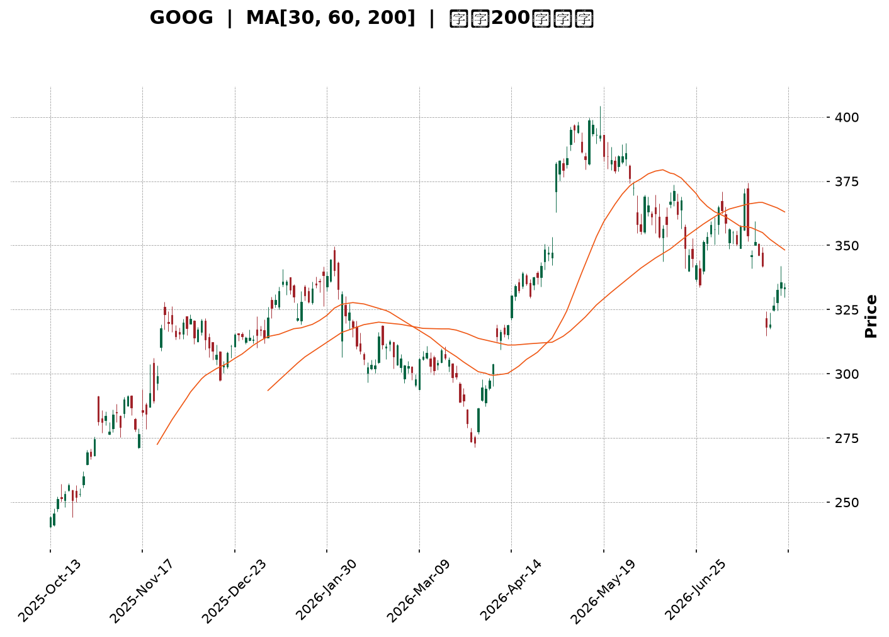
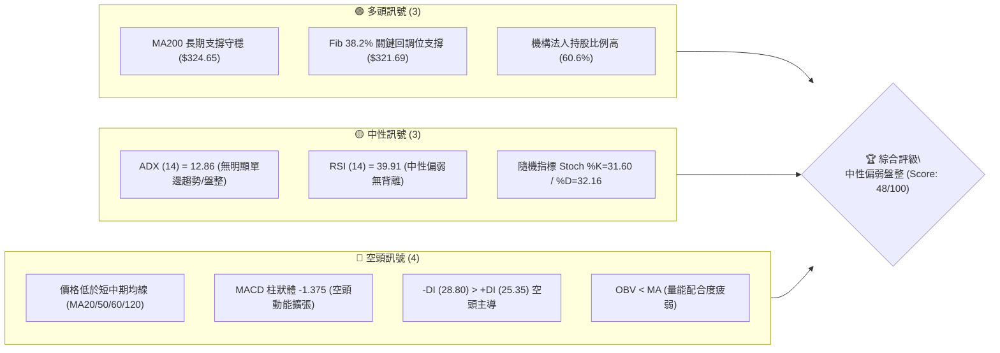
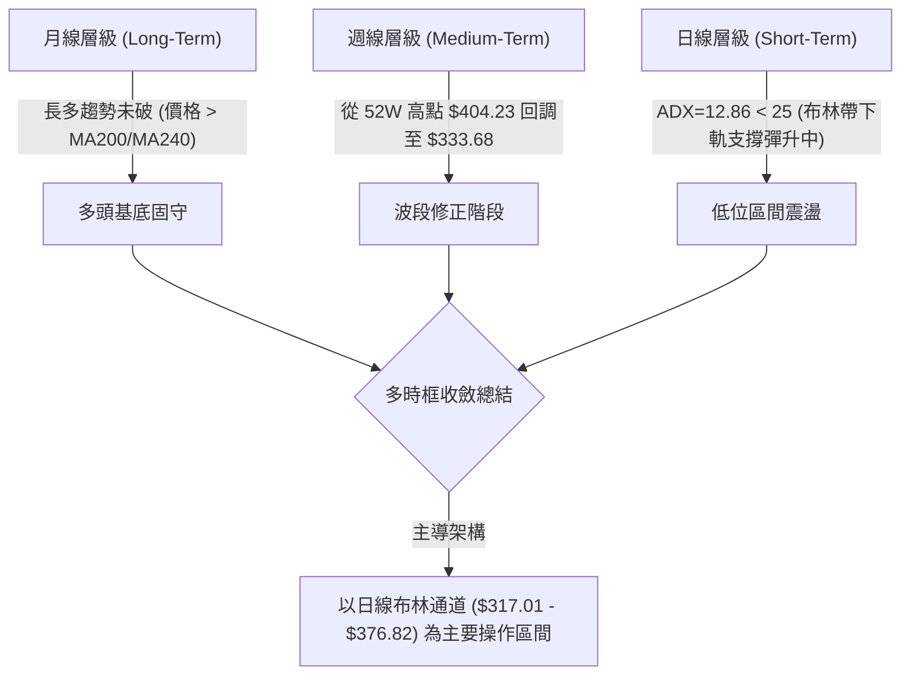
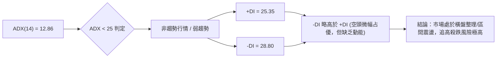
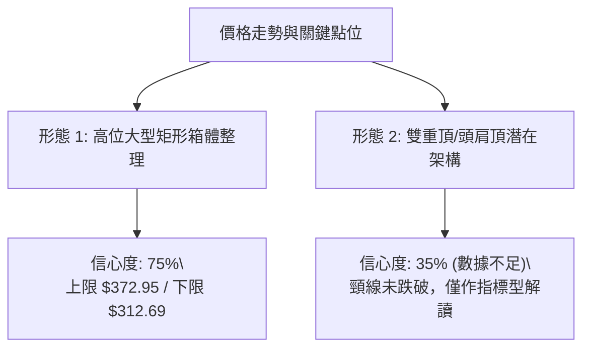
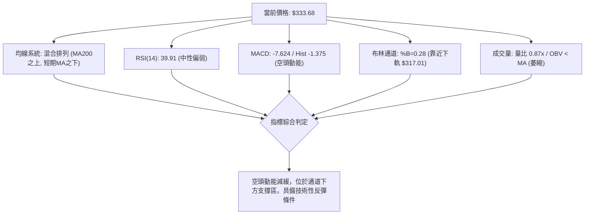
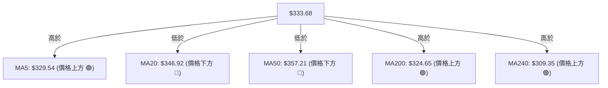
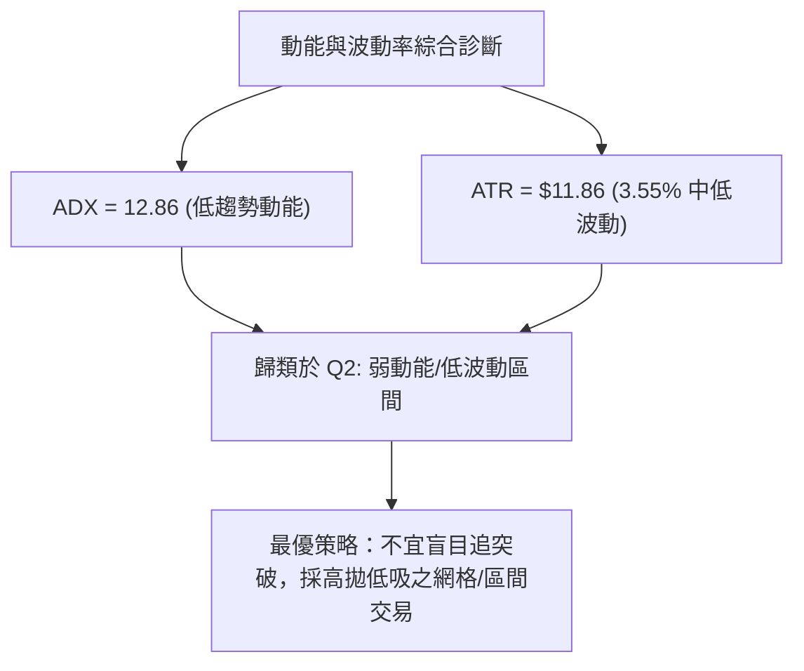
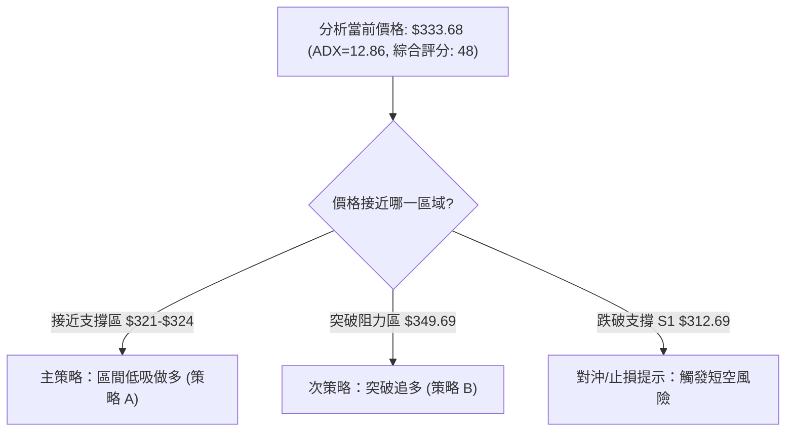
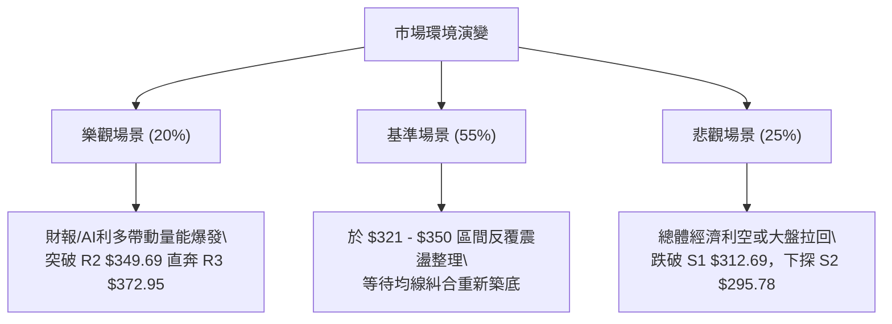

<details markdown="1">
<summary>📊 靜態圖表 (點擊展開)</summary>



</details>

<html>
<head><meta charset="utf-8" /></head>
<body>
    <div style="height:500px; width:100%;">                        <script>window.PlotlyConfig = {MathJaxConfig: 'local'};</script>
        <script charset="utf-8" src="https://cdn.plot.ly/plotly-3.7.0.min.js" integrity="sha256-jvTGqxNp8AGWEcvNLVuKr+8j5dGe9Yw51LQkmDH+IYA=" crossorigin="anonymous"></script>                <div id="candlestick-chart" class="plotly-graph-div" style="height:100%; width:100%;"></div>            <script>                window.PLOTLYENV=window.PLOTLYENV || {};                                if (document.getElementById("candlestick-chart")) {                    Plotly.newPlot(                        "candlestick-chart",                        [{"close":{"dtype":"f8","bdata":"AAAAgCqFbkAAAABgq7ZuQAAAAKD2Zm9AAAAAoGRsb0AAAACgZKlvQAAAAGBGCHBAAAAAoCVbb0AAAAAAJ4FvQAAAAAB6p29AAAAAoAFAcEAAAABgbtZwQAAAAIB6vnBAAAAAgBsqcUAAAACgk5VxQAAAAKBMlHFAAAAA4Aa5cUAAAADgQVhxQAAAAIAWw3FAAAAAQILMcUAAAAAgcnJxQAAAAEBYIHJAAAAAYLUyckAAAABA4u1xQAAAAAAvaXFAAAAA4AJHcUAAAABAqdBxQAAAAOBwxnFAAAAAYKtGckAAAACgmhZyQAAAAGAFsXJAAAAAYI3dc0AAAABgHDB0QAAAAKB0+nNAAAAAoOb3c0AAAACADqhzQAAAAMBttnNAAAAAgOL\u002fc0AAAABgRtxzQAAAAOBbF3RAAAAAgKKgc0AAAABgXdVzQAAAACBMCXRAAAAAYKaUc0AAAAAA1mFzQAAAAGCpTnNAAAAAIEE1c0AAAACAvJpyQAAAAECo9XJAAAAA4FBDc0AAAABgx25zQAAAAMBJtHNAAAAA4CC0c0AAAACAyKhzQAAAAACtn3NAAAAAYDuic0AAAABgP5ZzQAAAACCJrnNAAAAAgH7Oc0AAAABgO6JzQAAAAMAlIHRAAAAAYFpZdEAAAAAgXot0QAAAAIC7xHRAAAAA4Nr\u002fdEAAAAAg8P10QAAAAICay3RAAAAAwIqedEAAAABg1Rt0QAAAACA5f3RAAAAAIIimdEAAAACgBYB0QAAAAGB50nRAAAAAQAHpdEAAAABAdf10QAAAAAB9I3VAAAAAQGkhdUAAAADAMod1QAAAAAAWRHVAAAAAwHrOdEAAAACAXK50QAAAAIDaKnRAAAAAQKA\u002fdEAAAABAbeNzQAAAAGDHbnNAAAAA4HVPc0AAAAAg7hlzQAAAACDM5nJAAAAAoLH4ckAAAAAgn\u002fJyQAAAACDTp3NAAAAAIIh0c0AAAABgOmhzQAAAAIDxiXNAAAAAgPwrc0AAAACAYHBzQAAAAOBcH3NAAAAAIJ\u002fyckAAAAAg3fByQAAAAOBGyHJAAAAAQJKeckAAAAAgNx1zQAAAACDtK3NAAAAAgMBDc0AAAAAgcfByQAAAAIB11HJAAAAAYMoDc0AAAAAglVNzQAAAACDaIXNAAAAA4LwYc0AAAADAw6lyQAAAAEBxrXJAAAAAwGoQckAAAAAgpxZyQAAAAGAjiXFAAAAAgIYZcUAAAACgnA9xQAAAAMD\u002f6nFAAAAA4I9rckAAAACghmRyQAAAAACyl3JAAAAAgPT7ckAAAACgz6hzQAAAACDgwnNAAAAAQHu4c0AAAADASfBzQAAAAEAZpnRAAAAAIE3kdEAAAAAAHsl0QAAAAEAiM3VAAAAAICzzdEAAAAAAV6R0QAAAACBuGHVAAAAA4L8YdUAAAABg02F1QAAAAED3xHVAAAAA4Ke0dUAAAAAgnrF1QAAAAEBd23dAAAAAANXvd0AAAABAlrZ3QAAAACCfAHhAAAAAAHCueEAAAADg\u002frB4QAAAAKD6zHhAAAAAAJkoeEAAAAAgbfl3QAAAAMDM7HhAAAAA4OXOeEAAAADAVZF4QAAAAAD6jXhAAAAAILIKeEAAAAAgsgp4QAAAAGDU83dAAAAA4G2yd0AAAACAvAl4QAAAAICTCXhAAAAAQDQeeEAAAADgQYN3QAAAAMCxRXdAAAAAgMpidkAAAAAAdTd2QAAAACDEEHdAAAAA4KPYdkAAAABguJJ2QAAAAOCjpHZAAAAAwB4VdkAAAADA9Uh2QAAAAGCPYnZAAAAAgMLxdkAAAACgmTF3QAAAAKCZoXZAAAAAIFz3dkAAAADgesx1QAAAAKBHoXVAAAAA4KOQdUAAAABACmN1QAAAAEAK63RAAAAA4Hr0dUAAAACgRxV2QAAAAIA9XnZAAAAAQOFCdkAAAABgZs52QAAAAIDruXZAAAAAIFxrdkAAAAAA10N2QAAAAOB6MHZAAAAAYLjqdUAAAACgR1V2QAAAACBcI3dAAAAAwPUcdkAAAACA66F1QAAAAIDr9XVAAAAAQAqjdUAAAABgj151QAAAAKBw5XNAAAAAoHDxc0AAAADAHml0QAAAAKCZyXRAAAAAACn8dEAAAABA4dp0QA=="},"high":{"dtype":"f8","bdata":"gcQgJFiQbkDto0M4RvFuQLYkbUx\u002fiG9AuB00xDcRcEBgzVGINMxvQA6N0xsCFnBAwYysoizcb0Atzwie1ApwQAAvpt2A629AqzSGmfFfcEDlbWrnUuRwQAD9Dx2W7XBAMU8C1+E2cUAdGjoivjVyQJV3OnmZ23FAo2KdChfWcUB2IgQDhpRxQJIyPSA64nFAqgQPkusDckAloCNqGL9xQOTacsc8LnJA\u002f5w8MUo8ckDnPL7\u002fmzxyQFsX\u002f1JJr3FA6jgJvalpcUCpnUoHGl9yQGnF1aTmDXJA9j4MJ3r6ckBi8qyBoiRzQL\u002fyIZfY9XJA8vrrV8ryc0DPy6DyboB0QBZN1wKrRXRAHNtVdtljdEBGobJcE\u002fBzQNOC1tOg33NAVlo7f48WdEAjKdakeCd0QLw37e4kM3RACgW2IvkMdECyDZFfsORzQLBjevkyF3RAMDCnzx0ZdEC55lSVo7tzQPq0586rhHNAjvK\u002fIAJ3c0BSNJr6qUxzQN2ajy3JDXNAQa3\u002fV2NJc0D92qAFsXRzQLVyje8xvnNA6ZSGDwm+c0AUcXeSWcJzQH46WobxqHNA0RR9CZHUc0AAvi+gp69zQA5LgofhJ3RAnnDhblXtc0CrbHbnPhJ0QAdKd46fYHRAdqkmCb2hdEAgNOo9wrB0QD+Q8XsO4HRATqWEYBNMdUAmFshmcQl1QOHm7g4FG3VAr5pz7tbsdEDdQZ3tlnp0QJVsBganxHRA1RDoQ1zsdEBVC6xQgdl0QIe8+Z6T\u002fnRAtx9tsGAcdUCYo4uoBxN1QAozVxh+XXVAb0GA14g9dUDwQ1nVbot1QKLI65sW23VABzctzs98dUD8xtK5W8N0QNw97RFWo3RACUFFBf90dEBPuZ82XRN0QHj2NDEECnRA3kj5fhLBc0D2+7VoykdzQDH6ec\u002ffB3NAIYdMOCwYc0Ag2AsMFxpzQDTKvM6LxXNAHpgc\u002fpvwc0COhs2\u002fZX9zQEpZ1aEClHNAy0KM2naJc0D8QYRmw3pzQBTYJ1zOO3NAby0AmLH4ckD\u002fW2RB+xBzQMPoqNmV73JAc0gpRgK\u002fckD0DvrqDCVzQAD778dsT3NA+jg4ORxuc0CPc1QfRUdzQM9cShY0MXNA\u002fq6w6i0Wc0CXYWHs0F1zQLddXmkCaXNAl0nSqO0nc0DHX66g\u002fQJzQDW8rigA83JAOnNuqb2OckAhuyRiuWdyQP2F1KV75XFAYwEn\u002fsBucUA7Sl9wgEFxQOJwKYgJ7nFAzP1kZuScckD5OrtTjXtyQJrNf33to3JAkwHHdKz+ckAwiWKrKvNzQJEggkPT03NAqn7Rz+z0c0AUNEFVzvNzQBmyJPoOp3RAJlm9scbsdEC3LFNE1RJ1QAXbEO98PHVAH\u002fq\u002f3EsvdUA3toi+eQ91QHt3zyI6HXVAYXf5T0k\u002fdUBS2O5\u002fu3d1QLqI9OIF63VA9VhTVgjbdUDl1i+\u002f\u002fxJ2QHrHzcxl5ndAdN3F9Izyd0DpkdDQLv93QBAY6NGdS3hA5jXv8UPCeEDFhuov29F4QCk1iR8W4nhAewDoH3yheEARb4krUiN4QMXArO4H+3hAW1s6vNLteEDQuG0xRbp4QC2XMaOgQ3lAlad5xgWSeEARwv61cGd4QIHVCaojR3hAVDSfWTcKeEBU9xkFiBJ4QETmnHDZV3hA5KTwMD9ceEBnfNUjutZ3QI5qB8b+ZXdANiGpyRQZd0DaQcPygqR2QCq45EszGndAVVhcpqUPd0AAAACAFLZ2QAAAAGASG3dAAAAAwPXkdkAAAAAAKWB2QAAAAEBezHZAAAAAYGYqd0AAAACgmVl3QAAAAGBmIndAAAAAAAAQd0AAAABAM2N2QAAAACCFy3VAAAAAoEcNdkAAAABACnN1QAAAAIDrgXVAAAAAIIX\u002fdUAAAACAPTZ2QAAAAMD1eHZAAAAAANePdkAAAABA4dp2QAAAAIA9LndAAAAAIK7PdkAAAAAgrkt2QAAAAEDhOnZAAAAAAAA8dkAAAACAFF52QAAAAIA9QndAAAAAoJlld0AAAABguMJ1QAAAAADXd3ZAAAAAANfrdUAAAABAM9d1QAAAAEAzR3RAAAAAIK4\u002fdEAAAADAnaF0QAAAACBc83RAAAAAIK5fdUAAAABAM\u002fd0QA=="},"hovertemplate":"\u003cb\u003e%{x|%Y-%m-%d}\u003c\u002fb\u003e\u003cbr\u003e\u958b: $%{open:.2f}\u003cbr\u003e\u9ad8: $%{high:.2f}\u003cbr\u003e\u4f4e: $%{low:.2f}\u003cbr\u003e\u6536: $%{close:.2f}\u003cextra\u003e\u003c\u002fextra\u003e","low":{"dtype":"f8","bdata":"TC9p9u0IbkDxj+ZQmRZuQHJjWbjUyW5AGtLto79Fb0AKTIyUUQNvQLYMWghDw29AA+tU4h+GbkCP5sYwwT5vQJNskcrAiG9A9+DuKyvzb0A8n8Fbv4ZwQCA8arhbqnBATj+aYXq+cECssDwebH5xQHRCKo6uT3FAtzVi7CR9cUBQNhyzLEVxQPIEXgtiVXFAydnC7hqRcUCoouaaNTNxQJ9eE\u002f3Dr3FALq3MzRH1cUCcugvwLb1xQPbrYnlMV3FAE\u002fntwBDucEBC2yO6yLpxQA9EpWxtZ3FA0fCIYLfxcUCe\u002fH1dqwlyQLWKHOOLXHJAyCl3TLdMc0COHwPqG9NzQEg6r61FyXNAK8OU2h7Fc0Bt1G1C2pVzQLgWKGyvmXNAs5HDrKSac0AgMHTvj69zQBwtAkiq9XNA6ymTMwx4c0C11oZMZINzQPJRLm\u002fQr3NAqoR0C5xXc0A7s6RH8yhzQLoTycJ0FXNAf08Tee\u002f2ckDruLdC\u002fZByQNStsW3Nw3JA20LlgyDfckAVmZG2CSNzQIymkdqCZXNAnmIG0JOOc0C8Wt4g+JRzQJF7US\u002fjd3NACiXpknWNc0BPb21trnxzQK8m+7bpY3NAWyIasmatc0DkOCoQ635zQOqFeONuoXNAuFf+3B0ZdEBi\u002fLwSMF10QGsFSvhcUXRAJtFVXp7edEBfUmGCU6t0QMQE8v64rXRATZCUGd57dEClgM5Jigd0QIUBNsH38XNAt3QjejaHdECLq3n1q3h0QIwSwFsAcXRArDGR7gfVdEBelS0PJbt0QDPB4pOyZHRAwMUxXEvDdEADFjvlJPl0QIHjgadeInVAhzjC2AqPdEAgGMq7TyhzQP6Q7AS3+3NAKkfQ8JDUc0DNXchY\u002faNzQOvKJaqaW3NA7RRlRfc7c0B\u002fIvb0DfhyQAS7u2QziHJAqAIB+l\u002fZckDAtqgyccRyQNRq5iRdAHNA6N9b9l1Zc0BGOYlxDBtzQOkqcb5MT3NAkeFy1j7gckAcZUHnHfNyQGWvqHSsynJAcOSXLP2EckApin7KhMZyQJ06Wm7lmnJAQ\u002fyVzdVtckDg3IciDVxyQJfkqZ0FEnNAJY1HG38ac0AObrx2i8pyQMBtd2OYuXJA9B0oLg7ackA78THXqwJzQCbvKZzHFXNAyMxXZxrNckCdJKTmJIlyQI6MVbCcnXJAXBiYeeYKckB4XT54J\u002fNxQEgZ2EkdbnFA\u002fGebUAwVcUAVnzN08vVwQEa3PiJ\u002fSXFAVdeFALwUckDFtMs5WvZxQGQN7wjQWXJAAljd8\u002fRzckD6qWhDRYhzQFk5gr+KVHNAiJND6Jylc0BZLTh5BZhzQJhoBDtPD3RAxNpBsGWHdECnGmpCNbd0QEP\u002fW81u0XRAYPOXJdzmdEAFs8Fx6JZ0QLbEP+AnzHRAWf2fQLztdECj4Pe\u002fld10QGLonB6uSXVAYjrariqBdUDuabOllWN1QPJGBBHyrXZAoU5ZfIxwd0CKGAOysYh3QP+XbIjwwXdAhY\u002fb7t8teED23SMrNGF4QLeelZPulnhA93qQlPYfeEDdneyZ3bd3QK5pRoSb1XdA8PGWUd6HeEBqkkPFaFh4QFOo2VGjanhAteZNblDsd0Brq17SV7x3QCaMgDQHtHdAxjlZIoWgd0Ci2P9ql653QGbq7dhS3HdA74Zuv1TQd0BsnlufMmF3QKABB1LNF3dAibMwWpUsdkCIF+BzqyJ2QEzrIKZiKXZAlGzUjJmWdkAAAACAPV52QAAAACCFK3ZAAAAAwPUMdkAAAACAFHp1QAAAAKBwFXZAAAAAYGbKdkAAAADAHtV2QAAAACCug3ZAAAAAYLpJdkAAAABACk91QAAAAKBwO3VAAAAAAABYdUAAAABgZv50QAAAAEAK23RAAAAAwPUsdUAAAACAwsF1QAAAACCuE3ZAAAAAwB7ldUAAAABACiN2QAAAAGC4pnZAAAAAQDMrdkAAAABgj8p1QAAAAEAz63VAAAAAwB7ddUAAAACgcM11QAAAAGC4OnZAAAAAYLj6dUAAAAAAAFJ1QAAAAIAU4HVAAAAAACmgdUAAAACAPVp1QAAAAIA9rnNAAAAAAADYc0AAAABgj0Z0QAAAAOCjSHRAAAAAIIemdEAAAADAHp10QA=="},"name":"\u50f9\u683c","open":{"dtype":"f8","bdata":"RQK9Od8RbkAt6M\u002fxBiluQHXijrcw825Ax90hgBN\u002fb0D4WddZd1tvQNT2uM9h129AfDb+twXYb0AlmSxiW9BvQF7wEbuEpm9AK8eEGL8McEDZW0M+dI1wQEaVaVG+2nBAGpJjMFrBcEAvafewYzJyQB\u002fWE2dqqnFAdCUtX+GdcUD5KtxYXkhxQKG3pQZWbXFAlGrE9dDScUDEJQPddrpxQGdutcpPy3FAYFVi\u002fS36cUCPdM3TNzhyQKV78wfnpnFAya0mXs\u002f1cEC6vQ+Xb91xQLPIgQG7\u002fnFAxoXMofTxcUAUVd87TQJzQBp3dsaghHJA3Df9BW1mc0AkV11OkmJ0QOa7ZZ5wAnRA7QnD2sEsdEDdSTXBqc1zQGNk7DJ7xHNASmsep5a2c0DgqZLzmyZ0QAzJAf\u002f79XNAT+Rk9MYJdEBR9J7bD4tzQFrPswlPw3NAsEGLMeUKdEBpnuKlJaZzQG2sjPV4g3NA7914P5wZc0Bt1sE3tUlzQN2aQ7Ch6nJAtIlJy\u002fztckBl06nvGW1zQJJjscupa3NATWMjT8y7c0AaQEGeH7hzQBauYaSWhnNAvvb1FwSQc0DlV2hsYI9zQOq0fN3O0nNAsMLTfnzUc0DR1i+fVc5zQOcSrEONonNAtS\u002faeV2NdECy4OpxAHF0QDy4hq0uYXRA+16ypXrtdEB61Bb1w+h0QCDplDXSGXVAZgjUT\u002ffndEC1runqIQ10QO6uQrHQCnRAROgNsULddEBLa0qqiMN0QOwIGdBYfHRAVxLeYRLzdECjoGscuwJ1QFGUOzd+PnVAOxCiQWDgdEAmbFDCxQF1QBsWWnn2wHVA3dKN8+Z0dUCCWe8JqYxzQMzRHcjDbnRABplpxCENdEAxderv2wd0QB8Sgxaz6HNAYHBJEhR\u002fc0C9zSI\u002fVDlzQJoFBof2w3JAvgSB75jgckBRPybPAOJyQMmQ8HxvBnNA8HshjZPrc0BUkij\u002fwGNzQCPdWP1me3NAYfJnJVmGc0AkDKuJsfhyQPt6zSUd6XJAtQ+QOX2gckABb+e2o+RyQMY+RYLe7HJA3DPHSPh6ckB3bTthVF9yQLYOV3kOG3NAHNYmGdohc0Bw1uy7aSBzQOxI1XOHJ3NAl08vpa32ckBaK2DNyQdzQIxot0uEO3NAP2RxFXHwckDldOKdMf5yQGmYt4eWxXJA6LnEWoKAckBpnU6Rlj9yQMG+zjJJ4HFAM7gb6LpTcUBetoK1YzRxQB35SBb4VXFA5D7gvuMcckD7eyf6Dg1yQCfk9ipdaHJA8Dc7Flq\u002fckAyFT6jONpzQE6eebUGkHNAHMUAlIngc0CJDS1Wr7NzQGfD99nwHXRAamv3YceldEA+SVcpXvp0QHIGaV6p43RAs8wkt7MldUC4DidmIfZ0QIe+OALw6nRAC\u002fjvoO41dUDV1kIVRRh1QKIAZE7FenVAqA\u002fMrWGrdUAM0SACW5R1QGVINdOBMHdAoqPZ6Aqcd0CYjtXlcOF3QGlau6k+2ndAI85pzLBVeEB9c\u002fqJI814QJuONZmGoHhADlWlt0dneEBXnMN3Swx4QOIPSffN2ndACcnGs9mYeEApyjrip494QALuO+05fnhAF284zgOReEBSwrFH7wx4QD980th73HdACzz+0Hjwd0BDcA7ZQMx3QHVUa3aO6HdAiY5a0RD6d0CJ091v7s93QEcfI2OdRXdApnxqnxCvdkB3G4xV6WF2QMnPeZKeM3ZAjPMWPZWydkAAAACAwqd2QAAAAAApznZAAAAAwMyQdkAAAADAzBB2QAAAAKCZkXZAAAAAANffdkAAAACgcPd2QAAAAMDM8HZAAAAAgD2+dkAAAAAAKVJ2QAAAACCuQXVAAAAAIIXLdUAAAABguA51QAAAACCuT3VAAAAAQDM\u002fdUAAAAAgXO91QAAAAADXKXZAAAAAYGZCdkAAAADAHmN2QAAAAIDC83ZAAAAAIFyjdkAAAAAgXPF1QAAAAKBDL3ZAAAAAANcfdkAAAACgcM11QAAAAAApQHZAAAAAYLhCd0AAAADgUZx1QAAAAGC44nVAAAAAwPXodUAAAABA4bJ1QAAAAIAUGnRAAAAAwMzkc0AAAAAA10t0QAAAAMDMfHRAAAAAAADYdEAAAACgR9F0QA=="},"x":["2025-10-13T00:00:00-04:00","2025-10-14T00:00:00-04:00","2025-10-15T00:00:00-04:00","2025-10-16T00:00:00-04:00","2025-10-17T00:00:00-04:00","2025-10-20T00:00:00-04:00","2025-10-21T00:00:00-04:00","2025-10-22T00:00:00-04:00","2025-10-23T00:00:00-04:00","2025-10-24T00:00:00-04:00","2025-10-27T00:00:00-04:00","2025-10-28T00:00:00-04:00","2025-10-29T00:00:00-04:00","2025-10-30T00:00:00-04:00","2025-10-31T00:00:00-04:00","2025-11-03T00:00:00-05:00","2025-11-04T00:00:00-05:00","2025-11-05T00:00:00-05:00","2025-11-06T00:00:00-05:00","2025-11-07T00:00:00-05:00","2025-11-10T00:00:00-05:00","2025-11-11T00:00:00-05:00","2025-11-12T00:00:00-05:00","2025-11-13T00:00:00-05:00","2025-11-14T00:00:00-05:00","2025-11-17T00:00:00-05:00","2025-11-18T00:00:00-05:00","2025-11-19T00:00:00-05:00","2025-11-20T00:00:00-05:00","2025-11-21T00:00:00-05:00","2025-11-24T00:00:00-05:00","2025-11-25T00:00:00-05:00","2025-11-26T00:00:00-05:00","2025-11-28T00:00:00-05:00","2025-12-01T00:00:00-05:00","2025-12-02T00:00:00-05:00","2025-12-03T00:00:00-05:00","2025-12-04T00:00:00-05:00","2025-12-05T00:00:00-05:00","2025-12-08T00:00:00-05:00","2025-12-09T00:00:00-05:00","2025-12-10T00:00:00-05:00","2025-12-11T00:00:00-05:00","2025-12-12T00:00:00-05:00","2025-12-15T00:00:00-05:00","2025-12-16T00:00:00-05:00","2025-12-17T00:00:00-05:00","2025-12-18T00:00:00-05:00","2025-12-19T00:00:00-05:00","2025-12-22T00:00:00-05:00","2025-12-23T00:00:00-05:00","2025-12-24T00:00:00-05:00","2025-12-26T00:00:00-05:00","2025-12-29T00:00:00-05:00","2025-12-30T00:00:00-05:00","2025-12-31T00:00:00-05:00","2026-01-02T00:00:00-05:00","2026-01-05T00:00:00-05:00","2026-01-06T00:00:00-05:00","2026-01-07T00:00:00-05:00","2026-01-08T00:00:00-05:00","2026-01-09T00:00:00-05:00","2026-01-12T00:00:00-05:00","2026-01-13T00:00:00-05:00","2026-01-14T00:00:00-05:00","2026-01-15T00:00:00-05:00","2026-01-16T00:00:00-05:00","2026-01-20T00:00:00-05:00","2026-01-21T00:00:00-05:00","2026-01-22T00:00:00-05:00","2026-01-23T00:00:00-05:00","2026-01-26T00:00:00-05:00","2026-01-27T00:00:00-05:00","2026-01-28T00:00:00-05:00","2026-01-29T00:00:00-05:00","2026-01-30T00:00:00-05:00","2026-02-02T00:00:00-05:00","2026-02-03T00:00:00-05:00","2026-02-04T00:00:00-05:00","2026-02-05T00:00:00-05:00","2026-02-06T00:00:00-05:00","2026-02-09T00:00:00-05:00","2026-02-10T00:00:00-05:00","2026-02-11T00:00:00-05:00","2026-02-12T00:00:00-05:00","2026-02-13T00:00:00-05:00","2026-02-17T00:00:00-05:00","2026-02-18T00:00:00-05:00","2026-02-19T00:00:00-05:00","2026-02-20T00:00:00-05:00","2026-02-23T00:00:00-05:00","2026-02-24T00:00:00-05:00","2026-02-25T00:00:00-05:00","2026-02-26T00:00:00-05:00","2026-02-27T00:00:00-05:00","2026-03-02T00:00:00-05:00","2026-03-03T00:00:00-05:00","2026-03-04T00:00:00-05:00","2026-03-05T00:00:00-05:00","2026-03-06T00:00:00-05:00","2026-03-09T00:00:00-04:00","2026-03-10T00:00:00-04:00","2026-03-11T00:00:00-04:00","2026-03-12T00:00:00-04:00","2026-03-13T00:00:00-04:00","2026-03-16T00:00:00-04:00","2026-03-17T00:00:00-04:00","2026-03-18T00:00:00-04:00","2026-03-19T00:00:00-04:00","2026-03-20T00:00:00-04:00","2026-03-23T00:00:00-04:00","2026-03-24T00:00:00-04:00","2026-03-25T00:00:00-04:00","2026-03-26T00:00:00-04:00","2026-03-27T00:00:00-04:00","2026-03-30T00:00:00-04:00","2026-03-31T00:00:00-04:00","2026-04-01T00:00:00-04:00","2026-04-02T00:00:00-04:00","2026-04-06T00:00:00-04:00","2026-04-07T00:00:00-04:00","2026-04-08T00:00:00-04:00","2026-04-09T00:00:00-04:00","2026-04-10T00:00:00-04:00","2026-04-13T00:00:00-04:00","2026-04-14T00:00:00-04:00","2026-04-15T00:00:00-04:00","2026-04-16T00:00:00-04:00","2026-04-17T00:00:00-04:00","2026-04-20T00:00:00-04:00","2026-04-21T00:00:00-04:00","2026-04-22T00:00:00-04:00","2026-04-23T00:00:00-04:00","2026-04-24T00:00:00-04:00","2026-04-27T00:00:00-04:00","2026-04-28T00:00:00-04:00","2026-04-29T00:00:00-04:00","2026-04-30T00:00:00-04:00","2026-05-01T00:00:00-04:00","2026-05-04T00:00:00-04:00","2026-05-05T00:00:00-04:00","2026-05-06T00:00:00-04:00","2026-05-07T00:00:00-04:00","2026-05-08T00:00:00-04:00","2026-05-11T00:00:00-04:00","2026-05-12T00:00:00-04:00","2026-05-13T00:00:00-04:00","2026-05-14T00:00:00-04:00","2026-05-15T00:00:00-04:00","2026-05-18T00:00:00-04:00","2026-05-19T00:00:00-04:00","2026-05-20T00:00:00-04:00","2026-05-21T00:00:00-04:00","2026-05-22T00:00:00-04:00","2026-05-26T00:00:00-04:00","2026-05-27T00:00:00-04:00","2026-05-28T00:00:00-04:00","2026-05-29T00:00:00-04:00","2026-06-01T00:00:00-04:00","2026-06-02T00:00:00-04:00","2026-06-03T00:00:00-04:00","2026-06-04T00:00:00-04:00","2026-06-05T00:00:00-04:00","2026-06-08T00:00:00-04:00","2026-06-09T00:00:00-04:00","2026-06-10T00:00:00-04:00","2026-06-11T00:00:00-04:00","2026-06-12T00:00:00-04:00","2026-06-15T00:00:00-04:00","2026-06-16T00:00:00-04:00","2026-06-17T00:00:00-04:00","2026-06-18T00:00:00-04:00","2026-06-22T00:00:00-04:00","2026-06-23T00:00:00-04:00","2026-06-24T00:00:00-04:00","2026-06-25T00:00:00-04:00","2026-06-26T00:00:00-04:00","2026-06-29T00:00:00-04:00","2026-06-30T00:00:00-04:00","2026-07-01T00:00:00-04:00","2026-07-02T00:00:00-04:00","2026-07-06T00:00:00-04:00","2026-07-07T00:00:00-04:00","2026-07-08T00:00:00-04:00","2026-07-09T00:00:00-04:00","2026-07-10T00:00:00-04:00","2026-07-13T00:00:00-04:00","2026-07-14T00:00:00-04:00","2026-07-15T00:00:00-04:00","2026-07-16T00:00:00-04:00","2026-07-17T00:00:00-04:00","2026-07-20T00:00:00-04:00","2026-07-21T00:00:00-04:00","2026-07-22T00:00:00-04:00","2026-07-23T00:00:00-04:00","2026-07-24T00:00:00-04:00","2026-07-27T00:00:00-04:00","2026-07-28T00:00:00-04:00","2026-07-29T00:00:00-04:00","2026-07-30T00:00:00-04:00"],"type":"candlestick"},{"hovertemplate":"MA30: $%{y:.2f}\u003cextra\u003e\u003c\u002fextra\u003e","line":{"color":"#2196F3","dash":"dash","width":2},"mode":"lines","name":"MA30","x":["2025-10-13T00:00:00-04:00","2025-10-14T00:00:00-04:00","2025-10-15T00:00:00-04:00","2025-10-16T00:00:00-04:00","2025-10-17T00:00:00-04:00","2025-10-20T00:00:00-04:00","2025-10-21T00:00:00-04:00","2025-10-22T00:00:00-04:00","2025-10-23T00:00:00-04:00","2025-10-24T00:00:00-04:00","2025-10-27T00:00:00-04:00","2025-10-28T00:00:00-04:00","2025-10-29T00:00:00-04:00","2025-10-30T00:00:00-04:00","2025-10-31T00:00:00-04:00","2025-11-03T00:00:00-05:00","2025-11-04T00:00:00-05:00","2025-11-05T00:00:00-05:00","2025-11-06T00:00:00-05:00","2025-11-07T00:00:00-05:00","2025-11-10T00:00:00-05:00","2025-11-11T00:00:00-05:00","2025-11-12T00:00:00-05:00","2025-11-13T00:00:00-05:00","2025-11-14T00:00:00-05:00","2025-11-17T00:00:00-05:00","2025-11-18T00:00:00-05:00","2025-11-19T00:00:00-05:00","2025-11-20T00:00:00-05:00","2025-11-21T00:00:00-05:00","2025-11-24T00:00:00-05:00","2025-11-25T00:00:00-05:00","2025-11-26T00:00:00-05:00","2025-11-28T00:00:00-05:00","2025-12-01T00:00:00-05:00","2025-12-02T00:00:00-05:00","2025-12-03T00:00:00-05:00","2025-12-04T00:00:00-05:00","2025-12-05T00:00:00-05:00","2025-12-08T00:00:00-05:00","2025-12-09T00:00:00-05:00","2025-12-10T00:00:00-05:00","2025-12-11T00:00:00-05:00","2025-12-12T00:00:00-05:00","2025-12-15T00:00:00-05:00","2025-12-16T00:00:00-05:00","2025-12-17T00:00:00-05:00","2025-12-18T00:00:00-05:00","2025-12-19T00:00:00-05:00","2025-12-22T00:00:00-05:00","2025-12-23T00:00:00-05:00","2025-12-24T00:00:00-05:00","2025-12-26T00:00:00-05:00","2025-12-29T00:00:00-05:00","2025-12-30T00:00:00-05:00","2025-12-31T00:00:00-05:00","2026-01-02T00:00:00-05:00","2026-01-05T00:00:00-05:00","2026-01-06T00:00:00-05:00","2026-01-07T00:00:00-05:00","2026-01-08T00:00:00-05:00","2026-01-09T00:00:00-05:00","2026-01-12T00:00:00-05:00","2026-01-13T00:00:00-05:00","2026-01-14T00:00:00-05:00","2026-01-15T00:00:00-05:00","2026-01-16T00:00:00-05:00","2026-01-20T00:00:00-05:00","2026-01-21T00:00:00-05:00","2026-01-22T00:00:00-05:00","2026-01-23T00:00:00-05:00","2026-01-26T00:00:00-05:00","2026-01-27T00:00:00-05:00","2026-01-28T00:00:00-05:00","2026-01-29T00:00:00-05:00","2026-01-30T00:00:00-05:00","2026-02-02T00:00:00-05:00","2026-02-03T00:00:00-05:00","2026-02-04T00:00:00-05:00","2026-02-05T00:00:00-05:00","2026-02-06T00:00:00-05:00","2026-02-09T00:00:00-05:00","2026-02-10T00:00:00-05:00","2026-02-11T00:00:00-05:00","2026-02-12T00:00:00-05:00","2026-02-13T00:00:00-05:00","2026-02-17T00:00:00-05:00","2026-02-18T00:00:00-05:00","2026-02-19T00:00:00-05:00","2026-02-20T00:00:00-05:00","2026-02-23T00:00:00-05:00","2026-02-24T00:00:00-05:00","2026-02-25T00:00:00-05:00","2026-02-26T00:00:00-05:00","2026-02-27T00:00:00-05:00","2026-03-02T00:00:00-05:00","2026-03-03T00:00:00-05:00","2026-03-04T00:00:00-05:00","2026-03-05T00:00:00-05:00","2026-03-06T00:00:00-05:00","2026-03-09T00:00:00-04:00","2026-03-10T00:00:00-04:00","2026-03-11T00:00:00-04:00","2026-03-12T00:00:00-04:00","2026-03-13T00:00:00-04:00","2026-03-16T00:00:00-04:00","2026-03-17T00:00:00-04:00","2026-03-18T00:00:00-04:00","2026-03-19T00:00:00-04:00","2026-03-20T00:00:00-04:00","2026-03-23T00:00:00-04:00","2026-03-24T00:00:00-04:00","2026-03-25T00:00:00-04:00","2026-03-26T00:00:00-04:00","2026-03-27T00:00:00-04:00","2026-03-30T00:00:00-04:00","2026-03-31T00:00:00-04:00","2026-04-01T00:00:00-04:00","2026-04-02T00:00:00-04:00","2026-04-06T00:00:00-04:00","2026-04-07T00:00:00-04:00","2026-04-08T00:00:00-04:00","2026-04-09T00:00:00-04:00","2026-04-10T00:00:00-04:00","2026-04-13T00:00:00-04:00","2026-04-14T00:00:00-04:00","2026-04-15T00:00:00-04:00","2026-04-16T00:00:00-04:00","2026-04-17T00:00:00-04:00","2026-04-20T00:00:00-04:00","2026-04-21T00:00:00-04:00","2026-04-22T00:00:00-04:00","2026-04-23T00:00:00-04:00","2026-04-24T00:00:00-04:00","2026-04-27T00:00:00-04:00","2026-04-28T00:00:00-04:00","2026-04-29T00:00:00-04:00","2026-04-30T00:00:00-04:00","2026-05-01T00:00:00-04:00","2026-05-04T00:00:00-04:00","2026-05-05T00:00:00-04:00","2026-05-06T00:00:00-04:00","2026-05-07T00:00:00-04:00","2026-05-08T00:00:00-04:00","2026-05-11T00:00:00-04:00","2026-05-12T00:00:00-04:00","2026-05-13T00:00:00-04:00","2026-05-14T00:00:00-04:00","2026-05-15T00:00:00-04:00","2026-05-18T00:00:00-04:00","2026-05-19T00:00:00-04:00","2026-05-20T00:00:00-04:00","2026-05-21T00:00:00-04:00","2026-05-22T00:00:00-04:00","2026-05-26T00:00:00-04:00","2026-05-27T00:00:00-04:00","2026-05-28T00:00:00-04:00","2026-05-29T00:00:00-04:00","2026-06-01T00:00:00-04:00","2026-06-02T00:00:00-04:00","2026-06-03T00:00:00-04:00","2026-06-04T00:00:00-04:00","2026-06-05T00:00:00-04:00","2026-06-08T00:00:00-04:00","2026-06-09T00:00:00-04:00","2026-06-10T00:00:00-04:00","2026-06-11T00:00:00-04:00","2026-06-12T00:00:00-04:00","2026-06-15T00:00:00-04:00","2026-06-16T00:00:00-04:00","2026-06-17T00:00:00-04:00","2026-06-18T00:00:00-04:00","2026-06-22T00:00:00-04:00","2026-06-23T00:00:00-04:00","2026-06-24T00:00:00-04:00","2026-06-25T00:00:00-04:00","2026-06-26T00:00:00-04:00","2026-06-29T00:00:00-04:00","2026-06-30T00:00:00-04:00","2026-07-01T00:00:00-04:00","2026-07-02T00:00:00-04:00","2026-07-06T00:00:00-04:00","2026-07-07T00:00:00-04:00","2026-07-08T00:00:00-04:00","2026-07-09T00:00:00-04:00","2026-07-10T00:00:00-04:00","2026-07-13T00:00:00-04:00","2026-07-14T00:00:00-04:00","2026-07-15T00:00:00-04:00","2026-07-16T00:00:00-04:00","2026-07-17T00:00:00-04:00","2026-07-20T00:00:00-04:00","2026-07-21T00:00:00-04:00","2026-07-22T00:00:00-04:00","2026-07-23T00:00:00-04:00","2026-07-24T00:00:00-04:00","2026-07-27T00:00:00-04:00","2026-07-28T00:00:00-04:00","2026-07-29T00:00:00-04:00","2026-07-30T00:00:00-04:00"],"y":{"dtype":"f8","bdata":"AAAAAAAA+H8AAAAAAAD4fwAAAAAAAPh\u002fAAAAAAAA+H8AAAAAAAD4fwAAAAAAAPh\u002fAAAAAAAA+H8AAAAAAAD4fwAAAAAAAPh\u002fAAAAAAAA+H8AAAAAAAD4fwAAAAAAAPh\u002fAAAAAAAA+H8AAAAAAAD4fwAAAAAAAPh\u002fAAAAAAAA+H8AAAAAAAD4fwAAAAAAAPh\u002fAAAAAAAA+H8AAAAAAAD4fwAAAAAAAPh\u002fAAAAAAAA+H8AAAAAAAD4fwAAAAAAAPh\u002fAAAAAAAA+H8AAAAAAAD4fwAAAAAAAPh\u002fAAAAAAAA+H8AAAAAAAD4f+\u002fu7pZOCHFAiYiIIJsvcUAzMzPz1FhxQCIiIrpUfXFAmpmZiaehcUBmZma+TMJxQM3MzHS04XFAq6qq+pQGckCamZl5oylyQDMzM6MGTnJAzczMzNhqckDNzMxMaYRyQKuqqlqBoHJAVVVVlR+1ckAREREhd8RyQERERPQ103JAAAAAkOLfckAiIiJioupyQBEREXHa9HJAvLu7y1gBc0AiIiKSShJzQN7d3Y3BH3NAiYiIeJosc0ARERHhXTtzQCIiIvI\u002fTnNA3t3dbVtic0CJiIgIenFzQLy7uxu\u002fgXNA3t3drc6Oc0BERES0\u002fptzQERERIQ7qHNAMzMz81usc0DNzMysZq9zQFVVVcUktnNA3t3dLfG+c0ARERGRVspzQKuqqsqT03NAq6qqqt3Yc0CJiIgI\u002fNpzQHd3d1dy3nNAIiIiMi3nc0CJiIh43exzQN7d3S2S83NAq6qqiur+c0DNzMwMowx0QERERLRDHHRAERERcassdEARERFRnkV0QERERKRMWXRAREREtHhmdEDv7u7OH3F0QBEREZETdXRAIiIi8rl5dEDv7u5ernt0QN7d3R0NenRAzczMzEp3dEBVVVX1JXN0QGZmZoZ9bHRAiYiIGF1ldEDe3d2Ngl90QM3MzMx\u002fW3RAERERMd9TdEDNzMzMKkp0QJqZmZmsP3RA7+7uHhQwdECamZmZ0yJ0QHd3d0eNFHRAERERsUkGdEC8u7t7UvxzQO\u002fu7s6w7XNAAAAA0Fvcc0AREREhiNBzQDMzM2NywnNAIiIisme0c0Dv7u6O56JzQLy7uxs0j3NAd3d3RyZ9c0AiIiLCXGpzQAAAAJAnWHNAq6qqKpBJc0AAAADgVzhzQKuqqiqhK3NAAAAAQP0Yc0AAAABQoQlzQN7d3S1x+XJA3t3d3ZPmckAAAADAKtVyQCIiIhLGzHJA7+7uvhHIckAiIiIyVcNyQGZmZgZDunJAq6qqGj62ckBmZmY2ZbhyQImIiAhLunJAzczM7Pm+ckDv7u5uPcNyQGZmZrZD0HJARERElNrgckCamZl5mPByQDMzM2M5BXNAIiIiYhwZc0Crqqr6JSZzQN7d3a2QNnNAq6qqyjJGc0BmZmZmC1tzQKuqqsogdHNAvLu7GxeLc0C8u7ubSp9zQHd3d8ebx3NAIiIiYunwc0B3d3d3ARx0QN7d3e1xSXRAIiIikumBdEBERETUQbp0QImIiHhA+HRAIiIi0nw0dUDNzMw8e291QGZmZlZGq3VARERENMnhdUBmZmbGehZ2QKuqqgpbSXZA7+7ufoN0dkCamZnp6Jl2QJqZmcmsvXZAZmZmRpvfdkARERGRlgJ3QKuqqgqBH3dA7+7uvgg7d0BVVVU1TlJ3QImIiKj9Y3dAvLu7qz5wd0Crqqqarn13QFVVVUV+jndAVVVVRWydd0CamZkJlqd3QJqZmbkKr3dAMzMz40Gyd0B3d3dXTbd3QCIiIvK9qndAzczM3EWid0CrqqoK1513QImIiKgjkndAzczM3ICDd0C8u7vL0Wp3QLy7u0vDT3dAZmZmhqE5d0CamZkpjSN3QDMzMwNcAXdAzczMHAPpdkARERFxz9N2QGZmZgYnwXZAVVVVZfWxdkBmZmZWaqd2QERERKTznHZAZmZmpgySdkBmZmZm64J2QAAAAFAmc3ZAq6qq6l1gdkCrqqoKTVZ2QN7d3Q0oVXZAmpmZKdRSdkDNzMwc2E12QN7d3X1qRHZAIiIikhg6dkAAAADw0i92QLy7u0tiGHZAIiIiwiAGdkAAAAAgIvZ1QFVVVVWA6HVAREREBMjXdUAAAADw0sN1QA=="},"type":"scatter"},{"hovertemplate":"MA60: $%{y:.2f}\u003cextra\u003e\u003c\u002fextra\u003e","line":{"color":"#9C27B0","dash":"dash","width":2},"mode":"lines","name":"MA60","x":["2025-10-13T00:00:00-04:00","2025-10-14T00:00:00-04:00","2025-10-15T00:00:00-04:00","2025-10-16T00:00:00-04:00","2025-10-17T00:00:00-04:00","2025-10-20T00:00:00-04:00","2025-10-21T00:00:00-04:00","2025-10-22T00:00:00-04:00","2025-10-23T00:00:00-04:00","2025-10-24T00:00:00-04:00","2025-10-27T00:00:00-04:00","2025-10-28T00:00:00-04:00","2025-10-29T00:00:00-04:00","2025-10-30T00:00:00-04:00","2025-10-31T00:00:00-04:00","2025-11-03T00:00:00-05:00","2025-11-04T00:00:00-05:00","2025-11-05T00:00:00-05:00","2025-11-06T00:00:00-05:00","2025-11-07T00:00:00-05:00","2025-11-10T00:00:00-05:00","2025-11-11T00:00:00-05:00","2025-11-12T00:00:00-05:00","2025-11-13T00:00:00-05:00","2025-11-14T00:00:00-05:00","2025-11-17T00:00:00-05:00","2025-11-18T00:00:00-05:00","2025-11-19T00:00:00-05:00","2025-11-20T00:00:00-05:00","2025-11-21T00:00:00-05:00","2025-11-24T00:00:00-05:00","2025-11-25T00:00:00-05:00","2025-11-26T00:00:00-05:00","2025-11-28T00:00:00-05:00","2025-12-01T00:00:00-05:00","2025-12-02T00:00:00-05:00","2025-12-03T00:00:00-05:00","2025-12-04T00:00:00-05:00","2025-12-05T00:00:00-05:00","2025-12-08T00:00:00-05:00","2025-12-09T00:00:00-05:00","2025-12-10T00:00:00-05:00","2025-12-11T00:00:00-05:00","2025-12-12T00:00:00-05:00","2025-12-15T00:00:00-05:00","2025-12-16T00:00:00-05:00","2025-12-17T00:00:00-05:00","2025-12-18T00:00:00-05:00","2025-12-19T00:00:00-05:00","2025-12-22T00:00:00-05:00","2025-12-23T00:00:00-05:00","2025-12-24T00:00:00-05:00","2025-12-26T00:00:00-05:00","2025-12-29T00:00:00-05:00","2025-12-30T00:00:00-05:00","2025-12-31T00:00:00-05:00","2026-01-02T00:00:00-05:00","2026-01-05T00:00:00-05:00","2026-01-06T00:00:00-05:00","2026-01-07T00:00:00-05:00","2026-01-08T00:00:00-05:00","2026-01-09T00:00:00-05:00","2026-01-12T00:00:00-05:00","2026-01-13T00:00:00-05:00","2026-01-14T00:00:00-05:00","2026-01-15T00:00:00-05:00","2026-01-16T00:00:00-05:00","2026-01-20T00:00:00-05:00","2026-01-21T00:00:00-05:00","2026-01-22T00:00:00-05:00","2026-01-23T00:00:00-05:00","2026-01-26T00:00:00-05:00","2026-01-27T00:00:00-05:00","2026-01-28T00:00:00-05:00","2026-01-29T00:00:00-05:00","2026-01-30T00:00:00-05:00","2026-02-02T00:00:00-05:00","2026-02-03T00:00:00-05:00","2026-02-04T00:00:00-05:00","2026-02-05T00:00:00-05:00","2026-02-06T00:00:00-05:00","2026-02-09T00:00:00-05:00","2026-02-10T00:00:00-05:00","2026-02-11T00:00:00-05:00","2026-02-12T00:00:00-05:00","2026-02-13T00:00:00-05:00","2026-02-17T00:00:00-05:00","2026-02-18T00:00:00-05:00","2026-02-19T00:00:00-05:00","2026-02-20T00:00:00-05:00","2026-02-23T00:00:00-05:00","2026-02-24T00:00:00-05:00","2026-02-25T00:00:00-05:00","2026-02-26T00:00:00-05:00","2026-02-27T00:00:00-05:00","2026-03-02T00:00:00-05:00","2026-03-03T00:00:00-05:00","2026-03-04T00:00:00-05:00","2026-03-05T00:00:00-05:00","2026-03-06T00:00:00-05:00","2026-03-09T00:00:00-04:00","2026-03-10T00:00:00-04:00","2026-03-11T00:00:00-04:00","2026-03-12T00:00:00-04:00","2026-03-13T00:00:00-04:00","2026-03-16T00:00:00-04:00","2026-03-17T00:00:00-04:00","2026-03-18T00:00:00-04:00","2026-03-19T00:00:00-04:00","2026-03-20T00:00:00-04:00","2026-03-23T00:00:00-04:00","2026-03-24T00:00:00-04:00","2026-03-25T00:00:00-04:00","2026-03-26T00:00:00-04:00","2026-03-27T00:00:00-04:00","2026-03-30T00:00:00-04:00","2026-03-31T00:00:00-04:00","2026-04-01T00:00:00-04:00","2026-04-02T00:00:00-04:00","2026-04-06T00:00:00-04:00","2026-04-07T00:00:00-04:00","2026-04-08T00:00:00-04:00","2026-04-09T00:00:00-04:00","2026-04-10T00:00:00-04:00","2026-04-13T00:00:00-04:00","2026-04-14T00:00:00-04:00","2026-04-15T00:00:00-04:00","2026-04-16T00:00:00-04:00","2026-04-17T00:00:00-04:00","2026-04-20T00:00:00-04:00","2026-04-21T00:00:00-04:00","2026-04-22T00:00:00-04:00","2026-04-23T00:00:00-04:00","2026-04-24T00:00:00-04:00","2026-04-27T00:00:00-04:00","2026-04-28T00:00:00-04:00","2026-04-29T00:00:00-04:00","2026-04-30T00:00:00-04:00","2026-05-01T00:00:00-04:00","2026-05-04T00:00:00-04:00","2026-05-05T00:00:00-04:00","2026-05-06T00:00:00-04:00","2026-05-07T00:00:00-04:00","2026-05-08T00:00:00-04:00","2026-05-11T00:00:00-04:00","2026-05-12T00:00:00-04:00","2026-05-13T00:00:00-04:00","2026-05-14T00:00:00-04:00","2026-05-15T00:00:00-04:00","2026-05-18T00:00:00-04:00","2026-05-19T00:00:00-04:00","2026-05-20T00:00:00-04:00","2026-05-21T00:00:00-04:00","2026-05-22T00:00:00-04:00","2026-05-26T00:00:00-04:00","2026-05-27T00:00:00-04:00","2026-05-28T00:00:00-04:00","2026-05-29T00:00:00-04:00","2026-06-01T00:00:00-04:00","2026-06-02T00:00:00-04:00","2026-06-03T00:00:00-04:00","2026-06-04T00:00:00-04:00","2026-06-05T00:00:00-04:00","2026-06-08T00:00:00-04:00","2026-06-09T00:00:00-04:00","2026-06-10T00:00:00-04:00","2026-06-11T00:00:00-04:00","2026-06-12T00:00:00-04:00","2026-06-15T00:00:00-04:00","2026-06-16T00:00:00-04:00","2026-06-17T00:00:00-04:00","2026-06-18T00:00:00-04:00","2026-06-22T00:00:00-04:00","2026-06-23T00:00:00-04:00","2026-06-24T00:00:00-04:00","2026-06-25T00:00:00-04:00","2026-06-26T00:00:00-04:00","2026-06-29T00:00:00-04:00","2026-06-30T00:00:00-04:00","2026-07-01T00:00:00-04:00","2026-07-02T00:00:00-04:00","2026-07-06T00:00:00-04:00","2026-07-07T00:00:00-04:00","2026-07-08T00:00:00-04:00","2026-07-09T00:00:00-04:00","2026-07-10T00:00:00-04:00","2026-07-13T00:00:00-04:00","2026-07-14T00:00:00-04:00","2026-07-15T00:00:00-04:00","2026-07-16T00:00:00-04:00","2026-07-17T00:00:00-04:00","2026-07-20T00:00:00-04:00","2026-07-21T00:00:00-04:00","2026-07-22T00:00:00-04:00","2026-07-23T00:00:00-04:00","2026-07-24T00:00:00-04:00","2026-07-27T00:00:00-04:00","2026-07-28T00:00:00-04:00","2026-07-29T00:00:00-04:00","2026-07-30T00:00:00-04:00"],"y":{"dtype":"f8","bdata":"AAAAAAAA+H8AAAAAAAD4fwAAAAAAAPh\u002fAAAAAAAA+H8AAAAAAAD4fwAAAAAAAPh\u002fAAAAAAAA+H8AAAAAAAD4fwAAAAAAAPh\u002fAAAAAAAA+H8AAAAAAAD4fwAAAAAAAPh\u002fAAAAAAAA+H8AAAAAAAD4fwAAAAAAAPh\u002fAAAAAAAA+H8AAAAAAAD4fwAAAAAAAPh\u002fAAAAAAAA+H8AAAAAAAD4fwAAAAAAAPh\u002fAAAAAAAA+H8AAAAAAAD4fwAAAAAAAPh\u002fAAAAAAAA+H8AAAAAAAD4fwAAAAAAAPh\u002fAAAAAAAA+H8AAAAAAAD4fwAAAAAAAPh\u002fAAAAAAAA+H8AAAAAAAD4fwAAAAAAAPh\u002fAAAAAAAA+H8AAAAAAAD4fwAAAAAAAPh\u002fAAAAAAAA+H8AAAAAAAD4fwAAAAAAAPh\u002fAAAAAAAA+H8AAAAAAAD4fwAAAAAAAPh\u002fAAAAAAAA+H8AAAAAAAD4fwAAAAAAAPh\u002fAAAAAAAA+H8AAAAAAAD4fwAAAAAAAPh\u002fAAAAAAAA+H8AAAAAAAD4fwAAAAAAAPh\u002fAAAAAAAA+H8AAAAAAAD4fwAAAAAAAPh\u002fAAAAAAAA+H8AAAAAAAD4fwAAAAAAAPh\u002fAAAAAAAA+H8AAAAAAAD4f5qZmQ1FWHJA3t3difttckAAAADQHYRyQLy7u7+8mXJAvLu7W0ywckC8u7unUcZyQLy7ux+k2nJAq6qqUrnvckARERHBTwJzQFVVVX08FnNAd3d3\u002fwIpc0CrqqpiozhzQERERMQJSnNAAAAAEAVac0Dv7u4WjWhzQERERNS8d3NAiYiIAEeGc0CamZlZIJhzQKuqqooTp3NAAAAAwOizc0CJiIgwtcFzQHd3d49qynNAVVVVNSrTc0AAAAAghttzQAAAAIgm5HNAVVVVHdPsc0Dv7u7+T\u002fJzQBEREVEe93NAMzMz4xX6c0ARERGhwP1zQImIiKjdAXRAIiIikh0AdEDNzMy8yPxzQHd3d6\u002fo+nNAZmZmpoL3c0BVVVUVlfZzQBEREYkQ9HNA3t3drZPvc0AiIiJCp+tzQDMzM5MR5nNAERERgcThc0DNzMzMst5zQImIiEgC23NAZmZmHqnZc0De3d1NxddzQAAAAOi71XNARERE3OjUc0CamZmJ\u002fddzQCIiIhq62HNAd3d3bwTYc0B3d3fXu9RzQN7d3V1a0HNAERERmVvJc0B3d3fXp8JzQN7d3SW\u002fuXNAVVVVVe+uc0CrqqpaKKRzQERERMyhnHNAvLu7a7eWc0AAAADga5FzQJqZmWnhinNA3t3dpQ6Fc0CamZkBSIFzQBEREdH7fHNA3t3dBYd3c0BERESECHNzQO\u002fu7n5ocnNAq6qqIpJzc0Crqqp6dXZzQBERERl1eXNAERERGbx6c0De3d0NV3tzQImIiIiBfHNAZmZmPk19c0Crqqp6+X5zQDMzM3OqgXNAmpmZsR6Ec0Dv7u6u04RzQLy7u6vhj3NAZmZmxjydc0C8u7urLKpzQERERIyJunNAERERaXPNc0AiIiKS8eFzQDMzM9PY+HNAAAAAWIgNdEBmZmb+UiJ0QERERDQGPHRAmpmZee1UdEBERET852x0QImIiAjPgXRAzczMzGCVdEAAAAAQJ6l0QBEREen7u3RAmpmZmUrPdEAAAAAA6uJ0QImIiGDi93RAmpmZqfENdUB3d3dXcyF1QN7d3YWbNHVA7+7uhq1EdUCrqqpK6lF1QJqZmXmHYnVAAAAAiM9xdUAAAAC4UIF1QCIiIsKVkXVAd3d3f6yedUCamZn5S6t1QM3MzNwsuXVAd3d3n5fJdUARERFB7Nx1QDMzM8vK7XVAd3d3N7UCdkAAAADQiRJ2QCIiIuIBJHZARERELA83dkAzMzMzhEl2QM3MzCxRVnZAiYiIKGZldkC8u7sbJXV2QImIiAhBhXZAIiIicjyTdkAAAACgqaB2QO\u002fu7jZQrXZAZmZm9tO4dkC8u7v7wMJ2QFVVVa1TyXZAzczMVLPNdkAAAACgTdR2QDMzM9uS3HZAq6qqaonhdkC8u7tbw+V2QJqZmWF06XZAvLu7a8LrdkDNzMx8tOt2QKuqqoK243ZAq6qqUjHcdkC8u7u7t9Z2QLy7uyOfyXZAiYiI8Aa9dkBVVVX91LB2QA=="},"type":"scatter"},{"hovertemplate":"MA200: $%{y:.2f}\u003cextra\u003e\u003c\u002fextra\u003e","line":{"color":"#FF6F00","dash":"solid","width":2},"mode":"lines","name":"MA200","x":["2025-10-13T00:00:00-04:00","2025-10-14T00:00:00-04:00","2025-10-15T00:00:00-04:00","2025-10-16T00:00:00-04:00","2025-10-17T00:00:00-04:00","2025-10-20T00:00:00-04:00","2025-10-21T00:00:00-04:00","2025-10-22T00:00:00-04:00","2025-10-23T00:00:00-04:00","2025-10-24T00:00:00-04:00","2025-10-27T00:00:00-04:00","2025-10-28T00:00:00-04:00","2025-10-29T00:00:00-04:00","2025-10-30T00:00:00-04:00","2025-10-31T00:00:00-04:00","2025-11-03T00:00:00-05:00","2025-11-04T00:00:00-05:00","2025-11-05T00:00:00-05:00","2025-11-06T00:00:00-05:00","2025-11-07T00:00:00-05:00","2025-11-10T00:00:00-05:00","2025-11-11T00:00:00-05:00","2025-11-12T00:00:00-05:00","2025-11-13T00:00:00-05:00","2025-11-14T00:00:00-05:00","2025-11-17T00:00:00-05:00","2025-11-18T00:00:00-05:00","2025-11-19T00:00:00-05:00","2025-11-20T00:00:00-05:00","2025-11-21T00:00:00-05:00","2025-11-24T00:00:00-05:00","2025-11-25T00:00:00-05:00","2025-11-26T00:00:00-05:00","2025-11-28T00:00:00-05:00","2025-12-01T00:00:00-05:00","2025-12-02T00:00:00-05:00","2025-12-03T00:00:00-05:00","2025-12-04T00:00:00-05:00","2025-12-05T00:00:00-05:00","2025-12-08T00:00:00-05:00","2025-12-09T00:00:00-05:00","2025-12-10T00:00:00-05:00","2025-12-11T00:00:00-05:00","2025-12-12T00:00:00-05:00","2025-12-15T00:00:00-05:00","2025-12-16T00:00:00-05:00","2025-12-17T00:00:00-05:00","2025-12-18T00:00:00-05:00","2025-12-19T00:00:00-05:00","2025-12-22T00:00:00-05:00","2025-12-23T00:00:00-05:00","2025-12-24T00:00:00-05:00","2025-12-26T00:00:00-05:00","2025-12-29T00:00:00-05:00","2025-12-30T00:00:00-05:00","2025-12-31T00:00:00-05:00","2026-01-02T00:00:00-05:00","2026-01-05T00:00:00-05:00","2026-01-06T00:00:00-05:00","2026-01-07T00:00:00-05:00","2026-01-08T00:00:00-05:00","2026-01-09T00:00:00-05:00","2026-01-12T00:00:00-05:00","2026-01-13T00:00:00-05:00","2026-01-14T00:00:00-05:00","2026-01-15T00:00:00-05:00","2026-01-16T00:00:00-05:00","2026-01-20T00:00:00-05:00","2026-01-21T00:00:00-05:00","2026-01-22T00:00:00-05:00","2026-01-23T00:00:00-05:00","2026-01-26T00:00:00-05:00","2026-01-27T00:00:00-05:00","2026-01-28T00:00:00-05:00","2026-01-29T00:00:00-05:00","2026-01-30T00:00:00-05:00","2026-02-02T00:00:00-05:00","2026-02-03T00:00:00-05:00","2026-02-04T00:00:00-05:00","2026-02-05T00:00:00-05:00","2026-02-06T00:00:00-05:00","2026-02-09T00:00:00-05:00","2026-02-10T00:00:00-05:00","2026-02-11T00:00:00-05:00","2026-02-12T00:00:00-05:00","2026-02-13T00:00:00-05:00","2026-02-17T00:00:00-05:00","2026-02-18T00:00:00-05:00","2026-02-19T00:00:00-05:00","2026-02-20T00:00:00-05:00","2026-02-23T00:00:00-05:00","2026-02-24T00:00:00-05:00","2026-02-25T00:00:00-05:00","2026-02-26T00:00:00-05:00","2026-02-27T00:00:00-05:00","2026-03-02T00:00:00-05:00","2026-03-03T00:00:00-05:00","2026-03-04T00:00:00-05:00","2026-03-05T00:00:00-05:00","2026-03-06T00:00:00-05:00","2026-03-09T00:00:00-04:00","2026-03-10T00:00:00-04:00","2026-03-11T00:00:00-04:00","2026-03-12T00:00:00-04:00","2026-03-13T00:00:00-04:00","2026-03-16T00:00:00-04:00","2026-03-17T00:00:00-04:00","2026-03-18T00:00:00-04:00","2026-03-19T00:00:00-04:00","2026-03-20T00:00:00-04:00","2026-03-23T00:00:00-04:00","2026-03-24T00:00:00-04:00","2026-03-25T00:00:00-04:00","2026-03-26T00:00:00-04:00","2026-03-27T00:00:00-04:00","2026-03-30T00:00:00-04:00","2026-03-31T00:00:00-04:00","2026-04-01T00:00:00-04:00","2026-04-02T00:00:00-04:00","2026-04-06T00:00:00-04:00","2026-04-07T00:00:00-04:00","2026-04-08T00:00:00-04:00","2026-04-09T00:00:00-04:00","2026-04-10T00:00:00-04:00","2026-04-13T00:00:00-04:00","2026-04-14T00:00:00-04:00","2026-04-15T00:00:00-04:00","2026-04-16T00:00:00-04:00","2026-04-17T00:00:00-04:00","2026-04-20T00:00:00-04:00","2026-04-21T00:00:00-04:00","2026-04-22T00:00:00-04:00","2026-04-23T00:00:00-04:00","2026-04-24T00:00:00-04:00","2026-04-27T00:00:00-04:00","2026-04-28T00:00:00-04:00","2026-04-29T00:00:00-04:00","2026-04-30T00:00:00-04:00","2026-05-01T00:00:00-04:00","2026-05-04T00:00:00-04:00","2026-05-05T00:00:00-04:00","2026-05-06T00:00:00-04:00","2026-05-07T00:00:00-04:00","2026-05-08T00:00:00-04:00","2026-05-11T00:00:00-04:00","2026-05-12T00:00:00-04:00","2026-05-13T00:00:00-04:00","2026-05-14T00:00:00-04:00","2026-05-15T00:00:00-04:00","2026-05-18T00:00:00-04:00","2026-05-19T00:00:00-04:00","2026-05-20T00:00:00-04:00","2026-05-21T00:00:00-04:00","2026-05-22T00:00:00-04:00","2026-05-26T00:00:00-04:00","2026-05-27T00:00:00-04:00","2026-05-28T00:00:00-04:00","2026-05-29T00:00:00-04:00","2026-06-01T00:00:00-04:00","2026-06-02T00:00:00-04:00","2026-06-03T00:00:00-04:00","2026-06-04T00:00:00-04:00","2026-06-05T00:00:00-04:00","2026-06-08T00:00:00-04:00","2026-06-09T00:00:00-04:00","2026-06-10T00:00:00-04:00","2026-06-11T00:00:00-04:00","2026-06-12T00:00:00-04:00","2026-06-15T00:00:00-04:00","2026-06-16T00:00:00-04:00","2026-06-17T00:00:00-04:00","2026-06-18T00:00:00-04:00","2026-06-22T00:00:00-04:00","2026-06-23T00:00:00-04:00","2026-06-24T00:00:00-04:00","2026-06-25T00:00:00-04:00","2026-06-26T00:00:00-04:00","2026-06-29T00:00:00-04:00","2026-06-30T00:00:00-04:00","2026-07-01T00:00:00-04:00","2026-07-02T00:00:00-04:00","2026-07-06T00:00:00-04:00","2026-07-07T00:00:00-04:00","2026-07-08T00:00:00-04:00","2026-07-09T00:00:00-04:00","2026-07-10T00:00:00-04:00","2026-07-13T00:00:00-04:00","2026-07-14T00:00:00-04:00","2026-07-15T00:00:00-04:00","2026-07-16T00:00:00-04:00","2026-07-17T00:00:00-04:00","2026-07-20T00:00:00-04:00","2026-07-21T00:00:00-04:00","2026-07-22T00:00:00-04:00","2026-07-23T00:00:00-04:00","2026-07-24T00:00:00-04:00","2026-07-27T00:00:00-04:00","2026-07-28T00:00:00-04:00","2026-07-29T00:00:00-04:00","2026-07-30T00:00:00-04:00"],"y":{"dtype":"f8","bdata":"AAAAAAAA+H8AAAAAAAD4fwAAAAAAAPh\u002fAAAAAAAA+H8AAAAAAAD4fwAAAAAAAPh\u002fAAAAAAAA+H8AAAAAAAD4fwAAAAAAAPh\u002fAAAAAAAA+H8AAAAAAAD4fwAAAAAAAPh\u002fAAAAAAAA+H8AAAAAAAD4fwAAAAAAAPh\u002fAAAAAAAA+H8AAAAAAAD4fwAAAAAAAPh\u002fAAAAAAAA+H8AAAAAAAD4fwAAAAAAAPh\u002fAAAAAAAA+H8AAAAAAAD4fwAAAAAAAPh\u002fAAAAAAAA+H8AAAAAAAD4fwAAAAAAAPh\u002fAAAAAAAA+H8AAAAAAAD4fwAAAAAAAPh\u002fAAAAAAAA+H8AAAAAAAD4fwAAAAAAAPh\u002fAAAAAAAA+H8AAAAAAAD4fwAAAAAAAPh\u002fAAAAAAAA+H8AAAAAAAD4fwAAAAAAAPh\u002fAAAAAAAA+H8AAAAAAAD4fwAAAAAAAPh\u002fAAAAAAAA+H8AAAAAAAD4fwAAAAAAAPh\u002fAAAAAAAA+H8AAAAAAAD4fwAAAAAAAPh\u002fAAAAAAAA+H8AAAAAAAD4fwAAAAAAAPh\u002fAAAAAAAA+H8AAAAAAAD4fwAAAAAAAPh\u002fAAAAAAAA+H8AAAAAAAD4fwAAAAAAAPh\u002fAAAAAAAA+H8AAAAAAAD4fwAAAAAAAPh\u002fAAAAAAAA+H8AAAAAAAD4fwAAAAAAAPh\u002fAAAAAAAA+H8AAAAAAAD4fwAAAAAAAPh\u002fAAAAAAAA+H8AAAAAAAD4fwAAAAAAAPh\u002fAAAAAAAA+H8AAAAAAAD4fwAAAAAAAPh\u002fAAAAAAAA+H8AAAAAAAD4fwAAAAAAAPh\u002fAAAAAAAA+H8AAAAAAAD4fwAAAAAAAPh\u002fAAAAAAAA+H8AAAAAAAD4fwAAAAAAAPh\u002fAAAAAAAA+H8AAAAAAAD4fwAAAAAAAPh\u002fAAAAAAAA+H8AAAAAAAD4fwAAAAAAAPh\u002fAAAAAAAA+H8AAAAAAAD4fwAAAAAAAPh\u002fAAAAAAAA+H8AAAAAAAD4fwAAAAAAAPh\u002fAAAAAAAA+H8AAAAAAAD4fwAAAAAAAPh\u002fAAAAAAAA+H8AAAAAAAD4fwAAAAAAAPh\u002fAAAAAAAA+H8AAAAAAAD4fwAAAAAAAPh\u002fAAAAAAAA+H8AAAAAAAD4fwAAAAAAAPh\u002fAAAAAAAA+H8AAAAAAAD4fwAAAAAAAPh\u002fAAAAAAAA+H8AAAAAAAD4fwAAAAAAAPh\u002fAAAAAAAA+H8AAAAAAAD4fwAAAAAAAPh\u002fAAAAAAAA+H8AAAAAAAD4fwAAAAAAAPh\u002fAAAAAAAA+H8AAAAAAAD4fwAAAAAAAPh\u002fAAAAAAAA+H8AAAAAAAD4fwAAAAAAAPh\u002fAAAAAAAA+H8AAAAAAAD4fwAAAAAAAPh\u002fAAAAAAAA+H8AAAAAAAD4fwAAAAAAAPh\u002fAAAAAAAA+H8AAAAAAAD4fwAAAAAAAPh\u002fAAAAAAAA+H8AAAAAAAD4fwAAAAAAAPh\u002fAAAAAAAA+H8AAAAAAAD4fwAAAAAAAPh\u002fAAAAAAAA+H8AAAAAAAD4fwAAAAAAAPh\u002fAAAAAAAA+H8AAAAAAAD4fwAAAAAAAPh\u002fAAAAAAAA+H8AAAAAAAD4fwAAAAAAAPh\u002fAAAAAAAA+H8AAAAAAAD4fwAAAAAAAPh\u002fAAAAAAAA+H8AAAAAAAD4fwAAAAAAAPh\u002fAAAAAAAA+H8AAAAAAAD4fwAAAAAAAPh\u002fAAAAAAAA+H8AAAAAAAD4fwAAAAAAAPh\u002fAAAAAAAA+H8AAAAAAAD4fwAAAAAAAPh\u002fAAAAAAAA+H8AAAAAAAD4fwAAAAAAAPh\u002fAAAAAAAA+H8AAAAAAAD4fwAAAAAAAPh\u002fAAAAAAAA+H8AAAAAAAD4fwAAAAAAAPh\u002fAAAAAAAA+H8AAAAAAAD4fwAAAAAAAPh\u002fAAAAAAAA+H8AAAAAAAD4fwAAAAAAAPh\u002fAAAAAAAA+H8AAAAAAAD4fwAAAAAAAPh\u002fAAAAAAAA+H8AAAAAAAD4fwAAAAAAAPh\u002fAAAAAAAA+H8AAAAAAAD4fwAAAAAAAPh\u002fAAAAAAAA+H8AAAAAAAD4fwAAAAAAAPh\u002fAAAAAAAA+H8AAAAAAAD4fwAAAAAAAPh\u002fAAAAAAAA+H8AAAAAAAD4fwAAAAAAAPh\u002fAAAAAAAA+H8AAAAAAAD4fwAAAAAAAPh\u002fAAAAAAAA+H8Urkc\u002fY0p0QA=="},"type":"scatter"}],                        {"template":{"data":{"barpolar":[{"marker":{"line":{"color":"rgb(17,17,17)","width":0.5},"pattern":{"fillmode":"overlay","size":10,"solidity":0.2}},"type":"barpolar"}],"bar":[{"error_x":{"color":"#f2f5fa"},"error_y":{"color":"#f2f5fa"},"marker":{"line":{"color":"rgb(17,17,17)","width":0.5},"pattern":{"fillmode":"overlay","size":10,"solidity":0.2}},"type":"bar"}],"carpet":[{"aaxis":{"endlinecolor":"#A2B1C6","gridcolor":"#506784","linecolor":"#506784","minorgridcolor":"#506784","startlinecolor":"#A2B1C6"},"baxis":{"endlinecolor":"#A2B1C6","gridcolor":"#506784","linecolor":"#506784","minorgridcolor":"#506784","startlinecolor":"#A2B1C6"},"type":"carpet"}],"choropleth":[{"colorbar":{"outlinewidth":0,"ticks":""},"type":"choropleth"}],"contourcarpet":[{"colorbar":{"outlinewidth":0,"ticks":""},"type":"contourcarpet"}],"contour":[{"colorbar":{"outlinewidth":0,"ticks":""},"colorscale":[[0.0,"#0d0887"],[0.1111111111111111,"#46039f"],[0.2222222222222222,"#7201a8"],[0.3333333333333333,"#9c179e"],[0.4444444444444444,"#bd3786"],[0.5555555555555556,"#d8576b"],[0.6666666666666666,"#ed7953"],[0.7777777777777778,"#fb9f3a"],[0.8888888888888888,"#fdca26"],[1.0,"#f0f921"]],"type":"contour"}],"heatmap":[{"colorbar":{"outlinewidth":0,"ticks":""},"colorscale":[[0.0,"#0d0887"],[0.1111111111111111,"#46039f"],[0.2222222222222222,"#7201a8"],[0.3333333333333333,"#9c179e"],[0.4444444444444444,"#bd3786"],[0.5555555555555556,"#d8576b"],[0.6666666666666666,"#ed7953"],[0.7777777777777778,"#fb9f3a"],[0.8888888888888888,"#fdca26"],[1.0,"#f0f921"]],"type":"heatmap"}],"histogram2dcontour":[{"colorbar":{"outlinewidth":0,"ticks":""},"colorscale":[[0.0,"#0d0887"],[0.1111111111111111,"#46039f"],[0.2222222222222222,"#7201a8"],[0.3333333333333333,"#9c179e"],[0.4444444444444444,"#bd3786"],[0.5555555555555556,"#d8576b"],[0.6666666666666666,"#ed7953"],[0.7777777777777778,"#fb9f3a"],[0.8888888888888888,"#fdca26"],[1.0,"#f0f921"]],"type":"histogram2dcontour"}],"histogram2d":[{"colorbar":{"outlinewidth":0,"ticks":""},"colorscale":[[0.0,"#0d0887"],[0.1111111111111111,"#46039f"],[0.2222222222222222,"#7201a8"],[0.3333333333333333,"#9c179e"],[0.4444444444444444,"#bd3786"],[0.5555555555555556,"#d8576b"],[0.6666666666666666,"#ed7953"],[0.7777777777777778,"#fb9f3a"],[0.8888888888888888,"#fdca26"],[1.0,"#f0f921"]],"type":"histogram2d"}],"histogram":[{"marker":{"pattern":{"fillmode":"overlay","size":10,"solidity":0.2}},"type":"histogram"}],"mesh3d":[{"colorbar":{"outlinewidth":0,"ticks":""},"type":"mesh3d"}],"parcoords":[{"line":{"colorbar":{"outlinewidth":0,"ticks":""}},"type":"parcoords"}],"pie":[{"automargin":true,"type":"pie"}],"scatter3d":[{"line":{"colorbar":{"outlinewidth":0,"ticks":""}},"marker":{"colorbar":{"outlinewidth":0,"ticks":""}},"type":"scatter3d"}],"scattercarpet":[{"marker":{"colorbar":{"outlinewidth":0,"ticks":""}},"type":"scattercarpet"}],"scattergeo":[{"marker":{"colorbar":{"outlinewidth":0,"ticks":""}},"type":"scattergeo"}],"scattergl":[{"marker":{"line":{"color":"#283442"}},"type":"scattergl"}],"scattermapbox":[{"marker":{"colorbar":{"outlinewidth":0,"ticks":""}},"type":"scattermapbox"}],"scattermap":[{"marker":{"colorbar":{"outlinewidth":0,"ticks":""}},"type":"scattermap"}],"scatterpolargl":[{"marker":{"colorbar":{"outlinewidth":0,"ticks":""}},"type":"scatterpolargl"}],"scatterpolar":[{"marker":{"colorbar":{"outlinewidth":0,"ticks":""}},"type":"scatterpolar"}],"scatter":[{"marker":{"line":{"color":"#283442"}},"type":"scatter"}],"scatterternary":[{"marker":{"colorbar":{"outlinewidth":0,"ticks":""}},"type":"scatterternary"}],"surface":[{"colorbar":{"outlinewidth":0,"ticks":""},"colorscale":[[0.0,"#0d0887"],[0.1111111111111111,"#46039f"],[0.2222222222222222,"#7201a8"],[0.3333333333333333,"#9c179e"],[0.4444444444444444,"#bd3786"],[0.5555555555555556,"#d8576b"],[0.6666666666666666,"#ed7953"],[0.7777777777777778,"#fb9f3a"],[0.8888888888888888,"#fdca26"],[1.0,"#f0f921"]],"type":"surface"}],"table":[{"cells":{"fill":{"color":"#506784"},"line":{"color":"rgb(17,17,17)"}},"header":{"fill":{"color":"#2a3f5f"},"line":{"color":"rgb(17,17,17)"}},"type":"table"}]},"layout":{"annotationdefaults":{"arrowcolor":"#f2f5fa","arrowhead":0,"arrowwidth":1},"autotypenumbers":"strict","coloraxis":{"colorbar":{"outlinewidth":0,"ticks":""}},"colorscale":{"diverging":[[0,"#8e0152"],[0.1,"#c51b7d"],[0.2,"#de77ae"],[0.3,"#f1b6da"],[0.4,"#fde0ef"],[0.5,"#f7f7f7"],[0.6,"#e6f5d0"],[0.7,"#b8e186"],[0.8,"#7fbc41"],[0.9,"#4d9221"],[1,"#276419"]],"sequential":[[0.0,"#0d0887"],[0.1111111111111111,"#46039f"],[0.2222222222222222,"#7201a8"],[0.3333333333333333,"#9c179e"],[0.4444444444444444,"#bd3786"],[0.5555555555555556,"#d8576b"],[0.6666666666666666,"#ed7953"],[0.7777777777777778,"#fb9f3a"],[0.8888888888888888,"#fdca26"],[1.0,"#f0f921"]],"sequentialminus":[[0.0,"#0d0887"],[0.1111111111111111,"#46039f"],[0.2222222222222222,"#7201a8"],[0.3333333333333333,"#9c179e"],[0.4444444444444444,"#bd3786"],[0.5555555555555556,"#d8576b"],[0.6666666666666666,"#ed7953"],[0.7777777777777778,"#fb9f3a"],[0.8888888888888888,"#fdca26"],[1.0,"#f0f921"]]},"colorway":["#636efa","#EF553B","#00cc96","#ab63fa","#FFA15A","#19d3f3","#FF6692","#B6E880","#FF97FF","#FECB52"],"font":{"color":"#f2f5fa"},"geo":{"bgcolor":"rgb(17,17,17)","lakecolor":"rgb(17,17,17)","landcolor":"rgb(17,17,17)","showlakes":true,"showland":true,"subunitcolor":"#506784"},"hoverlabel":{"align":"left"},"hovermode":"closest","mapbox":{"style":"dark"},"paper_bgcolor":"rgb(17,17,17)","plot_bgcolor":"rgb(17,17,17)","polar":{"angularaxis":{"gridcolor":"#506784","linecolor":"#506784","ticks":""},"bgcolor":"rgb(17,17,17)","radialaxis":{"gridcolor":"#506784","linecolor":"#506784","ticks":""}},"scene":{"xaxis":{"backgroundcolor":"rgb(17,17,17)","gridcolor":"#506784","gridwidth":2,"linecolor":"#506784","showbackground":true,"ticks":"","zerolinecolor":"#C8D4E3"},"yaxis":{"backgroundcolor":"rgb(17,17,17)","gridcolor":"#506784","gridwidth":2,"linecolor":"#506784","showbackground":true,"ticks":"","zerolinecolor":"#C8D4E3"},"zaxis":{"backgroundcolor":"rgb(17,17,17)","gridcolor":"#506784","gridwidth":2,"linecolor":"#506784","showbackground":true,"ticks":"","zerolinecolor":"#C8D4E3"}},"shapedefaults":{"line":{"color":"#f2f5fa"}},"sliderdefaults":{"bgcolor":"#C8D4E3","bordercolor":"rgb(17,17,17)","borderwidth":1,"tickwidth":0},"ternary":{"aaxis":{"gridcolor":"#506784","linecolor":"#506784","ticks":""},"baxis":{"gridcolor":"#506784","linecolor":"#506784","ticks":""},"bgcolor":"rgb(17,17,17)","caxis":{"gridcolor":"#506784","linecolor":"#506784","ticks":""}},"title":{"x":0.05},"updatemenudefaults":{"bgcolor":"#506784","borderwidth":0},"xaxis":{"automargin":true,"gridcolor":"#283442","linecolor":"#506784","ticks":"","title":{"standoff":15},"zerolinecolor":"#283442","zerolinewidth":2},"yaxis":{"automargin":true,"gridcolor":"#283442","linecolor":"#506784","ticks":"","title":{"standoff":15},"zerolinecolor":"#283442","zerolinewidth":2}}},"xaxis":{"rangeslider":{"visible":false},"title":{"text":"\u65e5\u671f"}},"font":{"size":11},"title":{"text":"GOOG  |  MA(30\u002f60\u002f200)  |  \u6700\u8fd1200\u4ea4\u6613\u65e5"},"yaxis":{"title":{"text":"\u80a1\u50f9 (USD)"}},"hovermode":"x unified","height":500},                        {"responsive": true}                    )                };            </script>        </div>
</body>
</html>

# GOOG 技術分析報告

> **報告日期**：2026-07-30 ｜ **語言**：繁體中文 ｜ **數據來源**：Yahoo Finance ｜ **當前價格**：$333.68

---

## 目錄

| 章節 | 內容 |
|------|------|
| [1. 技術面概覽](#1-技術面概覽) | 訊號儀表板、核心指標、評分卡 |
| [2. 趨勢分析](#2-趨勢分析) | 多時框趨勢、長中短期走勢 |
| [3. 圖表形態分析](#3-圖表形態分析) | 形態識別、K線組合、目標價 |
| [4. 支撐與阻力](#4-支撐與阻力) | 關鍵價位、斐波那契回調 |
| [5. 技術指標深度解讀](#5-技術指標深度解讀) | MA/RSI/MACD/布林/成交量 |
| [6. 動能與波動率](#6-動能與波動率) | 動能評估、ATR、Beta |
| [7. 多時框架總結](#7-多時框架總結) | 時框架評分矩陣 |
| [8. 交易策略建議](#8-交易策略建議) | 多空策略、風險報酬比 |
| [9. 風險提示與監控](#9-風險提示與監控) | 監控指標、風險場景 |

---

## 1. 技術面概覽

### 🎯 技術訊號儀表板



### 📊 核心指標速覽表

| 指標類別 | 指標名稱 | 當前數值 | 訊號 | 解讀 |
|----------|----------|----------|------|------|
| **價格** | 當前收盤價 | $333.68 | 🟡 中性 | 位於 52 週區間 ($188.16–$404.23) 之 67.3% 分位 |
| **均線** | MA20 / MA50 | $346.92 / $357.21 | 🔴 看空 | 股價位於 MA20 下方 (-3.82%)，MA50 呈下彎壓制 |
| **均線** | MA200 | $324.65 | 🟢 看多 | 股價位於 MA200 上方 (+2.78%)，提供牛熊分界支撐 |
| **動能** | RSI(14) | 39.91 | 🟡 中性 | 進入 30–40 弱勢區間，但未達 30 以下超賣 |
| **動能** | MACD(12,26,9) | -7.624 / Hist: -1.375 | 🔴 看空 | 雙線位於零軸下方且 Hist 為負，短線向下修正 |
| **趨勢** | ADX(14) | 12.86 | 🟡 盤整 | ADX < 25 表示無強烈單邊趨勢，市場處於區間震盪 |
| **通道** | 布林通道 %B | 0.28 | 🟡 中性 | 位於下軌 ($317.01) 與中軌 ($346.92) 之間 |
| **波動** | ATR(14) | $11.86 (3.55%) | 🟡 中性 | 日均波動幅度正常，未出現極限擠壓或異常爆發 |

### 🏆 技術評分卡

```
╔══════════════════════════════════════════════════════════════════╗
║                技術評分卡 — GOOG (2026-07-30)                     ║
╠══════════════════════════════════════════════════════════════════╣
║ 趨勢強度      ▓▓▓▓▓░░░░░░░░░░░░░░░  25/100  🔴 ADX=12.86 盤整弱勢 ║
║ 動能指標      ▓▓▓▓▓▓▓░░░░░░░░░░░░░  35/100  🔴 MACD空頭/RSI<40     ║
║ 支撐穩定度    ▓▓▓▓▓▓▓▓▓▓▓▓▓▓░░░░░░  70/100  🟢 MA200與Fib 38.2%防衛 ║
║ 成交量配合    ▓▓▓▓▓▓▓▓░░░░░░░░░░░░  40/100  🟡 量比0.87x/OBV低迷   ║
║ 形態完整度    ▓▓▓▓▓▓▓▓▓▓░░░░░░░░░░  50/100  🟡 高位大型箱體整理    ║
║ 均線排列      ▓▓▓▓▓▓▓▓░░░░░░░░░░░░  40/100  🔴 短中期死叉/長期支撐 ║
╠══════════════════════════════════════════════════════════════════╣
║ 綜合評分      ▓▓▓▓▓▓▓▓▓█░░░░░░░░░░  48/100  ⚖️ 中性觀望 / 區間震盪║
╚══════════════════════════════════════════════════════════════════╝
```

---

## 2. 趨勢分析

### 🌐 多時框趨勢分析



### 📈 長期趨勢 — 12個月走勢圖（Unicode）

```
GOOG 月線走勢圖（2025-08 至 2026-07）
價格軸 ($)
$400 ┤                                      ● (52W High $404.23)
$375 ┤                                  ●   │   ●
$350 ┤                              ●   │   │   │   ●
$325 ┤                      ●   ●   │   │   │   │   │   ●←現在 $333.68
$300 ┤                  ●   │   │   │   │   │   │   │   │
$275 ┤              ●   │   │   │   │   │   │   │   │   │
$250 ┤          ●   │   │   │   │   │   │   │   │   │   │
$225 ┤      ●   │   │   │   │   │   │   │   │   │   │   │
$200 ┤  ●   │   │   │   │   │   │   │   │   │   │   │   │
     └─┬───┬───┬───┬───┬───┬───┬───┬───┬───┬───┬───┬───
      08  09  10  11  12  01  02  03  04  05  06  07 (月份)
```

**走勢特徵分析表格**：

| 時間段 | 起始/結束價 | 漲跌幅 | 走勢特徵與技術驅動因素 |
|--------|-------------|--------|------------------------|
| **2025-08 ~ 2025-11** | $212.92 → $319.49 | +50.05% | **強烈主升段**：雲端與AI業務成長驅動，呈現連續大陽線推進。 |
| **2025-12 ~ 2026-03** | $313.39 → $286.69 | -8.52%  | **高位劇烈震盪**：創下階段高點後迅速回檔，尋求 MA200 支撐。 |
| **2026-04 ~ 2026-05** | $381.71 → $376.20 | +31.22% | **二次衝高衝頂**：強勢拉升創下 52 週期歷史新高 $404.23。 |
| **2026-06 ~ 2026-07** | $353.33 → $333.68 | -5.56%  | **漲多獲利回吐**：高位承壓回落，回到 330–340 整理區間。 |

### 📊 中期趨勢（週線分析）

從 2026 年 3 月底低點 $273.60 向上拉升至 5 月高點 $396.81，隨後展開 12 週的浪型拉回。目前週線在 7 月底收於 $333.68，成功止跌於斐波那契 38.2% 回調位 ($321.69) 與 MA200 ($324.65) 之上方。

```
週線支撐與阻力結構示意圖：
$404.23 ───[ 52W 歷史天花板 / 0.0% Fib ]─────────────────────────
$372.95 ───[ 中期強阻力 R3 / 2026-05強壓區 ]──────────────────────
$349.69 ───[ 波段頸線阻力 R2 / MA20附近 ]────────────────────────
$333.68 ───[ 當前價格現位 ]──────────────────────────────────────
$321.69 ───[ 斐波那契 38.2% 黃金支撐位 ]─────────────────────────
$312.69 ───[ 關鍵支撐 S1 / 近一年波段低點聚類 ]───────────────────
```

### ⚡ 趨勢強度評估（ADX 解讀）



| 指標項 | 數據 | 趨勢門檻 | 強度解讀 |
|--------|------|----------|----------|
| **ADX (14)** | **12.86** | < 25 (無趨勢) | 處於極低趨勢強度狀態，屬於標準的震盪盤整。 |
| **+DI (14)** | **25.35** | - | 多頭攻擊力道中等。 |
| **-DI (14)** | **28.80** | - | 空頭防守力道略強，兩者差值小（-3.45），未形成單邊壓制。 |

---

## 3. 圖表形態分析

### 🔍 形態識別系統

根據近一年 OHLCV 價格數據，系統進行幾何與指標形態比對：



**形態信心度評估表**：

| 形態名稱 | 信心度 | 判斷依據（引用數據） | 完成度 | 目標價（附計算式） |
|----------|--------|----------------------|--------|--------------------|
| **大型矩形箱體** | **75%** | 頂部受阻於 R3 ($372.95)，底部守穩於 S1 ($312.69) | 85% | 上軌突破目標：$372.95 + ($372.95 - $312.69) = **$433.21**<br>下軌跌破目標：$312.69 - ($372.95 - $312.69) = **$252.43** |
| **雙重頂 (Double Top)** | **35%** | 5月高點與前高雙頂，但未跌破關鍵頸線 S1 ($312.69) | 40% | **訊號不足**，信心度 < 50%，不成立強烈形態預測，僅作指標型盤整解讀。 |

### 🕯️ 重要 K 線形態分析

| 日期/時間 | 收盤價 | K線形態 | 解讀 | 訊號 |
|-----------|--------|---------|------|------|
| **2026-05-10 週** | $396.81 | **高位上影線流星** | 衝高 $404.23 後遭強烈獲利賣壓回吐，宣告短線見頂。 | 🔴 看空 |
| **2026-06-28 週** | $334.69 | **長下影錘頭線** | 爆量 1.88 億股回測 S1 區間，展現強烈逢低買盤。 | 🟢 看多 |
| **2026-07-26 週** | $319.09 | **陰線下尋支撐** | 測試 MA200 ($324.65) 與 Fib 38.2% ($321.69) 防線。 | 🔴 看空 |
| **2026-08-02 週** | $333.68 | **小陽線止跌反彈** | 探底後回升至 $333.68，於 MA200 上方重新築底。 | 🟢 看多 |

### 📉 ASCII 走勢形態示意圖

```
GOOG 區間箱體整理形態 (2026-04 至 2026-07)
$372.95 ──────────────┐ (箱體頂部 Resistance R3)
                       │   ┌─┐
                       │   │ │
                       │ ┌─┘ └─┐
                       │ │     │
$340.75 ──────────────┼─┼─────┼─┐ (中軸 Resistance R1)
                       │ │     │ │
                       │ │     │ └─┐  ● 當前價位 $333.68
                       └─┘     └───┴──
$312.69 ────────────────────────────── (箱體底部 Support S1 / MA200)
```

### 🎯 形態目標價計算

基於「大型矩形箱體」形態高度推算：
*   **箱體頂部**：$372.95
*   **箱體底部**：$312.69
*   **箱體高度**：$372.95 - $312.69 = $60.26
*   **向上突破理論目標**：$372.95 + $60.26 = **$433.21**（若突破，將挑戰分析師最高目標價 $475.00 方向）
*   **向下跌破理論目標**：$312.69 - $60.26 = **$252.43**（若跌破，將指向斐波那契 61.8% 的 $270.70 與 S3 $271.13 區域）

---

## 4. 支撐與阻力

### 🗺️ 關鍵價位分布圖（Unicode）

```
GOOG 價位結構分布圖 (當前價格：$333.68)
════════════════════════════════════════════════════════════════
$404.23 ║████████████████████████████████████████║ 52週歷史高點 / Fib 0.0%
$372.95 ║████████████████████████████            ║ 強阻力 R3 (箱體頂部)
$353.24 ║████████████████████                    ║ Fib 23.6% 回調位
$349.69 ║████████████████                        ║ 阻力 R2 (波段高點聚類)
$340.75 ║████████████                            ║ 關鍵阻力 R1 (短線頸線)
$333.68 ╠════════════════════════════════════════╣ ◄ 當前價格現位
$324.65 ║▓▓▓▓▓▓▓▓▓▓                              ║ MA200 均線生命線
$321.69 ║▓▓▓▓▓▓▓▓                                ║ Fib 38.2% 黃金回調位
$312.69 ║▓▓▓▓▓▓▓▓▓▓▓▓▓▓▓▓                        ║ 關鍵支撐 S1 (箱體底部)
$295.78 ║▓▓▓▓▓▓▓▓▓▓▓▓▓▓▓▓▓▓▓▓                    ║ 強支撐 S2 / Fib 50.0% ($296.19)
$271.13 ║▓▓▓▓▓▓▓▓▓▓▓▓▓▓▓▓▓▓▓▓▓▓▓▓                ║ 鐵板支撐 S3 / Fib 61.8% ($270.70)
════════════════════════════════════════════════════════════════
```

### 🚧 阻力位分析表

| 阻力級別 | 精確價位 | 距離現價 | 形成原因（依據歷史聚類） | 突破難度 | 重要性 |
|----------|----------|----------|--------------------------|----------|--------|
| **R1** | **$340.75** | +2.12% | 近期解套賣壓區、日線短線波段高點聚類 | 🟡 中等 | 短線多空強弱分界線 |
| **R2** | **$349.69** | +4.80% | MA20 ($346.92) 重疊區、波段密集成交阻力 | 🔴 偏高 | 中期轉強關鍵頸線 |
| **R3** | **$372.95** | +11.77% | 近一年波段高點聚類、布林通道上軌 ($376.82) 壓制 | 🔴 極高 | 區間震盪頂部天花板 |

### 🛡️ 支撐位分析表

| 支撐級別 | 精確價位 | 距離現價 | 形成原因（依據歷史聚類） | 守住機率 | 重要性 |
|----------|----------|----------|--------------------------|----------|--------|
| **S1** | **$312.69** | -6.29% | 近一年波段低點聚類、接近 MA240 ($309.35) | 🟢 80% | 箱體震盪守備底線 |
| **S2** | **$295.78** | -11.36% | 波段歷史密集買盤區、與 Fib 50% ($296.19) 重疊 | 🟢 85% | 中期強烈多頭防衛線 |
| **S3** | **$271.13** | -18.75% | 近一年極端波段低點、與 Fib 61.8% ($270.70) 重疊 | 🟢 95% | 長線牛熊生存線 |

### 📐 斐波那契回調位分析

依據 52 週完整區間（高點 **$404.23** 至 低點 **$188.16**，波幅 **$216.07**）精確計算：

*   **0.0% (52W High)**: $404.23
*   **23.6% 回調位**: $353.24
*   **38.2% 回調位**: $321.69
*   **50.0% 回調位**: $296.19
*   **61.8% 回調位**: $270.70
*   **78.6% 回調位**: $234.40
*   **100.0% (52W Low)**: $188.16

**位置解讀**：當前價格 **$333.68** 精確落於 **38.2% ($321.69)** 與 **23.6% ($353.24)** 回調位之間。
*   下方的 **$321.69** 與 **MA200 ($324.65)** 形成雙重支撐疊加區，提供了極為強大的技術性買盤支撐。
*   若向上反彈，**23.6% ($353.24)** 將與 **MA50 ($357.21)** 形成聯合阻力區。

---

## 5. 技術指標深度解讀

### 🎛️ 指標訊號總覽



### 📈 移動平均線排列分析



*   **均線結構**：呈典型「短中期向下死叉，長期向上多頭」的**混合排列（Cross/Mixed Alignment）**。
*   **短線乖離**：價格比 MA5（$329.54）高 +1.26%，顯示極短線止跌；但比 MA60（$363.05）低 -8.09%，中期承壓。
*   **關鍵生命線**：MA200（$324.65）目前保持向上斜率，提供強烈長線買盤防護。

### 📉 RSI(14) 分析

```
RSI (14) 當前數值：39.91
0            30                  50                  70           100
├────────────┼───────────────────┼───────────────────┼────────────┤
[  極度超賣  ] [   ████████████░░░░  ] [     多頭強勢區    ] [ 極度超買 ]
                   39.91 (中性偏弱區)
```

*   **指標狀態**：RSI(14) 數值為 **39.91**，處於 30 至 50 之間的弱勢整理區。
*   **背離檢測**：明確判斷 **無明顯頂背離或底背離**。近 20 週 RSI 與價格低點呈現同步探底，未出現價格破低而 RSI 提早回升的底背離特徵，顯示市場僅為健康的技術性休整。

### 📊 MACD(12,26,9) 訊號解讀

*   **DIF (MACD 線)**: -7.624
*   **DEA (Signal 線)**: -6.249
*   **MACD Histogram (柱狀體)**: -1.375 🔴

**解讀**：DIF 位於 Signal 線下方且雙線均在零軸之下，柱狀體為負數（-1.375），顯示空頭主導短線走勢。然而，週線級別 MACD 柱狀體收窄（從 -3.620 縮至 -1.375），顯示下行動能正在逐步減弱，隨時可能迎來黃金交叉反彈。

### 📦 布林通道分析

```
GOOG 布林通道示意圖 (20日 SMA，2標準差)
$376.82 ─────────────── 上軌 (BB Upper)
                       │
$346.92 ─────────────── 中軌 (MA20 / BB Middle)
          ● $333.68     │ (當前 %B = 0.28)
$317.01 ─────────────── 下軌 (BB Lower)
```

*   **當前位置**：%B 為 **0.28**，價格位於中軌（$346.92）與下軌（$317.01）之間，偏向超賣區域。
*   **通道帶寬**：通道未呈現極度收窄（Squiggle），也未急劇開口，表明價格將在 **$317.01 – $376.82** 的通道範圍內運行。

### 💹 成交量分析（量價配合度）

*   **當前成交量**：16,958,167 股。
*   **20日均量**：19,389,228 股（量比 **0.87x**）。
*   **OBV 趨勢**：OBV < MA，能量潮指標呈下彎狀態，顯示資金進場意願保守。
*   **量價關係**：近期下跌過程中成交量較 6 月份（週成交量達 1.88 億股）顯著萎縮，呈現「縮量回檔」特徵，並非恐慌性拋售，利於在關鍵支撐區築底。

---

## 6. 動能與波動率

### ⚡ 動能評估四象限

| 象限 | 動能強度 | 波動率水準 | GOOG 當前狀態 | 交易戰術對應 |
|------|----------|------------|---------------|--------------|
| **Q1 (強動能/低波動)** | 強 | 低 | - | 突破追漲/順勢加碼 |
| **Q2 (弱動能/低波動)** | 弱 | 低 | **✓ (當前定位)** | **區間高拋低吸 / 布林下軌低吸** |
| **Q3 (強動能/高波動)** | 強 | 高 | - | 趨勢跟蹤 / 擴大止損 |
| **Q4 (弱動能/高波動)** | 弱 | 高 | - | 嚴格觀望 / 避開市場 |



### 📊 ATR 波動率分析

*   **ATR (14)**：**$11.86**（占股價 **3.55%**）。
*   **日常波動參考**：GOOG 每日平均合理波幅約為 ±$11.86。
*   **風控止損距離建議**：
    *   **緊密止損 (1.0x ATR)**: $11.86
    *   **標準止損 (1.5x ATR)**: $17.79
    *   **寬鬆止損 (2.0x ATR)**: $23.72
    *   於目前價格 $333.68 進場，標準止損應設於 $333.68 - $17.79 = **$315.89**（此位置恰好獲得 S1 $312.69 之防守庇護）。

### 📐 Beta 與市場相關性

*   **Beta 係數**：**1.247**。
*   **解讀**：GOOG 的波動性較標普 500 指數高出約 24.7%。在美股大盤回檔時，GOOG 回檔幅度往往較大；但在大盤反彈時，其具備更高的彈性與 Alpha 收益潛力。

---

## 7. 多時框架總結

### 📋 時框架評分表

| 時框架 | 趨勢方向 | 動能指標 | 均線排列 | 形態結構 | 綜合評分 | 操作建議 |
|--------|----------|----------|----------|----------|----------|----------|
| **月線 (長期)** | 🟢 多頭 | 🟡 中性 | 🟢 多頭排列 | 箱體頂部拉回 | **75/100** | 長線逢低分批布局 |
| **週線 (中期)** | 🟡 盤整 | 🔴 偏弱 | 🟡 混雜排列 | 回測 Fib 38.2% | **50/100** | 區間操作，守穩買進 |
| **日線 (短期)** | 🔴 偏空 | 🔴 偏空 | 🔴 偏空死叉 | 布林下軌支撐 | **40/100** | 等待止跌訊號確認 |

### 🔲 綜合訊號矩陣

```
┌──────────┬─────────────┬─────────────┬─────────────┐
│ 時間框架 │  多頭訊號   │  中性訊號   │  空頭訊號   │
├──────────┼─────────────┼─────────────┼─────────────┤
│ 短期日線 │ 布林下軌彈  │ RSI 39.91   │ MACD<0/MA20壓│
│ 中期週線 │ Fib38.2%支撐│ ADX=12.86   │ OBV低迷     │
│ 長期月線 │ MA200之上   │ 法人持股高  │ 52W高點回落 │
└──────────┴─────────────┴─────────────┴─────────────┘
```

### ⚖️ 多時框收斂結論

**多時框收斂規則執行**：
1. **行情屬性判定**：ADX(14) = 12.86 < 25，明確判定當前為**盤整行情（Consolidation Market）**。
2. **主導規則**：依據規則 14，盤整行情以**日線布林通道上下軌 ($317.01 – $376.82)** 及**關鍵支撐阻力（S1 $312.69 / R2 $349.69）**作為主要交易邊界。
3. **最終收斂方向**：**中性觀望 / 區間低吸高拋**。長期多頭底定，短線修正已接近底部支撐區（MA200 $324.65 + Fib 38.2% $321.69），不宜在低位殺跌，應採取「靠近支撐做多」的主策略。

---

## 8. 交易策略建議

### 🗺️ 策略決策流程圖



### 🧭 策略路由

> **當前主策略方向 = 區間震盪低吸高拋（綜合評分：48/100，ADX < 25 盤整屬性）**

由於技術評分卡得分為 48/100，且 ADX 為 12.86，市場無單邊強烈趨勢。交易路由應**嚴格以布林通道下軌與 MA200 支撐區實施低吸**，逢高至阻力位分批獲利。

### 🎯 價格情境階梯 (Price Scenarios)

| 觸發條件 | 第一目標價 | 第二目標價 | 情境含義 |
|----------|------------|------------|----------|
| **向上突破 R2 $349.69** | R3 $372.95 | 52W High $404.23 | 短中期空頭格局扭轉，重新挑戰歷史高點 |
| **站穩現價區間 $321–$340** | R1 $340.75 | R2 $349.69 | **標準區間震盪築底 (當前基準情境)** |
| **向下跌破 S1 $312.69** | S2 $295.78 | S3 $271.13 | 箱體破位，回測 50% / 61.8% 斐波那契深層支撐 |

### 📊 情境機率分佈

```
情境機率分佈估算：
[ 區間低位反彈 / 築底 ] █████████████████████████ 55%
[ 向下下探 S1/S2 支撐 ] ███████████████ 30%
[ 直接強勢突破 R2 阻力 ] ███████ 15%
```

*   **區間低位反彈 (55%)**：依據 MA200 ($324.65) 與 Fib 38.2% ($321.69) 的強烈支撐，且 RSI 已接近 30。
*   **下探 S1/S2 (30%)**：若大盤整體拉回，價格可能刺穿 S1 ($312.69) 測試 Fib 50% ($296.19)。
*   **直接突破 R2 (15%)**：需要極大成交量配合（成交量 > 20日均量 1.5x）。

### 🟢 主策略詳情

#### 策略 A：區間低吸做多（主推策略）
*   **適用情境**：價格回檔至 MA200 與 Fib 38.2% 強支撐疊加區時逢低布局。
*   **進場條件**：價格落入 $321.69 – $324.65 區間，且日線出現止跌 K 線（如下影線或陽包陰）。
*   **進場價格**：**$322.50**
*   **止損價格**：**$312.00**（跌破 S1 $312.69 精確位並留餘裕）
*   **目標價 T1**：**$340.75** (R1 阻力位)
*   **目標價 T2**：**$349.69** (R2 阻力位 / MA20)
*   **風險報酬比 (R/R)**：
    *   至 T1：($340.75 - $322.50) / ($322.50 - $312.00) = $18.25 / $10.50 = **1.74 : 1**
    *   至 T2：($349.69 - $322.50) / ($322.50 - $312.00) = $27.19 / $10.50 = **2.59 : 1**
*   **預估成功機率**：60%
*   **建議倉位**：15% – 20%

#### 策略 B：突破跟進做多（次選策略）
*   **適用情境**：帶量突破阻力位 R2 $349.69 後順勢追擊。
*   **進場條件**：收盤價強勢突破 $349.69，且成交量 > 2,500 萬股（均量 1.3x 以上）。
*   **進場價格**：**$350.50**
*   **止損價格**：**$340.75** (原 R1 轉支撐區)
*   **目標價 T1**：**$372.95** (R3 阻力位 / 箱體頂部)
*   **目標價 T2**：**$404.23** (52W 歷史高點)
*   **風險報酬比 (R/R)**：
    *   至 T1：($372.95 - $350.50) / ($350.50 - $340.75) = $22.45 / $9.75 = **2.30 : 1**
    *   至 T2：($404.23 - $350.50) / ($350.50 - $340.75) = $53.73 / $9.75 = **5.51 : 1**
*   **預估成功機率**：50%
*   **建議倉位**：10% – 15%

### 🔴 反向風險觸發點（對沖提示）

*   **觸發條件**：日線收盤價跌破 **S1 $312.69** 或 MA240 **$309.35**。
*   **風險含義**：宣告高位大型箱體破位，短期空頭動能將加速釋放。
*   **對沖/風控動作**：立即執行多頭策略止損，不宜死扛；保守投資者可考慮建立適度偏空對沖頭寸，下看 S2 **$295.78** 及 S3 **$271.13**。

### ⭐ 整體訊號強度評星

```
做多訊號強度：★★★☆☆  (3.0/5星 - 接近長期支撐，具備低吸值)
做空訊號強度：★★☆☆☆  (2.0/5星 - ADX低迷，下行空間受限於MA200)
整體可信度：  ★★██☆  (4.0/5星 - 關鍵支撐阻力明確，數據收斂度高)
```

---

## 9. 風險提示與監控

### ✅ 關鍵監控指標 Checklist

```
╔══════════════════════════════════════════════════════════════════╗
║                   每日交易監控 Checklist                         ║
╠══════════════════════════════════════════════════════════════════╣
║ [ ] 價格防守：收盤價是否守住 MA200 ($324.65) 與 Fib 38.2% ($321.69)║
║ [ ] 阻力突破：收盤價是否突破短線頸線 R1 ($340.75)                 ║
║ [ ] 成交量能：成交量是否放大至 20日均量 ($19.39M) 以上           ║
║ [ ] MACD 動能：MACD 柱狀圖是否由負轉正 (-1.375 縮小中)            ║
║ [ ] RSI 動能：RSI(14) 能否重新站回 50 多頭分界點                 ║
║ [ ] 總體環境：美股大盤波動率 (VIX) 與科技股整體資金流向          ║
╚══════════════════════════════════════════════════════════════════╝
```

### ⚠️ 風險場景分析



### 🛡️ 風險管理重要提醒

1. **嚴格執行 ATR 止損**：當前 ATR 為 $11.86，單日波動較大。進場後止損距離必須維持在 1.0x–1.5x ATR（至少 $11–$18 幅度），避免被正常日內噪音掃出場。
2. **禁止在 ADX < 15 時追漲殺跌**：ADX(14)=12.86 表示趨勢極弱，追高極易買在區間頂部，殺跌極易賣在區間底部。
3. **倉位管理紀律**：單一股票總持倉風險暴露不應超過總投資組合權重的 20%。策略 A 單次進場倉位控制在 15%–20% 為宜。

---

## 📋 報告總結

```
╔══════════════════════════════════════════════════════════════════╗
║                     GOOG 技術分析報告總結                        ║
════════════════════════════════════════════════════════════════════
報告日期：2026-07-30
當前價格：$333.68
分析評級：⚖️ 中性觀望 / 區間震盪低吸 (Score: 48/100)

關鍵結論：
├─ 長期趨勢：🟢 穩健多頭 (價格守穩 MA200 $324.65 與 MA240 $309.35)
├─ 中期趨勢：🟡 區間震盪 (受限於高位箱體 $312.69 - $372.95)
├─ 短期趨勢：🔴 弱勢修正 (低於 MA20 $346.92，但於布林下軌止跌)
├─ 關鍵支撐：S1: $312.69 ｜ Fib 38.2%: $321.69 ｜ MA200: $324.65
├─ 關鍵阻力：R1: $340.75 ｜ R2: $349.69 ｜ R3: $372.95
└─ 分析師目標：平均 $421.79 (最低 $340.00 / 最高 $475.00)

最優策略組合：
1. 🥇 最佳機會：策略 A — 回測 $321.69 - $324.65 區域低吸做多，止損 $312.00
2. 🥈 次選機會：策略 B — 帶量突破 R2 $349.69 後追擊做多，目標 $372.95
3. 🥉 保守選擇：等待 ADX 回升至 20 以上且 RSI 重新站上 50 後再行順勢進場
╚══════════════════════════════════════════════════════════════════╝
```

---

> ⚠️ **免責聲明**：本報告為 AI 自動生成之技術分析，所有數據及估算均基於提供的歷史價格資訊。本報告**僅供研究與學術參考**，**不構成任何投資建議**。投資有風險，入市需謹慎。

---

*報告生成時間：2026-07-30 ｜ 數據來源：Yahoo Finance ｜ 分析框架：多時框技術分析*