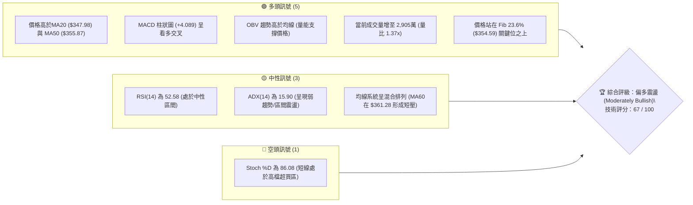
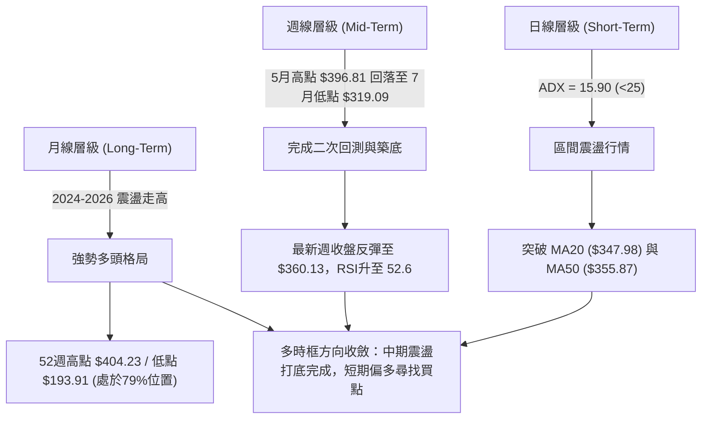
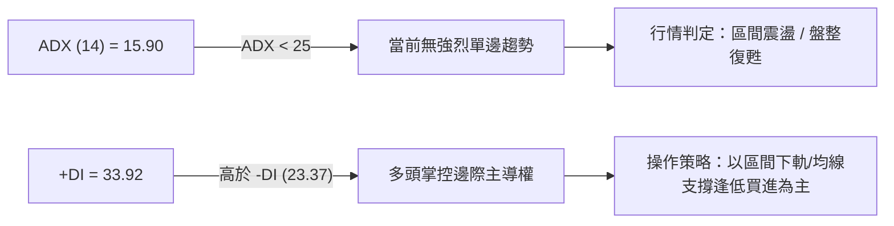
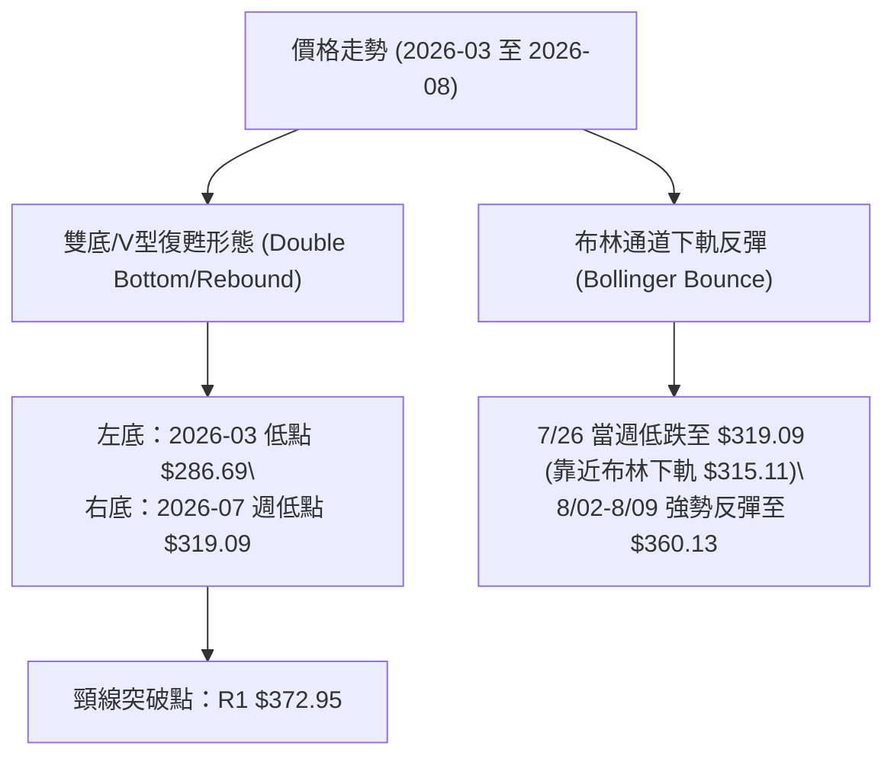
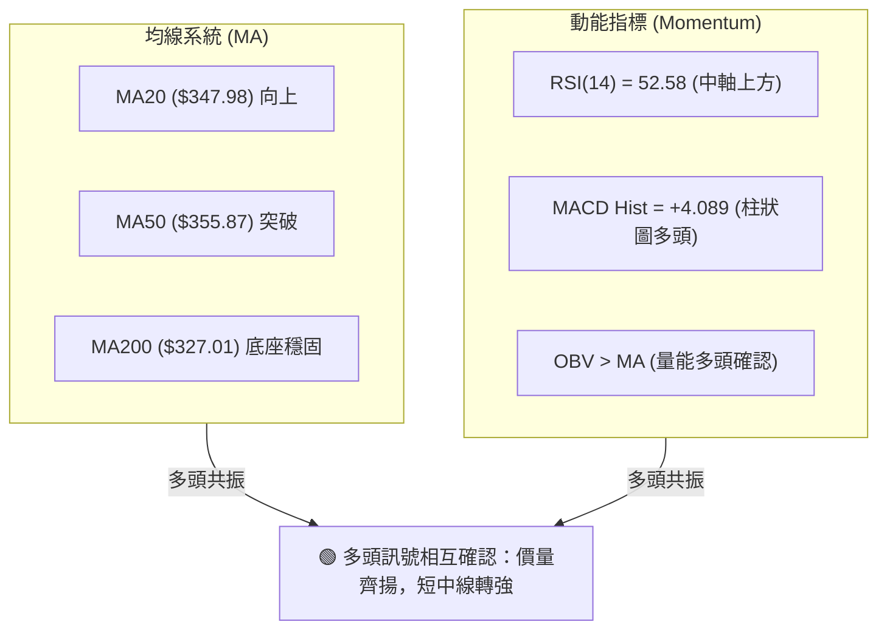
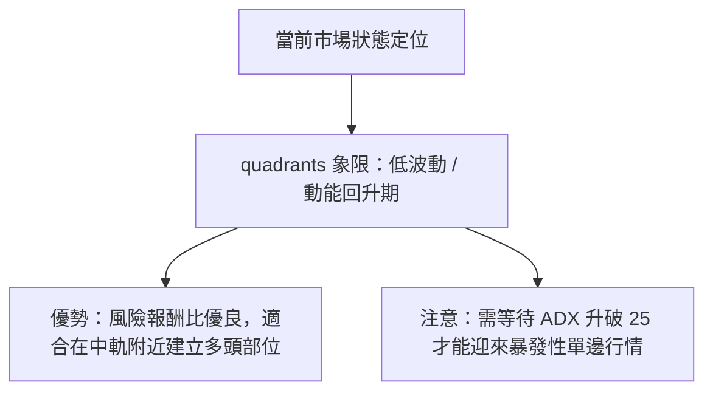
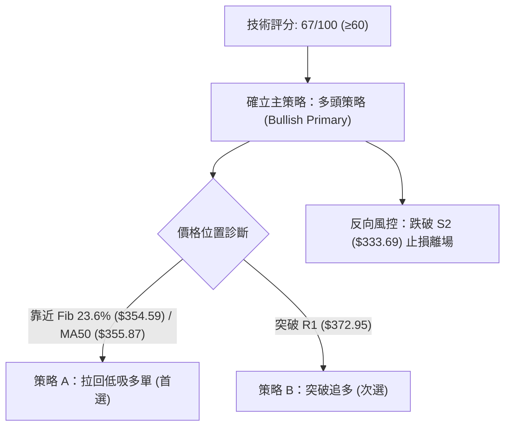
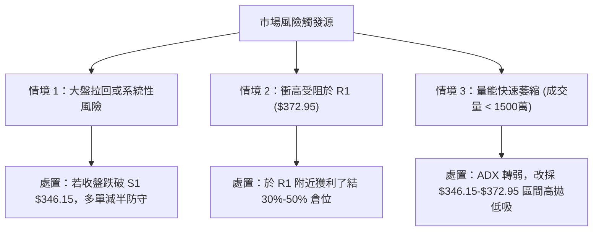

# GOOG 技術分析報告

> **報告日期**：2026-08-05 ｜ **語言**：繁體中文 ｜ **數據來源**：Yahoo Finance / Financial Data Package ｜ **當前價格**：$360.13

---

## 目錄

| 章節 | 內容 |
|------|------|
| [1. 技術面概覽](#1-技術面概覽) | 訊號儀表板、核心指標、評分卡 |
| [2. 趨勢分析](#2-趨勢分析) | 多時框趨勢、長中短期走勢、ADX強弱判斷 |
| [3. 圖表形態分析](#3-圖表形態分析) | 形態識別與信心度、K線組合、目標價推算 |
| [4. 支撐與阻力](#4-支撐與阻力) | 關鍵價位結構、斐波那契回調精確解析 |
| [5. 技術指標深度解讀](#5-技術指標深度解讀) | MA均線/RSI/MACD/布林通道/量能背離 |
| [6. 動能與波動率](#6-動能與波動率) | 動能矩陣、ATR波動率止損、Beta相關性 |
| [7. 多時框架總結](#7-多時框架總結) | 時框架矩陣與多時框優先級收斂結論 |
| [8. 交易策略建議](#8-交易策略建議) | 策略路由、情境階梯、進出場/風報比精算 |
| [9. 風險提示與監控](#9-風險提示與監控) | 關鍵監控Checklist、三情境演練與風控 |

---

## 1. 技術面概覽

### 🎯 技術訊號儀表板



### 📊 核心指標速覽表

| 指標類別 | 指標名稱 | 當前數值 | 訊號 | 技術面解讀 |
|----------|----------|----------|------|------------|
| **價格** | 當前收盤價 | $360.13 | 🟢 多頭 | 站在布林中軌與關鍵均線之上，短線呈現復甦態勢 |
| **均線** | MA20 (月線) | $347.98 | 🟢 看多 | 價格高於 MA20 (+3.49%)，提供短線動能支撐 |
| **均線** | MA50 (季線) | $355.87 | 🟢 看多 | 價格成功收復 MA50 (+1.20%)，中短期轉強 |
| **均線** | MA200 (半年/年線) | $327.01 | 🟢 看多 | 價格遠高於 MA200 (+10.13%)，長線多頭基底穩固 |
| **動能** | RSI(14) | 52.58 | 🟡 中性 | 位於 50 中軸上方，多空均衡偏多，未見頂底背離 |
| **動能** | MACD (12,26,9) | Hist: +4.089 | 🟢 看多 | MACD線(0.784)穿越訊號線(-3.305)，柱狀圖強勁擴張 |
| **趨勢強度**| ADX(14) | 15.90 | 🟡 盤整 | ADX < 25 指示行情屬區間震盪，+DI(33.92)高於-DI(23.37) |
| **波動** | ATR(14) | $13.89 | 🟡 中性 | 每日波幅為價格的 3.86%，具備中等市場波動率 |
| **通道** | 布林通道 %B | 0.68 | 🟢 看多 | 位於中軌($347.98)與上軌($380.84)之間，偏向多頭區間 |
| **量能** | 20日量比 | 1.37x | 🟢 看多 | 日成交量 2,905 萬股，高於20日均量(2,128萬)，量能配合 |

### 🏆 技術評分卡

```
╔══════════════════════════════════════════════════════════════════╗
║                GOOG 技術評分卡 — 2026-08-05                     ║
╠══════════════════════════════════════════════════════════════════╣
║ 趨勢強度 (Trend)    ████████░░░░░░░░░░░░  40/100  🟡 弱趨勢/盤整 ║
║ 動能指標 (Momentum)  ██████████████░░░░░░  70/100  🟢 MACD強勢    ║
║ 支撐穩定 (Support)   ████████████████░░░░  80/100  🟢 Fib/MA強支撐║
║ 成交量配合 (Volume)  ██████████████░░░░░░  70/100  🟢 放大且OBV高 ║
║ 形態完整 (Pattern)  ████████████░░░░░░░░  60/100  🟡 區間築底中  ║
║ 均線排列 (MA Align)  ██████████████░░░░░░  68/100  🟢 站穩20/50/200║
╠══════════════════════════════════════════════════════════════════╣
║ 綜合技術評分         █████████████░░░░░░░  67/100  🟢 偏多震盪    ║
╚══════════════════════════════════════════════════════════════════╝
```

---

## 2. 趨勢分析

### 🌐 多時框趨勢分析



### 📈 長期趨勢 — 24個月走勢圖（ASCII/Unicode）

```
GOOG 過去 24 個月價格走勢軌跡 ($)
$400 ┤                                                ● $381.71
$360 ┤                                            ●───┼───────● $360.13 (現在)
$320 ┤                                 ● $319.49 /     ● $311.02
$280 ┤                            ●   /
$240 ┤                       ●   /   ● $313.39
$200 ┤● $204.54         ●   /
$160 ┼───● $163.85 ●───────/
$120 ┤            ● $155.60
     └─┬───┬───┬───┬───┬───┬───┬───┬───┬───┬───┬───┬───┬───┬───►
      24/08  10  12  25/02 04  06  08  10  12  26/02 04  06  08
```

#### 24個月歷史走勢特徵分析：

| 階段歷史 | 價格區間 | 累積漲跌幅 | 結構特徵與技術意義 |
|----------|----------|------------|--------------------|
| **2024/08 - 2025/01** | $163.85 ➔ $204.54 | +24.83% | 首波穩健上攻，於 $204.54 遭遇整數關卡阻力 |
| **2025/02 - 2025/03** | $204.54 ➔ $155.60 | -23.93% | 劇烈拉回回測底部，於 $155.60 奠定長期大底 (歷史支撐區) |
| **2025/04 - 2025/11** | $160.24 ➔ $319.49 | +99.38% | 主升段行情，連續8個月收紅，呈強勢多頭排列 |
| **2025/12 - 2026/03** | $313.39 ➔ $286.69 | -10.27% | 歷史高位震盪洗盤，回測 $286.69 斐波那契關鍵支撐 |
| **2026/04 - 2026/08** | $381.71 ➔ $360.13 | -5.65% | 刷新52週新高 $404.23 後回落，於 $319.09 築底回升至 $360.13 |

### ⚡ 趨勢強度評估（ADX 解讀）



*   **ADX 數值診斷**：ADX 目前僅為 **15.90**，遠低於 25 的強趨勢門檻，顯示市場並未處於狂暴的單邊突破行情中，而是處於波段拉回後的**區間震盪築底階段**。
*   **方向指標（DI）解析**：+DI (33.92) 顯著高於 -DI (23.37)，說明在當前的震盪格局中，買方（多頭）的推升力道已重新超越賣方（空頭）。

---

## 3. 圖表形態分析

### 🔍 形態識別系統



#### 形態信心度與目標價精算表：

| 形態名稱 | 信心度 | 判斷依據（引用嚴謹數據） | 完成度 | 目標價（附嚴謹計算式） |
|----------|--------|--------------------------|--------|------------------------|
| **雙重打底/波段反彈** | **68%** | 7/26週低點 $319.09 未跌破3月低點 $286.69，且迅速收復 S1 ($346.15) 與 Fib 23.6% ($354.59) | 75% | **目標價1**：R1 **$372.95**<br>**目標價2**：R2 **$404.23** (52W High) |
| **布林通道均值回歸** | **82%** | 價格觸及布林下軌 $315.11 附近即獲強烈買盤，目前已突破中軌 $347.98 | 90% | **通道上軌目標**：布林上軌 **$380.84** |

### 🕯️ 重要 K 線形態分析（近期 20 週關鍵節點）

| 日期 | 週收盤價 | RSI | MACD柱 | K線形態類型 | 技術面意義與訊號 |
|------|----------|-----|--------|-------------|------------------|
| 2026-03-29 | $273.60 | 20.3 | -2.482 | 破位長黑K | 超賣極致，探底落落區 🟢 底訊號 |
| 2026-05-10 | $396.81 | 88.0 | +4.317 | 高檔長上影 | 逼近 $404.23 歷史高點遭獲利了結 🔴 頂壓 |
| 2026-06-28 | $334.69 | 30.6 | -3.223 | 大陰線恐慌拋售 | 爆量 1.88 億股洗盤，守住 S2 $333.69 🟢 築底 |
| 2026-07-26 | $319.09 | 26.4 | -3.620 | 探底落錘線 | 二次探底成功，賣壓竭盡 🟢 看多反轉 |
| **2026-08-09**| **$360.13** | **52.6**| **+4.089** | **中陽線突破** | **帶量吞噬先前陰線，站穩 MA20/MA50 🟢 強勢** |

### 📉 ASCII 走勢形態示意圖（近期雙底反彈結構）

```
   $404.23 🔝 (52W High / R2)
     │        /\
     │       /  \  波段回落
$372.95 ┤......:/....\.................................... 阻力 R1 (頸線預估)
     │     /      \          ▲ 當前現價 $360.13
     │    /        \        /
$354.59 ┤   /          \      /  ◄─ 突破 Fib 23.6% ($354.59)
$346.15 ┤  /            \────/   ◄─ 守住支撐 S1 ($346.15)
     │ /                 \
$319.09 ┤/ (左底 $286.69)  └─● (右底 $319.09 - 7/26週)
─────┴────────────────────────────────────────────────────► 時間
```

---

## 4. 支撐與阻力

### 🗺️ 關鍵價位分布圖（Unicode）

```
 GOOG 價位結構分布圖 (當前現價 $360.13)
══════════════════════════════════════════════════════════════
 $421.79 ║████████████████████████████████║ 法人平均目標價 (Target Mean)
 $404.23 ║████████████████████████████    ║ 強阻力 R2 / 52週最高點 (0.0%)
 $380.84 ║████████████████████            ║ 布林通道上軌 (Upper Band)
 $372.95 ║████████████████                ║ 關鍵阻力 R1 (波段高點聚類)
 $360.13 ╠════════════════════════════════╣ ◄◄ 當前收盤價 (Current Price)
 $355.87 ║▓▓▓▓▓▓▓▓▓▓▓▓▓▓                  ║ 季線 MA50 支撐
 $354.59 ║▓▓▓▓▓▓▓▓▓▓▓▓▓▓                  ║ 斐波那契 23.6% 回調位
 $347.98 ║▓▓▓▓▓▓▓▓▓▓▓▓                    ║ 月線 MA20 / 布林中軌
 $346.15 ║▓▓▓▓▓▓▓▓▓▓▓▓                    ║ 關鍵支撐 S1 (波段低點聚類)
 $333.69 ║██████████████                  ║ 強支撐 S2 (波段低點聚類)
 $327.01 ║██████████                      ║ 半年線/年線 MA200 支撐
 $315.11 ║████████                        ║ 布林通道下軌 (Lower Band)
 $312.69 ║██████                          ║ 關鍵強支撐 S3 (MA240 $312.08 疊加)
══════════════════════════════════════════════════════════════
```

### 🚧 阻力位分析表

| 阻力級別 | 精確價位 | 形成原因與技術依據 | 突破難度 | 重要性評級 |
|----------|----------|--------------------|----------|------------|
| **阻力 R1** | **$372.95** | 近一年波段高點聚類；前波反彈高點壓力區 | 🟡 中等 | 🟢🟢🟢 (短線多空分水嶺) |
| **通道上壓**| **$380.84** | 布林通道上軌動態壓制位 | 🟡 中等 | 🟢🟢 (波段獲利了結點) |
| **阻力 R2** | **$404.23** | 52週歷史最高點 (52W High)；Fib 0.0% | 🔴 極高 | 🟢🟢🟢🟢🟢 (歷史天花板) |
| **目標天花**| **$421.79** | 14位華爾街分析師平均目標價 | 🔴 極高 | 🟢🟢🟢 (長線價值錨定點) |

### 🛡️ 支撐位分析表

| 支撐級別 | 精確價位 | 形成原因與技術依據 | 守住機率 | 重要性評級 |
|----------|----------|--------------------|----------|------------|
| **動態支撐**| **$355.87** | 50日移動平均線 (MA50) | 🟢 高 | 🟢🟢🟢 (短線防守第一線) |
| **斐波支撐**| **$354.59** | 52週高低區間 23.6% 斐波那契黃金分割位 | 🟢 高 | 🟢🟢🟢🟢 (關鍵結構支撐) |
| **支撐 S1** | **$346.15** | 近一年波段低點聚類；MA20 ($347.98) 雙重支撐 | 🟢 高 | 🟢🟢🟢🟢 (短線強支撐) |
| **支撐 S2** | **$333.69** | 波段密集成交區低點；近20週多次落腳處 | 🟢 極高 | 🟢🟢🟢🟢🟢 (中期防線) |
| **支撐 S3** | **$312.69** | 波段極限低點聚類；MA240 ($312.08) 強力疊支撐 | 🟢 極高 | 🟢🟢🟢🟢🟢 (多頭最後堡壘) |

### 📐 斐波那契回調位分析（52週區間：$193.91 ➔ $404.23）

```
  0.0% (52W High) ────────────────────────────── $404.23 ─── 歷史高點阻力
 23.6%            ────────────────────────────── $354.59 ─── ▲ 現價 $360.13 在此上方
 38.2%            ────────────────────────────── $323.89 ─── 中期強支撐區
 50.0%            ────────────────────────────── $299.07 ─── 多空強弱中軸
 61.8%            ────────────────────────────── $274.25 ─── 黃金分割防線
100.0% (52W Low)  ────────────────────────────── $193.91 ─── 52週起漲點
```

*   **當前位置解讀**：現價 **$360.13** 已成功站上 **23.6% ($354.59)** 回調位之上，回調幅度控制在極其健康的淺度回檔範圍內（僅回調 23.6% 即可止跌回升），此乃**極強勢多頭修正**的典型特徵。

---

## 5. 技術指標深度解讀

### 🎛️ 指標訊號總覽與共振分析



### 📈 移動平均線排列分析

| 均線名稱 | 數值 | 價格相相對位置 | 趨勢斜率 | 技術意涵 |
|----------|------|----------------|----------|----------|
| **MA 5** | $359.66 | 價格在上方 (+0.13%) | ▲ 上升 | 極短線偏多，扣抵低價區 |
| **MA 10** | $343.06 | 價格在上方 (+4.97%) | ▲ 上升 | 短線強勢助漲，金叉 MA20 |
| **MA 20** | $347.98 | 價格在上方 (+3.49%) | ▲ 上升 | 月線轉為助漲，多頭短線防線 |
| **MA 50** | $355.87 | 價格在上方 (+1.20%) | ▲ 上升 | 季線順利攻克，短中期防線 |
| **MA 60** | $361.28 | 價格在下方 (-0.32%) | ▼ 微微向下 | 僅有之極短線壓力位 ($361.28) |
| **MA 120**| $340.42 | 價格在上方 (+5.79%) | ▲ 上升 | 半年線多頭結構維持 |
| **MA 200**| $327.01 | 價格在上方 (+10.13%)| ▲ 上升 | 長線牛熊分水嶺，支撐極強 |
| **MA 240**| $312.08 | 價格在上方 (+15.40%)| ▲ 上升 | 年線基底，對應 S3 ($312.69) |

### 📉 RSI(14) 分析

*   **當前數值**：**52.58**
*   **進度條**：`[███████████░░░░░░░░░] 52.58%` (中性偏多)
*   **背離診斷**：數據顯示 **RSI 無明顯背離**。7月下旬價格下探至 $319.09 時，週線 RSI 降至 26.4 超賣區後強勢勾頭向上，目前拉升至 52.58，屬健康的中軸穿過，未見高檔頂背離。

### 📊 MACD(12,26,9) 訊號解讀

```
MACD 快線 (DIF):   0.784   ──────┐  🟢 DIF 翻正穿越零軸
MACD 慢線 (DEM):  -3.305   ──────┼─ 🟢 形成低位黃金交叉
MACD 柱狀圖 (Hist): +4.089  ──────┘  🟢 柱狀圖大幅擴張，多頭動能爆發
```

*   **訊號確認**：MACD 柱狀圖由負轉正並放大至 **+4.089**，配合 DIF (0.784) 成功站上零軸，發出標準的**波段買進訊號**。

### 📦 布林通道分析 (Bollinger Bands)

```
$380.84 ┤---------------------------------- 布林通道上軌 (Upper)
        │                 ● $360.13 (現價位于 68% 位置)
$347.98 ┤---------------------------------- 布林通道中軌 (MA20)
        │
$315.11 ┤---------------------------------- 布林通道下軌 (Lower)
```

*   **通道位置 (%B)**：%B = **0.68**，表明價格已回升至中軌 ($347.98) 與上軌 ($380.84) 之間的**多頭掌控區**。價格自布林下軌 ($315.11) 獲得強勁支撐後成功彈回中軌上方，預示後續有向上軌 ($380.84) 挑戰的空間。

### 💹 成交量與 OBV 分析

*   **量能表現**：最新成交量為 **29,049,339 股**，相較於 20 日均量 (**21,275,427 股**) 放大 **1.37 倍**。
*   **OBV 能量潮**：數據顯示 **OBV > MA**，量能持續高於其移動平均，確認此波從 $319.09 反彈至 $360.13 的過程有**實質法人資金推升**，非無量虛漲。

---

## 6. 動能與波動率

### ⚡ 動能評估分析

| 評估維度 | 當前指標 | 數據狀態 | 技術面綜合評估 |
|----------|----------|----------|----------------|
| **動能強度** | MACD / RSI | Hist +4.089 / RSI 52.58 | **強 (Strong)** — 動能剛從低檔交叉向上發散 |
| **波動強度** | ADX / ATR | ADX 15.90 / ATR $13.89 | **中低 (Moderate-Low)** — 屬低ADX的區間打底起漲階段 |



### 📊 ATR 波動率與止損風控

*   **ATR(14) 數值**：**$13.89** (佔當前股價 3.86%)。
*   **風控距離建議**：
    *   **緊密止損 (1.0x ATR)**：$13.89 ➔ 進場價下方約 3.86%。
    *   **標準波段止損 (1.5x ATR)**：$20.84 ➔ 進場價下方約 5.79%。
    *   **寬鬆止損 (2.0x ATR)**：$27.78 ➔ 進場價下方約 7.71%。

### 📐 Beta 與市場相關性

*   **Beta 係數**：**1.237**
*   **特性分析**：GOOG 的波動度高於大盤（S&P 500）約 23.7%。當大盤反彈時，GOOG 具有較高的向上彈性；當大盤拉回時，波幅亦相對放大。

---

## 7. 多時框架總結

### 📋 時框架評分矩陣

| 時框架 | 趨勢方向 | 動能指標 | 均線排列 | 形態結構 | 綜合評分 | 交易建議 |
|--------|----------|----------|----------|----------|----------|----------|
| **月線 (Long)** | 🟢 多頭 | 🟢 偏多 | 🟢 多頭排列 | 長線上升通道 | **85 / 100** | 長線堅定持有 |
| **週線 (Mid)** | 🟢 偏多 | 🟢 MACD金叉 | 🟢 站穩MA200 | 雙底波段反彈 | **72 / 100** | 逢拉回佈局多單 |
| **日線 (Short)**| 🟡 震盪偏多| 🟢 Hist擴張 | 🟡 混合排列 | 突破MA20/50 | **65 / 100** | 區間下軌/均線買進 |

### 🔲 綜合訊號矩陣

```
[短期 日線] ───► 突破 MA20/MA50 築底完成 ──┐
[中期 週線] ───► 守住 MA200 反彈，MACD金叉 ─┼─► 🟢 多頭訊號收斂一致 (偏多震盪向上)
[長期 月線] ───► 位於52週高點79%位，長牛 ──┘
```

### ⚖️ 多時框收斂規則結論

依據多時框收斂規則：
1. **行情性質判定**：當前 ADX 為 **15.90 (<25)**，明確定義為**區間震盪/打底行情**。
2. **主導時框取捨**：依規則，在中長線（週線 MA200 $327.01 上方）維持多頭的背景下，日線的震盪是用於**尋找多頭進場點**，而非做空。
3. **最終收斂結論**：**🟢 偏多震盪（Moderately Bullish）**。日線收復 MA20 ($347.98) 與 MA50 ($355.87) 且站上 Fib 23.6% ($354.59)，發出短中線共振買進訊號，主策略以**低吸多單**為主。

---

## 8. 交易策略建議

### 🗺️ 策略決策流程圖



### 🧭 策略路由 (Strategy Routing)

*   **當前主策略方向**：**🟢 做多策略 (Bullish Main Strategy)**（依據評分 **67/100** ≥ 60 觸發）

### 🎯 價格情境階梯 (Price Scenarios)

| 觸發條件 | 下一目標價 | 後續延伸目標 | 情境含義與技術解讀 |
|----------|------------|--------------|--------------------|
| **突破 R1 $372.95** | R2 $404.23 | Target Mean $421.79 | 短線轉強，啟動攻頂挑戰52週新高行情 |
| **站穩現價區間 ($354.59 - $360.13)** | R1 $372.95 | R2 $404.23 | 區間震盪墊高底點，蓄勢向上突破 |
| **跌破 S1 $346.15** | S2 $333.69 | S3 $312.69 | 中期再度回測打底，需下探 MA200 尋找支撐 |

### 📊 情境機率分佈

| 情境劇本 | 機率估計 | 主要技術依據 |
|----------|----------|--------------|
| **Scenario 1：拉回打底後向上攻堅 (R1/R2)** | **60%** | MACD金叉 + OBV量能支撐 + 站穩 Fib 23.6% ($354.59) 與 MA50 |
| **Scenario 2：在 $346.15 - $372.95 區間震盪** | **25%** | ADX = 15.90 (<25) 顯示趨勢強度尚弱，需時間消化 MA60 壓力 |
| **Scenario 3：跌破 S1 下探 S2 支撐** | **15%** | Stoch %D (86.08) 高檔超買引發短線拉回 |

### 🟢 主策略詳情 (多頭交易策略)

#### 策略 A：逢低拉回做多 (首選 - 回檔低吸)

*   **進場條件**：股價回測至 Fib 23.6% ($354.59) 至 MA50 ($355.87) 區間止跌（或於現價 $360.13 附近分批建立建倉位）。
*   **精確進場價**：**$355.00**（位於 $354.59 - $355.87 密集支撐帶內）
*   **目標價 T1**：**$372.95**（關鍵阻力 R1）
*   **目標價 T2**：**$404.23**（52週最高點 R2）
*   **精確止損價**：**$342.26**（跌破 S1 $346.15 並扣除 0.28x ATR $3.89，計算式：$346.15 - $3.89 = $342.26）
*   **風險報酬比 (R/R Ratio)**：
    *   *以 T1 計算*：風險 $12.74 ($355.00 - $342.26)，報酬 $17.95 ($372.95 - $355.00) ➔ **風報比 = 1.41 : 1**
    *   *以 T2 計算*：風險 $12.74，報酬 $49.23 ($404.23 - $355.00) ➔ **風報比 = 3.86 : 1**
*   **預估成功機率**：**65%**
*   **建議倉位配置**：**15% - 20%**

#### 策略 B：突破追多 (次選 - 順勢強勢交易)

*   **進場條件**：帶量突破 R1 ($372.95) 並收盤確認。
*   **精確進場價**：**$373.50**（突破 $372.95 後確認）
*   **目標價 T1**：**$404.23**（52週高點 R2）
*   **目標價 T2**：**$421.79**（法人平均目標價 Target Mean）
*   **精確止損價**：**$360.13**（回跌至當前現價/前波支撐區）
*   **風險報酬比 (R/R Ratio)**：
    *   *以 T1 計算*：風險 $13.37 ($373.50 - $360.13)，報酬 $30.73 ($404.23 - $373.50) ➔ **風報比 = 2.30 : 1**
    *   *以 T2 計算*：風險 $13.37，報酬 $48.29 ($421.79 - $373.50) ➔ **風報比 = 3.61 : 1**
*   **預估成功機率**：**58%**
*   **建議倉位配置**：**10% - 15%**

### 🔴 反向風險觸發點 (對沖/止損警訊)

*   **關鍵無效化價位**：**$333.69**（強支撐 S2）
*   **警訊說明**：若價格不升反降，收盤價有效跌破 S2 ($333.69)，代表雙底復甦形態失效，價格將下探 MA200 ($327.01) 或 S3 ($312.69)。屆時應全面清空多頭部位或建立反向對沖避險。

### ⭐ 整體訊號強度評星

```
做多訊號強度： ★★★★☆  (4.0 / 5 星)  🟢 強烈偏多
做空訊號強度： ★☆☆☆☆  (1.0 / 5 星)  🔴 弱勢空頭
整體可信度：   ★★██☆  (4.0 / 5 星)  🟢 多指標共振 confirm
```

---

## 9. 風險提示與監控

### ✅ 關鍵監控指標 Checklist

```
╔══════════════════════════════════════════════════════════════════╗
║                GOOG 技術面每日監控 CHECKLIST                    ║
╠══════════════════════════════════════════════════════════════════╣
║ [ ] 價格是否持續站穩 Fib 23.6% ($354.59) 與 MA50 ($355.87) 以上  ║
║ [ ] MACD 柱狀圖 (+4.089) 是否持續維持正向擴張                    ║
║ [ ] RSI(14) 能否順利突破 60 進入強勢多頭區                       ║
║ [ ] 日成交量能否保持在 20 日均量 (2,128 萬股) 之上               ║
║ [ ] 價格挑戰 R1 ($372.95) 時，ADX (15.90) 是否開始升破 25        ║
║ [ ] 止損價位 $342.26 / $333.69 是否完好未被觸及                  ║
╚══════════════════════════════════════════════════════════════════╝
```

### ⚠️ 風險場景分析



### 🛡️ 風險管理重要提醒

1. **嚴格執行 ATR 止損**：當前 ATR 為 **$13.89**，市場單日波動常規在 $14 美元左右。切忌將止損設定過窄（如 $3-5 美元），否則極易在正常日內噪音中被震盪出場。建議止損定在 **S1 ($346.15)** 下方的 **$342.26**。
2. **倉位控制紀律**：鑑於 ADX 目前僅 15.90，總持倉不宜超過總資金的 25%。等待突破 R1 ($372.95) 且 ADX > 25 趨勢確立後，方可加碼至滿倉。

---

## 📋 報告總結

```
╔══════════════════════════════════════════════════════════════════╗
║               GOOG 技術分析報告總結 (2026-08-05)                ║
╠══════════════════════════════════════════════════════════════════╣
║ 當前價格：$360.13                                                ║
║ 技術評分：67 / 100                                               ║
║ 綜合評級：🟢 偏多震盪 (Moderately Bullish)                       ║
╠══════════════════════════════════════════════════════════════════╣
║ 關鍵結論：                                                       ║
║ ├─ 長期趨勢：🟢 多頭格局未變 (位於52週高低區間 79.0% 位置)      ║
║ ├─ 中期趨勢：🟢 週線於 $319.09 築雙底反彈，MACD 低位金叉         ║
║ ├─ 短期趨勢：🟢 站穩 MA20 ($347.98) 與 Fib 23.6% ($354.59)       ║
║ ├─ 關鍵支撐：S1 $346.15 ｜ S2 $333.69 ｜ S3 $312.69              ║
║ ├─ 關鍵阻力：R1 $372.95 ｜ R2 $404.23 (52W High)                ║
║ └─ 法人目標：Mean $421.79 (High $475.00 / Low $340.00)           ║
╠══════════════════════════════════════════════════════════════════╣
║ 最優交易策略組合：                                               ║
║ 1. 🥇 首選策略 (低吸多單)：進場 $355.00 ｜ 止損 $342.26          ║
║    目標 T1: $372.95 (風報比 1.41) ｜ 目標 T2: $404.23 (風報比 3.86)║
║ 2. 🥈 次選策略 (突破追多)：進場 $373.50 ｜ 止損 $360.13          ║
║    目標 T1: $404.23 (風報比 2.30) ｜ 目標 T2: $421.79 (風報比 3.61)║
╚══════════════════════════════════════════════════════════════════╝
```

---

> ⚠️ **免責聲明**：本報告為 AI 根據市場歷史公開數據與量化技術模型自動生成之技術分析報告。所有數據（含支撐位、阻力位、指標與目標價）均嚴格基於歷史 OHLCV 模型推算。本報告**僅供研究與學術參考**，**不構成任何個人化投資建議或買賣邀約**。金融市場投資具備極高風險，投資人應獨立思考、審慎評估並自負盈虧。

---

*報告生成時間：2026-08-05 ｜ 數據來源：Yahoo Finance ｜ 分析框架：多時框技術分析系統*