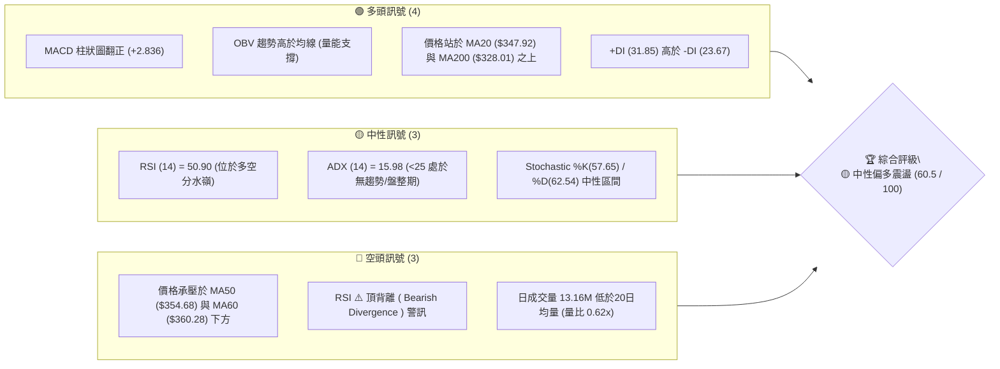
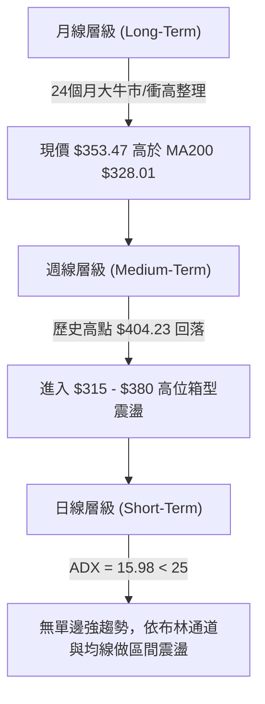
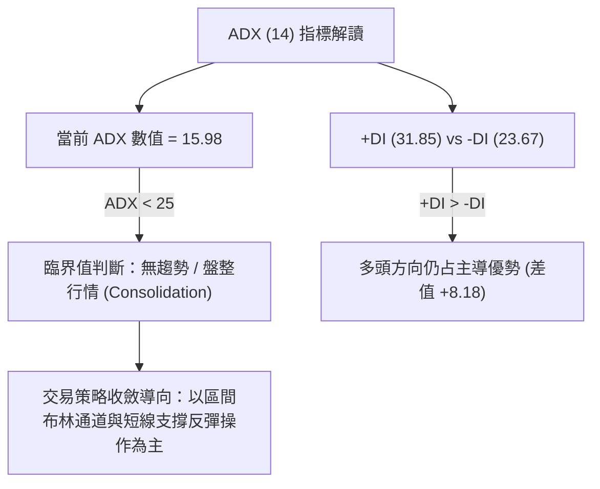
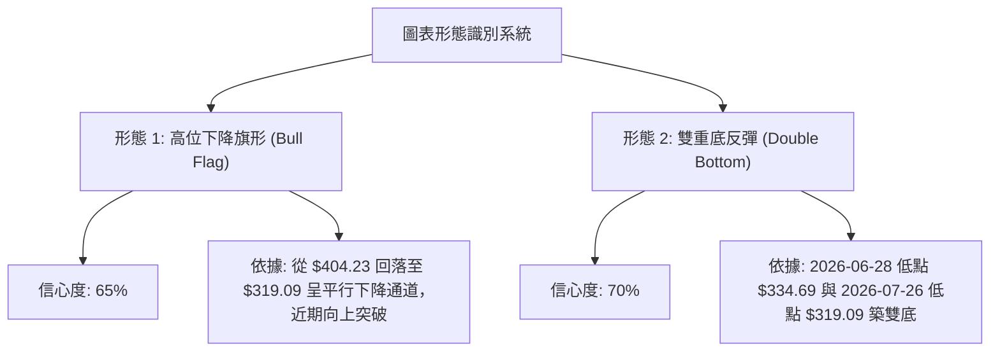
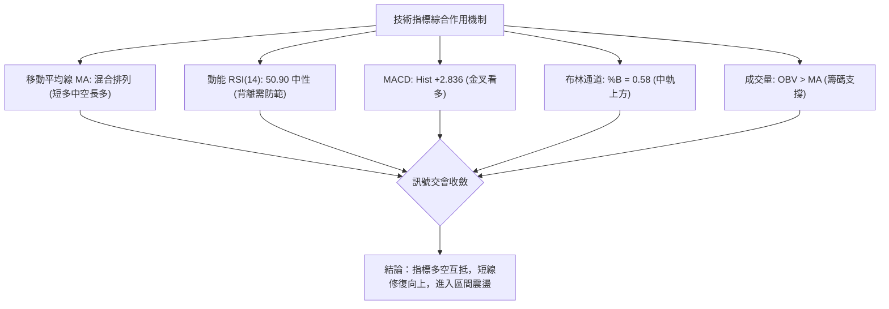
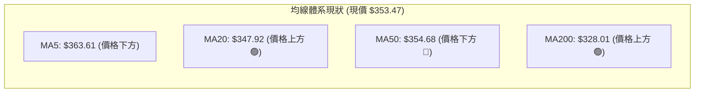
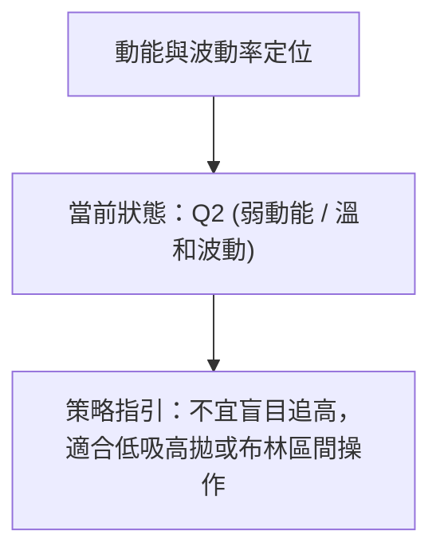
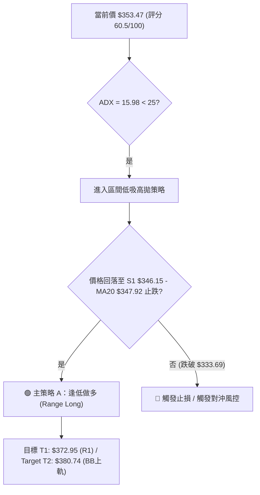
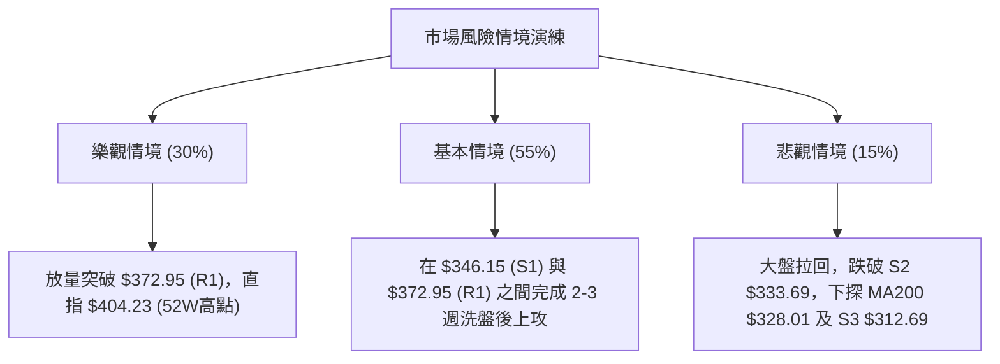

# GOOG 技術分析報告

> **報告日期**：2026-08-07 ｜ **語言**：繁體中文 ｜ **數據來源**：Yahoo Finance ｜ **當前價格**：$353.47

---

## 目錄

| 章節 | 內容 |
|------|------|
| [1. 技術面概覽](#1-技術面概覽) | 訊號儀表板、核心指標、評分卡 |
| [2. 趨勢分析](#2-趨勢分析) | 多時框趨勢、長中短期走勢、ADX解讀 |
| [3. 圖表形態分析](#3-圖表形態分析) | 形態識別、信心度評估、K線組合與目標價 |
| [4. 支撐與阻力](#4-支撐與阻力) | 關鍵價位結構、阻力/支撐矩陣、斐波那契回調 |
| [5. 技術指標深度解讀](#5-技術指標深度解讀) | MA/RSI/MACD/布林通道/成交量與OBV |
| [6. 動能與波動率](#6-動能與波動率) | 動能四象限、ATR波動度、Beta分析 |
| [7. 多時框架總結](#7-多時框架總結) | 時框架評分矩陣、多時框收斂結論 |
| [8. 交易策略建議](#8-交易策略建議) | 策略路由、情境階梯、進出場/止損/風報比 |
| [9. 風險提示與監控](#9-風險提示與監控) | 關鍵監控Checklist、三情境風險演練 |

---

## 1. 技術面概覽

### 🎯 技術訊號儀表板



---

### 📊 核心指標速覽表

| 指標類別 | 指標名稱 | 當前數值 | 訊號 | 專業解讀 |
|----------|----------|----------|------|----------|
| **價格** | 當前價格 | $353.47 | 🟡 中性 | 處於 52 週區間 75.8% 分位，近月高位拉回後回穩 |
| **均線** | MA20 | $347.92 | 🟢 看多 | 現價位於 MA20 上方 (+1.60%)，短線獲得月線支撐 |
| **均線** | MA50 | $354.68 | 🔴 看空 | 現價位於 MA50 下方 (-0.34%)，短線反彈面臨季線反壓 |
| **均線** | MA200 | $328.01 | 🟢 看多 | 現價位於 MA200 上方 (+7.76%)，長線牛市格局未改 |
| **動能** | RSI(14) | 50.90 | 🟡 中性 | 位於 50 多空中樞，但出現⚠️頂背離，需防範二次拉回 |
| **動能** | MACD (12,26,9) | Hist: +2.836 | 🟢 看多 | DIF(1.126) 上穿 DEA(-1.710) 形成金叉，多頭動能修復 |
| **波動** | ATR(14) | $12.82 | 🟡 中性 | 每日波幅約 3.63%，屬於溫和波動，利於區間設定 |
| **趨勢** | ADX(14) | 15.98 | 🟡 盤整 | ADX < 25 表示明確單邊趨勢尚未形成，目前以箱型震盪為主 |
| **量能** | 量比 (20D) | 0.62x | 🔴 量縮 | 成交量 13.16M 低於 20D 均量 21.34M，突破動能稍顯不足 |

---

### 🏆 技術評分卡

```
╔══════════════════════════════════════════════════════════════════════╗
║                   技術評分卡 — GOOG (2026-08-07)                      ║
╠══════════════════════════════════════════════════════════════════════╣
║ 趨勢強度 (ADX)     ▓▓▓▓▓▓▓▓▓▓░░░░░░░░░░  52/100  🟡 弱趨勢/盤整格局  ║
║ 動能指標 (RSI/MACD) ▓▓▓▓▓▓▓▓▓▓▓▓░░░░░░░░  58/100  🟡 金叉修復但背離隱憂║
║ 支撐穩定度 (S1/S2) ▓▓▓▓▓▓▓▓▓▓▓▓▓▓░░░░░░  72/100  🟢 斐波與月線共振支撐║
║ 成交量配合 (OBV/Vol)▓▓▓▓▓▓▓▓▓▓▓▓░░░░░░░░  60/100  🟡 OBV偏多但短線量縮║
║ 形態完整度         ▓▓▓▓▓▓▓▓▓▓▓▓▓░░░░░░░  65/100  🟡 旗型整理未正式突破║
║ 均線排列 (MA System)▓▓▓▓▓▓▓▓▓▓▓░░░░░░░░  56/100  🟡 多空交錯、短中混亂║
╠══════════════════════════════════════════════════════════════════════╣
║ 綜合評分           ▓▓▓▓▓▓▓▓▓▓▓▓░░░░░░░░  60.5/100  🟡 中性偏多震盪   ║
╚══════════════════════════════════════════════════════════════════════╝
```

---

## 2. 趨勢分析

### 🌐 多時框趨勢分析



---

### 📈 長期趨勢 — 24個月走勢圖（Unicode）

```
GOOG 月線走勢圖（2024-08 至 2026-08）
價格軸 ($)
$400 ┼                                                     ●(2026-04 高點 381.71)
$350 ┼                                         ●─────●─────┼─────● (現價 $353.47)
$300 ┼                             ●─────●────┘     └─────┘
$250 ┼                 ●─────●────┘
$200 ┼       ●─────●──┘
$150 ┼ ●────┘
     └─┬─────┬─────┬─────┬─────┬─────┬─────┬─────┬─────┬─────┬─────┬─────┬──
      24/08 24/11 25/02 25/05 25/08 25/11 26/02 26/05 26/08
```

#### 走勢特徵分析表

| 階段歷史區間 | 收盤價區間 | 累積漲跌幅 | 關鍵技術特徵分析 |
|--------------|------------|------------|------------------|
| **2024-08 ~ 2025-01** | $163.85 → $204.54 | +24.83% | 底層突破，第一波強勢主升段，突破 $200 整數關卡 |
| **2025-02 ~ 2025-04** | $204.54 → $160.24 | -21.66% | 中期深度回調，下探至 2025-03 底部低點 $155.60 |
| **2025-05 ~ 2025-11** | $160.24 → $319.49 | +99.38% | 超級主升浪，一路連陽飆升至 $319.49，奠定長牛基石 |
| **2025-12 ~ 2026-04** | $313.39 → $381.71 | +21.80% | 劇烈高位洗盤，攀升至歷史高點區域（52週最高 $404.23） |
| **2026-05 ~ 2026-08** | $376.20 → $353.47 | -6.04% | 52週高點拉回高位震盪，目前於 23.6% 斐波位 $354.77 進行籌碼沉澱 |

---

### 📊 中期趨勢（週線分析與關鍵層級）

從近期 20 週數據觀察，GOOG 在 2026 年 5 月中旬刷出 $396.81 的近週高點（日線最高 $404.23），隨後經歷了連續兩波修正：
1. **第一波回調**：從 $396.81 降至 2026-06-28 的 $334.69。
2. **第二波探底**：2026-07-26 跌至 $319.09，精準落於 38.2% 斐波那契位 $324.17 與強支撐 S3 $312.69 之間。
3. **最新週線反彈**：2026-08-02 強勢大陽線收在 $356.65，收復 MA20 ($347.92)，本週 2026-08-09 暫收 $353.47，展現打底反彈後的窄幅整理。

```
週線高低點與壓力支撐區域示意圖：
$404.23 ─── [52W 歷史天花板 R2] ────────────────────────────────────
   │
$372.95 ─── [中期箱型上軌 / 密集反壓區 R1] ──────────────────────────
   │        ▲ 現價反彈目標區
$353.47 ─── [現價位置 / 23.6% 斐波位 $354.77 附近]
   │        ▼ 短線防守重點
$346.15 ─── [近一年波段支撐 S1 / MA20 $347.92] ───────────────────────
   │
$312.69 ─── [強支撐 S3 / 布林下軌 $315.10 / MA200 $328.01 防線] ───────
```

---

### ⚡ 趨勢強度評估（ADX 解讀）



| 指標名稱 | 數據 | 趨勢強度評級 | 市場狀態解讀 |
|----------|------|--------------|--------------|
| **ADX (14)** | **15.98** | ░░░░░░░░░░ 16% (極弱趨勢) | 市場缺乏單邊突破力量，處於能量蓄積期 |
| **+DI (14)** | **31.85** | ▓▓▓▓▓▓▓░░░ 64% (買方佔優) | 多頭買盤力道高於賣盤 |
| **-DI (14)** | **23.67** | ▓▓▓▓▓░░░░░ 47% (賣方受控) | 空頭賣壓逐漸減退 |
| **多空差值** | **+8.18** | 🟢 多頭佔優 | 雖然整體呈現無趨勢盤整，但方向上多方略勝一籌 |

---

## 3. 圖表形態分析

### 🔍 形態識別系統

根據近一年 OHLCV 價格走勢與週線收盤數據，識別出以下圖表形態：



#### 形態信心度與目標價評估表

| 形態名稱 | 信心度 | 判斷依據（嚴格引用數據） | 完成度 | 形態目標價（計算式） |
|----------|--------|--------------------------|--------|----------------------|
| **高位下降旗形** | **65%** | 從 52W 高點 $404.23 下降至 $319.09，最近一週收盤 $353.47 已重新站回旗形中軌之上 | 75% | 旗桿高度 = $404.23 - $273.60 = $130.63。<br>突破點 $350 + $130.63 = **$480.63** (中長線推算) |
| **雙重底 (W底)** | **70%** | 第一底 $334.69 (06-28)，第二底 $319.09 (07-26)，中間頸線為 07-05 高點 **$356.18** | 90% | 頸線 $356.18 - 底點平均 $326.89 = $29.29。<br>目標價 = $356.18 + $29.29 = **$385.47** |
| **RSI頂背離** | **80%** | 2026-05 價格創 $404.23 新高，但 RSI 僅 88.0 且後續走低，警示上攻需帶量 | 100% | 警示性指標：提示 $372.95 (R1) 附近將面臨賣壓 |

---

### 🕯️ 重要 K 線形態分析

| 日期 / 週期 | 收盤價 | K 線形態名稱 | 技術面解讀 | 多空訊號 |
|-------------|--------|--------------|------------|----------|
| **2026-07-26** | $319.09 | 長下影線錘子線 (Hammer) | 股價下探至 $319 附近獲得強烈買盤支撐，低開高走 | 🟢 築底訊號 |
| **2026-08-02** | $356.65 | 大陽線吞噬 (Bullish Engulfing) | 一舉吞噬前二週陰線，收復 MA20 ($347.92)，確認短線V轉 | 🟢 強烈買進 |
| **2026-08-09** | $353.47 | 高位十字星/窄幅孕線 (Harami) | 經過大漲後在 $354.77 (23.6% 斐波位) 進行換手消化 | 🟡 中性整理 |

---

### 📉 ASCII 走勢形態示意圖（雙底與旗形突破）

```
GOOG 雙底 (W-Bottom) & 旗形整理示意圖
===================================================================
$404.23 ───┐ (52週高點)
           │ \
$372.95 ───┼──\─────────────── (頸線 / R1 阻力位)
           │   \      頸線 $356.18
$353.47 ───┼────\───────●───── (現價 $353.47 準備挑戰頸線)
           │     \     / \   /
$334.69 ───┼──────●───/   \─/  ← 第一底 (2026-06-28 $334.69)
           │       \ /     ●   ← 第二底 (2026-07-26 $319.09)
$312.69 ───┴────────┴───────── (強支撐 S3)
===================================================================
```

---

## 4. 支撐與阻力

### 🗺️ 關鍵價位結構分布圖（Unicode）

```
GOOG 價位結構分布圖（基準價格：$353.47）
══════════════════════════════════════════════════════════════════
$421.79 ║██████████████████████████████████████║ 分析師平均目標價 (+19.33%)
$404.23 ║████████████████████████████          ║ 強阻力 R2 / 52W 高點 (+14.36%)
$380.74 ║██████████████████            ║ 布林通道上軌 (+7.71%)
$372.95 ║████████████████              ║ 關鍵阻力 R1 / 波段高點 (+5.51%)
$354.68 ║██████████                    ║ MA50 季線反壓 (+0.34%)
$354.77 ║██████████                    ║ 23.6% 斐波那契回調位 (+0.37%)
$353.47 ╠══════════════════════════════════════╣ ◄ 當前現價 $353.47
$347.92 ║▓▓▓▓▓▓▓▓▓▓                    ║ MA20 月線支撐 (-1.57%)
$346.15 ║▓▓▓▓▓▓▓▓▓▓▓▓                  ║ 關鍵支撐 S1 (-2.07%)
$333.69 ║▓▓▓▓▓▓▓▓▓▓▓▓▓▓▓▓              ║ 波段支撐 S2 (-5.60%)
$328.01 ║▓▓▓▓▓▓▓▓▓▓▓▓▓▓▓▓▓▓            ║ MA200 年線支撐 (-7.20%)
$324.17 ║▓▓▓▓▓▓▓▓▓▓▓▓▓▓▓▓▓▓▓           ║ 38.2% 斐波那契回調位 (-8.29%)
$315.10 ║▓▓▓▓▓▓▓▓▓▓▓▓▓▓▓▓▓▓▓▓▓         ║ 布林通道下軌 (-10.86%)
$312.69 ║▓▓▓▓▓▓▓▓▓▓▓▓▓▓▓▓▓▓▓▓▓▓        ║ 強支撐 S3 (-11.54%)
══════════════════════════════════════════════════════════════════
```

---

### 🚧 阻力位分析表

| 阻力級別 | 精確價位 | 距現價幅 | 形成原因與技術共振 | 突破難度 | 技術重要性 |
|----------|----------|----------|--------------------|----------|------------|
| **R1** | **$372.95** | +5.51% | 近一年波段高點聚類、近6週震盪密集壓力區 | 🟡 中等 | 短線多空分水嶺，突破則確立中線轉強 |
| **R2** | **$404.23** | +14.36% | 52 週歷史高點、斐波那契 0.0% 終極位置 | 🔴 極高 | 歷史天花板，需巨量配合方可攻克 |
| **分析師目標** | **$421.79** | +19.33% | 14 位華爾街分析師共識均價 (Target Mean) | 🔴 高 | 基本面估值目標價位 |

---

### 🛡️ 支撐位分析表

| 支撐級別 | 精確價位 | 距現價幅 | 形成原因與技術共振 | 守住機率 | 技術重要性 |
|----------|----------|----------|--------------------|----------|------------|
| **S1** | **$346.15** | -2.07% | 近一年波段低點聚類，與 MA20 ($347.92) 重疊 | 🟢 80% | 短線回檔首要防線，跌破則短線弱化 |
| **S2** | **$333.69** | -5.60% | 波段低點，位於 2026-06-28 陽線起漲點區域 | 🟢 85% | 中期關鍵防禦帶 |
| **S3** | **$312.69** | -11.54% | 近一年核心低點聚類，接近布林下軌 $315.10 | 🟢 92% | 長線多頭生死線，守穩則牛市格局不變 |

---

### 📐 斐波那契回調位分析（52週區間：$194.66 → $404.23）

| 斐波比例 | 計算精確價位 | 與現價關係 | 技術解讀與操作含義 |
|----------|--------------|------------|--------------------|
| **0.0%** | **$404.23** | +14.36% | 52 週最高點，強阻力 |
| **23.6%** | **$354.77** | **+0.37%** | **【現價交會區】目前現價 $353.47 正於此位膠著爭奪** |
| **38.2%** | **$324.17** | -8.29% | 黃金回調第一強支撐位，下方有 MA200 ($328.01) 護盤 |
| **50.0%** | **$299.45** | -15.28% | 中性軸心線，波段多空強弱分界線 |
| **61.8%** | **$274.72** | -22.28% | 黃金分割防禦點，2026-03-29 最低點 $273.60 之共振位 |
| **78.6%** | **$239.51** | -32.24% | 深幅回調位 |
| **100.0%** | **$194.66** | -44.93% | 52 週最低點 |

**解讀結論**：現價 $353.47 剛好精準落在 **23.6% 回調位 ($354.77)** 下方 1.3 美元處。此位置為高位修正後的首要修復點，若能帶量有效突破 $354.77，將開啟邁向 R1 ($372.95) 的空間。

---

## 5. 技術指標深度解讀

### 🎛️ 指標訊號總覽



---

### 📈 移動平均線 (MA) 排列分析



#### 均線數據詳解表

| 均線天數 | 精確價位 | 價格相對位置 | 變動數值 (幅度) | 走勢狀態 | 解讀 |
|----------|----------|--------------|-----------------|----------|------|
| **MA 5** | $363.61 | 價格在其下方 | -10.14 (-2.79%) | ↘ 彎頭向下 | 超短線極強阻力 |
| **MA 10**| $350.33 | 價格在其上方 | +3.14 (+0.90%) | ↗ 扣抵向上 | 極短線支撐 |
| **MA 20**| $347.92 | 價格在其上方 | +5.55 (+1.60%) | ↗ 上升 | 月線支撐，短線多頭防線 |
| **MA 50**| $354.68 | 價格在其下方 | -1.21 (-0.34%) | ↘ 走平偏弱 | 季線壓制，需補量突破 |
| **MA 60**| $360.28 | 價格在其下方 | -6.81 (-1.89%) | ↘ 下降 | 中期分水嶺 |
| **MA120**| $341.21 | 價格在其上方 | +12.26 (+3.59%)| ↗ 穩定向上 | 半年線保護 |
| **MA200**| $328.01 | 價格在其上方 | +25.46 (+7.76%)| ↗ 強勢向上 | 年線牛熊分界點，長線保護 |
| **MA240**| $313.34 | 價格在其上方 | +40.13 (+12.81%)| ↗ 強勢向上 | 基石支撐 |

---

### 📉 RSI(14) 動能與背離深度分析

```
RSI(14) 當前強度刻度標尺：
0 ── 超賣(30) ───────────── 中性50 ───────────── 超買(70) ── 100
                    [▲ 50.90]
進度條：███████████████░░░░░░░░░░░░░░ 50.90%
```

- **當前數值**：**50.90**，精準脫離之前的超賣區域（2026-07-26 週線 RSI 曾達 26.4 絕望區），回復至多空中樞。
- **背離分析**：
  - ⚠️ **頂背離警告 (Bearish Divergence)**：在 2026 年 5 月股價刷出 $404.23 高點時，RSI 最高達到 88.0；隨後在 6 月股價反彈時，RSI 高點顯著降低。這表明**中線追高動能正在衰減**，高位賣壓仍然需要時間消化，不宜過度盲目追高。

---

### 📊 MACD (12, 26, 9) 訊號解讀

- **DIF (MACD Line)**：`+1.126`
- **DEA (Signal Line)**：`-1.710`
- **MACD Histogram**：`+2.836` 🟢

```
MACD 柱狀圖變化圖示：
+5.0 ┼
+2.8 ┼       █  ← 現狀 (+2.836) 翻紅擴大
 0.0 ┼───────┼───────
-3.6 ┼   █   
     └─ 07/26  08/09
```

**解讀**：DIF 已成功由下往上穿越 DEA，柱狀圖為 **+2.836** 且持續擴大，顯示日線級別的底部金叉反彈仍在進行中，短線空頭力道已被有效扭轉。

---

### 📦 布林通道 (Bollinger Bands) 分析

```
布林通道軌道示意圖 (現價 $353.47, %B = 0.58)
===================================================================
$380.74 ─── [ 上軌 Upper Band ] ────────────────────────────────────
             │
$353.47 ───  ●  ◄ 現價 (位於中軌與上軌之間，%B = 0.58)
             │
$347.92 ─── [ 中軌 Middle Band (MA20) ] ────────────────────────────
             │
$315.10 ─── [ 下軌 Lower Band ] ────────────────────────────────────
===================================================================
```

- **通道寬度 (Bandwidth)**：`($380.74 - $315.10) / $347.92 = 18.86%`，通道呈現平行開口狀態，無收縮暴拉跡象，符合 ADX = 15.98 的盤整特徵。
- **%B 位置**：**0.58**（介於 0.5 到 1.0 之間），表明價格站穩在中軌 $347.92 上方，短期氣氛由弱轉強，目標指向上軌 $380.74。

---

### 💹 成交量與 OBV 量價配合度分析

- **最新日成交量**：13,163,660 股
- **20日均量**：21,336,833 股（**量比 0.62x** 🟢/🔴 縮量反彈）
- **50日均量**：23,803,067 股
- **OBV 能量潮趨勢**：`OBV > MA` 🟢

**分析**：OBV 仍保持在均線上方，顯示中長線主力資金並未出現恐慌性撤退，籌碼結構穩定。然而，近期反彈時日成交量降至 1,316 萬股（僅為 20日均量的 62%），屬於「**縮量溫和反彈**」。若後續要順利攻克 R1 ($372.95)，成交量必須放大至 2,500 萬股以上。

---

## 6. 動能與波動率

### ⚡ 動能評估

#### 四象限定位分析

| 象限區塊 | 動能強度 | 波動率 | GOOG 當前定位與評估 |
|----------|----------|--------|---------------------|
| **Q1 (強動能 / 低波動)** | 強 | 低 | 最佳主升段區間（暫未達到） |
| **Q2 (弱動能 / 低波動)** | **弱** | **低** | **✓ 當前狀態：ADX 15.98, ATR $12.82，市場處於溫和蓄勢期** |
| **Q3 (強動能 / 高波動)** | 強 | 高 | 突破爆發期 |
| **Q4 (弱動能 / 高波動)** | 弱 | 高 | 恐慌殺跌期（已過） |



---

### 📊 ATR 波動率分析

- **ATR (14)**：**$12.82**
- **價格佔比**：`$12.82 / $353.47 = 3.63%`
- **交易應用建議**：
  - **日內波幅預期**：±$12.82（預期日內高低點區間約 $340.65 – $366.29）
  - **合理止損距離**：採用 1.5 倍 ATR = `$12.82 × 1.5 = $19.23`

---

### 📐 Beta 與市場相關性

- **Beta 係數**：**1.237**
- **解讀**：GOOG 波動性比大盤（S&P 500）高出約 23.7%。在大盤反彈行情中，GOOG 具有更高的彈性；但在大盤修正時，其回調幅度也會相對擴大。

---

## 7. 多時框架總結

### 📋 時框架評分矩陣

| 時框架 | 趨勢方向 | 動能 (RSI/MACD) | 均線排列 | 形態狀態 | 綜合評分 | 操作建議 |
|--------|----------|-----------------|----------|----------|----------|----------|
| **月線 (Long)** | 🟢 多頭看漲 | 50.90 中性 | MA200 強勢向上 | 24個月長牛高位整理 | **78/100** 🟢 | 長線逢低分批佈局 |
| **週線 (Medium)**| 🟡 箱型震盪 | ⚠️ RSI 頂背離修復中 | MA20 上方/MA50 下方 | 雙底/下降旗形整理 | **62/100** 🟡 | 區間操作，關注 $356.18 |
| **日線 (Short)** | 🟢 築底反彈 | MACD 金叉 (+2.836) | 站上 MA20/承壓 MA50 | 縮量向上修復 | **58/100** 🟡 | 逢拉回支撐點試多 |

---

### 🔲 綜合訊號矩陣

```
┌──────────────────────────────────────────────────────────┐
│                   多時框架訊號收斂總決賽                  │
├─────────────────┬────────────────────────────────────────┤
│ 長期 (月線)     │ 🟢 偏多 (牛市結構完整，站穩 MA200)      │
│ 中期 (週線)     │ 🟡 中性 (雙底反彈，承壓於 R1 $372.95)   │
│ 短期 (日線)     │ 🟢 偏多 (MACD 金叉，站上 MA20 $347.92)  │
└─────────────────┴────────────────────────────────────────┘
```

---

### ⚖️ 多時框收斂結論

> **多時框收斂規則套用**：
> 當前 ADX(14) 為 **15.98 (< 25)**，依規則判定為**盤整行情 (Consolidation)**。
> 交易應以日線布林通道 ($315.10 – $380.74) 與 key levels 為主要活動範圍。中長期 (MA200 $328.01) 提供下檔堅實保護。
> **最終收斂結論**：**🟡 中性偏多箱型震盪**（以 $346.15 – $347.92 為下軌買點，$372.95 – $380.74 為上軌賣點）。

---

## 8. 交易策略建議

### 🗺️ 策略決策流程圖



---

### 🧭 策略路由

* **當前主策略方向**：**🟢 偏多震盪區間操作（逢低做多为主）**
* **依據**：技術評分 **60.5 / 100**（偏多區間），MACD 日線金叉且價格站上 MA20 ($347.92)，下檔 S1 ($346.15) 支撐強勁。

---

### 🎯 價格情境階梯 (Price Scenarios)

| 觸發條件 | 下一目標價 | 後續延伸目標 | 情境技術含義 |
|----------|------------|--------------|--------------|
| **帶量突破 R1 $372.95** | **$380.74** (BB上軌) | **$404.23** (52W高點) | 旗形與雙底型態完全突破，重啟主升浪 |
| **站穩現價 $353.47 區間** | **$360.28** (MA60) | **$372.95** (R1) | 溫和修復行情，消化季線壓力 |
| **跌破 S1 $346.15** | **$333.69** (S2) | **$312.69** (S3) | 雙底頸線失敗，二次打底測試 MA200 ($328.01) |

---

### 📊 情境機率分佈

| 情境劇本 | 估計機率 | 主要技術依據 |
|----------|----------|--------------|
| **震盪上行 (挑戰 R1 $372.95)** | **60%** | MACD 柱狀圖 +2.836 金叉擴大，OBV 趨勢偏多，站穩 MA20 |
| **箱型橫盤 ($346.15 - $360.28)** | **25%** | ADX = 15.98 趨勢極弱，成交量 0.62x 偏低，需要時間換手 |
| **回落再探底 (下試 S2/S3)** | **15%** | RSI 頂背離隱憂，若美股大盤拉回可能回測 MA200 ($328.01) |

---

### 🟢 主策略詳情（區間做多與突破加碼）

| 策略要素 | 策略 A：區間低吸做多 (主策略) | 策略 B：突破 R1 加碼做多 |
|----------|──────────────────────────────|──────────────────────────|
| **進場條件** | 價格拉回至 MA20 / S1 附近獲得縮量支撐 | 帶量突破 R1 $372.95 並站穩 30 分鐘 |
| **進場價格** | **$347.92 – $346.15** | **$373.50** |
| **目標價 T1** | **$372.95** (R1 阻力位, +7.7%) | **$380.74** (布林上軌, +1.9%) |
| **目標價 T2** | **$380.74** (布林上軌, +10.0%) | **$404.23** (52W 高點, +8.2%) |
| **止損價格** | **$333.69** (跌破 S2 波段低點) | **$360.28** (跌破 MA60 防守位) |
| **風險報酬比** | **1 : 1.83** (以 T1 計算) | **1 : 2.32** (以 T2 計算) |
| **預估成功率**| **65%** | **60%** |
| **建議倉位** | **15% - 20%** | **10% - 15%** (突破加碼) |

---

### 🔴 反向風險觸發點（對沖與風控提示）

* **撤退/止損觸發點**：日線收盤價**跌破 S2 $333.69**。
* **反向做空觸發條件**：若股價無量反彈至 **R1 $372.95** 或 **布林上軌 $380.74** 遇阻出現長上影線，且 RSI 出現二次頂背離，可考慮輕倉對沖（止損設 $385.00，目標看 $354.77）。

---

### ⭐ 整體訊號強度評星

```
做多訊號強度：★★★☆☆  (3.5/5 星) — MACD金叉、站上MA20、OBV偏多
做空訊號強度：★★☆☆☆  (2.0/5 星) — RSI頂背離、MA50反壓
整體可信度：  ★★★★☆  (4.0/5 星) — 數據完整，價位共振性高
```

---

## 9. 風險提示與監控

### ✅ 關鍵監控指標 Checklist

```
╔══════════════════════════════════════════════════════════════════════╗
║                   GOOG 每日交易監控 Checklist                         ║
╠══════════════════════════════════════════════════════════════════════╣
║ [ ] 價格防守：收盤價是否持續站穩 MA20 ($347.92) 與 S1 ($346.15) 上方? ║
║ [ ] 成交量能：日成交量是否放大至 21.34M (20日均量) 以上?              ║
║ [ ] MACD 柱狀：MACD Hist 是否維持在 0 軸上方 (當前 +2.836)?          ║
║ [ ] 關鍵突破：價格是否試探並帶量跨越 23.6% 斐波位 ($354.77)?          ║
║ [ ] ADX 趨勢：ADX 是否突破 25 門檻（啟動單邊趨勢）?                    ║
╚══════════════════════════════════════════════════════════════════════╝
```

---

### ⚠️ 風險場景分析



---

### 🛡️ 風險管理重要提醒

1. **波動率與止損控制**：目前 ATR 為 **$12.82**，每日常態波幅約 3.63%。建議止損點勿設定過窄（至少需距離進場點 1.0–1.5 倍 ATR，即 $12.8–$19.2），避免被正常日內噪音掃出場。
2. **量能不足風險**：當前量比僅 **0.62x**，屬於無量反彈。若無顯著買盤催化劑，股價在接近 **R1 $372.95** 與 **MA60 $360.28** 時極易遭遇解套賣壓而受阻。
3. **宏觀與財報變數**：Beta 係數達 **1.237**，需密切注意科技股大盤（QQQ/SPY）之整體走勢。

---

## 📋 報告總結

```
╔══════════════════════════════════════════════════════════════════════╗
║                   GOOG 技術分析報告總結                               ║
════════════════════════════════════════════════════════════════════════
報告日期：2026-08-07
當前價格：$353.47
分析評級：🟡 中性偏多震盪 (60.5 / 100)

關鍵結論：
├─ 長期趨勢：🟢 強勢看多 (站穩 MA200 $328.01，24個月長牛格局不變)
├─ 中期趨勢：🟡 高位震盪 (雙底築底完成，受制於 R1 $372.95 壓力)
├─ 短期趨勢：🟢 金叉修復 (MACD 翻紅，價格站上 MA20 $347.92)
├─ 關鍵支撐：S1 $346.15 / S2 $333.69 / S3 $312.69
├─ 關鍵阻力：R1 $372.95 / R2 $404.23
└─ 分析師目標：$421.79 (Mean Target)

最優策略組合：
1. 🥇 最佳機會：拉回至 $347.92 – $346.15 (MA20/S1) 分批低吸做多，止損設 $333.69，目標 $372.95。
2. 🥈 次選機會：帶量突破 R1 $372.95 後順勢加碼，目標看 $404.23 (52W 高點)。
3. 🥉 保守選擇：待 ADX 升破 25 或價格回測 MA200 ($328.01) 企穩後再行布局。
════════════════════════════════════════════════════════════════════════
```

---

> ⚠️ **免責聲明**：本報告為 AI 自動生成之技術分析，所有數據及估算均基於提供的歷史價格資訊。本報告**僅供研究與學術參考**，**不構成任何投資建議**。投資有風險，入市需謹慎。

---

*報告生成時間：2026-08-07 ｜ 數據來源：Yahoo Finance ｜ 分析框架：多時框技術分析*