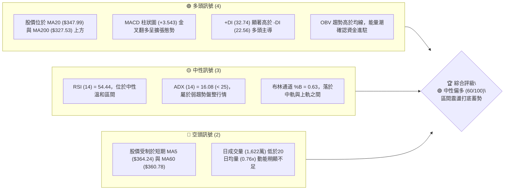
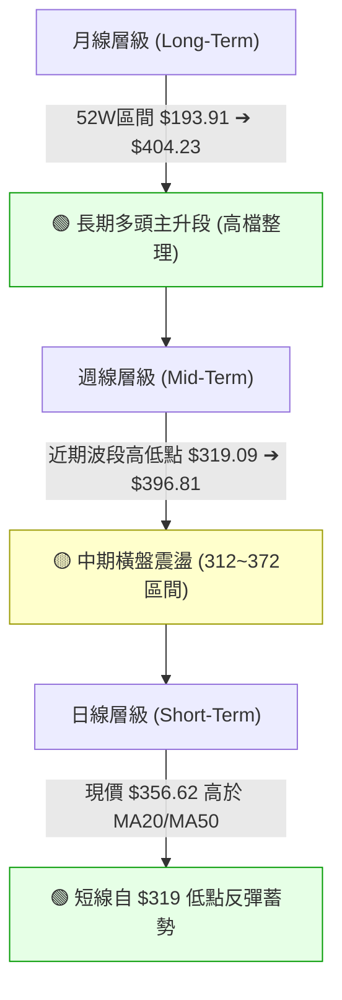
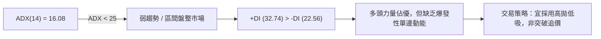
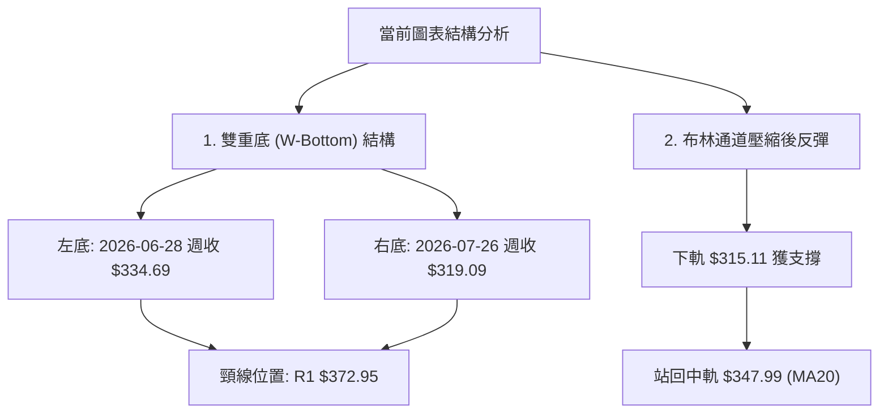
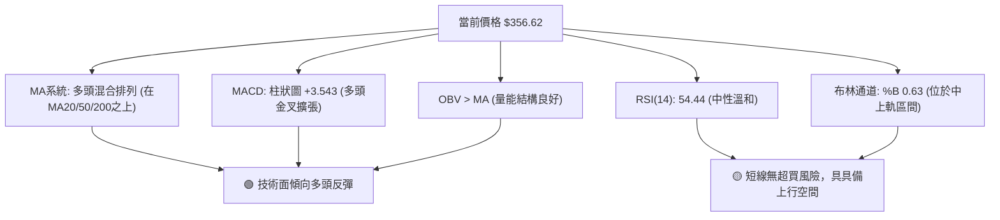
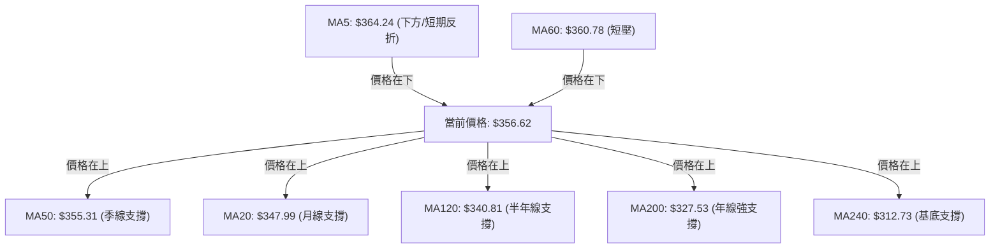
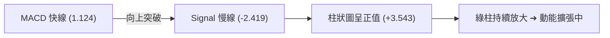
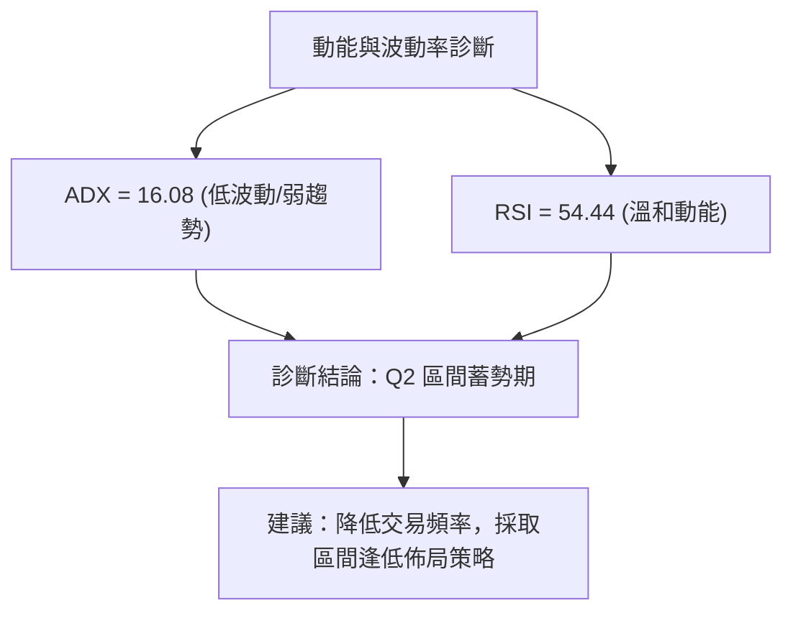
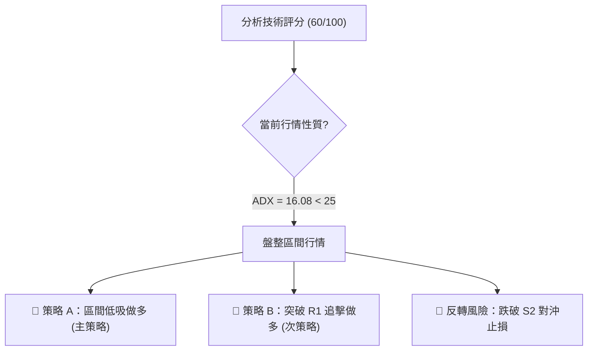
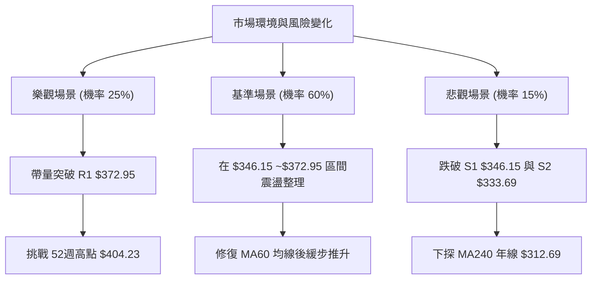

# GOOG 技術分析報告

> **報告日期**：2026-08-07 ｜ **語言**：繁體中文 ｜ **數據來源**：Yahoo Finance ｜ **當前價格**：$356.62

---

## 目錄

| 章節 | 內容 |
|------|------|
| [1. 技術面概覽](#1-技術面概覽) | 訊號儀表板、核心指標、評分卡 |
| [2. 趨勢分析](#2-趨勢分析) | 多時框趨勢、長中短期走勢 |
| [3. 圖表形態分析](#3-圖表形態分析) | 形態識別、K線組合、目標價 |
| [4. 支撐與阻力](#4-支撐與阻力) | 關鍵價位、斐波那契回調 |
| [5. 技術指標深度解讀](#5-技術指標深度解讀) | MA/RSI/MACD/布林/成交量 |
| [6. 動能與波動率](#6-動能與波動率) | 動能評估、ATR、Beta |
| [7. 多時框架總結](#7-多時框架總結) | 時框架評分矩陣 |
| [8. 交易策略建議](#8-交易策略建議) | 多空策略、風險報酬比 |
| [9. 風險提示與監控](#9-風險提示與監控) | 監控指標、風險場景 |

---

## 1. 技術面概覽

### 🎯 技術訊號儀表板



---

### 📊 核心指標速覽表

| 指標類別 | 指標名稱 | 當前數值 | 訊號 | 解讀 |
|----------|----------|----------|------|------|
| **價格** | 當前價格 | $356.62 | 🟢 | 站在 MA20/MA50/MA200 之上，處於 52 週區間 77.4% 高位 |
| **均線** | MA20 | $347.99 | 🟢 | 價格在 MA20 上方 (+2.48%)，短線獲得月線支撐 |
| **均線** | MA50 | $355.31 | 🟢 | 價格微幅高於 MA50 (+0.37%)，季線守禦關鍵 |
| **均線** | MA200 | $327.53 | 🟢 | 價格遠高於 MA200 (+8.88%)，長期牛市基底穩固 |
| **動能** | RSI(14) | 54.44 | 🟡 | 無過熱或超賣現象，無明顯頂底背離 |
| **動能** | MACD | Hist +3.543 | 🟢 | MACD (1.124) 高於 Signal (-2.419)，多頭柱狀圖持續擴大 |
| **波動** | ATR(14) | $13.44 | 🟡 | 每日平均波動率為 3.77%，波動度適中 |
| **趨勢** | ADX(14) | 16.08 | 🟡 | ADX < 25 表明處於盤整震盪行情，非強趨勢行情 |

---

### 🏆 技術評分卡

```
╔══════════════════════════════════════════════════════════════════╗
║                技術評分卡 — GOOG (2026-08-07)                   ║
╠══════════════════════════════════════════════════════════════════╣
║ 趨勢強度 (ADX)     ▓▓▓▓▓▓▓▓░░░░░░░░░░░░  40/100  🟡 弱趨勢盤整    ║
║ 動能指標 (RSI/MACD) ▓▓▓▓▓▓▓▓▓▓▓▓▓░░░░░░░  65/100  🟢 MACD金叉向上  ║
║ 支撐穩定度 (S1/Fib) ▓▓▓▓▓▓▓▓▓▓▓▓▓▓▓░░░░░  75/100  🟢 23.6%與MA20重合║
║ 成交量配合 (OBV)   ▓▓▓▓▓▓▓▓▓▓▓░░░░░░░░░  55/100  🟡 縮量整理      ║
║ 形態完整度 (W底)   ▓▓▓▓▓▓▓▓▓▓▓▓░░░░░░░░  60/100  🟢 區間築底中    ║
║ 均線排列 (多空混合) ▓▓▓▓▓▓▓▓▓▓▓▓▓░░░░░░░  65/100  🟢 價格站在長均線上║
╠══════════════════════════════════════════════════════════════════╣
║ 綜合技術評分       ▓▓▓▓▓▓▓▓▓▓▓▓░░░░░░░░  60/100  🟢 中性偏多      ║
╚══════════════════════════════════════════════════════════════════╝
```

---

## 2. 趨勢分析

### 🌐 多時框趨勢分析



---

### 📈 長期趨勢 — 12個月走勢圖（Unicode）

```
GOOG 月線收盤走勢圖 (2025-08 ➔ 2026-08)
價格軸 ($)
$400 ┤                                      ● (2026-04 $381.71)
$360 ┤                                  ●   │   ●   ●   ● (現價 $356.62)
$320 ┤                      ●   ●   ●       │
$280 ┤              ●   ●                   │
$240 ┤          ●                           │
$200 ┤  ●   ●                               │
$160 ┤──────────────────────────────────────┴───────────────────
      08  09  10  11  12  01  02  03  04  05  06  07  08  (月份)
```

#### 走勢特徵分析表格

| 階段 | 時間區間 | 價格變動區間 | 累積漲跌幅 | 關鍵驅動與技術特徵 |
|------|----------|--------------|------------|--------------------|
| **奠基期** | 2025-08 ➔ 2025-11 | $212.92 ➔ $319.49 | +50.05% | 量能溫和放大，走出底部強勢主升浪 |
| **高檔震盪**| 2025-12 ➔ 2026-03 | $313.39 ➔ $286.69 | -8.52% | 消化獲利賣壓，下探 $286.69 找到長期支撐 |
| **噴發攻頂**| 2026-04 ➔ 2026-05 | $381.71 ➔ $376.20 | +33.14% | 創歷史新高（52週高點 $404.23），成交量暴增 |
| **回檔打底**| 2026-06 ➔ 2026-08 | $353.33 ➔ $356.62 | +0.93% | 於 $319.09~$356.62 之間築底，進行均線修復 |

---

### 📊 中期趨勢（週線分析）

```
週線壓力與支撐結構示意圖：
$404.23 ───[52週歷史高點 / 阻力 R2]───────────────────────────────
$372.95 ───[近一年波段高點聚類 / 阻力 R1]──────────────────────────
$356.62 ───[當前價格 / 斐波那契 23.6% $354.59] ◄ 現價
$346.15 ───[近一年波段低點聚類 / 支撐 S1]──────────────────────────
$333.69 ───[中期關鍵防線 / 支撐 S2]───────────────────────────────
$312.69 ───[MA240 $312.73 / 支撐 S3]───────────────────────────────
```

---

### ⚡ 趨勢強度評估（ADX 解讀）



#### ADX 趨勢強度指標對照表

| ADX 數值範圍 | 趨勢狀態 | GOOG 當前狀態 | 操作指導原則 |
|--------------|----------|---------------|--------------|
| 0 – 20 | 無趨勢 / 極弱 | **16.08 (落在本區間)** | 嚴禁追漲殺跌，以通道上下軌做區間操作 |
| 20 – 25 | 趨勢萌芽 / 弱 | — | 觀察是否突破關鍵壓力線 |
| 25 – 50 | 強趨勢 | — | 順勢單邊操作，拉回找買點 |
| > 50 | 極強趨勢 | — | 注意指標鈍化與反轉風險 |

---

## 3. 圖表形態分析

### 🔍 形態識別系統



#### 形態信心度與判斷依據表

| 形態名稱 | 信心度 | 判斷依據（引用數據） | 完成度 | 目標價（附計算式） |
|----------|--------|----------------------|--------|--------------------|
| **雙重底 (W-Bottom)** | **65%** | 近兩個月低點於 $334.69 與 $319.09 獲得 S2/S3 支撐，且已由 $319.09 強勢反彈至 $356.62 | 70% | 頸線 $372.95 + 形態高度 ($372.95 - $333.69 = $39.26) = **$412.21** |
| **布林中軌扣抵反彈** | **75%** | 價格觸及下軌 $315.11 後快速抽離，目前重新站上中軌 $347.99 | 90% | 通道上軌 **$380.88** |

*註：由於 ADX 指數為 16.08，幾何形態尚未完全突破頸線，暫不宜視為 100% 確定的單邊突破形態。*

---

### 🕯️ 重要K線形態分析

| 日期/週別 | 收盤價 | K線形態 | 技術解讀 | 多空訊號 |
|-----------|--------|---------|----------|----------|
| 2026-07-19 | $346.12 | 中陽線 | 守住 S1 $346.15 支撐，多頭嘗試築底 | 🟢 看多 |
| 2026-07-26 | $319.09 | 長下影陰線 | 下探 52 週低點延伸支撐後迅速買盤湧入 | 🟡 探底成功 |
| 2026-08-02 | $356.65 | 大陽線 (長實體) | 強勢拉升 +11.77%，吞噬前週陰線實體 | 🟢 多頭包覆 |
| 2026-08-09 | $356.62 | 十字星/高檔十字 | 於 MA50 ($355.31) 與 Fib 23.6% ($354.59) 附近多空交戰 | 🟡 中性整理 |

---

### 📉 ASCII 走勢形態示意圖

```
GOOG 近兩月雙底與突破示意圖
  $372.95 ─────────────────────────────────── 頸線 (阻力 R1)
                /│\             /│\
               / │ \           / │ \
  $356.62 ────/──┼──\─────────/──┼──\──────── 現價 (回測 23.6% 守穩)
             /   │   \       /   │   \
  $333.69 ──/────┼────\─────/────┼────\────── (左底/右底打底區)
          ● (左底 $334.69) ● (右底 $319.09)
```

---

### 🎯 形態目標價計算

1. **雙底頸線位置 ($R_1$)**：$372.95
2. **形態低點聚類 ($S_2$)**：$333.69
3. **形態垂直高度 ($H$)**：$372.95 - $333.69 = $39.26
4. **理論突破目標價 ($T_{theory}$)**：$372.95 + $39.26 = **$412.21**
   - *（該目標價精準落於分析師平均目標價 $421.79 與 52週高點 $404.23 之間的強阻力帶）*

---

## 4. 支撐與阻力

### 🗺️ 關鍵價位分布圖（Unicode）

```
GOOG 價位結構分布圖 (現價 $356.62)
════════════════════════════════════════════════════════════════
$421.79 ║████████████████████████████████║ 分析師平均目標價 (Analyst Target)
$404.23 ║████████████████████████████    ║ 52週歷史高點 / 強阻力 R2
$380.88 ║████████████████████            ║ 布林通道上軌
$372.95 ║████████████████████████        ║ 近一年波段高點聚類 / 阻力 R1
$356.62 ╠════════════════════════════════╣ ◄ 當前價格 (Current Price)
$354.59 ║▓▓▓▓▓▓▓▓▓▓▓▓▓▓▓▓▓▓▓▓▓▓▓▓▓▓▓▓    ║ 斐波那契 23.6% 回調位
$346.15 ║▓▓▓▓▓▓▓▓▓▓▓▓▓▓▓▓▓▓▓▓            ║ 近一年波段低點聚類 / 支撐 S1
$333.69 ║████████████████████████        ║ 近一年波段低點聚類 / 強支撐 S2
$312.69 ║████████████████████████████    ║ MA240 ($312.73) / 關鍵底線 S3
════════════════════════════════════════════════════════════════
```

---

### 🚧 阻力位分析表

| 阻力級別 | 價位 | 形成原因 | 突破難度 | 重要性 |
|----------|------|----------|----------|--------|
| **R1** | **$372.95** | 近一年波段高點聚類、解套盤壓力區 | 🟡 中等 | 🟢 決定能否展開新一輪單邊行情 |
| **R2** | **$404.23** | 52週歷史高點（0.0% 斐波那契位） | 🔴 極高 | 🔴 歷史天花板，心理關卡 |

---

### 🛡️ 支撐位分析表

| 支撐級別 | 價位 | 形成原因 | 守住機率 | 重要性 |
|----------|------|----------|----------|--------|
| **S1** | **$346.15** | 近一年波段低點聚類、MA20 ($347.99) 重合 | 70% | 🟢 短線多空強弱分水嶺 |
| **S2** | **$333.69** | 近一年波段低點聚類、密集換手區 | 85% | 🟡 中期防線，跌破則形態轉弱 |
| **S3** | **$312.69** | MA240 ($312.73) 年線級別強支撐 | 90% | 🔴 長期牛熊分界點 |

---

### 📐 斐波那契回調位分析

（以 52 週區間 $193.91 ➔ $404.23 計算）

```
0.0%  (52W High)   $  404.23  ──────────────────────────────────
23.6%              $  354.59  ◄ 當前價格 $356.62 緊貼此處 (即時支撐)
38.2%              $  323.89  ──────────────────────────────────
50.0%              $  299.07  ──────────────────────────────────
61.8%              $  274.25  ──────────────────────────────────
78.6%              $  238.92  ──────────────────────────────────
100.0% (52W Low)   $  193.91  ──────────────────────────────────
```

#### 技術解讀
現價 $356.62 落在 **23.6% ($354.59)** 與 **0.0% ($404.23)** 之間，且極度接近 23.6% 回調位。斐波那契 23.6% 是強勢整理形態的核心防禦點，若能在此處獲利回吐結束並企穩，代表市場屬於「淺幅回調」，後續再創高的機率顯著增加。

---

## 5. 技術指標深度解讀

### 🎛️ 指標訊號總覽



---

### 📈 移動平均線排列分析



#### 均線數據明細

| 均線類別 | 數值 | 價格相對位置 | 變動趨勢 | 技術意涵 |
|----------|------|--------------|----------|----------|
| **MA 5** | $364.24 | 下方 (-2.09%) | ▼ 下降 | 超短線短壓，拉回整理中 |
| **MA 20** | $347.99 | 上方 (+2.48%) | ▲ 上升 | 月線走揚，短線回檔買點 |
| **MA 50** | $355.31 | 上方 (+0.37%) | ▲ 上升 | 季線守護，關鍵強弱界線 |
| **MA 60** | $360.78 | 下方 (-1.15%) | ▼ 下降 | 60日線壓制，突破可解鎖上行 |
| **MA 200**| $327.53 | 上方 (+8.88%) | ▲ 上升 | 長期牛市防線，強烈支撐 |

---

### 📉 RSI(14) 分析

- **當前數值**：`54.44`
- **強度進度條**：`███████████░░░░░░░░░` 54.4%
- **狀態**：🟡 中性區間（30 – 70）
- **背離判斷**：
  - **頂背離**：無。股價自 $404.23 回檔期間，RSI 同步修正至 26.4 附近超賣區後反彈，無指標高點降低而價格創高之頂背離。
  - **底背離**：無明顯底背離。RSI 與價格幾乎同步於 7 月下旬觸底反彈，指標運行健康。

---

### 📊 MACD(12, 26, 9) 訊號解讀

- **MACD 快線**：`1.124`
- **Signal 慢線**：`-2.419`
- **MACD 柱狀圖**：`+3.543` 🟢 看多



---

### 📦 布林通道分析

```
布林通道現狀示意圖：
$380.88 ───[ 上軌 Upper Band ]──────────────────────────────────
            │
$356.62 ───[ 當前價格 (BB %B = 0.63) ] ◄ 位於中軌與上軌間
            │
$347.99 ───[ 中軌 Middle Band (MA20) ]──────────────────────────
            │
$315.11 ───[ 下軌 Lower Band ]──────────────────────────────────
```

- **軌道狀態**：通道寬度適中，無過度收縮（Squeeze）或極端擴張。
- **現價位置**：%B 為 0.63，位於中軌 ($347.99) 與上軌 ($380.88) 之間，顯示短線自下軌反彈後順利站穩中軌，偏向中軌至上軌的震盪推升格局。

---

### 💹 成交量分析（量價配合度）

- **最新成交量**：16,219,703 股
- **20 日均量**：21,244,890 股（量比：`0.76x`）
- **OBV 能量潮**：`OBV > MA` 🟢（量能支撐價格上漲）

#### 量價結構評估
當前價格上漲至 $356.62 過程中，成交量略微收縮（0.76x），顯示高檔追價意願謹慎，但賣壓同樣並不沉重（無恐慌倒盤）。OBV 高於其移動平均線，說明大資金在中長期維度上仍呈現淨流入狀態，量價結構屬「縮量橫盤整理」非「量價背離」。

---

## 6. 動能與波動率

### ⚡ 動能評估四象限

| 象限區分 | 動能強度 (Momentum) | 波動率 (Volatility) | 當前 GOOG 歸屬位置 | 技術診斷與建議 |
|----------|---------------------|---------------------|--------------------|----------------|
| **Q1 (高動能/低波動)** | 強 | 低 | — | 最佳主升浪，全力持有 |
| **Q2 (弱動能/低波動)** | 弱 | 低 | **✓ 當前歸屬區間** | **區間震盪蓄勢，適合低吸買入** |
| **Q3 (強動能/高波動)** | 強 | 高 | — | 突破噴發期，嚴格移動止損 |
| **Q4 (弱動能/高波動)** | 弱 | 高 | — | 恐慌殺跌期，宜觀望避險 |



---

### 📊 ATR 波動率分析

- **ATR(14)**：`$13.44`（佔股價比例：`3.77%`）
- **止損距離設定建議**：
  - **短線交易（1.5 x ATR）**：$13.44 \times 1.5 = \$20.16$（即自進場點下移 $20.16）
  - **波段交易（2.0 x ATR）**：$13.44 \times 2.0 = \$26.88$（即自進場點下移 $26.88）

---

### 📐 Beta 與市場相關性

- **Beta 係數**：`1.237`
- **解讀**：GOOG 的波動度高於大盤（S&P 500）約 23.7%。在大盤反彈時具有更高的彈性，但在市場下修時亦承受較大的 Beta 系統性風險。

---

## 7. 多時框架總結

### 📋 時框架評分表

| 時框架 | 趨勢方向 | 動能 (RSI/MACD) | 均線排列 | 形態結構 | 綜合評分 | 建議 |
|--------|----------|-----------------|----------|----------|----------|------|
| **月線 (Long)** | 🟢 多頭 | 65 (溫和) | 🟢 完全多頭 | 高檔旗形 | **80/100** | 偏多持股 |
| **週線 (Mid)** | 🟡 橫盤 | 55 (中性) | 🟡 混雜整理 | 雙底打底 | **60/100** | 區間低吸 |
| **日線 (Short)**| 🟢 反彈 | 60 (翻多) | 🟢 站上MA20/50| 布林中軌反彈| **65/100** | 回檔買進 |

---

### 🔲 綜合訊號矩陣

```
┌─────────────────────────────────────────────────────────┐
│              多時框架訊號收斂矩陣                        │
├──────────────┬──────────────┬──────────────┬────────────┤
│  時框架      │  長線 (月線) │  中線 (週線) │ 短線 (日線)│
├──────────────┼──────────────┼──────────────┼────────────┤
│  方向性      │   看多 🟢    │   中性 🟡    │  看多 🟢   │
│  主導指標    │  MA200/52W   │   S1/S2/R1   │ MA20/MACD  │
│  關鍵位      │   $327.53    │   $346.15    │  $354.59   │
└──────────────┴──────────────┴──────────────┴────────────┘
```

---

### ⚖️ 多時框收斂結論

依據多時框收斂規則：
1. **行情定性**：ADX(14) = 16.08 (< 25)，確定當前市場為 **盤整/區間震盪行情**。
2. **優先級裁決**：在盤整行情中，不宜盲目追高突破，應以 **日線至週線之布林通道及關鍵支撐阻力區間** 為核心交易依據。
3. **最終唯一方向性結論**：**🟢 中性偏多震盪蓄勢**。中長線牛市格局未變，短線已於 S1/Fib 23.6% 區域打底成功，主策略應採取「逢低做多」，目標看至 R1 ($372.95) 與布林上軌 ($380.88)。

---

## 8. 交易策略建議

### 🗺️ 策略決策流程圖



---

### 🧭 策略路由

**當前主策略方向 = 🟢 多頭區間低吸策略（依評分 60/100，中性偏多）**

---

### 🎯 價格情境階梯（Price Scenarios）

| 觸發條件 | 下一目標 | 後續延伸 | 情境含義 |
|----------|----------|----------|----------|
| **突破 R1 $372.95** | R2 $404.23 | $421.79 (分析師目標) | 雙底形態確立，展開新一波主升浪 |
| **站穩現價區間 ($346~$360)**| $372.95 (R1) | $380.88 (布林上軌) | 區間震盪推升，時間換取空間 |
| **跌破 S1 $346.15** | S2 $333.69 | S3 $312.69 | 築底失敗，下探年線重尋支撐 |

---

### 📊 情境機率分佈

| 情境 | 機率 | 主要依據 |
|------|------|----------|
| **繼續震盪上行 / 反彈** | **60%** | MACD 柱狀圖翻正 (+3.543)、OBV 趨勢高於均線、站穩 MA20/MA50 |
| **區間橫盤震盪** | **25%** | ADX (16.08) 處於弱趨勢區，成交量未顯著放大 |
| **回落再探底** | **15%** | MA5 ($364.24) 與 MA60 ($360.78) 短線反壓 |

---

### 🟢 主策略詳情

| 策略要素 | 策略 A（低吸反彈策略 - 主推） | 策略 B（突破追擊策略 - 備選） |
|----------|───────────────────────────────|───────────────────────────────|
| **進場條件** | 價格拉回至 23.6% 斐波那契 / MA20 附近企穩 | 帶量日收盤突破 R1 $372.95 後回測不破 |
| **進場價格** | **$350.00 – $354.59** | **$374.00** |
| **目標價 T1** | **$372.95** (阻力 R1) | **$404.23** (52週高點 R2) |
| **目標價 T2** | **$404.23** (阻力 R2) | **$421.79** (分析師目標價) |
| **止損價格** | **$333.69** (支撐 S2) | **$356.62** (原前高轉支撐區) |
| **風險報酬比** | **1.14 : 1** (至 T1) / **2.85 : 1** (至 T2) | **1.74 : 1** (至 T1) / **2.75 : 1** (至 T2) |
| **勝率估計** | **65%** | **55%** |
| **建議倉位** | **15% – 20%** | **10% – 15%** |

*計算說明 (策略 A 至 T2)：*
$$\text{風險報酬比} = \frac{\text{目標價 T2} - \text{進場價}}{\text{進場價} - \text{止損價}} = \frac{404.23 - 352.30}{352.30 - 333.69} = \frac{51.93}{18.61} \approx 2.79 : 1$$

---

### 🔴 反向風險觸發點（對沖提示）

- **觸發條件**：若日收盤價無量跌破 **S2 ($333.69)**，宣告近期雙底與 MA20/MA50 支撐完全失效。
- **風控處置**：立即多頭停損出場，並可適度建立對沖避險部位，下方目標看至 **S3 ($312.69)**。

---

### ⭐ 整體訊號強度評星

```
做多訊號強度：★★★☆☆  (3.5/5 星) — 均線與MACD轉強，惟ADX弱趨勢
做空訊號強度：★★☆☆☆  (2.0/5 星) — 中長期牛市結構未壞，空頭動能減退
整體可信度：  ★★★★☆  (4.0/5 星) — 數據完整，支撐阻力聚類清晰
```

---

## 9. 風險提示與監控

### ✅ 關鍵監控指標 Checklist

```
╔══════════════════════════════════════════════════════════════════╗
║               GOOG 技術面日常監控 Checklist                     ║
╠══════════════════════════════════════════════════════════════════╣
║ [ ] 1. 價格是否守穩 23.6% 斐波那契位 ($354.59) 與 MA20 ($347.99) ║
║ [ ] 2. MACD 柱狀圖是否持續維持在正值區域 (+3.543 以上)          ║
║ [ ] 3. 上攻 R1 ($372.95) 時，日成交量能否放大至 2,124萬股以上     ║
║ [ ] 4. ADX 指標是否向上突破 25，開啟單邊強趨勢行情              ║
║ [ ] 5. RSI(14) 是否突破 60 進入強勢多頭區間                     ║
╚══════════════════════════════════════════════════════════════════╝
```

---

### ⚠️ 風險場景分析



---

### 🛡️ 風險管理重要提醒

1. **嚴格執行 ATR 止損**：當前 ATR 為 $13.44，單日波動較大，建議止損點切勿設定過窄（至少給予 1.5x ATR 即 $20.16 的緩衝空間），避免被正常日內噪音掃出場。
2. **盤整行情防範假突破**：由於 ADX 僅為 16.08，若價格首次觸及 R1 ($372.95) 且無大量配合，切忌盲目追高，提防假突破拉回。
3. **倉位控管**：總持倉比例建議控制在 **15% – 20%** 內，並採用分批建倉（例如 $354.59 先建立第一筆，突破 $372.95 再行加碼）。

---

## 📋 報告總結

```
╔══════════════════════════════════════════════════════════════════╗
║                    GOOG 技術分析報告總結                         ║
══════════════════════════════════════════════════════════════════
報告日期：2026-08-07
當前價格：$356.62
分析評級：🟢 中性偏多 (60/100) — 區間震盪打底蓄勢

關鍵結論：
├─ 長期趨勢：🟢 多頭格局未變 (52週區間 77.4% 高位)
├─ 中期趨勢：🟡 雙底打底中 ($319.09~$372.95 區間)
├─ 短期趨勢：🟢 站穩 MA20/MA50，MACD 金叉翻多
├─ 關鍵支撐：S1 $346.15 / S2 $333.69 / S3 $312.69
├─ 關鍵阻力：R1 $372.95 / R2 $404.23
└─ 分析師目標：$421.79 (均值)

最優策略組合：
1. 🥇 最佳機會：策略 A (低吸做多) — 於 $350.00~$354.59 逢低佈局，目標 $372.95/$404.23
2. 🥈 次選機會：策略 B (突破追擊) — 帶量突破 $372.95 後追價，目標 $404.23/$421.79
3. 🥉 保守選擇：等待 ADX > 25 且突破 R1 後，再行進場參與單邊趨勢
══════════════════════════════════════════════════════════════════
```

---

> ⚠️ **免責聲明**：本報告為 AI 自動生成之技術分析，所有數據及估算均基於提供的歷史價格資訊。本報告**僅供研究與學術參考**，**不構成任何投資建議**。投資有風險，入市需謹慎。

---

*報告生成時間：2026-08-07 ｜ 數據來源：Yahoo Finance ｜ 分析框架：多時框技術分析*