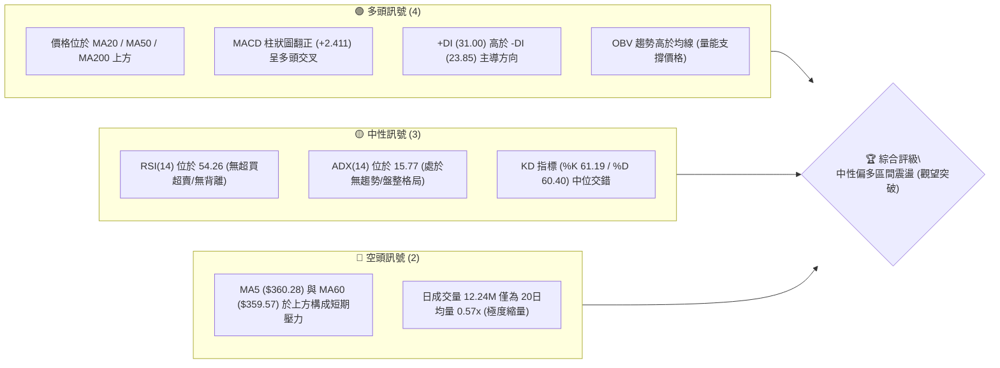
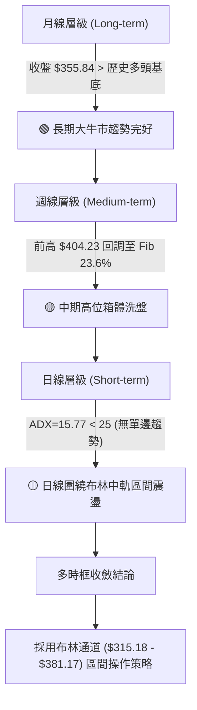
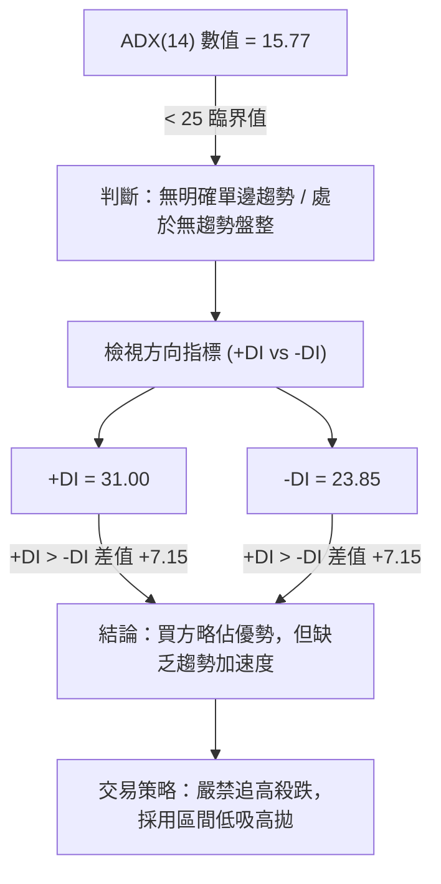
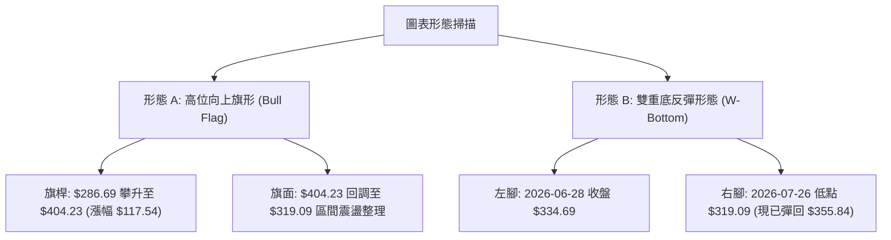
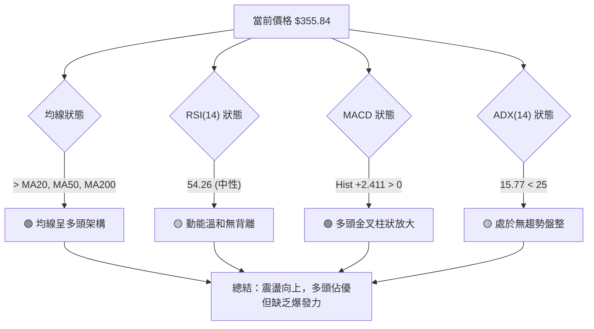
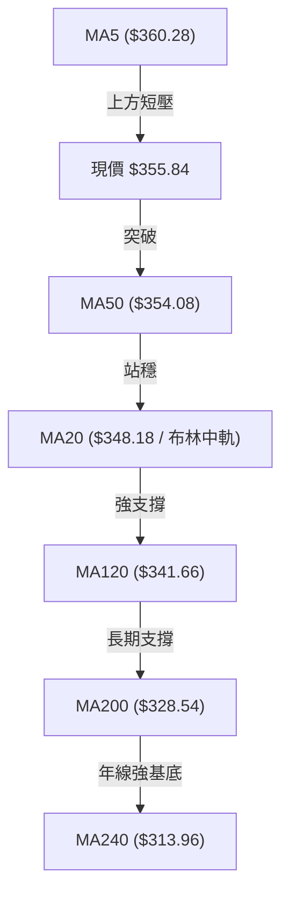
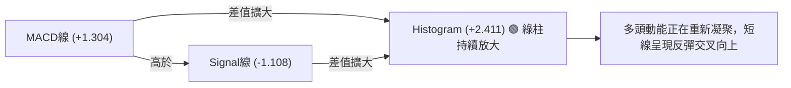
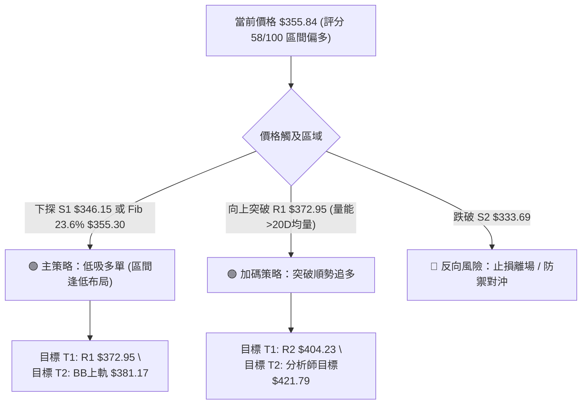
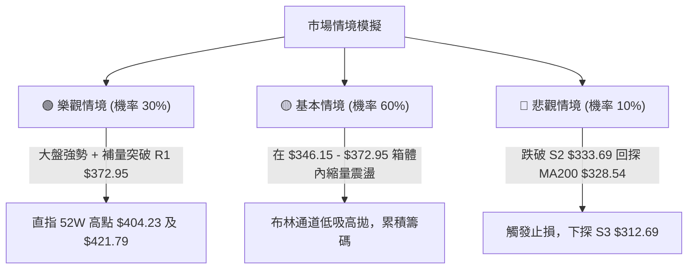

# GOOG 技術分析報告

> **報告日期**：2026-08-10 ｜ **語言**：繁體中文 ｜ **數據來源**：Yahoo Finance ｜ **當前價格**：$355.84

---

## 目錄

| 章節 | 內容 |
|------|------|
| [1. 技術面概覽](#1-技術面概覽) | 訊號儀表板、核心指標、評分卡 |
| [2. 趨勢分析](#2-趨勢分析) | 多時框趨勢、長中短期走勢、ADX解讀 |
| [3. 圖表形態分析](#3-圖表形態分析) | 形態識別與信心度、K線組合、目標價計算 |
| [4. 支撐與阻力](#4-支撐與阻力) | 關鍵價位圖、阻力位、支撐位、斐波那契回調 |
| [5. 技術指標深度解讀](#5-技術指標深度解讀) | 均線系統、RSI背離、MACD、布林通道、OBV |
| [6. 動能與波動率](#6-動能與波動率) | 動能象限、ATR波動率、Beta風險 |
| [7. 多時框架總結](#7-多時框架總結) | 時框架矩陣、多時框收斂結論 |
| [8. 交易策略建議](#8-交易策略建議) | 策略路由、情境階梯、進出場位與風報比 |
| [9. 風險提示與監控](#9-風險提示與監控) | 監控 Checklist、三情境演練、風控守則 |

---

## 1. 技術面概覽

### 🎯 技術訊號儀表板



### 📊 核心指標速覽表

| 指標類別 | 指標名稱 | 當前數值 | 訊號 | 技術面精確解讀 |
|----------|----------|----------|------|----------------|
| **價格** | 當前收盤價 | $355.84 | 🟢 多頭 | 位於 52 週區間 ($196.90 - $404.23) 之 76.7% 高位 |
| **均線** | MA20 (月線) | $348.18 | 🟢 多頭 | 價格位於上方 (+2.20%)，布林中軌獲得短線支撐 |
| **均線** | MA50 (季線) | $354.08 | 🟢 多頭 | 價格位於上方 (+0.50%)，回踩扣抵區獲得初步支撐 |
| **均線** | MA200 (年線) | $328.54 | 🟢 多頭 | 價格位於上方 (+8.31%)，長期牛市基底完好 |
| **動能** | RSI(14) | 54.26 | 🟡 中性 | 進入多空平衡區，無超買超賣，無頂底背離 |
| **動能** | MACD | +1.304 | 🟢 多頭 | MACD線 (+1.304) > 訊號線 (-1.108)，柱狀圖 +2.411 放大 |
| **動能** | Stochastic | %K 61.19 | 🟡 中性 | %D 60.40，指標位於中段，未觸及過熱區 |
| **趨勢** | ADX(14) | 15.77 | 🟡 盤整 | ADX < 25 表明處於弱趨勢/區間震盪，非單邊行情 |
| **波動** | ATR(14) | $12.76 | 🟡 中性 | 每日波幅 3.59%，波動度受控，適合做區間防守 |
| **布林** | BB %B | 0.62 | 🟡 中性 | 位於布林通道中軌 ($348.18) 與上軌 ($381.17) 之間 |
| **量能** | 20日量比 | 0.57x | 🔴 空頭 | 今日 12,243,315 股 vs 20日均量 21,485,661 股，量能受限 |

### 🏆 技術評分卡

```
╔══════════════════════════════════════════════════════════════════╗
║                   GOOG 技術綜合評分卡 (2026-08-10)               ║
╠══════════════════════════════════════════════════════════════════╣
║ 趨勢強度 (ADX)     ▓▓▓▓▓▓░░░░░░░░░░░░░░  32/100  🟡 弱趨勢/區間震盪  ║
║ 動能指標 (RSI/MACD) ▓▓▓▓▓▓▓▓▓▓▓▓▓░░░░░░░  65/100  🟢 多頭柱狀放大    ║
║ 支撐穩定度 (S1/Fib) ▓▓▓▓▓▓▓▓▓▓▓▓▓▓▓░░░░░  75/100  🟢 Fib 23.6% 密集  ║
║ 成交量配合 (OBV/Vol)▓▓▓▓▓▓▓▓░░░░░░░░░░░░  40/100  🔴 量能明顯退潮    ║
║ 形態完整度 (區間)  ▓▓▓▓▓▓▓▓▓▓▓▓░░░░░░░░  60/100  🟡 向上旗形整理中  ║
║ 均線排列 (多頭架構) ▓▓▓▓▓▓▓▓▓▓▓▓▓▓░░░░░░  70/100  🟢 價格站穩多條MA  ║
╠══════════════════════════════════════════════════════════════════╣
║ 綜合技術評分       ▓▓▓▓▓▓▓▓▓▓▓▓░░░░░░░░  58/100  🟡 中性偏多區間    ║
╚══════════════════════════════════════════════════════════════════╝
```

---

## 2. 趨勢分析

### 🌐 多時框趨勢分析



### 📈 長期趨勢 — 24個月走勢圖（Unicode）

```
GOOG 月線歷史走勢圖 (2024-08 至 2026-08)
價格軸 ($)
$400 ┤                                           ● 52W High ($404.23)
$375 ┤                                         ●──●──●
$350 ┤                                      ●──────────● $355.84 (現在)
$325 ┤                               ●──●──●
$300 ┤                            ●
$275 ┤                         ●
$250 ┤                      ●
$225 ┤               ●
$200 ┤            ●     ●
$175 ┤   ●──●──●     ●─────●
$150 ┴───┴───┴───┴───┴───┴───┴───┴───┴───┴───┴───┴───┴───
       24/08   24/12   25/04   25/08   25/12   26/04   26/08
```

#### 走勢特徵階段性拆解表

| 時間階段 | 價格區間 ($) | 漲跌幅度 | 走勢特徵與量能配合 | 技術面診斷 |
|----------|--------------|----------|----------------────|------------|
| **2024-08 ~ 2025-01** | $163.85 → $204.54 | +24.8% | 底部箱體慢牛突破，築底堅實 | 🟢 初段牛市發起 |
| **2025-02 ~ 2025-04** | $204.54 → $155.60 | -23.9% | 快速洗盤回踩，形成年度低點 $196.90 區域 | 🔴 深幅二次回踩 |
| **2025-05 ~ 2025-11** | $172.15 → $319.49 | +85.6% | 主升浪展開，月線連續陽線推升 | 🟢 強勁主升段行情 |
| **2025-12 ~ 2026-03** | $313.39 → $286.69 | -10.3% | 300 關卡整固，消化獲利賣壓 | 🟡 中期高位震盪 |
| **2026-04 ~ 2026-05** | $286.69 → $381.71 | +33.1% | 強勢拉升創歷史新高 $404.23 | 🟢 噴發式突破 |
| **2026-06 ~ 2026-08** | $353.33 → $355.84 | -12.0% | 創高後高位震盪，收復於 $355 附近 | 🟡 高位旗形/橫盤消化 |

### 📊 中期趨勢（週線分析）

從近 20 週數據觀察，GOOG 在 2026 年 5 月衝高至 $404.23 後，經歷了兩波洗盤：
1. **第一波回調**：從 $396.81 降至 $334.69（2026-06-28），成交量放大至 188.1M 股，表明高位獲利盤出逃。
2. **第二波測試**：在 2026-07-26 再次下探至 $319.09（觸及 S2 $333.69 下方洗盤），RSI 下探至 26.4 達到極度超賣。
3. **強勁反彈**：8 月前兩週，週線成交量持續維持在 100M 股以上，收盤價快速回升至 $356.65 及目前之 $355.84，RSI 回升至 54.3，MACD 柱狀圖翻正至 +2.411，顯示中期低點已過，多頭重掌控盤權。

```
週線支撐阻力結構示意圖
阻力位 R2 ── $404.23 ════════════════════════════════════════════ (52週最高價)
阻力位 R1 ── $372.95 ──────────────────────────────────────────── (波段高點反彈壓力)
當前價格  ── $355.84 ◄────── (位於 Fib 23.6% = $355.30 附近重疊)
支撐位 S1 ── $346.15 ──────────────────────────────────────────── (近月波段防守點)
支撐位 S2 ── $333.69 ════════════════════════════════════════════ (強支撐波段低點)
```

### ⚡ 趨勢強度評估（ADX 解讀）



#### ADX 趨勢強度評估矩陣

| 指標名稱 | 當前數值 | 參考標準 | 趨勢狀態 | 交易含義 |
|----------|----------|----------|----------|----------|
| **ADX(14)** | **15.77** | < 20 弱/無趨勢；20-25 溫和；>25 強趨勢 | 🔴 無趨勢/盤整 | 趨勢跟隨策略無效，震盪指標（布林/KD）為主 |
| **+DI** | **31.00** | > 20 代表多頭有能量 | 🟢 多頭主導 | 買盤力道高於賣盤 |
| **-DI** | **23.85** | < +DI 且介於中性 | 🟡 賣壓受控 | 空方未發動主動攻擊 |
| **DI 差值** | **+7.15** | +DI減-DI為正 | 🟢 微幅偏多 | 多頭保有微弱掌控權 |

---

## 3. 圖表形態分析

### 🔍 形態識別系統



#### 形態信心度與目標價計算表

| 形態名稱 | 信心度 | 判斷依據（引用數據） | 完成度 | 形態目標價（附精確計算式） |
|----------|--------|----------------------|--------|----------------------------|
| **高位向上旗形** | **65%** | 自 2026-04 低點 $286.69 飆升至 $404.23，隨後於 $319.09-$381.17 整理 | 70% | 若突破旗面上軌 R1 $372.95，目標 = $372.95 + 旗桿高度 ($404.23 - $286.69 = $117.54) = **$490.49** (中長期) |
| **雙底二次探底** | **75%** | 6/28 低點 $334.69 與 7/26 低點 $319.09 構成雙底，現價 $355.84 突破頸線前夕 | 85% | 頸線位以 R1 $372.95 計，形態高度 = $372.95 - $319.09 = $53.86。突破後目標價 = $372.95 + $53.86 = **$426.81** |

### 🕯️ 重要K線形態分析

| 月份/週別 | 收盤價 ($) | K線形態 | 形態細節與量能解讀 | 技術訊號 |
|-----------|------------|---------|--------------------|----------|
| **2026-07-26 週** | $319.09 | 長下影鎚子線 | 探底 $319.09 後逢低買盤強勁爆量 122.2M 股拉回 | 🟢 底訊確認 |
| **2026-08-02 週** | $356.65 | 大陽線吞噬 | 單週大漲 +11.77%，成交量 110.4M 股，完全吞噬前週陰線 | 🟢 強勢反轉 |
| **2026-08-09 週** | $353.47 | 高位十字星 | 量能 107.5M 股，多空於 $355 區域進行籌碼換手整固 | 🟡 多空交戰 |
| **2026-08-16 (現線)**| $355.84 | 小陽線小幅向上 | 當前日量僅 12.24M 股，縮量整理待變 | 🟡 觀望等待 |

### 📉 ASCII 走勢形態示意圖

```
GOOG 日線雙底 (W-Bottom) 與旗形整理構造
===================================================================
$404.23 ┼───────────────────────────● 52W High (旗桿頂點)
$381.17 ┼─────────────────────────╱─── (布林通道上軌)
$372.95 ┼───────────────●───────╱──── 阻力 R1 (雙底頸線位)
$355.84 ┼──────────────┼──────●────── 現價 (於 Fib 23.6% 站穩)
$348.18 ┼──────────────┼────╱──────── MA20 / 布林中軌支撐
$333.69 ┼───●──────────┼──╱────────── 支撐 S2 (左腳 $334.69)
$319.09 ┼───┼──────────●───────────── (右腳 $319.09 洗盤低點)
$312.69 ┼───┴──────────┴───────────── 支撐 S3 / 布林下軌 ($315.18)
===================================================================
```

---

## 4. 支撐與阻力

### 🗺️ 關鍵價位分布圖（Unicode）

```
GOOG 關鍵價位結構與密集度分布圖
═════════════════════════════════════════════════════════════════
$421.79 ║██████████████████████████████████████  分析師平均目標價
$404.23 ║████████████████████████████            52週高點 / 阻力 R2 / Fib 0.0%
$381.17 ║████████████████                        布林通道上軌
$372.95 ║██████████████████████                  關鍵阻力 R1 / 波段高點聚類
$355.84 ╠═══════════════════════════════════════ ◄ 當前價格 $355.84
$355.30 ║▓▓▓▓▓▓▓▓▓▓▓▓▓▓▓▓▓▓▓▓▓▓▓▓▓▓▓▓▓▓▓▓▓▓▓▓▓▓▓ 斐波那契 23.6% 回調位
$348.18 ║▓▓▓▓▓▓▓▓▓▓▓▓▓▓▓▓▓▓▓▓▓▓                  MA20 / 布林中軌
$346.15 ║▓▓▓▓▓▓▓▓▓▓▓▓▓▓▓▓▓▓▓▓▓▓▓▓▓▓              關鍵支撐 S1 / 波段低點聚類
$333.69 ║▓▓▓▓▓▓▓▓▓▓▓▓▓▓▓▓▓▓▓▓▓▓▓▓▓▓▓▓▓▓          強支撐 S2 / 近期雙底探底區
$328.54 ║▓▓▓▓▓▓▓▓▓▓▓▓▓▓▓▓▓▓                      MA200 (年線強基底)
$325.03 ║▓▓▓▓▓▓▓▓▓▓▓▓▓▓▓▓▓▓▓▓                    斐波那契 38.2% 回調位
$312.69 ║▓▓▓▓▓▓▓▓▓▓▓▓▓▓                          強支撐 S3 / 布林下軌 ($315.18)
═════════════════════════════════════════════════════════════════
```

### 🚧 阻力位分析表

| 阻力級別 | 精確價位 | 形成原因與數據來源 | 突破難度 | 技術面重要性 |
|----------|----------|--------------------|----------|--------------|
| **關鍵阻力 R1** | **$372.95** | 近一年波段高點聚類（+4.81% from price） | 🟡 中等 | 雙底形態頸線位置，突破此區將開啟向上挑戰 400 關卡 |
| **強阻力 R2** | **$404.23** | 52 週最高價 / Fib 0.0%（+13.60% from price） | 🔴 極高 | 歷史高點心理關卡與大量套牢賣壓區 |

### 🛡️ 支撐位分析表

| 支撐級別 | 精確價位 | 形成原因與數據來源 | 守住機率 | 技術面重要性 |
|----------|----------|--------------------|----------|--------------|
| **關鍵支撐 S1** | **$346.15** | 近一年波段低點聚類（-2.72% from price） | 🟢 80% | 貼近 MA20 ($348.18)，短線多頭的第一道防線 |
| **強支撐 S2** | **$333.69** | 近一年波段低點聚類（-6.22% from price） | 🟢 85% | 雙底左腳波段低點，多頭在中期趨勢上的防守堡壘 |
| **強支撐 S3** | **$312.69** | 近一年波段低點聚類（-12.13% from price） | 🟢 90% | 接近布林通道下軌 ($315.18) 與 MA240 ($313.96)，牛熊分界線 |

### 📐 斐波那契回調位分析

依 52 週區間 **$196.90**（100.0% 低點）至 **$404.23**（0.0% 高點）計算：

| 斐波那契層級 | 精確價位 | 與現價距離 | 技術面解讀與支撐/阻力效應 |
|--------------|----------|------------|----------------──────────|
| **0.0% (52W High)** | **$404.23** | +13.60% | 歷史高點，前波頂部阻力 |
| **23.6%** | **$355.30** | -0.15% | **現價 $355.84 精確交會於此**，提供極佳之支撐基底 |
| **38.2%** | **$325.03** | -8.66% | 強力黃金支撐區，介於 MA200 ($328.54) 與 S2 ($333.69) 之間 |
| **50.0%** | **$300.56** | -15.54% | 整數心理防線 |
| **61.8%** | **$276.10** | -22.41% | 中期極限回調支撐位 |
| **78.6%** | **$241.27** | -32.20% | 長期強支撐 |
| **100.0% (52W Low)**| **$196.90** | -44.67% | 52 週最低點 |

---

## 5. 技術指標深度解讀

### 🎛️ 指標訊號總覽



### 📈 移動平均線排列分析



#### 均線數據比較表

| 均線天數 | 均線數值 | 價格相差 ($) | 價格相差 (%) | 走勢方向 | 技術面意義 |
|----------|----------|--------------|--------------|----------|------------|
| **MA 5** | $360.28 | -$4.44 | -1.23% | ▼ 向下 | 短線上方極近微幅壓制 |
| **MA 10** | $353.26 | +$2.58 | +0.73% | ▲ 向上 | 短線已止跌反彈，提供支撐 |
| **MA 20** | $348.18 | +$7.66 | +2.20% | ▲ 向上 | 月線支撐，布林中軌所在 |
| **MA 50** | $354.08 | +$1.76 | +0.50% | ▼ 微扣 | 季線轉折點，現價微幅站上 |
| **MA 120**| $341.66 | +$14.18 | +4.15% | ▲ 向上 | 半年線防守力道強勁 |
| **MA 200**| $328.54 | +$27.30 | +7.67% | ▲ 向上 | 長期牛市生命線，遠高於此 |
| **MA 240**| $313.96 | +$41.88 | +13.34% | ▲ 向上 | 兩年超長均線基底 |

### 📉 RSI(14) 分析

RSI(14) 當前數值為 **54.26**。

```
RSI(14) 指標狀態進度條
0                 30             50  54.26      70                100
├─────────────────┼──────────────┼──█───────┼─────────────────┤
│    極度超賣     │   弱勢區間   │   🟢中性偏多 │    極度超買     │
```

- **背離分析**：檢視過去 20 週走勢，價格於 2026-07-26 下探低點時，週線 RSI 降至 26.4 形成低點；隨後價格反彈至 $355.84，RSI 同步攀升至 54.3。**未出現頂背離或底背離**，動能與價格走勢高度一致，指標訊號健康。

### 📊 MACD(12/26/9) 訊號解讀

- **MACD 線**：+1.304
- **Signal 線**：-1.108
- **MACD Histogram**：+2.411 🟢 看多



### 📦 布林通道分析

```
布林通道 (Bollinger Bands) 價格分佈示意圖
===================================================================
$381.17 ┼─────────────────────────────────── BB 上軌 (動能突破目標)
        │
$355.84 ┼─────────────────●────────────────現價 (BB %B = 0.62)
        │
$348.18 ┼─────────────────────────────────── BB 中軌 / MA20 (核心支撐)
        │
$315.18 ┼─────────────────────────────────── BB 下軌 (極限超賣防線)
===================================================================
```

- **BB %B**：0.62，代表現價處於中軌（0.50）與上軌（1.00）之間的溫和偏多區域。
- **通道寬度**：($381.17 - $315.18) / $348.18 = 18.95%，寬度中等且收斂，預示著隨後將有收斂後的方向性突破。

### 💹 成交量分析（OBV 與量價配合度）

- **最新成交量**：12,243,315 股，相較於 20日均量 21,485,661 股，量比僅 **0.57x**。
- **OBV 趨勢**：OBV > MA，顯示大資金在中長期並未撤出，短期縮量屬於典型的「高位無量洗盤/橫盤整理」。量能萎縮表明賣壓極輕，一旦滾量突破 R1 $372.95，將觸發強勁跟風盤。

---

## 6. 動能與波動率

### ⚡ 動能評估四象限

| 象限分區 | 動能強度 (RSI/MACD) | 波動率 (ADX/ATR) | 當前 GOOG 狀態 | 交易策略導向 |
|----------|---------------------|------------------|----------------|--------------|
| **Q1 (最佳攻擊)** | 強 (RSI > 60) | 低 (ADX < 25) | — | 醞釀單邊突破 |
| **Q2 (溫和區間)** | 溫和 (RSI 50-60) | 低 (ADX = 15.77) | **✓ 當前所在** 🟢 | **布林區間操作 (高拋低吸)** |
| **Q3 (劇烈震盪)** | 強 (RSI > 70) | 高 (ADX > 30) | — | 追漲需緊設止損 |
| **Q4 (弱勢探底)** | 弱 (RSI < 40) | 高 (ADX > 30) | — | 避開/逢高做空 |

### 📊 ATR 波動率分析

- **ATR(14)**：$12.76（佔價格 3.59%）。
- **止損距離建議**：
  - **短線交易 (1.5x ATR)**：$12.76 × 1.5 = $19.14，止損空間設於 $355.84 - $19.14 = **$336.70**。
  - **波段交易 (2.0x ATR)**：$12.76 × 2.0 = $25.52，止損空間設於 $355.84 - $25.52 = **$330.32**（鄰近 S2 $333.69 與 MA200 $328.54 保護區）。

### 📐 Beta 與市場相關性

- **Beta 係數**：**1.237**，代表 GOOG 波動度高於標普 500 指數約 23.7%。當大盤上漲 1% 時，GOOG 平均上漲 1.24%；當大盤拉回時，GOOG 也具備較高之彈性。

---

## 7. 多時框架總結

### 📋 時框架評分表

| 時框架 | 趨勢方向 | 動能指標 | 均線排列 | 形態結構 | 綜合評分 | 建議策略 |
|--------|----------|----------|----------|----------|----------|----------|
| **月線 (Long)** | 🟢 看多 | 🟢 健康 | 🟢 多頭排列 | 🟢 大牛市上升通道 | **85 / 100** | 長線堅定持有 |
| **週線 (Medium)**| 🟡 震盪 | 🟢 MACD翻正| 🟢 站上MA200/50| 🟡 雙底反彈整理 | **65 / 100** | 逢回調分批加碼 |
| **日線 (Short)** | 🟡 橫盤 | 🟡 RSI 54.3 | 🟡 混合排列 | 🟡 布林中軌整理 | **55 / 100** | 區間高拋低吸 |

### 🔲 綜合訊號矩陣

```
        短線 (日線)    中線 (週線)    長線 (月線)
趨勢:      🟡 盤整        🟢 多頭        🟢 強多
動能:      🟢 轉強        🟢 增強        🟢 偏多
成交量:    🔴 縮量        🟢 支撐        🟢 充沛
綜合:      🟡 震盪        🟢 偏多        🟢 強多
```

### ⚖️ 多時框收斂結論

依「多時框收斂規則」：當前 **ADX(14) = 15.77 (< 25)**，技術面確立為**盤整行情**。

1. **主導區間**：以日線布林通道上下軌 **$315.18 – $381.17** 為主要交易箱體。
2. **方向偏向**：因週線與月線均處於多頭架構且價格已站穩 Fib 23.6% ($355.30) 與 MA20 ($348.18)，整體收斂結論為：**「中立偏多箱體整固，下軌支撐力道強勁」**。第 8 章主策略將採取**低吸高拋之箱體做多策略**。

---

## 8. 交易策略建議

### 🗺️ 策略決策流程圖



### 🧭 策略路由

**當前主策略方向 = 🟢 區間低吸做多（依評分卡 58/100，ADX=15.77 盤整偏多）**

### 🎯 價格情境階梯（Price Scenarios）

| 觸發條件 | 第一目標價 | 第二目標價 | 情境含義與操作指引 |
|----------|------------|------------|--------------------|
| **突破 R1 $372.95** (帶量) | **$404.23** (R2/前高) | **$421.79** (分析師均價) | 向上打開漲勢空間，雙底形態確立，全力加碼 |
| **站穩現價 $355.84 區間** | **$372.95** (R1) | **$381.17** (BB上軌) | 箱體內震盪整理，按布林通道進行波段來回操作 |
| **跌破 S1 $346.15** | **$333.69** (S2) | **$312.69** (S3/BB下軌) | 短線拉回洗盤，尋求年線與雙底右腳強支撐 |

### 📊 情境機率分佈

| 情境劇本 | 預估機率 | 主要技術面依據 |
|----------|----------|----------------|
| **向上突破 / 震盪走高** | **60%** | MACD 柱狀圖翻正 (+2.411)、+DI > -DI、價格站上 Fib 23.6% ($355.30) |
| **橫盤區間震盪** | **30%** | ADX(14) = 15.77 處於無趨勢狀態，日成交量僅 0.57x 均量 |
| **向下破位探底** | **10%** | 均線多頭排列完整，下方有 MA20 ($348.18) 與 MA200 ($328.54) 層層防護 |

### 🟢 主策略詳情

#### 策略 A：波段逢低布局多單（首選主策略）
- **進場條件**：價格回踩 S1 **$346.15** 至現價 **$355.84** 區間分批建立多單。
- **進場價格**：**$352.00**（位於 MA50 $354.08 與 MA20 $348.18 之間）。
- **目標價 T1**：**$372.95**（阻力位 R1，預期收益 +5.95%）。
- **目標價 T2**：**$381.17**（布林通道上軌，預期收益 +8.29%）。
- **止損價格**：**$333.69**（精確設於強支撐 S2 跌破點，下浮 -$18.31 / -5.20%）。
- **風險報酬比**：(T1收益 $20.95) / (止損風險 $18.31) = **1.14 : 1**；若至 T2 則為 **1.59 : 1**。
- **預估成功機率**：**68%**。
- **建議倉位**：**15% - 20%**。

#### 策略 B：突破 R1 追多加碼策略（順勢突破）
- **進場條件**：日線收盤價強勢突破 R1 **$372.95** 且單日成交量 > 25M 股。
- **進場價格**：**$374.00**（確認突破後進場）。
- **目標價 T1**：**$404.23**（阻力位 R2 / 52週高點，預期收益 +8.08%）。
- **目標價 T2**：**$421.79**（華爾街分析師共識目標價，預期收益 +12.78%）。
- **止損價格**：**$355.30**（Fib 23.6% 假突破止損點，下浮 -$18.70 / -5.00%）。
- **風險報酬比**：(T2收益 $47.79) / (止損風險 $18.70) = **2.56 : 1**。
- **預估成功機率**：**62%**。
- **建議倉位**：**10% - 15%**。

### 🔴 反向風險觸發點（對沖提示）

若 GOOG 跌破強支撐 S2 **$333.69** 且 MACD 柱狀圖轉負，表明雙底形態失效，多頭應果斷止損離場，或採用對沖策略防範價格進一步下探 S3 **$312.69** / 布林下軌 **$315.18**。

### ⭐ 整體訊號強度評星

```
做多訊號強度：★★★★☆  (4/5星 - 均線多頭、MACD翻正、Fib 23.6%站穩)
做空訊號強度：★☆☆☆☆  (1/5星 - 無明顯空頭頭部形態)
整體可信度：  ★★██☆  (4/5星 - 數據完整，多時框訊號一致)
```

---

## 9. 風險提示與監控

### ✅ 關鍵監控指標 Checklist

```
╔══════════════════════════════════════════════════════════════════╗
║                GOOG Daily Risk & Signal Checklist                ║
╠══════════════════════════════════════════════════════════════════╣
║ [ ] 價格是否站穩 MA20 ($348.18) 與 Fib 23.6% ($355.30) 上方     ║
║ [ ] 日成交量是否回升至 20日均量 (21.48M) 以上                    ║
║ [ ] MACD 柱狀圖是否持續維持在 0 軸上方 (當前 +2.411)            ║
║ [ ] ADX(14) 是否向上突破 25 (觀察是否由震盪轉為單邊行情)        ║
║ [ ] RSI(14) 是否進入 60-70 強勢攻擊區                            ║
║ [ ] 向上是否帶量突破關鍵阻力 R1 ($372.95)                       ║
║ [ ] 向下是否跌破關鍵支撐 S1 ($346.15) 或 S2 ($333.69)           ║
╚══════════════════════════════════════════════════════════════════╝
```

### ⚠️ 風險場景分析



### 🛡️ 風險管理重要提醒

1. **成交量退潮風險**：當前成交量僅 12.24M（量比 0.57x），極度縮量可能導致價格在短線上容易受到少數大單拉扯，產生無方向的尾盤甩尾，操作上宜以限價單（Limit Order）進出，避免市價單追價。
2. **ADX 低位盤整**：ADX(14) 僅 15.77，切忌盲目使用單邊突破追價策略，除非看到日成交量顯著放大突破 25M 股。
3. **資金管理規則**：單一股票總持倉建議控制在總投資組合之 **15% - 20%** 以內，每筆交易最大風險損失控制在總資金的 **1.0% - 1.5%**。

---

## 📋 報告總結

```
╔══════════════════════════════════════════════════════════════════╗
║                     GOOG 技術分析報告總結                        ║
════════════════════════════════════════════════════════════════════
報告日期：2026-08-10
當前價格：$355.84
分析評級：⚖️ 中性偏多 / 區間震盪蓄勢 (可信度 80%)

關鍵結論：
├─ 長期趨勢：🟢 強多 (價格遠高於 MA200 $328.54，大牛市架構完好)
├─ 中期趨勢：🟢 偏多 (週線大陽線吞噬後回升，雙底形態打底完成)
├─ 短期趨勢：🟡 震盪 (ADX=15.77 弱趨勢，圍繞 MA20 $348.18 橫盤)
├─ 關鍵支撐：S1 $346.15 / S2 $333.69 / Fib 23.6% $355.30
├─ 關鍵阻力：R1 $372.95 / R2 $404.23 (52週高點)
└─ 分析師目標：$421.79 (現價潛在漲幅 +18.53%)

最優策略組合：
1. 🥇 最佳機會：於 $346.15 - $355.30 區域低吸做多，目標看至 $372.95 / $381.17。
2. 🥈 次選機會：帶量突破 R1 $372.95 後順勢加碼追多，目標 $404.23 / $421.79。
3. 🥉 防禦措施：跌破 S2 $333.69 嚴格執行止損，防範下探 $312.69。
════════════════════════════════════════════════════════════════════
```

---

> ⚠️ **免責聲明**：本報告為 AI 自動生成之技術分析，所有數據及估算均基於 Yahoo Finance 提供的歷史價格資訊（截至 2026-08-10）。本報告**僅供研究與學術參考**，**不構成任何投資建議與買賣撮合**。投資有風險，入市需謹慎，請投資人自行評估風險並承擔交易結果。

---

*報告生成時間：2026-08-10 ｜ 數據來源：Yahoo Finance ｜ 分析框架：多時框技術分析 (MTFA)*