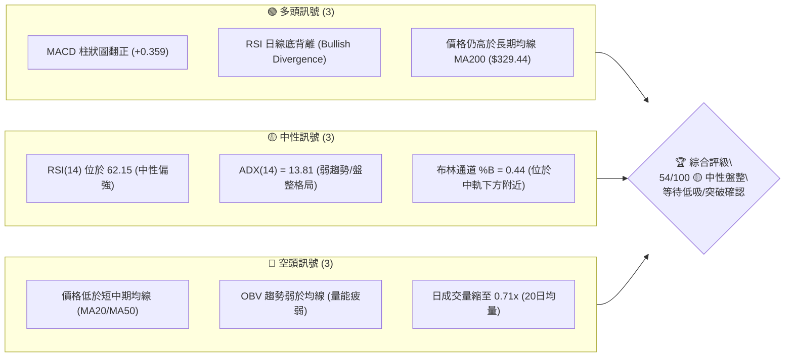
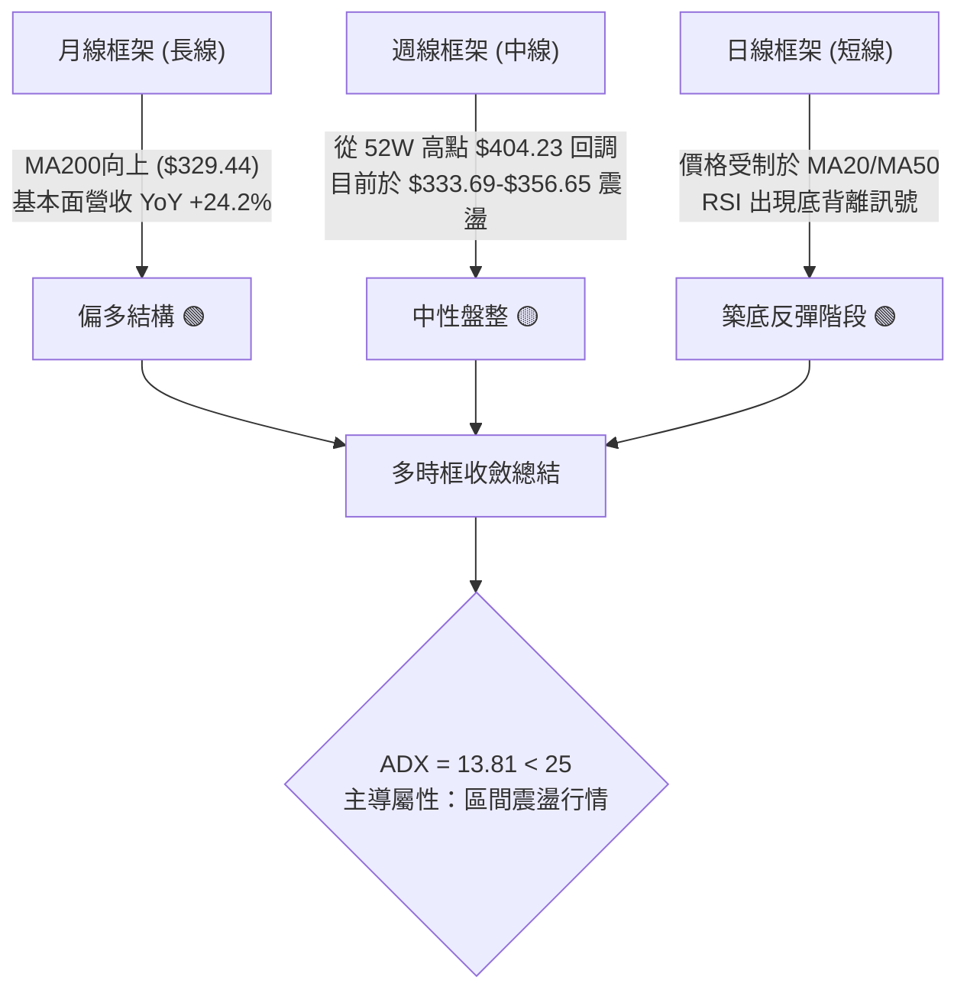
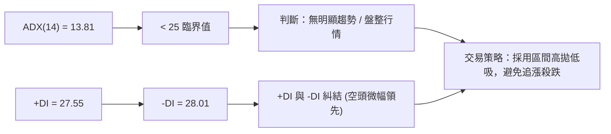
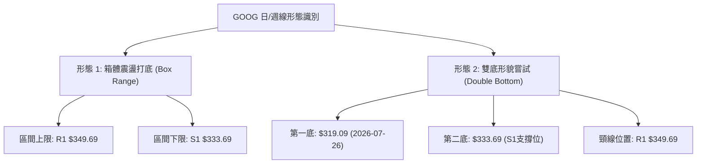
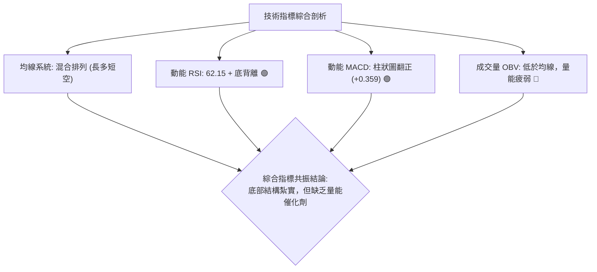
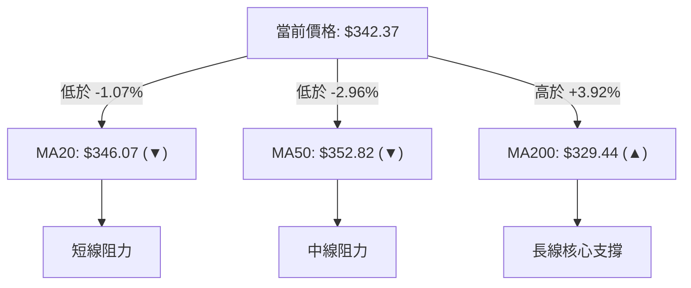
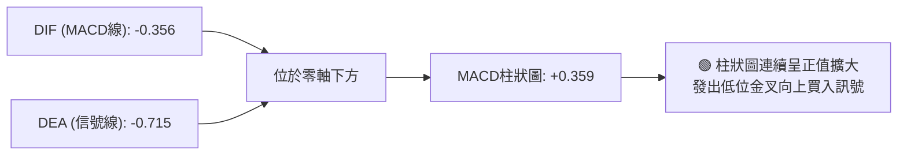
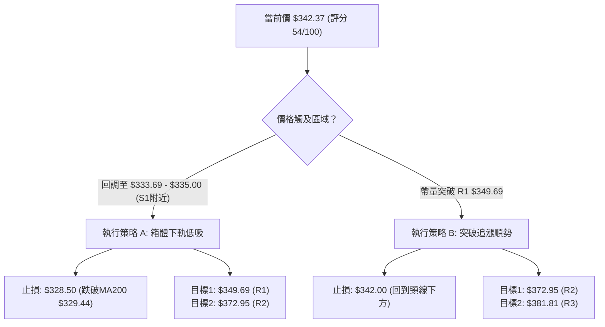
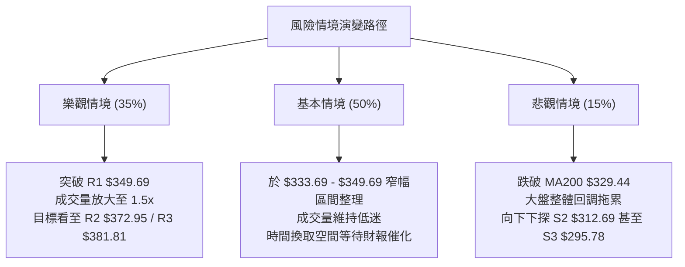

# GOOG 技術分析報告

> **報告日期**：2026-08-12 ｜ **語言**：繁體中文 ｜ **數據來源**：Yahoo Finance ｜ **當前價格**：$342.37

---

## 目錄

| 章節 | 內容 |
|------|------|
| [1. 技術面概覽](#1-技術面概覽) | 訊號儀表板、核心指標、評分卡 |
| [2. 趨勢分析](#2-趨勢分析) | 多時框趨勢、長中短期走勢 |
| [3. 圖表形態分析](#3-圖表形態分析) | 形態識別、K線組合、目標價 |
| [4. 支撐與阻力](#4-支撐與阻力) | 關鍵價位、斐波那契回調 |
| [5. 技術指標深度解讀](#5-技術指標深度解讀) | MA/RSI/MACD/布林/成交量 |
| [6. 動能與波動率](#6-動能與波動率) | 動能評估、ATR、Beta |
| [7. 多時框架總結](#7-多時框架總結) | 時框架評分矩陣 |
| [8. 交易策略建議](#8-交易策略建議) | 多空策略、風險報酬比 |
| [9. 風險提示與監控](#9-風險提示與監控) | 監控指標、風險場景 |

---

## 1. 技術面概覽

### 🎯 技術訊號儀表板



### 📊 核心指標速覽表

| 指標類別 | 指標名稱 | 當前數值 | 訊號 | 解讀 |
|----------|----------|----------|------|------|
| **價格** | 當前價格 | $342.37 | 🟡 | 位於52週區間70.2%位置，短線處於橫盤消化期 |
| **均線** | MA20 | $346.07 | 🔴 | 價格低於MA20，短期承壓（距現價 -1.07%） |
| **均線** | MA50 | $352.82 | 🔴 | 價格低於MA50，中期阻力明顯（距現價 -2.96%） |
| **均線** | MA200 | $329.44 | 🟢 | 價格高於MA200，長期牛市基底未破（+3.92%） |
| **動能** | RSI(14) | 62.15 | 🟢 | 中性偏多且出現日線底背離，下影線支撐強 |
| **動能** | MACD | -0.356 | 🟢 | 柱狀圖(+0.359)持續擴大，低位金叉蓄勢中 |
| **波動** | ATR(14) | $11.63 | 🟡 | 占股價3.40%，每日波動率處於常態範圍 |

### 🏆 技術評分卡

```
╔══════════════════════════════════════════════════════════════════╗
║              技術評分卡 — GOOG (2026-08-12)                     ║
╠══════════════════════════════════════════════════════════════════╣
║ 趨勢強度      ▓▓▓▓▓▓▓░░░░░░░░░░░░░  35/100  🔴 ADX=13.81 無明確單邊  ║
║ 動能指標      ▓▓▓▓▓▓▓▓▓▓▓▓░░░░░░░░  62/100  🟢 RSI底背離與MACD回升  ║
║ 支撐穩定度    ▓▓▓▓▓▓▓▓▓▓▓▓▓▓▓░░░░░  75/100  🟢 S1($333.69)&MA200支撐║
║ 成交量配合    ▓▓▓▓▓▓▓▓░░░░░░░░░░░░  45/100  🔴 量比0.71x，OBV偏弱   ║
║ 形態完整度    ▓▓▓▓▓▓▓▓▓▓▓░░░░░░░░░  55/100  🟡 寬幅箱體盤整打底中   ║
║ 均線排列      ▓▓▓▓▓▓▓▓▓▓░░░░░░░░░░  50/100  🟡 混合排列，長多短空   ║
╠══════════════════════════════════════════════════════════════════╣
║ 綜合評分      ▓▓▓▓▓▓▓▓▓▓▓░░░░░░░░░  54/100  🟡 中性觀望 / 區間操作  ║
╚══════════════════════════════════════════════════════════════════╝
```

---

## 2. 趨勢分析

### 🌐 多時框趨勢分析



### 📈 長期趨勢 — 12個月走勢圖（Unicode）

```
GOOG 月線走勢圖（2025-09 至 2026-08）
價格軸 ($)
$400 ┼                                   ●(2026-04 高點 $381.71)
$375 ┼                               ●   │   ●
$350 ┼                               │   │   │       ●   ●←現在($342.37)
$325 ┼                       ●   ●   │   │   │   ●   │   │
$300 ┼                   ●   │   │   │   │   │   │   │   │
$275 ┼               ●   │   │   │   │   │   │   │   │   │
$250 ┼       ●       │   │   │   │   │   │   │   │   │   │
$225 ┼   ●   │       │   │   │   │   │   │   │   │   │   │
$200 ┼   │   │       │   │   │   │   │   │   │   │   │   │
     └─┬───┬───┬───┬───┬───┬───┬───┬───┬───┬───┬───┬───►
      09  10  11  12  01  02  03  04  05  06  07  08 (月份)
      25  25  25  25  26  26  26  26  26  26  26  26
```

**走勢特徵分析表格**：

| 時間區間 | 收盤價範圍 | 漲跌幅 | 走勢特徵描述 |
|----------|------------|--------|--------------|
| 2025-09 ~ 2025-11 | $243.07 → $319.49 | +31.4% | 強烈主升段，AI 與 Cloud 業務激勵股價快速推進 |
| 2025-12 ~ 2026-03 | $313.39 → $286.69 | -8.5% | 獲利了結賣壓湧現，下探至 $286.69 築底 |
| 2026-04 ~ 2026-05 | $381.71 → $376.20 | +31.2% | 財報強勁暴漲破頂，創出 52 週新高 $404.23 |
| 2026-06 ~ 2026-08 | $353.33 → $342.37 | -9.0% | 高位拉回洗盤，當前於 $333.69 - $356.65 進行底部打底 |

### 📊 中期趨勢（週線分析）

中期走勢受制於 2026-05 創出的高位賣壓，近 20 週表現顯示股價從高點 $396.81 下滑後，在 2026-07-26 觸及 $319.09 的低點，隨後快速反彈回升至 $356.65。目前在 $342.37 尋求支撐。

```
週線壓力與支撐結構示意圖
阻力區 R2 ─── $372.95 ───────────────────────────────── (波段反彈壓力)
阻力區 R1 ─── $349.69 ───────────────────────────────── (MA20與短期頸線)
現價區間 ─── $342.37 ◄─── (當前盤整位置)
支撐區 S1 ─── $333.69 ───────────────────────────────── (近一年波段密集低點)
支撐區 S2 ─── $312.69 ───────────────────────────────── (布林下軌 $315.04 疊加)
```

### ⚡ 趨勢強度評估（ADX 解讀）



| 指標名稱 | 數值 | 臨界標準 | 判斷與解讀 |
|----------|------|----------|------------|
| **ADX(14)** | 13.81 | < 25 (無趨勢) / > 25 (強趨勢) | 趨勢動能極弱，市場處於窄幅震盪消化階段 |
| **+DI** | 27.55 | 多方力量強度 | 多頭多方力量回升，但未取得掌控權 |
| **-DI** | 28.01 | 空方力量強度 | 空方微幅高於多方 0.46，多空勢均力敵 |

---

## 3. 圖表形態分析

### 🔍 形態識別系統



#### 形態信心度與目標價評估

| 形態名稱 | 信心度 | 判斷依據（引用數據） | 完成度 | 目標價計算式與精確數值 |
|----------|--------|----------------------|--------|------------------------|
| **箱體震盪** | 85% | 股價交投於 S1 $333.69 與 R1 $349.69 之間，ADX=13.81 指示無趨勢 | 90% | 上軌目標 $349.69；下軌目標 $333.69 |
| **雙底形態** | 55% | 7月底低點 $319.09 與 S1 $333.69 形成二次墊高低點，MACD 柱狀圖翻正 | 40% | 突破頸線 R1($349.69) 後：<br/>$349.69 + ($349.69 - $319.09) = **$380.29** |

### 🕯️ 重要K線形態分析

| 日期/週別 | 收盤價 | K線形態 | 解讀 | 訊號 |
|-----------|--------|---------|------|------|
| 2026-07-26 | $319.09 | 長下影錘子線 | 探底至 52 週回調低點後迅速引發抄底買盤，RSI(26.4) 極度超賣 | 🟢 低位止跌 |
| 2026-08-02 | $356.65 | 大陽線吞噬 | 一週內暴漲 +11.77%，包覆前一週陰線實體，完成多頭反攻 | 🟢 強勢反轉 |
| 2026-08-09 | $353.47 | 高位十字星 | 於 MA50 ($352.82) 附近交投停滯，多空陷入僵局 | 🟡 觀望 |
| 2026-08-16 | $342.37 | 縮量小陰線 | 價格回落至 MA20 ($346.07) 下方，成交量降至 0.71x，洗盤性質濃厚 | 🟡 縮量整理 |

### 📉 ASCII 走勢形態示意圖

```
GOOG 箱體震盪與潛在雙底形態示意圖
$380 ┤                                           [目標價 $380.29]
$372.95 ┤─────────────────────────────────── (R2 阻力)
$349.69 ┤─────────────── Upper Range / 頸線 (R1 阻力) ──────
$342.37 ┤───────────● 現價 (於箱體內部蓄勢)
$333.69 ┤─────────────── Lower Range / 第二腳 (S1 支撐) ────
$319.09 ┤───────────● 第一腳 (2026-07-26 低點)
        └──────────────────────────────────────────────
```

### 🎯 形態目標價計算

根據雙底形態（若成功突破頸線 R1 $349.69）：
1. **形態高度** = 頸線價位 ($349.69) - 第一腳最低價 ($319.09) = **$30.60**
2. **最小突破目標價** = 頸線價位 ($349.69) + 形態高度 ($30.60) = **$380.29**
   *註：此目標價與阻力位 R3 ($381.81) 極為接近，高度吻合技術共振。*

---

## 4. 支撐與阻力

### 🗺️ 關鍵價位分布圖（Unicode）

```
GOOG 價位結構分布圖
══════════════════════════════════════════════════════════════════
$404.23 ║████████████████████████████████████████║ 52W High / Fib 0.0%
$381.81 ║████████████████████████████████        ║ 阻力 R3 (強阻力)
$377.09 ║████████████████████████████            ║ 布林通道上軌
$372.95 ║████████████████████████                ║ 阻力 R2 (中期反彈壓力)
$355.30 ║████████████████                        ║ Fib 23.6% 回調位
$349.69 ║████████████                            ║ 阻力 R1 / 箱體上軌
$342.37 ╠════════════════════════════════════════╣ ◄ 現價 (Current Price)
$333.69 ║▓▓▓▓▓▓▓▓▓▓▓▓                            ║ 支撐 S1 (近一年波段低點)
$329.44 ║▓▓▓▓▓▓▓▓▓▓▓▓▓▓▓▓                        ║ MA200 牛熊分界線
$325.03 ║▓▓▓▓▓▓▓▓▓▓▓▓▓▓▓▓▓▓▓▓                    ║ Fib 38.2% 回調位
$315.04 ║▓▓▓▓▓▓▓▓▓▓▓▓▓▓▓▓▓▓▓▓▓▓▓▓                ║ 布林通道下軌
$312.69 ║▓▓▓▓▓▓▓▓▓▓▓▓▓▓▓▓▓▓▓▓▓▓▓▓▓▓              ║ 支撐 S2 (強支撐)
$295.78 ║▓▓▓▓▓▓▓▓▓▓▓▓▓▓▓▓▓▓▓▓▓▓▓▓▓▓▓▓▓▓          ║ 支撐 S3 (極限強支撐)
══════════════════════════════════════════════════════════════════
```

### 🚧 阻力位分析表

| 阻力級別 | 價位 | 形成原因 | 突破難度 | 重要性 |
|----------|------|----------|----------|--------|
| **R1** | **$349.69** | 近一年波段高點聚類、MA20($346.07)與MA50($352.82)夾擊區 | 🟡 中等 | 短線多空分水嶺 |
| **R2** | **$372.95** | 近一年波段高點聚類，接近布林通道上軌 ($377.09) | 🔴 較高 | 中期波段獲利了結點 |
| **R3** | **$381.81** | 近一年高點聚類、2026-04月線收盤價 ($381.71) | 🔴 極高 | 挑戰 52W 高點前最大關卡 |

### 🛡️ 支撐位分析表

| 支撐級別 | 價位 | 形成原因 | 守住機率 | 重要性 |
|----------|------|----------|----------|--------|
| **S1** | **$333.69** | 近一年波段低點聚類，下方有 MA200 ($329.44) 護盤 | 🟢 80% | 短線守備核心底線 |
| **S2** | **$312.69** | 近一年波段低點聚類，疊加布林下軌 ($315.04) | 🟢 90% | 中期防守強陣地 |
| **S3** | **$295.78** | 近一年極限波段低點，Fib 50.0% ($300.56) 下方 | 🟢 95% | 長期牛市底線 |

### 📐 斐波那契回調位分析

依據 52 週高點 **$404.23** 至低點 **$196.90** 計算之關鍵回調位：

```
斐波那契階梯與現價位置
0.0%  ($404.23) ─── 52週最高點
23.6% ($355.30) ─── 關鍵阻力區
                   ▲ 現價 $342.37 (位於 23.6% 與 38.2% 之間)
38.2% ($325.03) ─── 強力黃金支撐區 (與 MA200 $329.44 形成共振)
50.0% ($300.56) ─── 多空中軸線
```

- **位置解讀**：現價 $342.37 處於 23.6% ($355.30) 與 38.2% ($325.03) 形成的黃金震盪區間內。
- **技術意義**：回調未跌破 38.2% ($325.03)，顯示本輪自 $404.23 的修正仍屬**多頭市場中的健康回調**。只要 $325.03 - $329.44(MA200) 守住，中長期多頭結構不變。

---

## 5. 技術指標深度解讀

### 🎛️ 指標訊號總覽



### 📈 移動平均線排列分析



| 均線名稱 | 價位 | 相對現價 | 走勢扣抵與狀態 | 評級 |
|----------|------|----------|----------------|------|
| **MA 5** | $350.26 | -2.25% | 短期急跌後平緩 | 🔴 空頭 |
| **MA 10** | $354.96 | -3.55% | 短期向下扣抵 | 🔴 空頭 |
| **MA 20** | $346.07 | -1.07% | 下行放緩，即將打平 | 🟡 中性偏空 |
| **MA 50** | $352.82 | -2.96% | 中期下行蓋頂 | 🔴 空頭 |
| **MA 120**| $342.31 | +0.02% | 向上揚升，現價精準扣抵 | 🟢 看多支撐 |
| **MA 200**| $329.44 | +3.92% | 長期牛市均線，強烈上揚 | 🟢 看多支撐 |

### 📉 RSI(14) 分析

- **當前數值**：62.15
- **強度進度條**：`█████████████░░░░░░░` 62.15% (中性偏多區間)
- **背離判斷**：⚠️ **日線等級底背離 (Bullish Divergence)**
  - *現象判讀*：股價在 2026-07 月下探波段低點時，RSI 曾跌至 26.4 的超賣區；隨後股價再探 $333.69 時，RSI 未創新低反而升至 50 以上，發出強烈的底背離訊號，預示賣壓竭盡、反彈在即。

### 📊 MACD(12,26,9) 訊號解讀



- **DIF**：-0.356
- **DEA**：-0.715
- **Histogram**：+0.359 (綠柱持續放大)
- **解讀**：DIF 已向上穿越 DEA 形成零軸下方金叉，且柱狀圖維持在 +0.359 正值區，顯示短期下跌動能已完全扭轉，正進入動能修復期。

### 📦 布林通道分析

```
GOOG 布林通道位置示意圖 (Bollinger Bands 20,2)
$377.09 ┼────────────────────────────── BB Upper (上軌)
        │
$346.07 ┼────────────────────────────── BB Middle / MA20 (中軌)
$342.37 ┼──────────────● 現價 (%B = 0.44)
        │
$315.04 ┼────────────────────────────── BB Lower (下軌)
```

- **通道帶寬**：上軌 $377.09 與下軌 $315.04 差距 $62.05，帶寬適中。
- **%B 指標**：0.44 (位於下軌與中軌之間，稍低於中心 0.50)。
- **解讀**：價格未貼近上軌或下軌，處於通道內部的安全修復區。若能增量突破中軌 $346.07，將打開通往上軌 $377.09 的空間。

### 💹 成交量分析（量價配合度）

- **最新成交量**：15,407,674 股
- **20 日均量**：21,629,139 股 (量比 **0.71x**)
- **OBV 狀態**：OBV < MA (能量潮指標低於其移動平均線)
- **量價診斷**：近期股價回落伴隨成交量縮至 20日均量的 71%，屬於典型的**「縮量拉回整理」**，賣壓並不劇烈；但缺乏大手筆買盤（OBV 偏弱），因此短期較難出現暴漲爆發力，以時間換取空間的機率較高。

---

## 6. 動能與波動率

### ⚡ 動能與波動率定位

| 象限分區 | 動能狀態 | 波動率狀態 | 當前 GOOG 狀態 | 交易策略指示 |
|----------|----------|------------|----------------|--------------|
| **Q1 (最佳爆發區)** | 強 (RSI>60, MACD金叉) | 低 (ATR% < 3%) | — | 突破追價 |
| **Q2 (低波打底區)** | 弱 (RSI<50) | 低 (ATR% < 3.5%) | **✓ GOOG 當前位置** | **區間低吸，佈局反彈** |
| **Q3 (高波震盪區)** | 強 (RSI>60) | 高 (ATR% > 4%) | — | 帶緊止損 |
| **Q4 (高危下行區)** | 弱 (RSI<40) | 高 (ATR% > 4%) | — | 離場觀望 |

### 📊 ATR 波動率分析

- **ATR(14)**：$11.63
- **百分比波動度**：3.40% ($11.63 / $342.37)
- **風控止損應用**：
  - **短線緊密止損 (1.0x ATR)**：$11.63 ➔ 進場價 - $11.63
  - **標準波段止損 (1.5x ATR)**：$17.45 ➔ 進場價 - $17.45
  - **寬幅防守止損 (2.0x ATR)**：$23.26 ➔ 進場價 - $23.26

### 📐 Beta 與市場相關性

- **Beta 係數**：1.237
- **特性解讀**：GOOG 波動度高於大盤 (S&P 500) 23.7%。在大盤反彈時具有強於大盤的彈升力道，但在大盤承壓時回調幅度亦較深。目前 Beta 1.237 配套 0.54% 的 FCF Yield 與 24.2% 的營收成長，具備高彈性優質權重股特質。

---

## 7. 多時框架總結

### 📋 時框架評分表

| 時框架 | 趨勢方向 | 動能指標 | 均線排列 | 形態結構 | 綜合評分 | 建議策略 |
|--------|----------|----------|----------|----------|----------|----------|
| **月線 (Long)** | 🟢 多頭 | 🟡 中性 | 🟢 多頭 | 🟢 震盪上行 | **75/100** | 長線堅定持有 |
| **週線 (Medium)**| 🟡 盤整 | 🟢 背離回升| 🟡 混合 | 🟡 箱體打底 | **55/100** | 區間逢低佈局 |
| **日線 (Short)** | 🟡 盤整 | 🟢 MACD金叉| 🔴 短期偏空| 🟢 雙底打底中| **50/100** | 高拋低吸，等待突破 |

### 🔲 綜合訊號矩陣

| 分析維度 | 多頭因素 | 空頭因素 | 矩陣收斂結果 |
|----------|----------|----------|--------------|
| **均線 vs 價格** | 高於 MA120 ($342.31)、MA200 ($329.44) | 低於 MA20 ($346.07)、MA50 ($352.82) | 🟡 中性（受夾擊） |
| **動能 vs 成交量**| RSI 日線底背離、MACD 柱狀圖翻正 | 20日量比僅 0.71x，OBV 偏弱 | 🟡 中性偏多（動能先發） |
| **形態 vs 支撐** | 接近 S1 $333.69 強支撐，Fib 38.2% 護盤 | 上方 R1 $349.69 蓋頂 | 🟢 多頭防禦力佔優 |

### ⚖️ 多時框收斂結論

> **核心收斂規則（依 ADX 判斷）**：
> 當前 ADX(14) 為 **13.81 (< 25)**，技術面嚴格定義為**「區間震盪/盤整行情」**。
> 根據多時框優先級收斂原則，日線布林通道上下軌 ($315.04 - $377.09) 以及關鍵支撐阻力 S1 ($333.69) 至 R1 ($349.69) 為當前主導交易區間。
> **最終方向性結論：【🟡 中性盤整偏多 — 區間低吸高拋策略】**。此結論完全貫徹至第 8 章交易策略。

---

## 8. 交易策略建議

### 🗺️ 策略決策流程圖



### 🧭 策略路由

**當前主策略方向：🟡 區間高拋低吸 / 突破確認策略（依綜合評分 54/100 路由）**
由於綜合評分為 54 分（處於 40-60 中性區間），且 ADX=13.81 顯示無趨勢，強烈建議不要在箱體中間 ($342.37) 盲目追價，應採取「低吸箱體下軌」或「突破箱體上軌後追擊」雙軌戰術。

### 🎯 價格情境階梯（Price Scenarios）

| 觸發條件 | 下一目標 | 後續延伸 | 情境含義 |
|----------|----------|----------|----------|
| **強勢突破 R1 $349.69** | R2 $372.95 | R3 $381.81 | 短線轉強，雙底成形，挑戰新高 |
| **站穩現價 $333.69 - $349.69** | — | — | 區間震盪打底，時間換取空間 |
| **有效跌破 S1 $333.69** | S2 $312.69 | S3 $295.78 | 中期走弱，下探布林下軌及 52W 低點區 |

### 📊 情境機率分佈

```
情境機率分佈示意圖
[區間震盪整理]   ████████████████████ 50% (ADX弱，動能量縮)
[向上突破/反彈]   ██████████████ 35% (RSI底背離，MACD金叉)
[向下破位探底]   ██████ 15% (基本面強勁，MA200護盤力道夠)
```

### 🟢 主策略詳情

| 策略要素 | 策略 A：箱體下軌低吸 (低吸型) | 策略 B：突破 R1 追擊 (突破型) |
|----------|--------------------------------|--------------------------------|
| **進場條件** | 股價回調至 S1 ($333.69) 附近出現止跌訊號 | 日線收盤價帶量突破 R1 ($349.69) |
| **進場價格** | **$335.00** | **$351.00** |
| **目標價 T1** | **$349.69** (R1 阻力) | **$372.95** (R2 阻力) |
| **目標價 T2** | **$372.95** (R2 阻力) | **$381.81** (R3 阻力) |
| **止損價格** | **$328.50** (跌破 MA200 $329.44) | **$342.00** (假突破回落至現價下方) |
| **風險報酬比 (T1)**| **2.26 : 1** [($349.69-$335) / ($335-$328.5)] | **2.44 : 1** [($372.95-$351) / ($351-$342)] |
| **風險報酬比 (T2)**| **5.84 : 1** [($372.95-$335) / ($335-$328.5)] | **3.42 : 1** [($381.81-$351) / ($351-$342)] |
| **成功機率估計** | **65%** | **55%** |
| **建議倉位** | **15% - 20%** | **10% - 15%** |

### 🔴 反向風險觸發點（對沖提示）

- **多頭失效觸發點**：若日線收盤價收低於 **$329.44 (MA200)** 且跌破 **S1 $333.69**，多頭打底結構失效，應即刻止損離場，並可考慮小倉位對沖至 **S2 $312.69**。

### ⭐ 整體訊號強度評星

```
做多訊號強度：★★★☆☆  (3.0/5星) — RSI背離與MACD金叉提供做多動能
做空訊號強度：★★☆☆☆  (2.0/5星) — 下方MA200與S1支撐強勁，做空盈虧比差
整體可信度：  ★★★☆☆  (3.5/5星) — 量能尚未放大，需等待成交量確認
```

---

## 9. 風險提示與監控

### ✅ 關鍵監控指標 Checklist

```
╔══════════════════════════════════════════════════════════════════╗
║                   GOOG 風險監控 Checklist                       ║
╠══════════════════════════════════════════════════════════════════╣
║ [ ] 1. 價格是否站上 MA20 ($346.07)？ (轉強第一信號)              ║
║ [ ] 2. 日成交量能否回升至 2,160 萬股 (20日均量) 以上？          ║
║ [ ] 3. MACD 柱狀圖是否持續保持正值 (+0.359 擴大中)？            ║
║ [ ] 4. 價格是否守住 MA200 ($329.44) 與 S1 ($333.69)？            ║
║ [ ] 5. ADX(14) 是否突破 25，開啟單邊趨勢行情？                  ║
╚══════════════════════════════════════════════════════════════════╝
```

### ⚠️ 風險場景分析



### 🛡️ 風險管理重要提醒

1. **量能未發不可重倉**：當前量比僅 0.71x，OBV 處於均線下方，顯示主力資金尚未大規模發起總攻。建議總倉位控制在 20% 以內，切忌滿倉博弈。
2. **嚴守 MA200 防線**：MA200 ($329.44) 是牛熊分界線，也是華爾街機構的核心防守成本線，一旦日線連續兩天收低於 $329.44，必須無條件執行風控止損。
3. **留意美聯儲與宏觀 Beta 波動**：GOOG 的 Beta 達 1.237，對利率敏感度較高，操作上需同步觀察科技股 ETF (QQQ) 走勢。

---

## 📋 報告總結

```
╔══════════════════════════════════════════════════════════════════╗
║                   GOOG 技術分析報告總結                          ║
╠══════════════════════════════════════════════════════════════════╣
║ 報告日期：2026-08-12                                             ║
║ 當前價格：$342.37                                                ║
║ 分析評級：🟡 中性觀望 / 箱體低吸區間操作 (評分: 54/100)           ║
║                                                                  ║
║ 關鍵結論：                                                        ║
║ ├─ 長期趨勢：🟢 多頭結構未破 (價格位於 MA200 $329.44 之上)        ║
║ ├─ 中期趨勢：🟡 箱體盤整 (交投於 S1 $333.69 - R1 $349.69 區間)   ║
║ ├─ 短期趨勢：🟢 築底反彈 (RSI 日線底背離 + MACD 低位金叉)        ║
║ ├─ 關鍵支撐：S1 $333.69 / S2 $312.69 / MA200 $329.44             ║
║ ├─ 關鍵阻力：R1 $349.69 / R2 $372.95 / R3 $381.81             ║
║ └─ 分析師目標均價：$421.79 (隱含 +23.2% 上行空間)                ║
║                                                                  ║
║ 最優策略組合：                                                    ║
║ 1. 🥇 最佳機會 (策略A)：回調至 S1 附近 ($335.00) 買入，止損 $328.50║
║ 2. 🥈 次選機會 (策略B)：帶量突破 R1 ($351.00) 追擊，目標 $372.95   ║
║ 3. 🥉 保守選擇：觀望等待 ADX > 25 且成交量放大超 2,160萬股後再入場║
╚══════════════════════════════════════════════════════════════════╝
```

---

> ⚠️ **免責聲明**：本報告為 AI 自動生成之技術分析，所有數據及估算均基於提供的歷史價格資訊。本報告**僅供研究與學術參考**，**不構成任何投資建議**。投資有風險，入市需謹慎。

---

*報告生成時間：2026-08-12 ｜ 數據來源：Yahoo Finance ｜ 分析框架：多時框技術分析*