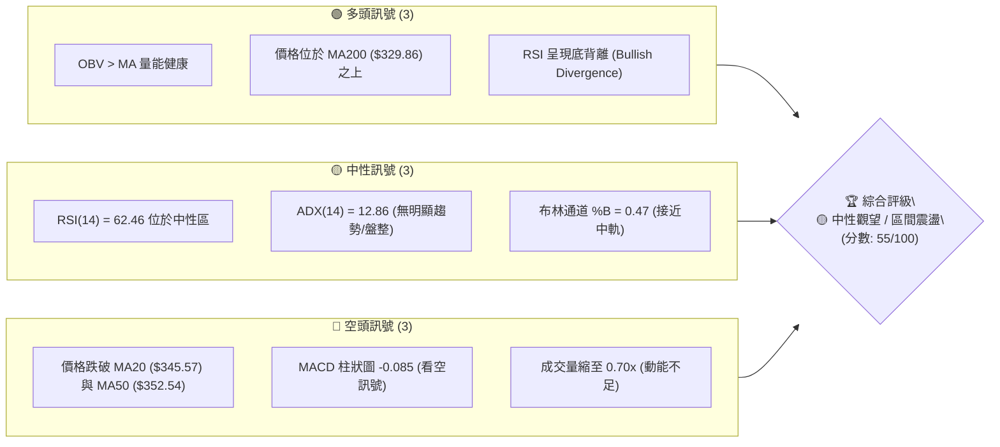
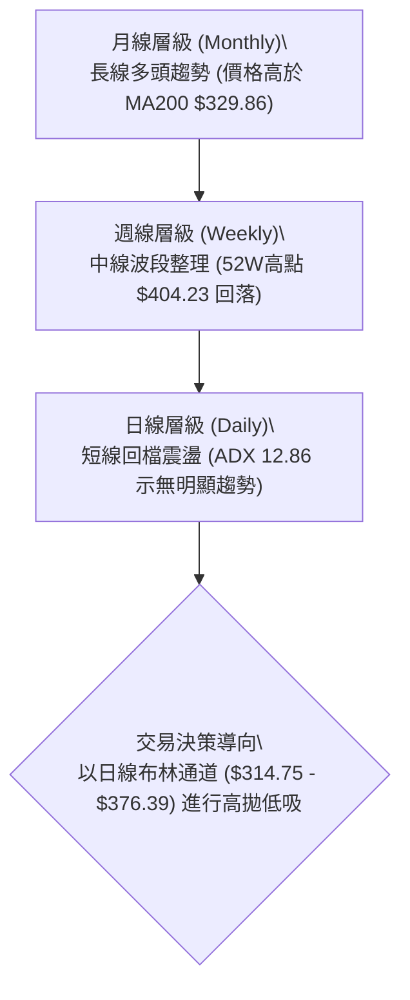
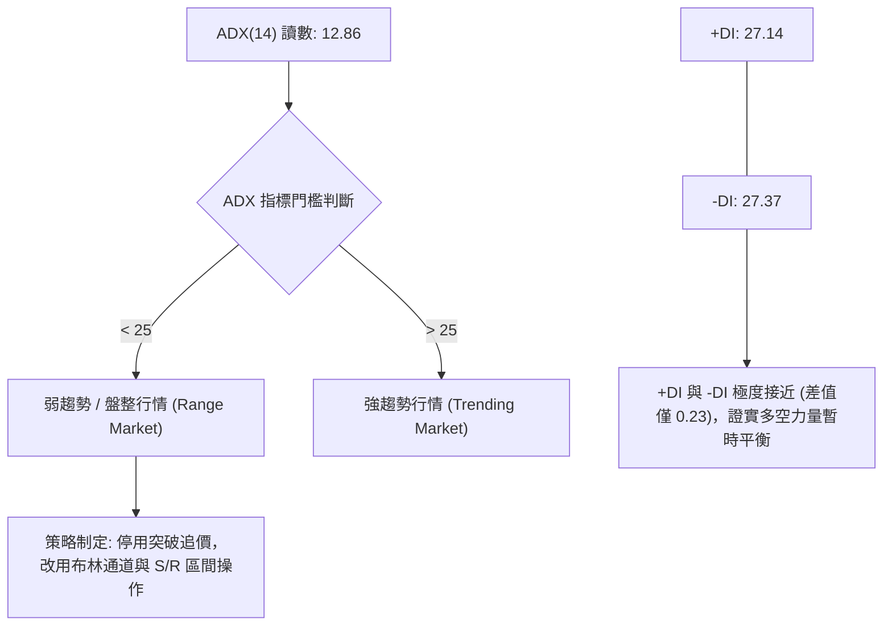
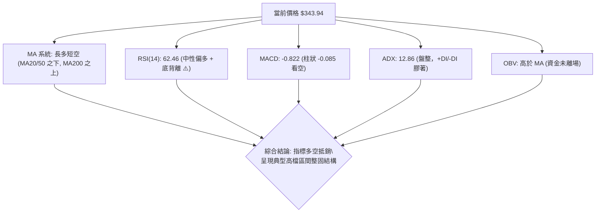
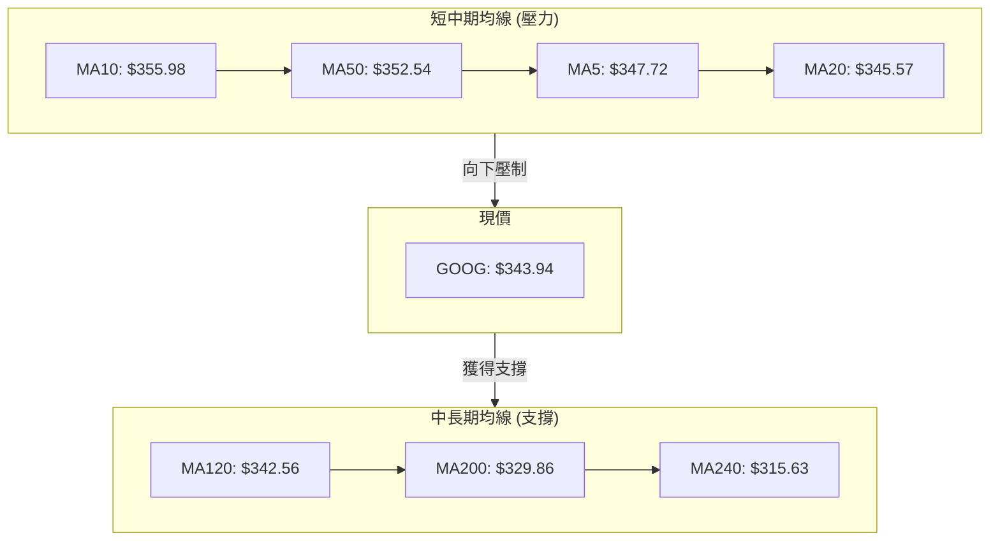
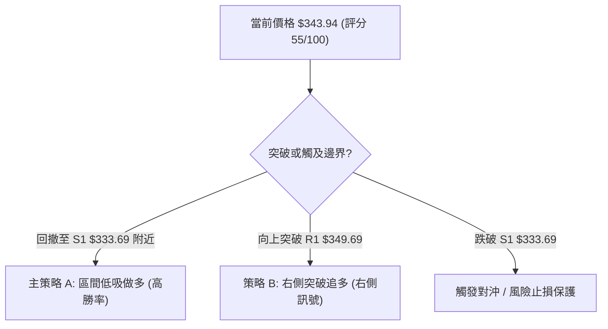
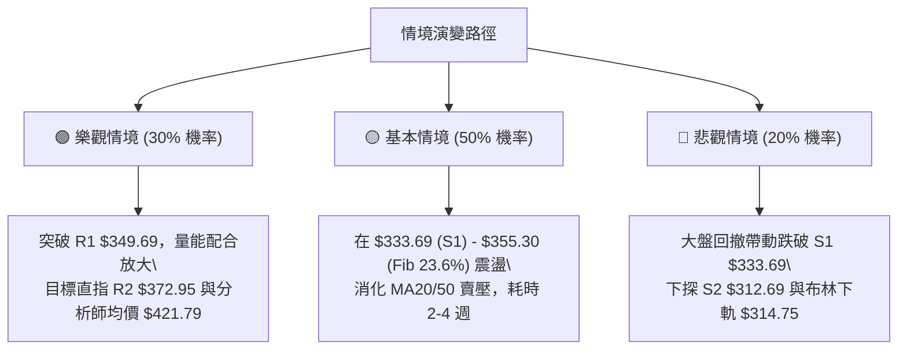

# GOOG 技術分析報告

> **報告日期**：2026-08-13 ｜ **語言**：繁體中文 ｜ **數據來源**：Yahoo Finance ｜ **當前價格**：$343.94

---

## 目錄

| 章節 | 內容 |
|------|------|
| [1. 技術面概覽](#1-技術面概覽) | 訊號儀表板、核心指標、評分卡 |
| [2. 趨勢分析](#2-趨勢分析) | 多時框趨勢、長中短期走勢 |
| [3. 圖表形態分析](#3-圖表形態分析) | 形態識別、K線組合、目標價 |
| [4. 支撐與阻力](#4-支撐與阻力) | 關鍵價位、斐波那契回調 |
| [5. 技術指標深度解讀](#5-技術指標深度解讀) | MA/RSI/MACD/布林/成交量 |
| [6. 動能與波動率](#6-動能與波動率) | 動能評估、ATR、Beta |
| [7. 多時框架總結](#7-多時框架總結) | 時框架評分矩陣 |
| [8. 交易策略建議](#8-交易策略建議) | 多空策略、風險報酬比 |
| [9. 風險提示與監控](#9-風險提示與監控) | 監控指標、風險場景 |

---

## 1. 技術面概覽

### 🎯 技術訊號儀表板



### 📊 核心指標速覽表

| 指標類別 | 指標名稱 | 當前數值 | 訊號 | 解讀 |
|----------|----------|----------|------|------|
| **價格** | 當前收盤價 | $343.94 | 🟡 中性 | 位於 52 週高低區間 70.9% 處，處於中高檔震盪 |
| **均線** | MA20 | $345.57 | 🔴 看空 | 價格位於 MA20 下方 (-0.47%)，短線承壓 |
| **均線** | MA50 | $352.54 | 🔴 看空 | 價格位於 MA50 下方，中期存在壓制 |
| **均線** | MA200 | $329.86 | 🟢 看多 | 價格位於 MA200 上方 (+4.27%)，長線多頭結構未破 |
| **動能** | RSI(14) | 62.46 | 🟡 中性 | 處於中性偏多區域，且存在底背離跡象 |
| **動能** | MACD | -0.822 | 🔴 看空 | MACD 與 Signal 均在零軸下方，柱狀圖 -0.085 |
| **動能** | Stochastic | %K 34.02 / %D 38.23 | 🟡 中性 | 指標接近弱勢區，但未達超賣 (<20) |
| **趨勢** | ADX(14) | 12.86 | 🟡 無趨勢 | ADX < 25 顯示市場處於無趨勢或寬幅盤整行情 |
| **波動** | ATR(14) | $11.41 | 🟡 中波動 | 日波幅約 3.32%，提供合理的止損設置空間 |
| **量力** | 量比 (Volume Ratio) | 0.70x | 🔴 偏弱 | 當日成交量 14.9M 低於 20日均量 21.2M，突破動能不足 |

### 🏆 技術評分卡

```
╔══════════════════════════════════════════════════════════════════╗
║                技術評分卡 — GOOG (2026-08-13)                     ║
╠══════════════════════════════════════════════════════════════════╣
║ 趨勢強度 (ADX)    ▓▓▓▓▓▓░░░░░░░░░░░░░░  30/100  🟡 弱趨勢/盤整   ║
║ 動能指標 (RSI/MACD) ▓▓▓▓▓▓▓▓▓▓░░░░░░░░░░  50/100  🟡 動能中性偏弱   ║
║ 支撐穩定度 (S1/MA200)▓▓▓▓▓▓▓▓▓▓▓▓▓▓▓░░░░░  75/100  🟢 長期支撐強勁   ║
║ 成交量配合 (OBV/量比)▓▓▓▓▓▓▓▓▓▓▓▓░░░░░░░░  60/100  🟡 量能退潮但未失 ║
║ 形態完整度 (通道)   ▓▓▓▓▓▓▓▓▓▓▓▓░░░░░░░░  60/100  🟡 矩形震盪整理   ║
║ 均線排列 (MA5-240)  ▓▓▓▓▓▓▓▓▓▓░░░░░░░░░░  50/100  🟡 長多短空混合   ║
╠══════════════════════════════════════════════════════════════════╣
║ 綜合評分          ▓▓▓▓▓▓▓▓▓▓▓░░░░░░░░░  55/100  🟡 中性觀望       ║
╚══════════════════════════════════════════════════════════════════╝
```

---

## 2. 趨勢分析

### 🌐 多時框趨勢分析



### 📈 長期趨勢 — 12個月走勢圖（Unicode）

```
GOOG 月線走勢圖（2025-08 至 2026-08）
價格軸 ($)
$400 ┤                                      ● (52W 高點 $404.23)
$375 ┤                                  ●   │   ●   ●
$350 ┤                                  │   │   │   │   ● (現價 $343.94)
$325 ┤                  ●   ●       ●   │   │   │   │   │
$300 ┤                  │   │   ●   │   │   │   │   │   │
$275 ┤              ●   │   │   │   │   │   │   │   │   │
$250 ┤          ●   │   │   │   │   │   │   │   │   │   │
$220 ┤  ●   ●   │   │   │   │   │   │   │   │   │   │   │
     └─────────────────────────────────────────────────────────────
       08/25 10  12  01/26 03  04  05  06  07  08/26
```

#### 走勢特徵分析表格

| 時間階段 | 期間收盤價範圍 | 漲跌幅估算 | 趨勢特徵與結構分析 |
|----------|----------------|------------|--------------------|
| **2025-08 ~ 2025-11** | $212.92 ➔ $319.49 | +50.05% | 🟢 主升段爆發：成交量大幅放大，連續拉升創下階段新高。 |
| **2025-12 ~ 2026-03** | $313.39 ➔ $286.69 | -8.52% | 🔴 高檔劇烈洗盤：從 $338.09 回撤至 $286.69，進行深度獲利了結。 |
| **2026-04 ~ 2026-05** | $381.71 ➔ $376.20 | +31.22% | 🟢 二度衝高：單月大幅反彈突破 $380，觸及 52 週高點 $404.23。 |
| **2026-06 ~ 2026-08** | $353.33 ➔ $343.94 | -2.66% | 🟡 高檔橫盤收斂：價格受制於 R2 ($372.95)，於 MA120 與 MA20 之間震盪。 |

### 📊 中期趨勢（週線分析）

從近 20 週數據觀察，GOOG 在 2026 年 5 月初達到 $396.81 的高點後開始震盪修正，於 2026 年 7 月底探底至 $319.09 後獲得支撐強勁反彈至 $356.65，目前回落至 $343.94。整體中期結構呈現高位寬幅震盪（$312.69 - $381.81）。

```
        中期阻力區 (R2/R3) ─── $372.95 - $381.81  ▲ 壓制區
        ─────────────────────────────────────────
        當前價格位置 ─────── $343.94         ◄ 當前中軌震盪
        ─────────────────────────────────────────
        中期支撐區 (S1/S2) ─── $312.69 - $333.69  ▼ 買盤防守區
```

### ⚡ 趨勢強度評估（ADX 解讀）



| ADX 數值區間 | 市場狀態 | 當前 GOOG 狀態 | 交易策略指導 |
|--------------|----------|----------------|--------------|
| **0 - 20** | 極弱 / 無趨勢 | **✓ 12.86** | 避免趨勢追價，採取低吸高拋區間策略。 |
| **20 - 25** | 趨勢形成中 | ❌ | 觀察突破訊號，準備建立趨勢部位。 |
| **25 - 50** | 強勁趨勢 | ❌ | 順勢操作，拉回找買點/反彈找賣點。 |

---

## 3. 圖表形態分析

### 🔍 形態識別系統

根據近一年與最近 20 週的價格數據，GOOG 當前並未形成標準的幾何形態（如標準頭肩頂或雙底），而是呈現 **高檔矩形整理通道 (Rectangle Consolidation)** 與 **MA200 均線支撐反彈**。

| 形態類型 | 信心度 | 判斷依據（引用數據） | 完成度 | 目標價（附計算式） |
|----------|--------|----------------------|--------|--------------------|
| **矩形震盪通道** | **75%** | 上軌受制於 R2 ($372.95)，下軌守住 S1 ($333.69) / S2 ($312.69) | 85% | 上軌目標：$372.95<br>下軌目標：$333.69 |
| **MA200 支撐反彈** | **65%** | 價格於 2026-07-26 跌至 $319.09 後迅速反彈回 MA200 ($329.86) 之上 | 100% | 向上波段目標：突破 MA20 ($345.57) 探 R1 ($349.69) |
| **雙底形態 (嘗試中)** | **35%** | 僅二次觸及 $319 區域，頸線未能突破 $356.65 | 40% | 訊號不足，不予作為主要依據（僅做指標型解讀） |

### 🕯️ 重要 K 線形態分析

| 日期/週別 | 收盤價 | K線形態 | 解讀 | 訊號 |
|-----------|--------|---------|------|------|
| **2026-07-26** | $319.09 | 長陰破位探底 | 週成交量爆出 1.22 億股，跌破 MA200 誘空，RSI 觸及 26.4 超賣 | 🔴 空頭宣洩 |
| **2026-08-02** | $356.65 | 大陽線包覆 (Bullish Engulfing) | 成交量 1.10 億股強勁配合，一舉吞噬前一週陰線，確定 S2 附近強買盤 | 🟢 強勢反轉 |
| **2026-08-09** | $353.47 | 高檔十字星/窄幅震盪 | 價格在 MA50 ($352.54) 附近受阻，多空交戰，量能維持 1.07 億股 | 🟡 橫盤整固 |
| **2026-08-16** | $343.94 | 短線回檔小陰線 | 量縮至 6,168 萬股（量比 0.70x），跌破 MA20 ($345.57)，測試下方支撐 | 🔴 短線小幅拉回 |

### 📉 ASCII 走勢形態示意圖

```
GOOG 日線級別矩形震盪與均線分布示意圖
─────────────────────────────────────────────────────────────
$376.39 ─── 布林上軌 (BB Upper) ───────────────────────────── (阻力上限)
$372.95 ─── 關鍵阻力 R2 ═════════════════════════════════════ 
$352.54 ─── MA50 壓力位 -------------------------------------
$345.57 ─── MA20 / 布林中軌 ---------------------------------
$343.94 ─── 現價 (Current Price) ◄◄◄
$333.69 ─── 近期支撐 S1 ═════════════════════════════════════ (下軌防守)
$329.86 ─── MA200 長期生命線 ---------------------------------
$314.75 ─── 布林下軌 (BB Lower) ─────────────────────────────
─────────────────────────────────────────────────────────────
```

### 🎯 形態目標價計算

以**矩形震盪通道**進行高低點推算：
*   **通道頂部 (頸線壓力)**：R2 = $372.95
*   **通道底部 (關鍵支撐)**：S1 = $333.69
*   **通道高度 (Height)** = $372.95 - $333.69 = **$39.26**
*   **向上突破潛在目標價** = R2 ($372.95) + 通道高度 ($39.26) = **$412.21**（接近分析師最高目標價區間）
*   **向下跌破潛在目標價** = S1 ($333.69) - 通道高度 ($39.26) = **$294.43**（接近 S3 $295.78）

---

## 4. 支撐與阻力

### 🗺️ 關鍵價位分布圖（Unicode）

```
GOOG 關鍵價位階梯結構圖
════════════════════════════════════════════════════════════
$404.23 ║████████████████████████████████████████║ 52W 高點 / 0.0% Fib
$381.81 ║██████████████████████████████████  ║ 強阻力 R3
$372.95 ║██████████████████████████████      ║ 阻力 R2 / 通道上軌
$355.30 ║████████████████████                ║ 23.6% 斐波那契回調位
$349.69 ║████████████████                    ║ 阻力 R1
$343.94 ╠════════════════════════════════════╣ ◄ 現價 (Current Price)
$333.69 ║▓▓▓▓▓▓▓▓▓▓▓▓▓▓▓▓                    ║ 近期支撐 S1
$325.03 ║▓▓▓▓▓▓▓▓▓▓▓▓▓▓▓▓▓▓▓▓                ║ 38.2% 斐波那契回調位
$312.69 ║▓▓▓▓▓▓▓▓▓▓▓▓▓▓▓▓▓▓▓▓▓▓▓▓            ║ 強支撐 S2
$300.56 ║▓▓▓▓▓▓▓▓▓▓▓▓▓▓▓▓▓▓▓▓▓▓▓▓▓▓▓▓        ║ 50.0% 斐波那契回調位
$295.78 ║▓▓▓▓▓▓▓▓▓▓▓▓▓▓▓▓▓▓▓▓▓▓▓▓▓▓▓▓▓▓      ║ 強支撐 S3
════════════════════════════════════════════════════════════
```

### 🚧 阻力位分析表

所有阻力位數值嚴格引用 OHLCV 計算數據：

| 阻力級別 | 精確價位 | 形成原因與技術意涵 | 突破難度 | 重要性 |
|----------|----------|--------------------|----------|--------|
| **R1** | **$349.69** | 近一年波段高點聚類、接近 MA5 ($347.72) 與 23.6% Fib ($355.30) | 🟡 中等 | 短線多空強弱分水嶺 |
| **R2** | **$372.95** | 矩形通道上軌、布林通道上軌 ($376.39) 聚類重疊區 | 🔴 極高 | 波段多頭解套防線 |
| **R3** | **$381.81** | 近一年高檔成交密集區、2026年4-5月多次頂部 | 🔴 極高 | 中線趨勢反轉關鍵點 |

### 🛡️ 支撐位分析表

所有支撐位數值嚴格引用 OHLCV 計算數據：

| 支撐級別 | 精確價位 | 形成原因與技術意涵 | 守住機率 | 重要性 |
|----------|----------|--------------------|----------|--------|
| **S1** | **$333.69** | 近一年波段低點聚類，上方緊鄰 MA200 ($329.86) | 🟢 很高 | 短線震盪下軌買盤防線 |
| **S2** | **$312.69** | 波段強支撐、布林通道下軌 ($314.75) 護城河 | 🟢 極高 | 中線多頭生死線 |
| **S3** | **$295.78** | 近一年最低點聚類、接近 50.0% Fib ($300.56) | 🟢 極高 | 長線結構終極防線 |

### 📐 斐波那契回調位分析

依據 52 週高低點區間（高點 **$404.23** ➔ 低點 **$196.90**，總波幅 $207.33）計算：

```
    0.0% (52W High) ────────────────────────────── $404.23
   23.6% Retracement ───────────────────────────── $355.30  ▲ 當前主要阻力
------------------- 當前價格: $343.94 -------------------
   38.2% Retracement ───────────────────────────── $325.03  ▼ 當前主要支撐
   50.0% Retracement ───────────────────────────── $300.56
   61.8% Retracement ───────────────────────────── $276.10
  100.0% (52W Low)  ────────────────────────────── $196.90
```

**解讀**：現價 **$343.94** 恰好落在 **38.2% ($325.03)** 與 **23.6% ($355.30)** 黃金分割區間內。價格若能向上突破 $355.30，將開啟挑戰 52 週高點的空間；若回撤跌破 $325.03，則可能下探 50% 回調位 $300.56。

---

## 5. 技術指標深度解讀

### 🎛️ 指標訊號總覽



### 📈 移動平均線排列分析



*   **短中期均線**（MA5/10/20/50）集中於 $345.57 - $355.98 區域，對現價形成短線密集交織阻力帶。
*   **長期均線**（MA120/200/240）集中於 $315.63 - $342.56 區域，其中 MA120 ($342.56) 就在現價下方，MA200 ($329.86) 提供強大的長期牛熊分界支撐。

### 📉 RSI(14) 分析

*   **當前數值**：**62.46**
*   **區間進度條**：
    ```
    超賣 (0)          中性 (50)    當前 (62.46)    超買 (100)
    ├─────────────────┼────────────█──────────────┤
    ```
*   **背離分析**：技術快照明確指出 **⚠️ RSI 底背離 (Bullish Divergence)**。價格在 2026 年 7 月底探低時，RSI 跌至 26.4，隨後價格止跌回升，RSI 快速回升至 60 以上，顯示底部買盤力道強勁，下行衰竭訊號明確。

### 📊 MACD(12/26/9) 訊號解讀

*   **MACD 線**：-0.822
*   **Signal 線**：-0.737
*   **MACD 柱狀圖**：-0.085 🔴
*   **解讀**：MACD 線與訊號線雙雙位於零軸下方，且柱狀圖維持負值（-0.085），表明短線空頭動能尚未完全消退。然而，柱狀圖絕對值極小，顯示向下動能正處於收斂末期，一旦交叉向上即可確認短線轉強。

### 📦 布林通道分析

```
布林通道現狀 ($314.75 - $376.39)
════════════════════════════════════════════════════════════
$376.39 ┤ Upper Band (上軌)
        │
$345.57 ┤ Middle Band (中軌/MA20) 
$343.94 ┤ ◄ 現價位置 (%B = 0.47)
        │
$314.75 ┤ Lower Band (下軌)
════════════════════════════════════════════════════════════
```
*   **通道寬度**：$376.39 - $314.75 = $61.64
*   **%B 指標**：**0.47**（0.5 為中軌）。現價 $343.94 恰位於布林通道中軌下方附近，通道未出現極端張口，屬於典型布林帶內區間震盪。

### 💹 成交量分析（量價配合度）

*   **當前成交量**：14,897,228 股
*   **20日均量**：21,203,871 股（**量比 0.70x**）
*   **OBV 趨勢**：**OBV > MA** 🟢
*   **解讀**：儘管最新交易日量能顯著萎縮（0.70x），導致短線突破動能不足，但 OBV 指標依然高於其移動平均線，說明大資金在中長期維度並未出現主力出貨跡象，量能結構整體仍支持籌碼穩定。

---

## 6. 動能與波動率

### ⚡ 動能評估四象限

```
                   ▲ 高動能 (High Momentum)
                   │
         Q3: 高風險/高收益 │ Q1: 強勁主升段
        (High Vol/High Mom)│ (Low Vol/High Mom)
                   │
───────────────────┼───────────────────► 波動率 (Volatility)
                   │
  ✓ 當前位置        │ Q4: 弱勢爆發/洗盤
  Q2: 區間沉澱/低吸   │ (High Vol/Low Mom)
 (Low Vol/Low Mom) │
                   │
```

| 象限 | 動能狀態 | 波動率狀態 | 當前 GOOG 歸屬 | 評估與策略建議 |
|------|----------|------------|----------------|----------------|
| **Q1** | 強 | 低 | ❌ | 最佳順勢加碼區 |
| **Q2** | **弱 / 中性** | **低 / 中** | **✓ (當前狀態)** | **能量蓄積期，適合在 S1-R1 區間低吸高拋** |
| **Q3** | 強 | 高 | ❌ | 突破追價區，需嚴格止損 |
| **Q4** | 弱 | 高 | ❌ | 高風險洗盤區，應離場觀望 |

### 📊 ATR 波動率分析

*   **ATR(14)**：**$11.41**（佔股價 **3.32%**）
*   **止損距離建議**：
    *   **短線交易 (1.0 x ATR)**：$11.41 止損空間。
    *   **波段交易 (1.5 x ATR)**：$17.12 止損空間。
    *   **中線交易 (2.0 x ATR)**：$22.82 止損空間。

### 📐 Beta 與市場相關性

*   **Beta 係數**：**1.237**
*   **解讀**：GOOG 波動度高於大盤（S&P 500）約 23.7%。當美股整體大盤反彈時，GOOG 具有更高的彈性；反之在市場避險時，其下行波動亦相對較大。

---

## 7. 多時框架總結

### 📋 時框架評分表

| 時框架 | 趨勢方向 | 動能指標 | 均線排列 | 形態結構 | 綜合評分 | 交易建議 |
|--------|----------|----------|----------|----------|----------|----------|
| **日線 (Daily)** | 🟡 震盪 | 🔴 看空 (MACD -0.085) | 🔴 MA20 下方 | 矩形中軌震盪 | **48/100** | 觀望或小倉位區間低吸 |
| **週線 (Weekly)** | 🟢 偏多 | 🟢 看多 (RSI 底背離) | 🟡 混合排列 | 雙底/波段支撐 | **62/100** | 逢拉回至 S1/MA200 布局 |
| **月線 (Monthly)**| 🟢 強多 | 🟢 超強 (YoY +24.2%) | 🟢 MA200 上方 | 長線多頭通道 | **75/100** | 長線持有，忽略短期震盪 |

### 🔲 綜合訊號矩陣

```
時框架收斂矩陣 (Multi-Timeframe Convergence Matrix)
┌──────────┬──────────┬──────────┬──────────┐
│  時框架  │  短期   │  中期    │  長期    │
├──────────┼──────────┼──────────┼──────────┤
│ 訊號方向 │ 🔴 偏空  │ 🟡 偏多  │ 🟢 強多  │
│ 主導指標 │ MA20/MACD│ S1/MA200 │ 營收/ROE │
└──────────┴──────────┴──────────┴──────────┘
```

### ⚖️ 多時框收斂結論

依據多時框收斂規則：**當前 ADX(14) = 12.86 (<25)**，明確定義當前市場為**非趨勢/區間盤整行情**。

因此，交易決策應**以日線布林通道 ($314.75 - $376.39) 與關鍵支撐阻力 (S1 $333.69 / R1 $349.69)** 為主要交易邊界。週線與月線的長多結構（MA200 $329.86）提供下方強烈的安全墊，最終收斂結論為：**偏多區間震盪整理，下軌尋求買點為主**。

---

## 8. 交易策略建議

### 🗺️ 策略決策流程圖



### 🧭 策略路由

*   **當前主策略方向**：**🟢 區間低吸做多 (波段操作)**（依據綜合評分 55/100 偏多，且長線 MA200 強支撐）。

### 🎯 價格情境階梯 (Price Scenarios)

所有價位均嚴格引用第 4 章及關鍵數據：

| 觸發條件 | 第一目標 (T1) | 第二目標 (T2) | 情境含義與技術解讀 |
|----------|---------------|---------------|--------------------|
| **向上突破 R1 $349.69** | R2 **$372.95** | R3 **$381.81** | 短線轉強，重回布林通道上軌區域 |
| **現價 $343.94 震盪** | R1 **$349.69** | S1 **$333.69** | 布林中軌平穩消化賣壓，籌碼沉澱 |
| **向下跌破 S1 $333.69** | S2 **$312.69** | S3 **$295.78** | 中期拉回深蹲，測試 MA200 及布林下軌 |

### 📊 情境機率分佈

```
情境機率分佈
├── 🟢 區間反彈 / 向上突破 (55%) ──── 依據: RSI底背離、OBV健康、MA200強支撐
├── 🟡 窄幅橫盤震盪     (30%) ──── 依據: ADX=12.86 無趨勢、成交量比僅 0.70x
└── 🔴 破位向下尋找 S2 (15%) ──── 依據: MACD柱狀負值、價格低於 MA20/50
```

### 🟢 主策略詳情

根據路由規則，主推多頭區間策略與突破加碼策略：

| 策略要素 | 策略 A：區間低吸做多（主策略） | 策略 B：突破跟進做多（右側策略） |
|----------|─────────────────────────|─────────────────────────|
| **策略邏輯** | 接近 S1 支撐區低吸，順應長線多頭 | 突破 R1 短線壓力區後右側追進 |
| **進場條件** | 價格回撤至 $335.00 - $338.00 區域停滯 | 日 K 線實體收盤突破 R1 **$349.69** |
| **進場價格** | **$336.50**（S1 $333.69 上方） | **$351.00**（突破 R1 確認後） |
| **止損價格** | **$324.50**（跌破 Fib 38.2% $325.03 及 S1）| **$342.50**（跌破 MA120 $342.56） |
| **目標價 T1** | **$355.30**（Fib 23.6% 回調位） | **$372.95**（阻力 R2 / 通道上軌） |
| **目標價 T2** | **$372.95**（阻力 R2） | **$381.81**（阻力 R3 / 前高） |
| **潛在利潤** | +$36.45 (+10.83% 至 T2) | +$30.81 (+8.78% 至 T2) |
| **潛在風險** | -$12.00 (-3.57%) | -$8.50 (-2.42%) |
| **風險報酬比**| **1 : 3.04** 🟢 | **1 : 3.62** 🟢 |
| **建議倉位** | **15% - 20%** | **10% - 15%** |

*計算式範例（策略 A）*：
*   止損距離 = $336.50 - $324.50 = $12.00 (約 1.05 x ATR)
*   T2 風報比 = ($372.95 - $336.50) / $12.00 = $36.45 / $12.00 = **3.04**

### 🔴 反向風險觸發點（對沖提示）

若 GOOG 實體 K 線**跌破 S2 ($312.69)** 且成交量放大至 20日均量 1.5 倍以上，宣告矩形通道下軌失守，短線多頭頭寸應全數停損離場，多方投資人可考慮買入 Put 選項或進行適度對沖。

### ⭐ 整體訊號強度評星

```
做多訊號強度：★★★☆☆  (3.5/5星) ── 長期均線保護，RSI底背離
做空訊號強度：★★☆☆☆  (2.0/5星) ── ADX極低，向下空間受限
整體可信度：  ★★██☆  (4.0/5星) ── 多時框指標高度收斂
```

---

## 9. 風險提示與監控

### ✅ 關鍵監控指標 Checklist

```
╔══════════════════════════════════════════════════════════════════╗
║                   GOOG 技術監控 Check List                       ║
╠══════════════════════════════════════════════════════════════════╣
║ [ ] 價格是否重回 MA20 ($345.57) 之上？                           ║
║ [ ] RSI(14) 是否突破 65 並保持在 50 中軸上方？                   ║
║ [ ] MACD 柱狀圖（當前 -0.085）是否由負轉正形成金叉？              ║
║ [ ] 日成交量是否回升至 2,120 萬股（20日均量）以上？            ║
║ [ ] 下方關鍵支撐 S1 ($333.69) 與 MA200 ($329.86) 是否守穩？     ║
╚══════════════════════════════════════════════════════════════════╝
```

### ⚠️ 風險場景分析



### 🛡️ 風險管理重要提醒

1. **資金管理規則**：單一股票總曝險建議控制在總投資組合 **15% - 20%** 以內，初次建倉不超過 10%。
2. **止損紀律**：嚴格執行策略止損價 **$324.50**（策略 A），切勿因基本面優良（P/E 17.26, EPS $19.93）而盲目抗單。
3. **波動率調適**：當前 ATR 為 **$11.41**，日內正常波動約 3.3%，避免將止損設置過窄（< 1.0 ATR）導致被噪音洗出場。

---

## 📋 報告總結

```
╔══════════════════════════════════════════════════════════════════╗
║                    GOOG 技術分析總結儀表板                       ║
╠══════════════════════════════════════════════════════════════════╣
║ 報告日期：2026-08-13                                             ║
║ 當前價格：$343.94                                                ║
║ 技術評級：🟡 中性偏多 / 區間震盪 (綜合評分: 55/100)               ║
╠══════════════════════════════════════════════════════════════════╣
║ 關鍵結構分析：                                                   ║
║ ├─ 長期趨勢：🟢 多頭未破 (價格處於 MA200 $329.86 之上)            ║
║ ├─ 中期趨勢：🟡 矩形整理 ($333.69 - $372.95 區間)                 ║
║ ├─ 短期趨勢：🔴 回檔整固 (處於 MA20 $345.57 與 MA50 $352.54 下方)  ║
║ ├─ 關鍵支撐：S1 $333.69 / S2 $312.69 / Fib 38.2% $325.03        ║
║ ├─ 關鍵阻力：R1 $349.69 / R2 $372.95 / Fib 23.6% $355.30        ║
║ └─ 共識目標：分析師平均目標價 $421.79 (潛在 +22.6%)             ║
╠══════════════════════════════════════════════════════════════════╣
║ 最優策略組合：                                                   ║
║ 1. 🥇 最佳機會：波段低吸 — $336.50 附近建倉，止損 $324.50，     ║
║               目標 $372.95 (風報比 1:3.04)                       ║
║ 2. 🥈 右側機會：突破跟進 — 收盤突破 $349.69 後追進，             ║
║               目標 $372.95 / $381.81 (風報比 1:3.62)             ║
╚══════════════════════════════════════════════════════════════════╝
```

---

> ⚠️ **免責聲明**：本報告為 AI 自動生成之技術分析，所有數據及估算均基於提供的歷史價格資訊。本報告**僅供研究與學術參考**，**不構成任何投資建議**。投資有風險，入市需謹慎。

---

*報告生成時間：2026-08-13 ｜ 數據來源：Yahoo Finance ｜ 分析框架：多時框技術分析*