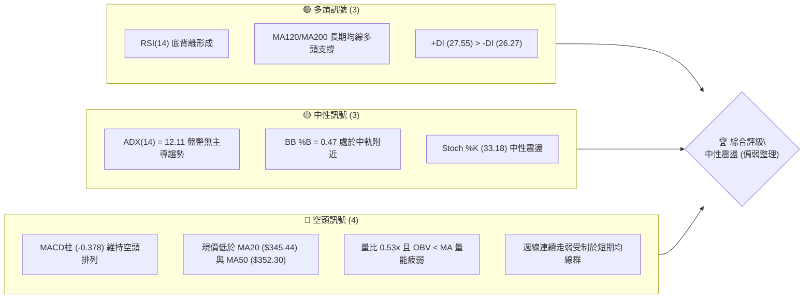
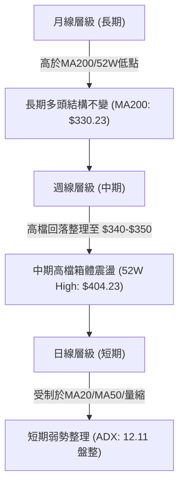
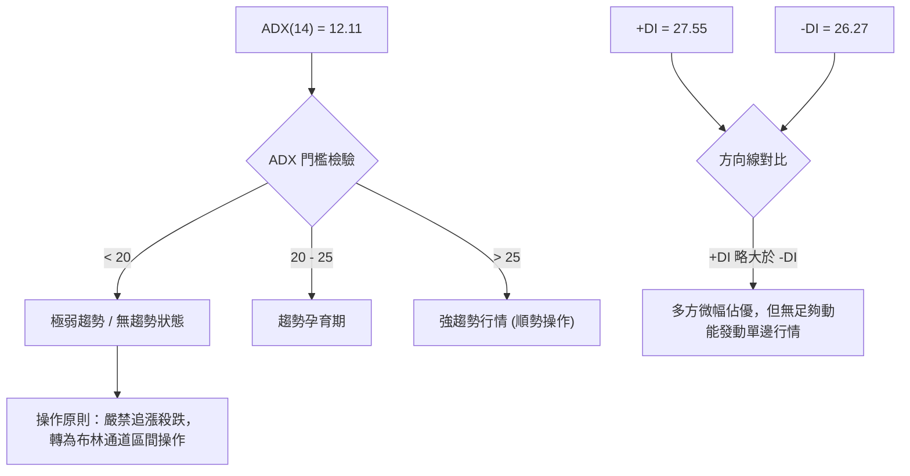
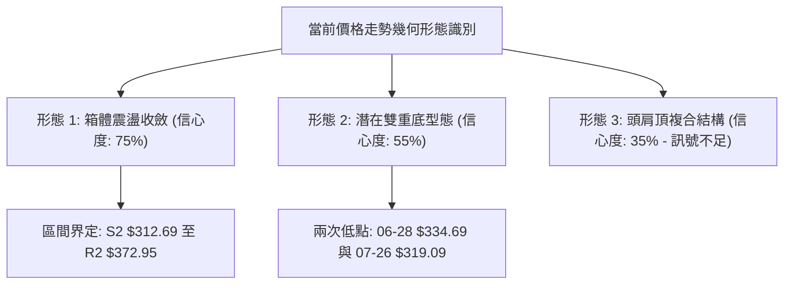
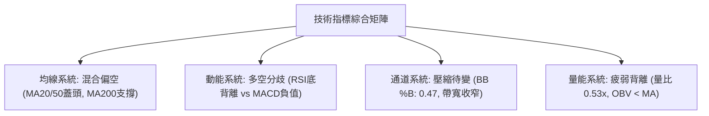
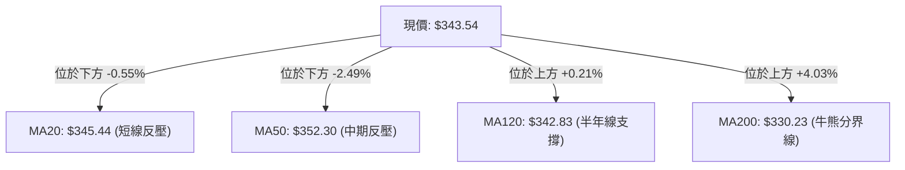
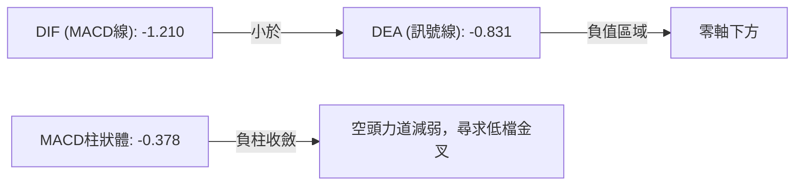
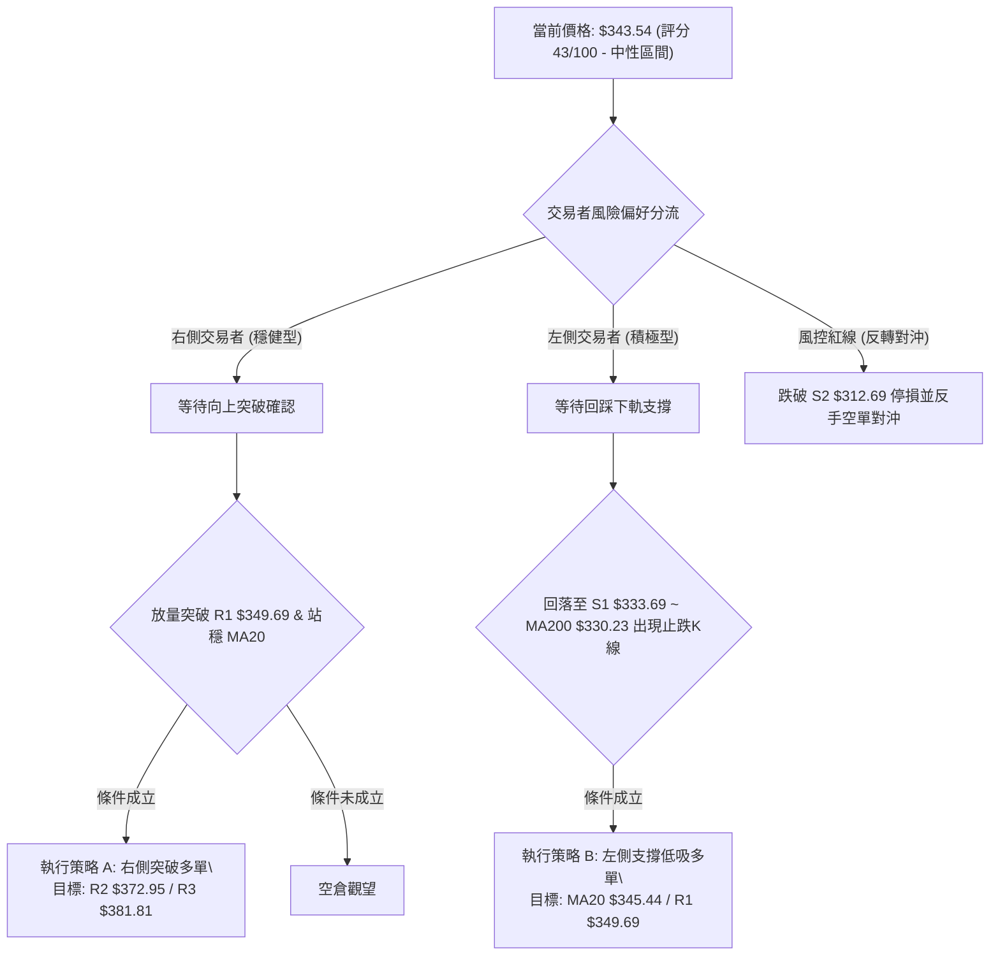
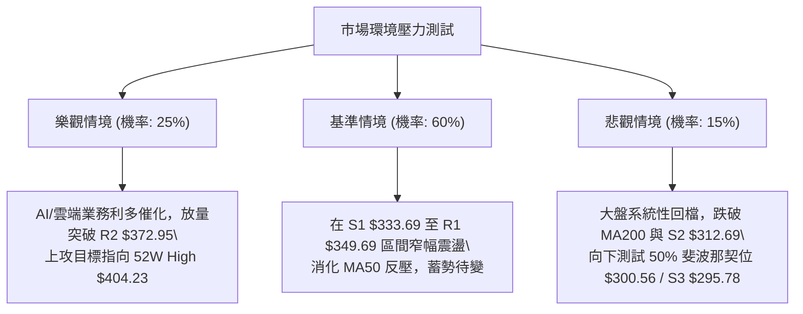

# GOOG 技術分析報告

> **報告日期**：2026-08-15 ｜ **語言**：繁體中文 ｜ **數據來源**：Yahoo Finance ｜ **當前價格**：$343.54

---

## 目錄

| 章節 | 內容 |
|------|------|
| [1. 技術面概覽](#1-技術面概覽) | 訊號儀表板、核心指標、評分卡 |
| [2. 趨勢分析](#2-趨勢分析) | 多時框趨勢、長中短期走勢、ADX解讀 |
| [3. 圖表形態分析](#3-圖表形態分析) | 形態識別、信心度評估、K線組合 |
| [4. 支撐與阻力](#4-支撐與阻力) | 關鍵價位分佈、斐波那契回調 |
| [5. 技術指標深度解讀](#5-技術指標深度解讀) | MA/RSI/MACD/布林/量價關係 |
| [6. 動能與波動率](#6-動能與波動率) | 動能四象限、ATR、Beta風險 |
| [7. 多時框架總結](#7-多時框架總結) | 時框架評分矩陣、收斂結論 |
| [8. 交易策略建議](#8-交易策略建議) | 策略路由、主策略執行、風報比 |
| [9. 風險提示與監控](#9-風險提示與監控) | 監控Checklist、三情境壓力測試 |

---

## 1. 技術面概覽

### 🎯 技術訊號儀表板



### 📊 核心指標速覽表

| 指標類別 | 指標名稱 | 當前數值 | 訊號 | 解讀 |
|----------|----------|----------|------|------|
| **價格** | 當前價格 | $343.54 | 🟡 中性 | 處於52週高低點區間之 70.7% 位置 |
| **均線** | MA20 | $345.44 | 🔴 看空 | 價格位於 MA20 下方 (-0.55%)，短線承壓 |
| **均線** | MA50 | $352.30 | 🔴 看空 | 價格位於 MA50 下方 (-2.49%)，中期反壓顯著 |
| **均線** | MA200 | $330.23 | 🟢 看多 | 價格高於 MA200 (+4.03%)，長期牛市基底未破 |
| **動能** | RSI(14) | 59.16 | 🟢 看多 | 處於中性偏多區間，且日線級別出現底背離訊號 |
| **動能** | MACD | -1.210 (Hist: -0.378) | 🔴 看空 | 快慢線處於零軸下方且負柱狀體延續 |
| **動能** | Stoch %K / %D | 33.18 / 35.29 | 🟡 中性 | 指標自低檔回升，目前無超買超賣極端現象 |
| **趨勢** | ADX(14) | 12.11 | 🟡 中性 | 趨勢強度低於 25，市場明確進入無方向盤整期 |
| **通道** | 布林 %B | 0.47 | 🟡 中性 | 位於中軌 ($345.44) 下方微幅震盪，壓縮待變 |
| **量能** | 20日量比 | 0.53x (OBV < MA) | 🔴 看空 | 成交量急劇縮減至 10.91M，追價意願不足 |
| **波動** | ATR(14) | $11.05 (3.22%) | 🟡 中性 | 波動度處於常態水準，日震幅參考值約 11 元 |

### 🏆 技術評分卡

```
╔══════════════════════════════════════════════════════════════╗
║              技術評分卡 — GOOG (2026-08-15)                  ║
╠══════════════════════════════════════════════════════════════╣
║ 趨勢強度      ████░░░░░░░░░░░░░░░░  20/100  🔴 極弱趨勢(ADX 12)║
║ 動能指標      ██████████░░░░░░░░░░  50/100  🟡 RSI背離vsMACD負值║
║ 支撐穩定度    ██████████████░░░░░░  70/100  🟢 MA200/S1支撐強勁║
║ 成交量配合    ██████░░░░░░░░░░░░░░  30/100  🔴 量能萎縮OBV疲弱  ║
║ 形態完整度    ██████████░░░░░░░░░░  50/100  🟡 箱體收斂無單邊形態║
║ 均線排列      ████████░░░░░░░░░░░░  40/100  🔴 均線糾纏短空長多  ║
╠══════════════════════════════════════════════════════════════╣
║ 綜合評分      █████████░░░░░░░░░░░  43/100  ⚖️ 區間震盪偏弱觀望║
╚══════════════════════════════════════════════════════════════╝
```

---

## 2. 趨勢分析

### 🌐 多時框趨勢分析



### 📈 長期趨勢 — 12個月走勢圖（Unicode）

```
GOOG 月線收盤走勢圖（2025-08 至 2026-08）
價格軸 ($)
$400 ┤                                      ● (2026-04 $381.71)
$380 ┤                                         ● 
$360 ┤                                            ●  ●
$340 ┤                                  ●            ● ($343.54 現價)
$320 ┤                      ●     ●  ●     ●
$300 ┤                               
$280 ┤                ●        ● (2026-03 $286.69)
$260 ┤             
$240 ┤          ●
$220 ┤       ● (2025-08 $212.92)
$200 ┤
     └─────────────────────────────────────────────────────────────
       08-25 09-25 10-25 11-25 12-25 01-26 02-26 03-26 04-26 05-26 06-26 07-26 08-26
```

**走勢特徵階段性分析**：

| 階段區間 | 起訖價格 | 漲跌幅 | 走勢特徵與技術解讀 |
|----------|----------|--------|-------------------|
| **第一階段：強勢主升浪** (2025-08 ~ 2026-01) | $212.92 → $338.09 | **+58.79%** | 月線連6紅，均線全面發散向上，動能充沛帶動估值重估。 |
| **第二階段：快速獲利回吐** (2026-01 ~ 2026-03) | $338.09 → $286.69 | **-15.20%** | 高檔爆量回落，跌破短期均線回測季線支撐，完成洗盤。 |
| **第三階段：衝頂噴出期** (2026-03 ~ 2026-04) | $286.69 → $381.71 | **+33.14%** | V型暴力反彈並創下歷史次高收盤價，觸及 52W High $404.23。 |
| **第四階段：高檔震盪收斂** (2026-04 ~ 2026-08) | $381.71 → $343.54 | **-10.00%** | 量能逐步退潮，連續4個月陰陽交錯，回吐至斐波那契 23.6% ($355.30) 下方。 |

### 📊 中期趨勢（週線分析）

```
近期週線支撐與壓力結構示意圖：
$404.23 ─────────────────────── 52W 最高點 / 頂部強阻力
$381.81 ─────────────────────── 波段高點壓力 R3 (2026-05-03 附近)
$372.95 ─────────────────────── 波段反彈壓力 R2 (2026-05 下旬套牢區)
$352.30 ─────────────────────── MA50 中期均線生命線反壓
$343.54 ═══════════════════════ 當前價格 (測試短期支撐)
$333.69 ─────────────────────── 波段低點支撐 S1 (2026-06-28 低點聚類)
$312.69 ─────────────────────── 強力頸線支撐 S2 (2026-07-26 低檔反彈點)
```

從近 20 週數據觀察，GOOG 在 2026 年 5 月上旬於 $396.81 觸頂後，週線 MACD 柱狀圖由正轉負（自 +4.807 驟降至 -4.974），顯示中期多頭動能耗盡。近期價格在 $319.09 ~ $356.65 之間反覆拉鋸，週成交量由 188M 降至 72.69M，呈現典型的大型區間消化籌碼形態。

### ⚡ 趨勢強度評估（ADX 解讀）



| 評估指標 | 數值 | 狀態等級 | 交易意涵 |
|----------|------|----------|----------|
| **ADX(14)** | **12.11** | 🔴 極弱 (區間盤整) | 市場缺乏單邊趨勢，趨勢跟隨策略（Trend-following）失效，震盪指標優先。 |
| **+DI / -DI** | **27.55 / 26.27** | 🟡 糾纏狀態 | 多空雙方力量勢均力敵（差距僅 1.28），市場在尋求下一個方向催化劑。 |

---

## 3. 圖表形態分析

### 🔍 形態識別系統



**形態信心度評估表**：

| 形態名稱 | 信心度 | 判斷依據（引用數據） | 完成度 | 目標價（附精確計算式） |
|----------|--------|----------------------|--------|------------------------|
| **矩形箱體震盪** | **75%** | 價格受制於 R2 $372.95 與支撐 S2 $312.69 之間，ADX=12.11 確認無趨勢 | **85%** | 箱頂破位目標：$372.95 + ($372.95 - $312.69) = **$433.21**<br>箱底跌破目標：$312.69 - ($372.95 - $312.69) = **$252.43** |
| **潛在雙重底** | **55%** | 兩次下探低點分別為 2026-06-28 ($334.69) 與 2026-07-26 ($319.09，聚類於 S2 $312.69) | **60%** | 頸線為 2026-07-05 高點聚類 R1 $349.69<br>突破目標：$349.69 + ($349.69 - $312.69) = **$386.69** |
| **頭肩頂形態** | **35%** | 右肩反彈乏力，但左肩低點尚未有效擊破 | **30%** | *訊號不足，信心度 <50%，僅做指標型解讀，不預設目標價* |

### 🕯️ 重要K線形態分析

| 期間/月份 | 收盤價 | K線形態特徵 | 技術解讀 | 訊號強度 |
|-----------|--------|-------------|----------|----------|
| **2026-04** | $381.71 | 長陽大突破 (Marubozu) | 突破 $340 頸線，多頭極度亢奮，成交量爆發 | 🟢 強烈看多 |
| **2026-05** | $376.20 | 高檔十字星/流星線 | 上攻 $404.23 遇阻大幅回落，留長上影線，顯現滯漲 | 🔴 空頭預警 |
| **2026-06** | $353.33 | 中陰回調跌破 MA20 | 空方回吐摜破多條均線，月線吞噬，確認進入回檔 | 🔴 看空延續 |
| **2026-07** | $356.65 | 下影錘頭線 (Hammer) | 探底 $319.09 後快速拉起，低檔買盤介入捍衛 MA200 | 🟢 止跌訊號 |
| **2026-08 (當前)** | $343.54 | 窄幅孕線 (Harami) | 波動率極度壓縮，成交量驟降，等待方向突破 | 🟡 中性蓄勢 |

### 📉 ASCII 走勢形態示意圖

```
雙底打底與箱體震盪示意圖：
價格 ($)
$372.95 ┬────────────────────────────────────────── 箱頂阻力 R2
        │                 ▲
        │                / \     ▲ (頸線測試)
$349.69 ┼───────────────/───\───/─\──────────────── 頸線阻力 R1
        │  現價 $343.54 ─► ●   \/   \
        │              /             \
$333.69 ┼─────────────/───────────────\──────────── 支撐 S1
        │            /                 \
$312.69 ┴───────────● (底 1)            ● (底 2)─── 箱底支撐 S2
        └──────────────────────────────────────────
         時間軸:   2026-06            2026-07/08
```

---

## 4. 支撐與阻力

### 🗺️ 關鍵價位分布圖（Unicode）

```
GOOG 價位結構分布圖（OHLCV 精確計算）
═══════════════════════════════════════════════════════════════
$404.23 ║██████████████████████████████║ 52W 歷史最高點 (0.0% Fib)
$381.81 ║████████████████████████      ║ 強阻力 R3 (+11.14%)
$372.95 ║████████████████████          ║ 阻力 R2 (+8.56%)
$355.30 ║▓▓▓▓▓▓▓▓▓▓▓▓▓▓▓▓▓▓            ║ 斐波那契 23.6% 回調位
$349.69 ║████████████████              ║ 關鍵阻力 R1 (+1.79%)
$345.44 ║──────────────────────────────║ MA20 短期多空分水嶺
$343.54 ╠══════════════════════════════╣ ◄ 當前價格 $343.54
$333.69 ║▓▓▓▓▓▓▓▓▓▓▓▓▓▓▓▓              ║ 近期波段支撐 S1 (-2.87%)
$330.23 ║██████████████████            ║ 長期生命線 MA200 支撐
$325.03 ║▓▓▓▓▓▓▓▓▓▓▓▓                  ║ 斐波那契 38.2% 回調位
$312.69 ║████████████████████████      ║ 強支撐 S2 (-8.98%)
$295.78 ║████████████████████████████  ║ 強固支撐 S3 (-13.90%)
═══════════════════════════════════════════════════════════════
```

### 🚧 阻力位分析表

| 阻力級別 | 精確價位 | 距現價幅幅 | 形成原因與籌碼結構 | 突破難度 | 重要性等級 |
|----------|----------|------------|--------------------|----------|------------|
| **R1** | **$349.69** | +1.79% | 近期反彈波段高點聚類，與 MA20 ($345.44) 形成短壓共振 | 🟡 中等 | ★★★☆☆ (短線突破點) |
| **R2** | **$372.95** | +8.56% | 2026年5月下旬起跌點，布林上軌 ($376.28) 區域，大量套牢套死區 | 🔴 極高 | ★★★★☆ (中期反轉關卡) |
| **R3** | **$381.81** | +11.14% | 2026年4-5月月線收盤頂部密集區，多頭最後防線 | 🔴 極高 | ★★★★★ (歷史級強壓力) |

### 🛡️ 支撐位分析表

| 支撐級別 | 精確價位 | 距現價幅幅 | 形成原因與防守強度 | 守住機率 | 重要性等級 |
|----------|----------|------------|--------------------|----------|------------|
| **S1** | **$333.69** | -2.87% | 近期波段低點聚類，貼近 MA200 ($330.23) 形成雙重支撐防線 | 🟢 70% | ★★★★☆ (短線防禦中樞) |
| **S2** | **$312.69** | -8.98% | 2026-07-26 止跌低點聚類，布林通道下軌 ($314.61) 共振帶 | 🟢 85% | ★★★★★ (中期箱底底線) |
| **S3** | **$295.78** | -13.90% | 2026年4月初起漲發動點，斐波那契 50.0% ($300.56) 心理關卡 | 🟢 95% | ★★★★★ (長期牛熊分界) |

### 📐 斐波那契回調位分析

依據 52 週區間極值（最低點 **$196.90** 至 最高點 **$404.23**，波幅高達 $207.33）計算之標準黃金分割位：

| 斐波那契層級 | 精確價位 | 技術位置判定與市場意義 |
|--------------|----------|------------------------|
| **0.0% (52W High)** | **$404.23** | 歷史頂部天花板，中期多頭終極目標 |
| **23.6%** | **$355.30** | **關鍵反壓**：現價 ($343.54) 目前受制於此水平下方，未能有效站穩 |
| **38.2%** | **$325.03** | **強支撐區**：位於 MA200 ($330.23) 下方，為強勢回調的極限健康水位 |
| **50.0%** | **$300.56** | 整數心理關卡，多空中期分水嶺 |
| **61.8%** | **$276.10** | 黃金分割強防禦位，破則宣告多頭走勢徹底終結 |
| **78.6%** | **$241.27** | 深幅回撤防線 |
| **100.0% (52W Low)**| **$196.90** | 52週週期起漲原點 |

> **現價位置解讀**：現價 **$343.54** 處於 **23.6% ($355.30)** 與 **38.2% ($325.03)** 之間。在技術面上，股價在自高點回落後，若能守穩 38.2% ($325.03) 且重新站上 23.6% ($355.30)，則整體長多架構依然完整。

---

## 5. 技術指標深度解讀

### 🎛️ 指標訊號總覽



### 📈 移動平均線排列分析



**均線狀態矩陣**：
- **MA5 ($345.74) / MA10 ($354.67) / MA20 ($345.44)**：短期均線下彎，短線走勢處於壓制狀態。
- **MA60 ($356.32)**：向下扣抵高價區，形成中期上行天花板。
- **MA120 ($342.83) / MA200 ($330.23) / MA240 ($316.18)**：中長期均線呈現良好多頭斜率向上排列，說明回調屬於大級別上升趨勢中的中繼整理。

### 📉 RSI(14) 分析與背離判斷

- **數值進度條**：
```
RSI(14) = 59.16 : ▓▓▓▓▓▓▓▓▓▓▓▓░░░░░░░░  59.16% (中性偏強區間)
```
- **超買超賣判定**：數值 59.16 遠離 30 超賣與 70 超買區，處於健康多頭重組區。
- **背離分析（關鍵技術亮點）**：
  - **形態**：⚠️ **日線底背離 (Bullish Divergence)**
  - **判定依據**：回顧近幾週，股價於 2026-07-26 下探 $319.09 時，週 RSI 跌至 26.4；隨後股價在 2026-08-16 收盤於 $343.54，雖然價格仍處於低位震盪，但 RSI 指標已快速修復回升至 59.16，形成明顯的「價格低檔走平/破底、指標率先抬高」之底背離特徵，預示下檔殺跌動能枯竭，醞釀技術性反彈。

### 📊 MACD(12/26/9) 訊號解讀



- **MACD線 (-1.210)** 與 **訊號線 (-0.831)** 均處於零軸下方，維持空頭市場格局。
- 然而，**MACD柱狀體為 -0.378**，相較於 2026-06 至 2026-07 期間高達 -3.620 至 -4.974 的深幅負柱，已大幅向零軸收斂，顯示空方動能進入尾聲，隨時可能在零軸下方出現黃金交叉。

### 📦 布林通道分析

```
布林通道現況 ASCII 示意圖：
$376.28 ┬────────────────────────────────────────── BB 上軌 (波動天花板)
        │
$345.44 ┼───────────────────────●────────────────── BB 中軌 (MA20)
$343.54 │                 ▲ (現價 $343.54, %B = 0.47)
        │
$314.61 ┴────────────────────────────────────────── BB 下軌 (強烈支撐)
```

- **通道帶寬與形態**：上下軌間距 ($314.61 至 $376.28) 呈現向內收斂擠壓（Squeeze），說明波動率正在被壓縮至極致。
- **%B 指標 (0.47)**：價格緊貼中軌 ($345.44) 下方，處於典型的中性震盪區間，等待放量突破中軌以開啟向上軌測壓的行情。

### 💹 成交量分析（量價配合度）

- **量能萎縮**：最新成交量僅 **10,911,700 股**，相對於 20 日均量 **20,653,290 股**，量比僅 **0.53x**（萎縮近半）。
- **OBV 趨勢**：**OBV < MA**，且能量潮曲線持續走低，反映出機構買盤在當前價位採取觀望態度，無明顯主動進攻性買盤介入。
- **量價背離現象**：價格反彈但量能大幅萎縮，呈現「縮量反彈」格局，暗示若無 20M 以上的成交量配合，難以一舉突破阻力位 R1 ($349.69)。

---

## 6. 動能與波動率

### ⚡ 動能評估四象限

| 象限 | 動能維度 | 波動維度 | 當前狀態判定 | 戰略應對方針 |
|------|----------|----------|--------------|--------------|
| **Q1 (最佳擴張)** | 強動能 (RSI>60, MACD>0) | 低波動 (ATR 壓縮) | — | 順勢重倉做多 |
| **Q2 (盤整蓄勢)** | **弱動能 (MACD<0)** | **低波動 (ADX: 12.11, ATR: $11.05)** | ✅ **GOOG 當前定位** | **區間高拋低吸，嚴控倉位** |
| **Q3 (極端行情)** | 強動能 | 高波動 | — | 突破追價，嚴設移動止損 |
| **Q4 (失控殺跌)** | 弱動能 | 高波動 | — | 全面空倉觀望 |

### 📊 ATR 波動率分析

- **ATR(14) 數值**：**$11.05**（佔當前價格之 **3.22%**）。
- **日內安全波動帶**：每日正常理論波動區間為 $343.54 ± $11.05（即 $332.49 ~ $354.59）。
- **止損距離建議**：
  - 短線交易：採用 **1.5 × ATR = $16.58**（止損設於進場點下方 $16.58）。
  - 波段交易：採用 **2.0 × ATR = $22.10**（止損設於進場點下方 $22.10）。

### 📐 Beta 與市場相關性

- **Beta 係數**：**1.237**（高於美股大盤基準 1.0）。
- **敏感度解讀**：GOOG 具備高彈性科技成長股屬性，當 S&P 500 指數波動 1.0% 時，理論上 GOOG 波動約 1.24%。在當前 ADX 低迷的盤整期，高 Beta 意味著一旦大盤出現方向性破位，GOOG 將迅速放大波動幅度，需密切關注大盤聯動風險。

---

## 7. 多時框架總結

### 📋 時框架評分表

| 時框架 | 趨勢方向 | 動能狀態 | 均線排列 | 形態結構 | 綜合評分 | 操作建議 |
|--------|----------|----------|----------|----------|----------|----------|
| **月線 (長期)** | 🟢 多頭 | 🟡 中性回調 | 🟢 多頭排列 (MA200向上) | 長期上升趨勢中繼 | **75/100** | 長期投資者逢低分批佈局 |
| **週線 (中期)** | 🟡 震盪 | 🔴 偏弱整理 | 🟡 均線糾纏 | 寬幅矩形箱體 | **50/100** | 區間操作，回踩支撐低吸 |
| **日線 (短期)** | 🔴 偏弱 | 🟢 RSI底背離 | 🔴 短均線蓋頭 | 窄幅壓縮整理 | **43/100** | 觀望等待中軌放量突破 |

### 🔲 綜合訊號矩陣

```
╔══════════════════════════════════════════════════════════════════╗
║                     GOOG 綜合訊號矩陣                            ║
╠═════════════╦══════════════╦══════════════╦══════════════════════╣
║ 維度        ║ 短期 (日線)  ║ 中期 (週線)  ║ 長期 (月線)          ║
╠═════════════╬══════════════╬══════════════╬══════════════════════╣
║ 趨勢訊號    ║ 🔴 空頭承壓  ║ 🟡 區間震盪  ║ 🟢 多頭完好          ║
║ 動能指標    ║ 🟢 底背離    ║ 🔴 負柱收斂  ║ 🟡 趨緩              ║
║ 量價關係    ║ 🔴 嚴重量縮  ║ 🔴 OBV偏弱   ║ 🟢 歷史量能充沛      ║
║ 支撐壓力    ║ 🟡 逼近 S1   ║ 🟢 守住 S2   ║ 🟢 遠高於 52W Low    ║
╚═════════════╩══════════════╩══════════════╩══════════════════════╝
```

### ⚖️ 多時框收斂結論

> **依據多時框收斂規則（嚴格要求 14）**：
> 1. **趨勢強度判定**：當前日線 **ADX(14) = 12.11 (< 25)**，明確定義為**典型盤整行情**。
> 2. **主導時框與交易規則**：在盤整行情中，單邊趨勢策略失效，**以日線布林通道上下軌 ($314.61 ~ $376.28) 及關鍵波段高低點 S1/S2/R1/R2 為主要交易區間**。
> 3. **唯一方向性結論**：**【中性觀望，區間低吸高拋】**。
>    雖然日線受到 MA20/MA50 反壓，但長週期 MA200 ($330.23) 與週線支撐 S1 ($333.69) 提供堅實底部，配合 RSI 底背離，向下殺跌空間極其有限。因此，策略重心不宜盲目放空，而應在區間下軌附近尋找低吸多單機會，或等待帶量突破 R1 ($349.69) 後順勢進場。

---

## 8. 交易策略建議

### 🗺️ 策略決策流程圖



### 🧭 策略路由

**當前主策略方向 = 【區間操作，以逢低做多為主、等待突破確認】（依技術評分 43/100 判定）**

由於綜合評分處於 40–60 之中性盤整區間，且長期均線多頭未破、RSI 底背離已現，策略**禁止追高**，主推「**右側突破進場**」與「**左側回踩低吸**」兩大多頭方案。

### 🎯 價格情境階梯（Price Scenarios）

所有價位均精確引用本報告第 4 章及數據計算值：

| 觸發條件 | 第一目標 | 第二目標 | 情境含義與技術演變 |
|----------|----------|----------|--------------------|
| **有效放量突破 R1 ($349.69)** | **R2 ($372.95)** | **R3 ($381.81)** | 短線轉強，修復均線蓋頭壓力，挑戰箱頂 |
| **維持在 $333.69 ~ $349.69 內** | **MA20 ($345.44)** | **$349.69** | 窄幅無方向震盪，波動率持續壓縮 |
| **跌破 S1 ($333.69) / MA200** | **S2 ($312.69)** | **S3 ($295.78)** | 中期弱勢探底，回測布林下軌及強支撐 |

### 📊 情境機率分佈

| 情境類別 | 機率預估 | 主要技術指標支撐依據 |
|----------|----------|----------------------|
| **情境一：區間震盪蓄勢** | **50%** | ADX=12.11 顯示無單邊動力，成交量僅 0.53x，布林帶寬持續收窄。 |
| **情境二：向上反彈突破** | **35%** | 日線 RSI 出現底背離，MACD 負柱狀體收斂至 -0.378，長期 MA200 向上支撐。 |
| **情境三：下破探底回撤** | **15%** | MA20 與 MA50 形成雙重反壓，OBV < MA 顯示主力資金尚未回流。 |

### 🟢 主策略詳情

| 策略要素 | 策略 A：右側突破追強策略（穩健） | 策略 B：左側支撐低吸策略（積極） |
|----------|----------------------------------|----------------------------------|
| **適用對象** | 順勢交易者、突破交易者 | 價值波段交易者、左側逢低佈局者 |
| **進場條件** | 日線收盤放量突破 R1 且量能 > 20M | 股價回踩 S1 獲得支撐，出現下影線反彈 |
| **進場價格** | **$350.50** (突破 R1 $349.69 確認點) | **$334.00** (貼近 S1 $333.69 支撐位) |
| **目標價 T1** | **$372.95** (阻力位 R2) | **$349.69** (阻力位 R1) |
| **目標價 T2** | **$381.81** (阻力位 R3) | **$372.95** (阻力位 R2) |
| **止損價格** | **$339.00** (跌破 MA20 之下方保護位) | **$324.50** (跌破 38.2% Fib $325.03) |
| **風險報酬比** | **1 : 1.95** (風: $11.5, 報: $22.45) | **1 : 1.65** (風: $9.5, 報: $15.69) |
| **預估勝率** | **65%** | **55%** |
| **建議倉位** | **15% - 20%** (突破後加碼) | **10% - 15%** (分批建倉) |

### 🔴 反向風險觸發點（對沖提示）

- **全面停損/對沖點位**：若股價收盤**有效跌破 S2 ($312.69)** 或布林下軌 ($314.61)。
- **觸發後操作**：多頭策略全面停損離場；波段投資者應建立 10%~15% 的空頭部位或買入 Put 選擇權，鎖定下行至 S3 ($295.78) 的回撤風險。

### ⭐ 整體訊號強度評星

```
做多訊號強度：★★★☆☆  (3.0/5星 — 長多支撐與RSI底背離，唯欠缺量能)
做空訊號強度：★★☆☆☆  (2.0/5星 — 均線蓋頭，但下方 MA200 支撐強勁)
整體可信度：  ★★★★☆  (4.0/5星 — 數據結構清晰，支撐阻力聚類明確)
```

---

## 9. 風險提示與監控

### ✅ 關鍵監控指標 Checklist

```
╔══════════════════════════════════════════════════════════════╗
║              每日交易關鍵監控 Checklist                      ║
╠══════════════════════════════════════════════════════════════╣
║ [ ] 價位突破監控：收盤價是否站上 R1 $349.69 或跌破 S1 $333.69║
║ [ ] 成交量能監控：單日量能是否放大至 20M 股以上（量比 > 1.0）║
║ [ ] 動能翻轉監控：MACD 柱狀體是否由負翻正（升破 0 軸）        ║
║ [ ] 趨勢形成監控：ADX(14) 是否由 12.11 升破 20.0 門檻       ║
║ [ ] 均線動態監控：MA20 ($345.44) 是否走平並向上勾頭          ║
║ [ ] 大盤聯動監控：納斯達克指數與大盤 Beta (1.24) 波動風險    ║
╚══════════════════════════════════════════════════════════════╝
```

### ⚠️ 風險場景分析



### 🛡️ 風險管理重要提醒

1. **嚴禁盤整期追高**：當前 ADX 為 12.11，市場缺乏連續單邊推動力，在阻力位 R1 ($349.69) 與 R2 ($372.95) 附近追高極易遭受回馬槍套牢。
2. **波動率定價保護**：根據 ATR(14) = $11.05，單日波動幅度約為 3.22%，日內震盪跌破支撐需以「日線收盤價」為確認依據，避免被盤中假跌破洗盤掃出場。
3. **倉位配置原則**：總倉位在盤整期應控制在 **30%~40%** 以內，待日線放量站穩 MA50 ($352.30) 且 ADX 升破 20 後，方可將倉位提高至正常水平。

---

## 📋 報告總結

```
╔══════════════════════════════════════════════════════════════╗
║                 GOOG 技術分析報告總結                        ║
╠══════════════════════════════════════════════════════════════╣
║ 報告日期：2026-08-15                                         ║
║ 當前價格：$343.54                                            ║
║ 分析評級：⚖️ 中性觀望 (區間震盪蓄勢，偏多看待)               ║
╠══════════════════════════════════════════════════════════════╣
║ 關鍵結論：                                                   ║
║ ├─ 長期趨勢：🟢 多頭完好（站穩 MA200 $330.23 之上）          ║
║ ├─ 中期趨勢：🟡 矩形箱體震盪（$312.69 ~ $372.95）            ║
║ ├─ 短期趨勢：🔴 弱勢縮量整理（受制於 MA20 $345.44）          ║
║ ├─ 關鍵支撐：S1 $333.69 / S2 $312.69                         ║
║ ├─ 關鍵阻力：R1 $349.69 / R2 $372.95                         ║
║ └─ 分析師目標：均價 $421.79 (最高 $475.00 / 最低 $340.00)    ║
╠══════════════════════════════════════════════════════════════╣
║ 最優策略組合：                                               ║
║ 1. 🥇 最佳機會：右側突破策略 — 待放量突破 R1 $349.69 後進場， ║
║                 目標 R2 $372.95，風報比 1:1.95               ║
║ 2. 🥈 次選機會：左側低吸策略 — 回踩 S1 $333.69 附近分批建倉，║
║                 目標 R1 $349.69，風報比 1:1.65               ║
║ 3. 🥉 防守風控：嚴守 S2 $312.69 停損底線，跌破即全面避險     ║
╚══════════════════════════════════════════════════════════════╝
```

---

> ⚠️ **免責聲明**：本報告為技術分析研究，所有數據及支撐阻力位均基於歷史 OHLCV 資訊計算。本報告**僅供研究與學術參考**，**不構成任何要約、招攬或投資建議**。金融市場投資具備風險，投資人應獨立評估自身風險承受能力並自負盈虧。

---

*報告生成時間：2026-08-15 ｜ 數據來源：Yahoo Finance ｜ 分析框架：多時框技術分析體系*