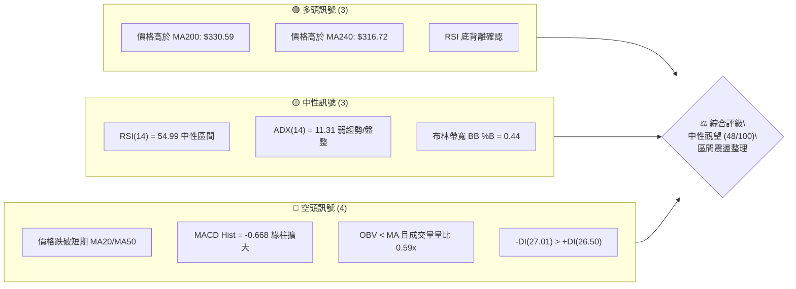
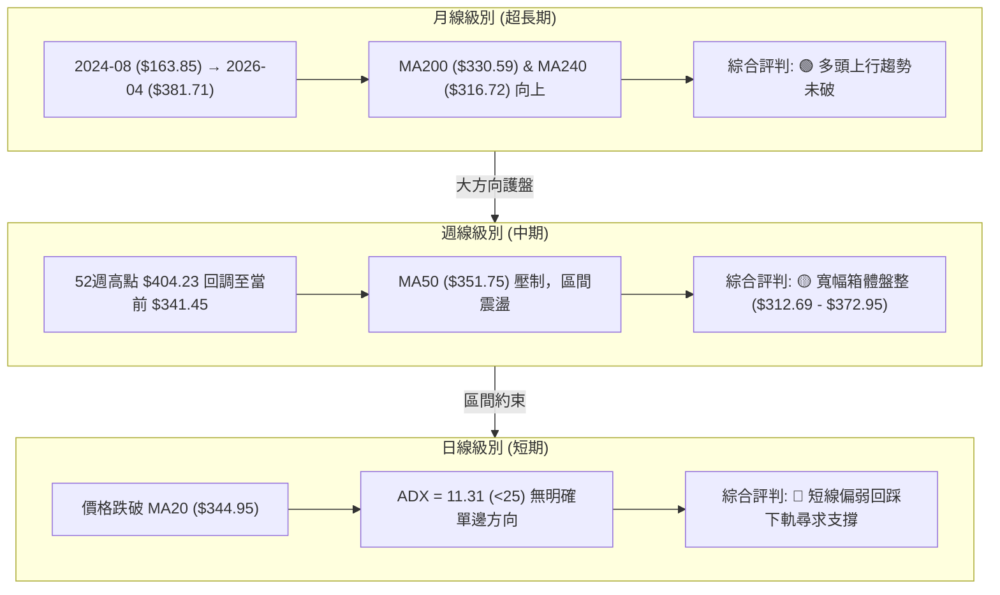
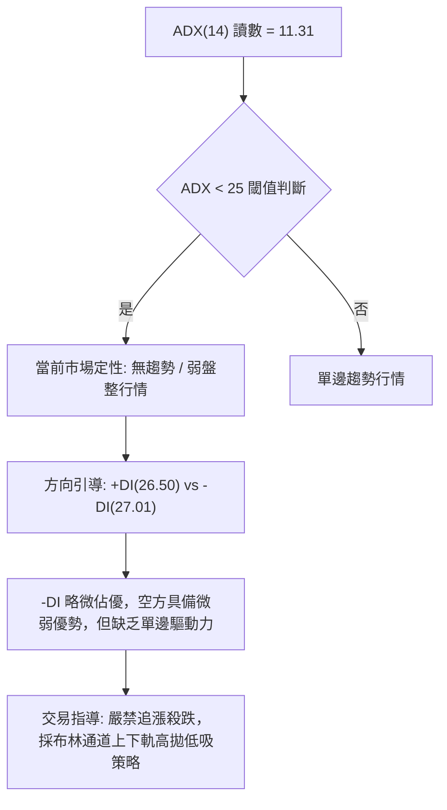
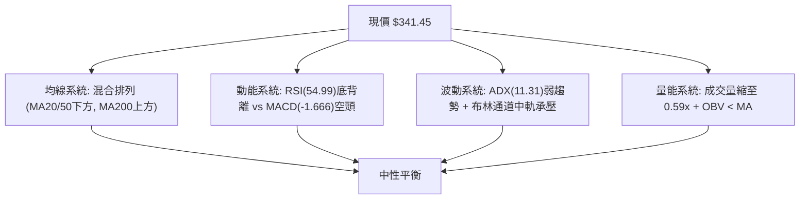
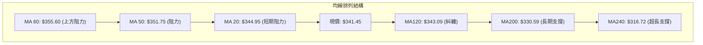
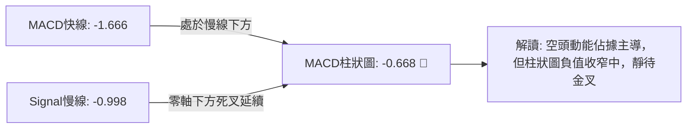
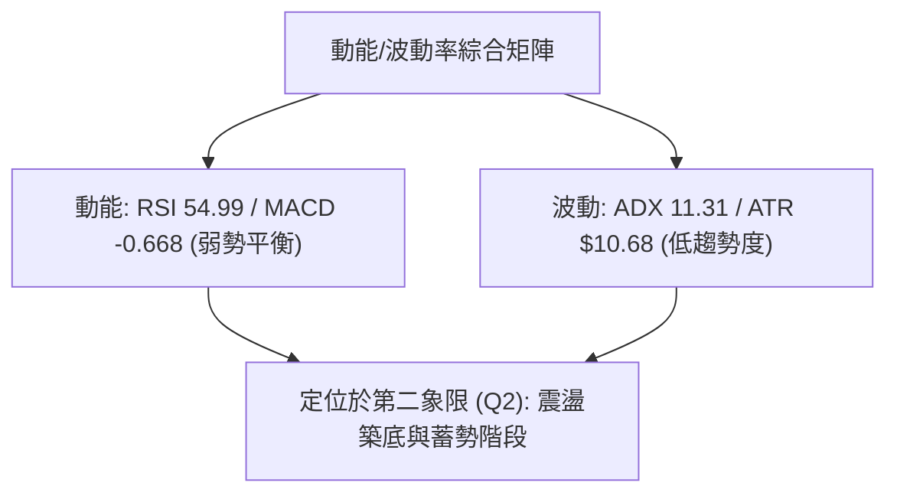
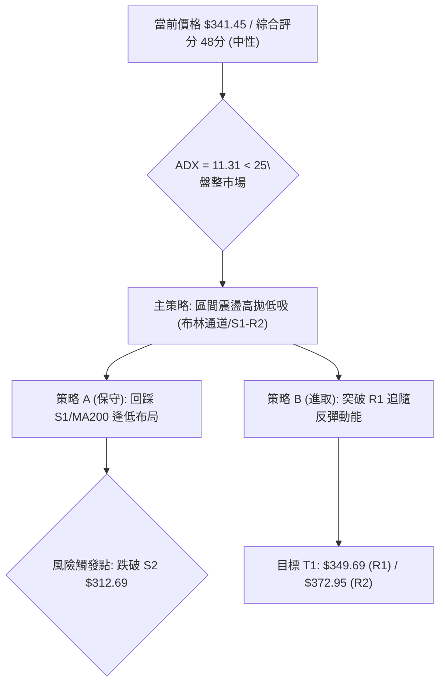
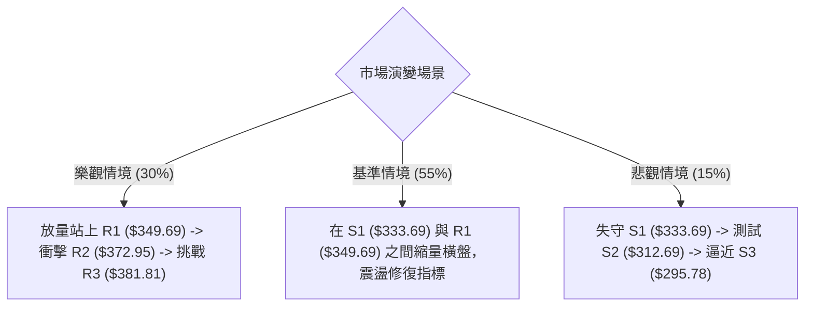

# GOOG 技術分析報告

> **報告日期**：2026-08-17 ｜ **語言**：繁體中文 ｜ **數據來源**：Yahoo Finance ｜ **當前價格**：$341.45

---

## 目錄

| 章節 | 內容 |
|------|------|
| [1. 技術面概覽](#1-技術面概覽) | 訊號儀表板、核心指標、評分卡 |
| [2. 趨勢分析](#2-趨勢分析) | 多時框趨勢、長中短期走勢 |
| [3. 圖表形態分析](#3-圖表形態分析) | 形態識別、K線組合、目標價 |
| [4. 支撐與阻力](#4-支撐與阻力) | 關鍵價位、斐波那契回調 |
| [5. 技術指標深度解讀](#5-技術指標深度解讀) | MA/RSI/MACD/布林/成交量 |
| [6. 動能與波動率](#6-動能與波動率) | 動能評估、ATR、Beta |
| [7. 多時框架總結](#7-多時框架總結) | 時框架評分矩陣 |
| [8. 交易策略建議](#8-交易策略建議) | 多空策略、風險報酬比 |
| [9. 風險提示與監控](#9-風險提示與監控) | 監控指標、風險場景 |

---

## 1. 技術面概覽

### 🎯 技術訊號儀表板



### 📊 核心指標速覽表

| 指標類別 | 指標名稱 | 當前數值 | 訊號 | 解讀 |
|----------|----------|----------|------|------|
| **價格** | 當前價格 | $341.45 | 🟡 | 位於52週高低區間之 69.7%，處於回調整理中樞 |
| **均線** | MA20 | $344.95 | 🔴 | 價格位於短期均線下方（-1.01%），短線承壓 |
| **均線** | MA50 | $351.75 | 🔴 | 價格位於中期均線下方（-2.93%），中期趨勢轉弱 |
| **均線** | MA200 | $330.59 | 🟢 | 價格守在長期多空分水嶺上方（+3.28%），長線偏多 |
| **均線** | MA240 | $316.72 | 🟢 | 價格顯著高於超長期牛熊線（+7.81%） |
| **動能** | RSI(14) | 54.99 | 🟡 | 處於 30–70 中性平衡區，但出現日線/週線底背離徵兆 |
| **動能** | MACD | -1.666 | 🔴 | 快慢線均在零軸下方，MACD Hist (-0.668) 呈現空方主導 |
| **動能** | Stoch %K/%D | 22.37 / 29.86 | 🟡 | 接近超賣臨界區，具備潛在反彈動能 |
| **趨勢** | ADX(14) | 11.31 | 🟡 | ADX < 25 表明處於無方向盤整期，-DI略高於+DI |
| **波動** | ATR(14) | $10.68 | 🟡 | 每日平均波動幅度為 3.13%，屬於中等波動區間 |
| **通道** | 布林通道 | $314.20–$375.70 | 🟡 | %B 為 0.44，價格處於中軌（$344.95）與下軌間震盪 |
| **量能** | 成交量 / 20MA | 12.20M / 20.60M | 🔴 | 量比僅 0.59x，OBV < MA，反彈動能缺乏成交量配合 |

### 🏆 技術評分卡

```
╔══════════════════════════════════════════════════════════════════╗
║                   技術評分卡 — GOOG (2026-08-17)                  ║
╠══════════════════════════════════════════════════════════════════╣
║ 趨勢強度 (Trend)     ████░░░░░░░░░░░░░░░░  20/100  🔴 弱趨勢盤整 ║
║ 動能指標 (Momentum)  ██████████░░░░░░░░░░  50/100  🟡 中性偏背離 ║
║ 支撐穩定度 (Support) ██████████████░░░░░░  70/100  🟢 長期支撐硬 ║
║ 成交量配合 (Volume)  ██████░░░░░░░░░░░░░░  30/100  🔴 量能萎縮   ║
║ 形態完整度 (Pattern) ████████████░░░░░░░░  60/100  🟡 矩形整理中 ║
║ 均線排列 (MA System) ████████████░░░░░░░░  60/100  🟡 混合排列   ║
╠══════════════════════════════════════════════════════════════════╣
║ 綜合評分 (Overall)   ██████████░░░░░░░░░░  48/100  ⚖️ 中性觀望   ║
╚══════════════════════════════════════════════════════════════════╝
```

---

## 2. 趨勢分析

### 🌐 多時框趨勢分析



### 📈 長期趨勢 — 12個月走勢圖（Unicode）

```
GOOG 月線歷史收盤走勢圖（2025-08 至 2026-08）
價格 ($)
$400 ┤                                      
$380 ┤                                ●(04/26 $381.71)
$360 ┤                                    ●(05/26 $376.20)
$340 ┤                                        ●(07/26 $356.65)
$320 ┤                     ●(11/25 $319.49)       ●(08/26 $341.45) ◄ 現價
$300 ┤             ●(10/25 $281.27)
$280 ┤         ●(09/25 $243.07)
$260 ┤     ●(08/25 $212.92)
$240 ┤                                      
     └────────────────────────────────────────────────────────────────
       08/25 09/25 10/25 11/25 12/25 01/26 02/26 03/26 04/26 05/26 06/26 07/26 08/26
```

**走勢特徵分析表格**：

| 階段區間 | 起止價格 | 漲跌幅 | 趨勢特徵 | 關鍵量價特徵 |
|----------|----------|--------|----------|--------------|
| **主升浪擴張期** | $212.92 → $338.09 | +58.79% | 強勢多頭推進 | 連續突破整數關卡，MA5/10/20多頭排列 |
| **首輪深度回踩** | $338.09 → $286.69 | -15.20% | 快速獲利回吐 | 跌至斐波那契 61.8% ($276.10) 上方止跌 |
| **主升浪見頂期** | $286.69 → $381.71 | +33.14% | 衝頂突破行情 | 創出52週新高 $404.23（週K高點） |
| **高位箱體盤整** | $381.71 → $341.45 | -10.55% | 區間收斂震盪 | 量能持續退潮，均線呈現糾纏收斂狀態 |

### 📊 中期趨勢（週線分析）

```
GOOG 週線近期價格波動與技術支撐阻力結構
 405 ┤                                ╭── 52W High ($404.23)
 385 ┤       ╭─╮        ╭─╮           ├── 阻力 R3 ($381.81)
 365 ┤    ╭──╯ ╰─╮    ╭─╯ ╰─╮ ╭─╮     ├── 阻力 R2 ($372.95)
 345 ┤────╯──────╰────╯─────╰─╯─●現價 ├── 短期阻力 R1 ($349.69)
 325 ┤               ╰───────╯        ├── 關鍵支撐 S1 ($333.69)
 305 ┤                                ├── 強支撐 S2 ($312.69)
     └──────────────────────────────────
      04月   05月   06月   07月   08月
```

### ⚡ 趨勢強度評估（ADX 解讀）



**ADX 趨勢強度對照表**：

| ADX 數值區間 | 趨勢強度定義 | 當前 GOOG 狀態 (11.31) | 策略應用指引 |
|--------------|--------------|------------------------|--------------|
| **0 – 20** | **極弱趨勢 / 盤整震盪** | **✔ 命中 (11.31)** | **網格交易、通道邊界操作、觀望突破** |
| 20 – 25 | 趨勢醞釀期 | ✘ | 留意帶量突破訊號 |
| 25 – 50 | 強趨勢形成 | ✘ | 順勢交易，均線跟蹤 |
| 50 – 75 | 極強趨勢行情 | ✘ | 趨勢持有，收緊移動止損 |

---

## 3. 圖表形態分析

### 🔍 形態識別系統

```mermaid
graph TD
    subgraph PATTERN_ID ["圖表幾何結構識別"]
        P1["高位箱體整理區間: $312.69 - $381.81"]
        P2["短期雙重底 (Double Bottom) 雛形: S1 $333.69 區域"]
        P3["均線糾纏收斂 (MA20/MA50/MA60)"]
    end
    PATTERN_ID --> P4{"形態有效性與可信度檢驗"}
    P4 -->|"信心度 65%"| RES1["短期箱體下沿支撐反彈形態"]
    P4 -->|"信心度 40%"| RES2["頭肩頂反轉形態 (尚未跌破頸線 S2，未確立)"]
```



**圖表形態信心度評估表**：

| 形態名稱 | 信心度 | 判斷依據（引用技術數據） | 完成度 | 目標價（附嚴格計算式） |
|----------|--------|--------------------------|--------|------------------------|
| **矩形箱體震盪** | **85%** | 價格在 S2 ($312.69) 與 R3 ($381.81) 區間來回震盪超過3個月 | 80% | 震盪上軌目標 = **$372.95** (R2) / **$381.81** (R3) |
| **局部雙底結構** | **60%** | 06-28收盤 $334.69 與當前回調在 S1 ($333.69) 處獲撐 | 65% | 頸線 $356.65 + ($356.65 - $333.69) = **$379.61** |
| **大型頭肩頂** | **35%** | 左肩 $382.99、頭部 $404.23、右肩 $356.65，但頸線 $312.69 未跌破 | 30% | 訊號不足，未跌破頸線前不予成立 |

### 🕯️ 重要K線形態分析

| 日期 / 週別 | 收盤價 | K線與量能形態 | 技術解讀 | 訊號 |
|-------------|--------|---------------|----------|------|
| **2026-05-10** | $396.81 | 長上影衝頂K線 | 逼近 52W 高點 $404.23 受阻回落，多頭動能衰竭 | 🔴 |
| **2026-06-28** | $334.69 | 放量長陰下影線 (188.10M) | 空方放量恐慌拋售，在 S1 ($333.69) 獲得承接買盤 | 🟢 |
| **2026-07-26** | $319.09 | 探底長下影回升 (122.27M) | 測試 S2 ($312.69) 及布林下軌成功獲得強支撐 | 🟢 |
| **2026-08-02** | $356.65 | 中陽線反包 (110.47M) | RSI 回升至 52.4，確認 $319.09 低點之支撐強度 | 🟢 |
| **2026-08-23** | $341.45 | 縮量十字星 (12.20M) | 成交量極度萎縮（量比 0.59x），多空陷入觀望僵局 | 🟡 |

### 📉 ASCII 走勢形態示意圖

```
GOOG 局部形態結構解析（日線/週線箱體與支撐阻力）
$381.81 ┤───╭─────────────────────────╮─────── [R3 強阻力 / 箱體上軌]
         │   │                         │
$372.95 ┤───╯ ╰─╮                 ╭─╮ │─────── [R2 次級阻力]
                 ╰─╮             ╭─╯ ╰─╯
$349.69 ┤──────────╰─╮         ╭─╯───────────── [R1 短期均線壓制位]
                     ╰─●現價 ($341.45)
$333.69 ┤───────────────╭──────╯─────────────── [S1 短期波段底 / 局部雙底頸線]
                        │
$312.69 ┤───────────────╯─────────────────────── [S2 強支撐 / 箱體底軌]
```

### 🎯 形態目標價計算

1. **箱體震盪反彈目標**：
   - 箱體底軌 = $312.69 (S2)
   - 箱體頂軌 = $381.81 (R3)
   - 第一目標價（箱體中軸）= **$349.69** (R1)
   - 第二目標價（箱體上沿）= **$372.95** (R2)

2. **局部雙底形態推算目標**：
   - 雙底低點 = $333.69 (S1)
   - 中間頸線高點 = $356.65 (2026-08-02 波段高點)
   - 形態高度 = $356.65 - $333.69 = $22.96
   - 突破向上測幅目標 = $356.65 + $22.96 = **$379.61**（高度重合 R3: $381.81 阻力區）

---

## 4. 支撐與阻力

### 🗺️ 關鍵價位分布圖（Unicode）

```
GOOG 價位結構分布圖
═══════════════════════════════════════════════════════════════════════════
$404.23 ║██████████████████████████████║ 52週歷史高點 (52W High / Fib 0.0%)
$381.81 ║████████████████████████      ║ 強阻力 R3 (近一年波段高點聚類)
$372.95 ║██████████████████            ║ 阻力 R2 (反彈高點聚類)
$355.30 ║▓▓▓▓▓▓▓▓▓▓▓▓▓▓▓▓▓▓            ║ 斐波那契 23.6% 回調位
$349.69 ║██████████████                ║ 關鍵阻力 R1 (MA20/MA50 均線聚集區)
$341.45 ╠══════════════════════════════╣ ◄ 當前收盤價 ($341.45)
$333.69 ║▓▓▓▓▓▓▓▓▓▓▓▓▓▓                ║ 近期支撐 S1 (波段低點聚類)
$330.59 ║████████████████              ║ 200日長期均線 (MA200 牛熊線)
$325.03 ║▓▓▓▓▓▓▓▓▓▓▓▓▓▓▓▓▓▓            ║ 斐波那契 38.2% 回調位
$312.69 ║████████████████████████      ║ 強支撐 S2 (箱體下軌 / 波段低點)
$295.78 ║██████████████████████████████║ 終極防線 S3 (深度回調支撐)
═══════════════════════════════════════════════════════════════════════════
```

### 🚧 阻力位分析表

| 阻力級別 | 價位 | 形成原因（依 OHLCV 聚類計算） | 突破難度 | 重要性評級 |
|----------|------|-------------------------------|----------|------------|
| **R1** | **$349.69** | 近期回調反彈阻力位，臨近 MA20 ($344.95) 與 MA50 ($351.75) | 中等 | 🟡 短線多空分水嶺 |
| **R2** | **$372.95** | 2026年5月–7月多次反彈高點密集套牢區，重合布林上軌 ($375.70) | 偏高 | 🔴 中期波段強壓區 |
| **R3** | **$381.81** | 2026年4月主升浪收盤高點聚集處，衝擊 52W 高點前的最後防線 | 極高 | 🔴 長期多頭核心堡壘 |

### 🛡️ 支撐位分析表

| 支撐級別 | 價位 | 形成原因（依 OHLCV 聚類計算） | 守住機率 | 重要性評級 |
|----------|------|-------------------------------|----------|------------|
| **S1** | **$333.69** | 2026年6月及近期回調低點聚類，緊鄰 MA200 ($330.59) | 75% | 🟢 短線防禦第一線 |
| **S2** | **$312.69** | 2026年7月探底低點與布林下軌 ($314.20) 重合，強支撐箱體底 | 85% | 🟢 中期牛熊多空生命線 |
| **S3** | **$295.78** | 2026年3月波段底部聚類，接近 Fib 50.0% ($300.56) | 95% | 🟢 長期結構終極底線 |

### 📐 斐波那契回調位分析

依據 52 週極值區間（低點 **$196.90** → 高點 **$404.23**，總極差 **$207.33**）計算：

```
斐波那契回調層級分布（52週區間）
0.0%  (52W High)  $404.23 ───────────────────────────────
23.6%             $355.30 ─────────────────────────────── ◄ 短期反彈強阻力區
[現價 $341.45]    ═══════ ◄ 處於 23.6% 與 38.2% 回調區間內 (中性格局)
38.2%             $325.03 ─────────────────────────────── ◄ 健康回調防守位 (緊鄰 MA200)
50.0%             $300.56 ─────────────────────────────── ◄ 多空平衡中樞
61.8%             $276.10 ─────────────────────────────── ◄ 黃金分割強支撐
78.6%             $241.27 ─────────────────────────────── ◄ 深度防禦位
100.0%(52W Low)   $196.90 ───────────────────────────────
```

- **位置解讀**：現價 $341.45 處於 Fib 23.6% ($355.30) 與 Fib 38.2% ($325.03) 之間。
- **技術含義**：在經歷大幅上漲後，價格回調守在 38.2% 回調位之上，顯示長線多頭架構未遭破壞；但若無法有效放量升破 23.6% ($355.30)，行情將持續在 $325.03 – $355.30 區間進行時間換空間的整理。

---

## 5. 技術指標深度解讀

### 🎛️ 指標訊號總覽



### 📈 移動平均線排列分析



| 均線名稱 | 數值 | 與現價距離 | 趨勢斜率 | 技術意涵 |
|----------|------|------------|----------|----------|
| **MA 5** | $342.86 | -0.41% | 下彎 | 超短期受壓，短線多空拉鋸 |
| **MA 10** | $351.57 | -2.88% | 下彎 | 短期下行壓力顯著 |
| **MA 20** | $344.95 | -1.01% | 走平 | 月線基準線，短線能否站上為轉強關鍵 |
| **MA 50** | $351.75 | -2.93% | 下彎 | 季線阻力，與 R1 ($349.69) 形成共振阻力帶 |
| **MA 60** | $355.60 | -3.98% | 下彎 | 重合 Fib 23.6% ($355.30) 強壓 |
| **MA 120**| $343.09 | -0.48% | 上彎 | 半年線支撐糾纏中 |
| **MA 200**| $330.59 | +3.28% | 穩定上行 | 長期牛市防線，多頭核心支撐 |
| **MA 240**| $316.72 | +7.81% | 強勁上行 | 年線強支撐，重合 S2 ($312.69) 區域 |

### 📉 RSI(14) 分析

```
RSI(14) 當前讀數：54.99
0 ──────── 30 ──────────────── 50 ────── 54.99 ──────── 70 ──────── 100
[  超賣區  ] [    弱勢區間    ]   [平衡]  ▲  [  強勢區間  ] [  超買區  ]
                                     現值 (54.99)
進度條：███████████░░░░░░░░░  54.99%
```

- **超買超賣判定**：數值 54.99 位於 50 榮枯線之上，脫離了前期低點（2026-07-26 的 26.4）之極度超賣區。
- **背離分析**：**明確判定存在底背離 (Bullish Divergence)**。
  - *依據*：價格在 2026-06-28 創收盤低點 $334.69（RSI 為 30.6），隨後在 2026-07-26 跌至更低的收盤價 $319.09，但 RSI 僅為 26.4 後迅速反彈；在近期 2026-08-16 至 2026-08-23 價格回落至 $341.45 過程中，RSI 維持在 55.0 的健康中性水位，未隨價格破底，表明下行動能正在衰退。

### 📊 MACD(12/26/9) 訊號解讀



- **指標狀態**：DIF (-1.666) < DEA (-0.998)，MACD 柱狀圖為 -0.668。
- **背離與訊號**：MACD 在零軸下方運行，屬於空頭弱勢區；但週線 MACD 柱狀圖在 2026-06-07 的 -4.974 處見底後持續收斂，目前處於弱勢修復階段，尚未形成明確的多頭黃金交叉前，不宜盲目重倉追高。

### 📦 布林通道分析

```
GOOG 日線布林通道結構 (20, 2)
$375.70 ┤─────────────────────────────── 上軌 (BB Upper)
         │
$344.95 ┤─── ─ ─ ─ ─ ─ ─ ─ ─ ─ ─ ─ ─ ─ ─ 中軌 (MA20)
         │       ●現價 $341.45 (%B = 0.44)
$314.20 ┤─────────────────────────────── 下軌 (BB Lower)
```

- **通道帶寬與位置**：帶寬為 $61.50（$314.20 至 $375.70），%B 指標為 **0.44**，表明現價略處於中軌下方，通道正處於水平收口狀態。
- **操作意義**：收口表明波動率下降，進入區間震盪整理階段。下軌 $314.20 與支撐 S2 ($312.69) 構成強烈下檔共振支撐。

### 💹 成交量分析（量價配合度）

- **量比與均量**：最新單日成交量為 **12,204,241 股**，相較 20 日均量（20,603,337 股）大幅萎縮，量比僅 **0.59x**。
- **OBV 能量潮**：OBV 低於其移動平均線（OBV < MA），呈現量能疲弱。
- **量價背離結論**：近期價格在 $340–$356 區間震盪時成交量未顯著放大，呈現典型「縮量回調、縮量整理」特徵。表明市場主力資金並未大舉出逃，但亦缺乏主動推升意願，符合盤整市場結構。

---

## 6. 動能與波動率

### ⚡ 動能評估四象限

| 象限 | 動能維度 | 波動維度 | 狀態評估 | 當前 GOOG 定位 |
|------|----------|----------|----------|----------------|
| **第一象限 (Q1)** | 強動能 | 低波動 | 穩定單邊趨勢（最佳持股期） | — |
| **第二象限 (Q2)** | **弱動能** | **低/中波動** | **區間震盪收斂（謹慎觀望/逢低吸納）** | **✔ 命中 (Q2)** |
| **第三象限 (Q3)** | 強動能 | 高波動 | 暴漲暴跌行情（高風險波段） | — |
| **第四象限 (Q4)** | 弱動能 | 高波動 | 破位下行風險（嚴禁介入） | — |



### 📊 ATR 波動率分析

- **ATR(14) 數值**：**$10.68**，佔當前股價之 **3.13%**。
- **波動特徵**：日均震幅約 $10.7，屬於大型科技股常規波動水平。
- **止損距離建議**：
  - **保守型波段**：設定 1.5 倍 ATR = $10.68 × 1.5 = **$16.02**
  - **進取型短線**：設定 1.0 倍 ATR = **$10.68**

### 📐 Beta 與市場相關性

- **Beta 係數**：**1.237**（對標 S&P 500 / NASDAQ）。
- **市場敏感度**：GOOG 波動性比大盤高約 23.7%，當大盤出現單邊行情時，GOOG 具有較強的彈性放大效應。當前在低 ADX 環境下，Beta 效應暫時受到箱體約束。

---

## 7. 多時框架總結

### 📋 時框架評分表

| 時框架 | 趨勢方向 | 動能狀態 | 均線排列 | 形態結構 | 綜合評分 | 交易建議 |
|--------|----------|----------|----------|----------|----------|----------|
| **月線 (長期)** | 🟢 偏多 | 🟡 中性回調 | 🟢 MA200/240多頭 | 長期上升通道內 | **75/100** | 長期投資者堅定持有 |
| **週線 (中期)** | 🟡 震盪 | 🟡 柱狀圖收斂 | 🟡 均線糾纏 | 寬幅箱體 ($312-$381) | **50/100** | 箱體下沿低吸，上沿減倉 |
| **日線 (短期)** | 🔴 偏弱 | 🔴 MACD綠柱 | 🔴 跌破MA20/50 | 縮量橫盤整理 | **40/100** | 觀望等待止跌確認 |

### 🔲 綜合訊號矩陣

```
時框架訊號收斂矩陣
┌──────────────┬──────────────┬──────────────┬──────────────┐
│  分析維度    │  短期 (日線) │  中期 (週線) │  長期 (月線) │
├──────────────┼──────────────┼──────────────┼──────────────┤
│ 均線系統     │  🔴 MA20之下 │  🟡 MA50糾纏 │  🟢 MA200之上│
│ 動能指標     │  🔴 MACD負值 │  🟡 RSI 55   │  🟢 長線向上 │
│ 形態位置     │  🟡 通道中軌 │  🟡 箱體內部 │  🟢 多頭回踩 │
│ 量能配合     │  🔴 極度萎縮 │  🟡 中性沉澱 │  🟢 長期溫和 │
└──────────────┴──────────────┴──────────────┴──────────────┘
```

### ⚖️ 多時框收斂結論

> **依據規則 14 之收斂優先級**：
> 1. 當前 **ADX(14) = 11.31 (<25)**，定性為典型的**盤整行情**。
> 2. 盤整行情收斂規則：日線與週線衝突時，以**日線布林通道上下軌及箱體邊界**為主要交易依據。
> 3. **唯一方向性結論**：**⚖️ 中性觀望（評分 48/100），以布林通道與關鍵支撐阻力進行區間震盪操作**。

---

## 8. 交易策略建議

### 🗺️ 策略決策流程圖



### 🧭 策略路由

**當前主策略方向 = 🟡 區間操作（等待支撐確認或阻力突破）（依評分 48/100）**

因技術評分處於 40–60 之中性區間，不宜盲目單邊重倉下注，建議以**支撐位 S1 ($333.69)** 至 **阻力位 R2 ($372.95)** 進行區間高拋低吸。

### 🎯 價格情境階梯（Price Scenarios）

| 觸發條件 | 第一目標 | 第二目標 | 後續延伸 | 情境含義（引用數據） |
|----------|----------|----------|----------|----------------------|
| **向上突破 R1 ($349.69)** | **$372.95 (R2)** | **$381.81 (R3)** | **$404.23 (52W高)** | 突破月均線與季線壓制，多頭重啟波段攻勢 |
| **維持在現價區間震盪** | **$349.69 (R1)** | **$333.69 (S1)** | — | 於布林中下軌間維持 $333–$350 縮量築底 |
| **向下跌破 S1 ($333.69)** | **$312.69 (S2)** | **$295.78 (S3)** | **$276.10 (Fib 61.8%)** | 跌破 MA200 ($330.59)，中期防線退守箱體下沿 |

### 📊 情境機率分佈

| 情境分類 | 機率預估 | 主要技術依據 |
|----------|----------|--------------|
| **情境一：區間窄幅震盪** | **55%** | ADX = 11.31 極度低迷，成交量縮至 0.59x，布林通道水平收口 |
| **情境二：回踩支撐後反彈** | **30%** | RSI 呈現底背離，MA200 ($330.59) 具備強大長線承接買盤 |
| **情境三：向下破位探底** | **15%** | MACD 綠柱未消除，-DI 略佔優，若跌破 S1 恐回測 S2 ($312.69) |

### 🟢 主策略詳情

| 策略要素 | 策略 A（保守型：回踩支撐低吸） | 策略 B（進取型：突破阻力跟進） |
|----------|--------------------------------|--------------------------------|
| **進場條件** | 價格回踩 S1 企穩，出現日線長下影反轉K線 | 價格帶量突破 R1 且收盤確認站上 MA20 |
| **進場價格** | **$333.69** (S1 支撐位) | **$349.69** (突破 R1 阻力位) |
| **目標價 T1** | **$349.69** (R1 阻力位) | **$372.95** (R2 阻力位) |
| **目標價 T2** | **$372.95** (R2 阻力位) | **$381.81** (R3 強阻力位) |
| **止損價格** | **$323.01** (S1 扣除 1.0 ATR $10.68) | **$339.01** (R1 扣除 1.0 ATR $10.68) |
| **風險報酬比** | **1 : 3.68**（風險 $10.68 vs T2 獲利 $39.26）| **1 : 2.15**（風險 $10.68 vs T2 獲利 $32.12）|
| **預估勝率** | **65%** | **55%** |
| **建議倉位** | **15% – 20%** | **10% – 15%** |

### 🔴 反向風險觸發點（對沖提示）

- **全面轉空停損點**：若日線實體陰線**跌破 S2 ($312.69)**，代表 52 週高點以來的大型箱體徹底破位，多頭架構瓦解，需全面離場或建立空頭對沖。
- **超預期轉強點**：若放量（成交量 > 25M）**突破 R2 ($372.95)**，則空頭思維全面失效，應平倉所有對沖部位並順勢追多。

### ⭐ 整體訊號強度評星

```
做多訊號強度：★★☆☆☆  (2.5/5 星) — 缺乏量能與均線配合
做空訊號強度：★★☆☆☆  (2.0/5 星) — 下方 MA200 與支撐強固
整體可信度：  ★★★☆☆  (3.5/5 星) — 指標共振指示區間盤整
```

---

## 9. 風險提示與監控

### ✅ 關鍵監控指標 Checklist

```
╔══════════════════════════════════════════════════════════════════╗
║                   GOOG 日常交易監控 Checklist                     ║
╠══════════════════════════════════════════════════════════════════╣
║ [ ] 價格是否跌破 MA200 ($330.59) 長期生命線                       ║
║ [ ] 日成交量是否放大至 20日均量 (20.60M) 之 1.2倍 以上           ║
║ [ ] MACD 柱狀圖是否由負轉正 (向上穿越零軸)                        ║
║ [ ] RSI(14) 是否升破 60 強勢分水嶺或跌破 45                       ║
║ [ ] ADX(14) 是否由 11.31 升破 20 (代表新趨勢啟動)                ║
║ [ ] 價格能否有效收復 MA20 ($344.95) 與 MA50 ($351.75)             ║
╚══════════════════════════════════════════════════════════════════╝
```

### ⚠️ 風險場景分析



### 🛡️ 風險管理重要提醒

1. **嚴禁盤整期追高殺跌**：ADX 僅 11.31，均線系統糾纏，突破常伴隨假突破，需等待日線收盤確認。
2. **波動率止損管理**：以 ATR = $10.68 為基準，單筆交易最大虧損嚴格控制在總資金的 1%–2% 以內。
3. **重大基本面配合**：機構持股高達 62.3%，分析師平均目標價達 $421.79（最高 $475.00），長線基本面強勁（YoY +24.2%），因此中長線回調均屬佈局機會，但短線技術面需尊重價格紀律。

---

## 📋 報告總結

```
╔══════════════════════════════════════════════════════════════════╗
║                   GOOG 技術分析報告總結                          ║
╠══════════════════════════════════════════════════════════════════╣
║ 報告日期：2026-08-17                                             ║
║ 當前價格：$341.45                                                ║
║ 分析評級：⚖️ 中性觀望 (技術評分: 48/100)                         ║
║                                                                  ║
║ 關鍵結論：                                                       ║
║ ├─ 長期趨勢：🟢 偏多 (價格位於 MA200 $330.59 與 Fib 38.2% 之上)   ║
║ ├─ 中期趨勢：🟡 震盪 ($312.69 - $381.81 寬幅箱體盤整)            ║
║ ├─ 短期趨勢：🔴 偏弱 (受制於 MA20 $344.95，成交量極度萎縮 0.59x)  ║
║ ├─ 關鍵支撐：S1: $333.69 ｜ S2: $312.69 ｜ S3: $295.78           ║
║ ├─ 關鍵阻力：R1: $349.69 ｜ R2: $372.95 ｜ R3: $381.81           ║
║ └─ 機構共識：14位分析師 Strong Buy，平均目標價 $421.79           ║
║                                                                  ║
║ 最優操作策略：                                                   ║
║ 1. 🥇 最佳機會 (策略 A)：回踩 S1 ($333.69) 止跌後低吸，目標 R2   ║
║ 2. 🥈 次選機會 (策略 B)：帶量突破 R1 ($349.69) 後順勢跟進       ║
║ 3. 🥉 保守選擇：保持 10% 以下輕倉，靜待 ADX > 20 與方向明朗     ║
╚══════════════════════════════════════════════════════════════════╝
```

---

> ⚠️ **免責聲明**：本報告為技術分析研究成果，所有數據及價位均基於歷史 OHLCV 模型運算。本報告**僅供研究與學術參考**，**不構成任何投資建議或買賣要約**。金融市場投資具有風險，投資人應獨立評估並自負盈虧。

---

*報告生成時間：2026-08-17 ｜ 數據來源：Yahoo Finance ｜ 分析框架：多時框技術分析體系*