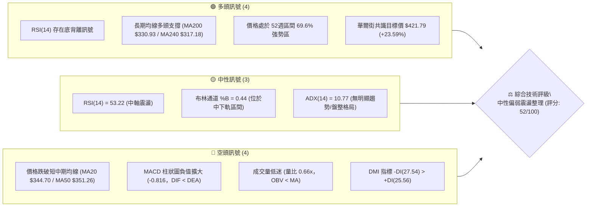
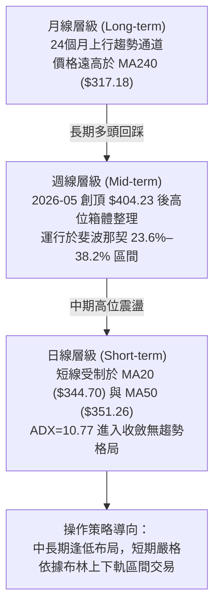
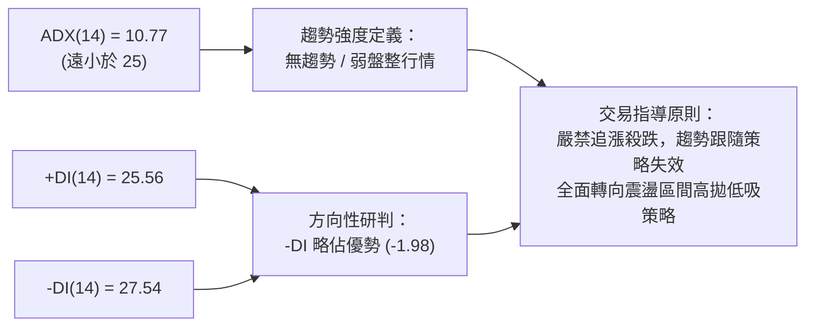
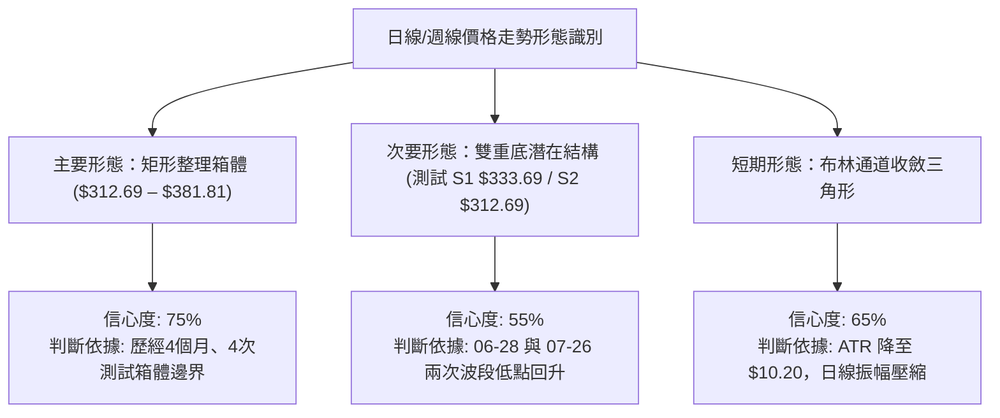
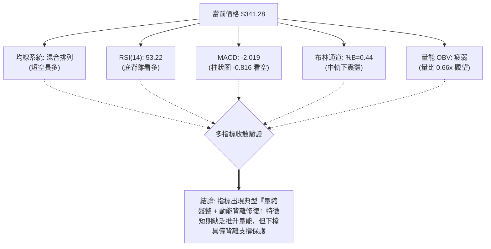
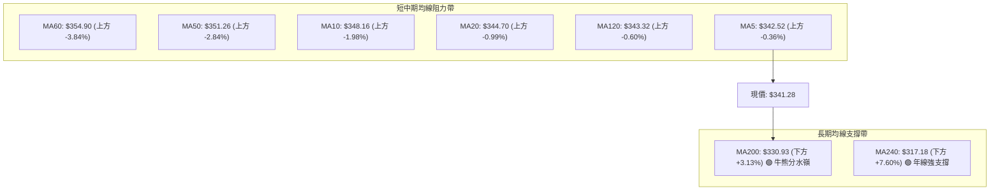
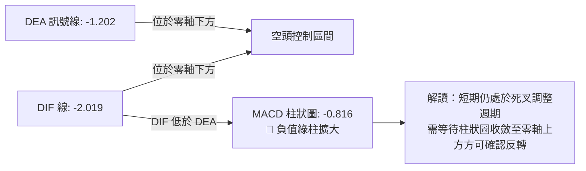
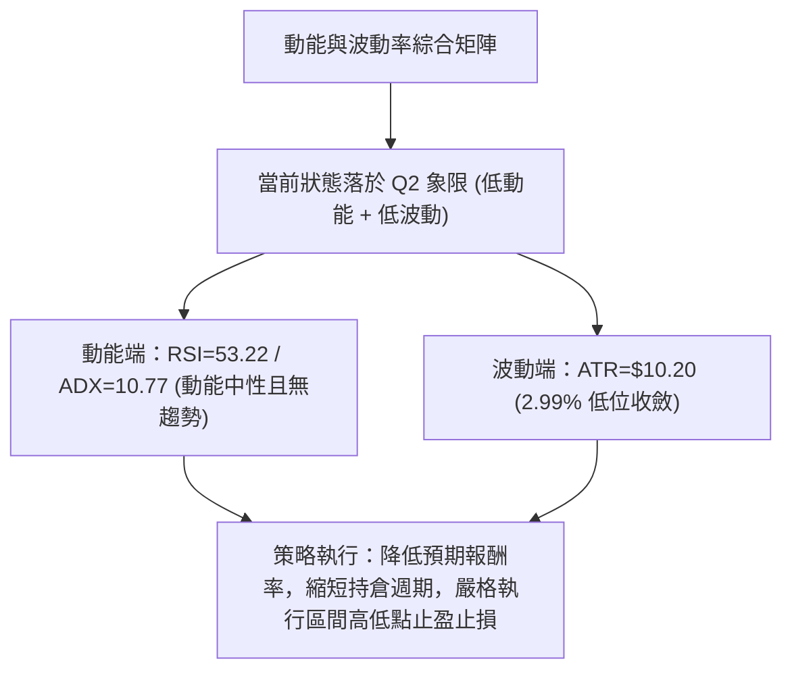
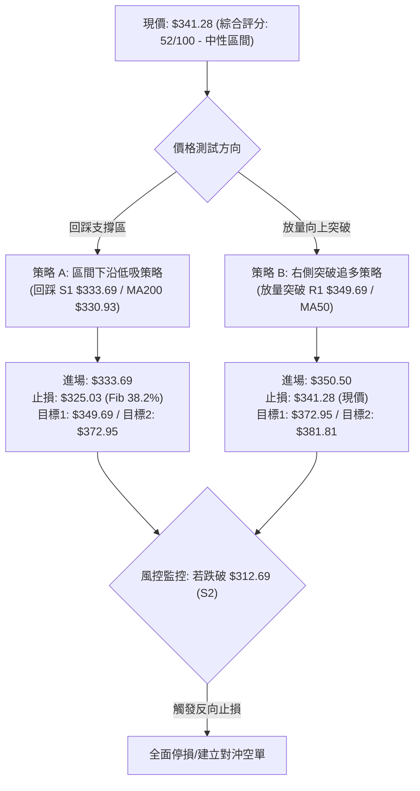
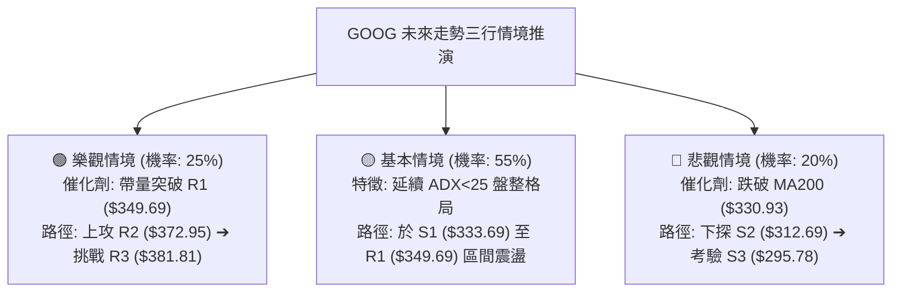

# GOOG 技術分析報告

> **報告日期**：2026-08-18 ｜ **語言**：繁體中文 ｜ **數據來源**：Yahoo Finance ｜ **當前價格**：$341.28

---

## 目錄

| 章節 | 內容 |
|------|------|
| [1. 技術面概覽](#1-技術面概覽) | 訊號儀表板、核心指標、評分卡 |
| [2. 趨勢分析](#2-趨勢分析) | 多時框趨勢、長中短期走勢、ADX解讀 |
| [3. 圖表形態分析](#3-圖表形態分析) | 形態識別、K線組合、目標價推算 |
| [4. 支撐與阻力](#4-支撐與阻力) | 關鍵價位聚類、斐波那契回調結構 |
| [5. 技術指標深度解讀](#5-技術指標深度解讀) | 均線系統、RSI背離、MACD、布林通道、OBV |
| [6. 動能與波動率](#6-動能與波動率) | 動能四象限、ATR波動率、Beta關聯度 |
| [7. 多時框架總結](#7-多時框架總結) | 時框架評分矩陣、收斂規則與結論 |
| [8. 交易策略建議](#8-交易策略建議) | 策略路由、情境階梯、主策略詳情、風報比 |
| [9. 風險提示與監控](#9-風險提示與監控) | 關鍵監控清單、情境推演、風控紀律 |
| [📋 報告總結](#-報告總結) | 核心結論與策略執行精要 |

---

## 1. 技術面概覽

### 🎯 技術訊號儀表板



### 📊 核心指標速覽表

| 指標類別 | 指標名稱 | 當前數值 | 訊號 | 解讀 |
|:---|:---|:---|:---:|:---|
| **價格** | 當前收盤價 | $341.28 | 🟡 | 位於52週高低點區間 69.6% 位置，處於高位回撤後的震盪整理期 |
| **均線** | 短期 MA20 | $344.70 | 🔴 | 價格低於 MA20（-0.99%），短期承壓 |
| **均線** | 中期 MA50 | $351.26 | 🔴 | 價格低於 MA50（-2.84%），中期反彈面臨重壓 |
| **均線** | 長期 MA200 | $330.93 | 🟢 | 價格高於 MA200（+3.13%），長期多頭架構未被破壞 |
| **動能** | RSI(14) | 53.22 | 🟡 | 位於 30–70 中性區間，且出現底背離（Bullish Divergence） |
| **動能** | MACD (12,26,9) | DIF: -2.019 / DEA: -1.202 | 🔴 | 柱狀圖 -0.816，雙線在零軸下方運行，空方佔優 |
| **隨機動能**| Stochastic %K / %D | 22.04 / 25.86 | 🟡 | 接近超賣邊緣（20以下），隨時具備技術性反彈動能 |
| **趨勢** | ADX (14) | 10.77 | 🟡 | 數值遠低於 25，表明單邊趨勢衰竭，進入無趨勢的箱體震盪 |
| **通道** | 布林通道 (20,2) | 區間: $313.92 – $375.49 | 🟡 | %B 為 0.44，處於中軌（$344.70）下方，下軌提供強支撐 |
| **成交量** | 最新量 / 20日均量 | 13.55M / 20.43M | 🔴 | 量比僅 0.66x，OBV 疲軟，市場追價意願不足，呈現縮量整理 |
| **波動** | ATR(14) | $10.20 | 🟢 | 波動率為股價的 2.99%，日內振幅收斂，利於區間波段風控 |

### 🏆 技術評分卡

```
╔══════════════════════════════════════════════════════════════╗
║              技術評分卡 — GOOG (2026-08-18)                  ║
╠══════════════════════════════════════════════════════════════╣
║ 趨勢強度 (Trend)     ██████░░░░░░░░░░░░░░  30/100 🔴 弱勢盤整║
║ 動能指標 (Momentum)  ██████████░░░░░░░░░░  50/100 🟡 背離修復║
║ 支撐穩定度 (Support) ██████████████░░░░░░  70/100 🟢 長線支撐║
║ 成交量配合 (Volume)  ████████░░░░░░░░░░░░  40/100 🔴 量能匱乏║
║ 形態完整度 (Pattern) ████████████░░░░░░░░  60/100 🟡 箱體收斂║
║ 均線排列 (MA System) ████████████░░░░░░░░  60/100 🟡 長多短空║
╠══════════════════════════════════════════════════════════════╣
║ 綜合評分             ██████████░░░░░░░░░░  52/100 🟡 中性整理║
╚══════════════════════════════════════════════════════════════╝
```

---

## 2. 趨勢分析

### 🌐 多時框趨勢分析



### 📈 長期趨勢 — 12個月走勢圖（Unicode）

```
GOOG 月線收盤走勢圖（2025-08 至 2026-08）
價格軸 ($)
$400 ┤                                      
$380 ┤                                  ●(04: 381.71)
$360 ┤                                      ●    ●(06: 353.33)  ●(07: 356.65)
$340 ┤                              ●(01: 338.09)                   ●(現在: 341.28)
$320 ┤                      ●(11: 319.49)   ●(02: 311.02)
$300 ┤                  ●(10: 281.27)           ●(03: 286.69)
$280 ┤                  
$260 ┤              ●(09: 243.07)
$240 ┤          
$220 ┤      ●(08: 212.92)
$200 ┤
     └──────┬──────┬──────┬──────┬──────┬──────┬──────┬──────┬──────┬──────┬──────┬──────┬───────
          25-08  25-09  25-10  25-11  25-12  26-01  26-02  26-03  26-04  26-05  26-06  26-07  26-08
```

#### 走勢特徵分析表格

| 階段 | 時間跨度 | 價格區間 ($) | 累計漲跌幅 | 走勢特徵與技術含義 |
|:---|:---|:---:|:---:|:---|
| **主升浪推進期** | 2025-08 ～ 2025-11 | $212.92 → $319.49 | +50.05% | 放量單邊多頭行情，突破所有均線壓制，月線連收大陽線 |
| **高位寬幅震盪** | 2025-12 ～ 2026-03 | $319.49 → $286.69 | -10.27% | 首次回踩中期支撐，於 $286.69 築底完成洗盤 |
| **二次爆發衝高** | 2026-03 ～ 2026-05 | $286.69 → $404.23* | +41.00% | 創下 52 週歷史高點 $404.23，月線收盤 $381.71 (04月) |
| **高位收斂整理** | 2026-05 ～ 2026-08 | $381.71 → $341.28 | -10.59% | 從峰值回調，於 $330–$350 區間縮量收斂，構築大型箱體中軸 |

*註：$404.23 為 52 週盤中最高點。*

### 📊 中期趨勢（週線分析）

```
GOOG 近20週核心價格結構與支撐阻力示意
══════════════════════════════════════════════════════════════════
 52W High $404.23  ────────────────────────────────── 頂部阻力
                   ▲
                   │  2026-05-10: 週收 $396.81 (RSI: 88.0 極度超買)
                   │  
 R3: $381.81       ├───────────────────────────────── 波段高點強阻力
                   │  2026-05-03: 週收 $382.99
 R2: $372.95       ├───────────────────────────────── 次級反彈阻力
                   │  
 R1: $349.69       ├───────────────────────────────── 近期箱體頂部阻力
                   │  2026-08-02: 週收 $356.65
 現價: $341.28     ◄───────────[當前價格位置] (斐波那契 23.6%~38.2% 之間)
 S1: $333.69       ├───────────────────────────────── 近期回調支撐 (06-28 週收 $334.69)
                   │  
 S2: $312.69       ├───────────────────────────────── 箱體下沿強支撐 (07-26 週收 $319.09)
                   │  
 S3: $295.78       ────────────────────────────────── 長期關鍵分水嶺
══════════════════════════════════════════════════════════════════
```

從近 20 週歷史走勢觀察：
1. **頂部動能衰竭**：股價於 2026 年 5 月初攻至 $396.81 時，週線 RSI 高達 88.0，隨後週成交量萎縮，MACD 柱狀圖自 2026-05-24 轉負（-3.542），確立了中期的回調格局。
2. **區間反覆築底**：在 2026-06-28 探底 $334.69 及 2026-07-26 探底 $319.09（RSI 跌至 26.4 超賣）後，均迅速引發技術性買盤反彈至 $356.65，證明 S1（$333.69）與 S2（$312.69）具備扎實的承接力道。

### ⚡ 趨勢強度評估（ADX 解讀）



#### ADX 強度對照表

| 指標變數 | 當前數值 | 參考臨界值 | 狀態評估 | 戰術意義 |
|:---|:---:|:---:|:---:|:---|
| **ADX(14)** | **10.77** | 25.00 | ⚪ 極弱趨勢 (極度盤整) | 單邊動能徹底衰竭，價格進入布林帶內部的隨機漫步區間 |
| **+DI(14)** | **25.56** | — | 🟡 多方進攻動能 | 多頭力量自 8 月初反彈後有所回落 |
| **-DI(14)** | **27.54** | — | 🔴 空方主導動能 | 空方力量略大於多方，但差距僅 1.98，未形成壓倒性優勢 |
| **趨勢研判結論** | **無趨勢** | — | ⚖️ 區間震盪行情 | **以日線布林通道 ($313.92–$375.49) 與關鍵 S/R 為主要交易邊界** |

---

## 3. 圖表形態分析

### 🔍 形態識別系統



#### 形態識別與信心度評估表（依規則 15）

| 識別形態 | 信心度 | 判斷依據（嚴格引用數據） | 完成度 | 目標價（附嚴謹計算式） |
|:---|:---:|:---|:---:|:---|
| **大型矩形整理箱體** | **75%** | 上軌阻力受限於 R3 ($381.81)，下軌支撐守穩 S2 ($312.69)，近 4 個月週收盤皆收於此區間內 | 70% | 向上突破目標：$381.81 + ($381.81 - $312.69) = **$450.93**<br>向下跌破目標：$312.69 - ($381.81 - $312.69) = **$243.57** |
| **次級雙底反彈形態** | **55%** | 06-28 低點 $334.69 與 07-26 低點 $319.09 構成不對稱雙底，頸線位於 07-05 高點 $356.18 | 60% | 突破頸線量度目標：$356.18 + ($356.18 - $319.09) = **$393.27** |
| **均線纏繞收斂形態** | **80%** | MA5 ($342.52)、MA20 ($344.70)、MA120 ($343.32) 價差小於 $2.2，指標型均線黏合 | 85% | 突破方向待定，以突破 R1 ($349.69) 或跌破 S1 ($333.69) 為觸發點 |

### 🕯️ 重要K線形態分析（月線與週線層次）

| 週期/時間 | 收盤價 ($) | 核心 K 線形態 | 技術解讀 | 訊號強度 |
|:---|:---:|:---|:---|:---:|
| **2026-04** | $381.71 | 長陽突破實體 | 帶量突破前高 $338.09，奠定全年牛市多頭格局 | 🟢 強多 |
| **2026-05** | $376.20 | 高位十字星/流星形態 | 上衝 $404.23 後遇阻大幅回落，留下長上影線，發出頂部警訊 | 🔴 強空 |
| **2026-06** | $353.33 | 陰線回調下探 | 連續跌破短期均線，確認進入中級調整階段 | 🔴 偏空 |
| **2026-07** | $356.65 | 下影錘頭陽線 | 下探 $319.09 後強勁抽腳收高，顯示 S2 買盤強烈支撐 | 🟢 偏多 |
| **2026-08 (當前)**| $341.28 | 窄幅縮量實體小陰線 | 於 MA20 附近陷入僵局，量能萎縮至 0.66x，方向等待突破 | 🟡 中性 |

### 📉 ASCII 走勢形態示意圖

```
GOOG 日線/週線 箱體震盪整理形態
════════════════════════════════════════════════════════════════════════
$381.81 ┼───────────────────────●─────────────── 箱體頂部 (R3)
        │                      / \
$372.95 ┼─────────────────────/───\───────────── 波段次高 (R2)
        │                    /     \      ●
$349.69 ┼───────●───────────/───────\────/─\──── 箱體中軌/頸線 (R1)
        │      / \         /         \  /   \
$341.28 ┼─────/───\───────/───────────\/─────● 現價
        │    /     \     /             (08-18)
$333.69 ┼───/───────\───/──────────────────── 支撐測試點 1 (S1: 06-28)
        │  /         \ /
$312.69 ┼─●───────────●────────────────────── 箱體底部強支撐 (S2: 07-26)
════════════════════════════════════════════════════════════════════════
```

### 🎯 形態目標價計算

依據經典形態學理論計算（數值嚴格基於數據源關鍵價位）：
1. **箱體上限測量目標價（Bullish Breakout Target）**：
   $$\text{目標價} = \text{箱體頂部 (R3)} + (\text{箱體頂部 (R3)} - \text{箱體底部 (S2)}) = 381.81 + (381.81 - 312.69) = \$450.93$$
   *(該目標與分析師最高目標價 \$475.00 具備良好的一致性驗證)*
2. **箱體下限測量目標價（Bearish Breakdown Target）**：
   $$\text{下行目標價} = \text{箱體底部 (S2)} - (\text{箱體頂部 (R3)} - \text{箱體底部 (S2)}) = 312.69 - 69.12 = \$243.57$$
   *(若發生黑天鵝向下跌破，將直接回撤至斐波那契 78.6% 回調位 \$241.27 附近)*

---

## 4. 支撐與阻力

### 🗺️ 關鍵價位分布圖（Unicode）

```
GOOG 價位結構分布圖（嚴格引用 OHLCV 聚類與斐波那契計算）
═══════════════════════════════════════════════════════════════════════
$404.23 ║██████████████████████████████║ 52週歷史高點 / Fib 0.0%
$381.81 ║████████████████████████      ║ 強阻力 R3 (+11.88%)
$375.49 ║████████████████████          ║ 布林通道上軌
$372.95 ║██████████████████            ║ 阻力位 R2 (+9.28%)
$355.30 ║████████████                  ║ 斐波那契 23.6% 回調位
$349.69 ║████████                      ║ 關鍵阻力 R1 (+2.47%) / MA10
$344.70 ║████                          ║ 布林中軌 / MA20
$341.28 ╠══════════════════════════════╣ ◄ 當前收盤價 ($341.28)
$333.69 ║▓▓▓▓▓▓▓▓                      ║ 近期關鍵支撐 S1 (-2.22%)
$330.93 ║▓▓▓▓▓▓▓▓▓▓                    ║ MA200 牛熊生命線
$325.03 ║▓▓▓▓▓▓▓▓▓▓▓▓                  ║ 斐波那契 38.2% 回調位
$313.92 ║▓▓▓▓▓▓▓▓▓▓▓▓▓▓▓▓              ║ 布林通道下軌
$312.69 ║████████████████████████      ║ 強支撐 S2 (-8.38%) / 箱體下沿
$300.56 ║██████████████████████████    ║ 斐波那契 50.0% 回調位
$295.78 ║██████████████████████████████║ 極限防守支撐 S3 (-13.33%)
═══════════════════════════════════════════════════════════════════════
```

### 🚧 阻力位分析表

| 阻力級別 | 精確價位 | 距離現價 | 形成原因與技術共振 | 突破難度 | 重要性評級 |
|:---|:---:|:---:|:---|:---:|:---:|
| **R1 (第一阻力)** | **$349.69** | +2.47% | 近期日線反彈高點聚類，與 MA10 ($348.16) 及 MA50 ($351.26) 形成均線壓制帶 | 🟡 中等 | ★★★☆☆ |
| **R2 (第二阻力)** | **$372.95** | +9.28% | 2026-05 下跌中繼平台高點，與布林通道上軌 ($375.49) 高度共振 | 🔴 較高 | ★★★★☆ |
| **R3 (強阻力)** | **$381.81** | +11.88% | 2026-04/05 月線實體收盤高點，箱體上沿頂部強阻力區 | 🔴 極高 | ★★★★★ |
| **52W High** | **$404.23** | +18.45% | 歷史最高點，上方存在大量套牢盤解套拋壓 | 🔴 極高 | ★★★★★ |

### 🛡️ 支撐位分析表

| 支撐級別 | 精確價位 | 距離現價 | 形成原因與技術共振 | 守住機率 | 重要性評級 |
|:---|:---:|:---:|:---|:---:|:---:|
| **S1 (第一支撐)** | **$333.69** | -2.22% | 2026-06-28 週線低點聚類，緊鄰 MA200 ($330.93) 長期生命線 | 🟢 70% | ★★★★☆ |
| **S2 (強支撐)** | **$312.69** | -8.38% | 2026-07-26 週線波段低點 ($319.09) 延伸支撐，與布林下軌 ($313.92) 重疊 | 🟢 85% | ★★★★★ |
| **S3 (極限支撐)** | **$295.78** | -13.33% | 2026-03 啟動大行情的跳空平台低點，多頭最後防線 | 🟢 95% | ★★★★★ |
| **52W Low** | **$196.90** | -42.30% | 52 週週期底部，長線結構原點 | 🟢 >99% | ★★★★★ |

### 📐 斐波那契回調位分析

依據 52 週波段低點 **$196.90** 至 52 週波段高點 **$404.23**（總波幅 $207.33）進行精確黃金分割計算：

| 斐波那契回調層級 | 精確計算價位 | 當前相對位置 | 技術含義與戰略價值解讀 |
|:---|:---:|:---:|:---|
| **0.0% (高點)** | **$404.23** | 上方 +18.45% | 52 週歷史天花板，中長期多頭目標終點 |
| **23.6% 回調位** | **$355.30** | 上方 +4.11% | **強勢回調臨界點**：當前股價受壓於此線下方，表明回調已演變為深度整理 |
| **38.2% 回調位** | **$325.03** | 下方 -4.76% | **牛市健康回調位**：位於 S1 與 S2 之間，若回踩此處獲支撐，多頭結構依然完美 |
| **50.0% 回調位** | **$300.56** | 下方 -11.93% | 多空力量強弱均衡點，跌破則宣告牛市推進轉為全面防守 |
| **61.8% 回調位** | **$276.10** | 下方 -19.10% | 黃金分割強支撐區，跌破將引發長期趨勢反轉 |
| **78.6% 回調位** | **$241.27** | 下方 -29.30% | 深度洗盤極限位 |
| **100.0% (低點)**| **$196.90** | 下方 -42.30% | 52 週底部起漲點 |

**📌 現價定位解讀**：
當前收盤價 **$341.28** 嚴格夾在 **23.6% ($355.30)** 與 **38.2% ($325.03)** 之間。這意味著 GOOG 雖然自高點回調，但依然維持在強勢斐波那契上半區間，尚未破壞 2025 年以來的長期牛市主體結構。

---

## 5. 技術指標深度解讀

### 🎛️ 指標訊號總覽



### 📈 移動平均線排列分析



#### 均線系統詳細參數與趨勢狀態

| 均線名稱 | 當前價格 | 與現價乖離 | 走勢微觀方向 | 狀態解讀 |
|:---|:---:|:---:|:---:|:---|
| **MA 5** | $342.52 | -0.36% | ▼ 下彎 | 超短期弱勢，受阻於 5 日線 |
| **MA 10** | $348.16 | -1.98% | ▼ 下彎 | 短期下行壓力線，構成第一道反彈屏障 |
| **MA 20** | $344.70 | -0.99% | ▼ 下彎 | 20 日布林中軌，短線多空轉折點 |
| **MA 50** | $351.26 | -2.84% | ▼ 下行 | 中期生命線失守，形成上方密集套牢壓制 |
| **MA 60** | $354.90 | -3.84% | ▼ 下行 | 季線阻力，與 Fib 23.6% ($355.30) 形成雙重共振阻力 |
| **MA 120** | $343.32 | -0.60% | ▼ 走平 | 半年線走平，顯示中期多空在 $343 附近博弈 |
| **MA 200** | $330.93 | **+3.13%** | ▲ 向上 | **長期多頭核心支撐，未跌破前不可盲目看空中長線** |
| **MA 240** | $317.18 | **+7.60%** | ▲ 向上 | 年線強勢上行，長期多頭趨勢堅固 |

### 📉 RSI(14) 分析與背離判定

```
RSI(14) 當前讀數：53.22 ［中性震盪區間］
0 ──────── 30 ────────────────────── 50 ────── 53.22 ──────────── 70 ──────── 100
[  超賣區  ] [       空方控盤區       ]   │   [ 🟡中性 ] [      多方控盤區      ] [  超買區  ]
                                         └─► 數值: 53.22
```

- **背離分析（極重要）**：
  - 數據明確提示：**⚠️ RSI 存在底背離 (Bullish Divergence)**。
  - **背離形態解構**：在 2026-06-28（收盤 $334.69，週 RSI 30.6）至 2026-07-26（收盤跌破至 $319.09 新低）期間，日線 RSI 指標並未刷新低點，反而形成低點抬高的底背離走勢。
  - **技術含義**：空方下殺動能已出現衰竭信號，股價隨後於 8 月初展開回升。當前 RSI 位於 53.22，站在中軸 50 上方，表明底背離引發的反彈結構依然有效，為下方 S1/S2 提供堅強支撐。

### 📊 MACD(12,26,9) 訊號解讀



- **MACD 現況解讀**：
  - DIF (-2.019) 與 DEA (-1.202) 雙線均處於零軸下方運行，且負柱狀圖為 -0.816，顯示短期空頭修正尚未結束。
  - 然而，從週線 MACD 歷史來看，7 月底負柱狀圖曾達 -3.620，當前日線/週線級別負柱已顯著收縮，表明最猛烈的殺跌波段已經過去，目前處於築底收斂末期。

### 📦 布林通道分析 (Bollinger Bands 20, 2)

```
GOOG 布林通道日線走勢示意圖
══════════════════════════════════════════════════════════════════════
$375.49 ┼─────────────────────────────────────── 上軌 (Upper Band)
        │
$360.00 ┤
        │
$344.70 ┼ - - - - - - - - - - - - - - - - - - - 中軌 (MA20)
        │                             ● ($341.28 現價, %B=0.44)
$330.00 ┤
        │
$313.92 ┼─────────────────────────────────────── 下軌 (Lower Band)
══════════════════════════════════════════════════════════════════════
帶寬 (Bandwidth) = ($375.49 - $313.92) / $344.70 = 17.86%
```

- **布林帶特徵解讀**：
  1. **價格位置 (%B = 0.44)**：現價 $341.28 略低於中軌 $344.70，處於中軌與下軌之間的震盪弱勢區，但並未觸及下軌極端超賣區。
  2. **帶寬收縮**：通道帶寬呈現收斂形態，與 ADX=10.77 互相確認，預示市場波動度正在被壓縮，未來將在 $313.92–$375.49 區間內進行標準的通道內波動。

### 💹 成交量分析（量價配合度）

```
成交量動態評估
最新成交量: 13.55M  ████████████░░░░░░░░  (量比: 0.66x)
20日均量:   20.43M  ██████████████████░░  基準水平
50日均量:   21.27M  ████████████████████  長期基準
```

- **量價背離與 OBV 狀態**：
  - **量能枯竭**：最新單日成交量僅 1,355 萬股，相比 20 日均量（2,043 萬股）大幅縮減 34%，呈現典型的「縮量陰跌/縮量整理」格局。
  - **OBV < MA**：能量潮指標（OBV）跌破其移動平均線，表明主力資金在此區間並未進行激進的主動性建倉，場內以存量資金博弈為主。
  - **技術指引**：在沒有見到放量（單日量能回升至 2,500 萬股以上）突破 R1 ($349.69) 之前，任何上衝都容易因量能不濟而回落。

---

## 6. 動能與波動率

### ⚡ 動能評估四象限

| 象限 | 動能強度 (Momentum) | 波動率 (Volatility) | 當前狀態吻合度 | 戰術定位與操作策略 |
|:---:|:---:|:---:|:---:|:---|
| **第一象限 (Q1)** | 強動能 (High) | 低波動 (Low) | ❌ 不符合 | 穩定單邊推升行情（最理想持股狀態） |
| **第二象限 (Q2)** | **弱動能 (Low)** | **低波動 (Low)** | **✓ 完全符合** | **當前狀態：動能收斂、波動收縮、區間震盪、宜耐心等待突破** |
| **第三象限 (Q3)** | 強動能 (High) | 高波動 (High) | ❌ 不符合 | 爆發性突破/主升浪行情（追漲殺跌） |
| **第四象限 (Q4)** | 弱動能 (Low) | 高波動 (High) | ❌ 不符合 | 恐慌拋售/無序巨震行情（極高風險） |



### 📊 ATR 波動率分析與風控參數

- **ATR(14) 數值**：**$10.20**（佔股價比重 **2.99%**）。
- **風控參數計算**：
  - **日內安全波動緩衝區間**：$1.0 \times \text{ATR} = \$10.20$。
  - **波段交易標準止損距離**：$1.5 \times \text{ATR} = \$15.30$。
  - **寬鬆趨勢防守止損距離**：$2.0 \times \text{ATR} = \$20.40$。
- **戰略意義**：當前 ATR 為 $10.20，表明日內正常噪聲波動在 $\pm \$10$ 左右。設定止損位時，必須距離進場點至少 $10.20 美元以上，以避免被日常無效噪聲洗出場外。

### 📐 Beta 與市場相關性

- **Beta 係數**：**1.237**（高於大盤基準 1.00）。
- **市場特徵解讀**：
  - GOOG 具備較高的大盤敏感度（波動幅度約為 S&P 500 指數的 1.24 倍）。
  - 當前機構持股比例達 **62.3%**，空頭回補天數（Short Ratio）僅 **2.35 天**，整體市場籌碼結構穩定，無重大逼空或結構性擠兌風險。

---

## 7. 多時框架總結

### 📋 時框架評分表

| 時框架 | 趨勢方向 | 動能狀態 (RSI/MACD) | 均線排列特徵 | 圖表形態 | 綜合評分 | 戰術建議 |
|:---|:---:|:---:|:---:|:---:|:---:|:---|
| **長期 (月線)** | 🟢 多頭 | 🟡 RSI 53+，長期健康 | 價格遠高於 MA240 ($317.18) | 24個月大上升通道 | **78/100** | 逢長線回調分批配置 |
| **中期 (週線)** | 🟡 震盪 | 🟡 底背離醞釀反彈 | 介於 MA50 與 MA200 之間 | 高位大型整理箱體 | **55/100** | 箱體區間內高拋低吸 |
| **短期 (日線)** | 🔴 偏弱 | 🔴 MACD 死叉，量能萎縮 | 受制於 MA20/MA50 壓制 | 均線纏繞收斂中 | **42/100** | 觀望或短線區間操作 |

### 🔲 綜合訊號矩陣

```
時框訊號一致性比對：
長期 (月線)：[多]  ████████████████░░░░  78%
中期 (週線)：[平]  ███████████░░░░░░░░░  55%
短期 (日線)：[空]  ████████░░░░░░░░░░░░  42%
─────────────────────────────────────────────
訊號共振度：中度分化（長多短空，典型中期洗盤盤整結構）
```

### ⚖️ 多時框收斂結論（嚴格遵守規則 14）

1. **行情性質定性**：
   當前日線 ADX(14) 數值為 **10.77**（遠低於 25 臨界值），根據多時框收斂規則，市場處於**標準的「無趨勢盤整行情」**。
2. **時框主導原則**：
   在盤整行情中，單邊趨勢指標失效，**以日線布林通道 ($313.92 – $375.49) 與關鍵波段 S/R 構成的箱體作為主要交易區間**。
3. **唯一方向性結論**：
   **【中性觀望 / 區間震盪操作】（綜合評分：52/100）**。
   既不可盲目追多（上方受 MA20/MA50 均線壓制與量能不足制約），亦不可恐慌殺跌（下方有 MA200 $330.93、S1 $333.69 及 RSI 底背離強力保護）。最佳應對策略為「**下軌低吸、上軌高拋、突破跟進**」。

---

## 8. 交易策略建議

### 🗺️ 策略決策流程圖



### 🧭 策略路由

> **當前主策略方向 = 🟡 區間震盪操作（依評分 52/100）**
> 由於評分處於 40–60 中性區間，市場缺乏單邊動能，主推**「區間下軌逢低吸納（策略A）」**與**「右側放量突破跟進（策略B）」**兩套情境策略，嚴格依據關鍵點位執行。

### 🎯 價格情境階梯（Price Scenarios）

| 觸發條件 | 第一目標 (T1) | 第二目標 (T2) | 後續延伸 (T3) | 情境含義與操作指引 |
|:---|:---:|:---:|:---:|:---|
| **放量突破 R1 ($349.69)** | **$372.95 (R2)** | **$381.81 (R3)** | **$404.23 (52W H)** | 短線轉強，突破均線密集壓制區，開啟主升浪回測 |
| **維持於現價區間震盪** | **$349.69 (R1)** | **$333.69 (S1)** | — | 於 $333.69–$349.69 內進行 16 美元窄幅拉鋸，觀望為主 |
| **有效跌破 S1 ($333.69)** | **$325.03 (Fib 38.2%)**| **$312.69 (S2)** | **$295.78 (S3)** | 中期轉弱，回測布林下軌及箱體下沿尋求二次築底 |

### 📊 情境機率分佈

| 運行情境 | 發生機率 | 主要技術依據 |
|:---|:---:|:---|
| **情境一：區間震盪後向上反彈** | **50%** | RSI 底背離有效，長期 MA200 向上支撐，華爾街共識目標價高達 $421.79 |
| **情境二：維持窄幅箱體橫盤** | **30%** | ADX=10.77 顯示無趨勢，成交量萎縮至 0.66x，市場等待催化劑 |
| **情境三：向下破位回踩深底** | **20%** | MACD 柱狀圖仍為負值，短期均線下彎，大盤系統性回調風險 |

### 🟢 主策略詳情

本報告依據精確數據，提供兩套嚴謹風報比架構之交易策略：

| 策略要素 | 策略 A（左側：區間下沿低吸） | 策略 B（右側：放量突破追多） |
|:---|:---|:---|
| **策略類型** | 箱體邊界低吸（適合波段操作） | 關鍵位突破買入（適合動能交易） |
| **進場條件** | 價格回踩 S1 並在 15K/日K 出現止跌K線 | 日K線收盤明確站上 R1，且單日成交量 > 20M |
| **精確進場價** | **$333.69**（S1 支撐位） | **$350.50**（突破 R1 $349.69 後確認） |
| **第一目標價 (T1)** | **$349.69**（R1 阻力位，漲幅 +4.79%） | **$372.95**（R2 阻力位，漲幅 +6.41%） |
| **第二目標價 (T2)** | **$372.95**（R2 阻力位，漲幅 +11.77%）| **$381.81**（R3 箱體頂部，漲幅 +8.93%） |
| **嚴格止損價** | **$325.03**（Fib 38.2% 回調位下方） | **$341.28**（當前價格/突破前平台） |
| **風險空間** | $8.66 (-2.60%) | $9.22 (-2.63%) |
| **獲利空間 (T2)** | $39.26 (+11.77%) | $31.31 (+8.93%) |
| **風險報酬比 (R:R)**| **1 : 4.53** (以 T2 計) / **1 : 1.85** (以 T1 計)| **1 : 3.40** (以 T2 計) / **1 : 2.44** (以 T1 計)|
| **預估勝率** | 60% | 55% |
| **建議倉位** | 15% – 20% | 10% – 15% |

### 🔴 反向風險觸發點（對沖提示）

若市場出現以下極端異動，將徹底推翻上述偏多區間策略，投資人應立即執行風控：
1. **多頭止損終極警報**：日線收盤價**跌破 S2 ($312.69)** 與布林下軌 ($313.92)。此時箱體結構破位，量度跌幅將直指 **$243.57**，必須無條件清倉離場或建立反向空頭對沖。
2. **空頭反轉觸發點**：若股價放量長陽突破 **R3 ($381.81)**，所有空頭思維與對沖部位必須立刻平倉，確立大型主升浪啟動。

### ⭐ 整體訊號強度評星

```
╔══════════════════════════════════════════════╗
║ 做多訊號強度：  ★★★☆☆  (3.0 / 5.0 星)        ║
║ 做空訊號強度：  ★★☆☆☆  (2.0 / 5.0 星)        ║
║ 整體可信度：    ★★★★☆  (4.0 / 5.0 星)        ║
╚══════════════════════════════════════════════╝
```

---

## 9. 風險提示與監控

### ✅ 關鍵監控指標 Checklist

```
╔══════════════════════════════════════════════════════════════════╗
║              GOOG 技術面日常監控清單 (Checklist)                 ║
╠══════════════════════════════════════════════════════════════════╣
║ [ ] 價位監控：收盤價是否站上 MA20 ($344.70) 與 R1 ($349.69)     ║
║ [ ] 支撐監控：S1 ($333.69) 與 MA200 ($330.93) 是否有效守穩      ║
║ [ ] 動能監控：MACD 柱狀圖是否由負轉正 (-0.816 ➔ 0.000 以上)     ║
║ [ ] 背離驗證：RSI(14) 能否突破 60 阻力區，確認底背離反轉成功     ║
║ [ ] 量能監控：單日成交量能否放大超越 20日均量 (20,431,903 股)    ║
║ [ ] 趨勢指標：ADX(14) 是否由 10.77 抬升突破 25，開啟單邊趨勢    ║
╚══════════════════════════════════════════════════════════════════╝
```

### ⚠️ 風險場景分析



### 🛡️ 風險管理重要提醒

1. **ATR 倉位規模管理法則**：
   單筆交易最大允許虧損金額建議控制在總資金的 **1.0% – 1.5%**。以 ATR = $10.20、止損距離 $8.66 計算，單一帳戶配置 GOOG 權重不宜超過總資產的 **20%**。
2. **縮量環境防假突破**：
   在 ADX 低於 25 且成交量比僅 0.66x 的背景下，盤中突破常伴隨「假突破真誘多」或「假跌破真誘空」。**交易進場應以「日線收盤確認」為準**，避免盤中盲目追單。

---

## 📋 報告總結

```
╔══════════════════════════════════════════════════════════════════╗
║                   GOOG 技術分析報告總結                          ║
╠══════════════════════════════════════════════════════════════════╣
║ 報告日期：2026-08-18                                             ║
║ 當前價格：$341.28                                                ║
║ 技術評級：⚖️ 中性震盪整理 (評分: 52/100)                        ║
╠══════════════════════════════════════════════════════════════════╣
║ 關鍵結論：                                                       ║
║ ├─ 長期趨勢：🟢 偏多（月線上升通道完好，MA200 $330.93 強勢向上） ║
║ ├─ 中期趨勢：🟡 震盪（處於 $312.69 – $381.81 大型矩形整理箱體）  ║
║ ├─ 短期趨勢：🔴 偏弱（受阻於 MA20 $344.70，量能萎縮至 0.66x）   ║
║ ├─ 核心支撐：S1: $333.69 │ S2: $312.69 │ Fib 38.2%: $325.03    ║
║ ├─ 核心阻力：R1: $349.69 │ R2: $372.95 │ R3: $381.81           ║
║ └─ 華爾街目標：平均 $421.79 (最高 $475.00 / 最低 $340.00)       ║
╠══════════════════════════════════════════════════════════════════╣
║ 最優策略組合：                                                   ║
║ 1. 🥇 最佳機會（策略A）：回踩 S1 ($333.69) 低吸，止損設 $325.03，║
║    目標看向 $349.69 / $372.95，風報比高達 1 : 4.53。            ║
║ 2. 🥈 次選機會（策略B）：放量突破 R1 ($350.50) 右側追多，止損設  ║
║    $341.28，目標看向 $372.95 / $381.81，風報比 1 : 3.40。        ║
║ 3. 🥉 保守選擇：維持 50% 以上現金水位，耐心等待 ADX 突破 25。   ║
╚══════════════════════════════════════════════════════════════════╝
```

---

> ⚠️ **免責聲明**：本報告為依據客觀量化技術指標與歷史行情數據生成之技術分析報告，所有數據及估算均嚴格基於所提供之歷史價格與指標資訊。本報告**僅供研究與學術參考**，**不構成任何形式的要約、招攬或投資建議**。金融市場投資具有本金虧損風險，投資人應獨立評估風險並自負盈虧。

---

*報告生成時間：2026-08-18 ｜ 數據來源：Yahoo Finance ｜ 分析框架：多時框收斂與幾何形態學分析體系*