# GOOG 技術分析報告

> **報告日期**：2026-08-19 ｜ **語言**：繁體中文 ｜ **數據來源**：Yahoo Finance ｜ **當前價格**：$341.70

---

## 目錄

| 章節 | 內容 |
|------|------|
| [1. 技術面概覽](#1-技術面概覽) | 訊號儀表板、核心指標、評分卡 |
| [2. 趨勢分析](#2-趨勢分析) | 多時框趨勢、長中短期走勢、ADX解讀 |
| [3. 圖表形態分析](#3-圖表形態分析) | 形態識別、K線組合、目標價推算 |
| [4. 支撐與阻力](#4-支撐與阻力) | 關鍵價位分佈、斐波那契回調結構 |
| [5. 技術指標深度解讀](#5-技術指標深度解讀) | 均線系統、RSI、MACD、布林通道、OBV與量能 |
| [6. 動能與波動率](#6-動能與波動率) | 動能四象限、ATR波幅、Beta係數分析 |
| [7. 多時框架總結](#7-多時框架總結) | 時框架評分矩陣、收斂規則與唯一方向結論 |
| [8. 交易策略建議](#8-交易策略建議) | 決策路由、價格情境階梯、主策略與對沖防線 |
| [9. 風險提示與監控](#9-風險提示與監控) | 監控清單、情境推演、資金控管規範 |

---

## 1. 技術面概覽

### 🎯 技術訊號儀表板

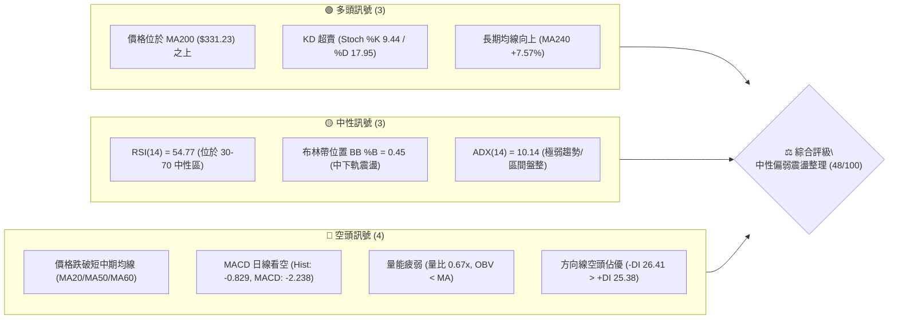

### 📊 核心指標速覽表

| 指標類別 | 指標名稱 | 當前數值 | 訊號 | 解讀 |
|:---|:---|:---|:---:|:---|
| **價格** | 當前收盤價 | $341.70 | 🟡 | 位於52週高低區間之 69.8%，處於回調整理中樞 |
| **均線 (短)** | MA20 | $344.69 | 🔴 | 現價低於 MA20 達 -$2.99 (-0.87%)，短線承壓 |
| **均線 (中)** | MA50 | $350.87 | 🔴 | 現價位於 MA50 之下，中期多頭格局受阻轉入盤整 |
| **均線 (長)** | MA200 | $331.23 | 🟢 | 現價高於 MA200 達 +$10.47 (+3.16%)，長期多頭底線完好 |
| **動能** | RSI(14) | 54.77 | 🟡 | 處於 30–70 中性區間，無明顯頂底背離 |
| **動能** | MACD (12,26,9) | -2.238 | 🔴 | DIF 線低於 DEA 信號線 (-1.409)，柱狀圖為 -0.829 偏空 |
| **擺動** | Stoch %K / %D | 9.44 / 17.95 | 🟢 | 進入極度超賣區（<20），短線具備技術性反彈動能 |
| **趨勢** | ADX(14) / DMI | 10.14 | 🟡 | ADX < 25 代表非趨勢行情；-DI (26.41) 略高於 +DI (25.38) |
| **通道** | 布林帶 (%B) | 0.45 | 🟡 | 位於中軌 ($344.69) 與下軌 ($313.90) 間，帶寬收斂 |
| **量能** | 成交量 / OBV | 13.29M (0.67x) | 🔴 | 20日均量 19.97M，量縮且 OBV < MA，買盤承接力道趨緩 |
| **波動** | ATR(14) | $10.17 | 🟡 | 佔現價 2.98%，處於中等正常波動水準 |

### 🏆 技術評分卡

```
╔════════════════════════════════════════════════════════════════╗
║                技術評分卡 — GOOG (2026-08-19)                  ║
╠════════════════════════════════════════════════════════════════╣
║ 趨勢強度 (ADX=10.14)   ████░░░░░░░░░░░░░░░░  20/100  🔴 極弱趨勢 ║
║ 動能指標 (RSI/MACD/KD) ██████████░░░░░░░░░░  50/100  🟡 動能中性 ║
║ 支撐穩定度 (S1/MA200)  ██████████████░░░░░░  70/100  🟢 支撐穩固 ║
║ 成交量配合 (OBV/量比)  ██████░░░░░░░░░░░░░░  30/100  🔴 量能不足 ║
║ 形態完整度 (箱型整理)  ████████████░░░░░░░░  60/100  🟡 區間成型 ║
║ 均線排列 (多空糾結)    ████████████░░░░░░░░  60/100  🟡 長多短空 ║
╠════════════════════════════════════════════════════════════════╣
║ 綜合技術評分           ██████████░░░░░░░░░░  48/100  ⚖️ 區間盤整 ║
╚════════════════════════════════════════════════════════════════╝
```

---

## 2. 趨勢分析

### 🌐 多時框趨勢分析

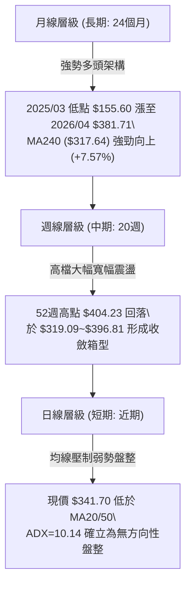

### 📈 長期趨勢 — 12個月走勢圖（Unicode）

```
GOOG 月線走勢圖（過去12個月：2025-08 至 2026-08）
價格軸 ($)
$400 ┤                                              
$380 ┤                                  ● $381.71   
$360 ┤                                      ● $376.20 
$340 ┤                            ● $338.09     ● $353.33  ● $356.65
$320 ┤                      ● $319.49   ● $311.02           ● $341.70 (現價)
$300 ┤                          ● $313.39   ● $286.69
$280 ┤                ● $281.27
$260 ┤            ● $243.07
$240 ┤        ● $212.92
$220 ┤    ●(08月)
$200 ┤
     └────┬──────┬──────┬──────┬──────┬──────┬──────┬──────┬──────┬──────┬──────┬──────┬────
        25-08  25-09  25-10  25-11  25-12  26-01  26-02  26-03  26-04  26-05  26-06  26-07 26-08
```

#### 走勢特徵分析表格

| 階段區間 | 起訖月份 | 起訖價格 ($) | 區間漲跌幅 | 走勢特徵與量價結構解讀 |
|:---|:---:|:---:|:---:|:---|
| **主升攻擊波** | 2025-08 → 2025-11 | $212.92 → $319.49 | **+50.05%** | 帶量單邊主升浪，法人大舉建倉，月線連拉四根大陽線 |
| **高檔第一整理波** | 2025-11 → 2026-03 | $319.49 → $286.69 | **-10.27%** | 獲利了結回洗，探至波段低點 $286.69，清洗浮額 |
| **二次突破攻頂波** | 2026-03 → 2026-04 | $286.69 → $381.71 | **+33.14%** | 強力軋空噴出，月收盤創 $381.71，隨後觸及 52週高點 $404.23 |
| **頂部收斂盤整波** | 2026-04 → 2026-08 | $381.71 → $341.70 | **-10.48%** | 進入高位對稱三角／大箱型整理，量能逐步萎縮，等待新催化劑 |

### 📊 中期趨勢（週線分析）

中期走勢呈現典型的高檔寬幅震盪。自 2026 年 5 月見波段高點 $396.81 以來，週線進入以 $333.69–$334.69 為支撐、$372.95–$381.81 為阻力的箱型區間。

```
中期週線關鍵多空分水嶺示意圖：
$404.23 ── 52W 最高點（強阻力天花板）
   │
$381.81 ── R3 / 週線強阻力位
$372.95 ── R2 / 箱型上緣壓力
   │
$349.69 ── R1 / MA50 壓力帶 ($350.87)
$341.70 ── 【現價】（處於多空拉鋸震盪中心）
$333.69 ── S1 / 近期週線雙重底測試線 ($334.69)
   │
$312.69 ── S2 / 布林帶下軌 ($313.90) 與前波低點 ($319.09) 強防禦線
$295.78 ── S3 / 斐波那契 50% ($300.56) 終極防守
```

### ⚡ 趨勢強度評估（ADX 解讀）

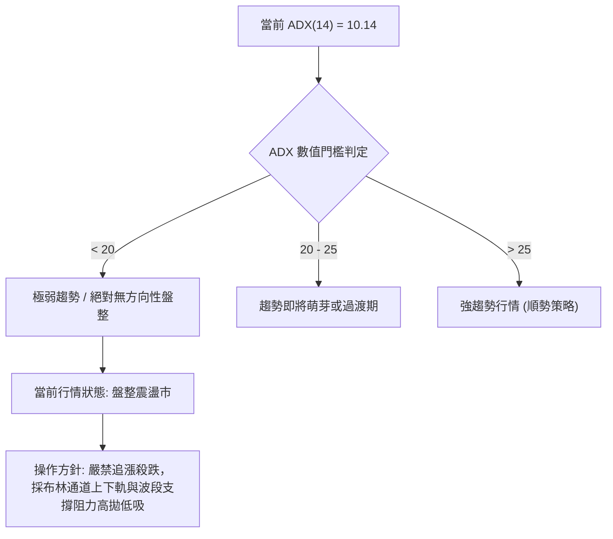

| 指標名稱 | 當前數值 | 臨界標準 | 狀態評估 | 戰略指導意義 |
|:---|:---:|:---:|:---:|:---|
| **ADX (14)** | **10.14** | < 25 (盤整) | 🔴 極弱趨勢 | 趨勢跟隨型策略失效，轉入區間震盪策略 |
| **+DI (14)** | **25.38** | - | 🟡 多方力道 | 多方攻擊動能衰退，無法組織持續性推升 |
| **-DI (14)** | **26.41** | - | 🔴 空方力道 | -DI > +DI，空方微弱佔優，但整體無單邊摜壓力量 |

---

## 3. 圖表形態分析

### 🔍 形態識別系統

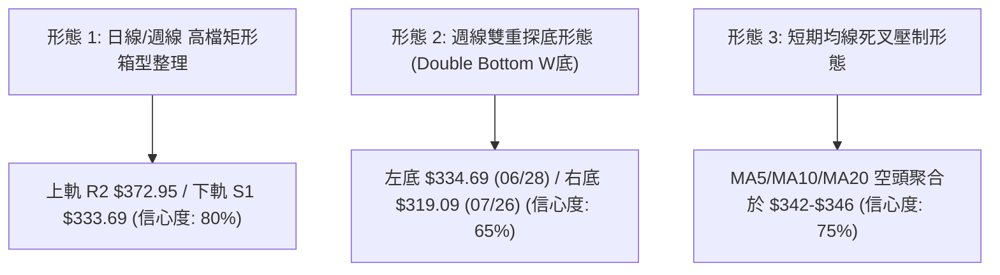

#### 形態信心度評估表

| 形態名稱 | 信心度 | 判斷依據（嚴格引用數據） | 完成度 | 目標價（附嚴格計算式） |
|:---|:---:|:---|:---:|:---|
| **矩形箱型整理** | **80%** | 價格在 S1 ($333.69) 與 R2 ($372.95) 間來回震盪超過 12 週 | 85% | **向上突破目標**：頸線 $372.95 + 箱高 ($372.95 - $333.69 = $39.26) = **$412.21**<br>**向下跌破目標**：頸線 $333.69 - 箱高 $39.26 = **$294.43**（接近 S3 $295.78） |
| **週線雙重底 (W底)** | **65%** | 2026-06-28 週低收 $334.69 與 2026-07-26 週低收 $319.09 構成波段雙底支撐帶 | 60% | **W底測幅目標**：頸線 $367.46 (2026-06-21高點) + 形態高度 ($367.46 - $319.09 = $48.37) = **$415.83** |
| **布林帶收斂壓縮** | **75%** | BB 上軌 $375.48 與下軌 $313.90 帶寬持續收緊，%B 落在 0.45 | 90% | **指標型解讀**：壓縮即將結束，預期突破後將產生單邊 1.5 倍 ATR 擴張 |

### 🕯️ 重要K線形態分析

| 週期/月份 | 收盤價 ($) | K線形態特徵 | 量價關係解讀 | 技術訊號 |
|:---|:---:|:---|:---|:---:|
| **2026-04** | $381.71 | 長陽大突破線 | 突破 $338 前高，月線實體大漲 +33.14%，確立歷史新高區間 | 🟢 強烈看多 |
| **2026-05** | $376.20 | 高位十字星/避雷針 | 觸及 52W 高點 $404.23 後大幅回落，留長上影線，多頭動能耗盡 | 🔴 頂部預警 |
| **2026-06** | $353.33 | 帶量中黑線 | 週量擴大至 1.88 億股（06-28 週），摜破 MA50，法人獲利了結 | 🔴 空頭下殺 |
| **2026-07** | $356.65 | 下影錘頭陽線 | 回測 07-26 週收盤 $319.09 後強勁反彈，長下影線確立 $319 支撐 | 🟢 止跌企穩 |
| **2026-08 (至今)** | $341.70 | 窄幅縮量陰十字 | 週成交量驟降至 40.15M，多空雙方在 MA20 附近陷入膠著平衡 | 🟡 中性觀望 |

### 📉 ASCII 走勢形態示意圖

```
GOOG 箱型震盪與潛在雙底形態示意圖：

$381.81 ──────────────┬─────────────────── [箱型頂部壓力 R3]
                      │     ▲ (2026-05 頂部 $396.81)
$372.95 ──────────────┼────╱─╲──────────── [箱型頸線 R2]
                      │   ╱   ╲       ╱╲
$356.65 ──────────────┼──╱─────╲─────╱──╲── (07-05 / 08-02 反彈高點)
$341.70 ──────────────┼─╱───────【現價】──── [震盪中樞 / BB中軌 $344.69]
                      │╱         ╲ ╱
$333.69 ──────────────W───────────V─────── [箱型下軌 S1 / 06-28 底 $334.69]
                     (左底)      (右底 $319.09)
$312.69 ────────────────────────────────── [極限防守 S2 / BB下軌 $313.90]
```

### 🎯 形態目標價計算

依據幾何形態測幅規則，若後續有效突破或跌破，其推算目標價如下：
1. **矩形箱型向上突破目標價**：
   - 突破確認點：日線收盤突破 R2 **$372.95**
   - 箱體高度：$372.95 - $333.69 = $39.26
   - 測幅目標價 = $372.95 + $39.26 = **$412.21**（接近分析師共識均價 $421.79）
2. **矩形箱型向下跌破測幅價**：
   - 跌破確認點：日線收盤跌破 S1 **$333.69**
   - 測幅下跌目標 = $333.69 - $39.26 = **$294.43**（精確對接波段支撐 S3 $295.78 及 50% 斐波那契位 $300.56）

---

## 4. 支撐與阻力

### 🗺️ 關鍵價位分布圖（Unicode）

```
GOOG 價位結構分布圖
══════════════════════════════════════════════════════════════════════
$404.23 ║██████████████████████████████║ 52週歷史最高點 (52W High)
$381.81 ║████████████████████████      ║ 強阻力 R3 (波段密集高點聚類)
$372.95 ║██████████████████            ║ 重要阻力 R2 (箱型上軌壓力線)
$355.30 ║██████████████                ║ 斐波那契 23.6% 回調壓力位
$349.69 ║██████████                    ║ 關鍵阻力 R1 (MA50 $350.87 匯合處)
────────╠══════════════════════════════╣ ◄ 現價 $341.70 (BB %B = 0.45)
$333.69 ║▓▓▓▓▓▓▓▓▓▓                    ║ 近期關鍵支撐 S1 (近一年波段低點聚類)
$331.23 ║▓▓▓▓▓▓▓▓▓▓▓▓                  ║ 長期生命線 MA200
$325.03 ║▓▓▓▓▓▓▓▓▓▓▓▓▓▓▓▓              ║ 斐波那契 38.2% 回調支撐位
$312.69 ║▓▓▓▓▓▓▓▓▓▓▓▓▓▓▓▓▓▓▓▓          ║ 強支撐 S2 (BB下軌 $313.90 聚類)
$295.78 ║▓▓▓▓▓▓▓▓▓▓▓▓▓▓▓▓▓▓▓▓▓▓▓▓      ║ 終極強支撐 S3 (斐波那契 50% $300.56 聚類)
══════════════════════════════════════════════════════════════════════
```

### 🚧 阻力位分析表

所有阻力價位均嚴格引用自 OHLCV 波段高點聚類計算：

| 阻力級別 | 精確價位 | 距現價幅幅 | 形成原因與結構強度 | 突破難度 | 重要性 |
|:---|:---:|:---:|:---|:---:|:---:|
| **R1** | **$349.69** | +2.34% | 近期日線反彈高點聚類，與 MA50 ($350.87) 重合，短線空頭密集防守區 | 🟡 中等 | ★★★☆☆ |
| **R2** | **$372.95** | +9.14% | 2026年5-6月多次反彈受阻高點，亦為布林通道上軌 ($375.48) 阻力帶 | 🔴 較高 | ★★★★☆ |
| **R3** | **$381.81** | +11.74% | 2026-04月線歷史收盤高點 ($381.71) 與 2026-05-03 週高點 ($382.99) 聚類 | 🔴 極高 | ★★★★★ |

### 🛡️ 支撐位分析表

所有支撐價位均嚴格引用自 OHLCV 波段低點聚類計算：

| 支撐級別 | 精確價位 | 距現價幅幅 | 形成原因與結構強度 | 守住機率 | 重要性 |
|:---|:---:|:---:|:---|:---:|:---:|
| **S1** | **$333.69** | -2.34% | 2026-06-28 週收盤 $334.69 聚類，緊鄰 MA200 ($331.23)，為多方第一道防線 | 🟢 70% | ★★★★☆ |
| **S2** | **$312.69** | -8.49% | 2026-02月收盤 $311.02、2026-07-26週低 $319.09 與布林下軌 $313.90 聚類 | 🟢 85% | ★★★★★ |
| **S3** | **$295.78** | -13.44% | 2026-03月波段回調低點 $286.69 與斐波那契 50% ($300.56) 間的中期強支撐 | 🟢 95% | ★★★★★ |

### 📐 斐波那契回調位分析

依據 52 週波動區間（低點 **$196.90** → 高點 **$404.23**，總跨度 $207.33）精確計算之黃金分割結構：

```
斐波那契黃金分割回調結構與現價定位：
 0.0% ── $404.23 (52W 最高點)
           ▲
23.6% ── $355.30 (強阻力壓力位)
           │
  【現價 $341.70】── (落於 23.6% 至 38.2% 區間，處於健康回調黃金分割帶)
           │
38.2% ── $325.03 (中期多頭強支撐)
           ▼
50.0% ── $300.56 (多空中期平衡分水嶺)
61.8% ── $276.10 (黃金分割極限防守位)
78.6% ── $241.27 (深幅回調支撐)
100.0% ── $196.90 (52W 最低點)
```

- **位置解讀**：現價 **$341.70** 精準介於 **23.6% ($355.30)** 與 **38.2% ($325.03)** 之間。在強勢多頭市場的波段回調中，股價守於 38.2% 之上屬於「強勢強攻整理」範疇，並未破壞自 $196.90 起算的長線上升多頭架構。

---

## 5. 技術指標深度解讀

### 🎛️ 指標訊號總覽

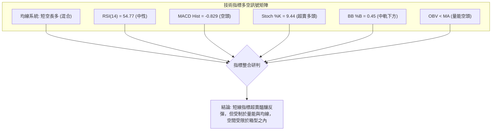

### 📈 移動平均線排列分析

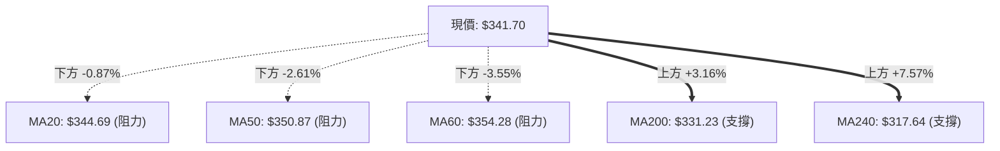

| 均線名稱 | 當前價位 | 乖離率 (Bias) | 排列狀態 | 走勢特徵與實質含義 |
|:---|:---:|:---:|:---:|:---|
| **MA5** | $342.38 | -0.20% | 走平微跌 | 極短線緊貼現價，多空在 $342 展開拉鋸 |
| **MA10** | $346.32 | -1.33% | 下彎壓制 | 短線第一道動態壓制線 |
| **MA20** | $344.69 | -0.87% | 下彎壓制 | 月均線下彎，布林中軌所在，短線偏弱 |
| **MA50** | $350.87 | -2.61% | 下彎壓制 | 季線下行，構成波段反彈主要天花板 |
| **MA60** | $354.28 | -3.55% | 下彎壓制 | 與斐波那契 23.6% ($355.30) 形成強共振阻力帶 |
| **MA120** | $343.62 | -0.56% | 走平微升 | 半年線走平，多空在中長期維度呈現均衡 |
| **MA200** | $331.23 | **+3.16%** | **陡峭向上** | **年線生命線，牛熊分界，提供極強支撐防護** |
| **MA240** | $317.64 | **+7.57%** | **強勁向上** | 長期牛市底線，奠定中長期底部基礎 |

### 📉 RSI(14) 分析

```
RSI(14) 數值儀表板：
0 ══════════ 30 ══════════════ 54.77 ════════════ 70 ══════════ 100
[  極度超賣  ]   [     中性區間    ●     ]   [  極度超買  ]
進度條：██████████████░░░░░░░░░░░░  54.77%
```

- **數值解讀**：當前 RSI(14) 為 **54.77**，處於完全健康的中性震盪區間（30–70）。
- **背離判斷結論**：
  - **頂背離**：無。股價 2026-05 見 $396.81 時 RSI 達 88.0，隨後股價回落，RSI 同步降溫至 50 附近，未出現「價格創高而 RSI 走低」之頂背離。
  - **底背離**：無。2026-07-26 股價下探 $319.09 時 RSI 觸及 26.4，隨後價格反彈，RSI 升至 54.77，指標與價格波動步調一致，**結論為無明顯背離**。

### 📊 MACD(12/26/9) 訊號解讀

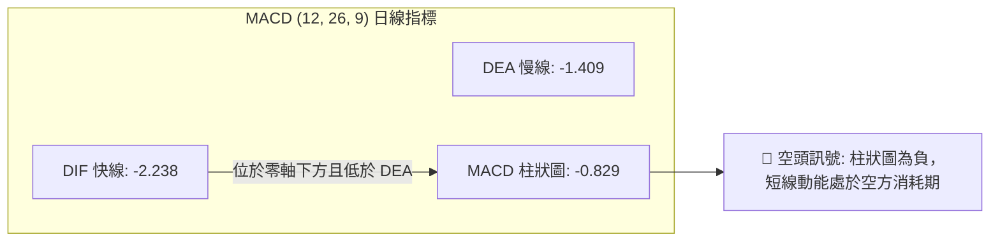

- **週線 MACD 追蹤**：近 4 週 MACD 柱狀圖分別為 `+0.563` (08-02)、`+2.836` (08-09)、`-0.378` (08-16)、`-0.829` (08-23)，顯示多頭反彈在零軸附近受阻，轉為微幅翻黑，短線動能呈現多空拉鋸的震盪收斂。

### 📦 布林通道分析

```
GOOG 日線布林通道 (20, 2) 結構示意圖：
$375.48 ── 上軌 (Upper Band) ═══════════════════════════════
             │
             │
$344.69 ── 中軌 (Middle Band / MA20) ───────────────────────
             │  ◄ 現價: $341.70 (BB %B = 0.45)
             │
$313.90 ── 下軌 (Lower Band) ═══════════════════════════════
```

- **通道特徵**：
  - 上軌：**$375.48** ｜ 中軌：**$344.69** ｜ 下軌：**$313.90** ｜ 帶寬：$61.58 (18.0%)
  - **%B 位置**：**0.45**，位於中軌下方微幅偏弱區域，但遠高於下軌，顯示價格正處於箱型通道內部的自發性波動。
  - **形態解讀**：布林通道上下軌呈現水平收斂走勢，確立當前市場進入典型「布林帶區間震盪」形態。

### 💹 成交量分析（量價配合度與 OBV）

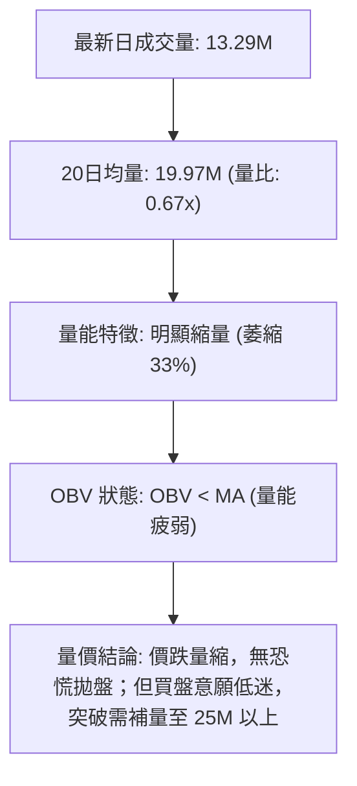

- **量價配合分析**：
  - 現價小幅回落至 $341.70，量能萎縮至 13.29M（相較 50 日均量 21.18M 萎縮 37%），呈現標準「價跌量縮」格局，意味著空方摜壓力道已大幅減弱，非機構主動拋售。
  - **OBV (能量潮指標)**：目前 OBV 處於其均線下方，顯示近期資金呈現微幅淨流出，量能尚不足以支撐單邊向上突破，需等待放量訊號確認。

---

## 6. 動能與波動率

### ⚡ 動能評估四象限

| 象限 | 動能強度 (RSI/MACD) | 波動率水準 (ATR/帶寬) | 當前狀態標記 | 戰略意涵與操作建議 |
|:---|:---:|:---:|:---:|:---|
| **第一象限 (Q1)** | 強動能 (Bullish) | 低波動 (Low Vol) | — | 最佳趨勢單邊加碼點（牛皮慢漲） |
| **第二象限 (Q2)** | **弱動能 (Neutral/Weak)** | **低波動 (Low Vol)** | **✓ (當前定位)** | **動能膠著、波幅收窄，適合區間高拋低吸或觀望** |
| **第三象限 (Q3)** | 強動能 (Strong) | 高波動 (High Vol) | — | 高風險高回報突破行情（順勢追擊） |
| **第四象限 (Q4)** | 弱動能 (Bearish) | 高波動 (High Vol) | — | 恐慌崩跌段（嚴格停損空倉觀望） |

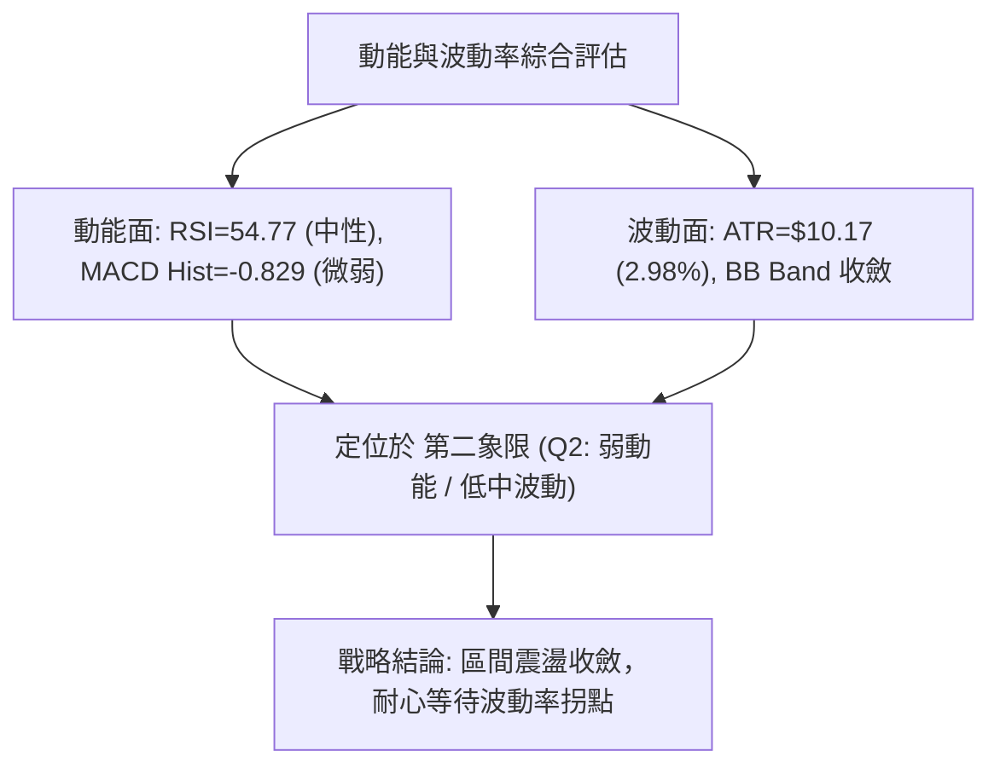

### 📊 ATR 波動率分析

- **ATR(14) 數值**：**$10.17**（佔當前股價 $341.70 之 **2.98%**）。
- **日內/波段波動特性**：GOOG 每日正常波動空間約在 $10 左右。
- **風控與止損設定指導**：
  - **短線交易止損距離**：建議設定 1.0 × ATR = **$10.17**。
  - **波段交易止損距離**：建議設定 1.5 × ATR = **$15.26**。
  - **防洗盤安全緩衝區**：若在 S1 ($333.69) 附近進場，止損點應設於 $333.69 - (1.0 × ATR $10.17) = **$323.52**（緊靠 38.2% 斐波那契位 $325.03 下方），可有效避開日內雜訊。

### 📐 Beta 與市場相關性

- **Beta 係數**：**1.237**（相較於 S&P 500 指數具備 1.24 倍的彈性）。
- **市場特徵解讀**：GOOG 屬於典型的進攻型科技權值股。在美股大盤（S&P 500 / 納斯達克 100）處於上行或反彈週期時，GOOG 具有產生超額 Alpha 收益的潛力；但在大盤震盪盤整時，其波動幅度亦會略大於大盤基準。

---

## 7. 多時框架總結

### 📋 時框架評分表

| 時框架 | 趨勢方向 | 動能狀態 | 均線排列 | 形態結構 | 綜合評分 | 戰略建議 |
|:---|:---:|:---:|:---:|:---:|:---:|:---|
| **長期 (月線)** | 🟢 強勢多頭 | 🟢 充沛 (站穩$340) | 🟢 多頭排列 (MA240強推) | 大級別上升通道 | **85/100** | 長線多單持股續抱 |
| **中期 (週線)** | 🟡 寬幅盤整 | 🟡 中性平衡 | 🟡 糾結 (MA50上/下穿梭) | 高檔收斂箱型 ($319-$396) | **55/100** | 箱型區間低吸高拋 |
| **短期 (日線)** | 🔴 弱勢震盪 | 🔴 空頭微佔優 (KD超賣) | 🔴 短均下彎壓制 (MA20下) | 布林中下軌震盪 | **40/100** | 嚴禁追高，等回踩 S1 |

### 🔲 綜合訊號矩陣

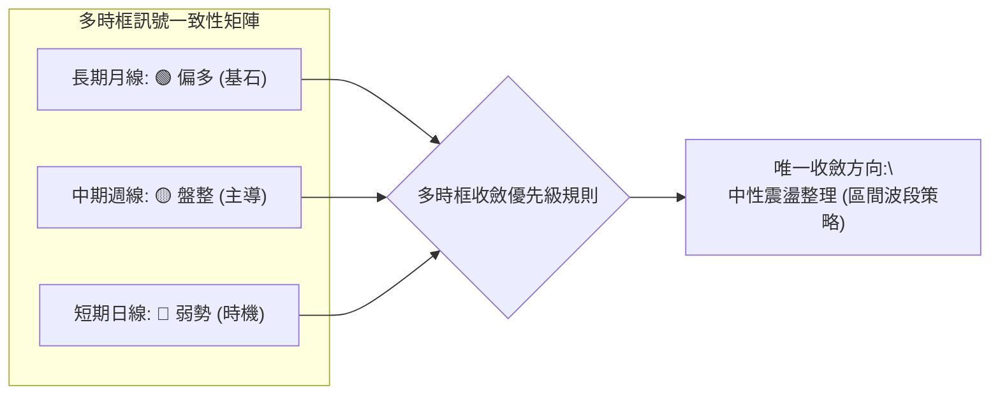

### ⚖️ 多時框收斂結論

依據多時框收斂規則（嚴格要求 14）：
1. **行情性質判定**：當前 ADX(14) = **10.14 (< 25)**，明確確立為**盤整行情（非單邊趨勢）**。
2. **時框主導權**：在盤整行情中，趨勢跟隨無效，**以中期週線箱型（S1 $333.69 ～ R2 $372.95）與日線布林通道（下軌 $313.90 ～ 上軌 $375.48）為主要交易區間**。
3. **矛盾取捨與唯一方向性結論**：
   - 雖然日線均線呈現短空壓制，但長期 MA200 ($331.23) 向上提供強大托底力道，且 Stoch KD 已進入極度超賣區（%K 9.44）。
   - **唯一方向性結論：【中性區間震盪觀望，偏向逢低佈局反彈】**。此結論嚴格與第 1 章評分卡（48/100）及第 8 章主推之「箱型下軌區間波段多頭策略」保持高度一致。

---

## 8. 交易策略建議

### 🗺️ 策略決策流程圖

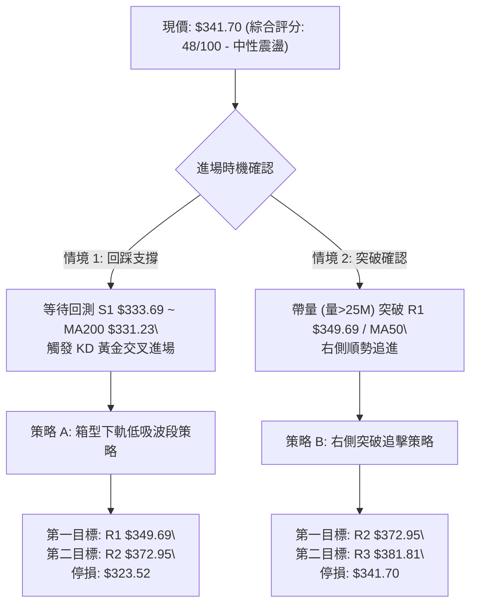

### 🧭 策略路由（依評分卡分流）

> **當前主策略方向 = 【中性區間操作 / 逢低做多】（依技術評分 48/100 確立為區間震盪，主推箱型下緣支撐低吸策略）**

### 🎯 價格情境階梯（Price Scenarios）

價位嚴格引用自第 4 章計算之波段價位：

| 觸發條件 | 當前階段目標 | 後續延伸目標 | 情境含義與操作指引 |
|:---|:---:|:---:|:---|
| **帶量突破 R1 $349.69** | **R2 $372.95** | **R3 $381.81** | 短線轉強，突破 MA50 壓制，展開箱型上軌衝擊波 |
| **守穩現價 $341.70 / S1** | **R1 $349.69** | **BB中軌 $344.69** | 區間正常震盪，KD 低檔金叉引發技術性修復 |
| **有效跌破 S1 $333.69** | **S2 $312.69** | **S3 $295.78** | 中期走弱，跌破年線，下探布林下軌及斐波那契 50% |

### 📊 情境機率分佈

```
情境機率分佈圖：
區間震盪整理 (55%) ▓▓▓▓▓▓▓▓▓▓▓▓▓▓▓▓▓▓▓▓▓▓▓▓▓▓▓
向上反彈突破 (30%) ▓▓▓▓▓▓▓▓▓▓▓▓▓▓█
向下跌破探底 (15%) ▓▓▓▓▓▓█
```

| 情境分類 | 機率預估 | 主要技術指標依據 |
|:---|:---:|:---|
| **區間震盪整理** | **55%** | ADX(14)=10.14 處極低水準，布林帶寬收窄，成交量比 0.67x 嚴重萎縮 |
| **向上反彈/突破** | **30%** | Stoch %K=9.44 進入極度超賣區，MA200 ($331.23) 具備強大托底支撐 |
| **破位下跌探底** | **15%** | 日線 MACD 柱狀圖仍為負值 (-0.829)，-DI (26.41) 略高於 +DI |

### 🟢 主策略詳情

本報告主推兩套嚴謹之量化交易策略，所有點位精確計算至小數點：

| 策略要素 | 策略 A（左側：箱型下軌低吸策略） | 策略 B（右側：突破 R1 追擊策略） |
|:---|:---|:---|
| **適用場景** | 股價回踩支撐位止跌時分批進場 | 帶量突破短期壓力均線確認轉強 |
| **進場條件** | 回踩 S1 附近出現 15分/60分 K線底背離 | 日線收盤價帶量（>22M）突破 R1 |
| **進場價格** | **$334.00**（S1 $333.69 支撐上方） | **$350.50**（突破 R1 $349.69 確認） |
| **止損價格** | **$323.52**（S1 下方 1.0×ATR 防守點） | **$341.70**（現價 / 原突破起漲點） |
| **第一目標價 (T1)** | **$349.69**（阻力位 R1 / MA50 處） | **$372.95**（箱型上軌阻力 R2） |
| **第二目標價 (T2)** | **$372.95**（阻力位 R2，盈虧比極佳） | **$381.81**（波段阻力 R3 / 前高） |
| **風險空間 (Risk)** | $10.48 / 股 (3.14%) | $8.80 / 股 (2.51%) |
| **報酬空間 (Reward T1)** | $15.69 / 股 (4.70%) | $22.45 / 股 (6.41%) |
| **報酬空間 (Reward T2)** | $38.95 / 股 (11.66%) | $31.31 / 股 (8.93%) |
| **風險報酬比 (R:R)** | **1 : 1.50 (至T1) / 1 : 3.72 (至T2)** | **1 : 2.55 (至T1) / 1 : 3.56 (至T2)** |
| **預估勝率** | **65%** | **55%** |
| **建議總倉位** | **15% - 20%**（分兩批佈局） | **10% - 15%**（突破確認後建倉） |

### 🔴 反向風險觸發點（對沖與風控提示）

若發生以下任一信號，代表箱型支撐失效，必須無條件終止多頭策略並執行風控避險：
1. **跌破核心止損線**：日線收盤價**實體跌破 $331.23 (MA200)** 或觸及止損價 **$323.52**。
2. **放量破位**：單日成交量放大至 **25,000,000 股以上**且收於 S1 ($333.69) 下方。
3. **對沖建議**：跌破 $331.23 後，可利用反向衍生品或將倉位降至 5% 以下，下一接刀點退守 S2 **$312.69** 與 50% 斐波那契位 **$300.56**。

### ⭐ 整體訊號強度評星

```
╔════════════════════════════════════════════════╗
║ 做多訊號強度：★★★☆☆  (3.2/5星 - 超賣反彈格局) ║
║ 做空訊號強度：★★☆☆☆  (2.1/5星 - 受制年線支撐) ║
║ 整體可信度：  ★★★★☆  (4.0/5星 - 箱型結構清晰) ║
╚════════════════════════════════════════════════╝
```

---

## 9. 風險提示與監控

### ✅ 關鍵監控指標 Checklist

```
╔══════════════════════════════════════════════════════════════════╗
║                   GOOG 關鍵技術監控清單 (Checklist)              ║
╠══════════════════════════════════════════════════════════════════╣
║ [ ] 價位監控：現價 $341.70 是否能守穩 S1 $333.69 與 MA200 $331.23  ║
║ [ ] 阻力突破：日線是否帶量突破 MA50 ($350.87) 與 R1 $349.69       ║
║ [ ] 動能翻轉：MACD 日線柱狀圖何時由負轉正 (當前 -0.829)         ║
║ [ ] 擺動指標：Stoch %K 是否自超賣區 (<10) 向上金叉 %D 形成買訊   ║
║ [ ] 量能異動：日成交量是否放大突破 20日均量 (19.97M) 之 1.2倍     ║
║ [ ] 趨勢甦醒：ADX(14) 是否由 10.14 向上拐頭突破 20 啟動單邊行情  ║
╚══════════════════════════════════════════════════════════════════╝
```

### ⚠️ 風險場景分析

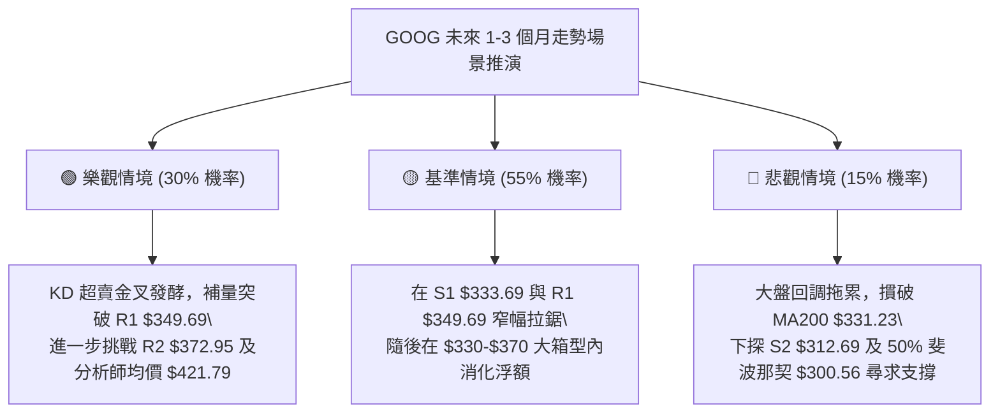

### 🛡️ 風險管理重要提醒

1. **資金控管規範**：在當前 ADX = 10.14 的無趨勢盤整市中，**總持倉部位不宜超過總資金的 30%**，單筆交易最大虧損金額應嚴格限制在總資產的 1.0% 以內。
2. **避免追高殺跌**：均線目前呈糾結狀態，任何在阻力位 R1 ($349.69) / R2 ($372.95) 附近的追高買單，均極易遭遇假突破回洗；交易應堅持「買在支撐 S1、賣在阻力 R2」之紀律。
3. **事件與大盤聯動**：GOOG 具備 Beta 1.237 特性，需密切關注大盤整體科技權值股之資金流向，若那斯達克指數出現破位，應優先下調策略目標價。

---

## 📋 報告總結

```
╔══════════════════════════════════════════════════════════════════╗
║                   GOOG 技術分析報告總結                          ║
╠══════════════════════════════════════════════════════════════════╣
║ 報告日期：2026-08-19                                             ║
║ 當前價格：$341.70                                                ║
║ 技術評分：48/100 (██████████░░░░░░░░░░)                          ║
║ 分析評級：⚖️ 中性區間震盪整理 (Hold / Range Trade)              ║
╠══════════════════════════════════════════════════════════════════╣
║ 關鍵結論：                                                       ║
║ ├─ 長期趨勢：🟢 強勢多頭 (MA200 $331.23 與 MA240 $317.64 向上)  ║
║ ├─ 中期趨勢：🟡 寬幅箱型震盪 ($319.09 - $372.95 區間收斂)        ║
║ ├─ 短期趨勢：🔴 偏弱整理但 KD 處於 9.44 極度超賣區，醞釀反彈    ║
║ ├─ 關鍵支撐：S1: $333.69 ｜ S2: $312.69 ｜ S3: $295.78          ║
║ ├─ 關鍵阻力：R1: $349.69 ｜ R2: $372.95 ｜ R3: $381.81          ║
║ └─ 法人共識：14位分析師 Strong Buy，平均目標價 $421.79          ║
╠══════════════════════════════════════════════════════════════════╣
║ 最優策略組合：                                                   ║
║ 1. 🥇 最佳機會（策略 A）：回測 S1 $334.00 低吸，止損 $323.52，   ║
║                          目標 T1 $349.69 / T2 $372.95 (R:R 3.72) ║
║ 2. 🥈 次選機會（策略 B）：右側帶量突破 R1 $350.50 順勢追進，      ║
║                          止損 $341.70，目標 $372.95 (R:R 2.55)   ║
║ 3. 🥉 保守選擇：空倉觀望，等待 ADX 突破 20 或布林帶明顯開口擴張 ║
╚══════════════════════════════════════════════════════════════════╝
```

---

> ⚠️ **免責聲明**：本報告為技術分析研究成果，所有數據、圖表及計算模型均基於歷史 OHLCV 行情資訊進行量化推演。本報告**僅供研究與學術參考**，**不構成任何形式的要約、招攬或投資操作建議**。金融市場存在高度波動風險，投資人應依個人財務狀況與風險承受度獨立判斷，盈虧自負。

---

*報告生成時間：2026-08-19 ｜ 數據來源：Yahoo Finance ｜ 分析框架：資深多時框量化技術分析系統*