# GOOG 技術分析報告

> **報告日期**：2026-08-20 ｜ **語言**：繁體中文 ｜ **數據來源**：Yahoo Finance ｜ **當前價格**：$338.20

---

## 目錄

| 章節 | 內容 |
|------|------|
| [1. 技術面概覽](#1-技術面概覽) | 訊號儀表板、核心指標、評分卡 |
| [2. 趨勢分析](#2-趨勢分析) | 多時框趨勢、長中短期走勢、ADX解讀 |
| [3. 圖表形態分析](#3-圖表形態分析) | 形態識別、K線組合、形態目標價 |
| [4. 支撐與阻力](#4-支撐與阻力) | 關鍵價位分佈、斐波那契回調結構 |
| [5. 技術指標深度解讀](#5-技術指標深度解讀) | MA/RSI/MACD/布林通道/成交量 |
| [6. 動能與波動率](#6-動能與波動率) | 動能四象限、ATR、Beta 相關性 |
| [7. 多時框架總結](#7-多時框架總結) | 時框架評分矩陣與多時框收斂 |
| [8. 交易策略建議](#8-交易策略建議) | 策略路由、價格情境、主策略詳情 |
| [9. 風險提示與監控](#9-風險提示與監控) | 監控指標、風險場景、部位管理 |

---

## 1. 技術面概覽

### 🎯 技術訊號儀表板

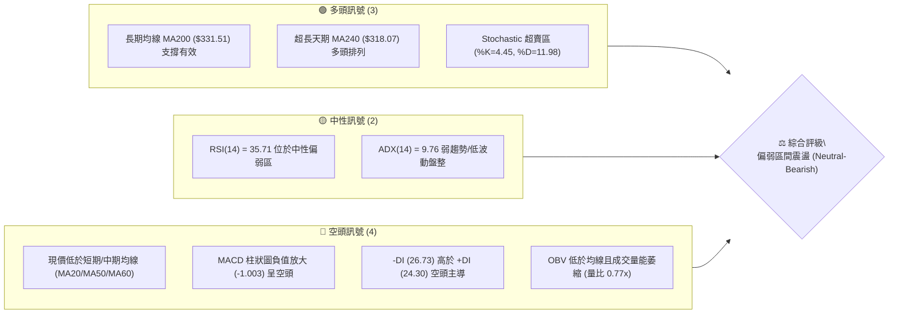

### 📊 核心指標速覽表

| 指標類別 | 指標名稱 | 當前數值 | 訊號 | 解讀 |
|:---|:---|:---|:---:|:---|
| **價格** | 當前收盤價 | $338.20 | 🟡 | 位於52週區間 ($196.90 - $404.23) 之 68.2% 分位 |
| **均線** | MA20 (月線) | $345.69 | 🔴 | 現價低於 MA20 (-2.17%)，短期均線下彎形成動態阻力 |
| **均線** | MA50 (季線) | $350.39 | 🔴 | 現價低於 MA50 (-3.48%)，中期結構處於修正整理期 |
| **均線** | MA200 (年線) | $331.51 | 🟢 | 現價高於 MA200 (+2.02%)，長期多頭基底尚未被破壞 |
| **動能** | RSI(14) | 35.71 | 🟡 | 位於 30-70 中性區間下緣，接近超賣但尚未形成底背離 |
| **動能** | MACD (12,26,9) | -2.664 / -1.660 | 🔴 | DIF 線低於 Signal 線，MACD 柱狀圖 -1.003 延續綠柱 |
| **動能** | Stoch %K / %D | 4.45 / 11.98 | 🟢 | 深度超賣，短線技術性反彈動能正在積聚 |
| **趨勢** | ADX(14) / DMI | 9.76 / -DI>+DI | 🔴 | ADX<25 顯示無顯著單邊趨勢，-DI(26.73) 壓制 +DI(24.30) |
| **通道** | 布林通道 %B | 0.37 | 🟡 | 位於下軌 ($317.29) 與中軌 ($345.69) 之間震盪偏弱 |
| **波動** | ATR(14) | $8.77 | 🟡 | 佔現價 2.59%，波動率溫和收窄，市場處於消化期 |
| **量能** | 當日量 / 20日均量 | 14.17M / 18.34M | 🔴 | 量比 0.77x，OBV 低於均線，買盤追價意願不足 |

### 🏆 技術評分卡

```
╔══════════════════════════════════════════════════════════════════╗
║                  技術評分卡 — GOOG (2026-08-20)                  ║
╠══════════════════════════════════════════════════════════════════╣
║ 趨勢強度 (ADX/DMI)  ██████░░░░░░░░░░░░░░  30/100  🔴 弱勢空方主導   ║
║ 動能指標 (RSI/MACD) ████████░░░░░░░░░░░░  40/100  🔴 負向動能延續   ║
║ 支撐穩定度 (S1-S3)  ██████████████░░░░░░  70/100  🟢 MA200/S1 有效 ║
║ 成交量配合 (OBV/VOL)████████░░░░░░░░░░░░  40/100  🔴 縮量整理偏弱   ║
║ 形態完整度 (區間結構)████████████░░░░░░░░  60/100  🟡 矩形整理震盪   ║
║ 均線排列 (MA5-MA240)██████████░░░░░░░░░░  50/100  🟡 短空長多糾結   ║
╠══════════════════════════════════════════════════════════════════╣
║ 綜合評分            █████████░░░░░░░░░░░  48/100  🟡 中性偏弱 (區間)║
╚══════════════════════════════════════════════════════════════════╝
```

---

## 2. 趨勢分析

### 🌐 多時框趨勢分析

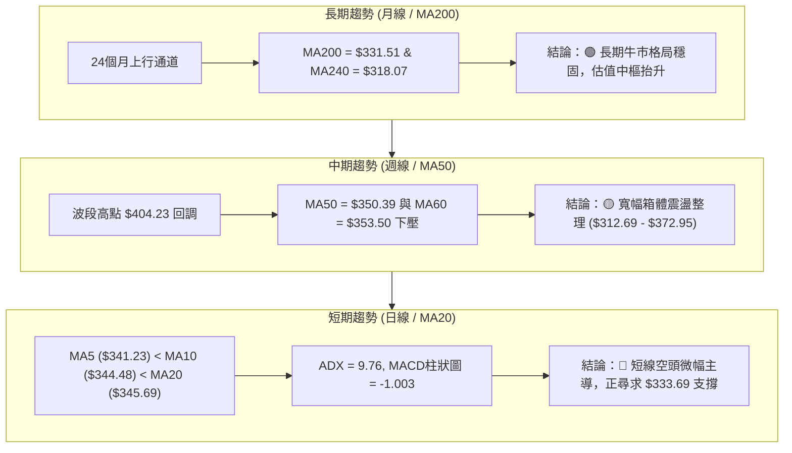

### 📈 長期趨勢 — 12個月走勢圖（Unicode）

```
GOOG 月線收盤走勢圖（過去12個月：2025-08 至 2026-08）
價格軸 ($)
$400 ┤                                              
$380 ┤                                  ●(04月 $381.71)
$360 ┤                                      ●     ●
$340 ┤                          ●               ●   ●←現在($338.20)
$320 ┤                  ●   ●       ●
$300 ┤                                  ●
$280 ┤              ●
$260 ┤                                      
$240 ┤          ●
$220 ┤      ●
$200 ┤  ●(08月 $212.92)
     └────────────────────────────────────────────────────────
       08  09  10  11  12  01  02  03  04  05  06  07  08
```

#### 走勢特徵分析表格

| 階段區間 | 起止價格 | 漲跌幅 | 走勢特徵描述 | 量能配合狀況 |
|:---|:---|:---:|:---|:---|
| **第一階段：主升浪爆發**<br>(2025-08 ~ 2025-11) | $212.92 → $319.49 | +50.05% | 連續4個月大陽線放量突破，突破前高邁入 $300 大關 | 量能逐月遞增，機構買盤持續推升 |
| **第二階段：高檔震盪回洗**<br>(2025-12 ~ 2026-03) | $313.39 → $286.69 | -8.52% | 衝高 $338.09 後拉回洗盤，最低探至 $286.69 獲利了結 | 成交量縮減，呈現良性技術回調 |
| **第三階段：次波衝頂暴漲**<br>(2026-04 ~ 2026-05) | $286.69 → $381.71 | +33.14% | 單月狂飆近百點，創歷史新高 $404.23（收盤 $381.71） | 週量爆發至 1.3 億股以上，動能極度充沛 |
| **第四階段：頂部收斂整理**<br>(2026-06 ~ 2026-08) | $353.33 → $338.20 | -4.28% | 高檔獲利回吐，價格跌破月線並於 $330-$360 間震盪整理 | 量能萎縮（週量降至 54M-72M），市場觀望 |

### 📊 中期趨勢（週線分析）

```
近期週線支撐阻力結構示意圖：
$404.23 ─── 52週歷史最高點 ────────────────────────────── (主要阻力頂)
           │
$372.95 ─── 近期波段高點阻力聚類 (R3) / 布林上軌 $374.09 
           │
$355.30 ─── 斐波那契 23.6% 回調位 / MA50 ($350.39) ── (中軌壓力帶)
           │
$338.20 ───【當前價格位置】
           │
$333.69 ─── 近期波段支撐聚類 (S1) / MA200 ($331.51) ── (短期防守底)
           │
$312.69 ─── 強波段支撐 (S2) / 布林下軌 ($317.29) ────── (強烈支撐底)
```

### ⚡ 趨勢強度評估（ADX 解讀）

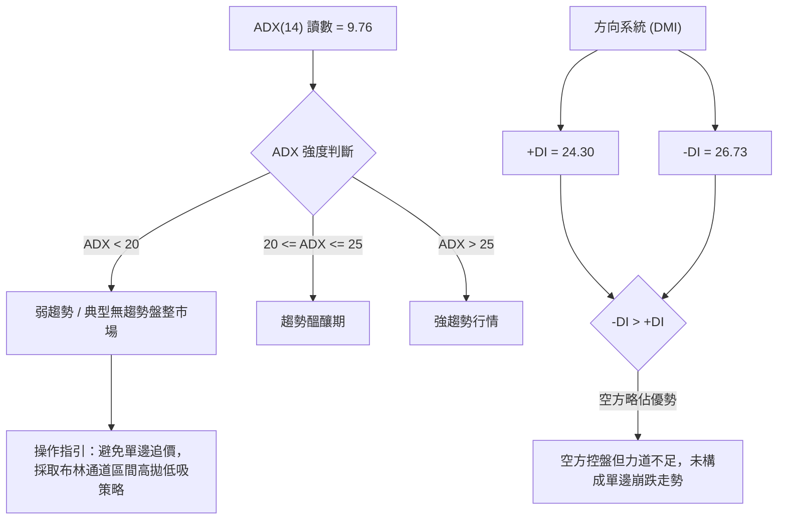

#### ADX 強度與操作模式對照表

| 指標變數 | 數值 | 狀態評估 | 技術意義與操作指引 |
|:---|:---:|:---:|:---|
| **ADX (14)** | 9.76 | 極弱/無方向 | 趨勢指標鈍化，單邊突破失敗率極高，屬於典型的**通道內震盪格局**。 |
| **+DI (14)** | 24.30 | 多方動能弱 | 多頭買盤力道收斂，難以發動連續向上推升。 |
| **-DI (14)** | 26.73 | 空方動能微強 | 空頭稍佔上風，但數值未拉開顯著差距（差距僅 2.43），不具備強烈趨勢攻擊力。 |
| **收斂結論** | 盤整模式 | 依規則 14 | 因 ADX < 25，交易策略以**日線布林通道上下軌與關鍵支撐阻力區間**為主。 |

---

## 3. 圖表形態分析

### 🔍 形態識別系統

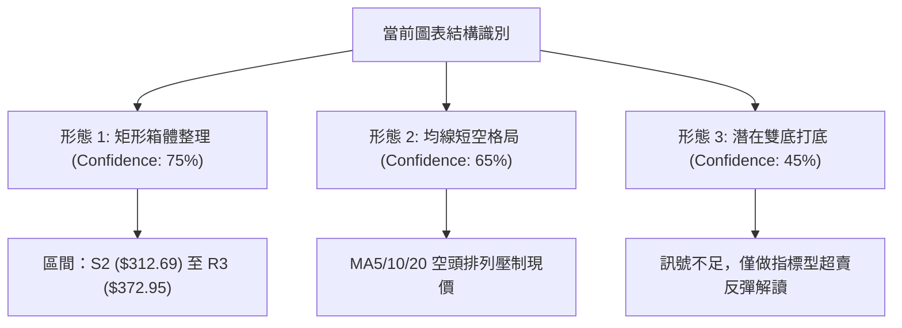

#### 形態識別信心度與評估表

| 形態名稱 | 信心度 | 判斷依據（數據引用） | 完成度 | 目標價（附嚴謹計算式） | 訊號狀態 |
|:---|:---:|:---|:---:|:---|:---:|
| **矩形箱體震盪** | **75%** | 上軌阻力 R3 ($372.95) 與下軌支撐 S2 ($312.69) 經過多次確認 | 80% | 區間震盪目標：下軌支撐 **$312.69** / 上軌阻力 **$372.95** | 🟡 進行中 |
| **短期均線壓制** | **65%** | MA5 ($341.23) < MA10 ($344.48) < MA20 ($345.69)，且現價位於均線下方 | 85% | 短線下探目標：支撐 S1 **$333.69** | 🔴 空頭壓制 |
| **潛在雙底反彈** | **45%** | 兩次低點探至 2026-06-28 ($334.69) 及 2026-07-26 ($319.09) | 40% | 依規則 15：**信心度 < 50%，訊號不足，僅做指標型解讀，不預設目標價** | ⚪ 形態未確認 |

### 🕯️ 重要K線形態分析（近 8 週走勢）

| 週別時間 | 收盤價 ($) | 週成交量 | K線形態特徵 | 技術解讀 | 訊號 |
|:---|:---:|:---:|:---|:---|:---:|
| **2026-07-05** | 356.18 | 81,923,800 | 止跌大陽線 | 自低檔反彈，突破短期壓制，MACD柱轉正 (+0.188) | 🟢 多頭反撲 |
| **2026-07-12** | 355.03 | 82,642,900 | 窄幅十字星 | 多空拉鋸，於 MA20 附近猶豫，量能持平 | 🟡 中性整理 |
| **2026-07-19** | 346.12 | 87,721,900 | 轉折陰線 | 遭遇 23.6% 斐波位 ($355.30) 壓制回落，RSI 升至 56.2 後受阻 | 🔴 漲勢受阻 |
| **2026-07-26** | 319.09 | 122,279,300 | 破位長黑K | 放量下殺測試布林下軌及 S2 ($312.69)，RSI 跌至 26.4 進入超賣 | 🔴 空頭宣洩 |
| **2026-08-02** | 356.65 | 110,473,400 | 強力破底翻陽線 | 迅速收復跌幅，帶量站回 $350，空頭陷阱特徵明顯 | 🟢 強力反彈 |
| **2026-08-09** | 353.47 | 107,615,100 | 高檔長上影線 | 上攻 R2 ($349.69) 及 $355 未果，上方套牢賣壓沉重 | 🟡 追價無力 |
| **2026-08-16** | 343.54 | 72,733,100 | 回落中陰線 | 縮量跌破 MA20 ($345.69)，MACD 柱狀圖翻負 (-0.378) | 🔴 短線轉弱 |
| **2026-08-23** | 338.20 | 54,386,262 | 縮量下探小陰線 | 測試 S1 ($333.69) 與 MA200 ($331.51)，量能降至 54M 極度萎縮 | 🟡 尋求支撐 |

### 📉 ASCII 走勢形態示意圖

```
箱體震盪結構 ($312.69 - $372.95) 與近期回調示意圖：
$372.95 ┼─────────────────── 頂部阻力 R3 (高點聚類) ─────────────────────
        │                   ╭─╮
        │     ╭╮           │ │
$355.30 ┼─────││───────────│─│──── 23.6% 斐波那契壓力 ────────────────
        │     ││   ╭─╮     │ │
$345.69 ┼─────││───│─│─────│─│──── MA20 中軌壓力 ────────────────────
        │     ││   │ │ ╭╮  │ │ ╭╮
$338.20 ┼─────││───│─│─││──│─│─││─【現價 $338.20】──────────────────
        │     ││   │ │ ││  │ │ ││ 
$333.69 ┼─────││───│─│─││──│─│─││── 近期波段支撐 S1 / MA200 ($331.51) ──
        │     │╰───╯ │ ││  │ │ ││
$312.69 ┼────────────╰─╯───┴─┴─┴┴── 箱體底部強支撐 S2 ──────────────────
        └─────────────────────────────────────────────────────────────
```

### 🎯 形態目標價計算

根據已確認之**矩形箱體震盪形態**：
1. **箱體上限（阻力線）**：$372.95 (R3)
2. **箱體下限（支撐線）**：$312.69 (S2)
3. **箱體垂直高度**：
   $$\text{形態高度} = \$372.95 - \$312.69 = \$60.26$$
4. **目標價推算**：
   - **震盪區間內目標 1（向上回測中軌）**：MA20 / R2 = **$345.69 ~ $349.69**
   - **震盪區間內目標 2（向上回測箱頂）**：R3 = **$372.95**
   - **向下回測支撐目標**：支撐位 S1 = **$333.69**，若失守則為箱底 S2 = **$312.69**

---

## 4. 支撐與阻力

### 🗺️ 關鍵價位分布圖（Unicode）

```
GOOG 價位結構分布圖
═══════════════════════════════════════════════════════════════════
$404.23 ║██████████████████████████████║ 52週歷史高點 (0.0% 斐波回調)
$372.95 ║████████████████████████      ║ 強阻力 R3 (波段高點聚類)
$355.30 ║██████████████████            ║ 斐波那契 23.6% / MA50 ($350.39)
$349.69 ║██████████████                ║ 阻力 R2 (波段高點聚類)
$340.75 ║██████████                    ║ 關鍵阻力 R1 (+0.76% from price)
$338.20 ╠══════════════════════════════╣ ◄ 現價 $338.20 (52W區間 68.2%)
$333.69 ║▓▓▓▓▓▓▓▓▓▓▓▓▓▓▓▓              ║ 近期支撐 S1 (-1.33% from price)
$331.51 ║▓▓▓▓▓▓▓▓▓▓▓▓▓▓▓▓▓▓            ║ 長期均線 MA200
$325.03 ║▓▓▓▓▓▓▓▓▓▓▓▓▓▓▓▓▓▓▓▓          ║ 斐波那契 38.2% 回調位
$312.69 ║████████████████████████      ║ 強支撐 S2 (波段低點聚類)
$300.56 ║██████████████████████████    ║ 斐波那契 50.0% / 整數大關
$295.78 ║████████████████████████████  ║ 極強支撐 S3 (波段低點聚類)
═══════════════════════════════════════════════════════════════════
```

### 🚧 阻力位分析表

| 阻力級別 | 價位 ($) | 與現價差距 | 形成原因與技術共振 | 突破難度 | 重要性評級 |
|:---|:---:|:---:|:---|:---:|:---:|
| **R1** | **$340.75** | +0.76% | 近期日線反彈高點聚類，與 MA5 ($341.23) 形成短線共振壓制 | 🟡 中等 | ★★★☆☆ |
| **R2** | **$349.69** | +3.40% | 近一年波段高點聚類，與 MA50 ($350.39) 及 MA20 ($345.69) 構成密集籌碼套牢區 | 🔴 較高 | ★★★★☆ |
| **R3** | **$372.95** | +10.27% | 歷史次高點聚類，接近布林通道上軌 ($374.09)，為中期箱體頂部邊界 | 🔴 極高 | ★★★★★ |

### 🛡️ 支撐位分析表

| 支撐級別 | 價位 ($) | 與現價差距 | 形成原因與技術共振 | 守住機率 | 重要性評級 |
|:---|:---:|:---:|:---|:---:|:---:|
| **S1** | **$333.69** | -1.33% | 近一年波段低點聚類，緊鄰 MA200 ($331.51) 年線生命線 | 🟢 75% | ★★★★☆ |
| **S2** | **$312.69** | -7.54% | 2026-07-26 破底翻之關鍵低點聚類，與布林下軌 ($317.29) 共振 | 🟢 85% | ★★★★★ |
| **S3** | **$295.78** | -12.54% | 2026年首季起漲點密集聚類，逼近 50.0% 斐波那契回調位 ($300.56) | 🟢 95% | ★★★★★ |

### 📐 斐波那契回調位分析（52週基準：$196.90 → $404.23）

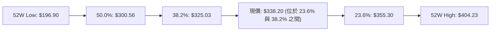

#### 斐波那契回調位解讀

- **0.0% ($404.23)**：52週歷史高點，目前回調幅度為 16.33%。
- **23.6% ($355.30)**：當前最直接的上行反壓位。現價 ($338.20) 處於 23.6% 之下，顯示強勢多頭格局已暫時轉為深度修正。
- **當前價格區間解讀**：現價落於 **$325.03 (38.2%)** 與 **$355.30 (23.6%)** 之間。38.2% 回調位是典型強勢回調的極限支撐，配合 S1 ($333.69) 與 MA200 ($331.51)，構築了極其堅固的防守多頭防線。
- **50.0% ($300.56)** 與 **61.8% ($276.10)**：多頭長期趨勢的生死線，目前股價距離甚遠，長期結構健康。

---

## 5. 技術指標深度解讀

### 🎛️ 指標訊號總覽

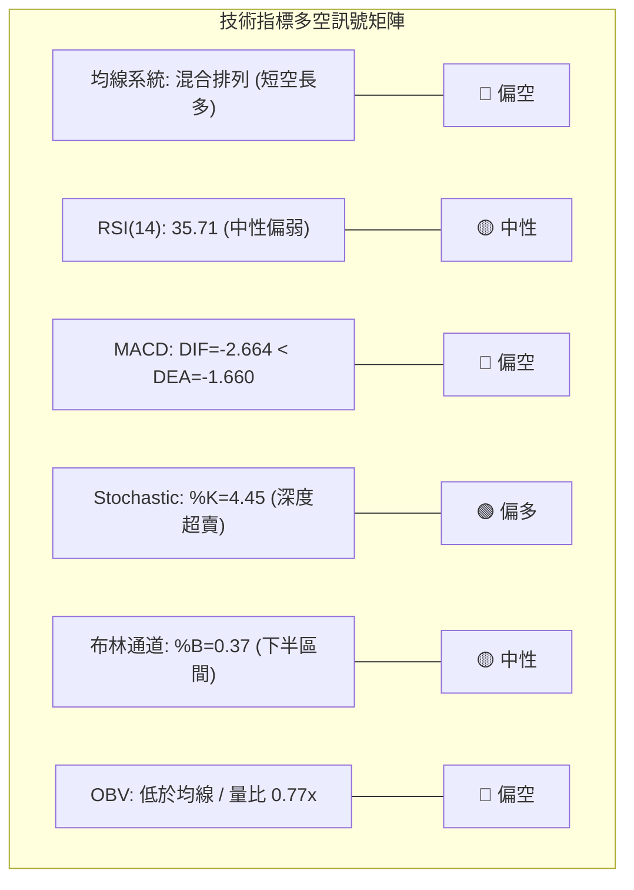

### 📈 移動平均線排列分析

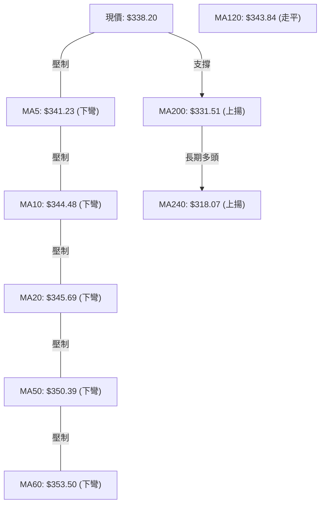

#### 均線系統詳細參數與趨勢狀態

| 均線名稱 | 當前數值 ($) | 與現價價差 | 乖離率 (%) | 均線走勢形態 | 狀態解讀 |
|:---|:---:|:---:|:---:|:---|:---|
| **MA5** | 341.23 | -$3.03 | -0.89% | █▇▇▇▇▇▇▆▅▄▂▁ (下彎) | 超短期下壓，短線壓制明顯 |
| **MA10** | 344.48 | -$6.28 | -1.82% | ▇██████▇▆▅▄▃▂ (下彎) | 短期反彈第一道動態阻力 |
| **MA20** | 345.69 | -$7.49 | -2.17% | █████▇▇▇▆▅▅▄▄ (下彎) | 月線阻力，站穩方能化解短空格局 |
| **MA50** | 350.39 | -$12.19 | -3.48% | 季線阻力帶，中期多空分水嶺 | 中期趨勢轉入調整 |
| **MA60** | 353.50 | -$15.30 | -4.33% | ▇▇██████████▇▇ (下彎) | 波段重壓區 |
| **MA120** | 343.84 | -$5.64 | -1.64% | ▁▁▁▂▂▂▂▂▂▂▂▂▂ (走平) | 半年線糾結 |
| **MA200** | 331.51 | +$6.69 | +2.02% | 長期上揚生命線 | **牛熊分界線，提供強大下檔支撐** |
| **MA240** | 318.07 | +$20.13 | +6.33% | ▁▁▁▁▂▂▂▃▃▃▃▄ (持續上揚) | 超長期牛市基底完好無損 |

### 📉 RSI(14) 分析

```
RSI(14) 數值儀表：
0 ────── 超賣(30) ────────── 當前(35.71) ────────── 超買(70) ────── 100
[░░░░░░░░░░░░░░░░░░░░░░░░░░░░▓▓▓▓▓▓░░░░░░░░░░░░░░░░░░░░░░░░░░░░░░░░░░░░░]
強度進度條：███████░░░░░░░░░░░░░ 35.71%
```

- **超買超賣評估**：RSI(14) 目前讀數為 **35.71**，處於 30-70 中性偏弱區，距離 30 超賣線僅一步之遙，顯示短期賣壓已宣洩大半，下行動能減速。
- **背離判斷結論**：
  - 現價自前高 $356.65 回落至 $338.20，RSI 由 52.4 同步滑落至 35.71。
  - 價格低點與指標低點同步下移，**明確判斷：目前無頂背離，亦無底背離跡象**，指標忠實反映價格震盪回調。

### 📊 MACD(12,26,9) 訊號解讀

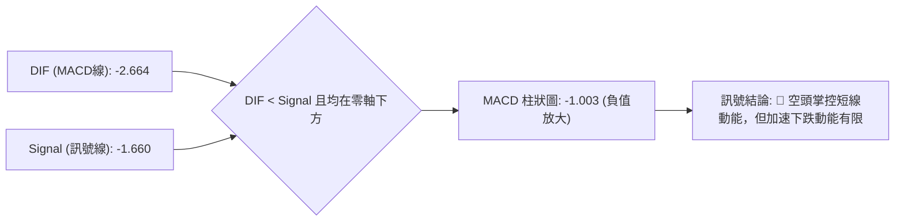

- **指標讀數**：DIF = **-2.664**，Signal = **-1.660**，柱狀圖 = **-1.003**。
- **解讀**：雙線位於零軸下方形成死叉，柱狀圖呈現綠柱放大，代表空頭短期佔優。然而，負值絕對值較小（僅 -1.003），並非暴跌型空頭主升段，更多反映的是無量陰跌。

### 📦 布林通道分析 (20, 2)

```
GOOG 布林通道示意圖 ($317.29 - $374.09)：
$374.09 ────────────────────── 布林上軌 (Upper Band)
        │
$345.69 ────────────────────── 布林中軌 (MA20) 
        │      
$338.20 ──────【現價位置 %B = 0.37】
        │
$317.29 ────────────────────── 布林下軌 (Lower Band)
```

- **帶寬與位置**：通道上限 **$374.09**，中軌 **$345.69**，下軌 **$317.29**。
- **%B 指標值**：$$\%B = \frac{338.20 - 317.29}{374.09 - 317.29} = \frac{20.91}{56.80} = 0.368 \approx 0.37$$
- **技術含義**：%B = 0.37 表示現價處於下半通道，通道未見喇叭口劇烈擴張，呈現水平收斂走勢，預示股價將在下軌 $317.29 至中軌 $345.69 之間尋求平衡。

### 💹 成交量分析（量價配合度）

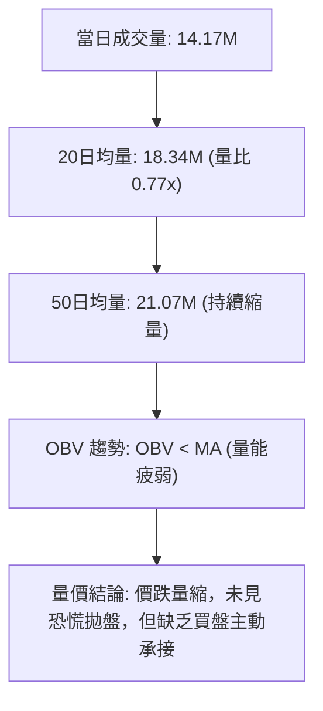

- **量能評估**：當日成交量 14,165,362 股，僅為 20 日均量的 77%，週成交量亦由 5 月份高峰的 1.3 億股驟降至 5,438 萬股。
- **OBV 分析**：OBV 指標持續低於其移動平均線，量價呈「價跌量縮」格局。這表明當前下跌為獲利盤回吐與場內觀望所致，無主力資金大規模出逃跡象，但也暗示短期內難以出現強勁的 V 型反轉。

---

## 6. 動能與波動率

### ⚡ 動能評估四象限

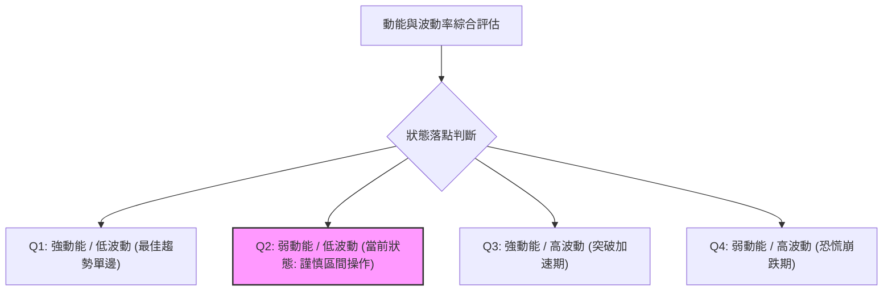

#### 動能與波動率象限分析表

| 象限代號 | 動能維度 | 波動維度 | 當前狀態標記 | 評估與市場特徵 |
|:---:|:---:|:---:|:---:|:---|
| **Q1** | 強 (ADX>25) | 低 (ATR%<2%) | — | 強勢單邊爬升，最適宜持股續抱。 |
| **Q2** | **弱 (ADX=9.76)** | **低 (ATR%=2.59%)** | **✓ (當前所處象限)** | **窄幅波動、無量盤整、動能疲弱，宜採區間高拋低吸或觀望。** |
| **Q3** | 強 (ADX>25) | 高 (ATR%>3.5%) | — | 暴量突破或主升浪，波動極大。 |
| **Q4** | 弱 (ADX<25) | 高 (ATR%>3.5%) | — | 恐慌性劇烈洗盤，風險收益比差。 |

### 📊 ATR 波動率分析

- **ATR(14) 數值**：**$8.77**（佔現價 $338.20 之 **2.59%**）。
- **日內波動區間預測**：典型單日波動區間約為 $\pm \$8.77$（當日預估波動範圍：$329.43 ~ $346.97）。
- **止損距離建議**：
  - **保守型交易（2.0 倍 ATR）**：止損幅度設為 $\$8.77 \times 2.0 = \$17.54$。
  - **進取型交易（1.5 倍 ATR）**：止損幅度設為 $\$8.77 \times 1.5 = \$13.16$。
  - **緊密型短線（1.0 倍 ATR）**：止損幅度設為 $\$8.77 \times 1.0 = \$8.77$。

### 📐 Beta 與市場相關性

- **Beta 係數**：**1.237**。
- **市場特徵解讀**：Beta 高於 1.0，表明 GOOG 相較於標普 500 指數具備更高的彈性與波動敏感度。當大盤反彈時，GOOG 預期將展現 1.24 倍的進攻彈性；反之在大盤回調時亦承擔放大之系統性風險。目前 Short Ratio 僅 2.35，空頭未見異常集結，賣壓主要源於市場自然調節。

---

## 7. 多時框架總結

### 📋 時框架評分表

| 時框架 | 趨勢方向 | 動能指標 | 均線排列 | 圖表形態 | 綜合評分 | 操作建議 |
|:---|:---:|:---:|:---:|:---:|:---:|:---|
| **長期 (月線)** | 🟢 多頭 | 🟡 中性 (RSI 55) | 🟢 完全多頭排列 (MA200/240向上) | 長期上升通道 | **78/100** | 核心多頭部位逢低續抱 |
| **中期 (週線)** | 🟡 震盪 | 🔴 偏弱 (MACD柱-1.0) | 🟡 糾結 (跌破MA20/50) | 寬幅矩形箱體 ($312-$372) | **50/100** | 箱體邊緣高拋低吸 |
| **短期 (日線)** | 🔴 偏空 | 🟢 超賣 (Stoch K=4.4) | 🔴 空頭排列 (MA5/10/20下彎) | 弱勢下探支撐 | **38/100** | 嚴禁追空，等待 S1 止跌訊號 |

### 🔲 綜合訊號矩陣

```
時框一致性分析：
  長期 (月線)  ─────── 🟢 多頭趨勢確立 (MA200 = $331.51 強支撐)
        │
  中期 (週線)  ─────── 🟡 寬幅箱體震盪 ($312.69 - $372.95)
        │
  短期 (日線)  ─────── 🔴 均線壓制下尋求支撐 (Stoch 超賣醞釀反彈)
```

### ⚖️ 多時框收斂結論（依規則 14）

1. **行情定性**：當前 **ADX(14) = 9.76 (< 25)**，嚴格判定當前市場為**「盤整行情」**而非單邊趨勢行情。
2. **時框主導權**：根據收斂規則，在盤整行情中，**以日線布林通道上下軌與波段高低點聚類為主要交易區間**，中長期趨勢（MA200）則提供箱體底部的極限安全邊際。
3. **唯一方向性結論**：**【中性偏弱的區間震盪（Neutral-Rangebound）】**。
   - 短線雖受短期均線壓制偏弱，但因已逼近 **MA200 ($331.51)** 與 **S1 支撐 ($333.69)**，且 **Stochastic 極度超賣 (%K=4.45)**，下行空間受限。
   - 策略核心為：**「不在箱體中下軌殺跌，耐心等待回踩支撐後之低吸博弈機會」**。

---

## 8. 交易策略建議

### 🗺️ 策略決策流程圖

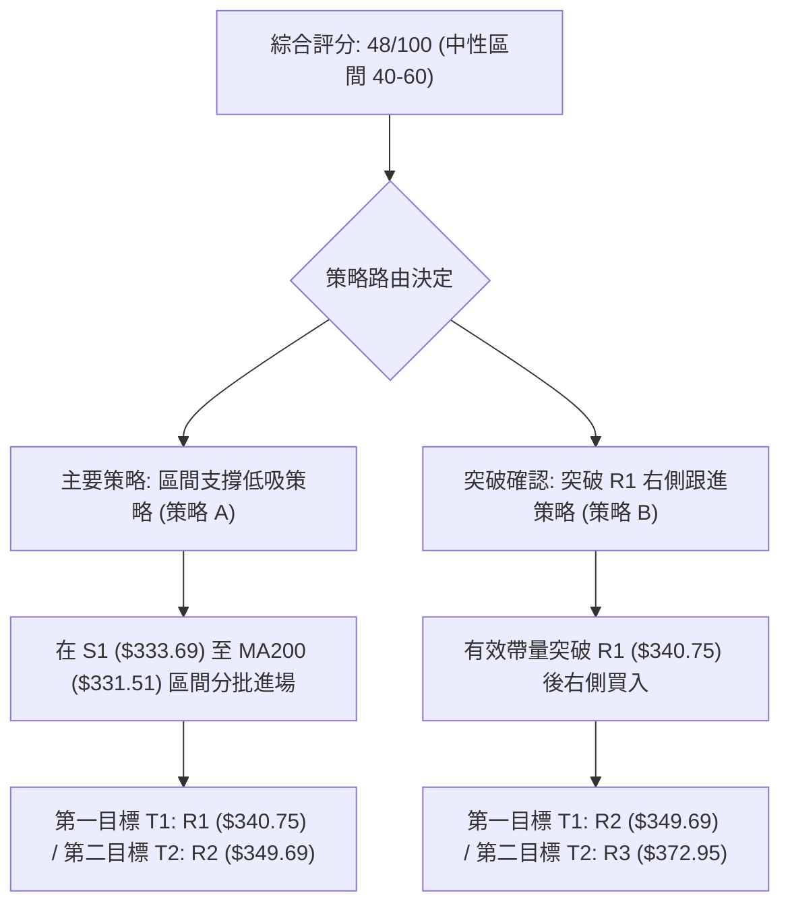

### 🧭 策略路由

> **當前主策略方向 = 【中性區間操作，以布林下半部及支撐位低吸為主】（依評分卡綜合評分 48/100）**

### 🎯 價格情境階梯（Price Scenarios）

| 觸發條件 | 當前狀態 / 第一目標 | 第二目標 | 後續延伸 | 情境含義與技術解讀 |
|:---|:---:|:---:|:---:|:---|
| **強勢突破** | 突破 R1 **$340.75** | R2 **$349.69** | R3 **$372.95** | 短線扭轉均線下彎頹勢，重回中軌上方挑戰箱頂 |
| **區間震盪** | **守住現價 $338.20** | R1 **$340.75** | S1 **$333.69** | 於 $333.69 - $345.69 狹幅消化籌碼，等待均線走平 |
| **弱勢下探** | 跌破 S1 **$333.69** | S2 **$312.69** | S3 **$295.78** | 跌破年線 MA200，回測 2026-07 破底翻低點甚至箱底 |

### 📊 情境機率分佈

| 情境劇本 | 估計機率 | 主要技術依據 |
|:---|:---:|:---|
| **情境一：守住支撐，區間反彈** | **55%** | Stochastic 深度超賣 (%K=4.45)，價格逼近 S1 ($333.69) 與 MA200 ($331.51) 強支撐共振帶。 |
| **情境二：窄幅橫盤拉鋸** | **30%** | ADX = 9.76 弱趨勢，量比僅 0.77x，量能極度萎縮，多空均無力發動單邊行情。 |
| **情境三：跌破年線，深度回調** | **15%** | MACD 柱狀圖負值 (-1.003) 且 -DI(26.73) 壓制 +DI(24.30)，若突發利空恐下探 S2 ($312.69)。 |

### 🟢 主策略詳情

```
主策略 A (左側支撐低吸) 與 策略 B (右側突破跟進) 風險報酬結構：
策略 A：進場 $333.69 │ 止損 $325.03 ◄─ 8.66 ─► 現價 ◄── 7.06 ──► T1: $340.75 ◄── 8.94 ──► T2: $349.69
                      └────── 風險 R: $8.66 ──────┴────── 報酬 T2: $16.00 (R/R = 1.85:1) ──────┘
```

| 策略要素 | 策略 A（左側支撐逢低承接） | 策略 B（右側突破順勢跟進） |
|:---|:---|:---|
| **適用時機** | 價格回踩測試 S1 支撐與 MA200 止跌 | 價格放量突破 R1 阻力位 |
| **進場條件** | 觸及 $333.69 且出現 15分/60分 K線止跌長下影 | 日線收盤價有效站上 R1 ($340.75) 且成交量放大 |
| **進場價格** | **$333.69** (支撐位 S1) | **$340.75** (阻力位 R1) |
| **目標價 T1** | **$340.75** (阻力位 R1, +2.12%) | **$349.69** (阻力位 R2, +2.62%) |
| **目標價 T2** | **$349.69** (阻力位 R2, +4.79%) | **$372.95** (阻力位 R3, +9.45%) |
| **止損價格** | **$325.03** (38.2% 斐波那契回調位, -2.60%) | **$333.69** (支撐位 S1, -2.07%) |
| **風險報酬比** | **1.85 : 1** (風險 $8.66 / 潛在報酬 $16.00) | **4.56 : 1** (風險 $7.06 / 潛在報酬 $32.20) |
| **預估勝率** | **60%** | **55%** |
| **建議倉位** | **10% ~ 15%** (分批建倉) | **15% ~ 20%** (確認信號後介入) |

### 🔴 反向風險觸發點（對沖與停損提示）

- **多頭全面棄守點**：若日線收盤價**實體跌破 $331.51 (MA200)** 且進一步失守 **$325.03 (38.2% 斐波位)**，宣告長期均線支撐失效，箱體下軌 **$312.69 (S2)** 將受到直接考驗。
- **對沖處置建議**：一旦跌破 $325.03，應立即將多頭部位全數止損離場，或建立適度之反向對沖部位。

### ⭐ 整體訊號強度評星

```
╔══════════════════════════════════════════════════════════════════╗
║ 做多訊號強度：★★☆☆☆  (2.5/5星 — 支撐強烈但短線動能偏弱)           ║
║ 做空訊號強度：★★☆☆☆  (2.0/5星 — 逼近強支撐區，追空風險極高)       ║
║ 整體可信度：  ★★★★☆  (4.0/5星 — 價位結構清晰，震盪區間明確)       ║
╚══════════════════════════════════════════════════════════════════╝
```

---

## 9. 風險提示與監控

### ✅ 關鍵監控指標 Checklist

```
╔══════════════════════════════════════════════════════════════════╗
║                    每日盤面技術監控清單 (Checklist)              ║
╠══════════════════════════════════════════════════════════════════╣
║ [ ] 價位防守：收盤價是否守穩 S1 ($333.69) 與 MA200 ($331.51)      ║
║ [ ] 動能修復：RSI(14) 是否由 35.71 回升突破 40 臨界線             ║
║ [ ] 短線反轉：Stochastic %K 是否在超賣區金叉 %D 並脫離 20 以下    ║
║ [ ] 均線壓制：日內反彈能否收復 MA5 ($341.23) 與 MA20 ($345.69)   ║
║ [ ] 量能異動：單日成交量是否放大至 20日均量 (18.34M) 之 1.2倍以上 ║
║ [ ] 指標背離：MACD 柱狀圖是否縮減（由 -1.003 向上收斂）          ║
╚══════════════════════════════════════════════════════════════════╝
```

### ⚠️ 風險場景分析

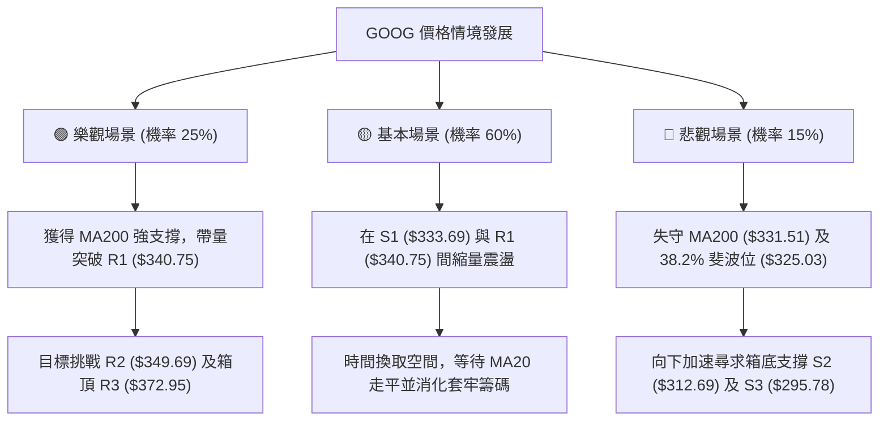

### 🛡️ 風險管理重要提醒

1. **嚴禁盤整期追高殺跌**：ADX(14) 僅 9.76，表明市場毫無趨勢慣性。任何在壓力位追買或在支撐位追殺的操作極易遭到來回巴掌。
2. **嚴格執行波動率止損**：當前 ATR 為 $8.77，單筆交易之最大止損距離不得低於 1.0 ATR ($8.77)，以防市場正常微幅雜訊觸發假止損；但絕對不可超過 2.0 ATR ($17.54)。
3. **部位規模控管**：在盤整震盪市道中，總持倉部位建議降至 **30% - 40%** 之間，單一進場策略部位不超過 **15%**，保持充裕現金以應對潛在突破後的順勢加碼。

---

## 📋 報告總結

```
╔══════════════════════════════════════════════════════════════════╗
║                     GOOG 技術分析報告總結                        ║
╠══════════════════════════════════════════════════════════════════╣
║ 報告日期：2026-08-20           當前價格：$338.20                 ║
║ 綜合評級：⚖️ 中性偏弱 (Neutral-Bearish) — 區間箱體整理           ║
╠══════════════════════════════════════════════════════════════════╣
║ 關鍵結論：                                                       ║
║ ├─ 長期趨勢：🟢 多頭穩固 (現價高於 MA200 $331.51 與 MA240 $318)  ║
║ ├─ 中期趨勢：🟡 寬幅箱體 ($312.69 - $372.95 區間震盪)            ║
║ ├─ 短期趨勢：🔴 均線壓制偏弱，但 Stochastic (%K=4.45) 深度超賣    ║
║ ├─ 關鍵支撐：S1: $333.69 │ S2: $312.69 │ S3: $295.78            ║
║ ├─ 關鍵阻力：R1: $340.75 │ R2: $349.69 │ R3: $372.95            ║
║ └─ 分析師目標：平均 $422.34 (最高 $475.00 / 最低 $340.00)        ║
╠══════════════════════════════════════════════════════════════════╣
║ 最優策略組合：                                                   ║
║ 1. 🥇 最佳機會：策略 A (於 S1 $333.69 逢低承接，止損 $325.03)    ║
║ 2. 🥈 次選機會：策略 B (帶量突破 R1 $340.75 右側跟進，目標 $349) ║
║ 3. 🥉 保守選擇：場外觀望，靜待日線 RSI 回升突破 45 及 MA20 站穩  ║
╚══════════════════════════════════════════════════════════════════╝
```

---

> ⚠️ **免責聲明**：本報告為技術分析研究成果，所有數據、圖表及估算均基於歷史量價數據計算。本報告**僅供學術研究與投資參考**，**不構成任何形式的要約或投資買賣建議**。金融市場具有高度風險，投資人應獨立評估並自負投資盈虧。

---

*報告生成時間：2026-08-20 ｜ 數據來源：Yahoo Finance ｜ 分析框架：資深多時框技術分析架構*