# GOOG 技術分析報告

> **報告日期**：2026-08-22 ｜ **語言**：繁體中文 ｜ **數據來源**：Yahoo Finance ｜ **當前價格**：$341.75

---

## 目錄

| 章節 | 內容 |
|------|------|
| [1. 技術面概覽](#1-技術面概覽) | 訊號儀表板、核心指標、評分卡 |
| [2. 趨勢分析](#2-趨勢分析) | 多時框趨勢、長中短期走勢、ADX解讀 |
| [3. 圖表形態分析](#3-圖表形態分析) | 形態識別、K線組合、形態信心度 |
| [4. 支撐與阻力](#4-支撐與阻力) | 關鍵價位、斐波那契回調 |
| [5. 技術指標深度解讀](#5-技術指標深度解讀) | MA/RSI/MACD/布林/成交量 |
| [6. 動能與波動率](#6-動能與波動率) | 動能評估、ATR、Beta |
| [7. 多時框架總結](#7-多時框架總結) | 時框架評分矩陣、收斂結論 |
| [8. 交易策略建議](#8-交易策略建議) | 策略路由、情境階梯、主策略詳情 |
| [9. 風險提示與監控](#9-風險提示與監控) | 監控指標、風險場景、風控提醒 |
| [📋 報告總結](#-報告總結) | 核心總結與策略配置 |

---

## 1. 技術面概覽

### 🎯 技術訊號儀表板

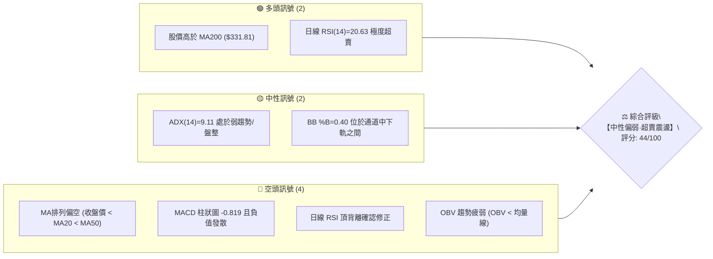

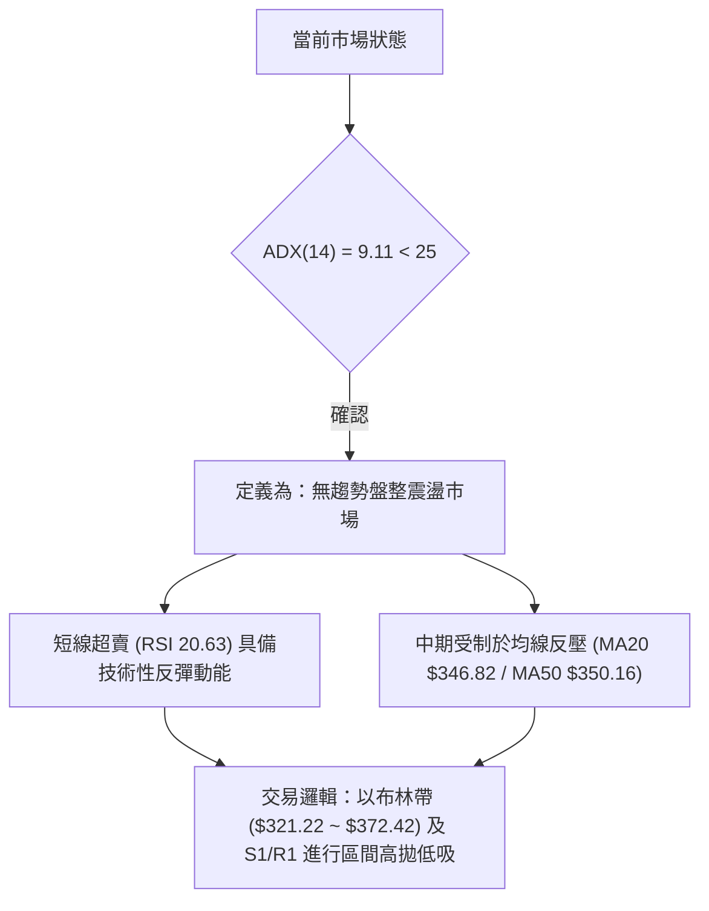

### 📊 核心指標速覽表

| 指標類別 | 指標名稱 | 當前數值 | 訊號 | 解讀 |
|----------|----------|----------|:----:|------|
| **價格** | 當前價格 | $341.75 | 🟡 | 位於52週區間的 69.4% 位置，處於中高檔回檔整理期 |
| **均線** | MA20 | $346.82 | 🔴 | 價格低於MA20（-$5.07 / -1.46%），短線承壓 |
| **均線** | MA50 | $350.16 | 🔴 | 價格低於MA50，中期上升趨勢遭遇阻滯 |
| **均線** | MA200 | $331.81 | 🟢 | 價格高於MA200（+$9.94 / +3.00%），長期多頭牛熊線未破 |
| **動能** | RSI(14) | 20.63 | 🟢 | 進入極度超賣區（<30），短線存在技術性反彈修復需求 |
| **動能** | MACD(12,26,9) | -2.684 / -1.865 | 🔴 | 快慢線雙雙落入零軸下方，柱狀圖 -0.819 偏空運行 |
| **隨機指標** | Stoch %K / %D | 12.23 / 8.70 | 🟢 | 低檔黃金交叉初顯，超賣區鈍化即將收斂 |
| **趨勢強度** | ADX(14) | 9.11 | 🟡 | ADX < 25 表明單邊趨勢消退，進入弱勢震盪橫盤結構 |
| **量能** | 20日均量比 | 0.85x | 🔴 | 15.34M vs 18.03M，量能萎縮且 OBV < MA，追價意願不足 |
| **波動** | ATR(14) | $7.77 | 🟡 | 佔股價 2.27%，日均波動適中，提供明確止損防守空間 |

### 🏆 技術評分卡

```
╔══════════════════════════════════════════════════════════════════╗
║              技術評分卡 — GOOG (2026-08-22)                      ║
╠══════════════════════════════════════════════════════════════════╣
║ 趨勢強度 (ADX=9.11 無方向)    ████░░░░░░░░░░░░░░░░  20/100 🔴   ║
║ 動能指標 (RSI超賣 vs MACD偏空) ██████████░░░░░░░░░░  50/100 🟡   ║
║ 支撐穩定度 (S1 $333.69 / MA200)██████████████░░░░░░  70/100 🟢   ║
║ 成交量配合 (量能萎縮 OBV疲弱)  ██████░░░░░░░░░░░░░░  30/100 🔴   ║
║ 形態完整度 (區間震盪整理箱型)  ████████████░░░░░░░░  60/100 🟡   ║
║ 均線排列 (MA200支撐 vs 短均壓) ██████░░░░░░░░░░░░░░  35/100 🔴   ║
╠══════════════════════════════════════════════════════════════════╣
║ 綜合評分                      █████████░░░░░░░░░░░  44/100 🟡   ║
║ 評級結論：【中性偏弱·超賣整理】— 建議採區間操作與逢低佈局         ║
╚══════════════════════════════════════════════════════════════════╝
```

---

## 2. 趨勢分析

### 🌐 多時框趨勢分析

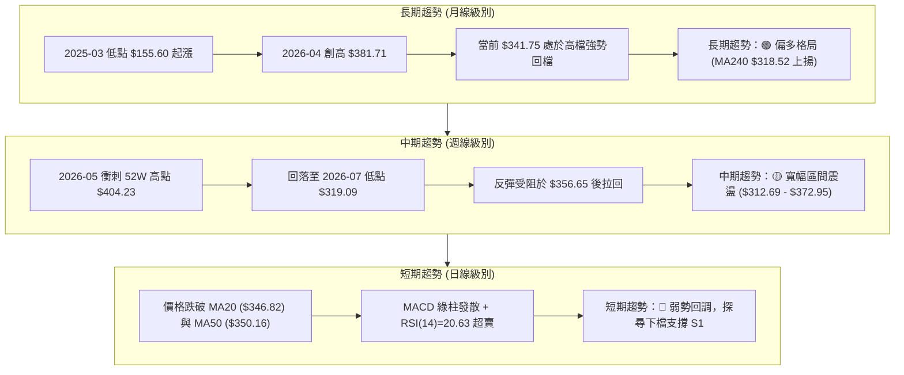

### 📈 長期趨勢 — 12個月走勢圖（Unicode）

```
GOOG 月線走勢圖（2025-08 至 2026-08）
價格軸 ($)
$400 ┤                                      
$380 ┤                                  ● $381.71 (04)
$360 ┤                                      ● $376.20 (05)
$340 ┤                              ● $338.09   ● $353.33 (06) ● $356.65 (07)
$320 ┤                      ● $319.49   ● $313.39   ● $311.02 (02) ━● $341.75 (08)
$300 ┤                                      ● $286.69 (03)
$280 ┤                  ● $281.27 (10)
$260 ┤                                      
$240 ┤              ● $243.07 (09)
$220 ┤          ● $212.92 (08)
     └─────────────────────────────────────────────────────────────►
       25-08 25-09 25-10 25-11 25-12 26-01 26-02 26-03 26-04 26-05 26-06 26-07 26-08
```

#### 走勢特徵分析表格

| 階段區間 | 起始/結束價 | 累計漲跌幅 | 走勢特徵描述 | 結構性意義 |
|----------|-------------|:----------:|--------------|------------|
| **2025-08 ~ 2025-11** | $212.92 → $319.49 | +50.05% | 爆發性主升浪，月線連續四連陽，斜率陡峭 | 確立長期多頭牛市結構 |
| **2025-12 ~ 2026-03** | $319.49 → $286.69 | -10.27% | 高檔箱型清洗獲利籌碼，於 $286.69 築出中期次級低點 | 完成中期換手與回踩鞏固 |
| **2026-04 ~ 2026-05** | $286.69 → $381.71 | +33.14% | 強勁拉升創波段收盤新高，盤中觸及 52W 高點 $404.23 | 衝刺頂部並伴隨量能爆發 |
| **2026-06 ~ 2026-08** | $381.71 → $341.75 | -10.47% | 縮量高檔回落，跌破短期均線但守穩 MA200 | 確立無趨勢之寬幅收斂震盪 |

### 📊 中期趨勢（週線分析）

```
GOOG 週線近期價格與支撐/阻力結構
 410 ┤                                            
 400 ┤         ▲ 52W High $404.23 (2026-05)       
 390 ┤        ╭─╮                                 
 380 ┤       ╭╯ ╰╮                                
 370 ┤      ╭╯   ╰╮       ╭─╮                     ══════ R2: $372.95 / BB上軌 $372.42
 360 ┤     ╭╯     ╰╮ ╭───╯ │ ╰╮                   
 350 ┤    ╭╯       ╰─╯     │  ╰─╮                 ══════ MA50: $350.16 / R1: $349.69
 340 ┤───╯                 │    ╰─● $341.75(現價) 
 330 ┤                     │                      ══════ S1: $333.69 / MA200: $331.81
 320 ┤                     ╰─▼ $319.09 (2026-07)  ══════ S2: $312.69 / BB下軌 $321.22
     └────────────────────────────────────────────►
       04-19 05-03 05-17 05-31 06-14 06-28 07-12 07-26 08-09 08-23
```

- **週線形態解析**：自 2026-05 觸頂 $404.23 後，走勢呈現標準的「高點降低（Lower Highs: $404.23 → $367.46 → $356.65）」與「低點收斂（Lower Lows: $334.69 → $319.09）」。目前收盤價 $341.75 緊鄰週線 2026-08-16 之 $343.54，處於尋求雙重底頸線支撐的測試階段。

### ⚡ 趨勢強度評估（ADX 解讀）

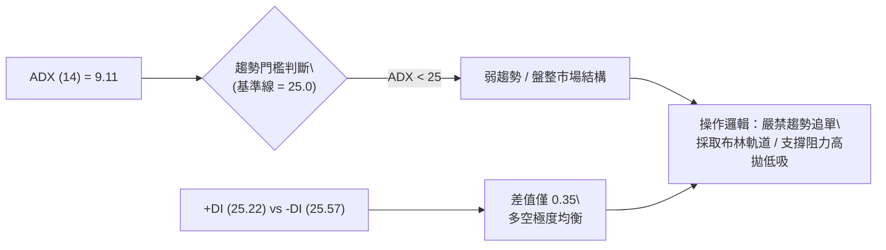

#### ADX 趨勢強度指標解讀對照表

| 指標變數 | 當前讀數 | 門檻區間 | 技術含義解讀 |
|----------|:--------:|:--------:|--------------|
| **ADX (14)** | **9.11** | 0 ~ 20 (極弱趨勢/完全盤整) | 單邊動能完全消退，行情進入沉寂整理期，趨勢指標（如MACD、動量）常出現鈍化或假突破 |
| **+DI (14)** | **25.22** | 參考值 | 多方攻擊動能處於中等水平，未見主動性買盤推升 |
| **-DI (14)** | **25.57** | 參考值 | 空方打壓動能亦有限，僅以微弱優勢（+0.35）暫時主導 |
| **ADX 走勢** | 走平鈍化 | 下降/低檔區 | 指示目前處於蓄勢階段，需等待 ADX 拐頭上穿 20 甚至 25 才能確認新一輪突破行情 |

---

## 3. 圖表形態分析

### 🔍 形態識別系統

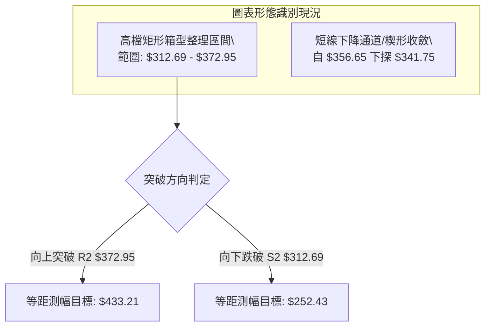

#### 形態識別信心度與目標價計算表

| 識別形態名稱 | 信心度 | 判斷依據（引用精確數據） | 形態完成度 | 理論目標價（附計算式） |
|--------------|:------:|--------------------------|:----------:|------------------------|
| **高檔寬幅箱型整理** | **78%** | 上軌阻力 R2 **$372.95**（聚類高點），下軌支撐 S2 **$312.69**（與 2026-07-26 週低 $319.09 重疊）。 | 85% | 向上突破：$372.95 + ($372.95 - $312.69) = **$433.21**<br>向下跌破：$312.69 - ($372.95 - $312.69) = **$252.43** |
| **短線下降楔形** | **62%** | 近三週自 $356.65 回落，波動縮小（ATR=$7.77），量能萎縮至 15.34M，下檔受到 S1 **$333.69** 支撐。 | 70% | 向上突破頸線 R1 **$349.69**，量測高度 ($356.65 - $341.75 = $14.90)，目標價 = $349.69 + $14.90 = **$364.59** |
| **頭肩頂形態** | **28%** | 左肩 $382.99、頭部 $404.23、右肩 $367.46，但頸線尚未有效跌破，訊號不足。 | 30% | 訊號不足，信心度 < 50%，僅做指標型防守監控，不進行目標價外推。 |

### 🕯️ 重要K線形態分析

| 期間/月份 | 收盤價 | K線形態特徵 | 盤面微觀解讀 | 多空訊號 |
|-----------|:------:|-------------|--------------|:--------:|
| **2026-04** | $381.71 | 長陽突破大紅棒 | 大幅跳空上揚，強勢突破前波歷史高點，確立多頭主升段 | 🟢 強烈看多 |
| **2026-05** | $376.20 | 高檔長上影流星線 | 衝高至 $404.23 後遭遇獲利了結賣壓收窄，多頭動能消耗 | 🔴 短期見頂 |
| **2026-06** | $353.33 | 中黑實體陰線 | 跌破 5 日、10 日均線，空方主導回調修正 | 🔴 看跌回檔 |
| **2026-07** | $356.65 | 下影線小陽線（探底回升） | 盤中下探 $319.09 後快速拉回，顯示 S2 $312.69 附近承接買盤強勁 | 🟢 低檔支撐 |
| **2026-08 (當前)** | $341.75 | 縮量十字星/小陰線 | 於 MA20 下方窄幅震盪，成交量萎縮，市場觀望等待方向突破 | 🟡 觀望整理 |

### 📉 ASCII 走勢形態示意圖

```
GOOG 關鍵形態示意圖（高檔箱型收斂震盪）
價格 ($)
$404.23 ┬───────────────────────▲ 52W High (2026-05)
        │                      / \
$372.95 ┼─────────────────────/───\─────▲ R2 箱型頂部 ($372.95)
        │                    /     \   / \
$349.69 ┼───────────────────/───────\─/───\──▲ R1 頸線阻力 ($349.69)
$341.75 ┼──────────────────/─────────●───── 現價 ($341.75)
$333.69 ┼─────────────────/─────────/───────▼ S1 初級支撐 ($333.69)
$312.69 ┼────────────────/─────────▼────────▼ S2 箱型底部 ($312.69)
        └────────────────────────────────────────────────────────────► 時間
```

---

## 4. 支撐與阻力

### 🗺️ 關鍵價位分布圖（Unicode）

```
GOOG 價位結構分布圖
═════════════════════════════════════════════════════════════════
$404.23 ║██████████████████████████████║ 52週歷史高點 / 斐波那契 0.0%
$381.81 ║████████████████████████      ║ 強阻力 R3 (前波月線高點聚類)
$372.95 ║████████████████████          ║ 關鍵阻力 R2 (布林上軌 $372.42 聚類)
$355.99 ║▓▓▓▓▓▓▓▓▓▓▓▓▓▓▓▓▓▓            ║ 斐波那契 23.6% 回調位
$349.69 ║██████████████                ║ 近期阻力 R1 (MA50 $350.16 聚類)
$341.75 ╠══════════════════════════════╣ ◄ 現價 $341.75 (BB %B = 0.40)
$333.69 ║▓▓▓▓▓▓▓▓▓▓▓▓                  ║ 近期支撐 S1 (MA200 $331.81 重合)
$326.15 ║████████                      ║ 斐波那契 38.2% 回調位
$321.22 ║██████                        ║ 布林通道下軌
$312.69 ║██████████████████████        ║ 強支撐 S2 (波段箱體下軌)
$295.78 ║██████████████████████████    ║ 極限支撐 S3 (斐波那契 50% $302.03 下方)
═════════════════════════════════════════════════════════════════
```

### 🚧 阻力位分析表

| 阻力級別 | 精確價位 | 距現價幅幅 | 形成原因與技術共振 | 突破難度 | 重要性 |
|:--------:|:--------:|:----------:|--------------------|:--------:|:------:|
| **R1** | **$349.69** | +2.32% | 近期日線波段反彈高點，與 **MA50 ($350.16)**、**MA20 ($346.82)** 高度共振。 | 🟡 中等 | ★★★☆☆ |
| **R2** | **$372.95** | +9.13% | 2026年6-7月波段頂部聚類，與 **布林通道上軌 ($372.42)** 重疊，為中期箱頂。 | 🔴 較高 | ★★★★☆ |
| **R3** | **$381.81** | +11.72% | 2026-04 月線實體收盤高點 ($381.71)，為歷史級別套牢壓力區。 | 🔴 極高 | ★★★★★ |

### 🛡️ 支撐位分析表

| 支撐級別 | 精確價位 | 距現價幅幅 | 形成原因與技術共振 | 守住機率 | 重要性 |
|:--------:|:--------:|:----------:|--------------------|:--------:|:------:|
| **S1** | **$333.69** | -2.36% | 近一年波段低點聚類，與 **MA200 ($331.81)** 牛熊分界線構成共振防守帶。 | 🟢 75% | ★★★★☆ |
| **S2** | **$312.69** | -8.50% | 2026-02 月線收盤低點 ($311.02) 及 2026-07 週線回踩低點 ($319.09) 支撐。 | 🟢 85% | ★★★★★ |
| **S3** | **$295.78** | -13.45% | 2026-03 突破前整理平台低點，接近斐波那契 50.0% ($302.03)。 | 🟢 95% | ★★★★★ |

### 📐 斐波那契回調位分析

依據 52 週絕對波動區間（**低點 $199.83 → 高點 $404.23**，垂直振幅 $204.40）精確映射：

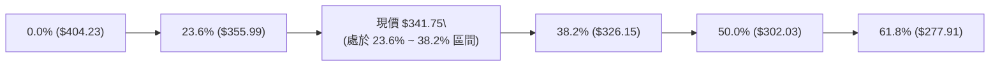

- **位置解讀**：現價 **$341.75** 運行於 **23.6% ($355.99)** 與 **38.2% ($326.15)** 的黃金分割回調區間內。
- **技術意義**：
  1. 回調尚未觸及 38.2% 關鍵防守線（$326.15），表明從 $199.83 起漲的總體大多頭架構並未遭到實質破壞。
  2. 現價下方第一防守帶 S1 ($333.69) 位於 38.2% 回調位之上，若能在此區間築底，屬於強勢回調範疇。
  3. 若向下跌破 38.2%，行情將回測 50.0% 心理大關（$302.03），該位置與 S3 ($295.78) 構成極強支撐。

---

## 5. 技術指標深度解讀

### 🎛️ 指標訊號總覽

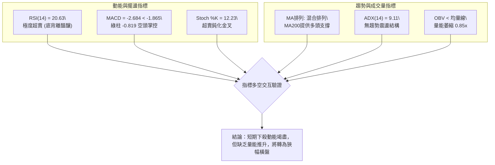

### 📈 移動平均線排列分析

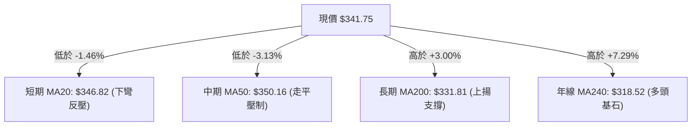

#### 均線系統詳細參數與趨勢研判表

| 均線名稱 | 當前數值 | 與現價距離 | 每日變動 | 走勢特徵 | 訊號評估 |
|----------|:--------:|:----------:|:--------:|----------|:--------:|
| **MA 5** | $340.88 | +0.26% | +$0.87 | 短期止跌走平，提供日內微弱支撐 | 🟢 偏多 |
| **MA 10** | $343.31 | -0.45% | -$1.56 | 短期下行壓制，為第一道動態阻力 | 🔴 偏空 |
| **MA 20** | $346.82 | -1.46% | -$5.07 | 20日線持續下彎，構成波段短壓 | 🔴 偏空 |
| **MA 60** | $352.79 | -3.13% | -$11.04 | 季線高檔下行，壓制中期反彈高度 | 🔴 偏空 |
| **MA 120** | $344.14 | -0.69% | -$2.39 | 半年線走平，於現價上方形成均線密集帶 | 🟡 中性 |
| **MA 200** | $331.81 | +3.00% | 上揚中 | 牛熊分界線維持多頭上行斜率，具強烈支撐 | 🟢 看多 |
| **MA 240** | $318.52 | +7.29% | +$23.23 | 穩定向上，奠定長期牛市基礎 | 🟢 看多 |

### 📉 RSI(14) 分析

- **數值進度條**：
  `RSI(14) = 20.63`  [████░░░░░░░░░░░░░░░░] 20.63% （極度超賣區間 < 30）
- **超買超賣與背離深度解讀**：
  1. **頂背離修復已近尾聲**：此前股價在 2026-05 衝高至 $404.23 時，RSI 週線出現高檔頂背離（88.0 → 74.3），隨後引發了一波自 $404.23 回調至 $319.09 的大幅修正。當前日線 RSI 下殺至 **20.63**，已充分釋放頂背離帶來的做空動能。
  2. **潛在底背離醞釀**：2026-07-26 週線價格收於 $319.09 時 RSI 為 26.4，當前價格為 $341.75（高於前低），而日線 RSI 已低達 20.63，呈現典型的「指標超跌於價格」狀態。若後續幾日價格回測 S1 ($333.69) 而 RSI 不創新低，將正式確立**日線級別底背離**。

### 📊 MACD(12/26/9) 訊號解讀

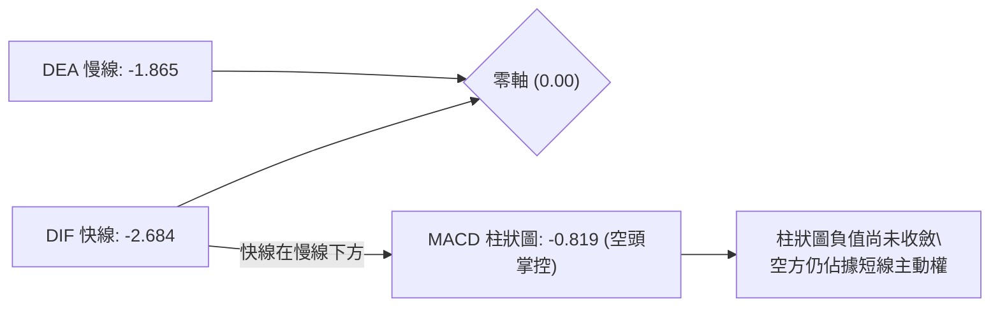

- **技術解讀**：DIF (-2.684) 與 DEA (-1.865) 雙雙運行於零軸下方，且 DIF < DEA，說明當前市場仍處於空頭修正週期中。然而，MACD 柱狀圖負值為 -0.819，相比 2026-06 期間的 -4.974 而言，空頭打壓力道已顯著衰退，呈現「弱勢陰跌但動能鈍化」特徵。

### 📦 布林通道分析

```
GOOG 布林通道示意圖 (Bollinger Bands, 20, 2)
價格 ($)
$372.42 ┬────────────────────────────────────────── BB 上軌 (Upper)
        │
$346.82 ┼┄┄┄┄┄┄┄┄┄┄┄┄┄┄┄┄┄┄┄┄┄┄┄┄┄┄┄┄┄┄┄┄┄┄┄┄┄┄┄┄ BB 中軌 (MA20)
$341.75 ┼──────────────● 現價 ($341.75, %B = 0.40)
        │
$321.22 ┴────────────────────────────────────────── BB 下軌 (Lower)
```

- **通道帶寬與位置分析**：
  - **上軌**：$372.42 ｜ **中軌 (MA20)**：$346.82 ｜ **下軌**：$321.22
  - **帶寬**：$51.20（約為現價的 14.98%，通道開口呈現橫向收窄態勢）
  - **BB %B = 0.40**：現價落於中軌與下軌之間，顯示目前市場略偏弱勢，但距離下軌（$321.22）仍有 $20.53（+6.0%）的緩衝空間，未觸發下軌破位超跌。

### 💹 成交量分析（量價配合度）

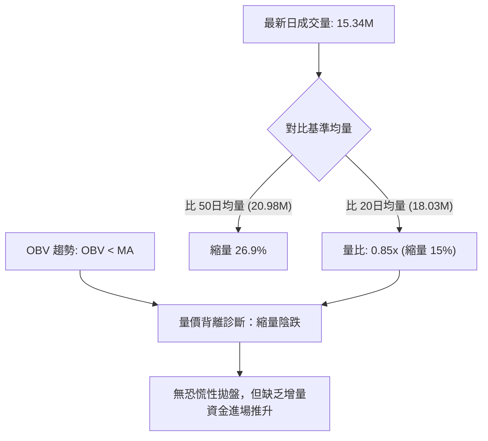

- **量價配合診斷**：週成交量自 2026-06-28 的 188.10M 大量換手後，逐步降至本週的 69.74M。量能萎縮表明市場拋壓減輕，但 OBV 持續低於均線，意味著機構資金暫以觀望為主，未見明顯的右側吸籌訊號。

---

## 6. 動能與波動率

### ⚡ 動能評估四象限

| 象限代號 | 動能強度 | 波動率狀態 | 當前市場狀態定位 | 操作策略指引 |
|:--------:|:--------:|:----------:|:----------------:|:-------------|
| **Q1** | 強動能 (+DI高) | 低波動 (ATR收縮) | ── | 最佳單邊突破追買機會 |
| **Q2 (當前)** | **弱動能 (ADX=9.11)** | **低/中波動 (ATR=$7.77)** | **✓ GOOG 當前定位** | **區間震盪、高拋低吸、謹慎防守** |
| **Q3** | 強動能 (-DI爆發) | 高波動 (ATR激增) | ── | 高風險單邊空頭趨勢 |
| **Q4** | 弱動能 (量能萎縮) | 高波動 (跳空震盪) | ── | 混亂市場，避免任何開倉 |

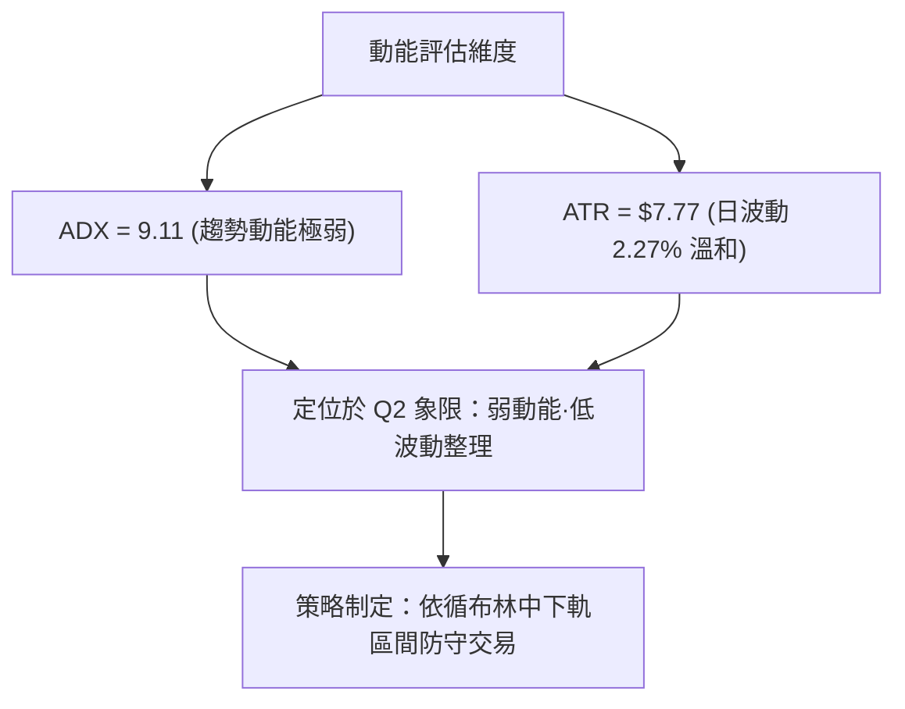

### 📊 ATR 波動率分析

- **ATR(14) 數值**：**$7.77**（佔當前股價 $341.75 的 **2.27%**）。
- **止損與波動保護計算**：
  - **超短線/日內交易（1.0 × ATR）**：波幅空間約 **$7.77**。
  - **波段擺盪交易止損防守（1.5 × ATR）**：$7.77 × 1.5 = **$11.66**。
  - **強防守波段止損（2.0 × ATR）**：$7.77 × 2.0 = **$15.54**。
  - **風控指引**：若在現價 $341.75 進場，技術性止損點應設於 $341.75 - $11.66 = **$330.09**（剛好保護在 MA200 $331.81 及 S1 $333.69 下方），兼具技術共振與統計學防守意義。

### 📐 Beta 與市場相關性

- **Beta 係數**：**1.237**。
- **市場特徵解讀**：
  - GOOG 相對標普500指數具備 1.237 倍的波動彈性，屬於高彈性成長藍籌股。
  - 當大盤（S&P 500 / QQQ）出現系統性反彈時，GOOG 預期將展現超出大盤 23.7% 的向上修復彈性；但同理，大盤若補跌，其回撤幅度亦會放大。
  - 建議在投資組合中將單一標的風險暴露控制在總資產的 15% 以內。

---

## 7. 多時框架總結

### 📋 時框架評分表

| 時框架 | 趨勢方向 | 動能狀態 | 均線排列 | 形態結構 | 綜合評分 | 交易建議 |
|:------:|:--------:|:--------:|:--------:|:--------:|:--------:|:--------:|
| **月線 (長期)** | 🟢 偏多 | 🟡 中性調整 | 🟢 MA240向上 | 大多頭箱型高檔整理 | **75/100** | 長期投資者續抱，回踩分批佈局 |
| **週線 (中期)** | 🟡 中性 | 🔴 柱狀偏空 | 🟡 跌破MA20/MA50 | 寬幅箱型 ($312.69 - $372.95) | **50/100** | 區間震盪操作，勿盲目追高 |
| **日線 (短期)** | 🔴 偏空 | 🟢 超賣底背離 | 🔴 MA20/MA50反壓 | 下降收斂楔形測試下軌 | **35/100** | 等待止跌訊號，博取超賣反彈 |

### 🔲 綜合訊號矩陣

```
╔════════════════════════════════════════════════════════════════════╗
║                  GOOG 多時框架技術共振矩陣                         ║
╠════════════════╦══════════════╦══════════════╦═════════════════════╣
║    分析維度    ║ 短期 (日線)  ║ 中期 (週線)  ║     長期 (月線)     ║
╠════════════════╬══════════════╬══════════════╬═════════════════════╣
║ 趨勢方向       ║ 🔴 空頭掌控  ║ 🟡 震盪整理  ║ 🟢 多頭主導         ║
║ 動能指標       ║ 🟢 極度超賣  ║ 🔴 弱勢修正  ║ 🟡 動能收斂         ║
║ 關鍵均線位置   ║ 位於MA20下方 ║ 位於MA50下方 ║ 遠高於MA200/MA240   ║
║ 核心支撐測試   ║ 測試 S1 $333 ║ 守穩 S2 $312 ║ 守穩 38.2% $326.15  ║
║ 訊號共振結論   ║ 短線殺跌衰竭 ║ 中期支撐強勁 ║ 長期牛市格局未破    ║
╚════════════════╩══════════════╩══════════════╩═════════════════════╝
```

### ⚖️ 多時框收斂結論

依據多時框收斂規則（規則 14）：
1. **行情性質判定**：當前 **ADX(14) = 9.11 < 25**，嚴格定義為**盤整行情**。
2. **主導時框與交易邏輯**：在盤整行情中，單邊趨勢無效，以**日線布林通道上下軌（$321.22 ~ $372.42）與支撐阻力位（S1 $333.69 / R1 $349.69）為主要交易區間**。
3. **時框衝突取捨**：雖然日線均線排列偏空（短期偏弱），但日線 RSI(14)=20.63 已落入極度超賣區，且價格逼近長期多頭生命線 MA200 ($331.81) 與 S1 ($333.69) 的強支撐共振帶；因此，短期空頭不宜追空，中期多頭亦不可盲目右側加碼。
4. **唯一方向性結論**：**【中性觀望·區間逢低做多】**——以現價至 S1 支撐帶作為超賣反彈試單區域，以中軌 MA20 ($346.82) 及 R1 ($349.69) 為第一階段止盈目標。

---

## 8. 交易策略建議

### 🗺️ 策略決策流程圖

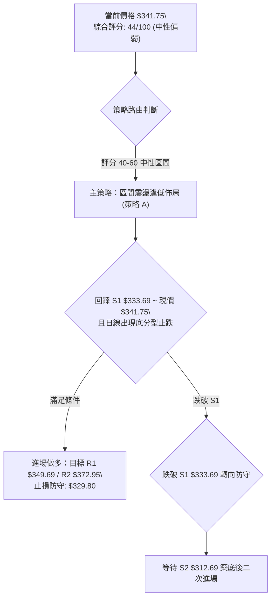

### 🧭 策略路由（依評分卡分流）

> **當前主策略方向 = 區間震盪·超跌逢低做多（依評分 44/100，處於 40–60 中性震盪區間）**  
> **核心指導原則**：ADX=9.11 指示無趨勢，RSI=20.63 指示嚴重超跌，交易以「布林通道區間操作」為主，在 S1 附近尋求右側企穩買點，嚴格執行區間波段止盈。

### 🎯 價格情境階梯（Price Scenarios）

以現價 **$341.75** 為基準，所有價位嚴格引用第 4 章數據：

| 觸發條件 | 第一目標 (T1) | 第二目標 (T2) | 後續延伸 (T3) | 情境含義與技術應對 |
|----------|:-------------:|:-------------:|:-------------:|--------------------|
| **向上突破 R1 $349.69** | **R2 $372.95** | **R3 $381.81** | $404.23 (52W高) | 短線站上 MA50 轉強，箱型向上軌發起衝擊，轉為多頭行情。 |
| **守穩 S1 $333.69 震盪** | **MA20 $346.82** | **R1 $349.69** | ── | 於 MA200 上方完成超賣修復，維持窄幅橫盤整理。 |
| **向下跌破 S1 $333.69** | **38.2% $326.15** | **BB下軌 $321.22** | **S2 $312.69** | 中期走勢走弱，回踩測試箱體底部 S2，啟動深度洗盤。 |

### 📊 情境機率分佈

```
╔══════════════════════════════════════════════════════════════════╗
║ 情境 1: 守穩 S1 超跌反彈至 R1/R2  ████████████████░░░░  55%     ║
║ 情境 2: 於現價區間 ($333-$349) 橫盤震盪 ██████████░░░░░░░░  30% ║
║ 情境 3: 跌破 S1 回測 S2 $312.69     █████░░░░░░░░░░░░░░░  15%   ║
╚══════════════════════════════════════════════════════════════════╝
```

| 情境劇本 | 估計機率 | 主要技術依據 |
|----------|:--------:|--------------|
| **守穩反彈 (情境1)** | **55%** | 日線 RSI(14)=20.63 極度超賣，Stoch 出現低檔金叉，下方 MA200 ($331.81) 與 S1 ($333.69) 支撐極強。 |
| **區間震盪 (情境2)** | **30%** | ADX(14)=9.11 趨勢動能匱乏，OBV 疲弱且成交量縮（0.85x），多空雙方均無力發動單邊行情。 |
| **向下探底 (情境3)** | **15%** | MACD 綠柱仍在發散，MA20/MA50 形成死叉反壓；若大盤劇烈回調可能跌破 S1 尋求 S2。 |

### 🟢 主策略詳情

本報告主推兩套適應當前「超賣盤整」結構的交易方案：

| 策略要素 | 策略 A：超賣反彈右側進場（積極型） | 策略 B：回踩 MA200/S1 企穩佈局（穩健型） |
|----------|-----------------------------------|------------------------------------------|
| **進場條件** | 日線收盤突破 5日均線 ($340.88) 且 RSI 脫離超賣區 (>25) | 價格回踩 S1 ($333.69) 至 MA200 ($331.81) 區間出現下影線十字星 |
| **進場價格** | **$341.75** (現價或突破確認) | **$333.69** (S1 支撐掛單) |
| **目標價 T1** | **$349.69** (R1 / MA50 壓力帶) | **$346.82** (BB 中軌 / MA20) |
| **目標價 T2** | **$372.95** (R2 / BB 上軌) | **$372.95** (R2 箱頂強阻力) |
| **止損價格** | **$329.80** (跌破 MA200 $331.81 達 1.5×ATR) | **$324.50** (跌破 38.2% 斐波位 $326.15) |
| **風險空間** | $341.75 - $329.80 = **$11.95** | $333.69 - $324.50 = **$9.19** |
| **報酬空間 (T2)** | $372.95 - $341.75 = **$31.20** | $372.95 - $333.69 = **$39.26** |
| **風險報酬比** | **1 : 2.61** (以 T2 計算) ｜ 1 : 0.66 (以 T1 計算) | **1 : 4.27** (以 T2 計算) ｜ 1 : 1.43 (以 T1 計算) |
| **預估勝率** | **58%** | **65%** |
| **建議倉位** | **10% ~ 15%** (輕倉試單) | **15% ~ 20%** (標準波段倉位) |

### 🔴 反向風險觸發點（對沖與止損提示）

若出現以下訊號，證明本報告之「超賣反彈」主策略失效，應即刻止損或建立反向對沖：
1. **空方破位訊號**：日線以實體陰線**收盤跌破 S1 ($333.69) 及 MA200 ($331.81)**，且成交量放大至 20M 以上。
2. **防禦行動**：多頭部位無條件市價止損出場，不可抗單；激進投資者可於確認破位後反手建立空單，下看 **S2 $312.69** 及 **S3 $295.78**。

### ⭐ 整體訊號強度評星

```
做多訊號強度：★★★☆☆  (3.0/5星 — 短線超賣反彈機會明確，但受制於量能與均線反壓)
做空訊號強度：★★☆☆☆  (2.0/5星 — ADX過低且接近長線支撐MA200，追空盈虧比極差)
整體可信度：  ★★★★☆  (4.0/5星 — 價位由歷史高低點與斐波那契強共振計算，結構清晰)
```

---

## 9. 風險提示與監控

### ✅ 關鍵監控指標 Checklist

```
╔══════════════════════════════════════════════════════════════════╗
║              GOOG 每日盤後技術監控清單 (Checklist)               ║
╠══════════════════════════════════════════════════════════════════╣
║ [ ] 1. 均線防守：收盤價是否守穩 MA200 ($331.81)？               ║
║ [ ] 2. 均線突破：收盤價是否突破 MA20 ($346.82) 封閉短線跌勢？   ║
║ [ ] 3. 擺盪指標：RSI(14) 是否站回 30 以上確認底背離成型？       ║
║ [ ] 4. 趨勢指標：ADX(14) 是否突破 20，釋放新一輪單邊行情訊號？   ║
║ [ ] 5. 動能指標：MACD 柱狀圖是否由綠翻紅（負值收斂至 0 以上）？  ║
║ [ ] 6. 成交量能：日成交量是否回升至 20日均量 (18.03M) 之上？    ║
╚══════════════════════════════════════════════════════════════════╝
```

### ⚠️ 風險場景分析

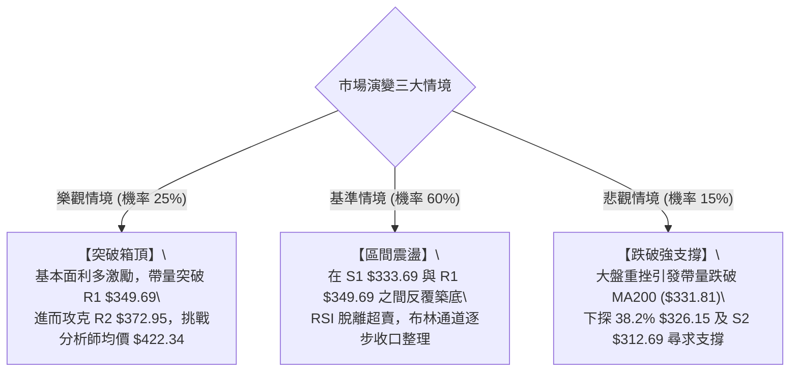

### 🛡️ 風險管理重要提醒

1. **嚴禁趨勢追單**：在 ADX = 9.11 的極弱趨勢環境中，追漲極易買在阻力位（如 R1 $349.69），殺跌極易賣在支撐位（如 S1 $333.69）。必須貫徹「逢低在支撐區買、逢高在阻力區賣」的逆向操作思維。
2. **波動率止損原則**：嚴格依據 ATR($7.77) 設定 1.5 倍的動態防守位（$11.66），絕不可在跌破關鍵支撐後心存僥倖攤平。
3. **倉位管理配置**：當前技術綜合評分為 44 分，屬於中性偏弱期，總持倉比例建議嚴格限制在 **20% ~ 30%** 以內，保留充裕現金儲備，等待行情帶量突破 R1 或回踩 S2 再行加碼。

---

## 📋 報告總結

```
╔══════════════════════════════════════════════════════════════════════════╗
║                  GOOG 技術分析報告總結 (2026-08-22)                      ║
╠══════════════════════════════════════════════════════════════════════════╣
║ 當前價格：$341.75       52週區間：$199.83 - $404.23 (處於 69.4%)          ║
║ 技術評級：⚖️【中性偏弱·超賣整理】  綜合評分：44/100 (無趨勢盤整)        ║
╠══════════════════════════════════════════════════════════════════════════╣
║ 關鍵結論：                                                              ║
║ ├─ 長期趨勢：🟢 多頭格局未破 (MA240 $318.52 上揚，處於大多頭高檔回檔)   ║
║ ├─ 中期趨勢：🟡 寬幅箱型整理 ($312.69 - $372.95，ADX=9.11 進入休整)     ║
║ ├─ 短期趨勢：🔴 弱勢修正但超賣 (RSI=20.63 極度超賣，逼近長線支撐)        ║
║ ├─ 關鍵支撐：S1 $333.69 (MA200共振) ｜ S2 $312.69 (箱體下軌強支撐)      ║
║ ├─ 關鍵阻力：R1 $349.69 (MA50/MA20密集帶) ｜ R2 $372.95 (布林上軌/箱頂)  ║
║ └─ 分析師目標：均價 $422.34 (隱含 +23.6% 空間) ｜ 低標 $340.00          ║
╠══════════════════════════════════════════════════════════════════════════╣
║ 最優策略組合：                                                          ║
║ 1. 🥇 最佳機會：於 S1 $333.69 ~ 現價 $341.75 佈局超賣反彈，博取 R1/R2   ║
║ 2. 🥈 次選機會：突破 R1 $349.69 後右側追隨加碼，目標看至 R2 $372.95     ║
║ 3. 🥉 保守選擇：場外空倉觀望，等待股價放量站穩 MA20 ($346.82) 再行進場   ║
╚══════════════════════════════════════════════════════════════════════════╝
```

---

> ⚠️ **免責聲明**：本報告為 AI 自動生成之技術分析研究，所有技術指標、圖表形態及支撐阻力數值均嚴格基於所提供之歷史價格與量化數據推算。本報告**僅供學術研究與投資架構參考**，**不構成任何形式的個別投資諮詢或買賣邀約**。金融市場瞬息萬變，投資人應獨立評估自身風險承受能力並審慎決策。

---

*報告生成時間：2026-08-22 ｜ 數據來源：Yahoo Finance ｜ 分析框架：多時框量化技術分析系統*