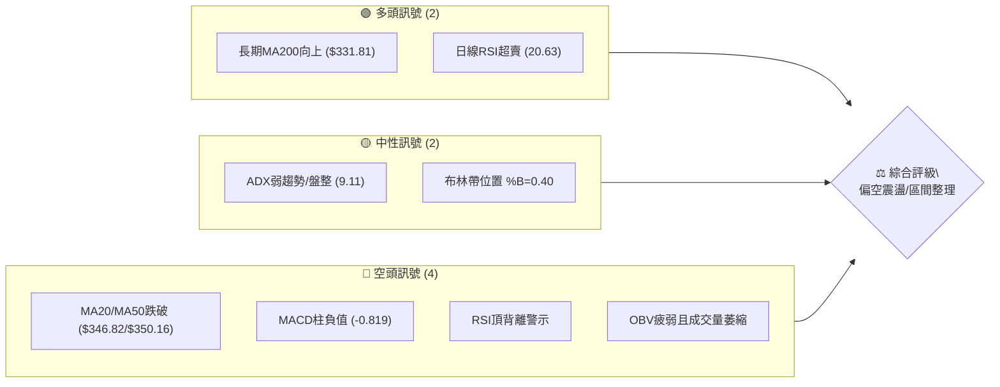
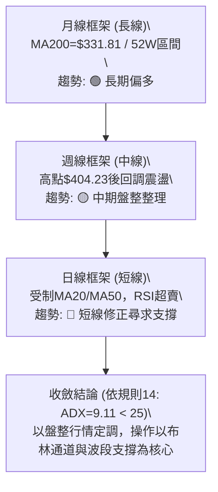
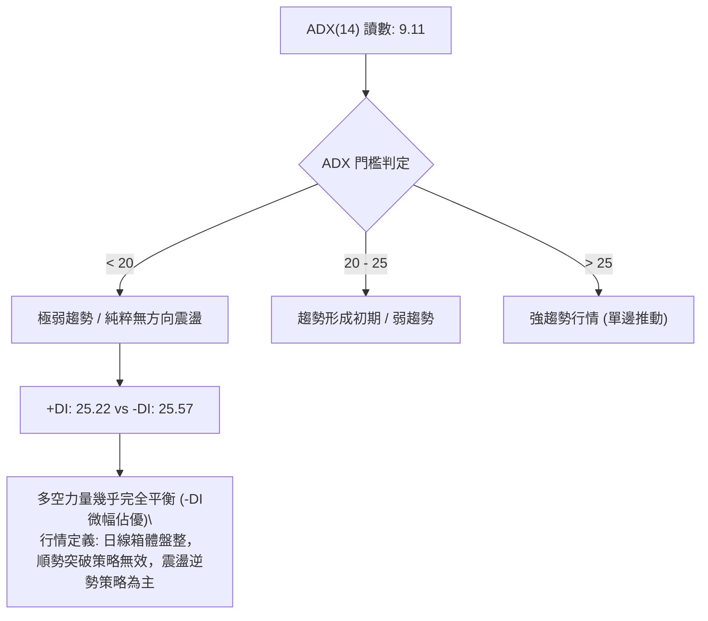
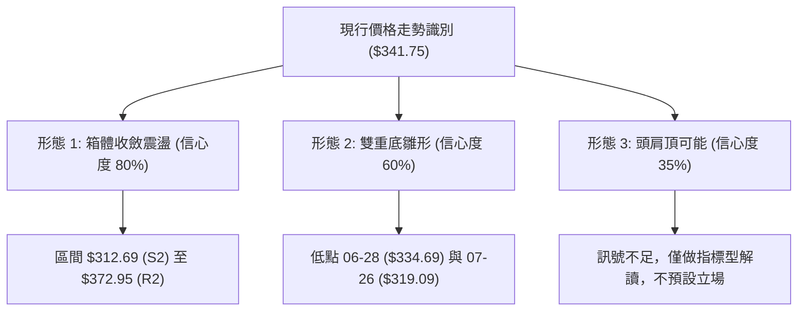
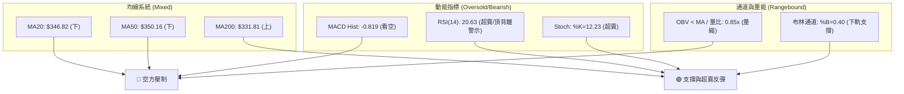
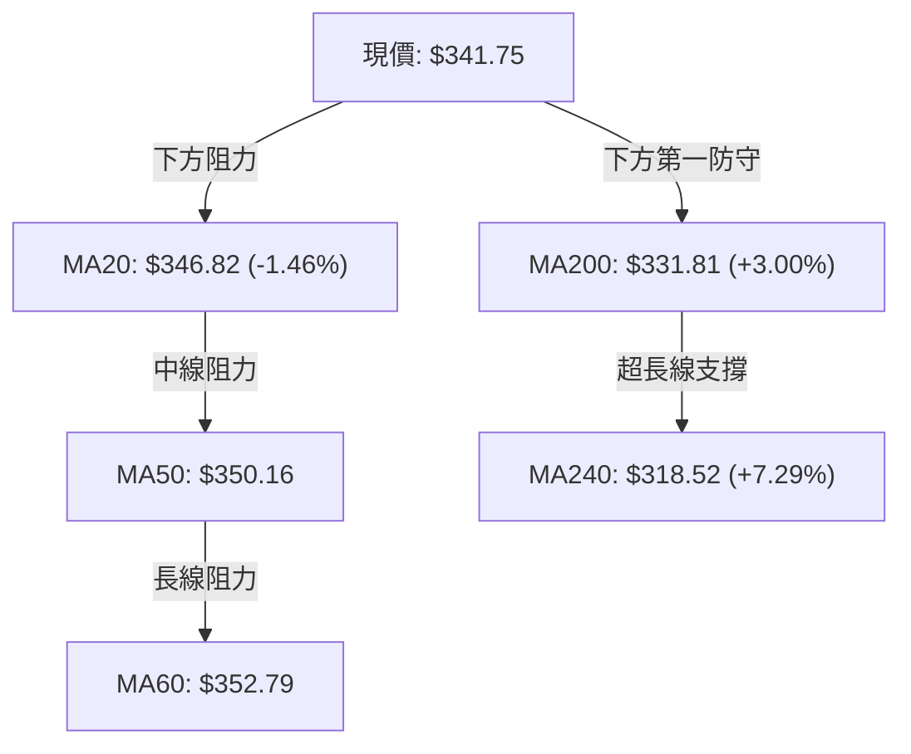
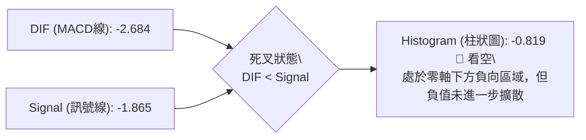
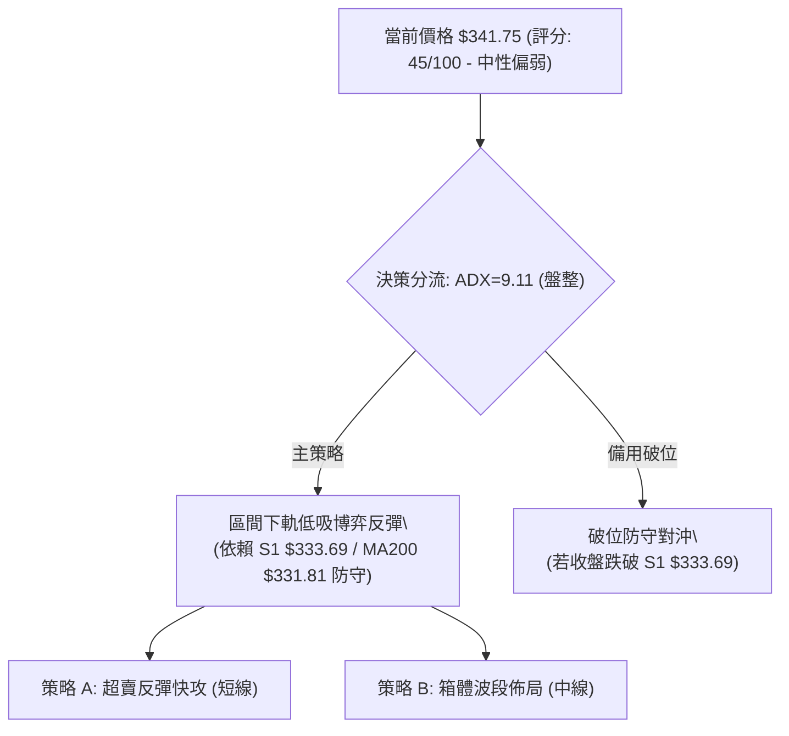
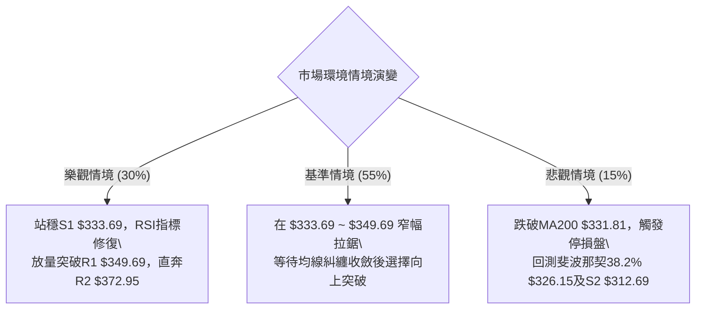

# GOOG 技術分析報告

> **報告日期**：2026-08-23 ｜ **語言**：繁體中文 ｜ **數據來源**：Yahoo Finance ｜ **當前價格**：$341.75

---

## 目錄

| 章節 | 內容 |
|------|------|
| [1. 技術面概覽](#1-技術面概覽) | 訊號儀表板、核心指標、評分卡 |
| [2. 趨勢分析](#2-趨勢分析) | 多時框趨勢、長中短期走勢 |
| [3. 圖表形態分析](#3-圖表形態分析) | 形態識別、K線組合、目標價 |
| [4. 支撐與阻力](#4-支撐與阻力) | 關鍵價位、斐波那契回調 |
| [5. 技術指標深度解讀](#5-技術指標深度解讀) | MA/RSI/MACD/布林/成交量 |
| [6. 動能與波動率](#6-動能與波動率) | 動能評估、ATR、Beta |
| [7. 多時框架總結](#7-多時框架總結) | 時框架評分矩陣 |
| [8. 交易策略建議](#8-交易策略建議) | 多空策略、風險報酬比 |
| [9. 風險提示與監控](#9-風險提示與監控) | 監控指標、風險場景 |

---

## 1. 技術面概覽

### 🎯 技術訊號儀表板



### 📊 核心指標速覽表

| 指標類別 | 指標名稱 | 當前數值 | 訊號 | 解讀 |
|----------|----------|----------|------|------|
| **價格** | 當前價格 | $341.75 | 🟡 | 位於52週區間69.4%分位，處於中高檔回洗階段 |
| **均線** | MA20 | $346.82 | 🔴 | 價格在MA20下方（-1.46%），短線承壓 |
| **均線** | MA50 | $350.16 | 🔴 | 價格在MA50下方，中期均線形成上方壓制 |
| **均線** | MA200 | $331.81 | 🟢 | 價格在MA200上方（+3.00%），長期多頭牛熊線未破 |
| **動能** | RSI(14) | 20.63 | 🟢 | 嚴重超賣（<30），短線存在技術性反彈動能 |
| **動能** | MACD(12,26,9) | -2.684 / -1.865 | 🔴 | DIF在訊號線下方，Histogram -0.819 看空 |
| **動能** | Stoch %K/%D | 12.23 / 8.70 | 🟢 | 隨機指標進入極度超賣區，隨時醞釀金叉 |
| **趨勢** | ADX(14) | 9.11 | 🟡 | 數值極低（<25），處於無明顯單邊趨勢的盤整行情 |
| **量能** | 量比 (Vol/20MA) | 0.85x | 🔴 | 成交量15.34M低於20日均量18.03M，OBV疲弱 |
| **波動** | ATR(14) | $7.77 | 🟡 | 每日平均波動率約2.27%，波動幅度適中 |

### 🏆 技術評分卡

```
╔══════════════════════════════════════════════════════════════╗
║                技術評分卡 — GOOG (2026-08-23)                 ║
╠══════════════════════════════════════════════════════════════╣
║ 趨勢強度 (ADX=9.11)       ████░░░░░░░░░░░░░░░░  20/100  🔴   ║
║ 動能指標 (RSI/MACD/Stoch) ████████░░░░░░░░░░░░  40/100  🟡   ║
║ 支撐穩定度 (S1/S2/MA200)  ██████████████░░░░░░  70/100  🟢   ║
║ 成交量配合 (OBV/量比)     ██████░░░░░░░░░░░░░░  30/100  🔴   ║
║ 形態完整度 (區間箱體)     ████████████░░░░░░░░  60/100  🟡   ║
║ 均線排列 (短空長多)       ████████░░░░░░░░░░░░  40/100  🟡   ║
╠══════════════════════════════════════════════════════════════╣
║ 綜合評分                  █████████░░░░░░░░░░░  45/100  中性偏弱║
╚══════════════════════════════════════════════════════════════╝
```

---

## 2. 趨勢分析

### 🌐 多時框趨勢分析



### 📈 長期趨勢 — 12個月走勢圖（Unicode）

```
GOOG 月線走勢圖（2025-08 至 2026-08）
價格軸 ($)
$400 ┤                                  ● $381.71 (04)
$380 ┤                                      ● $376.20 (05)
$360 ┤                                          ● $353.33 (06) ● $356.65 (07)
$340 ┤                              ● $338.09 (01)                 ● $341.75 (08-現價)
$320 ┤                      ● $319.49 (11) ● $313.39 (12) ● $311.02 (02)
$300 ┤                                              ● $286.69 (03)
$280 ┤              ● $281.27 (10)
$260 ┤
$240 ┤          ● $243.07 (09)
$220 ┤      ● $212.92 (08)
$200 ┤
     └────────────────────────────────────────────────────────────────────────
       08  09  10  11  12  01  02  03  04  05  06  07  08 (月份: 2025-08 ~ 2026-08)
```

**12個月走勢特徵分析表格**：

| 階段 | 涵蓋月份 | 區間起訖價 ($) | 漲跌幅 (%) | 趨勢特徵與量價表現 |
|------|----------|----------------|------------|--------------------|
| **主升段** | 2025-08 ~ 2025-11 | 212.92 → 319.49 | +50.05% | 單邊噴出，均線多頭發散，月線連四紅 |
| **高位箱體** | 2025-12 ~ 2026-03 | 313.39 → 286.69 | -8.52% | 衝高338.09後回踩286.69洗盤，構築底部 |
| **二次創高** | 2026-04 ~ 2026-05 | 381.71 → 376.20 | +31.22% | 創52W高點404.23（收盤381.71），成交量放大 |
| **回調築底** | 2026-06 ~ 2026-08 | 353.33 → 341.75 | -9.19% | 連續三個月收陰，現價341.75測試長期支撐 |

### 📊 中期趨勢（週線分析）

```
近 20 週關鍵壓力與支撐測試示意圖
═════════════════════════════════════════════════════════════════
400.00 ┤      ▲ 05-10 ($396.81) / 52W High $404.23 [強阻力]
380.00 ┤  ▲ 05-03 ($382.99)
360.00 ┤              ▲ 06-21 ($367.46)    ▲ 08-02 ($356.65)
340.00 ┤───● 04-19 ($339.20)────────────────● 08-23 ($341.75 當前)──
320.00 ┤          ▼ 06-28 ($334.69)  ▼ 07-26 ($319.09) [強支撐區]
═════════════════════════════════════════════════════════════════
```

### ⚡ 趨勢強度評估（ADX 解讀）



| 指標名稱 | 當前數值 | 強度區間 | 趨勢判定 | 策略指導 |
|----------|----------|----------|----------|----------|
| **ADX(14)** | 9.11 | 0 ~ 20 | 極度缺乏方向性 | 避免追價，依賴邊界高拋低吸 |
| **+DI(14)** | 25.22 | 均衡區 | 多頭買盤力道收斂 | 向上推升力道不足以形成單邊突破 |
| **-DI(14)** | 25.57 | 均衡區 | 空頭拋壓輕微佔優 | 短線空方控盤，但無引發崩跌之動能 |

---

## 3. 圖表形態分析

### 🔍 形態識別系統



**圖表形態信心度與目標價評估表**：

| 形態 | 信心度 | 判斷依據（引用數據） | 完成度 | 目標價（附計算式） |
|------|--------|----------------------|--------|--------------------|
| **水平箱體震盪** | 80% | 價格在 S1 $333.69 與 R2 $372.95 之間多次來回確認，ADX=9.11 確證盤整 | 85% | 箱頂突破目標 = $372.95；箱底跌破目標 = $312.69 |
| **雙重底雛形 (W底)** | 60% | 06-28 低點 $334.69 與 07-26 低點 $319.09（聚類於 S2 $312.69），頸線為 08-02 高點 $356.65 | 50% | 由形態高度推算：頸線 $356.65 + ($356.65 - $319.09 = $37.56) = **$394.21** |
| **頭肩頂形態** | 35% | 數據不足以確認右肩成形，且 ADX < 25 缺乏單邊破位力量 | 20% | 訊號不足，僅做指標型解讀，不提供目標價 |

### 🕯️ 重要K線形態分析

| 週/月份 | 收盤價 | K線形態 | 解讀 | 訊號 |
|---------|--------|---------|------|------|
| **2026-05-10** | $396.81 | 長上影流星線 | 衝擊52W高點404.23遇強烈獲利了結賣壓 | 🔴 看空 |
| **2026-06-28** | $334.69 | 巨量長陰線 | 週量達188.1M爆量殺跌，空方動能宣洩 | 🔴 恐慌拋售 |
| **2026-07-26** | $319.09 | 假跌破錘子線 | 跌破波段低點後迅速收腳，打出第二隻腳 | 🟢 支撐確認 |
| **2026-08-02** | $356.65 | 強力陽線反彈 | 週漲幅顯著，RSI自超賣區回升至52.4 | 🟢 多頭反攻 |
| **2026-08-23** | $341.75 | 縮量十字陰線 | 週量萎縮至69.7M，進入極致收斂洗盤 | 🟡 變盤前夕 |

### 📉 ASCII 走勢形態示意圖

```
雙底 (W底) 構築與箱體整理結構圖
═════════════════════════════════════════════════════════════════
$380 ┤                [頭部/阻力 R3 $381.81]
$370 ┤             /\
$360 ┤            /  \       [頸線 $356.65 / R1 $349.69]
$350 ┤           /    \      /\        /\
$340 ┤          /      \    /  \      /  ● $341.75 (現價回踩支撐)
$330 ┤         /        \  /    \    /
$320 ┤────────/──────────\/──────\──/──────────────────────────
$310 ┤       底1 ($334.69)        底2 ($319.09) [支撐 S2 $312.69]
═════════════════════════════════════════════════════════════════
```

---

## 4. 支撐與阻力

### 🗺️ 關鍵價位分布圖（Unicode）

```
╔════════════════════════════════════════════════════════════════╗
║                   GOOG 價位結構分布圖                          ║
╠════════════════════════════════════════════════════════════════╣
║ $404.23 ║████████████████████████║ 52週歷史高點 (0.0% Fib)     ║
║ $381.81 ║██████████████████████  ║ 強波段阻力 R3 (+11.72%)     ║
║ $372.95 ║██████████████████      ║ 波段高點阻力 R2 (+9.13%)    ║
║ $355.99 ║▓▓▓▓▓▓▓▓▓▓▓▓▓▓▓▓        ║ 斐波那契 23.6% 回調位       ║
║ $349.69 ║██████████████          ║ 近期波段高點 R1 (+2.32%)    ║
║ $341.75 ╠════════════════════════╣ ◄── 現價 ($341.75)          ║
║ $333.69 ║▓▓▓▓▓▓▓▓▓▓▓▓▓▓          ║ 近一年波段低點 S1 (-2.36%)  ║
║ $331.81 ║████████████████        ║ MA200 牛熊分界線            ║
║ $326.15 ║▓▓▓▓▓▓▓▓▓▓▓▓▓▓▓▓▓▓      ║ 斐波那契 38.2% 回調位       ║
║ $312.69 ║████████████████████    ║ 近一年強波段低點 S2 (-8.50%)║
║ $302.03 ║▓▓▓▓▓▓▓▓▓▓▓▓▓▓▓▓▓▓▓▓    ║ 斐波那契 50.0% 中樞位       ║
║ $295.78 ║██████████████████████  ║ 極強防守支撐 S3 (-13.45%)   ║
╚════════════════════════════════════════════════════════════════╝
```

### 🚧 阻力位分析表

| 阻力級別 | 價位 | 形成原因 | 突破難度 | 重要性 |
|----------|------|----------|----------|--------|
| **R1** | $349.69 | 近一年波段高點聚類，疊加 MA50 ($350.16) 壓制 | 中等 | 短線多空強弱分水嶺 |
| **R2** | $372.95 | 近一年波段高點聚類，布林上軌 ($372.42) 重合區 | 較高 | 中期箱體震盪上邊界 |
| **R3** | $381.81 | 近一年波段高點聚類，2026年4-5月月線收盤密集區 | 極高 | 挑戰歷史新高之關鍵頸線 |

### 🛡️ 支撐位分析表

| 支撐級別 | 價位 | 形成原因 | 守住機率 | 重要性 |
|----------|------|----------|----------|--------|
| **S1** | $333.69 | 近一年波段低點聚類，緊鄰 MA200 ($331.81) | 75% | 短線防守核心，多頭生命線 |
| **S2** | $312.69 | 近一年波段低點聚類，2026-07-26週低點回測區 | 85% | 中期W底第二隻腳強支撐 |
| **S3** | $295.78 | 近一年波段低點聚類，逼近50%斐波那契 ($302.03) | 95% | 結構性多頭最後防線 |

### 📐 斐波那契回調位分析

依據 52 週區間 **$199.83 → $404.23** 嚴格測算：

- **0.0% (52W High)**: $404.23
- **23.6%**: $355.99
- **38.2%**: $326.15
- **50.0%**: $302.03
- **61.8%**: $277.91
- **78.6%**: $243.57
- **100.0% (52W Low)**: $199.83

**現價落點解讀**：
當前價格 **$341.75** 精確運行於 **23.6% ($355.99)** 與 **38.2% ($326.15)** 之間。在技術分析中，回調未破 38.2% 屬於強勢回調範疇；現價在 38.2% ($326.15) 與 S1 ($333.69) 上方獲得顯著承接力道，表明多頭大結構並未被破壞。

---

## 5. 技術指標深度解讀

### 🎛️ 指標訊號總覽



### 📈 移動平均線排列分析



| 均線名稱 | 價位 | 相對現價 | 排列特徵 | 意義評估 |
|----------|------|----------|----------|----------|
| **MA 5** | $340.88 | +0.26% | 走平向上 | 極短線止跌跡象 |
| **MA 10** | $343.31 | -0.45% | 下彎 | 短線首道壓力 |
| **MA 20** | $346.82 | -1.46% | 下彎 | 布林中軌壓力，月線級別壓制 |
| **MA 50** | $350.16 | -2.40% | 下彎 | 季線下行，中期趨勢偏空 |
| **MA 60** | $352.79 | -3.13% | 下彎 | 季線阻力區間上限 |
| **MA 120** | $344.14 | -0.69% | 走平 | 半年線糾纏 |
| **MA 200** | $331.81 | +3.00% | 穩定上行 | 核心牛熊分界，多頭關鍵堡壘 |
| **MA 240** | $318.52 | +7.29% | 強勁上行 | 年線強支撐 |

### 📉 RSI(14) 分析

- **當前讀數**：**20.63**
- **強度進度條**：`████░░░░░░░░░░░░░░░░` (20.63%)
- **狀態判定**：🟢 **極度超賣** (< 30)
- **背離分析**：日線級別在 2026-05 衝高 $396.81 時 RSI 達 88.0，隨後價格在回調中打出低點，但當前 RSI 跌至 20.63，呈現中長期 **頂背離後續釋放效應**；但短線已進入嚴重鈍化超賣區，隨時具備反抽 MA20 的技術性修復動能。

### 📊 MACD(12/26/9) 訊號解讀



### 📦 布林通道分析

```
GOOG 布林通道示意圖 (Bollinger Bands 20, 2)
═════════════════════════════════════════════════════════════════
$372.42 ┤────────────────────────── 上軌 (Upper Band)
        │
$346.82 ┤- - - - - - - - - - - - - 中軌 (MA20 / Middle Band)
        │        ● $341.75 (現價, %B = 0.40)
$321.22 ┤══════════════════════════ 下軌 (Lower Band)
═════════════════════════════════════════════════════════════════
通道寬度 (BandWidth) = ($372.42 - $321.22) / $346.82 = 14.76% (中等收斂)
```

### 💹 成交量分析（量價配合度）

- **最新成交量**：15,336,300 股
- **20日均量**：18,028,325 股（量比 0.85x，量能萎縮 -14.93%）
- **50日均量**：20,975,000 股（量比 0.73x）
- **OBV 能量潮解讀**：OBV 位於均線下方，顯示籌碼處於淨流出後的觀望狀態。在下跌過程中成交量並未恐慌性放大（相較於 06-28 的 188.1M），當前 15.34M 屬於「**縮量回調**」，表明殺跌動能已接近衰竭。

---

## 6. 動能與波動率

### ⚡ 動能評估四象限

| 象限 | 動能維度 | 波動維度 | GOOG 當前狀態 | 評估與策略應對 |
|------|----------|----------|---------------|----------------|
| **Q1: 衝刺區** | 動能強 (ADX>25) | 波動低 (ATR<2%) | — | 單邊多頭順勢持股 |
| **Q2: 盤整區** | 動能弱 (ADX<25) | 波動低 (ATR適中) | **✓ (當前所處象限)** | **區間震盪、高拋低吸、等待變盤** |
| **Q3: 爆發區** | 動能強 (ADX>25) | 波動高 (ATR>3%) | — | 趨勢突破或主升段追價 |
| **Q4: 恐慌區** | 動能弱 (ADX<25) | 波動高 (ATR>3%) | — | 劇烈洗盤，嚴格止損觀望 |

### 📊 ATR 波動率分析

- **ATR(14) 數值**：**$7.77**
- **價格波動比**：2.27% ($7.77 / $341.75)
- **止損距離建議**：
  - 短線交易（1.5 × ATR）：**$11.66**（對應現價止損位 $330.09，貼近 MA200 $331.81）
  - 波段交易（2.0 × ATR）：**$15.54**（對應現價止損位 $326.21，貼近 38.2% 斐波那契 $326.15）

### 📐 Beta 與市場相關性

- **Beta 係數**：**1.237**
- **解讀**：GOOG 相對標普500指數具備 23.7% 的額外波動彈性。在市場反彈時具備超額收益潛力（High Alpha Capture），但在大盤回調時亦承擔較高下行風險。

---

## 7. 多時框架總結

### 📋 時框架評分表

| 時框架 | 趨勢方向 | 動能狀態 | 均線排列 | 形態結構 | 綜合評分 | 建議方向 |
|--------|----------|----------|----------|----------|----------|----------|
| **月線 (長期)** | 🟢 偏多 | 🟡 中性回調 | 🟢 多頭 (MA200上) | 52W高位箱體 | **75/100** | 逢低分批佈局 |
| **週線 (中期)** | 🟡 震盪 | 🔴 偏弱 | 🟡 糾纏 | W底二次探底 | **50/100** | 區間操作 |
| **日線 (短期)** | 🔴 偏空 | 🟢 極度超賣 | 🔴 空頭壓制 | 布林下軌回測 | **40/100** | 博弈超賣反彈 |

### 🔲 綜合訊號矩陣

```
時框收斂訊號矩陣
═════════════════════════════════════════════════════════════════
維度 / 時框         日線 (短期)        週線 (中期)        月線 (長期)
─────────────────────────────────────────────────────────────────
價格 vs 均線        🔴 跌破MA20/50     🟡 糾纏MA20        🟢 站穩MA200
動能指標            🟢 RSI超賣(20.6)   🔴 MACD柱為負      🟢 歷史高檔區
量價關係            🟡 縮量盤整        🟡 量能常態化      🟢 多頭放量回調縮量
趨勢強度            🔴 ADX=9.11(極弱)  🟡 震盪整理        🟢 長線上升通道
═════════════════════════════════════════════════════════════════
```

### ⚖️ 多時框收斂結論

> **依嚴格規則 14 判定**：
> 當前 ADX(14) 為 **9.11 (< 25)**，明確定義為**盤整行情**。日線級別的短期空頭壓制受制於長期 MA200 ($331.81) 與波段支撐 S1 ($333.69) 的強烈支撐，日線 RSI=20.63 的極度超賣訊號促使短線殺跌空間受限。
>
> **唯一方向性結論**：**中性偏弱震盪，以區間下軌防守反彈為主（中性觀望至低吸博弈）**。

---

## 8. 交易策略建議

### 🗺️ 策略決策流程圖



### 🧭 策略路由

**當前主策略方向 = 中性區間操作 / 偏多超賣修復（依技術評分 45/100 分流）**
由於日線處於嚴重超賣（RSI=20.63、Stoch=12.23）且逼近強支撐 S1 ($333.69) 與 MA200 ($331.81)，主推**區間下軌支撐反彈策略**，以布林中軌與 R1 作為獲利目標；空頭策略僅作為跌破關鍵支撐時的風控對沖提示。

### 🎯 價格情境階梯（Price Scenarios）

| 觸發條件 | 下一目標 | 後續延伸 | 情境含義 |
|----------|----------|----------|----------|
| **突破 R1 $349.69** | R2 $372.95 | R3 $381.81 | 短線轉強，站穩MA50並回補布林上軌 |
| **站穩現價 $341.75 區間** | R1 $349.69 | — | 於 S1 與 R1 之間縮量築底震盪 |
| **跌破 S1 $333.69** | S2 $312.69 | S3 $295.78 | 跌破MA200，中期轉弱下探斐波那契50% |

### 📊 情境機率分佈

| 情境 | 機率 | 主要依據 |
|------|------|----------|
| **區間下軌反彈向上** | **55%** | RSI=20.63 極度超賣，Stoch %K=12.23 隨時金叉，MA200 ($331.81) 強力護盤 |
| **橫盤縮量震盪** | **30%** | ADX=9.11 趨勢極弱，成交量 15.34M 低於均量，市場等待催化劑 |
| **跌破支撐加速下探** | **15%** | MACD 仍處死叉負向區域，若大盤系統性風險爆發可能刺穿 S1 |

### 🟢 主策略詳情（區間下軌反彈策略）

| 策略要素 | 策略 A（短線超賣反彈） | 策略 B（波段箱體低吸） |
|----------|------------------------|------------------------|
| **進場條件** | 現價或回踩 S1 不破企穩 | 回踩接近 MA200/S1 區間分批進場 |
| **進場價格** | **$341.75** (現價進場) | **$333.69** (S1 支撐掛單) |
| **目標價 T1** | **$349.69** (R1 / +2.32%) | **$349.69** (R1 / +4.79%) |
| **目標價 T2** | **$372.95** (R2 / +9.13%) | **$372.95** (R2 / +11.77%) |
| **止損價格** | **$331.81** (跌破 MA200 止損) | **$326.15** (跌破 38.2% Fib 止損) |
| **風險報酬比** | **1 : 3.14** (風險$9.94 / 獲利$31.20) | **1 : 5.21** (風險$7.54 / 獲利$39.26) |
| **成功機率** | **60%** | **65%** |
| **建議倉位** | **10% ~ 15%** | **15% ~ 20%** |

### 🔴 反向風險觸發點（對沖提示）

- **觸發條件**：若日線收盤價**實體跌破 S1 $333.69 且跌破 MA200 $331.81**，並伴隨成交量放大至 20M 以上。
- **應對措施**：主動將多頭部位全數止損離場；短線交易者可反手建立小額空單對沖，下看 **S2 $312.69**。

### ⭐ 整體訊號強度評星

```
做多訊號強度：★★★☆☆  (3/5星 - 超賣反彈機會良好，受限均線壓制)
做空訊號強度：★★☆☆☆  (2/5星 - 盈虧比不佳，下有 MA200 強支撐)
整體可信度：  ★★★★☆  (4/5星 - 價位聚類與斐波那契高密度重合)
```

---

## 9. 風險提示與監控

### ✅ 關鍵監控指標 Checklist

```
╔══════════════════════════════════════════════════════════════╗
║                   每日盤後風控監控清單                         ║
╠══════════════════════════════════════════════════════════════╣
║ [ ] 價格是否跌破牛熊分界 MA200 ($331.81)                     ║
║ [ ] RSI(14) 是否脫離超賣區並向上突破 30 形成金叉             ║
║ [ ] MACD Histogram 負值是否開始收斂 (當前 -0.819)            ║
║ [ ] 成交量是否放大至 20日均量 (18.03M) 以上配合反彈          ║
║ [ ] 價格能否收盤有效站上阻力位 R1 ($349.69) 與 MA20          ║
╚══════════════════════════════════════════════════════════════╝
```

### ⚠️ 風險場景分析



### 🛡️ 風險管理重要提醒

1. **嚴格執行價格紀律**：當前處於 ADX=9.11 的低動能環境，嚴禁在 $346.82（MA20）附近追價，必須耐心等待回踩 S1 ($333.69) 附近的低吸機會。
2. **波動率與止損控制**：以 ATR=$7.77 為風控基準，最大單筆虧損不可超過總資金的 1.5%。
3. **倉位管理原則**：在價格未有效放量突破 R1 $349.69（站上 MA50）之前，整體技術性部位應控制在 **30% 以下**。

---

## 📋 報告總結

```
╔════════════════════════════════════════════════════════════════╗
║                   GOOG 技術分析報告總結                         ║
╠════════════════════════════════════════════════════════════════╣
║ 報告日期：2026-08-23                                           ║
║ 當前價格：$341.75                                              ║
║ 分析評級：⚖️ 中性偏弱（極度超賣尋求支撐，區間波段操作）       ║
║                                                                ║
║ 關鍵結論：                                                     ║
║ ├─ 長期趨勢：🟢 偏多（價格高於 MA200 $331.81 及 MA240 $318.52）║
║ ├─ 中期趨勢：🟡 盤整（52W高點回調後於 $312.69~$372.95 箱體運行）║
║ ├─ 短期趨勢：🔴 偏空（受制於 MA20 $346.82，但 RSI=20.63 極度超賣）║
║ ├─ 關鍵支撐：S1 $333.69 / MA200 $331.81 / S2 $312.69          ║
║ ├─ 關鍵阻力：R1 $349.69 / R2 $372.95 / R3 $381.81              ║
║ └─ 分析師目標：均價 $422.34（最高 $475.00，最低 $340.00）      ║
║                                                                ║
║ 最優策略組合：                                                 ║
║ 1. 🥇 最佳機會：於 $333.69 (S1) ~ $341.75 建立反彈多單，       ║
║                止損 $331.81，目標 R1 $349.69 / R2 $372.95     ║
║ 2. 🥈 次選機會：突破 R1 $349.69 後右側追隨進場，目標 R2 $372.95║
║ 3. 🥉 保守選擇：空倉觀望，等待日線收盤站上 MA20 ($346.82) 確認 ║
╚════════════════════════════════════════════════════════════════╝
```

---

> ⚠️ **免責聲明**：本報告為技術分析研究，所有數據及價位均基於歷史價格與量化模型計算。本報告**僅供研究與學術參考**，**不構成任何投資建議**。投資有風險，入市需謹慎。

---

*報告生成時間：2026-08-23 ｜ 數據來源：Yahoo Finance ｜ 分析框架：多時框量化技術分析*