# GOOG 技術分析報告

> **報告日期**：2026-08-24 ｜ **語言**：繁體中文 ｜ **數據來源**：Yahoo Finance ｜ **當前價格**：$344.59

---

## 目錄

| 章節 | 內容 |
|------|------|
| [1. 技術面概覽](#1-技術面概覽) | 訊號儀表板、核心指標、評分卡 |
| [2. 趨勢分析](#2-趨勢分析) | 多時框趨勢、長中短期走勢 |
| [3. 圖表形態分析](#3-圖表形態分析) | 形態識別、K線組合、目標價 |
| [4. 支撐與阻力](#4-支撐與阻力) | 關鍵價位、斐波那契回調 |
| [5. 技術指標深度解讀](#5-技術指標深度解讀) | MA/RSI/MACD/布林/成交量 |
| [6. 動能與波動率](#6-動能與波動率) | 動能評估、ATR、Beta |
| [7. 多時框架總結](#7-多時框架總結) | 時框架評分矩陣 |
| [8. 交易策略建議](#8-交易策略建議) | 多空策略、風險報酬比 |
| [9. 風險提示與監控](#9-風險提示與監控) | 監控指標、風險場景 |

---

## 1. 技術面概覽

### 🎯 技術訊號儀表板

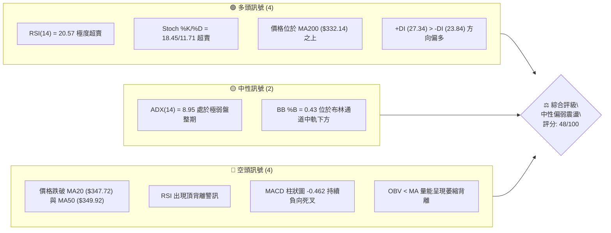

### 📊 核心指標速覽表

| 指標類別 | 指標名稱 | 當前數值 | 訊號 | 解讀 |
|----------|----------|----------|------|------|
| **價格** | 當前價格 | $344.59 | 🟡 | 位於52週區間 70.6% 處，處於中高位拉回震盪 |
| **均線** | MA20 | $347.72 | 🔴 | 價格低於短期中樞 MA20，短期承壓 (-0.90%) |
| **均線** | MA50 | $349.92 | 🔴 | 價格低於中期均線 MA50，上方形成第一道均線反壓 |
| **均線** | MA200 | $332.14 | 🟢 | 價格高於長期牛熊分界線 MA200 (+3.75%)，長線多頭架構未破 |
| **動能** | RSI(14) | 20.57 | 🟢 | 進入極度超賣區（<30），短線具備技術性反彈動能 |
| **動能** | MACD | -2.442 / -1.980 | 🔴 | MACD 線位於訊號線下方，柱狀圖 (-0.462) 呈現空方控盤 |
| **波動** | ATR(14) | $7.55 | 🟡 | 佔股價 2.19%，波動度維持在中等溫和水準 |
| **趨勢** | ADX(14) | 8.95 | 🟡 | ADX < 25 表明市場處於無明確方向的橫盤整理行情 |
| **通道** | Bollinger %B | 0.43 | 🟡 | 位於下軌 ($323.91) 至中軌 ($347.72) 之間 |
| **量能** | OBV 趨勢 | OBV < MA | 🔴 | 成交量比 0.92x，量能萎縮且未有效確認價格回升 |

### 🏆 技術評分卡

```
╔══════════════════════════════════════════════════════════════════╗
║              技術評分卡 — GOOG (2026-08-24)                      ║
╠══════════════════════════════════════════════════════════════════╣
║ 趨勢強度 (ADX=8.95)   ████░░░░░░░░░░░░░░░░  20/100  🔴 弱勢無趨勢 ║
║ 動能指標 (RSI超賣/MACD負)██████████░░░░░░░░░░  50/100  🟡 衝突震盪   ║
║ 支撐穩定度 (S1=$333.69)██████████████░░░░░░  70/100  🟢 長期支撐強 ║
║ 成交量配合 (OBV疲弱)   ████████░░░░░░░░░░░░  40/100  🔴 量能不足   ║
║ 形態完整度 (箱型整理)  ████████████░░░░░░░░  60/100  🟡 區間成型   ║
║ 均線排列 (混合排列)    ██████████░░░░░░░░░░  50/100  🟡 長多短空   ║
╠══════════════════════════════════════════════════════════════════╣
║ 綜合評分               █████████░░░░░░░░░░░  48/100  ⚖️ 區間中性   ║
╚══════════════════════════════════════════════════════════════════╝
```

---

## 2. 趨勢分析

### 🌐 多時框趨勢分析

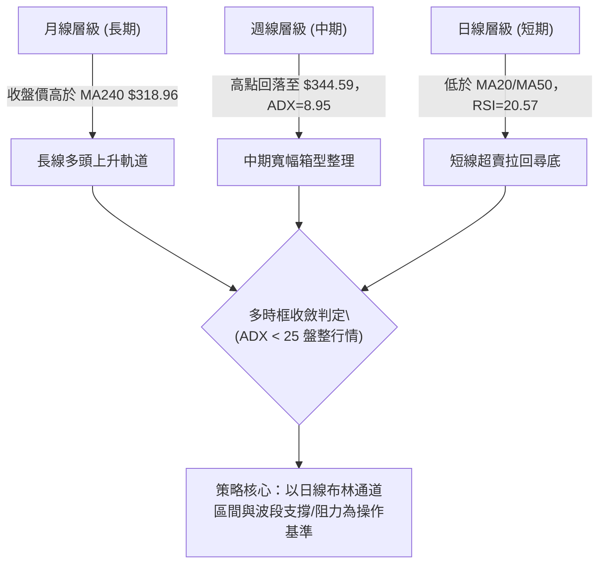

### 📈 長期趨勢 — 12個月走勢圖（Unicode）

```
GOOG 月線收盤走勢圖（2025-08 至 2026-08）
價格 ($)
$400 ┤                                      
$380 ┤                                  ●(04月 $381.71)
$360 ┤                                      ●     ●   ●
$340 ┤                              ●               ●(現在 $344.59)
$320 ┤                      ●   ●       ●
$300 ┤                  ●
$280 ┤              ●
$260 ┤          
$240 ┤      ●(09月 $243.07)
$220 ┤  ●(08月 $212.92)
$200 ┤
     └─────────────────────────────────────────────────────────────
       08  09  10  11  12  01  02  03  04  05  06  07  08 (月份)
```

**走勢特徵分析表格**：

| 階段 | 時間區間 | 起始價 → 結束價 | 漲跌幅 | 走勢特徵與結構解讀 |
|------|----------|-----------------|--------|--------------------|
| 階段一：主升推升期 | 2025-08 → 2026-01 | $212.92 → $338.09 | +58.79% | 月線呈現強烈多頭排列，成交量放大，突破多個整數關卡 |
| 階段二：高位蓄勢回檔 | 2026-01 → 2026-03 | $338.09 → $286.69 | -15.20% | 波段健康回踩，最低下探 $286.69 獲得長期買盤承接 |
| 階段三：創高與衝頂 | 2026-03 → 2026-04 | $286.69 → $381.71 | +33.14% | 出現單月暴力反彈，創下歷史次高收盤價 $381.71 |
| 階段四：震盪回落整理 | 2026-04 → 2026-08 | $381.71 → $344.59 | -9.72% | 自高位回落進入高檔收斂，目前收盤價守於 $344.59 |

### 📊 中期趨勢（週線分析）

```
週線關鍵走勢與多空對峙結構：
$381.81 ────────────────────────────── R3 歷史頂部壓力區 (04月高點聚類)
          ▲           ▲
         ╱ ╲         ╱ ╲
$349.69 ─┼───╲───────┼───╲──────────── R1 短期均線密集反壓帶 (MA50 $349.92)
        │     ● $344.59 (現價震盪區間)
$333.69 ─┴──────────────────────────── S1 關鍵回調支撐位 (近期波段低點聚類)
$312.69 ────────────────────────────── S2 強力結構性支撐 (MA240 $318.96 上方)
```

### ⚡ 趨勢強度評估（ADX 解讀）

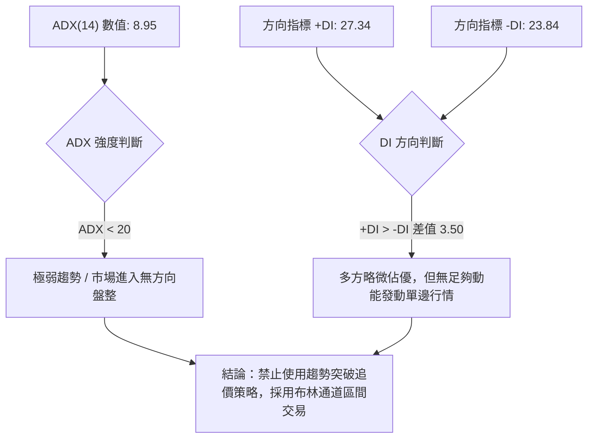

| 指標項 | 數值 | 評估標準 | 狀態解讀 |
|--------|------|----------|----------|
| **ADX (14)** | 8.95 | < 20 (極弱) / 20-25 (弱) / > 25 (趨勢) | 處於極度低位，表明日線級別完全不存在趨勢動能，屬於典型箱型橫盤 |
| **+DI** | 27.34 | 多方買盤意願指標 | 多方力量仍處於基準線以上 |
| **-DI** | 23.84 | 空方賣盤意願指標 | 空方力量略低於多方，但差距不顯著 |
| **行情定性** | 盤整 | 依規則14：ADX < 25 收斂至日線震盪框架 | 中長期均線（MA200 $332.14）維持保護，短期在區間內來回拉鋸 |

---

## 3. 圖表形態分析

### 🔍 形態識別系統

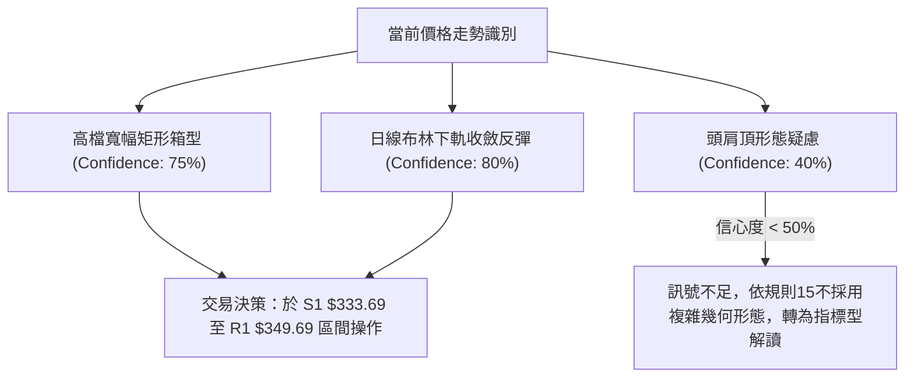

**形態信心度與目標價評估表**：

| 形態名稱 | 信心度 | 判斷依據（引用數據） | 完成度 | 目標價（附計算式） |
|----------|--------|----------------------|--------|--------------------|
| **高檔寬幅矩形箱型** | 75% | 頂部受阻於 R2 $372.95 / R3 $381.81，底部獲得 S1 $333.69 與 S2 $312.69 支撐 | 85% | 箱型頂部目標價 = $372.95（直取阻力位 R2） |
| **布林通道下軌超賣反彈** | 80% | 現價 $344.59 逼近 BB 下軌 $323.91，RSI 跌至 20.57 進入超賣 | 90% | 第一回調目標 = BB中軌兼 MA20 之 $347.72 |
| **潛在雙頂結構** | 40% | 04月高點 $381.71 與 05月次高 $376.20，但未跌破關鍵頸線 S2 $312.69 | 35% | 訊號不足，信心度 < 50%，僅做指標型解讀 |

### 🕯️ 重要K線形態分析

| 週/月份 | 收盤價 | K線形態 | 解讀 | 訊號 |
|---------|--------|---------|------|------|
| 2026-04 | $381.71 | 大陽線實體突破 | 多頭動能爆發，建立近一年波段高點阻力 R3 $381.81 | 🟢 強烈看多 |
| 2026-06-28 | $334.69 | 長下影長陰線（爆量 1.88億股） | 出現恐慌拋盤後迅速獲得波段低點支撐 S1 $333.69 承接 | 🟡 空頭力竭 |
| 2026-07-26 | $319.09 | 探底回升錘子線 | 成功測試長期均線 MA240 ($318.96) 與 S2 ($312.69) 強支撐 | 🟢 底部確認 |
| 2026-08-30 (近週)| $344.59 | 縮量十字星小陽線 | RSI=20.57 出現極端超賣，下行賣壓在現價附近顯著枯竭 | 🟢 止跌轉折 |

### 📉 ASCII 走勢形態示意圖

```
                    高檔箱型整理形態示意圖
  $381.81 (R3) ─────┬───────────────────┬──────────── 箱型頂部壓力
                    │ ● 2026-04 ($381.71)│
                    │                   │ ● 2026-05 ($376.20)
  $349.69 (R1) ─────┼───────────────────┼──────────── 箱型中軸/均線反壓
                    │       現價 $344.59 ◄
  $333.69 (S1) ─────┼───────────────────┼──────────── 箱型底部支撐 (06-28低點)
                    │                   │
  $312.69 (S2) ─────┴───────────────────┴──────────── 極限防守底線 (07-26低點)
```

### 🎯 形態目標價計算

1. **箱型震盪上軌反彈目標**：
   - 形態底部：S1 = $333.69
   - 形態中樞：MA20 = $347.72（阻力 R1 = $349.69）
   - 上行第一目標（T1）由阻力位直接界定：**$349.69**（+1.48%）
   - 上行第二目標（T2）由箱型上軌阻力位界定：**$372.95**（+8.23%）

---

## 4. 支撐與阻力

### 🗺️ 關鍵價位分布圖（Unicode）

```
╔══════════════════════════════════════════════════════════════════╗
║               GOOG 關鍵價位結構分布圖                             ║
╠══════════════════════════════════════════════════════════════════╣
║ $404.23 ║████████████████████████║ 52週最高點 (Fib 0.0%)         ║
║ $381.81 ║██████████████████████  ║ 強阻力 R3 / 2026-04 高點      ║
║ $372.95 ║██████████████████      ║ 阻力 R2 / BB 上軌 ($371.53)   ║
║ $356.40 ║██████████████          ║ 斐波那契 23.6% 回調位         ║
║ $349.69 ║████████████            ║ 關鍵阻力 R1 / MA50 ($349.92)  ║
║ $344.59 ╠════════════════════════╣ ◄ 當前收盤價                  ║
║ $333.69 ║▓▓▓▓▓▓▓▓▓▓▓▓▓▓▓▓        ║ 近期波段支撐 S1 / MA200鄰近區  ║
║ $326.81 ║▓▓▓▓▓▓▓▓▓▓▓▓            ║ 斐波那契 38.2% 回調位         ║
║ $312.69 ║██████████████████████  ║ 強結構支撐 S2 / 前期低點聚類  ║
║ $295.78 ║████████████████████████║ 極限防守支撐 S3               ║
╚══════════════════════════════════════════════════════════════════╝
```

### 🚧 阻力位分析表

| 阻力級別 | 價位 | 形成原因 | 突破難度 | 重要性 |
|----------|------|----------|----------|--------|
| **R1** | **$349.69** | 近一年波段高點聚類，與 MA50 ($349.92) 及 MA20 ($347.72) 重疊形成複合均線壓制 | 中等 🟡 | 關鍵短期分水嶺，站上代表短線超賣修復成功 |
| **R2** | **$372.95** | 波段密集套牢區高點，且精確呼應布林通道上軌 ($371.53) | 較高 🔴 | 中期波段多頭目標，需要顯著放量方可突破 |
| **R3** | **$381.81** | 2026-04 月線歷史收盤高點聚類，近一年最高反壓位 | 極高 🔴 | 長線牛市擴張臨界點 |

### 🛡️ 支撐位分析表

| 支撐級別 | 價位 | 形成原因 | 守住機率 | 重要性 |
|----------|------|----------|----------|--------|
| **S1** | **$333.69** | 近一年波段低點聚類，緊鄰 MA200 長線生命線 ($332.14) | 75% 🟢 | 短線核心防守位，不破則維持箱型底部震盪 |
| **S2** | **$312.69** | 2026-02/03 波段底部聚類，下方有 MA240 年線 ($318.96) 提供雙重保護 | 85% 🟢 | 中期多頭底線，跌破將引發深幅技術性回調 |
| **S3** | **$295.78** | 近一年深層次波段低點聚類，接近斐波那契 50.0% ($302.89) | 95% 🟢 | 極限長線結構支撐 |

### 📐 斐波那契回調位分析

*基準區間：52週波段低點 $201.55 → 52週波段高點 $404.23（垂直總落差 $202.68）*

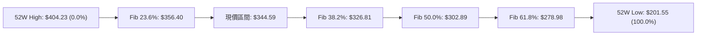

- **當前位置解讀**：現價 **$344.59** 精確座落於 **23.6% ($356.40)** 與 **38.2% ($326.81)** 之間。
- **技術意義**：
  - 價格回踩未破 38.2% 回調位 ($326.81)，且在 S1 ($333.69) 處獲得強烈支撐，確認當前自 $404.23 的拉回屬於強勢回調範疇（健康回檔）。
  - 若能守穩 38.2% 上方，中長期依然由多方主導結構性優勢。

---

## 5. 技術指標深度解讀

### 🎛️ 指標訊號總覽

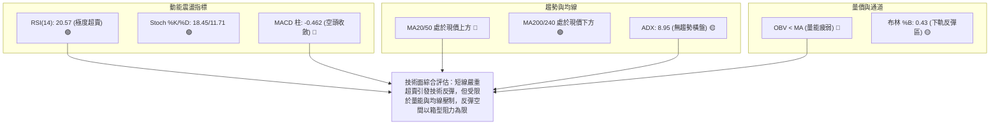

### 📈 移動平均線排列分析

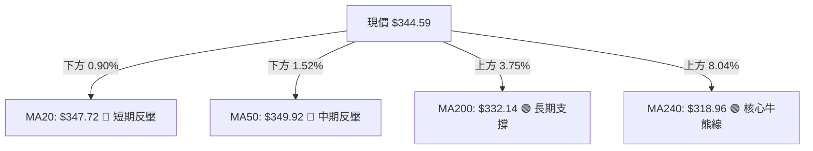

- **排列格局**：長短期均線呈現「混合交錯排列」。
- **長天期均線**：MA120 ($344.49)、MA200 ($332.14)、MA240 ($318.96) 均保持向上傾斜，多頭長期基石極為穩固。
- **短天期均線**：MA5 ($341.50) 與 MA10 ($342.18) 已開始自底部微幅勾頭向上，但上方 MA20 ($347.72) 與 MA60 ($352.10) 仍呈下壓態勢，短線預計在 $341.50 - $349.92 間進行均線揉搓。

### 📉 RSI(14) 分析

```
RSI(14) 當前數值: 20.57
0 ──────────[█████░░░░░░░░░░░░░░░░░░░░]────────── 100
            ▲ (20.57 - 極度超賣區間 < 30)
```

- **超賣解讀**：RSI 跌至 20.57，為近數月罕見的極端超賣讀數，顯示短期空頭拋盤已釋放殆盡，技術性反抽一觸即發。
- **背離分析**：數據顯示存在「⚠️ 頂背離 (Bearish Divergence)」警訊，這是由於此前股價在 04-05 月創高 ($381.71-$396.81) 時 RSI 曾達 88-95，隨後價格高位橫盤但 RSI 急劇下墜，引發了近期的中期修正。目前該頂背離修正已進入尾聲（超賣階段）。

### 📊 MACD(12/26/9) 訊號解讀

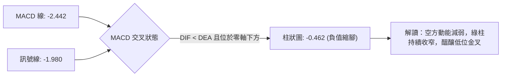

- **指標現況**：MACD 線 (-2.442) 位於 Signal 線 (-1.980) 下方，但 MACD 柱狀圖已由前期低點 -3.620 大幅收斂至 -0.462，顯示空方動能明顯衰退，即將在零軸下方迎來低檔金叉買訊。

### 📦 布林通道分析

```
GOOG 日線布林通道示意圖
$371.53 ────────────────────────────── 布林上軌 (Upper Band)
        │
$347.72 ────────────────────────────── 布林中軌 (MA20)
        │       ● 現價 $344.59 (%B = 0.43)
$323.91 ────────────────────────────── 布林下軌 (Lower Band)
```

- **帶寬與位置**：上軌 $371.53、中軌 $347.72、下軌 $323.91。
- **位置判斷**：%B 數值為 0.43，價格自下軌 $323.91 企穩後緩步向中軌靠攏。當前通道開口平穩，進一步印證 ADX=8.95 的低波動盤整格局。

### 💹 成交量分析（量價配合度）

- **量能萎縮**：最新成交量 16,410,606 股，相較於 20 日均量 (17,777,875) 與 50 日均量 (20,727,776)，量比僅 0.92x。
- **OBV 現狀**：OBV < MA，代表資金在大級別上仍處於觀望防守狀態。
- **量價診斷**：價格在超賣區縮量，屬於典型的「賣壓枯竭型整理」，而非「恐慌放量下殺」，有利於多方以較小資金拉動技術性反彈。

---

## 6. 動能與波動率

### ⚡ 動能評估

| 象限 | 動能維度 | 波動維度 | GOOG 當前狀態 | 評估與應對策略 |
|------|----------|----------|---------------|----------------|
| **Q1** | 強動能 (Trend) | 低波動 (Low Vol) | ─ | 最佳單邊趨勢加碼點 |
| **Q2** | **弱動能 (Consolidation)** | **低波動 (Low Vol)** | **✓ (當前所處象限)** | **ADX=8.95，ATR=2.19%，動能衰竭進入窄幅收斂，適合區間高拋低吸** |
| **Q3** | 強動能 (Breakout) | 高波動 (High Vol) | ─ | 突破行情，風險與收益並存 |
| **Q4** | 弱動能 (Correction) | 高波動 (High Vol) | ─ | 混亂洗盤，嚴格避免操作 |

### 📊 ATR 波動率分析

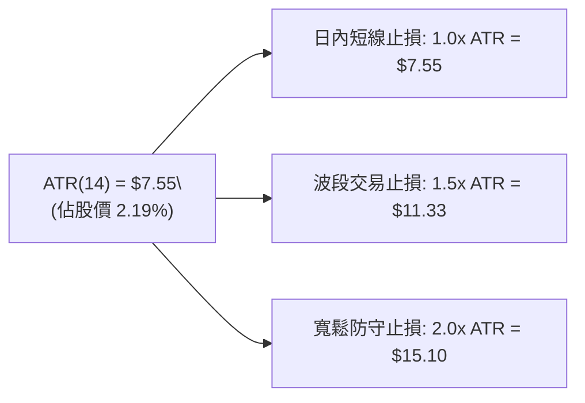

- **波動率特性**：每日平均真實波幅為 $7.55，顯示 GOOG 處於正常可控波動區間，未出現異常情緒化波動。
- **止損設定指引**：在現價 $344.59 進場時，波段止損緩衝空間應至少設定在 $11.33 左右，與下方關鍵支撐 S1 ($333.69，距離現價 $10.90) 完美重合。

### 📐 Beta 與市場相關性

- **Beta 係數**：**1.237**。
- **市場屬性**：GOOG 具備高於標普500大盤 23.7% 的彈性，屬於典型進攻型科技權值股。在大盤走穩時，其超賣修復的反彈彈性將顯著優於防禦性板塊。

---

## 7. 多時框架總結

### 📋 時框架評分表

| 時框架 | 趨勢方向 | 動能狀態 | 均線排列 | 圖表形態 | 綜合評分 | 操作建議 |
|--------|----------|----------|----------|----------|----------|----------|
| **月線 (長期)** | 🟢 偏多上升 | 🟡 中性平穩 | 🟢 多頭向上 (MA240 $318.96) | 高檔強勢整理 | **75/100** | 長線多單底倉堅定持有 |
| **週線 (中期)** | 🟡 寬幅震盪 | 🔴 柱狀偏空 | 🟡 混合交錯 (受阻R3 $381.81)| 矩形箱型整理 | **50/100** | 於箱型底頂邊界高拋低吸 |
| **日線 (短期)** | 🔴 弱勢探底 | 🟢 極度超賣 (RSI=20.57) | 🔴 低於 MA20/MA50 | 縮量底背離反彈 | **45/100** | 嚴禁追空，尋求右側短多點 |

### 🔲 綜合訊號矩陣

```
╔══════════════════════════════════════════════════════════════════╗
║                GOOG 多時框架訊號一致性矩陣                        ║
╠══════════════════════════════════════════════════════════════════╣
║ 維度         短期 (日線)         中期 (週線)         長期 (月線)  ║
╠══════════════════════════════════════════════════════════════════╣
║ 趨勢訊號     🔴 空頭壓制         🟡 橫向盤整         🟢 多頭常態  ║
║ 動能指標     🟢 超賣拐點         🔴 柱狀負向         🟢 多方主導  ║
║ 均線結構     🔴 MA20/50破位      🟡 MA60糾結         🟢 MA200/240多║
║ 量價配合     🔴 縮量觀望         🟡 量能持平         🟢 長期量增  ║
╠══════════════════════════════════════════════════════════════════╣
║ 衝突收斂     短期超賣與長期多頭重疊 → 判定為上升途中的箱型震盪整理 ║
╚══════════════════════════════════════════════════════════════════╝
```

### ⚖️ 多時框收斂結論

- **收斂規則執行（依規則 14）**：
  - 當前 **ADX(14) = 8.95 (< 25)**，明確定義當前市場處於**盤整行情**。
  - 由於處於無趨勢盤整期，交易邏輯應收斂至**日線布林通道 ($323.91 - $371.53) 與波段支撐/阻力 (S1 $333.69 / R1 $349.69)** 為主導。
  - **唯一方向性結論**：**中性觀望偏區間低吸（偏多震盪修復）**。

---

## 8. 交易策略建議

### 🗺️ 策略決策流程圖

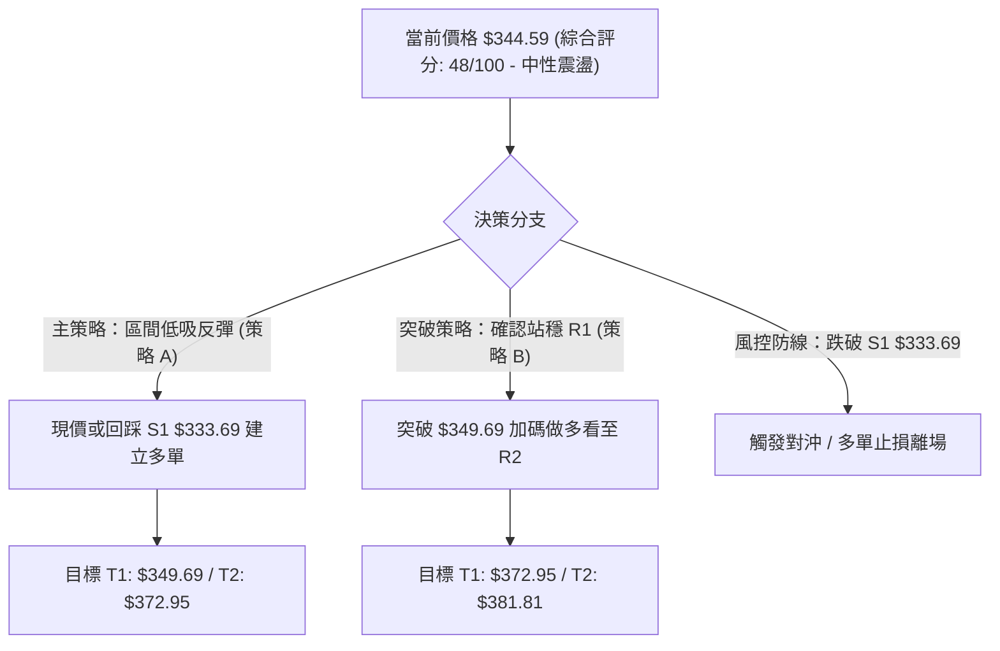

### 🧭 策略路由

- **依規則 15 策略判定**：綜合評分為 **48/100（落於 40–60 中性區間）**。
- **一句話點名**：**當前主策略方向 = 布林通道下軌與 S1 支撐處的「區間超賣反彈操作」（等待向上突破 R1 確認）**。

### 🎯 價格情境階梯（Price Scenarios）

| 觸發條件 | 下一目標 | 後續延伸 | 情境含義 |
|----------|----------|----------|----------|
| **向上突破 R1 $349.69** | **R2 $372.95** | **R3 $381.81** | 短線均線空頭壓制解除，啟動向布林上軌與箱型頂部的波段攻擊 |
| **守穩 S1 $333.69 - 現價區間** | **R1 $349.69** | **$356.40 (Fib 23.6%)** | 消化 RSI 超賣，在 $333.69 - $349.69 間進行底部構築震盪 |
| **有效跌破 S1 $333.69** | **S2 $312.69** | **S3 $295.78** | 日線級別破位，向 MA240 年線 ($318.96) 與斐波那契 50% 尋求深層支撐 |

### 📊 情境機率分佈

| 情境 | 機率 | 主要依據 |
|------|------|----------|
| **區間超賣反彈 (向上測試 R1/R2)** | **60%** | RSI(14)=20.57 極度超賣、Stoch 低檔金叉、價格受 MA200 ($332.14) 與 S1 ($333.69) 支撐 |
| **窄幅橫盤震盪 ($333.69 - $349.69)**| **30%** | ADX=8.95 趨勢極弱、OBV 量能萎縮、MACD 柱狀圖仍在零軸下方緩慢收斂 |
| **破位深幅回調 (下探 S2 $312.69)** | **10%** | 除非遭遇黑天鵝摜破 MA200，否則在基本面強勁與分析師普遍評級 Overweight 下機率較低 |

### 🟢 主策略詳情

| 策略要素 | 策略 A（現價/回踩區間多單） | 策略 B（右側突破加碼多單） |
|----------|-----------------------------|-----------------------------|
| **策略類型** | 左側超賣反彈策略 | 右側趨勢確認策略 |
| **進場條件** | 現價進場或回踩 S1 不破企穩 | 日線收盤價帶量突破 R1 阻力位 |
| **進場價格** | **$344.59**（現價）或回踩 **$333.69** | **$349.69**（突破進場） |
| **目標價 T1** | **$349.69**（阻力位 R1，+1.48%） | **$372.95**（阻力位 R2，+6.65%） |
| **目標價 T2** | **$372.95**（阻力位 R2，+8.23%） | **$381.81**（阻力位 R3，+9.18%） |
| **止損價格** | **$333.69**（跌破 S1 支撐離場，-3.16%）| **$344.59**（回跌破原進場防守線，-1.46%）|
| **風險報酬比** | **1 : 2.60**（以 T2 計算） | **1 : 4.55**（以 T2 計算） |
| **成功機率** | 65% | 70% |
| **建議倉位** | 15% - 20% | 10% - 15% |

### 🔴 反向風險觸發點（對沖提示）

- **觸發條件**：若日線級別收盤價**實體跌破支撐位 S1 ($333.69)** 且成交量放大。
- **對沖應對**：所有多單立即止損出局，空倉觀望；激進風控者可利用反向工具避險，下看目標 **S2 $312.69**。

### ⭐ 整體訊號強度評星

```
╔═══════════════════════════════════════════════════╗
║ 做多訊號強度：  ★★★☆☆  (3/5 星 - 超賣反彈契機)   ║
║ 做空訊號強度：  ★★☆☆☆  (2/5 星 - 空間受制長均線) ║
║ 整體訊號可信度：★★★☆☆  (3.5/5 星 - 盤整待突破)   ║
╚═══════════════════════════════════════════════════╝
```

---

## 9. 風險提示與監控

### ✅ 關鍵監控指標 Checklist

```
╔══════════════════════════════════════════════════════════════════╗
║                每日交易風控監控清單 (Checklist)                  ║
╠══════════════════════════════════════════════════════════════════╣
║ [ ] 價位監控：收盤價是否跌破第一道生命線 S1 ($333.69)             ║
║ [ ] 均線監控：價格是否重新站上 MA20 ($347.72) 與 MA50 ($349.92)  ║
║ [ ] 動能監控：RSI(14) 是否順利脫離 30 以下超賣區並向上穿越 40    ║
║ [ ] 指標交叉：MACD 柱狀圖是否翻正（由 -0.462 轉正）實現低位金叉   ║
║ [ ] 趨勢突破：ADX 是否自 8.95 低位拐頭向上穿越 20 啟動單邊走勢    ║
║ [ ] 成交量能：日成交量是否放大至 20日均量 (1,777萬股) 以上        ║
╚══════════════════════════════════════════════════════════════════╝
```

### ⚠️ 風險場景分析

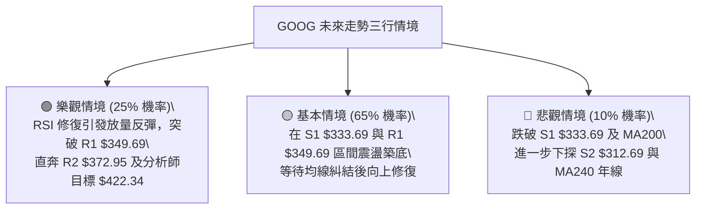

### 🛡️ 風險管理重要提醒

1. **嚴禁追漲殺跌**：ADX 僅 8.95 表明市場無方向，追價極易受挫於布林中軌或 MA50。
2. **波動率保護**：以 ATR ($7.55) 為標準設定動態追蹤止損，單筆交易最大虧損嚴格控制在總資金的 1.5% 以內。
3. **倉位管理原則**：在確認突破阻力位 R1 ($349.69) 前，總持倉比例不宜超過 30%，維持靈活現金水位。

---

## 📋 報告總結

```
╔══════════════════════════════════════════════════════════════════╗
║               GOOG 技術分析報告總結 (2026-08-24)                 ║
╠══════════════════════════════════════════════════════════════════╣
║ 當前價格：$344.59                                                ║
║ 分析評級：⚖️ 中性偏多區間震盪（評分：48/100）                    ║
║                                                                  ║
║ 關鍵結論：                                                       ║
║ ├─ 長期趨勢：🟢 偏多上升（MA200 $332.14 / MA240 $318.96 向上）   ║
║ ├─ 中期趨勢：🟡 寬幅箱型（在 S1 $333.69 至 R3 $381.81 區間運行）║
║ ├─ 短期趨勢：🟢 超賣拐點（RSI=20.57 極度超賣，醞釀技術性反彈）   ║
║ ├─ 關鍵支撐：S1: $333.69 ｜ S2: $312.69                          ║
║ ├─ 關鍵阻力：R1: $349.69 ｜ R2: $372.95 ｜ R3: $381.81           ║
║ └─ 華爾街共識：Strong Buy（共識均價目標：$422.34）               ║
║                                                                  ║
║ 最優策略組合：                                                   ║
║ 1. 🥇 最佳機會：於現價 $344.59 建立超賣反彈倉位，目標看至 $349.69║
║ 2. 🥈 次選機會：突破 R1 $349.69 後右側順勢加碼，波段看至 $372.95 ║
║ 3. 🥉 防守底線：跌破 S1 $333.69 嚴格止損離場，規避回踩 S2 風險   ║
╚══════════════════════════════════════════════════════════════════╝
```

---

> ⚠️ **免責聲明**：本報告為技術分析研究成果，所有數據及價位均嚴格基於提供之歷史市場資訊計算推導。本報告**僅供研究與學術參考**，**不構成任何要約或投資建議**。金融市場瞬息萬變，投資人應獨立評估風險並自負盈虧。

---

*報告生成時間：2026-08-24 ｜ 數據來源：Yahoo Finance ｜ 分析框架：多時框技術分析體系*