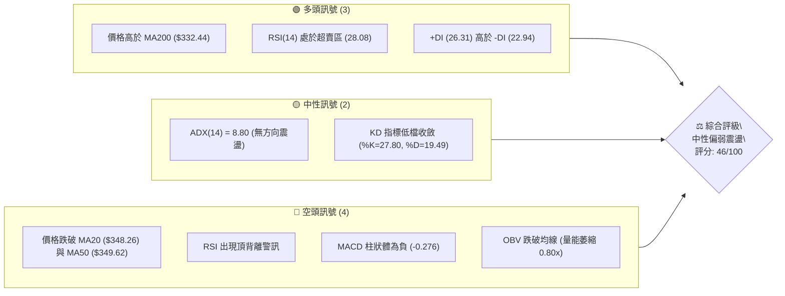
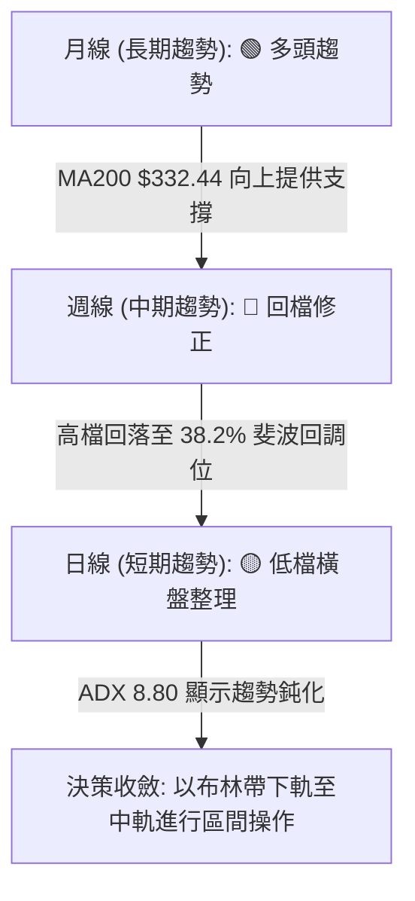
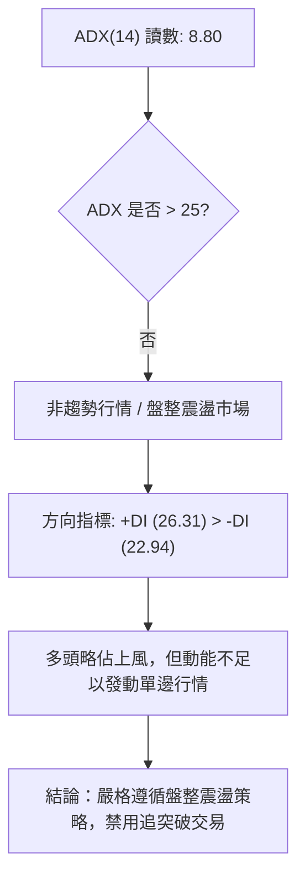
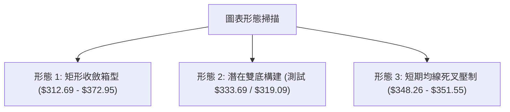
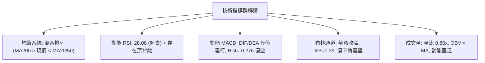
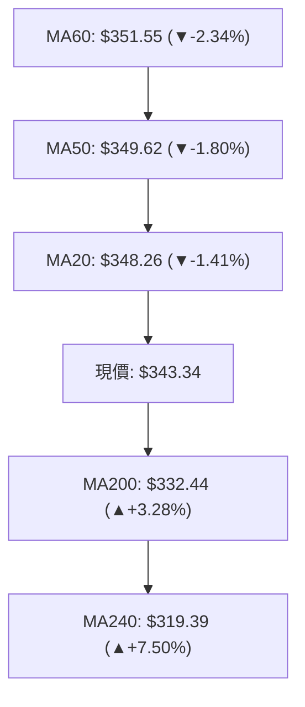
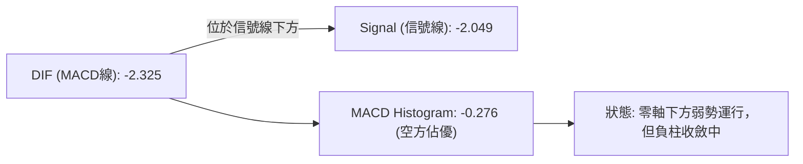
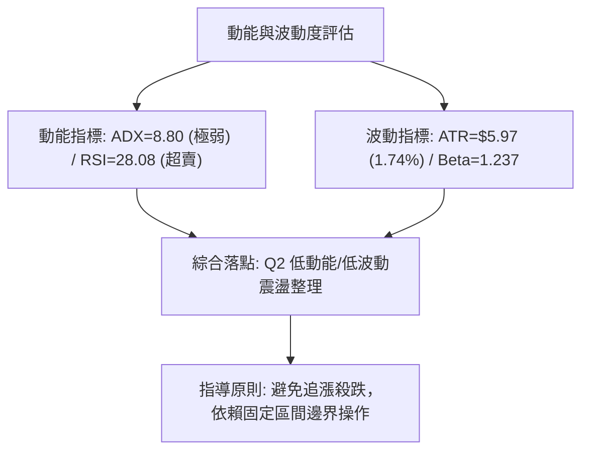
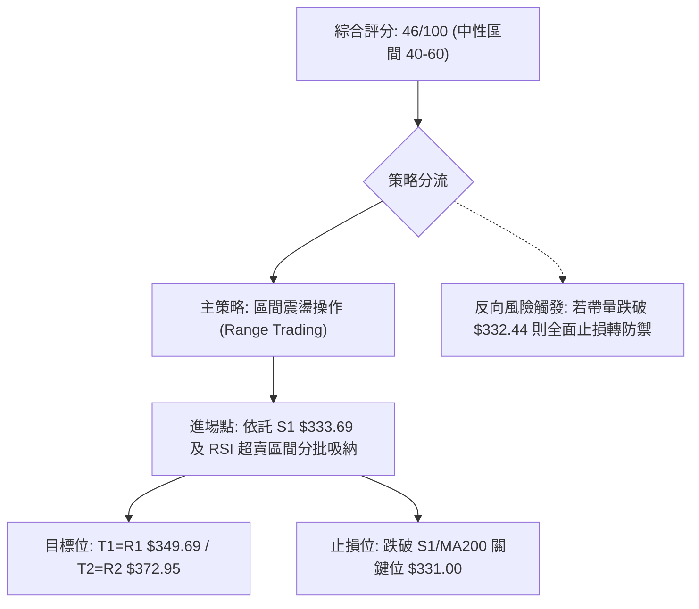
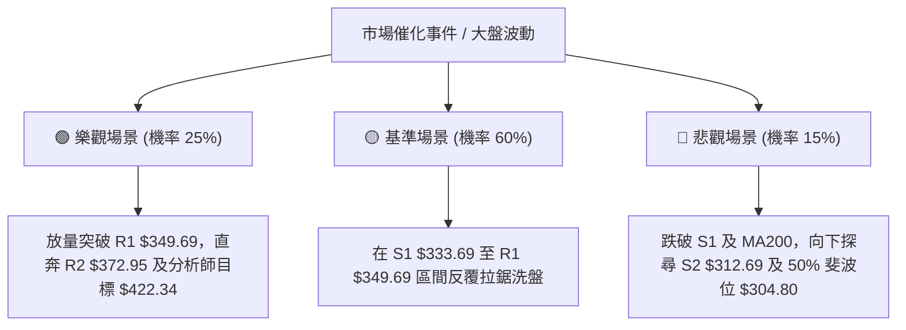

# GOOG 技術分析報告

> **報告日期**：2026-08-25 ｜ **語言**：繁體中文 ｜ **數據來源**：Yahoo Finance ｜ **當前價格**：$343.34

---

## 目錄

| 章節 | 內容 |
|------|------|
| [1. 技術面概覽](#1-技術面概覽) | 訊號儀表板、核心指標、評分卡 |
| [2. 趨勢分析](#2-趨勢分析) | 多時框趨勢、長中短期走勢 |
| [3. 圖表形態分析](#3-圖表形態分析) | 形態識別、K線組合、目標價 |
| [4. 支撐與阻力](#4-支撐與阻力) | 關鍵價位、斐波那契回調 |
| [5. 技術指標深度解讀](#5-技術指標深度解讀) | MA/RSI/MACD/布林/成交量 |
| [6. 動能與波動率](#6-動能與波動率) | 動能評估、ATR、Beta |
| [7. 多時框架總結](#7-多時框架總結) | 時框架評分矩陣 |
| [8. 交易策略建議](#8-交易策略建議) | 多空策略、風險報酬比 |
| [9. 風險提示與監控](#9-風險提示與監控) | 監控指標、風險場景 |

---

## 1. 技術面概覽

### 🎯 技術訊號儀表板



### 📊 核心指標速覽表

| 指標類別 | 指標名稱 | 當前數值 | 訊號 | 解讀 |
|----------|----------|----------|------|------|
| **價格** | 當前價格 | $343.34 | 🟡 中性 | 位於 52 週高低區間之 69.4%，處於回檔整理期 |
| **均線** | MA20 | $348.26 | 🔴 偏空 | 價格位於 MA20 下方 (-1.41%)，短期承壓 |
| **均線** | MA50 | $349.62 | 🔴 偏空 | 價格位於 MA50 下方 (-1.80%)，中期動能減弱 |
| **均線** | MA200 | $332.44 | 🟢 偏多 | 價格高於 MA200 (+3.28%)，長期牛市基底尚存 |
| **動能** | RSI(14) | 28.08 | 🟢 超賣 | 進入極度超賣區間 (<30)，具技術性反彈動能 |
| **動能** | MACD(12,26,9) | -2.325 | 🔴 看空 | DIF 低於 Signal (-2.049)，柱狀圖 -0.276 延續空方 |
| **趨勢** | ADX(14) | 8.80 | 🟡 盤整 | ADX < 25 表明無明確趨勢，處於低波動箱型整理 |
| **通道** | Bollinger %B | 0.39 | 🟡 中性 | 位於布林通道中下軌之間 ($325.42 - $348.26) |
| **量能** | 20日成交量比 | 0.80x | 🔴 偏空 | 現量 1,399.6 萬低於均量 1,743.2 萬，量縮量價背離 |
| **波動** | ATR(14) | $5.97 | 🟡 中性 | 每日波動幅度 1.74%，波動度處於常態偏低水準 |

### 🏆 技術評分卡

```
╔══════════════════════════════════════════════════════════════╗
║              技術評分卡 — GOOG (2026-08-25)                 ║
╠══════════════════════════════════════════════════════════════╣
║ 趨勢強度      ████░░░░░░░░░░░░░░░░  22/100  🔴 極弱趨勢     ║
║ 動能指標      ████████░░░░░░░░░░░░  40/100  🟡 超賣反彈預期 ║
║ 支撐穩定度    ████████████░░░░░░░░  60/100  🟡 S1/MA200托底 ║
║ 成交量配合    ██████░░░░░░░░░░░░░░  32/100  🔴 量能顯著萎縮 ║
║ 形態完整度    ████████████░░░░░░░░  62/100  🟡 箱型箱底測試 ║
║ 均線排列      ████████████░░░░░░░░  60/100  🟡 長多短空糾結 ║
╠══════════════════════════════════════════════════════════════╣
║ 綜合評分      █████████░░░░░░░░░░░  46/100  ⚖️ 區間震盪觀望 ║
╚══════════════════════════════════════════════════════════════╝
```

---

## 2. 趨勢分析

### 🌐 多時框趨勢分析



### 📈 長期趨勢 — 12個月走勢圖（ASCII）

```
GOOG 月線走勢圖（2025-08 至 2026-08）
價格軸 ($)
$400 ┤                                      
$380 ┤                            ●(04月:381.71)
$360 ┤                                █     ●(07月:356.65)
$340 ┤                    ●(01月:338) █  █  █  █←現價 $343.34
$320 ┤              ●(11月:319) █     █  █  █  █  
$300 ┤              █     █     █  ●(03月:286.69)
$280 ┤        ●(10月:281) █     █
$260 ┤        █     █     █     █
$240 ┤  ●(09月:243) █     █     █
$220 ┤●(08月:212)
     └─────────────────────────────────────────────────────
      08  09  10   11    12    01  02 03 04 05 06 07 08 (月份)
```

#### 走勢特徵分析表格

| 階段 | 時間跨度 | 價格區間 | 累積漲跌幅 | 走勢特徵與技術解讀 |
|------|----------|----------|------------|--------------------|
| **第1階段：主升浪** | 2025-08 ~ 2025-11 | $212.92 → $319.49 | +50.05% | 放量單邊上攻，月線連續收長紅，各級均線多頭發散 |
| **第2階段：高檔震盪** | 2025-12 ~ 2026-03 | $313.39 → $286.69 | -8.52% | 衝高 $338.09 後快速回洗至 $286.69，構築大型中期洗盤區 |
| **第3階段：二次衝頂** | 2026-04 ~ 2026-05 | $381.71 → $376.20 | +33.14% | 強勢突破創歷史/52W新高 $404.23，隨後動能減弱出現量價背離 |
| **第4階段：弱勢回調** | 2026-06 ~ 2026-08 | $353.33 → $343.34 | -8.74% | 震盪陰跌，測試 MA200 與支撐位 S1 ($333.69)，波動率降低 |

### 📊 中期趨勢（週線分析）

```
週線關鍵壓力與支撐示意圖
$404.23 ─── 52W 最高點 (波段大頂部)
           │
$381.81 ─── 強阻力 R3 (2026-05-03 週收盤高點聚類)
$372.95 ─── 阻力 R2 (布林上軌附近阻力帶)
$349.69 ─── 關鍵阻力 R1 (MA50/MA20 聚集群)
$343.34 ═══ 【現價】(RSI=28.08 超賣)
$333.69 ─── 近期支撐 S1 (2026-06-28 週低點聚類 & MA200)
$312.69 ─── 強支撐 S2 (2026-07-26 週回踩低點聚類)
$205.36 ─── 52W 最低點 (長期上升趨勢起點)
```

中期週線在 2026 年 5 月於 $396.81 見頂後形成「頭部推擠」，MACD 週線柱狀體由正轉負（從 +5.204 快速衰退至 -0.276），目前進入第 15 週的橫向修正。

### ⚡ 趨勢強度評估（ADX 解讀）



#### ADX 趨勢強度對照表

| ADX 數值區間 | 當前數值 | 趨勢狀態 | 交易策略指示 |
|--------------|----------|----------|--------------|
| 0 - 20 | **8.80** | **極弱趨勢 / 盤整無方向** | **高拋低吸，以布林下軌至上軌為主要操作邊界** |
| 20 - 25 | - | 弱趨勢 / 醞釀期 | 觀察突破方向，減少持倉規模 |
| 25 - 40 | - | 強趨勢建立 | 順勢交易，均線回踩進場 |
| 40 - 100 | - | 極強趨勢 / 單邊暴拉或暴跌 | 抱緊部位，移動止損跟蹤 |

---

## 3. 圖表形態分析

### 🔍 形態識別系統



#### 形態信心度評估表

| 形態名稱 | 信心度 | 判斷依據（引用數據） | 完成度 | 目標價（附精確計算式） |
|----------|--------|----------------------|--------|------------------------|
| **箱型區間整理** | **85%** | 價格受限於阻力 R2 ($372.95) 與支撐 S2 ($312.69)，ADX=8.80 確認無趨勢 | **75%** | 區間上軌：$372.95；區間下軌：$312.69 |
| **潛在雙重底** | **55%** | 第一次探底 $334.69 (06/28)，第二次探底 $319.09 (07/26) 後反彈至 $356.65 | **50%** | 頸線 $356.65 + 形態高度 ($356.65 - $319.09 = $37.56) = **$394.21** |
| **指標型布林收口**| **80%** | BB 上軌 $371.09 與下軌 $325.42 逐步收斂，%B=0.39 處於下半區 | **90%** | 均值回歸中軌：**$348.26** (MA20) |

### 🕯️ 重要K線形態分析

| 月份 | 收盤價 | K線形態 | 解讀 | 訊號 |
|------|--------|---------|------|------|
| **2026-04** | $381.71 | 長紅大陽線 | 突破前波高點，量能暴增，確立長期多頭格局 | 🟢 強烈看多 |
| **2026-05** | $376.20 | 高檔長上影陰十字星 | 觸及 52W 高點 $404.23 後回落，多方動能衰竭 | 🔴 見頂回落 |
| **2026-06** | $353.33 | 中黑實體陰線 | 連續回吐，跌破 MA20，空方掌控中短期節奏 | 🔴 空方延續 |
| **2026-07** | $356.65 | 下影線小陽星線 | 探底 $319.09 後拉回，多頭在 MA200 附近積極防守 | 🟡 止跌企穩 |
| **2026-08** | $343.34 | 窄幅震盪小陰線 | 量能萎縮，波動收窄，多空雙方進入平衡觀望期 | 🟡 橫向築底 |

### 📉 ASCII 走勢形態示意圖

```
箱型震盪與潛在雙底形態示意圖：

$372.95 ──┬────────────────── 箱型頂部阻力 (R2) ───────────────────
          │        /\                  /\
$356.65 ──┼───────/──\─── 雙底頸線 ───/──\─────────────────────────
          │      /    \              /    \
$343.34 ──┼─────/──────\───[現價]───/──────\───────────────────────
          │    /        \          /        \
$333.69 ──┼───/──────────\────────/──────────\── 近期支撐 (S1) ───
          │  /            \      /
$319.09 ──┴─/──────────────\____/─────────────── 雙底低點 (S2區間) 
          05月             06月  07月           08月
```

### 🎯 形態目標價計算

1. **箱型震盪目標計算**：
   - 區間中軸 = (R2 $372.95 + S2 $312.69) / 2 = **$342.82**（現價 $343.34 剛好緊貼箱體平衡中軸）。
   - 向上反彈目標 = R1 **$349.69** 及 R2 **$372.95**。
2. **潛在雙底突破目標計算**：
   - 頸線位 = $356.65（2026-08-02 週收盤高點）。
   - 形態底部 = $319.09（2026-07-26 週低點）。
   - 形態垂直高度 $H$ = $356.65 - $319.09 = **$37.56**。
   - 向上突破測量目標價 = 頸線 $356.65 + $37.56 = **$394.21**（此情境需帶量突破 R2 後方可確認成立）。

---

## 4. 支撐與阻力

### 🗺️ 關鍵價位分布圖（ASCII）

```
GOOG 價位結構分布圖
═════════════════════════════════════════════════════════════════
$404.23 ║██████████████████████████████║ 52週歷史最高點 (52W High)
$381.81 ║████████████████████████      ║ 強阻力 R3 (05/03 波段頂)
$372.95 ║██████████████████            ║ 阻力 R2 (布林上軌帶 $371.09)
$349.69 ║████████████                  ║ 關鍵阻力 R1 (MA50: $349.62)
$343.34 ╠══════════════════════════════╣ ◄ 現價 ($343.34)
$333.69 ║▓▓▓▓▓▓▓▓▓▓▓▓                  ║ 近期支撐 S1 (MA200: $332.44)
$312.69 ║▓▓▓▓▓▓▓▓▓▓▓▓▓▓▓▓              ║ 強支撐 S2 (07/26 回踩低點聚類)
$295.78 ║▓▓▓▓▓▓▓▓▓▓▓▓▓▓▓▓▓▓▓▓          ║ 強支撐 S3 (波段多頭防線)
$205.36 ║██████████████████████████████║ 52週歷史最低點 (52W Low)
═════════════════════════════════════════════════════════════════
```

### 🚧 阻力位分析表

| 阻力級別 | 價位 | 形成原因 | 突破難度 | 重要性 |
|----------|------|----------|----------|--------|
| **R1** | **$349.69** | MA50 ($349.62) 與 MA20 ($348.26) 密集糾結區，+1.85% 距離 | 🟡 中等 | 短線多空分水嶺，站穩方能扭轉弱勢 |
| **R2** | **$372.95** | 近一年波段高點聚類，布林帶上軌 ($371.09)，+8.62% 距離 | 🔴 極高 | 中期箱頂強壓，需爆發性放量方能攻克 |
| **R3** | **$381.81** | 2026年5月主升浪收盤密集套牢區，+11.20% 距離 | 🔴 極高 | 中長期多頭能否再創新高的關鍵攻防點 |

### 🛡️ 支撐位分析表

| 支撐級別 | 價位 | 形成原因 | 守住機率 | 重要性 |
|----------|------|----------|----------|--------|
| **S1** | **$333.69** | MA200 ($332.44) 與 06/28 低點聚類，-2.81% 距離 | 🟢 75% | 長期牛熊分界線，機構多頭核心防守線 |
| **S2** | **$312.69** | 2026年7月回踩低點聚類，斐波那契 50% ($304.80) 上方 | 🟢 85% | 中期強力底部，跌破將引發深度回調 |
| **S3** | **$295.78** | 近一年波段低點密集聚類區，-13.85% 距離 | 🟢 95% | 牛市終極護城河，結構性極限支撐 |

### 📐 斐波那契回調位分析

依據 52 週區間 **$205.36 → $404.23** 嚴格測算：


- **現價位置定位**：現價 **$343.34** 精確落在 **23.6% ($357.30)** 與 **38.2% ($328.26)** 之間。
- **技術解讀**：
  1. 價格未跌破 38.2% ($328.26) 關鍵回調位，屬於強勢回調範疇。
  2. 現價下方有 $328.26 與支撐位 S1 ($333.69) 以及 MA200 ($332.44) 形成**三重支撐共振帶**（$328.26 - $333.69），具備極高的支撐強度。

---

## 5. 技術指標深度解讀

### 🎛️ 指標訊號總覽



### 📈 移動平均線排列分析



- **短中期均線（MA5/10/20/50/60）**：MA20 ($348.26) 與 MA50 ($349.62) 形成死叉後向下壓制，且 MA60 ($351.55) 持續向下，短期空方排列明顯。
- **長期均線（MA120/200/240）**：MA200 ($332.44) 與 MA240 ($319.39) 保持向上傾斜（MA240 走勢強度滿格），提供穩固的中長期多頭托底。
- **排列結論**：典型的「**長多短空格局**」，短期處於均線壓制下的回檔洗盤，但未破壞長期上行架構。

### 📉 RSI(14) 分析

- **當前讀數**：**28.08**（進入極度超賣區間）
  ```
  RSI(14) 數值儀表：
  0 ────────── 28.08 ── 30 ────────────────────── 70 ────────── 100
  [   極度超賣區間 🟢  ] [       常態波動區間     ] [   超買區間 🔴 ]
  進度條：██████░░░░░░░░░░░░░░░░░░░░░░░░░░░░░░  28.08%
  ```
- **背離分析**：
  - **頂背離確認**：2026-04 至 2026-05 股價衝至 $404.23，但週線 RSI 由 95.3 降至 74.3，形成典型頂背離，引發了隨後 3 個月的中期回調。
  - **現狀解讀**：目前日線 RSI 來到 28.08，已釋放大部分空頭動能，短線向下殺跌空間極其有限，隨時具備技術性反彈動能。

### 📊 MACD(12/26/9) 訊號解讀



- **數值解析**：MACD 線 (-2.325) 與 Signal 線 (-2.049) 均處於零軸下方，且柱狀體為負 (-0.276)。
- **訊號結論**：空方動能仍佔據主導，但柱狀體負值已較前期的 -3.892 大幅收斂，表明空頭殺跌力道衰竭，處於築底鈍化狀態。

### 📦 布林通道分析（ASCII）

```
布林通道當前結構 ($325.42 ─ $371.09)
$371.09 ───────────────────────────────────── BB 上軌 (+2.0σ)
             \                         /
$348.26 ──────\────── MA20 (中軌) ────/────── 中軌阻力 ($348.26)
               \   ▲                 /
$343.34 ────────●──現價 ($343.34, %B=0.39)──
                 \                 /
$325.42 ──────────\───────────────/────────── BB 下軌 (-2.0σ)
```

- **通道帶寬與位置**：上軌 $371.09，下軌 $325.42，中軌 $348.26。現價 $343.34，%B 為 **0.39**。
- **走勢解讀**：價格運行於中軌與下軌之間，距離下軌支撐 $325.42 僅有約 5.2% 空間，布林通道呈現收斂走平態勢，確認盤整格局。

### 💹 成交量分析（量價配合度）

- **量價指標解讀**：
  - 最新成交量：13,996,449 股。
  - 20日均量：17,431,732 股（量比 0.80x）。
  - 50日均量：20,656,315 股。
- **OBV 量能分析**：
  - 數據顯示「OBV < MA → 量能疲弱」，OBV 指標持續受制於其移動平均線。
  - **結論**：市場交投清淡，呈現典型的「**無量陰跌與縮量盤整**」，非主力恐慌性拋售，多頭反攻仍需補量至 20日均量以上。

---

## 6. 動能與波動率

### ⚡ 動能評估四象限

| 象限 | 動能強度 | 波動率水準 | GOOG 當前狀態 | 策略應對方向 |
|------|----------|------------|---------------|--------------|
| **Q1 (爆發區)** | 強動能 (ADX>25) | 低波動 (ATR<1.5%) | ─ | 趨勢初起，積極追突破 |
| **Q2 (震盪沉寂區)** | **弱動能 (ADX=8.80)** | **低波動 (ATR=1.74%)** | **✓ 當前落點** | **高拋低吸，區間操作，嚴控持倉規模** |
| **Q3 (強烈博弈區)** | 強動能 (ADX>25) | 高波動 (ATR>3.0%) | ─ | 單邊趨勢行情，順勢持股 |
| **Q4 (恐慌出逃區)** | 弱動能 (ADX<25) | 高波動 (ATR>3.0%) | ─ | 劇烈震盪洗盤，觀望為主 |



### 📊 ATR 波動率分析

- **ATR(14) 數值**：**$5.97**（佔股價比率 1.74%）。
- **日內波動區間**：預期日波動區間為現價 $\pm$ $5.97（$337.37 - $349.31）。
- **止損距離建議**：
  - 短線交易止損：1.5 $\times$ ATR = $5.97 \times 1.5 =$ **$8.96**。
  - 波段交易止損：2.0 $\times$ ATR = $5.97 \times 2.0 =$ **$11.94**。

### 📐 Beta 與市場相關性

- **Beta 係數**：**1.237**（相較於 S&P 500 具備較高彈性與進攻性）。
- **市場解讀**：在大盤走強時 GOOG 具備超越指數的上行彈性；但當前在大盤弱勢或整固期，GOOG 回調幅度亦略高於大盤，需配合大盤環境控制整體槓桿。

---

## 7. 多時框架總結

### 📋 時框架評分表

| 時框架 | 趨勢方向 | 動能 | 均線排列 | 形態 | 綜合評分 | 操作建議 |
|--------|----------|------|----------|------|----------|----------|
| **月線 (長期)** | 🟢 多頭趨勢 | 🟡 中性回調 | 🟢 多頭排列 (MA200/240強勢) | 🟢 大多頭延伸 | **78/100** | 長線多頭逢低建倉 |
| **週線 (中期)** | 🔴 弱勢修正 | 🔴 偏空修正 | 🟡 均線糾結 | 🟡 箱型整理 | **48/100** | 區間震盪高拋低吸 |
| **日線 (短期)** | 🔴 偏弱探底 | 🟢 超賣鈍化 | 🔴 短期空頭排列 (MA20/50壓制)| 🟡 低檔收斂 | **42/100** | 嚴禁追空，等待右側放量 |

### 🔲 綜合訊號矩陣

```
時框一致性分析：
┌─────────────────┬─────────────────┬─────────────────┐
│   長期 (月線)   │   中期 (週線)   │   短期 (日線)   │
├─────────────────┼─────────────────┼─────────────────┤
│  🟢 多頭 (78分) │  🟡 震盪 (48分) │  🔴 偏空 (42分) │
└─────────────────┴─────────────────┴─────────────────┘
時框收斂特徵：典型「長多中震短空格局」，多空力量在日線 S1/MA200 形成博弈。
```

### ⚖️ 多時框收斂結論

依據**多時框收斂規則（規則 14）**：
1. **行情性質判定**：當前 ADX(14) = **8.80**，顯著低於 25 臨界值，確認當前市場為**非趨勢之「盤整行情」**。
2. **主導時框與交易邊界**：在盤整行情中，中長期趨勢退居次席，以**日線布林通道上下軌（$325.42 - $371.09）及關鍵支撐阻力（S1: $333.69 / R1: $349.69）**作為主要交易區間。
3. **唯一方向性結論**：**【中性觀望，區間低吸高拋】**。
   - 日線 RSI(28.08) 超賣具反彈需求，但受制於 MA20 ($348.26) 與 R1 ($349.69) 阻力。
   - 策略以守住 S1 ($333.69) 時輕倉做反彈為主，嚴格執行區間止盈止損。

---

## 8. 交易策略建議

### 🗺️ 策略決策流程圖



### 🧭 策略路由

> **當前主策略方向 = 【中性區間震盪策略（等待超賣反彈與阻力測試）】（依評分卡：46/100）**
> 綜合評分落在 40–60 分之中性區間，指標多空互見（RSI 超賣 vs 均線空頭壓制），禁止單邊盲目重倉追單，以精確點位的區間高拋低吸為主。

### 🎯 價格情境階梯（Price Scenarios）

| 觸發條件 | 第一目標 | 後續延伸目標 | 情境含義與操作指引 |
|----------|----------|--------------|--------------------|
| **放量突破 R1 ($349.69)** | **R2 ($372.95)** | **R3 ($381.81)** | 短線轉強，站上 MA50，打開通往布林上軌空間，可加碼多單 |
| **現價區間震盪 ($340 - $348)**| **R1 ($349.69)** | **S1 ($333.69)** | 橫盤築底，消化短均壓制，維持小倉位網格或區間操作 |
| **有效跌破 S1 ($333.69)** | **S2 ($312.69)** | **S3 ($295.78)** | 跌破 MA200 牛熊線，中期走弱，觸發多頭停損，轉為防禦 |

### 📊 情境機率分佈

| 情境 | 機率 | 主要依據 |
|------|------|----------|
| **情境 A：區間震盪反彈** | **60%** | RSI=28.08 極度超賣具強烈均值回歸需求；S1 ($333.69) 與 MA200 ($332.44) 具雙重支撐 |
| **情境 B：窄幅橫盤整理** | **25%** | ADX=8.80 表明趨勢極弱；成交量持續萎縮 (0.80x)，市場等待新催化劑 |
| **情境 C：跌破支撐下探** | **15%** | MACD 仍為負值；OBV 偏弱；若大盤劇烈回調可能失守 MA200 |

### 🟢 主策略詳情

依據評分卡 46/100，主推兩套**區間操作策略**：

| 策略要素 | 策略 A（現價超賣反彈策略） | 策略 B（左側支撐掛單策略） |
|----------|----------------------------|----------------------------|
| **交易邏輯** | 押注 RSI(28.08) 超賣技術反彈，回歸中軌 | 於 S1 與 MA200 強支撐密集區左側接刀 |
| **進場條件** | 日線收盤守穩現價，出現止跌小紅K | 價格回踩 S1 支撐位附近 |
| **進場價格** | **$343.34** (現價) | **$334.50** (S1 $333.69 上方) |
| **目標價 T1** | **$349.69** (R1 / MA50 阻力位) | **$349.69** (R1 阻力位) |
| **目標價 T2** | **$372.95** (R2 / 箱體上軌) | **$372.95** (R2 阻力位) |
| **止損價格** | **$331.50** (跌破 MA200 $332.44 與 S1) | **$327.50** (跌破 38.2% 斐波位 $328.26)|
| **風險空間** | $343.34 - $331.50 = $11.84 (3.45%) | $334.50 - $327.50 = $7.00 (2.09%) |
| **報酬空間 (T1)**| $349.69 - $343.34 = $6.35 (1.85%) | $349.69 - $334.50 = $15.19 (4.54%) |
| **報酬空間 (T2)**| $372.95 - $343.34 = $29.61 (8.62%)| $372.95 - $334.50 = $38.45 (11.49%)|
| **風險報酬比** | **1 : 2.50** (以 T2 計算) | **1 : 5.49** (以 T2 計算) |
| **預估勝率** | **58%** | **65%** |
| **建議倉位** | **10% - 15%** | **15% - 20%** |

### 🔴 反向風險觸發點（對沖提示）

- **多頭反轉停損觸發點**：若日線收盤價**實體跌破 $332.44 (MA200)** 且成交量放大，代表長期上升趨勢遭受實質破壞，多頭應無條件離場。
- **空頭回補/空轉多觸發點**：若價格帶量**實體突破並站穩 $349.69 (R1)**，且 MACD 柱狀圖翻正，代表回調結束，空方部位應全數平倉並可反手做多。

### ⭐ 整體訊號強度評星

```
做多訊號強度：★★☆☆☆  (2.5/5 星 — 僅靠超賣與MA200支撐支撐)
做空訊號強度：★★☆☆☆  (2.5/5 星 — 均線空頭但已無殺跌動能)
整體可信度：  ★★★☆☆  (3.5/5 星 — ADX過低導致趨勢指標信號鈍化)
```

---

## 9. 風險提示與監控

### ✅ 關鍵監控指標 Checklist

```
╔══════════════════════════════════════════════════════════════╗
║              GOOG 技術面日常監控清單 (Checklist)             ║
╠══════════════════════════════════════════════════════════════╣
║ [ ] 價格是否跌破 MA200 ($332.44) 與 S1 ($333.69)             ║
║ [ ] RSI(14) 是否脫離超賣區 (<30) 向上突破 40                 ║
║ [ ] 日成交量是否回升至 20日均量 (1,743萬股) 以上             ║
║ [ ] MACD Histogram 是否由負 (-0.276) 向上翻正                ║
║ [ ] 價格能否有效突破阻力 R1 ($349.69)                        ║
║ [ ] ADX(14) 是否由 8.80 攀升至 20 以上開啟新趨勢            ║
╚══════════════════════════════════════════════════════════════╝
```

### ⚠️ 風險場景分析



### 🛡️ 風險管理重要提醒

1. **嚴控部位規模**：由於 ADX 僅為 8.80，市場缺乏明確方向，整體持股部位建議控制在 **30% 以內**，保留充足現金以應對潛在的低檔洗盤。
2. **切忌追漲殺跌**：在盤整期中，突破追單極易遭遇「假突破」侵蝕利潤。所有買進動作應緊貼 S1 ($333.69) 附近進行，賣出動作應在 R1 ($349.69) 至 R2 ($372.95) 逐步兌現。
3. **波動率保護**：單筆交易止損空間應嚴格遵守 $8.96 - $11.94 (1.5 - 2.0 ATR)，跌破 MA200 關鍵心理防線即刻離場。

---

## 📋 報告總結

```
╔══════════════════════════════════════════════════════════════════╗
║                   GOOG 技術分析報告總結                         ║
╠══════════════════════════════════════════════════════════════════╣
║ 報告日期：2026-08-25                                             ║
║ 當前價格：$343.34                                                ║
║ 分析評級：⚖️ 中性震盪（評分：46/100）                            ║
║                                                                  ║
║ 關鍵結論：                                                       ║
║ ├─ 長期趨勢：🟢 偏多（MA200 $332.44 向上運行，長期上行通道未破） ║
║ ├─ 中期趨勢：🟡 震盪整理（52W高點回落後進入 $312-$372 箱型）    ║
║ ├─ 短期趨勢：🔴 弱勢超賣（受制於 MA20/MA50，但 RSI=28.08 超賣） ║
║ ├─ 關鍵支撐：S1: $333.69 ｜ S2: $312.69 ｜ S3: $295.78           ║
║ ├─ 關鍵阻力：R1: $349.69 ｜ R2: $372.95 ｜ R3: $381.81           ║
║ └─ 分析師目標：平均價 $422.34 (最高 $475.00，最低 $340.00)       ║
║                                                                  ║
║ 最優策略組合：                                                   ║
║ 1. 🥇 最佳機會：依託 S1 $333.69 / MA200，於 $334.50 左側低吸     ║
║    (目標 T1 $349.69 / T2 $372.95，止損 $327.50，風報比 1:5.49)  ║
║ 2. 🥈 次選機會：現價 $343.34 輕倉博弈 RSI 極度超賣均值回歸       ║
║    (目標 T1 $349.69 / T2 $372.95，止損 $331.50，風報比 1:2.50)  ║
║ 3. 🥉 保守選擇：完全空倉觀望，等待放量突破 R1 $349.69 右側進場   ║
╚══════════════════════════════════════════════════════════════════╝
```

---

> ⚠️ **免責聲明**：本報告為 AI 自動生成之技術分析，所有數據及估算均基於提供的歷史價格資訊。本報告**僅供研究與學術參考**，**不構成任何投資建議**。投資有風險，入市需謹慎。

---

*報告生成時間：2026-08-25 ｜ 數據來源：Yahoo Finance ｜ 分析框架：多時框技術分析*