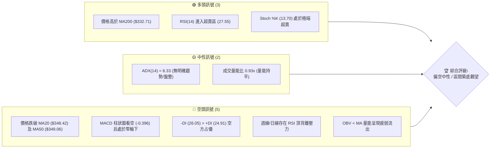
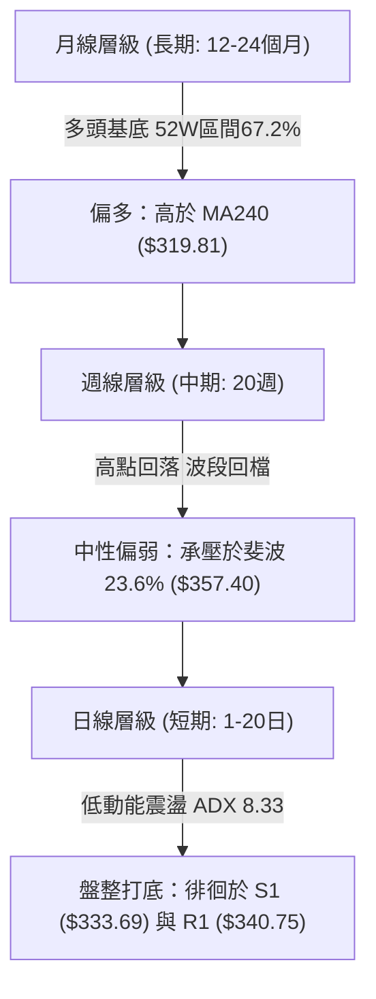
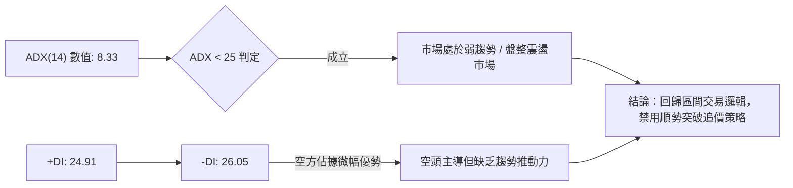
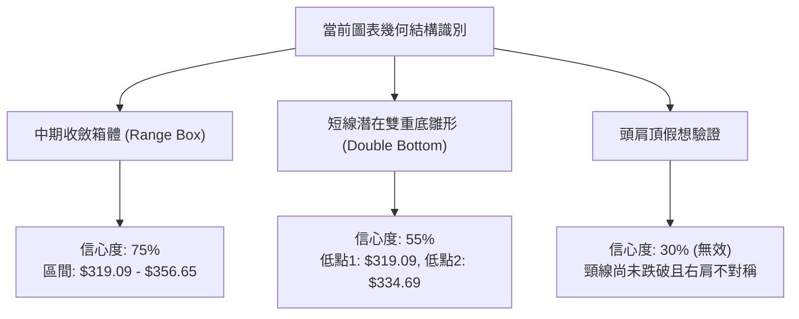
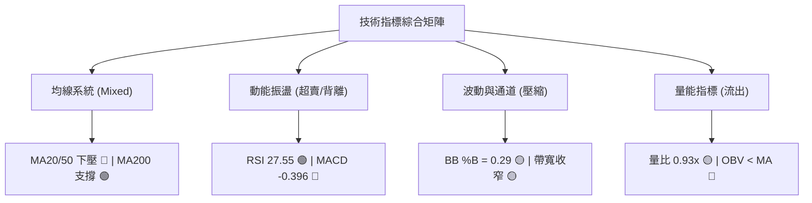
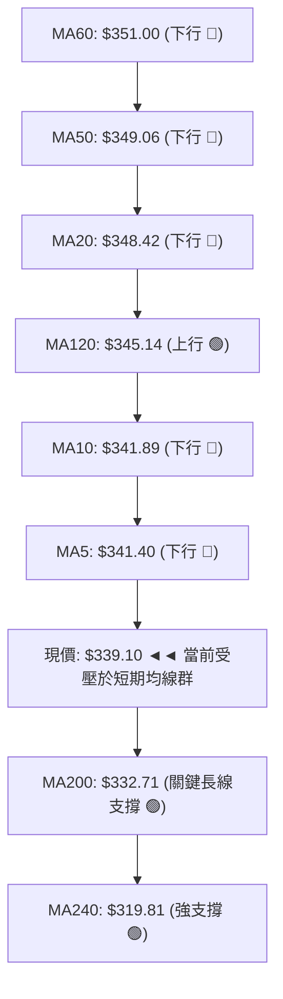
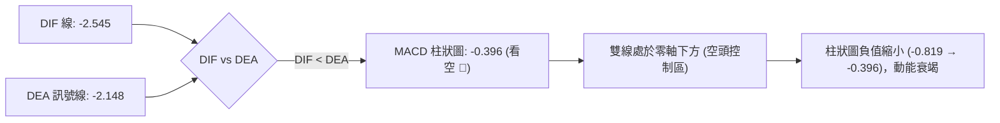
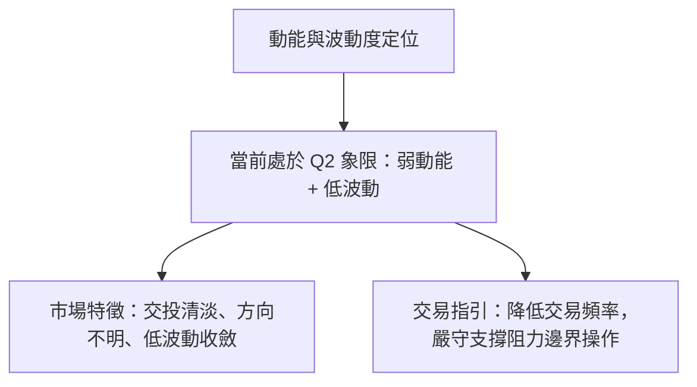
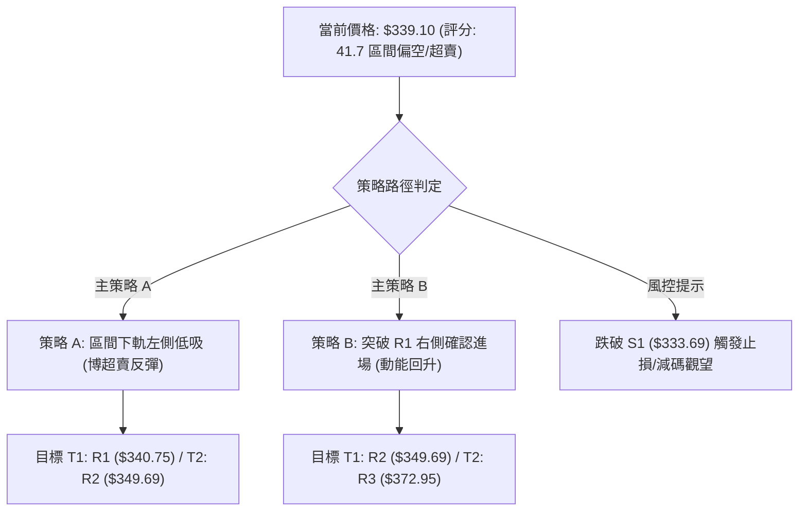
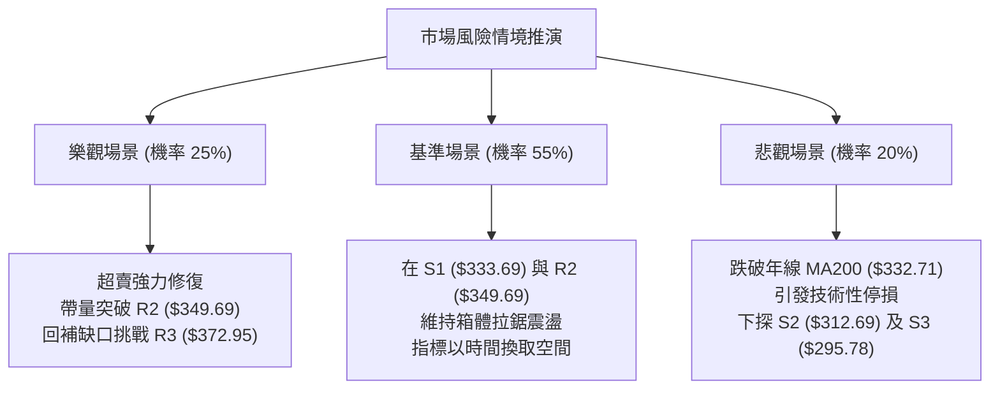

# GOOG 技術分析報告

> **報告日期**：2026-08-27 ｜ **語言**：繁體中文 ｜ **數據來源**：Yahoo Finance ｜ **當前價格**：$339.10

---

## 目錄

| 章節 | 內容 |
|------|------|
| [1. 技術面概覽](#1-技術面概覽) | 訊號儀表板、核心指標、評分卡 |
| [2. 趨勢分析](#2-趨勢分析) | 多時框趨勢、長中短期走勢、ADX解讀 |
| [3. 圖表形態分析](#3-圖表形態分析) | 形態識別、信心度評估、K線組合 |
| [4. 支撐與阻力](#4-支撐與阻力) | 關鍵價位、斐波那契回調結構 |
| [5. 技術指標深度解讀](#5-技術指標深度解讀) | MA/RSI/MACD/布林/量價配合 |
| [6. 動能與波動率](#6-動能與波動率) | 動能四象限、ATR波動、Beta相關性 |
| [7. 多時框架總結](#7-多時框架總結) | 時框矩陣、優先級收斂結論 |
| [8. 交易策略建議](#8-交易策略建議) | 策略路由、主策略規劃、情境機率 |
| [9. 風險提示與監控](#9-風險提示與監控) | 監控清單、風險情境、資金管理 |

---

## 1. 技術面概覽

### 🎯 技術訊號儀表板



---

### 📊 核心指標速覽表

| 指標類別 | 指標名稱 | 當前數值 | 訊號 | 解讀 |
|:---|:---|:---|:---:|:---|
| **價格** | 當前收盤價 | $339.10 | 🟡 | 位於52週區間 67.2%，自高點 $404.23 回檔修正 |
| **均線系統** | MA20 (月線) | $348.42 | 🔴 | 價格位於MA20下方 (-2.68%)，短線承壓 |
| **均線系統** | MA50 (季線) | $349.06 | 🔴 | 價格位於MA50下方，與MA20形成上方重壓區 |
| **均線系統** | MA200 (年線) | $332.71 | 🟢 | 價格守在MA200上方 (+1.92%)，長線多頭基底未破 |
| **動能指標** | RSI(14) | 27.55 | 🟢 | 處於超賣區 (<30)，具備短線技術性反彈動能 |
| **動能指標** | MACD (12,26,9) | -2.545 / -2.148 | 🔴 | DIF < DEA，MACD柱為 -0.396，動能偏空 |
| **震盪指標** | KD (Stoch %K/%D) | 13.70 / 19.98 | 🟢 | 雙線落入極度超賣區，醞釀低檔金叉 |
| **趨勢強度** | ADX(14) | 8.33 | 🟡 | 數值 <25，屬典型低動能弱趨勢/區間盤整行情 |
| **通道指標** | 布林帶 %B | 0.29 | 🟡 | 貼近下軌 $325.92 與中軌 $348.42 之間運行 |
| **量能指標** | OBV 趨勢 | OBV < MA | 🔴 | 資金流向疲弱，尚未出現帶量攻擊買盤 |
| **波動指標** | ATR(14) | $5.99 | 🟡 | 日波動率 1.77%，處於歷史中低波動區間 |

---

### 🏆 技術評分卡

```
╔══════════════════════════════════════════════════════════════════╗
║                   技術評分卡 — GOOG (2026-08-27)                 ║
╠══════════════════════════════════════════════════════════════════╣
║ 趨勢強度 (ADX/方向)   ████░░░░░░░░░░░░░░░░  20/100  🔴 弱勢盤整  ║
║ 動能指標 (RSI/MACD)   ████████░░░░░░░░░░░░  40/100  🟡 超賣醞釀  ║
║ 支撐穩定度 (S1/MA200) ██████████████░░░░░░  70/100  🟢 下檔有撐  ║
║ 成交量配合 (OBV/量比) ██████░░░░░░░░░░░░░░  30/100  🔴 動能匱乏  ║
║ 形態完整度 (區間整理) ██████████░░░░░░░░░░  50/100  🟡 箱體收斂  ║
║ 均線排列 (短中長配置) ████████░░░░░░░░░░░░  40/100  🔴 空頭糾結  ║
╠══════════════════════════════════════════════════════════════════╣
║ 綜合技術評分          ████████░░░░░░░░░░░░  41.7/100 🟡 中性偏空 ║
╚══════════════════════════════════════════════════════════════════╝
```

---

## 2. 趨勢分析

### 🌐 多時框趨勢分析



---

### 📈 長期趨勢 — 12個月走勢圖（Unicode）

```
GOOG 月線走勢圖（2025-08 至 2026-08）
價格 ($)
$400 ┤                                      ● $381.71 (04)
$380 ┤                                        │  ● $376.20 (05)
$360 ┤                                        │   │   ● $356.65 (07)
$340 ┤                              ● $338.09 ├───┼───┼──● $339.10 (現價)
$320 ┤                      ● $319.49(11)     │   │   ● $353.33 (06)
$300 ┤                  ● $281.27 (10)        │   ● $286.69 (03)
$260 ┤              ● $243.07 (09)            ● $311.02 (02)
$220 ┤      ● $212.92 (08)
$180 ┤
     └────────────────────────────────────────────────────────────
      25-08 25-10 25-12 26-01 26-02 26-03 26-04 26-05 26-06 26-08
```

#### 走勢特徵分析表格

| 階段區間 | 起始/結束價 | 漲跌幅 | 走勢特徵解讀 | 技術意涵 |
|:---|:---|:---:|:---|:---|
| **2025.08 - 2025.11** | $212.92 → $319.49 | +50.05% | 單邊主升段推升，月K連紅，突破歷史平台 | 強力多頭擴張 |
| **2025.12 - 2026.03** | $313.39 → $286.69 | -8.52% | 創高後獲利了結，回踩 $286.69 築出中期波段底 | 中期健康回檔 |
| **2026.04 - 2026.05** | $381.71 → $376.20 | +31.39% | 爆發性補漲衝刺 52週高點 $404.23 | 出現極端超買 |
| **2026.06 - 2026.08** | $353.33 → $339.10 | -4.03% | 量縮陰跌回測年線，回吐四月漲幅，進入低波動震盪 | 尋求長線均線支撐 |

---

### 📊 中期趨勢（週線分析）

從近 20 週數據觀察，GOOG 自 2026 年 5 月初攻上波段高點後，週線 RSI 出現自 95.3/88.0 的極端過熱水平持續滑落。近期價格在 $319.09（7月下旬低點）至 $356.65（8月初高點）之間形成收斂震盪箱體。

```
週線近期震盪結構示意圖
─────────────────────────────────────────────────────────────────
[壓力區]   $356.65 ─── 8月波段反彈高點 / 斐波 23.6% ($357.40)
             ▲
             │       震盪收斂區間
             ▼
[現  價]   $339.10 ─── 貼近 38.2% 回調位 ($328.43) 與 MA200
             ▲
             │       下檔支撐防線
             ▼
[支撐區]   $319.09 ─── 7/26 週低點 / S2 ($312.69)
─────────────────────────────────────────────────────────────────
```

---

### ⚡ 趨勢強度評估（ADX 解讀）



#### ADX 趨勢強度級別對照表

| ADX 數值區間 | 趨勢狀態 | GOOG 當前狀態 (8.33) | 策略應用指導 |
|:---|:---|:---:|:---|
| **0 – 20** | **極弱趨勢 / 無方向盤整** | **✓ 當前落點** | **震盪指標為準，區間下軌買、上軌賣** |
| **20 – 25** | 趨勢醞釀中 / 弱動能 | ✗ | 觀察布林通道帶寬收窄後之突破 |
| **25 – 40** | 強趨勢成型 (多/空) | ✗ | 順勢操作，採用均線追隨策略 |
| **40 – 60** | 極強趨勢 | ✗ | 注意動能背離與衝刺竭盡訊號 |

---

## 3. 圖表形態分析

### 🔍 形態識別系統



#### 形態識別信心度評估表

| 識別形態 | 信心度 | 判斷依據（引用技術數據） | 完成度 | 目標價（附嚴格計算式） |
|:---|:---:|:---|:---:|:---|
| **區間矩形震盪** | **75%** | 上界受阻於 R2 ($349.69) 與 8月高點 $356.65，下界獲 S1 ($333.69) 支撐 | 85% | 箱頂突破目標 = $356.65 + ($356.65 - $319.09) = **$394.21**<br/>箱底跌破目標 = $319.09 - ($356.65 - $319.09) = **$281.53** |
| **潛在雙重底** | **55%** | 6/28 低點 $334.69 與 7/26 低點 $319.09，頸線位於 8/02 高點 $356.65 | 50% | 形態理論目標價 = 頸線 $356.65 + ($356.65 - $319.09) = **$394.21** |
| **均線糾結壓縮** | **80%** | MA5 ($341.40) 與 MA10 ($341.89) 黏合，乖離率極低 (<1%) | 90% | 依布林上下軌界定區間：**$325.92 ~ $370.92** |

---

### 🕯️ 重要 K 線形態分析

| 週期/月份 | 收盤價 | 核心 K 線形態 | 量能與形態解讀 | 多空訊號 |
|:---|:---:|:---|:---|:---:|
| **2026-04** | $381.71 | **大陽線帶長上影** | 衝高觸及 52W 高點 $404.23 後引發獲利了結 | 🟡 衝高受阻 |
| **2026-06-28 週** | $334.69 | **爆量長下影陰線** | 週成交量 188.1M（近半年天量），恐慌盤湧出後獲低檔承接 | 🟢 底部換手 |
| **2026-07-26 週** | $319.09 | **縮量下探錘頭線** | 測試下檔 S2 ($312.69) 買盤，週 RSI 觸及 26.4 超賣 | 🟢 探底回升 |
| **2026-08-23 週** | $341.75 | **窄幅十字星** | 週成交量萎縮至 69.7M，多空雙方觀望，動能極度收斂 | 🟡 變盤前兆 |
| **當前 (08-27)** | $339.10 | **小陰線回踩** | 價格壓在短期均線群下方，維持低波橫盤格局 | 🔴 短線偏弱 |

---

### 📉 ASCII 走勢形態示意圖

```
GOOG 關鍵幾何形態結構（箱體震盪與潛在雙底）
價格 ($)
$375 ┤                           [壓力上軌: $370.92 / R3 $372.95]
$360 ┤         ●(高點 $356.65)───┐ 頸線位置 ($356.65)
$350 ┤        / \                │ 
$340 ┤───────/───\────────●──────┴─► 當前價格 $339.10 (壓在MA20下)
$330 ┤      /     ● $334.69(底1)   [支撐 S1: $333.69 / MA200: $332.71]
$320 ┤     /            \        
$310 ┤    /              ● $319.09 (底2) 
$300 ┤───────────────────────────── [強支撐 S2: $312.69]
```

---

## 4. 支撐與阻力

### 🗺️ 關鍵價位分布圖（Unicode）

```
GOOG 價位結構分布圖
══════════════════════════════════════════════════════════════════
$404.23 ║██████████████████████████████║ 52週歷史高點 (0.0% 斐波回調)
$372.95 ║████████████████████████      ║ 強阻力 R3 (布林上軌 $370.92 聚類)
$357.40 ║██████████████████            ║ 斐波那契 23.6% 關鍵阻力
$349.69 ║████████████████              ║ 阻力 R2 (MA50 $349.06 / MA20 $348.42 重合)
$340.75 ║████████████                  ║ 關鍵短線阻力 R1 (MA5/MA10 糾結位)
════════╠══════════════════════════════╣ ◄ 當前價格: $339.10
$333.69 ║▓▓▓▓▓▓▓▓▓▓▓▓                  ║ 近期關鍵支撐 S1 (MA200 $332.71 共振)
$328.43 ║▓▓▓▓▓▓▓▓▓▓▓▓▓▓▓▓              ║ 斐波那契 38.2% 回調支撐
$325.92 ║▓▓▓▓▓▓▓▓▓▓▓▓▓▓▓▓▓▓            ║ 布林通道下軌動態支撐
$312.69 ║████████████████████████      ║ 強支撐 S2 (波段低點聚類)
$295.78 ║████████████████████████████  ║ 長期結構支撐 S3
══════════════════════════════════════════════════════════════════
```

---

### 🚧 阻力位分析表

| 阻力級別 | 精確價位 | 形成依據（數據源自 OHLCV 與均線） | 突破難度 | 技術重要性 |
|:---|:---:|:---|:---:|:---|
| **第一阻力 (R1)** | **$340.75** | 近期短線波段高點，重疊 MA5 ($341.40) 及 MA10 ($341.89) | 🟡 中等 | 短線轉強第一道關卡，突破方能解除極短線下行壓力 |
| **第二阻力 (R2)** | **$349.69** | MA20 ($348.42) 與 MA50 ($349.06) 雙均線密集交會處 | 🔴 偏高 | 中期多空分水嶺，此處聚集近兩個月解套賣壓 |
| **第三阻力 (R3)** | **$372.95** | 近一年波段高點聚類，貼近布林通道上軌 ($370.92) | 🔴 極高 | 波段反彈極限目標，需伴隨巨量突破方能挑戰歷史高點 |

---

### 🛡️ 支撐位分析表

| 支撐級別 | 精確價位 | 形成依據（數據源自 OHLCV 與均線） | 守住機率 | 技術重要性 |
|:---|:---:|:---|:---:|:---|
| **第一支撐 (S1)** | **$333.69** | 近一年波段低點聚類，與 MA200 ($332.71) 形成共振支撐 | **75%** | 多頭牛熊分界線，守穩代表中長期多頭格局完好 |
| **第二支撐 (S2)** | **$312.69** | 2026年7月下旬探底低點區域，亦接近 MA240 ($319.81) | **85%** | 強力防守底線，跌破將引發中長期頭部確立之停損賣壓 |
| **第三支撐 (S3)** | **$295.78** | 近一年深層波段低點聚類，貼近 50.0% 斐波回調位 ($305.01) | **95%** | 終極價值投資防線，基本面與技術面雙重安全邊際 |

---

### 📐 斐波那契回調位分析

基準區間：52週低點 **$205.80** → 52週高點 **$404.23**（總波幅 $198.43）

```
斐波那契回調層級分布
─────────────────────────────────────────────────────────────────
 0.0% (52W High) : $404.23
 23.6% 回調位    : $357.40 ── 上方波段反彈重壓
─────────────────────────────────────────────────────────────────
 ▶ 當前價格落點  : $339.10 ── 位於 23.6% 與 38.2% 回調區間 (健康整理帶)
─────────────────────────────────────────────────────────────────
 38.2% 回調位    : $328.43 ── 下方第一黃金回撤支撐 (守穩此處屬強勢回檔)
 50.0% 回調位    : $305.01 ── 中期平衡中樞
 61.8% 回調位    : $281.60 ── 關鍵防守底線
 78.6% 回調位    : $248.27 ── 深度回撤區
100.0% (52W Low) : $205.80
─────────────────────────────────────────────────────────────────
```

**技術意涵解讀**：現價 $339.10 處於 23.6% ($357.40) 與 38.2% ($328.43) 之間，顯示雖然自高點回落，但仍屬於上升趨勢中的「淺度至中度回檔」。只要 38.2% ($328.43) 與 MA200 ($332.71) 不被有效跌破，長線多頭格局仍具備韌性。

---

## 5. 技術指標深度解讀

### 🎛️ 指標訊號總覽



---

### 📈 移動平均線排列分析



- **均線排列判定**：目前呈現「短中期均線空頭排列，但長週期均線（MA120/MA200/MA240）向上挺進」之**混合排列**。
- **乖離率分析**：現價距離 MA20 乖離 -2.68%，距離 MA60 乖離 -3.39%，距離 MA200 乖離 +1.92%。短線負乖離已有擴大跡象，限制了進一步深跌的空間。

---

### 📉 RSI(14) 分析與背離判定

```
RSI(14) 數值儀表：27.55 (超賣區間)
0 ──────── 20 ───[27.55]── 30 ────────────────── 70 ──────── 100
[ 極度超賣 ]    ▲超賣區      [    常態波動區間    ]   [ 超買區間 ]
```

- **超買超賣判定**：日線 RSI(14) 降至 **27.55**，週線 RSI 降至 **27.5**，雙時框同時落入 30 以下之**超賣區域**。
- **背離分析（Bearish Divergence）**：
  - **頂背離判定**：在 2026年4-5月期間，價格由 $342.11 衝至 $396.81 創新高時，週線 RSI 卻由 95.3 下降至 88.0，形成標準的**中長期週線頂背離**。此頂背離正是導致後續 5-8 月連續三個月回檔修正的主因。
  - **底背離評估**：目前日線與週線進入超賣，但尚未形成連續兩個向上的低點抬高（Higher Lows），因此**尚未確認底背離成型**，當前僅為單純的「指標超賣修復」階段。

---

### 📊 MACD(12/26/9) 訊號解讀



- **訊號解讀**：MACD 目前位於零軸下方，屬於弱勢空頭格局。但觀察柱狀圖變化，已由前期的 -0.819 縮減至 -0.396，顯示空方下殺動能已顯著趨緩，若能進一步金叉，將觸發短線反彈。

---

### 📦 布林通道分析 (Bollinger Bands)

```
ASCII 布林通道空間結構圖
$370.92 ───────────────────────────────────────── BB 上軌 (+2.0σ)
             │
$348.42 ─────┼─────────────────────────────────── BB 中軌 (MA20)
             │  現價: $339.10 (%B = 0.29)
$325.92 ─────┴─────────────────────────────────── BB 下軌 (-2.0σ)
```

- **通道寬度與狀態**：布林上軌 $370.92，下軌 $325.92，帶寬處於中度收窄狀態。
- **%B 指標分析**：%B 為 **0.29**，表明價格位於中軌與下軌之間，偏向下軌運行。當 %B 接近 0.20-0.30 且成交量萎縮時，通常代表下行推動力不足，容易在下軌 $325.92 上方獲得支撐。

---

### 💹 成交量分析（量價配合度）

```
成交量比較
最新成交量  : 15,952,092  ████████████████░░░░  (量比: 0.93x)
20日均量    : 17,218,920  █████████████████░░░
50日均量    : 20,630,676  ████████████████████
```

- **量價特徵**：最新成交量低於 20日與 50日均量（量比 0.93x）。在價格回落過程中呈現「量縮回檔」特徵，並非恐慌性放量出逃。
- **OBV 能量潮解讀**：OBV < MA 顯示資金流動偏向保守觀望，主力大資金在當前價位尚未展開積極性建倉，需等待放量紅K突破短期均線方能確認主力回流。

---

## 6. 動能與波動率

### ⚡ 動能評估四象限

| 象限標籤 | 動能狀態 (Momentum) | 波動率狀態 (Volatility) | GOOG 當前定位 | 策略意涵 |
|:---|:---:|:---:|:---:|:---|
| **第一象限 (Q1)** | 強動能 (趨勢向上) | 低波動 (穩健推升) | ✗ | 順勢加碼持股 |
| **第二象限 (Q2)** | **弱動能 (ADX 8.33 / RSI 27)** | **低波動 (ATR 1.77%)** | **✓ 當前落點 (Q2)** | **區間震盪築底，採取逆勢低吸或觀望** |
| **第三象限 (Q3)** | 強動能 (爆發突破) | 高波動 (劇烈震盪) | ✗ | 突破追價，嚴設移動止損 |
| **第四象限 (Q4)** | 弱動能 (破位下殺) | 高波動 (恐慌拋售) | ✗ | 空手觀望，禁止接刀 |



---

### 📊 ATR 波動率分析與風控參數

- **ATR(14) 絕對值**：**$5.99**
- **ATR 相對百分比**：**1.77%**（以現價 $339.10 計算）
- **止損距離建議**：
  - **短線交易（1.5 × ATR）**：$5.99 × 1.5 = **$8.99**（相當於現價之 2.65%）
  - **波段交易（2.0 × ATR）**：$5.99 × 2.0 = **$11.98**（相當於現價之 3.53%）
  - **寬鬆保護（3.0 × ATR）**：$5.99 × 3.0 = **$17.97**（相當於現價之 5.30%）

---

### 📐 Beta 與市場相關性

- **Beta 係數**：**1.237**（相對 S&P 500 具有 1.24 倍的系統性波動彈性）。
- **市場意涵**：GOOG 具備高於大盤的彈性。在市場築底反彈時，其修復幅度通常優於標普500指數，適合在極度超賣時作為動能修復之配置標的。

---

## 7. 多時框架總結

### 📋 時框架評分表

| 時框架 | 趨勢方向 | 動能狀態 | 均線排列 | 圖表形態 | 綜合評分 | 操作建議 |
|:---|:---:|:---:|:---:|:---:|:---:|:---|
| **長期 (月線)** | 🟢 偏多 | 🟡 中性回落 | 🟢 多頭 (位於MA240上) | 大型上升階梯 | **72/100** | 長線多單持股，依賴 MA200 保護 |
| **中期 (週線)** | 🔴 偏空 | 🔴 頂背離消化 | 🟡 糾結 (承壓23.6%) | 波段箱體整理 | **45/100** | 中期波段減倉，等待打底完成 |
| **短期 (日線)** | 🔴 偏空 | 🟢 超賣修復 | 🔴 短均線壓制 | 窄幅收斂 | **38/100** | 嚴禁追空，等待超賣金叉反彈 |

---

### 🔲 綜合訊號矩陣

```
時框訊號收斂矩陣
┌───────────┬──────────────┬──────────────┬──────────────┐
│  分析維度  │ 短期 (日線)  │ 中期 (週線)  │ 長期 (月線)  │
├───────────┼──────────────┼──────────────┼──────────────┤
│ 趨勢方向  │ 🔴 空頭壓制  │ 🟡 箱體震盪  │ 🟢 多頭延續  │
│ 均線系統  │ 🔴 位於MA20下│ 🔴 位於MA50下│ 🟢 位於MA200上│
│ 動能指標  │ 🟢 RSI超賣   │ 🔴 動能走弱  │ 🟡 動能持平  │
│ 量能結構  │ 🟡 量縮觀望  │ 🔴 資金流出  │ 🟢 長期籌碼穩│
└───────────┴──────────────┴──────────────┴──────────────┘
```

---

### ⚖️ 多時框收斂結論

依據多時框收斂規則：
1. **行情屬性判定**：當前 ADX(14) = **8.33 (<25)**，明確定義為**盤整震盪行情**，順勢趨勢策略失效，交易主軸以「布林通道上下軌及 S1/R2 區間交易」為主。
2. **時框優先級衝突收斂**：日線雖然短均線偏空，但 RSI(14) 進入極端超賣 (27.55)；中期週線受到 4-5 月頂背離修正壓制，但下方有長線 MA200 ($332.71) 與斐波 38.2% ($328.43) 的強力共振支撐。
3. **唯一方向性結論**：**【中性偏空震盪、逢低醞釀超賣反彈】**。不宜在此位置盲目追空（因下檔空間受限於 S1/S2），主策略採用「區間下軌防守型低吸」配合「反彈至阻力位減碼」。

---

## 8. 交易策略建議

### 🗺️ 策略決策流程圖



---

### 🧭 策略路由

> **當前主策略方向 = 【區間操作 / 逢低博取超賣反彈】（依綜合評分 41.7/100 判定）**
> 
> 因評分處於 40–60 區間且 ADX 僅 8.33，嚴禁單邊追漲殺跌，操作應以 S1 ($333.69) 至 R2 ($349.69) 之區間為基準。

---

### 🎯 價格情境階梯（Price Scenarios）

| 觸發條件 | 第一目標價 | 第二延伸目標 | 情境技術含義 |
|:---|:---:|:---:|:---|
| **向上放量突破 R1 ($340.75)** | **R2 ($349.69)** | **R3 ($372.95)** | 短線超賣修復展開，挑戰布林中軌與季線壓力區 |
| **維持於現價 $339.10 震盪** | **$341.89 (MA10)** | **$333.69 (S1)** | 低波動收斂打底，指標持續鈍化修復 |
| **有效跌破 S1 ($333.69)** | **S2 ($312.69)** | **S3 ($295.78)** | 年線失守，觸發波段停損賣壓，回測 7月低點 |

---

### 📊 情境機率分佈

```
情境機率分佈餅圖示意
╔══════════════════════════════════════════════════════════════════╗
║ 🟢 區間反彈 / 超賣修復  : █████████████████████████ 50%          ║
║ 🟡 窄幅收斂 / 橫盤築底  : ███████████████ 30%                    ║
║ 🔴 破位下殺 / 再探低點  : ██████████ 20%                         ║
╚══════════════════════════════════════════════════════════════════╝
```

| 市場情境 | 發生機率 | 主要依據與技術論證 |
|:---|:---:|:---|
| **情境一：超賣反彈向上** | **50%** | 日線 RSI (27.55) 與 KD (13.70) 極度超賣，MACD 負柱縮小，下檔獲 MA200 ($332.71) 強力支撐 |
| **情境二：區間窄幅橫盤** | **30%** | ADX(14) 為 8.33，市場無明確趨勢動能，量能維持 0.93x 均量，多空呈現拉鋸 |
| **情境三：跌破年線下探** | **20%** | 短期均線呈空頭排列，OBV 顯示量能疲弱，若大盤系統性下殺則可能回測 S2 ($312.69) |

---

### 🟢 主策略詳情（區間與反彈操作）

| 策略要素 | 策略 A（左側交易：回踩 S1 低吸） | 策略 B（右側交易：突破 R1 跟進） |
|:---|:---|:---|
| **進場條件** | 價格回踩 S1 附近出現下影線或 KD 低檔金叉 | 日線收盤實體帶量站穩 R1 阻力位之上 |
| **進場價格** | **$334.50**（S1 $333.69 上方掛單） | **$341.50**（確認突破 R1 $340.75 後追入） |
| **目標價 T1** | **$340.75**（R1 阻力位） | **$349.69**（R2 / MA50 阻力區） |
| **目標價 T2** | **$349.69**（R2 阻力位） | **$357.40**（斐波 23.6% 回調位） |
| **止損價格** | **$331.00**（跌破 MA200 $332.71 之風控位） | **$333.00**（跌破 S1 $333.69 支撐） |
| **風險空間** | $3.50 (-1.05%) | $8.50 (-2.49%) |
| **報酬空間 (T2)**| $15.19 (+4.54%) | $15.90 (+4.66%) |
| **風險報酬比 (R:R)**| **1 : 4.34**（極佳） | **1 : 1.87**（良好） |
| **成功勝率估計** | **60%** | **55%** |
| **建議倉位** | **總資金 10% - 15%** | **總資金 15% - 20%** |

---

### 🔴 反向風險觸發點（對沖提示）

若發生以下訊號，代表主策略假設失效，應立即停止做多並考慮減碼或對沖：
- **關鍵價位跌破**：日線收盤價跌破 **$332.71 (MA200)** 且次日無法收復。
- **動能惡化訊號**：RSI(14) 跌破 20 進入鈍化，且 MACD 負柱狀圖再次擴大（<-1.0）。
- **量能異動**：跌破 $333.69 時單日成交量放大至 3,000 萬股以上（恐慌拋售）。

---

### ⭐ 整體訊號強度評星

```
╔══════════════════════════════════════════════════════════════════╗
║ 做多訊號強度 (超賣反彈) : ★★★☆☆  (3.0/5星) ── 具R/R比但趨勢偏弱 ║
║ 做空訊號強度 (順應日均) : ★★☆☆☆  (2.0/5星) ── 空間受制於MA200  ║
║ 技術分析可信度 (數據質量) : ★★★★☆  (4.0/5星) ── 支撐阻力定義清晰 ║
╚══════════════════════════════════════════════════════════════════╝
```

---

## 9. 風險提示與監控

### ✅ 關鍵監控指標 Checklist

```
╔══════════════════════════════════════════════════════════════════╗
║                    每日技術面監控 Checklist                      ║
╠══════════════════════════════════════════════════════════════════╣
║ [ ] 價格是否守穩 MA200 年線支撐 ($332.71)                       ║
║ [ ] RSI(14) 是否由超賣區 (<30) 向上勾頭突破 30                    ║
║ [ ] 日成交量是否回升至 20日均量 (17.2M) 之上                      ║
║ [ ] MACD 柱狀圖是否由負轉正 (向上穿越零軸)                        ║
║ [ ] 阻力位 R1 ($340.75) 與 MA20 ($348.42) 是否被有效帶量收復      ║
║ [ ] ADX(14) 是否自 8.33 開始抬升 (預示新波段趨勢啟動)             ║
╚══════════════════════════════════════════════════════════════════╝
```

---

### ⚠️ 風險場景分析



---

### 🛡️ 風險管理重要提醒

1. **嚴禁順勢追空**：當前 RSI 處於 27.55 極度超賣，且距離年線 MA200 ($332.71) 僅 1.92% 緩衝空間，此處建立空單之風險報酬比極差。
2. **倉位分批管理**：在弱趨勢（ADX 8.33）環境下，單筆交易虧損應嚴格控制在總帳戶資產的 **1.0%** 以內。若進場策略 A（止損空間 $3.50），每 10 萬美元帳戶規模建議交易上限為 280 股。
3. **重大事件防範**：通訊服務板塊受宏觀利率政策與科技股整體情緒影響顯著，需警惕市場系統性 Beta 波動。

---

## 📋 報告總結

```
╔══════════════════════════════════════════════════════════════════╗
║                   GOOG 技術分析報告總結                          ║
╠══════════════════════════════════════════════════════════════════╣
║ 報告日期：2026-08-27          當前價格：$339.10                 ║
║ 技術評級：⚖️ 中性偏空震盪 (超賣醞釀反彈)                         ║
╠══════════════════════════════════════════════════════════════════╣
║ 關鍵結論：                                                       ║
║ ├─ 長期趨勢：🟢 偏多 (股價維持於 MA200 $332.71 之上)             ║
║ ├─ 中期趨勢：🔴 偏空 (受制於 5月頂背離修正，承壓斐波 23.6%)      ║
║ ├─ 短期趨勢：🟡 盤整超賣 (ADX 8.33，RSI 27.55 具反彈動能)        ║
║ ├─ 關鍵支撐：S1: $333.69 ｜ S2: $312.69 ｜ S3: $295.78          ║
║ ├─ 關鍵阻力：R1: $340.75 ｜ R2: $349.69 ｜ R3: $372.95          ║
║ └─ 分析師目標價：均價 $422.34 (區間 $340.00 ~ $475.00)          ║
╠══════════════════════════════════════════════════════════════════╣
║ 最優策略組合：                                                   ║
║ 1. 🥇 最佳機會：在 S1 ($333.69) 上方建立超賣反彈多單 (R:R 4.34)  ║
║ 2. 🥈 次選機會：突破 R1 ($340.75) 後右側跟進，目標 R2 ($349.69) ║
║ 3. 🥉 保守選擇：空手觀望，等待突破布林中軌 $348.42 再行進場      ║
╚══════════════════════════════════════════════════════════════════╝
```

---

> ⚠️ **免責聲明**：本報告為技術分析研究，所有數據及估算均基於歷史價格與客觀技術指標計算。本報告**僅供研究與學術參考**，**不構成任何形式的投資建議與要約**。市場有風險，交易需獨立判斷並自負盈虧。

---

*報告生成時間：2026-08-27 ｜ 數據來源：Yahoo Finance ｜ 分析框架：多時框技術量化體系*