# GOOG 技術分析報告

> **報告日期**：2026-08-28 ｜ **語言**：繁體中文 ｜ **數據來源**：Yahoo Finance ｜ **當前價格**：$337.71

---

## 目錄

| 章節 | 內容 |
|------|------|
| [1. 技術面概覽](#1-技術面概覽) | 訊號儀表板、核心指標、評分卡 |
| [2. 趨勢分析](#2-趨勢分析) | 多時框趨勢、長中短期走勢 |
| [3. 圖表形態分析](#3-圖表形態分析) | 形態識別、K線組合、目標價 |
| [4. 支撐與阻力](#4-支撐與阻力) | 關鍵價位、斐波那契回調 |
| [5. 技術指標深度解讀](#5-技術指標深度解讀) | MA/RSI/MACD/布林/成交量 |
| [6. 動能與波動率](#6-動能與波動率) | 動能評估、ATR、Beta |
| [7. 多時框架總結](#7-多時框架總結) | 時框架評分矩陣 |
| [8. 交易策略建議](#8-交易策略建議) | 多空策略、風險報酬比 |
| [9. 風險提示與監控](#9-風險提示與監控) | 監控指標、風險場景 |

---

## 1. 技術面概覽

### 🎯 技術訊號儀表板

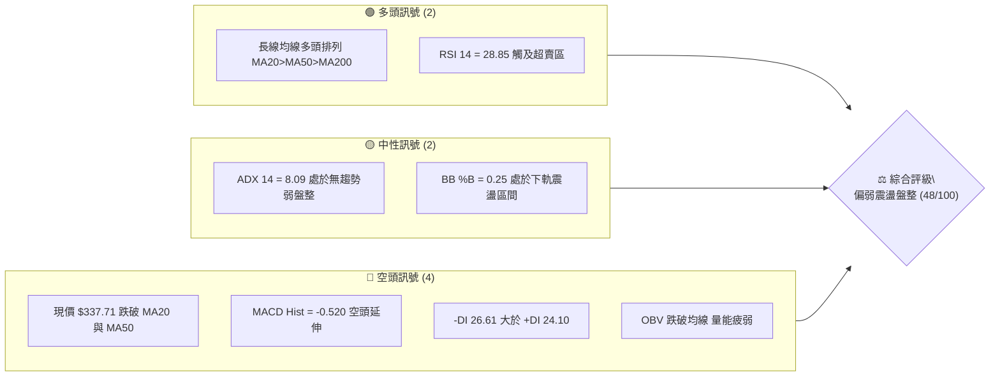

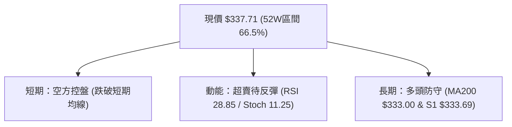

### 📊 核心指標速覽表

| 指標類別 | 指標名稱 | 當前數值 | 訊號 | 解讀 |
|----------|----------|----------|------|------|
| **價格** | 當前價格 | $337.71 | 🟡 | 位於52週區間 66.5%，自歷史高點回調整理中 |
| **均線** | MA20 | $348.63 | 🔴 | 現價位於 MA20 下方 -3.13%，短期承壓 |
| **均線** | MA50 | $348.39 | 🔴 | 現價跌破中期均線，短均出現下彎跡象 |
| **均線** | MA200 | $333.00 | 🟢 | 現價高於 MA200 +1.41%，長線多頭基底尚存 |
| **動能** | RSI(14) | 28.85 | 🟢 | 進入極度超賣區（<30），隨時具備技術性反彈動能 |
| **動能** | MACD (Hist) | -0.520 | 🔴 | MACD線(-2.80)低於訊號線(-2.28)，柱狀圖看空 |
| **趨勢** | ADX(14) | 8.09 | 🟡 | 極低數值（<25），表明無明顯單邊趨勢，進入箱型盤整 |
| **通道** | 布林帶寬 | $326.62 - $370.63 | 🟡 | %B = 0.25，價格接近布林下軌支撐區 |
| **成交量**| 量比 (VR) | 1.04x | 🟡 | 日成交量1,790萬股略高於20日均量，但低於50日均量 |
| **波動** | ATR(14) | $5.91 | 🟢 | 每日波動約 1.75%，波動率受控，適合區間操作 |

### 🏆 技術評分卡

```
技術評分卡 — GOOG (2026-08-28)
════════════════════════════════════════════════════
趨勢強度 (ADX=8.09, 弱趨勢)   ███░░░░░░░░░░░░░░░░░  18/100  🟡
動能指標 (超賣醞釀反彈)       ████████░░░░░░░░░░░░  42/100  🔴
支撐穩定度 (S1 $333.69 堅挺)  ██████████████░░░░░░  70/100  🟢
成交量配合 (OBV弱, 縮量整理)  ████████░░░░░░░░░░░░  40/100  🟡
形態完整度 (寬幅箱型震盪)     ████████████░░░░░░░░  60/100  🟡
均線排列 (長多短空, 測試中)   ████████████░░░░░░░░  58/100  🟡
════════════════════════════════════════════════════
綜合評分                      █████████░░░░░░░░░░░  48/100  中性偏弱震盪
════════════════════════════════════════════════════
```

---

## 2. 趨勢分析

### 🌐 多時框趨勢分析

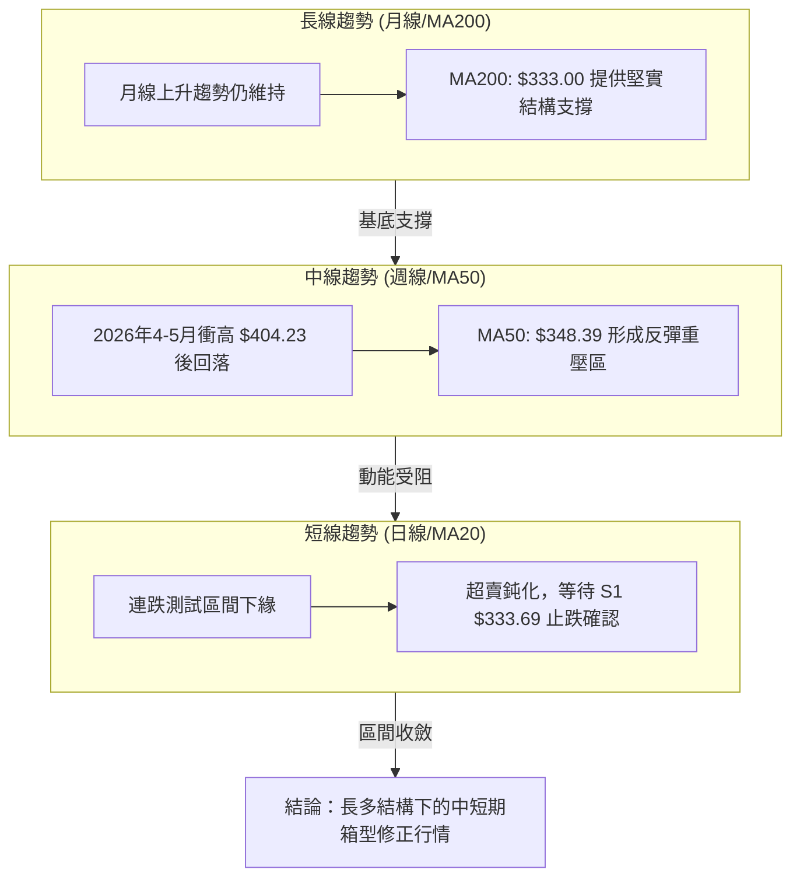

### 📈 長期趨勢 — 12個月走勢圖（Unicode）

```
GOOG 月線走勢圖（2025-08 至 2026-08）
價格軸 ($)
$404 ┤                             ● (52W高點 $404.23)
$380 ┤                         ●   │   ●
$355 ┤                             │       ●   ●
$337 ┤                                         ●← 現價 ($337.71)
$315 ┤                     ●   ●       ●
$280 ┤                 ●
$240 ┤             ●
$212 ┤ ● (2025-08)
     └─┬───┬───┬───┬───┬───┬───┬───┬───┬───┬───┬───┬
      08  09  10  11  12  01  02  03  04  05  06  07  08 (月份)
      (2025年)                    (2026年)
```

**12個月走勢特徵分析表格**：

| 階段 | 時間區間 | 起始/結束價 | 漲跌幅 | 走勢特徵與量價解讀 |
|------|----------|-------------|--------|--------------------|
| 第一階段：主升推動 | 2025-08 ~ 2026-01 | $212.92 → $338.09 | +58.79% | 強勁單邊多頭行情，各級均線發散，量能持續放大 |
| 第二階段：高檔震盪 | 2026-01 ~ 2026-03 | $338.09 → $286.69 | -15.20% | 獲利了結賣壓湧現，回踩長週期均線確認支撐 |
| 第三階段：末升衝頂 | 2026-03 ~ 2026-05 | $286.69 → $381.71 | +33.14% | 創下 52W 高點 $404.23，週成交量暴增至1.3億股以上 |
| 第四階段：箱型修正 | 2026-05 ~ 2026-08 | $381.71 → $337.71 | -11.53% | 動能衰退，進入 $320 - $370 寬幅震盪箱體 |

### 📊 中期趨勢（週線分析）

```
近20週關鍵價位波動分佈區間
$400 ┤ ┌───────┐ (歷史頂部阻力區間 $396 - $404)
$375 ┤ │       └─────────────┐ 
$350 ┤ │                     └───┬─────────────┐ 阻力區 R2 ($349.69)
$337 ┤ │                                       └─ 現價 ($337.71)
$320 ┤ └───────────────────────────────────────── 支撐區 S2 ($312.69)
```

中期週線在 2026-05-10 創下天價後，週線 MACD 柱狀圖自 +4.807 快速萎縮並於 5 月底翻負（最低達 -4.974），顯示中期上漲動能已消耗殆盡。近期週線成交量自衝頂時的 1.57 億股逐步縮減至 6,455 萬股，呈現典型的**量縮整理盤**。

### ⚡ 趨勢強度評估（ADX 解讀）

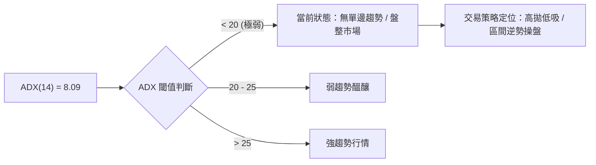

| 指標變數 | 當前讀數 | 門檻參照 | 市場結構解讀 |
|----------|----------|----------|--------------|
| **ADX(14)** | **8.09** | < 25 (弱/盤整) | 趨勢強度極低，均線系統呈纏繞糾結，無單邊單向破位力道 |
| **+DI(14)** | **24.10** | 多方攻擊力道 | 多方推升意願中性偏弱 |
| **-DI(14)** | **26.61** | 空方主導力道 | -DI > +DI，空方微幅佔優，但差值僅 2.51，未形成實質破壞 |

---

## 3. 圖表形態分析

### 🔍 形態識別系統

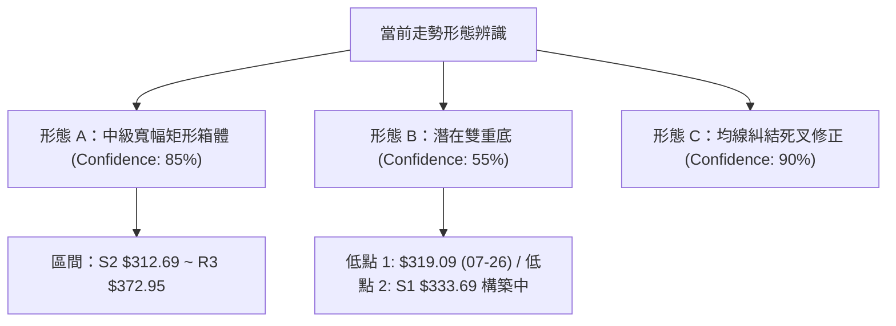

**形態信心度評估表**：

| 形態類別 | 信心度 | 判斷依據（引用數據） | 完成度 | 目標價（附精確計算式） |
|----------|--------|----------------------|--------|------------------------|
| **矩形震盪箱體** | **85%** | 過去12週收盤價均被封閉於 $319.09 至 $376.20 區間內，ADX=8.09 高度支持盤整 | **80%** | 箱頂目標 = **$372.95** (引用阻力位 R3) |
| **潛在雙底形態** | **55%** | 前低 2026-07-26 收盤 $319.09，目前於 S1 $333.69 與 MA200 $333.00 尋求次低點 | **40%** | 若確認站穩頸線 R2 $349.69：$349.69 + ($349.69 - $319.09) = **$380.29**（接近歷史高區） |
| **短期均線反壓** | **90%** | 價格跌破 MA20 ($348.63) 與 MA50 ($348.39)，形成雙重短均下蓋 | **100%**| 短線回測 S1 **$333.69** / MA200 **$333.00** |

### 🕯️ 重要K線形態分析

| 週/月份 | 收盤價 | K線與量能形態 | 專業技術解讀 | 訊號 |
|---------|--------|---------------|--------------|------|
| **2026-05-10** | $396.81 | 長上影線高檔天花板 | 衝刺歷史高點 $404.23 未果，週量 8,572 萬股爆量滯漲 | 🔴 |
| **2026-06-28** | $334.69 | 放量長陰殺跌 | 週成交量爆出 1.88 億股天量，恐慌盤摜破短均線支撐 | 🔴 |
| **2026-07-26** | $319.09 | 下影線探底錘頭線 | 週量 1.22 億股探底回升，確立下方 $312.69 (S2) 強力買盤 | 🟢 |
| **2026-08-02** | $356.65 | 大陽線強勁反彈 | 連續兩週回升站回 $350 上方，MACD柱轉正(+0.563) | 🟢 |
| **2026-08-30** | $337.71 | 縮量十字回落整理 | 週量萎縮至 6,455 萬股（近20週最低），賣壓接近枯竭 | 🟡 |

### 📉 ASCII 走勢形態示意圖

```
        【矩形箱體與潛在次低點示意圖】
$372.95 ┼─────────────────────────────── 箱頂阻力 (R3)
        │          ╭─╮
        │     ╭─╮  │ │
$349.69 ┼─────┼──┼──┴─┴────────────── 頸線/中軌 (R2)
        │     │  │          ╭─╮
$337.71 ┼─────┼──┼──────────┼──┼───── 現價
        │     │  │          │  ╰─● (測試次低點中)
$333.69 ┼─────┼──┼──────────┴─────── S1 / MA200 ($333.00)
        │     │  ╰─╮ (07-26 低點 $319.09)
$312.69 ┼─────┴───────────────────────── 箱底強支撐 (S2)
```

---

## 4. 支撐與阻力

### 🗺️ 關鍵價位分布圖（Unicode）

```
GOOG 價位結構分布圖 (由 OHLCV 聚類計算)
══════════════════════════════════════════════════════════════════
$404.23 ║████████████████████████████████████████║ 52W 歷史極值高點
$372.95 ║████████████████████████                ║ 強阻力 R3 (+10.43%)
$357.40 ║▓▓▓▓▓▓▓▓▓▓▓▓▓▓                          ║ 斐波那契 23.6% 回調位
$349.69 ║████████████████                        ║ 中期波段阻力 R2 (+3.55%)
$340.75 ║████████                                ║ 短線反彈第一阻力 R1 (+0.90%)
$337.71 ╠════════════════════════════════════════╣ ◄ 當前市價 ($337.71)
$333.69 ║████████                                ║ 關鍵支撐 S1 (-1.19%) / MA200 ($333.00)
$328.43 ║▓▓▓▓▓▓▓▓▓▓▓▓▓▓                          ║ 斐波那契 38.2% 回調位 / 布林下軌 ($326.62)
$312.69 ║████████████████████                    ║ 波段強支撐 S2 (-7.41%)
$295.78 ║████████████████████████████            ║ 長期防守底線 S3 (-12.42%)
══════════════════════════════════════════════════════════════════
```

### 🚧 阻力位分析表

| 阻力級別 | 精確價位 | 形成依據與技術意義 | 突破難度 | 重要性 |
|----------|----------|--------------------|----------|--------|
| **R1** | **$340.75** | 近期日線反彈高點聚類，疊加 MA5/MA10 下降均線（$341.30）反壓區 | 🟡 中等 | 短線轉強第一道門檻 |
| **R2** | **$349.69** | 近一年波段高點聚類，高度重合 MA20 ($348.63) 與 MA50 ($348.39) | 🔴 較高 | 中期多空分水嶺 |
| **R3** | **$372.95** | 波段頂部聚類密集區，布林通道上軌 ($370.63) 阻力帶 | 🔴 極高 | 箱型震盪頂部邊界 |

### 🛡️ 支撐位分析表

| 支撐級別 | 精確價位 | 形成依據與技術意義 | 守住機率 | 重要性 |
|----------|----------|--------------------|----------|--------|
| **S1** | **$333.69** | 近一年波段低點聚類，與 200日均線 MA200 ($333.00) 形成雙重支撐 | 🟢 75% | 決定日線級別是否破位 |
| **S2** | **$312.69** | 2026年2-3月及7月波段起漲點聚類區，強力結構買盤密集帶 | 🟢 85% | 中期上升趨勢生命線 |
| **S3** | **$295.78** | 長期大週期支撐聚類，跌破則宣告長期多頭架構破壞 | 🟢 95% | 牛熊轉換終極底線 |

### 📐 斐波那契回調位分析

基準區間：**52週低點 $205.80 → 52週高點 $404.23**（總波幅 $198.43）

```
0.0%  (52W High)  $404.23 ───┐
23.6%             $357.40 ───┼─ 頂部回檔第一道防線 (已跌破，轉為反彈壓力)
                              │
[現價區間 $337.71]            ├─ 目前運行於 23.6% ($357.40) 與 38.2% ($328.43) 之間
                              │
38.2%             $328.43 ───┼─ 黃金分割第一強支撐 (下方 $328.43 ~ $333.69 形成強防守帶)
50.0%             $305.01 ───┼─ 半數回調中樞位置
61.8%             $281.60 ───┼─ 絕對防守黃金分割位
100.0% (52W Low)  $205.80 ───┘
```

- **位置解讀**：現價 $337.71 處於回調幅度 **33.5%** 位置，位於 23.6% ($357.40) 與 38.2% ($328.43) 區間內。38.2% 回調位 $328.43 與布林通道下軌 $326.62 極為接近，構成極具價值的下檔緩衝區。

---

## 5. 技術指標深度解讀

### 🎛️ 指標訊號總覽

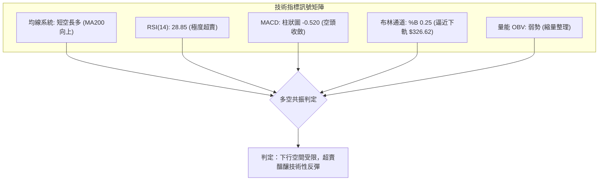

### 📈 移動平均線排列分析

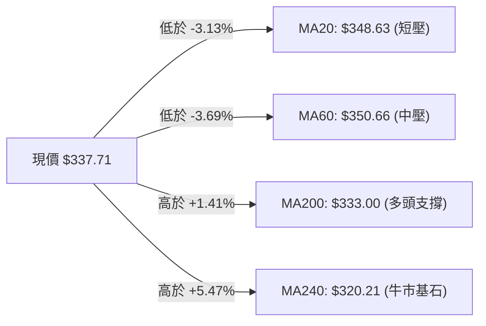

| 均線名稱 | 數值 | 現價相對距離 | 走勢斜率 | 技術意涵 |
|----------|------|--------------|----------|----------|
| **MA 5** | $341.30 | -1.05% | ▼ 下彎 | 短線即時下壓，第一反彈測試位 |
| **MA 20** | $348.63 | -3.13% | ▼ 下彎 | 月線級別反壓，短期空方防守線 |
| **MA 50** | $348.39 | -3.07% | ▼ 走平下彎 | 季線阻力，與 MA20 糾結形成反壓區 |
| **MA 120** | $345.47 | -2.25% | ▼ 走平 | 半年線中樞 |
| **MA 200** | $333.00 | **+1.41%** | ▲ 上揚 | 長期牛市生命線，提供強勁買盤支撐 |
| **MA 240** | $320.21 | **+5.47%** | ▲ 上揚 | 年線支撐，結構性底部所在 |

### 📉 RSI(14) 分析

```
RSI(14) 數值儀表板：28.85 [超賣區間]
0 ──────────── 30 ──────────────────────── 70 ────────── 100
[███████░░░░░░░░░░░░░░░░░░░░░░░░░░░░░░░░░░░░░░░░░] 28.85%
 ▲ 超賣觸發 (<30)
```

- **數值與狀態**：RSI(14) 現值 **28.85**，進入 30 以下極度超賣區。
- **背離分析**：
  - 前次 2026-07-26 價格打到 $319.09 時，週 RSI 為 26.4；本次價格在 $337.71，RSI 為 28.85 / 28.9。
  - **結論**：目前日線與週線層面未出現明顯底背離，但已呈現**超賣鈍化特徵**，空方殺跌動能正處於衰竭臨界點。

### 📊 MACD(12/26/9) 訊號解讀

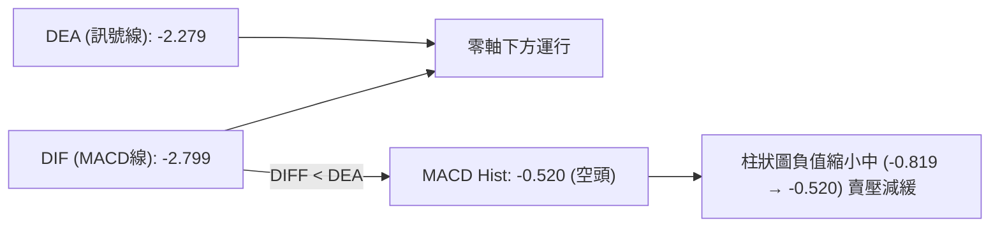

- MACD 目前處於零軸下方（DIF -2.799 / DEA -2.279），確認當前為修正格局。
- 柱狀圖讀數為 **-0.520**，相較於前一週的 -0.819 出現明顯負值收斂，顯示空方動能減弱，若 DIF 能拐頭向上交叉 DEA，將發出標準日線買進訊號。

### 📦 布林通道分析

```
GOOG 布林通道示意圖 (20, 2.0)
$370.63 ┬─────────────────────────────────────── 上軌 (強阻力帶)
        │
$348.63 ┼─────────────────────────────────────── 中軌 / MA20 (多空分水嶺)
        │
$337.71 ┼───────────────────────●─────────────── 現價 (%B = 0.25)
        │
$326.62 ┴─────────────────────────────────────── 下軌 (波動支撐帶)
```

- **帶寬與位置**：通道寬度 $44.01。現價 $337.71 位於通道下半部，**%B = 0.25**。
- **操作意涵**：%B 接近 0.20 水平，且下軌 $326.62 與斐波那契 38.2% 回調位 $328.43 產生共振，顯示下行空間受限，向下觸軌往往構成低風險試倉買點。

### 💹 成交量分析（量價配合度）

- **量能體系**：
  - 最新單日成交量：**17,899,600 股**
  - 20日均量：**17,259,640 股**（量比 1.04x）
  - 50日均量：**20,663,298 股**
- **OBV 趨勢**：OBV 低於其移動平均線，且週成交量自五月峰值的 1.57 億股滑落至 6,455 萬股。
- **量價結論**：市場在下跌過程中並未出現恐慌性拋售，成交量萎縮代表**空方動能衰退與浮額沉澱**，符合「縮量築底」的典型盤整特徵。

---

## 6. 動能與波動率

### ⚡ 動能評估四象限

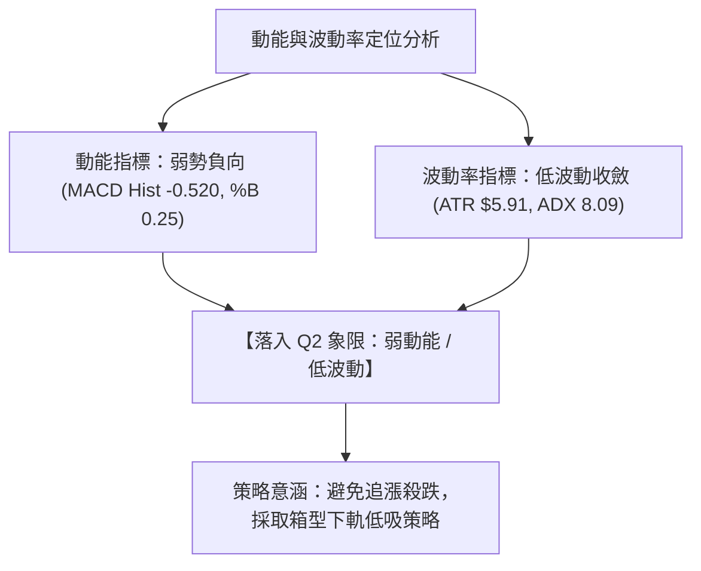

| 象限 | 動能強度 | 波動率水準 | 當前狀態 | 交易應對方針 |
|------|----------|------------|----------|--------------|
| **Q1** | 強動能（多頭） | 低波動 | — | 最佳單邊持倉區間，順勢加碼 |
| **Q2** | **弱動能（空頭/中性）** | **低波動** | **✓ 當前狀態** | **箱體震盪沉澱期，低吸高拋或觀望** |
| **Q3** | 強動能（爆發） | 高波動 | — | 突破行情，嚴設動態止損 |
| **Q4** | 弱動能（崩跌） | 高波動 | — | 恐慌主跌浪，全面避險離場 |

### 📊 ATR 波動率分析

- **ATR(14) 數值**：**$5.91**（佔當前股價約 **1.75%**）。
- **風控止損測算**：
  - 短線交易止損距離（1.5 × ATR）：$5.91 × 1.5 = **$8.87**
  - 波段交易止損距離（2.0 × ATR）：$5.91 × 2.0 = **$11.82**
- **波動特性**：目前每日波幅約在 6 美元以內，波動極度收斂，預示蓄勢完成後將迎來方向性選擇。

### 📐 Beta 與市場相關性

- **Beta 係數**：**1.237**
- **解讀**：GOOG 具備高於標普500指數（Beta = 1.0）23.7% 的波動彈性。在大盤反彈週期中，GOOG 將展現較高向上修復動能；但在下行週期時亦承受較高系統性風險。

---

## 7. 多時框架總結

### 📋 時框架評分表

| 時框架 | 趨勢方向 | 動能指標 | 均線排列 | 形態結構 | 綜合評分 | 操作建議 |
|--------|----------|----------|----------|----------|----------|----------|
| **短期 (日線)** | 偏空修正 🔴 | 超賣反彈 🟢 | 短均下彎 🔴 | 測試下軌 🟡 | **45/100** | 逢低分批布局，不追空 |
| **中期 (週線)** | 箱型盤整 🟡 | 負值收斂 🟡 | 均線糾結 🟡 | 寬幅震盪 🟡 | **52/100** | 區間操作，高拋低吸 |
| **長期 (月線)** | 多頭格局 🟢 | 動能中性 🟢 | 多頭排列 🟢 | 大週期上升 🟢 | **78/100** | 逢回調皆為戰略買點 |

### 🔲 綜合訊號矩陣

```
時框維度       趨勢訊號       動能確認       關鍵價位參考           訊號共振評估
──────────────────────────────────────────────────────────────────────────
短期 (Daily)   🔴 偏弱        🟢 RSI<30      支撐 S1 $333.69        超賣醞釀短線反彈
中期 (Weekly)  🟡 震盪        🟡 MACD收斂    區間 $312.69-$372.95   箱型下半部尋求支撐
長期 (Monthly) 🟢 多頭        🟢 長多排列    年線 MA200 $333.00     長線多頭架構未變
```

### ⚖️ 多時框收斂結論

依據多時框收斂規則：
1. **行情性質判定**：當前 **ADX(14) = 8.09 (<25)**，定性為典型的**無趨勢盤整行情**。
2. **時框主導權**：在盤整行情中，市場由日線布林通道上下軌（$326.62 ~ $370.63）及主要支撐阻力所主導。
3. **終極方向收斂**：**【中性偏多（逢低承接）】**。雖然日線短期均線受阻偏弱，但因股價已深度回調至長週期牛市防線（MA200 $333.00 及波段支撐 S1 $333.69），且日線 RSI(14)=28.85 處於極度超賣，做空風險極高。策略完全收斂為：**依託 S1 支撐與布林下軌區間，採取逆勢低吸做多**。

---

## 8. 交易策略建議

### 🗺️ 策略決策流程圖

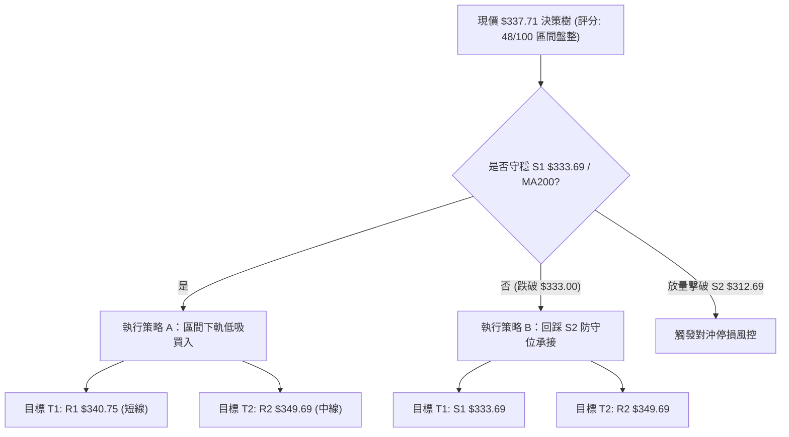

### 🧭 策略路由

> **當前主策略方向 = 區間低吸多頭策略（依綜合評分 48/100 判定為盤整市超賣修復）**

### 🎯 價格情境階梯（Price Scenarios）

| 觸發條件 | 下一目標 | 後續延伸 | 情境含義 |
|----------|----------|----------|----------|
| **強勢突破 R1 $340.75** | **R2 $349.69** | **R3 $372.95** | 短線轉強，封閉跌幅並挑戰箱體中軌 |
| **站穩 S1 $333.69 現價區間** | **R1 $340.75** | **R2 $349.69** | 區間築底反彈，超賣指標回歸中性 |
| **有效跌破 S1 $333.69** | **S2 $312.69** | **S3 $295.78** | 中期進一步回踩箱底，尋求長線買盤支撐 |

### 📊 情境機率分佈

| 情境 | 機率 | 主要技術依據 |
|------|------|--------------|
| **區間下軌反彈（向上）** | **60%** | RSI(14)=28.85 極度超賣、MA200 ($333.00) 具長線買盤支撐、週線賣壓縮量 |
| **橫盤震盪築底（盤整）** | **25%** | ADX(14)=8.09 極低、短均反壓壓制反彈空間、OBV 量能尚未放大 |
| **跌破 S1 下探 S2（向下）** | **15%** | MACD 仍處零軸下方、-DI 略高於 +DI、跌破 MA20 後引發技術性賣壓 |

### 🟢 主策略詳情

| 策略要素 | 策略 A（現價區間右側買入） | 策略 B（下軌掛單左側買入） |
|----------|----------------------------|----------------------------|
| **適用場景** | 短線超賣反彈，守穩 S1 啟動 | 價格打壓至斐波那契 38.2% 與下軌共振區 |
| **進場條件** | 日K收盤站穩 $337.00 或突破 MA5 ($341.30) | 限價掛單於 S1 與布林下軌之間 |
| **進場價格** | **$337.71**（現價） | **$333.69**（S1 支撐位） |
| **目標價 T1** | **$340.75**（R1 阻力位） | **$340.75**（R1 阻力位） |
| **目標價 T2** | **$349.69**（R2 均線重壓區） | **$349.69**（R2 均線重壓區） |
| **止損價格** | **$331.00**（跌破 MA200 $333.00） | **$325.00**（跌破布林下軌 $326.62） |
| **風險報酬比** | **1.78 : 1**（獲利空間 $11.98 / 風險 $6.71） | **1.84 : 1**（獲利空間 $16.00 / 風險 $8.69） |
| **成功機率** | **60%** | **65%** |
| **建議倉位** | **15%**（基礎倉位） | **25%**（分批加碼） |

### 🔴 反向風險觸發點（對沖提示）

- **全面空頭觸發點**：若日線放量收破 **$328.43**（斐波那契 38.2% 回調位）且未能於 3 日內收復，則確認下行破位。
- **風控處置**：跌破 $328.43 後應立即平倉多頭頭寸，並可考慮買入價外 Put 或減倉至 10% 以下防禦，下方等待 **S2 $312.69** 重新評估。

### ⭐ 整體訊號強度評星

```
做多訊號強度：★★★☆☆  (3.5/5星 - 超賣支撐強烈，唯欠缺成交量配合)
做空訊號強度：★★☆☆☆  (2.0/5星 - 下方即為 MA200，空間狹窄盈虧比差)
整體可信度：  ★★★★☆  (4.0/5星 - 支撐阻力結構清晰，ADX指引明確)
```

---

## 9. 風險提示與監控

### ✅ 關鍵監控指標 Checklist

```
╔══════════════════════════════════════════════════════════════════╗
║                    每日盤後關鍵技術監控清單                      ║
╠══════════════════════════════════════════════════════════════════╣
║ [ ] 1. 價格防守：收盤價是否守穩 MA200 ($333.00) 與 S1 ($333.69)  ║
║ [ ] 2. 超賣修復：RSI(14) 是否順利脫離 30 以下並突破 35 水平     ║
║ [ ] 3. 動能轉折：MACD 柱狀圖是否持續收窄（由 -0.520 轉正）       ║
║ [ ] 4. 量能確認：日成交量是否回升突破 20日均量（> 1,726 萬股）   ║
║ [ ] 5. 壓力測試：反彈觸及 R1 ($340.75) 時的量價反應              ║
║ [ ] 6. 趨勢轉變：ADX 是否自 8.09 拐頭向上伴隨 +DI 突破 -DI       ║
╚══════════════════════════════════════════════════════════════════╝
```

### ⚠️ 風險場景分析

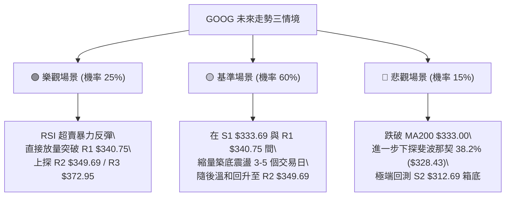

### 🛡️ 風險管理重要提醒

1. **嚴禁追高殺跌**：ADX = 8.09 代表目前完全無趨勢，追價極易被雙向巴掌。
2. **倉位總量控管**：在價格重新站上 MA20 ($348.63) 之前，整體 GOOG 持倉佔總投資組合比重建議控制在 **20% ~ 30%** 以內。
3. **止損紀律執行**：本策略最底線為 MA200 ($333.00) 與布林下軌，任何實體收盤跌破均需無條件執行停損或減持。

---

## 📋 報告總結

```
GOOG 技術分析報告總結
════════════════════════════════════════════════════════
報告日期：2026-08-28
當前價格：$337.71
分析評級：⚖️ 區間弱勢震盪，超賣醞釀反彈 (技術評分: 48/100)

關鍵結論：
├─ 長期趨勢：🟢 多頭結構完好 (MA200 $333.00 持續向上)
├─ 中期趨勢：🟡 寬幅箱型整理 ($312.69 ~ $372.95)
├─ 短期趨勢：🔴 跌破短均承壓，但 RSI=28.85 深度超賣
├─ 關鍵支撐：S1 $333.69 ｜ S2 $312.69 ｜ MA200 $333.00
├─ 關鍵阻力：R1 $340.75 ｜ R2 $349.69 ｜ R3 $372.95
└─ 分析師目標：均價 $422.34 (共識評級 Strong Buy)

最優策略組合：
1. 🥇 最佳機會：現價 $337.71 至 S1 $333.69 區間分批買入，博弈超賣反彈至 R2 $349.69。
2. 🥈 次選機會：突破 R1 $340.75 確認短底後順勢跟進，止損設於 $333.00。
3. 🥉 保守選擇：空倉等待股價重新收復 MA20 ($348.63) 再行介入。
════════════════════════════════════════════════════════
```

---

> ⚠️ **免責聲明**：本報告為 AI 自動生成之技術分析，所有數據及估算均基於提供的歷史價格資訊。本報告**僅供研究與學術參考**，**不構成任何投資建議**。投資有風險，入市需謹慎。

---

*報告生成時間：2026-08-28 ｜ 數據來源：Yahoo Finance ｜ 分析框架：多時框技術分析*