# GOOG 技術分析報告

> **報告日期**：2026-08-29 ｜ **語言**：繁體中文 ｜ **數據來源**：Yahoo Finance ｜ **當前價格**：$342.88

---

## 目錄

| 章節 | 內容 |
|------|------|
| [1. 技術面概覽](#1-技術面概覽) | 訊號儀表板、核心指標、評分卡 |
| [2. 趨勢分析](#2-趨勢分析) | 多時框趨勢、長中短期走勢 |
| [3. 圖表形態分析](#3-圖表形態分析) | 形態識別、K線組合、目標價 |
| [4. 支撐與阻力](#4-支撐與阻力) | 關鍵價位、斐波那契回調 |
| [5. 技術指標深度解讀](#5-技術指標深度解讀) | MA/RSI/MACD/布林/成交量 |
| [6. 動能與波動率](#6-動能與波動率) | 動能評估、ATR、Beta |
| [7. 多時框架總結](#7-多時框架總結) | 時框架評分矩陣、收斂結論 |
| [8. 交易策略建議](#8-交易策略建議) | 多空策略、風險報酬比 |
| [9. 風險提示與監控](#9-風險提示與監控) | 監控指標、風險場景 |
| [10. 報告總結](#10-報告總結) | 核心結論與策略彙總 |

---

## 1. 技術面概覽

### 🎯 技術訊號儀表板

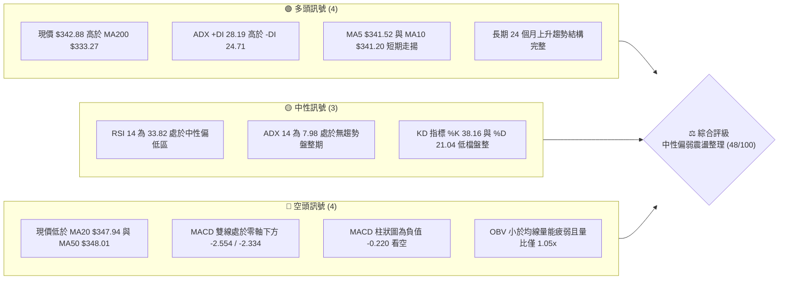

### 📊 核心指標速覽表

| 指標類別 | 指標名稱 | 當前數值 | 訊號 | 解讀 |
|:---|:---|:---|:---:|:---|
| **價格** | 當前收盤價 | $342.88 | 🟡 | 位於 52 週區間 ($206.37 - $404.23) 之 69.0% 分位 |
| **均線** | MA20 (月線) | $347.94 | 🔴 | 現價位於 MA20 下方 -1.45%，短線承壓 |
| **均線** | MA50 (季線) | $348.01 | 🔴 | 現價位於 MA50 下方 -1.47%，中期均線反壓密集 |
| **均線** | MA200 (年線) | $333.27 | 🟢 | 現價高於 MA200 +2.88%，長期多頭防線穩固 |
| **動能** | RSI(14) | 33.82 | 🟡 | 接近超賣邊界 (30)，短期下行動能有衰竭跡象 |
| **動能** | MACD (12,26,9) | -2.554 / -2.334 | 🔴 | 雙線位於零軸下，柱狀圖 -0.220 呈現弱勢空頭格局 |
| **動能** | 隨機指標 Stoch | %K 38.16 / %D 21.04 | 🟡 | %K 由超賣區向上穿越 %D，低檔出現金叉雛形 |
| **趨勢** | ADX(14) | 7.98 (+DI 28.19 / -DI 24.71) | 🟡 | ADX < 25 極弱，市場處於無明確方向的寬幅盤整 |
| **通道** | 布林通道 (%B) | 上 $369.75 / 下 $326.12 (%B 0.38) | 🟡 | 現價位於中軌下方，偏向通道下半部運行 |
| **量能** | 成交量 / OBV | 17,479,507 (量比 1.05x) | 🔴 | OBV < 均線，整體追價動能不足，量能疲弱 |
| **波動** | ATR(14) | $6.18 (1.80%) | 🟡 | 每日平均波動幅度溫和，風險可控 |

### 🏆 技術評分卡

```
╔════════════════════════════════════════════════════════════════════════╗
║                   GOOG 技術評分卡 (2026-08-29)                         ║
╠════════════════════════════════════════════════════════════════════════╣
║ 趨勢強度 (ADX/方向)   ████░░░░░░░░░░░░░░░░  20/100  🔴 極弱無趨勢       ║
║ 動能指標 (RSI/MACD)   ████████░░░░░░░░░░░░  40/100  🔴 偏弱尋求築底     ║
║ 支撐穩定度 (S1/MA200) ██████████████░░░░░░  70/100  🟢 長期防線強勁     ║
║ 成交量配合 (OBV/Volume)████████░░░░░░░░░░░░  40/100  🔴 量能萎縮未放大   ║
║ 形態完整度 (區間整理) ████████████░░░░░░░░  60/100  🟡 矩形底部收斂中   ║
║ 均線排列 (多空糾結)   ████████████░░░░░░░░  60/100  🟡 長多短空混亂排列 ║
╠════════════════════════════════════════════════════════════════════════╣
║ 綜合技術評分          █████████░░░░░░░░░░░  48/100  🟡 中性震盪觀望     ║
╚════════════════════════════════════════════════════════════════════════╝
```

---

## 2. 趨勢分析

### 🌐 多時框趨勢分析

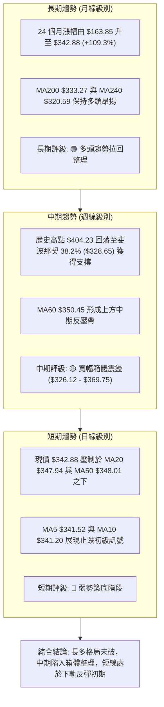

### 📈 長期趨勢 — 12個月走勢圖（Unicode）

```
GOOG 月線收盤走勢圖（2025-08 至 2026-08）
價格軸 ($)
$400 ┤                                      
$380 ┤                                  ●(04月 $381.71)
$360 ┤                              ●   │   ●   ●
$340 ┤                          ●   │   │   │   │   ●(現價 $342.88)
$320 ┤                  ●   ●   │   │   │   │   │   │
$300 ┤                  │   │   │   │   │   │   │   │
$280 ┤              ●   │   │   │   ●   │   │   │   │
$260 ┤              │   │   │   │   │   │   │   │   │
$240 ┤          ●   │   │   │   │   │   │   │   │   │
$220 ┤      ●   │   │   │   │   │   │   │   │   │   │
$200 ┤  ●   │   │   │   │   │   │   │   │   │   │   │
     └──┬───┬───┬───┬───┬───┬───┬───┬───┬───┬───┬───┬───
       08  09  10  11  12  01  02  03  04  05  06  07  08 (月份)
      (25)                                            (26)
```

**走勢特徵分析表格**：

| 階段區間 | 時間段 | 起點價格 | 終點價格 | 區間漲跌幅 | 走勢特徵與量價結構解讀 |
|:---|:---|:---:|:---:|:---:|:---|
| **主升加速段** | 2025-08 ~ 2025-11 | $212.92 | $319.49 | **+50.05%** | 單邊強勢主升浪，月線連續收大陽線，資金持續湧入 |
| **高檔初次震盪** | 2025-12 ~ 2026-03 | $313.39 | $286.69 | **-8.52%** | 衝高 $338.09 後快速回洗至 $286.69（回測 61.8% 斐波那契位 $281.95 獲支撐） |
| **二次創高噴發** | 2026-03 ~ 2026-04 | $286.69 | $381.71 | **+33.14%** | 強力 V 型反轉，創下收盤新高 $381.71，最高觸及 52W 高點 $404.23 |
| **高位箱體消化** | 2026-05 ~ 2026-08 | $376.20 | $342.88 | **-8.86%** | 自 $404.23 歷史天價回落，於 $330 - $370 區間進行時間換空間之籌碼沉澱 |

### 📊 中期趨勢（週線分析）

```
GOOG 近 20 週關鍵壓力與支撐運行圖
─────────────────────────────────────────────────────────────────────────────
$404.23 ┬────────────────────────────────────────── 52W 歷史天價 (05-10 高點)
        │       ╭──╮
$380.00 ┼──────╭╯  ╰╮────────────────────────────── 強阻力帶 R3 ($381.81)
        │     ╭╯    ╰╮  ╭─╮
$360.00 ┼────╭╯      ╰──╯ ╰╮    ╭──╮ ╭──╮──────── 阻力帶 R2 ($372.95) / 23.6% ($357.53)
        │   ╭╯               ╰╮  │  ╰─╯  ╰──現價 $342.88
$340.00 ┼──╭╯                 ╰──╯          ╰─── 關鍵阻力 R1 ($349.69) / MA20
        │                                         支撐位 S1 ($333.69) / MA200 ($333.27)
$320.00 ┼─────────────────────────●────────────── 支撐位 S2 ($312.69) (07-26 低點 $319.09)
─────────────────────────────────────────────────────────────────────────────
```

### ⚡ 趨勢強度評估（ADX 解讀）

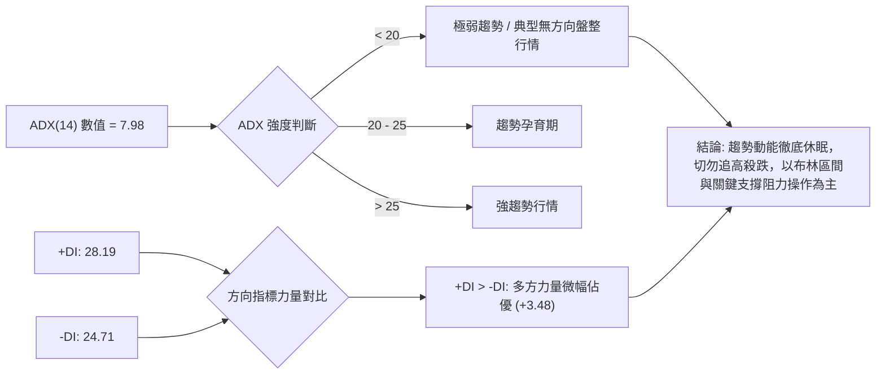

| 指標變數 | 當前讀數 | 門檻區間 | 趨勢狀態判定 | 交易策略意涵 |
|:---|:---:|:---:|:---:|:---|
| **ADX(14)** | **7.98** | < 20 (極弱) | **完全盤整行情** | 趨勢追隨策略失效，震盪指標（RSI/KD/布林帶）權重提升 |
| **+DI (14)** | **28.19** | > 25 (偏強) | 多方保有控盤優勢 | 買方尚未棄守，具備低檔承接意願 |
| **-DI (14)** | **24.71** | < 25 (偏弱) | 空方打壓動能受限 | 空方無力發動連續單邊殺跌波段 |
| **方向差距 (+DI - -DI)**| **+3.48** | 淨正值 | 多方微弱領先 | 市場處於多空拉鋸之均衡末期 |

---

## 3. 圖表形態分析

### 🔍 形態識別系統

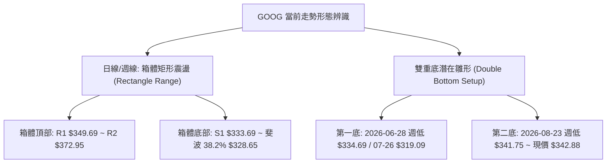

**形態信心度與目標價評估表**：

| 識別形態 | 信心度 | 判斷依據（嚴格引用數據） | 完成度 | 目標價（附嚴格計算式） |
|:---|:---:|:---|:---:|:---|
| **箱體矩形震盪** | **75%** | 價格受限於布林上軌 $369.75 (阻力 R2 $372.95) 與布林下軌 $326.12 (支撐 S1 $333.69) 之間 | **85%** | 箱頂目標：引用阻力位 **R2 = $372.95**；突破延伸目標：**R3 = $381.81** |
| **潛在雙重底** | **55%** | 低點聚類：第一底 $319.09 (07-26)，第二底 $341.75 (08-23)，頸線為 08-02 高點收盤 $356.65 | **60%** | 形態高度 = 頸線 $356.65 - 底部 $319.09 = $37.56。<br/>突破頸線目標價 = $356.65 + $37.56 = **$394.21** |
| **均線死叉壓制** | **70%** | MA20 ($347.94) 下穿 MA60 ($350.45)，價格壓制於 MA20/MA50 之下 | **100%** | 下檔回測目標：引用支撐位 **S1 = $333.69**，跌破則測 **S2 = $312.69** |

### 🕯️ 重要K線形態分析

| 期間/月份 | 收盤價 | K線形態特徵 | 量價關係解讀 | 技術訊號 |
|:---|:---:|:---|:---|:---:|
| **2026-04** | $381.71 | 長紅大陽線 | 伴隨單月巨大漲幅，突破所有均線創波段歷史新高 | 🟢 強烈看多 |
| **2026-05** | $376.20 | 高檔長上影十字星 | 衝高至 $404.23 後遭遇劇烈獲利了結賣壓，週量暴增至 1.3 億股 | 🔴 頂部滯漲 |
| **2026-06** | $353.33 | 實體中黑線 | 跌破短均線支撐，06-28 週量爆出 1.88 億股形成恐慌下殺 | 🔴 空方釋放 |
| **2026-07** | $356.65 | 下影線錘頭紅棒 | 回測 $319.09 後強勁抽腳收高，顯示 S1/S2 間買盤支撐強烈 | 🟢 止跌反彈 |
| **2026-08** | $342.88 | 窄幅縮量紡錘線 | 波動率大幅收斂，RSI 於 33.82 止跌，多空雙方進入僵持蓄勢 | 🟡 變盤前夕 |

### 📉 ASCII 走勢形態示意圖

```
GOOG 日線/週線箱體結構與雙底演化示意圖
─────────────────────────────────────────────────────────────────────────────
$380.00 ┤                                  [波段高點 R3: $381.81]
        │                                 
$370.00 ┤              ┌──────────────────┐ [箱頂阻力 R2: $372.95 / BB上軌 $369.75]
        │              │  頸線 $356.65     │
$350.00 ┼──────────────┼─────────●────────┼─ [關鍵阻力 R1: $349.69 / MA20]
        │              │       ╭─╯╰─╮      │   现價: $342.88 ◄───[當前蓄勢點]
$340.00 ┤              │      ╭╯    ╰╮     │
        │              │     ╭╯      ╰╮    │ [MA200 年線: $333.27 / S1: $333.69]
$330.00 ┼──────────────┼────╭╯        ╰───┼─ [斐波 38.2%: $328.65 / BB下軌 $326.12]
        │              │   ╭╯ (第1底)      │
$310.00 ┤              └──● $319.09──────┘ [強支撐 S2: $312.69]
─────────────────────────────────────────────────────────────────────────────
```

---

## 4. 支撐與阻力

### 🗺️ 關鍵價位分布圖（Unicode）

```
GOOG 關鍵價位結構分布圖 (數據嚴格聚類)
═══════════════════════════════════════════════════════════════════════════
$404.23 ║████████████████████████████████████║ 52W 歷史天價 (0.0% 斐波那契)
$381.81 ║████████████████████████            ║ 強阻力位 R3 (近一年波段高點聚類)
$372.95 ║██████████████████                  ║ 阻力位 R2 (布林上軌 $369.75 共振帶)
$357.53 ║██████████████                      ║ 斐波那契 23.6% 回調壓力位
$349.69 ║████████████████████████            ║ 關鍵阻力 R1 (MA20 $347.94 / MA50 $348.01)
$342.88 ╠════════════════════════════════════╣ ◄ 當前收盤價 ($342.88)
$333.69 ║▓▓▓▓▓▓▓▓▓▓▓▓▓▓▓▓                    ║ 近期關鍵支撐 S1 (MA200 $333.27 護城河)
$328.65 ║▓▓▓▓▓▓▓▓▓▓                          ║ 斐波那契 38.2% 回調支撐位 (布林下軌 $326.12)
$312.69 ║████████████████████████            ║ 強支撐位 S2 (07-26 波段低點聚類)
$295.78 ║████████████████████████████        ║ 終極防守支撐 S3 (50.0% 斐波那契 $305.30 下方)
═══════════════════════════════════════════════════════════════════════════
```

### 🚧 阻力位分析表

| 阻力級別 | 精確價位 | 形成技術依據 | 突破難度 | 戰略重要性 |
|:---|:---:|:---|:---:|:---|
| **阻力 R1** | **$349.69** | 近一年波段密集高點，重疊 **MA20 ($347.94)** 與 **MA50 ($348.01)** | 中等 | **短線多空分水嶺**；唯有日線實體站上 $350，短多方能重掌主動權 |
| **阻力 R2** | **$372.95** | 波段高點聚類，共振 **布林帶上軌 ($369.75)** 及 05-31 週收盤價區間 | 較高 | **中期波段反彈目標**；此處將面臨大量套牢籌碼與通道上軌共振打壓 |
| **阻力 R3** | **$381.81** | 04 月月線收盤新高 ($381.71) 與 05-03 週線突破高點形成的強阻力區 | 極高 | **中期多頭反轉確立點**；突破後方有實力挑戰 52W 天價 $404.23 |

### 🛡️ 支撐位分析表

| 支撐級別 | 精確價位 | 形成技術依據 | 守住機率 | 戰略重要性 |
|:---|:---:|:---|:---:|:---|
| **支撐 S1** | **$333.69** | 近一年波段低點聚類，重疊 **MA200 年線 ($333.27)** 與 06-28 週低點 ($334.69) | **80%** | **牛熊生命線**；機構法人長期防守底線，不容實體長黑跌破 |
| **支撐 S2** | **$312.69** | 波段低點密集區，臨近 07-26 恐慌低點 ($319.09) 與 2026-02 月低點 ($311.02) | **90%** | **波段強支撐**；中級回調之極限防禦區，具備極強左側買盤買力 |
| **支撐 S3** | **$295.78** | 2026-03 波段起漲點 ($286.69) 與 50% 斐波那契 ($305.30) 之下檔安全墊 | **95%** | **長期趨勢底線**；跌破代表自 $163.85 起算之兩年牛市架構遭到破壞 |

### 📐 斐波那契回調位分析

依據 52 週完整波動區間（低點 **$206.37** → 高點 **$404.23**，總垂直價差 **$197.86**）：

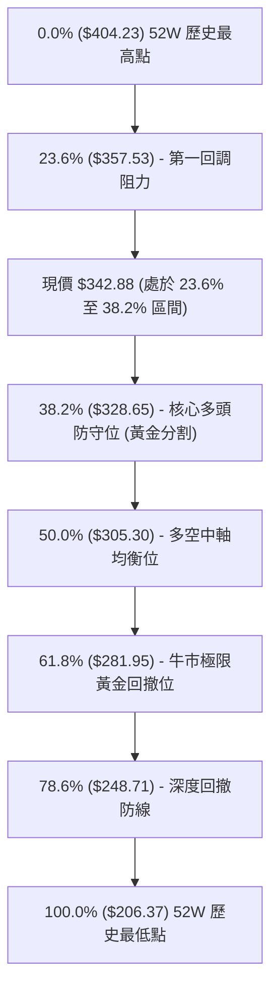

- **當前位置解讀**：現價 **$342.88** 精準落於 **23.6% ($357.53)** 與 **38.2% ($328.65)** 之間。在技術分析定義中，回調未破 38.2% 黃金分割位屬於**強勢整理結構**，長線多頭架構依然健康，並未轉入空頭熊市。

---

## 5. 技術指標深度解讀

### 🎛️ 指標訊號總覽

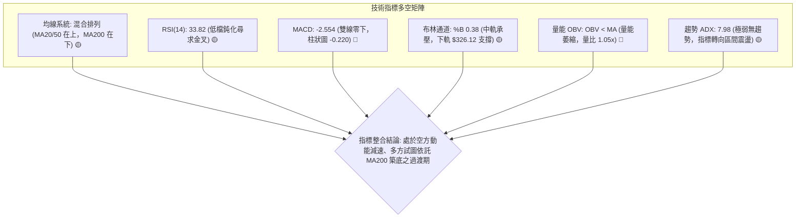

### 📈 移動平均線排列分析

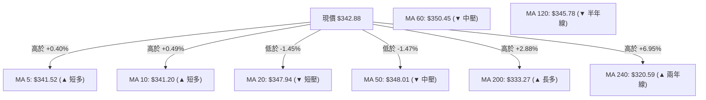

| 均線天期 | 當前數值 | 與現價偏離度 | 均線斜率與形態 | 多空訊號解讀 |
|:---|:---:|:---:|:---:|:---:|
| **MA 5** | $341.52 | +0.40% | 向上勾頭 (▲ +1.36) | 短線止跌，提供超短期下檔支撐 |
| **MA 10** | $341.20 | +0.49% | 向上勾頭 (▲ +1.68) | 短線底部墊高，與 MA5 形成微型多頭交叉 |
| **MA 20** | $347.94 | -1.45% | 下行走平 (▼ -5.06) | 月線反壓，首要上攻阻力 (R1) |
| **MA 50** | $348.01 | -1.47% | 下行走平 (▼) | 季線下壓，與 MA20 形成雙重阻力帶 |
| **MA 60** | $350.45 | -2.16% | 下滑趨勢 (▼ -7.57) | 中期分水嶺，未收復前中期以震盪視之 |
| **MA 120** | $345.78 | -0.84% | 走平微跌 (▼ -2.90) | 半年線糾結於現價上方 |
| **MA 200** | $333.27 | +2.88% | 穩定上揚 (▲) | 長期牛市護城河，多頭最後防線 (S1) |
| **MA 240** | $320.59 | +6.95% | 強勢上揚 (▲ +22.29) | 長期多頭趨勢堅不可摧 |

### 📉 RSI(14) 分析

- **RSI(14) 數值**：**33.82**
- **數值進度條**：`███████░░░░░░░░░░░░░ 33.82%`（處於 30-70 中性偏超賣區）
- **超買超賣解讀**：RSI 跌至 33.82，已自 5 月份的極度超買區 (95.3) 徹底冷卻，接近 30 超賣門檻。近兩週 RSI 自 20.6 回升至 33.82，顯示短期拋售壓力顯著減輕。
- **背離判斷結論**：**無明顯背離**。價格在 8 月份下探 $341.75，RSI 同步落於 20.6 低檔後回升，指標與價格波動步調一致，未構成標準的多頭底背離或空頭頂背離。

### 📊 MACD(12/26/9) 訊號解讀

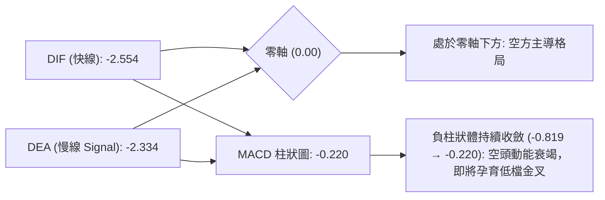

- **MACD 數值**：DIF **-2.554**，Signal **-2.334**，Hist **-0.220**。
- **指標綜合解讀**：雙線雖在零軸下方運行，但負柱狀體（MACD Hist）已由前週之 **-0.819** 明顯收縮至當前的 **-0.220**，表明空方下打動能已近尾聲，隨時可能在零軸下方完成「低檔黃金交叉」，形成技術性反彈契機。

### 📦 布林通道分析

```
GOOG 日線布林通道 (Bollinger Bands 20, 2) 示意圖
─────────────────────────────────────────────────────────────────────────────
$369.75 ┬────────────────────────────────────────── 布林上軌 (Upper Band)
        │
$355.00 ┼────────────────────────────────────────── 斐波那契 23.6% ($357.53)
        │
$347.94 ┼────────────────────────────────────────── 布林中軌 (MA20 / 中軸)
        │                      ● 現價 $342.88 (%B = 0.38)
$335.00 ┼────────────────────────────────────────── MA200 ($333.27) / 支撐 S1 ($333.69)
        │
$326.12 ┴────────────────────────────────────────── 布林下軌 (Lower Band)
─────────────────────────────────────────────────────────────────────────────
```

- **布林參數**：上軌 **$369.75** / 中軌 **$347.94** / 下軌 **$326.12** / 帶寬帶值 **$43.63**。
- **%B 指標分析**：當前 **%B = 0.38**，價格運行於中軌與下軌之間偏下區域，尚未觸及下軌超賣區（%B < 0.20），處於典型的下軌支撐回升段。

### 💹 成交量分析（量價配合度）

- **量能數據**：最新成交量 **17,479,507** 股，20 日均量 **16,609,715** 股（量比 **1.05x**），50 日均量 **20,693,548** 股。
- **OBV 趨勢解讀**：當前 OBV 位於其均線下方，反映量能動能呈現「縮量整理」狀態。在經歷 6 月底（單週 1.88 億股）的放量殺跌後，近 4 週成交量均維持在 7000 萬至 8200 萬股低水平，量能急劇萎縮代表**浮動籌碼已被有效鎖定，殺跌盤枯竭**。

---

## 6. 動能與波動率

### ⚡ 動能評估四象限

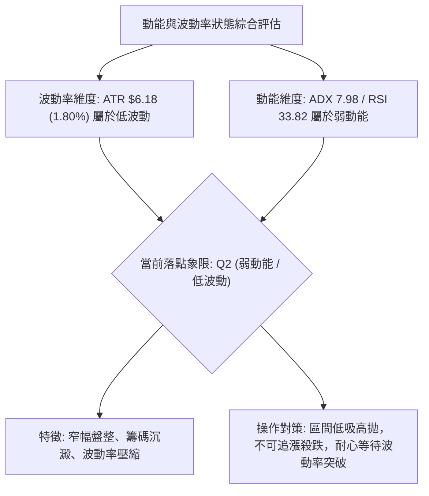

| 象限分類 | 動能強度 | 波動率水準 | 當前狀態判定 | 交易策略指導 |
|:---|:---:|:---:|:---:|:---|
| **第一象限 (Q1)** | 強動能 | 低波動 | — | 穩定主升段，趨勢加碼 |
| **第二象限 (Q2)** | **弱動能** | **低波動** | **✓ 當前落點** | **震盪蓄勢期，逢低分批佈局支撐位** |
| **第三象限 (Q3)** | 強動能 | 高波動 | — | 狂熱單邊突破，高風險高收益 |
| **第四象限 (Q4)** | 弱動能 | 高波動 | — | 恐慌崩跌與多空洗盤，嚴禁進場 |

### 📊 ATR 波動率分析

- **ATR(14) 數值**：**$6.18**（佔當前股價之 **1.80%**）。
- **波動特性解析**：GOOG 股價日均波動約在 $6.18 左右，波動度極其溫和，代表目前沒有單邊急跌風險。
- **風控與止損建議**：
  - **短線交易止損距離**：$1.5 \times \text{ATR} = 1.5 \times \$6.18 = \mathbf{\$9.27}$
  - **波段交易止損距離**：$2.0 \times \text{ATR} = 2.0 \times \$6.18 = \mathbf{\$12.36}$
  - **由現價推算之波段止損參考位**：$\$342.88 - \$12.36 = \mathbf{\$330.52}$（剛好守在斐波那契 38.2% 位 $328.65 與 S1 $333.69 之間）。

### 📐 Beta 與市場相關性

- **Beta 係數**：**1.237**
- **市場特徵分析**：Beta > 1.0 代表 GOOG 對大盤（標普 500 / 納斯達克）具有略高的彈性與敏感度。當大盤反彈時，GOOG 具有產生超額阿爾法（Alpha）收益的潛力；但在市場回調時，其下行波動亦會高出大盤約 23.7%。

---

## 7. 多時框架總結

### 📋 時框架評分表

| 時框架 | 趨勢方向 | 動能狀態 | 均線排列 | 圖表形態 | 綜合評分 | 戰略建議 |
|:---|:---:|:---:|:---:|:---:|:---:|:---|
| **長期 (月線)** | 🟢 多頭拉回 | 🟡 降溫中性 | 🟢 多頭排列 (MA200/240 向上) | 雙重底潛在形態 | **75/100** | 長期投資者逢低分批建倉 |
| **中期 (週線)** | 🟡 箱體震盪 | 🟡 尋求金叉 | 🟡 糾結排列 (受阻於 MA60) | 矩形整理 ($326-$370) | **50/100** | 波段操作依據通道高拋低吸 |
| **短期 (日線)** | 🔴 弱勢築底 | 🔴 零下空頭 | 🔴 壓制於 MA20/50 之下 | 低檔窄幅整理 | **40/100** | 嚴禁追高，等待突破 R1 確認 |

### 🔲 綜合訊號矩陣

```
╔═══════════════════════════════════════════════════════════════════════════╗
║                   GOOG 多時框架技術共振矩陣                               ║
╠══════════════════╦════════════════╦════════════════╦══════════════════════╣
║ 分析維度         ║ 短期 (日線)    ║ 中期 (週線)    ║ 長期 (月線)          ║
╠══════════════════╬════════════════╬════════════════╬══════════════════════╣
║ 趨勢方向         ║ 🔴 下降/盤底   ║ 🟡 箱體震盪    ║ 🟢 多頭主升後拉回    ║
║ 動能指標 (RSI)   ║ 🟡 33.82 (低檔)║ 🟡 33.80 (中性)║ 🟢 60+ (強勢維持)    ║
║ 均線系統狀態     ║ 🔴 MA20/50 壓制║ 🟡 MA60 壓制   ║ 🟢 MA200/240 支撐    ║
║ 關鍵支撐/阻力    ║ 阻力 R1 $349.69║ 支撐 S1 $333.69║ 支撐 S2 $312.69      ║
║ 波動率狀態       ║ 壓縮中 (ATR低) ║ 正常           ║ 穩定擴張後收斂       ║
╠══════════════════╬════════════════╬════════════════╬══════════════════════╣
║ 時框收斂結論     ║ 🟡 短期尋求在 MA200 上方完成築底，並向中期箱頂 R1/R2 發動修復 ║
╚══════════════════╩════════════════╩════════════════╩══════════════════════╝
```

### ⚖️ 多時框收斂結論

依據多時框收斂優先級規則：
1. **行情性質判定**：當前 ADX(14) = **7.98 (< 25)**，明確定義為**無趨勢之盤整行情**。
2. **主導時框取捨**：由於日線與週線均處於均線糾結與寬幅震盪狀態，趨勢指標失效，交易邏輯應**以日線布林通道 ($326.12 - $369.75) 與關鍵支撐阻力 (S1 $333.69 / R1 $349.69 / R2 $372.95) 為主導**。
3. **唯一方向性結論**：**中性觀望偏多築底（區間操作）**。長線多頭架構未破，短線殺跌動能已耗盡，價格緊貼 MA200 上方震盪，下檔空間極度有限，策略聚焦於下軌支撐處低吸。

---

## 8. 交易策略建議

### 🗺️ 策略決策流程圖

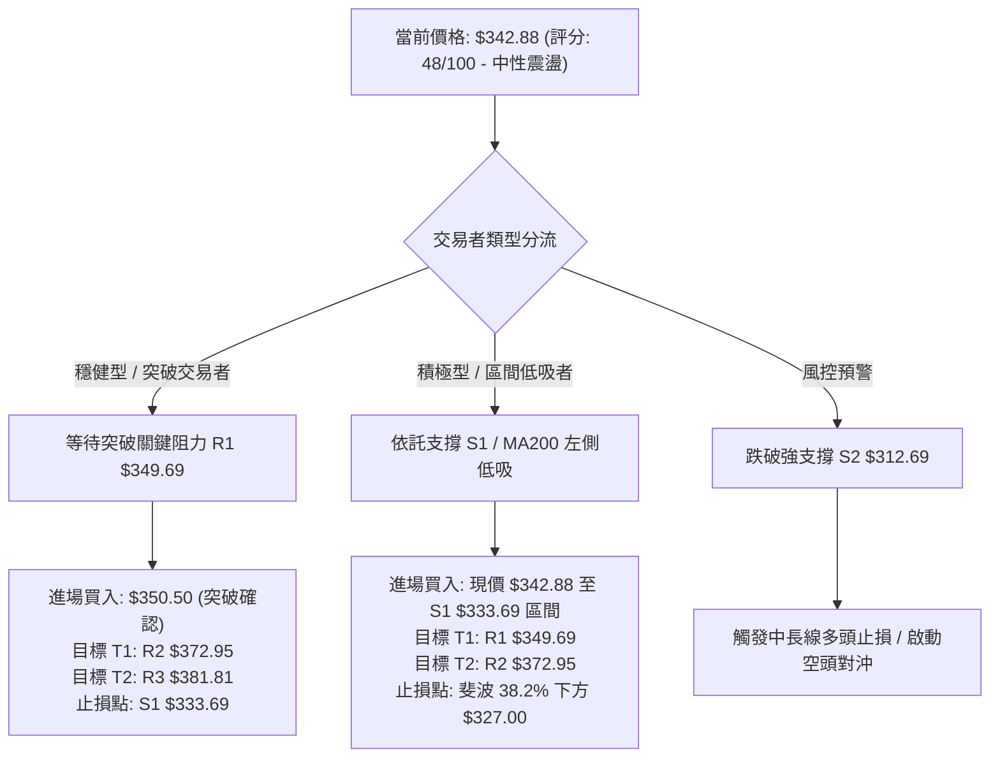

### 🧭 策略路由

> **當前主策略方向 = 區間低吸與突破雙軌多頭策略（依技術綜合評分 48/100，處於中性震盪築底階段，空頭僅列為風險防禦觸發點）**

### 🎯 價格情境階梯（Price Scenarios）

| 觸發條件 | 下一目標價 | 後續延伸目標 | 情境技術含義（嚴格引用第 4 章數據） |
|:---|:---:|:---:|:---|
| **向上突破 R1 ($349.69)** | **R2 ($372.95)** | **R3 ($381.81)** | **短線轉強**；站上 MA20/MA50，挑戰布林上軌與前高套牢區 |
| **維持於現價區間震盪** | **R1 ($349.69)** | **S1 ($333.69)** | **區間蓄勢**；在布林中下軌之間消化浮籌，等待 MACD 低檔金叉 |
| **向下跌破 S1 ($333.69)** | **S2 ($312.69)** | **S3 ($295.78)** | **中期轉弱**；失守 MA200 年線，下探 07-26 低點與 50% 斐波那契位 |

### 📊 情境機率分佈

```
╔═══════════════════════════════════════════════════════════════════════════╗
║                   GOOG 未來走勢情境機率預測                               ║
╠═══════════════════════════════════════════════════════════════════════════╣
║ 1. 區間震盪蓄勢 (Range-Bound)      ██████████████████████  55%            ║
║ 2. 向上突破反彈 (Bullish Breakout) ████████████            30%            ║
║ 3. 破位向下探底 (Bearish Drop)     ██████                  15%            ║
╚═══════════════════════════════════════════════════════════════════════════╝
```

- **主要依據**：
  - **區間震盪 (55%)**：ADX 數值僅 7.98，布林帶寬度收窄，量比僅 1.05x，量能不足以支撐單邊突破。
  - **向上反彈 (30%)**：RSI(14) 處於 33.82 低檔，MACD 負柱狀體急劇收縮 (-0.220)，+DI (28.19) > -DI (24.71)，具備反彈動能。
  - **破位探底 (15%)**：MA200 ($333.27) 具備強大支撐力，且 52W 低點以來之長期上升趨勢未破。

### 🟢 主策略詳情

| 策略要素 | 策略 A（積極型：區間低吸策略） | 策略 B（穩健型：突破右側追擊策略） |
|:---|:---|:---|
| **適用對象** | 左側交易者、波段低吸偏好者 | 右側交易者、順勢動能交易者 |
| **進場條件** | 現價 $342.88 或回測支撐 S1 $333.69 止跌 | 日線收盤價實體突破關鍵阻力 R1 $349.69 |
| **精確進場點** | **$342.88**（當前價格） | **$350.50**（突破 R1 確認點） |
| **目標價 T1** | **$349.69**（阻力 R1 / MA20，預期報酬 +1.99%） | **$372.95**（阻力 R2 / BB上軌，預期報酬 +6.40%） |
| **目標價 T2** | **$372.95**（阻力 R2，預期報酬 +8.77%） | **$381.81**（阻力 R3 / 前高，預期報酬 +8.93%） |
| **精確止損點** | **$333.00**（跌破 S1 $333.69 與 MA200） | **$341.00**（跌破 MA10 $341.20 假突破止損） |
| **風險報酬比** | **1 : 3.04**（風險 $9.88，T2 報酬 $30.07） | **1 : 3.29**（風險 $9.50，T2 報酬 $31.31） |
| **成功機率估計** | **65%** | **70%** |
| **建議倉位** | **15% - 20%**（分批進場） | **20% - 25%**（突破加碼） |

### 🔴 反向風險觸發點（對沖提示）

- **關鍵多頭防守失效點**：若日線收盤價**實體跌破支撐 S1 ($333.69)** 且成交量放大超過 2000 萬股，宣告 MA200 失守。
- **對沖與風控處置**：
  1. 立即將多頭倉位降低 50% 以上。
  2. 若進一步跌破斐波那契 38.2% 位 (**$328.65**)，多頭應全面清倉離場觀望。
  3. 激進投資者可於 $328.00 建立輕倉空頭部位，下檔目標看至 **S2 ($312.69)**。

### ⭐ 整體訊號強度評星

```
╔════════════════════════════════════════════════════════════════════════╗
║ 做多訊號強度：  ★★★☆☆  (3.0/5.0 星) — 依託長線 MA200 支撐，勝率較高 ║
║ 做空訊號強度：  ★★☆☆☆  (2.0/5.0 星) — 殺跌動能枯竭，下檔空間受限   ║
║ 整體技術可信度：★★★★☆  (4.0/5.0 星) — 價位聚類完整，斐波那契吻合   ║
╚════════════════════════════════════════════════════════════════════════╝
```

---

## 9. 風險提示與監控

### ✅ 關鍵監控指標 Checklist

```
╔════════════════════════════════════════════════════════════════════════╗
║                     GOOG 每日技術監控清單 (Checklist)                  ║
╠════════════════════════════════════════════════════════════════════════╣
║ [ ] 價格是否成功突破並站穩關鍵阻力 R1 $349.69 (MA20/50 聚集帶)        ║
║ [ ] MACD 柱狀圖是否由負轉正 (升破 0.00) 形成零下金叉                   ║
║ [ ] RSI(14) 是否站上 50 中軸，擺脫 30-40 弱勢震盪區間                 ║
║ [ ] 日成交量是否放大至 20 日均量 (16.6M) 的 1.3 倍以上 (21.5M+) 配合突破║
║ [ ] 價格是否跌破牛熊分界線 S1 $333.69 / MA200 $333.27                 ║
║ [ ] 布林通道帶寬是否開始向外擴張，引導新一輪趨勢發動                   ║
╚════════════════════════════════════════════════════════════════════════╝
```

### ⚠️ 風險場景分析

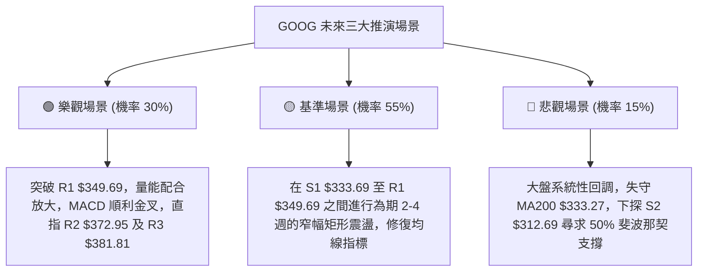

### 🛡️ 風險管理重要提醒

1. **嚴格執行價格止損**：當前價格 $342.88 距離核心支撐 S1 ($333.69) 僅約 **2.68%** 的緩衝空間，切勿在跌破 $333.00 時抱持僥倖心態扛單。
2. **區間震盪切忌追高**：ADX 僅 7.98，在未看見放量突破 R1 之前，任何拉升接近 $348 - $350 均為短線獲利了結點，不可於阻力位盲目追價。
3. **倉位配置與分散**：由於當前屬於震盪築底期，建議總持倉比例控制在 **20% - 30%** 以內，預留充裕現金以應對潛在的二次回踩。

---

## 10. 報告總結

```
╔════════════════════════════════════════════════════════════════════════╗
║                       GOOG 技術分析報告總結                            ║
╠════════════════════════════════════════════════════════════════════════╣
║ 報告日期：2026-08-29                                                   ║
║ 當前價格：$342.88                                                      ║
║ 分析評級：⚖️ 中性觀望偏多築底 (技術評分: 48/100)                        ║
╠════════════════════════════════════════════════════════════════════════╣
║ 核心趨勢研判：                                                         ║
║ ├─ 長期趨勢：🟢 偏多格局 (MA200 $333.27 / MA240 $320.59 保持多頭昂揚)   ║
║ ├─ 中期趨勢：🟡 箱體震盪 (運行於斐波 38.2% $328.65 與 23.6% $357.53 間)║
║ ├─ 短期趨勢：🟡 弱勢築底 (MA5/10 勾頭，RSI 33.82 止跌，MACD 負柱收縮)   ║
║ ├─ 關鍵支撐：S1: $333.69 ｜ S2: $312.69 ｜ S3: $295.78                 ║
║ ├─ 關鍵阻力：R1: $349.69 ｜ R2: $372.95 ｜ R3: $381.81                 ║
║ └─ 分析師共識目標價：$422.34 (隱含 +23.17% 空間，強烈買入評級)         ║
╠════════════════════════════════════════════════════════════════════════╣
║ 最優操作策略：                                                         ║
║ 1. 🥇 首選策略 (低吸)：現價 $342.88 佈局，止損 $333.00，目標看 R2 $372.95║
║ 2. 🥈 次選策略 (右側)：突破 R1 $349.69 加碼，止損 $341.00，目標 $381.81 ║
║ 3. 🥉 防守對策 (風控)：有效跌破 $333.00 嚴格停損離場，下看 S2 $312.69   ║
╚════════════════════════════════════════════════════════════════════════╝
```

---

> ⚠️ **免責聲明**：本報告為 AI 自動生成之技術分析研究，所有數據、圖表及推算均嚴格基於所提供之歷史價格與技術指標資訊。本報告**僅供研究與學術參考**，**不構成任何形式的投資要約或買賣建議**。金融市場投資具有高風險性，投資人應獨立評估風險並自負盈虧。

---
*報告生成時間：2026-08-29 ｜ 數據來源：Yahoo Finance ｜ 分析框架：資深多時框量化技術分析系統*