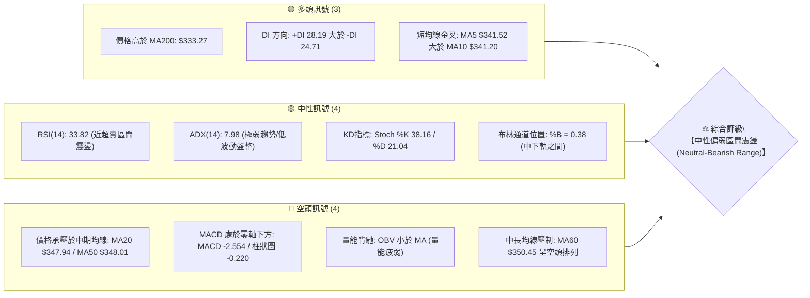
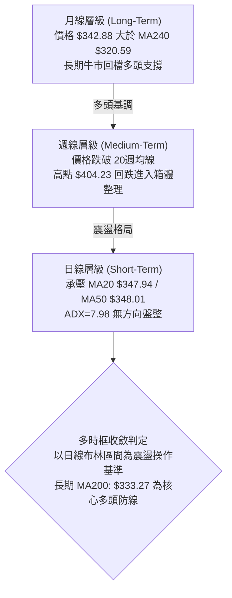
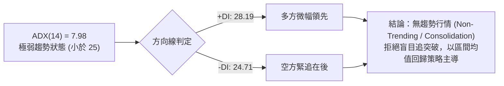
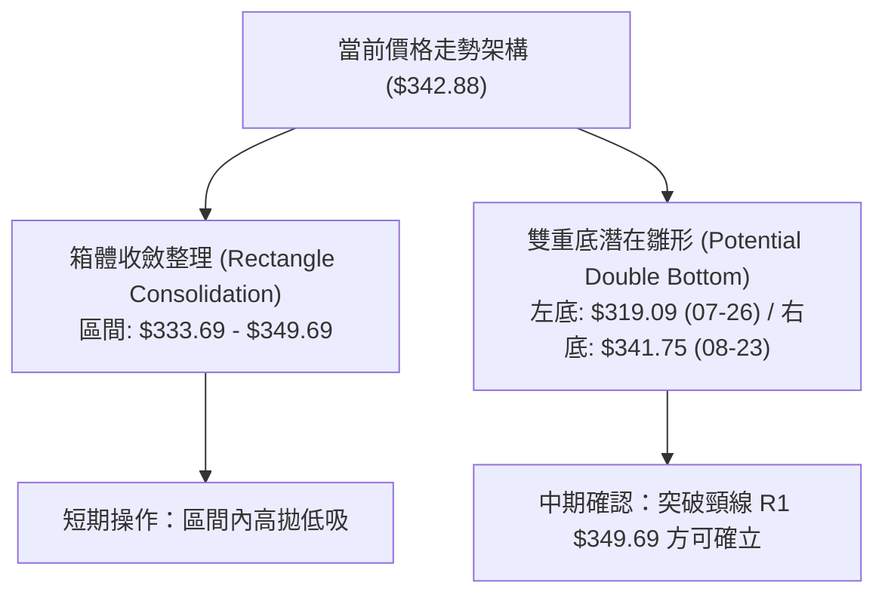
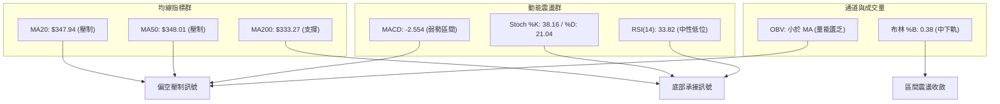
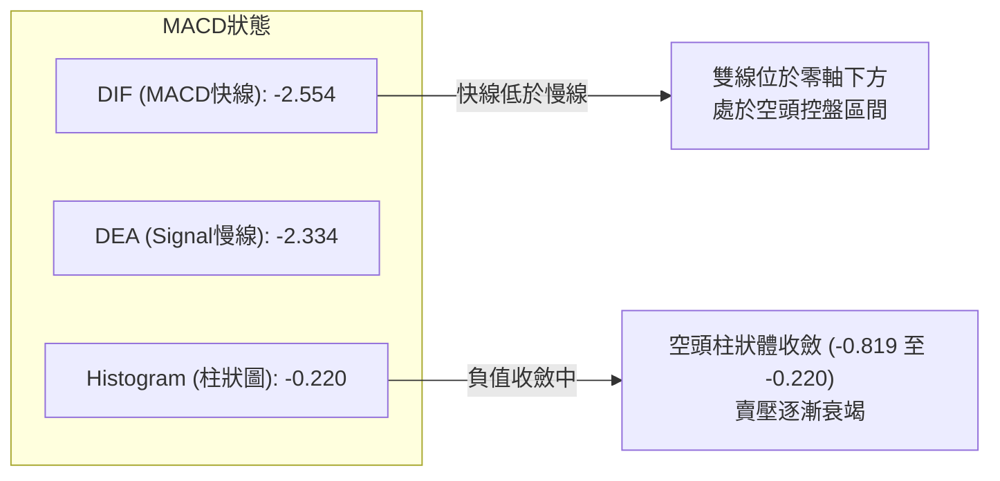
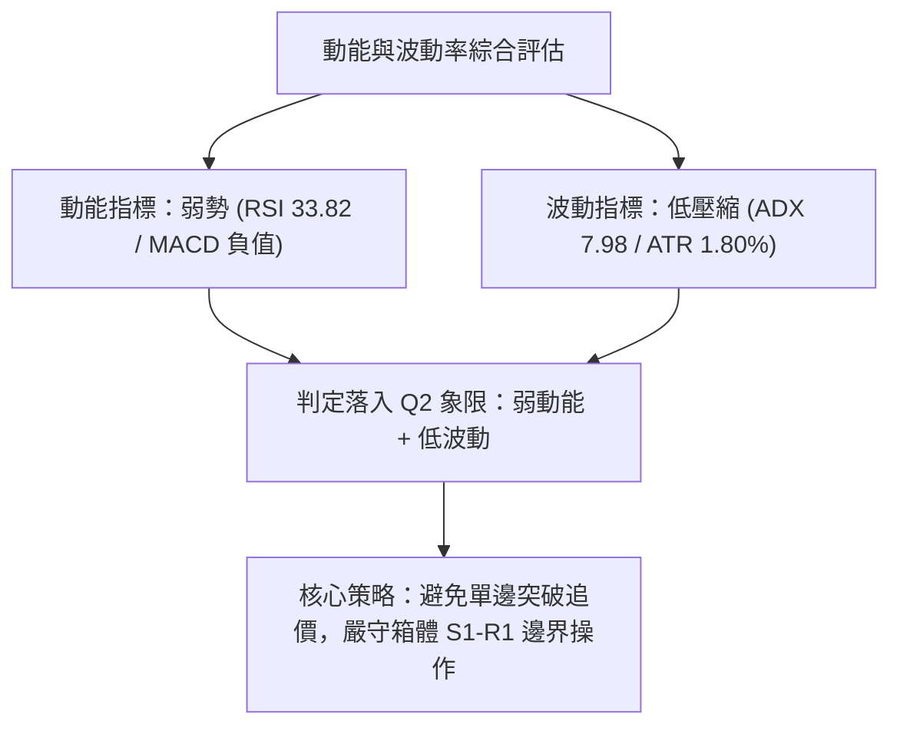
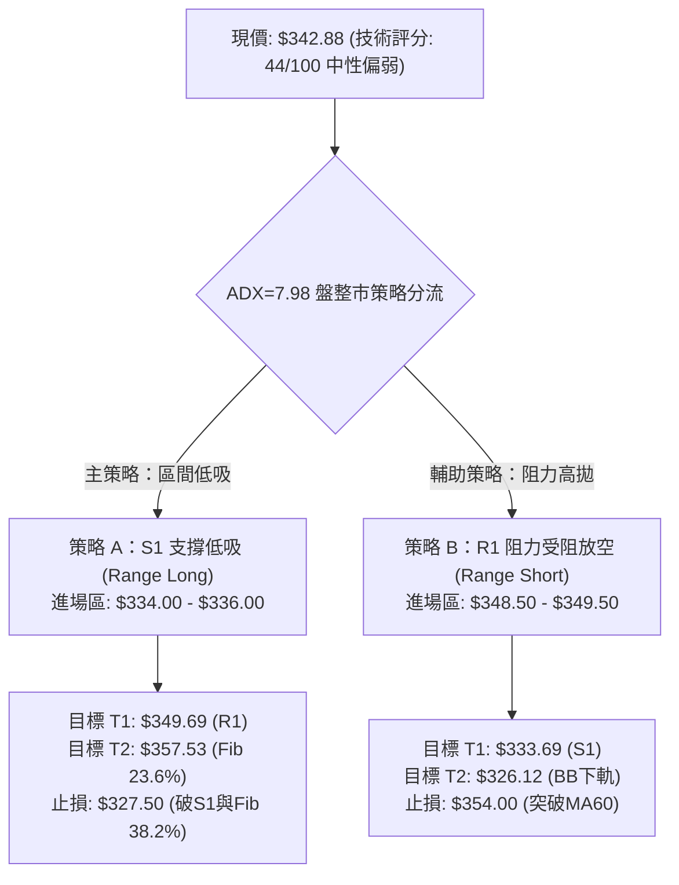
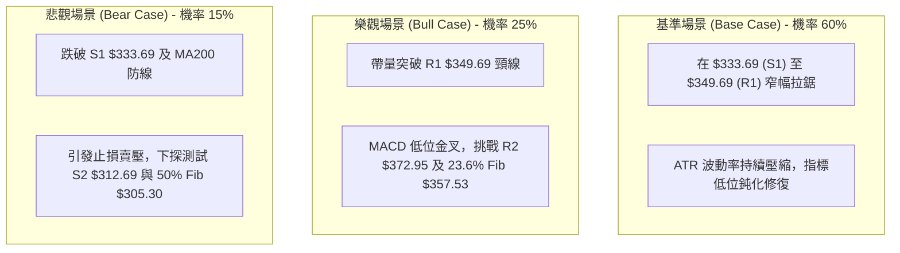

# GOOG 技術分析報告

> **報告日期**：2026-08-30 ｜ **語言**：繁體中文 ｜ **數據來源**：Yahoo Finance ｜ **當前價格**：$342.88

---

## 目錄

| 章節 | 內容 |
|------|------|
| [1. 技術面概覽](#1-技術面概覽) | 訊號儀表板、核心指標、評分卡 |
| [2. 趨勢分析](#2-趨勢分析) | 多時框趨勢、長中短期走勢 |
| [3. 圖表形態分析](#3-圖表形態分析) | 形態識別、K線組合、目標價 |
| [4. 支撐與阻力](#4-支撐與阻力) | 關鍵價位、斐波那契回調 |
| [5. 技術指標深度解讀](#5-技術指標深度解讀) | MA/RSI/MACD/布林/成交量 |
| [6. 動能與波動率](#6-動能與波動率) | 動能評估、ATR、Beta |
| [7. 多時框架總結](#7-多時框架總結) | 時框架評分矩陣 |
| [8. 交易策略建議](#8-交易策略建議) | 多空策略、風險報酬比 |
| [9. 風險提示與監控](#9-風險提示與監控) | 監控指標、風險場景 |

---

## 1. 技術面概覽

### 🎯 技術訊號儀表板



### 📊 核心指標速覽表

| 指標類別 | 指標名稱 | 當前數值 | 訊號 | 解讀 |
|----------|----------|----------|------|------|
| **價格** | 當前價格 | $342.88 | 🟡 | 位於52週區間 69.0% 處，處於自歷史高點 $404.23 回檔後的弱勢整理 |
| **均線** | MA20 | $347.94 | 🔴 | 現價低於 MA20 (-1.45%)，短期呈動能減弱壓制狀態 |
| **均線** | MA50 | $348.01 | 🔴 | 現價低於 MA50 (-1.47%)，中短期反彈面臨重壓 |
| **均線** | MA200 | $333.27 | 🟢 | 現價高於 MA200 (+2.88%)，長期牛熊分界線維持支撐 |
| **動能** | RSI(14) | 33.82 | 🟡 | 位於中性偏低區間（30-70），逼近 30 超賣線，短線賣壓宣洩接近尾聲 |
| **動能** | MACD(12,26,9) | -2.554 / Hist: -0.220 | 🔴 | 雙線位於零軸下方，Histogram 負值擴張，空頭動能仍佔優勢 |
| **波動** | ATR(14) | $6.18 (1.80%) | 🟡 | 波動率處於收斂狀態，顯示市場進入低波動盤整壓縮期 |
| **趨勢** | ADX(14) | 7.98 | 🟡 | ADX < 25 極弱，無明確單邊趨勢，屬於標準區間震盪市 |
| **通道** | 布林通道 | 上: $369.75 / 下: $326.12 | 🟡 | %B = 0.38，價格在中軌($347.94)至下軌($326.12)之間運行 |
| **量能** | OBV 趨勢 | OBV < MA | 🔴 | 量能指標低於均線，資金推升動能不足，買盤追價意願保守 |

### 🏆 技術評分卡

```
╔══════════════════════════════════════════════════════════════════╗
║                技術評分卡 — GOOG (2026-08-30)                    ║
╠══════════════════════════════════════════════════════════════════╣
║ 趨勢強度 (Trend)       ████░░░░░░░░░░░░░░░░  20/100  🔴 極弱趨勢 ║
║ 動能指標 (Momentum)    ████████░░░░░░░░░░░░  40/100  🔴 空方主導 ║
║ 支撐穩定度 (Support)   ██████████████░░░░░░  70/100  🟢 長期有守 ║
║ 成交量配合 (Volume)    ████████░░░░░░░░░░░░  40/100  🔴 量能疲弱 ║
║ 形態完整度 (Pattern)   ██████████░░░░░░░░░░  50/100  🟡 矩形整理 ║
║ 均線排列 (Moving Avg)  ████████░░░░░░░░░░░░  40/100  🟡 混合排列 ║
╠══════════════════════════════════════════════════════════════════╣
║ 綜合技術評分           ██████████░░░░░░░░░░  44/100  🟡 區間偏空 ║
║ 策略定調：ADX=7.98 盤整格局，以布林區間 $326.12 - $369.75 操作為主║
╚══════════════════════════════════════════════════════════════════╝
```

---

## 2. 趨勢分析

### 🌐 多時框趨勢分析



### 📈 長期趨勢 — 12個月走勢圖（Unicode）

```
GOOG 月線走勢圖（2025-09 至 2026-08）
價格 ($)
$400 ┤                                      ● $381.71 (2026-04)
     │                                     / \
$360 ┤                                    /   ● $376.20
     │                        ● $338.09  /     \  ● $356.65
$320 ┤            ● $319.49   / \       /       ● $353.33 \
     │           / \         /   ● $311.02                  ● $342.88 ◄ 現價
$280 ┤  ● $281.27   ● $313.39      \   /
     │ /                             ● $286.69 (2026-03)
$240 ┤● $243.07 (2025-09)
     └─────────────────────────────────────────────────────────────
       09   10    11    12   01    02    03    04    05    06    07    08 (月份)
```

#### 走勢特徵分析表格

| 階段區間 | 起止價格 | 漲跌幅 | 走勢特徵與結構 | 技術意涵 |
|----------|----------|--------|----------------|----------|
| **2025-09 ~ 2025-11** | $243.07 → $319.49 | +31.44% | 單邊主升浪，成交量溫和放大 | 突破前波壓力，建立強勢多頭架構 |
| **2025-12 ~ 2026-03** | $319.49 → $286.69 | -10.27% | 高檔震盪後回踩，於 $286.69 築底 | 健康回檔，測試 61.8% 斐波那契區間 ($281.95) |
| **2026-03 ~ 2026-04** | $286.69 → $381.71 | +33.14% | 強力軋空反彈，創下 52W 高點 $404.23 | 確立大級別主升段，但高檔量能消耗過快 |
| **2026-05 ~ 2026-08** | $381.71 → $342.88 | -10.17% | 階梯式回檔整理，均線糾結 | 高檔獲利了結，回落至 MA200 ($333.27) 之上蓄勢 |

### 📊 中期趨勢（週線分析）

```
近期週線壓力支撐架構示意圖：
  $404.23 ═══════════════════════════════ 52W 歷史高點 (波段頂部阻力)
             │
  $372.95 ───┼─────────────────────────── 波段壓力 R2 (密集套牢區)
             │
  $349.69 ───┼─────────────────────────── 短線頸線壓力 R1 / MA20 / MA50 聚類
  $342.88 ───●─────────────────────────── 當前現價 (弱勢震盪中)
             │
  $333.69 ───┼─────────────────────────── 關鍵支撐 S1 / MA200 ($333.27) 聚類
             │
  $312.69 ───┴─────────────────────────── 強力防守支撐 S2 (波段低點)
```

近20週數據顯示，2026-05-10 創下高點（週收盤 $396.81，RSI 高達 88.0，MACD柱 +4.317），隨後進入連續去槓桿回檔。2026-07-26 下探至波段低點 $319.09 後拉回，近期週收盤價在 $341.75 - $356.65 之間窄幅縮量震盪，顯示中期空頭拋壓減緩，但尚未形成多頭反攻結構。

### ⚡ 趨勢強度評估（ADX 解讀）



#### ADX 趨勢強度量化對照表

| 指標變數 | 當前數值 | 門檻區間 | 趨勢性質判斷 | 交易操作策略指導 |
|----------|----------|----------|--------------|------------------|
| **ADX(14)** | **7.98** | 0 ~ 20 | 極度缺乏方向，處於深度盤整 | 避免使用趨勢跟隨突破策略，改用震盪指標 |
| **+DI(14)** | **28.19** | - | 多方邊際力量 | 存在向上反彈動能，但缺乏趨勢性持續力 |
| **-DI(14)** | **24.71** | - | 空方邊際力量 | 空方殺跌力量放緩，但壓制仍在 |
| **DI 差值** | **+3.48** | \|差值\| < 10 | 多空雙方膠著，處於平衡態 | 採取「高拋低吸、觸軌反向」之區間邊界操作 |

---

## 3. 圖表形態分析

### 🔍 形態識別系統



#### 圖表形態信心度量化評估表

| 形態名稱 | 信心度 (%) | 判斷依據（引用技術數據） | 完成度 (%) | 形態目標價（附精確計算式） |
|----------|------------|--------------------------|------------|----------------------------|
| **矩形箱體震盪** | **85%** | 價格受限於壓力 R1 ($349.69) 與支撐 S1 ($333.69) 之間，ADX=7.98 確認無趨勢 | **90%** | 箱體高度 = $349.69 - $333.69 = $16.00<br/>突破目標 = $349.69 + $16.00 = **$365.69**<br/>跌破目標 = $333.69 - $16.00 = **$317.69** |
| **微型雙底形態** | **55%** | 2026-07-26 低點 $319.09 與 2026-08-23 低點 $341.75 構成墊高低點，頸線為 08-02 高點 $356.65 | **60%** | 形態高度 = $356.65 - $319.09 = $37.56<br/>頸線突破目標 = $356.65 + $37.56 = **$394.21** |
| **頭肩頂（大級別回檔）** | **40%** | 數據不足以確認完整右肩（高點 $404.23 為頭部，左肩約 $382，右肩未成形） | **30%** | 訊號不足，信心度 < 50%，僅做均線壓制解讀，不預設延伸目標 |

### 🕯️ 重要K線形態分析

| 週/月份 | 收盤價 | K線形態特徵 | 量化指標特徵 | 技術意涵與多空訊號 |
|---------|--------|-------------|--------------|--------------------|
| **2026-05-10** | $396.81 | 高檔十字星/長上影線 | RSI 88.0 (嚴重超買), MACD柱 +4.317 | 🔴 頂部力竭訊號，多頭動能消耗殆盡 |
| **2026-07-26** | $319.09 | 長下影倒錘頭/深幅回踩 | RSI 26.4 (極度超賣), 週成交量 1.22億 | 🟢 恐慌盤湧現後的洗盤低點，確認買盤承接 |
| **2026-08-02** | $356.65 | 強勢反彈長陽線 | RSI 回升至 52.4, MACD柱轉正 +0.563 | 🟢 空頭回補浪潮，重新奪回 $350 關卡 |
| **2026-08-23** | $341.75 | 縮量下影小陰線 | RSI 20.6 (二次探底超賣), 週量縮至 69.7M | 🟡 拋壓顯著衰竭，二次測試支撐有效 |
| **2026-08-30** | $342.88 | 窄幅十字星 (現價) | RSI 33.8, MACD柱 -0.220, 量能 82.4M | 🟡 多空進入極致平衡，醞釀方向選擇 |

### 📉 ASCII 走勢形態示意圖

```
GOOG 關鍵箱體與支撐阻力結構示意圖：

  $356.65 ─────────────────┬──────────────────────────────── 08-02 反彈高點 (雙底頸線)
                           │       ┌───┐
  $349.69 ─────────────────┼───────│ R1│ 箱體頂部 ──────────── 阻力 R1 / MA20 ($347.94)
                           │       └───┘
  $342.88 ─────────────────┼─────────● 現價 (箱體中軸整理)
                           │       ┌───┐
  $333.69 ─────────────────┼───────│ S1│ 箱體底部 ──────────── 支撐 S1 / MA200 ($333.27)
                           │       └───┘
  $319.09 ─────────────────┴──────────────────────────────── 07-26 恐慌低點 (波段強支撐)
```

---

## 4. 支撐與阻力

### 🗺️ 關鍵價位分布圖（Unicode）

```
GOOG 價位結構分布圖
═════════════════════════════════════════════════════════════════════
$404.23 ║████████████████████████████████║ 52W 歷史極值高點 (0.0% Fib)
$381.81 ║████████████████████████        ║ 強阻力 R3 (+11.35%)
$372.95 ║████████████████                ║ 波段阻力 R2 (+8.77%)
$357.53 ║▓▓▓▓▓▓▓▓▓▓▓▓▓▓▓▓                ║ 23.6% 斐波那契回調位
$349.69 ║████████████████████████████████║ 關鍵阻力 R1 (+1.99%) / 箱體上軌
$342.88 ╠════════════════════════════════╣ ◄ 現價 (Current Price)
$333.69 ║████████████████████████████████║ 關鍵支撐 S1 (-2.68%) / MA200 ($333.27)
$328.65 ║▓▓▓▓▓▓▓▓▓▓▓▓▓▓▓▓▓▓▓▓            ║ 38.2% 斐波那契回調位 / BB下軌 ($326.12)
$312.69 ║████████████████████████        ║ 強力支撐 S2 (-8.80%)
$295.78 ║████████████                    ║ 終極防線 S3 (-13.74%)
═════════════════════════════════════════════════════════════════════
```

### 🚧 阻力位分析表

| 阻力級別 | 具體價位 | 形成原因與技術聚集 | 突破難度 | 重要性評級 |
|----------|----------|--------------------|----------|------------|
| **R1 (關鍵阻力)** | **$349.69** | 近期波段高點聚類、MA20 ($347.94)、MA50 ($348.01) 及 MA60 ($350.45) 均線密集交匯區 | 中等 | 🔴 極高（短線多空分水嶺，站穩方能打開上行空間） |
| **R2 (波段阻力)** | **$372.95** | 6月初跌破之週線平台密集套牢區、接近布林上軌 ($369.75) | 較高 | 🟡 中高（中期反彈目標位與重壓區） |
| **R3 (強阻力)** | **$381.81** | 2026年4-5月頭部密集成交區下沿、波段歷史次高點 | 極高 | 🔴 高（多頭全面反轉並挑戰新高的關鍵防線） |

### 🛡️ 支撐位分析表

| 支撐級別 | 具體價位 | 形成原因與技術聚集 | 守住機率 | 重要性評級 |
|----------|----------|--------------------|----------|------------|
| **S1 (關鍵支撐)** | **$333.69** | 近一年波段低點聚類、長期牛熊分界線 MA200 ($333.27) 完美共振 | 75% | 🟢 極高（長期多頭生命線，不可實質跌破） |
| **S2 (強支撐)** | **$312.69** | 2026年2月波段低點 ($311.02) 與 7月恐慌低點 ($319.09) 構成之底部緩衝區 | 85% | 🟢 高（大級別多頭結構的底線防守） |
| **S3 (終極支撐)** | **$295.78** | 2026年3月深幅回調低點 ($286.69) 上方之強支撐平台 | 95% | 🟢 中（長期極端超跌價值買盤聚集區） |

### 📐 斐波那契回調位分析

依據 52 週完整波動區間（低點 **$206.37** → 高點 **$404.23**，總振幅 $197.86）計算：

```
0.0%  (52W High)  $404.23 ─── 歷史高點
23.6%             $357.53 ─── 前波回檔第一道支撐轉阻力
────────────────── 現價 $342.88 處於 23.6% 與 38.2% 之間 ──────────────────
38.2%             $328.65 ─── 經典黃金分割回檔位（鄰近布林下軌 $326.12）
50.0%             $305.30 ─── 半數回撤平衡中樞
61.8%             $281.95 ─── 黃金分割生命線（2026-03 築底點 $286.69 獲支撐處）
78.6%             $248.71 ─── 深度調整極限
100.0% (52W Low)  $206.37 ─── 52週起漲點
```

- **位置解讀**：現價 $342.88 運行於 **23.6% ($357.53)** 與 **38.2% ($328.65)** 之間。
- **技術意義**：強勢回調通常在 38.2% 回調位 ($328.65) 之上止跌。只要現價持續守在 $328.65 以及 MA200 ($333.27) 之上，GOOG 的長週期上升結構依然健康，當前走勢定義為「52週大牛市架構下的次級良性修正」。

---

## 5. 技術指標深度解讀

### 🎛️ 指標訊號總覽



### 📈 移動平均線排列分析

```
均線體系階梯分佈：
  MA 60 : $350.45  ─── 下降中 (中中期阻力)
  MA 50 : $348.01  ─── 平緩下移 (中期頸線)
  MA 20 : $347.94  ─── 短期均線壓制
  ─────────────────── 現價 $342.88 ───────────────────
  MA  5 : $341.52  ─── 微幅金叉短彈
  MA 10 : $341.20  ─── 短期止跌
  MA120 : $345.78  ─── 均線糾結處
  MA200 : $333.27  ─── 向上發散 (長期多頭支撐)
  MA240 : $320.59  ─── 堅實底部均線
```

- **均線排列狀態**：當前呈現**「長多短空、中期待變」的混合排列**。
- **交叉訊號解讀**：短期 MA5 ($341.52) 向上穿越 MA10 ($341.20)，提供短線 $341 附近的止跌支撐；但 MA20 ($347.94) 與 MA50 ($348.01) 在上方 $348 附近形成死叉壓制，形成狹窄的「均線夾心層」。

### 📉 RSI(14) 分析

```
RSI(14) 當前數值：33.82
[0] ─────────── [30] ──────●────── [50] ────────────────── [70] ─────────── [100]
                  超賣區   33.82          中軸平衡           超買區
進度條：███████░░░░░░░░░░░░░  33.82%
```

- **超買超賣狀態**：RSI 處於 33.82，已從 2026-08-23 的極度超賣區（20.6）脫離，但仍處於 50 中軸下方，顯示空方動能減弱但多方尚未奪回掌控權。
- **背離判斷**：
  - 價格在 2026-07-26 創下低點 $319.09 時 RSI 為 26.4。
  - 價格在 2026-08-23 回測低點 $341.75 時，RSI 降至 20.6（更低）。
  - **結論：當前無顯著底背離**，走勢屬於同步震盪築底，需觀察後續能否站上 50 確立反彈。

### 📊 MACD(12,26,9) 訊號解讀



- **訊號解析**：MACD 線 (-2.554) 位於 Signal 線 (-2.334) 下方，且兩者均處於零軸之下，證實市場自 5 月以來的中期回檔格局尚未被扭轉。
- **柱狀圖動態**：週線級別 MACD 柱狀圖由 2026-08-23 的 -0.819 收窄至當前 -0.220，負動能持續縮減，隨時有醞釀低位「零下金叉」的技術契機。

### 📦 布林通道分析

```
GOOG 日線布林通道 (Bollinger Bands 20, 2) 結構圖：
  $369.75 ┬────────────────────────────────────────── BB 上軌 (Upper Band)
          │
  $347.94 ┼─────────────────── MA20 ───────────────── BB 中軌 (Middle Band)
          │         ● $342.88 (現價: %B = 0.38)
  $326.12 ┴────────────────────────────────────────── BB 下軌 (Lower Band)
```

- **通道帶寬與位置**：通道寬度為 $43.63，%B 指標為 **0.38**，現價運行於中軌（$347.94）與下軌（$326.12）之間。
- **通道特徵解讀**：布林通道開口並未持續發散，反而呈現走平與微幅收口態勢，確認當前屬於標準的「布林通道內部均值回歸震盪」，下軌 $326.12 與 S1 $333.69 共同構成強力多頭緩衝帶。

### 💹 成交量分析（量價配合度）

- **量能數據對比**：
  - 最新日成交量：**17,829,200** 股
  - 20 日平均成交量：**16,627,200** 股（量比：**1.07x**，量能溫和持平）
  - 50 日平均成交量：**20,700,542** 股（低於中期均量，呈現縮量整理）
- **OBV 趨勢解讀**：OBV < MA，能量潮指標落後於均線。此現象表明市場在反彈過程中買盤資金介入意願偏向謹慎，並未出現主力機構大舉進場搶籌的放量訊號（Accumulation），量能型態確認當前為「無量盤整」。

---

## 6. 動能與波動率

### ⚡ 動能評估四象限

| 象限 | 動能強度 (Momentum) | 波動率水準 (Volatility) | 當前歸屬 | 交易操作策略意涵 |
|:---:|:---:|:---:|:---:|---|
| **Q1** | 強 (Bullish) | 低 (Low) | — | 穩定單邊牛市，拉回買進 |
| **Q2** | **弱 (Bearish/Neutral)** | **低 (Low)** | **✓ (GOOG)** | **低波動沉悶盤整，高拋低吸，嚴格控制倉位** |
| **Q3** | 強 (Bullish) | 高 (High) | — | 高風險高收益，突破追隨 |
| **Q4** | 弱 (Bearish) | 高 (High) | — | 主跌浪恐慌釋放，觀望避險 |



### 📊 ATR 波動率分析

- **ATR(14) 數值**：**$6.18**（佔當前股價之 **1.80%**）。
- **波動率意義**：GOOG 歷史平均波動率通常在 2.2% - 2.8%，當前 1.80% 處於歷史偏低水平，顯示市場交投清淡，進入方向選擇前的極致壓縮期。
- **風控止損應用**：
  - 震盪操作止損距離：建議採用 **1.5 × ATR = $9.27**
  - 波段操作止損距離：建議採用 **2.0 × ATR = $12.36**

### 📐 Beta 與市場相關性

- **Beta 係數**：**1.237**
- **市場特徵**：GOOG 表現出高於標普500大盤 23.7% 的彈性。在市場缺乏宏觀催化劑的背景下，高 Beta 意味著一旦大盤出現方向性破位或反彈，GOOG 將迅速放大波動；但在個股層面，當前受到自身估值與技術壓制，呈現蓄勢整理。

---

## 7. 多時框架總結

### 📋 時框架評分表

| 時框架 | 趨勢方向 | 動能指標 | 均線排列 | 圖表形態 | 綜合評分 | 操作指導建議 |
|:---:|:---:|:---:|:---:|:---:|:---:|---|
| **短期 (日線)** | 偏空震盪 🔴 | RSI 33.82 / MACD 負柱 🔴 | 價格低於 MA20/MA50 🔴 | 矩形整理 $333-$349 🟡 | 38/100 | 下軌附近輕倉短多，上軌受阻平倉 |
| **中期 (週線)** | 區間修正 🟡 | 負柱收窄 / RSI 50附近 🟡 | 跌破 20週均線 🟡 | 52W 高點回調 38.2% 🟢 | 46/100 | 等待突破 $349.69 頸線確認轉強 |
| **長期 (月線)** | 多頭格局 🟢 | 長期牛市架構完好 🟢 | 遠高於 MA240 ($320.59) 🟢 | 階梯式牛市大通道 🟢 | 72/100 | 核心多頭防線 MA200 有效，長線偏多 |

### 🔲 綜合訊號矩陣

```
時框訊號收斂矩陣：
┌──────────────┬─────────────┬─────────────┬─────────────┐
│ 技術維度     │ 短期 (日線) │ 中期 (週線) │ 長期 (月線) │
├──────────────┼─────────────┼─────────────┼─────────────┤
│ 均線系統     │   🔴 看空   │   🟡 中性   │   🟢 看多   │
│ 動能 (RSI/MACD)│ 🔴 看空   │   🟡 中性   │   🟢 看多   │
│ 形態與位置   │   🟡 震盪   │   🟡 震盪   │   🟢 看多   │
│ 量能配合     │   🔴 疲弱   │   🟡 持平   │   🟢 健康   │
└──────────────┴─────────────┴─────────────┴─────────────┘
```

### ⚖️ 多時框收斂結論

> **依多時框收斂規則（ADX = 7.98 < 25 判定為典型盤整行情）**：
> 1. **主導時框**：當前市場由**日線布林通道與短期均線夾心層**主導，趨勢跟隨無效。
> 2. **取捨原則**：雖然長期月線維持多頭，但日線與週線動能處於弱勢壓制狀態，不可盲目追高。
> 3. **唯一方向性結論**：**【中性偏弱區間震盪 (Neutral-Bearish Range)】**。交易策略嚴格以布林通道下軌與支撐 S1 ($333.69) 至阻力 R1 ($349.69) 的**區間逆勢/高拋低吸**為主，等待帶量突破。

---

## 8. 交易策略建議

### 🗺️ 策略決策流程圖



### 🧭 策略路由（依評分卡分流）

**當前主策略方向 = 【中性區間雙向操作（偏好 S1 支撐低吸）】（依技術評分 44/100 定調）**
- 評分處於 40–60 區間，ADX=7.98 確認無趨勢，主推**「布林通道下軌/S1支撐處低吸」**之震盪修復策略，同時提供阻力位反向避險方案。

### 🎯 價格情境階梯（Price Scenarios）

| 觸發條件 | 下一目標 | 後續延伸 | 情境含義與技術解讀 |
|----------|----------|----------|--------------------|
| **強勢突破 R1 ($349.69)** | **R2 ($372.95)** | **R3 ($381.81)** | 短線轉強，站上 MA20/MA50，雙底形態確認，挑戰前波套牢平台 |
| **維持現價區間 ($333.69 - $349.69)** | **布林中軌 ($347.94)** | — | 無方向縮量沉悶震盪，動能指標低位修復，時間換取空間 |
| **有效跌破 S1 ($333.69)** | **S2 ($312.69)** | **S3 ($295.78)** | 長期均線 MA200 失守，多頭防線下移，回測 2026-07 恐慌低點 |

### 📊 情境機率分佈

| 價格情境 | 發生機率 | 主要依據與技術指標支撐 |
|----------|:---:|------------------------|
| **情境一：區間窄幅震盪 (Range)** | **60%** | ADX=7.98 極弱趨勢、布林帶寬走平、均線混合纏繞、量能萎縮 |
| **情境二：向上突破反彈 (Bullish)** | **25%** | RSI 33.82 脫離超賣、MACD 負柱顯著收斂、MA200 ($333.27) 支撐強勁 |
| **情境三：向下破位探底 (Bearish)** | **15%** | OBV < MA 量能疲弱、MA20/50 死叉壓制，但受制於長期大牛市基底，深跌機率低 |

### 🟢 主策略詳情

| 策略要素 | 策略 A：S1 支撐位低吸做多（主推） | 策略 B：R1 阻力位受阻短空（輔助） |
|----------|------------------------------------|-----------------------------------|
| **策略類型** | 區間下軌均值回歸 (Mean Reversion Long) | 阻力位受阻回落 (Range Resistance Short) |
| **進場條件** | 價格拉回測試 S1 ($333.69) 與 MA200 企穩出現下影線 | 價格反彈至 R1 ($349.69) 遇阻且 1小時K線出現頂分型 |
| **進場價格** | **$335.00** (在 S1 $333.69 上方佈局) | **$349.00** (在 R1 $349.69 處掛單) |
| **目標價 T1** | **$349.69** (阻力位 R1 / 期望收益 +4.38%) | **$335.00** (支撐位 S1 / 期望收益 +4.01%) |
| **目標價 T2** | **$357.53** (23.6% 斐波那契位 / 期望收益 +6.73%) | **$328.65** (38.2% 斐波那契位 / 期望收益 +5.83%) |
| **止損價格** | **$327.50** (跌破 38.2% Fib $328.65 及 BB下軌) | **$354.00** (實質突破 MA60 $350.45 阻力) |
| **風險空間** | **$7.50** (-2.24%) | **$5.00** (-1.43%) |
| **風險報酬比** | **1 : 1.96** (以 T1 計算) / **1 : 3.00** (以 T2 計算) | **1 : 2.80** (以 T1 計算) / **1 : 4.08** (以 T2 計算) |
| **估計勝率** | **65%** (在 MA200 強支撐保護下) | **55%** (順應短線均線壓制) |
| **建議倉位** | **10% - 15%** (盤整市輕倉參與) | **5% - 8%** (短線對沖防禦) |

### 🔴 反向風險觸發點（對沖提示）

- **多頭停損/反手放空觸發點**：若日K線收盤價**實質跌破 $328.65**（38.2% 斐波那契回調位與布林下軌共振區），宣告 MA200 防線潰敗，必須立即無條件止損所有多單，並可建立對沖空頭頭寸，下看 S2 **$312.69**。
- **空頭停損/追多觸發點**：若放量突破並連續兩日收於 **$350.45**（MA60）之上，宣告日線級別均線壓制解除，空單全數離場，反手順勢做多上看 R2 **$372.95**。

### ⭐ 整體訊號強度評星

```
做多訊號強度：★★☆☆☆  (2.5/5星 — 支撐強勁但缺乏動能催化)
做空訊號強度：★★★☆☆  (3.0/5星 — 短中期均線壓制明確)
整體可信度：  ★★★★☆  (4.0/5星 — 指標數據極度收斂，區間邊界清晰)
```

---

## 9. 風險提示與監控

### ✅ 關鍵監控指標 Checklist

```
╔══════════════════════════════════════════════════════════════════╗
║               GOOG 日常交易關鍵技術監控 Checklist                 ║
╠══════════════════════════════════════════════════════════════════╣
║ [ ] 1. 均線攻防：現價能否帶量站上 MA20 ($347.94) 與 MA50 ($348.01)║
║ [ ] 2. 支撐防守：MA200 ($333.27) 及波段支撐 S1 ($333.69) 是否穩固 ║
║ [ ] 3. 動能突破：MACD 柱狀圖是否由負翻正 (當前 -0.220)           ║
║ [ ] 4. 趨勢喚醒：ADX(14) 是否由 7.98 向上突破 20，宣告單邊行情啟動 ║
║ [ ] 5. 量能確認：日成交量能否放大超越 50日均量 (20,700,542 股)    ║
║ [ ] 6. 超買超賣：RSI(14) 能否突破 50 中軸分水嶺 (當前 33.82)      ║
╚══════════════════════════════════════════════════════════════════╝
```

### ⚠️ 風險場景分析



### 🛡️ 風險管理重要提醒

1. **嚴禁趨勢性追高殺跌**：當前 ADX 為極低的 **7.98**，任何向上看似突破或向下看似破位的走勢，在未放量前有極大機率為「假突破/假跌破」，切忌在箱體中軌附近追單。
2. **波動率壓縮後的變盤防範**：ATR 降至 1.80%，預示著能量正在高度積聚。一旦日K線出現實體大於 $12.00（約 2倍 ATR）的放量K線，即代表變盤展開，必須立刻由「震盪思維」切換至「趨勢思維」。
3. **部位規模控管**：在盤整市場中，單筆交易風險敞口應嚴格控制在總投資組合淨值的 **1.0%** 以內。

---

## 📋 報告總結

```
╔══════════════════════════════════════════════════════════════════╗
║                    GOOG 技術分析報告總結                         ║
╠══════════════════════════════════════════════════════════════════╣
║ 報告日期：2026-08-30                                             ║
║ 當前價格：$342.88                                                ║
║ 分析評級：⚖️ 中性偏弱區間震盪 (Neutral-Bearish Range)            ║
║                                                                  ║
║ 關鍵技術結論：                                                   ║
║ ├─ 長期趨勢：🟢 偏多（價格穩居 MA200 $333.27 與 MA240 $320.59 之上）║
║ ├─ 中期趨勢：🟡 震盪（52週高點 $404.23 回檔 38.2% 處構築箱體整理） ║
║ ├─ 短期趨勢：🔴 偏弱（承壓於 MA20 $347.94 / MA50 $348.01）         ║
║ ├─ 關鍵支撐：S1 $333.69 / 斐波那契 38.2% $328.65                  ║
║ ├─ 關鍵阻力：R1 $349.69 / 阻力 R2 $372.95                        ║
║ └─ 華爾街共識：Strong Buy（15位分析師目標均價 $422.34）           ║
║                                                                  ║
║ 最優交易策略組合：                                               ║
║ 1. 🥇 最佳機會：於 S1 支撐區 $334-$336 逢低佈局，博弈反彈至 R1   ║
║ 2. 🥈 次選機會：突破 R1 $349.69 且回踩確認後，順勢加碼上看 R2   ║
║ 3. 🥉 保守選擇：空手觀望，靜待 ADX 升破 20 且突破箱體後再行介入  ║
╚══════════════════════════════════════════════════════════════════╝
```

---

> ⚠️ **免責聲明**：本報告為 AI 自動生成之技術分析，所有數據及估算均基於提供的歷史價格資訊。本報告**僅供研究與學術參考**，**不構成任何投資建議**。投資有風險，入市需謹慎。

---

*報告生成時間：2026-08-30 ｜ 數據來源：Yahoo Finance ｜ 分析框架：多時框技術分析*