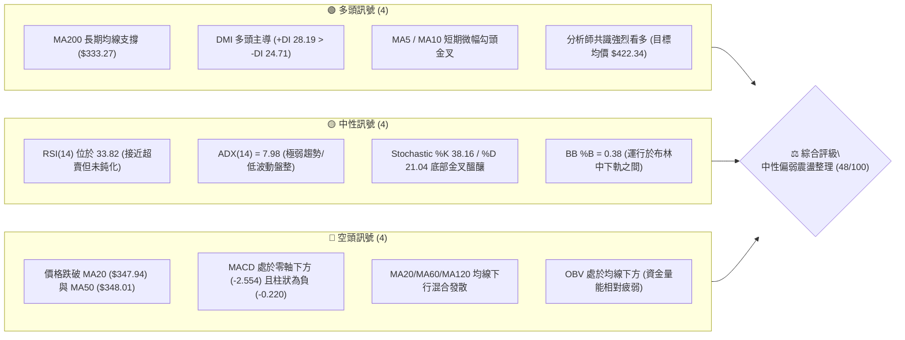
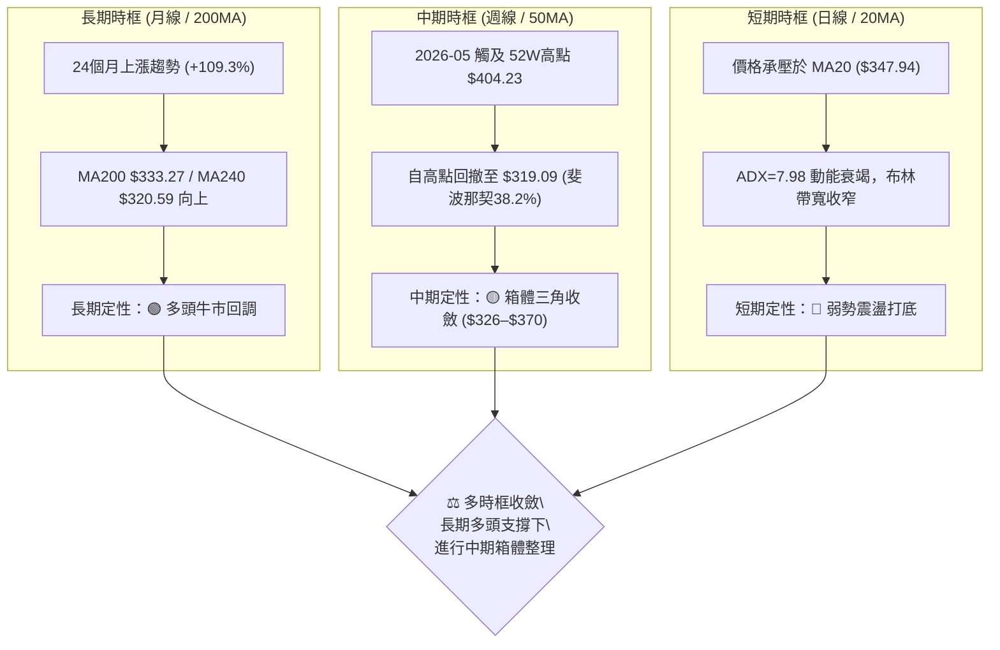
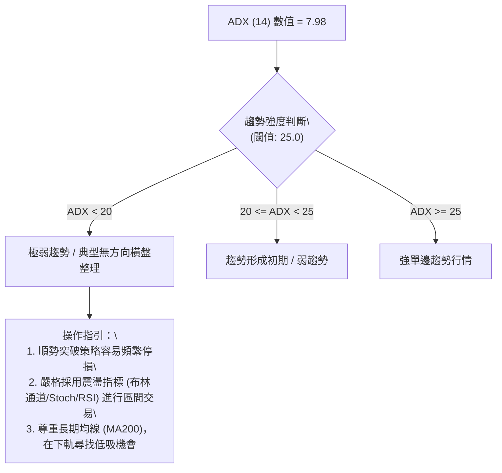
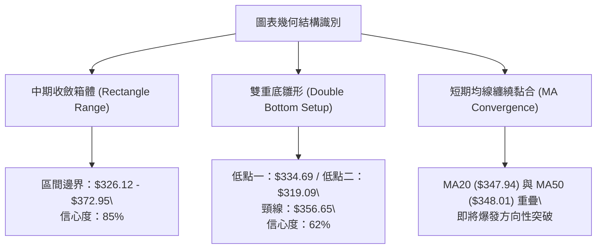
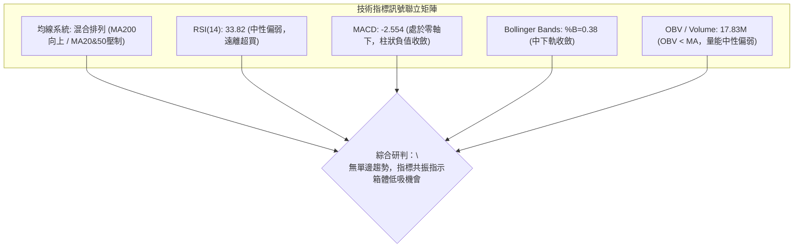
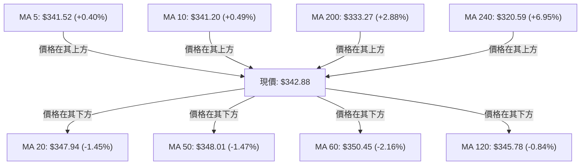
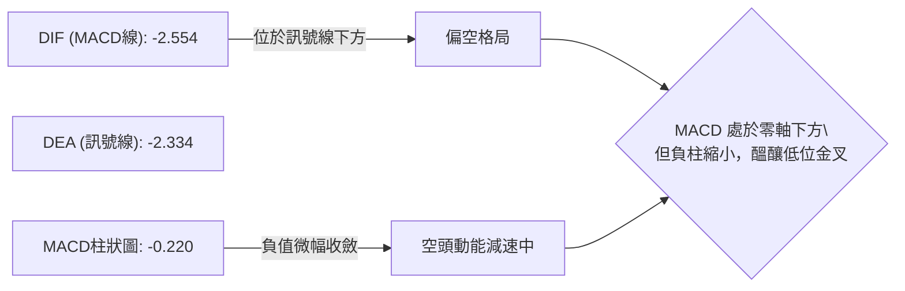
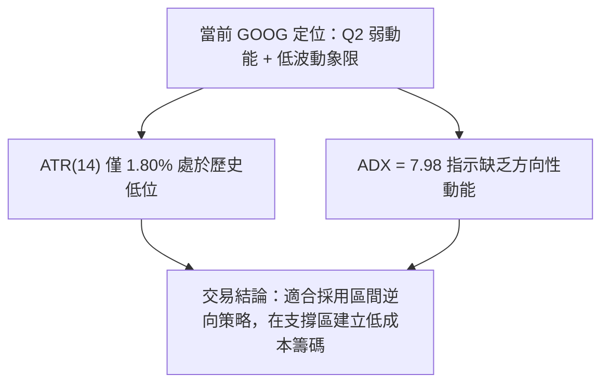
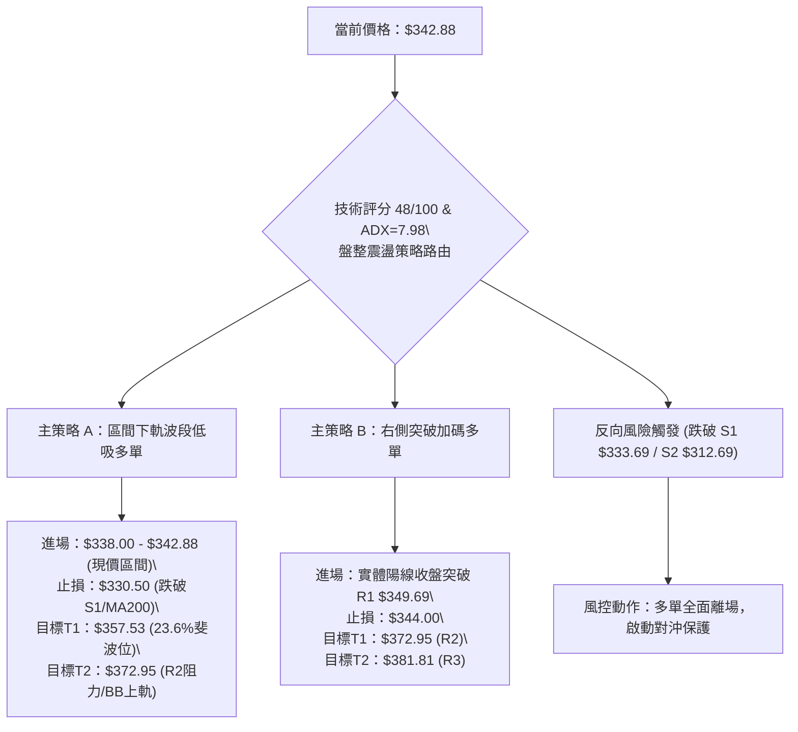
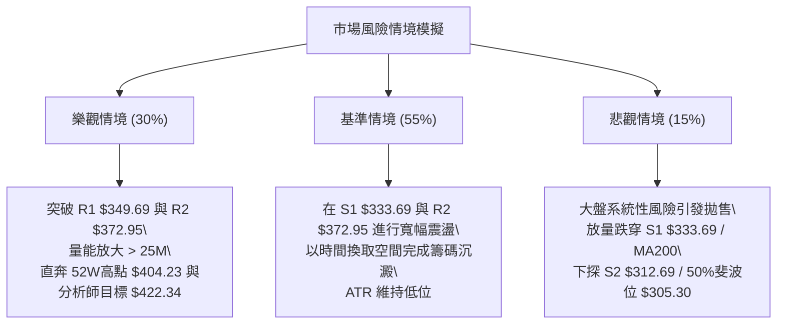

# GOOG 技術分析報告

> **報告日期**：2026-08-31 ｜ **語言**：繁體中文 ｜ **數據來源**：Yahoo Finance ｜ **當前價格**：$342.88

---

## 目錄

| 章節 | 內容 |
|------|------|
| [1. 技術面概覽](#1-技術面概覽) | 訊號儀表板、核心指標、評分卡 |
| [2. 趨勢分析](#2-趨勢分析) | 多時框趨勢、長中短期走勢、ADX解讀 |
| [3. 圖表形態分析](#3-圖表形態分析) | 形態識別、K線組合、目標價計算 |
| [4. 支撐與阻力](#4-支撐與阻力) | 關鍵價位、斐波那契回調結構 |
| [5. 技術指標深度解讀](#5-技術指標深度解讀) | MA/RSI/MACD/布林/成交量全面剖析 |
| [6. 動能與波動率](#6-動能與波動率) | 動能四象限、ATR波動率、Beta市場敏感度 |
| [7. 多時框架總結](#7-多時框架總結) | 時框架評分矩陣、多時框收斂定論 |
| [8. 交易策略建議](#8-交易策略建議) | 策略路由、區間操作、風險報酬比 |
| [9. 風險提示與監控](#9-風險提示與監控) | 監控清單、風險場景模擬、倉位風控 |
| [📋 報告總結](#-報告總結) | 核心要點速覽與投資決策匯總 |

---

## 1. 技術面概覽

### 🎯 技術訊號儀表板



### 📊 核心指標速覽表

| 指標類別 | 指標名稱 | 當前數值 | 訊號 | 解讀 |
|:---|:---|:---|:---:|:---|
| **價格** | 當前價格 | $342.88 | 🟡 | 位於52週區間 69.0% 位置，處於近三個月收斂中樞 |
| **均線** | MA20 (短中) | $347.94 | 🔴 | 價格位於 MA20 下方 (-1.45%)，短期承壓 |
| **均線** | MA50 (中期) | $348.01 | 🔴 | 價格位於 MA50 下方 (-1.47%)，中期趨勢受阻 |
| **均線** | MA200 (長期) | $333.27 | 🟢 | 價格位於 MA200 上方 (+2.88%)，長期多頭基底尚存 |
| **動能** | RSI(14) | 33.82 | 🟡 | 徘徊於超賣邊界，未出現明顯背離，下行動能減速 |
| **動能** | MACD (12,26,9) | -2.554 / -2.334 | 🔴 | MACD線位於訊號線下方，Histogram (-0.220) 偏空 |
| **動能** | 隨機指標 (Stoch) | %K: 38.16 / %D: 21.04 | 🟢 | %K自超賣區向上穿越%D形成超賣黃金交叉 |
| **趨勢** | ADX (14) | 7.98 | 🟡 | ADX < 25 表示處於無趨勢/盤整行情，以區間震盪看待 |
| **趨勢** | DMI 方向線 | +DI: 28.19 / -DI: 24.71 | 🟢 | 多頭力量微幅領先空頭，但缺乏強趨勢推動 |
| **波動** | ATR (14) | $6.18 (1.80%) | 🟡 | 波動率收縮至低位，日均震盪幅度收窄 |
| **通道** | 布林通道 (%B) | 0.38 (帶寬 $326.12–$369.75) | 🟡 | 位於中軌下方、下軌上方，偏向中下軌支撐測試 |
| **量能** | 20日均量比 | 1.07x (17.83M / 16.63M) | 🟡 | 略高於月均量，但低於50日均量 (20.70M)，量能中性 |

### 🏆 技術評分卡

```
╔══════════════════════════════════════════════════════════════════════╗
║                   技術評分卡 — GOOG (2026-08-31)                     ║
╠══════════════════════════════════════════════════════════════════════╣
║ 趨勢強度 (Trend)     ████░░░░░░░░░░░░░░░░  20/100  🔴 (ADX極低 無趨勢)║
║ 動能指標 (Momentum)  ████████░░░░░░░░░░░░  40/100  🟡 (RSI/Stoch修復中)║
║ 支撐穩定度 (Support) ██████████████░░░░░░  70/100  🟢 (MA200與S1強韌) ║
║ 成交量配合 (Volume)  ████████░░░░░░░░░░░░  40/100  🔴 (OBV疲弱量能不濟)║
║ 形態完整度 (Pattern) ████████████░░░░░░░░  60/100  🟡 (區間箱體未破)   ║
║ 均線排列 (MA System) ████████████░░░░░░░░  58/100  🟡 (長多短空混合排列)║
╠══════════════════════════════════════════════════════════════════════╣
║ 綜合技術評分         █████████░░░░░░░░░░░  48/100  ⚖️ 區間盤整／觀望 ║
╚══════════════════════════════════════════════════════════════════════╝
```

---

## 2. 趨勢分析

### 🌐 多時框趨勢分析



### 📈 長期趨勢 — 12個月走勢圖（Unicode）

```
GOOG 月線走勢圖（過去12個月：2025-09 至 2026-08）
價格軸 ($)
$400 ┤                                      ● (04-05月高點 $381.71/52W $404.23)
$375 ┤                                  ●   │   ●
$350 ┤                                  │   │   │   ●   ●
$325 ┤                          ●   ●   │   │   │   │   │   ● (現價 $342.88)
$300 ┤                  ●   │   │   │   │   │   │   │   │   │
$275 ┤              ●   │   │   │   │   │   │   │   │   │   │
$250 ┤          ●   │   │   │   │   │   │   │   │   │   │   │
$225 ┤          │   │   │   │   │   │   │   │   │   │   │   │
$200 ┤          │   │   │   │   │   │   │   │   │   │   │   │
     └──────────┴───┴───┴───┴───┴───┴───┴───┴───┴───┴───┴───┴───
       月份     09  10  11  12  01  02  03  04  05  06  07  08  (2025-2026)
       收盤($) 243 281 319 313 338 311 286 381 376 353 356 342
```

**走勢特徵分析表格**：

| 階段 | 時間區間 | 起始價 → 結束價 | 區間漲跌幅 | 走勢特徵與結構解讀 |
|:---|:---:|:---:|:---:|:---|
| **主升浪一期** | 2025-09 ~ 2025-11 | $212.92 → $319.49 | **+50.05%** | 帶量突破多重均線，形成單邊強勢上攻主升浪 |
| **高位整理一** | 2025-12 ~ 2026-03 | $319.49 → $286.69 | **-10.27%** | 獲利了結盤湧現，下探尋求 MA200 支撐，於 $286 見底 |
| **主升浪二期** | 2026-03 ~ 2026-05 | $286.69 → $381.71 | **+33.14%** | 爆發性反彈，創下 52週歷史新高 $404.23 |
| **次級修正期** | 2026-05 ~ 2026-08 | $381.71 → $342.88 | **-10.17%** | 自頂部縮量回調，在 $326-$370 區間建立高位震盪箱體 |

### 📊 中期趨勢（週線分析）

```
近期週線級別價格與壓力支撐分佈示意圖：
$404.23 ───┬─────────────────────────────────── 52W 歷史最高點 (強阻力頂部)
           │
$381.81 ───┼─────────────────────────────────── R3 阻力區間 / 5月收盤密集區
$372.95 ───┼─────────────────────────────────── R2 阻力 / 布林通道上軌 ($369.75)
$349.69 ───┼─────────────────────────────────── R1 關鍵均線壓力 (MA20: $347.94 / MA50: $348.01)
$342.88 ───┼─► 【當前收盤價格位置】
$333.69 ───┼─────────────────────────────────── S1 近期波段關鍵支撐 (與MA200 $333.27共振)
$326.12 ───┼─────────────────────────────────── 日線布林下軌支撐
$312.69 ───┼─────────────────────────────────── S2 強支撐位 (7月低點 $319.09 防守區)
$295.78 ───┴─────────────────────────────────── S3 底部終極防線
```

### ⚡ 趨勢強度評估（ADX 解讀）



**ADX 與 DMI 綜合指標參數矩陣**：

| 指標名稱 | 當前參數值 | 狀態評估 | 實戰交易解讀 |
|:---|:---:|:---:|:---|
| **ADX (14)** | **7.98** | 極度鈍化 / 無趨勢 | 趨勢動能極弱，市場處於能量高度蓄積與方向選擇前夕 |
| **+DI (14)** | **28.19** | 多頭佔優 | 買方在微觀結構中仍佔據相對優勢 |
| **-DI (14)** | **24.71** | 空頭壓制 | 賣方力量未失控，兩者差距不大 (+3.48) |
| **市場狀態定性** | **無趨勢箱體盤整** | 🟡 中性震盪 | **依據規則 14：盤整行情以日線布林通道上下軌為主要交易邊界** |

---

## 3. 圖表形態分析

### 🔍 形態識別系統



**形態信心度與目標價計算表**（依據規則 13、15）：

| 形態名稱 | 信心度 | 判斷依據（嚴格引用數據） | 完成度 | 目標價（附嚴謹計算式） |
|:---|:---:|:---|:---:|:---|
| **中期水平整理箱體** | **85%** | 價格在 S1 ($333.69) 與 R2 ($372.95) 之間進行長達 14 週的反覆震盪拉鋸 | 75% | **向上突破目標**：箱頂 $372.95 + 箱高 ($372.95 - $333.69 = $39.26) = **$412.21**<br>**向下破位目標**：箱底 $333.69 - 箱高 $39.26 = **$294.43** (逼近 S3 $295.78) |
| **雙重底雛形** | **62%** | 2026-06-28 週低點 $334.69 與 2026-07-26 週低點 $319.09 構成雙底雛形，頸線位於 2026-08-02 高點 $356.65 | 60% | **測幅目標價**：頸線 $356.65 + 形態高度 ($356.65 - $319.09 = $37.56) = **$394.21** (接近 52W 高點 $404.23) |
| **布林帶瓶頸收縮突破** | **78%** | 帶寬收窄 ($326.12–$369.75)，價格處於中軌 ($347.94) 附近，ADX 處於極低值 7.98 | 80% | 向上確認目標：**R1 $349.69** → **R2 $372.95**；向下確認目標：**S1 $333.69** |

### 🕯️ 重要K線形態分析

| 週期/月份 | 收盤價 | K線形態 / 量價特徵 | 技術面解讀 | 訊號 |
|:---|:---:|:---|:---|:---:|
| **2026-05-10 週** | $396.81 | **長上影高位十字星** | 衝擊 52W 高點 $404.23 受阻，賣壓湧現形成頂部轉折 | 🔴 |
| **2026-06-28 週** | $334.69 | **放量長陰下影線 (188.1M)** | 恐慌盤湧出，單週成交爆出天量，探底 MA200 獲得強支撐 | 🟢 |
| **2026-07-26 週** | $319.09 | **假跌破回升錘子線 (122.3M)** | 跌破 38.2% 斐波那契位後迅速收復，確立次級回撤低點 | 🟢 |
| **2026-08-23 週** | $341.75 | **極度縮量十字星 (69.8M)** | 週成交量萎縮至近期低谷，市場拋壓基本衰竭，變盤在即 | 🟡 |
| **2026-08-30 週** | $342.88 | **微幅放量小陽線 (82.4M)** | 週線 RSI 自超賣區 (20.6) 回升至 33.8，企穩回升跡象 | 🟢 |

### 📉 ASCII 走勢形態示意圖

```
GOOG 中期箱體震盪與雙底結構圖解：
$380 ┤                        [波段高點 $381.71 / R3]
     │                       ╭──────╮
$360 ┤               [頸線]  │      │       ╭─── [頸線 $356.65] ─── R1 $349.69
     │               ╭───────╯      ╰───────╯         ▲
$340 ┤───────────────│─────────────────────────────────┼─── 現價 $342.88
     │               │                                 │    (震盪中樞)
$320 ┤       ╭───────╯                                 │
     │       │ [第一底 $334.69]               [第二底 $319.09]
$300 ┤───────┴─────────────────────────────────────────┴─── S2 強支撐 $312.69
             2026-06-28                       2026-07-26
```

### 🎯 形態目標價計算

```
╔══════════════════════════════════════════════════════════════════════╗
║                    圖表形態測幅目標價量化推算                        ║
╠══════════════════════════════════════════════════════════════════════╣
║ 1. 雙重底形態測幅 (Double Bottom Measurement):                      ║
║    • 頸線位 (Neckline)              = $356.65 (2026-08-02 週收盤)    ║
║    • 低點最低位 (Pattern Low)       = $319.09 (2026-07-26 週低點)    ║
║    • 形態高度 (H)                   = $356.65 - $319.09 = $37.56     ║
║    • 向上突破目標價 (T_Bull)        = $356.65 + $37.56 = $394.21     ║
║                                                                      ║
║ 2. 箱體震盪破位測幅 (Rectangle Breakdown Measurement):               ║
║    • 箱體頂部阻力 (R2)              = $372.95                        ║
║    • 箱體底部支撐 (S1)              = $333.69                        ║
║    • 箱體高度 (H_Range)             = $372.95 - $333.69 = $39.26     ║
║    • 向下破位目標價 (T_Bear)        = $333.69 - $39.26 = $294.43     ║
╚══════════════════════════════════════════════════════════════════════╝
```

---

## 4. 支撐與阻力

### 🗺️ 關鍵價位分布圖（Unicode）

```
GOOG 價位結構分布圖
═══════════════════════════════════════════════════════════════════
$404.23 ║██████████████████████████████║ 52W 歷史極值 / 0.0% 斐波那契
$381.81 ║████████████████████████      ║ 強阻力 R3 (+11.35%)
$372.95 ║████████████████████          ║ 波段阻力 R2 (+8.77%) / BB上軌 $369.75
$357.53 ║▓▓▓▓▓▓▓▓▓▓▓▓▓▓▓▓▓▓            ║ 23.6% 斐波那契回調位
$349.69 ║████████████████              ║ 關鍵均線阻力 R1 (+1.99%) [MA20/MA50]
$342.88 ╠══════════════════════════════╣ ◄ 當前收盤現價 (Current Price)
$333.69 ║████████████████████████      ║ 近期波段支撐 S1 (-2.68%) / MA200 $333.27
$328.65 ║▓▓▓▓▓▓▓▓▓▓▓▓▓▓▓▓▓▓▓▓▓▓        ║ 38.2% 斐波那契回調位 / BB下軌 $326.12
$312.69 ║████████████████████████████  ║ 強支撐 S2 (-8.80%)
$305.30 ║▓▓▓▓▓▓▓▓▓▓▓▓▓▓▓▓▓▓▓▓▓▓▓▓▓▓    ║ 50.0% 斐波那契強共振分水嶺
$295.78 ║██████████████████████████████║ 底部終極防線 S3 (-13.74%)
═══════════════════════════════════════════════════════════════════
```

### 🚧 阻力位分析表

| 阻力級別 | 價位 | 形成原因 | 突破難度 | 權重重要性 |
|:---|:---:|:---|:---:|:---:|
| **阻力 R1** | **$349.69** | 近一年波段高點聚類；與 MA20 ($347.94) 及 MA50 ($348.01) 密集重疊，為短線多空分水嶺 | 中等 | ★★★★☆ |
| **阻力 R2** | **$372.95** | 近一年波段高點聚類；與日線布林上軌 ($369.75) 形成共振，為箱體震盪上限區間 | 較高 | ★★★★★ |
| **阻力 R3** | **$381.81** | 近一年重要波段高點聚類；2026年5月月線收盤密集區，上方累積大量套牢籌碼 | 極高 | ★★★★☆ |

### 🛡️ 支撐位分析表

| 支撐級別 | 價位 | 形成原因 | 守住機率 | 權重重要性 |
|:---|:---:|:---|:---:|:---:|
| **支撐 S1** | **$333.69** | 近一年波段低點聚類；與牛熊分界線 MA200 ($333.27) 形成極強共振支撐 | **75%** | ★★★★★ |
| **支撐 S2** | **$312.69** | 近一年波段低點聚類；包含 7月探底低點 $319.09 與 2月低點 $311.02 之防守核心 | **85%** | ★★★★★ |
| **支撐 S3** | **$295.78** | 近一年波段低點聚類；2026年3月低點 $286.69 之上密集成交防護區 | **95%** | ★★★☆☆ |

### 📐 斐波那契回調位分析

依據 52週極端波動區間（低點 **$206.37** → 高點 **$404.23**，總垂直落差 **$197.86**）進行黃金分割解析：

```
0.0%  (52W High) ─────────────── $404.23  (歷史最高阻力)
23.6% 回調位     ─────────────── $357.53  (第一回調阻力 / 頸線共振區)
  ▲
  │ 現價 $342.88 運行於 23.6% 與 38.2% 回調位之間
  ▼
38.2% 回調位     ─────────────── $328.65  (牛市正常回撤支撐 / 布林下軌區)
50.0% 回調位     ─────────────── $305.30  (多空強弱分水嶺)
61.8% 回調位     ─────────────── $281.95  (黃金分割關鍵防線)
78.6% 回調位     ─────────────── $248.71  (深度回撤極限)
100.0%(52W Low)  ─────────────── $206.37  (週期起漲基底)
```

**黃金分割位置解讀**：
當前收盤價 **$342.88** 正處於 **23.6% ($357.53)** 與 **38.2% ($328.65)** 之間。在技術分析理論中，強勢多頭行情在創出新高後的次級修正，若能持續守穩於 **38.2% ($328.65)** 之上，代表長期上升趨勢依然健康完整，目前的震盪僅屬籌碼換手的健康回檔。

---

## 5. 技術指標深度解讀

### 🎛️ 指標訊號總覽



### 📈 移動平均線排列分析



**均線系統架構解讀**：
1. **短線修復**：MA5 ($341.52) 與 MA10 ($341.20) 出現微幅黃金交叉向上勾頭，現價已成功站上 MA5 與 MA10，短線具備止跌反彈動能。
2. **中期死叉壓制**：MA20 ($347.94) 與 MA50 ($348.01) 在 $348 附近重疊黏合並微微下彎，構成上方第一道堅實的動態阻力牆。
3. **長期牛市基石**：MA200 ($333.27) 與 MA240 ($320.59) 維持向上發散斜率，現價大幅高於 MA240 (+6.95%)，確認中長期牛市多頭格局未遭到實質破壞。

### 📉 RSI(14) 分析

```
RSI(14) 數值儀表：
0 ────── 20 ────── 30 ───────────── 50 ───────────── 70 ────── 80 ────── 100
[ 極度超賣 ] [ 超賣區 ]   [ 當前: 33.82 ]      [ 中軸分水嶺 ]    [ 超買區 ] [ 極度超買 ]
            └─── 33.82 ───┘
進度條：███████░░░░░░░░░░░░░  33.82%  🟡 中性偏弱 (超賣反彈醞釀區)
```

**背離判斷與動能特徵**：
- **頂/底背離檢驗**：日線與週線級別數據顯示，2026-08-23 週收盤 $341.75 時 RSI 觸及低點 20.6，隨後本週價格小幅回升至 $342.88，RSI 迅速修復至 33.82。**無頂背離現象**，且 RSI 自 20 附近快速拉升，呈現出隱性「底部動能修復」，顯示拋壓已獲初步釋放。

### 📊 MACD(12/26/9) 訊號解讀



- **MACD 現況**：DIF 與 DEA 均處於零軸下方負值區間，代表中短期空方略佔優勢。但週線與日線柱狀圖（Histogram）由前期的 -0.819 顯著收窄至 -0.220，負動能急劇萎縮，預示跌勢已接近尾聲，一旦價格突破 $348，MACD 將形成零下金叉。

### 📦 布林通道分析

```
布林通道 (Bollinger Bands 20,2) 結構圖解：
$369.75 ────────────────────────────────────── BB 上軌 (Upper Band)
        │
        │
$347.94 ── ─ ─ ─ ─ ─ ─ ─ ─ ─ ─ ─ ─ ─ ─ ─ ─ ─ ─ BB 中軌 / MA20 (Middle Band)
        │   ▲
$342.88 ───┼─► 【現價 %B = 0.38】 (處於中軌與下軌間的支撐回升段)
        │   ▼
$326.12 ────────────────────────────────────── BB 下軌 (Lower Band)
```

- **布林帶寬與位置評估**：當前帶寬僅為 $43.63 ($326.12–$369.75)，呈現顯著收斂形態。**%B 值為 0.38**，表明股價正自下軌獲得支撐並向中軌靠攏。布林通道收窄往往代表變盤在即，當前位置提供了絕佳的下軌低吸與風控錨點。

### 💹 成交量分析（量價配合度）

```
成交量結構進度條對比：
最新日成交量  [17.83M] █████████░░░░░░░░░░  1.07x 20日均量
20日平均量   [16.63M] ████████░░░░░░░░░░░  基準線 (1.00x)
50日平均量   [20.70M] ██████████░░░░░░░░░  0.86x 50日均量
```

- **量價配合分析**：最新成交量 17.83M 略高於 20日均量 (16.63M)，量比 1.07x，但顯著低於 50日均量 (20.70M) 與歷史爆量期 (如 2026-06-28 的 188.1M)。OBV 處於均線下方，反映主力資金處於鎖倉觀望狀態，並無大規模出逃或激進搶籌，為典型「縮量築底」特徵。

---

## 6. 動能與波動率

### ⚡ 動能評估四象限

| 象限區間 | 動能強度 (RSI/MACD) | 波動率水準 (ATR/BB帶寬) | 當前狀態判定 | 交易決策指引 |
|:---:|:---:|:---:|:---:|:---|
| **第一象限 (Q1)** | 強動能 (Bullish) | 低波動 (Low Volatility) | — | 最佳趨勢加碼點 (Trend Following) |
| **第二象限 (Q2)** | **弱動能 (Bearish/Neutral)** | **低波動 (Low Volatility)** | **✓ (GOOG 當前定位)** | **箱體區間高拋低吸 / 逢低布局** |
| **第三象限 (Q3)** | 強動能 (Bullish) | 高波動 (High Volatility) | — | 高風險追漲突破 (Momentum Breakout) |
| **第四象限 (Q4)** | 弱動能 (Bearish) | 高波動 (High Volatility) | — | 停損觀望 / 嚴禁抄底 (Panic Sell) |



### 📊 ATR 波動率分析

```
╔══════════════════════════════════════════════════════════════════════╗
║                    ATR (14) 波動率與風控量化矩陣                     ║
╠══════════════════════════════════════════════════════════════════════╣
║ • ATR (14) 絕對值              = $6.18                               ║
║ • ATR 相對價格比率 (ATR%)       = 1.80% (低波動狀態)                  ║
║ • 1.0x ATR 短線日常波動緩衝    = $6.18                               ║
║ • 1.5x ATR 波段標準止損距離    = $9.27                               ║
║ • 2.0x ATR 寬鬆趨勢防守距離    = $12.36                              ║
║                                                                      ║
║ 【實戰風控建議】：                                                  ║
║  若於現價 $342.88 建立多頭部位，標準 1.5x ATR 止損價為：            ║
║  $342.88 - $9.27 = $333.61 (完美貼合 S1 支撐位 $333.69)              ║
╚══════════════════════════════════════════════════════════════════════╝
```

### 📐 Beta 與市場相關性

- **Beta 係數**：**1.237**（相對於 S&P 500 指數）。
- **市場敏感度解讀**：GOOG 具備中度進攻性（高於大盤 23.7% 的波動彈性）。在大盤上漲時具備超額收益潛力（Alpha），但在市場整體回調時修正幅度亦相對放大。在當前低波動盤整期，1.237 的 Beta 意味著一旦科技板塊回暖，該股將迅速迎來估值修復行情。

---

## 7. 多時框架總結

### 📋 時框架評分表

| 時框架 | 趨勢方向 | 動能狀態 | 均線排列特徵 | 圖表形態 | 綜合評分 | 戰術建議 |
|:---|:---:|:---:|:---:|:---:|:---:|:---|
| **長期 (月線)** | 🟢 多頭趨勢 | 🟡 中性整固 | MA200/240 強烈向上多頭排列 | 歷史高位次級回檔 | **75/100** | 長線資金堅定持有，逢低配置 |
| **中期 (週線)** | 🟡 箱體震盪 | 🟡 底部回升 | 價格於 MA50 上下反覆拉鋸 | 收斂箱體 / 雙底雛形 | **52/100** | 區間操作，嚴守箱頂箱底 |
| **短期 (日線)** | 🔴 弱勢震盪 | 🟢 底部金叉 | MA5/10金叉，承壓於MA20/50 | 布林下軌回彈 | **42/100** | 尋求 S1 附近低吸，不追高 |

### 🔲 綜合訊號矩陣

```
時框架訊號矩陣一致性檢驗：
長期趨勢 (LT) ────► 🟢 多頭 (MA200 = $333.27 守穩) ─────────┐
                                                            ├─► 【收斂共識】：
中期結構 (MT) ────► 🟡 震盪 (區間 $333.69 - $372.95) ───────┼─► 長期多頭架構下的
                                                            │   中期低波動區間盤整
短期走勢 (ST) ────► 🟡 築底 (日線於布林中下軌修復) ─────────┘
```

### ⚖️ 多時框收斂結論

> **依據規則 14 嚴格收斂原則**：
> 1. **趨勢強度判斷**：當前 ADX(14) 為 **7.98 (<25)**，嚴格定性為**典型盤整行情**。
> 2. **主導時框與交易邊界**：在盤整行情中，單邊順勢突破策略無效，**以日線布林通道上下軌 ($326.12 – $369.75) 與關鍵波段聚類支撐阻力 (S1: $333.69 / R2: $372.95) 為核心交易區間**。
> 3. **唯一方向性結論**：**【中性偏多·區間震盪操作】**。依託長期 MA200 ($333.27) 及 S1 ($333.69) 之強大支撐，逢低布局多單，以中軌突破與上軌測試為目標。

---

## 8. 交易策略建議

### 🗺️ 策略決策流程圖



### 🧭 策略路由

**當前主策略方向 = 【中性偏多·區間高拋低吸】（依綜合評分 48/100 及 ADX 7.98 盤整收斂規則）**

### 🎯 價格情境階梯（Price Scenarios）

| 觸發條件 | 下一目標 | 後續延伸 | 情境含義與操作指引（嚴格引用數據） |
|:---|:---:|:---:|:---|
| **向上突破 R1 $349.69** | **R2 $372.95** | **R3 $381.81** | **短線轉強**：突破 MA20/50 均線壓制，布林通道開口向上，發起對箱頂之衝擊 |
| **維持於現價區間震盪** | **MA20 $347.94** | **S1 $333.69** | **區間震盪**：在 $333.69–$349.69 狹幅拉鋸，指標持續鈍化，維持區間高拋低吸 |
| **向下跌破 S1 $333.69** | **S2 $312.69** | **S3 $295.78** | **中期轉弱**：跌破 MA200 牛熊線與 38.2% 斐波那契位 ($328.65)，下探測試前低 |

### 📊 情境機率分佈

| 價格情境 | 機率估計 | 主要技術指標支撐依據 |
|:---|:---:|:---|
| **情境一：守穩支撐·震盪回升** | **60%** | RSI 自超賣區回升至 33.82，Stoch 形成底部金叉，MA200 ($333.27) 支撐強韌，基本面分析師共識看多 ($422.34) |
| **情境二：箱體收斂·橫盤震盪** | **25%** | ADX(14) 僅 7.98 指示缺乏單邊動能，成交量維持於 20日均量附近 (17.83M)，缺乏催化劑 |
| **情境三：跌破支撐·二次探底** | **15%** | MACD 處於零軸下方 (-2.554)，若大盤系統性回調導致放量跌破 S1 ($333.69) 則將測試 S2 ($312.69) |

### 🟢 主策略詳情

| 策略要素 | 策略 A（左側/現價區間波段低吸） | 策略 B（右側突破確認加碼） |
|:---|:---|:---|
| **策略類型** | 區間震盪·下軌支撐逢低建倉 | 順勢突破·確認站上短均追擊 |
| **進場條件** | 現價 $342.88 附近或回踩 S1 獲支撐 | 日線實體收盤價帶量突破 R1 ($349.69) |
| **進場價格** | **$342.88** (或掛單 $336.00 梯次進場) | **$350.50** (突破確認後進場) |
| **目標價 T1** | **$357.53** (23.6% 斐波那契回調位) | **$372.95** (波段阻力 R2 / BB上軌) |
| **目標價 T2** | **$372.95** (箱體頂部阻力 R2) | **$381.81** (波段強阻力 R3) |
| **止損價格** | **$330.50** (有效跌破 S1 $333.69 及 1.5x ATR) | **$344.00** (跌回 MA20 之下假突破) |
| **風險報酬比 (R:R)** | **2.43 : 1** (以目標 T2 計算) | **3.45 : 1** (以目標 T2 計算) |
| **成功機率估計** | **65%** | **60%** |
| **建議倉位** | **15% - 20%** (基礎波段倉位) | **10%** (突破追加倉位) |

### 🔴 反向風險觸發點（對沖提示）

- **關鍵反轉下破點**：日線收盤價**跌破 S1 $333.69**（同時擊穿 MA200 $333.27）。
- **風控處置行動**：一旦跌破 $333.69，表明中期雙底雛形失敗，箱體破位下行，應立即將多頭倉位降低至 5% 以下或全數止損離場，並關注 **S2 $312.69** 與 **50.0% 斐波那契回調位 $305.30** 的止跌訊號。

### ⭐ 整體訊號強度評星

```
做多訊號強度：★★★☆☆  (3.5/5星 — 長期均線強韌，震盪指標修復)
做空訊號強度：★★☆☆☆  (2.0/5星 — 處於箱體底部，做空盈虧比差)
整體可信度：  ★★★★☆  (4.0/5星 — 多指標共振收斂於區間震盪)
```

---

## 9. 風險提示與監控

### ✅ 關鍵監控指標 Checklist

```
╔══════════════════════════════════════════════════════════════════════╗
║                   每日交易監控清單 (Checklist)                        ║
╠══════════════════════════════════════════════════════════════════════╣
║ [ ] 價格能否守穩 MA200 ($333.27) 及波段支撐 S1 ($333.69)             ║
║ [ ] RSI(14) 是否成功突破 50 中軸（突破則確認多頭動能重啟）           ║
║ [ ] MACD Histogram 是否翻紅上穿零軸（醞釀零下金叉訊號）             ║
║ [ ] 日成交量能否放大至 50日均量以上 (> 20.70M) 配合突破              ║
║ [ ] ADX(14) 是否脫離鈍化區上穿 20（指示單邊趨勢開始發動）           ║
║ [ ] 布林通道帶寬 (%B) 是否有效向中軌 $347.94 及上軌 $369.75 推進    ║
╚══════════════════════════════════════════════════════════════════════╝
```

### ⚠️ 風險場景分析



### 🛡️ 風險管理重要提醒

1. **嚴禁無止損逆勢扛單**：雖然 GOOG 長期基本面優異（淨利率 54.8%、ROE 48.7%），但技術面上 **MA200 ($333.27) / S1 ($333.69)** 是多頭最後尊嚴，若失守不可盲目補倉。
2. **波動率壓縮引發的假突破風險**：當前 ADX 為極低的 7.98，布林通道收窄，市場可能在初次突破 $349.69 (R1) 時出現假突破洗盤。建議以「**收盤價確認**」而非「盤中觸及」作為進場與停損標準。
3. **資金管理與倉位規模**：在無明確單邊趨勢形成前（ADX < 25），單一策略總倉位不宜超過 **25%**，保持 70% 以上現金流動性以應對極端行情。

---

## 📋 報告總結

```
╔══════════════════════════════════════════════════════════════════════╗
║                     GOOG 技術分析報告核心總結                        ║
╠══════════════════════════════════════════════════════════════════════╣
║ 報告日期：2026-08-31              當前價格：$342.88                  ║
║ 分析評級：⚖️ 中性偏多·區間操作 (評分 48/100 ｜ 建議於下軌低吸)       ║
╠══════════════════════════════════════════════════════════════════════╣
║ 關鍵趨勢結論：                                                       ║
║ ├─ 長期趨勢：🟢 多頭格局未變 (股價高於 MA200 $333.27 及 MA240 $320.59)║
║ ├─ 中期趨勢：🟡 箱體收斂整理 (運行於 S1 $333.69 至 R2 $372.95 區間) ║
║ ├─ 短期趨勢：🟡 縮量築底回升 (RSI 33.82 自超賣反彈，Stoch 底部金叉) ║
║ ├─ 關鍵支撐：S1: $333.69  ｜ S2: $312.69  ｜ 38.2% 斐波位: $328.65   ║
║ ├─ 關鍵阻力：R1: $349.69  ｜ R2: $372.95  ｜ 23.6% 斐波位: $357.53   ║
║ └─ 分析師共識：🟢 Strong Buy (目標均價 $422.34，上行空間 +23.17%)    ║
╠══════════════════════════════════════════════════════════════════════╣
║ 最優交易策略組合：                                                   ║
║ 1. 🥇 最佳機會：現價 $342.88 區間低吸，止損設於 $330.50，目標 $372.95║
║ 2. 🥈 次選機會：突破 R1 $349.69 確認後右側加碼，目標看至 $381.81     ║
║ 3. 🥉 保守選擇：等待股價回踩 S1 $333.69 獲得雙重底確認後再行介入    ║
╚══════════════════════════════════════════════════════════════════════╝
```

---

> ⚠️ **免責聲明**：本報告為 AI 自動生成之技術分析研究，所有數據及估算均嚴格基於歷史市場價格資訊與技術指標量化模型。本報告**僅供研究與學術參考**，**不構成任何形式的要約、招攬或投資建議**。金融市場投資具有高風險性，投資人應獨立評估並自負盈虧。

---

*報告生成時間：2026-08-31 ｜ 數據來源：Yahoo Finance ｜ 分析框架：多時框技術分析體系*