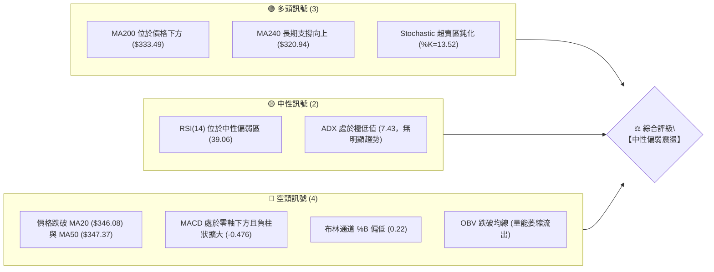
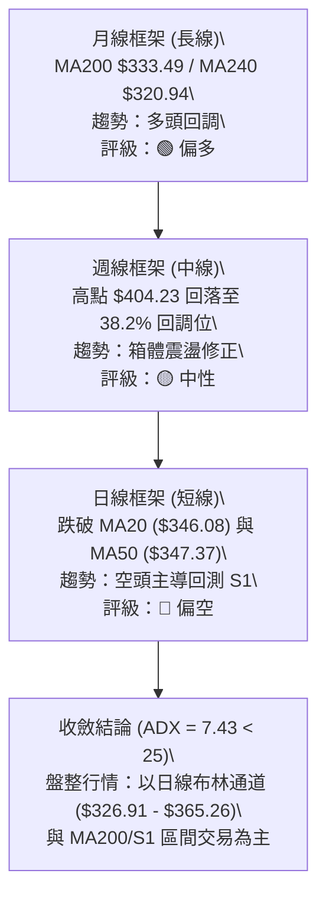
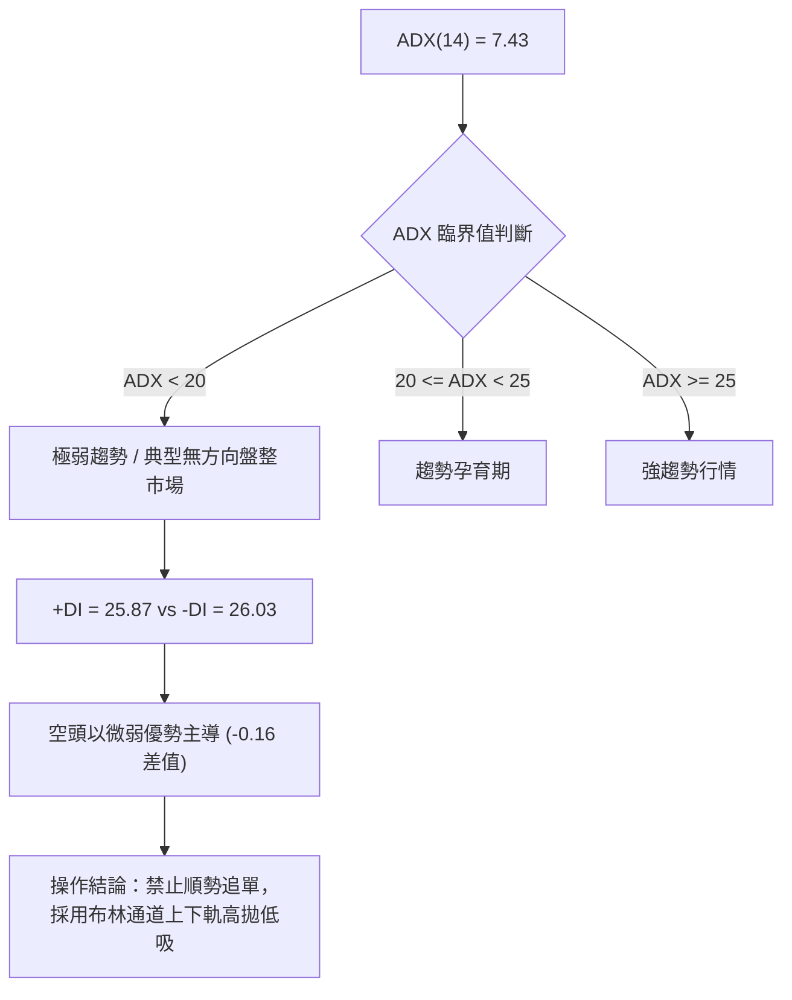
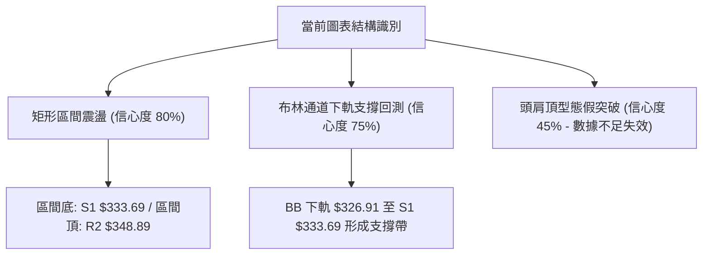
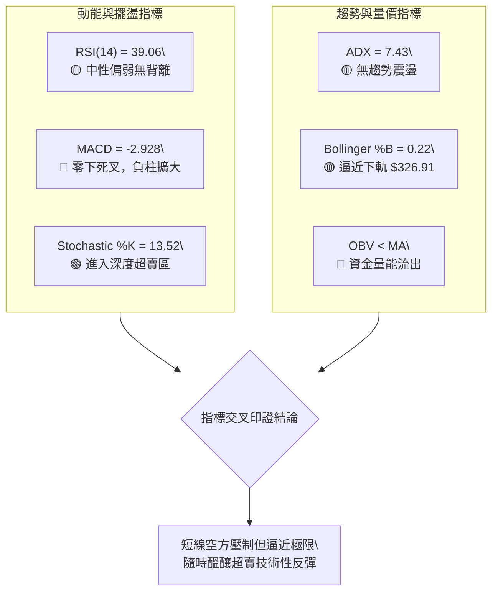
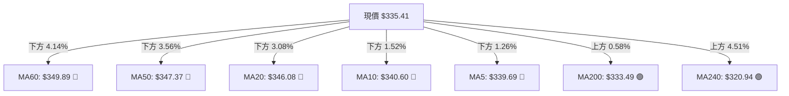
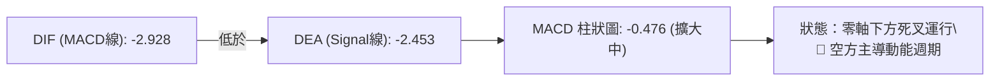
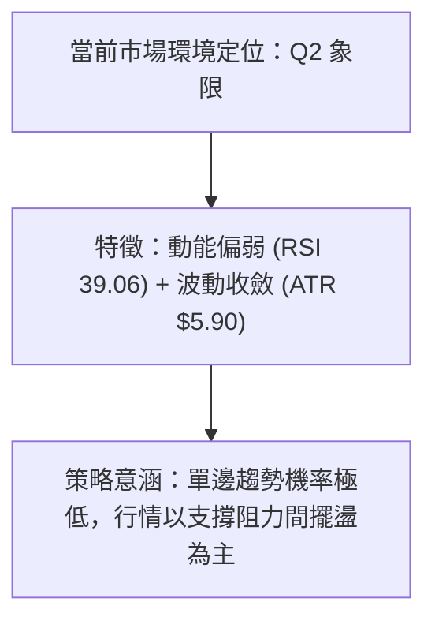
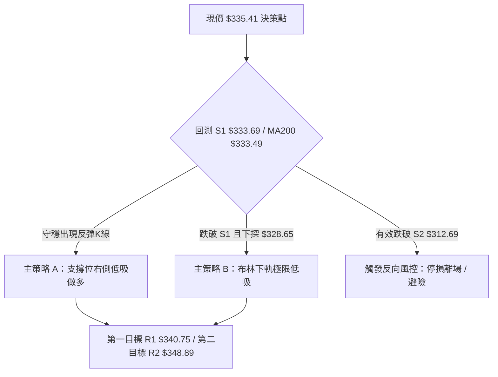
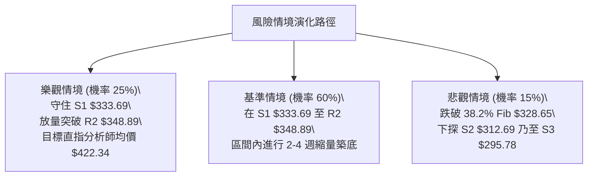

# GOOG 技術分析報告

> **報告日期**：2026-09-01 ｜ **語言**：繁體中文 ｜ **數據來源**：Yahoo Finance ｜ **當前價格**：$335.41

---

## 目錄

| 章節 | 內容 |
|------|------|
| [1. 技術面概覽](#1-技術面概覽) | 訊號儀表板、核心指標、評分卡 |
| [2. 趨勢分析](#2-趨勢分析) | 多時框趨勢、長中短期走勢 |
| [3. 圖表形態分析](#3-圖表形態分析) | 形態識別、K線組合、目標價 |
| [4. 支撐與阻力](#4-支撐與阻力) | 關鍵價位、斐波那契回調 |
| [5. 技術指標深度解讀](#5-技術指標深度解讀) | MA/RSI/MACD/布林/成交量 |
| [6. 動能與波動率](#6-動能與波動率) | 動能評估、ATR、Beta |
| [7. 多時框架總結](#7-多時框架總結) | 時框架評分矩陣 |
| [8. 交易策略建議](#8-交易策略建議) | 多空策略、風險報酬比 |
| [9. 風險提示與監控](#9-風險提示與監控) | 監控指標、風險場景 |
| [報告總結](#-報告總結) | 最終摘要與關鍵決策 |

---

## 1. 技術面概覽

### 🎯 技術訊號儀表板



### 📊 核心指標速覽表

| 指標類別 | 指標名稱 | 當前數值 | 訊號 | 解讀 |
|----------|----------|----------|------|------|
| **價格** | 當前價格 | $335.41 | 🟡 | 位於52週區間 65.2% 處，回調整理中 |
| **均線** | MA20 | $346.08 | 🔴 | 價格低於 MA20 (-3.08%)，短線承壓 |
| **均線** | MA50 | $347.37 | 🔴 | 價格低於 MA50，中期均線形成蓋頭反壓 |
| **均線** | MA200 | $333.49 | 🟢 | 價格守在 MA200 之上 (+0.58%)，長線牛熊分水嶺有效 |
| **動能** | RSI(14) | 39.06 | 🟡 | 位於 30-70 中性偏弱區間，無背離訊號 |
| **動能** | MACD | -2.928 (柱 -0.476) | 🔴 | MACD 低於訊號線 (-2.453)，空頭掌控動能 |
| **波動** | ATR(14) | $5.90 (1.76%) | 🟢 | 日內波動幅度受控，有利於設定精確止損 |

### 🏆 技術評分卡

```
╔══════════════════════════════════════════════════════════════╗
║                技術評分卡 — GOOG (2026-09-01)                 ║
╠══════════════════════════════════════════════════════════════╣
║ 趨勢強度 (ADX 7.43)    ███░░░░░░░░░░░░░░░░░  15/100 🔴 弱勢震盪 ║
║ 動能指標 (RSI/MACD)    ███████░░░░░░░░░░░░░  35/100 🔴 空方動能 ║
║ 支撐穩定度 (S1/MA200)  ██████████████░░░░░░  70/100 🟢 關鍵支撐 ║
║ 成交量配合 (OBV弱)     ████████░░░░░░░░░░░░  40/100 🟡 量能匱乏 ║
║ 形態完整度 (區間整理)  ████████████░░░░░░░░  60/100 🟡 區間下緣 ║
║ 均線排列 (混合/短空)   ████████░░░░░░░░░░░░  40/100 🔴 均線反壓 ║
╠══════════════════════════════════════════════════════════════╣
║ 綜合評分               █████████░░░░░░░░░░░  45/100 🟡 中性偏弱 ║
╚══════════════════════════════════════════════════════════════╝
```

---

## 2. 趨勢分析

### 🌐 多時框趨勢分析



### 📈 長期趨勢 — 12個月走勢圖（Unicode）

```
GOOG 月線收盤走勢圖（2025-09 至 2026-08）
價格軸 ($)
$400 ┤                                  ● $381.71 (04)
$380 ┤                                      ● $376.20 (05)
$360 ┤                                          ● $353.33 (06) ● $356.65 (07)
$340 ┤                              ● $338.09 (01)                 ● $335.41 (08)←現價
$320 ┤                  ● $319.49 (11)  ● $311.02 (02)
$300 ┤                      ● $313.39 (12)
$280 ┤              ● $281.27 (10)      ● $286.69 (03)
$260 ┤
$240 ┤      ● $243.07 (09)
     └──────┬───────┬───────┬───────┬───────┬───────┬───────┬───────┬───────┬───────┬───────┬───────
          25-09   25-10   25-11   25-12   26-01   26-02   26-03   26-04   26-05   26-06   26-07   26-08
```

#### 走勢特徵分析表格

| 階段區間 | 起始/結束價 | 累計漲跌幅 | 核心走勢特徵與結構意涵 |
|----------|------------|------------|------------------------|
| **2025-09 ~ 2025-11** | $243.07 → $319.49 | **+31.44%** 🟢 | 強勢主升浪，連續三個月實體大陽線放量拉升 |
| **2025-12 ~ 2026-03** | $313.39 → $286.69 | **-8.52%** 🔴 | 獲利了結回調，於 $286.69 獲得 61.8% 斐波那契強支撐 |
| **2026-04 ~ 2026-05** | $381.71 → $376.20 | **+31.29%** 🟢 | 突破前期高點，觸及 52 週高點 $404.23，動能見頂 |
| **2026-06 ~ 2026-08** | $353.33 → $335.41 | **-10.84%** 🔴 | 高檔量縮震盪盤跌，測試 MA200 與支撐位 S1 ($333.69) |

### 📊 中期趨勢（週線分析）

```
GOOG 週線關鍵結構分佈
$404.23 ┬────────────────────────────────────────────────────────── 52W 歷史高點 (波段頂部)
        │    ▼ 2026-05 見頂回落
$372.95 ┼────────────────────────────────────────────────────────── 強阻力 R3
$348.89 ┼────────────────────────────────────────────────────────── 阻力 R2 (MA50/MA20 反壓帶)
$340.75 ┼────────────────────────────────────────────────────────── 短線阻力 R1 (MA10 密集區)
$335.41 ┼ - - - - - - - - - - - - - - - - - - - - - - - - - - - -  當前價格 ($335.41)
$333.69 ┼────────────────────────────────────────────────────────── 關鍵支撐 S1 / MA200 ($333.49)
$312.69 ┼────────────────────────────────────────────────────────── 強支撐 S2 (前期盤整底部)
$295.78 ┴────────────────────────────────────────────────────────── 終極防線 S3
```

### ⚡ 趨勢強度評估（ADX 解讀）



| 指標 | 數值 | 狀態 | 意涵與操作指引 |
|------|------|------|----------------|
| **ADX(14)** | **7.43** | 弱趨勢/盤整 | 市場波動率大幅收窄，無持續性單邊動能，震盪行情為主 |
| **+DI** | **25.87** | 多方力道 | 買盤動能衰退，未能形成多頭進攻波段 |
| **-DI** | **26.03** | 空方力道 | 空方略高於多方，但未顯著放大，無恐慌拋盤特徵 |

---

## 3. 圖表形態分析

### 🔍 形態識別系統



#### 圖表形態信心度與目標價評估表

| 形態名稱 | 信心度 | 判斷依據（引用數據） | 完成度 | 目標價（附計算式） |
|----------|--------|----------------------|--------|--------------------|
| **箱體震盪 (Rectangle Range)** | **80%** | 價格在 S1 ($333.69) 與 R2 ($348.89) 之間形成多次回踩與受阻 | 85% | 箱體突破目標 = 頸線 $348.89 + 形態高度 ($348.89 - $333.69 = $15.20) = **$364.09** (接近 BB 上軌 $365.26) |
| **均線收斂回測 (MA Pullback)** | **75%** | 現價 $335.41 精準回測 MA200 ($333.49) 與 38.2% 斐波那契 ($328.65) | 90% | 反彈目標 = 回測確認後挑戰 R1 **$340.75**，進而上看 R2 **$348.89** |
| **雙重底結構 (Double Bottom)** | **40%** | 數據中未偵測到明確雙底結構（信心度 < 50%） | 30% | *訊號不足，僅做指標型解讀，不預設目標價* |

### 🕯️ 重要K線形態分析

| 統計週期 | 收盤價 | RSI | MACD 柱 | 週成交量 | K線結構形態特徵解讀 | 訊號 |
|----------|--------|-----|---------|----------|--------------------|------|
| **2026-07-26** | $319.09 | 26.4 | -3.620 | 122.28M | 帶長下影線之放量探底針，確認 S2 ($312.69) 上方買盤強勁 | 🟢 |
| **2026-08-02** | $356.65 | 52.4 | +0.563 | 110.47M | 大陽線長紅反包，短線動能大幅修復，收復 MA20 | 🟢 |
| **2026-08-16** | $343.54 | 59.2 | -0.378 | 72.73M | 縮量十字星，多空於 MA50 反壓處陷入僵持 | 🟡 |
| **2026-08-23** | $341.75 | 20.6 | -0.819 | 69.77M | 窄幅陰線整理，量能持續遞減，超賣初現 | 🔴 |
| **2026-09-06** | $335.41 | 39.1 | -0.476 | 22.95M | 測試 MA200 ($333.49)，成交量維持低迷，空方力道衰竭 | 🟡 |

### 📉 ASCII 走勢形態示意圖

```
GOOG 近期箱體震盪與均線回測示意圖
$350.00 ┤                  ┌───┐ (受阻於 MA50 $347.37 / R2 $348.89)
$345.00 ┤            ┌─┘   └──┐
$340.00 ┤       ┌────┘        └──┐   (跌破 MA20 $346.08)
$335.41 ┤───────┼──────────────────●─── (現價測試 S1 $333.69 / MA200 $333.49)
$330.00 ┤  ┌────┘
$325.00 ┤  │ (7/26 低點探底 $319.09)
$320.00 └──┘
        ─────────────────────────────────► 時間軸
```

### 🎯 形態目標價計算

```
形態計算公式推導：
1. 箱體震盪區間：
   - 上軌頸線 (Resistance) = R2 ($348.89)
   - 下軌支撐 (Support)    = S1 ($333.69)
   - 形態垂直高度 (Height)  = $348.89 - $333.69 = $15.20

2. 多頭向上突破理論目標價：
   - 突破目標 T_Bull = R2 ($348.89) + Height ($15.20) = $364.09

3. 空頭跌破下軌理論目標價：
   - 跌破目標 T_Bear = S1 ($333.69) - Height ($15.20) = $318.49 (緊鄰 2026-07-26 低點 $319.09 與 S2 $312.69)
```

---

## 4. 支撐與阻力

### 🗺️ 關鍵價位分布圖（Unicode）

```
GOOG 價位結構分布圖
════════════════════════════════════════════════════════════════
$404.23 ║████████████████████████████████████████║ 52W 歷史最高點 (0.0% Fib)
$372.95 ║████████████████████████████            ║ 強阻力 R3
$357.53 ║▓▓▓▓▓▓▓▓▓▓▓▓▓▓▓▓▓▓▓▓                    ║ 23.6% 斐波那契回調位
$348.89 ║████████████████████                    ║ 阻力 R2 (MA50 $347.37 密集區)
$340.75 ║████████████                            ║ 關鍵阻力 R1 (MA10 $340.60)
$335.41 ╠════════════════════════════════════════╣ ◄ 現價 ($335.41)
$333.69 ║████████████████████                    ║ 近期支撐 S1 (MA200 $333.49 重合)
$328.65 ║▓▓▓▓▓▓▓▓▓▓▓▓▓▓▓▓▓▓▓▓                    ║ 38.2% 斐波那契回調位 (BB下軌 $326.91)
$312.69 ║████████████████████████████            ║ 強支撐 S2 (波段前低聚類)
$305.30 ║▓▓▓▓▓▓▓▓▓▓▓▓▓▓▓▓                        ║ 50.0% 斐波那契回調位
$295.78 ║████████████████████████████████        ║ 終極防線 S3 (月線強支撐)
════════════════════════════════════════════════════════════════
```

### 🚧 阻力位分析表

| 阻力級別 | 精確價位 | 形成原因（波段高點/均線聚類） | 突破難度 | 技術重要性 |
|----------|----------|------------------------------|----------|------------|
| **R1** | **$340.75** | 近一年波段高點聚類、MA5 ($339.69) 與 MA10 ($340.60) 反壓 | 🟡 中等 | 短線多空轉折點，突破即確認短底形成 |
| **R2** | **$348.89** | 波段次高點、MA20 ($346.08) 與 MA50 ($347.37) 重合壓制區 | 🔴 較高 | 中期箱體上軌，突破將引發技術性買盤追價 |
| **R3** | **$372.95** | 2026年5月起跌點密集套牢區、接近 52 週高點前置阻力 | 🔴 極高 | 波段牛熊防線，需百萬級巨量配合方可穿透 |

### 🛡️ 支撐位分析表

| 支撐級別 | 精確價位 | 形成原因（波段低點/均線聚類） | 守住機率 | 技術重要性 |
|----------|----------|------------------------------|----------|------------|
| **S1** | **$333.69** | 近一年波段低點聚類、MA200 ($333.49) 年線生命線支撐 | 🟢 75% | 長線多頭防守核心，不容有效跌破 |
| **S2** | **$312.69** | 2026-07-26 回調低點 ($319.09) 下方緩衝區、MA240 ($320.94) | 🟢 85% | 中期結構性低點，具備強力價值投資買盤 |
| **S3** | **$295.78** | 2026-03 啟動點波段低點聚類、接近 50% 斐波那契位 | 🟢 95% | 終極趨勢保護位，跌破宣告長線多頭反轉 |

### 📐 斐波那契回調位分析

依據 52 週波動區間（高點 **$404.23** → 低點 **$206.37**，波幅 **$197.86**）計算：

```
斐波那契黃金分割位階梯：
0.0%  (52W High)  : $404.23
23.6% 回調位       : $357.53
38.2% 回調位       : $328.65  ◄─────┐
當前價格 ($335.41) 落在此區間 ──────┴── 現價處於 23.6% ($357.53) 與 38.2% ($328.65) 之間
50.0% 回調位       : $305.30
61.8% 回調位       : $281.95
78.6% 回調位       : $248.71
100.0% (52W Low)  : $206.37
```

**解讀**：現價 $335.41 緊貼 38.2% 回調位 ($328.65) 與 S1 ($333.69)。在強勢多頭回調架構中，38.2% 回調位屬於「健康良性回檔」的最關鍵分水嶺，若能在此處獲利盤沉澱完成，後續將具備重新挑戰 23.6% ($357.53) 的動能結構。

---

## 5. 技術指標深度解讀

### 🎛️ 指標訊號總覽



### 📈 移動平均線排列分析



| 均線名稱 | 數值 | 價差與幅度 | 排列方向與技術涵義 |
|----------|------|------------|--------------------|
| **MA5** | $339.69 | -$4.28 (-1.26%) | 🔻 短期下行，壓制短線反彈空間 |
| **MA10** | $340.60 | -$5.19 (-1.52%) | 🔻 下行斜率未緩，形成第一道阻力 (與 R1 $340.75 重合) |
| **MA20** | $346.08 | -$10.67 (-3.08%) | 🔻 月線下彎，布林中軌所在，中期強阻力 |
| **MA50** | $347.37 | -$11.96 (-3.44%) | 🔻 季線反壓，中期空頭防守點 |
| **MA200** | $333.49 | +$1.92 (+0.58%) | 🔺 年線向上，提供長期實質多頭買盤支撐 |
| **MA240** | $320.94 | +$14.47 (+4.51%) | 🔺 穩健上揚，牛市基石防線 |

### 📉 RSI(14) 分析

```
RSI(14) 當前數值: 39.06
超賣 (0-30)        中性區間 (30-70)                 超買 (70-100)
├───────────────┼───────────────────────────────┼───────────────┤
0               30             ▲                70             100
                               │
                          RSI = 39.06
進度條：████████░░░░░░░░░░░░░░░░░░░░  39.06%
```

- **背離判斷**：檢視 2026-07-26 低點 $319.09 (RSI=26.4) 與當前 $335.41 (RSI=39.1)，價格形成更高低點 (Higher Low)，RSI 同步抬升，**無頂背離亦無底背離**，屬標準指標跟隨價格狀態。
- **結論**：未達 30 以下極度超賣，但已處弱勢修正低位，拋壓正在減弱。

### 📊 MACD(12/26/9) 訊號解讀



- **動能分析**：MACD 快慢線均在零軸下方運行，柱狀圖為 -0.476，顯示中期動能仍處於空頭回調格局中，尚未出現金叉翻揚跡象。操作上不可盲目追多，須等待負柱狀縮短。

### 📦 布林通道分析

```
GOOG 日線布林通道結構 (20, 2)
$365.26 ┬────────────────────────────────────────────────────────── BB 上軌
        │
$346.08 ┼────────────────────────────────────────────────────────── BB 中軌 (MA20)
        │
$335.41 ┼ - - - - - - - - - - - - - - - - - - - - - - - - - - - -  當前價格 (%B = 0.22)
        │
$326.91 ┴────────────────────────────────────────────────────────── BB 下軌
```

- **通道寬度**：上軌 $365.26 至下軌 $326.91 寬度為 $38.35 (通道寬度比約 11.4%)。
- **%B 指標**：當前 **%B = 0.22**，價格位於通道下四分之一區域，逼近下軌 $326.91。下軌與 S1 ($333.69) / 38.2% Fib ($328.65) 構成強大支撐防護網。

### 💹 成交量分析（量價配合度）

- **量能數據**：最新日成交量 **22,947,325** 股，高於 20 日均量 (16,416,296 股，量比 1.40x)，但與 50 日均量 (20,572,706 股) 基本持平。
- **OBV 趨勢**：`OBV < MA`，能量潮指標低於其移動平均線，顯示近幾週回調過程中資金呈現淨流出。
- **量價背離檢視**：在週線級別，8月下半月成交量萎縮至 69M-72M 區間（遠低於5-6月起跌時的 150M-180M 拋壓量），呈現「**下跌量縮**」特徵，表明機構拋壓已大幅減輕，非恐慌性崩盤。

---

## 6. 動能與波動率

### ⚡ 動能評估四象限

| 象限區間 | 動能特徵 | 波動率特徵 | GOOG 當前狀態 | 操作策略定位 |
|----------|----------|------------|---------------|--------------|
| **第一象限 (Q1)** | 動能強 (RSI>60) | 波動率低 (ATR<1.5%) | — | 強勢主升，順勢加碼 |
| **第二象限 (Q2)** | **動能弱 (RSI<40)** | **波動率低 (ATR 1.76%)** | **✓ (當前定位)** | **低位震盪，區間低吸高拋** |
| **第三象限 (Q3)** | 動能強 (突破行情) | 波動率高 (ATR>3.0%) | — | 趨勢爆發，突破追單 |
| **第四象限 (Q4)** | 動能弱 (破位崩跌) | 波動率高 (ATR>3.0%) | — | 恐慌主跌，嚴禁接刀 |



### 📊 ATR 波動率分析

- **ATR(14) 數值**：**$5.90**（佔股價比例僅 **1.76%**），屬於典型低波動整理區間。
- **風控參數設定建議**：
  - **日內安全緩衝空間**：$5.90 × 1.0 = $5.90
  - **波段標準止損距離 (1.5 ATR)**：$5.90 × 1.5 = **$8.85**
  - **寬鬆趨勢防守距離 (2.0 ATR)**：$5.90 × 2.0 = **$11.80**

### 📐 Beta 與市場相關性

- **Beta 係數**：**1.237**
- **市場特徵解讀**：GOOG 波動幅度略高於標普 500 指數約 23.7%。當美股大盤反彈時，GOOG 具備超越大盤的彈性；但在整體科技股承壓時，亦會承受放大回調壓力。

---

## 7. 多時框架總結

### 📋 時框架評分表

| 時框架 | 趨勢方向 | 動能狀態 | 均線排列 | 圖表形態 | 綜合評分 | 建議方向 |
|--------|----------|----------|----------|----------|----------|----------|
| **月線 (長期)** | 🟢 多頭回調 | 🟡 中性回落 | 🟢 位於 MA200/240 上方 | 長期上升通道回測 | **75/100** | 逢低分批建倉 |
| **週線 (中期)** | 🟡 寬幅箱體 | 🔴 MACD 負值 | 🟡 跌破短期均線 | 高檔回檔測試 38.2% | **50/100** | 區間震盪操作 |
| **日線 (短期)** | 🔴 弱勢震盪 | 🔴 均線蓋頭 | 🔴 均線空頭排列 | 回測 S1 支撐帶 | **35/100** | 觀望或逢高減碼 |

### 🔲 綜合訊號矩陣

| 維度 | 短期 (日線) | 中期 (週線) | 長期 (月線) | 衝突收斂解析 |
|------|-------------|-------------|-------------|--------------|
| **趨勢** | 🔴 偏空 (-3.08% vs MA20) | 🟡 震盪 ($312 - $372) | 🟢 偏多 (+4.51% vs MA240) | 短線回調正在測試長線支撐 |
| **動能** | 🔴 MACD Hist -0.476 | 🔴 MACD 下行 | 🟢 52W 區間 65.2% | 動能尚未反轉，需時間以盤代跌 |
| **支撐** | 🟢 S1 $333.69 守穩 | 🟢 38.2% Fib $328.65 | 🟢 MA200 $333.49 | 三重多時框支撐在 $328-$333 產生共振 |

### ⚖️ 多時框收斂結論

> **唯一收斂方向結論**：**【中性觀望，區間低吸偏多】（綜合評分 45/100）**
> 
> **收斂邏輯依據**：
> 1. 當前 **ADX(14) = 7.43 (< 25)**，明確定義當前市場為**典型盤整行情**而非單邊趨勢行情。
> 2. 依多時框收斂規則，盤整行情中應以日線布林通道上下軌 ($326.91 - $365.26) 及關鍵水平支撐阻力為交易界限。
> 3. 日線短期均線雖呈空頭排列，但價格已極度逼近長線多頭防線 **MA200 ($333.49)**、支撐位 **S1 ($333.69)** 與斐波那契 38.2% (**$328.65**)。在此狹窄空間下盲目殺跌風險極高，策略應收斂為「**依託 S1 關鍵支撐進行低風險區間反彈操作**」。

---

## 8. 交易策略建議

### 🗺️ 策略決策流程圖



### 🧭 策略路由

**當前主策略方向 = 【中性區間低吸策略】（依評分 45/100，40–60 區間操作模型）**

### 🎯 價格情境階梯（Price Scenarios）

| 觸發條件 | 第一目標 | 後續延伸目標 | 技術情境含義與操作指引 |
|----------|----------|--------------|------------------------|
| **強勢突破 R1 ($340.75)** | **R2 ($348.89)** | **R3 ($372.95)** | 短線空翻多，站上 MA20，展開波段反彈 |
| **守住 S1 ($333.69) 震盪** | **R1 ($340.75)** | **BB 中軌 ($346.08)** | 區間築底整理，維持高拋低吸節奏 |
| **跌破 S1 ($333.69)** | **S2 ($312.69)** | **S3 ($295.78)** | 回調幅度擴大，考驗 MA240 與中期箱體底 |

### 📊 情境機率分佈

| 情境劇本 | 預估機率 | 主要技術指標支撐依據 |
|----------|----------|----------------------|
| **情境一：S1 獲支撐展開區間反彈** | **55%** 🟢 | MA200 ($333.49) 長期均線買盤支撐；Stochastic (%K 13.52) 深度超賣鈍化隨時修復；週線成交量顯著萎縮呈現惜售 |
| **情境二：在 S1 與 R1 狹幅橫盤震盪** | **30%** 🟡 | ADX = 7.43 處於極低水平，多空動能均不足以推動單邊趨勢；MACD 負柱狀收斂緩慢 |
| **情境三：跌破 S1 深度探底 S2** | **15%** 🔴 | OBV 量能持續疲弱；日線均線群 (MA5/10/20/50) 形成向下反壓，若大盤重挫可能引發停損賣壓 |

### 🟢 主策略詳情

| 策略要素 | 策略 A（保守型：S1 支撐低吸） | 策略 B（進取型：突破 R1 右側追進） |
|----------|-------------------------------|-----------------------------------|
| **進場條件** | 價格回踩 S1 不破並出現 15分/日K 反轉陽線 | 日K收盤價實體突破 R1 並伴隨成交量放大 |
| **進場價格** | **$333.80** (貼近 S1 $333.69) | **$341.00** (確認站上 R1 $340.75) |
| **目標價 T1** | **$340.75** (阻力位 R1，獲利 +2.08%) | **$348.89** (阻力位 R2，獲利 +2.31%) |
| **目標價 T2** | **$348.89** (阻力位 R2，獲利 +4.52%) | **$372.95** (阻力位 R3，獲利 +9.37%) |
| **止損價格** | **$328.00** (跌破 38.2% Fib $328.65) | **$333.50** (跌破 MA200 $333.49) |
| **止損距離** | $5.80 (約 0.98 ATR) | $7.50 (約 1.27 ATR) |
| **風險報酬比** | **1 : 2.60** (以 T2 計算) | **1 : 4.26** (以 T2 計算) |
| **預估勝率** | **65%** | **55%** |
| **建議倉位** | **15% - 20%** | **10% - 15%** |

### 🔴 反向風險觸發點（對沖提示）

- **全面停損警戒線**：若日K線收盤價跌破 **S1 ($333.69)** 且連續 2 日無法收復，多頭部位應減半；若進一步跌破 **38.2% 斐波那契位 ($328.65)**，主策略全面失效，多單全數出場觀望。
- **空頭對沖觸發點**：若價格反彈至 **R2 ($348.89)** 出現長上影線且 MACD 無法金叉，可建立 5% 衍生品反向空頭對沖現貨風險。

### ⭐ 整體訊號強度評星

```
╔══════════════════════════════════════════════════════════════╗
║ 做多訊號強度：  ★★★☆☆  (3.0/5星 — 依托長線均線支撐搏反彈)     ║
║ 做空訊號強度：  ★★☆☆☆  (2.0/5星 — 空間受限於 MA200，盈虧比差)  ║
║ 整體可信度：    ★★★★☆  (4.0/5星 — 支撐阻力結構極為明確)       ║
╚══════════════════════════════════════════════════════════════╝
```

---

## 9. 風險提示與監控

### ✅ 關鍵監控指標 Checklist

```
╔══════════════════════════════════════════════════════════════╗
║                     每日盤後風控監控清單                      ║
╠══════════════════════════════════════════════════════════════╣
║ [ ] 價格是否跌破年線 MA200 ($333.49) 或支撐 S1 ($333.69)      ║
║ [ ] RSI(14) 是否跌破 30 進入極度超賣，或突破 50 中軸轉強       ║
║ [ ] MACD 柱狀圖是否由負轉正 (由 -0.476 向上收斂翻紅)          ║
║ [ ] 日成交量是否放大至 20日均量 (16.41M) 的 1.5 倍以上        ║
║ [ ] ADX(14) 是否自 7.43 抬升並突破 20 (預示單邊趨勢啟動)      ║
║ [ ] 華爾街 15 位分析師目標均價 $422.34 基本面溢價是否依然穩固  ║
╚══════════════════════════════════════════════════════════════╝
```

### ⚠️ 風險場景分析



### 🛡️ 風險管理重要提醒

1. **嚴守止損紀律**：目前股價處於均線糾結與多空敏感地帶，絕對不可在跌破 $328.65 後進行無計劃的逢低加死碼。
2. **波動率控制**：當前 ATR 僅 $5.90，代表變盤在即。一旦 ADX 向上突破 25，需立即順應突破方向調整部位。
3. **部位規模控管**：在無明確單邊趨勢前（ADX < 25），整體技術交易部位不宜超過總資金的 30%。

---

## 📋 報告總結

```
╔══════════════════════════════════════════════════════════════╗
║                 GOOG 技術分析報告總結 (2026-09-01)            ║
╠══════════════════════════════════════════════════════════════╣
║ 當前價格：$335.41          52週區間：$206.37 - $404.23 (65.2%) ║
║ 分析評級：⚖️【中性偏弱震盪 — 支撐位低吸】 (評分: 45/100)       ║
╠══════════════════════════════════════════════════════════════╣
║ 關鍵結論：                                                    ║
║ ├─ 長期趨勢：🟢 偏多 (MA200 $333.49 與 MA240 $320.94 向上運行) ║
║ ├─ 中期趨勢：🟡 震盪 (自高點回調至 38.2% 斐波那契 $328.65 區域) ║
║ ├─ 短期趨勢：🔴 偏空 (MA20 $346.08 與 MA50 $347.37 蓋頭反壓)   ║
║ ├─ 關鍵支撐：S1 $333.69 / S2 $312.69 / S3 $295.78            ║
║ ├─ 關鍵阻力：R1 $340.75 / R2 $348.89 / R3 $372.95            ║
║ └─ 分析師目標：均價 $422.34 (15 位分析師強烈買入推薦)         ║
╠══════════════════════════════════════════════════════════════╣
║ 最優策略組合：                                                ║
║ 1. 🥇 最佳機會：策略 A (S1 $333.80 低吸，目標 $348.89，風報比 1:2.60) ║
║ 2. 🥈 次選機會：策略 B (突破 R1 $341.00 追進，目標 $372.95)   ║
║ 3. 🥉 保守選擇：空倉觀望，等待日線 MACD 負柱狀翻紅與 ADX 轉強 ║
╚══════════════════════════════════════════════════════════════╝
```

---

> ⚠️ **免責聲明**：本報告為 AI 自動生成之技術分析，所有數據及估算均基於提供的歷史價格資訊。本報告**僅供研究與學術參考**，**不構成任何投資建議**。投資有風險，入市需謹慎。

---

*報告生成時間：2026-09-01 ｜ 數據來源：Yahoo Finance ｜ 分析框架：多時框技術分析*