# GOOG 技術分析報告

> **報告日期**：2026-09-02 ｜ **語言**：繁體中文 ｜ **數據來源**：Yahoo Finance ｜ **當前價格**：$332.03

---

## 目錄

| 章節 | 內容 |
|------|------|
| [1. 技術面概覽](#1-技術面概覽) | 訊號儀表板、核心指標、評分卡 |
| [2. 趨勢分析](#2-趨勢分析) | 多時框趨勢、長中短期走勢、ADX解讀 |
| [3. 圖表形態分析](#3-圖表形態分析) | 形態識別、K線組合、目標價推算 |
| [4. 支撐與阻力](#4-支撐與阻力) | 關鍵價位、斐波那契回調結構 |
| [5. 技術指標深度解讀](#5-技術指標深度解讀) | 均線系統、RSI、MACD、布林通道、成交量 |
| [6. 動能與波動率](#6-動能與波動率) | 動能四象限、ATR波動度、Beta分析 |
| [7. 多時框架總結](#7-多時框架總結) | 時框架評分矩陣、多時框收斂 |
| [8. 交易策略建議](#8-交易策略建議) | 策略路由、情境階梯、主交易策略 |
| [9. 風險提示與監控](#9-風險提示與監控) | 關鍵監控清單、情境推演、風控指引 |
| [10. 報告總結](#10-報告總結) | 核心總結儀表板 |

---

## 1. 技術面概覽

### 🎯 技術訊號儀表板

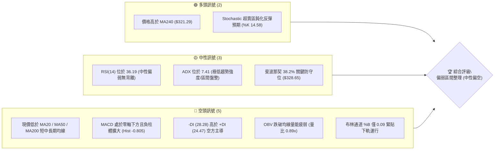

---

### 📊 核心指標速覽表

| 指標類別 | 指標名稱 | 當前數值 | 訊號 | 專業解讀 |
|:---|:---|:---|:---:|:---|
| **價格** | 當前收盤價 | $332.03 | 🟡 | 位於52週區間 63.5%，高點回落後於 $330 附近尋求支撐 |
| **均線系統** | MA20 | $343.92 | 🔴 | 現價在 MA20 下方 -3.46%，短線下行斜率維持 |
| **均線系統** | MA50 | $347.03 | 🔴 | 現價在 MA50 下方 -4.32%，中期反彈阻力沉重 |
| **均線系統** | MA200 | $333.71 | 🔴 | 現價剛跌破 MA200 生命線（-0.50%），多空分水嶺面臨考驗 |
| **動能指標** | RSI(14) | 36.19 | 🟡 | 處於弱勢中性區間，未觸及 30 極端超賣，無背離跡象 |
| **動能指標** | MACD (12,26,9) | -3.458 / -2.654 | 🔴 | 負值區雙線下行，Hist 為 -0.805，動能仍受空方控制 |
| **震盪指標** | Stoch %K / %D | 14.58 / 22.09 | 🟢 | 進入 <20 嚴重超賣區，短線隨時具備技術性抽頭動能 |
| **趨勢強度** | ADX(14) / DMI | 7.41 (-DI: 28.28) | 🟡 | ADX < 25 處於典型弱趨勢/低波動盤整，-DI 佔據微幅優勢 |
| **通道指標** | Bollinger Bands | 上 $358.38 / 下 $329.45 | 🟡 | %B 為 0.09，極度逼近下軌，下軌具備短線價格彈性支撐 |
| **量能指標** | OBV / 日成交量 | 14,313,571 (0.89x) | 🔴 | OBV < MA 且成交量低於 20 日均量，市場買盤承接力道清淡 |
| **波動指標** | ATR(14) | $5.93 (1.79%) | 🟢 | 每日波動幅度收斂，屬於低波動壓縮階段 |

---

### 🏆 技術評分卡

```
╔══════════════════════════════════════════════════════════════════╗
║              技術評分卡 — GOOG (2026-09-02)                     ║
╠══════════════════════════════════════════════════════════════════╣
║ 趨勢強度 (Trend)      ████░░░░░░░░░░░░░░░░  20/100  🔴 空頭排列  ║
║ 動能指標 (Momentum)   ████████░░░░░░░░░░░░  40/100  🟡 弱勢盤整  ║
║ 支撐穩定度 (Support)  ████████████░░░░░░░░  60/100  🟡 Fib 38.2% ║
║ 成交量配合 (Volume)   ██████░░░░░░░░░░░░░░  30/100  🔴 量能萎縮  ║
║ 形態完整度 (Pattern)  ██████████░░░░░░░░░░  50/100  🟡 區間箱體  ║
║ 均線排列 (MA System)  ██████░░░░░░░░░░░░░░  30/100  🔴 跌破MA200 ║
╠══════════════════════════════════════════════════════════════════╣
║ 綜合評分              ████████░░░░░░░░░░░░  38/100  🔴 弱勢偏空  ║
║ 核心評級              【偏空觀望 / 區間下緣博弈反彈】            ║
╚══════════════════════════════════════════════════════════════════╝
```

---

## 2. 趨勢分析

### 🌐 多時框趨勢分析

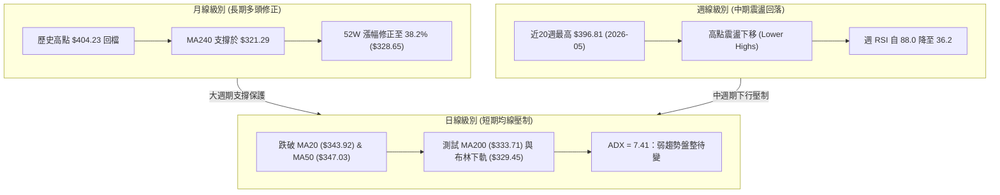

---

### 📈 長期趨勢 — 12個月走勢圖（過去12個月月線收盤）

```
GOOG 月線收盤走勢圖（2025-09 至 2026-09）
價格軸 ($)
$400 ┤                                      
$380 ┤                                  ● $381.71 (2026-04 高點)
$360 ┤                                      ●      ●
$340 ┤                          ●            ●      ● 
$320 ┤                  ●   ●       ●                  ●←現價 $332.03
$300 ┤              ●                   ●
$280 ┤          ●
$260 ┤      
$240 ┤  ● $243.07
     └────────────────────────────────────────────────────────
       09  10  11  12  01  02  03  04  05  06  07  08  09 (月份)
      (2025)                      (2026)
```

#### 走勢特徵分析表格

| 階段區間 | 時間跨度 | 起訖收盤價 | 漲跌幅 | 走勢特徵與量價解讀 |
|:---|:---|:---|:---:|:---|
| **第一階段：主升浪加速** | 2025-09 ~ 2026-01 | $243.07 → $338.09 | +39.09% | 趨勢強勁推升，均線多頭發散，市場預期極度樂觀 |
| **第二階段：快速獲利回吐** | 2026-01 ~ 2026-03 | $338.09 → $286.69 | -15.20% | 出現急跌回測，隨後在 2026-03 落底於 $286.69 |
| **第三階段：二次衝頂創高** | 2026-03 ~ 2026-04 | $286.69 → $381.71 | +33.14% | 單月暴力反彈突破，盤中創下 52 週最高價 $404.23 |
| **第四階段：高檔震盪回落** | 2026-05 ~ 2026-09 | $376.20 → $332.03 | -11.74% | 高點逐步壓低，月線連續陰線調整，回踩長期均線 |

---

### 📊 中期趨勢（週線分析）

中期走勢自 2026 年 5 月初創下 52 週高點 $404.23（週收盤最高 $396.81）後展開結構性回檔。近期 20 週收盤走勢呈現明確的「波動收斂與重心下移」特徵：
1. **反彈高點降低**：2026-05-10 ($396.81) → 2026-07-05 ($356.18) → 2026-08-02 ($356.65)。
2. **回測支撐平台**：2026-07-26 週收盤一度探至 $319.09，隨後快速拉回 $350 區間，形成下檔買盤緩衝區。
3. **動能收斂**：週 RSI 從超買極值 88.0 急劇冷卻至當前的 36.2，週 MACD 柱體亦由最高 +4.807 萎縮並轉為負值區間 (-0.805)。

```
近期週線壓力與支撐階梯示意圖
$404.23 ─── [52W 歷史極值阻力]
   │
$372.95 ─── [波段密集阻力 R3] ══════════════════════════
   │
$348.89 ─── [波段高點阻力 R2 / MA50: $347.03]
   │
$340.75 ─── [近端頸線阻力 R1 / MA20: $343.92]
   │
$332.03 ─── ★ 現價 (正在考驗 MA200: $333.71)
   │
$328.65 ─── [Fib 38.2% 黃金分割關鍵支撐]
   │
$312.69 ─── [波段低點關鍵支撐 S1] ═══════════════════════
```

---

### ⚡ 趨勢強度評估（ADX 解讀）

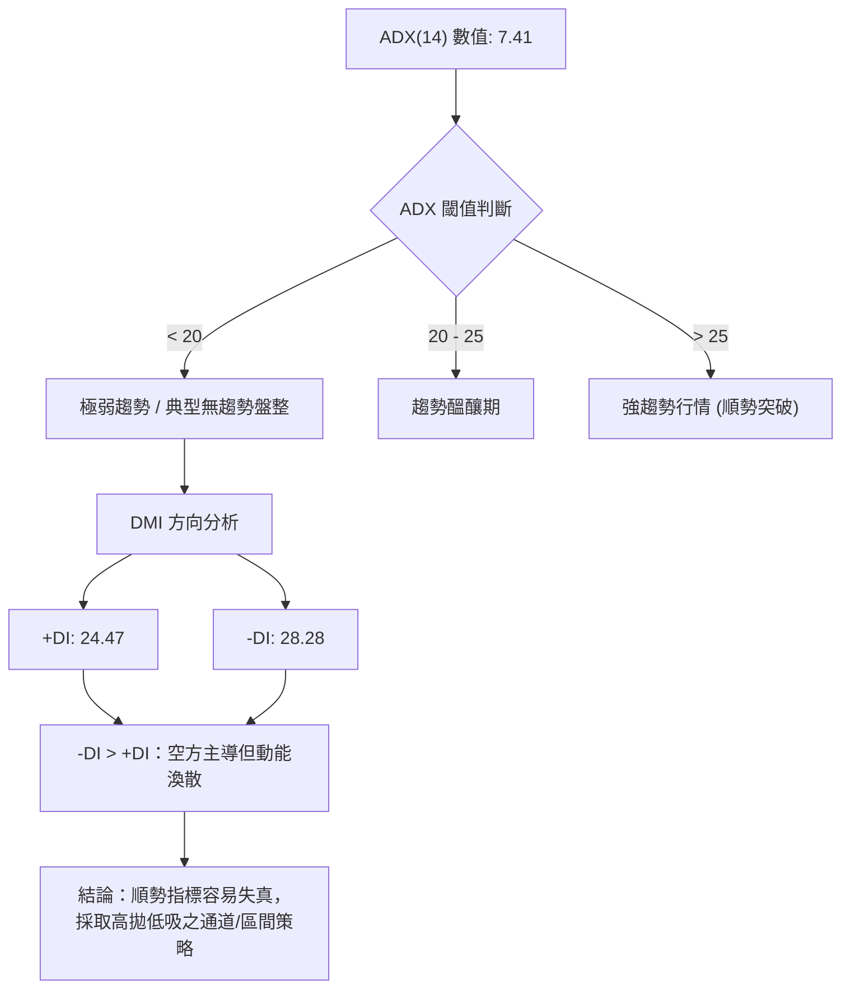

#### ADX 趨勢強度對照表

| 指標變數 | 數值 | 狀態評估 | 操作指引意義 |
|:---|:---:|:---:|:---|
| **ADX (14)** | **7.41** | 極弱趨勢 (無方向性) | 市場處於無序波動與縮量盤整期，避免追漲殺跌，趨勢跟隨系統需暫停 |
| **+DI (14)** | **24.47** | 多方買力中性偏弱 | 多頭上攻能量不足以形成持續性單邊行情 |
| **-DI (14)** | **28.28** | 空方賣力微幅領先 | 空方雖然略佔優勢，但因 ADX 極低，缺乏單邊暴跌的動能擴散條件 |

---

## 3. 圖表形態分析

### 🔍 形態識別系統

依據嚴格數據紀律與幾何特徵，GOOG 在日線至週線層級目前處於「高檔下降收斂通道」與「區間箱體整理」的交織型態。


#### 形態識別與信心度評估表

| 識別形態 | 信心度 | 判斷依據（嚴格引用數據） | 完成度 | 目標價（附嚴格計算式） |
|:---|:---:|:---|:---:|:---|
| **區間下降箱體** | **75%** | 上軌受壓於 R1 ($340.75) 與 R2 ($348.89)；下軌由 Fib 38.2% ($328.65) 與 S1 ($312.69) 支撐 | 85% | 向上突破：頸線 $348.89 + 高度 ($348.89 - $312.69 = $36.20) = **$385.09**；跌破下軌測 S2 **$295.78** |
| **雙重底雛形 (潛在)** | **45%** | 2026-07-26 低點 $319.09 與近期回測，需視 S1 ($312.69) 防守是否成功 | 40% | 尚未成型（信心度 < 50%），依規則僅作指標型解讀，不預先設定目標價 |
| **布林下軌超賣反彈** | **70%** | %B = 0.09 觸及下軌 $329.45，Stoch %K (14.58) 進入極限超賣 | 90% | 回歸中軌 MA20 計算目標 = **$343.92** |

---

### 🕯️ 重要K線與月線結構分析

| 月份 | 收盤價 | K線特徵形態 | 技術解讀 | 多空訊號 |
|:---|:---:|:---|:---|:---:|
| **2026-04** | $381.71 | 長紅突破帶長上影線 | 觸及 52W 高點 $404.23 後遭遇獲利了結賣壓 | 🟢 多頭竭盡 |
| **2026-05** | $376.20 | 高檔十字小陰線 | 多空拉鋸，均線乖離過大開始修正 | 🟡 滯漲轉折 |
| **2026-06** | $353.33 | 中實體陰線貫穿 | 跌破 5 日、10 日短期均線，空方接管節奏 | 🔴 空方確立 |
| **2026-07** | $356.65 | 帶長下影線之槌子線 | 回測 $319 支撐後快速收復，顯示中長線買盤承接 | 🟢 支撐確認 |
| **2026-08** | $335.41 | 下跌回落中陰線 | 再次測試區間下緣，量能萎縮 | 🔴 弱勢整理 |
| **2026-09** | $332.03 | 窄幅整理小實體 (進行中) | 均線糾結處弱勢盤整，等待量能突破方向 | 🟡 方向未明 |

---

### 📉 ASCII 走勢形態示意圖

```
GOOG 價格箱體與通道形態結構
$360.00 ┤              上軌阻力區間 (R2: $348.89 / 布林上軌: $358.38)
        │              ┌──────────────────────────────────────┐
$350.00 ┤      ▲       │                                      │
        │     ╱ ╲      │  MA50: $347.03 ───────────────────── │
$340.00 ┤    ╱   ╲   ┌─┴─ MA20: $343.92 ────────────────────  │
        │   ╱     ╲ ╱    R1: $340.75                          │
$330.00 ┤  ╱       ★ 現價: $332.03 (MA200: $333.71)           │
        │ ╱        │     Fib 38.2%: $328.65 / 布林下軌: $329.45│
$320.00 ┤          │   └──────────────────────────────────────┘
        │          ▼   波段低點支撐 (S1: $312.69)
$310.00 ┴─────────────────────────────────────────────────────
```

---

## 4. 支撐與阻力

### 🗺️ 關鍵價位分布圖（Unicode）

```
GOOG 價位結構分布圖（嚴格依據 OHLCV 與 Fib 計算）
══════════════════════════════════════════════════════════════════
$404.23 ║████████████████████████████████║ 52週歷史高點 (0.0% Fib)
$372.95 ║████████████████████████        ║ 波段強阻力 R3
$357.53 ║████████████████                ║ Fib 23.6% 回調位
$348.89 ║████████████████████            ║ 波段高點阻力 R2 (共振 MA50: $347.03)
$340.75 ║████████████                    ║ 關鍵短阻力 R1 (共振 MA20: $343.92)
════════╠════════════════════════════════╣ ◄ 當前價格: $332.03 (MA200: $333.71)
$328.65 ║▓▓▓▓▓▓▓▓▓▓▓▓                    ║ Fib 38.2% 關鍵防守 (共振 BB下軌: $329.45)
$312.69 ║████████████████                ║ 近一年強支撐 S1 (近期波段底聚類)
$305.30 ║████████████                    ║ Fib 50.0% 多空中軸
$295.78 ║████████████████████            ║ 強支撐 S2 (箱體下邊界)
$281.95 ║████████████████                ║ Fib 61.8% 黃金分割強防線
$271.13 ║████████████████████████        ║ 極限支撐 S3 (波段深層低點聚類)
══════════════════════════════════════════════════════════════════
```

---

### 🚧 阻力位分析表

| 阻力級別 | 精確價位 | 距現價幅寬 | 形成原因與共振要素 | 突破難度 | 重要性 |
|:---|:---:|:---:|:---|:---:|:---:|
| **阻力 R1** | **$340.75** | +2.63% | 近一年波段密集高點聚類，與 MA20 ($343.92) 重疊壓制 | 🟡 中等 | ★★★☆☆ |
| **阻力 R2** | **$348.89** | +5.08% | 近期反彈頂部高點聚類，共振 MA50 ($347.03) 及 MA60 ($349.33) | 🔴 較高 | ★★★★☆ |
| **阻力 R3** | **$372.95** | +12.32% | 2026-05 至 06 月反彈成交密集套牢區，屬中期空重度反壓區 | 🔴 極高 | ★★★★★ |

---

### 🛡️ 支撐位分析表

| 支撐級別 | 精確價位 | 距現價幅寬 | 形成原因與共振要素 | 守住機率 | 重要性 |
|:---|:---:|:---:|:---|:---:|:---:|
| **支撐 S1** | **$312.69** | -5.82% | 近一年波段低點聚類，接近 2026-07-26 週低點 ($319.09) 下緣防線 | 🟢 70% | ★★★★☆ |
| **支撐 S2** | **$295.78** | -10.92% | 2026 年第一季回踩底部的關鍵結構平台，跌破將引發中級下挫 | 🟢 85% | ★★★★★ |
| **支撐 S3** | **$271.13** | -18.34% | 近一年波段極限深層支撐聚類，牛熊長期防線 | 🟢 95% | ★★★★★ |

---

### 📐 斐波那契回調位分析

依據 52 週完整波動區間（低點 **$206.37** → 高點 **$404.23**，垂直總高度 **$197.86**）：

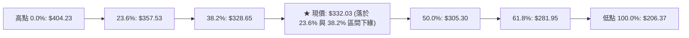

- **當前位置解讀**：現價 **$332.03** 位於 **Fib 23.6% ($357.53)** 與 **Fib 38.2% ($328.65)** 之間，距離 Fib 38.2% 僅 +1.03%（約 $3.38）。
- **技術意義**：Fib 38.2% ($328.65) 與日線布林下軌 ($329.45) 形成極強的「雙重共振黃金支撐帶」。強勢多頭回檔若能在此價位止跌企穩，代表中長期上升架構未遭破壞；一旦日線實體有效跌破 $328.65，市場將下測 Fib 50.0% ($305.30) 與 S1 ($312.69)。

---

## 5. 技術指標深度解讀

### 🎛️ 指標訊號總覽

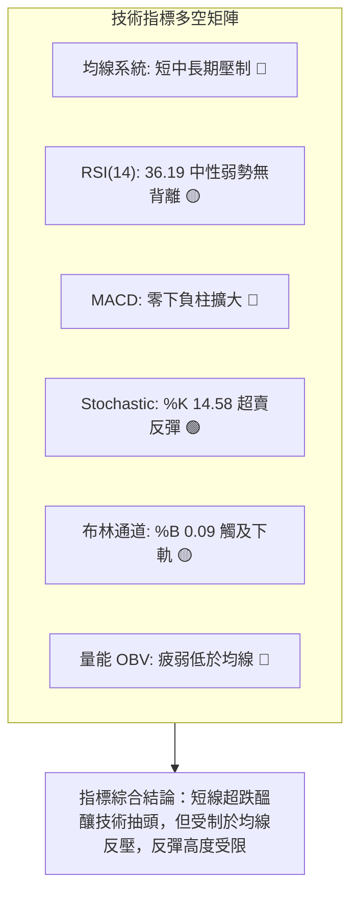

---

### 📈 移動平均線排列分析

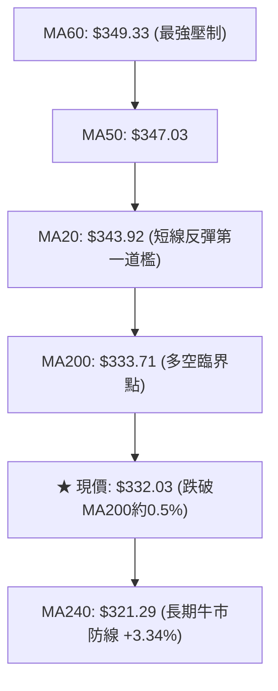

#### 均線系統詳細參數表

| 均線名稱 | 當前價格 | 與現價乖離 | 排列狀態 | 斜率走勢特徵 | 解讀結論 |
|:---|:---:|:---:|:---:|:---|:---|
| **MA 5** | $337.43 | -1.60% | 價格下方 | ▅▄▂▁▁▁▁▃▅▆████▆▆▅▅ (短線下行) | 超短期動能轉弱，壓制日內反彈 |
| **MA 10** | $339.67 | -2.25% | 價格下方 | ▇▆▄▄▃▁▁▁▂▃▄▅▆▇████▇ (持續壓低) | 短線空方防守線 |
| **MA 20** | $343.92 | -3.46% | 價格下方 | █▇▆▆▅▄▃▃▄▄▄▄▄▄▄▂▂▂▁▁ (下行) | 月線級別反壓，短期反彈目標 |
| **MA 50** | $347.03 | -4.32% | 價格下方 | 中期均線下彎，與 R2 ($348.89) 形成共振 | 中期趨勢轉入空方修正 |
| **MA 60** | $349.33 | -4.95% | 價格下方 | █████▇▇▇▆▆▆▆▆▅▅▄▄▄ (平緩下行) | 季線阻力沉重 |
| **MA 120** | $346.22 | -4.10% | 價格下方 | ▁▁▁▁▁▁▁▁▁▂▂▃▃▄▄▄▅▅ (高檔走平) | 半年線呈現糾結狀態 |
| **MA 200** | $333.71 | -0.50% | 價格下方 | 關鍵生命線，現價剛破位 0.5% | 需觀察 2-3 日是否能快速收復 |
| **MA 240** | $321.29 | +3.34% | 價格上方 | ▁▁▁▁▂▂▂▃▃▃▄▄▄▅▅▅▆▆ (穩健上升) | 年線多頭格局維持，長期最後防線 |

---

### 📉 RSI(14) 動能分析

```
RSI(14) 當前數值: 36.19
0 ──────────── 30 ──────────────────────── 70 ─────────── 100
[   超賣區    ] [▓▓▓▓▓▓▓░░░░░░░░░░░░░░░░░] [   超買區    ]
                ↑ 36.19 (弱勢中性區)
```

- **超買超賣狀態**：RSI(14) 目前為 **36.19**，位於弱勢中性區間。雖然尚未跌入 30 以下的典型超賣區，但已處於 2026 年以來的相對低檔分位數。
- **背離分析判斷**：
  - **日線 RSI**：數據顯示「RSI背離：無明顯背離」。
  - **週線 RSI**：自 2026-05 的 88.0 驟降至當前 36.2，價格創高但週 RSI 無法創高後展開深度修正，目前已完成高檔頂背離之能量釋放，當前暫無底背離形態。

---

### 📊 MACD(12, 26, 9) 訊號解讀

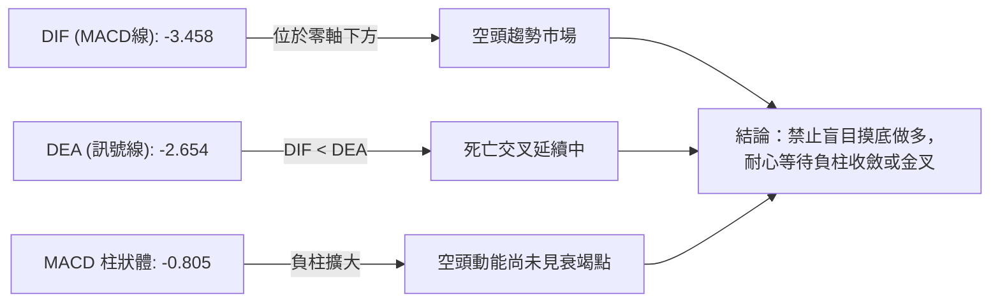

---

### 📦 布林通道分析 (Bollinger Bands 20, 2)

```
GOOG 布林通道示意圖
$358.38 ┬─────────────────────────────── 上軌 (強阻力)
        │
$343.92 ┼─────────────────────────────── 中軌 (MA20 基準線)
        │
$332.03 ┼  ★ 現價 (%B = 0.09)
$329.45 ┴─────────────────────────────── 下軌 (即時支撐帶)
```

- **通道帶寬與狀態**：布林上軌為 **$358.38**，下軌為 **$329.45**，帶寬約 $28.93。
- **位置解讀**：%B 值為 **0.09**，極度逼近下軌（0.0 代表下軌，0.5 為中軌）。依據均值回歸原理，當 %B < 0.10 且隨機指標超賣時，通常代表價格在下軌處具備極佳的下檔防禦性與反彈彈性。

---

### 💹 成交量分析（量價配合度）

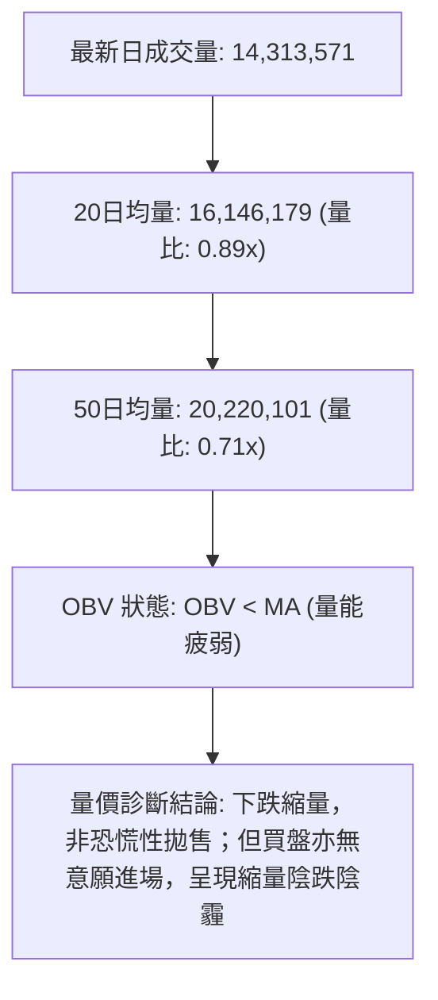

---

## 6. 動能與波動率

### ⚡ 動能評估四象限

| 象限分佈 | 動能強度 | 波動率狀態 | 當前定位 | 策略應對指引 |
|:---|:---:|:---:|:---:|:---|
| **Q1：強動能・低波動** | 強 | 低 | — | 趨勢突破初期（最佳順勢加碼點） |
| **Q2：弱動能・低波動** | **弱** | **低** | **✓ GOOG 當前位置** | **區間震盪築底（謹慎觀望，或於下軌小倉位博弈反彈）** |
| **Q3：強動能・高波動** | 強 | 高 | — | 主升/主跌浪（高風險高回報） |
| **Q4：弱動能・高波動** | 弱 | 高 | — | 恐慌震盪洗盤（嚴格避免進場） |

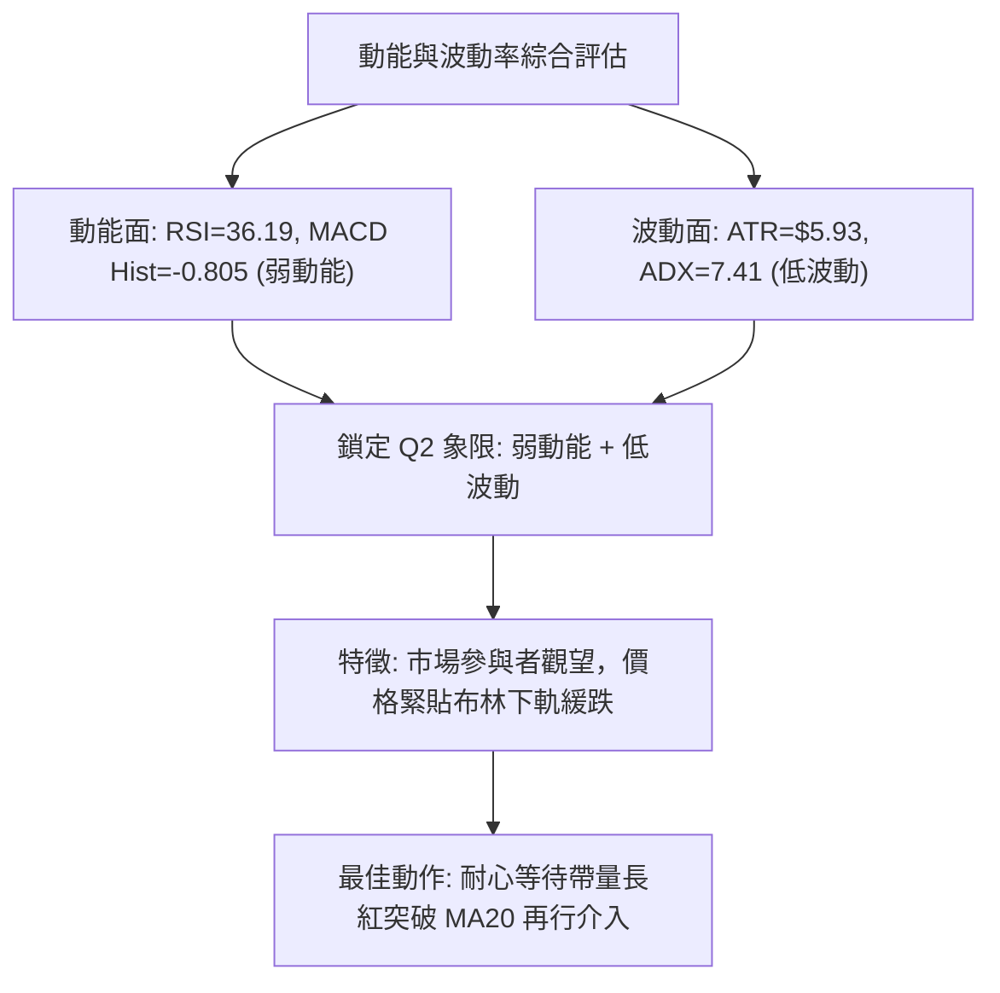

---

### 📊 ATR 波動率與止損計算

- **ATR(14) 數值**：**$5.93**（佔現價比率為 **1.79%**），顯示日內常態震盪區間極小。
- **風控止損空間建議**：
  - **短線交易（1.5 × ATR）**：$5.93 × 1.5 = **$8.90**。以現價 $332.03 推算，短線多單止損位應設於 $332.03 - $8.90 = **$323.13**（跌破 Fib 38.2% $328.65 緩衝區）。
  - **波段交易（2.0 × ATR）**：$5.93 × 2.0 = **$11.86**。波段進場止損位應設於 $332.03 - $11.86 = **$320.17**（接近年線 MA240 $321.29 與支撐 S1 $312.69 之間）。

---

### 📐 Beta 與市場相關性

- **Beta 係數**：**1.237**（高於美股大盤平均 1.00）。
- **市場敏感度解讀**：GOOG 屬於典型進攻型高彈性資產，當標普 500 或那斯達克指數波動時，其理論波動幅度約為大盤的 1.24 倍。當前 Beta 偏高但 ATR 偏低，意味著一旦科技板塊出現集體性方向選擇，GOOG 的波動率將迅速放大，極易引發快速破位或暴力軋空。

---

## 7. 多時框架總結

### 📋 時框架評分表

| 時框架 | 趨勢方向 | 動能指標 | 均線排列 | 形態結構 | 綜合評分 | 操作建議 |
|:---|:---:|:---:|:---:|:---:|:---:|:---|
| **月線級別 (長期)** | 🟢 多頭修正 | RSI: 52 🟡 | MA240 多頭向上 | 歷史高點拉回 38.2% | **68 / 100** | 長線投資者逢低分批佈局 |
| **週線級別 (中期)** | 🔴 偏空調整 | MACD負柱 🔴 | 均線高檔反轉向下 | 下降收斂通道 | **35 / 100** | 中期波段者保持觀望減倉 |
| **日線級別 (短期)** | 🔴 弱勢震盪 | Stoch超賣 🟢 | 跌破 MA20/50/200 | 布林下軌支撐測試 | **38 / 100** | 超短線僅限下軌防守反彈 |

---

### 🔲 綜合訊號矩陣

```
時框共振檢驗矩陣
┌──────────────┬──────────────┬──────────────┬──────────────┐
│   維度項目   │  短期 (日線) │  中期 (週線) │  長期 (月線) │
├──────────────┼──────────────┼──────────────┼──────────────┤
│ 均線系統     │   🔴 看空    │   🔴 看空    │   🟢 看多    │
│ 動能指標     │   🟡 中性    │   🔴 看空    │   🟡 中性    │
│ 形態位置     │   🟡 下軌    │   🔴 頂部下移│   🟢 黃金分割│
│ 量能配合     │   🔴 萎縮    │   🔴 萎縮    │   🟢 支撐帶  │
├──────────────┼──────────────┼──────────────┼──────────────┤
│ 權重方向     │ 🔴 偏空 (40%)│ 🔴 看空 (40%)│ 🟢 偏多 (20%)│
└──────────────┴──────────────┴──────────────┴──────────────┘
```

---

### ⚖️ 多時框收斂結論

依據多時框收斂規則（規則 14）：
1. **行情性質判定**：當前 ADX(14) 為 **7.41 (< 25)**，明確定義為**典型盤整行情**而非單邊趨勢行情。
2. **主導維度收斂**：在盤整架構下，日線布林通道上下軌（**$329.45 ~ $358.38**）及近端波段支撐/阻力成為主導交易區間；週線的下行壓制限制了反彈空間。
3. **唯一方向性結論**：**【弱勢中性偏空（區間震盪整理）】**。
   - 價格雖然受制於日線與週線均線系統（MA20/50/200 全面反壓），但由於 ADX 極低且 Stoch (%K 14.58) 嚴重超賣，下方緊鄰 Fib 38.2% ($328.65) 與布林下軌 ($329.45) 強共振支撐，空方並無立即砸盤擊穿的動能。
   - **總體戰略**：中線維持偏空防守思維，短線在區間下軌尋求高風報比之超跌反彈機會，嚴格依據第 8 章路由執行。

---

## 8. 交易策略建議

### 🗺️ 策略決策流程圖

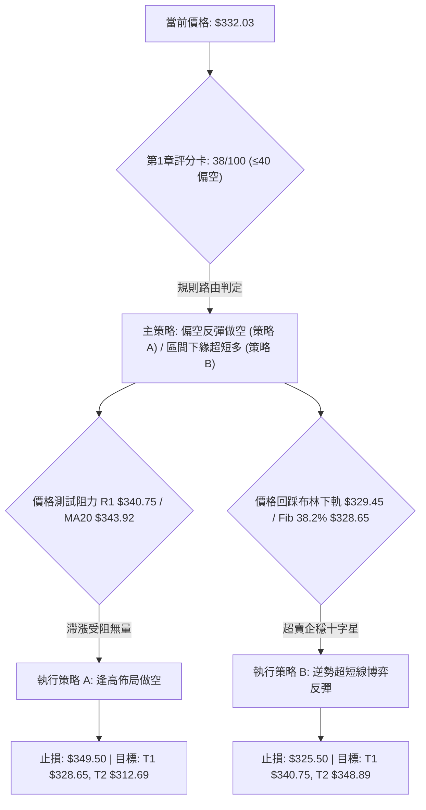

---

### 🧭 策略路由

> **當前主策略方向 = 【弱勢偏空防守，逢反彈阻力做空為主，區間下緣極輕倉博反彈為輔】（依評分卡 38/100）**

- **主推策略（偏空）**：由於綜合評分 ≤40，且現價跌破 MA200，任何向上靠近 R1 ($340.75) 至 R2 ($348.89) 的反彈均視為解套與逢高作空機會。
- **次要策略（超短多）**：僅限在 Fib 38.2% ($328.65) 與布林下軌 ($329.45) 企穩時進行小倉位反彈操作。

---

### 🎯 價格情境階梯（Price Scenarios）

所有價位均嚴格引用第 4 章計算結果：

| 階梯層級 | 觸發條件 | 下一目標價 | 後續延伸目標 | 情境技術含義 |
|:---|:---|:---:|:---:|:---|
| **牛市反轉階梯** | 帶量突破 **R2 ($348.89)** | **R3 ($372.95)** | **Fib 23.6% ($357.53) / 52W高點 ($404.23)** | 中期空頭形態瓦解，重新挑戰高檔套牢區 |
| **短線轉強階梯** | 收復 **MA200 ($333.71)** 且突破 **R1 ($340.75)** | **R2 ($348.89)** | **布林上軌 ($358.38)** | 短線超跌反彈成立，測試 MA50 壓力帶 |
| **區間震盪階梯** | 徘徊於 **$328.65 ~ $340.75** 之間 | — | — | ADX 低迷之無趨勢震盪，布林帶寬收窄 |
| **破位轉弱階梯** | 實體跌破 **Fib 38.2% ($328.65)** | **支撐 S1 ($312.69)** | **Fib 50.0% ($305.30)** | 觸發停損盤，下檔考驗 2026-07 底部 |
| **深度探底階梯** | 放量跌破 **S1 ($312.69)** | **支撐 S2 ($295.78)** | **支撐 S3 ($271.13) / Fib 61.8% ($281.95)** | 中級多頭徹底反轉，年線級別回調 |

---

### 📊 情境機率分佈

| 情境劇本 | 發生機率 | 主要技術依據（嚴格引用指標數據） |
|:---|:---:|:---|
| **情境一：弱勢反彈 / 區間震盪** | **55%** | ADX = 7.41 極度低迷，Stoch (%K 14.58) 進入極限超賣區，下軌 $329.45 具備短線技術緩衝支撐 |
| **情境二：向下破位 / 測試 S1** | **35%** | 均線系統呈空頭排列，MACD Hist (-0.805) 處於負值擴張，OBV < MA 顯示主力買盤退潮 |
| **情境三：強勢反轉 / 突破 R2** | **10%** | 上方遭遇 MA20 ($343.92)、MA50 ($347.03) 與 R2 ($348.89) 多重密集套牢反壓，目前無量難以直拔 |

---

### 🟢 主策略詳情

#### 策略 A（主推：反彈遇阻做空策略） vs 策略 B（次選：下軌超賣反彈策略）

| 策略要素 | 策略 A（順勢逢高做空 — 主策略） | 策略 B（下軌超跌博反彈 — 次選策略） |
|:---|:---|:---|
| **適用邏輯** | 均線空頭壓制，反彈至壓力位動能竭盡進場 | 觸及 Fib 38.2% 與布林下軌超賣，博弈均值回歸 |
| **進場條件** | 價格反彈至 R1 與 MA20 之間出現日線長上影線 | 價格回測 $328.65 - $329.45 區間出現下影線十字星 |
| **進場價格** | **$341.00**（R1 $340.75 附近） | **$329.50**（布林下軌 $329.45 處） |
| **目標價 T1** | **$328.65**（Fib 38.2% 支撐） | **$340.75**（R1 阻力位） |
| **目標價 T2** | **$312.69**（波段強支撐 S1） | **$348.89**（R2 阻力 / MA50 重疊處） |
| **止損價格** | **$349.50**（有效突破 R2 $348.89 與 MA60） | **$325.50**（跌破 Fib 38.2% 緩衝區約 1.0%） |
| **風險空間** | $8.50 ($349.50 - $341.00) | $4.00 ($329.50 - $325.50) |
| **報酬空間 (T1)**| $12.35 ($341.00 - $328.65) | $11.25 ($340.75 - $329.50) |
| **風險報酬比** | **1 : 1.45 (T1) / 1 : 3.33 (T2)** | **1 : 2.81 (T1) / 1 : 4.85 (T2)** |
| **模型勝率** | **65%** | **45%** |
| **建議倉位** | **15% - 20%** | **5% - 8% (嚴格輕倉)** |

---

### 🔴 反向風險觸發點（對沖提示）

若已建立空頭部位，出現以下信號必須立即執行**空單無條件止損或反手對沖**：
1. **價位突破**：日線收盤價強勢站上 **$348.89 (R2)**，代表空頭防線全面潰敗。
2. **指標轉強**：日線 MACD 在零軸下方形成實質「黃金交叉」且柱狀體翻正（Hist > 0）。
3. **量能爆發**：單日成交量突破 **20,220,100 股**（50日均量以上，即量比 > 1.4x）並伴隨大陽線。

---

### ⭐ 整體訊號強度評星

```
做多訊號強度：★★☆☆☆  (2.0/5.0 星 — 僅具超賣技術反彈契機)
做空訊號強度：★★★★☆  (4.0/5.0 星 — 均線排列與動能結構偏空)
整體可信度：  ★★★☆☆  (3.5/5.0 星 — 因 ADX 極低，行情多以磨人震盪呈現)
```

---

## 9. 風險提示與監控

### ✅ 關鍵監控指標 Checklist

```
╔══════════════════════════════════════════════════════════════════╗
║              GOOG 技術面日常監控清單 (Daily Checklist)          ║
╠══════════════════════════════════════════════════════════════════╣
║ [ ] 價格是否跌破 Fib 38.2% ($328.65) 及 布林下軌 ($329.45)       ║
║ [ ] 日線收盤能否重新站穩 MA200 ($333.71) 生命線之上             ║
║ [ ] MACD Histogram 負值是否開始收斂 (高於 -0.805)                ║
║ [ ] RSI(14) 是否跌破 30.0 進入極端恐慌超賣區                     ║
║ [ ] ADX(14) 是否自 7.41 向上回升至 20 以上（趨勢即將爆發）      ║
║ [ ] 單日成交量是否放大至 16,146,179 股 (20日均量) 之上          ║
╚══════════════════════════════════════════════════════════════════╝
```

---

### ⚠️ 風險場景分析

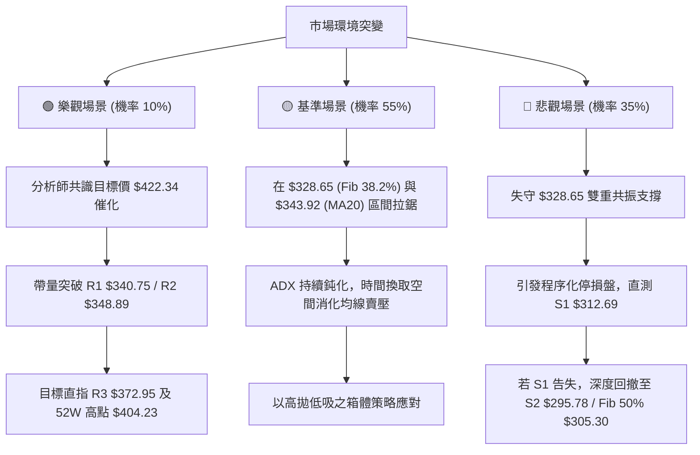

---

### 🛡️ 風險管理重要提醒

1. **嚴禁在無量盤整期重倉**：當前 ADX 為 7.41，市場處於極度消耗期，多空拉鋸反覆，過大倉位極易被雙向磨損。單一交易策略部位建議控制在總資金 **10% ~ 15%** 以內。
2. **嚴格執行 ATR 止損機制**：每日波動 ATR 為 $5.93，任何進場點止損空間不得低於 1.5 倍 ATR（約 $8.90），避免在常態雜訊波動中被無謂掃出場。
3. **密切關注基本面與分析師共識保護**：雖然技術面偏弱，但 Alphabet 基本面獲利成長強勁（EPS TTM $19.92，淨利率 54.8%），華爾街 15 位分析師給出 Strong Buy 評級且平均目標價達 **$422.34**（最低目標價亦在 **$340.00**），意味著下檔具備堅實的長線估值護城河，過度做空亦需防範消息面帶來的突發軋空風險。

---

## 10. 報告總結

```
╔══════════════════════════════════════════════════════════════════╗
║                   GOOG 技術分析報告總結                          ║
╠══════════════════════════════════════════════════════════════════╣
║ 報告日期：2026-09-02                                             ║
║ 當前價格：$332.03                                                ║
║ 分析評級：⚖️ 偏弱震盪整理 (綜合技術評分: 38/100)                ║
╠══════════════════════════════════════════════════════════════════╣
║ 關鍵結論：                                                       ║
║ ├─ 長期趨勢：🟢 偏多格局 (年線 MA240 $321.29 穩健向上，Fib 38.2% ║
║ │             $328.65 形成長期牛市強防守)                        ║
║ ├─ 中期趨勢：🔴 偏空修正 (自 52W 高點 $404.23 高檔震盪回落，均線 ║
║ │             MA20/50 形成死叉壓制)                              ║
║ ├─ 短期趨勢：🟡 弱勢盤整 (ADX=7.41 弱趨勢，布林下軌 $329.45 醞釀 ║
║ │             超跌技術反彈)                                      ║
║ ├─ 關鍵支撐：S1: $312.69 ｜ Fib 38.2%: $328.65 ｜ S2: $295.78    ║
║ ├─ 關鍵阻力：R1: $340.75 ｜ R2: $348.89 ｜ R3: $372.95           ║
║ └─ 華爾街目標：均價 $422.34 (最低 $340.00 / 最高 $475.00)       ║
╠══════════════════════════════════════════════════════════════════╣
║ 最優策略組合：                                                   ║
║ 1. 🥇 最佳機會 (主策略)：反彈至 R1 ($340.75) / MA20 ($343.92)   ║
║    遇阻放空，止損設 R2 上方 $349.50，目標看 $328.65 及 $312.69  ║
║ 2. 🥈 次選機會 (反彈策略)：於 Fib 38.2% ($328.65) / 下軌處輕倉  ║
║    博弈短多，止損 $325.50，目標 $340.75                         ║
║ 3. 🥉 保守選擇：完全空倉觀望，等待日線帶量收復 MA20 或跌至 S1   ║
║    出現明確右側反轉形態再行介入                                  ║
╚══════════════════════════════════════════════════════════════════╝
```

---

> ⚠️ **免責聲明**：本報告為技術分析研究成果，所有數據及估算均基於歷史量價與技術模型推演。本報告**僅供研究與學術參考**，**不構成任何投資建議或買賣邀約**。金融市場投資具有高度風險，投資人應獨立評估風險並自負盈虧。

---

*報告生成時間：2026-09-02 ｜ 數據來源：Yahoo Finance ｜ 分析框架：多時框技術分析模型*