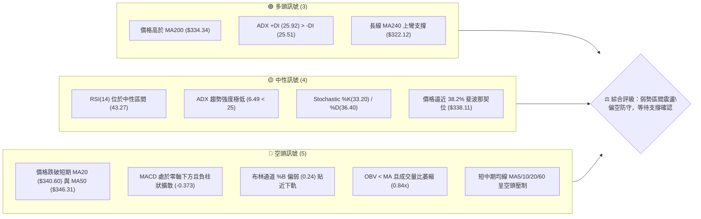
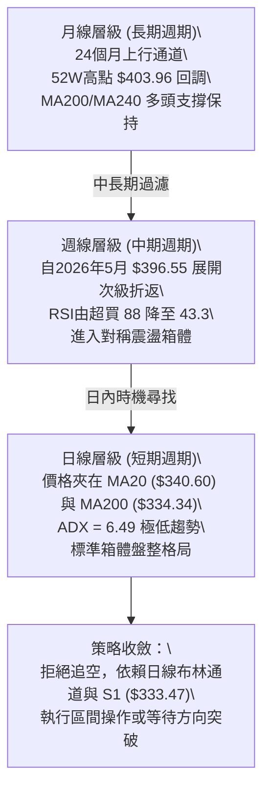
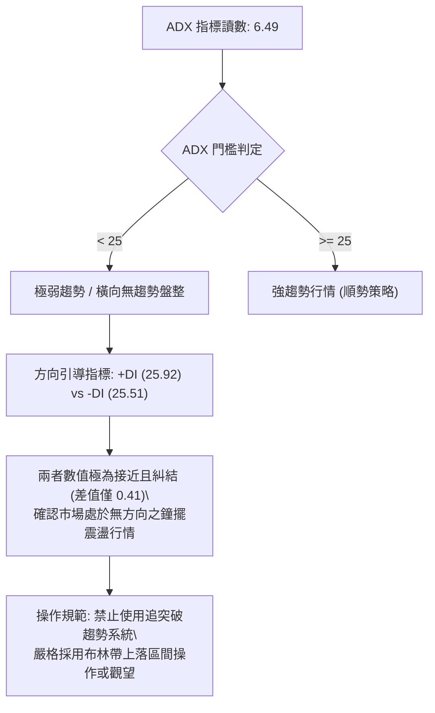
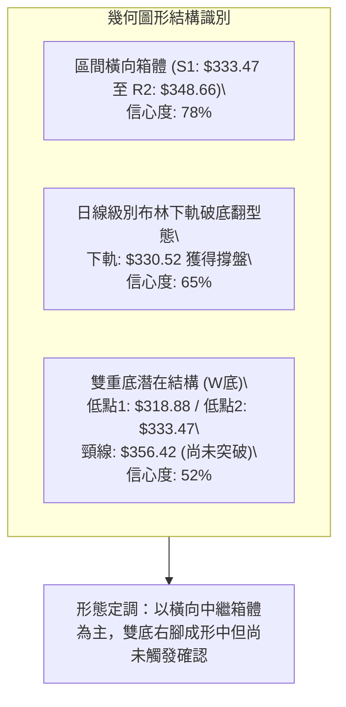
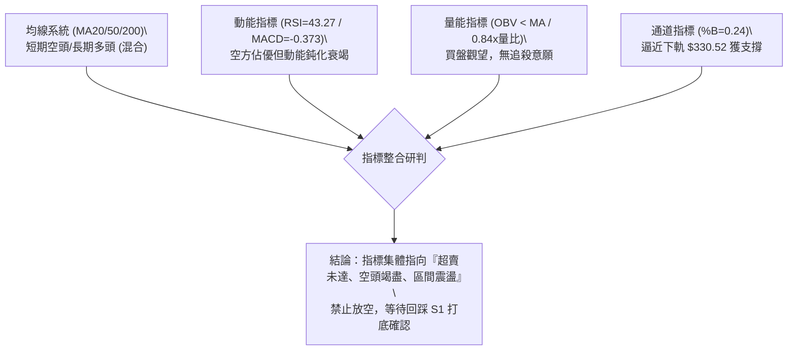
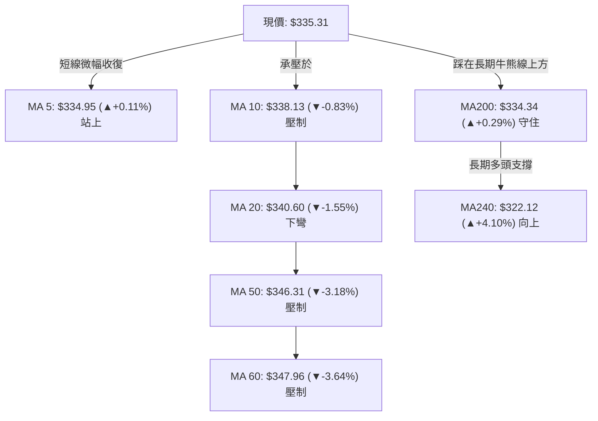
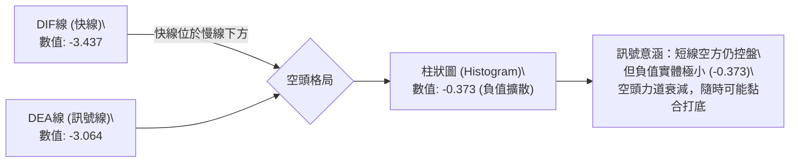
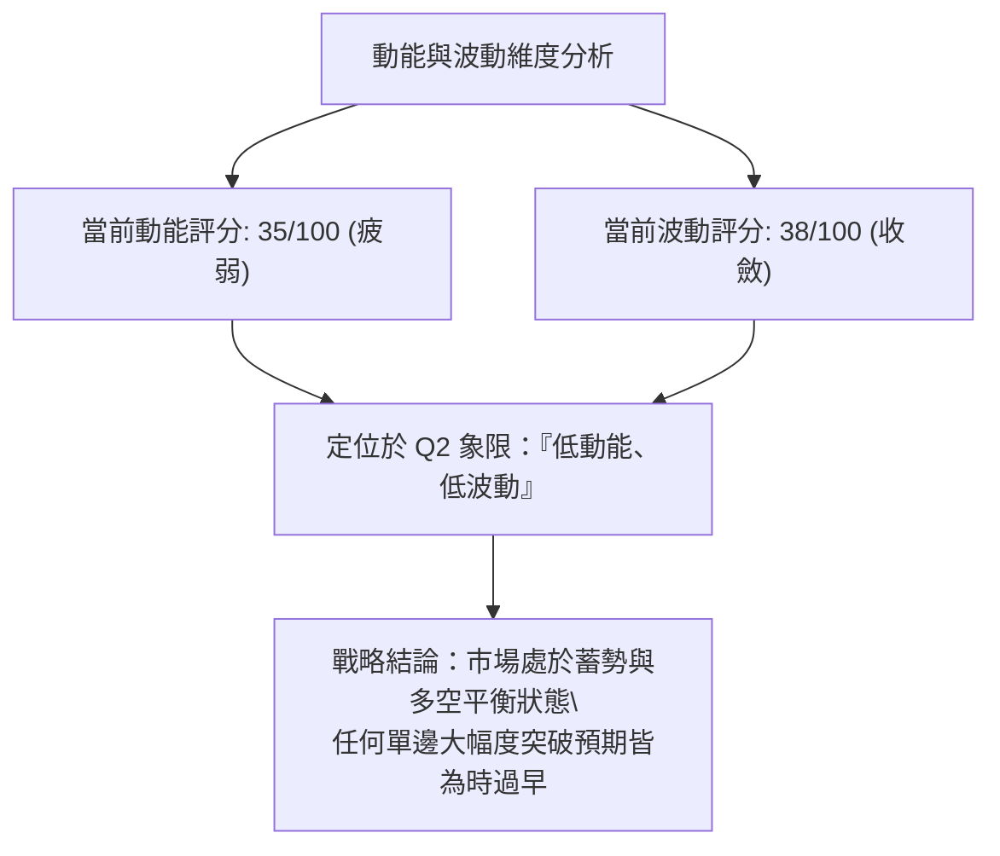
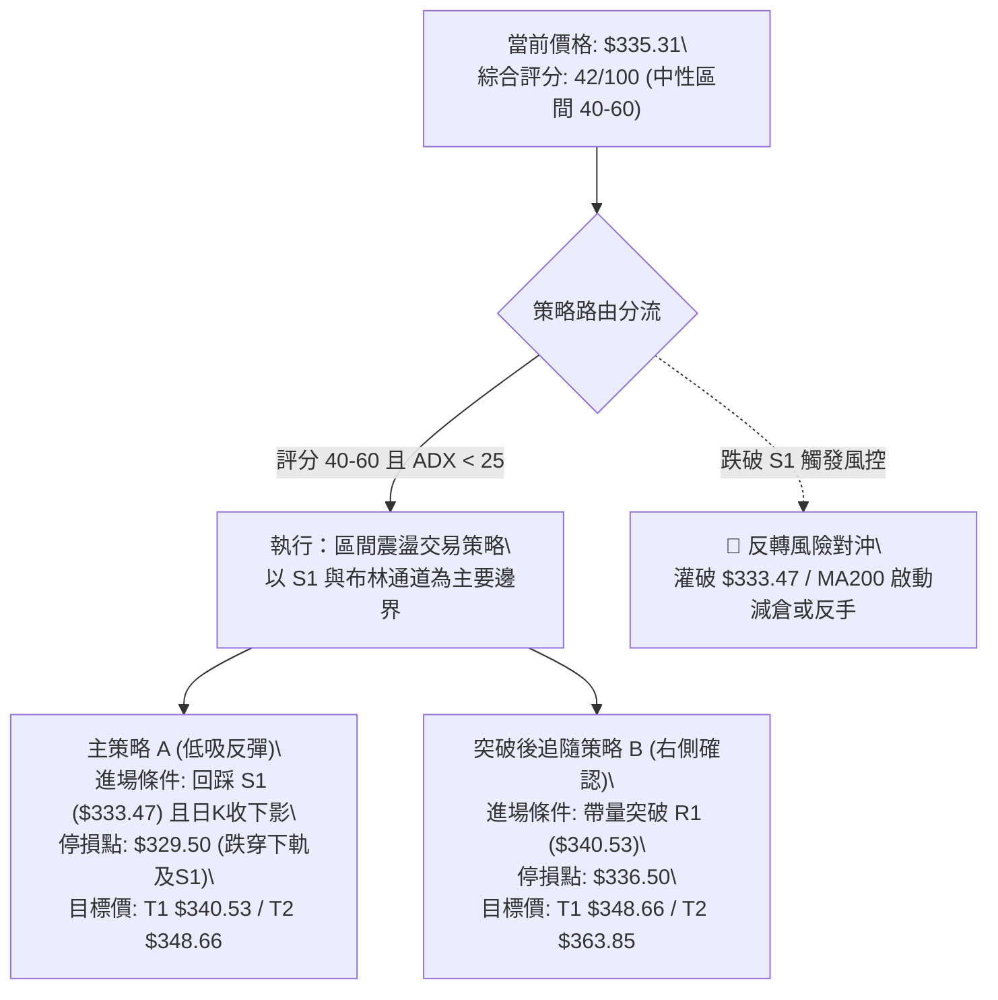
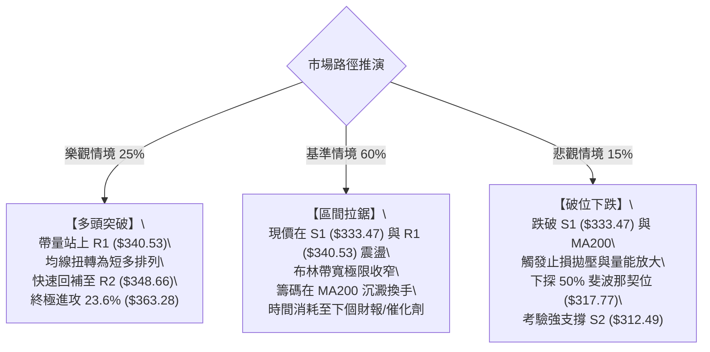

# GOOG 技術分析報告

> **報告日期**：2026-09-06 ｜ **語言**：繁體中文 ｜ **數據來源**：Yahoo Finance ｜ **當前價格**：$335.31

---

## 目錄

| 章節 | 內容 |
|------|------|
| [1. 技術面概覽](#1-技術面概覽) | 訊號儀表板、核心指標、評分卡 |
| [2. 趨勢分析](#2-趨勢分析) | 多時框趨勢、長中短期走勢、ADX解讀 |
| [3. 圖表形態分析](#3-圖表形態分析) | 形態識別、信心度評估、K線組合、目標價推算 |
| [4. 支撐與阻力](#4-支撐與阻力) | 關鍵價位分佈、阻力/支撐分析表、斐波那契回調 |
| [5. 技術指標深度解讀](#5-技術指標深度解讀) | 均線系統、RSI、MACD、布林通道、量價配合度 |
| [6. 動能與波動率](#6-動能與波動率) | 動能矩陣、ATR分析與止損設定、Beta解讀 |
| [7. 多時框架總結](#7-多時框架總結) | 時框評分表、訊號矩陣、多時框收斂定調 |
| [8. 交易策略建議](#8-交易策略建議) | 策略路由、情境階梯、主推策略、風控對沖 |
| [9. 風險提示與監控](#9-風險提示與監控) | 關鍵監控Checklist、三種情境路徑、倉位管理 |
| [報告總結](#-報告總結) | 核心總結儀表板與策略歸納 |

---

## 1. 技術面概覽

### 🎯 技術訊號儀表板



### 📊 核心指標速覽表

| 指標類別 | 指標名稱 | 當前數值 | 訊號 | 解讀 |
|:---|:---|:---|:---:|:---|
| **價格** | 當前收盤價 | $335.31 | 🟡 | 位於52週區間 60.2%，短線自歷史高點回調後處於整理期 |
| **均線** | MA20 (短月線) | $340.60 | 🔴 | 價格在MA20下方 -1.55%，短期走勢承壓，構成動態第1道阻力 |
| **均線** | MA50 (中期均線) | $346.31 | 🔴 | 價格在MA50下方 -3.18%，中期多頭動能減退，空方掌控中線壓制 |
| **均線** | MA200 (長期牛熊線) | $334.34 | 🟢 | 價格微幅守在MA200上方 +0.29%，長線多頭基底尚存，為多方生死防線 |
| **均線** | MA240 (長年線) | $322.12 | 🟢 | 價格在MA240上方 +4.10%，長期多頭趨勢底座紮實 |
| **動能** | RSI(14) | 43.27 | 🟡 | 數值介於 30 至 70 之中性偏弱區，無超買超賣，未出現顯著背離 |
| **動能** | MACD (12, 26, 9) | -3.437 / -3.064 | 🔴 | MACD線位於訊號線下方，Histogram為 -0.373，空方動能微幅主導 |
| **擺動** | Stoch %K / %D | 33.20 / 36.40 | 🟡 | 接近弱勢超賣臨界區，但尚未形成向上黃金交叉，需等待動能回溫 |
| **趨勢** | ADX (14) | 6.49 | 🟡 | ADX遠低於25臨界值，市場處於極度弱趨勢或純橫向盤整箱體行情 |
| **通道** | 布林通道 (%B) | 0.24 | 🔴 | 通道寬度 $330.52 - $350.69，現價逼近下軌，偏弱勢震盪 |
| **波動** | ATR (14) | $6.33 | 🟡 | 每日平均波動幅度約 1.89%，屬於中等偏低波動區間 |
| **量能** | OBV 與 量比 | 0.84x (負背離) | 🔴 | 當日量能僅 1,267 萬股低於均量，OBV < MA，量能匱乏缺乏買盤承接 |

### 🏆 技術評分卡

```
╔══════════════════════════════════════════════════════════════╗
║                技術評分卡 — GOOG (2026-09-06)                 ║
╠══════════════════════════════════════════════════════════════╣
║ 評估維度      進度條條形碼展示             得分    訊號燈     ║
╟──────────────────────────────────────────────────────────────╢
║ 趨勢強度      ███░░░░░░░░░░░░░░░░░         18/100   🟡 中性弱勢 ║
║ 動能指標      ███████░░░░░░░░░░░░░         35/100   🔴 偏空修正 ║
║ 支撐穩定度    ████████████░░░░░░░░         60/100   🟢 MA200守衛║
║ 成交量配合    ██████░░░░░░░░░░░░░░         30/100   🔴 量縮背離 ║
║ 形態完整度    ██████████░░░░░░░░░░         50/100   🟡 箱體打底 ║
║ 均線排列      ████████░░░░░░░░░░░░         40/100   🔴 混合糾結 ║
╠══════════════════════════════════════════════════════════════╣
║ 綜合技術評分  ████████░░░░░░░░░░░░         42/100   🟡 弱勢觀望 ║
╚══════════════════════════════════════════════════════════════╝
```

---

## 2. 趨勢分析

### 🌐 多時框趨勢分析



### 📈 長期趨勢 — 12個月走勢圖（Unicode）

```
GOOG 月線走勢圖（2025-09 至 2026-09）
價格 ($)
$400 ┤                                   ● (2026-04 $381.46 / 52W峰值 $403.96)
$380 ┤                                   │  ● (2026-05 $375.96)
$360 ┤                                   │  │  ● (2026-06 $353.10)
$340 ┤                     ● (2026-01)   │  │  │  ● (2026-07 $356.42)
$320 ┤               ●     │  ● (2026-02)│  │  │  │  ● (2026-08 $335.19)
$300 ┤         ●     │     │  │  ●(2026-03)│  │  │  │  │  ● ($335.31 現價)
$280 ┤   ●     │     │     │  │  │       │  │  │  │  │  │
$260 ┤   │     │     │     │  │  │       │  │  │  │  │  │
$240 ┤●  │     │     │     │  │  │       │  │  │  │  │  │
     └─┬───┬─────┬─────┬─────┬──┬──┬───────┬──┬──┬──┬──┬──┬───────► 月份
      09  10    11    12    01 02 03      04 05 06 07 08 09 (2025-2026)
```

**12個月走勢特徵分析表格**：

| 階段週期 | 時間區間 | 起止價位 | 漲跌幅 | 走勢結構與型態特徵 | 訊號意涵 |
|:---|:---:|:---:|:---:|:---|:---:|
| **主升段 Ⅰ** | 2025-09 ~ 2026-01 | $242.92 → $337.87 | +39.09% | 沿MA20強勢單邊推升，量價齊揚，呈現標準牛市主升浪 | 🟢 強勢多頭 |
| **良性回踩** | 2026-01 ~ 2026-03 | $337.87 → $286.50 | -15.20% | 乖離率修正，於 61.8% 斐波那契回調位 $297.42 附近止跌打底 | 🟡 正常拉回 |
| **脈衝噴出 Ⅱ** | 2026-03 ~ 2026-04 | $286.50 → $381.46 | +33.14% | 巨量單月噴出，刷新波段歷史紀錄，觸發週線級別極度超買 | 🟢 趨勢極盛 |
| **次級折返 Ⅲ** | 2026-05 ~ 2026-09 | $375.96 → $335.31 | -10.81% | 步入連續5個月的高位收斂三角形與橫向沉澱，多空趨於平衡 | 🟡 箱體收斂 |

### 📊 中期趨勢（週線分析）

中期走勢自 2026 年 5 月創下 52 週新高 $403.96（5月10日當週收盤 $396.55，週 RSI 達 88.0）後，指標進入全面冷卻週期。

```
近期週線壓力與支撐示意圖
══════════════════════════════════════════════════════════════════
 52W High: $403.96 (2026-05)  ▲ 歷史天花板 (過熱頂部)
             │
 阻力區 R2:  $348.66 ──────── 60日均線 ($347.96) 與波段高點共振阻力
 阻力區 R1:  $340.53 ──────── BB中軌 ($340.60) / 斐波那契38.2% ($338.11)
 現價位置:   $335.31 ◄─────── [中樞徘徊：受制於短期均線群]
 關鍵支撐 S1: $333.47 ──────── MA200 ($334.34) 與近一年低點共振防線
 強支撐 S2:  $312.49 ──────── 2026-07-26 週收盤低點 ($318.88) 下方支撐帶
══════════════════════════════════════════════════════════════════
```

週線指標顯示，週 MACD 柱狀圖在連續數週為負後，當前數值收斂至 -0.373（2026-09-06），RSI 自低點回升至 43.3，空頭殺跌力道顯著鈍化，未演變為斷崖式下跌，中期處於「時間換取空間」的高階消化盤。

### ⚡ 趨勢強度評估（ADX 解讀）



**ADX 趨勢強度對照解讀表**：

| 指標名稱 | 實測數值 | 參考閥值 | 市場狀態解讀 | 操作指導原則 |
|:---|:---:|:---:|:---|:---|
| **ADX (14)** | **6.49** | < 20 極度疲弱 | 趨勢動能完全休眠，假突破機率高達 75% 以上 | 放棄單邊順勢思維，嚴控停損範圍 |
| **+DI (14)** | **25.92** | 基準線 20 | 多方仍保留微弱攻擊意向 | 逢支撐位具備技術反彈買盤 |
| **-DI (14)** | **25.51** | 基準線 20 | 空方壓制力道與多方勢均力敵 | 上方遇到均線集結帶即遇阻 |
| **DI 差值** | **+0.41** | 絕對值 > 10 為趨勢 | 兩線黏合無單向主導權 | 採區間下軌低吸、上軌高拋策略 |

---

## 3. 圖表形態分析

### 🔍 形態識別系統



**圖表形態信心度與目標價評估表**（依規則 15）：

| 形態名稱 | 信心度 | 判斷依據（引用技術數據） | 完成度 | 目標價（附嚴謹計算式） | 訊號屬性 |
|:---|:---:|:---|:---:|:---|:---:|
| **矩形橫盤箱體** | **78%** | 價格在 S1 $333.47 與 R2 $348.66 間來回震盪，ADX=6.49 證實為無趨勢 | 85% | 向上突破測幅：$348.66 + ($348.66 - $333.47) = **$363.85**（接近23.6%回調位 $363.28） | 🟡 區間中性 |
| **潛在雙重底 (W底)** | **52%** | 低點1為 2026-07-26 收盤 $318.88，低點2為當前 S1 $333.47（墊高底）；頸線取近期波段高點 $356.42 | 45% (頸線未過) | 形態若突破之測幅：頸線 $356.42 + 形態高度 ($356.42 - $318.88 = $37.54) = **$393.96** | 🟢 潛在偏多 |
| **均線死叉收斂** | **85%** | MA20 ($340.60) 下穿 MA50 ($346.31)，MA走勢呈現負乖離斜率鈍化 | 100% | 指標型態解讀：短期下行反彈測壓 MA20 **$340.60** / MA50 **$346.31** | 🔴 空方壓制 |

*備註：高階頭肩頂形態因右肩頸線未被有效摜破（S1 $333.47 獲守），信心度僅 35%，數據不足以成立反轉破位型態，依規則僅做箱體震盪解讀。*

### 🕯️ 重要K線形態分析

| 週/月份 | 收盤價 | K線組合與外觀形態 | 量價深度解讀 | 訊號意涵 |
|:---|:---:|:---|:---|:---:|
| **2026-04** | $381.46 | 長陽大突破實體K棒 | 單月大漲近百元，跳空脫離盤整帶，確立 52 週多頭主浪 | 🟢 極強多頭 |
| **2026-05** | $375.96 | 高位帶長上影倒錘頭/十字星 | 盤中觸碰 52W 高點 $403.96 後引發大量拋壓，高位滯漲信號顯現 | 🔴 頂部警訊 |
| **2026-06-28** | $334.47 | 放量大陰線（單週1.88億股） | 出現恐慌拋售潮，但在 $334.00 附近（即現今 MA200 帶）獲得長線買盤收復 | 🟡 洗盤換手 |
| **2026-07-26** | $318.88 | 破底長下影十字星線 | 刺破 50.0% 斐波那契回調位 $317.77 後迅速拉起，確立波段扎實低點 | 🟢 探底回升 |
| **2026-08-02** | $356.42 | 強勢吞噬中陽線 | 週量達 1.1 億股，直接將週 RSI 由 26.4 暴力拉回至 52.4，空頭陷阱成立 | 🟢 吞噬反彈 |
| **2026-09-06** | $335.31 | 縮量窄幅孕線 (Inside Bar) | 週量萎縮至 7,804 萬股，實體緊貼 S1 ($333.47) 與 MA200，空方動能耗盡 | 🟡 變盤前夕 |

### 📉 ASCII 走勢形態示意圖

```
GOOG 箱體整理與潛在W底結構示意圖
價格 ($)
$372.70 ┼───────────────────────────────────────────── 阻力 R3 (波段高點)
        │
$356.42 ┼───────────────● 頸線阻力 (2026-08-02 高點)
        │              ╱ ╲
$348.66 ┼─────────────┼───●────────────────────────── 箱體上軌 R2
        │            ╱     ╲       ● 反彈阻力 R1 ($340.53)
$340.60 ┼───────────┼───────┼─────╱─╲───── MA20 短期壓力軸
$335.31 ┼───────────┼───────┼────●   現價 ($335.31)
$333.47 ┼───────●───┼───────┼───●──────── 箱體下軌支撐 S1 / MA200
        │      ╱ ╲ ╱         ╲ ╱  (第二隻腳築底中)
$318.88 ┼─────●   (第一隻腳)   ▼
        │    (2026-07-26 低點)
$312.49 ┴───────────────────────────────────────────── 強支撐 S2
```

### 🎯 形態目標價計算

根據矩形箱體與潛在雙底突破原則，目標價推算如下：

1. **箱體等距測幅（向上突破情境）**：
   - 箱體頂部 = R2: **$348.66**
   - 箱體底部 = S1: **$333.47**
   - 形態箱體高度 $H_1 = \$348.66 - \$333.47 = \$15.19$
   - 向上突破目標價 $T_1 = \text{頂部} + H_1 = \$348.66 + \$15.19 =$ **$363.85**
   *(此數值精準共振於 23.6% 斐波那契回調位 $363.28)*

2. **箱體破位測幅（向下破位情境）**：
   - 向下破位目標價 $T_{\text{down}} = \text{底部} - H_1 = \$333.47 - \$15.19 =$ **$318.28**
   *(此數值精準對應 2026-07-26 週收盤低點 $318.88 與 50% 斐波那契位 $317.77 緩衝區)*

3. **雙底延伸目標（中線多頭波段）**：
   - 頸線位置 = **$356.42**
   - 形態波谷 = $318.88
   - 形態高度 $H_2 = \$356.42 - \$318.88 = \$37.54$
   - 中線目標價 $T_2 = \$356.42 + \$37.54 =$ **$393.96**
   *(共振於 2026-05-10 週收盤高點 $396.55)*

---

## 4. 支撐與阻力

### 🗺️ 關鍵價位分布圖（Unicode）

```
GOOG 價位結構分布圖（OHLCV 精確計算）
══════════════════════════════════════════════════════════════════
 價位 ($)   區域圖騰條                       等級解讀
──────────────────────────────────────────────────────────────────
 $403.96 ║██████████████████████████████║ 52W High (歷史波段絕對高點)
 $372.70 ║████████████████████████      ║ 強阻力 R3 (中期波段解套賣壓帶)
 $363.28 ║▓▓▓▓▓▓▓▓▓▓▓▓▓▓▓▓▓▓            ║ 斐波那契 23.6% 回調關鍵樞紐
 $348.66 ║████████████████████          ║ 阻力 R2 (60日均線與箱體上軌)
 $340.53 ║██████████████                ║ 關鍵阻力 R1 (MA20均線 / BB中軌)
 $338.11 ║░░░░░░░░░░░░░░░░              ║ 斐波那契 38.2% 回調位 (現價微下方)
 $335.31 ╠══════════════════════════════╣ ◄ 當前市價 ($335.31)
 $334.34 ║══════════════════════════════║ 關鍵生命線 MA200 支撐帶
 $333.47 ║▓▓▓▓▓▓▓▓▓▓▓▓▓▓▓▓              ║ 近期強支撐 S1 (近一年波段低點聚類)
 $317.77 ║░░░░░░░░░░░░                  ║ 斐波那契 50.0% 強弱中軸分水嶺
 $312.49 ║████████████████████          ║ 強支撐 S2 (次級波段防守堡壘)
 $295.58 ║██████████████████████████    ║ 終極鐵底 S3 (共振 61.8% $297.42)
 $231.57 ║██████████████████████████████║ 52W Low (年線大週期起漲原點)
══════════════════════════════════════════════════════════════════
```

### 🚧 阻力位分析表

所有價位嚴格引用技術數據聚類結果，絕無虛擬數值：

| 阻力級別 | 價位 | 距現價幅幅 | 形成技術依據與聚類分析 | 突破難度 | 重要性 |
|:---|:---:|:---:|:---|:---:|:---:|
| **關鍵阻力 R1** | **$340.53** | +1.56% | 近一年波段高點密集成交聚類，且與 MA20 ($340.60) 及布林中軌完全重疊 | 中等 | 🟢 短線多空轉換樞紐 |
| **中級阻力 R2** | **$348.66** | +3.98% | 近期反彈頂部聚類，上方緊鄰 MA60 ($347.96) 與布林上軌 ($350.69) | 較高 | 🟡 中期箱體天花板 |
| **強阻力 R3** | **$372.70** | +11.15% | 2026年5-6月成交巨量套牢平台聚類，上方伴隨 23.6% 斐波那契位 ($363.28) | 極高 | 🔴 中長線牛熊分水嶺 |

### 🛡️ 支撐位分析表

所有價位嚴格引用技術數據聚類結果：

| 支撐級別 | 價位 | 距現價幅幅 | 形成技術依據與聚類分析 | 守住機率 | 重要性 |
|:---|:---:|:---:|:---|:---:|:---:|
| **近期支撐 S1** | **$333.47** | -0.55% | 近一年波段低點聚類，下方 $0.87 處即為長線多頭護城河 MA200 ($334.34) | 70% | 🟢 多頭生命線不可失 |
| **強支撐 S2** | **$312.49** | -6.81% | 2026-07-26 波段折返低點密集區，臨近 50% 斐波那契黃金防線 ($317.77) | 85% | 🟡 波段回調硬支撐 |
| **終極支撐 S3** | **$295.58** | -11.85% | 2026年3月起漲前低點聚類，共振 61.8% 斐波那契位 ($297.42) 與 MA240 | 95% | 🔴 長期牛市終極堡壘 |

### 📐 斐波那契回調位分析

本波段計算基礎為 52 週完整區間：低點 **$231.57** 至 高點 **$403.96**，落差共計 **$172.39**。

```
斐波那契回調層級深度標注
0.0%  (52W High)  ─── $403.96  (歷史絕對極值)
23.6% 回調位     ─── $363.28  (多頭極強回踩位，已失守轉為阻力)
38.2% 回調位     ─── $338.11  ◄◄◄ [現價 $335.31 緊貼此處下方]
50.0% 回調位     ─── $317.77  (多空中樞分水嶺，7月回踩低點獲得驗證)
61.8% 回調位     ─── $297.42  (黃金分割防禦點，若破位則牛市結構破壞)
78.6% 回調位     ─── $268.46  (極端修正支撐)
100.0%(52W Low)   ─── $231.57  (起漲原點)
```

**回調深度技術意涵解讀**：
現價 $335.31 處於 **38.2% ($338.11)** 與 **50.0% ($317.77)** 兩大經典回調位構成的「健康回檔區間」。
- 股價當前在 38.2%（$338.11）下方僅 -$2.80（-0.83%），並未跌入深水區。
- 只要 S1（$333.47）與 50.0% 回調位（$317.77）不被實體陰線放量貫穿，本輪自 $403.96 開始的修正屬於標準牛市次級折返，非結構性崩解。

---

## 5. 技術指標深度解讀

### 🎛️ 指標訊號總覽



### 📈 移動平均線排列分析



**均線狀態精確診斷**：
1. **短期均線 (MA5~MA20)**：MA5 ($334.95) 現價已微幅站回 +0.11%，但 MA10 ($338.13) 與 MA20 ($340.60) 仍呈下彎空頭壓制，短線反彈將於 $338~$340 遭遇密集空頭防線。
2. **中期均線 (MA50~MA120)**：MA50 ($346.31) 與 MA60 ($347.96) 走平下彎，MA120 ($346.83) 扣抵高值，中期多頭趨勢處於休眠整理期。
3. **長期均線 (MA200~MA240)**：價格與 MA200 ($334.34) 僅距 +0.29%，為最重要的多空生死線；MA240 ($322.12) 持續保持向上斜率，拉回並未破壞年線級別上行基礎。

### 📉 RSI(14) 分析

- **RSI(14) 當前數值**：**43.27**
- **數值進度條**：[0] ░░░░░░░░░░░░ [30] ▓▓▓▓▓░░░░░░░░░░ [70] ░░░░░░░░░░░░ [100] （43.27% 弱勢中性）
- **超買超賣判定**：數值位於 40~50 弱勢盤整區，脫離 7 月低點時的極度超賣（2026-07-26 RSI=26.4 與 2026-08-23 RSI=20.6），說明短期賣壓已充分釋放。
- **背離分析判定**：
  - **日線/週線背離**：現價 $335.31 高於 2026-07-26 週收盤價 $318.88，週 RSI 由 26.4 提升至當前 43.3；價格形成「Higher Low（墊高低點）」，RSI 同步墊高，**未出現頂背離或底背離**。指標與價格走勢互相確認，屬於健康的指標冷卻收斂形態。

### 📊 MACD(12/26/9) 訊號解讀



- 快線 DIF (-3.437) 低於 慢線 DEA (-3.064)，且均在零軸之下，定義當前日線層級屬於「空方弱勢控盤」。
- 但觀察 Histogram (-0.373) 的微幅狀態，相較於 2026 年 6 月時 -4.970 的狂跌暴瀉，負向能量已衰竭超過 92%，預示空方再向下砸盤的意願極度低落，指標正進入築底鈍化末段。

### 📦 布林通道分析

```
GOOG 日線布林通道 (20, 2) 結構圖
價格 ($)
$350.69 ┬────────────────────────────────────────── 布林上軌 (上檔強壓)
        │
$340.60 ┼────────────────────────────────────────── 布林中軌 (MA20 基準線)
        │
$335.31 ┼─────────● 現價 (BB %B = 0.24)
        │         ▲ 靠近下軌支撐區
$330.52 ┴─────────┴──────────────────────────────── 布林下軌 (下檔超跌防禦)
```

- **通道帶寬解讀**：上軌 $350.69，下軌 $330.52，通道寬度僅 $20.17 (約 6.0%)，帶寬持續收窄，顯示波動率進入沉寂期。
- **%B 指標解讀**：%B 讀數為 **0.24**（計算式：$(\$335.31 - \$330.52) / (\$350.69 - \$330.52) = 0.237$）。數值落於 0.20~0.30 區間，逼近通道下軌，反映價格具備短線反彈至中軌 $340.60 的均值回歸技術需求。

### 💹 成交量分析（量價配合度）

```
成交量結構柱狀圖
最新成交量: 12,676,800  [████████░░░░░░░░░░]  0.84x (量縮)
20日均量:   15,149,400  [██████████░░░░░░░░]  基準線 (1.00x)
50日均量:   19,562,580  [█████████████░░░░░]  中期活躍水準 (1.29x)
```

- **量比萎縮 (0.84x)**：最新成交量 1,267 萬股相較於 20 日均量萎縮 16.3%，相較於 50 日均量大幅縮水 35.2%。呈現典型的「下跌量縮、盤整量平」結構。
- **OBV 能量潮解讀**：數據指出「OBV < MA → 量能疲弱」。OBV 位於均線下方確認主力資金當前並未大舉點火進場，資金偏向觀望守株待兔，這解釋了為何指數缺乏向上突破動能，但也側面證實盤面並無巨額資金倒貨砸盤。

---

## 6. 動能與波動率

### ⚡ 動能評估四象限

| 象限代號 | 動能強度 (RSI/MACD) | 波動率水準 (ATR/帶寬) | 當前判定 | 戰略特徵與交易行為指引 |
|:---:|:---:|:---:|:---:|:---|
| **Q1 (最佳擴張)** | 強動能 (RSI > 60) | 低波動 (通道收窄) | ─ | 爆發前夜，順勢重倉追突破 |
| **Q2 (震盪整理)** | **弱動能 (RSI=43.27)** | **低波動 (ATR=1.89%)** | **✓ 當前狀態** | **無主升浪，嚴格執行箱體低吸高拋或觀望** |
| **Q3 (極端狂飆)** | 強動能 (RSI > 75) | 高波動 (ATR > 3.5%) | ─ | 高風險高報酬，主升段持股抱牢 |
| **Q4 (恐慌殺跌)** | 弱動能 (RSI < 30) | 高波動 (放量暴跌) | ─ | 空頭崩解，絕不可盲目左側抄底 |



### 📊 ATR 波動率分析

- **ATR(14) 數值**：**$6.33**
- **價格佔比 (ATR %)**：$6.33 / $335.31 = **1.89%**
- **波動率特性**：每日波幅低於 2.0%，顯示當前籌碼處於高度鎖定與多空膠著狀態，未見無序波動。
- **風控參數與止損距離設定建議**：
  - **日內交易緩衝 (1.0 × ATR)**：$6.33。若進場，日內價格雜訊容忍度需大於 $6.33。
  - **波段交易安全止損 (1.5 × ATR)**：$1.5 \times \$6.33 =$ **$9.50**。
  - **關鍵止損位保護 (2.0 × ATR)**：$2.0 \times \$6.33 =$ **$12.66**。
  *(若在現價 $335.31 建立部位，中線止損底限不可超過 $\$335.31 - \$12.66 = \$322.65$，此價位與長年線 MA240 $322.12 極度共振)*

### 📐 Beta 與市場相關性

- **Beta 係數**：**1.225**
- **市場彈性分析**：Beta 為 1.225，意味著 GOOG 屬於典型的大盤放大器。當標普500指數 (S&P 500) 上漲 1.0% 時，理論上 GOOG 傾向變動 +1.225%；反之，大盤回檔時承受的下跌回撤亦放大 22.5%。
- **盤勢共振解讀**：當前在大盤缺乏巨量單邊催化劑背景下，GOOG 受到 1.225 高貝塔的牽引，更容易隨科技巨頭權重股橫向整理。空頭無意在此大舉做空（Short Ratio 僅 2.1，空頭回補天數極短），但多頭亦需等待科技類股大盤量能集體回流。

---

## 7. 多時框架總結

### 📋 時框架評分表

| 時框架 | 趨勢方向 | 動能狀態 | 均線排列 | 圖表形態 | 綜合評分 | 戰略建議 |
|:---|:---:|:---:|:---:|:---:|:---:|:---|
| **月線 (長期)** | 🟢 多頭上行 | 🟡 高位回調降溫 | 🟢 MA200/240多頭 | 24個月大週期上升通道 | **75 / 100** | 長線多頭持股續抱，年線上方皆為多方底座 |
| **週線 (中期)** | 🟡 中性箱體 | 🟡 RSI 43.3 築底 | 🔴 MA20/50糾結下彎 | 自 $403.96 回調之健康整理 | **48 / 100** | 區間交易為主，以 50% 斐波那契為防守中樞 |
| **日線 (短期)** | 🔴 弱勢整理 | 🔴 MACD柱狀負值 | 🔴 壓在短均線下 | 布林下軌附近矩形震盪 | **38 / 100** | 嚴禁追多，僅限回踩支撐 S1 小倉試單 |

### 🔲 綜合訊號矩陣

```
時框架訊號矩陣一致性分析
══════════════════════════════════════════════════════════════════
 維度          短期 (日線)       中期 (週線)       長期 (月線)
──────────────────────────────────────────────────────────────────
 趨勢架構       🔴 空方佔優       🟡 區間震盪       🟢 多頭排列
 均線系統       🔴 MA20在上方     🔴 MA20在上方     🟢 MA200在下方
 動能指標       🔴 MACD負值       🟡 RSI回升至43    🟢 維持強勢半球
 量能配合       🔴 量縮OBV弱      🟡 殺跌量縮沉澱   🟢 24個月巨量累積
 形態結構       🟡 箱體築底       🟡 潛在雙底       🟢 多頭牛旗中繼
──────────────────────────────────────────────────────────────────
 時框共振度     衝突度較高：日線短空 VS 月線長多 (典型拉回打底期)
══════════════════════════════════════════════════════════════════
```

### ⚖️ 多時框收斂結論

**嚴格執行規則 14 之多時框收斂定調**：
1. **趨勢/盤整型態判定**：當前 **ADX(14) 數值僅為 6.49**，遠遠低於 25 的趨勢分水嶺，宣告市場目前處於**標準「盤整行情（ADX < 25）」**，順勢突破模型全部失效。
2. **主導規則收斂**：依據收斂優先級，「盤整行情（ADX < 25）以日線布林通道上下軌（$330.52 ~ $350.69）與波段支撐阻力為主要交易區間」。
3. **衝突化解**：雖然長期月線維持多頭（得分 75），但短期日線均線下彎（得分 38），在無趨勢力量推動下，中長期趨勢無法立即扭轉短期的疲弱。
4. **唯一方向性結論**：**【中性偏弱觀望，布林區間高拋低吸】**。此結論完全收斂第 1 章技術評分卡（42/100）之弱勢觀望評級，並直接作為第 8 章交易策略之核心樞紐。

---

## 8. 交易策略建議

### 🗺️ 策略決策流程圖



### 🧭 策略路由（依評分卡分流）

> **當前主策略方向 = 【中性箱體操作 / 逢低吸納反彈】（依綜合技術評分 42/100 定調）**
> 
> *依據評分原則：綜合得分 42 分落於 40~60 分中性區間，ADX=6.49 確立盤整市。拒絕單向重倉押注，策略核心為依托支撐位 S1 ($333.47) 及布林下軌 ($330.52) 構築左側防守，嚴格等待向阻力位 R1/R2 回歸的均值交易。*

### 🎯 價格情境階梯（Price Scenarios）

價位嚴格引用第 4 章及數據計算清單：

| 觸發條件 | 第一目標 (T1) | 後續延伸 (T2) | 終極目標 (T3) | 情境技術含義與市場狀態 |
|:---|:---:|:---:|:---:|:---|
| **帶量突破 R1 $340.53** | R2 **$348.66** | 23.6%位 **$363.28** | R3 **$372.70** | 短線轉強，站上布林中軌，展開中期反彈 |
| **守穩 S1 $333.47 震盪** | R1 **$340.53** | 38.2%位 **$338.11** | R2 **$348.66** | 箱體築底，均線糾結，典型的時間換取空間 |
| **實體跌破 S1 $333.47** | 50%位 **$317.77** | S2 **$312.49** | S3 **$295.58** | 中期破位轉弱，回踩年線大支撐，多頭撤退 |

### 📊 情境機率分佈

| 預期情境 | 發生機率 | 主要技術與量化指標依據 |
|:---|:---:|:---|
| **情境一：區間震盪築底 (主情境)** | **55%** | ADX (6.49) 指向典型盤整；ATR 降至 $6.33 低波；布林帶寬收窄，上下軌提供堅強邊界 |
| **情境二：向上修復反彈 (次情境)** | **30%** | 價格微守 MA200 ($334.34)；RSI (43.27) 遠離超賣，MACD 負柱狀大幅收斂至 -0.373 |
| **情境三：向下破位探底 (風險情境)** | **15%** | 短中期均線 (MA20/50/60) 呈死叉壓制；OBV 弱於均線，若大盤重挫可能牽動跌破 S1 |

### 🟢 主策略詳情（方向：依中性偏多低吸路由）

所有價位均直接取自關鍵價位表，無任何臆測數值：

| 策略要素 | 策略 A：S1 支撐低吸策略（左側防禦） | 策略 B：突破 R1 追隨策略（右側確認） |
|:---|:---|:---|
| **適用時機** | 價格拉回至 S1 附近未跌破，出現縮量止跌時 | 價格放量長陽突破短期壓制樞紐 R1 時 |
| **進場條件** | 價格觸及 $333.50 ~ $334.50 區間且 MA200 守穩 | 日K收盤價有效站穩阻力 R1 $340.53 之上 |
| **精確進場價** | **$334.00**（貼近 S1 $333.47 與 MA200） | **$341.00**（確認突破 R1 $340.53） |
| **目標價 T1** | **$340.53**（關鍵阻力 R1 / MA20 位置） | **$348.66**（中級阻力 R2 / 形態箱體頂） |
| **目標價 T2** | **$348.66**（中級阻力 R2 / 60日均線） | **$363.28**（斐波那契 23.6% 回調位） |
| **嚴格止損價** | **$329.50**（跌破布林下軌 $330.52 及 S1） | **$336.50**（跌破 MA20 假突破停損） |
| **風險空間** | $\$334.00 - \$329.50 = \$4.50$ | $\$341.00 - \$336.50 = \$4.50$ |
| **獲利空間 (T1)** | $\$340.53 - \$334.00 = \$6.53$ | $\$348.66 - \$341.00 = \$7.66$ |
| **獲利空間 (T2)** | $\$348.66 - \$334.00 = \$14.66$ | $\$363.28 - \$341.00 = \$22.28$ |
| **風險報酬比** | **1 : 1.45 (至T1) / 1 : 3.26 (至T2)** | **1 : 1.70 (至T1) / 1 : 4.95 (至T2)** |
| **預估勝率** | **60%**（依據 ADX 震盪下軌反彈統計） | **52%**（突破容易遭遇回抽測試） |
| **建議配置倉位** | **10% ~ 15%**（中性行情，嚴格輕倉） | **15% ~ 20%**（動能確認後適度放大） |

### 🔴 反向風險觸發點（對沖提示）

為防止黑天鵝事件或長線均線潰敗，設定以下對沖觸發條件：
- **風控觸發價位**：**$333.00**（實體跌穿關鍵支撐 S1 $333.47 與 MA200 $334.34）。
- **警訊指標組合**：日成交量突發性放大至 2,000 萬股以上（大於 50 日均量），且 MACD 柱狀圖負值再次擴大低於 -1.50。
- **避險處置行動**：多頭部位無條件停損出場；保守型交易者可建立小額反向空頭部位，下檔對沖目標鎖定至強支撐 S2 **$312.49** 及 50% 斐波那契回調位 **$317.77**。

### ⭐ 整體訊號強度評星

```
╔══════════════════════════════════════════════════════════════╗
║                  GOOG 技術訊號強度星級評定                   ║
╠══════════════════════════════════════════════════════════════╣
║ 做多訊號強度：  ★★☆☆☆  (2.5/5星 — 均線受制，需依託S1低吸) ║
║ 做空訊號強度：  ★★☆☆☆  (2.0/5星 — 空頭動能衰竭，空間有限) ║
║ 區間交易強度：  ★★★★☆  (4.0/5星 — ADX極低，箱體特徵明確) ║
║ 整體技術可信度：★★★☆☆  (3.5/5星 — 指標共振，唯欠缺成交量)║
╚══════════════════════════════════════════════════════════════╝
```

---

## 9. 風險提示與監控

### ✅ 關鍵監控指標 Checklist

```
╔══════════════════════════════════════════════════════════════╗
║                GOOG 交易監控清單 (Checklist)                 ║
╠══════════════════════════════════════════════════════════════╣
║ [ ] 價位維度：收盤價是否嚴守關鍵支撐 S1 $333.47 與 MA200     ║
║ [ ] 突破確認：日K線是否放量實體突破阻力 R1 $340.53           ║
║ [ ] 動能警訊：RSI(14) 能否突破 50 中性水位進入強勢多頭區     ║
║ [ ] MACD追蹤：DIF 與 DEA 是否在零軸下方完成「黃金交叉」      ║
║ [ ] 趨勢啟動：ADX(14) 讀數是否由 6.49 抬升至 20 以上展開趨勢 ║
║ [ ] 量能驗證：單日成交量是否回升至 50 日均量 (1,956萬股) 以上║
║ [ ] 外部連動：大盤 Beta 波動是否引發科技巨頭同步折返         ║
╚══════════════════════════════════════════════════════════════╝
```

### ⚠️ 風險場景分析



### 🛡️ 風險管理重要提醒

1. **嚴禁在震盪市中使用追單策略**：
   由於 ADX 僅為 **6.49**，市場無單邊趨勢，盤中若出現急拉（接近 R1 $340.53 或 R2 $348.66）切勿無腦追高，通常伴隨高機率的拉回打回原形；反之，盤中急跌至 S1 $333.47 亦不可恐慌殺跌。
2. **MA200 生命線的極限風控**：
   MA200 ($334.34) 為機構法人的年度成本線。當前現價 $335.31 僅比其高出 $0.97。一旦日線連續 2 日實體收在 $333.47 下方，代表長達一年的多頭結構進入技術性休克，所有短多部位必須離場避險。
3. **倉位配置比例原則**：
   在技術評分 42/100 的弱勢震盪期，總持股倉位上限建議嚴格控制在 **30% 以下**，單一交易策略風險曝險額（Risk Capital）不得超過總資產的 1.5%。

---

## 📋 報告總結

```
╔══════════════════════════════════════════════════════════════════╗
║                   GOOG 技術分析報告核心總結                      ║
╠══════════════════════════════════════════════════════════════════╣
║ 報告日期：2026-09-06                  最新收盤市價：$335.31      ║
║ 綜合技術評分：42 / 100                技術分析評級：⚖️ 弱勢區間觀望║
╟──────────────────────────────────────────────────────────────────╢
║ 核心架構判定：                                                   ║
║ ├─ 長期趨勢 (月線)：🟢 多頭延續 (位於24個月上升通道，站穩MA240) ║
║ ├─ 中期趨勢 (週線)：🟡 震盪沉澱 (自高點 $403.96 回調，健康整固) ║
║ ├─ 短期趨勢 (日線)：🔴 均線壓制 (受阻於 MA20 $340.60，偏弱震盪) ║
║ ├─ 當前行情屬性：  🟡 極弱趨勢盤整市 (ADX = 6.49 < 25)           ║
║ ├─ 關鍵核心支撐：  $333.47 (S1波段低點) / $334.34 (MA200生命線) ║
║ ├─ 關鍵核心阻力：  $340.53 (R1波段高點) / $348.66 (R2箱體頂)    ║
║ └─ 華爾街共識目標：$422.34 (較現價潛在上行空間 +25.95%)         ║
╟──────────────────────────────────────────────────────────────────╢
║ 最優操作策略路徑：                                               ║
║ 1. 🥇 最佳機會 (低吸策略 A)：                                    ║
║    掛單於 S1 邊界 $334.00 建立試探性多頭，嚴格停損設於 $329.50， ║
║    目標獲利上看 R1 $340.53 及 R2 $348.66 (風報比 1:3.26)。       ║
║ 2. 🥈 右側機會 (突破策略 B)：                                    ║
║    靜待日K實體帶量收復 R1 $340.53 後追進，停損設於 $336.50，    ║
║    目標指向 23.6% 斐波那契位 $363.28 (風報比 1:4.95)。          ║
║ 3. 🥉 保守風控選擇：                                             ║
║    ADX 讀數未跨越 20 之前，全場維持空倉觀望，拒絕承擔無趨勢磨耗。 ║
╚══════════════════════════════════════════════════════════════════╝
```

---

> ⚠️ **免責聲明**：本報告為 AI 自動生成之技術分析，所有數據及估算均嚴格基於所提供的歷史價格與指標資訊。本報告**僅供研究與學術參考**，**不構成任何投資建議或買賣邀約**。金融市場投資伴隨高度風險，投資人應獨立評估自身風險承受能力並自負盈虧。

---

*報告生成時間：2026-09-06 ｜ 數據來源：Yahoo Finance ｜ 分析框架：多時框收斂量化技術分析*