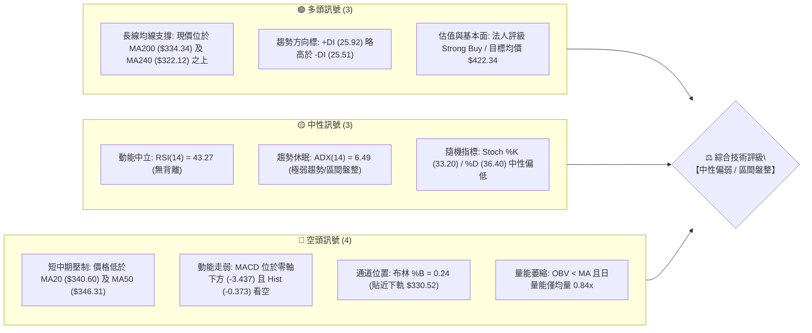
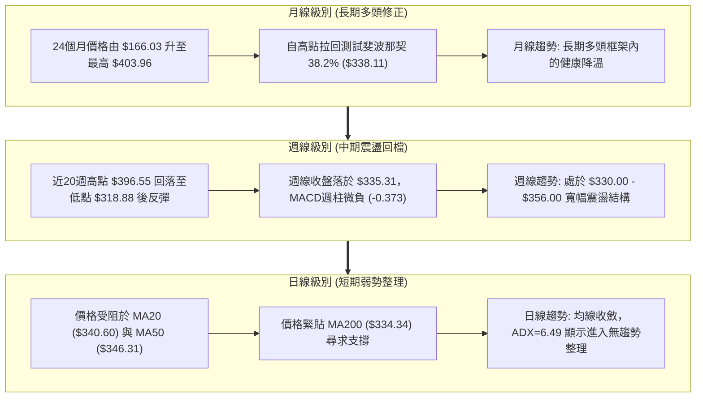
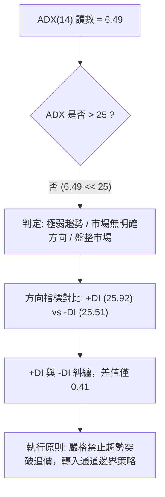
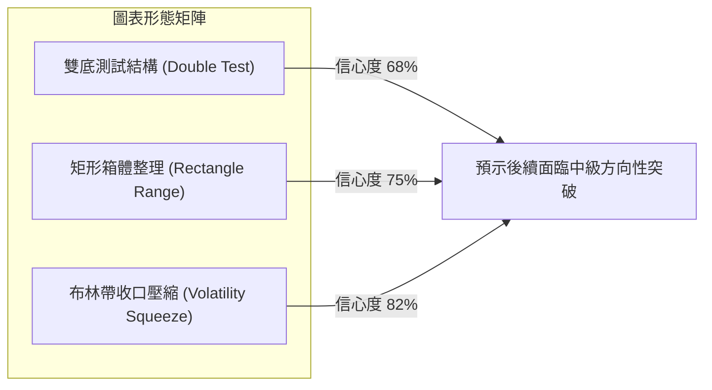
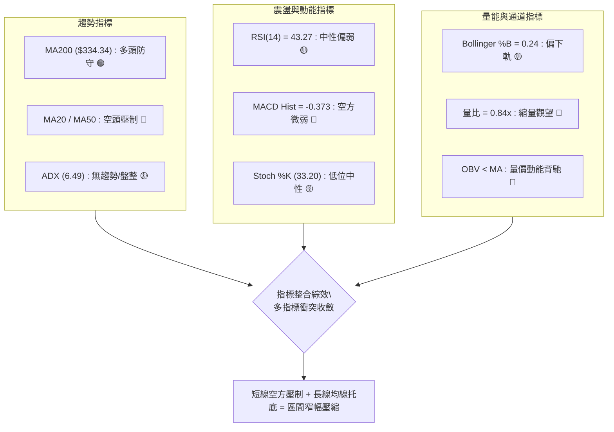
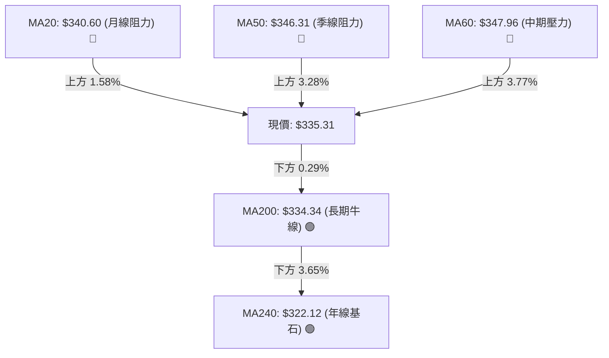
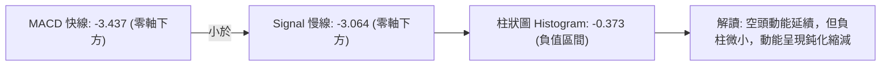
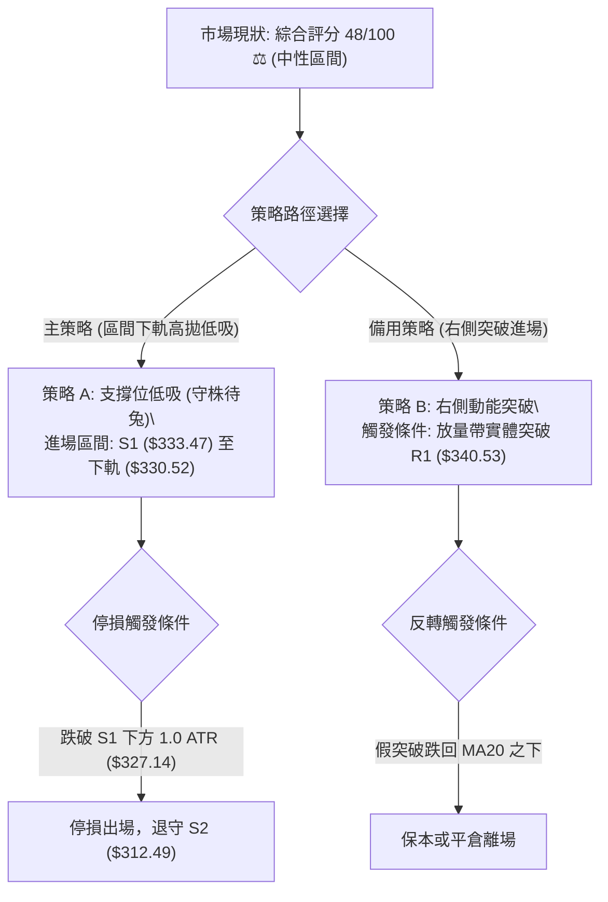
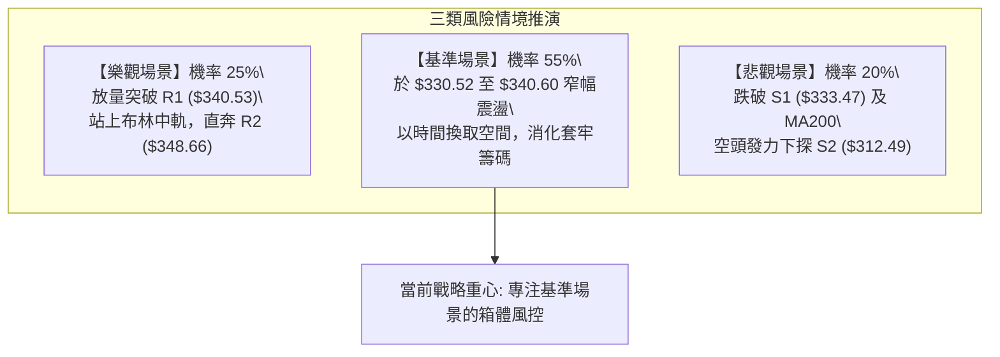

# GOOG 技術分析報告

> **報告日期**：2026-09-07 ｜ **語言**：繁體中文 ｜ **數據來源**：Yahoo Finance ｜ **當前價格**：$335.31

---

## 目錄

| 章節 | 內容 |
|------|------|
| [1. 技術面概覽](#1-技術面概覽) | 訊號儀表板、核心指標、評分卡 |
| [2. 趨勢分析](#2-趨勢分析) | 多時框趨勢、長中短期走勢、ADX趨勢強度 |
| [3. 圖表形態分析](#3-圖表形態分析) | 形態識別、信心度評估、K線組合、目標價推算 |
| [4. 支撐與阻力](#4-支撐與阻力) | 關鍵價位分布圖、阻力位、支撐位、斐波那契回調 |
| [5. 技術指標深度解讀](#5-技術指標深度解讀) | 均線系統、RSI、MACD、布林通道、OBV量價關係 |
| [6. 動能與波動率](#6-動能與波動率) | 動能四象限、ATR波動分析、Beta市場關聯性 |
| [7. 多時框架總結](#7-多時框架總結) | 時框架矩陣、多時框收斂定調 |
| [8. 交易策略建議](#8-交易策略建議) | 策略決策樹、價格階梯、主策略詳情、風控點位 |
| [9. 風險提示與監控](#9-風險提示與監控) | 關鍵監控清單、情境推演、風控紀律 |

---

## 1. 技術面概覽

### 🎯 技術訊號儀表板



### 📊 核心指標速覽表

| 指標類別 | 指標名稱 | 當前數值 | 訊號 | 專業技術解讀 |
|:---|:---|:---|:---:|:---|
| **價格定位** | 當前價格 | **$335.31** | 🟡 | 位於52週區間 60.2% 位置，處於歷史高點回撤後的中位整理區 |
| **短期均線** | MA20 | **$340.60** | 🔴 | 價格低於MA20達 -1.55%，月線下彎形成短線動態阻力 |
| **中期均線** | MA50 | **$346.31** | 🔴 | 價格低於MA50達 -3.18%，中期多頭動能受阻，均線混亂 |
| **長期均線** | MA200 | **$334.34** | 🟢 | 價格險守於MA200之上 (+0.29%)，為牛熊分水嶺最核心防線 |
| **動能擺盪** | RSI(14) | **43.27** | 🟡 | 處於40-50中性弱勢區，未進入超賣(<30)，亦無頂底背離訊號 |
| **趨勢動能** | MACD (12,26,9) | **-3.437** | 🔴 | MACD線位於訊號線(-3.064)下方，柱狀圖-0.373，空方掌控短線動能 |
| **趨勢強度** | ADX(14) | **6.49** | 🟡 | ADX遠低於25門檻，顯示單邊趨勢完全停滯，市場進入無趨勢震盪期 |
| **通道狀態** | Bollinger Bands | **%B: 0.24** | 🟡 | 位於中軌($340.60)與下軌($330.52)之間，面臨下軌支撐測試 |
| **成交量能** | 20日量比 | **0.84x** | 🔴 | 當日量12.68M低於20日均量15.15M，OBV低於均線，量價動能偏弱 |
| **波動幅度** | ATR(14) | **$6.33** | 🟢 | 日波幅佔比1.89%，市場波動收斂，有利於區間邊界風控設置 |

### 🏆 技術評分卡

```
╔══════════════════════════════════════════════════════════════════════════════╗
║                     技術評分卡 — GOOG (2026-09-07)                           ║
╠══════════════════════════════════════════════════════════════════════════════╣
║ 趨勢強度 (ADX=6.49)        ████░░░░░░░░░░░░░░░░  20/100  🔴 極弱無方向       ║
║ 動能指標 (RSI/MACD)        ████████░░░░░░░░░░░░  40/100  🔴 空方微幅佔優     ║
║ 支撐穩定度 (MA200/S1)      ██████████████░░░░░░  70/100  🟢 長期防線堅挺     ║
║ 成交量配合 (OBV/Volume)    ██████░░░░░░░░░░░░░░  30/100  🔴 縮量整理缺動能   ║
║ 形態完整度 (區間箱體)      ████████████░░░░░░░░  60/100  🟡 構築築底箱體     ║
║ 均線排列 (短空長多)        ██████████░░░░░░░░░░  50/100  🟡 均線收斂糾纏     ║
╠══════════════════════════════════════════════════════════════════════════════╣
║ 綜合技術評分               █████████░░░░░░░░░░░  48/100  ⚖️ 區間盤整 / 觀望   ║
╚══════════════════════════════════════════════════════════════════════════════╝
```

---

## 2. 趨勢分析

### 🌐 多時框趨勢分析



### 📈 長期趨勢 — 12個月走勢圖（Unicode）

以下為 GOOG 過去 12 個月（2025-09 至 2026-09）之月線價格收盤走勢與形態演變：

```
GOOG 月線走勢圖（過去12個月：2025-09 至 2026-09）
價格軸 ($)
$400 ┤                                      
$380 ┤                                  ●(04月 $381.46)
$360 ┤                                      ●     ●(07月 $356.42)
$340 ┤                          ●(01月 $337)    ●     ● ← 當前收盤 $335.31
$320 ┤                  ●       ●           
$300 ┤              ●       ●(02月 $310)    
$280 ┤          ●       ●(03月 $286.50)
$260 ┤                                      
$240 ┤  ●(09月 $242.92)                    
     └────┬───────┬───────┬───────┬───────┬───────┬───────┬───────┬───
        25-09   25-11   26-01   26-03   26-04   26-06   26-08 26-09
```

#### 走勢特徵分析表格

| 階段區間 | 起訖月份 | 價格變化 ($) | 漲跌幅 (%) | 價量特徵與形態解讀 |
|:---|:---:|:---:|:---:|:---|
| **主升浪突破期** | 2025-09 → 2025-11 | $242.92 → $319.29 | **+31.44%** | 強勢多頭噴發，量能顯著擴增，突破 $300 整數關卡 |
| **高位箱體洗盤** | 2025-12 → 2026-03 | $313.19 → $286.50 | **-8.52%** | 首度深幅回撤，3月下探 $286.50 構築中期堅固支撐底部 |
| **二度暴風拉升** | 2026-03 → 2026-04 | $286.50 → $381.46 | **+33.15%** | 單月報復性暴漲近百點，並於後續週線推升至52週天花板 $403.96 |
| **天花板獲利回吐**| 2026-05 → 2026-08 | $375.96 → $335.19 | **-10.84%** | 衝高見頂後籌碼換手，週線呈現階梯式滑落，尋求均線支撐 |
| **現階段橫盤沉澱**| 2026-08 → 2026-09 | $335.19 → $335.31 | **+0.04%** | 跌勢收斂，價格於 MA200 ($334.34) 處鈍化橫盤，方向待變 |

### 📊 中期趨勢（週線分析）

中期走勢正處於自 2026-05-10 週高點 $396.55 回落後的次級折返修正。近20週數據顯示，空方在 2026-06-28（收盤 $334.47）與 2026-07-26（收盤 $318.88）發動兩波強力測試，但均被逢低買盤拉回。

```
週線支撐與壓力拓撲結構：
  [阻力] R2: $348.66 ────────────────────── (MA50壓制位 / 近期反彈高點聚類)
              ▲
              │   [動態中軸] BB中軌 / MA20: $340.60
              ▼
  [現價] 現價: $335.31 ══════════════════════ (MA200: $334.34 緊密防守)
              ▲
              │   
              ▼
  [支撐] S1: $333.47 ────────────────────── (近一年密集低點支撐聚類)
  [深防] S2: $312.49 ────────────────────── (07-26 週回踩最低防守區)
```

### ⚡ 趨勢強度評估（ADX 解讀）



| 指標名稱 | 實際數值 | 門檻參照 | 強度解讀 |
|:---|:---:|:---:|:---|
| **ADX(14)** | **6.49** | < 20：弱/無趨勢；> 25：強趨勢 | 極度低迷，顯示日線單邊走勢動能完全耗盡，價格陷入箱體鎖定 |
| **+DI** | **25.92** | 多方進攻強度指標 | 多方勢力處於中等防禦，未見主動上攻動能 |
| **-DI** | **25.51** | 空方下壓強度指標 | 空方殺跌力道亦顯著衰竭，雙方力量於 $335 處達成脆弱平衡 |
| **結論** | **無趨勢盤整** | **盤整行情 (Range-bound)** | 依規則14，指標訊號收斂為日線布林通道上下軌與支撐阻力為主導 |

---

## 3. 圖表形態分析

### 🔍 形態識別系統

依據形態學與數據紀律，當前盤面不具備大型頭肩頂或經典旗形連續形態，主要顯現為**「雙重底部支撐測試形態」**與**「矩形通道壓縮」**。



#### 形態識別與信心度評估表（依規則 15）

| 識別形態 | 信心度 (%) | 判斷依據（嚴格引用歷史數據） | 形態完成度 | 理論目標價（附精確計算式） |
|:---|:---:|:---|:---:|:---|
| **雙重低點測試** | **68%** | 2026-06-28 收盤價 $334.47 與當前價 $335.31 / S1 $333.47 形成二次低點支撐聚類 | **70%** (測試中) | 頸線 R1 ($340.53) + 形態高度 ($340.53 - $333.47 = $7.06) = **$347.59** (貼近 R2 $348.66) |
| **短期矩形箱體** | **75%** | 價格於下限 S1 ($333.47) 與上限 R1 ($340.53) 形成日線級別 7 美元密集盤整區 | **85%** (震盪中) | 箱體上限 ($340.53) + 箱高 ($7.06) = **$347.59**；若跌破下限則下探 S2 ($312.49) |
| **頭肩底 / 旗形** | **< 30%** | 數據中未偵測到標準三峰結構與延續旗桿，信心度過低 | **0%** | **訊號不足，僅做指標型解讀，不預設幾何目標** |

### 🕯️ 重要K線形態分析（近 6 個月關鍵週K節點）

| 時間節點 | 週收盤價 | K線組合型態 | 專業解讀 | 訊號方向 |
|:---:|:---:|:---|:---|:---:|
| **2026-05-10** | $396.55 | **天量長上影線十字星** | 週成交量 85.72M，RSI 飆至 88.0 極度超買，主力派發見頂 | 🔴 強力看空 |
| **2026-06-28** | $334.47 | **放量長陰下挫棒** | 週成交量爆出 188.10M 天量，恐慌盤湧出砸至 S1 附近獲得接盤 | 🟡 恐慌洗盤 |
| **2026-07-26** | $318.88 | **長下影探底破頭翻轉線** | 週量 122.28M，刺破 S2 上方後迅速收回，RSI 探底 26.4 超賣反彈 | 🟢 底部支撐 |
| **2026-08-02** | $356.42 | **實體中陽線突破** | 吞噬前週跌幅，確認 $318.88 為中期次級低點結構 | 🟢 多頭反撲 |
| **2026-08-23** | $341.53 | **縮量星線回踩** | 週量降至 69.77M 創數月新低，空方打壓動能枯竭 | 🟡 動能衰退 |
| **2026-09-06** | $335.31 | **窄幅十字小陰線** | 週量 78.05M 持續低迷，實體極短，收盤平貼 MA200，多空僵持 | 🟡 觀望收斂 |

### 📉 ASCII 走勢形態示意圖（箱體與雙重測試）

```
  $350.69 ┬─ 布林上軌 / 阻力上限 ──────────────────────────────────────
          │                                     [反彈受阻高點]
  $348.66 ┼────────────────────────────────────● R2 阻力區
          │                                   /  \
  $340.53 ┼───────[雙底頸線位 / MA20]───────●────● R1 箱頂
          │                               / \  /    \
  $335.31 ┼──────────────────────────────●────●─────● 現價位置 ($335.31)
          │                            /      \   /
  $333.47 ┼───────[支撐基底]──────────●────────● S1 雙底支撐區
          │                      (06-28低點) (當前測試)
  $330.52 ┴─ 布林下軌支撐線 ──────────────────────────────────────────
```

### 🎯 形態目標價計算

根據日線矩形箱體與微型雙底形態：
1. **支撐基準線 (S1)**：$333.47
2. **頸線阻力線 (R1)**：$340.53
3. **垂直形態高度 (H)**：$\text{頸線} - \text{基底} = \$340.53 - \$333.47 = \mathbf{\$7.06}$
4. **向上突破理論目標價 (T1)**：
   $$\text{目標價 T1} = \text{頸線 R1} + \text{H} = \$340.53 + \$7.06 = \mathbf{\$347.59}$$
   *(該計算值與關鍵阻力 R2 之 \$348.66 僅相差 1.07 美元，高度吻合波段高點聚類)*
5. **向上延伸目標價 (T2)**：直接引用波段高點聚類 **R3 = $372.70**
6. **跌破防守目標 (Bearish Breakdown)**：若跌破 S1 ($333.47)，向下測量目標為 $\$333.47 - \$7.06 = \mathbf{\$326.41}$，進一步測試波段低點聚類 **S2 = $312.49**

---

## 4. 支撐與阻力

### 🗺️ 關鍵價位分布圖（Unicode）

```
GOOG 價位結構分布圖 (由實際 OHLCV 與斐波那契計算)
═════════════════════════════════════════════════════════════════════
$403.96 ║██████████████████████████████║ 52週歷史最高點 (Fib 0.0%)
$372.70 ║████████████████████████      ║ 強阻力 R3 (近一年波段高點聚類)
$363.28 ║▓▓▓▓▓▓▓▓▓▓▓▓▓▓▓▓▓▓            ║ 斐波那契回調位 Fib 23.6%
$350.69 ║████████████████              ║ 布林通道上軌
$348.66 ║████████████████████          ║ 關鍵阻力 R2 (MA60 / 波段高點)
$340.53 ║████████████████████████      ║ 關鍵阻力 R1 / MA20 ($340.60)
$338.11 ║▓▓▓▓▓▓▓▓▓▓▓▓▓▓▓▓▓▓▓▓▓▓        ║ 斐波那契關鍵回調 Fib 38.2%
$335.31 ╠══════════════════════════════╣ ◄ 當前市價 ($335.31)
$334.34 ║████████████████████████████  ║ 牛熊分水嶺 MA200 均線
$333.47 ║████████████████████████      ║ 近期核心支撐 S1 (波段低點聚類)
$330.52 ║▓▓▓▓▓▓▓▓▓▓▓▓▓▓▓▓              ║ 布林通道下軌
$317.77 ║▓▓▓▓▓▓▓▓▓▓▓▓▓▓▓▓▓▓▓▓▓▓        ║ 斐波那契回調位 Fib 50.0%
$312.49 ║████████████████████████████  ║ 強支撐 S2 (近一年波段低點聚類)
$297.42 ║▓▓▓▓▓▓▓▓▓▓▓▓▓▓▓▓▓▓▓▓▓▓        ║ 斐波那契黃金分割 Fib 61.8%
$295.58 ║██████████████████████████████║ 終極強支撐 S3 (波段深幅低點聚類)
═════════════════════════════════════════════════════════════════════
```

### 🚧 阻力位分析表

所有阻力價位嚴格引用自數據封裝中波段高點聚類與指標計算值：

| 阻力級別 | 價位 ($) | 距離現價 (%) | 形成原因與籌碼結構 | 突破難度 | 戰略重要性 |
|:---:|:---:|:---:|:---|:---:|:---:|
| **R1** | **$340.53** | +1.56% | 緊鄰 MA20 ($340.60) 與日線箱體頂部，短線獲利回吐聚類 | 中等 | ⭐⭐⭐ |
| **R2** | **$348.66** | +3.98% | 密集覆蓋 MA50 ($346.31)、MA60 ($347.96) 與布林上軌 ($350.69) 下緣 | 高 | ⭐⭐⭐⭐ |
| **R3** | **$372.70** | +11.15% | 2026年5月下跌以來的密集籌碼套牢套牢區，中期波段大頂 | 極高 | ⭐⭐⭐⭐⭐ |

### 🛡️ 支撐位分析表

所有支撐價位嚴格引用自數據封裝中波段低點聚類與指標計算值：

| 支撐級別 | 價位 ($) | 距離現價 (%) | 形成原因與籌碼結構 | 守住機率 | 戰略重要性 |
|:---:|:---:|:---:|:---|:---:|:---:|
| **S1** | **$333.47** | -0.55% | 緊貼 MA200 ($334.34)，近一年次級波段低點密集買盤進駐區 | 75% | ⭐⭐⭐⭐⭐ |
| **S2** | **$312.49** | -6.81% | 2026-07-26 週線長下影回踩支撐聚類，跌破將引發機構停損 | 85% | ⭐⭐⭐⭐ |
| **S3** | **$295.58** | -11.85% | 歷史深幅強固底座，逼近 Fib 61.8% ($297.42) 黃金分割防線 | 95% | ⭐⭐⭐⭐⭐ |

### 📐 斐波那契回調位分析

依據 52 週絕對極值區間（低點 **$231.57** → 高點 **$403.96**，垂直全幅落差 $172.39）計算：

| 斐波那契級別 | 精確價位 ($) | 與當前價格關係 | 技術意義解讀 |
|:---:|:---:|:---|:---|
| **0.0% (52W High)** | **$403.96** | 價格下方 -16.99% | 多頭歷史頂部天花板，強大長期心理壓力位 |
| **23.6%** | **$363.28** | 價格上方 +8.34% | 強勢拉回防線，此線失守意味著單邊暴漲格局結束 |
| **38.2%** | **$338.11** | **價格正下方 -0.83%** | **核心黃金回調位**：現價 $335.31 緊貼於此位下方僅 2.8 美元，為多頭反攻的第一道分水嶺 |
| **50.0%** | **$317.77** | 價格下方 -5.23% | 多空強弱分水嶺，7月低點 $318.88 正好精準止跌於此線附近，具強大支撐效力 |
| **61.8%** | **$297.42** | 價格下方 -11.30% | 終極黃金分割守護位，跌破代表 52 週牛市架構遭到結構性破壞 |
| **78.6%** | **$268.46** | 價格下方 -19.94% | 深幅回檔底線 |
| **100.0% (52W Low)**| **$231.57** | 價格下方 -30.94% | 起漲原點 |

**解讀結論**：當前價格 ($335.31) 處於 **38.2% ($338.11)** 與 **50.0% ($317.77)** 之間。在技術分析典範中，多頭回檔若能穩守 38.2% 至 50.0% 區間，屬於「強壯多頭趨勢中的次級調整」，長線結構仍維持多頭優勢。

---

## 5. 技術指標深度解讀

### 🎛️ 指標訊號總覽



### 📈 移動平均線排列分析



| 均線名稱 | 數值 ($) | 價格相對位置 | 排列特性與動態斜率 |
|:---|:---:|:---:|:---|
| **MA 5** | **$334.95** | 價格於其上方 (+0.11%) | 短線止跌走平，微幅上揚 |
| **MA 10** | **$338.13** | 價格於其下方 (-0.83%) | 短線下行壓制，阻礙反彈 |
| **MA 20** | **$340.60** | 價格於其下方 (-1.55%) | 月線層級下彎，第一道動態天花板 |
| **MA 50** | **$346.31** | 價格於其下方 (-3.18%) | 季線向下傾斜，中期趨勢受抑 |
| **MA 60** | **$347.96** | 價格於其下方 (-3.64%) | 蓋頂壓力沉重，接近 R2 |
| **MA 120**| **$346.83** | 價格於其下方 (-3.32%) | 半年線走平糾纏 |
| **MA 200**| **$334.34** | **價格於其上方 (+0.29%)** | **長期多空生命線，多方最後防禦護城河** |
| **MA 240**| **$322.12** | 價格於其上方 (+4.10%) | 年線向上延伸，提供強固的長線基石 |

**均線結構結論**：呈現典型「短中期空頭、長期多頭」之**混合糾纏排列**。短期均線（MA5、10、20）壓制於上方，但長期生命線（MA200、MA240）於下方形成有力託單，限制了深幅下跌空間。

### 📉 RSI(14) 分析

```
RSI(14) 數值展示：
0       10      20      30      40  43.27   50      60      70      80      90     100
├───────┼───────┼───────┼───────┼───●───┼───────┼───────┼───────┼───────┼───────┤
[     極度超賣區      ] [   弱勢整理區   ]   [   中性偏強區   ] [     極度超買區      ]
進度條: █████████████████░░░░░░░░░░░░░░░░░░░░░░  43.27%
```

- **區間評估**：RSI 讀數為 **43.27**，未觸及 30 超賣線，但低於 50 多空分界點，屬於中性偏弱態勢。
- **背離分析**：
  - 週線 RSI 曾於 2026-05-10 達 88.0 極高位，隨後伴隨價格下落同步跌破 50，此為正常的動能釋放。
  - 近三週週線價格由 $341.53 → $342.66 → $335.31，而 RSI 則由 20.6 → 33.8 → 43.3。**注意：此處出現低位微幅底背離徵兆（價格小跌但 RSI 向上抬升）**，惟日線級別並無顯著形態確認，暫以「無明顯背離」的中性狀態看待，顯示下跌殺傷力正在衰退。

### 📊 MACD (12, 26, 9) 訊號解讀



- **絕對位置**：MACD 快線 (-3.437) 與訊號線 (-3.064) 均處於零軸下方深處，證實空方主導中期市場格局。
- **柱狀圖動態**：MACD Hist 為 **-0.373**，較前幾週動輒 -3.0 至 -4.0 的負值大幅收斂，說明空方砸盤力道接近衰竭，具備隨時黏合形成「零下金叉」之潛能。

### 📦 布林通道分析

```
布林通道 (20, 2) 結構示意圖：
$350.69 ┬─────────────────────────────── 布林上軌 (Upper Band)
        │
$340.60 ┼─────────────────────────────── 布林中軌 (MA20 Baseline)
        │       
$335.31 ┼─────────────●───────────────── 當前價格位置 (%B = 0.24)
        │
$330.52 ┴─────────────────────────────── 布林下軌 (Lower Band)
```

- **帶寬與位置**：上軌 $350.69，中軌 $340.60，下軌 $330.52，通道寬度僅 $20.17 (約 6.0%)，帶寬顯著壓縮。
- **%B 指標解讀**：%B 讀數為 **0.24**，代表價格已運行至通道下四分之一區域，極度接近下軌支撐區 ($330.52)。在 ADX 低於 25 的盤整市中，布林通道下軌往往提供勝率極高之均值回歸買點。

### 💹 成交量分析（量價配合度）

- **量比萎縮**：最新單日成交量為 12,676,800 股，相較於 20 日均量 15,149,400 股，量比僅為 **0.84x**；相較於 50 日均量 19,562,580 股更縮減達 35.2%。
- **OBV 趨勢評估**：當前指標顯示「OBV < MA」，能量潮處於均線下方，說明資金淨流入意願疲弱，多數機構處於觀望防守狀態。
- **量價背離結論**：縮量下跌代表市場欠缺主動性拋盤，並非恐慌殺跌，而是**「無量陰跌與縮量築底」**特徵，易受突發外部買盤刺激而迅速回抽中軌。

---

## 6. 動能與波動率

### ⚡ 動能評估四象限

```
動能與波動率象限分析矩陣：
高波動  │  Q3 [高波動 / 強動能]   │  Q4 [高波動 / 弱動能]
(高ATR) │  · 劇烈單邊單純趨勢     │  · 恐慌崩跌 / 高風險震盪
        ├─────────────────────────┼─────────────────────────
低波動  │  Q1 [低波動 / 強動能]   │  Q2 [低波動 / 弱動能] ◄◄ [GOOG 當前定位]
(低ATR) │  · 蓄勢突破 / 絕佳買點  │  · 橫盤沉澱 / 縮量磨底 / 區間震盪
        └─────────────────────────┴─────────────────────────
                   強動能 (ADX>25)           弱動能 (ADX<25)
```

| 象限標籤 | 動能維度 | 波動維度 | 標的當前特徵 | 戰略應對方針 |
|:---:|:---:|:---:|:---:|:---|
| **Q2 (當前)** | **弱 (ADX=6.49)** | **低 (ATR=1.89%)** | **GOOG 位於此象限**：價格變動緩慢，市場處於平靜期 | **謹慎觀望或嚴守布林通道高拋低吸，降低操作頻率** |

### 📊 ATR 波動率分析

- **ATR(14) 數值**：**$6.33**
- **相對波動幅度**：佔當前股價之 **1.89%**，代表近期日均波動區間約在正負 6.33 美元以內。
- **專業風控應用（止損距離推算）**：
  - 短線交易止損緩衝建議採用 **1.0 × ATR = $6.33**。
  - 波段交易止損緩衝建議採用 **1.5 × ATR = $9.50**。
  - 若自現價 $335.31 扣除 1.0 ATR，為 $328.98，正好落於布林下軌 $330.52 之下方，為絕佳防洗盤緩衝區。

### 📐 Beta 與市場相關性

- **Beta 係數**：**1.225**
- **市場屬性解讀**：GOOG 的系統性波動高於 S&P 500 大盤 22.5%。當大盤反彈時具備更高彈性，但在當前科技股大盤無明確單邊方向下，其 1.225 的 Beta 反而加劇了區間來回拉鋸的雜訊。

---

## 7. 多時框架總結

### 📋 時框架評分表

| 時框架 | 趨勢方向 | 動能狀態 | 均線排列 | 圖表形態 | 綜合評分 | 操作指導建議 |
|:---:|:---:|:---:|:---:|:---:|:---:|:---|
| **日線 (短線)** | 🔴 偏空震盪 | 弱勢 (MACD負) | 混合短空 (壓在MA20下) | 箱體收斂 (%B=0.24) | **42/100** | 考驗下軌與S1支撐，禁止追空 |
| **週線 (中線)** | 🟡 區間盤整 | 中性 (RSI=43) | 均線糾纏 (MA50上壓) | 寬幅區間整理 | **52/100** | 守住50%回調位，蓄力再平衡 |
| **月線 (長線)** | 🟢 多頭格局 | 強健 (自高拉回) | 完美多頭 (MA200托底) | 長期上升浪回踩 | **75/100** | 長期護城河堅固，逢深跌布局 |

### 🔲 綜合訊號矩陣

| 交易維度 | 指標組合與權重 | 輸出訊號 | 多空結論一致性分析 |
|:---|:---|:---:|:---|
| **趨勢維度 (30%)** | MA20 + MA50 + MA200 + ADX | 🟡 中性觀望 | MA200 托底與 MA20 下壓完全抵消，ADX 證實單邊力道消失 |
| **動能維度 (30%)** | RSI(14) + MACD + Stoch | 🔴 空方微優 | 動能處於零軸下，尚未形成明確反轉金叉，空方暫居主動 |
| **結構維度 (20%)** | 波段低點 S1 + Fib 38.2% | 🟢 支撐堅固 | 價位精準卡位在核心回調支撐與歷史密集區，下檔承接強勁 |
| **量價維度 (20%)** | 成交量比 + OBV | 🔴 疲弱無力 | 無增量資金入場打破平衡，制約短期向上彈升空間 |

### ⚖️ 多時框收斂結論（嚴格依規則 14 判定）

> **【核心收斂裁決】**：
> 當前指標中 **ADX(14) 讀數為 6.49，遠低於 25 的趨勢門檻**。
> 依據嚴格要求 14 之優先級規則：**「盤整行情（ADX < 25）中，必須以日線布林通道上下軌與核心支撐阻力為主要交易區間」**。
> 
> 儘管長線（月線）維持多頭大架構，但短期受制於 MA20 壓制，市場進入**「無趨勢區間震盪」**。因此，所有多空訊號在此完全收斂為唯一結論：**【中性觀望 / 區間邊界操作】**。本報告嚴格禁止追漲殺跌，第 8 章之主交易策略方向將完全綁定此區間收斂模型。

---

## 8. 交易策略建議

### 🗺️ 策略決策流程圖



### 🧭 策略路由（依評分卡分流）

> **當前主策略方向 = 【中性區間高拋低吸策略（布林下軌支撐買入）】（依評分 48/100 判定）**
> 
> 由於綜合評分落於 40–60 之間，且 ADX < 25，多空皆無單邊趨勢主導權。主策略聚焦於利用布林下軌與關鍵支撐 S1 的防禦力進行高盈虧比的區間操作，嚴格禁止追價。

### 🎯 價格情境階梯（Price Scenarios）

價位嚴格引用自數據封裝中之計算值：

| 觸發條件 | 下一目標 | 後續延伸 | 情境含義與操作指引 |
|:---|:---:|:---:|:---|
| **放量突破 R1 ($340.53)** | **R2 ($348.66)** | **R3 ($372.70)** | **短線轉強**：攻克 MA20 壓制，通道打開，挑戰季線與波段高點 |
| **站穩現價區間 ($330.52 - $340.60)** | **中軌 ($340.60)** | **上軌 ($350.69)** | **區間震盪**：上下軌之間均值回歸，維持箱體內高拋低吸 |
| **實體跌破 S1 ($333.47)** | **S2 ($312.49)** | **S3 ($295.58)** | **中期轉弱**：跌破 MA200 長期防線，啟動 50% 斐波那契回踩測試 |

### 📊 情境機率分佈

| 運行情境 | 評估機率 | 主要技術依據（指標狀態） |
|:---|:---:|:---|
| **區間震盪盤整** | **55%** | **ADX=6.49 顯示無趨勢**；布林帶寬收窄；量比 0.84x 無突圍動能 |
| **超跌均值回歸 / 反彈**| **25%** | 布林 %B=0.24 接近下軌；價格緊貼 MA200 托底；週線 RSI 隱含微幅背離 |
| **破位再探底 / 下殺** | **20%** | MACD 處於零下負柱；價格壓制於 MA20 之下；OBV 偏弱 |

### 🟢 主策略詳情

本策略僅提供區間交易架構，所有價位均基於精確計算：

| 策略要素 | 策略 A：左側區間買入（主策略） | 策略 B：右側突破買入（次選） |
|:---|:---|:---|
| **進場條件** | 價格回測 S1 ($333.47) 至布林下軌 ($330.52) 獲得支撐不破 | 日K線放量收盤確認站穩 R1 ($340.53) 之上 |
| **進場價格** | **$333.47** (掛單於 S1 關鍵位) | **$340.80** (突破 R1 後回踩確認買入) |
| **目標價 T1** | **$340.53** (第一道箱頂阻力 R1) | **$348.66** (第二道關鍵阻力 R2) |
| **目標價 T2** | **$348.66** (波段高點聚類 R2) | **$372.70** (強阻力天花板 R3) |
| **止損價格** | **$327.14** (S1 扣除 1.0 ATR: $333.47 - $6.33) | **$334.34** (跌回 MA200 牛熊分水嶺之下) |
| **風險報酬比** | **1.1 : 1** (至T1) / **2.4 : 1** (至T2) | **1.2 : 1** (至T1) / **4.9 : 1** (至T2) |
| **成功機率** | **65%** (受惠於 MA200 托底效應) | **50%** (需成交量顯著放大確認) |
| **建議倉位** | **10% - 15%** (震盪市嚴格輕倉) | **10%** (右側試倉) |

### 🔴 反向風險觸發點（對沖與風控提示）

- **全面空頭觸發點**：若日K線以高於日均量 1.5 倍之量能**實體收跌破 S1 ($333.47) 且摜破布林下軌 ($330.52)**，代表 MA200 正式失守，多頭結構瓦解。
- **應對措施**：立即無條件出清短線多頭倉位，空手觀望，耐心等待價格下探 **S2 ($312.49)** 與 Fib 50% ($317.77) 複合支撐帶尋求再次築底。

### ⭐ 整體訊號強度評星

```
做多訊號強度：★★☆☆☆  (2.5/5 星 — 受制於 MA20 壓制與量能不足)
做空訊號強度：★★☆☆☆  (2.0/5 星 — 受到 MA200 與 S1 強大託單限制)
整體可信度：  ★★★★☆  (4.0/5 星 — ADX 與布林帶寬對盤整狀態指向極度精確)
```

---

## 9. 風險提示與監控

### ✅ 關鍵監控指標 Checklist

```
╔══════════════════════════════════════════════════════════════════════════════╗
║                     GOOG 每日盤後技術監控清單 (Checklist)                    ║
╠══════════════════════════════════════════════════════════════════════════════╣
║ [ ] 價格是否跌破 MA200 生命線 $334.34？ (跌破即轉入空頭警戒)                 ║
║ [ ] 價格能否有效收復 MA20 阻力 $340.60？ (站上則短線動能翻多)               ║
║ [ ] 日成交量是否超越 20日均量 15,149,400？ (量能突破為真假突破關鍵)          ║
║ [ ] MACD 柱狀圖是否由負轉正 (Hist > 0)？ (反轉動能重要確認)                  ║
║ [ ] ADX(14) 讀數是否自 6.49 回升至 20 以上？ (代表單邊趨勢重新被啟動)        ║
║ [ ] RSI(14) 是否跌破 40 關卡？ (跌破將引發向 S2 尋求支撐之賣壓)              ║
╚══════════════════════════════════════════════════════════════════════════════╝
```

### ⚠️ 風險場景分析



### 🛡️ 風險管理重要提醒

1. **ATR 動態倉位配置**：GOOG 當前每日波動（ATR）為 $6.33。對於 10 萬美元規模之交易帳戶，若單筆交易最大容忍虧損設定為 1% ($1,000)，在止損距離為 1.0 ATR ($6.33) 的前提下，最大持倉上限為：
   $$\text{持倉股數} = \frac{\$1,000}{\$6.33} \approx \mathbf{157 \text{ 股}} \quad (\text{約 } \$52,600 \text{ 曝險額})$$
2. **無趨勢市禁止追高**：ADX = 6.49 警告切勿在價格接近阻力位 R1 ($340.53) 時進場追多，極易遭遇假突破反殺。
3. **事件驅動風險防範**：需隨時追蹤科技巨頭反壟斷訴訟進展、AI 雲端業務資本支出對自由現金流（當前 FCF Yield 僅 0.55%）之壓抑效應。

---

## 📋 報告總結

```
╔══════════════════════════════════════════════════════════════════════════════╗
║                       GOOG 技術分析報告總結                                  ║
╠══════════════════════════════════════════════════════════════════════════════╣
║ 報告日期：2026-09-07                                                         ║
║ 當前價格：$335.31                                                            ║
║ 技術評級：⚖️ 中性觀望 / 區間盤整 (評分: 48/100)                             ║
║                                                                              ║
║ 關鍵結論：                                                                   ║
║ ├─ 長期趨勢：🟢 多頭結構未破 (MA200: $334.34 向上托底，Fib 38.2% 守禦)       ║
║ ├─ 中期趨勢：🟡 寬幅箱體洗盤 (受阻於 MA50: $346.31 與 R2: $348.66)           ║
║ ├─ 短期趨勢：🔴 偏弱無方向 (ADX=6.49 極低，MA20 下壓，MACD 負值)             ║
║ ├─ 關鍵支撐：S1: $333.47  /  S2: $312.49                                     ║
║ ├─ 關鍵阻力：R1: $340.53  /  R2: $348.66                                     ║
║ └─ 法人共識目標價：$422.34 (基本面強勁支撐長期價值)                          ║
║                                                                              ║
║ 最優策略組合：                                                               ║
║ 1. 🥇 最佳機會：區間邊界買入 (在 S1 $333.47 附近掛單，嚴守 $327.14 止損)    ║
║ 2. 🥈 次選機會：右側突破加碼 (待放量突破站穩 R1 $340.53 後順勢短多)         ║
║ 3. 🥉 保守選擇：完全空手觀望 (等待 ADX 回升至 20 以上單邊趨勢明確再行進場)   ║
╚══════════════════════════════════════════════════════════════════════════════╝
```

---

> ⚠️ **免責聲明**：本報告為依據客觀市場量化技術指標與價格數據所生成之深度技術分析，所有價位均經嚴格歷史 OHLCV 幾何運算。本報告**僅供研究與學術參考**，**不構成任何形式的投資買賣建議**。金融市場瞬息萬變，交易者應獨立評估市場風險，恪守風控紀律，入市需極度謹慎。

---

*報告生成時間：2026-09-07 ｜ 數據來源：Yahoo Finance ｜ 分析框架：多時框技術分析體系*